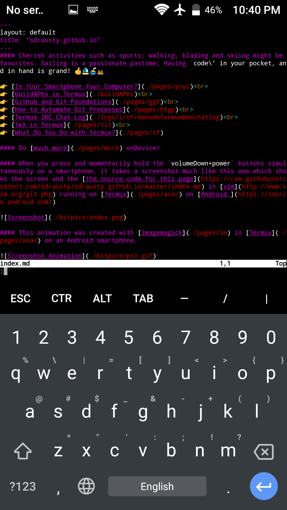

#### Cherish activities such as sports. Walking, blading and skiing maybe favorites. Is sailing a passionate pastime? Having \`code\` in pocket and in palm of hand is grand! 👍⛵🚢 

👉 [au](https://sdrausty.github.io/au/) 
👉 [Is Your Smartphone Your Computer?](./pages/ysyc) 
👉 [buildAPKs in Termux](https://sdrausty.github.io/docsBuildAPKs/) 
👉 [GitHub and Git Foundations](./pages/ggf) 
👉 [How to Automate Git Processes](./pages/htgp) 
👉 [Termux IRC Chat Log](./logs/ircFreenodeTermuxWeechatlog) 
👉 [Sitemap](./sitemap) 
👉 [TermuxArch](https://sdrausty.github.io/TermuxArch/) 
👉 [TeX in Termux](./pages/tit) 
👉 [What Do You Do with Termux?](./pages/tf) 

<!-- #### Do [much more](./pages/more) onDevice!  

-->
#### When you press and momentarily hold the `volumeDown+power` buttons simultaneously on a smartphone, it takes a screenshot much like this one which shows the screen and the [the source code for this page](https://raw.githubusercontent.com/sdrausty/sdrausty.github.io/master/index.md) in [vim](http://www.vim.org/git.php) running on [Termux](./pages/asac) on [Android.](https://source.android.com/)

#### This animation was created with [imagemagick](./pages/im) in [Termux](./pages/asac) on an Android smartphone.

If you're confused by this page try [this link,](https://wiki.termux.com/wiki/Main_Page) or [this link,](http://tldp.org/) or you might want to try [this one.](https://www.debian.org/doc/)

Post your what you have found at [the wiki,](https://github.com/sdrausty/sdrausty.github.io/wiki) [donate](./pages/donate) and help [this website grow!](https://sdrausty.github.io/)

Enjoy the DVR Player in your device `$ while true; do play-audio 2001/2001\ Space\ Odyssey\ -\ Blue\ Danube.mkv; done` with [Termux.](./pages/asac)

Enjoy the DVR Player in your device with [alphaV.webm](https://github.com/sdrausty/sdrausty.github.io/blob/master/audio/alphaV.webm?raw=true) and possibly you shall comprehend. Possibly.

`while true ; do play-audio alphaV.webm ; sleep ${RANDOM::2} ; done`

See https://raw.githubusercontent.com/WAE/WAE/master/wae.bash for a shell script that runs this loop.

<!-- #EOM -->
