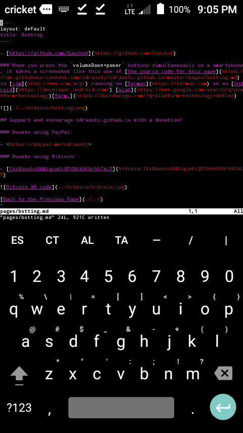

- [https://github.com/Supybot](https://github.com/Supybot)

### When you press the `volumeDown+power` buttons simultaneously on a smartphone, it takes a screenshot like this one of [the source code for this page](https://raw.githubusercontent.com/sdrausty/sdrausty.github.io/master/pages/botting.md) in [vim](http://www.vim.org/) running on [Termux](https://termux.com) on an [Android](https://developer.android.com/) [plat](https://www.google.com/search?q=platform+technology)[form.](https://duckduckgo.com/?q=platform+technology+define)

## Support and encourage sdrausty.github.io with a donation!

### Donate using PayPal:

- <https://paypal.me/sdrausty>

### Donate using Bitcoin:

- [14iBsezkxU4MiqypKcQTXNzthYGrh57eLT](bitcoin:14iBsezkxU4MiqypKcQTXNzthYGrh57eLT)

[Up One Level](./../)
