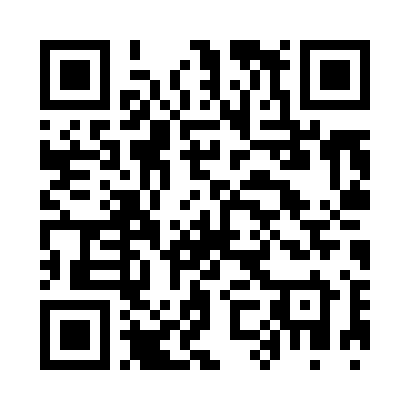
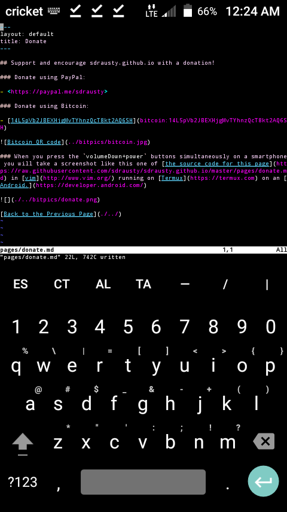

## Support and encourage sdrausty.github.io with a donation!

### Donate using PayPal:

- <https://paypal.me/sdrausty>

### Donate using Bitcoin:

- [14L5pVb2JBEXHjgMvTYhnzQcT8kt2AQ6SH](bitcoin:14L5pVb2JBEXHjgMvTYhnzQcT8kt2AQ6SH)

### When you press the `volumeDown+power` buttons simultaneously on a smartphone you will take a screenshot like this one of [the source code for this page](https://raw.githubusercontent.com/sdrausty/sdrausty.github.io/master/pages/donate.md) in [vim](http://www.vim.org/) running on [Termux](https://termux.com) on an [Android.](https://developer.android.com/)

#### This animation was created with [imagemagick](./im.md) in [Termux](./asac.md) on an Android smartphone.

[Up One Level](./../)
