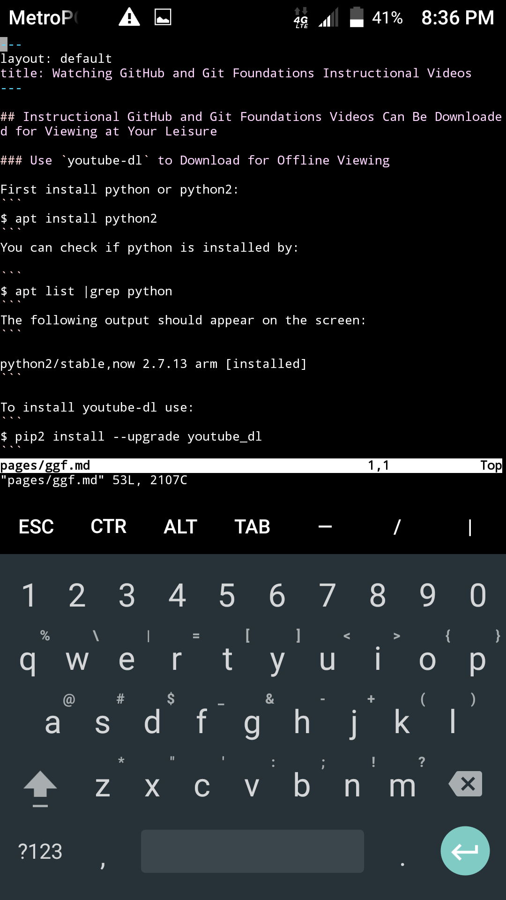

## Instructional GitHub and Git Foundations Videos Can Be Downloaded for Viewing at Your Leisure

### Use `youtube-dl` to Download for Offline Viewing

First install python or python2:
```
$ apt install python2
```
You can check if python is installed by:

```
$ apt list |grep python
```
The following output should appear on the screen:
```

python2/stable,now 2.7.13 arm [installed]
```

To install youtube-dl use:
```
$ pip2 install --upgrade youtube_dl
```
You should see:
```
Collecting youtube_dl

  Downloading youtube_dl-2017.5.1-py2.py3-none-any.whl (1.6MB)

    100% |████████████████████████████████| 1.6MB 115kB/s

Installing collected packages: youtube-dl
```
Once completed; Then simply enter the following to dowload this video series into your favorite folder: 
```
$ youtube-dl https://m.youtube.com/playlist?list=PL0lo9MOBetEHhfG9vJzVCTiDYcbhAiEqL
```
This way you will be able to view Git and GitHub Foundations from your favorite folder at your leisure.

- [GitHub and Git Foundations](https://m.youtube.com/playlist?list=PL0lo9MOBetEHhfG9vJzVCTiDYcbhAiEqL)

### When you press the `volumeDown+power` buttons simultaneously on a smartphone, it takes a screenshot like this one of [the source code for this page](https://raw.githubusercontent.com/sdrausty/sdrausty.github.io/master/pages/ggf.md) in [vim](http://www.vim.org/git.php) running on [Termux](https://termux.com) on an [Android](https://developer.android.com/) [plat](https://www.google.com/search?q=platform+technology)[form.](https://duckduckgo.com/?q=platform+technology+define)



#### This animation was created with [imagemagick](https://www.imagemagick.org/) in [Termux](https://termux.com) on an Android smartphone.


If you're confused by this page try [this link](http://tldp.org/) or you might want to try [this one](https://www.debian.org/doc/). Post your what you have found at [the wiki for this website](https://github.com/sdrausty/sdrausty.github.io/wiki) and [donate](./donate.md) to let [sdrausty.github.io](https://sdrausty.github.io/) grow.

[Up One Level](./../)
