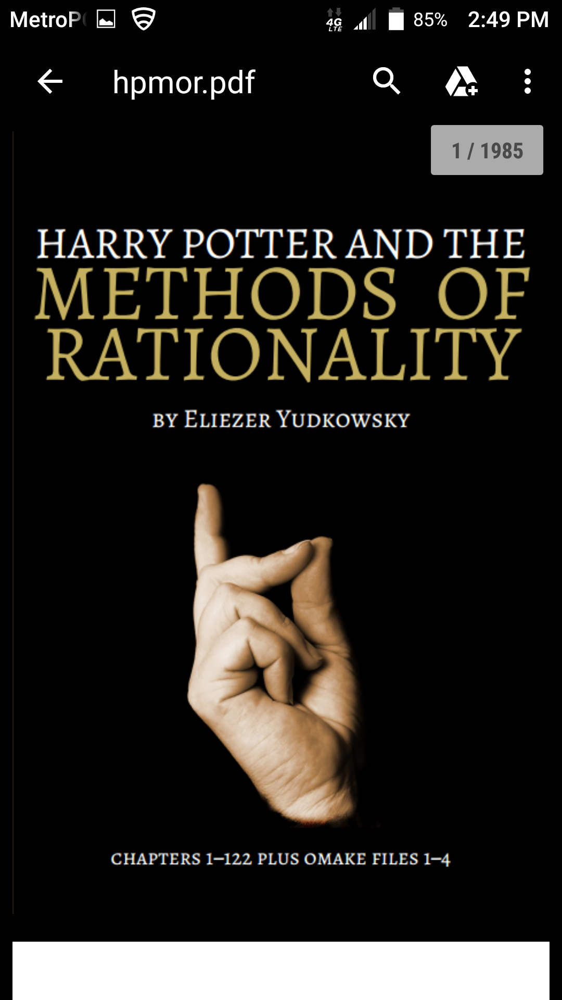
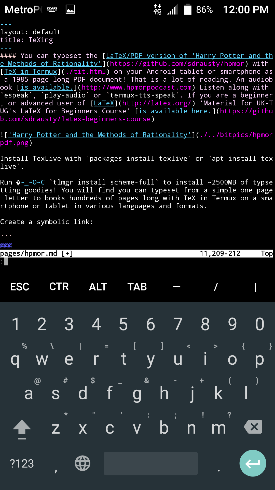

#### You can typeset the [LaTeX/PDF version of 'Harry Potter and the Methods of Rationality'](https://github.com/sdrausty/hpmor) with [TeX in Termux](./tit.html) on your Android tablet or smartphone as a 1985 page long PDF document! That is a lot of reading. An audiobook [is available.](http://www.hpmorpodcast.com) Listen along with `espeak`, `play-audio` or `termux-tts-speak`. If you are a beginner, or advanced user of [LaTeX](http://latex.org/) 'Material for UK-TUG's LaTeX for Beginners Course' [is available here.](https://github.com/sdrausty/latex-beginners-course)



Install TexLive with `packages install texlive` or `apt install texlive`. 

Run 🏃 `tlmgr install scheme-full` to install ~2500MB of typsetting goodies! You will find you can typeset from a simple one page letter to books hundreds of pages long with TeX in Termux on a smartphone or tablet in various languages and formats.

Create a symbolic link:

```
ln -s /data/data/com.termux/files/usr/opt/texlive/2016/bin/custom/xetex /data/data/com.termux/files/usr/opt/texlive/2016/bin/custom/xelatex
```
Copy the source code of this book to your device:

```
$ git clone https://github.com/sdrausty/hpmor
```

Change directory:

```
$ cd hpmor/
```

Use `make` to build this pdf:

```
$ make
```

There are missing programs from Texlive, issue [#966](https://github.com/termux/termux-packages/issues/966) in Termux. More about TeXlive in [Termux 😀 😊😋⛵ is here.](https://github.com/termux/termux-packages/issues?utf8=✓&q=texlive)  Can you help with enabling these programs on your tablet or smartphone? Then please contribute.

<!---
- [TeX in Termux](./tit.html)

->

- [Build Your Books with TexLive!](https://www.tug.org/texlive/)

### When you press the `volumeDown+power` buttons simultaneously on a smartphone, it takes a screenshot like this one of [the source code for this page](https://raw.githubusercontent.com/sdrausty/sdrausty.github.io/master/pages/hpmor.md) in [vim](http://www.vim.org/) running in [Termux](./asac.html) on [Android.](https://source.android.com/)



#### This animation was created with [imagemagick](https://www.imagemagick.org/) in [Termux](./asac.html) on an Android smartphone.


If you're confused by this page try [this link,](http://tldp.org/) or you might want to try [this one.](https://www.debian.org/doc/) Post your what you have found at [the wiki for this website](https://github.com/sdrausty/sdrausty.github.io/wiki) and [donate](./donate.md) to let [sdrausty.github.io](https://sdrausty.github.io/) grow.

[Up One Level](./tit.html)

[Up Two Levels](./../)
