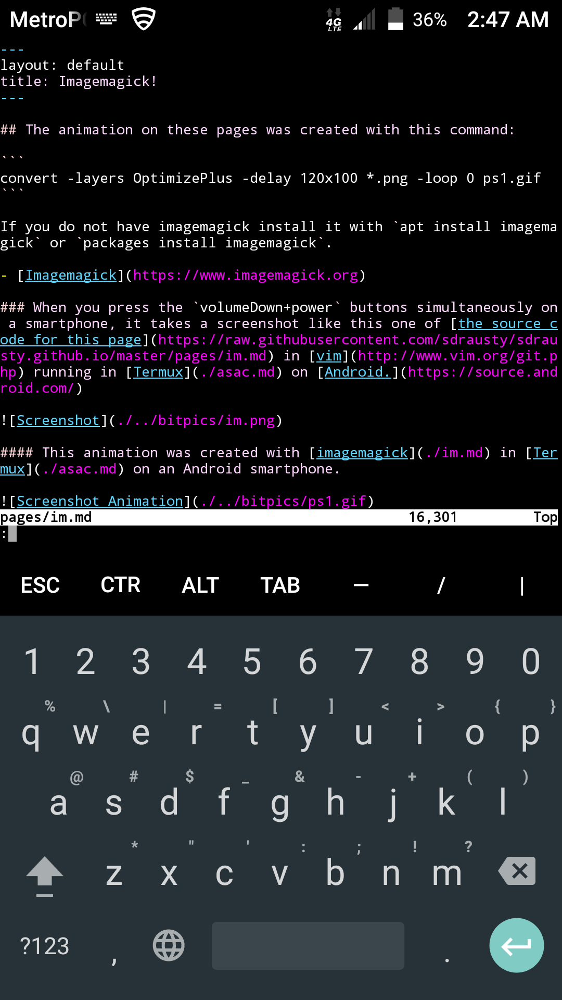

## The animation on these pages was created with this command: 

```
convert -layers OptimizePlus -delay 120x100 *.png -loop 0 ps1.gif
```

If you do not have imagemagick, install it with `apt install imagemagick` or `packages install imagemagick`.

- [Imagemagick](https://www.imagemagick.org/)

### When you press the `volumeDown+power` buttons simultaneously on a smartphone, it takes a screenshot like this one of [the source code for this page](https://raw.githubusercontent.com/sdrausty/sdrausty.github.io/master/pages/im.md) in [vim](http://www.vim.org/git.php) running in [Termux](./asac.md) on [Android.](https://source.android.com/)



#### This animation was created with [imagemagick](./im.md) in [Termux](./asac.md) on an Android smartphone.


If you're confused by this page try [this link,](http://tldp.org/) or you might want to try [this one.](https://www.debian.org/doc/) Post your what you have found at [the wiki for this website](https://github.com/sdrausty/sdrausty.github.io/wiki) and [donate](./donate.md) to let [sdrausty.github.io](https://sdrausty.github.io/) grow.

- [Termux for Android!](https://termux.com/)

- [Termux on F-droid!](https://f-droid.org/packages/com.termux/)

[Up One Level](./../)
