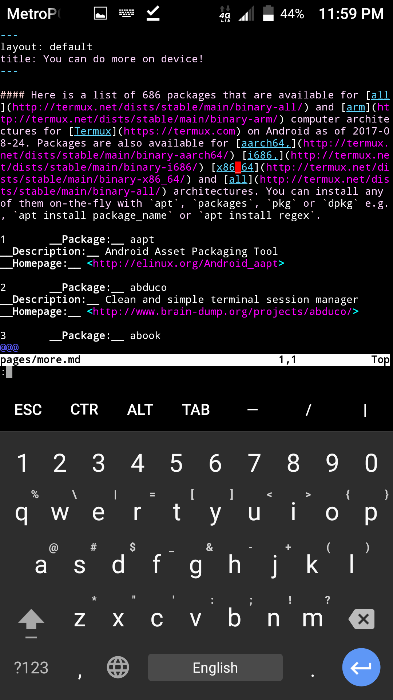

### When you press and momentarily hold the `volumeDown+power` buttons simultaneously on a smartphone, it takes a screenshot much like this one which shows the screen and the [the source code for this page](https://raw.githubusercontent.com/sdrausty/sdrausty.github.io/master/pages/more.md) in [vim](http://www.vim.org/git.php) running in [Termux](https://termux.com) on [Android.](https://source.android.com/)

#### This animation was created with [imagemagick](https://www.imagemagick.org/) in [Termux](https://termux.com) on an Android smartphone.

If you're confused by this page try [this link](http://tldp.org/) or you might want to try [this one](https://www.debian.org/doc/). Post your what you have found at [the wiki for this website](https://github.com/sdrausty/sdrausty.github.io/wiki) and [donate](../pages/donate.md) to let [sdrausty.github.io](https://sdrausty.github.io/) grow.

[Up One Level](./../)
