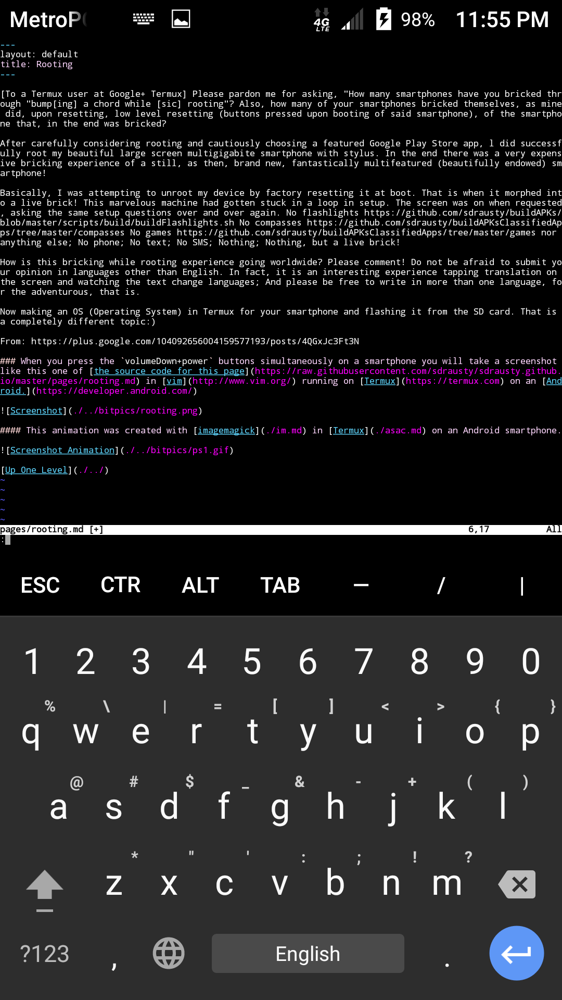

[To a Termux user at Google+ Termux] Please pardon me for asking, "How many smartphones have you bricked through "bump[ing] a chord while [sic] rooting"? Also, how many of your smartphones bricked themselves, as mine did, upon resetting, low level resetting (buttons pressed upon booting of said smartphone), of the smartphone that, in the end was bricked?

After carefully considering rooting and cautiously choosing a featured Google Play Store app, l did successfully root my beautiful large screen multigigabite smartphone with stylus. In the end there was a very expensive bricking experience of a still, as then, brand new, fantastically multifeatured (beautifully endowed) smartphone!

Basically, I was attempting to unroot my device by factory resetting it at boot. That is when it morphed into a live brick! This marvelous machine had gotten stuck in a loop in setup. The screen was on when requested, asking the same setup questions over and over again. No flashlights https://github.com/sdrausty/buildAPKs/blob/master/scripts/build/buildFlashlights.sh No compasses https://github.com/sdrausty/buildAPKsClassifiedApps/tree/master/compasses No games https://github.com/sdrausty/buildAPKsClassifiedApps/tree/master/games nor anything else; No phone; No text; No SMS; Nothing; Nothing, but a live brick!

How is this bricking while rooting experience going worldwide? Please comment! Do not be afraid to submit your opinion in languages other than English. In fact, it is an interesting experience tapping translation on the screen and watching the text change languages; And please be free to write in more than one language, for the adventurous, that is.

Now making an OS (Operating System) in Termux for your smartphone and flashing it from the SD card. That is a completely different topic:)

From: https://plus.google.com/104092656004159577193/posts/4QGxJc3Ft3N

### When you press the `volumeDown+power` buttons simultaneously on a smartphone you will take a screenshot like this one of [the source code for this page](https://raw.githubusercontent.com/sdrausty/sdrausty.github.io/master/pages/rooting.md) in [vim](http://www.vim.org/) running on [Termux](https://termux.com) on an [Android.](https://developer.android.com/)

#### This animation was created with [imagemagick](./im.md) in [Termux](./asac.md) on an Android smartphone.

[Up One Level](./../)
