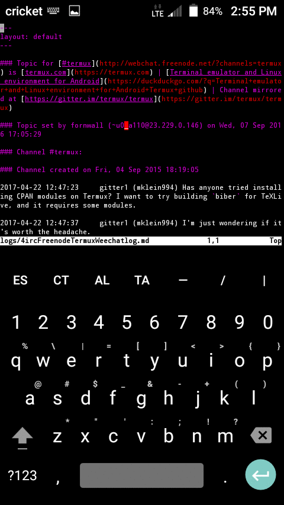

# What Do You Do With Termux?

LaTeX and git can build books like the ones here at [https://github.com/sdrausty?tab=repositories](https://github.com/sdrausty?tab=repositories) on a smartphone.

Some other uses for Termux: 

- [https://www.google.com/search?q=lynx+browser](https://www.google.com/search?q=lynx+browser)

- [https://www.google.com/search?q=clang+termux](https://www.google.com/search?q=clang+termux)

- [https://duckduckgo.com/?q=clang+termux](https://duckduckgo.com/?q=clang+termux)

- [https://duckduckgo.com/?q=imagemagick](https://duckduckgo.com/?q=imagemagick)

- [https://duckduckgo.com/?q=openssh](https://duckduckgo.com/?q=openssh)

- [https://duckduckgo.com/?q=youtube-dl](https://duckduckgo.com/?q=youtube-dl)

There some others from [http://termux.net/dists/stable/main/](http://termux.net/dists/stable/main/) and others that build on device...

- [Termux on reddit](https://duckduckgo.com/?q=termux+site%3Areddit.com)

- [What Do You Do With Termux? - on reddit](https://www.reddit.com/r/linux/comments/66fh4f/what_do_you_use_termux_on_android_for/)

- [Please Search: What Do You Do With Termux? - on google+](https://plus.google.com/communities/101692629528551299417)

- [Please Ask: What Do You Do With Termux? - on irc@freenode#termux](http://webchat.freenode.net/?channels=termux)

- [Chat about: What Do You Do With Termux? - on gitter](https://gitter.im/termux/termux)

### When you press the `volumeDown+power` buttons simultaneously on a smartphone you will take a screenshot like this one of [the source code for this page](https://raw.githubusercontent.com/sdrausty/sdrausty.github.io/master/pages/tf.md) in [vim](http://www.vim.org/git.php) running on [Termux](https://termux.com) on an [Android](https://developer.android.com/) [platform](https://www.google.com/search?q=platform+technology).

#### This animation was created with [imagemagick](https://www.imagemagick.org/) in [Termux](./pages/asac) on an Android smartphone.

If you're confused by this page try [this link,](http://tldp.org/) or you might want to try [this one.](https://www.debian.org/doc/) Post your what you have found at [the wiki,](https://github.com/sdrausty/sdrausty.github.io/wiki) [donate](./pages/donate.md) and help [this website grow!](https://sdrausty.github.io/)

[Up One Level](./../)
