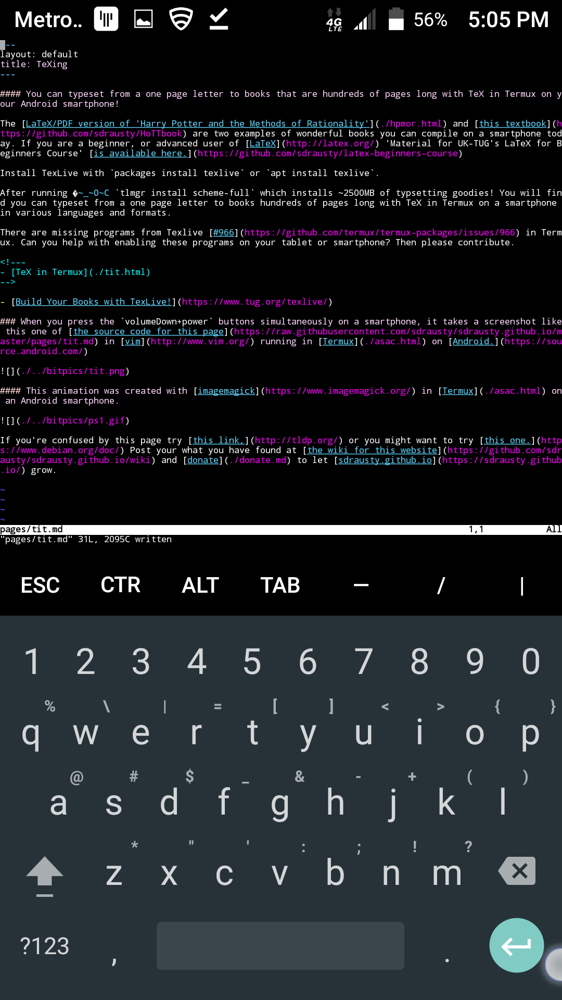

#### You can typeset from a one page letter to books that are hundreds of pages long with TeX in Termux on your Android smartphone!

The [LaTeX/PDF version of 'Harry Potter and the Methods of Rationality'](./hpmor.html) and [this textbook](https://github.com/sdrausty/HoTTbook) are two examples of wonderful books you can compile on a smartphone today. If you are a beginner, or advanced user of [LaTeX](https://latex.org/forum/) 'Material for UK-TUG's LaTeX for Beginners Course' [is available here.](https://github.com/sdrausty/latex-beginners-course) 

Install TexLive with `packages install texlive` or `apt install texlive`. 

After running 🏃 `tlmgr install scheme-full` which installs ~2500MB of typsetting goodies! You will find you can typeset from a one page letter to books hundreds of pages long with TeX in Termux on a smartphone in various languages and formats.

There are missing programs from Texlive [#966](https://github.com/termux/termux-packages/issues/966) in Termux. Can you help with enabling these programs on your tablet or smartphone? Then please contribute.

<!---
- [TeX in Termux](./tit.html)
-->

- [Build Your Books with TexLive!](https://www.tug.org/texlive/)

### When you press the `volumeDown+power` buttons simultaneously on a smartphone, it takes a screenshot like this one of [the source code for this page](https://raw.githubusercontent.com/sdrausty/sdrausty.github.io/master/pages/tit.md) in [vim](http://www.vim.org/git.php) running in [Termux](./asac.html) on [Android.](https://source.android.com/)

#### This animation was created with [imagemagick](https://www.imagemagick.org/) in [Termux](./asac.html) on an Android smartphone.

If you're confused by this page try [this link,](http://tldp.org/) or you might want to try [this one.](https://www.debian.org/doc/) Post your what you have found at [the wiki for this website](https://github.com/sdrausty/sdrausty.github.io/wiki) and [donate](./donate.md) to let [sdrausty.github.io](https://sdrausty.github.io/) grow.

[Up One Level](./../)
